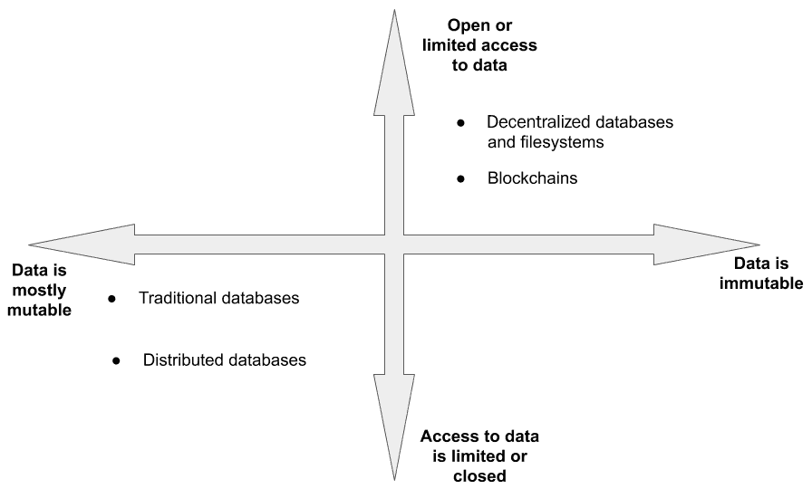
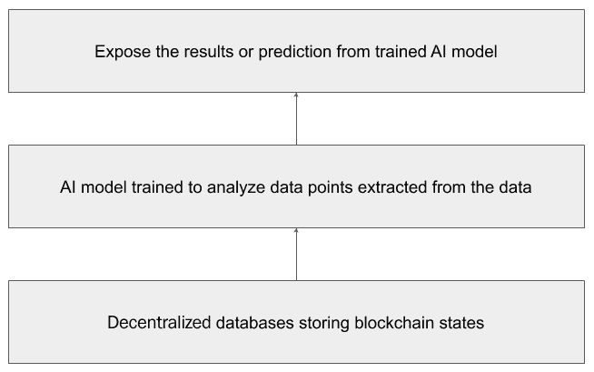
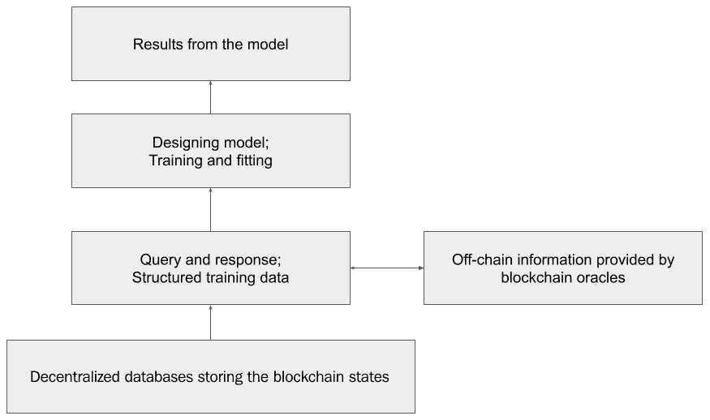
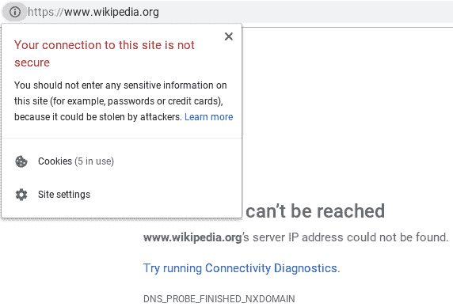
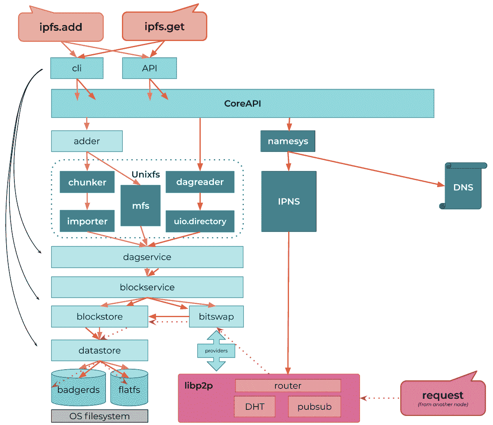

# 第七章

AI 和区块链驱动的数据库*“从价值存储...到存储的价值”*

数据库一直是应用程序开发中的关键组成部分，在网络的各个时代都是如此。尽管数据库的出现始于集中式设计模式，但在过去的三十年中已经有了多次创新的迭代。这些新模式解决了集中式数据库的关键痛点。

在本章中，我们将深入探讨基于创新设计模式的新一代分布式数据库和文件系统。其中一些设计模式启发了传统应用程序融合**人工智能**（**AI**）和区块链技术。我们将观察不同类型的分布式数据库，并了解它们如何在区块链旁边协助进行更好的 AI 分析。

在本章中，我们将涵盖以下主题：

+   集中式与分布式数据

+   区块链数据——AI 分析的大数据

+   全球数据库

+   DAO 中的数据管理

+   新一代数据库解决方案的新兴模式

# 技术要求

本章假设您熟悉数据库设计的基础知识以及 AI 技术在相关场景中的应用。

# 集中式与分布式数据

自 20 世纪 60 年代中期以来，数据库从最早期的应用程序开始主要以集中式方式被使用。数据库旨在为用户或客户端应用程序提供所请求的信息的**直接** **访问**。这种集中式方法主要受早期引入的客户端-服务器架构的影响。这种设计范式在市场上广泛受到追随，成功的商用和消费级数据库产品如 DB2 和 dBASE 分别采用了这种设计模式。基于关系数据库管理系统（**RDBMS**）的数据库遵循了客户端-服务器模型。这些集中式数据库通过定期在磁盘和磁带上制作数据副本来管理数据冗余。

然而，2000 年代 NoSQL 的出现被认为是分布式数据库的开端，它具有横向扩展、更高的容错性和更低的数据损坏几率。NoSQL 数据库能够在没有模式的情况下管理数据，并在多个节点之间实现快速操作，同时保持合理的数据一致性。相比之下，关系数据库管理系统需要模式，并在客户端和服务器之间维护点对点的关系。备份对客户端不可见，如果发生潜在的数据丢失，必须由数据库管理员发起回滚来读取任何潜在丢失的数据。较新的基于 NoSQL 的数据库，如 MongoDB，解决了其中一些问题。

基于 NoSQL 的数据库也可以通过将业务数据持久保存在由所有倡议方主持的计算机网络上，支撑伪分散项目，但这种设置的主要局限性在于这些数据库缺乏透明的记录保留。此外，这些数据库不允许在具有网络固有的加密安全性的情况下进行投票和执行业务逻辑。为了能与区块链竞争，必须在外部构建这些功能。

在掌握了关于集中式和分布式数据库的重要背景信息后，让我们在下一节中了解使用分散式数据库的动机。

## 使用分散式数据库的动机

过去三十年来，互联网上的大多数用户数据都以集中式或分布式方式存储。这两种方法的共同问题是很少有利益相关者管理和有时*拥有*所有数据。最近一些知名社交网络网站和在线聚合服务的数据泄露和滥用事件凸显了我们已不再掌控自己数据的事实。数据的草率管理可能导致这样有害的事件，并在用户和业务利益相关者中造成恐慌。

在过去几年中，多起数据泄露和滥用事件的发生促使人们对如何定义、存储、访问和管理数据进行根本性创新。在过去十年里，这促使全球许多个人和组织建立了分散式数据库。

分散式数据库的常见属性如下所述：

+   允许任何人在跨界存储和访问信息

+   允许任何人参与持久化数据

+   持久保存更新后的数据并以可追踪的方式记录对数据所做的更改

+   允许所有用户通过促进加密数据的持久化来控制和管理他们的数据

这些价值与传统数据库有很好的代表性，并与下图所示的传统数据库形成对比：

图 4.1：比较传统数据库模式与分散式数据库模式的价值

在前面的图表中，我们可以看到代表访问业务数据或用户数据模式的*y*轴。沿着*x*轴，数据的可变属性被表示出来。第一象限定义了数据是否是不可改变的并且可被大众访问。第三象限定义了数据是否是可变的并且对大众不可访问。正如我们从前述图表中所看到的那样，分散式数据库和文件系统属于第一象限。我们还可以看到大多数传统和分布式数据库属于第三象限。

不可变性并不意味着永久性——提供不可变性的去中心化数据库可能不会永久存储所有版本的更改。数据可能会被垃圾收集，最近的更改可能会被持久化。

通过对去中心化数据库的动机和其价值的基本信息了解，现在让我们对比数据管理技术并分析消费模式。

## 对比和分析

去中心化数据库以一种新的方式组织信息，通过允许用户指定数据存储位置以及有效的治理，使用户重新获得了控制权。

在我们进一步分析在 Web 2.0 和 Web 3.0 中使用数据库之前，让我们总结一下所有三种类型数据库（集中式、分布式和去中心化数据库）之间的主要区别，如下表所示：

|  | **集中式数据库** | **分布式数据库** | **去中心化数据库** |
| --- | --- | --- | --- |
| **所有权** | 由一家公司拥有和托管。 | 一家或多家公司可以托管数据库。 | 任何拥有足够系统资源的人都可以加入和托管数据库。 |
| **数据定义** | 大多数集中式数据库都是基于 RDBMS 的，因此数据定义是强制性的。必须使用模式来存储数据。 | 大多数分布式数据库都是基于 NoSQL 的，因此数据定义不是强制性的。模式是可选的。 | 大多数去中心化数据库使用内容寻址，因此不需要模式来存储数据。 |
| **故障** | 单点故障。应用程序与数据库之间的点对点连接将无法工作，直到数据库被修复为止，应用程序无法运行。 | 没有单点故障。如果数据库无法提供来自一个节点的信息，应用程序可以从另一个节点读取。 | 没有单点故障。如果数据库无法提供来自一个节点的信息，应用程序可以从另一个节点读取。 |
| **冗余管理** | 数据的备份存储在磁盘和磁带上，安全地保存在物理位置上。 | 数据的复制是固定的，并且所有节点可能都遵守数据库管理员设置的复制策略。 | 在公共网络中没有复制策略。只有在激励的情况下才有复制保证。然而，在用于财团的许可去中心化数据库中可以建立政策。 |
| **访问和透明度** | 与数据库的连接是关闭的。只有专用应用程序可以使用凭据访问数据库。 | 与数据库的连接既不关闭也不开放，但是它是有权限的。只有获准的应用程序才能访问数据库。 | 用户可以公开访问数据，只需文件或数据的哈希。关心隐私的用户需要在存储数据之前加密数据。 |

在前述表格中进行对比后，分析继续进行如下。

在 Web 的第二代（Web 2.0）中，应用程序主要依赖于集中式和分布式数据库来利用市场中的新燃料，即**用户信息**。 经过多次数据泄露、丑闻和数据滥用的报道后，互联网公民对数据存储位置以及应用程序应该具备的控制程度更加警惕。

随着我们进入 Web 3.0，大多数分布式应用程序可能不考虑使用传统数据库，因为它们不支持分布式数据库的属性。 此外，重要的是要意识到，各个领域在 Web 2.0 上运行的一些传统应用程序正在考虑使用分布式数据库，以确保满足来自有意识用户的新需求。

理解了 Web 2.0 和 Web 3.0 之间的基本差异后，现在让我们了解如何使用分布式数据库上持久化的数据来执行分析。

# 区块链数据 - 供 AI 分析的大数据

正如您可能已经了解的，由于其交易性质，区块链生成了大量数据。 撰写本文时，一些知名区块链网络的大小如下：

| **区块链** | **区块链的总大小（GB）（约）** |
| --- | --- |
| 比特币 | 323 |
| 以太坊 | 4,233 |

业内一些专家推测，由于用户数量的增加和企业间网络（**B2B**）中公共网络的采用，区块链的规模将增长 10 倍。

区块链数据的不断增长为数据科学开辟了新的增长途径。 在区块链中对这一庞大的交易数据进行人工智能和分析实践的应用可以对大多数当前的区块链产品产生巨大影响。 来自诸如区块链之类的合格数据源的分析也可以引导新的数字转型项目。 为了促进这一点，我们需要一个可以持久保存用户数据、企业数据以及区块链生成的交易数据的辅助信息来源。 分布式数据库可以以加密安全和可验证的方式保存这些数据。

以下图表描述了 AI 模型如何利用分布式数据库：

图 4.2：使用分布式数据库进行 AI 建模的通用示例

如前图所示，存储在分布式数据库上的数据有资格用于训练适当的 AI 模型。 存储在分布式数据库上的大多数交易数据本质上都可以被视为数据点，这意味着交易是由用户钱包签名并具有意图的。 因此，这些交易的性质并不是微不足道的。 当使用这些交易数据训练适当的 AI 模型时，它们可以产生更好的结果。 使用这些合格数据训练的 AI 模型生成的结果可以在各种系统和应用程序中使用。

现在让我们探讨一下通过使用去中心化数据库可能实现的改进。

## 使用去中心化数据库构建更好的 AI 模型

随着更多的数据即将驻留在区块链上，可以安全地假设 AI 建模变得更容易且更符合伦理。通过使用私钥确认的交易数据和用户支付的费用，可以增强 AI 训练。这些数据不需要从第三方继承，而是可以从以太坊等区块链和次级去中心化数据库网络（如**星际文件系统**（**IPFS**））中访问。这也使得当前模型，例如预测性分析模型，在有效地检测欺诈企图和 Sybil 攻击方面具有更强大的能力。

## 数据的不可变性 - 增加对 AI 训练和测试的信任

清洁结构化数据近十年来一直受到数据科学的需求。在数据丑闻之际，由于遵循一些跨境数据托管规则的合规问题，获取合法访问完美数据几乎总是很复杂的。通过使用区块链，一个**公钥基础设施**（**PKI**）自然地来到我们的救援，通过数据供应商和用户之间的联合签名保护用户数据的隐私。这可能作为**同意证明**，并在人工智能行业中保持责任感，以构建准确但符合伦理的模型。

## 更好地控制数据和模型交换

诸如 Ocean Protocol 这样的项目，在接下来的部分将会讨论，一直积极致力于建立公平开放的数据市场，既为数据提供者，又为消费者。区块链使得这些交易或数据的购买可以在不自觉地泄露隐私元素的情况下以道德方式进行。

现在让我们在以下部分中探讨更多关于区块链分析的细节。

## 区块链分析

公共区块链上的大多数应用都是基于网络实现的交易透明度而获得价值的。最近，这一支持功能已经被各种机构利用，从盈利实体到执法机构，用于跟踪用户行为。虽然一些分析能力有助于社会，但许多其他能力被各种规模的企业视为战略性**知识产权**（**IP**），通过使用这些智能算法来提高**用户体验**（**UX**）以获取市场份额。

回顾起来，区块链分析实践也受到了不受欢迎的批评，认为它们通过深入挖掘交易对用户隐私的影响过大。Chainanalysis、Neutrino 和 Elliptic 是这一领域的早期开拓者，他们拥有积极的社区和客户群体。

在下图中，我们可以观察到区块链预言机和去中心化数据库的应用，以有效地运行模型：

图 4.3：使用预言机的区块链数据分析

现在让我们在下一节中更深入地探讨全球分散式数据库。

# 全球数据库

在本节中，您将了解一些最受欢迎的分散式数据库。这些数据库使用创新的加密和网络技术来解决一些关键问题，如审查、监视和许可访问机密信息。下文所概述的项目正在努力为公共领域和企业领域的数据处理带来新秩序。

现在让我们了解一些顶级的全球分散式数据库。

## IPFS

**IPFS**是一种允许用户以**点对点**（**P2P**）方式托管和接收内容的分布式文件系统，消除了存储或访问来自世界各地任何角落数据的中间商。IPFS 允许用户以无法审查的方式存储和提供数据。只要网络中的某人重视数据，数据就会持续存在于网络中。尽管对于在其计算机上持续数据的用户可能没有经济动机，但数据对网络中的其他用户可能具有价值且可重复使用。因此，在 IPFS 上的数据可以永远进行虚拟托管，只要网络中存在对数据的需求。值得注意的是，IPFS 已被 DApp 开发人员之一视为许多*事实上*分散式数据库之一，用于其应用程序。在 IPFS 上由任何人访问的内容都经过了加密验证，确保信息没有被篡改。

IPFS 已被用于许多情况下以规避透明度方面的挑战，其中全球信息的访问受到了阻碍。以下列举了 IPFS 作为全球数据库的一些显著用途：

+   2017 年加泰罗尼亚独立公投文件在 IPFS 上进行了主机托管，绕过了加泰罗尼亚高等法院封锁原始网站的命令。

+   **Filecoin**，一个分散式存储网络，利用 IPFS 来利用计算机中未使用的存储空间，并鼓励用户以费用托管数据。通过小额支付以 Filecoin 代币的形式收取用户的费用，以便从托管计算机中提供较小的数据块。这些代币通过智能合约支付给托管数据的计算机所有者。据报道，Filecoin 曾是有史以来最大的**ICO**之一，总额达 2.5 亿美元。

+   维基百科在 2017 年 4 月 29 日无法在土耳其访问时在 IPFS 上进行了镜像。这种规避提供了对维基百科的访问，而无需访问被屏蔽的官方网站。

以下截图显示了维基百科在土耳其无法访问的情况：

图 4.4：2017 年 4 月 29 日，无法在土耳其访问维基百科页面的截图

你可以在以下链接查看 Chidgk1 提供的这张截图：[`upload.wikimedia.org/wikipedia/commons/1/18/Wikipedia_from_Turkey_in_Chrome.png`](https://upload.wikimedia.org/wikipedia/commons/1/18/Wikipedia_from_Turkey_in_Chrome.png)。这是截图的许可证，[`commons.wikimedia.org/wiki/File:Wikipedia_from_Turkey_in_Chrome.png`](https://commons.wikimedia.org/wiki/File:Wikipedia_from_Turkey_in_Chrome.png)。

以下图示展示了 IPFS 的内部组件以及它们之间提供存储和访问数据的依赖关系：

图 4.5：IPFS 的所有内部组件和依赖关系

你可以使用以下缩短链接查看这张图示：[`git.io/Jf03g`](https://git.io/Jf03g)。

要了解更多关于 IPFS 支持的底层协议，请访问 IPFS 的官方文档，网址为 [`docs.ipfs.io/`](https://docs.ipfs.io/)。

在基本了解 IPFS 的基础上，现在让我们来了解 MóiBit。

## MóiBit

**MóiBit** 是一个具有不可变性和区块链系统来源证明能力的个人去中心化安全存储网络。它提供了软件定义的去中心化文件存储服务，并采取了突破性的措施来降低在区块链上存储数据的不必要成本，然而应用程序可以将其数据存储在 IPFS 提供的可靠安全环境中。简而言之，MóiBit 将一些企业功能扩展到 IPFS，从而使应用程序能够快速开发并集成到 MóiBit 中，就像你将应用程序与云数据库集成一样。

与 IPFS 不同，MóiBit 通过部署一组无法被公共网络发现和使用的节点提供了许可网络。这使企业能够专用基础设施，并与他们的利益相关者以联邦方式享受 IPFS 的技术优势。MóiBit 还通过其**软件开发工具包**（**SDK**）支持客户级别的加密和许多其他灵活功能。

要了解更多关于 MóiBit，请访问官方网站 [`www.moibit.io/`](https://www.moibit.io/)。MóiBit API 文档也可在 [`apidocs.moibit.io/`](https://apidocs.moibit.io/) 上找到。

## Solid

Solid 是互联网时代三个强大词汇的巧妙组合—**社交链接数据**。Solid 是一个去中心化的数据存储，融合了一些去中心化的关键概念，如身份、用户数据的所有权、与应用程序的无缝集成，并提供向后兼容性。值得注意的是，该项目由**万维网**（**WWW**）的发明者蒂姆·伯纳斯-李爵士领导。Solid 旨在通过 P2P 网络和链接数据的强大组合让用户重新获得对其数据的控制。

所有与用户相关的数据都存储在**个人在线数据存储库**（**POD**）中。POD 可以托管在个人电脑上、本地服务器上，或者是云中管理的**虚拟机**（**VM**）上。这个决定由用户自行决定。依赖用户信息的应用需要用户的主动同意才能访问个人数据。一些个人数据的例子包括健康记录、财务信息等。

欲了解更多关于 Solid 的信息，请访问官方网站：[`solidproject.org/`](https://solidproject.org/)。Solid 的详细规范也可在[`github.com/solid/specification`](https://github.com/solid/specification)找到。

## Ocean Protocol

**Ocean Protocol**是一个具有为用户提供存储和计算服务的去中心化协议。该协议展示了一个信任框架，提供了以安全方式共享用户数据的服务，通过可追溯性和隐私来实现。与之前讨论的全球数据库类似，用户可以对其个人数据进行细粒度控制。简而言之，用户可以提供对其数据的访问并赚取收入，而消费者通过购买数据来访问数据。

值得注意的是，Ocean Protocol 还提供了许多第三方市场和服务，允许用户商业化其数据。这意味着有兴趣的节点可以通过同意成为数据提供者并从数据消费者那里获得收入。所有这些商业活动都是通过保管者智能合约实现的。数据市场和服务由一个提供计算、存储空间和同意用户数据出售的代币化层支持。

欲了解更多关于 Ocean Protocol 的信息，请访问官方网站：[`oceanprotocol.com/`](https://oceanprotocol.com/)。Ocean Protocol 的详细文档也可在[`docs.oceanprotocol.com/`](https://docs.oceanprotocol.com/)找到。

## Storj

**Storj**，发音为*storage*，是一个去中心化的云存储平台，声称没有审查，没有用户监控或停机。Storj 平台通过 Storj API 为普通用户和开发人员提供服务。该平台由 Storj 协议提供支持，这是一个 P2P 存储智能合约，其中愿意共享未使用存储量的供应商可以以一定价格将其系统的存储租给任何 Storj 客户，而不需要彼此了解。一旦就存储的价格达成共识的合约签署后，该合约定期监视主机中的信息是否仍然可用。存储主机可以通过可验证的加密证明回应，以确保合约中的数据按约定提供。如果回应有效，则用户向节点所有者支付费用，所有这些都是通过智能合约自动完成的。

Storj 还拥有一组愿意通过复制和提供相同数据来帮助存储主机的节点网络，以期望获得奖励。 这为较小的存储提供商的自由市场开辟了巨大潜力。 与其他云数据服务提供商类似，Storj 还为开发人员提供 API，以便以灵活的方式以较低的价格将其应用程序与 Storj 集成，与大多数传统供应商的复杂锁定合同相比，存储应用程序和用户数据。

要了解更多关于 Storj 的信息，请访问官方网站 [`storj.io/`](https://storj.io/)。Storj 的详细文档也可在 [`documentation.storj.io/`](https://documentation.storj.io/) 上找到。

## Swarm

**Swarm** 是以太坊原生的分布式数据存储平台。 Swarm 项目的目的是促进以太坊历史公共数据的持久性，并为 DApps 提供存储。 与以太坊网络类似，Swarm 还允许任何人通过集中存储资源参与网络。 作为回报，Swarm 网络中托管节点的个人将获得**以太币** (**ETH**) 代币，作为奖励，以换取他们的基础设施。

Swarm 声称其 P2P 存储网络具有**分布式拒绝服务** (**DDoS**) 抵抗能力和容错性，以及无法审查性。 其协议，类似于 `http://`，由 `bzz://` 表示。 用户可以通过 Swarm 公共网关访问网络。 Swarm 依赖蓬勃发展的以太坊网络进行采用和增长。

要了解更多关于 Swarm 的信息，请访问官方网站 [`swarm.ethereum.org/`](https://swarm.ethereum.org/)。Swarm 的详细文档也可在 [`swarm-guide.readthedocs.io/en/latest/`](https://swarm-guide.readthedocs.io/en/latest/) 上找到。

# DAO 中的数据管理

**去中心化自治组织** (**DAO**) 是代表一组利益相关者和实体的计算机程序，并不受外部环境影响。 DAO 由一组规则和治理协议编程，以确保各方之间的交易发生而没有任何冲突的机会。 Dash 和 BitShares 是一些最早的 DAO 实现。 在过去的几个月里，许多 DAO 已经在以太坊和比特币等区块链上启动。

## Aragon

**Aragon** 是在以太坊区块链网络上运行的开源 DAO。 Aragon 利用 Solidity 智能合约进行业务逻辑，并使用 IPFS 进行分散文件和治理记录管理，从而为全新一代组织创建了真正的 P2P 操作系统，称为**aragonOS**。用户可以使用**Aragon Network Token** (**ANT**)执行操作并管理他们的 DAO。

Aragon 将 IPFS 与其**命令行界面**（**CLI**）程序紧密集成。IPFS 守护进程可以通过 Aragon 的 CLI 启动，并管理钉住操作以确保关键组件和文件的可靠存储。

要了解更多关于 Aragon，请访问官方网站[`aragon.org/`](https://aragon.org/)。有关在 Aragon 中使用 IPFS 的详细文档可以在[`hack.aragon.org/docs/cli-ipfs-commands`](https://hack.aragon.org/docs/cli-ipfs-commands)找到。

## Bisq

**Bisq**是在比特币区块链网络上运行的 DAO。它提供无公司或机构控制的 P2P 加密货币交易服务。用户和贡献者对提出的更新进行投票。BSQ 代币持有者向 DAO 做出治理决定。通过以下两种方法使 Bisq DAO 变得可持续：

+   通过与 BSQ 代币持有者分享交易费用的收入分配，与贡献者共享网络的部分所有权，平衡了交易者和贡献者之间的权力。

+   通过 BSQ 代币的所有者——交易者和贡献者进行投票决策。由于他们共同负责发行，因此不存在可以帮助任何一方取得多数的集中化矢量。

在撰写本文时，Bisq 社区正在初步努力使用去中心化存储 IPFS 来托管软件二进制文件、文档、网络和交易统计数据。还提出了存储治理提案数据的建议，以确保 DAO 信息的访问始终可用，没有单点故障。

要了解更多关于 Bisq，请访问官方网站[`bisq.network/`](https://bisq.network/)。您可以在[`github.com/bisq-network/bisq/issues/2845`](https://github.com/bisq-network/bisq/issues/2845)上观察 Bisq 在使用 IPFS 方面的当前努力。

在对为什么 DAO 可以使用去中心化数据库有基本了解后，现在让我们了解一些应用于一些领域的新兴模式。

# 数据库解决方案的新兴模式

很少有公司能够同时融合技术并解决各自行业的关键问题。在本节中，我们将探讨各领域的关键问题，并探索解决它们的模式，以及理想的例子。

现在让我们来了解企业软件领域的当前问题，并探索适用的新兴模式。

## 企业

由于可扩展的系统，如**企业资源规划**（**ERP**）软件，**知识管理软件**（**KMS**）和**库存管理软件**（**IMS**）等，企业和大型组织已经成功地扩展。然而，不断增长的需求和数据管理方式的突破性革命已经导致了区块链应用和人工智能技术的发展。

### 技术障碍

企业软件领域正面临着在可靠方式中管理大量数据方面新挑战。以下是可能会使企业软件变得无关紧要的三个挑战，如果它们不会尽快解决的话。

+   **数据保护：** 许多 ERP 软件架构将组织的信息存储到一个集中的数据管理平台。还有更弱或未使用的访问管理模块的应用。这可能会导致严重风险，如内部公司间谍、恶意攻击、勒索软件或后门漏洞。据报道，我们可能记得 2017 年 5 月恶名昭彰的 WannaCry 恶意软件攻击，据称已造成英国**国民健康服务**（**NHS**）超过 5 亿英镑的损失来修复系统。类似的攻击可能很容易将目标对准 ERP 数据，潜在地影响利益相关者、组织以及长期以来一直依赖该系统的数百万消费者。

+   **互操作性和透明度：** 超过 1000 家大型组织使用 ERP 来处理他们在制造、会计、库存管理、物流、**客户关系管理**（**CRM**）和报告方面的操作。这些大型组织的操作由一个以上的软件供应商处理，因此必须实现数据互操作性。这是通过 API 和其他后端软件程序来优化这些情况的。这在组织内部在 IT 团队和运营团队之间造成了太多的复杂性，以便一起做出关键决策。

+   **报告：** 通过 ERP 系统的报告已简化管理并以集成方式进行决策。报告还可以使管理人员对运营中即将到来的趋势有良好的可见性，并指导他们做好准备。然而，缺乏透明度和清晰度可能导致思维混乱和效率低下的决策。

### 新兴模式摘要

在深入研究当前企业软件景观中的一些关键问题后，我们将观察一些处理这些问题的设计模式，利用人工智能、区块链和分散式数据库。把这些技术融合在一起是一种艺术的交响乐，其主要目标是为组织获取有意义的商业成果。人工智能应用于来自分散式数据库的数据，其溯源由区块链支持。这样的模式可以在利益相关者之间的决策中引入新的效率。

## 金融服务

金融服务和整个**银行、金融服务和保险**（**BFSI**）行业支持大多数行业的交易经济。因此，BFSI 可被视为经济的金融支柱。

### 技术障碍

以下是与 BFSI 软件相关的三个主要问题：

+   **缺乏充分的透明度**：尽管已经努力为个人和公司提供更多透明的服务，但这一流程仍需进行更多的改进。金融服务业的各种计划，如费用和贷款申请的状态，是一些日常活动，金融服务提供机构提供更多透明度可能会吸引更多顾客的忠诚追随。

+   **结算延迟**：尽管企业和个人都在积极尝试和采用新技术，但金融服务业更加保守地以更频繁的方式应用新技术和做法。跨境支付和贸易交易最终导致业务流程周转时间延长。延误对企业和个人都有很大影响。

+   **错误的合规报告**：金融服务业一直是欺诈的受害者，并以不及时提供服务和报告异常而闻名。这导致当地监管机构对金融机构处以高额罚款。然而，技术应用很少被视为改变这一不利局面为行业带来积极风向的主要力量。  

### 新兴模式总结

AI 应用和区块链技术可以帮助金融服务业组织以更加透明的方式组织其风险要素，简化交易，并确保优质的客户服务。许多尝试在金融服务业组织之间分散流程，以确保用户更顺畅的体验和工作场所更高的生产力。

## 供应链管理

供应链管理完成了对于各行业利益相关者的价值交付曲线，成本可预测且具有灵活性，以响应不断变化的需求。但是，各行业垂直领域的供应链都面临着多重挑战，阻碍了利益相关者实现最佳的终端消费者价值。

### 技术障碍

关于供应链软件的三个主要问题如下：

+   **缺乏更深层次的透明度**：最近供应链领域的解决方案旨在促进实时交易，但存在关于如何持续存储如此大量交易的问题。公共区块链在长期内持久化如此大量数据是相当昂贵的。然而，使用公共区块链有助于实现最终性，并在长期内保持其完整性。私有区块链只能以较小且可预测的成本来完成相同的工作，但价值远远不及，除非联盟足够大，分布足够广泛。

+   **成本不可预测**：由于需求动态变化和不断变化的要求，供应链行业在固定成本上运营困难。尽管变量在规划过程中得到优化，但国际监管环境和气候深深影响了计划成本。这是由于在规划阶段缺乏智能所致。尽管气候条件几乎总是可预测的，但并不是所有的物流系统都有能力适应情况并以类似成本范围内的资源作出响应。除了变化的运营成本外，供应链的利益相关者在物品由于灾难或意外自然情况而丢失时也遭受到保险不足的影响。

+   **缺乏完全的灵活性**：供应链运营无法控制气候条件、监管影响和客户需求变化等外部因素。然而，保持系统足够灵活以维持和继续运营至关重要。供应链中的少数操作采用尖端技术，以确保对此处涉及的动态提供灵活支持。

### 新兴模式总结

通过人工智能、全球数据存储和区块链驱动的更智能供应链可以改进现有流程，从而实现对需求更灵活的响应，并推动新的商业价值。将交易数据迁移到诸如 IPFS、MóiBit 或 BigchainDB 等离线大规模全球数据库，可以实现网络间的异常可见性。这使得相关利益相关者能够完全看到变化的审计追踪，由区块链上的实体签名支持。通过这种方式，可以将人工智能模型应用于大量历史交易数据，以预测成本和中断，并实现灵活性。

## 医疗

医疗创新逐渐从专有药物转向开放的基于研究的倡议。通过交换关键信息，从个人健康信息到实验室检测结果，可以加强这种方法。在过去几年中，医疗数据交换实践在行业中受到严重批评。然而，值得注意的是，信息的互操作性对医疗保健行业的增长至关重要。通过互操作性，行业迎来了一系列讨论的问题。

### 技术障碍

以下是医疗软件方面的前三大问题：

+   **受控版本管理**：需要一个透明的系统，可以为医疗记录的所有更改创建快照。对健康记录的正确跟踪也是为保险索赔提供符合条件证据的一部分，从而为有效的自动化和受益患者的更好体验铺平了道路。

+   **身份问题**：在治疗或药物试验期间传播患者身份可能在生态系统中引发恐慌，并阻碍动力。因此，涉及医疗数据的身份必须严肃对待，采用成熟的方法，并由标准机构积极监管。

+   **中心化**：少数机构通过形成联盟进行健康数据交换，使行业其他部分落后。这也可能潜在地导致其他利益相关者在不久的将来创建双重标准，持续在个体隔离中存储健康数据。这些做法自然而然地有利于数据窃取、间谍行为和黑客攻击。

### 新兴模式摘要

匿名化和加密的医疗记录，以及与治疗和药物试验相关的医疗数据可以存储在去中心化数据库中，以确保所有相关利益相关者都能共同访问。此外，患者是其医疗数据的自有者。这意味着患者可以通过在区块链上签署交易来控制和限制对其个人健康信息的访问，要求接收方在尝试访问数据之前验证自己的身份。因此，这一新兴模式可以在原子级别确立隐私，以及严格执行的实践。

# 总结

在本章中，我们通过引入中心化、分布式和最后的去中心化数据库的概念，着眼于存储领域。此外，我们还对比了 Web 2.0 和 Web 3.0 应用的数据消费模式。我们还更加深入地了解了在应用和 DAO 中使用去中心化数据库的核心动机和需求。最后，在本章末尾，我们探讨了可以分析和应用的各种新兴模式。

在下一章中，我们将观察这些新兴模式如何应用于利用区块链和人工智能构建去中心化经济的智能应用。
