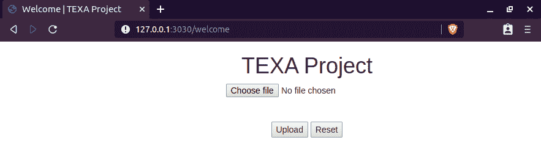
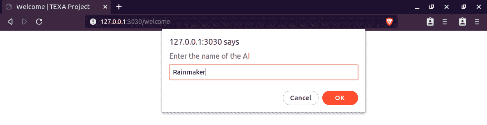
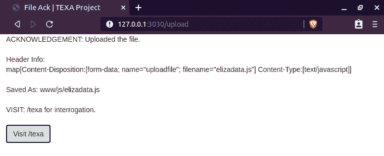
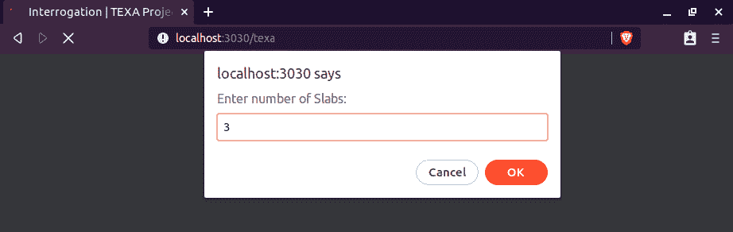
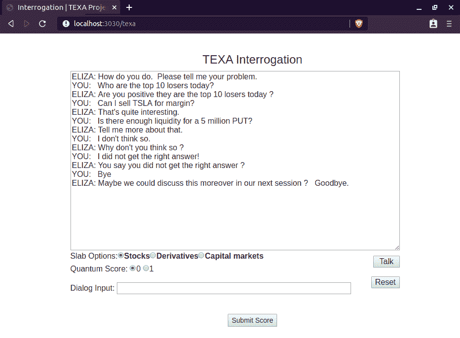
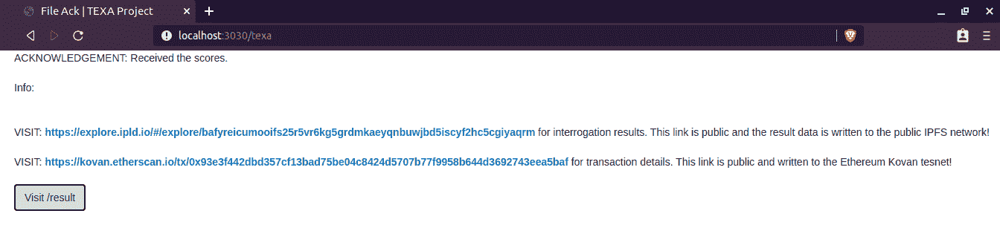
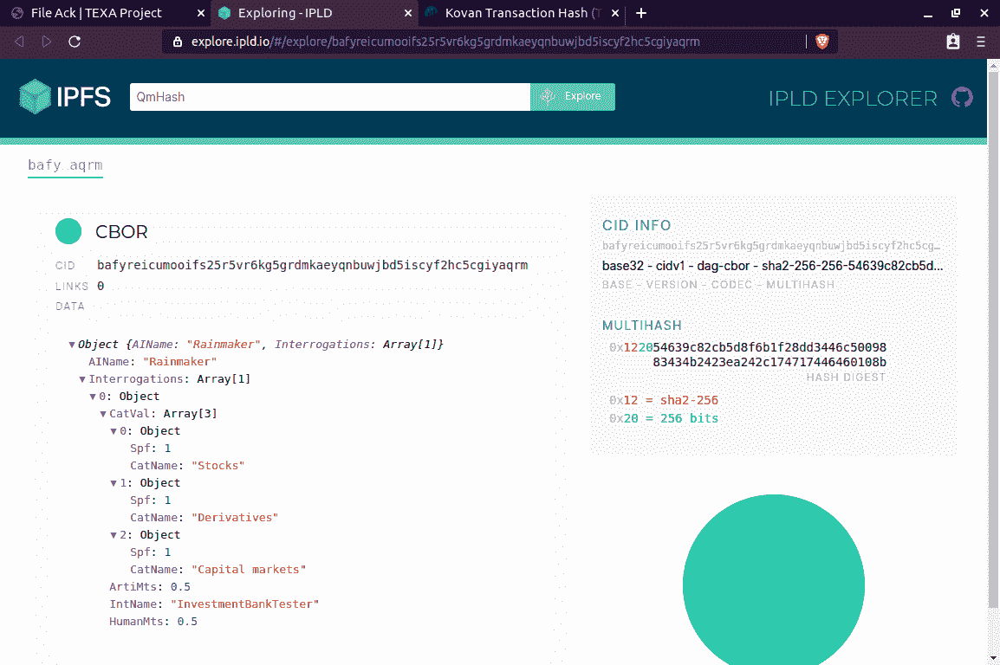
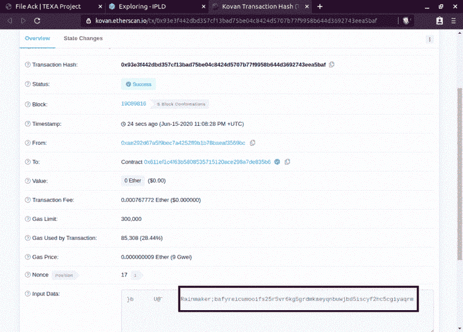
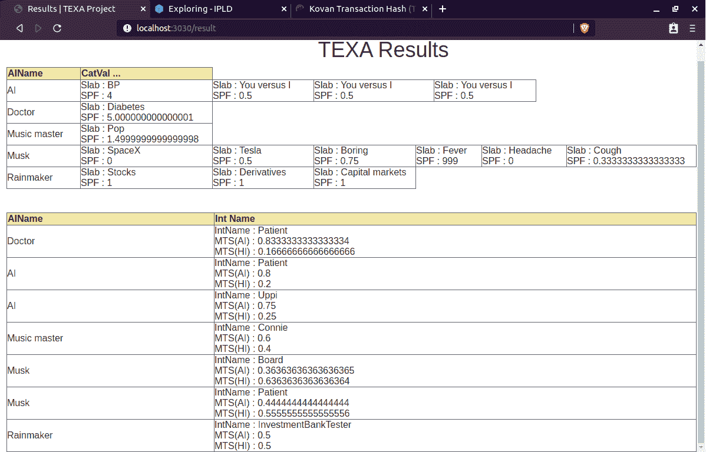

# 第五章：利用人工智能赋能区块链

*"结合信任和智能，打造更美好的互联网时代"*

本章探讨了多种方法和设计模式，通过利用**人工智能**（**AI**）模型和技术提升区块链解决方案的质量。您将看到人工智能如何与区块链结合在多个垂直领域中应用。此外，您将能够识别白色空间，采用引导方法解决它们，并通过使用区块链和人工智能设计解决方案。在本章中，我们将涵盖以下主题：

+   结合区块链和人工智能的好处

+   关于 Aicumen Technologies

+   结合区块链和人工智能在疫情管理中的应用

+   结合区块链和人工智能在社会金融中的应用

+   结合区块链和人工智能来人性化数字互动

+   人工智能的民主化与去中心化

# **结合区块链和人工智能的好处**

简而言之，使用人工智能的商业利益是降低成本，使用区块链的商业利益是使流程透明化。当两种技术一起使用时，你可以将一类新的解决方案应用于今天缺乏透明度和成本效益的各种问题。在接下来的章节中，我们将观察使用区块链和人工智能共同解决实际挑战的产品和解决方案。我认为以下产品和解决方案是使用两种技术的第一代应用程序；在下一波数字转型中可能会有更多的产品。

## **关于 Aicumen Technologies**

Aicumen Technologies（[www.aicumen.com](http://www.aicumen.com)）是一家领先的数字创新工作室，致力于通过使用区块链和人工智能构建受信任的**分散式智能应用**（**DIApps**）来赋能数字经济中的价值创造，并于 2017 年成立。

利用新兴技术提供解决方案的关键挑战之一是实施针对现实问题的有意义解决方案的能力。在诸如区块链和人工智能之类的技术变革中，这一挑战更加明显。为了应对这一挑战，Aicumen 开发了一种独特的数字重塑过程，既具有创新性又具有可行性，以利用区块链和人工智能等颠覆性技术提供有意义、有价值的商业解决方案。

数字重塑过程是一个自下而上的过程，技术上由凝聚的协议层、分散式网络、智能传输和可适应应用所定义。在整个过程中开发和使用的协议是**Krama 智能协议**（**KIP**）。像 MóiBit 和 MoiFi 这样的分散式网络是建立在 KIP 之上的，嵌入了智能传输，如**社交信任指数**（**STQ**），以创建 DIApps，如 FINETs、Tracy 和 REBECA。

这个过程也可以定制和重复使用于其他一起构成数字重塑技术栈的区块链和人工智能技术。

在接下来的章节中，你将了解到一些由 Aicumen 构建并由区块链和人工智能驱动的产品。

## **结合区块链和人工智能进行疫情管理**

最近，我们经历了一场名为**COVID-19**的新型流行病，这场流行病影响了许多人的生活。全球经济几乎停滞不前，因为人们担心感染。为了复苏我们的经济，我们需要管理当前的感染并防止它们再次发生。这对于政府、当局和公民来说是一项具有挑战性的任务，他们被期望在这些不确定时期遵守一套新规则。因此，疫情管理软件正在成为一种重要的促进经济负责任复苏的工具。

### **数字接触追踪当前问题**

虽然政府和当局正尽力借助接触追踪应用程序来管理最近的 COVID-19 大流行，但我们可以观察到一些关键问题：

+   **缺乏用户隐私**：尽管接触追踪应用程序有助于恢复正常，但用户的隐私受到严重威胁。这可能导致短期内的数据泄露，并在长期内升级为社会不平等。

+   **低质量数据**：设计不合理的接触追踪应用程序导致了低质量的数据。在一些情况下，我们还可以看到位置欺骗和其他形式的欺骗正在执行，以欺骗当局。这是可能的，因为用户缺乏**公共密钥基础设施**（**PKI**），而应用程序正在使用传统的客户端-服务器模型。

+   **验证时间延长**：使用这类应用程序收集的非结构化数据，将需要更长的时间来决定一个公民或一个社区是否处于感染风险之中。没有准确和高质量的数据点，很难决定是否对一个地区进行隔离。延迟或假阴性结果可能进一步导致灾难性后果和社会动荡。

有了对数字接触追踪当前限制的公平理解，让我们看看一款名为 Tracy 的产品是如何克服这些挑战的。

**案例研究**：**Tracy** 是一个隐私保护的用于疫情管理和安全移动的应用程序，它通过数字化方式使政府、公民和医疗专业人员能够在一个**无忧无虑**和**风险缓解**的模式下生活。Tracy 可根据当地地区的需求进行定制。你可以在 [`www.gettracy.app/`](https://www.gettracy.app/) 了解更多关于 Tracy 的信息。

现在让我们观察一下在社会金融中使用区块链和人工智能的产品。

## **结合区块链和人工智能在社会金融中的应用**

今天的合作金融世界需要采取更具包容性的方式来为最需要资金的人们提供资金。在后 COVID-19 时代，跨越边界的资本访问可以帮助在富人有意借出资金和需要资金的人之间创建均衡。

### **融资当前问题**

尽管许多应用力求朝着包容性和智能驱动决策的方向发展，但下面是它们面临的一些关键问题：

+   **无法获得资金的无银行账户或无银行业者**：在疫情后的时代，许多人失去了工作。此外，许多小型和微小规模企业所有者因资金短缺而无法继续日常运营业务。

+   **无法个性化贷款和借款**：尽管一些国家可能推出了刺激计划以支持创业和促进经济增长，但中央银行和金融服务机构提供贷款的利率可能对借款人无效。因此，有必要直接将贷款人与借款人联系在一起，双方可以达成协议并完成融资。

+   **无法衡量借款人还款意向和能力**：社会可验证的数据可以作为证据来创建信用评分。人工智能可以衡量借款人的还款意向和能力。在许多贷款平台上我们缺乏这一功能，而一些平台可能在极端水平上实践这一点，从而损害了借款人的隐私。因此，有必要在借款人的隐私和应用程序追踪借款人清还贷款能力之间取得平衡。

通过对社会融资当前限制的充分理解，让我们观察一下一个产品是如何克服这些挑战的。

**案例研究**: **FINETs** 是印度第一个专门从事合作金融模型的**去中心化金融**（**DeFi**）应用，使印度普通人可以参与到去中心化的世界中。作为同一 DeFi 倡议的一部分，Aicumen 还一直在开发基于资产和本地货币的 DAO，以通过与卢比支持的稳定币（RuCoin）支持金融包容性。您可以通过访问他们的网站[`www.finets.us/`](https://www.finets.us/)了解更多关于 FINETs 的信息。

让我们来看一些使用区块链和人工智能来使数字互动更加人性化的产品。

## **结合区块链和人工智能来使数字互动更加人性化**

随着区块链和人工智能模型的几个实施正在帮助世界走向更好，去中心化软件社区一直致力于设计最高效的去中心化协议、网络和软件。这种思想和技术的革命最近受到了过去 10 年 AI 和区块链领域前所未有的研究的推动。

### **数字互动中的当前问题**

虽然寻求更好的区块链仍在继续进行中，但以下是区块链技术在成熟和人性化数字互动方面所面临的一些关键问题：

+   **可扩展性**：大多数去中心化网络预计要运作在大量节点上。因此，网络以最佳形式运作的能力受到网络中节点数量增加的影响。

+   **缺乏上下文**: 尽管大多数区块链协议和框架都受到去中心化运动的启发，但它们未能捕捉到评估网络生成价值所需的上下文。这在理解和解释大多数传统区块链网络创建的代币的价值方面造成了障碍。

+   **应用受网络限制**: 网络行为严重限制了应用的范围。这种限制阻碍了大规模采用区块链，因为其结构过于僵化。

对于数字互动的当前局限性有了公正的理解后，让我们看看一个产品是如何克服这些挑战的。

**案例研究**：Aicumen 正在领导**Krama 智能协议**（**KIP**）的研发，这是一项试图使互联网人性化并将权力和控制权交还给用户的倡议。您可以通过访问[`www.kip.foundation/`](https://www.kip.foundation/)网站了解更多关于 KIP 的信息。

了解 Aicumen 如何在其产品中应用人工智能和区块链后，让我们现在观察一下将区块链和分布式数据库应用于去中心化人工智能的情况。

## **去中心化赋能人工智能的民主化**

在过去的 10 年里，我们在人工智能领域取得了进步和颠覆性发展，区块链也是如此。随着对大量用户数据的获取，科技公司现在能够为其客户提供内置的人工智能助手。银行和保险公司正在使用聊天机器人来降低运营成本并保持客户参与度。投资公司和交易应用程序正在使用智能顾问来获取股票市场的最新买卖趋势。类似地，我们看到了虚拟助手的引入，如亚马逊 Alexa、Google Home 和苹果的 Siri。这些虚拟助手不再仅限于安装在手机上。最近，这些助手已经与多个第三方服务紧密集成，以在外部应用程序中执行用户命令。

对于用户来说，一个单一的语音助手或聊天机器人技术集成在多个服务中，需要为每个独立的上下文保持 AI 响应的质量。为了确保这些助手和聊天机器人的一致响应质量，我提出了一个更好的测试模型。

正如在第二章中介绍的，*AI 景观简介*，人工智能也是软件，因此需要严格测试以确保软件质量。最早的人工智能测试方法之一是由艾伦·图灵提出的。他称之为图灵测试。

在图灵测试中，一个人类评估者的任务是仔细检查两组文本。 评估者被告知两个文本片段中的一个来自机器，另一个来自人类。 在最初的图灵测试的理念中，审问将仅限于文本。 如果评估者不能可靠地确定人类生成的文本和机器生成的文本，那么机器被认为成功地躲过了评估者并通过了测试。 需要注意的是，测试不关注 AI 是否能够正确回答问题。 测试只关注文本与人类可能产生的文本的相似程度。 我强烈建议您通过阅读维基百科文章了解更多关于图灵测试的信息：[`en.wikipedia.org/wiki/Turing_test`](https://en.wikipedia.org/wiki/Turing_test)。

基于此，我能够在 2016 年和 2017 年为不断增长的聊天机器人开发者社区构建一个更新的接口。 这导致了开源框架**图灵测试扩展架构**（**TEXA**）的开发，如下一节所述。

### **案例研究 - TEXA 项目**

图灵测试的最初版本面临着来自 AI 领域的许多专家和人工心理学的哲学思想家的批评。 这些批评可以总结如下：

+   **机器智能的非量化：** 最初的图灵测试没有提供一个由受测试的机器展示的**智能梯度**。 这一批评需要得到解决，以确定一个基于将其功能分类和分数分级的 AI 是否合格。

+   **人类经验的非量化：** 最初的图灵测试没有为执行和操作测试的询问者提供**开放的知识库**。 这一批评需要得到解决，以确保测试的价值以及所涉及的人类智能和人工智能的潜力。

**人工心理学：** 尽管人工心理学一词有许多含义，但通常被描述为对 AI 的**心理加工**的研究。 这样的研究可以帮助我们理解机器如何理解对象、数据和模式。

为了与近年来的新型 AI 模型进行交互、评估和评价，需要一个增强的框架，以解决与近期聊天机器人和语音助手的发展相关的批评。 前述两种批评与当前尖端 AI 开发的现状相关，因为许多使用这种 AI 模型的产品针对的是与多个应用程序相连的用户，这创造了丰富的背景。

尽管一些测试框架试图为开发人员提供全面的测试能力，但也存在着保持 AI 性能透明度的需求。这将防止公司在丰富上下文环境中对其 AI 算法的安全性和质量做出大胆声明。总之，我们需要一个全面的测试框架，也能保持测试结果的透明度。这些要求由 TEXA 框架实现。

TEXA 是一个新颖的测试和基准框架，支持简单的数学理论。它可用于与在多语境环境中工作的 AI 进行交互、评估和评价。简单来说，TEXA 通过允许测试人员为与机器的每次互动分配二进制分数来增强了图灵测试的概念。这将使我们能够量化我们模型的质量，并比较它们在多个情境下的性能。

这个测试框架基于新的数学模型，允许测试人员以粒度级别提供他们对人工智能性能的反馈。AI 和测试人员之间的每次互动都可以得分。测试人员提供的分数是以二进制格式，即 1 或 0。这些分数被称为**量子分数**。每个量子分数代表测试人员对与 AI 的互动的满意度。TEXA 框架中量子分数的增加是一项可以帮助量化用户主观体验的功能。

除了量子分数外，TEXA 框架还提供了在多个语境中测试 AI 的机会。假设一个聊天机器人被建立来满足对资本市场、衍生品和股票进行适当推荐的需求。这个聊天机器人可能被插入一个数据接口，可以为三种不同类型的用户提供见解。所有这些用户都需要及时且清晰地获得关键信息。因此，重要的是聊天机器人不要将与股票相关的查询误认为与衍生品相关的查询。在传统的测试情况下，会创建三个单独的测试会话来测试实现。然而，我们必须理解，在生产中只会运行一个聊天机器人实例，支持三种类型的用户。因此，如果测试被孤立，很难观察到异常。为了观察到上下文切换时的异常，TEXA 框架允许测试人员创建**板条箱**。基本上，板条箱是一个参数，代表了询问者和 AI 之间交互的上下文。在交互测试会话期间，测试人员可以在为 AI 的响应分配量子分数之前选择适当的板条箱，从而提供粒度化的有针对性的反馈。

分配给属于板条箱的每次互动的量子分数用于计算分数并比较 AI 的响应速度和准确性。

一旦测试会话完成并提交分数，测试分数将计算并存储在本地数据库中。一旦存储在本地数据库中，测试分数将发布在公共 **星际文件系统** (**IPFS**) 上。发布后，为测试者生成一个公共链接以查看结果数据。随后，公共 IPFS 网络返回的 **内容标识符** (**CID**) 用于在以太坊区块链的 Kovan 测试网络上签署交易。交易链接也生成并返回给测试者。交易是公开数据，具有可由普通公众和感兴趣的爱好者访问的审计轨迹。这为 AI 的开发和测试提供了透明的社区，减少了未来任何人干扰评分和排名 AI 过程的可能性。

TEXA 项目为上传聊天机器人数据提供了简单而交互式的用户界面环境，并允许用户在集成流程中与上传的聊天机器人进行交互、评估和评价。您可以通过阅读以下 GitHub 链接提供的文档了解 TEXA 的更多功能：[`github.com/TexaProject/texa-docs/blob/master/TEXA%20-%20Project%20Report.pdf`](https://github.com/TexaProject/texa-docs/blob/master/TEXA%20-%20Project%20Report.pdf)。

#### **TEXA 的功能**

有了对 TEXA 理论及其为聊天机器人和语音助手开发人员提供的特性和功能的基本了解，让我们逐步观察其功能的运作：

1.  测试 AI 实施的人被称为询问者或测试者。询问者在欢迎屏幕上上传聊天机器人数据：

图 5.1：TEXA Web 应用程序的屏幕截图，询问询问者上传聊天机器人数据文件

1.  上传完成后，框架要求测试者用名称标识他们的 AI：

图 5.2：TEXA Web 应用程序的屏幕截图，询问询问者为正在测试会话中的 AI 指定一个名称

1.  提供名称后，屏幕上会打印确认信息。确认屏幕底部有一个按钮，可用于继续测试：

图 5.3：TEXA Web 应用程序的屏幕截图，确认将聊天机器人数据存储在本地服务器中

1.  现在，框架要求测试者输入 AI 实施需要测试的板块或类别的总数：

图 5.4：TEXA Web 应用程序的屏幕截图，要求用户输入板块数量

当板块数量被量化时，测试者被要求为每个板块输入名称。

1.  一旦输入名称，我们进入主要的询问窗口。屏幕提供了一个简单的界面，允许测试者在许多上下文中与 AI 进行通信。在以下屏幕截图中，您可以观察到我们正在测试一个聊天机器人以响应三个上下文，称为**股票**、**衍生品**和**资本市场**：

Fig 5.5: TEXA web 应用程序中的询问窗口的屏幕截图，询问者与 AI 进行交互

现在，测试者将与上传的 AI 进行交互，并通过选择正确的上下文并根据他们的满意度分配分数来评估每个交互。

1.  测试完成后，分数将被提交。现在，我们收到来自框架的确认，分数已被计算并发布到公共 IPFS。给出了访问结果数据的链接。此外，还提供了访问区块链交易的链接：

Fig 5.6: TEXA web 应用程序的屏幕截图，显示结果数据已发布到 IPFS，并提供了区块链交易链接

1.  通过点击第一个链接，我们可以观察结果数据：

Fig 5.7: IPLD 浏览器的屏幕截图，显示存储在 IPFS 上的结果数据

在此屏幕截图中，您可以观察到 AI 的名称、测试者的名称以及 TEXA 框架计算的测试会话结果。

1.  通过点击第二个链接，我们可以观察交易和已签名的数据：

Fig 5.8: 以交易中签名的 CID 散列值作为输入数据显示在以太坊区块链浏览器的屏幕截图

在上述屏幕截图中，您可以看到 AI 的名称和结果的 CID 已作为输入数据提供。这是可在公共区块链上获取的不可变数据，用于证明测试已进行。

1.  最后，通过点击结果屏幕上的访问 /result 按钮，您可以转到以下表格：

Fig 5.9: TEXA web 应用程序的屏幕截图，显示在服务器上对所有本地测试的聊天机器人进行了汇总的结果

上述屏幕截图显示了我在本地 PC 上测试的所有聊天机器人的结果。您可能看不到所有条目，而只能在每个表中看到一行。这是预期行为，因为表从本地数据库读取数据。

要在您的本地计算机上运行此应用程序，您可以按照以下链接中的文档中的说明操作：[`github.com/TexaProject/texa/blob/master/README.md`](https://github.com/TexaProject/texa/blob/master/README.md)。

# 概要

在本章中，我们看到了如何利用区块链和人工智能技术赋予应用程序能力。您已经了解到了 Aicumen Technologies，这是第一批利用区块链和人工智能解决问题的公司之一。我们介绍了几个领域的挑战，例如疫情管理、社会融资和人性化数字互动。我们还介绍了使用区块链和人工智能解决其中一些问题的应用程序。您已经了解到了图灵测试的概念及其在测试聊天机器人中的应用。您还能看到区块链在聊天机器人测试框架 TEXA 中的应用。

本章展示的示例应该能帮助您分析人工智能和区块链在下一代互联网应用中带来的透明和强大应用的好处。

在下一章中，我将向您介绍人工智能在加密货币中的应用，您将能够尝试一些加密交易中的新技术。
