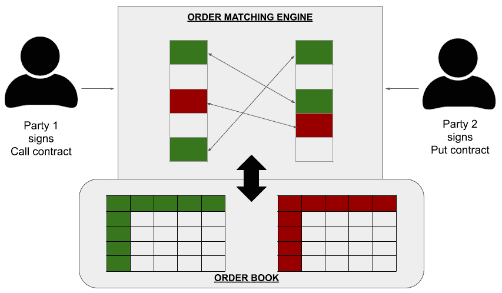
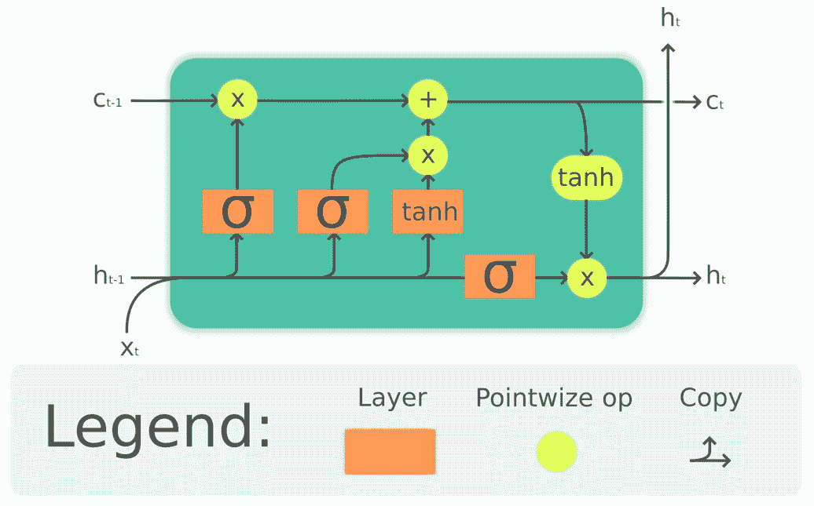
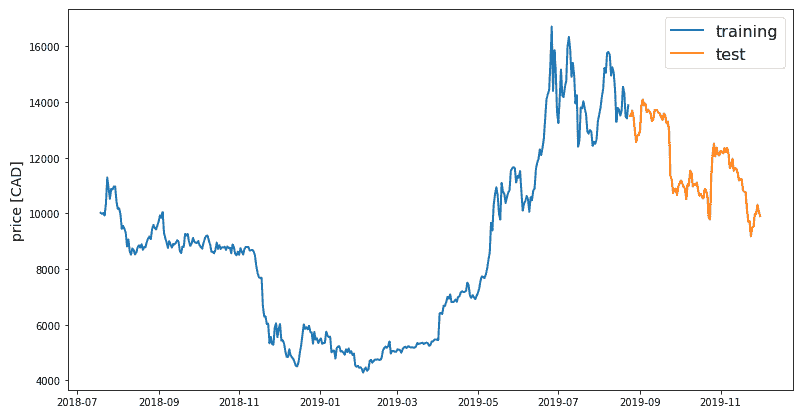
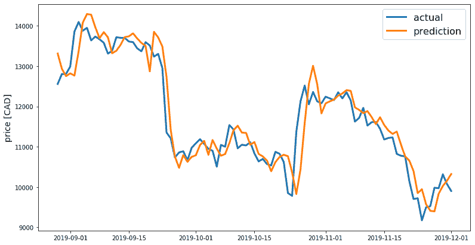
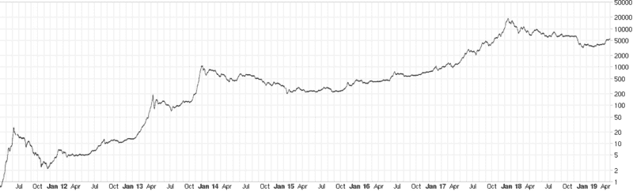
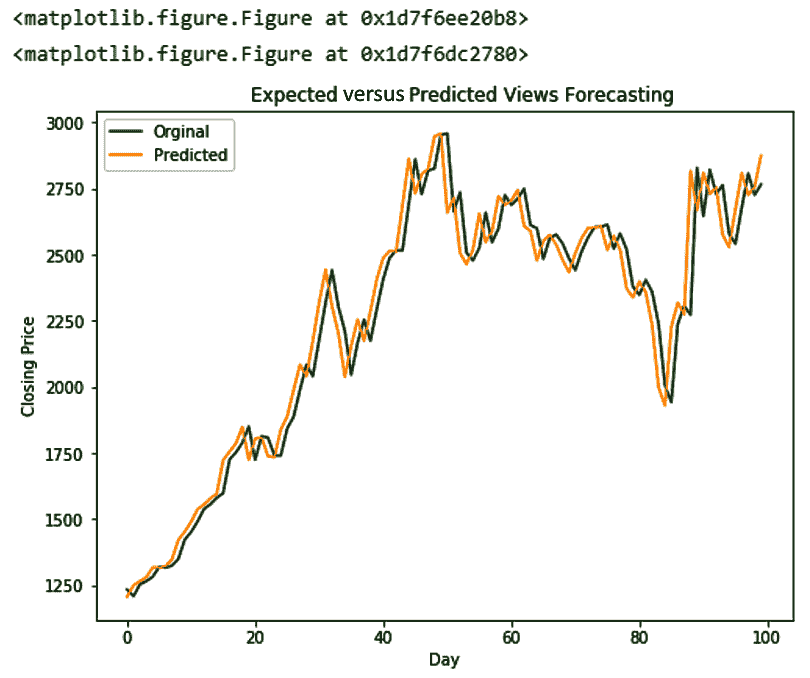
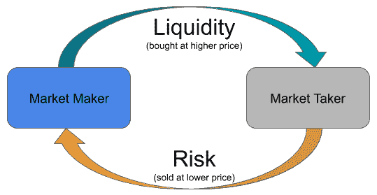

# 第九章：加密货币与人工智能

*“用人工智能让加密货币更近我们。”*

在本章中，我们将重点介绍加密货币在交易中的应用，以及在加密货币交易中应用的经过验证的**人工智能**（**AI**）技术。我们还将确定解决行业内现有市场白色空间的解决方案。您将了解到使用各种类型的替代币进行加密货币交易的钱包的好处。您将学习如何在加密货币和加密货币经济中应用人工智能、预测分析、情感分析和**自回归积分滑动平均**（**ARIMA**）等技术。最后，您将通过与加密货币相关的人工智能应用的案例研究获得更多经验。

在本章中，您将涵盖以下主题：

+   人工智能在加密货币中的作用

+   加密货币交易

+   使用人工智能做价格预测

+   做市商

+   加密货币在印度的未来

# 技术要求

本章需要您能够分析人工智能和区块链在提到的应用领域中的关键能力的应用。

**警告**：与传统金融市场相比，加密货币市场是高度不受监管的市场，因此被许多国家视为零售投资者的高风险市场。本章中确定的技术不应视为金融建议。在尝试这些技术之前，您必须了解交易策略及其利弊。我们不建议您在没有金融建议的情况下使用任何这些技术。在未经咨询财务顾问的情况下，执行任何这些交易策略可能会损失您的本金投资金额，并且可能还会导致市场出现意外的修正。作者和出版商不对尝试本章中提到的技术而导致的任何财务损失负责。

# 人工智能在加密货币中的作用

加密货币使全球用户能够以个人身份和机构身份进行商业操作。这减少了价值链上的依赖，并在某些情况下使利益相关者的角色被排除在外。比特币、以太坊和瑞波等加密货币（在某些限制下）使大量人员能够排除中介或探索经济中的新白色空间，包括概念如**非同质化代币**（**NFT**）、**首次代币发行**（**ICO**）和**去中心化自治组织**（**DAO**）。

另一方面，人工智能已经被应用于**银行、金融服务和保险**（**BFSI**）行业，以减少跨境运营风险，从而促进机构之间的有效盈利。两种技术的融合对人工智能和加密货币都有益。

在我们深入探讨人工智能在加密货币中的作用之前，让我们通过以下对比表简要观察加密货币在世界中的新兴需求：

| **法定货币** | **加密货币** |
| --- | --- |
| 这些大多数是由政府根据部分准备金银行或量化宽松模式铸造的。 | 由矿工或验证节点根据网络费用模型的投票方案铸造。 |
| 并非所有法定货币都以数字形式存在，因此很难追踪和征税。 | 大多数加密货币都是数字形式，具有透明的交易，这有助于理想的税收合规。 |
| 通常由国家级联邦银行通过积极的货币政策进行监管。 | 加密货币是分散式的。因此，通过国家监管所有这些货币是具有挑战性的。 |
| 货币转账和结算可能需要数天时间。 | 货币转账几乎是即时的，几分钟内即可完成最终性。 |
| 由于中心化，数字货币可能不太安全，因此容易受到网络威胁的影响。 | 在管理一致性方面非常有效。黑客可能无法入侵托管开放分类账的所有节点。 |
| 与加密货币相比，可能不太容易波动。 | 由于投机，与传统货币和货币市场相比，波动性很高。 |

通过对使用加密货币的潜在好处有了简要了解，现在让我们来了解一下当今加密货币的使用情况。

# 加密货币交易

交易加密货币已成为全球财富创造的替代途径，除了为各自区块链平台的用户提供流动性外。从小型加密货币交易所到亿万美元的对冲基金，几个实体都直接或间接为其客户提供交易服务的财富管理服务。

在多个区块链上流通的超过 2000 种加密货币，以及购买、使用和交易的途径，使得互联网上持有加密货币从未如此简单。 2018 年，所有加密货币中的市值最高超过了 5000 亿美元（**USD**），因此加密货币被视为长期的替代财富创造媒介。

现在让我们来了解一下加密货币交易的实际工作原理。以下图表是有帮助的：

图 6.1：分散式交易所中加密货币交易的工作示意图

上图是演示加密货币交易所内两名用户进行买卖代币的示例。第 2 方愿意以预定成本在特定日期和时间出售加密货币或代币。在下达 PUT 期权时，会提及方愿意出售的代币数量。同样，第 1 方有意按照 CALL 期权中设定的理想费率购买相应的加密货币资产。交换每次运行的算法来识别双方同意的买卖价格，从而执行交易。因此，匹配引擎足够高效和有效，可在短时间内执行最佳交易。

在对加密货币交易如何运作有基本了解的同时，让我们现在继续了解该技术所带来的问题。

## 问题和特别考虑事项

尽管使用加密货币交易创造财富的增长令人印象深刻，但由于以下原因，市场仍然存在效率低下的问题：

+   难以确定市场中的剧烈波动

+   缺乏智能的订单匹配引擎，允许用户估算其持有的资产的正确价值

+   由于市场反应不一，难以计算可预测的风险

+   对保护钱包免受攻击的弱网络安全策略，导致价值超过 10 亿美元的加密货币丢失到黑客攻击中。

## 人工智能在加密交易中的好处

在加密交易领域可以应用多种人工智能技术，如基于定量（时间序列等）和非定量（新闻、社交声誉等）数据的**机器学习**（**ML**）和**深度学习**（**DL**）。其好处在于，它可以帮助投资更加成功，更敏锐地发现交易趋势中的异常，并在交易机器人的情况下在关键情况下快速反应，建立代表买家和卖家情绪的聚合信号。此外，应用人工智能还可以在密码生成、检测虹膜、视网膜等生物特征识别等方面为加密货币交易所或对冲基金组织和管理的钱包带来显著的安全增强。这意味着用户资金也不易受到登录异常的影响。

在了解加密货币交易及其潜在好处的概述后，让我们现在向加密货币市场进行价格预测。

# 使用人工智能进行价格预测

传统市场以及加密货币市场被认为是有效的，如果市场资本化的增长随时间逐渐增加。市场中一个值得关注的维度一直是**价格预测**。在传统市场中，预测性分析概念已经被投入实践，用于通过算法交易赚钱。

几个带有时间戳的数据集作为模型的输入，该模型能够根据诸如新闻、公告以及市场对特定加密货币的任何监管行动的反应等动态来分类股票或加密货币价格是否上涨或下跌。

现在让我们试着了解一下加密货币价格预测市场面临的一些主要问题。

## 价格预测存在的问题

让我们来看看关于加密货币价格预测的两个主要问题。它们详细如下：

+   无法调整算法以适应加密市场情绪

+   无法维持和衡量流动性

在预测公开交易的加密货币价格方面，越来越多地应用了 AI 技术，例如神经网络。与股票市场中的价格预测相比，加密货币市场波动性较大，技术进步、公告以及新兴竞争等各种属性会相对更高地影响价格。因此，在这些场景中，机器学习可能不太有效。

尽管用于训练模型的数据特征与传统股票市场相似，但在选择 DL 技术时会考虑到前述因素。我们将探讨在通常称为**长短期记忆**（LSTM）的架构中应用人工**循环神经网络**（RNN）的应用。

以下图表是 LSTM 单元的表示，以及如何将函数应用于其的描述：

图 6.2：LSTM 单元中的重复模块包含四个交互层

你可以查看 Guillaume Chevalier 制作的图表，链接如下：[`en.wikipedia.org/wiki/Long_short-term_memory#/media/File:The_LSTM_cell.png`](https://en.wikipedia.org/wiki/Long_short-term_memory#/media/File:The_LSTM_cell.png)。这是链接的许可证，[`creativecommons.org/licenses/by/4.0/`](https://creativecommons.org/licenses/by/4.0/)。

采用 LSTM 方法，将加密货币交易数据分组到基本的共同属性下，如开盘价、收盘价、最高价、最低价和成交量，详细如下：

+   **开盘价**（Open Price）指的是一天开始时加密货币的价格。

+   **收盘价**（Close Price）指的是一天结束时加密货币的价格。

+   **最高价格**（High Price）指的是当天记录的最高价与美元的比值。

+   **最低价格**（Low Price）指的是当天记录的最低价与美元的比值。

+   **交易量**指的是该特定日子交易的总数量。

可以从大多数加密货币交易所通过 OpenAPI 规范提取任何给定日子的前述五个属性。提取的信息可以根据个人或工具的喜好样式剪裁为数据集。通常，数据集必须分为三个部分：60%的数据点用于训练，20%用于验证，20%用于测试。LSTM 模型具有在处理数据时识别模式的独特能力，并且在数据集中忘记任何不必要信息。现在，这些信息与必要的激活函数一起通过多个门馈入 LSTM 单元。

让我们探索 LSTM 在加密货币价格预测中的应用示例。以下示例是维洛尔理工学院（**VIT**）的研究助理阿比纳夫·萨加尔（Abhinav Sagar）的工作（[`github.com/abhinavsagar/Cryptocurrency-Price-Prediction`](https://github.com/abhinavsagar/Cryptocurrency-Price-Prediction)）。该模型由三个基本层组成：输入层、隐藏层和输出层。因此，神经网络将由这些层组成，具有线性激活函数。该模型使用 Adam 作为优化器，**均方误差**（**MSE**）作为损失函数进行编译。

下图显示了基于 LSTM 的比特币价格预测算法的输出：

图 6.3：基于数据集的加密货币线性图

您可以在以下链接查看此图：[`github.com/abhinavsagar/Cryptocurrency-Price-Prediction`](https://github.com/abhinavsagar/Cryptocurrency-Price-Prediction)。

下图比较了比特币的预测价格值与同一时间轴上比特币的实际价格：

图 6.4：应用 LSTM 模型的实际与预测价格对比

您可以在以下链接查看此图：[`github.com/abhinavsagar/Cryptocurrency-Price-Prediction`](https://github.com/abhinavsagar/Cryptocurrency-Price-Prediction)。

有了对 LSTM 的基本理解以及它如何在价格预测中使用的了解，让我们在下一节中了解其好处。

## 预测中的人工智能的好处

对交易数据应用分类模型和预测性分析实践可以为交易员提供经过良好训练的决策，并帮助实现效率。它还可以帮助交易员从更好的市场交易中获利，尤其是在全球运行 24/7 的加密货币交易中，这类交易类似于传统的高频市场，如**外汇**（**Forex**）。

有了对 LSTM 如何对价格预测有益的基本理解，现在让我们来探讨时间序列。

## 时间序列简介

时间序列是一系列随着时间逐渐变化的数据点，与加密货币的价格相比，以离散级别进行索引。这个想法并非新颖或专门适用于加密货币。事实上，传统金融行业存在刻度数据库。加密货币行业借鉴了这种方法，以利用量化金融（也称为算法交易）的好处，在加密货币中获得更高的回报。

以下图表表示比特币加密货币市场中最长的一次涨势的价格时间序列：

图 6.5：比特币价格与美元之间的时间序列信息，以对数刻度表示，在崩溃发生之前

您可以在以下链接查看此图表：[`commons.wikimedia.org/wiki/File:BitCoin-USDollar_2011-19_(Bitstamp,_Mt._Gox).png`](https://commons.wikimedia.org/wiki/File:BitCoin-USDollar_2011-19_(Bitstamp,_Mt._Gox).png).

时间序列通常以刻度数据的形式存储，并以图表的形式表示。从时间序列获得的数据也可以用于分析商品的非量化价格趋势。

现在，让我们探讨在时间序列预测中应用 AI 的应用。

## 使用 ARIMA 进行时间序列预测

由于加密货币价格受到各种因素的影响，使用简单的 ML 模型来分析和预测价格并不容易。因此，使用 ARIMA 模型来预测价格。考虑比特币的时间序列示例，如前图所示。我们无法将变化归因于单个参数并开发满足我们对价格预测的要求的线性回归模型。因此，ARIMA 被广泛使用，以便我们可以应用模型，注意预测中的误差，对模型进行必要的更改后重新测试模型，并再次计算 MSE。

通常，ARIMA 模型提供合理的价格预测，误差率在 3%至 5%之间。ARIMA 的关键优势在于，模型相当简单易于校准，这鼓励数据科学家大幅减少加密货币价格的预期值与预测值之间的平均误差。

以下图表是一个校准后的 ARIMA 模型输出，用于预测比特币价格：

图 6.6**：** 使用 ARIMA 进行比特币价格预测

您可以在以下链接查看此图表：[`www.kaggle.com/ayushi2/bitcoin-price-ar-ma-and-arima`](https://www.kaggle.com/ayushi2/bitcoin-price-ar-ma-and-arima).

现在让我们探讨在高频交易环境中 AI 的其他应用。

## 算法或量化交易在加密货币中的应用

您知道全球发生的大量交易呼叫中有相当多的呼叫并非由人类进行吗？相反，它们是由操作程序编程和自动化到一定程度的。这种类型的交易涉及对大量呼叫的利润的敏锐关注，从而在非常短的时间内取得良好的利润。这被称为算法交易。顾名思义，这些机器所做的交易呼叫被优化为查看图表和报告无法感知的利润。这些呼叫发生在毫秒之间，并被预测将接管我们所知的金融市场。

让我们现在了解一些针对加密货币进行利润优化的基本算法应用。

### 套利

如果您不活跃于金融领域，术语**套利**是指利用两个不同地点相同资产的不同价格来从资产的交易交易价值差异中获利的做法。简单来说，套利是一种利用两个或更多市场上相同资产的不同经济价值的交易策略。您可以在价格更低的市场购买，然后将其出售给需求更高的市场。

套利的历史可以追溯到公元前 650 年（[`www.sfu.ca/~poitras/EQF_ARB%24`](http://www.sfu.ca/~poitras/EQF_ARB%24%24.pdf)[%24.pdf](http://www.sfu.ca/~poitras/EQF_ARB%24%24.pdf)），当时在波斯以较低的价格购买银币，并以较高的溢价在希腊出售是一种常见做法。

需要注意的是，这种策略对加密货币并不新奇。套利从上世纪 80 年代初的现代金融就适用于传统金融工具。即使在今天，它仍然是一种活跃的交易策略。

在我们深入了解算法交易应用如何帮助进行比特币套利之前，让我们先了解一些基本背景。在撰写本文时，比特币（通常用其代币符号**比特币（BTC)**）在 100 多个交易所上市（[`coinmarketcap.com/currencies/bitcoin/markets/`](https://coinmarketcap.com/currencies/bitcoin/markets/)），不同交易所的价格略有不同。

在下面的截图中，您可以观察到多个交易所的比特币的两种不同价格：

图 6.7：2020 年 2 月 26 日记录的 10 个不同交易所上一比特币的美元价格

您可以在以下网站查看前面的截图：[`coinhills.com/`](https://coinhills.com/)。

如果有一种方法可以即时购买比特币，并将同样的比特币卖给交易用户，你可以简单地应用基本数学来理解获利 2 美元的潜在机会。然而，假设这两笔交易都能够在近乎瞬间完成以从这笔交易中获利是天真的。如果这笔交易能够成功实现，那么就已经成功建立了一种加密/法币套利交易。

然而，重要的是要记住，从交易所提取法定货币取决于各自国家的商业便利程度。因此，我们需要了解这些交易可能并不总是即时盈利的。

已开发出算法，以实现两种加密货币之间的即时套利交易。假设在交易所 1 中，1 **BTC**的成本是 50 **以太币**（**ETH**）。假设在交易所 2 中，相同数量的 1 BTC 的成本是 60 ETH。在这种情况下，算法交易将确定最适合的加密货币交易对，并执行交易，从而在几秒钟内赚取最大利润，从而赚取 10 ETH。如果这样的交易能够成功实现，那么就已经成功建立了一种加密/加密套利交易。

**旧金山开放交易所**（**SFOX**）是一家由 YCombinator 支持的交易平台，自 2015 年以来已为超过 175,000 名交易者提供服务。该平台多年来的总交易价值接近 110 亿美元，为客户在 20 多个市场上探索套利机会。SFOX 提供行业领先的算法交易，例如以下内容：

+   **龟**：适用于交易较少比特币的优化订单路由，但比其他算法更慢。

+   **兔**：比龟更好的价格目标，而且速度毫不妥协。

+   **大猩猩**：优化以执行具有适当控制市场波动的大额交易订单，以确保市场不会移动。

+   **北极熊**：优化以执行用户设置的最佳限价的隐藏订单。一旦算法确定了订单簿中的最佳价格，它将立即以该价格执行订单，而不会深入订单簿。

尽管存在适用于套利的良好支持算法，但这并不总是能够确保低风险的交易策略。算法还必须足够高效，能够在一瞬间抓住机会，以弥补在不同市场的多个交易所进行的所有交易的总费用，因为这些被一些专家视为隐藏边际成本。

现在让我们探讨如何利用人工智能来改善做市商活动。

# 做市商

**市场做市**是加密货币交易业务中的关键过程，其重要目标是为市场中的加密货币提供流动性。让我们详细探讨这一点，如下所述：市场中的买方放置一个出价（**bid**）以购买特定的加密资产。有意出售相同类型的加密资产的卖方可以放置他们的要价（**ask**）来出售该资产。通常，买方和卖方的价值不匹配，因为买方通常报价较低的价值，而卖方报价较高的价值。这可能导致双方期望之间存在差距，从而产生一个**价差**。

当共同价格分歧加剧时，价差值扩大，导致产生了流动性不足的代币或加密货币。流动性不足的代币基本上是不可交易的，因为期望没有得到满足。因此，较低的交易量会减缓代币的流动性，降低相应代币的市场资本化。这对业务是有害的。因此，需要流动性提供者帮助买家和卖家在中间达成一致。

市场做市商通过收购大量代币并在多个市场为交易者提供流动性来解决这个问题。

以下图表有助于您了解市场做市周期：

图 6.8：市场做市周期的通用示意图

简单来说，市场做市是一种批发购买 ICO 代币并为较小的投资者提供零售价值的过程。市场做市商的收入模型是通过以较低价格批量购买代币，并将来以较高价格销售给未来的接受者来构建的。

再次强调，市场做市并不是加密货币的新概念。这是一种在多个市场上应用到几乎每一种传统金融工具的庞大运营业务。

尽管这种模型在传统金融中相当有利可图，但在加密货币交易领域识别流动性需求是一个巨大的挑战，因为有超过 1000 种加密货币在没有边界或时区的情况下进行活跃交易。因此，必须应用一些深度学习技术，如进化算法，来识别特定目标加密货币列表可能需要流动性的所有可能情景。

通过对市场做市的基本理解，现在让我们来了解所面临的问题以及人工智能如何解决这些问题。

## 问题和特别考虑

市场做市商面临的主要问题之一是，传统系统中捕获的数据缺乏完整的上下文。

## 交易数据中人工智能的益处

在区块链交易的半结构化数据上应用人工智能可以为更好的分析铺平道路，并提供更深入的洞察，以做出高效的交易决策。来自多个区块链的实时高吞吐量可以通过应用人工智能模型进行分析，从而在不同的区块链领域中做出明智的决策。

# 印度加密货币的未来

印度长期以来一直是少数几个对加密货币立场不确定的发展中国家之一。2018 年 2 月 12 日，来自**印度储备银行**（**RBI**）的通知建议所有银行和受印度储备银行监管的机构不支持任何涉及虚拟货币的个人或实体。尽管印度的交易所无法支持与银行账户相关的存款或提款，但这被视为对与加密货币相关的所有活动的全面禁令。

2020 年 3 月 6 日，印度尊敬的最高法院的裁决推翻了印度储备银行的通知，因此撤销了印度储备银行对金融机构提供服务于这些交易所和交易者的禁令（[`main.sci.gov.in/supremecourt/2018/19230/19230_2018_4_1501_21151_Judgement_04-Mar-2020.pdf`](https://main.sci.gov.in/supremecourt/2018/19230/19230_2018_4_1501_21151_Judgement_04-Mar-2020.pdf)）。

尽管这对加密交易行业是暂时的缓解，也是许多其他发展中国家和经济体的榜样，但周围的生态系统仍存在较大的不确定性。撰写时，据报道印度储备银行已提出复审请愿，以挑战该国最高法院的裁决。值得注意的是，为了支持这些业务而不损害国家经济，**反洗钱**（**AML**）和**了解您的客户**（**KYC**）法规将被更新。

在规定与为行业提供正确教育之间取得平衡，有助于印度在这一行业中蓬勃发展，并成为下一波数字经济的全球领导者。在那之前，印度的这种不确定性仍然存在。

# 摘要

本章重点介绍了人工智能在加密货币及其新兴经济中的作用。从法定货币和加密货币之间的主要区别开始，我们向您介绍了加密货币市场中的各种实践，如交易、预测、套利和市场做市。我们不仅介绍了基本概念，还确定了行业交易者面临的关键问题。最后，我们介绍了一些利用人工智能解决问题的方法，并利用诸如 ARIMA、LSTM 等多种人工智能技术，旨在打造更好、更高效和更具盈利性的模型。

我们希望本章通过分析今天常见的一些实践，使您能够识别将人工智能技术应用于加密货币市场的关键空白。在下一章中，我们将了解构建和部署此类应用程序所需的正式软件开发生命周期。
