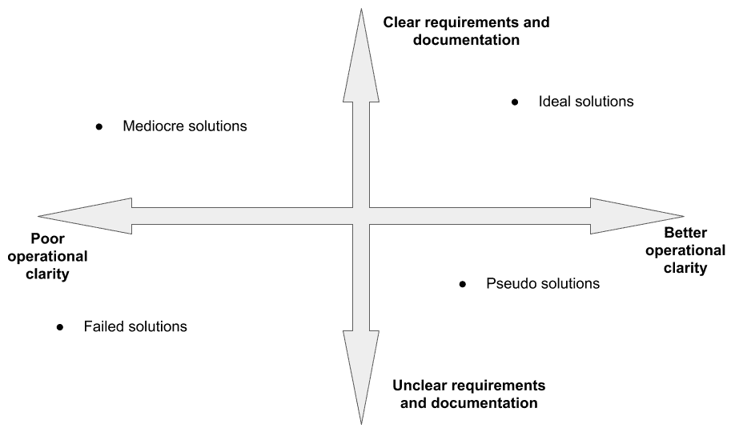
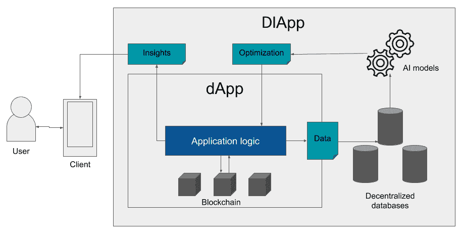
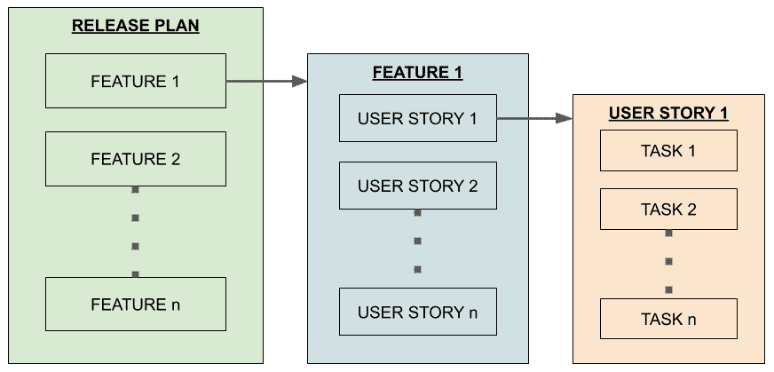

# 第十一章：一个 DIApp 的开发生命周期

*“快。好。便宜。选择其中两个。”*- 未知；被许多软件项目经理使用*

在本章中，我们将探讨一系列新的模式，可以用于区块链和人工智能启用应用程序的软件开发生命周期（SDLC）。它将帮助您构建现代应用程序，解决前几章讨论的各个行业面临的问题。在介绍 SDLC 方面之前，我们还将比较传统的区块链应用与下一波智能分散式应用之间的区别。我们还将探讨可以在修订后的 SDLC 下构建的新类型应用程序的架构方面。

在本章中，我们将涵盖以下主题：

+   在区块链中应用 SDLC 实践

+   DIApp 简介

+   比较 DIApp 和 DApps

+   设计一个 DIApp

+   开发一个 DIApp

+   测试一个 DIApp

+   部署一个 DIApp

+   监控一个 DIApp

# 技术要求

本章需要您能够分析在软件开发过程中应用 AI 技术以及区块链技术的好处，涉及几个应用领域。

# 在区块链中应用 SDLC 实践

距区块链技术问世已有十多年，需要新兴模式将区块链技术和人工智能技术应用于不断扩张的互联网中，有效地管理各个行业垂直领域的软件开发实践需求。

让我们逐步探讨 SDLC 的所有主要方面。

## 从构思到产品化

存在许多构建新应用程序的想法，但是很少有想法被转化为设计。尽管在设计分散式应用程序方面做出了努力，但只有少数设计实际上对现实世界足够实用。这是由于产品期望与开发者手头可用技术的准备不足之间的不匹配造成的。在某些情况下，技术和功能可能已经可用，但由于这些区块链最近和不稳定的增长，它们可能得不到足够的支持。因此，普遍存在这样一个认识问题，即区块链中并非所有想法都能转化为产品。

除了平台本身的限制之外，还存在一种倾向，即由于害怕错过机会，将每个现有解决方案“区块链化”。一些公司甚至在可能不适合其目的的情况下也想尝试，这也可能导致问题。

根据我过去三年在区块链和人工智能领域的积极开发经验，这些问题可以通过采取以下一些步骤来解决：

1.  **理解业务流程**：

在我遇到的大部分基于区块链的用例中，对业务流程的清晰理解至关重要，因为大多数区块链解决方案将影响业务的运营和财务方面。因此，在对复杂步骤或所需方法的危险假设之前，重要的是在更大的细节上教育所有利益相关者关于业务流程。

例如，如果正在开发一种使用区块链和人工智能数字化转型乳制品公司的新解决方案，团队中的每个人都必须对将牛奶从牛场带到餐桌的端到端流程有舒适的了解。

1.  **建立清晰的要求**：

在任何新兴技术中都很常见的是，大部分努力往往被夸大了，从而缺乏构建应用所需的客观清晰度。在我们能够确定潜在的集成点之前，我们必须明确了解应用区块链或人工智能解决方案时解决了什么问题。所有利益相关者必须尽力在这里清晰地传达功能和非功能需求。这在未来管理期望方面会很有帮助。

例如，组织的决策者或所有者可能确定了需要从生产原奶的当地牛场获得更好的透明度和责任制。所有者可能还确定了需要分析所有乳制品的当前销售趋势，以确保根据需求提供牛奶用于进一步加工制造必要的乳制品。

1.  **识别业务流程中的关键检查点**：

一旦需求被确定并澄清，对于区块链来说，直接跳入设计是至关重要的。我们必须确定当前的实施情况并理解关键的商业组件以及技术必须应用和集成的检查点。

例如，在牛群中识别每头牛可能是团队的最基本和根本的检查点之一。另外，理解当地生产商收集的原奶是否是通过数字称重秤手动输入到系统中，还是自动化的。在为其他乳制品保留一定数量的牛奶的情况下，了解是谁决定或批准了从储备牛奶生产乳制品的重要。

1.  **检查技术集成是否可行**：

一旦确定了检查点，我们现在可以确定解决问题的各种技术方法，并检查其是否适应更大的过程。很多时候，与传统解决方案不同，区块链开发人员受到限制，要么是受到基础设施和平台的限制，要么是受到所给定的区块链平台支持的功能的技术稳定性的限制。

例如，假设我们想通过**射频识别**（**RFID**）标签来识别牛群中的每头牛。现在，每头配有 RFID 标签的牛必须通过状态变量在区块链中虚拟表示。在这里，开发人员必须不要假设 RFID 标签的值能够在区块链上持续存在。大多数区块链平台对可以存储的数据类型有严格的限制。它们还对可以通过智能合约在区块链上持久化的数据类型的长度和范围施加严格限制，这是由于区块链的去中心化性质所决定的。在这种情况下，我们可能需要识别 RFID 标签的结构，并尝试将其存储在诸如 MóiBit 之类的辅助存储网络中，以识别牛群中的所有牛。

类似地，在测量产奶量的情况下，有必要确定数字称重秤是否能够在区块链上进行智能合约调用。如果奶牛的奶是从非常偏远的地区收集的，则还必须确定此类操作上的障碍。

最后，确定如何将应用于区块链上收集的信息的 AI 模型应用于解决用户需求也非常重要。也就是说，设计师、架构师和开发人员必须了解区块链的交易信息及其数据结构。必须首先努力了解交易信息可以以确保 AI 模型能够充分训练以预测销售趋势并留出必要的奶制品储备的方式进行处理。

1.  **建立受影响组件之间的技术依赖**：

一旦我们确定了潜在的集成点，就应仔细建立技术依赖关系。这些依赖关系可以是内部依赖关系或外部依赖关系。如果解决方案的开发取决于其设计、架构、用户故事或验收标准，则技术依赖关系是内部的。给定解决方案的设计不良或信息流的不完整可能会导致许多问题。不完整的架构决策也可能导致实施问题。

以下图表总结了在所有方面提供更清晰的需要，以利用区块链和人工智能构建理想解决方案：

Fig 7.1: 代表各种结果和解决方案质量的图表

总结一下，如前面图中所述，只有在需求非常明确和具体，并且具有技术能力优势的情况下，才能实现理想的解决方案。然而，如果需求没有完全记录、理解或传达，则结果是一个部分解决方案，无法提出解决完整问题集的解决方案。左侧四分之一中的另外两种解决方案由于缺乏技术能力而变得贫乏和无效，这些解决方案中有一些没有充分记录需求的地方，以及在建立依赖关系方面存在无效的文档记录。

在了解开发区块链或人工智能解决方案之前必须考虑的基本原则后，现在让我们继续了解这些解决方案是如何定义的。

# DIApps 介绍

在了解我们所说的**DIApp**之前，让我们先了解什么是真正的去中心化应用。**去中心化应用**或 **dApps**（也写作 **DApp** 或 **Dapp**）是在分布式方式下由多个节点托管的平台上运行的用户应用程序。DApps 作为一种解决方案架构出现在区块链之上，其中可以用一种特定支持的语言编写自定义业务逻辑。一旦逻辑被解释为代码，我们就在相应的区块链平台上部署该代码。一旦逻辑部署到平台上，我们就进一步将逻辑程序与前端应用程序集成，以进行用户交互。

与 DApps 相比，**去中心化智能应用**（**DIApp**）是 DApp 的增强模式，可以在区块链平台上更加强大地应用人工智能（AI），为所有利益相关者提供价值。虽然在解决方案中加入人工智能的概念并不罕见，但**DIApps **是一种可理解的方法和一种新颖模式，对于使用区块链和人工智能构建的未来解决方案更有意义。

正如其名称所示，DIApp 是一种提供去中心化和智能功能的应用。由于它是从 DApps 继承的模式，因此默认情况下是去中心化的，这要归功于当前所有区块链平台遵循的实现方式。然而，DIApps 有更智能的独特能力。这是通过一个中间的离线数据库实现的，该数据库赋予 DIApps 从应用程序或通过运行在区块链上的应用程序的用户那里收集大数据的能力。

以下图表提供了本节中所解释的 DIApp 的一般概要图：

Fig 7.2：DIApp 模式的综合视图

前面的图表描述了 DIApp 模式中 DApp 的综合视图。通过这种方式描述模式，帮助您理解对现有模式进行的增强，以便能够应用人工智能。

有了对 DApp 和 DIApp 设计模式的基本理解，现在让我们对它们进行对比，权衡模式之间的利弊。

# **比较 DIApp 和 DApp**

在本节中，我们将概述企业在开发和使用 DApps 时面临的问题。此外，我们将概述企业场景中 DApp 和 DIApp 模式的解决方案架构，并概述其主要区别。

## 企业面临的挑战

尽管几个区块链平台代表了新的实验方法，但这些方法大多基于全面淘汰业务流程中涉及的所有实体，从而使解决方案纯粹成为点对点的。大多数新兴模式全面淘汰的原因是因为区块链的最大化本质是将世界去中心化。与此思想相反，企业解决方案基本上依赖于在关键利益相关者之间保持责任。因此，需要一种增强的模式，适合企业采用。

## DApp 的解决方案架构

DApp 的解决方案架构主要包括以下关键点：

+   业务逻辑是用智能合约中的**领域特定语言**（**DSL**）编写的。

+   智能合约部署在区块链网络上，并由一个地址标识。

+   如果要在大多数区块链平台上更新业务逻辑，则智能合约将获得一个新地址。

+   开发一个 web 或移动应用程序作为客户端来访问并执行业务逻辑操作。

+   几乎所有关键数据都存储在区块链之上，几乎没有分析能力的余地。

## DIApp 的解决方案架构

DIApp 的解决方案架构主要包括添加技术能力，使该模式更适合企业使用。以下是主要亮点：

+   业务逻辑通常由任何高级语言编写，例如 C、Python、Java 或 Golang，等等，这些语言由**低级虚拟机**（**LLVM**）编译器支持。此外，也可以使用普通的智能合约语言。

+   大多数智能合约都是可升级的，这意味着代码可以在不更改地址的情况下更新。

+   传统客户端应用程序也可以与这些类型的智能合约集成，因为与新的中间件集成的需求较少。

+   重要的业务数据不仅存储在区块链网络中，还存储在分散的数据存储系统中，以确保数据的完整性。

## 主要区别

深入探讨 DIApp 模式的方面后，现在让我们识别一些两种模式之间的主要区别。

以下表格提供了您必须了解的两种模式的高级比较：

| **DApp** | **DIApp ** |
| --- | --- |
| 在区块链平台上部署了所有核心逻辑元素的应用程序。 | 核心逻辑元素部署在区块链平台上，但同时也由 AI 驱动的见解并行提供支持。 |
| 数据大部分存储在区块链平台上，检索所需的费用和时间较高。 | 重要的溯源数据存储在区块链上，但其余数据存储在更便宜的链下存储系统中。 |
| 并非所有的 DApps 都可升级，因此每次更新逻辑都需要新的地址。这可能会破坏系统。 | 大多数应用程序都可以轻松升级而不改变地址，因此系统不会发生任何故障。 |
| 由于在区块链平台上读写的成本，以及训练 AI 模型所需的结构化数据的缺乏，几乎不对数据进行分析。 | 数据可以很容易地在链下存储系统中进行结构化，并与区块链平台以及 AI 模型紧密耦合。 |

对于两种模式的详细了解后，让我们现在探究 DIApps 在设计、开发、测试和部署阶段的生命周期。

# 设计 DIApp

对 DIApps 的设计方面经常被认为是有些具有挑战性的，并且受到不断变化的几乎所有区块链平台引入的技术复杂性的限制。人们普遍认为，解决空间缺乏定义关键组件的共同结构，导致应用程序的设计策略不一致。

例如，基于以太坊的 DIApp 用户所需的工具与 Hyperledger Fabric 以及 EOS 的工具非常不同。这是因为各自区块链的 UI/UX 框架设计迥然不同，深深依赖于其自身的设计范例。因此，在开始未来步骤之前，确定应用程序的设计约束非常重要。

在为 DIApp 制定设计之前，我们必须了解以下部分中解释的研究工作。

## 研究

在选择将使用的区块链技术或平台之前，了解用户需求、分析它们，并在设计的早期阶段进行更好的研究至关重要。与其问哪种区块链技术可以帮助满足需求，不如考虑这些情景：

1.  解决方案是否要求在对等互动的公共网络上进行完全分散化？

1.  由于数据的极度敏感性和业务逻辑的最小曝光，解决方案是否需要在私有网络中实施？

1.  解决方案是否可以在公共网络上实施，所有敏感数据都加密在公共分散式存储系统中？

1.  同样的解决方案是否可以在公共网络上实施，所有敏感数据都存储在私有虚拟分散式存储服务中？

1.  解决方案是否需要一个授权节点的权限网络，跨越共同体的多个利益相关者？

根据前述指针，我们可以进行以下分析。对于上述列表中的第 5 种情景，最好选择像 Hyperledger Fabric 这样的区块链。然而，在第 3 和第 4 种情景的情况下，您将需要 IPFS 或基于 IPFS 的服务提供商，他们将加密数据并将其存储在安全介质中，通过辅助网络提供安全性和冗余性。在情景 2 中，您可能再次最适合使用 Hyperledger Fabric。最后，在情景 1 中，可能是大多数情况，以太坊可能最适合您的解决方案要求。

## 概念化

制定概念验证是利用新兴技术开发解决方案的重要步骤。对于去中心化应用程序的概念验证的开发也很重要，因为它们确保了需求和解决方案的交付之间的一致性。这有助于在开发的早期阶段就保持功能和设计的一致性。

还值得注意的是，由于区块链领域的设计和架构变化的浪潮，概念验证的规范可能会发生变化。因此，概念验证应更多地关注开发人员可用的兼容模式的功能可行性。

## 产品市场契合度

开发概念验证和原型化应用程序的关键方面形成了一个递归的实践，直到我们能够看到产品市场契合度。DIApp 的产品市场契合度的定义和约束不能是通用的，因为每个 DIApp 可能针对特定领域的特定问题。然而，一些共同的特征可能有助于确定 DIApp 的产品市场契合度。

它们如下：

+   DIApp 是否解决了行业中各种利益相关者面临的独特问题？

+   DIApp 是否使当前流程中效率低下的当前实体变得无关，或者为流程带来更多秩序？

+   只有利用区块链和人工智能的组合才能实现 DIApp 的好处吗？

+   DIApp 是否通过使用 AI 模型帮助用户利用 DIApp 获得洞见？

通过回答前面的问题，我们可能能够确定 DIApp 是否已经达到了合适的产品市场契合度。对于您的 DIApp，除了前述的一般属性之外，识别其他关键指标也很重要。

在我们掌握了设计方面的基本知识和关键要点后，让我们现在在下一节中了解 SDLC 的开发方面的关键亮点。

# 开发 DIApp

DIApp 的开发可能会棘手。由于人工智能和区块链尚未在开发中受到广泛关注，行业中的一些做法尚未被所有人看到。在本节中，我们将重点介绍 DIApp 的关键开发方面。

在探讨技术细节之前，让我们了解组织中开发能力的一个基本方面。由于区块链和人工智能处于创新的最前沿，一个公开的事实是许多组织仍在努力建立各自技术的综合专业知识。话虽如此，建立一个由智能合约开发、Web 或移动应用程序开发以及人工智能或数据科学建模等技能互补的团队成员组成的团队也是至关重要的。以下部分概述了理想的 DIApp 团队。

## 团队组建

在企业设置中，我建议为概念验证开发采用以下团队格式。假设团队成员具备定期的技术和解决方案专业知识：

+   两名具有良好的 Solidity、Rust 和 Golang 编程语言实践知识的智能合约开发者至关重要。由于一些区块链基于函数式编程语言提供智能合约，因此也更倾向于具备 Haskell 知识。其中一位智能合约开发者可能专注于功能开发，而另一位可以负责故障修复、内部审计、代码质量审查等工作。

+   一个具备基本区块链知识的全栈 Web 开发者用于开发前端 Web 应用程序。如果目标受众是移动端用户，可能需要相应选择一位移动应用程序开发者。

+   可能需要一位 SMACK-stack 开发者来搭建所需的分析平台，以构建解决方案中的人工智能功能。

+   可能需要一位机器学习或深度学习工程师来构建所需的模型。如果应用程序需要深度学习或神经网络，则应相应做出选择。

+   最后，您可能需要一位 DevOps 工程师来编排基础架构，并通过明确定义的持续集成/持续交付（CI/CD）管道在供应商或云平台上部署所有必要组件。

一支由六名具备互补技能的全明星团队可以帮助开发概念验证并建立所需的技术功能。两名智能合约开发者可以由一名具有端到端经验的高级智能合约开发者取代。

通过适当的团队设置，我们将在下一节讨论一种最佳的项目管理实践，以交付概念验证。

## 敏捷开发

一旦团队建立并且需求清晰记录，我建议尽可能为概念验证和随后的构建制定清晰的发布计划。如前所述，在 DIApp 设计部分，区块链技术的技术方面变化非常频繁。为了跟上变化的步伐，管理客户期望非常重要。否则，可能会在技术问题之上导致另一层复杂性。

让我们看一下以下图表：

图 7.3：将发布计划分解为团队可行任务的示意图

如前图所示，需求需要非常具体地记录并分解成三个层次的项目。经理和产品所有者都会在发布计划中处理功能，而产品所有者独自指定每个概念验证或任何发布的要求，以用户故事的形式。一旦用户故事以期望的输出记录下来，团队就可以共同将其分解成许多工作项目或任务。您还可以将任务分解为多个子任务，以便在概念验证发布之外的大型项目中更好地记录努力。任务可以分配给个人，可以是与区块链相关或与人工智能相关。

如果需求清楚地记录下来，您可以组织**迭代计划**。根据敏捷开发，您可以组织至少 2 到 3 周的迭代。概念验证发布可以规划在一个或多个迭代中。在每个迭代结束时，团队必须组织一次**回顾会议**，以审查进展并反思当前的实践。

与传统应用的回顾相比，您还可以识别组件产生的风险或问题。由于生态系统仍在发展中，观察到的不足之处可以转化为问题。这些问题可以被分离并在相应依赖项的存储库中进行归档。大多数依赖项都驻留在 GitHub 上。因此，开发人员必须对该平台有足够的了解，以便浏览平台、与他人合作并解决问题。

这个流程会在多个迭代中重复进行，直到所有功能、需求和错误修复都按照发布计划得到解决。

了解了开发 DIApp 的关键方面的基本概念和概述后，现在考虑测试 DIApps。

# 测试 DIApp

由于这些应用很可能管理高价值资产和敏感信息，测试 DIApps 在部署所有网络模块之前和之后都是流程中的一个至关重要的步骤。确保应用程序的正确性和持久性对企业至关重要，因此，将严格的测试实践重新引入到开发生命周期中成为了非常重要的一个方面。

让我们现在来看一下 DIApp 的测试和部署过程的重点亮点。

## 撰写测试用例

在软件部署之前，我们可以尝试确保软件的正确性，同时通过运行一些关键测试来确认运行时环境的适应性。通常，这些测试是在源代码中实现的，以单元测试文件的形式，其中包含将虚拟输入值传递给函数，然后通过断言来检查软件在相对新的环境中的正确性。每个测试用例都代表了一个逻辑执行和提供预定输出场景的场景。我们将在第八章，*实现 DIApp*，中进行更多关于单元测试用例生成的实践。

测试用例在两个测试级别上执行：单元测试和集成测试。

## 单元测试

DIApp 模式中的每个组件都为解决方案提供独特的价值。因此，确保解决方案中每个组件的正确性至关重要。通过执行**单元测试**可以实现这一点。在单元测试下，我们可以在将其与其他模块集成之前测试每个模块的核心功能。单元测试通过将实际输出与期望输出进行比较，有助于正式验证这些模块的正确性。每次对模块进行更改时，该过程都会重复，从而在每次更改模块时保持模块的正确性。

一旦模块经过单元测试和集成，我们就可以执行集成测试，如下一节所述。

## 集成测试

如前面所述，DIApp 是许多技术的混合体。因此，测试每个异构组件的行为以确保它们提供准确的结果至关重要。这通过执行**集成测试**来实现。一旦组件集成完成，我们可以运行一些测试用例，正式验证依赖一个或多个异构组件提供输出的一些关键组件的正确性。

## 测试 AI 模型

尽管传统软件可以通过单元测试和集成测试进行测试，但我们需要不同的措施和方法来测试 AI 系统。测试 AI 模型和能力可以分为两个阶段。测试的一个阶段是在模型进入生产之前。另一个测试阶段是应用于生产后。在将 AI 模型投入生产之前，可以通过验证训练数据的正确性和完整性来进行测试。同样，一旦部署了 AI 模型，我们可以经常测试其准确性和可用性。还可以进行图灵测试，以了解 AI 模型是否已能够充分替代人类对任务的响应。

通过对 DIApp 开发中测试的基本理解，现在让我们来了解一下 DIApp 的部署过程。

# 部署 DIApp

在本节中，我们将讨论在混合环境中部署基于区块链的应用程序的常见做法。与其他新兴技术不同，区块链平台需要相对更长的时间来设置网络并使整个生态系统运行起来。因此，几个区块链平台已经意识到 DevOps 作为开发这些平台的一个组成部分的必要性。因此，值得注意的是，DevOps 知识在使用这些平台开发应用程序和部署解决方案时也是必不可少的。

## 为了投入生产环境，需要对 DIApp 进行扩展。

DIApp 的部署是生命周期中的最后关键步骤。除了正确性外，还必须确保应用程序在设计、架构和开发上支持以可伸缩的方式部署应用程序。规模不仅仅是以用户数量来衡量，还取决于成本、形式因素和可能直接影响运营的其他经济属性。

有几种工具可用于部署 DIApps 及其依赖项，例如 Docker、Kubernetes、Ansible、Terraform 和 Mesos。我们将在第八章，*实施 DIApps*中进一步探讨 DevOps 工具，并提供一些示例。

# 监控 DIApp

在本节中，我们将讨论许多人用于监视区块链应用程序交易的常见做法。

## 浏览器

大多数去中心化解决方案部署在公共区块链网络或数字账本上。在大多数公共网络中，都可以使用区块链浏览器查找有关交易或区块的信息。然而，如果 DIApp 解决方案在私有或许可环境中实施，这些公共区块链浏览器可能无法提供有关属于私有网络或私有账本的交易的信息。因此，我们必须能够部署现有的区块链浏览器，并将它们连接到私有服务的端点。这是在私有环境中方便用户监视其交易的唯一方法。有几个开源的区块链浏览器实现可供下载，并可连接到私有服务。

公开区块链浏览器的一些示例包括 Etherscan、EthStats 和 BlockScout。我们将在下一章中讨论它们。例如，BlockScout 是一个开源的浏览器，您可以使用它创建一个针对您的私有以太坊网络的特定浏览器。

# 总结

在本章中，我们探讨了 DApp 和 DIApp 的基本定义。我们还对比了这两种技术的解决方案架构和设计模式。基于 DIApp 的优势，我们进一步探讨了从构思到发布或部署的 DIApp 的 SDLC 方面。区块链和人工智能的新经济需要重新定义的 SDLC，包括涉及的新技术。我们已经概述了在开发 DIApp 之前需要考虑的步骤和流程。

在下一章中，我们将专注于应用 SDLC 的开发方面，通过在各种区块链平台上开发示例应用程序，以及常见的人工智能技术。
