# 第十二章：实施 DIApps

*"区块链和人工智能是 IT 领域的双子星。**它们在这里帮助拯救人类免受隐形病毒的侵害。"*

由于区块链和人工智能已经问世超过 10 年，现在可以通过结合这两项技术构建一系列全新的解决方案。通过以一种新的方式结合这两项技术，我们可以解决一些棘手的问题。在本章中，我们将提出一种更好的应用程序开发模式，利用人工智能和区块链的组合。本章是一个实践性的章节，您将学习如何使用区块链和人工智能技术构建智能应用程序，这些应用程序有可能拯救我们免受 COVID-19 以及其他传染病的更多爆发的侵害。在本章结束时，您将能够识别**分布式智能应用** (**DIApp**)的好处，并使用 DIApp 设计模式构建一个样本接触追踪应用程序。

本章节将涵盖以下主题：

+   分布式应用的演进

+   构建一个样本 DIApp

+   测试样本 DIApp

+   部署样本 DIApp

+   回顾样本 DIApp

让我们开始吧！

# **技术** **要求**

在学习本章节的教程时，请确保您的系统已安装以下软件：

+   Just (v0.5.11 及以上版本)：[`github.com/casey/just#installation`](https://github.com/casey/just#installation)

+   Python（v3.6.9 及以上版本）：[`www.python.org/downloads/`](https://www.python.org/downloads/)

+   Node.js（12.18.2 LTS 及以上版本）：[`nodejs.org/en/download/`](https://nodejs.org/en/download/)

+   勇敢浏览器（v1.5.123 及以上版本）：[`brave.com/download/`](https://brave.com/download/)

+   Jupyter Notebook：[`jupyter.org/install`](https://jupyter.org/install)

在安装了上述软件依赖项的情况下，我们已在 Linux（Ubuntu）和 macOS（Mojave）上测试了代码，以确保其正常运行。

为了理解并欣赏本章节的内容，您必须熟悉 DIApp 设计模式的基本概念，如第七章中所解释的*DIApp 的开发生命周期*。

本章还假设您熟悉区块链的基本概念，如第一章中所解释的，*区块链入门*。同时也假设您熟悉人工智能的基本概念，如第二章中所解释的，*人工智能景观简介*。

为了理解这两项技术之间的联系，并在本章中应用它们，您还需要理解分布式数据库技术的好处，在第四章中已有详细解释，并且附有示例，*AI 与区块链驱动数据库*。

# **分布式应用的演进**

让我们通过按照时间顺序迅速回顾去中心化应用的当前状态来开始本章。下图展示了过去三十年中应用程序的演变过程：

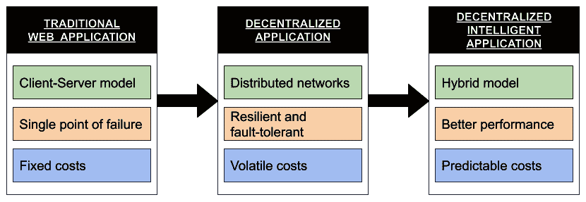

图 8.1：自互联网诞生以来应用程序的演变

在这里，我们可以观察到应用程序设计模式发生了三次重大转变。我们还可以观察到应用程序随时间演变的三个主要方面。

我们将在接下来的章节中讨论每一个。

## **传统的 Web 应用程序**

尽管互联网的基础工作在 1970 年代和 1980 年代已经奠定了，但是正是万维网使得信息如何在网络中的节点之间轻松共享有了显著进步。自公共互联网的问世以来，传统的 Web 应用程序，如博客、聊天室和电子商务网站，便开始出现在中期的 1990 年代。大多数互联网流量仍然由这些应用程序驱动，向互联网用户提供信息和服务。

这些应用程序大多以简单的后端 Web 服务器开始。服务器被托管以接受世界各地的有限客户端连接，但在达到所需阈值后很容易崩溃。现在，这些应用程序大多已经转向了 n 层架构。

当前使用的**n 层架构**，也称为**多层架构**或**多层架构**，用于管理诸如电子商务网站、社交媒体网站、聊天室、博客平台等大规模 Web 应用程序。为了便于公司进行用户执行的交易，专用基础设施在云上进行管理。与客户-服务器模型的原始版本相比，n 层模型将功能分为许多层（因此得名）。这也意味着在处理传统 Web 应用程序的故障和管理活跃性方面，n 层模型作为客户-服务器模型的更好版本。公司管理自己的基础设施，如服务器，这是向用户提供服务所需的。公司使用的大部分基础设施可以从云提供商那里购买或租用一段时间。这意味着运行传统 Web 应用程序的成本几乎是固定的。

现在，让我们试着了解过去十年中互联网上去中心化应用程序的演变。

## **去中心化应用程序**

去中心化应用的最主要特征是它不受单一实体的控制。另一个重要特征是它为使用应用程序提供了一个共同的入门标准。按照教科书的定义，Napster 和 BitTorrent 是一些最早的可以用于以点对点格式托管和共享各种文件的去中心化应用程序。

有些人可能会想知道区块链是否被用来构建这些应用程序。部分正确，这些点对点文件共享协议使用了我们今天在区块链中使用的基本加密和网络技术。

在撰写本文时，即 2020 年，我们将去中心化应用主要与运行在比特币和以太坊等区块链上的业务逻辑相关联。我们必须了解，去中心化应用也是一种设计模式，早在比特币发明之前就存在了。

将去中心化应用与传统 Web 应用进行比较，我们可以看到去中心化应用在多个服务器或计算机上运行。而且，这些计算机不一定由单一实体或个人拥有和操作。它们通常由愿意为了利益或激励而运行软件的相关方组成。因此，可以得出结论，大多数去中心化应用在点对点网络上运行。与传统 Web 应用不同，这些应用不会遭受单一故障点的影响。

这些点对点网络由一种协议定义，并且通常具有容错性，以保护用户免受许多攻击向量的影响。与客户端-服务器模型相比，由于其分布式拓扑结构，很难 compromise 一个点对点网络。在区块链协议中的激励机制和惩罚措施使得 compromise 网络的成本远高于从此类攻击中获得的回报。

虽然去中心化应用解决了前述两个问题，但由于与代币价格波动相关的成本，运行业务和关键任务应用的成本仍然具有挑战性。在撰写本文时，正在努力降低这种波动性，以便代表用户签署交易或提前为交易成本支付用户。

到目前为止，我们已经了解到传统 Web 应用和集中式服务以固定成本提供可预测的性能，而去中心化应用则提供独立的服务，而不会 risking 网络、供应商或用户。然而，我们也了解到，通过使用去中心化应用来实现独立性，我们在费用方面引入了一定程度的不确定性。最后，我们还观察到，用户选择集中式模型以在内部环境中实现性能和安全性。

现在，让我们尝试了解互联网上去中心化智能应用是如何发展的。

## **去中心化智能应用**

现在，由于商业模式正在倾向于透明和效率，需要一种新的设计模式，有利于追溯性，去中心化和可预测性的组合。去中心化智能应用程序可以在点对点网络中使用可靠的基础设施。这个网络由多个实体运营的节点组成，它们可能对为用户服务和发展他们的业务感兴趣。此类网络上的交易通常会在非常短的时间内确认，而费用显著更低。类似于大型公共网络，由于攻击的利益和执行攻击的成本之间的差值，试图破坏网络将会非常昂贵。

与其他模式之间的一个关键区别在于 AI 模型的更紧密集成，借助去中心化数据库的帮助。这使得可能构建具有可追溯性和洞察力作为一流特性的使命关键和业务中心的应用程序。

现在，让我们总结对所有三种模型的分析。

## **对比和分析**

通过权衡每种模式的优势和权衡，我们可以总结我们的学习并决定正确的设计模式。

在传统的 Web 应用程序的情况下，当使用集中和专用的基础设施时，我们可能会观察到更好的性能。交易将以合理且固定的成本实现几乎立即的最终性，适用于开发应用程序的公司。然而，这种设计模式可能缺乏其他设计模式提供的一些安全性和可追溯性功能。

在去中心化应用程序的情况下，我们可能会观察到合理的性能和可追溯性，但以可变的交易成本为代价。与传统 Web 应用程序相比，交易速度可能会受到影响。

在去中心化智能应用程序的情况下，我们可能会观察到大多数交易的可预测成本和几乎即时的最终性。除了更好的成本，速度，安全性和性能，该模式还为构建保护隐私的应用程序提供了去中心化存储，这些应用程序可以用于在用户数据上以道德方式使用 AI 模型从中获得可操作洞见。

现在，我们已经分析了三种主要模式，让我们用一个表格总结它们的区别：

| | **传统 Web 应用程序（App）** | **去中心化应用程序（DApp，dApp 或 Dapp）** | **去中心化智能应用程序（DIApp）** |
| --- | --- | --- | --- |
| **网络** | 使用客户-服务器模型与 n 层架构。 | 使用分布式网络拓扑来允许任何人加入网络。 | 使用分布式网络拓扑来允许任何人加入网络。 |
| **安全** | 单点故障的可能性很高。数据可能会因加密薄弱或数据集中控制而遭到黑客攻击或泄漏。 | 用户是数据的所有者。所有数据和操作都由唯一的密钥对保护。存储的数据量有限。 | 用户可以使用相同的密钥对安全地存储和操作更大量的数据，以便拥有自己的数据。 |
| **成本** | 一年内管理专用基础设施的固定成本。 | 交易成本不稳定，因为成本取决于区块链中本地代币的价格。 | 在小型但分散的节点组中，价格相对稳定。 |
| **透明度** | 应用程序和数据操作对用户或其他利益相关者不透明。 | 应用程序的逻辑和大部分操作都是透明的。私人交易是可选的。 | 逻辑和操作是透明的，提供了使用隐私而不损害安全性的选项。 |
| **性能** | 可以处理大量交易并实现即时最终性 | 由于节点的大规模分布，吞吐量较低。最终性较慢。 | 交易吞吐量较高。最终性也能迅速实现。 |
| **隐私** | 公司很少会在利用洞察力时练习完全的用户数据隐私和匿名性，因为数据托管在由组织控制的中心化或分散式数据库上。 | 通过钱包进行匿名处理，但在区块链网络上管理数据是一件昂贵的事情。用户的隐私取决于应用程序的政策。 AI 模型不经常使用。 | DIApps 旨在为用户提供完整的隐私和匿名性，同时以公平的方式利用 AI 提供有意义且可操作的洞察力，而不会损害用户的匿名性。 |

上面的表格显示了不同应用程序模式的优缺点。

现在我们已经快速回顾了应用程序的演变，让我们构建一个解决现实世界挑战的样本 DIApp。

# **构建样本 DIApp**

在这一部分，我们将涵盖问题陈述，找到所述问题的解决方案，根据 DIApp 设计模式设计技术架构，并观察如何开发启动 DIApp 所需的所有可交付成果。

让我们从以下部分了解问题陈述。

## **问题陈述**

一种名为**严重急性呼吸综合症冠状病毒 2 型**（**SARS-CoV-2**）的新型冠状病毒引发了一场名为**2019 冠状病毒病**（**COVID-19**）的新型大流行。在撰写本章节时，该病毒已经通过各种传播方式感染了全球超过 1100 万人，不幸地夺走了 50 万人以上的生命：这是人类历史书中的悲伤一页。尽管地方政府已经采取了措施减少这些感染，但一些病毒携带者似乎是无症状的。这意味着一个人可能携带病毒却不知情。有时，规定的检查也可能无法在患者体内孵化的早期阶段识别出病毒。

### **当前挑战**

这种病毒给人类带来了新的挑战。让我们来看看在撰写本章节时所面临的两个主要挑战。

+   **检测无症状患者中的病毒**：正如前面讨论的，SARS-CoV-2 病毒给医务人员带来了一个新的挑战，即识别人体内没有显示任何症状的感染。这些人可能被允许继续他们的日常生活，从而使他们所属社区的整体健康处于风险之中。这在安全检查中留下了一个巨大的漏洞，可能允许无症状的人接触公共服务或与可能从患者那里感染病毒的人交往。

+   **追踪病毒的传播**：尽管对于一些无症状的人，早期检测病毒是困难的，但随着时间的推移，症状会逐渐显现。一旦出现症状，并且这个人检测为阳性，追踪被诊断患者的所有行动以遏制感染就显得非常重要。在没有患者过去几周活动的准确历史记录的情况下，这是难以实现的。任何记录这些行动的努力都需要时间，并且由于人为错误而保持不准确。

为了遏制这种感染，医务人员采取了联系追踪措施。我们将在下一节中了解更多关于联系追踪的内容。

### **联系追踪**

联系追踪是一个过程，目的是识别过去几天或几周参与患者活动的所有人，自感染被诊断以来。这是卫生部门官员在与执法机构协调的过程。

联系追踪的一般工作流程如下：

1.  医生已经诊断该患者为 SARS-CoV-2 阳性。

1.  一个联系追踪员被分配到这个案例。

1.  联系追踪员与患者互动以识别患者的活动。

1.  根据司法管辖区/国家的不同，联系追踪员负责收集关于患者过去一定天数或周数的准确信息。例如，在印度，测试阳性的患者可能被要求分享他们过去 14 天的活动情况。

1.  根据患者提供的信息，接触追踪者可能会验证一些信息。

1.  如果患者分享的信息令人信服，将聘请更多的接触追踪者来确定受到患者感染的一级人员。

1.  一旦这种手动搜索结束，被联系到的人将接受病毒测试。

1.  根据司法管辖权，被联系到的人可能会被强制隔离 14 天，以检查是否出现症状。

1.  被隔离的人会定期接受病毒检测。

1.  如果没有病毒迹象，疑似病人将被释放。但是，如果他们测试呈阳性，同样的过程将重复。

尽管你可能会觉得这个过程安排得非常紧密和复杂，但许多国家仍然采用手动方式执行这里提到的大部分步骤。尽管一些国家选择利用数字技术自动化接触追踪，但他们并未考虑所有的感染因素。

### **接触追踪的问题**

正如我们之前讨论的，接触追踪是一个艰巨的过程。虽然一些国家已成功地能够通过数字方式自动化这个过程，但是很难跟踪来自非人类来源的感染。

我们往往忘记，有大量的假设认为病毒的起源可以追溯到生活在森林、乡村和城市地区的蝙蝠。许多研究人员也观察到，这种病毒可以在许多形式的表面上保留几个小时。现代供应链非常先进，货物可以在几个小时内从一个地方转移到另一个地方。不幸的是，供应链的高速提供了一个潜在窗口，病毒可能在货物在空中运输的时候从一个容器传播到另一个容器。这样的传染不仅危及正常商品的供应链，还可能感染许多使用这些产品但没有进行有效消毒的人群。在向公众交付货物之前评估感染的风险是必须考虑的。同样，我们希望保护我们的宠物和其他重要物种。

因此，有必要考虑监测动物和非生物物体是否感染了 SARS-CoV-2 病毒。因此，需要一种数字接触追踪算法，可以解决这两个生态系统中感染的可能性。

随着数字接触追踪对动物和物体的需求得到明确确认，让我们试图制定解决方案的方法。

## **解决方案方法**

由于我们正在开发一个样例应用程序来跟踪动物和非生物对象的潜在感染情况，我想将解决方案命名为**动物和物体的去中心化智能接触追踪**（**DICTAO**）。如前文所述，有必要跟踪动物和物体。为了透明度，我们必须能够在细粒度水平上追踪感染状态。具有分散和开放分类帐的公共区块链可以提供此功能。同样，我们必须理解全球供应链是一个繁忙的世界。手动跟踪所有潜在联系几乎是不可能的。同样，很难确定动物之间的潜在联系。因此，有必要采用自动但智能的方式来识别潜在感染并将其与噪音分离。因此，区块链和人工智能在追踪动物和物体方面的需求就此产生。

在接下来的章节中，我们将看到如何构建 DICTAO。

### **选择区块链技术**

如前所述，区块链对于维护动物和物体状态的透明度至关重要。由于这是一个构建样例 DIApp 的教程，我将保持上下文非常简单和易于理解。

以太坊网络有许多测试网络供开发人员在沙盒测试环境中部署和测试其应用程序。最著名的测试网络之一称为**Kovan**测试网络。Kovan 是基于**PoA**（权威证明）的以太坊区块链网络。它由以太坊开发者社区维护。Kovan 测试网络以其执行速度、可靠性和通过 Faucet 提供的免费测试以太币而闻名。您可以在这里阅读有关 Kovan 测试网络的更多信息：[`kovan-testnet.github.io/website/`](https://kovan-testnet.github.io/website/)。

Faucet 是供智能合约开发人员和用户免费获取测试网令牌的软件，而无需在本地 PC 上进行挖掘。大多数区块链测试网络都有各自的 Faucet。

我选择了 Kovan，只是为了帮助您尽可能轻松地理解和适应区块链。Kovan 是一个测试网络，因此不打算用于任何生产级别的以太坊应用程序。如果您希望为实际用例部署此示例，我建议您要么使用以太坊主网，要么偏好于 Matic 等侧链。如果您希望实时部署它，您可以在这里了解更多关于 Matic 侧链的信息：[`matic.network/`](https://matic.network/)。

### **选择去中心化数据库**

数字接触追踪通常涉及收集数据。为了提高准确性并提供高质量的预测，可以以高频率收集更多的数据。随着时间的推移，数据可能会变得非常庞大。这样的数据不应直接存储在区块链上，因为这会产生高昂的成本。此外，存储大量数据通常会导致瓶颈问题，并可能影响区块链的性能。因此，有必要将动物或物体的活动存储在去中心化数据库中。

我将使用 MóiBit 的 REST API 作为本示例 DIApp 的去中心化数据库。MóiBit 提供了一个开发者友好的 API 环境，这使得它成为一个容易的选择。

由于 MóiBit 是基于 IPFS 的去中心化存储服务，对新文件或现有文件的每一次更改都会生成一个新的哈希。类似于区块链，每个新的哈希代表了一个成功的状态变化。然而，与区块链相比，更新 MóiBit 上的数据将更加便宜和快速。由于它是由哈希驱动的，文件的完整性也得到了保障，并且易于验证。

要了解有关 MóiBit API 的更多信息，请访问其文档网站：[`apidocs.moibit.io/`](https://apidocs.moibit.io/)。

### **选择一种人工智能技术**

跟踪一个区域中的无数对象和动物——即使是一个小区域——将导致大量的数据点。在这些数据点上手动执行接触追踪几乎是不可能的。由于一些低质量的数据点，手动接触追踪者的努力很容易就会付诸东流。随着阳性病例数量的增加，手动接触追踪者的压力也会增加，以尽快关闭一个案例并转向下一个案例。这也可能导致感染的不准确识别。

为了减少错误并自动化清理、排序、分组和预测感染的过程，我们可以利用人工智能技术。

如前所述，合同追踪通常涉及分析感染者/动物/物体的活动过程。可以安全地假设，对位置数据进行快照，以及发生时间戳，将为潜在接触案例提供足够的见解。因此，我们将分析地理位置数据。

我们将使用地理空间分析来识别数据点中的一些异常情况。具体来说，我们将使用**基于密度的空间聚类算法与噪声**（**DBSCAN**）算法进行地理空间分析，以识别动物和物体之间的潜在感染情况。它是一种数据聚类算法，用于有效地将数据点分组在一个范围内，并且丢弃其他数据点无法到达的异常值。

要了解有关 DBSCAN 算法的更多信息，请参阅以下维基百科文章：[`en.wikipedia.org/wiki/DBSCAN`](https://en.wikipedia.org/wiki/DBSCAN)。

现在我们已经决定了示例 DIApp 中将使用的技术和技巧，让我们尝试以 DIApp 设计模式的形式将其形式化为一个参考技术架构。

### **示例 DIApp 的技术架构**

在本节中，我将提出示例 DIApp 的技术架构。基于前面各节中所做的决策，我将所有解决方案组件编译成一个图表，如下所示：

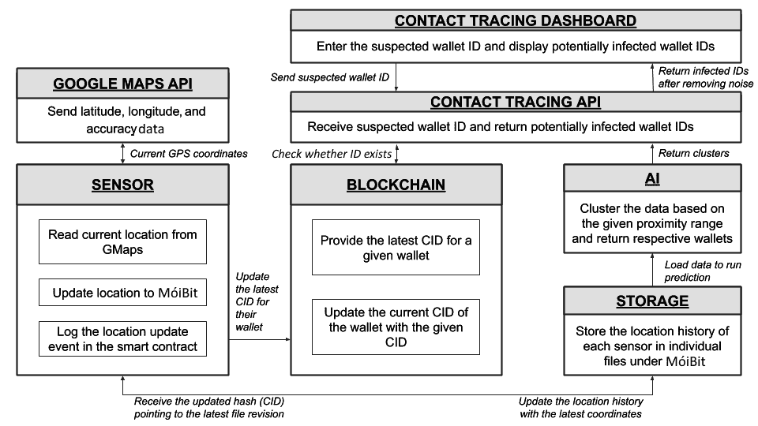

图 8.2：我们示例应用的 DIApp 参考架构

在上图中，我们根据 DIApp 设计模式中提出的 DIApp 参考架构代表了所有解决方案组件。现在，让我们逐个查看每个组件：

**传感器**：传感器是附在动物或需要在感染情况下进行跟踪的物体上的硬件设备。每个传感器都由在以太坊区块链上可识别的唯一钱包地址标识。此外，重要的是要注意，每个传感器都会在 MóiBit 上获得一个专用文件，其中可以存储相应传感器的位置历史。

一个应用将在传感器内运行。期望该应用能自动读取其位置并将位置更新到其在 MóiBit 上的专用文件中。传感器的当前位置可以通过调用地理位置 API 访问。在我们的示例 DIApp 中，我们使用 Google Maps API 来检索传感器的当前位置。当调用时，Google 地图地理位置 API 将经度、纬度和坐标的准确性返回给传感器。

为简单起见，我们将忽略 Google 地图 API 返回的准确性值，并将其余数据上传到 MóiBit。由于示例 DIApp 试图展示 AI 和区块链技术的融合，优化在本书中并不优先考虑。在预测感染时处理数据的准确性将超出本书的范围。然而，我期待与您线下解决这个问题。

现在，一旦传感器收到来自 Google 地图地理位置 API 的响应，数据将被重组并上传到 MóiBit 上的专用位置历史文件中。我们将在 *开发传感器客户端代码* 部分讨论客户端应用程序的设计和结构。

**区块链中的智能合约**：在示例 DIApp 中，智能合约的重要性在于为每个传感器执行的每个位置更新维护证明。每当传感器在 MóiBit 上更新其位置历史时，将向智能合约发出新的函数调用，以更新为传感器指定的相应钱包的**内容标识符（CID）**值。我们将在后面的章节中讨论智能合约的设计和结构。

**接触追踪仪表板**：接触追踪仪表板是一个简单的基于 Express 的 Node.js web 应用程序，它生成一个本地服务器来托管单个 HTML 文件。通过 Node.js 应用程序呈现的仪表板网页，用户可以输入疑似的钱包 ID。Web 应用程序执行基本的表单验证，并返回任何潜在感染的钱包 ID 列表。我们将在后面的章节讨论接触追踪仪表板的设计和结构。

**接触追踪 API**：接触追踪 API 接收用户跟踪疑似钱包 ID 的输入。这是一个后端 API，也会预测被感染的 ID，以便将它们返回给仪表板。我们将在后面的章节讨论接触追踪 API 的设计和结构。

## **开发智能合约**

在本节中，我们将讨论用于记录每次位置历史更新的证据的智能合约的设计和结构。如前一节所述，我们将使用以太坊区块链，因此我将向您展示如何用 Solidity 语言开发智能合约。

如果你对 Solidity 编程语言不熟悉，我建议你查看他们的网站以获取更多技术细节、知识和文档：[`solidity.readthedocs.io/`](https://solidity.readthedocs.io/en/v0.6.11/)。理解 Solidity 编程语言的语义对于理解本节内容并了解建议 DIApp 解决方案的智能合约的好处至关重要。

让我们从识别参与者开始。我们知道解决方案旨在追踪源自动物和物体的感染。因此，我们了解到跟踪设备或传感器是必要的。假设每个传感器都可以通过一个唯一的以太坊钱包地址进行识别。除了传感器，我们还有医疗专业人员和执法团队等最终用户，他们可能希望从给定的动物或物体中识别潜在的感染者：

1.  每当传感器有新的位置在 MóiBit 上更新时，它就会进行必要的更新，并从 MóiBit 那里收到一个哈希。我们正在使用该哈希和来自调用传感器的钱包地址在智能合约上维护一个映射。每当传感器更新一个新的位置坐标时，传感器的钱包地址对应的值就需要更新。因此，我们需要定义一个映射来记录对每个传感器位置历史所做的任何更改。我们可以用以下映射来做到这一点：

```
mapping(address => string) private deviceIDToLatestCID;
```

从上述映射中，我们可以看到地址作为一个唯一键，对应一个更新的字符串值，这基本上是从 MóiBit 收到的 CID，当对应传感器的位置更新时。

1.  除了前面的映射之外，我们还需要另一个映射来通过它们的地址跟踪所有传感器，以确认它们是否曾经更新过它们的位置。我们可以通过在以下映射中持久保存所有钱包地址的列表来实现这一点：

```
  mapping(address => uint256) private deviceIDExists;
```

从上述映射中，我们可以看到，每个更新了历史记录的传感器都会记录在这个映射中。我们很快就会了解到背后的原因。

1.  最后，我们将每个曾经更新过历史记录的传感器的地址记录到以下钱包地址数组中：

```
   address[] private deviceIDs;
```

从前面的数组声明中，指定用户可以访问智能合约中曾经更新过其位置历史记录的所有地址列表。不要将`deviceIDs`数组与`deviceIDExists`映射混淆。该数组用于直接访问每个传感器的钱包地址，而映射用于检查传感器是否已经更新了位置历史记录。

在我们继续讨论这个智能合约的功能方面之前，我们还有两个声明：一个修改器和一个事件。

1.  修改器是在执行函数之前必须满足的条件指令。如果函数的修改器条件不满足，则不会发生函数调用。在我们的情况下，我们使用一个修改器来控制谁可以更新位置历史记录映射：`deviceIDToLatestCID`。正如您可能已经观察到的那样，这个映射需要使用指向传感器最新位置历史记录的 CID 进行更新。但我们还需要确保只有传感器才能更新自己的值。其他传感器、用户或开发人员不应被允许更新未知传感器的位置历史记录。这个重要的设计决定将防止其他恶意行为者破坏区块链上正常传感器的声誉。

要实现这一点，我们可以使用以下修改器：

```
   modifier onlyBy(address _account) {
       require(
           *msg*.sender == _account,
           "Sender not authorized to update this mapping!"
       );
       _; // The "_;"! will be replaced by the actual function body when the modifier is used.
   }
```

从前面的修改器声明中，我们可以观察到，只有在调用者与正在区块链中更新其位置历史记录的地址相同时，才会执行具有前述修改器的函数。当我们了解到位置是如何通过`setLatestCID`函数更新时，我们将理解这个`onlyBy`映射的含义。但在此之前，让我们快速浏览一下事件的最后声明。

1.  当处理复杂用例时，事件非常有用。作为可能将一些以太币或其他代币存入钱包的用户，我们等待交易收据作为确认。对于某些逻辑执行的确认，我们不能只等待交易收据。可能需要触发其他子组件，具体取决于逻辑的成功执行。这时，事件就派上了用场。Solidity 中的事件是一种日志记录功能，它帮助非区块链应用程序找到一个线索点，并继续执行。

我们将在我们的智能合约中声明一个事件，如下所示：

```
   event MappingUpdated(address deviceID, string latestCID);
```

从先前的事件声明中，我们可以看到事件可以与传感器的钱包地址一起被发出，以及它的最新 CID。每当映射成功更新为指向 MóiBit 上传感器最新位置历史的新 CID 时，就会发出这个事件。

1.  我们将通过查看`setLatestCID`函数体来更多了解`MappingUpdated`事件的应用，如下所示：

```
   function setLatestCID(address deviceID, string memory latestCID)
       public
       onlyBy(deviceID)
   {
       deviceIDToLatestCID[deviceID] = latestCID;
       if (deviceIDExists[deviceID] == 0) {
           deviceIDs.push(deviceID);
           deviceIDExists[deviceID] = 1;
       }
       emit MappingUpdated(deviceID, latestCID);
   }
```

从前述函数声明中可以看到，`setLatestCID`是一个 setter 函数，允许每个传感器通过传递其钱包地址和指向 MóiBit 上最新历史的 CID 来更新自己的位置历史。`address`和`string`类型用于定义`deviceID`和`latestCID`输入参数。`deviceID`是调用函数的传感器的钱包地址，而`latestCID`是指向 MóiBit 上相应传感器最新历史的哈希。`public`关键字定义函数可以被全局任何人调用。然后，我们看到`onlyBy`修饰符被用来验证函数调用。它接受相同的输入参数`deviceID`并检查意图更新位置历史的调用者是否是传感器本身。如果修改器的条件验证为真，剩余的函数体将被执行。否则，交易将被撤销。既然我们对`setLatestCID`函数的标题有了充分的了解，现在让我们了解它的体。

在函数体内部，我们可以观察到`latestCID`的值立即被赋给了`deviceID`。一旦映射被更新，它会检查传感器是否之前更新了它的位置。这是通过检查`deviceIDExists`映射中相应传感器钱包地址的状态位来实现的。如果给定钱包地址没有条目存在，它会被添加到`deviceIDExists`映射中，并且相应的状态位值被设置为 1。同时，我们还可以观察到我们正在将`deviceIDs`数组附加到新数组上。在这种条件下更新此数组可以确保钱包地址不会作为重复项再次添加到数组中。这意味着`setLatestCID`函数只在新的传感器上线到智能合约时追加钱包地址。最后，一旦位置映射被更新并且状态位被管理，`MappingUpdated`事件就会被函数发出。你可以看到在括号中提供了输入参数来记录相应值的事件。这总结了`setLatestCID`设置函数的细节。现在，让我们来看一些智能合约中的其他`getter`函数。

1.  一旦我们为给定的传感器使用新的 CID 设置了位置历史映射，我们可能需要读取映射以获取传感器的详细信息。

因此，我们将定义一个`getter`函数来从映射中读取传感器的最新 CID，如下所示：

```
   function getLatestCID(*address* deviceID)
       public
       view
       returns (*string* memory latestCID)
   {
       return deviceIDToLatestCID[deviceID];
   }
```

正如你所看到的，`getter`函数`getLatestCID`读取一个输入参数。`deviceID`输入参数代表传感器的钱包地址，使用 Solidity 类型 address。由于任何人都应该能够查看传感器定期更新其位置的证明，我们必须使这个`getter`函数全局可访问。这可以通过使用`public`关键字实现。另外，由于这是一个仅从区块链获取数据而不打算进行更改的函数，也需要使用`view`关键字。这确保了`getLatestCID`函数具有只读权限。由于我们希望任何人都能调用该函数，因此对于此函数我们没有修饰符。在函数体中，我们只能看到一行指令，即从`deviceIDToLatestCID`映射中返回相应传感器的 CID 值。由于返回值是在映射中定义的字符串，函数的头部也定义了同样的。这总结了`getter`函数`getLatestCID`。

1.  现在让我们看一下后端脚本所需的附属函数。

我们将继续定义另一个`getter`函数，如下所示：

```
   function getDeviceIDsLength() public view returns (*uint256*) {
       return deviceIDs.length;
   }
```

正如你所看到的，`getDeviceIDsLength`是一个不接受任何输入参数，但简单返回`deviceIDs`数组当前长度的`getter`函数。因为我们需要从后端程序调用这个函数，所以我们也将此函数的可见性设置为`public`。与我们之前的函数类似，此函数也是一个只读函数，返回一个无符号整数值。因此，函数头部使用了`view`和`uint256`。这总结了`getter`函数`getDeviceIDsLength`。

1.  现在让我们来看一下合约中的最后一个函数：

```
   function getIDByIndex(uint256 index) public view returns (*address*) {
       return deviceIDs[index];
   }
```

正如您所看到的，`getIDByIndex`是一个`getter`函数，根据`deviceIDs`数组的索引值返回钱包地址。由于在 Solidity 中直接返回复合值比较复杂，我必须逐个读取它们。如果您是一个精通 Solidity 开发者，您可以消除这个函数，并在客户端直接读取整个数组，而无需花费太多气体成本。

完整的 Solidity 智能合约代码可在以下 GitHub 链接找到：[`github.com/PacktPublishing/Hands-On-Artificial-Intelligence-for-Blockchain/tree/master/Chapter08`](https://github.com/PacktPublishing/Hands-On-Artificial-Intelligence-for-Blockchain/tree/master/Chapter08)。

现在我们有了管理位置更新证明的方法，让我们继续为传感器开发客户端代码，该代码可以在 MóiBit 上进行位置历史更新并调用该合约。

## **为传感器开发客户端代码**

在本节中，我们将讨论传感器应用程序的设计和结构。该应用程序用于以周期性的方式获取传感器的当前位置，并将位置历史记录更新到 MóiBit。一旦成功更新了位置历史记录，MóiBit 收到的新 CID 或哈希值就可以作为证明，表明传感器通过周期性地更新其位置保持在正常状态。应用程序现在将调用适当的区块链功能，以维护其信誉。

我选择用 Python 语言实现这个应用程序，因为它是跨 **AI**、**物联网**（**IoT**）和区块链等领域的参考实现中广泛使用的语言。理解 Python 对于理解本节内容非常重要。我建议您注册一个 Packt 微课程，以了解 Python 语言的基本概念：[`subscription.packtpub.com/interactive-courses/data/introduction-to-python`](https://subscription.packtpub.com/interactive-courses/data/introduction-to-python)。

我的实现是一个单独的 Python 脚本。首先，以下 `import` 语句是确保 Python 脚本中必要调用的必需语句：

1.  请确保您使用 `pip install` 命令安装 `import` 语句中提到的第三方库：

```
import requests
import os
import datetime
import calendar
import time
import json
from web3 import Web3
import http.client
```

1.  在整个脚本中，我将使用一些重要的变量。它们如下：

```
url = 'https://www.googleapis.com/geolocation/v1/geolocate'
myobj = {'key': os.environ['GMAPS_API_KEY']}
```

从上面的代码块中，您可以看到 `url` 是一个字符串变量，包含了指向 Google Maps 地理位置 API 的 URL。`myobj` 是我在请求期间将传递给地理位置 API 的请求对象。由于地理位置 API 受到用户注册的 API 密钥保护，我需要在每次请求 Google Maps 地理位置 API 时传递这个密钥。在 `myobj` 变量中，您可以看到 `key` 映射到 `API KEY`，这个值在 shell 中设置，可以通过 `os.environ['GMAPS_API_KEY']` 访问。基本上，它获取了 `GMAPS_API_KEY` 环境变量的值，并将其用作 `key` 的对应值。我们将在后续部分看到如何设置 `GMAPS_API_KEY` 的值。

1.  现在，让我们了解一下我用于 MóiBit 操作的一些常见变量：

```
conn = http.client.HTTPSConnection("kfs2.moibit.io")
moibit_url = 'https://kfs2.moibit.io/moibit/v0/'
moibit_header_obj = {
   'api_key': os.environ['MOIBIT_API_KEY'],
   'api_secret': os.environ['MOIBIT_API_SECRET'],
   'content-type': "application/json"
}
```

正如您所看到的，`conn`是一个变量，表示传感器作为客户端与 MóiBit 作为服务器之间建立的 HTTPS 连接。`moibit_url`是一个字符串变量，指向 MóiBit API 的基本 URL。此外，`moibit_header_obj`是我需要作为请求头的一部分传递的 JSON 对象。由于 MóiBit API 也受 API 密钥和 API 密钥的保护，因此我需要传递这两个值以使用 MóiBit 网络对我的请求进行身份验证。分别将这两个值表示为`api_key`和`api_secret`字段。这两个字段再次分别映射到`MOIBIT_API_KEY`和`MOIBIT_API_SECRET`环境变量，`os.environ`从 shell 中获取对应环境变量的值。

最后，`content-type`字段表示请求头的元数据。由于它是一个 JSON 对象，我们使用`"application/json"`作为相应的值。

1.  现在，让我们看一下脚本中与区块链交互相关的变量：

```
blockchain_url = 'https://kovan.infura.io/v3/' + \
   os.environ['WEB3_INFURA_PROJECT_ID']
```

从前面的代码块中，我们可以观察到`blockchain_url`字符串变量指向以太坊科文测试网的 URL，该网址可通过服务提供商 Infura 访问。由于 Infura 的 API 也是受保护的，因此我们需要传递在 Infura 用户帐户下创建的项目 ID。这是因为我们在字符串末尾添加了`WEB3_INFURA_PROJECT_ID`环境变量的值，我们使用`os.environ`从 shell 中读取该值。

1.  由于我们要与区块链上的智能合约进行交互，因此我们还必须在我们的脚本中定义其相应的**合约应用二进制接口**（**ABI**），如下所示：

```
abi = """[{"anonymous": false,"inputs": [{"indexed": false,"internalType": "address","name": "deviceID","type": "address"},{"indexed": false,"internalType": "string","name": "latestCID","type": "string"}],"name": "MappingUpdated","type": "event"},{"inputs": [{"internalType": "address","name": "deviceID","type": "address"},{"internalType": "string","name": "latestCID","type": "string"}],"name": "setLatestCID","outputs": [],"stateMutability": "nonpayable","type": "function"},{"inputs": [],"name": "getDeviceIDsLength","outputs": [{"internalType": "uint256","name": "","type": "uint256"}],"stateMutability": "view","type": "function"},{"inputs": [{"internalType": "uint256","name": "index","type": "uint256"}],"name": "getIDByIndex","outputs": [{"internalType": "address","name": "","type": "address"}],"stateMutability": "view","type": "function"},{"inputs": [{"internalType": "address","name": "deviceID","type": "address"}],"name": "getLatestCID","outputs": [{"internalType": "string","name": "latestCID","type": "string"}],"stateMutability": "view","type": "function"}]"""
```

如果您不理解这个，不要惊慌。这基本上是合约的变量、函数以及输入和输出规范的序列化 JSON 表示。

如果您不是 Solidity 智能合约开发人员，我建议您通过访问[`solidity.readthedocs.io/en/v0.5.3/abi-spec.html`](https://solidity.readthedocs.io/en/v0.5.3/abi-spec.html)来熟悉 ABI。

1.  现在我们已经定义了对脚本功能至关重要的每个变量，让我们继续了解以下脚本的功能。

通常情况下，我们 Python 脚本的入口点始于`main()`函数，如下面的代码摘录所定义：

```
if __name__ == "__main__":
   main()

def main():
   # Fetching the Tracking ID locally, or generating a new one
   Tracking_ID = os.environ['WALLET_ADDRESS']
   print("# Setting tracking ID: ", os.environ['WALLET_ADDRESS'])

   # Getting the current geo-coordinates of the device
   print("# Getting the current geo-coordinates of the device from GMaps API")
   (latitude, longitude) = getGeoCordinates()

   # Reading the current UTC based Unix timestamp of the device
   print("# Reading the current UTC based Unix timestamp of the device")
   timestamp = getCurrentTime()

   # Generate the JSON structure
   jsonData = Marshal(Tracking_ID, latitude, longitude, timestamp)

   # Updating the location history to IPFS-based MoiBit network
   print("# Updating the location history to IPFS-based MoiBit network")
   latest_cid = updateLocationHistory(Tracking_ID, jsonData)

   # Publishing the proof to Ethereum
   print("# Publishing the proof to Ethereum")
   txnHash = CommitTxn(Tracking_ID, latest_cid)
   print("https://kovan.etherscan.io/tx/"+txnHash)
```

从上述代码块中，我们可以了解到当调用`main`函数时，它会从`WALLET_ADDRESS`环境变量中读取传感器的钱包地址作为`Tracking_ID`。一旦确定了其钱包地址，就会调用`getGeoCordinates`函数来获取当前的纬度和经度。现在我们有了当前的纬度和经度，立即调用`getCurrentTime`函数来获取该时刻的当前 UNIX 时间戳。现在，所有四个变量 - `Tracking_ID`、`latitude`、`longitude`和`timestamp` - 预计将形成一个 JSON 对象。因此，调用`Marshal`函数将这四个值分别编组成一个 JSON 对象，在`id`、`latitude`、`longitude`和`timestamp`字段下。结果变量`jsonData`现在准备好更新到 MóiBit 上专用于该传感器的相应位置历史文件中。现在，通过传递钱包地址变量`Tracking_ID`和`jsonData`来调用`updateLocationHistory`函数。一旦在 MóiBit 中更新了最新的位置数据，该函数将最新的 CID 作为`latest_cid`返回给主函数。现在，这个 CID 用于通过智能合约在区块链上签署一个新的交易。一旦交易被签署并放置在以太坊科文区块链上，交易哈希将作为`txnHash`返回。相同的哈希被后缀到一个 URL 上以进行预览。生成的 URL 可用于查看交易的状态。这总结了`main`函数。

1.  由于`main`首先需要地理坐标，因此它调用了以下定义的`getGeoCordinates`函数：

```
def getGeoCordinates():
   res = requests.post(url, data=myobj)
   geoCordinates = res.json()['location']
   lat = *float*("{:.7f}".format(geoCordinates['lat']))
   long = *float*("{:.7f}".format(geoCordinates['lng']))  return (lat, long) # Accuracy is not considered in the POC because optimizations are out of scope
```

从上述代码块中，我们可以看到`getGeoCordinates`函数正在向 Google Maps 地理位置 API 发送 POST API 调用，以及凭据一起发送。API 响应`res`被解析以提取纬度和经度。您可以观察到我们将两个值的小数度舍入到七位数。您还可以观察到我们忽略了`accuracy`字段，因为优化此解决方案仅仅是本书的范围之外。

1.  一旦`main`函数接收到`lat`和`long`值，它现在立即通过调用以下定义的`getCurrentTime`函数来捕获时间戳：

```
def getCurrentTime():
   dt = datetime.datetime.utcnow()
   timestamp = time.mktime(dt.timetuple())
   timestamp = *int*(timestamp)
   return timestamp
```

正如您从上述代码块中所看到的那样，`getCurrentTime`函数只是根据传感器的本地时间捕获 UNIX 时间戳并返回它。

1.  现在我们已经拥有了所有必要的数据，`main`函数需要以 MóiBit 可呈现的格式呈现它。因此，调用以下定义的`Marshal`函数：

```
def Marshal(Tracking_ID, lat, long, timestamp):
   data = {"id": Tracking_ID,
           "latitude": lat,
           "longitude": long,
           "timestamp": timestamp
           }   return data
```

正如您所见，`Marshal`函数只是取这四个值并以 JSON 格式返回数据的编组版本。

1.  准备好传感器的新位置数据后，将调用 `updateLocationHistory` 函数，该函数在此链接中定义：[`github.com/PacktPublishing/Hands-On-Artificial-Intelligence-for-Blockchain/blob/master/Chapter08/iot-client-code/python/main.py`](https://github.com/PacktPublishing/Hands-On-Artificial-Intelligence-for-Blockchain/blob/master/Chapter08/iot-client-code/python/main.py)：

如您所见，`updateLocationHistory` 函数通过调用 `checkIfFileExists` 函数检查 MóiBit 上是否已经存在传感器的专用文件。根据 `checkIfFileExists` 函数返回的状态值，如果 MóiBit 上不存在传感器的专用文件，则创建一个新文件。创建后，将 JSON 编组数据上传到新创建的文件，并将文件的 CID 返回到 `main` 函数作为 `latest_cid`。然而，如果 MóiBit 上已经存在传感器的专用文件，则首先下载传感器的当前位置历史记录，然后将新编组的位置数据追加到其中。追加后，更新的位置历史记录现在上传到 MóiBit。作为文件的新更新，将带有新位置数据的文件的 CID 哈希返回到 `main` 作为 `latest_cid`。

在出现任何错误的情况下，会打印适当的响应错误代码，以及响应体和标头中的数据。

1.  `checkIfFileExists` 函数定义如下：

```
def checkIfFileExists(*walletAddress*):
   print("checkIfFileExists(): Checking if /dictao/" +
         walletAddress+".json exists.")
   pre_payload = {"path": "/dictao/"}
   payload = json.dumps(pre_payload)
  conn.request("POST", moibit_url+"listfiles", payload, moibit_header_obj)
   res = conn.getresponse()
   responseObject = json.loads(res.read())
   if res.status == 200:
       if responseObject['data']['Entries'] == None:
           print("checkIfFileExists(): /dictao/" +
                 walletAddress+".json does not exist!")
           return False, ""
       else:
           for fileObject in responseObject['data']['Entries']:
               if walletAddress+".json" == fileObject['Name']:
                   print("checkIfFileExists(): Found /dictao/"+walletAddress +
                         ".json "+"with the hash "+fileObject['Hash'])
                   return True, fileObject['Hash']
   print("checkIfFileExists(): /dictao/" +
         walletAddress+".json does not exist!")
   return False, ""
```

`checkIfFileExists` 函数遍历整个 `dictao` 文件夹，检查是否有专门用于传感器的文件。由于文件名与钱包地址相同，因此只需传递传感器的钱包地址，然后检查 MóiBit 上是否存在专门用于传感器的文件即可。如果调用传感器的钱包地址是 `0xABC`，那么此传感器在 MóiBit 上的专用文件将是 `0xABC.json`。如果在您各自的 MóiBit 开发者帐户的根文件夹 `dictao` 下找到文件，则向 `updateLocationHistory` 函数返回布尔值 `True`。如果不存在这样的文件，则返回 `False`。

1.  最后，一旦 `main` 函数接收到传感器位置数据的更新 CID 哈希，就需要在区块链上维护此位置更新的证明。因此，它调用 `CommitTxn` 函数，其定义如下：

```
def CommitTxn(id, cid):
   print("CommitTxn(): Connecting to the ethereum network")
   w3 = Web3(Web3.HTTPProvider(blockchain_url))
   print("CommitTxn(): Initializing the live contract instance at " +
         os.environ['PROOF_SMART_CONTRACT_ADDRESS'])
   contract = w3.eth.contract(
       os.environ['PROOF_SMART_CONTRACT_ADDRESS'], *abi*=abi)

   print("CommitTxn(): Creating a raw transaction to call smart contract function setLatestCID()")
   nonce = w3.eth.getTransactionCount(os.environ['WALLET_ADDRESS'])
   setLatestCID_txn = contract.functions.setLatestCID(
       os.environ['WALLET_ADDRESS'],
       cid,
   ).buildTransaction({
       'chainId': 42,
       'gas': 3000000,
       'gasPrice': w3.toWei('1', 'gwei'),
       'nonce': nonce,
   })
   print("CommitTxn(): Signing the raw transaction with private key")
   signed_txn = w3.eth.account.sign_transaction(
       setLatestCID_txn, *private_key*=os.environ['WALLET_PRIVATE_KEY'])
   w3.eth.sendRawTransaction(signed_txn.rawTransaction)

   tx_hash = w3.toHex(w3.keccak(signed_txn.rawTransaction))
   tx_receipt = w3.eth.waitForTransactionReceipt(tx_hash)
   print("CommitTxn(): Sucessfully updated the CID in the blockchain. Transaction receipt:\n", tx_receipt)
   print("CommitTxn(): Checking the new/latest hash for the wallet from blockchain: " +
         contract.functions.getLatestCID(os.environ['WALLET_ADDRESS']).call())
   return tx_hash
```

从上面的代码块中，您可以看到`CommitTxn`函数正在使用钱包地址和最新的 cid，分别使用`id`和`CID`。该函数现在通过连接到由 Infura 运行的以太坊节点之一的新的`web3`对象与以太坊 Kovan 区块链网络进行连接。连接到以太坊 Kovan 区块链网络后，它连接到在区块链上部署的智能合约，通过传递合约地址。合同地址也作为`PROOF_SMART_CONTRACT_ADDRESS`传递到 shell 中，可以通过`os.environ`读取。使用这个地址，合同变量被初始化，并指向区块链上的智能合约实例。现在，通过使用输入数据`id`和`CID`，创建一个新的交易。通过 Python 的`web3`库提供的`buildTransaction`调用创建了这个事务。`chainId`字段表示以太坊 Kovan 区块链的网络 ID。

要了解每个参数传递给此函数的更多信息，建议您阅读`web3.py`发送原始交易的文档：[`web3py.readthedocs.io/en/stable/web3.eth.account.html#sign-a-contract-transaction`](https://web3py.readthedocs.io/en/stable/web3.eth.account.html#sign-a-contract-transaction)。

一旦交易已建立、发送并通过网络验证，将获得一个收据作为`tx_receipt`。我们等待这个收据，然后将交易哈希作为`tx_hash`发回`main`函数以供参考。这总结了`CommitTxn`函数。

现在位置历史数据已更新，并且在区块链上有了证据，让我们学习如何应用 AI 技术以预测潜在的感染。

## **训练模型**

在本节中，我将带您了解利用 AI 技术构建接触者追踪算法所需的所有步骤。我们将经历训练 AI 模型以预测结果或值时的常见步骤。借助我们的样本 DIApp，我们将了解训练 AI 模型时采取的 10 个常见步骤，并重新应用到我们的用例中。我们将使用 Jupyter Notebook 来解释所涉及的每个步骤。

构建基于 AI 的接触者追踪算法的步骤如下:

1.  **准备训练数据集**: 如前文所述，每个传感器的位置历史存储在 MóiBit 的单独文件中。每个文件作为主 DataFrame 的子集，将用于识别潜在的感染。一个单独传感器的 DataFrame 如下所示：

** 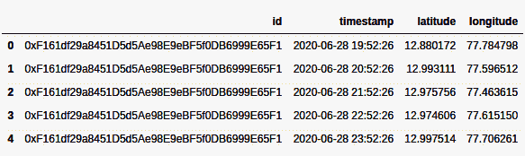**

图 8.3: 在 Jupyter Notebook 中使用 pandas DataFrame 视图捕获的单个传感器的位置历史

为了智能地检测潜在感染并对感染进行集群化，我们将使用 DBSCAN 算法。

**DBSCAN** 是一种数据聚类算法，它将高密度数据点与低密度点分离开来。这个算法是由 Martin Ester、Hans-Peter Kriegel、Jörg Sander 和 Xiaowei Xu 在 1996 年提出的。基本上，DBSCAN 算法将在某个空间中彼此靠近的一组数据点聚类在一起，并将离群值作为噪音忽略掉。

为了理解位置历史及其在 DBSCAN 中的适用性，我们生成了一个具有预设的随机 ID、时间戳和纬度-经度值的训练数据集。我们自己指定随机值并不容易也不安全。因此，我们使用了**JSON 生成器**工具。JSON 生成器允许用户以可定制的方式生成具有随机值的 JSON 文档。这是通过编程 JSON 生成器为给定字段使用特定值来实现的。

我们使用以下语法生成了 100 个具有随机 ID、时间戳、纬度和经度值的 JSON 对象：

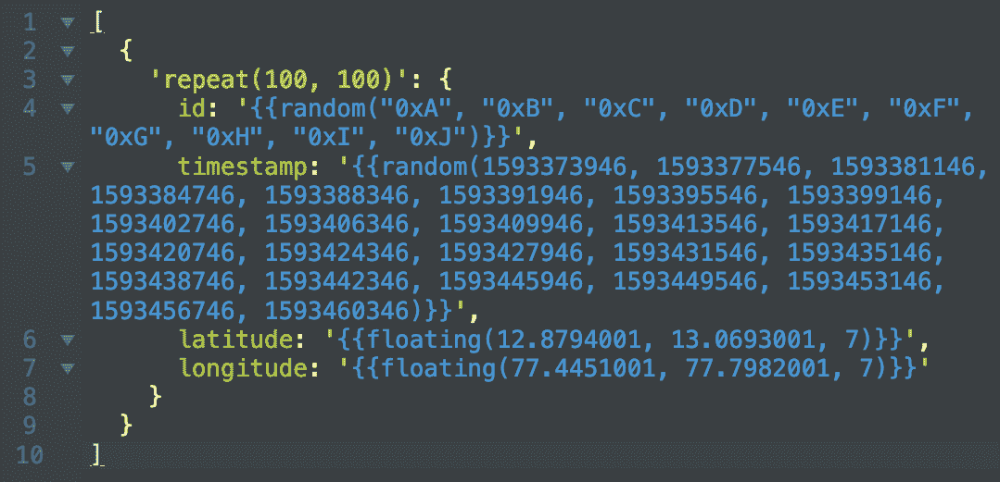

Fig 8.4: 生成训练数据集所需的模式在 JSON Generator 上

如前面的截图所示，模式指定了数据集中所需的所有四个属性。由于这是一个数据集，`id`属性具有一组虚拟钱包地址。`timestamp`属性也具有一组 UNIX 时间戳，范围在 24 小时内，每个之间都至少间隔 1 小时。最后，`latitude`和`longitude`属性也已被指定为在指定的最小值和最大值之间以七位小数精度接受任何值。

从前述的模式中，我们可以生成确切的 100 个随机 JSON 对象。但这可能不够。因此，我重新生成了一些随机 JSON 对象，形成了由 1,000 个 JSON 对象组成的训练数据集。我将前述模式生成的 100 个 JSON 对象重复 10 次。得到的数据集是 1,000 个随机 JSON 对象的数组。

可以通过执行`pandas`库的`head()`函数来在 Jupyter Notebook 上查看得到的数据集，如下所示：

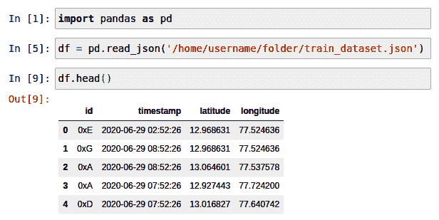

Fig 8.5**：** 在 Jupyter Notebook 上调用 df.head()函数的输出

如前述截图所示，我们可以看到在 Jupyter Notebook 上已经创建并读取了一个训练数据集。

1.  **分析训练数据集**：现在，我们已经创建了一个具有随机值的训练数据集，并将其加载到了 Jupyter Notebook 中，我们将对其进行进一步分析，以更好地理解数据集。这个过程被称为分析训练数据集。这一步可以帮助我们更好地了解数据点的性质以及它们的分布情况。

首先，我们通过调用`info`函数来描述如何获取有关数据集的顶线信息：

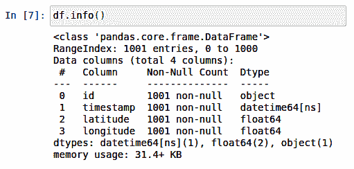

Fig 8.6**：** 在 Jupyter Notebook 上调用 df.info()函数的输出

从前面的截图中，我们可以观察到数据集中有 1,001 个条目。`info` 函数调用的输出还列出了 DataFrame 中的所有列，包括它们的类型。它还检查是否有任何空值。由于我们为 JSON 生成器设计的模式非常具体，因此 DataFrame 的任何行中都没有空值。

接下来，我们需要通过使用 `describe()` 函数让 pandas 描述数据集来了解数据点的分布：

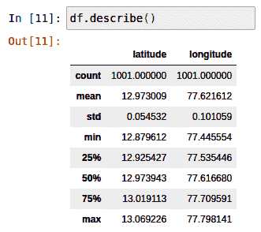

图 8.7：Jupyter Notebook 上 df.describe() 函数调用的输出

从前面的截图中，我们可以观察到相同 DataFrame 的统计摘要。我们可以看到，`count` 表示训练 DataFrame 中非空行的总数，`df.mean` 分别表示纬度和经度列的平均值约为 12.973009 和 77.621612。 `min` 分别表示 DataFrame 中记录的纬度和经度的最小值分别为 12.879612 和 77.445554。 `max` 分别表示 DataFrame 中记录的纬度和经度的最大值分别为 13.069226 和 77.798141。尽管 `count`、`mean`、`min` 和 `max` 突出了边界，但它们并不解释数据点的分布。但是，数据点的分布可以通过 `std`、`25%`、`50%` 和 `75%` 参数来理解。让我们了解一下它们的含义。

`std` 数值上表示纬度和经度值与平均纬度和经度值的距离有多远。在本例中，这些值分别为 0.054532 和 0.101059。由于我们在 JSON 生成器模式中输入了最小值和最大值范围，我们的训练数据集中的 `std` 值很低。尽管在 DataFrame 中的所有行看起来都很接近，但由于每个行之间的一次小数度变化或转变，它们彼此之间相隔数公里。

如果 `df` DataFrame 被排序，DataFrame 的前 250 列将具有从 12.879612 到 12.925427 的纬度值范围。同样，经度值将从 77.445554 到 77.535446 范围内。这由结果参数 `25%` 表示。通过在分析时级联 250 行，可以解释剩余参数 `50%`、`75%` 和 `max`。

还值得注意的是，摘要有助于了解数据点是否分布均匀。

1.  **特征工程**：特征工程通常涉及识别关键数据点，转换数据点，并对其进行整理以进行更好的分析。由于我们的数据集中没有缺失值或 NaN 值，我们将不会对数据集进行任何特征工程。

1.  **探索性数据分析**：接下来，我们将尝试对数据集进行可视化分析。由于我们正在处理地理数据，最好通过将它们与真实地图相对比来理解数据点。我们将使用 Plotly 库在真实地图上绘制纬度-经度坐标。通过这样做，我们将获得以下可视化效果：

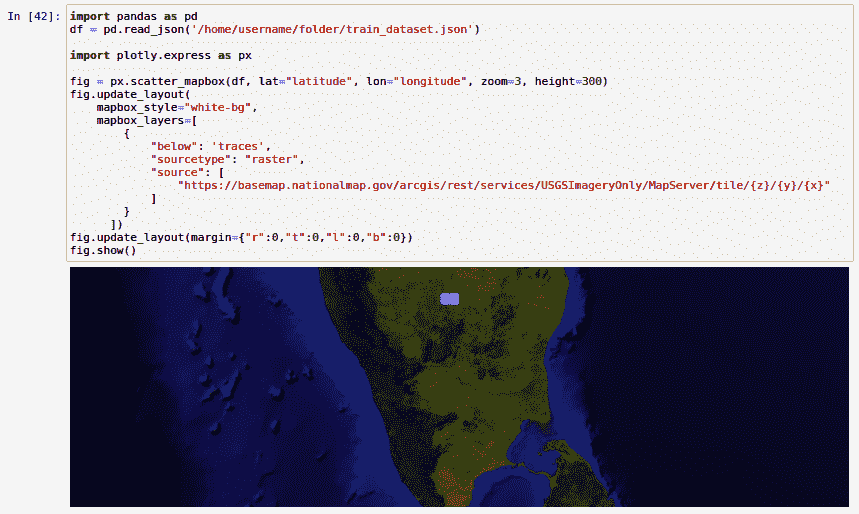

图 8.8**：在 Jupyter Notebook 上使用 Plotly 绘制数据点的图形输出

从上述截图中，我们可以看到所有数据点都被绘制在 Bengaluru 城市的许多区域。这是因为我们在训练数据集中设置了限制。正如您所看到的，我们在 JSON 生成器模式中手动设置了纬度和经度的限制。因此，在 Bengaluru 城市边界之外我们看不到任何其他数据点。在尝试此教程时，您可能希望根据您的要求更改它，并在 JSON 生成器模式中提到一个特定城市的纬度-经度范围，或者保持非常宽泛。

除了在地图上绘制纬度-经度数据外，我们还可以使用散点图来分析数据点。在散点图下，我们将纬度-经度值绘制在一个二维图上，其中*x*轴表示纬度，*y*轴表示经度。

现在，让我们来看一下在我们的训练数据集上的一个更简单版本的散点图：

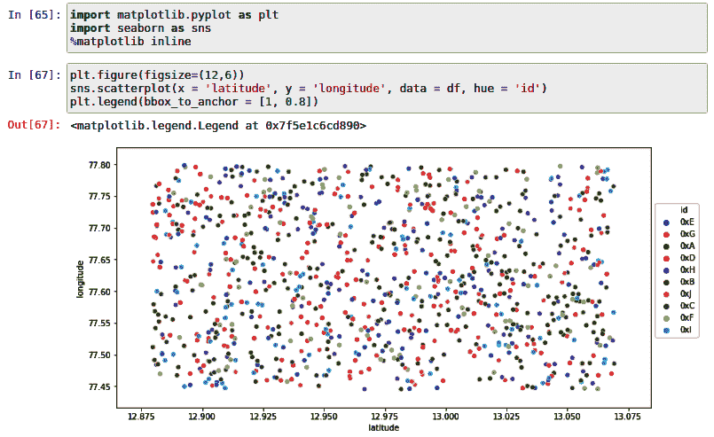

图 8.9：在 Jupyter Notebook 上使用 Seaborn 绘制数据点的散点图输出

从上述截图中，我们可以观察到在地理空间中随机分布的所有 10 个 ID 的位置历史。每种颜色代表一个 ID，而图表上的所有彩色点代表其相应的位置历史。您可以通过应用更多参数化过滤器并使用其他图表进行分析（包括但不限于箱形图、联合图、热图等）来变得更有创意。

要了解有关可视化您的训练数据集的更多信息，我建议您使用 Seaborn 和 Plotly。要了解有关 Seaborn 的更多信息，请访问[`seaborn.pydata.org/`](https://seaborn.pydata.org/)。要了解有关 Plotly 的更多信息，请访问[`plotly.com/`](https://plotly.com/)。

1.  **训练数据集的分割**：大多数情况下，我们将训练数据集分为两部分。一部分用于训练模型，而另一部分用于预测值并将预测值与训练数据集中的实际值进行比较。由于我们正在对数据进行聚类，并且不使用基于回归的模型来实际预测值，因此无需拆分我们的训练数据集。

1.  **选择模型**：在执行动物和物体的数字接触追踪时，一种方法是使用可以根据新发现的医疗数据和方法进行定制的聚类算法。虽然有许多聚类方法，例如 K-means、层次聚类和基于密度的聚类，但在这个示例应用程序中，我们选择了基于密度的聚类，因为它简单易懂，还提供了一些可应用于实际用例的定制。

K-means 聚类也很容易理解，但通常在分析地理坐标和空间数据时声誉不佳。虽然层次聚类可以帮助我们分析空间数据，但不像 DBSCAN 那样提供简单的学习曲线。

我们将使用 scikit-learn 机器学习库中提供的 DBSCAN 算法。

关于可用特征的更多信息，请访问以下链接：[`scikit-learn.org/stable/modules/generated/sklearn.cluster.DBSCAN.html`](https://scikit-learn.org/stable/modules/generated/sklearn.cluster.DBSCAN.html)。

1.  **训练和拟合**：现在我们已经创建了训练数据集，对其进行了分析并可视化了，我们需要使用训练数据集使用 DBSCAN 算法训练我们的模型，以对数据点进行聚类并明确识别它们。

根据全球许多从业者接受的医疗规范，普遍认为如果人们不保持至少 6 英尺的最小安全距离，我们可能会感染冠状病毒。因此，我们假设相同的接受度量单位用于身体距离，并创建我们的模型，以便对彼此连接且距离小于或等于 6 英尺的数据点进行聚类。

基于我们迄今为止讨论的标准，我们将使用 Jupyter Notebook 定义模型如下：

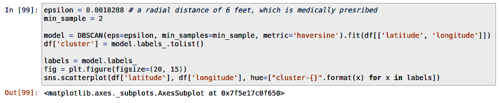

Fig 8.10：使用训练数据集初始化 DBSCAN 模型

从上述截图中，我们可以观察到基于 DBSCAN 算法初始化了一个`model`。输入给 DBSCAN 算法的是训练数据集 `df` 本身。除了 df，还发送了 `epsilon` 变量。`Epsilon` 是任意两个给定数据点之间的最大距离。我们选择 0.0018288 作为`epsilon` 变量的值，因为它是 6 英尺的公里等效值。这是设置基于 DBSCAN 的模型时的关键参数。除了`epsilon`，还向 DBSCAN 算法发送了 `min_sample` 变量以初始化模型。`min_sample` 定义了在`epsilon` 半径内需要存在的最小数据点数以形成一个聚类。我们选择 2 作为 `min_sample` 变量的值，因为传播感染需要至少两个参与者。

最后，我们需要选择度量函数，根据该函数计算数据点之间的距离。由于我们正在处理地理坐标，我们选择`haversine`作为度量函数，以计算数据点之间的距离以形成集群。

要了解更多关于 haversine 地理距离公式的信息，请访问以下维基百科文章：[`en.wikipedia.org/wiki/Haversine_formula`](https://en.wikipedia.org/wiki/Haversine_formula)。

一旦模型被初始化，集群就会形成，并且通过我们向训练数据集添加名为`cluster`的新列将其分配给相应的数据点。现在，您可以看到相同的 DataFrame 通过增加一个名为 cluster 的列进行了更新，如下面的屏幕截图所示：

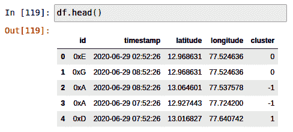

图 8.11**：**通过在 Jupyter Notebook 上调用 df.head()函数调用读取带有新列集群的 DataFrame 的更新内容

当集群在图上绘制时，*x*轴代表纬度，*y*轴代表经度，结果如下：

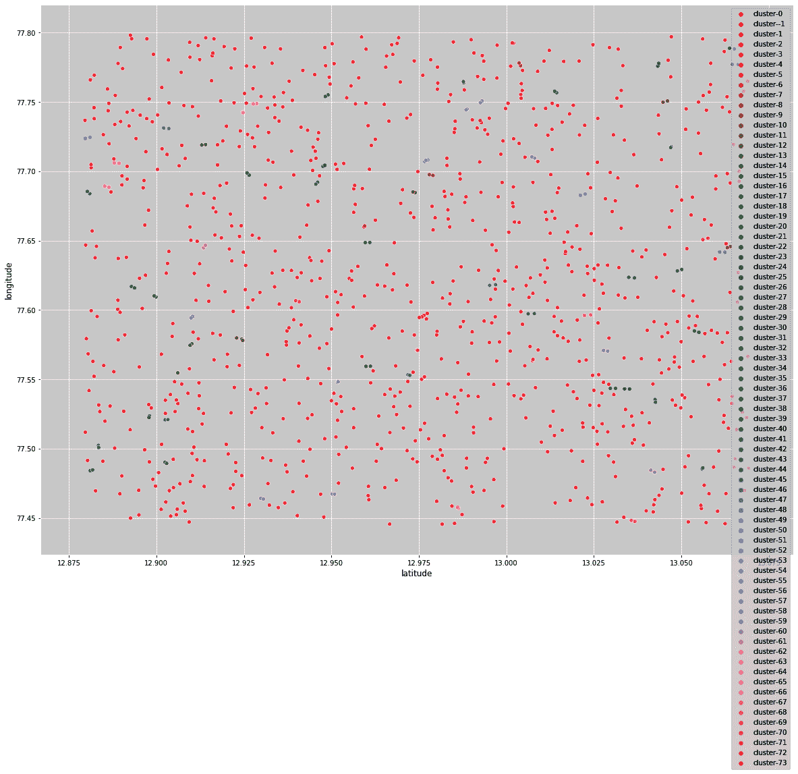

图 8.12：散点图显示所有集群，包括噪声

从前面绘制的图表中，我们可以观察到有 74 个正常集群，范围从**cluster-0**到**cluster-73**。还重要的是观察到还有一个名为**cluster--1**的集群，它代表所有不属于任何集群的数据点。这样的数据点被视为**噪声**，因此它们与我们进一步的接触追踪努力无关。如果传感器连接到可能已被隔离并且没有与戴传感器的另一个动物或物体进行交互的动物或物体，则会发生噪声数据点。

由于前面的图中有很多噪声，因此很难分析数据，因此让我们继续删除 DataFrame 中被视为噪声的所有数据点。

我们可以去除噪声并重新绘制图形如下：

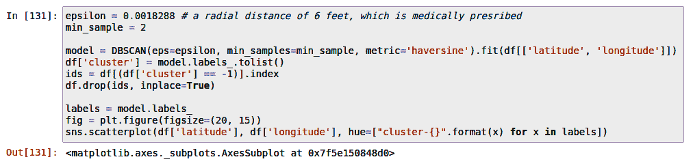

图 8.13**：**再次绘制前去除噪声集群

从前面的屏幕截图中，我们可以观察到我们已经删除了所有属于**cluster -1**的行。

结果图表更清晰，可以如下观察：

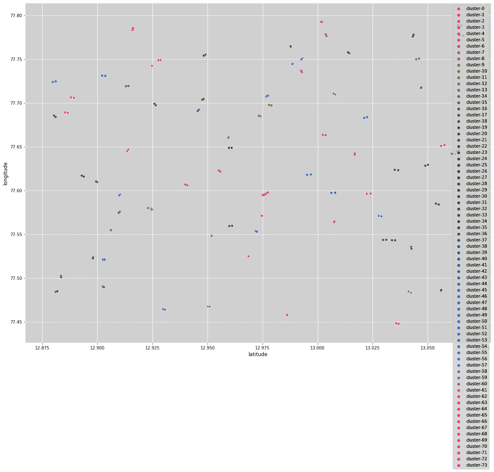

图 8.14：重新绘制没有噪声的集群

从前面的屏幕截图中，您可以观察到 DBSCAN 模型已成功初始化并配置了参数。现在，让我们检查模型的准确性。

1.  **评估模型**：通常，预测模型使用逻辑回归器或分类器。但在我们的示例应用程序中，我们不是在预测任何新值；我们只是使用机器学习将数据分割成更小的、定制的集群。

现在我们已经能够将数据集分成两个或两个以上数据点的簇，我们需要检查聚类是否有效。 简而言之，我们需要检查模型的基本正确性。 在我们的情况下，我们可以通过检查模型是否生成任何误报来进行基本评估；也就是说，我们需要检查模型是否将两个或两个以上的数据点聚类在一起，这些数据点的 haversine 距离大于指定距离。 如果这样的数据点被聚合到一个新的簇中，我们可以很容易地得出结论，即模型具有误报的限制。 同样，我们还需要检查模型是否容易产生错失检测；也就是说，我们需要检查模型是否将两个或两个以上的数据点聚类在一起，这些数据点的 haversine 距离小于指定的有效距离，但模型未能将其识别为潜在的感染。 由于本书的范围有限，我们将通过做一个观察来得出结论，即当前模型似乎会为 haversine 距离高达 10 米的数据点产生误报。 就错误的遗漏而言，我们没有观察到这样的异常或限制。

1.  **参数调整**：DBSCAN 算法只需要三个主要的输入参数。 它们是 `epsilon`，`min_sample` 和 haversine 度量函数。 除了这些参数，当您在系统上尝试此解决方案时，还可以添加一些更多的参数。

有关其他参数的更多信息，请访问以下链接的文档：[`scikit-learn.org/stable/modules/generated/sklearn.cluster.DBSCAN.html`](https://scikit-learn.org/stable/modules/generated/sklearn.cluster.DBSCAN.html)。

由于本书的范围有限，我不会专注于优化模型，因为它在聚类方面工作得相当不错。

1.  **预测感染**：现在模型已经准备好从 MóiBit 获取实时数据，并使用先前的参数对数据点进行聚类，以预测潜在的感染情况。 当然，由于模型尚未完全调整，对于相邻数据点的误报率可能高达 10 米，这超出了本书仅关注优化样本解决方案的范围。 

本节中的所有截屏都来自 Madhusudhan Kumble 的 Jupyter 笔记本。 笔记本的完整实现可在他的 GitHub 上找到：[`github.com/madatpython/PRANA/blob/packt/prana_contact_tracing_using_DBSCAN.ipynb`](https://github.com/madatpython/PRANA/blob/packt/prana_contact_tracing_using_DBSCAN.ipynb)。

现在我们已经了解了如何将 DBSCAN 算法应用于我们的用例，并且对其局限性有了一定的了解，让我们将这个模型合并到后端 API 中。

## **后端开发**

在本节中，我们将讨论接触追踪后端 API 的设计和结构。后端 API 负责通过读取钱包地址并返回任何其他潜在受感染传感器的钱包地址来执行接触追踪。

与传感器应用代码类似，我将使用 Python 语言实现接触追踪后端 API，因为它更容易弥合 AI、物联网和区块链社区之间的语言差距。

像往常一样，我们首先记录下所有必要的 `import` 语句，以便继续进行 API 的开发：

```
import os
import sys
import flask
from flask import request, jsonify
from web3 import Web3
import web3
import json
import http
from flask_cors import CORS
import datetime as dt
import pandas as pd
from sklearn.cluster import DBSCAN
```

请确保您通过 `pip install` 命令安装了所有外部软件包。

为了开发接触追踪后端 API，我将使用 Flask 框架。您可以在此处阅读有关 Flask Web 应用程序框架的更多信息：[`flask.palletsprojects.com/en/1.1.x/`](https://flask.palletsprojects.com/en/1.1.x/)。

我们通过定义 `flask` Web 应用程序来初始化 API，如下所示：

```
app = flask.Flask(__name__)
CORS(app)
app.config["DEBUG"] = True
```

正如您所见，API 允许互联网上的任何来源查询该 API。这是通过使用 `CORS(app)` 实现的。另外，我已经将应用设置为调试模式，以帮助您在按照这些说明操作时更多地接触到 API。

通过以下脚本指令来制作此 API 脚本的入口点：

```
app.run()
```

对于那些不熟悉 Flask 框架的人来说，这相当于我们在讨论传感器的 IoT 客户端代码时所讨论的 `main` 函数。

与其他程序类似，此 API 也以单个 Python 脚本的形式表现。因此，我们将不得不使用一些变量。

让我们在以下代码块中查看它们：

```
blockchain_url = 'https://kovan.infura.io/v3/' + \
   os.environ['WEB3_INFURA_PROJECT_ID']

abi = """[{"anonymous": false,"inputs": [{"indexed": false,"internalType": "address","name": "deviceID","type": "address"},{"indexed": false,"internalType": "string","name": "latestCID","type": "string"}],"name": "MappingUpdated","type": "event"},{"inputs": [{"internalType": "address","name": "deviceID","type": "address"},{"internalType": "string","name": "latestCID","type": "string"}],"name": "setLatestCID","outputs": [],"stateMutability": "nonpayable","type": "function"},{"inputs": [],"name": "getDeviceIDsLength","outputs": [{"internalType": "uint256","name": "","type": "uint256"}],"stateMutability": "view","type": "function"},{"inputs": [{"internalType": "uint256","name": "index","type": "uint256"}],"name": "getIDByIndex","outputs": [{"internalType": "address","name": "","type": "address"}],"stateMutability": "view","type": "function"},{"inputs": [{"internalType": "address","name": "deviceID","type": "address"}],"name": "getLatestCID","outputs": [{"internalType": "string","name": "latestCID","type": "string"}],"stateMutability": "view","type": "function"}]"""
```

正如您从前面的代码块中可以观察到的，我们正在使用与传感器应用相同的技术来访问区块链网络，并通过 ABI 访问智能合约。

同样，我们还重用了与 MóiBit 交互所需的变量：

```
conn = http.client.HTTPSConnection("kfs2.moibit.io")
moibit_url = 'https://kfs2.moibit.io/moibit/v0/'
moibit_header_obj = {
   'api_key': os.environ['MOIBIT_API_KEY'],
   'api_secret': os.environ['MOIBIT_API_SECRET'],
   'content-type': "application/json"
}
```

正如您从前面的代码块中可以观察到的，相同的变量用于从 MóiBit 访问资源。与传感器应用不同，这些变量将用于此脚本中读取每个传感器的位置历史记录并构建数据集以进行进一步分析。总而言之，所有这些变量都用于只读目的。

当运行脚本时，它按照以下方式逐步回退到定义的主页函数：

```
@app.route('/', *methods*=['GET'])
def home():
   return "<h1>DICTAO - Decentralized Intelligent Contact Tracing of Animals and Objects</h1><p>This is a simple demonstration of applying blockchain, decentralized storage and AI to solve the COVID-19 crisis.</p>"
```

如名称所示，`home` 函数是用于响应发送到 API 根的基于 `GET` 的 API 请求的处理程序函数。在这种情况下，我正在返回简单的 HTML 内容。

为了确保我们对任何非法请求或无效请求发送正确的响应，我们已经定义了 `page_not_found` 处理程序函数，如下所示：

```
@app.errorhandler(404)
def page_not_found(*e*):
   return "The given ID could not be found", 404
```

如前面的代码块所示，此函数返回一个字符串响应和一个 HTTP 响应代码 404，表示**文件/资源未找到**。

除了非法或无效的客户端请求，我们还需要涵盖可能发生的一些内部错误。这可以通过定义`internal_server_error`函数来实现，如下所示：

```
@app.errorhandler(500)
def internal_server_error(*e*):
   return e, 500
```

正如前面的代码块所示，当 API 程序调用`internal_server_error`函数时，除了错误或异常之外，还将将其返回给客户端，同时返回 HTTP 响应代码 500，这意味着服务器上发生了内部错误。

现在，我们已经通过设计相关通信来涵盖了 API，让我们专注于 API 程序的主要逻辑。我们的 API 将响应在`/api/v0/get_infections`端点向 Web 客户端发出的请求。例如，如果 API 托管在`example.com`上，则 API 调用必须发送到以下 URL：[`example.com/api/v0/get_infections`](https://example.com/api/v0/get_infections)。

现在，让我们继续支持此类 API 调用的逻辑。以下是代码链接[`github.com/PacktPublishing/Hands-On-Artificial-Intelligence-for-Blockchain/blob/master/Chapter08/backend-contact-tracing/server.py`](https://github.com/PacktPublishing/Hands-On-Artificial-Intelligence-for-Blockchain/blob/master/Chapter08/backend-contact-tracing/server.py)：

现在为`/api/v0/get_infections`端点设置了新的应用程序路由器。此路由器接受的 API 调用类型已设置为`GET`。这意味着服务器正在等待 Web 客户端的响应。 `get_infections`是处理抵达该端点的 API 调用的处理程序函数。正如您可能从代码中预测的那样，`get_infections`正在将潜在感染的钱包地址列表返回给 Web 客户端。

在本节中，钱包地址被表示为`ID`，因为它与后端和数据集的设计相一致。

当 API 从 Web 客户端接收到钱包地址时，会检查是否存在任何可能的数据损坏或丢失。如果收到的 ID 不是空字符串，则 API 通过检索智能合约上注册的所有钱包地址来进行下一步操作。对于在智能合约中注册的每个钱包地址，都会从区块链中检索到每个钱包的最新位置历史 CID。此外，每个 CID 都用于从 MóiBit 检索每个已注册传感器的位置历史数据。

相应的代码可以在以下代码块中看到：

```
def getLatestCID(*id*):
   w3 = Web3(Web3.HTTPProvider(blockchain_url))
   contract = w3.eth.contract(
       os.environ['PROOF_SMART_CONTRACT_ADDRESS'], *abi*=abi)
   cid = ""
   try:
       cid = contract.functions.getLatestCID(id).call()
   except web3.exceptions.ValidationError:
       print("ID does not exist!")

       return ""
   except:
       print("Some other error occured!")
       return ""
   else:
       print(cid)
       return cid
```

从上述代码块中，您可以观察到`getLatestCID`函数用于获取传感器的相应钱包地址的最新 CID，一旦`get_infections`函数检索到每个钱包地址。从智能合约中读取的 CID 值将返回给调用方函数`get_infections`。

现在`get_infections`处理函数包含了每个已注册传感器对应的钱包地址的 CID 哈希，它被用于从 MóiBit 检索位置历史数据，如下所示：

```
def getJsonDataFromMoiBit(*cid*):
   pre_payload = {"hash": cid}
   payload = json.dumps(pre_payload)
   conn.request("POST", moibit_url+"readfilebyhash",
                payload, moibit_header_obj)
   res = conn.getresponse()
   if res.status == 200:
       responseObject = json.loads(res.read())
       print(
           "updateLocationHistory(): Appending the captured data to historic data.")
       return responseObject
```

从前面的代码块中，你可以看到从`getLatestCID`函数检索到的`cid`被传递到`getJsonDataFromMoiBit`函数中。这个 CID 被用于检索相应传感器的最新位置历史数据。

现在数据可供分析后，我们在前一节中设计的基于 AI 的接触追踪算法就会出现。

AI 模型被纳入以下功能中：

```
def get_infected_ids(*input_id*):
   basePath = os.path.dirname(os.path.abspath('live_dataset.json'))
   dflive = pd.read_json(basePath + '/' + 'live_dataset.json')

   epsilon = 0.0018288 # a radial distance of 6 feet, which is medically presribed
   min_sample = 2
 model = DBSCAN(*eps*=epsilon, *min_samples*=2, *metric*='haversine').fit(dflive[['latitude', 'longitude']])
   dflive['cluster'] = model.labels_.tolist()

   input_id_clusters = []
   for i in range(len(dflive)):
       if dflive['id'][i] == input_id:
           if dflive['cluster'][i] in input_id_clusters:
               pass
           else:
               input_id_clusters.append(dflive['cluster'][i])

   infected_ids = []
   for cluster in input_id_clusters:
       if cluster != -1:
           ids_in_cluster = dflive.loc[dflive['cluster'] == cluster, 'id']
           for i in range(len(ids_in_cluster)):
               member_id = ids_in_cluster.iloc[i]
               if (member_id not in infected_ids) and (member_id != input_id):
                   infected_ids.append(member_id)
               else:
                   pass
   return infected_ids
```

如你所见，`get_infected_ids`函数可以被调用来获取所有潜在感染的 ID。当调用时，该函数基本上会对在运行时生成的实时数据集进行聚类，并检查给定的 ID 是否存在于任何一个聚类中。如果 ID 存在于聚类中，则认为所有相邻的 ID 受到冠状病毒感染的影响。同一聚类中的每个相邻 ID 都会被附加到一个数组中，并且对潜在感染的 ID 的搜索会继续，直到函数达到最后一个聚类。一旦识别出潜在感染的 ID，它们就会被返回给调用方函数`get_infections`。

## **开发前端**

在本节中，我们将讨论接触追踪仪表板 Web 应用程序的设计和结构。简而言之，我们称之为仪表板。仪表板的目的是帮助我们通过输入疑似与动物或物体相关联的传感器的 ID 或钱包地址来识别所有潜在感染的 ID。

仪表板应用程序仅由两个组件组成：托管静态文件的 Express 服务器和一个`index.html` HTML 文件，该文件从用户那里读取输入，调用接触追踪 API，并打印后端 API 返回的所有 ID。

仪表板 Web 服务器代码如下：

```
const express = require('express')
const app = express()
const port = 3000
app.use(express.static('public'));
app.get('/', (*req*, *res*) => res.send('Welcome to DICTAO: Contact tracing web app!'))
app.listen(port, () => *console*.log(`DICTAO: Contact tracing web app listening at http://localhost:${port}`))
```

正如你从前面的代码块中所观察到的那样，这是一个简单的基于 Express 的 Node.js 应用程序，它在本地端口 3000 上启动一个 Web 服务器，并开始为访问服务器根目录的用户托管`index.html`文件。Web 服务器还记录客户端发出的所有请求。

你可以访问仪表板的标记代码[`github.com/PacktPublishing/Hands-On-Artificial-Intelligence-for-Blockchain/blob/master/Chapter08/frontend-tracking-dashboard/public/index.html`](https://github.com/PacktPublishing/Hands-On-Artificial-Intelligence-for-Blockchain/blob/master/Chapter08/frontend-tracking-dashboard/public/index.html)：

从上述代码块中，我们可以观察到标记代码`index.html`托管了一个简单的表单，用于从用户那里获取疑似传感器的钱包地址。用户点击提交按钮时，输入将被确认。点击提交按钮时，将调用 JavaScript 的`getInfectedIDs`函数。`getInfectedIDs`函数负责执行基本表单验证，并在出现任何故障输入时向用户发出警报。如果没有故障输入，则该函数负责调用接触追踪后端 API 以检索潜在感染传感器的列表。如果它从 API 收到非空响应，则会在表中填入收到的 ID 或钱包地址。

现在，让我们来看看可用于测试我们的示例 DIApp 的一些测试工具。

# **测试示例 DIApp**

不幸的是，由于本书的范围有限，我们无法在测试方面涉及太多内容，所以在本节中我将指引您查阅一些相关资源。

+   **智能合约测试**：Truffle 是 Solidity 智能合约开发中最著名的工具链之一。您可以按照其文档中提到的测试说明进行操作，文档链接在这里：[`www.trufflesuite.com/docs/truffle/testing/testing-your-contracts`](https://www.trufflesuite.com/docs/truffle/testing/testing-your-contracts)。

+   **传感器实现测试**：传感器应用是使用基本的 Python 编程技能实现的。您可能已经观察到脚本与 Google 地图地理定位 API、以太坊和 MóiBit 进行交互。因此，我建议您对 HTTP 客户端代码进行大量测试。我强烈建议您使用尽可能多的测试用例进行单元测试。您可以通过查看以下链接上提供的 Python 文档来了解有关测试基本 Python 代码的所有信息：[`docs.python-guide.org/writing/tests/`](https://docs.python-guide.org/writing/tests/)。

+   **测试 AI 模型的准确性**：使用**平均绝对误差**（**MAE**）测试 AI 模型非常简单直接。但是，在我们的示例 DIApp 中，我们并未使用回归器或分类器。因此，我建议您通过添加新数据点来对数据集进行调整，以便手动验证结果。您可以检查模型在此类边缘情况下是否会出现假阳性或假阴性。这是您熟悉地理空间分析的机会！根据我的经验，在计算无监督聚类算法的准确性方面，找到相关内容非常少见。

然而，还有一些隐藏的资源。我建议你阅读 [`www.cs.kent.edu/~jin/DM08/ClusterValidation.pdf`](https://www.cs.kent.edu/~jin/DM08/ClusterValidation.pdf) 以了解更多关于通过各种方法测量聚类算法准确度的内容。您还可以访问 scikit-learn 文档，其中强调了一些聚类性能方面：[`scikit-learn.org/stable/modules/clustering.html#clustering-performance-evaluation`](https://scikit-learn.org/stable/modules/clustering.html#clustering-performance-evaluation)。

+   测试接触追踪后端 API：由于我们使用 Flask 框架编写了我们的 API，我强烈建议你访问 Flask 官方测试文档以获取有关测试 Flask Web 应用程序的更多信息：[`flask.palletsprojects.com/en/1.1.x/testing/`](https://flask.palletsprojects.com/en/1.1.x/testing/)。我建议你为脚本中定义的每个路由和处理程序函数测试每个路由，使用超过一个测试用例进行测试。

+   测试 Web 仪表板前端应用程序：最后，前端 Web 应用程序是一个简单的实现。由于 Node.js 端没有太多需要测试的内容，我建议你在 `index.html` 中测试内联 JavaScript 函数，以获得更好的表单验证、分页和其他可以改善用户体验的边缘情况。

现在你已经基本了解了测试工具和技术，让我们部署样本 DIApp 解决方案。

# 部署样本 DIApp

到目前为止，在本章中，我们已经能够解释问题陈述，设计解决问题的方案，构建解决方案，并就测试提出了一些建议。如果你自己部署此应用程序，整个努力将会是有意义的。因此，在接下来的几节中，我将建议你注册所需的适当服务，以部署此样本 DIApp。我还会指导你使用另一个重要的特殊配置管理软件在本地系统上设置运行这些程序所需的内容。

## 注册 Google 地图 API

正如你所知，我们使用 Google 地图地理位置 API 获取传感器的当前纬度和经度坐标。因此，请按照以下文档中的说明操作，并获取自己的 API 密钥：[`developers.google.com/maps/premium/apikey/geolocation-apikey`](https://developers.google.com/maps/premium/apikey/geolocation-apikey)。确保不要与任何人共享您的 API 密钥。重要的是，您不要在开源代码托管平台上传播 API 密钥。如果您的 API 密钥被暴露且仍然有效，有人可能会利用此凭据，并且这将给您带来一张昂贵的发票。如果您认为您的 API 密钥可能已经暴露，您可以删除或禁用它，并为我们的样本 DIApp 重新生成一个新的 API 密钥。

## 注册 MóiBit

正如你所知，我们使用 MóiBit 分布式文件存储 API 来存储每个传感器的位置历史数据。因此，你需要注册 MóiBit API。MóiBit 的注册流程非常简单。你可以在以下链接注册 MóiBit：[`account.moibit.io/#/signup`](https://account.moibit.io/#/signup)。一旦你验证了你的电子邮件地址和密码，将为你生成一个新的 API 密钥。

使用这些凭据，你应该在根文件夹下创建一个新文件夹。请在那里创建一个新文件夹，并将其命名为 `dictao`，因为它已经硬编码到我们当前的实现中。这样可以确保所有文件都将被保存在一个专用文件夹中。这也将帮助你在不烦乱或混乱的情况下使用 MóiBit 用于其他应用程序。再次确保你的 API 密钥不可见或对公共可访问。

## **注册 Infura**

我们使用 Infura 连接到以太坊 Kovan 区块链。你需要创建一个新的 Infura 账户并创建一个新项目。一旦你创建了一个新项目，你将需要复制项目的凭据，并使用它们来获得使用 Infura 基础设施的专用访问权限连接到区块链。Infura 的注册流程也非常简单。你可以在这里注册 Infura 账户：[`infura.io/register`](https://infura.io/register)。

## **更新你的本地 justfile**

正如你可能已经观察到的，我们在样本 DIApp 中使用了很多凭据。为了确保这些凭据得到安全管理，我建议你在主机上管理一个隔离的文件，可以将这些凭据私下共享给相应的进程。为了实现这一点，我们将使用 `just` 命令。你可以通过遵循 GitHub 上提供的说明安装 `just` 命令：[`github.com/casey/just#installation`](https://github.com/casey/just#installation)。请按照最适合你系统的安装说明操作，并确保你创建一个 `justfile`，该文件不受 `git` 协议跟踪。这可以通过将名称 justfile 添加到 `.gitignore` 文件中实现。

通过用适当的凭据替换问号填写必要的字段，填写你现在已经注册的服务的凭据：

```
export GMAPS_API_KEY := "?"
export MOIBIT_API_KEY := "?"
export MOIBIT_API_SECRET := "?"
export WEB3_INFURA_PROJECT_ID := "?"
export PROOF_SMART_CONTRACT_ADDRESS := "?"
export WALLET_PRIVATE_KEY := "?"
export WALLET_ADDRESS := "?"

run-client:
    python iot-client-code/python/main.py

run-web:
    cd frontend-tracking-dashboard && node index.js

run-server:
    python backend-contact-tracing/server.py

install-dependencies:
    pip install --user -r requirements.txt
    cd frontend-tracking-dashboard && npm install
```

根据你编写源代码的位置，你可能还需要更改源代码文件的相对路径。只需确保 justfile 在项目文件夹的根目录中，你可以在该目录中管理本章的所有源代码。

现在，你的 **justfile** 已经准备好启动必要的应用程序，以及你的凭据。

## **部署智能合约**

将最终的智能合约代码粘贴到[`remix.ethereum.org/`](https://remix.ethereum.org/)并在以太坊 Kovan 测试网区块链上部署合约。如果您对 Remix IDE 或智能合约开发不太熟悉，我建议您按照官方 Remix 文档提供的说明进行操作，官方 Remix 文档链接：[`remix-ide.readthedocs.io/en/latest/create_deploy.html`](https://remix-ide.readthedocs.io/en/latest/create_deploy.html)。

## **部署客户端代码到传感器**

在本节中，我将向您展示如何部署传感器应用程序。您可以通过运行以下`just`命令来部署传感器应用程序：

```
just run-client
```

如果您输入的凭据有效并且在服务配额内，您的客户端应用程序将运行。另外，请确保 justfile 中 Python 脚本的相对路径已更新。

## **部署后端 API**

在本节中，我将帮助您启动接触追踪后端 API。您可以通过运行以下`just`命令来部署接触追踪后端 API：

```
just run-server
```

如果您输入的凭据有效并且在服务配额之内，您的后端 API 将运行。另外，请确保 justfile 中 Python 脚本的相对路径已更新。

## **部署 Web 仪表板**

在本节中，我将帮助您启动前端 Web 仪表板，该仪表板可用于查询任何潜在感染的后端。您可以通过运行以下`just`命令来部署 Web 仪表板应用程序：

```
just run-web
```

如果您输入的凭据有效并且在服务配额内，您的仪表板应用程序将运行。另外，请确保 justfile 中 Node.js 脚本的相对路径已更新。

如果您对设置过程或代码感到困惑，您可以在以下 GitHub 链接中找到完整的实现，包括 justfile 模板：[`github.com/PacktPublishing/Hands-On-Artificial-Intelligence-for-Blockchain/tree/master/Chapter08`](https://github.com/PacktPublishing/Hands-On-Artificial-Intelligence-for-Blockchain/tree/master/Chapter08)。在 justfile 的相应字段中添加您的凭据，然后您应该可以轻松部署。如果您在理解代码或运行代码时遇到困难，请随时提出问题。您还可以通过分叉存储库并创建包含建议更改的拉取请求来提出对分支的改进。

# **回顾样品 DIApp**

在本节中，我们将尝试分析所提议的样品 DIApp 的优缺点。

## **样品 DIApp 的优点**

下面是我们提议的样品 DIApp 解决方案的一些优点：

+   它涵盖了除人类之外的其他感染源。

+   它有助于恢复全球经济和正常状态。

+   它允许保险公司和组织评估供应链风险。

然而，我们必须承认和理解样品 DIApp 中的一些限制。

## **样品 DIApp 的限制**

以下是我们提出的示例 DIApp 解决方案的一些局限性：

+   AI 算法可能存在一些误报的情况。需要进行优化。

+   由于缺乏硬件精度、软件准确性和更好的计算复杂度方法，当前的 DIApp 实现无法投入生产使用。

+   由于 GPS 无法识别传感器当前所在的楼层，DIApp 无法追踪室内感染。可以考虑其他替代方案，如 Wi-Fi、蓝牙、手动签到登记和 CCTV 图像分析，以提高模型的准确性。

现在，让我们来看看一些未来的增强。

## **未来的增强**

我认为提出的示例 DIApp 仅仅是新革命的开始。您可以考虑对代码进行以下增强：

+   除 GPS 外，使用其他输入模式获得更好的精度

+   通过优化模型以防止误报获得更好的准确性

+   更好的数据保留管理以保护隐私

+   安装信标以开发热图并评估风险

你可以通过为每个建议创建新的问题或参与现有问题线程，在 GitHub 上随时与我联系。

# **摘要**

AI 和区块链都是重要的技术，正在催化创新的步伐。这两种技术的结合预计将重新设计整个工业范式。本章阐述了我们如何使用各种 AI 技术和模型来赋能区块链及其分布式应用。我们涵盖了应用程序的演变并对比了不同类型。我们还解释了 COVID-19 大流行带来的最新问题，并讨论了如何通过以接触追踪为例的使用案例来解决这些问题。我们介绍了问题陈述、解决方案方法和技术架构，以开发一个使用 DIApp 设计模式的示例接触追踪应用程序。我们还突出了测试每个解决方案组件所需的工具，并使其更加健壮。最后，我们解释了如何注册使用解决方案的每个依赖服务。本章使您能够形成一种思维范式，即结合 AI 和区块链技术，开发旨在为下一代互联网带来生产力和健壮性的应用程序。

如果本章中 DIApp 教程激发了您的灵感，我强烈建议您将所学内容贡献给一个名为 Tracy 的实际用例。Tracy 是一个保护隐私的移动应用套件，为公民、企业和政府机构提供许多功能，以便他们处理 COVID-19 大流行及其后续。要了解有关如何为 Tracy 做出贡献的更多信息，请加入 Telegram 社区，网址为[`telegram.me/ProjectTracy`](https://telegram.me/ProjectTracy)。

在下一章中，我们将覆盖构建 DIApps 的潜在用例，其中区块链、人工智能和分布式存储可用于解决具有挑战性的问题。
