人工智能与区块链的未来*"让我们用区块链和人工智能言行一致！"*

在本书的最后一章，我们将一窥人工智能和区块链技术的未来。我们将探讨如何将这些技术结合起来，以解决影响许多行业和我们星球的一些最大问题。在本章中，我还提出了多个建议，可作为感兴趣的学生和教职员工新项目的新想法。如果您是一名职业人士或爱好者，您仍然可以考虑将这些想法作为一个副业项目，并与愿意在闲暇时间进行新想法头脑风暴的人合作。

在本章中，我们将涵盖以下主题：

+   人工智能和区块链的融合

+   人工智能与区块链的未来

+   企业中融合人工智能和区块链

+   政府中融合人工智能和区块链

+   金融服务中融合人工智能和区块链

+   人力资源中融合人工智能和区块链

+   医疗保健中融合人工智能和区块链

+   供应链管理中融合人工智能和区块链

+   其他领域中融合人工智能和区块链

# 技术要求

本章需要对区块链和人工智能有基本的概念性理解，这些理解在第一章，*区块链入门*，和第二章，*AI 景观介绍*中有所阐述。本章还需要您在第三章，*AI 和区块链的特定领域应用*，以及第五章，*利用人工智能增强区块链*中，进行新想法的头脑风暴和推测以观察结果。

本章还要求您重新应用从第七章学到的设计模式，*DIApp 的开发生命周期*。最后，本章可以通过提出构建能够解决许多现实世界挑战的 POC 的想法来帮助您深入研究区块链和人工智能开发。如果您能够按照第八章中阐述的步骤构建基于区块链和人工智能的智能应用程序，也将是有益的。

# 人工智能和区块链的融合

由于您已经到达本书的末尾，人工智能和区块链技术不再只是口头禅。以太坊等公共区块链网络上的创新金融工具管理着数十亿美元的资产。人工智能应用于预测性医疗保健、癌症研究和接触追踪 COVID-19 感染。这两种技术都以间接的方式服务于人类。正如第五章中所解释的，*利用人工智能增强区块链*，人工智能和区块链的结合应用正在帮助解决许多当今关键用例。

现在，您已经掌握了这两种技术的基本概念和实际技能，让我们通过一些想法，来解决一些现实世界的问题，将人工智能和区块链融合起来。

# 人工智能和区块链的融合未来

目前正在进行多项实验，旨在构建新一波的数字解决方案，其中人工智能和区块链可以共存，以提供能够加快决策速度并为所有利益相关方提供所需透明度的最佳解决方案。一些公司已经发布了产品和商业解决方案，为消费者和企业业务提供了这两种技术的融合。

我们需要明白，这种融合刚刚开始，因为我们还没有探索最佳的人工智能技术与可行的区块链和去中心化存储网络的结合。

在下图中，我提供了 DIApp 的混合解决方案架构的一般表示：

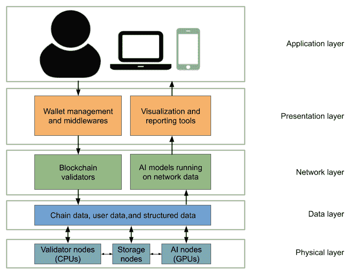

图 9.1：DIApp 的参考解决方案架构

上图是 DIApp 解决方案的参考架构的图示表示。我已经确认了解决方案中涉及的所有主要资源和利益相关方，跨越五个层面。我以分层格式呈现了这一点，类似于**开放系统互联**（**OSI**）模型，以便更好理解这个概念。我们已经了解了如何在第八章中使用多个区块链平台和人工智能技术，*DIApp 的实施*。在本章中，我们将以一个涉及所有共同利益相关方和主要技术组成部分的解决方案的方式来呈现相同的知识。

OSI 是一个在上世纪 70 年代末构思的网络模型。它由**国际标准化组织**（**ISO**）于 1984 年发布。ISO 模型由七层组成：物理层，数据链路层，网络层，传输层，会话层，表示层和应用层。

在探索现实世界的挑战之前，让我们从上图中了解解决方案架构的所有五个层面。

这些层次如下：

+   **应用层**：应用层包括端用户和安装在手机、笔记本电脑和设备上的客户端软件。用户将通过中间件签署交易，并通过演示工具访问数据。应用层还代表了更广泛的部署设施，并通过特殊工具如**身份和访问管理**（**IAM**）管理器对 DIApp 进行管理。

+   **表示层**：表示层包括对终端用户不可见的客户端中体现的后端功能。这一层包括了启用应用程序中区块链功能所需的所有支持工具和软件，如签署交易、传播已签署的交易和接收结果。该层还包含了用于启用用户从应用程序中获取洞察力的人工智能相关功能所需的工具，如可视化和报告。

+   **网络层**：顾名思义，网络层由包含在软件包中运行的区块链验证节点组成的服务网络，用于验证用户交易和区块。类似地，网络层还包括基于**机器学习**（**ML**）算法和**深度学习**（**DL**）算法的多个人工智能服务。其中一些人工智能服务也可能使用**人工神经网络**（**ANNs**）、**卷积神经网络**（**CNNs**）等。

+   **数据层**：数据层定义、持续保存并提供应用程序访问用户数据、网络数据和其他处理后数据的接口。数据层是网络层和物理层之间的连接层。应用程序、验证软件和人工智能模型将通过管理员配置的适当身份验证方法从这一层访问关键信息。

+   **物理层**：物理层代表了所有**图形处理单元**（**GPU**）节点、**虚拟机**（**VM**）和存储节点，用于存储数据并执行复杂的计算。这一层还通过各种 DevOps 实践，解决了基础设施的核心管理问题。

现在我们深入了解了参考架构的细节，让我们在接下来的部分中讨论一些真实世界的挑战。我在这些部分提供了一些想法，你可以用它们来构建 POC。

# 企业中融合人工智能和区块链

未来 5 年，**企业资源规划**（**ERP**）软件的全球市场规模预计将达到约 700 亿美元。在过去的十年里，领先的 ERP 软件市场公司，如 SAP 和 Oracle，一直在积极推动使用云和其他新兴技术。几个试点项目也在推出，以降低成本并提高在各种解决方案空间中整体生产力，包括**客户关系管理**（**CRM**）和**供应链管理**（**SCM**）。有一些利基用例可以利用人工智能和区块链技术以及其他周边技术的优势，如分散式数据管理和**去中心化身份**（**DID**）管理。

现在让我们探讨一些使用区块链和人工智能技术来增强当前企业软件的用例。

## 客户服务

当涉及到客户服务时，人们普遍认为包括印度在内的发展中国家的公司和品牌在为客户提供服务方面表现不佳。这种看法可能是正确的，原因如下：

+   缺乏必要的人才

+   缺乏适当的员工培训

还存在一些问题，比如激励和无休止的轮班可能会阻止人员发挥出最佳水平。使用区块链和人工智能技术的组合可以解决这个问题。

让我们看看目前客户服务请求通常是如何进行的，特别是在电子行业。

### 现状

客户服务机构和呼叫中心通常会遇到以下问题：

**一般缺乏上下文**：作为高端手机品牌的客户和用户，您可能想要访问他们的服务中心，并了解您的手机出了什么问题。但是，代表可能会要求您填写一张表格，并包括与您当前手机问题相关的所有细节。通过为服务台带来上下文，可以很容易地解决此问题。

现在，让我们看看通过人工智能和区块链解决同样问题的未来场景。

### 未来场景

利用区块链和人工智能的力量，服务台人员应该能够自动识别和验证手机的所有者。如果可以使用私钥签名或通过复杂的**零知识证明**（**ZKP**）成功验证相同的所有者，则相同的人员应自动获得访问手机日志的权限，以执行基本的诊断。我还想提议使用去中心化的数据存储服务，例如 MoiBit ([www.MoiBit.io](http://www.moibit.io)) 来存储必要的诊断文件。这些文件可以由手机所有者托管，并由人员用于进一步检查问题，所有者设置了严格的共享选项。MoiBit 还可以由人员用于通过销售契约或购买收据验证手机的所有权。

现在，让我们在下一节中讨论一些可以促进这一场景的架构思想。

### 可能的解决方案

我们可以使用**去中心化标识符**（**DIDs**）来识别移动公司供应链管理软件的零售端每个手机所有者。这种供应链不再是一个独立的系统，而是一群手机制造商的联盟，他们也可以识别这款高端手机的所有者，这意味着一个 DID 可以代表一个或多个手机的所有权。

在需要持久保存文档和文件的情况下，我们可以使用 MoiBit，因为它易于使用，而且可以提供细粒度的访问控制，以确保给手机所有者提供隐私（在购买手机之前和之后）。

这也意味着我们可以使用 MoiBit 安全地存储手机所有者的日志，无论是在他们自己的专用基础设施上还是在一个共享网络上，都不会为中心化或非法数据挖掘活动铺平道路。一旦手机能够记录所有数据，我们只需应用预测性维护机器学习算法，即可确保在用户确定需要帮助之前即可提供客户服务。

以下图表总结了我们在分隔式参考结构中的方法，以帮助您更好地理解解决方案：

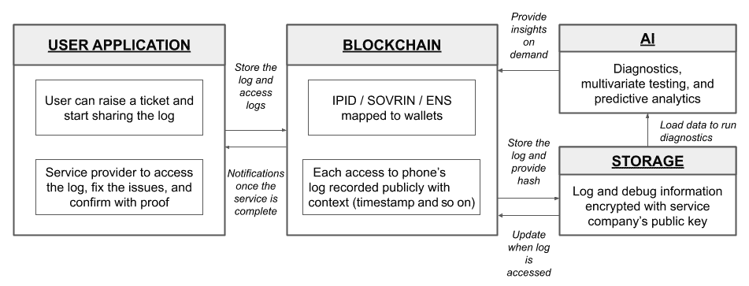

图 9.2：解决客户服务问题的参考解决方案架构

如前面的参考解决方案架构图所示，建议的解决方案分为四个组件，首先是以下内容：

+   **用户应用程序**：可能有一个应用程序允许用户提出问题工单。该应用程序还可以请求用户允许访问日志，以便提供安全备份，并在 MoiBit 的分散式存储中访问日志。

另一方面，我们可能有另一个应用程序，可以将工单委派给服务执行人员。服务执行人员可以收到分配给他们的新工单的通知。

这两个应用程序都需要用户通过钱包进行操作，这在下面的组件中进行了讨论。

+   **区块链**：用户应用程序应允许客户分享更多关于他们所面临问题的细节。与问题相关的细节可能包括产品信息和技术规格。如果问题持续存在，用户应该能够分享启动日志或任何其他敏感信息。为了在审计中强制透明度并给予对此类敏感数据的访问带来责任感，我们要求所有经过验证的人员通过特定的钱包地址执行与服务相关的操作。这些钱包地址可以通过 DID 和诸如**以太坊名字服务**（**ENS**）等名称服务进一步增强。

    区块链网络不仅将为客户和服务人员提供钱包，还将记录每个**读**和**写**操作，这意味着每次对日志的更新（**写**）都将记录在一个新的哈希中，并嵌入一个事务中。同样，每当服务人员的成员访问用户的日志时，都会发出一个事务以及通知。

    一旦服务工单解决，服务人员将提供适当的证据并押注资源，以声明和验证服务工作已关闭。如果网络中的大多数人无法通过给定的证据验证该声明，那么押注将被稀释，给那些行为不端的人造成经济损失。

+   **存储**: 我们需要一个去中心化的存储服务，可以安全地记录个人信息和其他证据，以支持前述逻辑。我们可以使用 MoiBit 来存储信息，仅在用户和服务人员之间进行加密。服务人员现在可以使用其指定的钱包来访问日志，进行分析，并提供适当的支持。有关分析的具体细节将由以下组件涵盖。

+   **人工智能**: 现在信息已安全存储在 MoiBit 上，我们可以构建一个简单的模型，对数据进行基本诊断，然后进行多元测试。可以通过使用 MoiBit API 以及已在区块链上的票证合同中注册的服务专业人员的凭据来使数据可访问。API 不会允许服务人员或未分配票证的其他用户无权访问数据。

这个想法可以应用于许多需要积极维护的产品，而不会损害用户隐私或公司的知识产权。因此，范围可以扩展到汽车、车间机器、3D 打印机、军队中的重要系统，以及其他消费电子产品，如冰箱、空调和安全摄像头。

现在让我们探讨企业软件领域的另一个领域，称为绩效管理，并尝试解决一些现实世界中的挑战。

## 绩效管理

企业公司需要董事会及其高管的全力支持，以管理各种绩效因素。这些因素推动着收入和利润的增长，并通过**关键绩效指标**（**KPI**）进行沟通，用于识别业务中的任何潜在增长或陷阱。随着公司朝着实现一系列业务目标迈进，了解可能出现的问题至关重要。这些问题可能会减缓实现业务目标所需的势头，或者在最糟糕的情况下，彻底破坏该目标。

在对企业绩效管理进行简要介绍之后，让我们了解今天企业面临的一些问题。

### 现状

在过去的几年里，上一个十年已经进行了大量**研发**（**R&D**）工作，用于分析关键绩效指标，使董事会能够较短时间内做出有效决策。然而，用于变革企业模式或优化它们的数据质量可能需要重新审视。今天数字化的每个业务过程都具有优点和缺点。优点在于自动化以及实现目标所需的时间和精力减少。然而，缺点在于透明度不足，与流程内部合规性相关问题等更广泛的问题。数字化业务过程中可能存在隐藏的盲点，可能无法有效产出长期所需的关键数据。

让我们以食品送货应用为例。有多个应用程序让用户可以选择远程订购食物，并在 30 分钟内将其送达。从用户应用程序订购食物的过程，到达餐厅厨房，再将烹饪好的食物从餐厅送到用户地址，这一数字化过程已经在今天实现。毫无疑问，没有人会用笔和纸记录您的远程订单。

许多食品送货应用公司已建立了一些关键绩效指标，如**取消订单数**，**延迟交付数**和**下单数**。这些关键绩效指标在内部取决于我上面提到的过程的结果，并且 AI 已经在通过大数据分析监控此类关键绩效指标。

围绕收集有限数据以分析业务的一些问题包括以下内容：

**缺乏激励**：仅依靠指标数据存在一些问题。消费者面向应用程序只有在他们积极倾听用户意见时才能持续发展。让我们都想一想，有多少次我们真诚地在应用程序中评价了食品配送体验？即使我们花时间提供有价值的反馈，应用程序又有多少次激励我们这样做？大多数人对后一个问题至少可能回答是否定的。

因此，有必要对这一数字化过程进行游戏化，以从最终用户获取真实信息并优化过程以获得更好的结果。

### 未来情景

消费者面向公司总是渴望增长并提供更好的客户服务。在未来，应用程序应该考虑奖励客户，通过加密货币支付他们每次成功提交评论。这将有助于激励用户对应用程序提供每项服务实例的真实反馈。在收集用户评论的过程中，公司还将能够解决一些当前的低效问题，并削减与特定类型服务相关的成本，并做出商业决策。

### 可能的解决方案

您可以考虑构建一个新颖的食品配送应用程序，不仅可以处理正常操作，而且可以使用分散式标识符 DID 识别每个用户。这是通往用户隐私的第一步。有了 DID，您可以关联一个钱包，用于在每次成功审阅后汇款数字货币。您还可以考虑应用表单验证和速率限制技术，以确保不良行为者不会操纵此系统只为了获取奖励。如果应用程序的规则认为审阅内容足够引人入胜，那么可以使用机器人快速汇款数字货币，并与用户开始对话，通知他们非常感谢他们的反馈。

之后，如果用户愿意，机器人也可以用来沟通，稍微介绍一下问题。这被称为**交互式反馈系统**。用户通过聊天机器人接收到的任何扩展信息以后可以通过叙述分析和内容分析被令牌化并发送到模型。使用这种方法，应用程序的新增强版本有望获得更多的反馈，提升服务质量，并在服务中减少不必要的成本。

下图概括了我们在分隔式参考结构中的方法，以帮助您更好地理解解决方案：

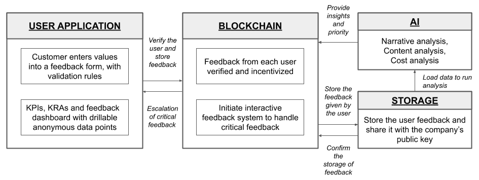

图 9.3：为了增加产品或服务的性能而将用户反馈系统变成游戏化的参考解决方案架构

如前面的参考解决方案架构图所示，建议的解决方案分为四个组件，即：

+   **用户应用程序**：可以有一个应用程序或现有应用程序内的页面来促进用户反馈系统。该系统将要求用户就用户所使用的产品或服务提供有价值的反馈，以换取加密货币。这是一种新的激励用户的方法，使用流动资产，而不是可能附带条件的忠诚度积分。

    还可能需要为公司和产品或服务的受益人开发单独的仪表板，他们需要提供有关反馈的概要信息。除了提供诸如关键绩效指标和关键风险指标等概要信息外，仪表板还需要提供一个界面，以深入了解反馈的上下文。

+   **区块链**：为了使用加密货币使反馈过程变成游戏，并限制不良行为者和西比尔攻击，我们需要使用区块链网络。区块链网络将用于为同意提供反馈的产品或服务的每个用户指定一个钱包。当在客户端级别验证反馈时，需要由用户指定的钱包签署数据以验证和确认其操作。当钱包用于签署数据时，生成的交易然后发送到区块链网络。

    网络验证和执行一个 oracle 或一个 webhook，以便将反馈数据存储在辅助网络中。存储方面将在以下重点中涵盖：

+   **存储**：我们需要一种去中心化的存储服务，使用户能够以自由的方式存储他们的反馈数据。在今天我们使用的大多数反馈系统中，一旦数据离开应用程序，用户就失去了对反馈数据的控制。这需要改变，以便为用户提供更多的控制权。我们可以使用任何基于 IPFS 的网络，如 MoiBit，以自由的方式持久化反馈。反馈数据将加密给用户和公司，渲染所述产品或服务。现在，公司可以以自由的方式使用这些数据来评估、评估和增强其对客户的服务。

+   **人工智能**：一旦反馈数据安全地存储在 MoiBit 中，并与各自的公司共享，您可以构建一个使用 MoiBit API 远程获取数据的人工智能模型，并进行适当的身份验证。数据加载后，我们可以使用多种自然语言处理技术，如内容和上下文分析，以在无需人类努力的情况下获得初步理解。一旦模型设定了优先级，我们可以使用聊天机器人来启动解决反馈的过程。在对话进行的同时，我们还可以使用叙述分析来获得更丰富的情境。如果经过经过良好训练的聊天机器人未能解决问题，我们可以向人类代表提供整个分析的结果，以便识别和纠正任何差距。人类代表将根据人工智能模型提供的支持数据做出最终决定来解决反馈问题。

现在让我们探索企业景观中的另一个领域，称为数据安全，并尝试解决一些现实世界的挑战。

## 数据安全

保护日益发展的企业的商业机密、关键市场数据和其他敏感信息对于维护公司在竞争对手中的战略和战术地位至关重要。尽管以前一代为企业提供了几种特殊的安全软件，但只有少数几种能够保护信息免受利用尖端技术发起的新一波攻击的影响。

下一波信息或数据安全软件可能将由区块链和人工智能驱动，以赋予企业力量，并尽可能减少潜在攻击。我们将在以下章节中探讨这一点。

### 现状

企业数据管理的传统模式从本地**知识管理系统**（**KMSs**）转移到数据仓库。后来，我们看到更多的创新发生在云端，公司被鼓励从现场基础设施转移到由**云服务提供商**（**CSP**）如 Azure 和 Amazon Web Services 管理的服务器上远程存储所有信息的混合模型。随着对云的采用，提出了一种更为实际的方法，即相关数据可以存储在云端或本地（on-premises）以提供灵活性。

尽管云计算在使用方面越来越受欢迎，但市场中仍有相当大的份额尚未迈出向完全云迁移的大胆步伐。诸如对数据的**控制**和**所有权**等问题可能会引起一些决策者的担忧，从而抑制了这种运动。

在公共云上管理数据安全面临的首要问题如下：

**细粒度访问控制和加密：**企业应用程序主要处理有关公司财务数据、商业机密、设计文件和潜在客户的线索的关键信息。由于所使用和传播的信息的性质，需要特别警惕地处理知识的分享。如果公司的信息泄漏到错误的人手中，可能会对公司的业绩造成毁灭性的影响。

### 未来情景

尽管区块链技术本身可能不是企业的关键推动因素，但它为公司提供了去中心化基础设施的曝光。在这种去中心化基础设施中，公司可以共享、交易和交换资源，形成更强大的业务网络。基于区块链的这种新型基础设施共享方法对网络攻击的影响较小，而且肯定不会受到恶意用户意图的数据破坏的影响。我们将从竞争模式转变为协作模式，在这种模式下，所有利益相关者可以共同汇集非关键资源，以实现共同的业务目标。

未来，企业应用程序应该能够利用区块链实现完全的问责制和对公司信息访问的透明视图。这些应用程序还可以配备**商业智能**（**BI**）工具和人工智能服务，根据访问模式提供洞察，以消除任何网络威胁。

### 可能的解决方案

您可以考虑使用分散数据库和数据服务，如 MoiBit 来构建一个可以有效设计的以文档为中心的应用程序，以确保商业文档的数据完整性将保持完好。我们也可以单独使用区块链来存储文件的元数据并维护访问日志。结合使用区块链，您还可以构建新的可视化工具和基本回归模型，允许用户从所存储在该分散式数据库中的数据中获取见解。随着几个 DIDs 和名称解析器的出现，用户身份验证可以得到显着增强。

以下图表总结了我们在一个分隔的参考结构中的方法，以帮助您更好地理解解决方案：

图 9.4：借助区块链和人工智能识别 ERP 系统中安全威胁的参考解决方案架构

如前所示的参考解决方案架构图表所示，建议的解决方案分为四个组件，首先是：

+   **用户应用程序**：与往常一样，应用程序组件将包括员工和管理员使用的客户端应用程序。员工应用程序可以是一个简单的 **客户关系管理**（**CRM**）应用程序，在像 MoiBit 这样的基于 IPFS 的宽松网络上安全地存储潜在客户数据。在 CRM 应用程序中，我们可以有一个基本功能，允许员工基于销售员收集的信息创建一个新的潜在客户。应用程序可以依赖自定义名称解析器来验证员工。

    另一方面，我们还需要一个管理员仪表板，以便密切监视网络的健康状况，随后是员工最近访问的列表。根据可视化工具提供的可视化，管理员可以采取必要的行动来确保网络的稳定性。管理员仪表板还可以具有基于多重签名的功能，从而确保 **权力** 不授予单个人。

    系统的整体安全性可以通过至少三个方面得到增强，具体如下：

+   1 步验证：公司电子邮件 ID 和密码。

+   2 步验证：来自员工手机和/或验证器的 OTP。

+   3 步验证：验证属于特定名称服务的钱包的所有权。例如，您可以确保应用程序仅在您拥有的钱包地址可以解析为 **companyxyz.eth** 时才允许访问。公司 XYZ 的员工 ABC 女士将获得由名称 **abc.companyxyz.eth** 解析的钱包地址。如果用户无法证明他们拥有由 **abc.companyxyz.eth** 解析的钱包，则应用程序不应授予访问权限。

值得一提的是，上述的改进可以与**快速身份验证联盟**（**FIDO**）密钥等企业身份验证机制一起作为增强措施。

+   **区块链**：区块链网络将解析名称服务以确认钱包的所有权。一旦钱包得到授权，区块链网络还负责在次级网络中存储信息。一旦存储操作完成，区块链中的智能合约将对每次成功或失败的文档访问发出交易。这些访问数据主要存储在区块链上，以后会复制到次级存储网络以进一步分析资源失败访问情况。你将在下一节中了解它的用途。

+   **存储**：我们需要一个可以缓存所有访问日志的分散式存储服务，以便人工智能系统可以更快地访问数据，而不会在主区块链网络中创建瓶颈。通过使用基于 IPFS 的网络，我们保留了区块链的不可变特性，并保留了验证缓存内容的能力。

+   **人工智能**：现在访问日志已被复制并缓存到 MoiBit 中，管理员可以选择自定义的训练模型或使用无监督的机器学习技术来检测对一些关键文档的访问是否异常。一旦生成并分析出一个模式，就能识别出异常情况以便采取行动应对攻击。

现在让我们来探讨企业景观中的另一个领域，名为财务管理，并尝试解决他们的问题。

## 财务管理

大多数企业公司都是依靠成熟产品线带来的稳定收入来维持生计。根据产品或服务的不同，这些公司可能每年都能产生从百万到数十亿美元不等的收入。这样庞大的收入规模需要相应的成本支出，需要定期审计以确保账目完整。还需要注意的是，大部分能够产生如此巨额收入的大型公司都是上市公司，因此有许多公众利益相关者密切关注公司销售的增长。

### 现状

传统的会计软件允许像文员或会计这样的员工手动为商品销售开具发票。然而，在当今的财务软件中，会计模块已经与各种前端模块密切结合，包括**销售点**（**POS**），用于销售物品并生成发票。

尽管大多数会计操作现在正在从手动输入转变为条形码驱动的自动化，但账目中可能存在高风险的金融欺诈和数字篡改。

企业在财务管理中面临的主要问题如下：

**会计丑闻**：会计丑闻被定义为故意策划的过程，通过操纵公司的财务报表以达到欺骗他人的目的。大多数国家都认为这是一种犯罪行为，因为它使个人员工和公司能够过分强调资产或误报当前的财务责任，从而使利益相关者面临风险。

### 未来情景

将来，会计软件不仅将与其他模块自动化。透明度可能会通过使用区块链来实现，以便为感兴趣的各方提供更简单和更便宜的审计。此外，会计应用程序应该能够利用深度学习技术来识别公司现金流交易中的任何潜在异常。

### 可能的解决方案

您可以考虑构建一个会计应用程序，根据规范记录虚拟分类帐。如果公司愿意，会计应用程序还可以透明地广播虚拟分类帐。与此同时，该区块链应用程序还将负责管理每个钱包的状态，以便监视部门内的任何不良行为者。该应用程序还可以利用深度学习模型来检测财务报表中的异常，并确保没有进行任何欺诈行为。

以下图表总结了我们在分隔的参考结构中的方法，以帮助您更好地理解解决方案：

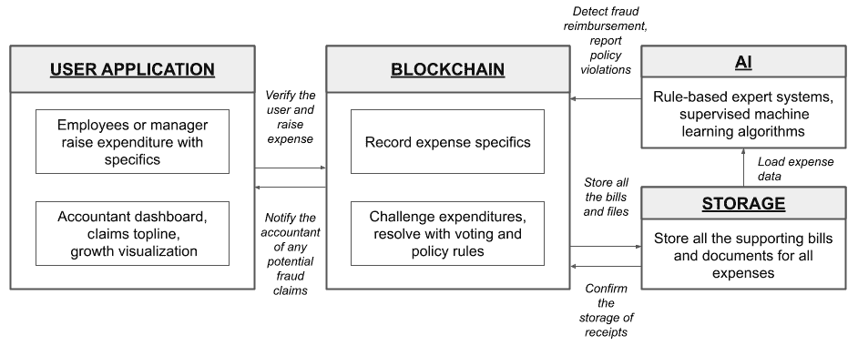

图 9.5：管理支出并识别任何欺诈交易的参考解决方案架构

如前述参考解决方案架构图所示，建议的解决方案分为四个组件，即：

+   **用户应用程序**：员工可能会使用一种表格来申请费用。您可以简单地构建一个安全的应用程序，如前文的*数据安全*部分所述，并允许用户提出费用。

    财务部门可能还可以使用另一种形式来审查和解决索赔。虽然您今天可以自动化此部分的大部分内容，但我们可以借助区块链和人工智能重新思考透明度和欺诈检测。

+   **区块链**：区块链网络将为每个员工提供钱包，包括财务部门，以管理公司的资金。基于区块链的智能合约还可以用来以民主方式挑战一些可疑的交易，以解决部门内的支出。

+   **存储**：我们需要一个分散式存储服务，可以存储由提出费用申请的员工提供的账单副本、收据、采购订单以及许多其他支持性文件。这些支持文件将由会计进行审核，同时还有一个减少人力的 AI 模型，用于追踪交易的起源并验证员工所做交易的真实性。我们需要一个基于 IPFS 的网络，可以持久保存这些文档，而不会受到任何网络攻击或发布具有篡改值的发票。这些支持文件可以加密并在会计部门之间共享以进一步审核。

+   **AI**：现在支持文档存储在像 MoiBit 这样基于 IPFS 的网络中，我们可以使用 API 和财务部门的凭据，将费用数据加载到机器学习算法中，以识别潜在的欺诈费用。基于规则的专家系统也可以用于识别任何超出公司政策范围的索赔，以便在不耗费太多精力的情况下拒绝该索赔。

在对企业景观中几个领域的问题进行了详细的步行后，现在让我们来探讨政府面临的问题。

# 将人工智能和区块链融入政府

在撰写本文时，预计未来 3 到 5 年政府软件业务的总市场规模将达到约 150 亿美元。社会的许多进步取决于地方政府以及国家级政府提供的服务。一些国家，如美国，将其称为联邦政府。公民在某种程度上依赖政府提供基本服务，如身份注册以及获取出生和死亡证明。

在接下来的章节中，让我们试着了解当今全球各地政府面临的一些现实挑战。我们还将观察如何通过区块链和人工智能技术来解决这些挑战。

让我们开始探讨政府在税收领域面临的挑战。

## 税收

为了发展持久的经济并提供公共服务，政府依靠对公民和企业征收直接和间接税收。直接税收是对个人公民或企业收入征税。间接税收以关税的形式对商品和服务征税。在撰写本文时，预计销售税软件的全球市场规模将在 2026 年达到约 112.5 亿美元。

### 现状

税收被认为是世界上大多数政府的主要收入来源之一。在印度 2018-2019 财政年度，据报道，**印度直接税委员会**（**CBDT**）据称收集了大约 11.17 万亿卢比（**INR**）。尽管这个数字似乎令人震惊，但据报道，收集的金额仍然缺额约 8300 亿卢比，约占设定的收集目标的 7.4%。同样，间接税也将在服务点收取。收取的间接税金额可能直接取决于经济状况，其中购买者有足够的购买力来购买产品或服务。支付方式也会直接影响间接税的征收，因为在国家的每个角落都进行现金交易，这变得极其难以追踪。

让我们来看看政府在税收方面面临的首要问题：

**逃避**：在服务提供给客户但未通过应税销售发票认可的情况下，税收可能严重减少。不幸的是，如果客户和服务提供者互相同意用现金交换服务，仍可能发生这种情况，从而逃避支付税款。

### 未来情景

未来，企业可能会被鼓励使用一个区块链启用的应用程序，以**不可替代令牌**（**NFT**）的形式跟踪所有库存，以区分原材料。服务提供商可能会被要求在区块链网络中转移或核算所述 NFT。这可以帮助识别库存中物品的输入和输出，并跟踪货物在多个利益相关者之间的流动。根据这些资源的转移或销售，智能合约可以自动生成发票，并要求客户付款。通过将整个供应链流程和销售生命周期引入区块链之上，我们可能能够显著减少间接税收逃避。

### 可能的解决方案

你可以使用任何区块链网络来建立一个由业务所有者和相关税务机构管理的公共或许可网络。所有进货原材料都可以视为输入，每单位原材料都分配了一个 NFT。后来，一旦产品从原材料制成，相应的 NFT 可能会被销毁，并创建一个新的 NFT，该 NFT 是由产品中使用的所有原材料的 NFT 组合而成。产品的销售现在是网络上持久的可审计记录，明确建立了组成关系。这不仅会使记录输入和输出税更容易，还将在路上增加更多的税收征收。

以下图表总结了我们的方法，以分隔的参考结构的形式，帮助您更好地理解解决方案：

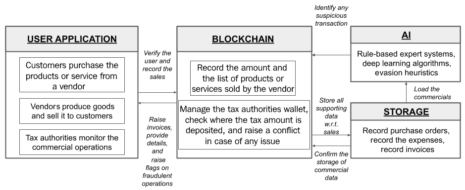

图 9.6: 减少逃税的参考解决方案架构

如前面的参考解决方案架构图所示，建议的解决方案分为四个部分，即：

+   **用户应用**: 与之前提出的解决方案架构不同，我们在这个用例中有三个主要参与者。可能有一个应用程序可供最终客户使用，允许在零售层级购买成品。可能有另一个应用程序允许供应商互相销售原材料，也销售成品给最终用户。用户销售的所有商品都可以是以太坊等区块链网络上的 NFT。在销售过程中，可能需要税务机构使用专门的应用程序以匿名格式监控 B2B 和 B2C 交易。每次销售都可以细化，因为每次销售都可以记录为区块链上的一个交易，并在第二网络上提供大量支持文件的丰富上下文。

+   **区块链**: 区块链网络将为所有三个参与者提供钱包。客户需要一个钱包来支付产品或服务。供应商需要钱包来进行业务并收到报价金额。税务机构需要一个钱包以转移在销售点扣除的间接税额。供应商的钱包不仅会持久化卢比或其他当地货币，还会持久化他们手头的原材料余额。这个余额对每单位原材料以一种独特的方式指定。一旦原材料转化为成品，NFTs 可以被销毁以铸造一个可以代表所述成品的新 NFT。无论是客户和供应商之间的销售（B2C），还是供应商之间的销售（B2B），每次销售都会作为一个交易记录在区块链网络上，由各自应用程序中的支付操作触发。

+   **存储**:我们需要一个分散化的存储服务，可以持久保存这个过程的文档流程，从采购订单到发票。我们需要一个基于 IPFS 的受许可网络，尊重公司隐私，但仍然可以与当局分享相关数据。

    每次向供应商账户添加纸质文档时，都会在网络中发出一个新的带有相关优先级的交易。只有网络中符合条件的参与者才能查看交易。这是设计的一个重要部分，以保留市场中所有参与者之间的竞争精神。

+   **人工智能**: 现在我们有了文档流程和分类帐余额，我们可以运行基于规则的专家系统来识别应收税额。为了确定任何缺失的税收目标，我们还需要使用启发式方法来识别潜在的逃避行为。深度学习也可以用于识别任何洗钱活动。

现在让我们探索治理领域的另一个领域，投票，并尝试解决与该领域相关的问题。

## 投票

选举被视为民主的庆祝活动，在这里，每个公民都有机会行使自己选择合适代表进入职位的权利。因此，至关重要的是选举以无党派的方式进行，不偏向任何候选人或政党。此外，观察技术界的最新变化并将相关技术应用于选举的有效和公平进行是有益的。

### 现状

目前，大多数选举都是离线进行的，这意味着公民们被期望自行注册并在由各自选举当局宣布的指定投票站投票。这个传统的流程被一些人认为已经过时了。基于全球互联网的日益普及，客户可以在任何电子商务网站上下订单购买产品或服务。同样，允许公民使用自己的手机从家里或办公室投票可能是方便的。这不仅通过数字平台更容易地访问投票，而且还将选举结果的宣布时间从几天或几小时缩短到几乎立即。

政府在投票中面临的最重要问题如下：

**加快结果**：许多民主国家为了确保人们能够到当地选区办公室投票并等待结果而放假。尽管政府可以促进投票，但该过程主要是手动的。因此，在指定的安全位置处理、转移、验证和计算所有选票需要一段时间，这涉及大量资源。

### 未来

在未来，政府和公民应该被鼓励使用安全的移动应用程序为他们的候选人投票，这些应用程序可以非常简单易用。每个选票都是通过应用公民的私钥来投出的，该私钥可以解析为生物特征签名，从而证明公民在投票期间的存在。

### 可能的解决方案

您可以在移动设备或网络上构建一个样本投票应用程序，该应用程序与部署在区块链网络上的智能合约进行通信。每个用户都可以通过证明拥有与该帐户关联的私钥来投票。此外，该应用程序可以利用几种模式识别技术和计算机视觉来识别站在手机设备或浏览器前面的人是否是真实的人，而不是系统生成的图形。这可以通过使用基于**生成对抗网络（GAN）**的分类器来实现。一旦投票完成，我们可以仔细检查数字并宣布虚拟选举的获胜者。

以下图表总结了我们的方法，采用了分区参考结构，以帮助您更好地理解解决方案：

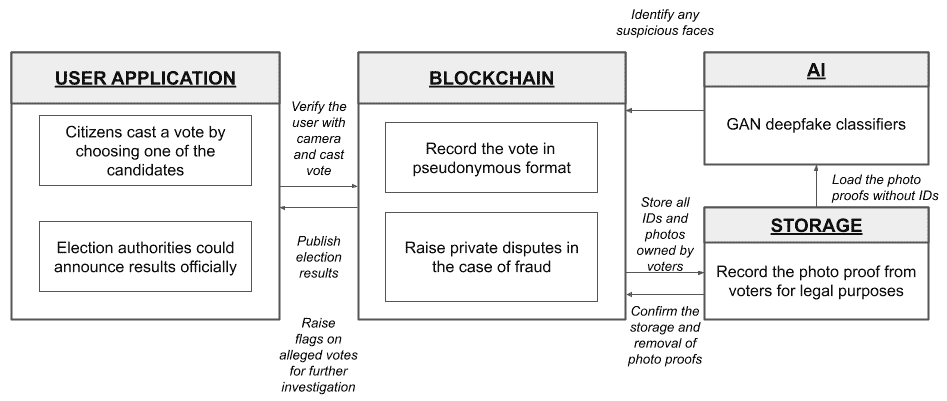

图 9.7：通过改革选举技术来节省时间和成本的参考解决方案架构图

如前面的参考解决方案架构图所示，建议的解决方案分为四个组件，即：

+   **用户应用程序**：可以有一个移动应用程序供公民或用户使用。为了防止伪造攻击，该应用程序必须与一个 SIM 卡紧密绑定。该客户端应用程序还需要能够拍摄投票者的照片身份证明，然后是视频，以确保票只能由该人投出。

    同样，可以有一个网络应用程序或仪表板来监控整体选民投票率，并处理可疑投票。网络仪表板还可以提供每个参与者或候选人获得的投票的概要信息。

+   **区块链（Blockchain）**：区块链网络将为每个公民或用户提供钱包。投票是在智能合约中进行的，其中存在映射来计算为每个候选人投出的票数。区块链还可以用于在 AI 识别或警告用户提供的虚假证明时提供冲突管理。

+   **存储（Storage）**：我们需要一个可以存储照片证明的去中心化存储服务，这些证明可以作为用户在投票期间参与的法律证据。非常重要的一点是视频由各自的公民上传，这是参与者的又一自我声明。此类数据必须存储在 IPFS 网络上，以确保数据不会被损坏。

+   **人工智能（AI）**：现在，公民或用户的照片身份证明和视频已经提供，我们可以使用基于任何 IPFS 网络的 API 来审查与当局共享的证明。随着基于 GAN 的深度伪造技术的最新发布，我们可以考虑通过仅使用基于 GAN 的先进分类器来未雨绸缪这个示例应用程序。

现在让我们探索治理中的另一个领域，立法改革，并尝试解决它们的问题。

## 立法改革

立法改革是政府的关键结果领域之一。尽管法案已经通过成为法令，但这些法令的执行有时可能并不有效。许多改革会导致财务规划、认可和权利的变化。社会保障就是一个例子。

由于由执政机构通过的一个或多个法案可能需要立即快速采纳，因此在这种情况下，我们需要确保这些改革的受益者能够在没有显着延迟的情况下享受他们的权益。

### 现状

社会保障改革，比如提高养老金水平，可能需要一段时间才能在支票上反映出来。这种转变可能需要时间，也不一定保持透明度。一旦适当的立法通过，我们就可以解决社会保障改革的问题。

政府在管理立法改革方面面临的主要问题如下：

+   **执行**：更新的法律规定很少被普通公民通知和承认。这种信息差可能会造成问题。此外，我们需要确保更新的剩余金额不被价值链中的任何人私自占有。

+   **文档**：一旦政府的立法机构制定了修正计划，所有相关文件都必须被捆绑在一个单一的存储库下。这将有助于所有成员达成对法案背景、目标和目的的共同理解。

### 未来预期情景

未来，政府可以鼓励使用区块链和人工智能解决立法改革中的许多问题。您可以建立一个试点解决方案来应对对社会保障计划的更改。此外，人工智能还可以用于检测受益人和赞助人的功能中的任何异常。人工智能还可以使用深度学习技术识别任何资金的非法使用。

### 可能的解决方案

您可以使用任何适用的区块链平台记录对提议法案的投票。您还可以使用区块链根据一定的条件锁定和解锁养老金资金。区块链平台还可以通过钱包识别每个受益人，并利用基于人工智能的人脸识别模型确保资金安全地收到各自的受益人手中。

以下图表总结了我们在一个分隔式参考结构中的方法，以帮助您更好地理解解决方案：

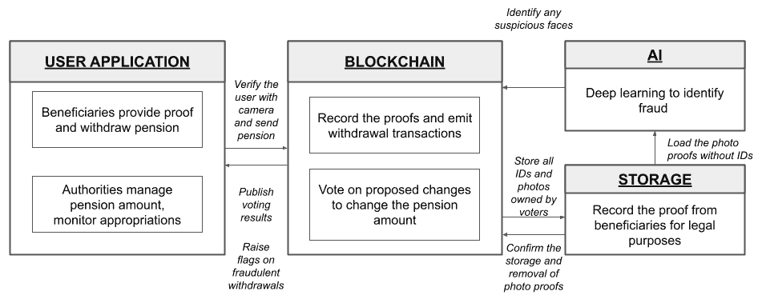

图 9.8：快速支持社会保障立法改革的参考解决架构

正如前面的参考解决架构图所示，建议的解决方案分为四个组件，即：

+   **用户应用程序**：可能会有一种表格供享有社会保障计划的公民使用。还可能会有另一种表格供政府机构和立法机构投票对任何变化，并在开放环境中监督资金拨款。

+   **区块链**：区块链网络将为每个受益人以及立法者提供钱包。它还将托管两个单独的合约：一个**投票合约**可用于促进对该法案的*赞成*和*反对*投票。一个**养老金合约**也可以用于在设定条件下促进资金转移给各自受益人。受益人只需证明自己的存在即可享受养老金。

+   **存储**：我们需要一个可以存储上述证明的分散式存储服务。这些证明可能会作为法定文件提交给当局。这些证明将由用户拥有，并可以在预定的时间内与当局分享，以检查潜在的欺诈或任何其他边缘情况。一旦证明被验证，当局可以放弃权限。

+   **人工智能**：现在我们在基于 IPFS 的网络上安全存储了受益人的存在证明，我们可以将它们输入基于 GAN 的分类器和深度学习算法中，以识别任何可疑活动。模型可以标记任何可疑或欺诈交易，供后端团队争议解决，从而涉及人力。

现在让我们探索治理的另一个领域，即人口普查，并试图解决此处遇到的问题。

## 人口普查

人口普查是政府组织的一项计划性的、有组织的过程，旨在计算特定地区的最新人口统计数字。人口普查还有助于识别特定地区的文化和经济多样性。正如您可能已经知道的那样，在印度，每 10 年进行一次人口普查。最新一次人口普查由印度政府于 2011 年组织，并导致观察到的最新人口数量为 12,101,934,22 人。

### 现状

印度政府正在 2020-2021 年组织第 16 次人口普查，其关键不同之处在于普查操作将是数字化的，完全通过移动界面驱动。**普查员**可以选择使用移动应用程序，也可以选择传统的纸质记录方式，然后进行数字化提交。

政府在进行人口普查时面临的主要问题如下：

+   **结果时间**：尽管普查员提交的内容可能是数字化的，但可能需要一些手动工作来验证普查员记录的数据的真实性。此外，减少与验证相关的时间是至关重要的，因为这直接影响发布结果所需的周转时间。

+   **透明度**：人口普查过程就是要了解某一地区文化、社会和经济多样性方面的变化。作为一个社区，建立一些基本参数和流程检查点，并在开放网络上发布，以满足每个人的好奇心，是一个健康且值得推荐的做法。

### 待定情景

未来，人口普查操作不仅应该数字化，而且还应强调使社区以公平方式了解自己的基本做法。这可以通过使用公共区块链网络透明地传达进展来实现。未来的人口普查操作可以通过人工智能来实现，以节省成本并通过深入挖掘收集的大量数据来了解社区的见解。

### 可能的解决方案

您可以考虑构建一个由区块链和人工智能驱动的试点智能普查应用程序。该应用程序可以使用合适的区块链记录和沟通人口普查操作中的所有检查点。区块链钱包与分散的数据存储也可以用于确保普查员在一线收集的信息无法在另一媒介中复制。该应用程序还可以利用可视化工具和深度学习模型，让机构和感兴趣的第三方深入挖掘积累的数据，获得人口统计信息。

下图总结了我们在分隔的参考结构中的方法，以帮助您更好地理解解决方案：

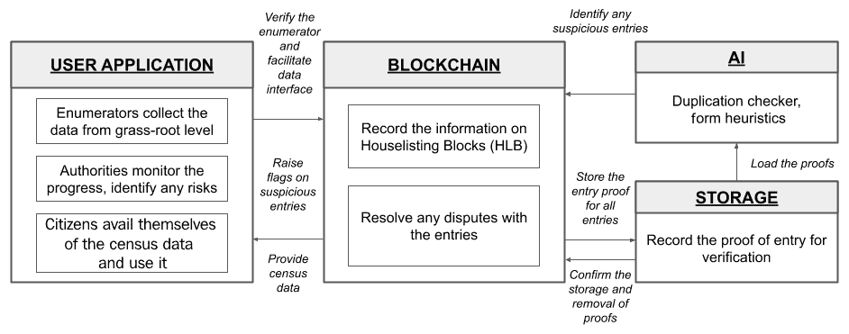

图 9.9：引入安全透明数字人口普查的参考解决架构

如上述参考解决架构图所示，建议的解决方案分为四个组件，即：

+   **用户应用**：在提议的系统中有三个参与者：普查员、普查当局和国家公民。为了构建这个样本项目，我建议使用三种不同的表格。一种表格由普查员使用，他们在草根层面从每个家庭收集数据。第二种表格将由当局使用，以监测人口普查操作的进展，并解决任何可疑记录的争议。第三种表格将由对我们社会的文化、经济和人口统计方面感兴趣的普通公民使用。

+   **区块链**：区块链网络将为每个普查员提供一个钱包。普查员将收到一个指定的钱包地址，用于在其应用程序中签署记录。由于每个钱包是唯一的，它有助于维护流程中的问责制。每个记录都是一个交易，带有代表添加到基于 IPFS 的网络的数据哈希的签名消息。

+   **存储**：我们需要一个分散的存储服务，可以以确保隐私的方式持久保存所有公民的信息。可保留可疑记录的证据，并放弃对其余记录的访问。

+   **人工智能**：现在，由于基于 IPFS 的不可变记录保存网络上提供了记录的凭证，我们可以使用几种监督式机器学习算法来检测重复记录。我们还可以使用表单启发式评估数据质量，并在几个**住房统计区块**（**HLB**）之间进行比较。

HLB 是人口普查领域广泛使用的术语，用于标识特定的地理栖息地区域。每个普查员被分配一个或多个 HLB 来执行普查并提交所有必需的信息。

在详细介绍了治理领域中几个领域的问题之后，现在让我们来探讨金融服务面临的问题。

# 在金融服务中融合 AI 和区块链

金融服务业如今为机构、组织和个人在一个良好定义的数字环境中操作提供经济支柱。尽管金融服务在早期采用各种技术方面保持良好声誉，但区块链技术可能不适用。这可能是因为透明过程中出现的复杂性。然而，我们必须理解，目前几乎不可避免地会应用区块链与人工智能，因为大部分科技公司开始为客户提供银行和保险解决方案。这显然正在使人们脱离传统银行和保险公司。为了未来的使用，我建议您考虑在以下用例中开发应用程序。

在接下来的部分中，我们将涵盖金融服务领域保险行业面临的问题，并尝试解决它们的问题。

## 保险

保险软件的市场规模正在迅速增长。在保险业中，我们可能会发现相当多的多样化。随着最新的冠状病毒 COVID-19 爆发，全球各地对健康保险的需求多次增加。

### 现状情况

我们生活在一个**波动**、**不确定**、**复杂**和**模糊**（**VUCA**）的世界，迫切需要保护免受各种意外后果的影响。您可能会有兴趣了解，保险并不仅限于人类、动物、器官和车辆。如今，您还会发现，几个区块链网络上的智能合约也经过保险，以防止黑客攻击或滥用。因此，重温保险管理如今是如何运作的，与未来的技术使数字化流程相比很重要。

保险业面临的主要问题之一是：

**索赔管理：** 让我们以健康保险为例，它占据了保险行业的重要部分。根据入院的情况以及疾病或意外的性质，提出索赔可能变得复杂。

这需要采取急剧的措施来管理索赔。

### 作为将来的情景

未来，医院和保险公司可以考虑密切合作，以减少成本并缩短理赔的处理时间。医院、诊断中心和保险公司可以形成一个财团，创建代币，并使用相同代币进行结算以获得流动性。鉴于与大流行病爆发相关的严峻局面，我们需要找到最佳机制来维持。让我们探讨一种解决方案的方法，可以更好地管理索赔。

### 可能的解决方案

如果患者被送往医院接受治疗，这一事件可以通过零知识证明记录在区块链上，而不向任何人透露个人身份信息。也许简单的生物特征签名在这里会有帮助。一旦医疗程序结束，可以通过能够直接与区块链进行通信并在多个层面建立出处的设备进行定期的医疗检查。此外，还可以利用几种基于人工智能的高级技术来识别任何欺诈索赔。如果保险公司能够期望医生或任何相关的认证者在批准任何索赔之前在区块链上押注资金，这将是一个值得注意的努力。这也可能大大减少欺诈索赔所导致的损失。如果某项索赔被确认为欺诈，买方的保险可能会被禁止，并且医生或认证者的押金可能会被清算，从而使他们无法正常运作。

以下图表总结了我们在分隔式参考结构中的方法，帮助您更好地理解解决方案：

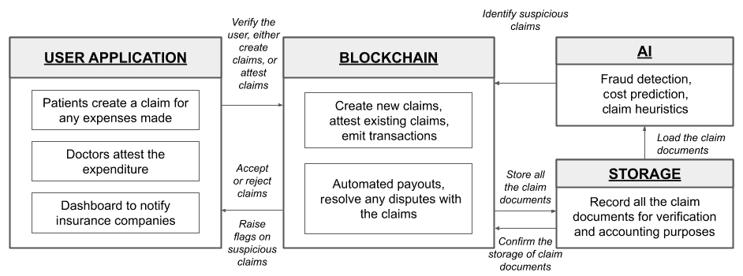

图 9.10：优化健康保险理赔流程以提高透明度和准确性的参考解决方案架构

如前面的参考解决方案架构图所示，建议的解决方案分为四个组成部分，即：

+   **用户应用程序**：在这个用例中，我提议使用三种不同的应用程序。一种应用程序是由已购买保险的客户或患者使用的。他们可以填写表格并附上必要的信息，以成功创建索赔。

    建议使用第二个应用程序的是治疗患者的住院医生。每次创建新的索赔时，医生被要求验证并证明索赔。在这里重要的是要理解，医生需要在进行认证时押注他们薪水的一大部分。如果系统确定医生已经证明了一个欺诈索赔，押金将被清算。

    第三个应用程序是为保险公司提出的一个仪表板应用程序，以监控一些重要信息，例如过去 24 小时内的总付款金额，以及过去 24 小时内的可疑索赔情况。

+   **区块链**：区块链网络将提供一个钱包给保险公司管理他们的资金。用户可以通过这样的钱包支付保费，并期望从中获得赔付。该网络还将为医生提供一个钱包，以让他们在其中押注他们薪水的一部分。同样的钱包可以用于向医生支付在有效索赔情况下的报酬。最后，该网络还需要为消费者或患者提供钱包。他们将在钱包中收到赔付。

值得注意的是，区块链网络还需要借助智能合约来为符合条件的索赔提供自动支付。索赔的有效性将根据附加到索赔的支持文件来决定。

+   **存储**：我们需要一个分散式存储服务，可以存储与索赔相关的所有支持文件。一旦文件被持久化，我们可以使用相关的人工智能模型和技术来验证索赔，并识别潜在的欺诈性索赔。我们需要使用任何基于 IPFS 的网络，以不可变的方式存储这些文件，以防止对账单金额、日期和其他细节的任何更改。

+   **人工智能**：在次要存储网络上存储了关键的与索赔相关的文件后，我们可以使用基于规则的专家系统来验证索赔的结构和格式。我们还可以使用机器学习技术来识别索赔中的任何重复，并识别类似的模式以对比成本。如果条件令人满意且低于设定的风险水平，就可以触发自动支付。如果模式观察看起来可疑，模型可以在网络上发布有关索赔的帖子以投票并解决索赔问题。

在对金融服务领域的几个领域的问题进行了详细的介绍之后，现在让我们来探讨人力资源管理面临的问题。

# 在人力资源领域融合人工智能和区块链

招聘新人才和留住现有人才已经成为各个规模组织的重要议程之一。在撰写本文时，美国的失业率是近十年来最高的之一。这一前所未有的失业率可以归因于 COVID-19 疫情爆发。随着经济的复苏，未来几年将在多个公共和私营部门组织中创造数十万个新工作岗位。虽然就业机会以指数级增长，但也存在难以找到能够与薪水匹配技能的合适人才的困难。

特别是在科技领域，管理两个层面的人才正在变得极为困难：

+   **留住现有人才**：这意味着当前员工为了更高的薪水和更好的福利而跳槽。通过积极的公司文化和诱人的薪水可以缓解这种情况。

+   **引入新人才**：这意味着越来越难以雇佣最近加入行业的新人。通过完善现有的传统流程来识别潜在的招聘者可以缓解这种情况。

虽然人力资源专家正在努力解决上述的第一个挑战，但我认为欢迎新一代人才进入科技行业是很重要的。虽然其他行业也同样值得拥有新一代人才，但让我们将范围限制在我们的 IT 行业内。

在下一节中，我们将看到如何解决在 IT 行业对一些关键技术资源进行背景检查的问题。我们将讨论当前行业经理面临的挑战。我们还将通过适当使用区块链和人工智能来解决这些挑战。我们还将通过使用技术启用和对过程中的一些检查点进行游戏化来解决吸纳新一波人才的问题。

## 背景检查

背景检查是正式验证求职者提供信息的过程。这是由人力资源经理进行的过程，可能根据何时进行此过程而有所不同。一些公司和人力资源经理在申请人成功录用后进行背景检查。但是，有一些公司要求在确认申请之前严格遵守背景检查。

以下是背景检查过程中常见所需文件的一些：

+   **犯罪记录**：一些公司可能法律要求检查和核实申请人是否有犯罪行为。这些文件由各自的法律和执法部门访问。一旦确认申请人没有参与任何刑事诉讼，公司可以确认雇佣该候选人。

+   **财务文件**：一些公司可能要求申请人确认公司现有职位所提供的当前薪水。如果申请人提供了财务文件，如银行对账单，则可以进行验证。

+   **毒品测试**：一些公司可能对滥用药物有严格的政策，因此可能要求申请人进行药物测试。根据此测试的结果，申请人可能根据公司政策或适用的法律规定被确认或拒绝。

+   **身体素质**：全球政府机构中有一些工作可能要求严格遵守一些身体素质标准。因此，公司可能要求候选人接受新的身体素质测试。根据身体素质测试的结果，雇主可以做出适当的决定。

+   **以前的工作记录**：雇主通常需要保存所有员工的工作记录。雇主可能要求申请人提供真实证明，作为认证证据。

通过对背景检查过程和涉及其中的常见文件有基本了解，现在让我们了解一下人力资源经理和申请人所面临的问题。

### 现状

目前，前述的大多数文件都是由求职者通过电子邮件提供的。申请人发送的文件被人力资源经理收到。值得指出的是，像毒品测试结果和身体健康报告这样的文件可能由进行测试的第三方供应商在内部与人力资源经理共享。一些涉及申请人的文件可能包含敏感和可以识别个人身份的信息。

困扰招聘流程和人力资源管理的主要问题如下：

+   **申请人没有数据所有权**：前述的大多数文件是由求职者通过电子邮件提供的。申请人发送的文件被人力资源经理收到。值得一提的是，像毒品测试结果和身体健康报告这样的文件可能由进行测试的第三方供应商在内部与人力资源经理共享。一些涉及申请人的文件可能包含敏感和可以识别个人身份的信息。

+   **无法进行强有力的自动背景验证**：一旦文件被人力资源经理收到，根据公司的政策，文件将接受审查。值得注意的是，大多数经理进行的验证工作都涉及手动流程，这意味着这需要时间，而且也可能出错。

现在我们已经确定了流程中的一些漏洞，让我们来看一下一个简单的解决方案提案，可以解决背景调查流程中的一些关键挑战。

### 未来场景

未来，政府和公司应鼓励使用基于区块链的去中心化身份（DID），来控制申请人与雇主分享的数据。如果申请人没有被提供工作，申请人会很愿意使用这样一个系统，其中申请人的数据可以被编辑。此外，使用**光学字符识别**（**OCR**）来读取测试结果和其他重要文件，比如财务报表，来通过 AI 启用的自动化优化整个流程非常重要。如果有一个专门的 OCR 程序能够读取银行对账单以确认申请人的当前薪水并立即编辑该文件，则申请人会更加放心。这种背景验证流程的转变不仅可以节省公司的时间和金钱，还能提供一个更加安全、更为申请人友好的环境。

### 可能的解决方案

我们可以使用适当的区块链平台，并构建一个智能合约，允许申请人与公司或人力资源经理安全地签署声明表格。此外，我们可以通过允许申请人将数据存储在个人数据存储介质（如 MoiBit）上，从而将数据与此过程分开，以便自定义雇主在流程中所需的所有文件的访问。我们还可以使用 OCR 程序，并精心设计一个基于**零知识证明**（**ZKP**）的系统，该系统可以确认文档的若干属性，而不会导致人力资源经理无必要地访问数据。

以下图表总结了我们在分隔式参考结构中的方法，以帮助您更好地理解解决方案：

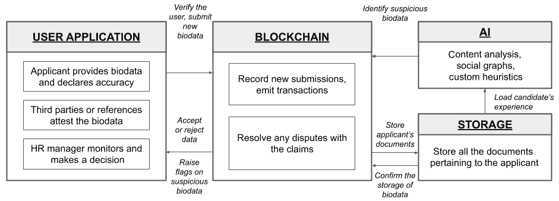

图 9.11：优化面试候选人背景检查流程的参考解决方案架构

如前述参考解决方案架构图所示，建议的解决方案分为四个组件，即：

+   **用户申请**：在这个用例中，我建议使用三种不同的应用程序。第一个应用程序可供申请人申请公司和分享其生物数据以及已存储在其个性化数据空间中的所有支持文件。在这种情况下，我建议使用基于 IPFS 的网络，例如 MoiBit，以便为用户提供访问权限。第二种类型的应用程序可供第三方进行药物测试等使用。它也可由以前的雇主和推荐人使用，以确认申请人声明的数据。一旦第三方或推荐人提供信息，就可以进行验证，并且可以激励他们的努力。然而，为了激励良好的参与者，需要实施锁仓。我们将在下一节讨论这个问题。最后，第三种类型的应用程序用于人力资源经理发布职位描述，列出候选人，审查自动验证结果等。

+   **区块链**：区块链网络将用于为所有四个角色提供钱包：申请人、人力资源经理、推荐人和第三方服务提供商。为了防止永久访问信息，我们可以使用钱包，并临时向潜在公司的人力资源经理提供只读访问权限。同样，推荐人和第三方服务提供商所投入的努力必须受到激励。因此，钱包可以用于直接向他们转移他们选择的代币。除了钱包之外，所选择的区块链网络还应能够促进智能合约以记录生物数据的更新。我们还可以使用智能合约以公开方式解决争端。

+   **存储**：我们需要一个分散的存储服务，可以存储申请人的生物数据，并根据需要与相应的人力资源经理共享。申请人存储的每个文件都将被网络识别，并形成交易。

+   **人工智能**：通过在次级网络上提供的文件，我们可以使用自定义启发式方法验证生物数据。我们还可以考虑使用社交图识别相关参考文献。如果发现异常，我们可以让系统在网络上报告以解决问题。

在详细讨论了人力资源管理领域多个领域中的问题之后，现在让我们来探讨医疗行业面临的问题。

# 在医疗行业融合人工智能和区块链

医疗行业已经从一个机构化系统转变为由许多技术驱动的服务型系统。许多医疗服务，包括诊断、治疗和预防性药物，已经数字化并以个性化方式与患者进行交流。健康设备，如健身手环、跟踪器和药物泵正在取代我们依赖的一些医务人员。客户层面的这种转变也可以借助新药物的帮助而加强。让我们了解一下医疗行业在成功制造药物方面面临的一些问题。

在接下来的几节中，我们将讨论医疗行业面临的一些主要问题。我们不仅会观察这些问题，还将针对使用区块链和人工智能进行试点项目提出一些创新建议。

## 药物警戒

**药物警戒**（**PV**）可定义为包括药物配方、测试新配方药物、评估风险以及在药物引入市场之前防止任何副作用的一系列活动。药物警戒的主要重点是确保消费者的用药安全。

这些活动由许多人员执行，并且需要跨行业的利益相关者，在当地药品监管机构的仔细监督下进行。因此，需要一种可以以数字方式促进这些流程、降低成本，并且基于现有数据识别任何潜在风险的软件。此外，重要的是使用药物可能引起的任何不良反应通常报告给当地药品监管机构。药物警戒软件被用于报告这些案例。截至撰写本文时，药物警戒软件的全球市场规模预计将在 2027 年超过估计的 250 亿美元。

### 现状

任何药物警戒软件的基本要求可能是收集和评估与药物实验有关的数据。此类软件的另一个显著要求是自动化一些流程并补充对人员的需求。此类软件还应准备符合当地法规和法律规定的明确定义和结构化报告。今天大多数成功的药物警戒软件都提供灵活的功能，以促进大多数这些要求并降低成本。

药物安全将经历几个阶段进行评估。该软件用于收集反应数据，对其进行分析，并将其报告给适用的药物管理机构。该软件还可以提供所需的见解，以使药物更安全，并在此过程中减少相关成本。

药物监管软件面临的主要问题如下：

**受试者的个人信息**：参与药物试验的人通常被称为**受试者**。在受试者接受这样的试验时，他们被指示消耗给定药物的规定量。药物消耗将在一段时间内进行监控，以观察反应，了解副作用，并从测试中收集有用信息。这些信息可能会传递给药物制剂团队，在接下来的迭代中改进产品。在测试过程中，受试者可能会经历一些不良反应，包括死亡。当地的药物管理机构可能要求药物制造商确认这样的情况，并以规定的格式详细说明原因。由于受试者个人信息的敏感性，不是所有的报告数据都可以向一般公众或其他相关机构提供访问权限。

医疗保健的未来在于采用先进的透明度，允许利益相关者向市场上可能已存在的药物提供更大范围的不良数据暴露。

### 未来情景

在未来，地方药物管理机构可能会鼓励以匿名方式发布所有不良反应数据，其中对于药物试验受试者所面临的每一种不良情况都进行简要说明，但已经经历副作用的所有受试者的个人身份将被匿名化。在这里，区块链可以用于药物监管软件，以确立由各利益相关者发布的报告的透明度和出处。人工智能也可以用于分析报告中的关键数据点，并帮助确认不良情况（例如受试者的死亡）是仅由药物引起的，还是由其他健康状况引起的。

### 可能的解决方案

我们可以选择任何适合的区块链平台，具有以公开和许可方式处理数据报告的能力。可能会有几份报告严格限制在少数利益相关者之间，从而防止泄露商业机密。同样，我们可以使用人工智能模型来预测药物试验期间的任何副作用，因为三分之一的受试者可能会因药物之间的相互作用而出现副作用。

以下图表总结了我们在分隔的参考结构中的方法，以帮助您更好地理解解决方案：

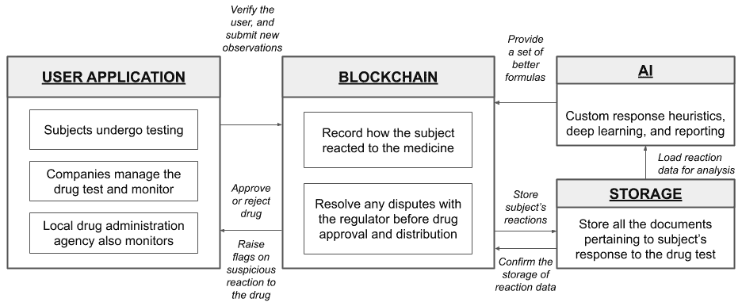

图 9.12：参考解决方案架构，以实现高效的药物批准和药物警戒透明度

如前所示的参考解决方案架构图，建议的解决方案分为四个组件，即：

+   **用户应用程序**：在这种情况下，我想提出三个应用程序。一个应用程序可供受试者使用，以上传药物反应以及由当局指定的适当照片或重要信息。信息将存储在一个匿名钱包下，不会向公众透露太多个人信息。药品公司可以使用另一个应用程序来审查受试者提交的反应。这些数据对公司制定更好、副作用更少甚至没有的药物非常有帮助。最后，我们可能需要一个独立的仪表板供地方药品机构监测任何紧急情况，报告药物测试期间的死亡案例，并批准或拒绝一种药物。

+   **区块链**：区块链网络将为所有三个角色提供钱包：受试者、药品公司和监管机构。药物反应数据将安全地共享到所有三个钱包中。此外，维护药物经历的所有测试的可追溯性非常重要。这可能有助于未来的调查，并有助于确定有责任的行为者。我们还将需要在网络中使用智能合约来促进通过智能合约批准药物。这个智能合约可以简单地在监管机构的监督下运行，或者通过数字签名共同展示群体的利益，使用网络中超过一个钱包的私钥共同在批准请求交易上签名。这种方法通常被称为多重签名。

+   **存储**：我们需要一个分散式存储服务，能够存储受试者对药物反应的确切不变版本。我再次建议使用基于 IPFS 的网络，以便定制对数据的访问。

+   **人工智能**：现在，药物反应数据已经在基于 IPFS 的网络（如 MoiBit）上提供，我们需要能够使用深度学习技术和药物反应启发式。如果发现严重伤害或死亡，我们可以使用模型重新生成药物配方以解决副作用问题。

在对医疗保健行业中几个领域的问题进行了详细的分析之后，现在让我们来探讨供应链行业面临的问题。

# 在供应链管理中融合人工智能和区块链

供应链管理被定义为一组活动，用于简化为生产成品所需的所有商品和原材料的流动。它涉及原材料的存储和运输，库存监控以及将成品交付到消费点。所有这些过程都需要进行数字化监控，并实时通知任何中断。因此，需要灵活准确的智能供应链管理软件。预计到 2025 年，供应链管理软件的市场规模将达到约 250 亿美元。

有多种方法和解决方案架构可用于构建智能**供应链管理**（**SCM**）软件。我在第三章中提到了一些这样的供应链管理软件，*AI 和区块链的领域特定应用*。因此，我们将涵盖供应链行业面临的一个简单问题，并尝试用基于区块链和人工智能的解决方案解决这个问题。

在接下来的章节中，我们将探讨供应链行业面临的主要问题，并尝试解决它们的问题。

## 波动性

波动性可以在商品价格中体现，这是由于供需变化所导致的。地缘政治问题、生物危害问题、法律和其他经济问题也可能影响商品价格。管理商品价格的波动性是供应链管理中的关键要素。相反，任何与供应链相关的风险都可能扰乱商品价格。

我们需要能够解决导致价格波动的一些因素的智能供应链软件。让我们在下一节中解决这个问题。

### 现状情况

供应链中商品价格的波动性可能会造成损失。目前，供应链利益相关者可能会因软件无法识别价格的快速变化而遭受这些损失。

### 未来情景

未来，供应链利益相关者应该组成联盟，提前识别流动性问题，并利用区块链和人工智能促进贸易和物流。

### 可能的解决方案

我们可以使用任何适合的区块链平台，通过可扩展的智能合约支持，来促进所有供应链活动。我建议在深入开发之前，你仔细了解区块链的能力以及它可以处理的交易量。这样简单的研究可以在开始项目之前节省时间和精力。另外，你可以考虑使用去中心化的数据存储选项，如 MoiBit，用于存储所有必要的重要文书，以维护审计目的并建立来源。最后，可以开发人工智能模型来利用透明账本，以识别当前原材料的数量并做出必要的安排。然而，如果供应受阻，模型可以进行对冲，以覆盖剩余成本并继续进行操作。

以下图表总结了我们的方法在一个分隔式参考结构中，以帮助你更好地理解解决方案：

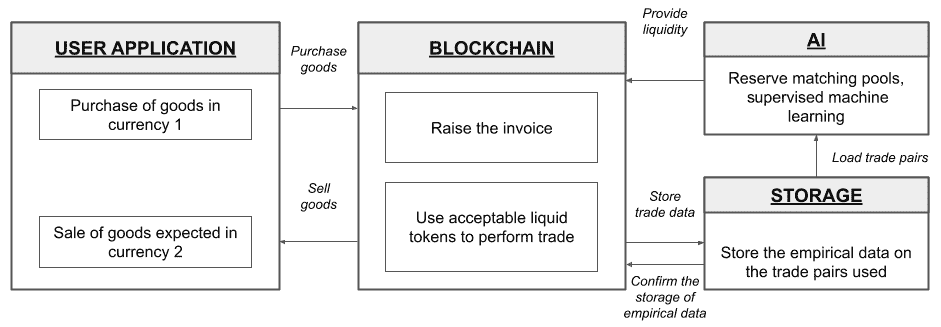

图 9.13：用于减少供应链波动风险并更快结算的参考解决方案架构

如前面的参考解决方案架构图所示，建议的解决方案分为四个组件，分别是：

+   **用户应用程序**：我建议一个简单的应用程序，可以供买家和卖家使用。也许你可以考虑增强一个现有的市场应用程序，并加入真实的交易数据。

+   **区块链**：区块链网络将为买家和卖家提供钱包。与将本地货币转换为全球储备不同，你可以考虑使用自定义的稳定币进行交易，这些稳定币可能数量充足且转换费用较低。

+   **存储**：我们需要一个去中心化的存储服务，可以捕获交易对，而不泄漏交易的具体内容。这可以通过仅保留那些可以向任何人提供而不损害任何人隐私的交易对来实现。

+   **AI**：现在交易对已经可用，我们可以运行监督式机器学习算法，优化寻找那些能以更低价格出售稳定币的交易者的搜索。这有助于减少在转换货币时的波动问题，从而减少结算所需的总时间和成本。

在这里列出跨多个领域供应链行业的问题的详细解决方案之后，现在让我们探索其它领域所面临的问题。

# 在其它领域融合人工智能和区块链

在本节中，我将概述问题以及带来好处的*未来*情景。但是，你不会看到解决方案方法。我期望你进一步研究这些挑战，扩充分析，并自行提出解决方案架构作为练习。

针对每个领域提出的*预期*和*现状*情况，鼓励您提出自己的解决方案。您可以参考本章节提出的各个部分中我提出的潜在解决方案的格式。

现在让我们探讨法律与秩序管理机构所面临的问题，并试图解决这些问题。

## 法律与秩序

警察局、地方政府以及司法系统密切合作，以保护人们免受诈骗、暴力和其他形式的犯罪活动。这些政府机构集体被称为**法律与秩序**。

### 现状情况

在发展中国家监视人、实体和组织的行为可能会因资源有限而变得繁琐。我们需要考虑改革当前体系中的一些关键流程，以保持社会稳定并促进企业发展。

法律与秩序管理机构所面临的首要问题如下：

**冲突和仲裁管理**：当通过一项法案时，作为公民追踪和理解何时该规定将生效变得困难。您可能也注意到，尽管上议院通过了一项法律，却需要很长时间才能看到其实施。有时，一项普遍的法律可能会影响两个或更多的政府机构，从而导致更多关于执行规定的混淆。这些问题将导致为公民提供服务的延迟。

### 预期情况

未来，法律与秩序需要在人类智能与机器和网络效率之间取得平衡。通过紧密结合行政、立法和司法部门，这是可能的。优化某些重复进行的一组决策流程的流程可以更好地为社区服务。政府机构的财团不仅可以帮助行政履行预期的绩效，还可以大幅减少执法成本。

现在让我们探讨实现国家安全所面临的问题，并试图解决这些问题。

## 国家安全

对每个国家而言，国家安全至关重要。对于发展中国家，努力是为了确保他们在全球政治舞台上占据更好的位置。同样，发达国家可能会努力确保他们不会失去在全球政治舞台上相对较高的地位。在这两个目标之间存在着通过代理战争、内部政治动荡和间谍活动潜在破坏另一个国家努力的利益。我们必须找到一种方式来识别困扰许多国家的此类问题，并尝试借助区块链和人工智能来解决。

### 现状情况

印度的地缘政治地位相对较高，这是因为一些对手面临的地理挑战，以及该国作为发达国家正在取得的经济进步。在这样的显著进展中，我们可能会遇到一些试图破坏国家行政机构所采取的举措的努力。因此，我们必须识别这些问题，并以适当的方式处理它们。

在应对国家安全事务方面面临的主要问题是：

**无人机**（**UAV**）：许多以四轴飞行器形式飞行的国内无人机在技术上被称为无人机。无人机对平民和军队都构成威胁。因此，重要的是识别在印度进口、操作和销毁的所有无人机。

### **待定情景**

未来，政府可以鼓励当局借助区块链注册所有无人机和任何其他支持设备。此外，各机构可以在城市每个地区设立本地无人机应对中心，以减轻无人机带来的任何实时风险。这些应对中心可以使用基于人工智能的技术分析来自无线传感器的信号，以预测无人机的非计划飞行。这种情报可以帮助评估攻击风险在发生之前。

现在让我们探讨保护环境面临的问题，并尝试解决在这个领域遇到的问题。

## 环境保护

我相信保护地球，我们唯一的家园，是一项根本的义务和道德责任。保护地球的一种方法是通过保护对我们星球稳定性有贡献的生态多样性。你可能已经知道，气候变化在世界各地以不同的方式可见。尽管它可能没有达到毁灭性的程度，但它很快将达到不可逆转的毁灭点。为了防止这种情况发生，我们可以尽最大努力保护我们的陆地和水域的野生动植物以及生态多样性。

### **现状**

目前，包括一氧化碳（CO）、二氧化碳（CO2）和甲烷在内的几种温室气体在我们的大气中很常见，这是由于燃烧化石燃料、养殖牲畜以及制造许多工业产品造成的。

阻碍节能努力的主要问题是：

**碳定价**：碳定价是通过对燃料征收溢价或设置单位实体可排放气体的限额来减少温室气体排放的方法。根据《巴黎协定》，许多国家已经自愿支持碳定价。然而，一些国家尚未支持这一运动。尽管许多国家已经自愿支持，但如果这些变化不以透明的方式呈现出来，沟通这一运动的进展可能会变得困难。

### **待定情景**

将来，所有自愿加入《巴黎协定》的国家都可以将所有的碳抵消数据记录到区块链中。这些信息可以从基本消费者转移到供应商，一直到政府，然后回到可能加入联合体的巴黎协定成员手中。

现在让我们探讨一下农业行业面临的问题，并试图解决它们的问题。

## 农业

农业是印度经济的支柱。在撰写本文时，它是我们**国内生产总值**（**GDP**）的主要贡献者之一，全球市场规模估计将在未来 3 年达到近 12 万亿美元。

### 现状

在过去的几年里，印度农业行业面临着一些严重问题。除了由于不规律的季风、洪水和饥荒而导致的农民困境外，我们将在接下来的章节中介绍农民面临的一些经济问题。

困扰农业行业的主要问题如下：

+   **为农民公平确定价格**：随着互联网的出现，通过一些决定产量价格的合作系统更容易发现价格。农民还能够从邻近市场发现产量的价格。然而，如果经纪人计划合作以支持他们的个人动机，这可能是一个更大的游戏。这是通过经纪人以低价从本地采购产量并将其出口到可能不了解本地产量价格的市场实现的。

+   **即时锁定和付款**：即使农民接受经纪人设定的价格，但一旦产量存放在仓库中，也不能保证立即付款。一旦产量被囤积在仓库中，经纪人可能会找到合适的买家，从中抽成，然后将款项支付给农民。在印度，这可能需要很多天，甚至几周。如果付款延迟，农民的义务可能无法履行。一些农民已经失去了他们的资产，而另一些人则选择了自杀，这是一个非常悲伤的局面。

### 应当情景

将来，所有农民都应考虑加入托管在区块链网络上的价格发现应用程序，以便在地区和州级别共享所有产量的价格信息。农民还应考虑在短期内相互交易产量并作为抵押品获得贷款。

# 总结

本章详细阐述了我们如何利用各种人工智能技术和模型来赋予区块链及其分布式应用程序力量。本章还向您介绍了企业、政府、金融服务、人力资源管理、医疗保健和供应链管理等领域面临的一些真实挑战。本章的目的是激发您在即将到来的项目中使用这些想法。您也可以将本章的思维重新应用于您在区块链和人工智能研究中遇到的其他未来问题。

人工智能和区块链是推动创新步伐的两大主要技术。预计这两种技术的结合将重塑 IT 行业的创新。我希望这本书能够使您通过结合这两种技术来开发一种思维范式，以开发面向下一代互联网及其用户的高效且健壮的应用程序。

恭喜您完成了这本书，并鼓励您保持对这两项革命性技术的关注。我希望这本书能帮助您在许多方面取得进步。感谢您的阅读。祝愿您在未来的区块链和人工智能事业中身体健康、幸福和成功。南无。
