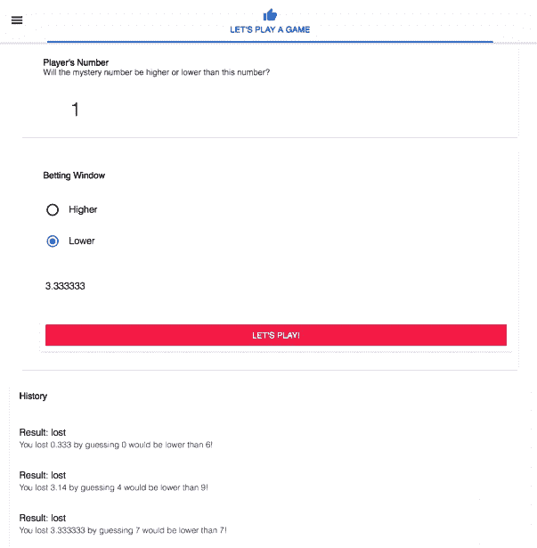
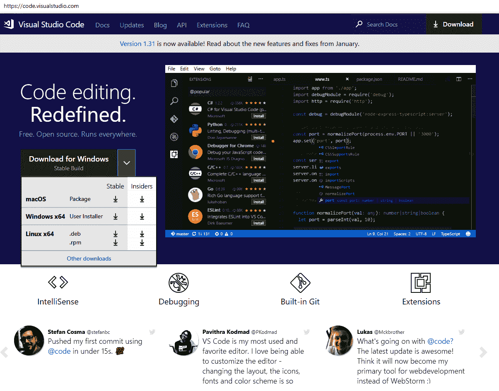
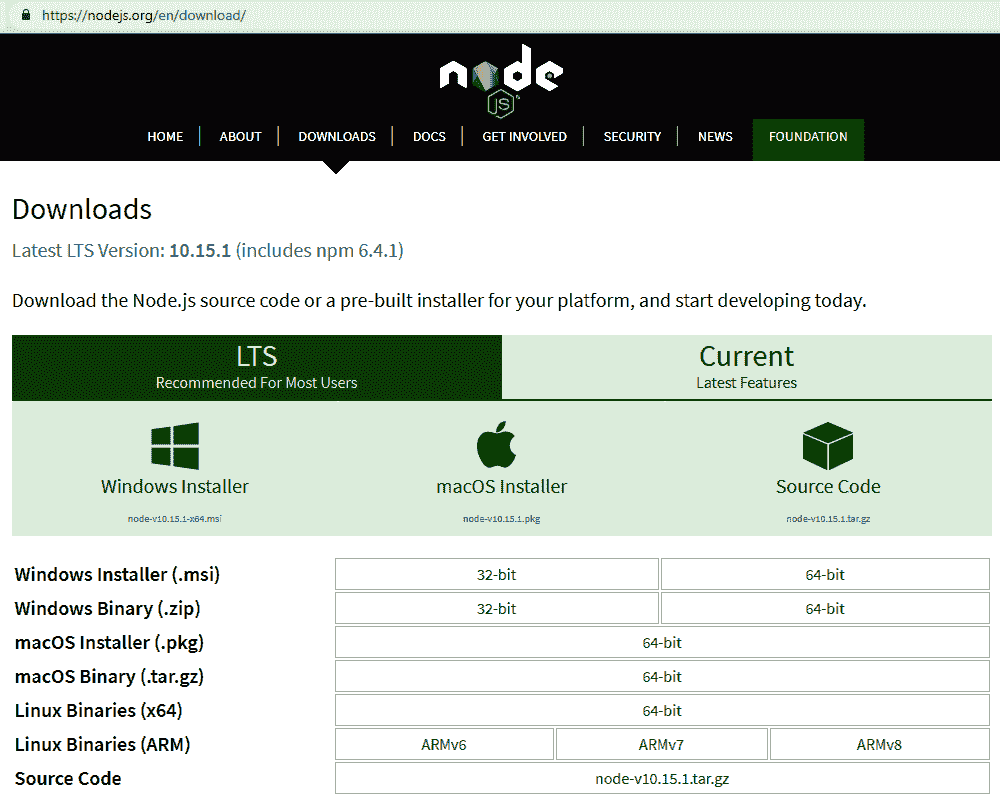
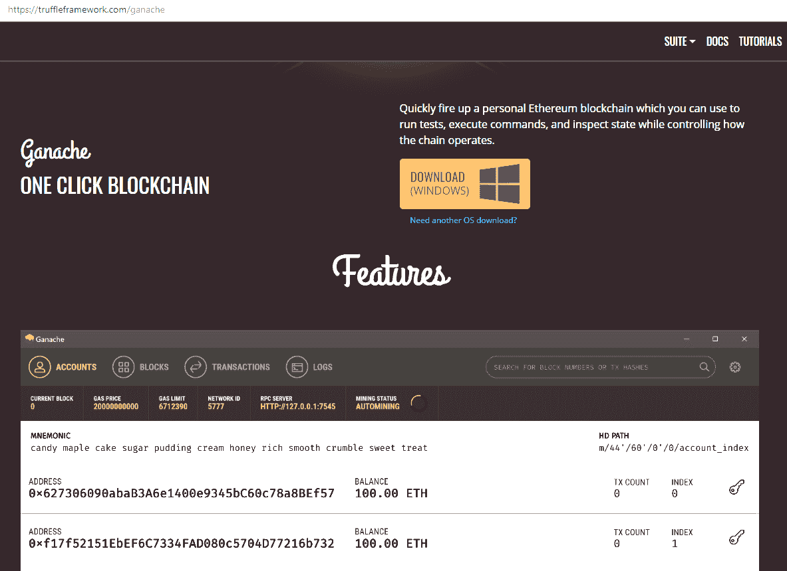
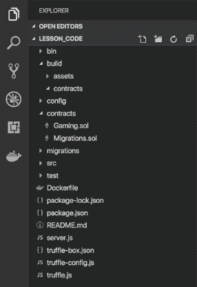
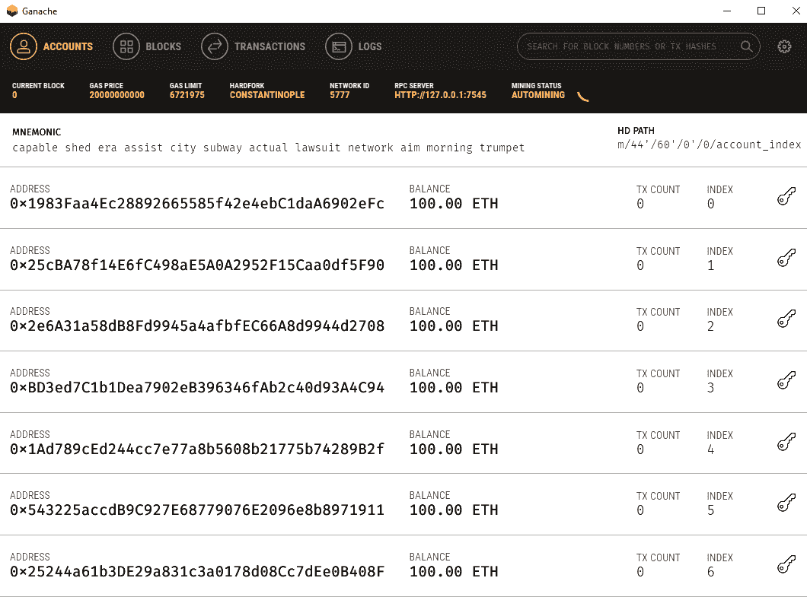
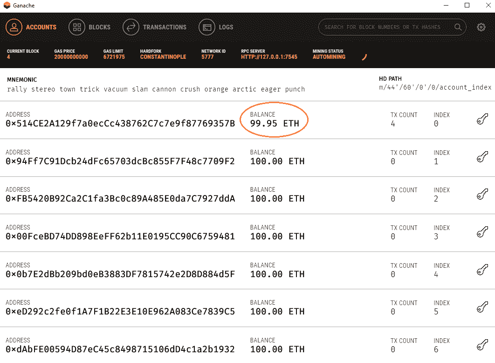
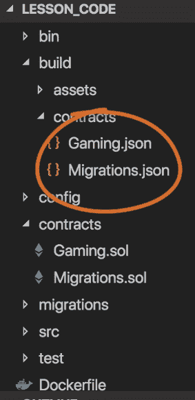
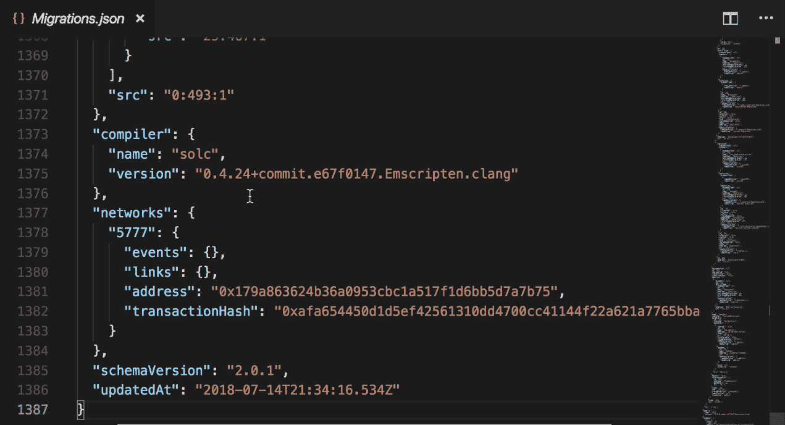
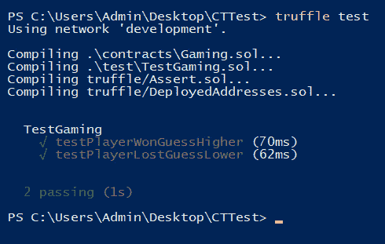

# Day One - 应用程序介绍、安装和设置

区块链是一个如此广阔的话题，在短短一周内就能变得高效，启动您的区块链项目，或者成为一名区块链开发人员，这真的可能吗？区块链技术正在出现在各个行业，从我们如何银行到我们如何旅行，我们如何证明我们的身份，甚至我们如何获得医疗保健等方面。所以，这让我们产生了一个问题，您真的可以在短短七天内学会创建一个区块链应用程序吗？

在这个项目中，您将学习如何使用以太坊区块链在七天内创建一个在线游戏应用程序！在此过程中，您将学习如何使用 Solidity 创建和使用变量，并使用函数执行业务逻辑；通过学习编写测试来消除代码中的错误和错误，您将与以太坊区块链交互，通过一个使用 React 和 Redux 的用户界面。您将编写代码来从您的去中心化应用程序发送和接收资金，最后您将学习如何将您的去中心化应用程序部署到以太坊网络和亚马逊网络服务上。在这本书中，我们将一切都拆解到基础，这样您就可以放心，您成功所需的唯一一件事就是想成为区块链开发人员的愿望和愿意付出努力。

本章将作为开始这个项目的基石，涵盖以下主题：

+   我们应用程序的介绍

+   安装所需的工具

+   创建我们的第一个智能合约

+   理解基本语法

+   写下您的第一个测试

# 我们应用程序的介绍

现在让我们来看一下我们将要构建的应用程序。我们将构建一个游戏应用程序，向玩家展示一个介于 0 和 9 之间的数字，然后他们可以选择下注一个神秘数字是否高于或低于显示的数字，然后可以下注他们愿意下注的以太币数量。他们游戏的结果显示在历史窗口中，当他们赢了或输了时，资金会自动从他们的以太坊账户中添加或扣除。以下截图展示了应用程序的演示：



要构建这个应用程序，您将使用 Solidity 创建包含并在区块链网络上执行游戏规则的合约。用户界面将使用 React 编写，您将使用 Solidity 编写合约代码。您将学习一个名为 Ganache 的工具，它允许您在本地工作站上托管自己的以太坊区块链。我们现在已经准备好开始构建应用程序了。让我们从在我们的工作站上设置所有必需的工具开始。

# 安装所需的工具

让我们来看看你将需要的所有工具，不仅是本书，还有作为一个区块链开发者成功所需的工具。我们将了解托管我们的应用程序、编译和迁移我们的代码以及测试我们的应用程序所使用的所有技术。所以让我们开始我们的第一个工具吧！

# Visual Studio Code

我们将使用的第一个工具是 Visual Studio Code。在其最简单的形式中，它是一个文本编辑器，但是当你对它更加熟悉时，它将成为你作为区块链开发者的一部分。它包含了许多功能，这些功能将使你的生活更加轻松，比如语法高亮、智能感知以及针对特定编程语言的扩展，比如本书中将要使用的 JavaScript 和 Solidity。我们将使用 Visual Studio Code 使用 Solidity 编程语言创建我们的智能合约。

要安装它，可以访问以下网站：[`code.visualstudio.com/`](https://code.visualstudio.com/)，并下载适合你操作系统的安装包。你应该看到一个类似于以下屏幕截图的首页：



这是唯一非必需的工具；你真正需要的只是一个你熟悉的代码编辑器，所以如果你已经有一个编辑器，你也可以继续在本书中使用它。

我们的智能合约为我们的应用程序提供了两条规则——它是用一种叫做 Solidity 的编程语言编写的，并且它存在于以太坊区块链网络上。另一种想象合约的方式是想象购买一辆汽车。这样做，你同意购买价格、首付款以及可能的融资条款。所有这些细节都输入到一个合约中，你签署以购买车辆。我们不会打印出那个合同然后在一张纸上签名，我们将这些细节放入一个智能合约中，你或者买方会进行加密签名。

我们还将使用 Visual Studio Code 编写渲染我们应用程序用户界面的 JavaScript。我们将具体使用 React 和 Redux 来创建用户界面。最终，我们希望的是某人访问我们的网站，并且服务器向他们发送一个包含我们应用程序的网页。我们将使用 Node.js 来实现这一点，所以你需要安装它。

# Node.js

正如我们在前一节中提到的，我们将需要一个网络框架，可以用来发送和接收数据到和从我们的网站。Node.js 是全球范围内用于此类目的最流行的框架之一。

Node.js 主要用于实现后端 API，这些 API 可以在浏览器之外运行 JavaScript 代码。在本书中，我们将使用它来连接我们的合约、GUI 和编程后端到我们的网站。你可以通过访问 [`nodejs.org/en/download/`](https://nodejs.org/en/download/) 并选择适合你操作系统的正确包来安装 Node.js。Node.js 的首页看起来类似于以下屏幕截图：



# Truffle 框架和 Ganache

当用户在我们的应用程序中执行需要写入区块链的操作时，称为**事务**。事务不会立即写入；相反，它被发送到网络，在那里等待矿工确认为有效的事务。一旦矿工确认了它，它就会被写入区块链，此时我们可以向用户提供更新后的状态信息。

现在，以太坊网络上的所有这些都代表着数十万台服务器，但我们没有数十万台服务器闲置，并且您不希望在开发期间每次需要测试时都等待外部服务器。

因此，我们将使用 Ganache 模拟我们自己的以太坊网络。它是一个独立的应用程序，可以在您自己的工作站上创建一个以太坊测试网络。要安装 Ganache，我们将前往 [`truffleframework.com/ganache`](https://truffleframework.com/ganache)，并下载其安装程序包。以下截图显示了此的登陆页面：



一旦完成了这一步，我们需要安装 Truffle 框架。这是一个以太坊开发框架，使我们能够更轻松地完成一些事情，比如编译我们的合约、与区块链网络交互以及将我们的合约迁移到以太坊网络。

为此，我们将打开一个终端，无论是 Bash shell 还是 Windows 命令提示符，然后输入以下命令：

```
$ npm install -g truffle
```

注意，`npm` 被打包为 Node.js 的一部分，这意味着如果您跳过安装 Node.js 步骤，那么在此命令起作用之前，您需要返回并完成它。

现在，为了获取我们应用程序所需的代码，我们将使用以下命令：

```
$ truffle unbox github_url

```

此命令为您下载并设置代码。请确保在前面的块中用实际的 GitHub 仓库替换 `github_url` 值！

在运行 `truffle` 命令时，您可能会遇到一些错误。这是一个已知的问题，并作为官方文档的一部分嵌入其中。您可以参考以下链接找到解决方法：[`truffleframework.com/docs/truffle/reference/configuration#resolving-naming-conflicts-on-windows`](https://truffleframework.com/docs/truffle/reference/configuration#resolving-naming-conflicts-on-windows)。

经过我们的先决条件，现在是时候进行更有趣的事情了，这包括编写一些代码。在下一节中，我们将看看写合约意味着什么，以及它如何作为区块链网络的一部分进行交互。

# 创建我们的第一个智能合约

在本节中，您将学习以太坊合约的基础知识。您将学习它们是什么，它们居住在哪里，如何创建它们以及如何将它们部署到以太坊网络。

**合同**是由其函数和数据或合同的当前状态表示的代码集合。它位于以太坊网络上的特定地址，并且需要记住的一件重要事情是，以太坊网络是公开的，这意味着任何人都可以查看您的合同及其数据。

这与你可能熟悉的传统应用程序不同。在传统应用程序中，代码通常存储在应用程序中，而数据则存储在其他地方，可以是磁盘上的文件或数据库中。现在，让我们看看合同包含什么。

# 分析合同

我们合同的源代码存储在`contracts`文件夹中。当我们编译它们时，它们将发送到以太坊区块链。编译还会创建一个存储在`build/contracts`文件夹中的合同元数据。以下截图显示了我们将要构建的应用程序的结构：



合同本身以`pragma`语句开头，`pragma`语句告诉编译器有关代码的信息。在我们的情况下，我们想告诉编译器，此代码是用 Solidity 编程语言编写的，并且使用了 Solidity 语言的`0.5.0`版本。因此，提及此内容的代码如下所示：

```
pragma solidity 0.5.0
```

在前面的代码块中看到的版本信息是**SemVer**或**语义化版本**。基本上，在 SemVer 中，第一个数字表示包的主要版本，中间数字表示次要版本，第三个数字表示补丁级别。

在升级时需要记住的一点是，升级版本可能会导致一些不兼容的情况；然而，遵循 SemVer 的应用程序中的一个好处是，如果引入的变化与以前的版本不兼容，可以增加主要版本号来告诉编译器使用较新的工具补丁。此外，虽然不太常见，但某些应用程序也会在次要补丁号中引入重大变更，这就是我们在代码中使用`^`符号的原因，用于 Solidity 的旧版本。这个`^`符号告诉编译器，可以使用 Solidity 编程语言的任何版本，从`0.4.24`一直到但不包括`0.5.0`。这确保了您使用的编译器版本与您编写的版本兼容。然而，由于我们在这里使用的是`0.5.0`，所以我们不会将其纳入考虑。

要声明一个合同，我们使用`contract`关键字后跟我们的合同名称，按照常规的惯例，这个合同名称跟随文件名，因此这个`Gaming`合同的文件将会是`Gaming.sol`。我们有一组左大括号`{`，然后如果需要包含注释，可以这样做，就像在 SQL 编程语言中一样，用`/*`符号，然后我们用右大括号`}`来结束我们的合同。这可以在以下代码片段中看到：

```
pragma solidity 0.5.0;

contract Gaming {
/* Our Online gaming contract*/
}
```

在 Solidity 中有一个称为**构造函数**的特殊函数，它在合同创建时仅运行一次。通常用于初始化合同数据。例如，让我们看看以下代码片段：

```
pragma solidity 0.5.0;

contract Gaming {
/* Our Online gaming contract*/
address owner;
bool online;

constructor() public {
        owner = msg.sender;
        online = true;
    }
}
```

如前面的代码片段所示，我们有一个名为`owner`的变量和一个名为`online`的变量。当合同被创建时，我们将`owner`变量设为将合同推送到网络的以太坊地址，我们还将`online`变量设为`true`。

Solidity 是一种编译语言，为了在区块链上使用合同，它必须被编译和迁移到该网络。要编译它，我们将使用 Truffle 框架。我们可以用`truffle compile`命令来做到这一点，它会创建一个包含合同元数据的 JSON 文件，其中包含有关您的合同的信息，我们将使用该 JSON 文件来与合同交互并验证其源代码。

为了在区块链网络上使用我们的合同，我们必须将其从我们的工作站传输到网络上，这就是**迁移**。因为我们使用 Truffle 框架，我们可以使用`truffle migrate`命令很容易地完成这个过程。

现在，如果我们查看我们的目录布局，在`migrations`目录中，我们将找到一个名为`1_initial_migration.js`的文件。该文件是由 Truffle 框架提供的，它处理合同的部署。让我们来看看该文件中的代码：

```
var Migrations =
artifacts.require("./Migrations.sol");
module.exports = function(deployer){
    deployer.deploy(Migrations);
};
```

有一个名为`Migrations`的变量，它需要 Truffle 库`Migrations.sol`，然后导出一个函数，该函数需要一个`deployer`对象来部署迁移。

我们还有一个名为`2_deploy_contracts.js`的文件，它包含在下载中。这个文件实际上是要迁移我们作为本书的一部分编写的合同。现在让我们来看看这个文件中的代码：

```
var Gaming =
artifacts.require("./Gaming.sol");
module.exports = function(deployer){
    deployer.deploy(Gaming);
};
```

类似于前一个文件，有一个名为`Gaming`的变量，它需要我们创建的`Gaming.sol`合同文件，然后运行`deploy`方法来部署`Gaming`合同。

# 测试合同

为了帮助巩固迁移这个概念，我们实际上将迁移一些合同，然后分析网络会发生什么。为了做到这一点，我们将使用以下步骤：

1.  我们的第一步是启动 Ganache 应用程序，这将使我们的私有区块链运行起来，如下面的屏幕截图所示：



正如前面的截图所示，我们有 Ganache 应用程序正在运行。让我们看一下余额，它目前为 100 以太，还没有被挖掘的区块，也没有交易。

1.  切换到控制台，我们将输入以下命令将合同迁移到网络上：

```
$ truffle migrate 
```

1.  一旦迁移成功，我们将返回 Ganache，那里会看到类似这个截图的界面：



我们可以看到地址 0 或账户 0 已经花费了一些以太坊。这是用来支付合同迁移的费用。从区块来看，我们可以看到挖掘了四个区块，以及用于创建和迁移这些合同的四笔交易。

1.  如果我们切换到代码编辑器，本例中为 Visual Studio Code，在`build/contracts`文件夹中，您可以看到编译结果产生的合同元数据文件在这里：



如果我们打开`Migrations.json`文件并滚动到底部，您可以看到它存储了此合同已部署到的网络，以及部署合同的地址，如下截图所示：



祝贺！如果你已经到达这里，那么你已经成功创建并部署了你的第一个合同。你已经看到了一些语法的用法，因为我们指定了`owner`变量并构建了`constructor`函数。在下一节中，我们将讨论 Solidity 编程语言使用的一些语法和风格指南。

# 理解基本语法

我们不能在没有覆盖一些基本的 Solidity 代码开发语法指南的情况下开始我们的学习之旅。编写代码时的一致性目标并不是为了确定什么是对或错，而是为了提供指南，帮助确保代码总是相同的。这使得代码更易于阅读和理解。

这是一个重要的记住点——它并不是正确的方式或最好的方式，只是一个一致的方式。这并不意味着风格指南适用于每个情况。如有疑问，您应该查看其他脚本示例，然后做出最好的判断。

# 代码布局

对于代码布局，我们应该始终使用每级缩进四个空格。空格优先于制表符，但即使使用制表符，也要避免在同一文件中混合使用制表符和空格。让我们在接下来的代码块中看一个例子：

```
pragma solidity 0.5.0;

contract Gaming {
    function determineWinner() public(){
        if (guess == true){
            return true;
        }
        else if (guess == false){
            return false;
        }
    }
}
```

我们首先看到指定的`contract`，然后第一个声明的函数缩进了四个空格。`if`块本身从那里缩进了四个空格。

# 空行

建议用两个空行包围顶层声明，用单个空行包围函数级别的声明。这将帮助您比随机查找文件并希望找到所需行更快地发现错误。让我们使用以下示例来看看如何使用空行：

```
contract A {
    function foo() public{
        //...
    }

    function bar() public{
        //...
    }
}

contract B{
    function foo() public{
        //...
    }
}
```

在前述的代码块中，我们声明了两个合同，在这两个合同之间有两个空行，这样就有了一个很好的大空白，方便区分。在我们的函数声明中，每个函数都用一个空行分隔开。这应该有助于轻松区分代码片段的每个元素。

# 行长度

对于行长度，建议最多 79 个字符。79 个字符的推荐值是在很久以前设定的，当时人们使用的 TTY 终端最大宽度为 80 个字符。现在看到最大宽度为 99 个字符实际上已经变得相当普遍了。让我们参考以下示例：

```
myReallyLongAndDescriptiveFunctionN
ame(
    reallyLongVariableOne,
    reallyLongVariableTwo,
    reallyLongVariableThree,
    reallyLongVariableFour
);
```

如图所示，第一个参数不附加在声明函数的行上，它只有一个缩进。此外，每行只有一个参数，最后，结束元素单独占一行。

# 函数布局

你的函数应该按特定顺序排列。这是正确的顺序：

+   构造函数

+   回退函数

+   外部函数

+   公共函数

+   内部函数

+   私有函数

我们还没有讨论函数，所以这些内容可能对你来说还有点模糊，但我们将在下一节中详细讨论这个问题，所以请耐心等待。

为了构造函数，我们将在同一行上打开括号，并且在与开始声明的唯一缩进水平的地方关闭该行。同样，开放的大括号之前应该有一个单一空格。让我们看一下下面的代码块：

```
pragma solidity 0.5.0;

contract Gaming {
    function determineWinner() public() {
        if (guess == true){
            return true;
        }
        else if (guess == false){
            return false;
        }
    }
}
```

如图所示，当我们声明`Gaming`合同时，我们的开放大括号之间有空格。同样，对于我们的`determineWinner（）`函数，它在同一行上有开始大括号，然后我们的函数的结束大括号就在下面，函数的第一个字符开始的位置。

在声明变量时，我们更喜欢双引号而不是单引号来表示字符串。我们在操作符周围加上一个空格，因为这有助于在代码中突出显示它们，这样您就可以更轻松地识别它们。以下代码片段说明了这一点：

```
string str = "foo";  //This
string str='foo';    //Not this
```

但是，当您有优先级较高的运算符时，您可以省略周围的空间以表示其优先级。

# 命名约定

在命名变量时，应该始终避免使用单个字母的变量名，例如 int L，bool O 等。这样做的原因是它们看起来非常相似，对你的代码只会增加不必要的复杂性。

在命名合约、库、结构体和事件时，你应该使用 CapWords（或者 CamelCase），其中你将变量名的每个单词的第一个字母大写。以下片段展示了一个示例：

```
contracts SimpleGame {
    //...
}

contracts MyPlayer {
    //...
}
```

在命名函数、函数参数、变量和修饰器时，你应该使用 mixedCase，这与 CapWords 非常相似，只是你不要将第一个字母大写，如下面的代码块所示：

```
contracts SimpleGame {
    function simpleGame () {
        //...
    }
}
```

在命名常量时，你应该使用全大写字母命名它们。

你可以使用下划线（**_**）符号来避免函数、变量和代码中的其他对象之间的命名冲突。以下代码块显示了一个示例：

```
function mysteryNumber() returns (uint) {
    uint randomnumber = blockhash%10 + 1;
    return randomnumber;
}

uint mysteryNumber_ = mysteryNumber();
```

在前面的代码块中，我有一个名为`mysteryNumber()`的函数，在稍后的代码中，当使用该函数时，我真的很合理地将我的变量命名为`mysteryNumber`，因为它是一个神秘的数字，但我不能重用该名称而导致名称冲突。因此，当我实际获取到神秘数字变量时，我在其末尾加了一个下划线，以便`mysteryNumber_`成为我从`mysteryNumber()`函数中获得的变量。这样很容易区分这两者，但非常清楚我从哪里获取了那个神秘数字。

到现在为止，你可能已经看到，实施一致的编写代码指南如何使代码更易读和维护。虽然这不会使代码运行更快或者保证它是正确的，但它确实使编码的人类因素更加愉快，这反过来可能会使合作和讨论函数而不是代码格式更容易。在下一节中，我们将看看为我们的代码编写测试以及*为什么*我们要这样做。

# 编写你的第一个测试

在前面的一节中，我们学习了如何高效编写代码。虽然这样做可以使代码更易读，但这并不意味着我们的代码就能正常工作，毕竟，破损的代码也应该看起来漂亮，对吧？

让我们稍微谈谈你目前的测试策略。在编写代码后，你是否通过使用它并检查输出来手动测试它，然后在发布最新版本之前重复相同的过程？嗯，让我问你这个问题，你是否曾经忘记过一步，结果导致你发布了一个 bug，如果你记得执行那一步，就可以捕捉到那个 bug？在进行任何更改之前运行测试是个好主意。我们都花了不少时间试图弄清楚我们的代码是如何破坏了测试的，只是后来才发现，在我们开始做任何更改之前，测试就已经破了。

在这本书中，让我们编写自动执行这项任务的测试，我们将利用节省的所有时间来编写更多优秀的代码。我们的测试可以用 Solidity 编写，也可以用 JavaScript 编写。它们可以自动验证代码是否按预期执行，并且应在每次代码更改之前和之后运行。

因此，为了测试`Gaming`合同，我们将命名我们的测试文件为`TestGaming.sol`，测试本身放在项目的`test`目录中。它们也是一个实际的 Solidity 合同，这使得它们相对容易编写，因为你使用与编写任何其他 Solidity 合同相同的技术。

让我们来看一下应用程序中的一个实际的示例测试合同以及实施它们的一些最佳实践。你可以通过在文本编辑器中打开`TestGaming.sol`文件来访问合同。

现在，让我们将这个合同分解成单独的部分。合同开始如下：

```
pragma solidity 0.5.0;

import "truffle/Assert.sol";
import "truffle/DeployedAddresses.sol";
import "../contracts/Gaming.sol"
```

因此，我们有了`pragma solidity`语句和我们的 Solidity 版本。然后，我们从 Truffle 导入`Assert`库和`DeployedAddresses`库。除此之外，我们还将导入我们正在进行测试的实际合同，即`Gaming.sol`。下一步是定义我们的合同：

```
contract TestGaming {
    uint public initialBalance = 10 ether;
    Gaming gaming;
```

就像任何其他 Solidity 合同一样，我们定义我们的合同并给它命名为`TestGaming`。我们给它一些初始的`ether`来进行保存，我们可以在我们的测试中使用它，然后创建我们的`gaming`变量，这是`Gaming`合同的实例。

在我们的任何测试运行之前，我们先拿到我们部署的合同，因为在测试过程中，每次测试运行都会向测试网络部署一个全新的合同实例。以下代码显示了如何做到这一点：

```
function beforeAll() public {
    gaming = Gaming(DeployedAddresses.Gaming());
}
```

然后，我们为我们想要测试的每一个测试场景创建函数，如下面的代码块所示：

```
function testPlayerWonGuessHigher() public {
    bool expected = true;
    bool result = gaming.determineWinner(5, 4, true);

    Assert.equal(expected, result, "The player should have won by guessing the mystery number was higher than their number");
}

function testPlayerLostGuessLower() public {
    bool expected = false;
    bool result = gaming.determineWinner(5, 4, false);

    Assert.equal(expected, result, "The player should have lost by guessing the mystery number was lower than their number");
}
```

`testPlayerWonGuessHigher()`函数测试玩家是否猜测数字应该更高，如果数字确实更高，那么他们应该赢了。

`testPlayerLostGuessLower()`函数测试当数字实际更高时猜测较低的玩家是否应该输掉。

我们在我们的测试中设置这些场景，定义我们期望发生的事情，然后使用这些断言来验证实际发生的情况。因此，我们只需要在需要感觉或者在部署之前运行这个测试，我们就可以自信地说，我们确定谁赢得比赛和谁输掉比赛的功能是准确工作的。

# 作业

在这本书的每一章中，我都会给你布置一项作业，要在你开始下一天或下一章之前完成。今天的作业主要是关于设置你的开发环境。这不仅将帮助你完成本书的剩余内容，而且我将向你展示的工具将帮助你处理你接手的每一个区块链项目。以下是你需要做的：

1.  安装 Visual Studio Code。这是唯一可选的步骤，只有在你已经有一个你熟悉和喜爱的代码编辑器时才是可选的。

1.  从[nodejs.org](http://nodejs.org)安装 Node.js。

1.  从 Truffle 框架网站安装 Ganache。

1.  使用`npm`模块安装 Truffle 框架本身。

如果您之前已安装了 Truffle，请确保您至少安装了 Truffle 版本 4.1，并在需要时进行更新。您可以使用 `truffle version` 命令随时检查您的 Truffle 版本。

1.  最后，使用 `truffle unbox` 命令和本书 GitHub 仓库的 URL 安装课程代码。

1.  完成后，启动终端或命令提示符，根据您的操作系统，转到下载代码的目录，然后输入 `truffle test`。

如果一切顺利，Truffle 将会返回如下屏幕截图所示的成功消息：



# 总结

这就是本书第一天的内容了！在这一章中，我们学习了使用区块链和智能合约的所有基础知识。我们学会了如何设置环境来创建区块链应用程序。我们还学习了所有关于基本代码语法、命名约定、风格和结构的知识，以便达到最佳效率。我们学会了如何创建智能合约，以及如何测试它以确保其按预期工作。

在下一章，也就是第二天，我们将看看 Solidity 变量和数据类型，以及如何使用它们构建一些业务逻辑和数据。欢迎来到区块链的世界！
