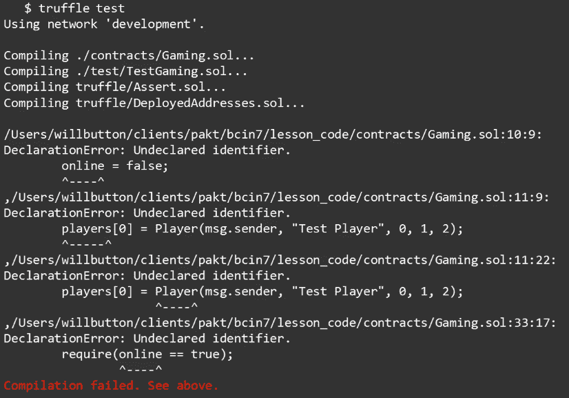
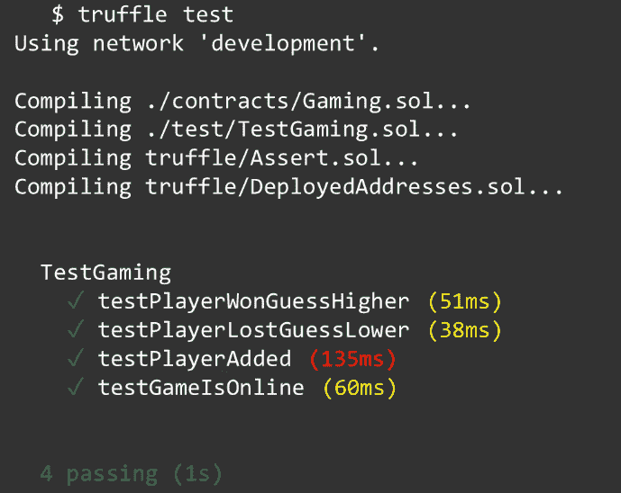

# 第二章：第二天 - Solidity 变量和数据类型

欢迎来到本书的第二天。在上一章中，我们设置了开发环境，并了解了本课程中要使用的工具。在本章中，我们将学习 Solidity 编程语言中的变量；我们将介绍它们是什么以及它们如何使用。本章涵盖以下主题：

+   理解 Solidity 变量

+   Solidity 中的数据类型

+   使用 Solidity 变量

+   理解 Solidity 操作符

+   使用 Solidity 操作符

# 理解 Solidity 变量

如果你是编程新手，这是一个需要掌握的关键概念。如果你是一位经验丰富的程序员，在本章中仍然有一些有价值的提示，因为我们将涵盖 Solidity 中变量特定的一些细微差别。

Solidity 是一种静态类型语言；这意味着，在声明变量时，必须声明变量的类型。考虑以下示例：

```
uint public foo = 4;
```

在上述示例中，我们声明了一个无符号整数 (`uint`) 作为 `foo`，并将其可见性设置为 `public`。我们可以选择为其分配一个值，然后以分号结束语句。

在 JavaScript 中，你可能会看到 `foo` 用 `let` 声明，或者作为一个常量，如果你在查看 ECMAScript 2016 之前的旧 JavaScript 代码，甚至可能会看到它声明为一个变量。

在下一节中，我们将详细介绍 Solidity 中所有常见类型，但现在，让我们专注于这个可见性标识符的含义。

# 理解可见性

Solidity 中的所有状态变量都必须声明其可见性，因此，我们有几种类型的可见性：

+   外部

+   公共

+   内部

+   私有

当可见性声明为 `external` 时，这意味着变量或函数成为合约接口的一部分。这暴露了函数或变量，以便可以从其他合约和交易中调用它们。例如，如果我们在智能合约中有一个函数，用于确定我们游戏的玩家是否赢了或输了一轮，并且我们需要从 React 应用程序中调用它，我们将不得不将其声明为 `external`，因为尽管我们的 React 应用程序位于我们的 Web 服务器上，但我们的智能合约位于以太坊网络上。

同样，具有 `public` 可见性的状态变量和函数是合约接口的一部分，可以从其他合约和交易中调用它们。它们无法在内部调用，而必须使用关键字 `this`，并且所有公开声明的变量都会自动生成一个自动获取器函数。

语句 *can't be called internally without this* 是什么意思？让我们使用以下示例：

```
function foo() public returns
(string) {
 return "Hello";
}

function bar() external {
 foo_ = foo(); //Not valid
 foo_ = this.foo(); //Valid
}
```

如果我们的合约中有一个名为 `foo()` 的函数，它返回字符串 `Hello`，那么直接从该合约中调用 `foo()` 函数将失败。如果我们想要调用它，我们需要以 `this.foo()` 的方式调用它。在内部声明的变量和函数只能在当前合约及其派生合约中访问。

在同一个示例中，如果我们将 `foo` 函数的可见性更改为 `internal`，那么直接调用该函数而无需 `this` 关键字现在可以工作了。

私有函数与内部函数非常相似，它们在当前合约内可用，但它们的不同之处在于它们在派生自该合约的合约中不可用。但需要注意的是，这并不意味着您在 `private` 状态变量和函数中的代码是私有的，这只是意味着它不能被调用。

以太坊区块链上的所有内容都是公开可见的。为了强调这一点，通过使用诸如 Etherscan 这样的工具，我可以查看流行的**去中心化应用程序**（**dApp**）的源代码，例如 CryptoKitties，并查看所有源代码，包括私有函数和变量。

声明为 `public` 的状态变量将自动创建一个 `getter` 函数。这是一个节省时间的功能。毕竟，由于您将变量声明为 `public`，您可能期望您的客户在某个时候需要访问该变量的值。您不必花时间和精力来创建该函数，因为 Solidity 编译器会为您创建一个。让我们考虑以下示例：

```
contract A {
    uint public foo = 42;
}

A.foo();
```

如前例所示，我们有一个名为 `A` 的合约，声明了一个 `public` 变量 `foo`。这意味着任何交易或合约都可以通过调用 `A.foo()` 函数来获取 `foo` 变量的值。您会注意到，您不需要编写任何代码来使其工作，因为编译器已经为您完成了。

现在，我们已经了解到 Solidity 是一种静态类型语言，我们在声明变量时必须声明我们正在使用的变量类型。有了这个理解，让我们进入下一节，学习 Solidity 中可用的不同数据类型以及它们的作用。

# Solidity 中的数据类型

Solidity 中的数据类型分为两大类：

+   值类型

+   引用类型

值类型是按值传递的，这意味着每当一个变量引用与另一个相同时，值总是被复制。与此同时，引用类型表示更复杂的类型，可能不总能适应 256 位。由于它们的大小较大，复制有时可能会很昂贵，我们有两个不同的位置可用于存储它们：内存或存储。现在让我们来讨论一下值数据类型。

# 值类型

我们将讨论的第一个值类型是布尔值。 它可以有两个值之一，要么是`true`，要么是`false`。 在 Solidity 中，当创建时，一切都会初始化为默认值 0。

对于布尔值，0 对应默认值`false`。 布尔值可用的运算符如下：

+   **逻辑否定**：表示给定值的相反，并由`!`符号表示。 例如，`foo = !false`。

+   **逻辑合取**：表示两个值的逻辑结果，并使用`&&`符号表示。 例如，`(foo && bar) > 1`。

+   **逻辑析取**：表示两个值之间的结果使用**或**，并使用`||`符号表示。 例如，`(foo || bar) > 1`。

+   **相等性**：用于将变量与某个固定值进行比较，并使用`==`符号表示。 例如，`foo_ == true`。

+   **不等式**：用于检查变量的值是否不等于指定值，并使用`!=`符号表示。 例如，`foo_!= true`。

下一个值类型是**整数**。 整数是整数，意味着没有小数点，它们可以是两种类型：

+   有符号整数（`int`）

+   无符号整数（`uint`）

您可以分步声明整数的确切大小，从 8 到 256。 因此，值可以声明为`uint8`、`uint16`，一直到`uint256`。 如果不声明大小，只声明`int`或`uint`，则它是`int256`和`uint256`的别名。 此外，重要的是要知道，使用整数，除法总是截断的； 因此，两个整数的除法结果始终是一个整数。

尽管所有先前的数据类型都是其他编程语言共有的，但**地址**数据类型是 Solidity 独有的。 它是一个 20 字节的值，用于表示以太坊网络上的地址。 地址可以是用户的以太坊账户或部署到网络上的合约。

它有一个`.balance()`成员，可用于检查与该账户关联的余额，以及一个`.transfer()`成员，可用于向该地址转账。 还有一个`.send()`成员，它是`.transfer()`成员的低级对应。 如果使用`.send()`，您必须检查操作的返回值以确定成功或失败，但如果您使用`.transfer()`，转账成员会自动处理这个问题。

下一个值类型是**字符串**。 字符串只是一块文本，但从技术上讲，它是一个字节数组。 这意味着您可以对字符串执行与数组相同的操作。 在声明时，您可以使用单引号或双引号，但正如我们在第一章中学到的那样，*第一天* - *应用程序介绍、安装和设置*，双引号更受推荐。 它们可以隐式转换为字节。 此外，字符串值支持转义字符，例如换行（`\n`）和制表符（`\t`）。

现在我们完成了值类型。让我们来看看 Solidity 提供的引用类型。

# 引用类型

第一个是一个**数组**。数组是一组数据元素，可以通过它们的索引号来识别。它们可以是固定大小的或动态的。要声明一个数组，您需要指定数组将包含的数据类型，然后是变量名称，然后是方括号，如下面的示例所示：

```
uint foo[]
```

如果数组声明为 `public`，您将获得一个自动 getter 函数。它与我们在上一节中看到的示例不同，因为 getter 函数需要知道要返回数组的哪个元素，并且它不会返回整个数组。因此，此函数需要元素或索引号作为参数。

它有一个 `.length()` 成员，将返回数组的长度，还有一个 `.push()` 成员，用于将新项目添加到数组的末尾。

接下来的数据类型是**结构体**。结构体提供了一种定义新数据类型的方法，但结构体不能包含自己的数据类型。您不能定义由您正在定义的东西组成的东西。考虑以下示例：

```
struct Player {
    address player;
    string playerName;
    uint playerBalance;
    uint wins;
    uint losses;
}

Player jim =
Player(msg.sender, "Jim", 0, 0, 0);
```

上述示例展示了如何创建一个数据类型来保存我们游戏中每个玩家的信息。我们首先将数据类型定义为 `struct`，将其命名为 `Player`，并打开大括号。在里面，我们定义了所有我们存储在玩家身上的属性（例如玩家的以太坊地址、玩家的姓名、他们当前的余额、他们赢的次数以及他们输的次数），然后关闭大括号。然后，为了为我们的游戏创建一个新玩家，我们定义一个新的 `Player` 类型变量，并使用代表新玩家的值初始化 `Player` 结构。

接下来是**映射**键类型。如果您使用过其他编程语言，可能会认识到映射类似于哈希表。这种数据类型是键类型到值类型的映射，当它被创建时，它被虚拟初始化，以使每个可能的键都存在，并且它被映射到一个其字节表示都是零的值。如果其可见性设置为 `public`，Solidity 将创建一个自动 getter。因此，基于我们先前为玩家创建的结构体的示例，我们可以创建所有玩家的映射，如下所示：

```
mapping (uint => Player) players;
```

在这里，我们将使用无符号整数作为玩家数据类型映射的键，这个对象将被称为 `players`。然后，我们可以通过指定映射的第一个元素并将新玩家分配给它来向映射中添加我们的第一个玩家。

现在我们了解了 Solidity 中可用的基本数据类型，让我们学习如何在 Solidity 合约中实际使用它们。

# 使用 Solidity 变量

现在我们已经了解了 Solidity 中变量的概念，让我们在合约中将它们实际应用起来。让我们看一下我们游戏中的合约：

```
pragma solidity 0.5.0;

contract Gaming {
    /*Our Online Gaming Contract*/
    address owner;
    bool online;
}
```

在声明合同后面，声明了两个变量。第一个是`owner`，它是一个`address`数据类型，代表部署该合同到以太坊网络的人的以太坊地址。然后我们有一个`bool`数据类型的叫做`online`，我们将使用它来确定您的游戏是在线还是离线；如果需要，它允许我们将游戏设置为离线。

嗯，在以太坊合同中有一个特殊的函数叫做`constructor`，它在合同部署时执行一次且仅执行一次。在其中，我们将做两件事：我们将把我们在合同开头声明的`owner`变量设置为将该合同部署到网络的以太坊地址：

```
    constructor() public payable {
        owner = msg.sender;
        online = true;    
    }
```

这意味着如果我部署了合同，我拥有这个游戏，如果你部署了合同，你就拥有这个游戏。这是您编写合同并将其交付给您的客户的一种方式，当他们部署它们时，他们将拥有合同积累的所有资产和货币。我们还将把我们的`online`变量设置为`true;`，我们稍后将使用它来有效地将我们的游戏设置为离线，如果需要的话。

我们还有一个叫做`winOrLose()`的函数，我们将从我们的 React 应用程序中调用它，并提供所需的参数来确定我们的玩家在这一轮中是赢还是输。还有另一个叫做`isWinner()`的函数，如果玩家赢了，则返回 true，如果输了，则返回 false。所以让我们使用以下代码片段来看一下它是如何工作的：

```
function winOrLose(uint display, bool guess, uint wager)
external payable returns (bool) {
    if (isWinner == true ) {
        /*Player won*/
        msg.sender.transfer(wager*2);
        return true;
    } else if (isWinner == false) {
        /*Player lost*/
        return false;
    }
}
```

在这里，我们有一个`if`语句，我们正在评估其中包含的条件。接下来，我们有包含要执行的代码的大括号。在括号内部，我们有我们的`isWinner()`变量，它是一个布尔数据类型，我们使用`==`符号来评估这个变量是否评估为布尔`true`。如果是，它将执行包含在块中的代码。

这段代码使用了一个特殊的消息`sender`变量，其中包含调用该函数的账户的地址。在这种情况下，就是我们的玩家。玩家赢了，所以我们将使用`.transfer()`成员将下注金额的两倍转移给玩家；我们之所以要翻倍，是因为玩家必须在此次交易中包含他们想要下注的金额，所以我们需要将它们归还给他们，再加上他们从该赌注中赢得的金额。

如果该语句的评估结果不为`true`，那么该代码块将不会执行，因此代码执行会继续到`else if`代码块。它的操作方式与`if`代码块相同。它将评估括号内的语句，如果`isWinner()`为 false，该代码块将返回 false 给我们的 React 客户端。

在我们的 React 代码中，我们将检查这个值，并根据情况更新 UI，以告知玩家他们在这一轮中失败了。

# 以太单位

当我们谈到变量时，让我们看看可以应用于变量的一些特殊单位。我们将从**Ether**单位开始。它们用于指定货币，并且可以应用于任何文字数字。它们还可以在 Ether 的子单位之间进行转换。

Ether 的子单位如下：

+   **Wei**：这是 Ether 中最小的货币单位

+   **Szabo**：也被称为微 Ether，等于 10 的 12 次方 Wei

+   **Finney**：也被称为毫 Ether，等于 10 的 15 次方 Wei

+   **Ether**：等于 10 的 18 次方 Wei

要使用这些单位，只需在任何文字数字的末尾指定单位，编译器就知道如何在不同的子单位之间进行转换。

# 其他特殊单位

我们还有**时间单位**可供使用，并且它们可以用于指定时间单位。它们的声明方式与货币一样：任何文字数字都可以附加所需的单位。这里可以使用的不同时间单位包括：

+   秒

+   分钟

+   小时

+   天

+   周

但要注意的是，不要在日历计算中使用它。并非每一天都有 24 小时，这是由于**闰秒**。闰秒类似于闰年，只是它们是秒。实际上，Solidity 过去也有一年的时间单位，但由于闰年的问题，已被废弃。

还有一些独特的变量。第一个是**区块编号**(`block.number`)。请记住，以太坊矿工始终在确认交易，将其写入区块，然后将这些区块添加到区块链中。这是从该操作中的当前区块编号；它用于跟踪当前正在挖掘的区块。

**区块时间戳**(`block.timestamp`)是当前区块的时间戳，报告自 1970 年 1 月 1 日以来经过的秒数。还有一个别名称为`now`，它指的是`block.timestamp`。

然而，这两者都不应该依赖，因为它们可以在一定程度上被恶意矿工操纵，这可能被用来利用您的合约的时间戳。一般来说，您可以确信当前时间戳大于上一个区块的时间戳，并且它将小于下一个区块的时间戳，但就这样了。

**消息价值**(`msg.value`)是随消息发送的货币数量。在构建我们的应用程序时，我们将更详细地探讨这一点。我们将使用它来收集我们游戏玩家的赌注。

你已经见过`msg.sender`并了解它是当前调用者的以太坊地址。还有一个`tx.origin`或**传输起源**，它是交易发送者的以太坊地址。你可能会觉得诱人，但总的来说，消息发送者可能是你想要的。`tx.origin`和`mg.sender`可能不是同一个东西，特别是在合同或功能调用其他合同或功能的情况下。

好了！现在，我们已经见过 Solidity 数据类型，也学习了它们在代码中的使用；接下来，我们将看看不同的运算符，这些运算符可以用来构建合同中的复杂业务规则和逻辑。

# 理解 Solidity 运算符

在本节中，我们将看看 Solidity 中可用的不同运算符。这样做将帮助您更好地理解可以编写到合同中实现业务逻辑的逻辑操作。

我们将要讨论的前三个运算符如下：

+   赋值

+   相等性

+   不等式

刚开始学编程时，你可能会觉得这些很困惑；然而，现在花一分钟将为你未来节省数小时的沮丧。

**赋值**用于将值赋给变量。例如，我们可以将变量`foo`赋值为`bar`，如下面的代码片段所示：

```
string foo = "bar";
foo == bar;
foo != bar;
```

接下来的运算符是**相等性**，我们用它来确定一个变量是否等于另一个变量。在上面的示例中，我们正在检查变量`foo`的值是否等于字符串`bar`，在我们的案例中，是的，所以这个表达式将评估为 true。

最后我们有**不等式**，它与等式完全相反。所以，在前一个示例的第三行中，我们正在检查`foo`是否不等于`bar`，但它是相等的，所以这个表达式将评估为 false。

我们还有一组**比较**运算符。我们可以使用这些来确定一个值**大于**（**>**）、**大于或等于**（**>=**）、**小于**（**<**）或**小于或等于**（**<=**）另一个值。这些运算符的工作方式与我们刚刚看过的等式和不等式运算符类似。

当您编写代码时，我们还有一些**速记**运算符可以节省您的时间。其中一些如下所示：

+   `+=`：这是**加法**的速记运算符

+   `-=`：这是**减法**的速记运算符

+   `*=`：这是**乘法**的速记运算符

+   `/=`：这是**除法**的速记运算符

+   `%=`：这是**余数**的速记运算符

+   `|=`：这是**逻辑与**的速记运算符

+   `&=`：这是**逻辑或**的速记运算符

写`a += e`等价于写`a = a + e`，但更短更容易输入。

我们还可以使用`a++`和`a--`运算符来递增或递减计数器 1。但是，在执行其中一个时，表达式将返回更改之前的`a`的值，因此如果`a = 1`，并且我们执行`a++`运算符，则表达式返回`1`的输出，但是`a`的值现在是`2`。

还有`++a`和`--a`，它们执行相同的操作。它们递增或递减 1，但它们返回变化后的实际值。所以，如果`a = 1`，并且我们执行`++a`，表达式将返回`a`的新值，即`2`。

我们可以使用`delete`运算符将变量分配给其类型的初始值。例如，如果`foo`是一个整数，执行`delete foo`将使`foo`的值设置为 0。

当运算符应用于不同类型时，编译器会尝试将其中一个操作数隐式转换为另一个的类型。如果在转换中语义上有意义，并且转换中没有丢失信息，则可以进行隐式转换。例如，8 位无符号整数(`uint8`)可以转换为`uint16`、`uint28`或`uint256`，但 8 位整数(`int8`)不能转换为无符号 256 位整数，因为`uint256`不能保存负数。

现在我们对运算符和变量有了一定的了解，以及如何在 Solidity 中使用它们，让我们看一些实际的例子，通过使用它们来在我们的合约中创建业务逻辑。

# 使用 Solidity 运算符

在本节中，我们将看一些使用 Solidity 运算符的实际示例。这样做将使您具备在去中心化应用的智能合约中开始实现自己的业务逻辑所需的技能。

让我们从声明一个变量开始；我们通过指定其类型来做到这一点，在本例中是无符号整数，并将变量命名为`a`。我们没有为其分配一个值，因此 Solidity 将其分配一个初始值为 0。我们可以使用`=`符号将值`5`赋给`a`，我们也可以像下面的代码片段中所示一样一行完成同样的事情：

```
uint a; //initialized as 0
a = 5;  //assign a value of 5
uint b = 10;  //create and assign value of 10
```

现在我们可以写出表达式`a == b`，以检查变量`a`和`b`是否相等。由于 5 不等于 10，因此该表达式返回`false`。如果我们写表达式`a != b`，则其求值为`true`，因为 5 不等于 10。我们还可以使用大于(`>`)运算符来查看`a`是否大于`b`，由于 5 不大于 10，它将返回`false`；使用小于(`<`)运算符，我们可以检查`a`是否小于`b`，由于 5 小于 10，该表达式返回 true。

让我们看另一个例子：

```
uint x[];
for (uint i = 0; i < 10;  i++) {
    x.push(i);
}
```

在这里，我们声明了一个变量`x`作为无符号整数数组，通过将类型指定为`uint`来指定无符号整数，然后将变量名分配为`x`，并包括方括号以指示它是一个数组。然后，我们创建了一个具有三个部分的`for`循环。

第一个是我们的初始变量，也就是我们循环的起点，所以它是一个我们初始化为 0 的无符号整数`i`。接下来是我们循环的条件，它告诉循环何时停止；在这里，我们希望它在`i`小于 10 时继续循环。最后，我们的增量是每次`for`循环迭代时使用的。我们使用++来递增`i`的值。然后，我们有大括号，其中包含每次循环执行的代码。在这些大括号中，我们想要将`i`的值推送到我们的数组`x`中。结果是我们的数组`x`被填充了十个值，每个值代表了在`for`循环中该实例中`i`的值。

# 我们应用中的运算符

现在，让我们深入了解一下我们将要构建的游戏中的一个函数。我们将在下一章节中详细讨论函数，即第三章*Day Three* - *在智能合约中实现业务逻辑*，所以我们暂时跳过了解这个函数如何工作的细节，并专注于其中运算符的使用。以下代码片段显示了该函数：

```
function winOrLose(uint display, bool guess, uint wager)
external payable returns (bool) {
    require(online == true);
    require(msg.sender.balance > msg.value, "Insufficient 
funds");
    uint mysteryNumber_ mysteryNumber();
    bool isWinner = determineWinner (mysteryNumber_,
display, guess);
    if (isWinner == true ) {
        /*Player won*/
        msg.sender.transfer(wager*2);
        return true;
    } else if (isWinner == false) {
        /*Player lost*/
        return false;
    }
}
```

在这里，我们声明了一个名为`mysteryNumber_`的无符号整数，它的值来自函数`mysteryNumber()`：

```
function mysteryNumber() internal view returns (uint)
{
uint randomNumber = uint(blockhash(block.number-1))%10
+1;
    return randomNumber;
}
```

我们还声明了一个名为`randomNumber`的无符号整数，并将其作为此函数的结果返回。为了生成我们的随机数，我们使用了之前学习过的一个特殊变量，`block.number`，它是当前正在挖掘的块，并从中减去了 1，因此我们得到了前一个块的编号。然后，我们使用 Solidity 的`blockhash()`函数来获取该块的哈希值，然后将其转换为无符号整数，并使用取余（`%`）运算符来获得将该`blockhash`除以 10 的余数。基本上，这给了我们`blockhash`的最后一个数字；我们将在该数字上加 1，这将是我们的随机数，并且函数将此作为其代码的最后一行返回。

回到之前的`winOrLose()`函数中，我们现在有了我们的`mysteryNumber`，所以我们声明了一个名为`isWinner`的布尔变量，它的值来自`determineWinner()`函数：

```
function determineWinner
    (uint number, uint display, bool 
guess)
    public pure returns (bool) {
    if (guess == true){
        if (number > display) {
            return true;
        }
    }else if (guess == false){
        if (number > display) {
            return false;
        }
    }
}
```

此函数接受三个参数，并确定我们的玩家本轮是赢了还是输了。这三个参数是我们刚生成的神秘数字、在我们的 React 应用程序中向玩家显示的数字以及玩家猜测的神秘数字是否比他们的数字更高或更低。我们函数中的第一件事是使用`if-else if`语句来确定玩家是否猜测更高还是更低，然后执行相应的逻辑。

这是一个复杂的情况，因为这是唯一的两种可能性，但是以这种方式构建可以防止玩家在猜测高或低以外的情况下操纵游戏并赢得胜利。当你编写代码时，要记住这个重要的概念：要明确。一旦我们评估了玩家的猜测，我们就评估他们是否正确，并在他们赢了时返回 true，在他们输了时返回 false。

你可能注意到这个函数还不完整。例如，如果玩家猜高了，而数字实际上更低，我们没有处理这种情况。为此，我们需要一个额外的`else if`条件。我们故意在这里省略了它，这样我们就可以专注于这个块，而不必在屏幕上显示太多代码，以至于混淆了概念。它肯定会出现在我们游戏的最终代码中。

事实上，剧透警告！你将编写代码！现在，当我们结束第二天时，是时候完成你的作业了，在这里，你将有机会应用我们今天学到的一切。

# 作业

好了！让我们来看看今天的作业。在这个作业中，你将有机会应用我们今天在 Solidity 中学到的一些关于变量的概念：

1.  你要做的第一件事是切换到第二天的 Git 分支，在那里我设置了一些你需要访问的场景。为此，你将在下载了本书代码的目录中打开一个终端，并输入以下命令：

```
git checkout -b dayTwo
```

1.  你还需要确保 Ganache 正在运行；你昨天安装了它，今天需要它来验证你是否正确完成了练习。

1.  如果你运行命令`truffle test`，你会看到一堆错误，如下面的截图所示：



我在这个分支中创建了一些测试，如果你正确完成作业，所有这些错误都将消失，你将看到四个通过的测试。

1.  要获得那些通过的测试，你需要使用编辑器打开`contracts`文件夹中的`Gaming.sol` Solidity 合约。

1.  在那个合约中，你将创建一个名为`online`的`public`布尔变量，并查看同一文件中的`owner`变量，如果你需要提示。

1.  接下来，我们将创建一个名为`Player`的结构体，记住我们用大写字母命名结构体。创建具有以下成员的结构体：一个名为`playerAddress`的以太坊地址类型，一个名为`playerName`的字符串，一个名为`playerBalance`的无符号整数，一个名为`playerWins`的无符号整数，以及一个名为`playerLosses`的无符号整数。

1.  一旦完成了这一步，我们将创建一个名为`players`的`public`映射类型，将无符号整数作为键映射到类型`Player`。

最终结果是，这将给我们一个名为 players 的键值对对象，其中键是无符号整数，值是表示我们游戏中一个玩家的 player 结构的实例。

如果你遇到困难，请查看今天章节中关于 *Solidity 中的数据类型* 部分寻求帮助。

1.  一旦你正确完成了所有这些步骤，你可以运行`truffle test`命令，并查看如下截图所示的通过测试：



# 摘要

恭喜！你已经完成了本书的第二天。我们学习了 Solidity 中的各种数据类型以及它们的使用方法。我们还学习了 Solidity 中的运算符。最后，我们学会了如何在我们的游戏应用程序中实现它们。

给自己一个鼓励，并休息一下，因为在我们的下一章中，我们将深入探讨 Solidity 函数，这些函数是智能合约业务逻辑的基石。我们将使用它们来实现我们这里的小型在线游戏的规则，同时，我们将学习 Solidity 函数的基本原理。
