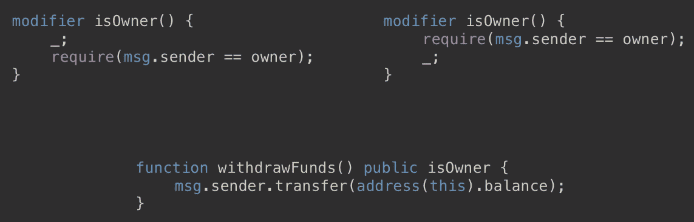
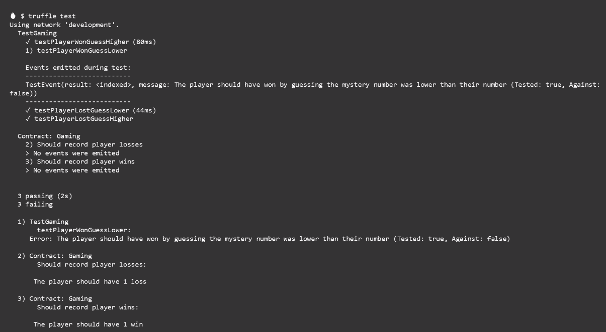
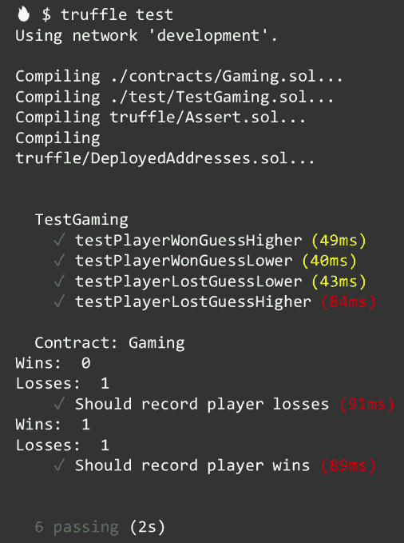

# 第三天 - 在您的智能合约中实现业务逻辑

好了，今天就讲函数。我们将更深入地了解如何创建它们，它们是如何工作的，以及我们如何使用它们来创建使我们的智能合约工作的业务逻辑。

本章将涵盖以下主题：

+   Solidity 函数

+   向函数添加代码

+   函数可见性

+   使用函数执行业务逻辑

+   了解修饰符

# Solidity 函数

函数是合约内的可执行代码单元。要创建一个函数，您需要指定`function`关键字，给函数命名，指定完成其工作所需的任何参数，设置其可见性，添加所需的任何修饰符，声明它是一个视图还是纯函数，如果它可以接收以太币则标记为可付款，并定义任何将产生的返回变量；然后，我们有开放和闭合的花括号，在这些花括号之间是我们将添加函数代码的地方。并非每个函数都具有所有这些选项 - 这只是您进行操作时它们的顺序。例如，您不能将函数标记为纯函数且可付款，因为纯函数不允许修改状态 - 而接收以太币会这样做。在今天的课程中，随着我们使用更多的函数，这将变得更加清晰：

```
function myCoolFunction(unit aNumber) external myModifier view payable returns (bool) {
    //Write cool code here
}
```

我们在函数中使用`return`关键字表示函数将向调用方返回一个值。例如，我们可以声明一个名为`sum`的无符号整数，其值来自`addThis`函数的结果，该函数接受两个参数：

```
unit sum = addThis(4, 2);
```

我们声明它是一个函数，命名为`addThis`，指定它以两个无符号整数`(unit a, unit b)`作为参数，将其标记为`internal`，然后指定它返回一个无符号整数。所以，这个`returns`关键字不会返回任何东西，它只是指定了函数签名，只有在函数体中使用`return`关键字并实际将值返回给调用者时才会出现，本例中的`return a + b`即为变量`sum`。函数签名中的`returns`关键字和返回本身两个部分都是必需的。我们的加法函数可能如下所示：

```
function addThis (unit a, unit b) internal returns (unit) {
         return a + b;
}
```

我们也可以像这样指定返回，即我们说这个函数将返回`c`变量，然后在函数块内部，我们将`c`变量分配给`a + b`的总和并返回它：

```
function addThis (unit a, unit b) internal returns (unit c) {
          c = a + b;
           return c;
}
```

# 向函数添加代码

函数为合约创建应用逻辑；这意味着它们必须执行某些操作，并告诉它们该做什么意味着编写代码。你编写的代码放在函数的花括号之间。花括号内部，代码的执行一次从上到下一行一行地进行。唯一的例外是如果你有条件逻辑，比如这个`if`语句。如果`isWinner`不为真，那么花括号内的这些代码行将被跳过，程序执行将在`if`块之后的第一行代码处恢复。当函数到达最后一行代码或返回语句时，函数退出：

```
function winOrLose(unit display, bool guess, unit wager) external payable returns (bool) {
           /* Use true for a higher guess, false for a lower guess */
           require(online == true);
           require(msg.sender.balance > msg.value, "Insufficient funds");
           unit mysteryNumber_ = mysteryNumber();
           bool isWinner = determineWinner(mysteryNumber_, display, guess);
          if (isWinner == true) {
        /* Player won */ 
         msg.sender.transfer(wager * 2);
         return true;
         } else if (isWinner == false) {
         /* Player lost */
         return false;
         }
}
```

# 变量作用域

这带我们到一个非常有趣的点：叫做**变量作用域**的东西。看一下这个。我们有一个叫做`saySomething`的变量，值为`"hello"`。在这个`doStuff`函数内部，我们有另一个叫做`saySomething`的变量，值为`"goodbye"`。那么，当我们在这个函数内部时，你觉得`saySomething`的值是什么？如果你说是goodbye，你是对的，在函数内部的`saySomething`变量被称为遮蔽了函数外部相同变量名的变量，并且你可以看到这是个坏事。当这个函数退出时，`saySomething`的值现在恢复到了原始值`"hello"`；这是因为在这个函数内声明的变量只存在于函数内部。一旦函数退出，这些变量就消失了。在`doStuff`函数之外，甚至没有一个叫做`saySomethingElse`的东西可以被访问。在构建函数时，记住一个重要的点：函数内部需要哪些变量，以及函数退出后需要哪些数据：

```
string saySomething = "hello";
function doStuff() internal {
         string saySomething = "goodbye";
         string saySomething = "I have nothing else to say";
}

//saySomething is "hello"
//saySomethingElse doesn't exist
```

# 事件

还有一种特殊类型的函数叫做**事件**；它是我们使用以太坊虚拟机日志设施的一种方式。这对我们很重要，因为，如果你记得的话，当我们的玩家在游戏中采取行动时，它并不是实时的；它会发送到以太坊网络，在那里等待矿工确认，然后才会被写入区块链。当发生这种情况时，与该交易相关的任何事件都会被触发。我们可以利用这些来调用JavaScript回调函数并更新玩家的UI。事件是合约的可继承成员，这意味着任何写入合约的事件都可以被从中继承的任何合约使用。最后，事件参数本身存储在交易日志中；这是区块链的一个特殊数据结构，我们可以看到其中哪些事件作为交易的一部分触发了。

让我们来看一个真实的事件，以更好地理解我的意思。在我们的合约内部，我们使用`event`关键字定义一个事件，给它一个名字——注意这里的名字以大写字母开头：`PlayerWon`——然后为我们想要索引的数据点添加参数：

```
event PlayerWon(address player, unit amount);
```

在我们的`winOrLose`函数中，一旦我们确定玩家赢了，我们就可以省略玩家获胜事件，将玩家的地址和他们赢得的金额写入事务日志。在我们应用的JavaScript中，我们可以监听此事件，当我们收到时让玩家知道这个好消息：

```
function winOrLose(unit display, bool guess, unit wager) external payable returns (bool) {
           /* Use true for a higher guess, false for a lower guess */
           require(online == true);
           require(msg.sender.balance > msg.value, "Insufficient funds");
           unit mysteryNumber_ = mysteryNumber();
           bool isWinner = determineWinner(mysteryNumber_, display, guess);
          if (isWinner == true) {
        /* Player won */ 
        emit PlayerWon(msg.sender, msg.value);
        msg.sender.transfer(wager * 2);
         return true;
         } else if (isWinner == false) {
         /* Player lost */
         return false;
         }
}
```

# 构造函数

我想介绍给你的另一个特殊函数是构造函数。当合约被创建时调用它，它只能执行一次。一旦合约被创建，它就永远不能被再次调用。它通常用于设置合约使用的变量的初始状态。你会看到一些例子，每个合约只允许一个构造函数，因此不支持重载。

在这里，我们有我们的游戏合约的一部分，在合约内部，我们声明了两个变量，`owner`和`online`：

```
contract Gaming {
    address owner;
    bool online;
}
```

接下来，我们声明我们的构造函数，这样当这个合约被创建时，我们将把`owner`变量设置为部署此合约的人的地址。同时，我们将把`online`变量设置为`true`，表示我们的游戏正在营业。这两个变量对我们很重要，使用构造函数在合约创建后尽快设置它们的值使我们能够尽快锁定它们的值。你将看到的另一种变体是一个与合约同名的函数。所以，不是这个`constructor`函数，你会看到一个名为`Gaming`的函数。它做同样的事情，但使用`contract`名称作为函数名来创建构造函数已经被弃用，不应再使用。不过，很多代码仍然在使用，所以我想让你知道，这样你在看到它时就能识别出来：

```
constructor() public {
    owner = msg.sender;
    online = true;
}
```

# Fallback函数

最后一个我们要讨论的特殊函数是**fallback函数**。合约可以有一个未命名函数，即我们的fallback函数。它不能有任何参数，也不能返回任何东西，如果合约被调用而合约中没有与调用匹配的函数，则执行它。当合约接收到以太币但没有数据时也会执行它。你可能会觉得这听起来在这一点上没什么用，但让我给你举个例子，说明为什么你可能需要包含一个。

想象一下我们的游戏合约。假设有人向这个合约发送了以太币，但没有附带任何数据。我们的合约不知道该怎么办，所以就撤销了交易，以太币退还给调用者。但如果这是另一个应用程序，而且在该应用程序中，您需要能够通过直接从外部账户进行转账（例如直接从某人的以太坊钱包）接受以太币怎么办呢？唯一的方法就是使用降级函数。创建一个降级函数，并将其标记为`payable`，可以使您的合约接收以太币的直接转账。然而，这样做的缺点是您需要考虑如何处理这些以太币：主要是，您必须有一种方法将其取出。例如，如果有人错误地将以太币发送到您的合约，而他们本来是想把它发送到另一个地址，如果您的降级函数被标记为`payable`，您将收到这笔以太币，如果没有一种允许您提取它的功能，它就会永远被困在那里：

```
contract Gaming {
         function() public payable {
         }
}
```

好的，这就是函数的基础知识。在下一节中，我们将介绍函数的能见度。让我们深入探讨能见度如何影响函数的功能。

# 函数能见度

在定义函数时，`visibility`关键字是一个必需的元素。通过指定能见度，我们可以控制谁可以调用它，谁可以继承它。我们还可以选择性地定义函数是否应读取状态变量，或者根本不查看它们。

# 能见度简要说明

我们昨天定义了能见度修饰符，今天我们将使用这个表格来巩固它们之间的区别：

|  | **外部调用** | **内部调用** | **可继承** | **自动获取器** |
| --- | --- | --- | --- | --- |
| **外部** | 是 | 否 | 是 | 否 |
| **公共** | 是 | 是 | 是 | 是 |
| **内部** | 否 | 是 | 是 | 否 |
| **私有** | 否 | 是 | 否 | 否 |

外部函数可以从外部调用。它们也可以使用`this`关键字在内部调用，但因为这有点绕过的方式，我没有选择内部调用；它们是可继承的，所以您可以在继承的合约中访问所有外部函数，并且任何从您继承的合约都将包含在您的合约中定义的外部函数。公共函数既可以从外部调用，也可以从内部调用。像外部函数一样，它们是可继承的，而且对于定义为公共的变量，您会得到一个免费的获取器函数。内部函数只能从内部调用，并且它们是可继承的。最后，私有函数只能从内部调用，但请记住，这并不意味着数据是私有的，这只是意味着它不能被调用或继承；在区块链上，它仍然是对观察者可见的。

让我们看看一个外部函数。这是我们游戏中的 `winOrLose` 函数：它由我们的 React 应用程序调用，以确定玩家是否赢得了本轮游戏。它被标记为外部，因为我们将从我们的 UI 中调用它，并且它被标记为可支付，因为玩家将在此函数调用中包含他们的赌注。它执行此逻辑以确定玩家赢还是输，然后如果他们赢则返回布尔值 `true`，如果他们输则返回布尔值 `false`。因此，此函数也可以标记为公共并保留相同的功能。此外，我们将能够从合约内部调用该函数，而无需使用 `this` 关键字。因此，要从合约内部调用该函数，我们只需调用 `winOrLose`，但是由于它被标记为外部，如果我们想从合约内部调用它，我们将不得不调用 `this.winOrLose`。由于此函数没有理由从合约内部调用，我将可见性设置为 `external`：

```
function winOrLose(unit display, bool guess, unit wager) public payable returns (bool) {
           /* Use true for a higher guess, false for a lower guess */
           require(online == true);
           require(msg.sender.balance > msg.value, "Insufficient funds");
           unit mysteryNumber_ = mysteryNumber();
           bool isWinner = determineWinner(mysteryNumber_, display, guess);
          if (isWinner == true) {
        /* Player won */ 
        emit PlayerWon(msg.sender, msg.value);
        msg.sender.transfer(wager * 2);
         return true;
         } else if (isWinner == false) {
         /* Player lost */
         return false;
         }
}
```

我们的 `mysteryNumber` 函数是私有的。它由我们的 `winOrLose` 函数调用，用于生成玩家押注的神秘数字。它仅在合约内部被 `winOrLose` 函数调用，因此不需要外部或公共可见性。另外，我不希望继承的合约能够访问这个函数，因此将其标记为 `private`。这里有一个新关键字 `view`。将此函数标记为 `view` 表示该函数不会尝试修改、创建或更新状态：

```
function mysteryNumber() private view returns (unit) {
         unit randomNumber = unit(blockhash(block.number-1))%10 + 1;
         return randomNumber;
}
```

# 视图函数

在以下列表中，我们可以看到被视为修改状态含义的事物，并且如果您的函数是视图函数，则不允许这些事物：

+   写入状态变量

+   发出事件

+   创建其他合约

+   使用自毁

+   通过调用发送以太币

+   调用任何未标记为视图或纯的其他函数

+   使用低级别调用

+   使用包含两个操作码的内联汇编

低级别调用和内联汇编操作码超出了本课程的范围，因此我们不会在此处涵盖它们。

最后，我们有一个内部函数，我们的 `determineWinner` 函数。此函数评估本轮的条件，即神秘数字、显示给玩家的数字以及他们猜测的高低。它的返回值是一个布尔值，当调用 `winOrLose` 函数时返回给它。除了 `winOrLose` 函数以外，没有理由让其他任何函数调用此函数，尤其是外部调用，因此将其定义为外部或公共是不可能的，而且我不介意继承我的合约的人使用此函数，因此我将其标记为 `internal`。它还被标记为 `pure`：

```
function determineWinner(unit number, unit display, bool guess)
    internal pure returns (bool) {
    if (guess == true} {
        if (number > display) {
            return true;
        }
    } else if (guess == false) {
        if (number > display) {
            return false;
        }
    }
}
```

# 纯函数

纯函数非常类似于视图函数，因为它承诺不修改状态，但它更进一步承诺甚至不读取状态。

如果将函数标记为纯函数，则不能执行以下操作：

+   读取状态变量

+   访问账户余额

+   访问任何块、tx 或消息的成员

+   调用任何未标记为纯函数的函数

+   使用包含特定操作码的内联汇编

在下一节中，我们将看到如何将所有内容结合起来创建我们应用程序的业务逻辑。

# 使用函数执行业务逻辑

因此，我们对函数如何工作以及如何创建它们有了一些信心，现在让我们将这些放入实际情境中，看看我们如何使用它们来实现智能合约的业务逻辑。回想一下我们的应用程序，我们将在UI中向玩家显示一个随机数，他们将对他们认为的神秘数字是更高还是更低下注。显示的数字和他们的赌注被发送到我们的智能合约，我们在其中使用Solidity代码执行游戏规则：


让我们再次看看我们的`winOrLose`函数。自从上次看到它以来它有些变化。当玩家准备玩一轮时，他们会下注，应用程序将调用这个函数。当它这样做时，将发送给玩家显示的数字，玩家的猜测，以及他们的赌注作为特殊的`msg.value`变量附加到此交易。由于这是从我们的UI调用的，必须标记为external，而且由于它以以太形式收到他们的赌注，必须标记为payable。

我们定义返回两个对象：一个布尔值和一个无符号整数。布尔值表示他们赢了还是输了，无符号整数将返回他们下注对手的`mysteryNumber_`。这将允许我们在告诉玩家他们赢了或输了时显示`mysteryNumber_`：

```
function winOrLose(unit display, bool guess, unit wager) external payable returns (bool, unit) {
           /* Use true for a higher guess, false for a lower guess */
           require(online == true);
           require(msg.sender.balance > msg.value, "Insufficient funds");
           unit mysteryNumber_ = mysteryNumber();
           bool isWinner = determineWinner(mysteryNumber_, display, guess);
          if (isWinner == true) {
        /* Player won */ 
        emit PlayerWon(msg.sender, msg.value);
        msg.sender.transfer(msg.value * 2);
         return (true, mysteryNumber_);
         } else if (isWinner == false) {
         /* Player lost */
         return (false, mysteryNumber_);
         }
}
```

在我们的函数内部，我们有两个require语句。我会跳过这些，因为我们将在下一节详细介绍它们。

我们有一个无符号整数从名为`mysteryNumber`的函数获得其值；这意味着我们的`mysteryNumber`函数必须返回一个无符号整数 - 在定义函数时我们声明这一点 - 而且由于我们的合约外部不需要访问这个函数，我们将其标记为私有。我们的函数也不对状态进行任何修改。它只是返回一个数字，因此我们也可以将其标记为`view`函数：

```
function mysteryNumber() private view returns (unit) {
         unit randomNumber = unit(blockhash(block.number-1))%10 + 1;
         return randomNumber;
}
```

现在我们已经拥有确定玩家本轮是否赢得或输掉所需的所有数据。因此，我们声明一个名为`isWinner`的布尔值，通过将所有所需信息发送到`determineWinner`函数来获取其值，该函数如下所示：

```
function determineWinner(unit number, unit display, bool guess)
    internal pure returns (bool) {
    if (guess == true} {
        if (number > display) {
            return true;
        }
    } else if (guess == false) {
        if (number > display) {
            return false;
        }
    }
}
```

它有参数接受一个神秘数字，显示的数字和玩家的猜测。再次强调，合约之外没有任何原因调用这个函数，因此它被标记为`internal`，并且因为它不读取或修改状态，我们将其标记为`pure`。接下来，我们遍历所有不同的获胜和失败的组合，一旦我们有足够的信息来确定这一轮是赢还是输，我们使用`return`退出函数，然后`true`表示赢，`false`表示输。当函数返回时，它留下了我们在这里，我们可以评估`isWinner`变量，然后根据赢或输采取适当的行动，这包括发出事件表示该轮的状态，将赢得的任何钱返还给玩家，并返回玩家看到的结果。让我们用视觉来看这个来帮助巩固这些关系。我们的应用程序调用`winOrLose`函数，然后从`mysteryNumber_`函数获得一个新的神秘数字，然后将数据发送到`determineWinner`函数，以查看玩家是否赢了或输了，然后采取适当的行动，最后通知玩家结果。接下来，我们将讨论修饰符。它们是强大的函数，允许您在何时执行函数时放置约束。

# 理解修饰符

好吧，修饰符是函数中的重要组成部分：它们允许我们快速轻松地强制执行规则和限制。修饰符用于以声明方式改变函数行为。这意味着我们获得了一种重复简洁的方式来强制执行规则。修饰符通常用于在执行函数之前检查条件；这在区块链开发中非常重要。我们支付矿工以气体形式执行我们的函数，所以如果函数将违反约束，最好尽快失败。

还有可继承的属性，这意味着在合同中定义的修饰符也可在任何从中派生的合同中使用。修饰符的一个重要组成部分是一个方便的函数称为**require**。因此，在我们深入了解修饰符之前，让我们首先了解`require`函数。

# require函数

`require`是我们在Solidity中可以使用的方便函数来处理错误。它是一个状态回滚异常，这意味着在异常发生之前对状态的任何更改都将自动回滚；这是一个很棒的功能，因为它确保我们的所有交易完成，或者都没有完成，从而防止我们不得不猜测哪些部分完成了的情况发生。我们通常使用`require`来确保满足有效条件，例如输入或合同状态变量。并且，可选地，当`require`语句失败时，我们可以包含一个返回给调用者的字符串消息，以告知调用者发生了什么。对我来说，虽然这个流消息是可选的，但它是一个要求；在这个特性存在之前，我甚至都无法猜测我花了多少小时去排除一个函数失败的原因，只是后来才了解到这是由于我在函数中放置的要求。要定义一个`require`，我们使用`require`关键字，后跟括号中的条件。

如果您还记得我们的合同定义，我们设置了一个名为`online`的变量，然后在构造函数中将其值设置为`true`，因此此语句检查`online`变量是否仍为`true`。如果不是，则程序执行停在此处，这是我们如何有效地使我们的游戏离线的方法：

```
require(online == true);
```

顺序在`require`语句中也起着重要作用。通常，您希望将它们放在函数的顶部，以便如果条件不满足，函数能够尽快失败。在这里，您可以看到两个`require`语句，一个用于验证游戏是否在线，第二个用于确保玩家有足够的资金来支付他们的赌注，就是这样。`require`语句非常简单直接。

我们可以使用`require`语句来构建修饰符。修饰符是使用`modifier`关键字创建的，给它一个名称，然后在括号中加上可选的参数。这与函数非常相似。在修饰符中，我们添加条件。在这里，我们要求消息发送者与存储在`owner`变量中的地址相同。这个修饰符的效果是限制使用它的任何函数只能由合同的所有者执行。修饰符的最后一部分是这个下划线，它的位置非常重要，因为它决定了调用此修饰符的代码何时应该执行：

```
modifier isOwner() {
   require(msg.sender == owner);
   _;
}
```

让我举个例子来进一步解释。这个函数允许调用者提取合同从游戏中赚取的资金。我们使用`isOwner`修饰符确保只有合同的所有者可以调用它：

```
function withdrawFunds() public isOwner {
     msg.sender.transfer(address(this).balance);
}
```

现在让我们看看下划线的作用。下划线有两个有效的位置：



它可以出现在修饰符的开头：

```
modifier isOwner() {
    _;
    require(msg.sender == owner);
}
```

或者它可以出现在修饰符的末尾：

```
modifier isOwner() {
    require(msg.sender == owner);
     _;
}
```

区别在于函数中的代码何时运行。如果你将下划线放在修饰器的开头，当提取资金函数执行时，它会运行其函数中的所有代码，然后调用修饰器。如果下划线在结尾，修饰器首先执行其逻辑，然后函数执行其逻辑。

另一种看待这个问题的方式是下划线代表函数本身。在这个例子中，如果我们先放置下划线，函数首先执行并从合同中提取所有资金，然后修饰器检查是否是所有者这样做了。将下划线放在最后，修饰器首先检查调用是否来自所有者，然后在修饰器通过时执行函数。这对于函数的期望结果有很大的区别，所以在使用修饰器时要特别注意。

在下一节中，我们将看一些使用修饰器的实际例子，以更好地理解它们的能力。

在本节中，我们将看一些修饰器的不同用例。我非常喜欢修饰器，因为它们允许对执行函数进行很多控制，但它们仍然非常易读。让我们看看我们的第一个例子，一个名为`onlyBy`的修饰器。它将只允许调用它的函数在被所需地址调用时执行：

```
modifier onlyBy(address _account) {
           if (msg.sender != _account) {
                   revert();
           }
           _;
}
```

我们可以在`changeOwner`函数中看到它的运作方式。当调用`changeOwner`时，`onlyBy`修饰器用于确保只有当前所有者才能为合同指定一个`newOwner`变量：

```
function changeOwner(address _newOwner) onlyBy(owner) {
    owner = _newOwner;
}
```

这里有另一个例子，使用时间限制。如果当前时间小于作为参数传递的时间，修饰器将抛出异常结束程序执行。将其用于实践，我们可以看到`disown`函数使用`onlyAfter`修饰器确保只能在创建时间之后的6周内调用它。这是使用多个修饰器确保满足多个条件的绝佳示例。要指定多个修饰器，你只需在函数声明中依次列出它们。你可以像这样每行一个，或者在同一行用空格分隔每个修饰器：

```
modifier onlyAfter(unit _time) {
    if (now < _time) revert();
    _;
}

function disown()
     onlyBy(owner)
     onlyAfter(creationTime + 6 weeks)
{
     delete owner;
}
```

让我们看一个更多的例子。这个修饰器要求在函数调用时支付一定的费用，所以现在我们可以收取更换所有者的费用。只要这个交易中包含所需的200以太币，交易就会执行。但这里有一个警告：如果调用者在函数正常退出时发送的以太币超过200，多余的以太币将返回给调用者。不过，如果我们明确使用`return`，多余的以太币就不会被返回：

```
modifier costs(unit _amount) {
    if (msg.value < _amount) {
        revert;
        _;
    }
    if (msg.value > _amount) {
        msg.sender.send(amount - msg.value);
    }
}

function forceOwnerChange(address _newOwner) costs(200 ether) {
    owner = _newOwner;
    if(unit(owner) & 0 == 1) {
       return;
    }
}
```

好了，我们已经讨论了函数，虽然我们还可以讨论更多，但这代表了你开始构建智能合约所需的基础知识。在下一节中，我将和你一起讨论今天的家庭作业。

# 作业

今天的作业与昨天的格式类似。在其中，你将写一些代码来使一些测试通过，在书的存储库中。这样做将允许你把今天获得的关于函数的知识应用到实践中。你首先要做的事情是：

1.  为今天的作业搭建好你的环境。

1.  打开终端并切换到包含你的应用程序代码的目录。

1.  输入`git stash`命令。这将把你对应用程序代码所做的任何更改都存储起来，以防你所做的工作干扰我为你设置的情景。

1.  将你的工作存储起来后，输入`git checkout -b dayThree`来获取今天作业的代码，你还需要确保Ganache在运行，所以在开始作业前确保你已经启动它。

1.  运行`truffle test`，你应该会看到类似于以下截图的内容：



要让所有这些测试通过，你需要做以下任务 - 在`determineWinner()`函数中，我们缺少一些逻辑。如果玩家猜测神秘数字将低于他们屏幕上显示的数字，他们就应该赢，但这个函数目前不会执行此操作，所以我需要你编写代码来实现这一点。

1.  接下来，我们将创建两个新事件：一个是`playerWon`，另一个是`playerLost`。事件应该接受玩家的地址、他们押注的金额、他们所押注的神秘数字以及向玩家显示的数字的参数。

1.  现在你有了你的事件，每当玩家赢了或输了，我们就会省略出正确的事件。

最后，还有一个名为`players`的映射，将玩家的地址映射到一个`Player`结构中，其中我们可以存储关于他们的胜利和失败的信息。

1.  我们将从该映射中获取正确玩家的`Player`结构，并且如果他们赢了，则增加赢的计数器，如果他们输了，则增加输的计数器。

当你完成所有工作后，你应该会拥有这六个通过的测试，这些测试为[第四章](dce47cf0-e672-43db-b320-08af2133d937.xhtml) *第四天*—*创建测试*做好了铺垫。



这里有个很酷的地方，就是在过去的几天里，为了确保你的代码正常运行，你一直在依赖测试，所以你可能会对它们的重要性以及它们如何能够帮助你编写更少bug的更好的代码有所认识。

# 摘要

在本章中，我们学习了有关函数的所有知识。我们还看了函数是如何创建的，它们是如何工作的，以及它们如何用于使智能合约生效。我们首先学习了Solidity中的函数，然后我们看到如何向这些函数中添加代码。然后，我们学习了如何修改函数的可见性。然后，我们看到了如何使用这些函数来执行业务逻辑。最后，我们学习了如何在函数中使用修饰符。

在下一章中，我们将学习如何创建测试，以帮助调试代码，使游戏功能无故障！
