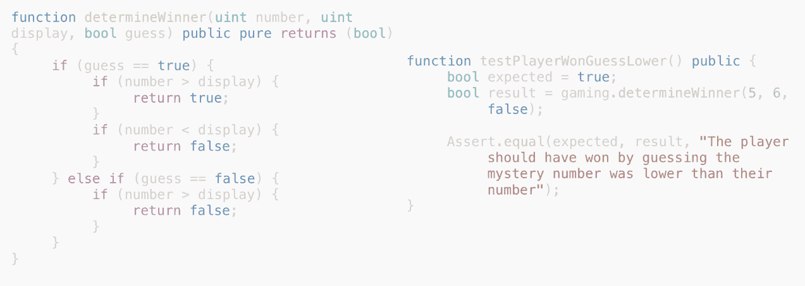
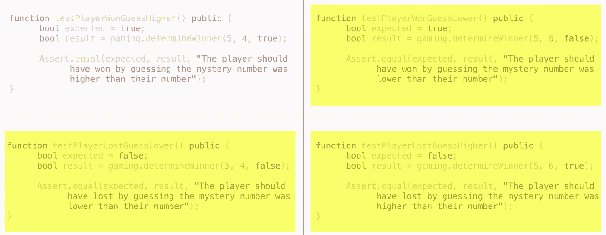
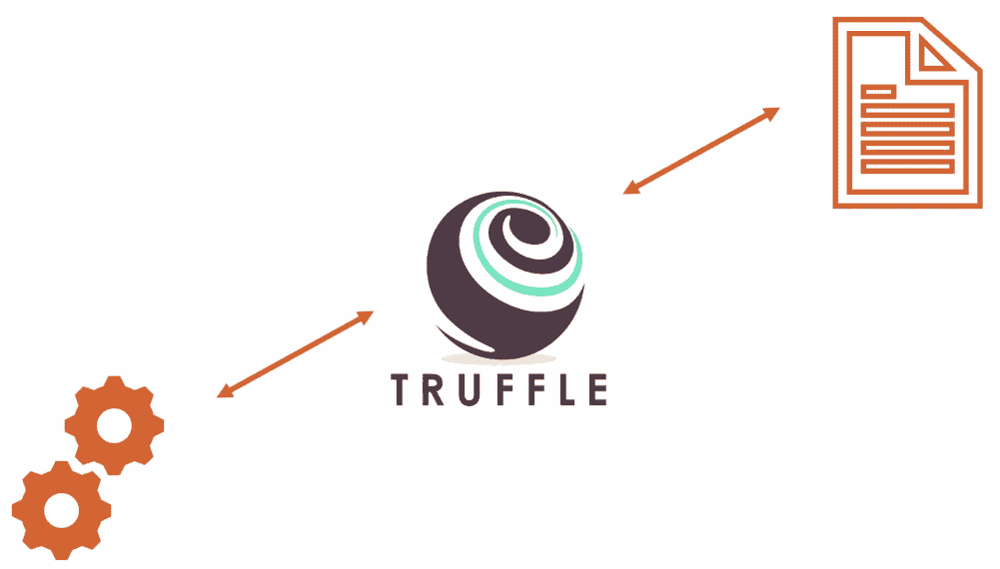
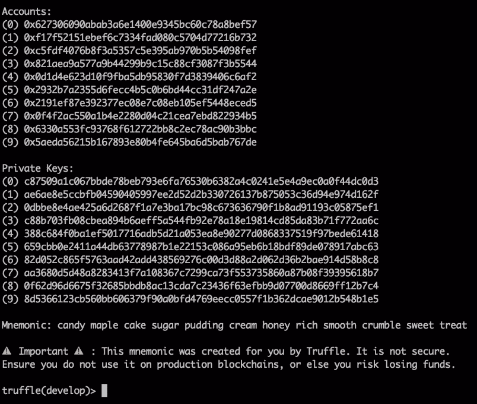
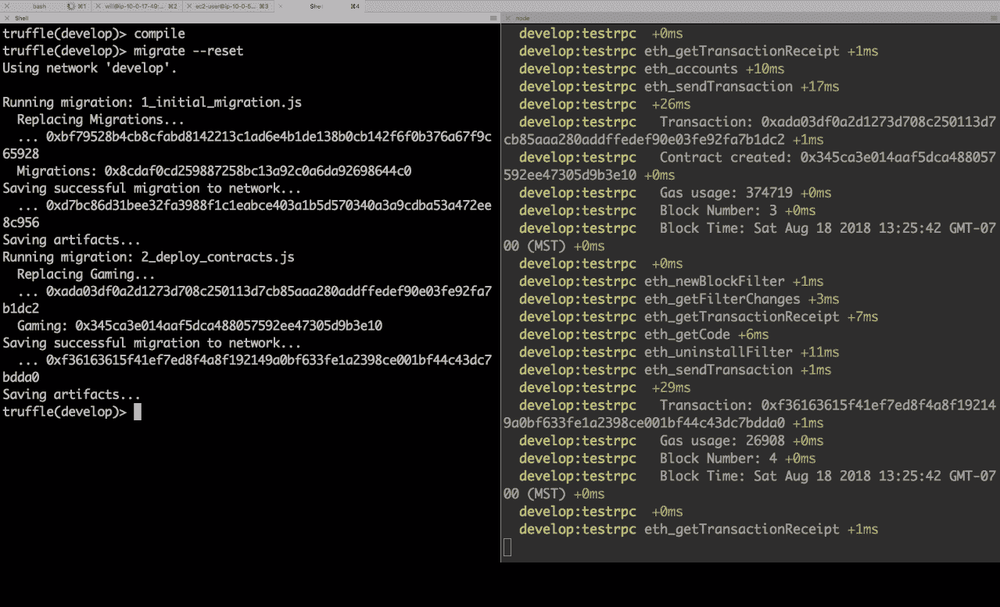
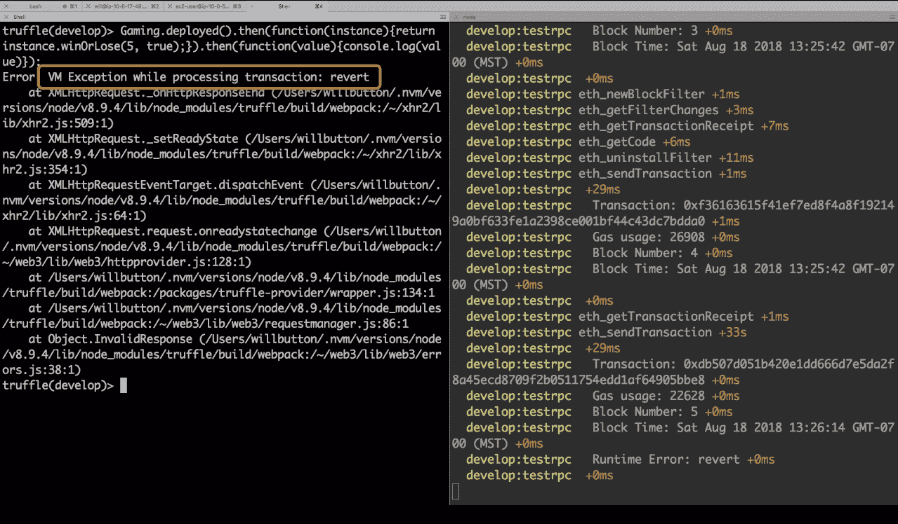
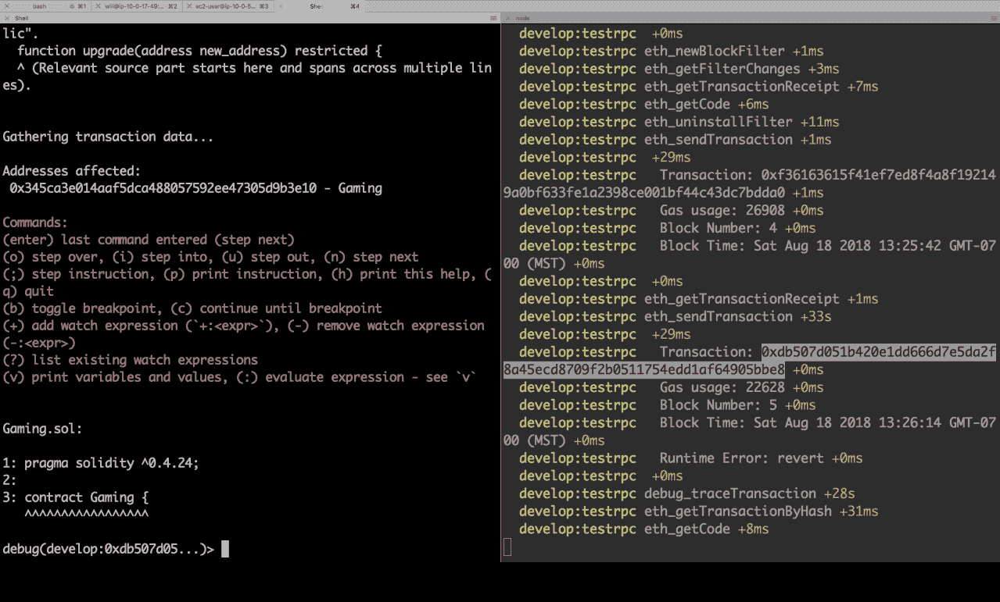
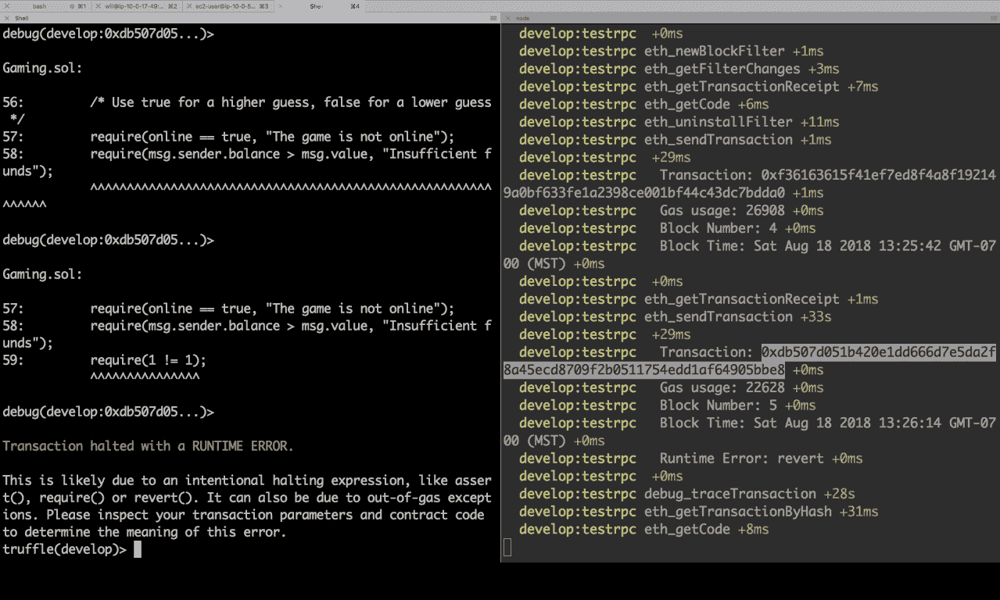

# 第四天 - 创建测试

你一直依赖测试来确保你的代码正常运行，所以你可能很欣赏它们的重要性，以及它们如何帮助你写出更好、更少错误的代码。在本章中，我们将看看如何创建适当的测试，以帮助我们的游戏顺利运行，没有任何问题。本章将涵盖以下主题：

+   理解单元测试和集成测试

+   不同应用程序的测试策略

+   在 Solidity 中创建单元测试

+   同一个要测试的函数有多个测试

+   在 JavaScript 中创建集成测试

+   运行测试套件

# 理解单元测试和集成测试

今天，我们将讨论有关测试的所有内容。在过去的几天里，你实际上体验到了测试的一些好处。我编写了一个测试，检查了我们智能合约中的特定行为，它失败了，然后你编写了一段代码，当测试通过时，你知道它提供了预期的结果。

# 为什么要写测试？

现在，想象一下规模更大的情况。你正在作为一个庞大的区块链开发团队的一部分编写代码，向世界交付最新的去中心化应用程序。作为团队的一部分，你如何知道你团队中其他开发人员编写的代码是否按照预期执行？当出现错误时，你如何确保你的代码不是导致错误的代码？或者这样想：如果有人更新了你的代码，你如何确保它仍然执行其预期的功能？请记住，当我们处理区块链应用程序时，我们正在处理人们的金钱，所以所有这些都是重要的问题，而所有这些问题的答案都是一样的：测试。

# 单元测试

今天我们将讨论两种不同类型的测试，所以我想先向你介绍它们，以便你了解每种测试的作用。单元测试是由开发人员编写的，用于测试相对较小的代码片段，以确保其按预期执行。想象一个将两个数字相加的函数：

```
function sum(unit a, unit b) returns
(unit) {
return a + b;
}
```

一个测试可能看起来像这样：

```
function testAddCorrect() public {
     unit expected = 4;
     unit result = myContact.sum(1, 4);
     Assert.equal(expected, result);
}
```

它给函数两个数字，然后测试正确的结果。

以下是单元测试的一些常见特征：

+   范围较窄

+   易于阅读和编写

+   无依赖关系

这意味着测试本身完全自包含，不需要数据库、网络连接、手动干预或除了测试和被测试代码之外的任何其他东西。在 Solidity 中，我们实际上没有真正的单元测试，因为即使是基本的测试也需要 Ganache 或本地区块链网络才能正常运行。尽管如此，我们仍然以这种方式编写测试来确保我们的代码的正确运行。让我们来看看我已经编写的一个单元测试，以便更好地了解一个真正运行的测试是什么样子的：



在上述屏幕截图中，左侧是我们过去几天一直在使用的`determineWinner`函数。右侧是其测试。我们使用`function`关键字，为测试赋予以小写`test`单词开头的名称，然后在内部声明一个名为`expected`的变量，这是当函数正常工作时我们期望的结果，然后我们有另一个名为`result`的变量，这是函数的实际结果。然后最后一部分是我们使用一个断言或创建一个`assert`语句，比较预期结果或预期答案和实际结果，以确保它们相等，如果不相等，则显示消息，以便运行测试的人知道出了什么问题。

# 集成测试

另一方面，集成测试用于证明系统的不同部分如何协同工作。为了更好地说明集成测试，让我向您展示我为作业编写的测试代码：

```
it('Should record player losses', async() => {
    const gameRound = await gaming.winOrLose(10, true, {
        from: player1,
        value: web3.utils.toWei('1', 'ether')
    })
    const playerStats = await gaming.players(player1)
    assert.equal(playerStats[1].toNumber(), 1, 'The player should have 1 toss')
})
```

此测试以 JavaScript 编写。我们首先调用`winOrLose`函数，模拟从我们的 React 应用程序中使用所需参数进行调用。我们使用`await`关键字等待该调用写入区块链。此测试正在检查是否正确记录了玩家的统计信息。当他的代码完成时，玩家应该有一次记录的失败。因此，现在我们调用区块链并执行函数以获取玩家的统计信息，并验证记录的损失值是否等于一。

因此，在这个测试中，我们进行了两次区块链访问，并且我们依赖区块链网络正确运行以使测试通过。这是一个集成测试。以下是集成测试的一些常见特征。

它们表明了系统的不同部分是如何一起工作的。通常，它们涵盖整个应用程序，您可能还会听到它们被称为端到端测试。它们需要比单元测试更多的工作量来组合，而且它们还需要外部资源，例如数据库、硬件或在我们的情况下是区块链网络，并且它们更接近我们的用户预期执行的操作。

在下一节中，您将学习使用 Solidity 和 JavaScript 创建单元测试和集成测试的基础知识。有了这些技能，您将能够创建测试来确保您的合约确实执行了它应该执行的操作。

# 各种应用程序的测试策略

您知道应该编写测试，但当您面对空白屏幕时，有时很难知道从哪里开始。因此，在本章中，我们将探讨一些策略，帮助制定测试内容以及测试方法。我们将讨论四个不同的事项：

+   测试成功情况

+   测试失败情况

+   使用 Solidity 进行测试

+   使用 JavaScript 进行测试

在进行测试时，有很多不同的方法，但我们不要陷入信息的海洋中，让我们保持简单。任何测试总比没有测试好，所以让我们专注于为我们的合约编写一些测试，稍后我们可以随时在学到更多知识的情况下改进方法和测试。

# 测试成功

最容易入手的地方是**测试成功**，我指的是编写测试来确保你的组件在提供正确输入时执行其预期功能。考虑以下代码片段：

```
function sum(uint a, uint b) returns
(uint) {
return a + b;
}
```

这里，我们有一个函数，它将两个数字相加。你如何检查操作是否完全按预期工作？让我们编写一个测试来确保如果它被提供两个数字，它会产生正确的答案。为此，我们将创建一个名为`testAddCorrect()`的函数，考虑一个预期值和合约的结果值，并交叉检查它们以确保函数产生正确的答案。以下代码片段进一步说明了这个测试的工作原理：

```
function testAddCorrect() public {
    uint expected = 4;
    uint result = myContract.sum(1, 4);
    Assert.equal(expected, result);
}
```

编写这些测试应该成为你开发工作流程的自然一部分。事实上，有一种称为**测试驱动**开发的策略，你首先编写测试，看到它失败，然后编写代码使该测试通过。一旦它通过了，你再编写另一个失败的测试，然后跟着编写使其通过的代码。通过编写每一个失败的测试，你确保代码做了它应该做的事情，然后通过使每一个测试通过，你专注于编写使你的应用程序工作所需的最少代码量。这是我最经常使用的策略，效果很好，但测试失败也是有意义的。

# 测试失败

如果你的函数在提供无效输入时不执行正确操作呢？考虑以下 JavaScript 代码片段：

```
function sum(a, b) {
    return a + b;
}
```

这里，如果你给函数提供两个数字，它会把它们相加，但是，如果我们给它两个字符串呢？

我们可能要求它向调用者返回一个错误，说明只有数字是有效输入，但实际上，它会返回两个输入字符串连接在一起的结果。这就是我所说的测试失败。你需要一些额外的测试来覆盖当你的组件被提供无效输入时会发生什么。

大多数时候，错误和安全漏洞都来自于以一种未曾预期的方式使用组件。

# 使用 Solidity 进行测试

我们的第三个主题是使用 Solidity 进行测试。如果这本书是你对编程世界的第一次介绍，这可能是你最舒适的地方。

在 Solidity 中编写测试几乎与编写合约相同，因为它是相同的编程语言，事实上，您的测试只是由 Truffle 使用的另一个 Solidity 合约，用于执行您的测试。使用 Solidity 编写的测试类似于单元测试。每个测试套件或测试合约都在干净的环境中运行。这意味着，在运行每个测试套件之前，合约将重新部署到测试网络，这样您就知道您是从已知状态开始的。

由于每次运行测试时都会进行部署，因此对本地网络进行测试是有意义的，这是我们使用 Ganache 的主要原因之一。如果我们必须部署到实时网络，然后等待矿工挖掘每个交易，那么获得我们的测试结果将需要大量时间，如果我们对自己诚实，我们不会像应该那样经常运行测试。

Solidity 测试使用 Chai Assertion 库，用于编写逻辑以通过或失败我们的测试。您将在即将到来的部分*在 Solidity 中创建单元测试*中看到如何做到这一点。但从测试的角度来看，Solidity 的功能相当有限，它非常适用于测试单个函数，并确保函数返回正确的响应，并测试异常，但对于测试合约的整体行为来说效果不佳。为此，我们将使用 JavaScript 测试。

# 使用 JavaScript 进行测试

JavaScript 测试为我们提供了一种完全测试合约行为的方法，正如客户端将看到的那样。我们可以访问测试帐户，这要归功于注入到测试运行器中的`web3`提供程序，您将在第六章中了解到`web3`是什么，*第六天：使用钱包*。

Truffle 使用 Mocha 测试框架和 Chai 断言来进行 JavaScript 测试。如果您之前已经写过 JavaScript，您可能对 Mocha 比较熟悉；这里唯一的区别是 Truffle 使用`contract`函数而不是 Mocha 的`described`函数。这使得前面提到的干净环境特性成为可能，以确保我们每个测试套件都从一个新的合约开始。

使用 Chai Assertion 库是一个不错的选择，因为它是我们 Solidity 测试中使用的相同断言库，这使得我们作为区块链开发者的生活稍微容易一些。现在，让我们深入探讨将合约部署到测试网络中。

# 在 Solidity 中创建单元测试

我们的第一个测试将使用 Solidity 编写。从 Solidity 开始可能会通过使用您已经了解的语言提供对这个陌生概念的熟悉度。

# Solidity 测试约定

Solidity 中有一些关于 Solidity 测试的约定：比如文件必须具有`.sol`扩展名，合约名称必须以大写字母`T`开头的单词`Test`开头，函数必须以小写字母`t`开头，而`test`应该放在应用程序代码的`test`文件夹中。

要编写测试，我们必须首先进行一些清理工作。我们定义我们的合同然后导入`truffle/Assert.sol`库：我们将导入`truffle/DeployedAddresses.sol`库。如果你习惯编写 node 应用程序，这两者可能有点奇怪，因为通常这意味着库被导入并且是在`node modules`文件夹中找到的文件，但是你不会在那里找到它，因为它是由 Truffle 直接导入的。我们还需要导入我们将要测试的合同。对于我们的应用程序，这是我们的游戏合同。这真的是您想要停止导入东西的地方，因为我们希望保持我们的测试简约：

```
pragma solidity 0.5.0;
    import "truffle/Assert.sol";
    import "truffle/DeployedAddresses.sol";
    import "../contracts/Gaming.sol";
```

在此之后导入其他库只会引入复杂性和错误的潜在可能性，因此就像我们之前编写的合同一样，我们将定义一个新的合同。因为这是一个测试合同，我们将以 test 开头的名字开始。

现在我们可以做的一个很酷的事情是创建一个名为`initialBalance`的变量并为其分配一些以太。当我们的合同部署时，它将被资助指定金额，使其可供在我们的合同中使用。这很酷，对吧？然后我们创建一个名为`gaming`的变量，这是我们的大写字母 G 的`Gaming`合同的实例。看一下下面的代码：

```
contract TestGaming {
    uint public initialBalance = 10 ether;
    Gaming gaming;
}
```

我们可以定义一个名为`beforeAll()`的函数，注意它并不以单词`test`开头，尽管我刚才说函数必须以它开头。这是因为这是一个特殊的函数：它将在我们的测试套件中的任何测试之前运行。在其中，我们将获取部署的合同实例，并在我们的其余测试中使用它：

```
function beforeAll() public {
    gaming = Gaming(DeployedAddresses.Gaming());
 }
```

我们可以使用的其他特殊函数包括`beforeEach`，`afterAll`和`afterEach`。那么，现在，让我们开始编写一些测试。我们的第一个测试将测试我们的`determineWinner`函数。它被`winOrLose`函数调用，但我们将单独测试它以确保它正好完成其预期的工作，这样我们就知道`winOrLose`函数可以依赖它返回正确的响应。我们首先定义我们的函数，并以以`test`开头的单词给出名称，然后在我们的函数内部，我们将声明一个名为`expected`的变量。这是我们期望作为我们测试的结果找到的结果。结果通过调用`determineWinner`函数进行填充，并传递一些参数给它以执行所需功能：

```
function testPlayerWonGuessHigher() public {
    bool expected = true;
    bool result = gaming.determineWinner(5, 4, true);
}
```

现在，我们要介绍的是我们的 Chai 断言库。我们调用`assert`库，然后调用`equal`函数，传递我们的`expected`值，结果和当测试失败时要显示的消息。现在，这个消息非常重要：它将是您或任何其他开发人员在此测试失败时得到的唯一线索。确保它清晰而具体。这也是进行代码审查的好地方，因为让其他人对这些消息进行评审可以帮助使它们清晰易懂：

```
Assert.equal(expected, result, "The player should have won");
```

# 相同测试函数的多个测试

再看几个例子，除了我们刚写的测试之外，我们还有另外三个例子。在每个测试中，存在不同变量参数的不同变体，我们可以将它们提供给`determineWinner`函数，这使我们能够检查我们的`determineWinner`函数可能遇到的每种情况。这就是为什么 Solidity 的测试器受欢迎的原因：它们很容易编写，很容易阅读，并且它们使用与我们的合同完全相同的编程语言。不幸的是，如果您尝试做的事情超出了这些，乐趣和兴奋很快就会消失：



要进入测试的下一个级别，我们将使用 JavaScript。它具有许多 Solidity 不可用的功能。访问这些功能将赋予我们使用 JavaScript 进行端到端测试的能力和灵活性，这很方便，因为我们也将使用 JavaScript 编写我们的 UI。

# 在 JavaScript 中创建集成测试

在 JavaScript 中编写测试时，我们不仅可以模拟合同调用，就像我们在 Truffle 测试中所做的那样，还可以选择不同的帐户，检查余额等等。让我们深入了解一些测试，你会对我所说的有更好的理解。我们将从创建一个新的测试文件开始。对于我们的 Truffle 测试，文件名以大写的 T 字母开头，并以`.sol`扩展名结尾。

我们的 JavaScript 测试以被测试的合同名称开头，后跟一个以大写 T 开头的单词`test`，并以`.js`扩展名结尾。它仍然放在与我们的 Solidity 测试相同的`test`文件夹中，这意味着无论这些测试使用哪种语言编写，都只需查看一个地方。

在我们的文件中，我们将创建一个与要测试的合同同名的常量，并使用需要该合同内容的 artifacts。从这里开始，我们的测试看起来很像 Mocha 测试，如果您熟悉的话；不过，我们将使用 Truffle 关键字`contract`而不是使用笔：

```
const Gaming = artifacts.require('./Gaming.sol')
```

这启用了 Truffle 的清洁房间功能，这意味着每次将此文件作为测试运行时，Truffle 框架都会将合同的新实例部署到网络上，确保我们从已知状态开始：

```
contract('Gaming', async (accounts) => {
```

现在我要声明一些变量。`gaming` 变量将代表部署到网络上的我们合约的版本，然后我将创建两个常量，`owner` 和 `player 1`。这两个常量都从一个叫做 `accounts` 的数组中获取。`accounts` 变量是通过 Truffle 框架免费提供的，数组中的项目代表了应用程序启动时 Ganache 为我们创建的 `accounts`，所以这个叫做 `owner` 的变量被设置为帐户数组中的第一项，也就是你在 Ganache 中查看时看到的第一个帐户，而 `player 1` 变量则是第二个列出的帐户。这相当强大，因为访问这些帐户允许我们以这些帐户的身份采取行动，然后与 Ganache 回顾以确保事情按照我们的期望发生。它允许我们测试一些只适用于特定帐户而不适用于其他帐户的功能，比如我们的 `is owner` 函数：

```
 let gaming
 const owner = accounts[0]
 const player1 = accounts[1]
```

现在我们将有一个 `before` 函数，和 Truffle 中的对应函数一样，这个函数将在这个文件中编写的任何测试之前运行。如果你有其他测试文件，它们将被视为单独的运行，这里的 `before` 函数不会应用：

```
before(async () => {
 gaming = await Gaming.deployed()
})
```

然后我们将使用 `async` 和 `await` 来从以太坊网络中获取我们合约的部署版本。所以，让我给你解释一下 `async` 和 `await`，以防你之前没有见过。假设我们有一行 JavaScript 代码：它将使用我们导入的代表合约的 artifact 来获取部署在以太坊网络上的实际合约实例，但 JavaScript 的工作方式是一旦我们调用了这个函数，它就认为已经完成并且从这里继续了：它是异步的。所以，即使我们调用了部署函数并且它还没有返回值，JavaScript 也会继续向前移动。直到这个调用完成，`gaming` 变量实际上是未定义的，这会在你尝试弄清楚为什么这个变量有时有值，有时没有值时带来很多头疼：

```
gaming = Gaming.deployed()
const fundGame = gaming.fundGame()
```

为了避免这种痛苦，我们使用 `async` 和 `await`。它的工作方式是我们在这里使用 `async` 关键字声明这个匿名函数，然后在函数内部，每当我们需要等待的函数或调用时，我们使用 `await` 关键字。现在，在幕后有比这更复杂的事情，但这是你需要了解的最基本的知识。除了 `async` 和 `await`，你可能会看到的其他模式包括回调和 promises。

现在我们又声明了一个变量，一个名为`fundGame`的常量。这个函数让我可以向合约发送一些初始的以太币，这样当我们开始测试我们的合约时，合约就有一些资金来支付任何赢家的奖金。如果没有这些以太币，任何导致获胜场景的测试都会失败，因为合约没有足够的资金来支付奖金。看看这个：它也使用了`await`关键字，因为一旦我们调用这个函数，执行并不意味着完成。我们需要等待该块被挖掘，然后操作才被视为成功：

```
const fundGame = await gaming.fundGame({from: owner, value: web3.utils.toWei('10', 'ether')})
 })
```

现在，我们终于准备好编写一些 JavaScript 测试了。我们的测试以单词`it`开头，然后是一句描述应该发生什么的句子。这里通常惯例是实际使用单词`should`，这样它就像一句句子一样阅读；在这种情况下，它应该记录玩家的损失，所以让我们看看我们如何做到这一点。我们声明了一个名为`gameRound`的常量，然后我们再次使用`await`调用我们游戏合约中的`winOrLose`函数。请记住，这是我们的 UI 将要调用的同一个函数，因为我们的玩家在玩游戏，所以我们实际上在这里模拟真实的用户行为。我们的`winOrLose`函数接受两个参数：显示给玩家的屏幕上的数字以及他们对于神秘数字是更高还是更低的猜测。我希望这个测试确保当玩家输掉时记录的损失数量增加；这意味着我需要确保当`winOrLose`函数返回时，这是一个输掉的回合。我可以通过向用户显示数字为 10，并指示他们猜测神秘数字将更高来实现这一点。

嗯，因为我们的神秘数字是一个从`0`到`9`的个位数，所以它不可能比十更高，确保我们的测试玩家总是会输。这个函数调用的下一个重要部分是一个可选的第三个参数。前两个参数在我们的函数调用中定义。这第三个参数来自 Solidity，并且采用 JavaScript 对象的形式。在其中，我们指定我们的`from`账户，表示我希望这个交易来自哪个账户，这就是我们的玩家 1。我还可以附加一个代表玩家赌注的值。现在所有发送到以太坊网络的资金都以 Wei 为单位，如果你还记得第一天，这意味着十的十八次方 Wei 等于一个以太币。但是与其自己计算这些数学，Truffle 在测试时为我们提供了一个 Web3 实例来使用。

Web3 是一个用于与以太坊网络上的智能合约交互的 JavaScript 实用程序库，所以我们可以使用`web3.utils.toWei`函数将一个以太币转换为 Wei，并保持可读的代码。这启动了游戏的一轮与我们的玩家。由于这个`await`关键字，我们的代码的执行将在这里等待该轮完成，一旦完成，我们就可以创建一个新的常量叫做`player stats`。这是您昨天创建的用于增加胜利和失败次数的结构：

```
it('Should record player losses', async() => {
    const initialBalance = await gaming.winOrLose(10, true, {
        from: player1,
        value: web3.utils.toWei('1', 'ether')
 })
```

`Players`是一个将地址映射到`player`结构的映射，这意味着它以以太坊地址作为参数获取正确玩家的筹码。我们可以在这里使用`player1`变量名，Truffle 会自动将其转换为所需的地址参数。现在，我们可以最终使用`assert`来验证我们预期的数字是否等于 1。我们还可以在这里包括一条消息，如果测试失败，它将被显示。在这里，你可能会对这个感到好奇。我们的 players 映射返回一个包含玩家胜利和失败的结构，但 JavaScript 对结构一无所知，并且它从结构转换为数组，根据在结构声明中列出的变量的顺序进行处理。因此，我们知道当这个数组返回时，数组的第一项将是胜利，第二项将是失败：

```
const postBalance = await gaming.players(player1)
assert.equal(playerStats[1].toNumber(), 1, 'The player should have 1 loss')
 })
```

在 Solidity 和 JavaScript 中，数字也有一些类型差异。当我们从 Solidity 中获取一个数字时，无论它是有符号还是无符号整数，它都是一个大数。这实际上是 JavaScript 类型，不是我说它是一个大数，所以我们需要将其转换为 JavaScript 数字，这样我们就可以在我们的应用程序中使用它，我们使用`toNumber`函数进行转换。

所以，让我们再做一件事。既然我们在这里，让我们验证一下，当这个玩家输掉时，我们拿走了他们的钱。这是经营赌博业务的重要部分，我希望有一些测试来确保它工作正确。在我们玩这一轮之前，让我们获取玩家的账户余额；我们将使用`web3.eth.getBalance`函数，并提供我们玩家的地址：

```
const initialBalance = await web3.eth.getBalance(player1).toNumber()
```

现在，在我们玩这一轮之后，我们知道玩家已经输了，我们可以使用以下代码再次获取余额：

```
const postBalance = await web3.eth.getBalance(player1).toNumber()
```

现在，我们可以使用`isAtLeast`函数进行断言。我使用`isAtLeast`是因为除了玩家刚刚输掉的 10 个以太币外，他们还必须支付一些 gas 作为交易费用。因此，初始余额应该大于最终余额加上下注金额。他们的余额应该减少了些许，因为他们下注了 10 个以太币加上了 gas。这不是一个确切的数字，但足够接近，以确认玩家确实失去了我们期望他们失去的金额：

```
assert.isAtLeast(initialBalance, postBalance + 10, 'some message here')
```

我们可以在我们一直在使用的同一个函数中执行这个操作。在同一个函数中有多个断言是完全可以接受的，只要它们在测试你代码中的同一组件或函数。现在我们可以测试我们的函数，评估和断言结果，并在我们的测试网络中检查不同账户的余额。在下一节中，让我们看看如何让它们都协同工作。

# 运行测试套件

今天到目前为止，我们花了很多时间编写测试，但没有时间运行测试。当我编写代码时，我通常采取的方法是编写一个单独的测试，运行测试套件以确保它失败，然后编写必要的代码使其通过；这意味着我经常运行测试，而且很重要的是它们能够快速完成。你已经在运行测试了：你每天都使用它们来验证你的作业。当你运行 Truffle 测试时，它会运行测试，现在你知道这些测试是从哪里来的。

你也意识到，为了使这些测试通过，你必须让 Ganache 运行，所以必须存在 Truffle 测试和 Ganache 之间的某种通信：



好吧，让我们来看看幕后的情况。Truffle 能够与 Ganache 通信的原因在于这个文件——`truffle.js`——特别是`Network`部分。当你运行 Truffle 测试时，除非另有说明，它会假定我们的开发配置为开发网络：我们指定了 localhost 的地址和端口为 7545，这是 Ganache 运行的端口。

最后，我们告诉它使用 Ganache 提供的任何网络 ID，这将不同于你将在第七章中了解到的其他配置，*第七天* - *部署到网络*。如果你更改了 Ganache 中的任何设置，或者决定使用其他本地以太坊客户端，你需要在这里更新这些设置，以确保 Truffle 知道如何与其通信。至于运行测试套件，就是这样了。键入以下 Truffle 测试：

```
module.exports = {
    migrations_directory: "./migrations",
    solc: {
    optimizer: {
        enabled: true,
        runs: 2000
        }
 },
 networks: {
     development: {
         host: "127.0.0.1",
         port: 7545,
         network_id: "*" // Match any network id
     },
     ropsten: {
         host: "127.0.0.1",
         port: 8545,
         network_id: 3,
         from: "0xe7d6c3f43d7859d7d6d045f9ac460eedffd3eae6"
     }
  }
};
```

但既然我们在这里，让我问你一下：如果测试失败了，你会怎么做？在你考虑如何处理时，让我向你展示使用 Truffle 时我最喜欢的功能之一，即调试器。

让我们快速看一下我们的`winOrLose`函数。我要在这里添加一个新的`require`语句，`require(1 != 1)`，对于正常的情况来说，是一个愚蠢的事情，但这将确保我们的函数调用失败，让我可以向你展示如何调试它：

```
function winOrLose(unit display, bool guess) extrenal payable returns (bool, unit) {
     /* Use true for a higher guess, false for a lower guess*/
     require(online == true, "The game is not online");
     require(msg.sender.balance > msg.value, "Insufficient funds");
     require(1 != 1);
     unit mysteryNumber_ = mysteryNumber_, display, guess);
     if (isWinner == true) {
          /* Player won */
          msg.sender.transfer(msg.value * 2);
          return (true, mysteryNumber_);
     } else if (isWinner == false) {
          /* Player lost */
          return (false, mysteryNumber_);
     }
}
```

我将切换到一个终端会话并启动一个`truffle develop`控制台。当你这样做时，Truffle 将启动，并且会带着它自己的以太坊网络，你可以在这里看到它每次启动时的情况。我们会得到一些账户私钥和助记词，如果我们想要将钱包连接到它，我们可以使用这些信息：



我也将打开第二个控制台窗口，并在其中运行`truffle develop --log`命令。在我们的开发控制台内，我们将`compile`我们的合约，然后我们将键入`migrate --reset`，将其迁移到此本地以太坊网络：



现在，我将执行这个命令，调用我们合约上的一个函数；但是当所有内容都在一行时，这看起来很混乱，所以让我们一块一块地拆开来，这样我们就能理解这里发生了什么。所以，这是同样的事情 - 它只是在控制台上写成一行，但在这里，我们将把它拆分成多行来演示每个部分是什么。我们有我们的游戏合约，这是我们的以太坊合约，我们正在调用`deployed`方法，就像我们在测试中做的那样。然后我们有一个 promise，所以当承诺实现时，我们调用 doc，或者我们有一个函数，接收合约作为实例的变量名，并在该函数内部返回`instance.winOrLose`函数，该函数执行我们智能合约中的 winOrLose 函数。当完成时，我们将有另一个点，然后或者我们调用另一个函数来将来自以太坊网络的响应写入我们的控制台：

```
Gaming.deployed()
.then(function(instance) {
   return instance.winOrLose(5, true);
})
.then(function(value) {
   console.log(value)
});
```

所以，现在我们可以执行它。每当我们执行它时，我们都会得到 VM 异常处理事务回滚，所以它失败了：



但我们想要看到的部分是，这就是我在这里使用开发控制台的原因，我们得到了我们的交易 ID。所以，现在我可以拿到那个交易 ID，输入`debug`，然后粘贴那个交易 ID，它将引导我浏览该交易执行的一切。您在这里看到的是，它将逐行地浏览代码；我们有一些命令可以在这里输入，我们将一次逐行浏览它，要跳过，我们还可以设置断点和监视表达式。它实际上是一个功能齐全的调试器：



它在这里显示给我，下划线表示将执行的代码行；所以当我们准备执行它时，我们可以按*Enter*，然后它会继续执行我们的`winOrLose`函数。现在它将评估该函数中的每个参数。我们已经进入了我们函数内的第一行代码，我们的 require 语句。它正在评估变量`online`，这是`true`，并将变量评估为`true`，现在它将评估语句作为一个整体，现在它将评估`require`语句，我们将做同样的事情来确保`msg.sender.balance`大于消息值。这里非常冗长对吧：



现在我们重定向到`1!=1`，所以它刚刚将我们踢出来，并显示出一个运行时错误。非常酷的一点是，现在我们确切地知道了合约中的哪一行代码导致执行失败。

现在你知道如何用 Solidity 和 JavaScript 编写你的测试了。你知道如何运行它们，也学会了在出现问题时如何使用 Truffle 交互式调试器。让我们开始今天的作业吧。

# 作业

在过去几天里，你一直在编写代码，并依靠测试来告诉你代码何时正确。今天，我们将改变这种情况。合约中有一个名为`withdrawFunds`的函数。它不带参数，将合约的余额转移到消息发送者。我希望你编写一个测试，获取我们测试中定义的所有者的合约余额，调用`withdrawFunds`函数，然后验证所有者的余额增加了 10 以太币。

作为额外的作业，你还可以编写一个附加断言，以确保提款后合约余额为零。现在，你会想在 JavaScript 中进行这些测试，因为不能使用 Solidity 测试访问以太坊账户。如果遇到困难，可以看看我们 JavaScript 测试文件中已经编写的一些现有测试。实际上，使用这些测试作为灵感并没有错：阅读他人编写的代码是增加自己对特定主题理解的好方法。

# 总结

我们已经到达了本章的末尾！我们看到了单元测试与集成测试之间的比较。然后我们看了写测试背后的原因。之后，我们测试了各种应用的策略，例如，Solidity 和 JavaScript。接下来，我们创建了一个单元测试，并了解了 Solidity 测试约定。我们学会了如何为同一个函数创建多个测试，并在 JavaScript 中创建了集成测试。最后，我们运行了测试套件。

在下一章中，我们将为我们的应用构建用户界面。
