# 第五天 - 构建用户界面

在这一章中，我们将专注于构建**用户界面**（**UI**）。这是我们的应用程序的一部分，我们的最终用户将会看到和使用它。如果你过去构建过网站，你会看到一些熟悉的东西在这里发生，你将学习与区块链应用程序交互的复杂性。如果你以前从未建过网站，那也没关系，因为你将了解我们将要做什么，以及我们为什么需要这样做。

在本章中，我们将涵盖以下主题：

+   理解 JavaScript 和 React 在 DApp 中的作用

+   从模板创建一个 React 应用程序

+   将游戏状态展示给玩家

+   从 UI 获取玩家输入

+   为玩家提供反馈

+   在网络应用程序中实现 JavaScript 的 promise

+   使用 Web3.js 与以太坊网络通信

+   在 UI 中实现 JavaScript 函数

# 理解 JavaScript 和 React 在 DApp 中的作用

以下屏幕截图显示了我们今天将要构建的 UI。我们将使用 React，一个流行的 JavaScript 框架来构建它：

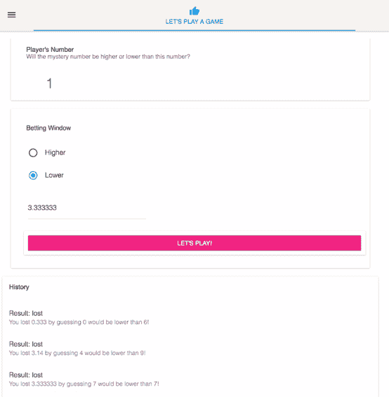

我们将构建 UI 中看到的组件，然后编写代码，允许玩家将他们的赌注和猜测提交给 Ganache。然后，Ganache 将执行我们的智能合约函数，并确定玩家是赢了还是输了，根据结果，它要么保留玩家发送的资金，要么支付该轮比赛的赢利。在任何情况下，我们都将向用户提供反馈，让他们知道他们是赢了还是输了。

在我们的 Web 应用程序中，我们将使用 React，但我们还将使用 Redux。**React**是一个用于构建 UI 的 JavaScript 库，它很好地允许我们设计构成我们的应用程序的组件和应该影响它们的状态。**Redux**是一个可预测的状态容器，这意味着我们将从以太坊网络获取大量数据，例如，每轮比赛的结果。当其中一些信息发生变化时，我们需要更新 UI 以让玩家知道这一点。Redux 提供了一个模式来做到这一点，今天你将学习如何使用它。

当你考虑组件时，想象一下构成 UI 的离散元素。所以我们的应用程序是一个大组件，但它由其他组件组成，比如显示玩家数字的组件，显示下注控件的组件，以及显示玩家游戏历史的组件。玩家的游戏历史组件还由更小的组件组成。有容器瓷砖组件和每个游戏历史项目的列表重复组件。所有这些都有状态。历史组件状态存储玩家历史，下注窗口状态存储我们的玩家和他们的猜测的赌注金额，React 处理所有这些。

现在，有些事情会在我们的应用程序之外发生，我们需要更新状态并让应用知道已经发生了，并据此响应 React。后者很容易解决，因为我们选择了 React 作为我们的工具。React 在跟踪状态方面做得很好，当状态改变时，它会更新受其影响的屏幕上的内容。

为了更新状态，我们使用了 Redux。在我们的 React 组件中，我们将执行一些触发动作的操作，比如点击“LET'S PLAY!”按钮。在点击该按钮时，它会使用 `web3.js` 库调用我们的合约，并执行我们之前创建的 `winnerLose()` 函数。当我们的合约函数执行该函数时，它会返回一些数据，这些数据可能是成功响应或错误消息。我们将获取该响应并将其分派到一个 reducer 中，该 reducer 将使用新信息更新 Redux 存储。

更新的信息以 `props` 或属性的形式发送回我们的应用程序，在那里 React 可以评估需要在 UI 中更新的内容。整个过程可以总结如下图所示：

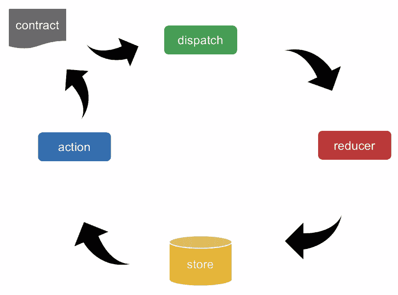

因此，我们清楚地将组成 DApp 的不同部分进行了分离。

我们有以太坊网络，我们的合约在**以太坊虚拟机（EVM）**上运行，然后我们的 React 应用在 Web 服务器上运行。我们应用的这部分可以是任何东西；我选择了一个 React 应用，但它同样可以是一个安卓或 iOS 应用，一个 Python 应用，甚至是一个老旧的 COBOL 主机应用。

React 应用程序与以太坊网络之间的连接是通过一个名为 `web3.js` 的实用程序库来完成的，以进行通信。该库提供了允许我们与以太坊节点通信的实用工具，如 Ganache，以及以太坊主网和测试网络上的节点。`web3.js` 有四个主要模块，分别是：

+   `web3-eth`：以太坊区块链和合约

+   `web3-shh`：点对点和广播的 Whisper 协议

+   `web3-bzz`：用于去中心化文件存储的 Swarm 协议

+   `web3-utils`：辅助函数

在本书中我们将使用的模块是用于与区块链和我们的合约通信的 `web3-eth`，以及一些实用函数的 `web3-utils`，例如转换以太币的不同面额。

Web3 允许您使用回调和 promises，并提供事件发射器来尝试提供您需要的所有选项。我们将广泛使用 promises，并在接下来的内容中详细介绍它们。在您可以编写实际向您的客户、公司或客户端交付值的第一行代码之前，必须放置大量的样板代码。幸运的是，有一些快捷方式可以减少这段时间，我将在下一节中向您展示它们。

# 从模板创建 React 应用

在这一部分，我们将看一些快捷方式来启动一个新的 React 应用。这是一件好事，因为启动一个新应用是一项繁重的工作，需要很多时间，本该用来编写代码来完成你的应用。

一种方法是使用 Facebook 创建的一个名为`create-react-app`的工具。它只是使用一些预先配置的选项快速创建一个 React 项目的板块或空白项目。你也可以只是复制另一个项目。如果你有一个类似的项目，里面的一切都按照你需要的方式设置好了，你可以克隆、复制或 fork 该应用程序，删除你不需要的部分，然后从那里开始。

还有第三种方法，那就是从零开始构建所有东西。如果你真的想要了解 React 的内部工作，这是一个很好的练习，但如果你在工作期限前工作，我不建议这样做。

# 优缺点

每种方法都有其优缺点。`create-react-app`工具使用 React JSX 和 ESX 创建一个新的项目。

使用这个工具启动一个新项目就像输入以下命令一样简单：

```
npx create-react-app my-app
```

其中`my-app`应该被你的应用程序的名称替换。

这创建了应用程序，并预先配置了`babel`和`webpack`，这样你就不必自己配置，更新通常很简单并有很好的文档说明，这样你就可以轻松地使你的应用程序保持最新功能和安全补丁。

不过，它的观点很明确，为了实现这样一个项目，必须如此。你添加的任何额外依赖项必须符合项目的格式，否则你会遇到挑战。你可以定制任何预先配置的工具，但这样做可能会使其处于你要负责维护的状态，因为它将不再接收官方包的更新。

复制或 fork 另一个项目有时可能是开始的好方法，特别是如果新项目与许多相同的依赖关系，它可能已经为你的使用案例配置好了，还可以访问支持资源，比如团队中的其他开发人员，如果你在使用相同的代码库。

这确实意味着你也会继承该项目的所有问题，比如过时的依赖项。你可能会不得不删除任何不被你的应用程序使用的不需要的代码，有时会导致一些问题。经常发现自己 fork 了一个项目吗？那么你最终会在多个项目中复制相同的代码，这可能会导致在更新依赖项或修补安全漏洞时需要进行大量额外的工作。

对我来说，当我学习新东西时，很容易看到一个似乎在解决同样问题的项目，并将其作为起点。我觉得这对于在一边尝试不同的事情来说是很好的。然而，随着时间的推移，这些项目几乎总是最难维护的。所以，如今，如果我正在构建一个将与实际用户发布的项目，几乎总是从 Facebook 工具开始。唯一的例外是当有一个具体的用例需要一个与其父项目共享代码库的高度定制组件时。

现在你对如何为 DApp 创建自己的 React 应用有了一些背景信息，让我们继续在我们的应用程序上工作。是时候开始构建用户界面了，这样我们就可以开始看到与我们的 Solidity 合同进行交互的视觉界面了。

# 向玩家显示游戏状态

到目前为止，我们一直在讨论 React 的工作原理。现在让我们把这些知识付诸实践，开始构建我们的用户界面，同时学习 React 如何使用状态来更新页面上的组件。

在我们的应用中，有一个名为 `index.html` 的文件；你可能知道这是当用户访问网站时，网页服务器默认提供的文档。在我们的索引页内部，有一个名为 `index.js` 的 JavaScript 文件被调用，它又添加了一个名为 `app` 的组件，这就是我们的 React 应用程序。下面的图表显示了应用的样子：

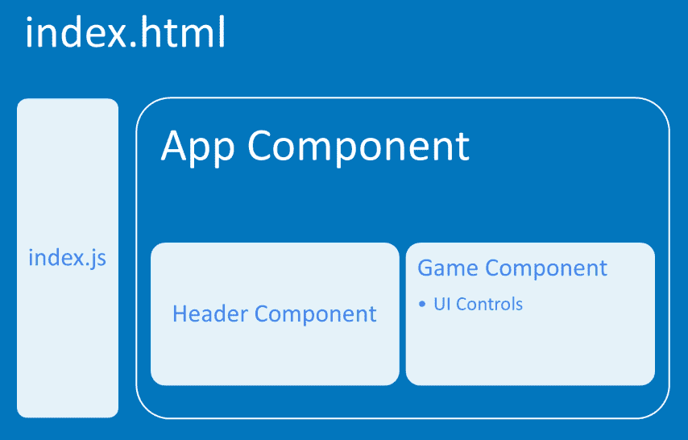

React 的一个主要目标是构建独立的组件。在 `app` 内部，它获取组成我们游戏的组件。这些组件包括头部和游戏组件。这些组件在文件系统上是单独的文件，让我们进入代码编辑器来感受一下它们的样子。让我们看看下面的截屏：

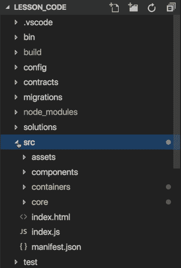

在我们的应用中，有一个 `src` 源文件夹、一个 `index.html` 文件和一个 `index.js` 文件。当你查看 `index.js` 文件时，你可以看到我们通过导入 `configureStore` 来创建 Redux store，然后我们从 `containers/App` 文件夹中导入我们的 `App` 组件，并在页面上创建该 app 的实例，如下代码片段所示：

```
import React          from 'react';      
import ReactDOM       from 'react-dom';
import { Provider }   from 'react-redux';
import configureStore from 'core/store/configureStore';
import App            from 'containers/App';

const store = configureStore();

ReactDOM.render(
    <Provider store={store}>
 <App/>
 </Provider>
    document.getElementbyId('root')
);
```

`App` 组件存储在我们的 `containers` 文件夹中；当你转到那里时，会看到一个名为 `App` 的文件夹和一个名为 `index.js` 的文件，其中存放着它的代码。它导入了头部和游戏，游戏本身是 `containers` 下的另一个文件夹，它有自己的 `index.js` 文件，在这个文件中，我们将定义游戏的所有组件。

这是我们如何为您的 UI 定义这些组件的方法。将显示的整个屏幕部分是我们的游戏容器，它是`app.js`文件中引用的组件。它由三个较小的组件组成——显示玩家数字的组件，显示投注控件的组件，以及包含玩家游戏历史记录的组件，如以下示意图所示：

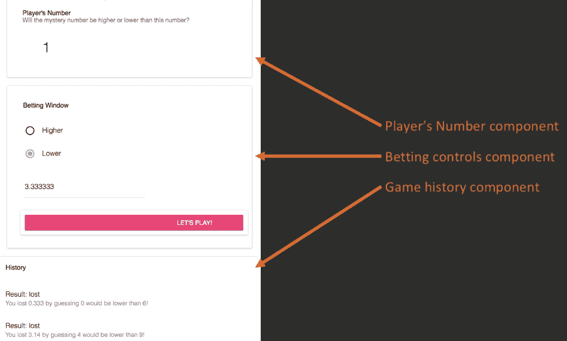

为了创建所有这些容器和控件，我使用了 Material-UI 库。这个库使创建高质量、专业外观的 UI 组件变得非常容易。

我们的游戏组件首先从几个库开始导入：

```
import React, { Component } from 'react'
import PropTypes from 'prop-types'
import { connect } from 'react-redux'
import { bindActionCreators } from 'redux'
```

如这里所示，我们需要`React`本身以及组件库来创建组件类，还需要`PropTypes`、`connect`和`bindActionCreators`用于 Redux，我们将在接下来的章节中详细讨论它们的角色。

然后我们创建一个名为`Game`的类，在其中我们有一个`constructor`函数。这与我们在 Solidity 合约中创建的构造函数的工作方式类似，它在类初始化时运行一次，以设置初始状态。以下代码片段显示了该类包含的内容：

```
export class Game extends Component {
    constructor(props) {
        super(props)
        this.state = {
            playerNumber: '';
            highLow: '';
            wager: '';
            history: []
        }
    }
    render() {
        return (
        )
    }
}
```

如前面的代码块所示，我们将为一些我们需要的变量设置初始状态，例如本轮显示给玩家的数字，他们对更高或更低的猜测，他们在本轮下注的金额，以及我们将存储之前几轮结果的数组。React 组件有一个必需的函数，`render()`。该函数在组件渲染时被调用。

现在我们准备开始布置这个组件的 UI 元素了。我们将从`index.html`页面上构建我们的第一个组件开始，即显示给玩家本轮数字的显示窗口。我们将从 Material-UI 库中定义一个卡片，然后定义一个带有标题和副标题的卡片头部，为玩家提供有关他们正在查看的内容的一些信息，最后我们有一个标题元素来显示数字本身。可以用以下代码片段来概括：

```
<Card style={style}>
    <CardHeader
        title="Player's Number"
        subtitle="Will the mystery number be higher or lower than this number?"
    />
    <h1 style={displayNumber}>{this.state.playerNumber}</h1>
</Card>
```

这应该生成一个看起来与以下截图类似的窗口：

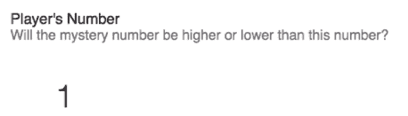

卡片中显示的数字是我们在构造函数中定义的状态变量。由于我们在组件中添加了来自 Material-UI 库的卡片和卡片头部，我们必须将其一起导入，以便 React 知道从哪里获取这些组件。我们通过将卡片和卡片头部作为导入内容添加到我们在文件顶部声明的其他导入中来实现这一点。

让我们回到在`h1`中使用的命令。它是如何从一串文本变成你在屏幕上看到的数字的？在 React 中，当你用花括号括起一个字符串时，它就具有了特殊的含义，但在那一点上，它实际上只是 JavaScript，所以我们可以做任何我们可以在 JavaScript 中做的事情。这意味着`this`被创建为一个变量，该变量的结果就是显示在屏幕上的内容。

有一个特殊的 React 生命周期函数叫做`componentDidMount()`，在我们的组件挂载后由 React 调用。挂载意味着它已经在 DOM 中呈现，并且可以通过编程方式调用。将我们的代码放在这里，确保我们在实际存在于 DOM 中之前不会尝试访问组件。我们将调用`this.setState()`并分配`playerNumber`状态变量。该函数的结果生成当前玩家号码。`generatePlayerNumber()`函数如下所示，只返回 0 到 9 之间的一个随机数。最终结果是，我们页面上的组件呈现了玩家看到的随机数字。以下是代码片段：

```
componentDidMount() {
    this.setState({
        playerNumber: this.generatePlayerNumber()
    })

    generatePlayerNumber() {
        return Math.floor(Math.random() * 10)
    }
}
```

接下来，我们有我们的下注窗口，它是另一个带有卡头的卡片，就像我们的玩家显示组件一样。它有一个单选按钮组，其中包含两个单选按钮，供玩家选择更高还是更低：

```
<RadioButtonGroup
    name="highLow"
    defaultSelected={this.state.highLow}
    onChange={this.handleChange('highLow')}
    >
    <RadioButton
        value="higher"
        label="Higher"
        style={elementStyle}

    />
    <RadioButton
        value="lower"
        label="Lower"
        style={elementStyle}
    />
</RadioButtonGroup>
```

注意所选值如何读取`highLow`变量的状态值，并且在更改时调用`handleChange()`函数。

我们还有一个文本字段，供玩家指示他们想要下注多少，以及一个按钮，当他们准备好开始游戏时执行。我们已经导入了卡片和卡头，所以现在我们将以相同的方式导入单选按钮组、单选按钮、文本字段和凸起按钮。

无论你在哪一步感到困惑，你都可以随时参考你在书中得到的源代码。对于单选按钮组和文本字段，我们调用`handleChange()`函数，其代码类似于以下内容：

```
handleChange = name => event => {
    this.setState({
        [name]: event.target.value
    })
}
```

这个函数接收要更新的状态变量的名称作为参数，然后用调用该函数的控件的值更新状态。所有这些都归结为类似于这样的东西：

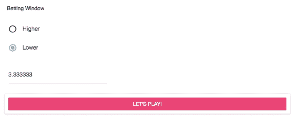

我们的最终组件是历史窗口，就像其他组件一样，它是一个带有卡头的卡片，这真正突显了使用库的好处之一。我们在这个组件中多次重复使用了这个库，因为它很容易定义，而且我们不需要编写任何代码来完成它。接下来，我们有一个列表，我们从状态中获取历史记录，这是一个数组，数组中的每个项目都是以前游戏中的结果。因此，我们对其进行映射，并为数组中的每个元素创建一个列表项。这在下面的代码片段中进行了总结：

```
<CardHeader
    title="History"
    />
    <List>
        {this.state.history.map((round) =>
        <ListItem key={round.transactionHash}
        primaryText={`Result:\t${round.result}`}
        secondaryText={`You ${round.result} ${round.wager} by guessing ${round.playerNumber} would be ${round.guess} than ${round.mysteryNumber}!`}
        />
        )}
    </List>
</Card>
```

这导致以下输出：

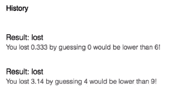

现在，让我们再次跳转到我们的代码编辑器，并看看所有这些部分如何组合成一个单一的 React 类。所以，在我们的`src/containers/Game`文件夹中，我们有我们的`index.js`文件，现在让我们来看一下。

在顶部，我们从 React、Redux 和 Material-UI 库导入构建此页面所需的所有内容。我们在这里有一点 CSS，使页面的格式看起来漂亮，然后我们有一个扩展了 React 组件的游戏类。在其中，您将找到设置初始状态变量的`constructor`，然后是 React 生命周期组件。然后，有我们的渲染方法，其中返回在页面上呈现的所有元素。

我们在玩家编号的卡片标题中有一个卡片；我们有第二个卡片代表投注窗口，然后我们有第三个卡片代表玩家的游戏历史记录。在此之后，我们有处理更改事件、启动游戏并生成随机数的用户定义函数。

所以，一切开始变得像一个真正的应用程序了。让我们再推进一点，跳到下一节，在那里我们将剖析“开始游戏！”按钮，看看我们如何从 UI 获取输入，并将其转换为用户的游戏。

# 从 UI 获取玩家输入

在这里，我们将继续执行代码，当我们的玩家点击“开始游戏！”按钮时。下面的代码片段展示了它的工作原理：

```
playGame = () => {
    const { actions } = this.props
    actions.game.playRound(
        this.state.wager,
        this.state.playerNumber,
        this.state.highLow
    )
    this.setState({
        playerNumber: this.generatePlayerNumber()
    })
}
```

在这里，我们正在定义一个从`this.props`获取的动作，然后我们调用该动作中存在的一个函数，最后，我们使用一个新的随机数更新`playerNumber`状态变量。

接下来，我们有从游戏组件中调用的函数，即`playRound()`。这个函数接受赌注、玩家编号和猜测作为参数，然后返回一个`dispatch`参数。`dispatch()`函数返回一个 JSON 对象，其中 type 是我们常量之一，并且参数是我们传递给函数的参数。我们的类型在`types.js`中定义。在其中，我们定义了我们的初始状态，它表示应用程序启动时设置的状态变量，这样当应用程序启动时就不会出现变量未定义错误。

然后，我们导出我们的游戏 reducer 函数，其中包含基于我们在动作中提供的动作类型的 switch 语句。当在我们的 reducer 中找到匹配类型时，它将返回定义给 Redux 存储的对象。

这个谜题的最后一部分是`rootReducer`。这个函数将我们应用程序中的所有 reducer 组合起来。下面的代码片段展示了它的内容：

```
import { combineReducers } from 'redux'
import { providerReducer } from 'core/reducers/reducer-provider'
import { gameReducer } from 'core/reducers/reducer-game'

const rootReducer = combineReducers({
  provider: providerReducer,
  game: gameReducer
})

export default rootReducer
```

因此，让我们再次将这个问题概括一下，这次引用我们刚刚学到的内容。从我们的游戏组件中，我们调用`playRound()`函数，这是由`props`提供的。`playRound()`函数接受来自玩家的参数并将它们分派到`core/reducers/reduce-game.js`中的 reducer。reducer 使用`core/types.js`中提供的常量将接收到的分派与要执行的工作进行匹配，并将结果发送到 Redux 存储。然后，Redux 存储将新数据作为`props`发送到我们的应用程序，当`props`发生变化时，React 注意到并使用新数据更新我们的历史组件。可以用下面的图表来概括这个过程：

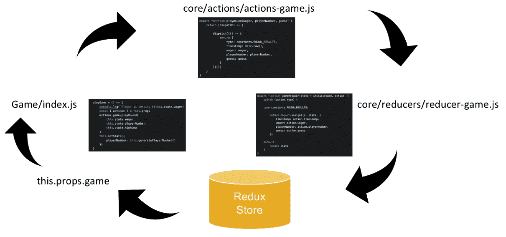

让 React 如此强大的是，当发生这种情况时，屏幕上唯一发生变化的是历史组件更新，而其他任何东西都没有发生变化。在下一节中，我们将实时地逐步进行所有这些，因此如果现在还不清楚，我认为在下一节中，当您自己测试它时，您会理解的。

# 向玩家提供反馈

我们现在已经布置好了代码，将我们的 React 组件连接到 Redux，以管理我们应用程序的状态。这可能是一个难以理解的概念，因此在本节中，我们将使用 Visual Code 调试器来玩我们的游戏，并实时地逐步执行代码。这样做将使您能够在执行时准确地看到应用程序的行为。

知道如何调试可能是您可以学习的最有用的技术之一，因为它可以在您最需要时为您提供新的信息。使用 Visual Code 设置它非常容易。您只需在 Visual Code 的扩展面板中安装微软的*Debugger for Chrome*工具：


然后，您将在调试菜单中创建一个启动配置，其中包含以下代码：

```
{
    "version": "0.2.0",
    "configurations": [
        {
            "type": "chrome",
            "request": "launch",
            "name": "Launch Chrome against localhost",
            "url": "http://localhost:3000",
            "webRoot": "${workspaceFolder}"
        }
    ]
}
```

现在，我们将导航到`index.js`文件中`playGame()`函数内的第一行。由于`playGame()`是一个函数，当玩家点击游戏中的“Let's Play!”按钮时，它将被执行。我们现在在这里设置一个调试点。

现在我们将切换到 Visual Code 中的调试菜单，并点击那里的绿色播放按钮。当浏览器启动时，我们应该会看到类似这样的东西：

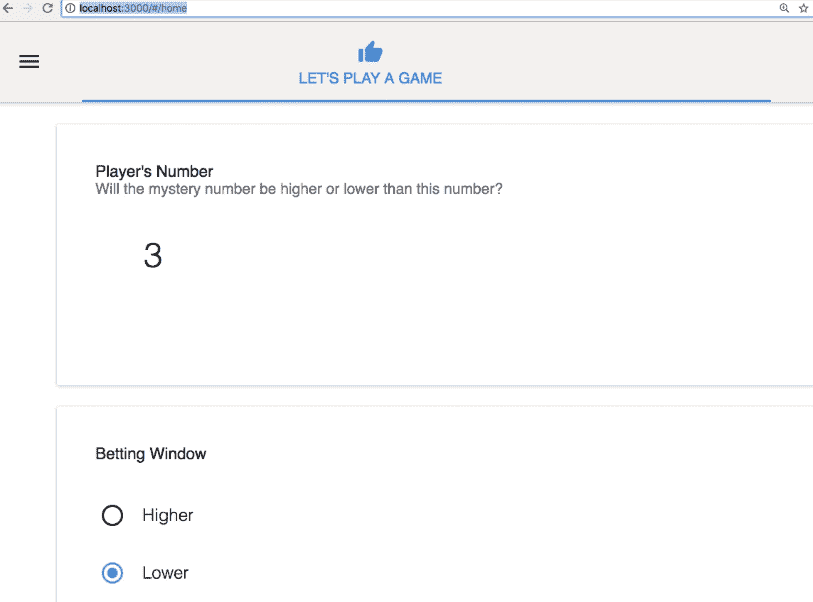

我们有一个玩家编号窗口，编号为 3，和我们的投注窗口。

我们可以输入赌注，所以让我们去做吧，然后点击“Let's Play!”。所以，立即，这会将我们切换回 Visual Code 并触发我们设置的调试点。我们可以使用顶部的控件播放到下一个调试点或逐个跳过每个函数。

当我们逐步执行每个函数时，您会看到在调试窗口中，这些函数的参数实时填充其值。您还可以在代码窗口中将鼠标悬停在它们上面，会弹出一个小窗口，告诉您相关信息。因此，您可以实时检查变量。

当我们从`actions`对象的`playRound()`函数到达时，我们不是要跳过它，而是要跟进它，以便通过该函数跟踪代码执行，这将带我们到我们的`actions-game.js`文件，我们在其中有我们的`playRound()`函数，返回`dispatch`参数。然后我们进入其中，现在它已经准备好返回我们将要分派到 reducer 的 JSON 对象。

然后我们进入我们游戏 reducer 的函数，有 switch 语句，如果我们悬停在操作类型上，我们可以看到该变量的结果等于`Round_Results`。所以我们将这些键值对分配给 Redux 存储。我们的 Redux 存储然后将这些更新后的属性推送回我们的游戏`index.js`文件作为`props`，然后我们将返回到我们的浏览器，看到我们更新的历史记录填充到历史窗格中，如下截图所示：

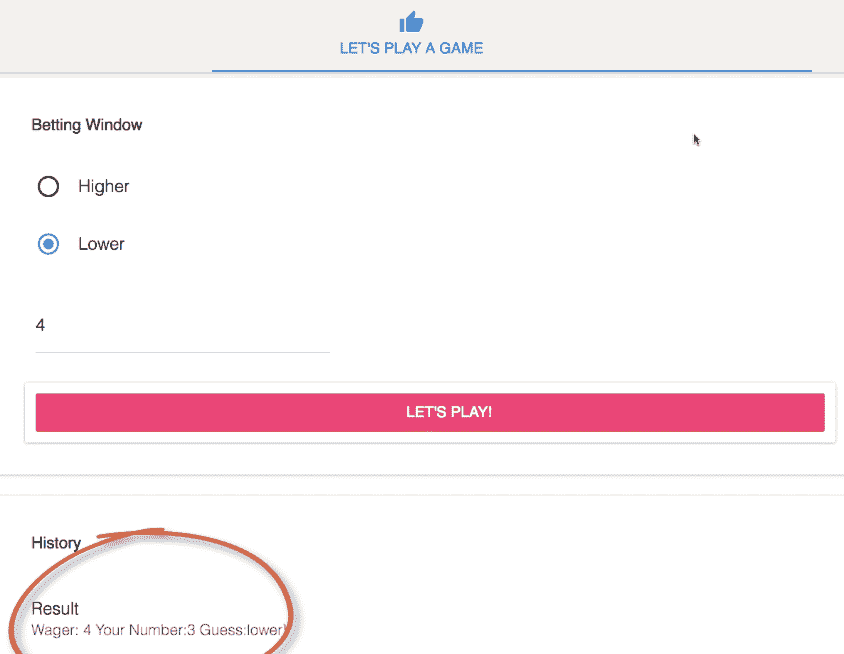

现在循环已经全面完成，我们的应用刚刚从 React 收到了新的`props`。那么我们如何利用它们？我们将通过使用另一个 React 生命周期方法`componentDidUpdate()`来实现。它是在发送新 props 后触发的函数。它有一个叫做 previous props 或`prevProps`的参数，这样您就可以引用刚刚收到的 props 之前的 props，并确定是否需要做出响应。这是非常重要的，因为您的应用程序将一直收到新的 props，但并非所有 props 都需要做出响应，所以我们将使用条件来识别我们关心的那些。

我们将比较前一个游戏对象的时间戳和当前游戏对象的时间戳；如果它们不同，我们就知道我们收到了数组的新历史项。在这种情况下，我们将复制当前的历史和状态，然后将`props`游戏对象的数据推送到其中。完成此操作后，我们将用刚刚创建的新历史数组来替换历史对象，现在我们将回到显示游戏历史记录的卡片。

请记住，我们将所有项映射到状态历史数组。React 将注意到我们刚刚更新了该状态变量，并重新渲染此组件，使其更新并显示我们上一轮的结果。在这里，我们只是立即发送了游戏发送的参数，但这并不是我们真正想要的。我们真正想要的是调用我们的智能合约，将这些游戏参数传递给它，并让它确定我们的玩家是赢了还是输了。为了做到这一点，我们需要我们的动作调用智能合约，然后等待这些结果。所以，在下一节中，我们将探讨 promises，它们的作用，工作原理以及我们将如何使用它们来与我们的以太坊网络进行通信。

# 在网络应用程序中实现 JavaScript Promise

在我们的最后一节中，我们看到了如何从我们游戏的玩家那里获取输入，并将其通过 Redux 发送以更新应用程序状态，然后刷新用户界面。但正如我们在第一天学到的，当我们提交调用以太坊网络时，我们并不会立即得到响应，会有一段延迟。不幸的是，我们在没有得到响应之前无法继续进行，那么我们该怎么办呢？

在我们回答这个问题之前，让我向你展示一下潜在的问题是什么。它源自 JavaScript 的工作方式。让我们看看这段代码：

```
console.log('1')
setTimeout(() => {console.log('2')}, 3000)
console.log('3')
setTimeout(() => {console.log('4')}, 1000)
```

在上面的代码中，我们有四行，每行都打印出数字 1 到 4。那么当我们运行这个代码时会发生什么呢？如果你预测它会打印出 **1**,**3**,**4**,**2**，那么你是对的，因为 JavaScript 执行第一行时，它打印出数字 1，然后执行第二行。这一行是问题的起点，因为它执行了 `setTimeout()` 函数，但并不知道我们希望它等待定时器完成。所以它调用了 `setTimeout()` 函数，然后移到下一行，打印出 3，然后移动到最后一行，有另一个定时器。一秒钟后，它打印出数字四，两秒钟后，当指定的 3000 毫秒延迟过期时，它最终打印出数字 2。

现在，想象一下，如果我们不是将一个数字写到控制台日志中，而是等待来自我们的 Solidity 合约返回的数据，以便在我们的应用程序中使用它，那么会不会导致问题，因为我们会在数据实际存在之前尝试使用它呢？那么，我们如何使用 JavaScript 的 Promise 来解决这个问题呢？

# Promise 的工作原理

JavaScript 的 Promise 是一个对象，本质上是在未来产生一个值或输出，就像现实生活中的承诺一样。一个 Promise 可以有三种状态：

+   已完成

+   已拒绝

+   待定

我们将通过上一个代码块中的场景作为示例进一步理解这一点。

我们将创建一个返回 promise 的新函数，以处理我们延迟的事件。promise 接受一个参数，这是一个接受两个参数`resolve`和`reject`的函数。在我们的 promise 中，我们有我们的`setTimeout()`函数。下面的代码片段展示了我们如何使用 promise 来解决我们之前的定时器问题：

```
function waitForMe (input, delay) {
    return new Promise ((resolve, reject) => {
        setTimeout(() => {
            resolve(input)
        }, delay)
    })
}
```

此函数确保编译器等待计时器完成，打印出数字 2，然后继续打印数字 3。

大多数情况下，它会是一些不会立即返回的东西，比如在 Solidity 合同上执行一个函数。当我们的`setTimeout`函数完成后，我们将调用我们 promise 的一个参数`resolve()`函数；这表示 promise 已成功完成。同样，如果出现问题，我们可以调用`reject`函数。

现在，我们可以重写我们的原始代码。我们的第一行保持不变，但对于我们的第二行，我们将使用`waitForMe()`函数，并将两个参数传递给它，即输入 (`2`) 和延迟 (`3000`)。这确保当函数被调用时，编译器会等待三秒钟，然后打印出数字 2，最后继续下一步。就像之前一样，我们会直接从控制台打印出 3，然后我们将再次使用相同的`waitForMe()`函数来获取数字 4。下面的代码片段展示了修改后的代码：

```
console.log('1')
waitForMe('2', 3000).then(result => {console.log(result )
console.log('3')
waitForMe('4', 1000).then(result => {console.log(result )})
```

让我们快速回顾一下 promise。promise 提供了某事将会被做的保证，但并不确定何时会被完成。不像真实的承诺，JavaScript promise 通过解决 promise 来实现它，或者通过拒绝来结束它。这样可以让你决定在任何情况下该做什么。现在，我们已经准备好解决与以太坊网络上的合同通信的问题了。

# 使用 Web3.js 与以太坊网络通信

在之前，我们看到了如何从我们游戏的玩家那里获取输入，并通过 Redux 来更新应用程序状态，然后刷新用户界面。在前一节中，我们了解了 JavaScript promise。现在，我们将学习如何让这两者共同工作，来调用我们在合同中创建的函数。

我们将重新设计我们应用程序的`actions-game.js`文件中的`playRound()`函数。

我们将使用`dispatch`函数，并将其移出到自己的函数中。然后，我们将从以太坊网络中获取我们合同的一个实例，并创建一个调用我们合同中函数并等待响应的 promise。当它获得响应后，它将调用我们的新`dispatch`函数。

要开始，我们需要将一些新的依赖项引入到我们的应用程序中，比如从 Truffle 合同中获取的`contract`库，我们从`contract/Gaming.json`中的`Gaming`文件，以及`web3`库，如下面的代码片段中所示：

```
import contract from 'truffle-contract'
import Gaming from '../../../build/contracts/Gaming.json'
import web3 from 'web3'
```

我们现在将修改我们的`playRound()`函数。

我们将`dispatch`函数移入两个新函数，`dispatchRoundComplete()`和`dispatchRoundFailed()`。我们用一个常数`web3Provider`替换它，该常数来自 Redux 存储中的状态。然后，通过调用我们的`contract`库并传递给它我们的合约的 JSON 表示来声明我们的游戏合约。我们在这里做了一些设置；我们将合约的提供者设置为`web3Provider`中指定的提供者。这是 MetaMask 被注入的地方，我们的应用程序会自动检测 MetaMask 是否被注入并设置提供者。下面的截图展示了我们的`playRound()`函数现在的样子：

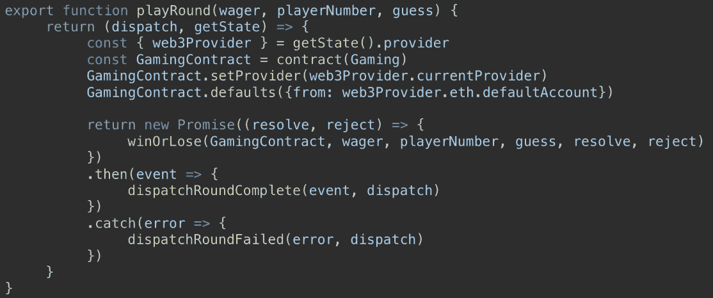

明天您将学习更多关于 MetaMask 的知识。MetaMask 允许您选择不同的账户，就像我们在编写单元测试时所做的一样。使用`web3Provider.eth.defaultAccount`对象可以确保我们从当前选择的账户发送交易。我们创建一个新的 promise 并定义两个参数`resolve`和`reject`。当我们在以太坊合约中完成我们的函数调用时，我们将检查其状态。如果成功，我们将调用 resolved 函数，如果失败，我们将调用 reject 函数。这样，当这个 promise 返回时，我们就知道它是否成功。在 promise 内部，我们调用`winOrLose()`函数，这是一个新函数，但您可能会认识到这个名称。

让我们来看看它，然后我们将回来看看前面函数中的其余部分发生了什么：

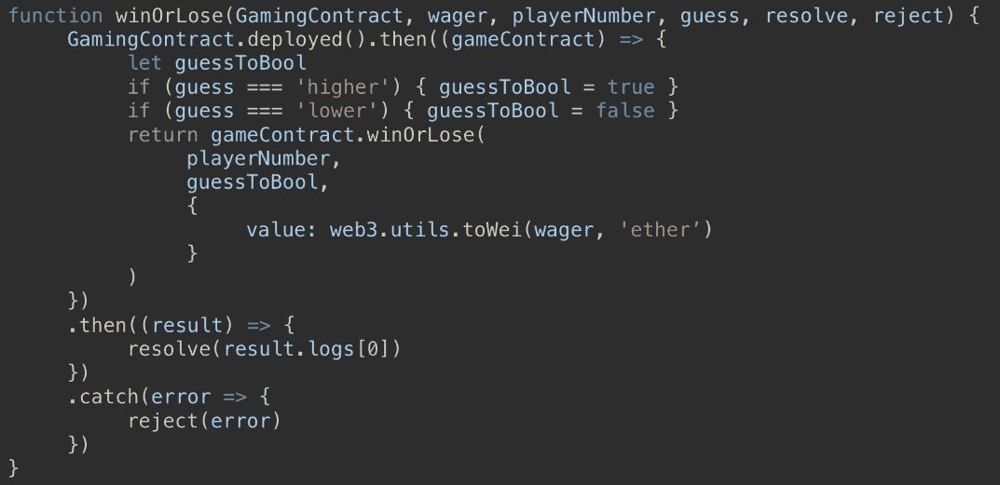

如果你觉得函数名称`winOrLose`听起来很熟悉，那么你是对的：这是我们在 Solidity 合约中创建的函数名称。在我的 React 应用中，我给调用智能合约的函数取和智能合约中的函数相同的名称。因此，现在看着我们的 UI 代码，我们知道这将调用`winOrLose()`函数，而这个函数在我们的合约中已经存在了。这只是帮助我们追踪事物。

我们传递给这个函数的一个参数是`GamingContract`，这是我们刚刚创建的在线合约的实例。它有一个`deployed`方法，返回一个 promise。它的作用是获取我们合约的部署版本，这意味着它获取与以太坊网络通信所需的信息。它找出它所在的网络、它的部署地址是什么，以及如何与它通信。由于它是一个 promise，我们可以通过使用`then`等待其完成；这意味着我们应该执行这段代码，而每当它完成时，继续执行。

`gameContract.winOrLose()`函数是与我们的 Solidity 合同进行通信的实际函数。请记住，在 Solidity 中，我们始终以**Wei**为单位处理货币。以太坊的大多数用户都熟悉**ether**单位，因此在我们的界面中，我们允许他们用以太币下注，然后我们使用`web3`工具将其从以太币转换为 Wei，然后将其附加到我们的交易中。这整个部署的函数也是一个承诺。

当这个完成时，我们会进入`then`函数，将交易的结果作为名为`results`的变量传递。当它解析时，我们将调用我们在调用函数时传递的`resolve`函数。在那个函数中，我们将返回`result.logs[0]`，看起来非常具体。让我们仔细看看发生了什么：

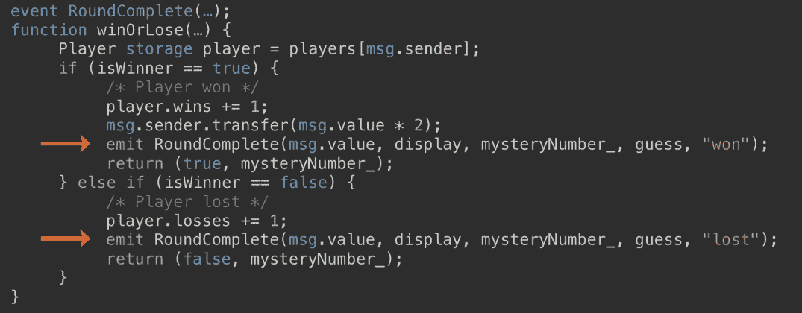

这是我们 Solidity 合同的核心部分。我在上图中突出了两行具体的内容，这就是我们现在要看的内容。当我们的玩家赢了或输了，我们就会发出`RoundComplete()`事件，并提供交易的详细信息，赢了或输了多少钱，向玩家显示的数字，我们合同生成的神秘数字，玩家猜测的高或低，以及他们赢了还是输了这一轮。请记住当交易被写入区块链时，事件会被发出。下图显示了我们从交易中得到的实际结果：

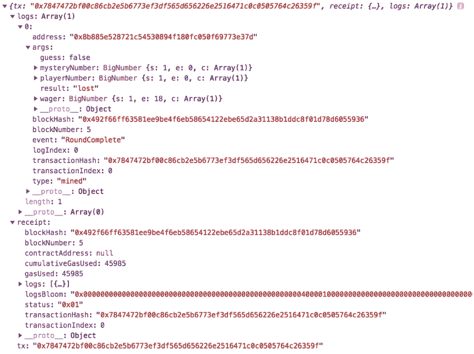

这里涉及了很多内容，让我们来看一下日志数组。数组中的第 0 项具有一个`args`键，如果你仔细看，就会发现这是我们正在发出的事件，包含了我们刷新玩家界面所需的所有细节。所以，当我们解析这个函数时，我们会剥离一切，然后将这个键返回给我们的`resolve`函数。

`winOrLose()`函数中的最后一部分是一个`catch`语句，如果承诺中的任何内容失败，它就会被执行。当发生这种情况时，我们捕捉错误并使用`reject`函数将其发送回原始承诺，从而回到我们的`playRound()`函数。根据我们调用`resolve`还是`reject`函数，我们将执行`then`函数或`catch`函数。

当它成功解析时，我们就会从包含我们事件的日志中返回该对象，并将其传递给另一个新函数`dispatchRoundComplete()`，并调用我们的参数事件。这个函数也许会让你感到熟悉：它就是我们在上一节创建的派发函数，但我们稍微修改了一下，如下图所示：

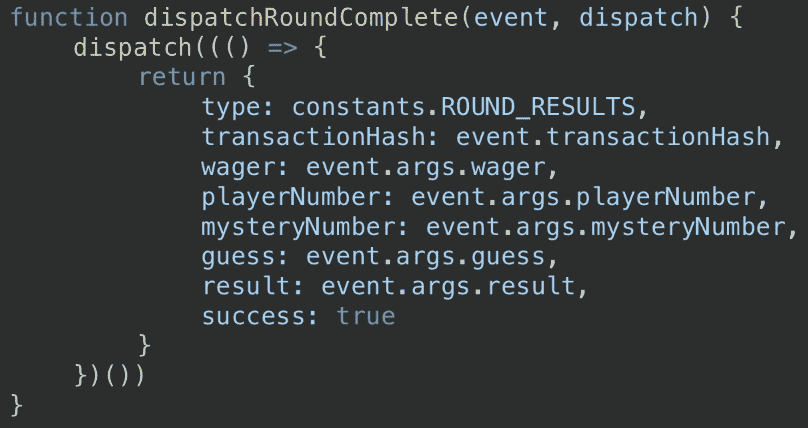

我们仍然有相同的类型，但我们将时间戳键替换为 `transactionHash`。这个字段存在的原因是因为我们在 UI 中映射数组以填充游戏历史记录表。React 要求数组中的每个元素都有一个唯一的键，以便在更新时知道要更新哪一个。

以前，我们没有一个唯一的键，所以我只是把一个时间戳作为唯一值放在那里，但现在我们有了我们交易的交易哈希，这绝对保证是唯一的，所以我们不再需要那个时间戳。我们有了我们的赌注和玩家号码，并且我们添加了玩家下注的神秘数字。然后我们有他们的猜测以及该轮的结果。

我们这里还有一个布尔值 `success` 键，我们可以用它来切换此次交易是否成功。当 promise 成功完成时，我们将 `success` 设置为 `true`，如果 promise 被拒绝，那么调度往返失败函数将会将 `success` 设置为 `false`。我们的 dispatch 的行为和以前一样，并通知接收 dispatch 动作并将其发送到 Redux 存储的 reducer，而 Redux 存储现在将通过一个新的 `props` 文件通知我们的 UI，我们将在下一节中使用它来更新用户界面。

# 在 UI 中实现 JavaScript 函数

到目前为止，您已经了解了如何从 UI 上的用户控件获取输入，将它们通过 Redux 生命周期进行处理，并将最终产品显示回 UI 中作为新的 props。在本节中，我们将深入研究与用户控件相关的 UI 中的函数。

当我们的 reducer 接收到 `dispatch` 函数的动作时，它会创建并发送此对象到 Redux 存储，并且还会发送所有其他可能存在的 reducer，因此我们有一个 `rootReducer` 常量，它组合了所有这些 reducer。以下截图显示了这是什么样子：

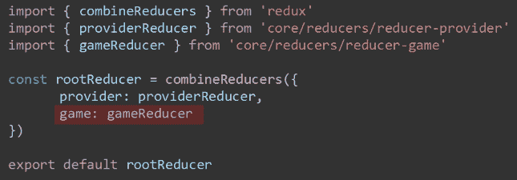

在这里，您可以看到我们在 `rootReducer` 中定义了一个名为 `game` 的新键，并且它将用来填充来自 `gameReducer` 的数据。这就是发送到 Redux 存储的内容，我们知道 Redux 存储将把这个内容作为 `props` 发送到我们的组件中。因此，在我们的游戏 UI 的 JavaScript 文件中，我们有这个函数 `mapStateToProps()`，正如你从名称中猜到的那样，这是将 Redux 状态映射到组件中的 props 的函数。

因此，我们发送到 Redux 存储的所有值都可以在我们的组件中按如下方式访问和读取：

```
this.props.game.wager
this.props.game.playerNumber
this.props.game.mysteryNumber
```

所有的 props 都是只读的，您不能更改它们。我们将在一分钟内看看如何更改它们，但是当它们在后端更改时呢？如果这些键中的一个值在 Redux 存储中更改了，我们的 UI 如何更新？

嗯，这取决于你是使用 React 15 还是 React 16，有两种方法可以使用，行为都相似，但是从名称可以看出，它们在不同的时间触发。在 React 16 中，我们使用`componentDidUpdate()`，它接收一个名为`prevProps`的参数，允许我们将 props 的值与它们的先前值进行比较，然后相应地采取行动。在 React 15 中，我们将使用`componentWillReceiveProps()`，它在组件接收新属性之前触发。参数名称也反映了这一点。它是一个名为`nextProps`的参数，其中包含 props 的新传入值。您可以在 React 16 中使用`componentWillReceiveProps()`，因此，如果您将现有的 React 15 应用程序升级到 React 16，这仍将起作用。

在下一个版本的 React 中，`componentWillReceiveProps()`将被标记为已弃用，然后在其后的版本中将被删除。当我们向我们的组件添加这些函数时，我们需要评估为什么调用它。它会被很多东西调用，而且是你不关心的东西，所以你需要评估条件来看你是否关心它。让我们看看以下例子：

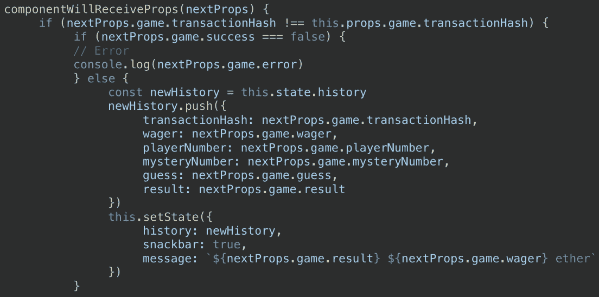

我们将以一个`if`语句开始，检查`nextProps`参数中的`game.transactionHash`是否与`this.props`中的不同。如果是，那么告诉我们我们有一个新的交易哈希，而由于交易哈希特定于一个交易，我们知道玩家已经完成了一轮游戏。接下来，我们设置我们的`success`键；记住，这是我们设置为`true`的键，如果包裹我们的合同交易的 promise 成功完成，我们设置为`false`，如果 promise 被拒绝。这给了我们一个机会来传递错误消息，如果我们需要的话。如果我们的 promise 成功解决，那么我们将有一些新的交易细节添加到我们的游戏历史窗口中。我将该游戏历史存储为组件状态中的一个数组。

所以，让我们为我们的历史创建一个新变量，然后将我们最新交易的所有细节推送到该数组中。我们不能直接更新组件状态，所以我们调用`this.setState`并将`history`值设置为我们刚刚创建的新历史数组。最后，我们有一个`snackbar`控件，这是一个小型的弹出式控件，其值也存储在组件状态中，因此我们可以更新它们并为它们分配值。

当这个渲染时，它会转化为一个句子，类似于**失去十个以太币**，或者正确的值是什么，然后将该轮结果添加到历史窗口中，如下面的截图所示：

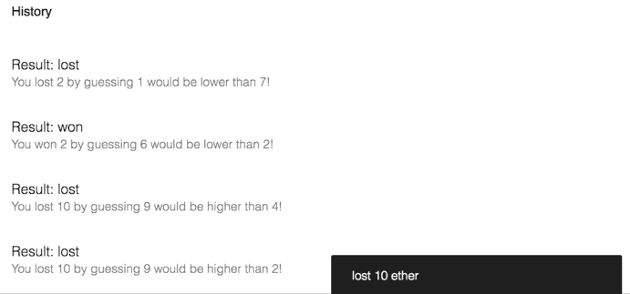

除了更新状态变量之外，我们不需要做任何操作就可以使我们的 UI 组件处理页面上的更新，因为我们将控件绑定到了状态变量上。当它们发生变化时，React 知道重新渲染它们。因为 React 只想渲染发生变化的变量，所以在映射我们的历史数组时有这个键是很重要的。这个键允许 React 唯一地识别数组中的每个项目，并且只渲染那些已经改变的项目。现在，是我们今天的最后一个部分了，作业。

# 作业

好了！是时候将今天学到的知识付诸实践了。这个作业将强化我们使用 React 和 Redux 进行状态管理以及使用 promises 处理潜在网络请求的概念。你将在我们的游戏 UI 中添加一个记分牌，显示玩家当前的记录，如下面的截图所示：

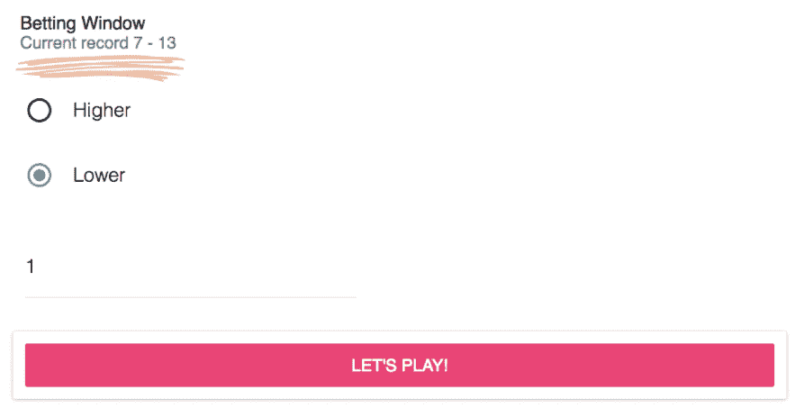

你可以在页面上创建一个新组件来显示它，也可以将其内联添加到类似于前面组件的现有组件中。现在，回想一下第二天，我们为我们的玩家创建了一个包含此信息的结构体，并创建了一个将玩家地址映射到结构体的映射。请记住，公共变量和 Solidity 自带一个免费的 getter 函数，如果该变量是一个映射，则映射键是一个必需的参数。

在我们的情况下，这是我们玩家的地址。解决这个问题有多种方法，只要你的解决方案满足每次变化时更新玩家分数的条件，那就是一个很好的解决方案。如果是我，我会在我们的代码中找到一些已经在做某些事情的地方，因为分数已经改变了。你可能会在下面的代码片段中找到一些灵感：

```
componentWillReceiveProps (nextProps) {
    if (nextProps.game.transactionHash !==
    this.props.game.transactionHash) {
        if (nextProps.game.success == false){
            console.log(nextProps.game.error)
        }else {
            const newHistory = this.state.history
            newHistory.push({
            transactionHash: nextProps.game.transactionHash;
            wager: nextProps.game.wager;
            playerNumber: nextProps.game.mysteryNumber;
            guess: nextProps.game.guess;
            result: nextProps.game.result
        })  
        this.setState({
            history: newHistory,
            snackbar: true,
            message: '${nextProps.game.result}
                    ${nextProps.game.wager} ether'    
        })

    }
}
```

你可以使用上面的代码块，并按照应用程序中已经存在的代码的模式和示例来使用。你从 UI 调用一个动作，该动作将返回一个 promise，调用一个包含我们统计数据的 Solidity 函数；该 promise 将解析，然后我们可以调度我们的合同函数结果，将它们发送到一个 reducer，该 reducer 将更新 Redux 存储，这将更新呈现给 UI 的 props，UI 将更新以反映新的 props。

在明天之前你将无法完成这个作业，因为我们缺少一个测试它的部分，但是今天要写好代码，明天我们会检查剩下的部分，因为你需要一个钱包来测试这个。

# 总结

在本章中，我们学习了为我们的应用程序实现 UI 的所有内容。我们学习了如何使用 React 来创建我们的 UI，以及 JavaScript 如何在 DApp 中发挥重要作用。我们学习了如何从模板创建 React 应用程序并应用它们，以及如何修改应用程序中的各种状态，使一切都按照预期运行。我们学会了如何接受用户输入并向他们提供反馈，以及如何使用 Web3.js 将这些操作传达到以太坊网络。最后，我们学会了如何将所有功能部署到 React UI 中。

在下一章中，我们将学习不同类型的钱包，并且学习如何配置 MetaMask 来与我们的应用程序一起使用。
