# 第六天 - 使用钱包

欢迎来到第六天。今天，我们将实现我们区块链应用的最后并且最关键的部分，钱包。钱包不仅为我们游戏的玩家提供存储资金的地方，还提供了发送和接收这些资金的方式，以及使用密码签名的交易来确保我们可以验证这些资金和交易来自于那个钱包。

本章将作为开始此项目的基石，涵盖以下主题：

+   理解钱包和安全性

+   钱包简介

+   MetaMask

+   理解燃气价格和燃气限制

+   在以太坊网络上查看区块链交易

+   理解在线和离线钱包

+   注入Web3提供程序

# 理解钱包和安全性

让我们来看一下今天典型的在线交易。消费者会访问一个网站，将一些商品添加到购物车中，然后启动结账过程。他们需要在该网站上输入他们的信用卡号，但这个信用卡号会怎样处理呢：它安全地发送到服务器了吗？商家会存储那个信用卡号吗？如果他们存储了，他们是否在遵循良好的安全实践？现在有谁可以访问这个信用卡号，因为任何持有这个卡号的人都可以使用它？我们有机制来处理所有这些问题，并且在发生问题时，大多数商家和发卡行都会与您合作解决问题，但这并不是出于他们的善意；您每天都在支付这项服务的费用和交易成本：

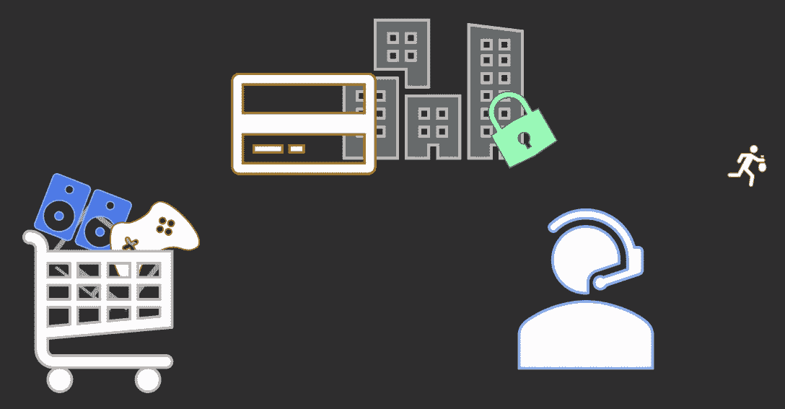

让我们使用区块链技术再次看一下相同的交易过程。购物过程看起来一样。您将商品添加到购物车，然后开始结账过程，但在结账时，您不需要输入信用卡号，而是使用钱包对包含购买指令的交易进行加密签名。那么，这是安全进行的吗？希望是，但如果不是，那也没关系，因为您发送的唯一内容是包含购买详细信息的已签名交易，如果有人在途中截取并更改该交易，那个签名就不再有效。

那么，关于存储详细信息呢？商家可以存储它们，而且它也会存储在公共区块链上，这没问题，因为它只是交易的详细信息；里面的内容无法用来创建额外的交易。商家的安全实践呢？你与之交互的合约位于公共区块链上，可以查看和审计其安全性，最后你的私钥永远不会离开你的钱包，因此唯一让您的账户用于创建恶意交易的方式就是失去了控制私钥。因此，没有第三方参与收取您账户维护和监控费用：

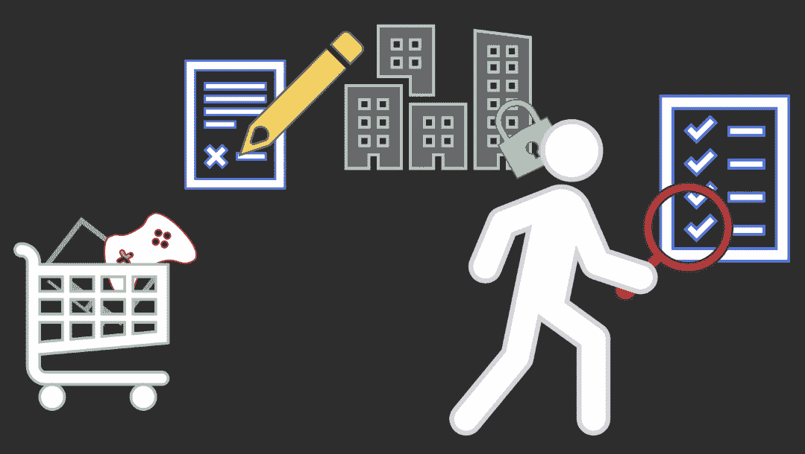

# 钱包介绍

钱包是一个存储公钥和私钥的软件程序，并允许您与区块链交互以签署可能包括发送和接收货币或执行智能合约的交易。它们实际上并不存储任何货币；它们只能引用与该地址相关的区块链上的交易。

让我们谈一分钟关于公钥和私钥，因为这是一个重要的概念要理解，因为如果你泄露了你的私钥，你将泄露与之关联的一切。每个钱包都有一个私钥和公钥：将公钥视为你房子的街道地址，将私钥视为可以解锁邮箱的钥匙。任何人都可以使用你的公钥向你的邮箱发送东西，但只有持有私钥的人才能打开邮箱：

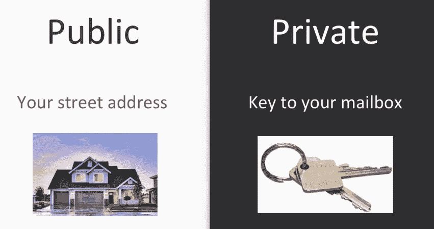

让我们再举几个类似的例子，然后总结一个关键点。你的电子邮件地址是公开的，你电子邮件账户的密码是私密的：

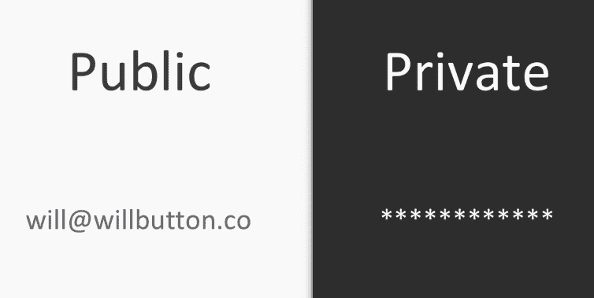

你的银行信息相对是公开的，但你必须提供某种形式的身份证明才能使用它：

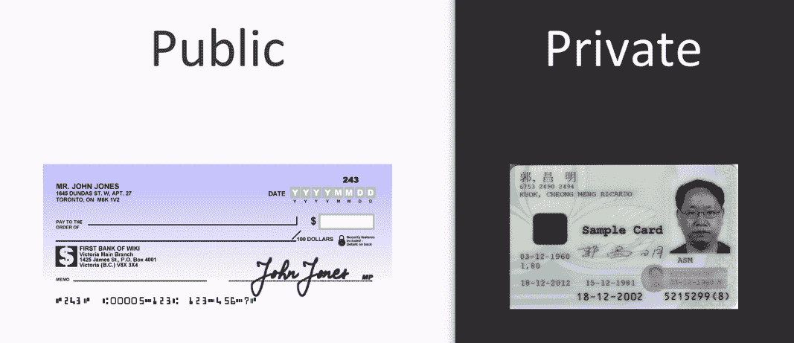

你的车是公开可见的，但你必须有钥匙才能打开它；也许这辆特定的车是个不好的例子，你知道那甚至可能不是它的正确钥匙，但我的观点仍然是有效的：

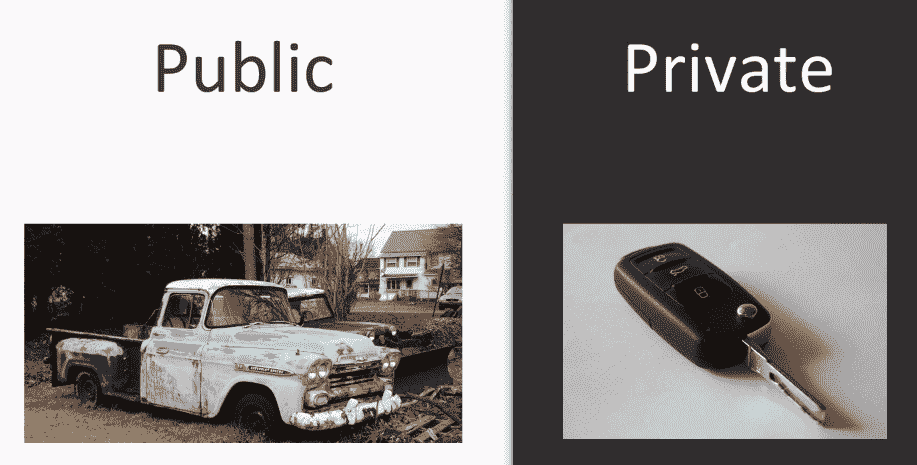

在所有这些情况下，如果你丢失了你的私钥，你可以通过打电话给锁匠、与技术支持交谈或去银行换新的借记卡来重新获得对你的资产的访问。但在区块链技术中，如果你丢失了私钥，就完了；没有办法恢复丢失的私钥，这是设计上的。任何一种在丢失后仍然可以恢复访问的情况都是因为中间人仍然具有访问权限，无论是银行、锁匠还是电子邮件提供者，你都要为这种便利支付费用。在区块链上，没有中间人，你拥有自己账户的责任；这种所有权的好处是除非你允许，否则无法入侵你的账户，而且你不需要支付第三方交易费用来方便地使用你的钱。

# 钱包类型

有不同类型的钱包可用：

+   **桌面钱包**：这个钱包是下载并安装在你的电脑上的，只能从下载它的电脑上访问。它具有非常高的安全性，但如果你被黑客入侵或者你有病毒，它就容易受到攻击。MetaMask是桌面钱包的一个例子，我们今天将更多地与它一起工作。

+   **在线钱包**：该钱包在第三方服务器上运行，非常方便使用。私钥由钱包提供者在线存储，并由第三方控制。Coinbase 是在线钱包提供者的一个非常流行的例子。

+   **移动钱包**：该钱包是安装在手机上的应用程序，非常适用于例如在零售商店进行支付。它们通常比桌面钱包具有更少的功能，因为手机上的空间有限。Mycelium 是移动钱包的一个非常流行的例子。

+   **硬件钱包**：该钱包将私钥存储在硬件上，具有非常高的安全级别，事实上，即使在感染的PC上也可以使用硬件钱包。现在，即使使用硬件钱包，仍然需要备份，以防硬件损坏。Ledger Nano 是硬件钱包的一个例子。

+   **纸钱包**：该钱包非常易于使用，并具有很高的安全级别，因为没有技术可能出现故障。实际上，它只是一张纸；等一会儿我会向你展示它是如何工作的。

那么，哪种钱包对您来说最好？答案取决于您想要实现什么目标。在本书中，我们将使用MetaMask，因为它提供了安全性和易用性的良好平衡。就我个人而言，我使用多个钱包，每个钱包都有不同的角色。我在手机上有一个移动钱包，上面只有一点货币，可以用于随时进行交易；我还有一个硬件钱包，我将大部分加密货币存储在这里；我将其锁在防火安全箱中，并备份在存放在另一座独立建筑物中的纸钱包中，这样如果有什么问题发生，我仍然可以访问这些资金。现在，您已经知道了什么是钱包及如何使用它们，让我们跳到下一节，并为本书的最后部分配置我们的钱包。

# MetaMask

我们正在使用 MetaMask 作为与我们的 DApp 交互的钱包。我们将学习如何安装和配置它；首先，让我们回顾一些 MetaMask 的关键点。

MetaMask 将 Google Chrome、Firefox、Opera 和 Brave 变成了以太坊浏览器。它允许网站从区块链中检索信息，还允许用户安全地签署交易。账户信息存储在安装 MetaMask 的本地计算机上，并在硬盘上加密。我们今天最感兴趣的功能是它允许浏览器与以太坊应用程序进行交互。每次交易都会提示用户确认和签署交易。

下列步骤将帮助您安装和配置它：

1.  让我们访问网站，[https://metamask.io/](https://metamask.io/)，并单击“GET CHROME EXTENSION”链接。现在，如果你使用的是其他浏览器，如 Firefox、Opera 或 Brave，你需要单击相应的链接。看一下以下的截图：

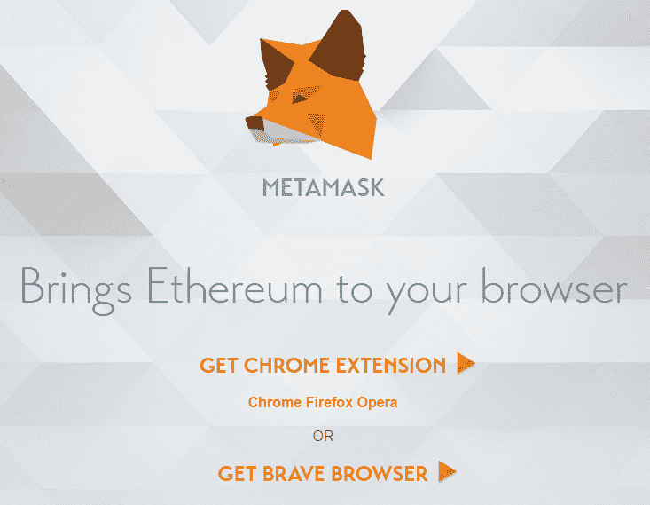

1.  现在，它将打开 Chrome 网上应用店。点击“添加到 Chrome”按钮：

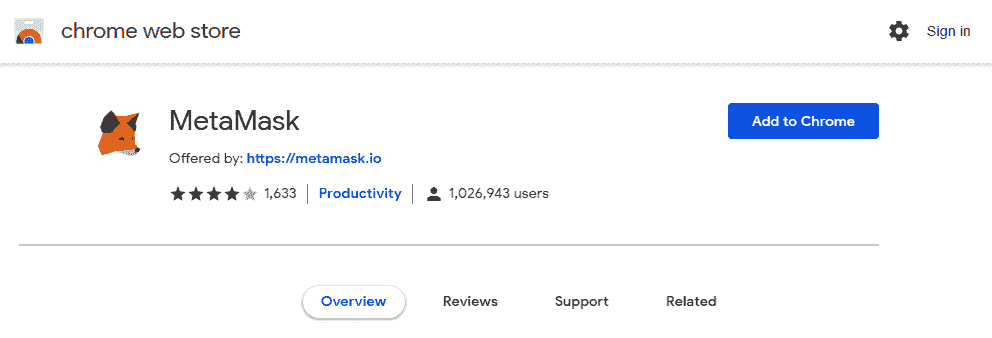

1.  这将在工具栏上添加 MetaMask 图标，当我们点击该图标时，它将为 MetaMask 打开一个新标签：

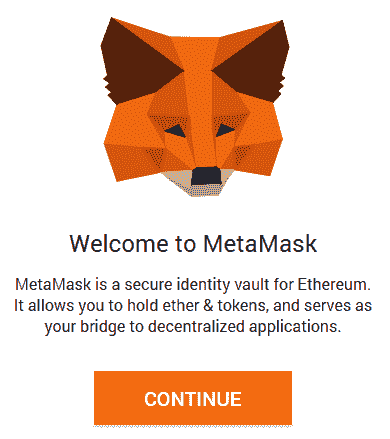

1.  现在，点击“继续”按钮，你就可以创建一个新账户了：

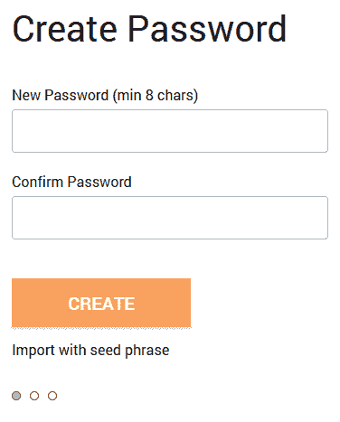

1.  现在，我们将使用种子短语进行导入，因为我们将连接到本地 Ganache 安装。因此，在这里，我们切换到 Ganache 并复制这个种子短语：

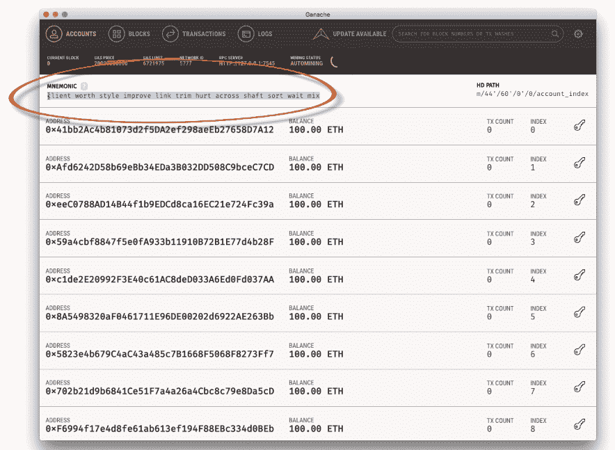

1.  点击“使用种子短语导入”链接：

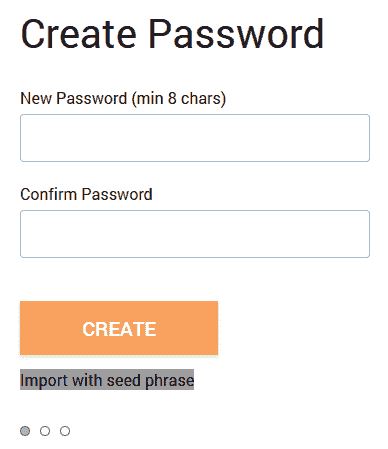

1.  将种子短语粘贴到“钱包种子”字段中，创建一个新密码，然后点击“导入”按钮：

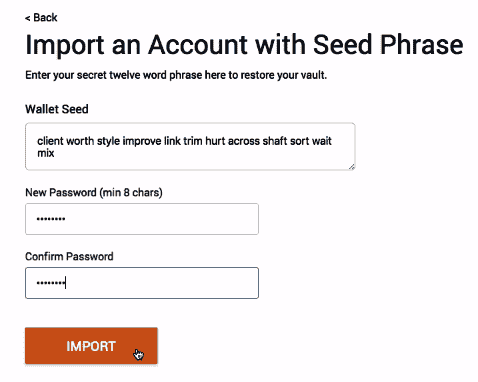

现在，我们必须接受使用条款和隐私通知，然后有一个钓鱼警告，因为有很多攻击企图劫持 MetaMask 以获取私钥的行为要你阅读。

1.  现在，MetaMask 已连接，它将我们连接到主以太坊网络；但是，我们需要连接到本地 Ganache 安装，所以我们在这里选择网络下拉菜单，你会看到一些不同的选项：

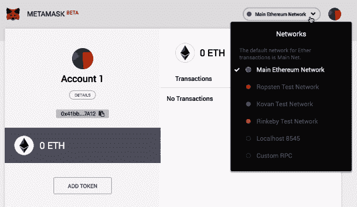

在此，对于我们连接的主网络，以及一些测试网络，如 Ropsten、Kovan 和 Rinkeby，让我们使用自定义 RPC。

1.  如果我们切换回 Ganache，你会看到 RPC 服务器地址：

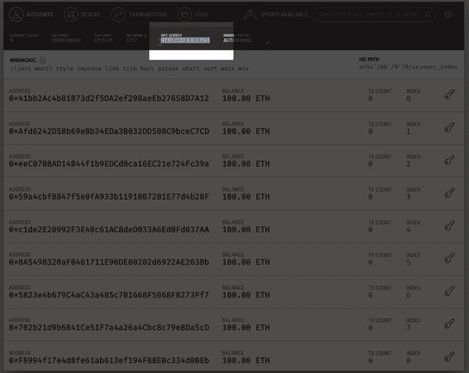

1.  将其复制并粘贴到“New RPC URL”字段中，然后点击“保存”：

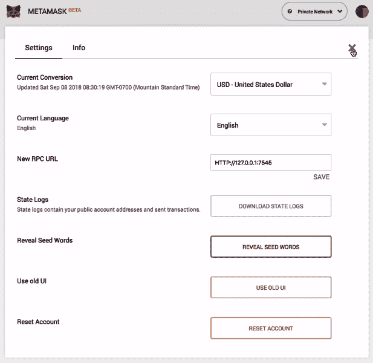

1.  关闭设置窗口，现在它已经连接到 Ganache。你可以看到通过 Ganache 可用的100个以太币：

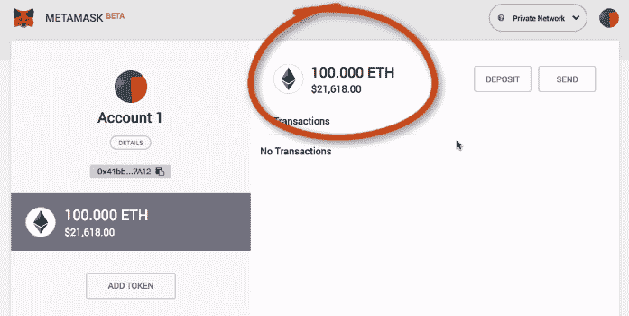

1.  我们还可以进入账户 1 的详细信息，并给它取一个有意义的名字，这样当我们查看账户列表时，它就有了我们无法识别的东西：

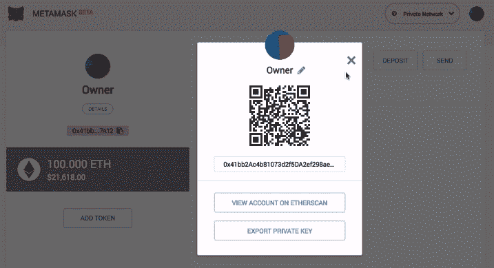

1.  我们还可以在这里点击顶部并创建一个新账户，如下图所示：

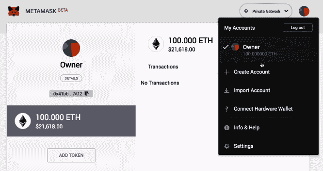

1.  给它取一个名字，然后点击“创建”，现在看发生了什么。以太坊地址就在这里列出，以C7CD结尾：

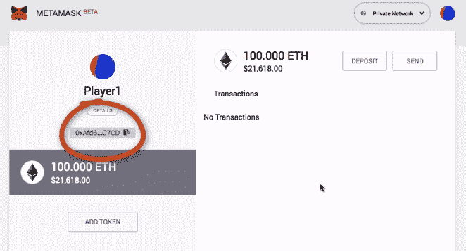

1.  所以，如果我们回到 Ganache，我们可以看到第二个账户是由 Ganache 提供的，因此使用 MetaMask 连接到本地 Ganache 的方式允许我们使用在 Ganache 安装中列出的所有账户：

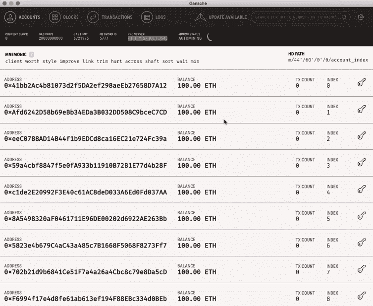

1.  既然我们在这里，我们将从 Player1 账户发送资金到 Owner 账户，然后将金额设置为15以太币；点击“下一步”按钮并确认交易：

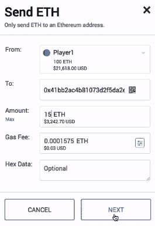

以下屏幕截图显示了反映了发送的资金和交易费用，或者说是气体费用的余额：

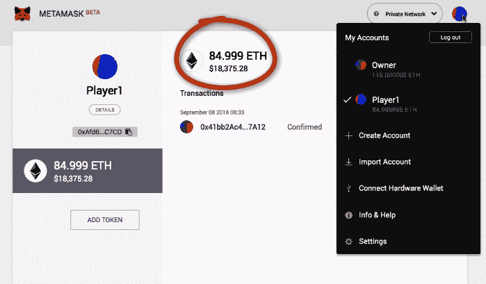

而且，如果我们切换到所有者账户，那么这 15 个以太币已经添加到那里，总计为 115 个以太币：

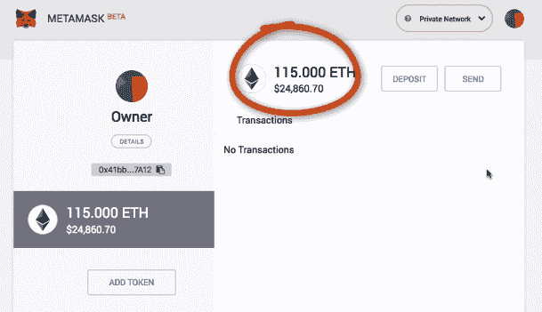

1.  而且，如果我们回到 Ganache，你会看到余额反映在 Ganache 网络本身中：

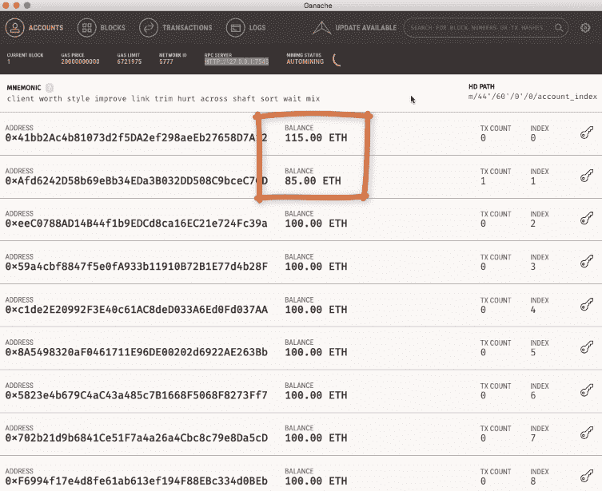

现在我们已经安装了 MetaMask，我们可以创建并签署我们游戏所需的交易。尽管其中有一些微妙之处，比如气体，起初这似乎没有任何意义：气体与以太坊交易有什么关系呢？好吧，我们将在下一节中找到答案。

# 理解气体价格和气体限制

本周早些时候，我们了解到我们的智能合约函数在**以太坊虚拟机**（**EVM**）内运行。这个概念的有趣之处在于，你的交易、函数和代码在计算机上运行，但不是你的计算机。这给了你无限的可扩展性概念，对吗？好吧，惊喜的是，这并不是免费的。这就像你租用你居住或工作的地方，并向房东支付这样做的能力一样，同样地，当我们的合约在以太坊网络上的 EVM 中执行时，我们必须支付我们所使用的计算资源。这被称为**气体**。

在传统应用程序中，你要么托管你自己的数据库服务器，要么利用第三方 SAS 应用程序，并且你会自己支付费用。然而，在以太坊交易中，用户支付这笔费用，因为他们是执行交易的人，即使你可能从中受益： 

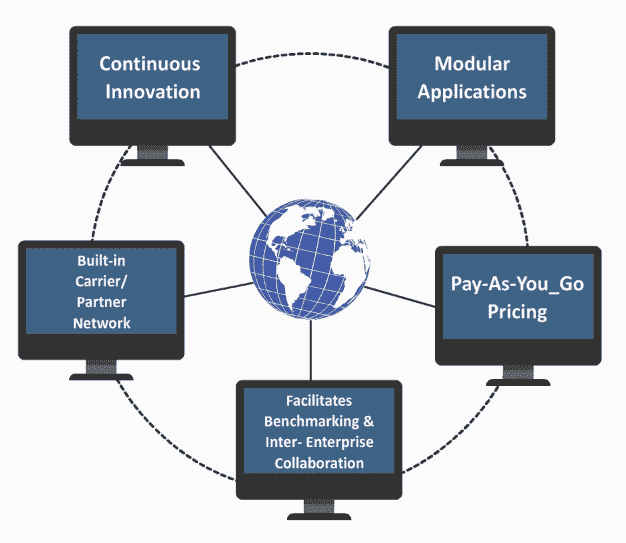

# 以太坊气体

这可以被视为类似于交易费用，但它不是一个固定费率，这是因为我们正在为在区块链上执行交易所需的计算资源付费。这个交易可以是简单的货币转账，也可以是构建到你的合约中的复杂业务逻辑的复杂处理，对于这些情况，所需的计算资源量是不同的，因此支付的气体量也是不同的。

# 气体价格

使用的气体量被跟踪，然后以以太币支付给矿工，这就带来了气体价格。气体价格是你愿意为每单位消耗的气体支付的以太币数量；你可以将其设置为任何你想要的值，同样地，矿工可以选择忽略低于其设定气体价格的任何交易，这使得他们能够跳过对他们而言不会有利可图的任何交易的处理。如果你将你的气体价格设置得太低，矿工们将会忽略它，你的交易将永远得不到确认并被写入区块链。

下面的步骤向你展示了实际情况：

1.  让我们从一个账户向另一个账户发送以太币：

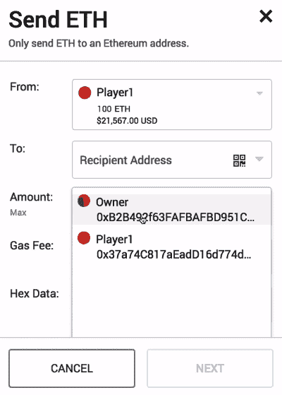

1.  在这里进入气费部分，将气价调到1确认：

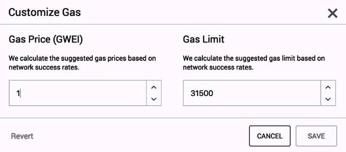

1.  在这里，你可以看到它已经提交，但实际上还没有得到确认：

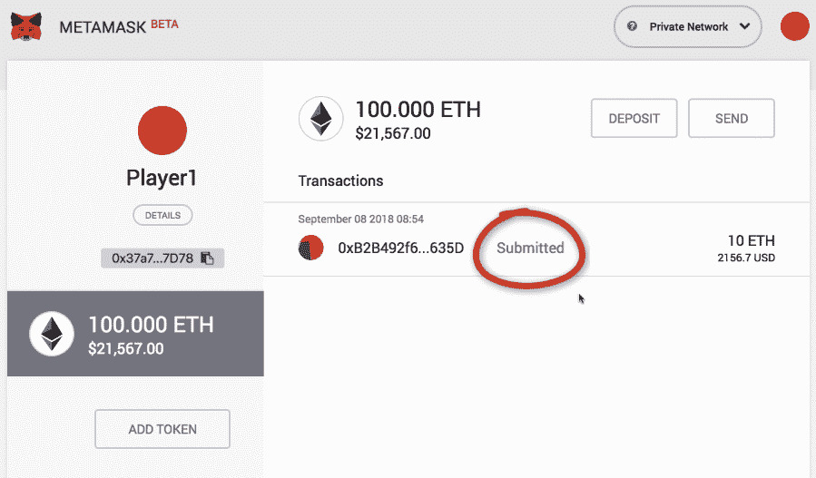

并且，它的状态会停留在已提交，因为没有矿工会接受它，因为设定的气价比他们愿意接受的要低。如果我们点击MetaMask图标，然后在这里的交易中，它会告诉我，如果我想让那笔交易成功的机会更高，我可以增加气价。那么你应该设置多少气价呢？嗯，MetaMask实际上做了估算气价的很好的工作，你应该在这里设置一个合理的值，因为气价乘以气费就是你要支付的交易费。

如果你设置的气价太低，就像我们刚刚看到的那样，没有人会处理你的交易，如果你设置得太高，你将支付过多的交易费。还有一个气限，那就是你的交易可以消耗的最大气量。所以，实际上可以设置得更高，因为你只支付实际完成的工作；如果你设置了高气限，而没有全部消耗，剩下的气会退还给你，但如果你的交易达到了气限，但在你的交易中仍然有更多的工作要做，你的气用完了，这算作一笔失败的交易。所以，矿工实际上已经做了你所要求的工作，当他们达到你愿意花费的最大气量时停下来；结果，交易失败了，你不会得到支付给矿工的以太币返还，因为他们做了他们说要做的工作。

所以，实际上有一个非常酷的网站叫做[eth gas站信息](https://ethgasstation.info/)，你可以用它来查看当前的气价。使用这个，你可以很好地了解你应该支付多少气价，以及矿工要花多长时间以该价格确认你的交易：

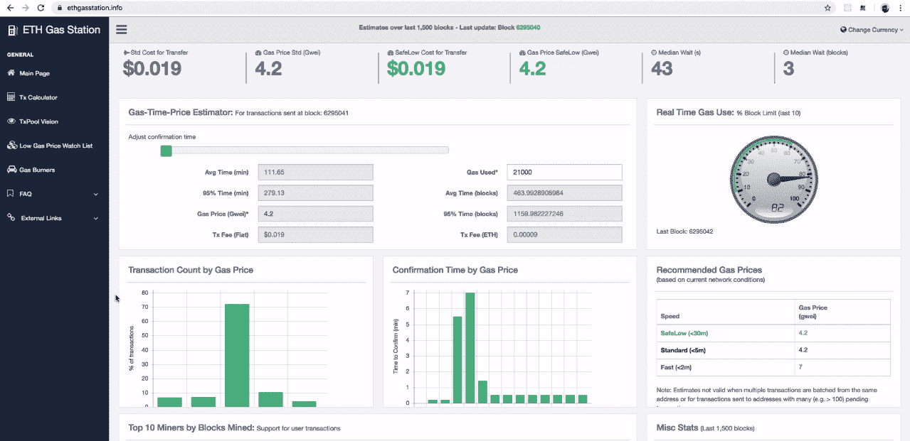

所以，现在，我们可以成功地进行交易，并且可以做出好的财务决策来控制我们的成本，但是在我发送了那笔交易之后会发生什么？一切顺利吗？嗯，可能是可能不是。在接下来的部分，让我们学习如何通过在以太坊网络上验证区块链交易来区分，从而了解每种情况之间的区别。

# 查看以太坊网络上的区块链交易

好了，我们已经看到如何使用钱包签署交易，现在我们知道了燃气、燃气价格和燃气限制是什么，但还有一个小问题。假设我卖了一些东西得到了 10 个以太币，但买家设置的燃气价格太低，以至于我永远无法得到那笔交易。我们在上一节看到买家会在他们的钱包中看到交易未确认，但我呢？我怎么能确定这笔交易会成功呢？好吧，我可以使用网站 [etherscan.io](https://etherscan.io/) 来查看交易的区块高度。区块高度是指写入区块链的区块数，自包含您的交易的区块以来。

让我们在这里停下来一分钟，回顾一下区块链的工作原理。所以，交易由矿工验证，然后写入一个区块，后续区块写入到那个区块的末尾，包含您的交易的区块之后的区块数称为 **区块高度**。区块高度越大，您的交易被回滚的可能性就越小。目前每 12 到 15 秒挖掘一个区块，所以很快就可以得到一些确认。但是对于大额交易，建议至少等待六次确认才考虑交易成功。

让我们看看通过交易 ID 就能在以太坊区块链上获取的其他信息。现在，这是来自网站 [etherscan.io](https://etherscan.io/) 的信息，它是以太坊区块浏览器。在这里，您可以通过以太坊地址、交易哈希、区块和一些其他参数进行搜索：

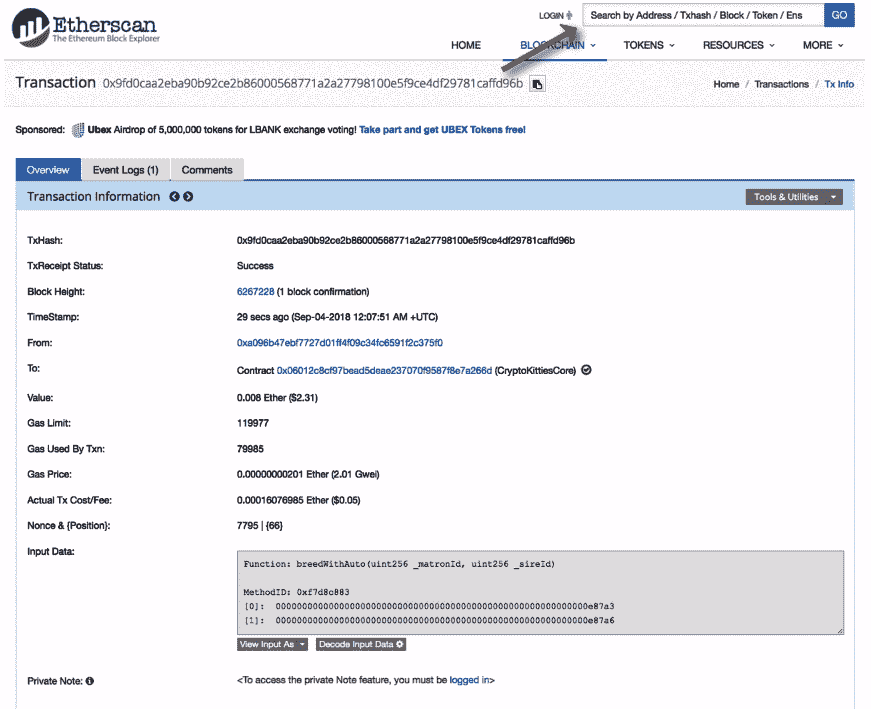

我用这个的其中一项用途是追踪一笔交易。例如，我们知道以太坊网络上的每笔交易都会产生一个唯一的交易 ID，我们可以输入该 ID 并查看该交易的详细信息。我们有交易状态，无论成功与否，区块高度（你现在知道这是自这笔交易被包含在区块链中以来已写入的区块数），以及交易的发起方和接收方；在这种情况下，交易是发送到了 CryptoKiddiesCore 合约，我们还可以看到发送了多少以太币，燃气限制，已使用的燃气，燃气价格和成本：

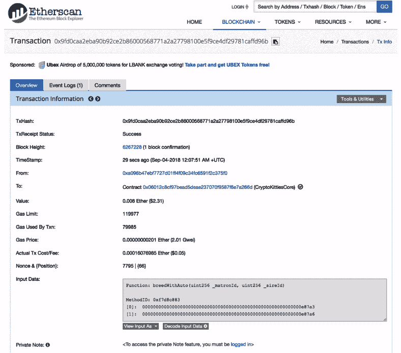

这里有一件有趣的事情：每个以太坊地址都是一个超链接，所以我可以点击这个链接，查看 CryptoKiddiesCore 合约的所有交易。我可以看到合约余额，合约所有者，甚至 ERC 20 和 ERC 721 代币，以及合约代码本身：

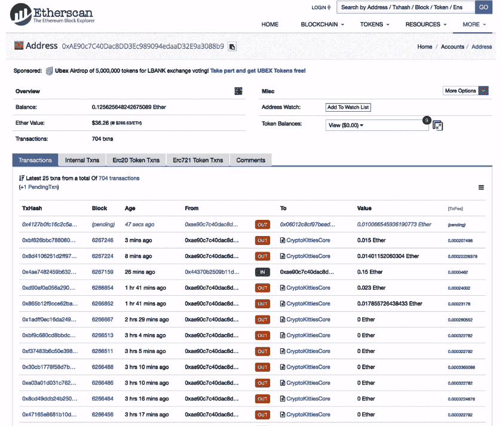

你也可以点击任何发送交易给合约的地址，查看从该地址发出的所有其他交易。这就是为什么以太坊被称为伪匿名而不是匿名的原因；所有的交易都是公开的，但我们不知道这个个人的真实身份。Etherscan 还为常见的测试网络 Ropsten、Kovan 和 Rinkeby 提供了网站，这使得在解决自己本地 Ganache 网络之外的交易时，它成为一个非常有用的工具。有了这些信息，你能够在采取任何交易行动之前验证以太坊网络上的任何交易是否有效和确认。所以现在，让我们更深入地了解在线和离线钱包，这样你就能更好地理解它们的工作原理。

# 理解在线和离线钱包

在这一部分，我们将学习关于在线和离线钱包的知识，因为这是一个相当令人困惑的概念，我想确保在把你培养成区块链开发者之前，你对它有扎实的理解。

# 分布式账本

我想引用区块链中用来描述技术的术语，分布式账本，特别是“账本”这个词。账本并不新鲜；它们已经存在了几个世纪，用来记录人与人之间的交易，它们只是对交易的书面描述，资金来自谁，去向谁，以及多少。通过查看这个账本，你可以清楚地看到1836年这家摄影企业发生了什么，如果这个人把所有的钱都记录在同一个钱包里，我们就能从这个账本中确切地知道他的钱包在任何一天有多少钱：

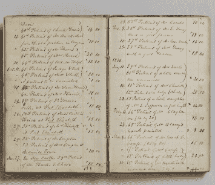

# 多个账本

区块链是一个分散的账本，这意味着我们不是有一个小破旧的笔记本，而是在世界各地的计算机上有多个数字副本存储着这个账本。你能够向这个账本写入新的条目的唯一方式是拥有私钥来为你的账户签署交易。这个账本的管理者，矿工，不知道你的私钥，但他们可以验证签名来自你使用的公钥：


# 纸钱包

您的钱包是保存您的私钥的技术部件，而这个技术部件可以简单到一张纸，因为您只需要使用您的钱包的种子短语就能进行交易。您已经看到了如何在 MetaMask 中操作，因此您完全可以将种子短语离线保存在一张纸上，在需要进行交易时将其输入到 MetaMask 中，然后从 MetaMask 中删除该账户。没有将您的信息放在线上比不上这种方式提供的安全性更高。同时，如果这是您的在线业务使用以太坊的账户，您的业务可以在线上持续运作，全天候工作，您业务赚取的所有资金将被记录在去中心化的分类账中，您可以放心这些资金在您需要时会在那里。离线钱包的缺点是方便性；每次想要进行交易都需要设置一个钱包，这肯定不方便，并且您可能不想随身携带这张小纸条到处走。我是说，如果您在雨天跌进了水坑，它湿了会怎么办：


# 硬件钱包

硬件钱包（像是Ledger Nano）提供了与纸钱包类似的安全级别，但使用起来更加方便。它们是受 PIN 码保护的加密设备，必须输入 PIN 码才能解锁。它连接到您的计算机，您可以使用软件钱包与硬件钱包进行交互。现在，这可能会让人感到困惑，因为术语“硬件钱包”似乎表明资金存储在钱包上，但实际上并不是。实际上存储在钱包上的是用于签署与钱包地址相关的交易的私钥。创建的任何交易都会发送到区块链，其中您的账户的分类账会得到更新；这意味着一旦您将硬件钱包从计算机上拔下来，就没有任何其他交易可以从您的账户上进行。硬件钱包也有一个种子短语，就像我们在 Ganache 中使用的那样，所以您可以将种子短语写在纸钱包上，如果此设备损坏，可以使用种子短语将其恢复到新设备上：

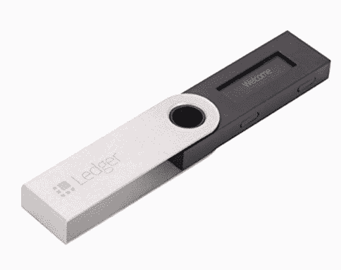

完全相反的是在线钱包。正如我在第一节中提到的，如今 Coinbase 在这一领域是无可争议的领导者；看一下他们的网站，这是全球每个互联网用户都熟悉的界面。互联网上的任何人都曾经填写过类似于此的表单来创建账户，使用像 Coinbase 这样的在线钱包还带有其他一些功能：

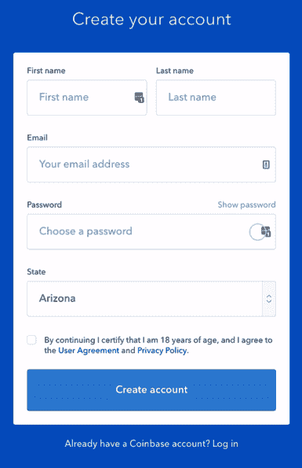

如果您忘记了您的凭据，您可以重置它们：

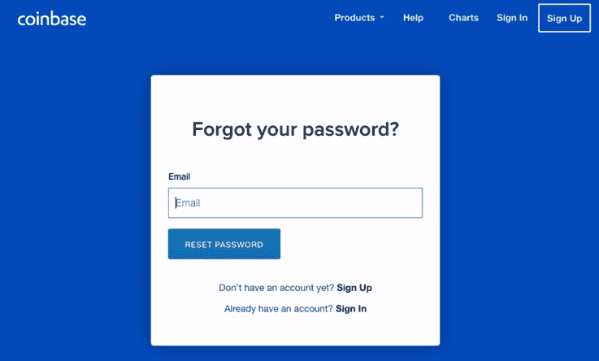

在这里，您还可以免费获得一些高级功能，例如每次交易后都会获得一个新的钱包地址，以防止有人建立您账户的完整财务档案，就像我们在上一节中使用区块链浏览器看到的那样：

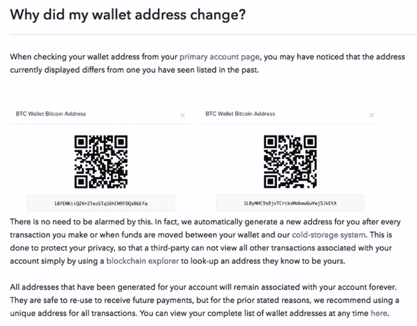

尽管如此，您并不拥有也无法访问您账户的私钥；这意味着您账户的安全最终由钱包提供者控制，如果发生了什么，您完全依赖于他们来解决。 现在，这并不是一个全新的概念，也不是加密货币独有的； 它与您当前拥有的其他每个金融账户的工作方式完全相同：您的银行账户，您的储蓄账户，股票所有权和退休计划。 其最大的弱点实际上是其最引人注目的特点，因为它的运作方式与我们习惯的其他金融工具相同，这种熟悉感降低了新用户的进入门槛，但以牺牲安全性为代价：

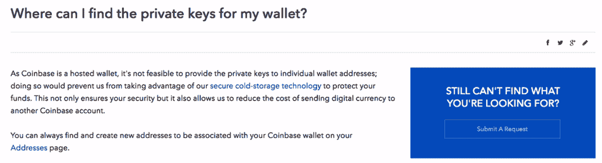

# 移动和桌面钱包

在纸钱包和在线钱包之间，我们有桌面和移动钱包，比如 MetaMask。 MetaMask 是一个浏览器插件，安装方式与用户熟悉的任何其他软件相同；这降低了新用户的门槛，即使他们不理解底层技术。 与 MetaMask 钱包关联的私钥存储在安装它的计算机上，并且还加密了，只有知道您的密码的人才能访问它。 但是，计算机会崩溃，对吧？ 嗯，有了 MetaMask，您可以备份该私钥，这样您就可以将其恢复到另一台计算机上，甚至可以在多台计算机上使用它。 MetaMask 对我们这本书的最重要功能是它与浏览器集成，这为我们创建的 DApp 和用户的以太坊钱包之间提供了无缝交互，以及为用户提供了额外的安全级别，因为我们没有直接访问他们的钱包，而是创建了一个交易，MetaMask 会向用户呈现交易，并提供确认和签名交易或拒绝交易的选项。 好吧，事实是：您不必选择其中一个钱包，您可以同时使用它们并创建一个个性化的钱包系统，以提供所有功能的最佳体验。

您可以拥有一个 Coinbase 帐户，用于购买诸如以太坊之类的加密货币，一旦您拥有了以太，您可以将其中的一部分转移到钱包，例如 MetaMask，在那里可以与 DApp 进行交互，并且您要持有的任何以太均可以发送到硬件钱包进行存储，您可以将 MetaMask 钱包和硬件钱包都备份到纸钱包中，这些纸钱包存储在不同的物理位置。这为您提供了像 Coinbase 这样的在线钱包的便利性，使用 MetaMask 这样的 DApp 轻松交互，使用硬件钱包安全存储大部分加密货币，以及使用纸钱包备份的故障安全性。这是一种全面而彻底的管理策略，也是我使用的确切策略。以下图表描述了 Coinbase 与 MetaMask：

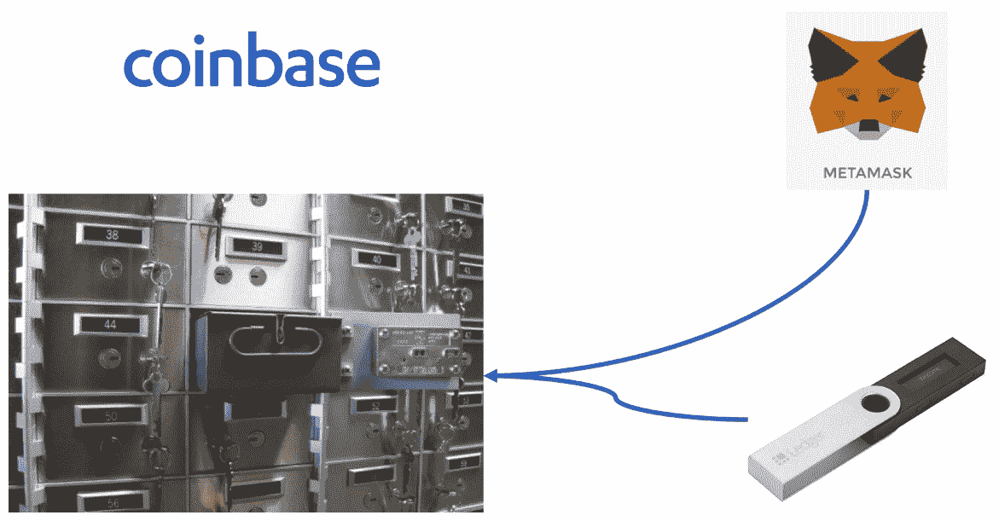

使用您在此处学到的不同类型的钱包，您可以创建一个综合性的钱包策略，平衡适合应用程序角色的安全性和易用性。当您开始自己创建 DApp 时，我鼓励您在您的 DApp 中包含这样的策略和信息。去中心化应用程序还处于起步阶段，对于绝大多数用户来说，您的 DApp 可能是他们与之进行的第一次交互，因此他们不会拥有这种知识。将其作为您的入门流程的一部分包含进去，确保他们知道如何保护他们的资产，并降低了进入门槛。还有一件事情要讲述：我们的应用程序如何知道 MetaMask 的存在？因此，让我们跳到今天的最后一节来找出答案。

# 注入 Web3 提供程序

因此，我们已经了解了 MetaMask 如何创建和签署交易以及如何管理帐户，但我们还没有讨论我们的应用程序甚至如何知道 MetaMask 的存在。

以下屏幕截图显示了应用程序容器，这是我们应用程序启动时加载的主要容器：

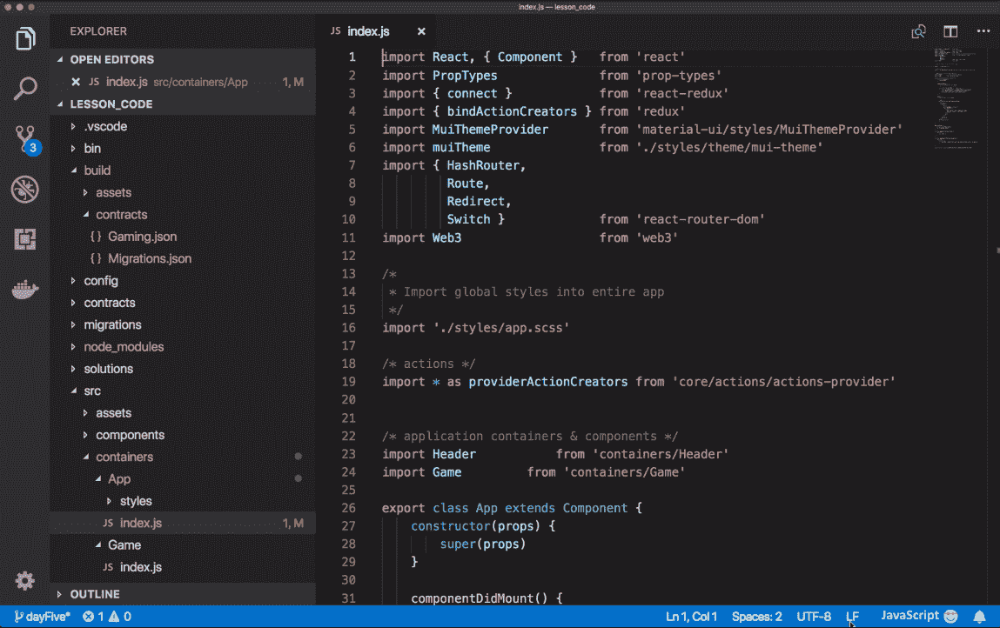

如果我们在这里看一下 `componentDidMount`，我们会检查 `window.web3` 是否已定义；如果已定义，这意味着用户已加载 MetaMask 并将 Web3 提供程序注入到浏览器中：

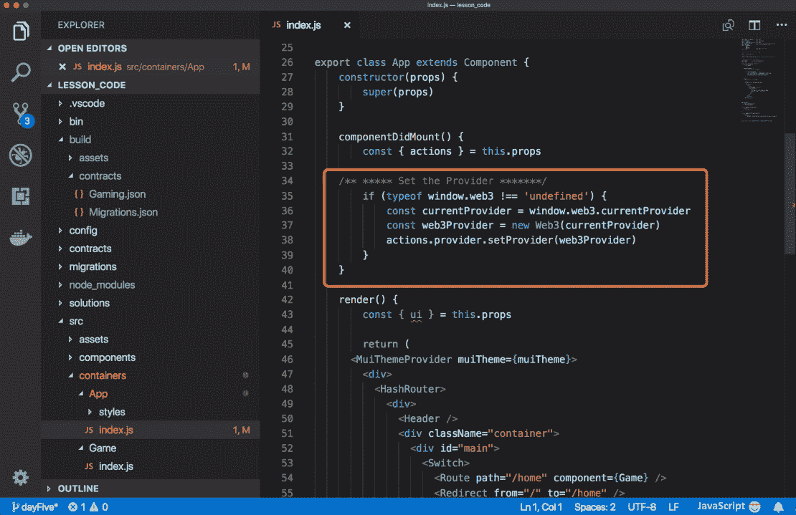

目前，MetaMask 会在此时提示用户允许 MetaMask 注入到浏览器中。他们这样做的原因是因为区块链的核心原则之一是安全性，如果您能够从任何 DApp 中读取他们的账户信息，他们可能不希望这样，因此我们稍微改变了一下，以便在您允许从以太坊账户中读取任何内容之前，必须首先提示他们并获得他们的许可。在这里发生的是，我们检查 MetaMask 是否已将 Web3 提供程序注入到浏览器中；如果是，那么我们将设置一个名为 `currentProvider` 的变量，该变量等于 Web3 提供的当前提供程序。现在，这里对你来说会看起来非常熟悉，因为我们在整个游戏中都使用了相同的动作减少器模式。

我们将调用提供程序动作。看一下以下截图：

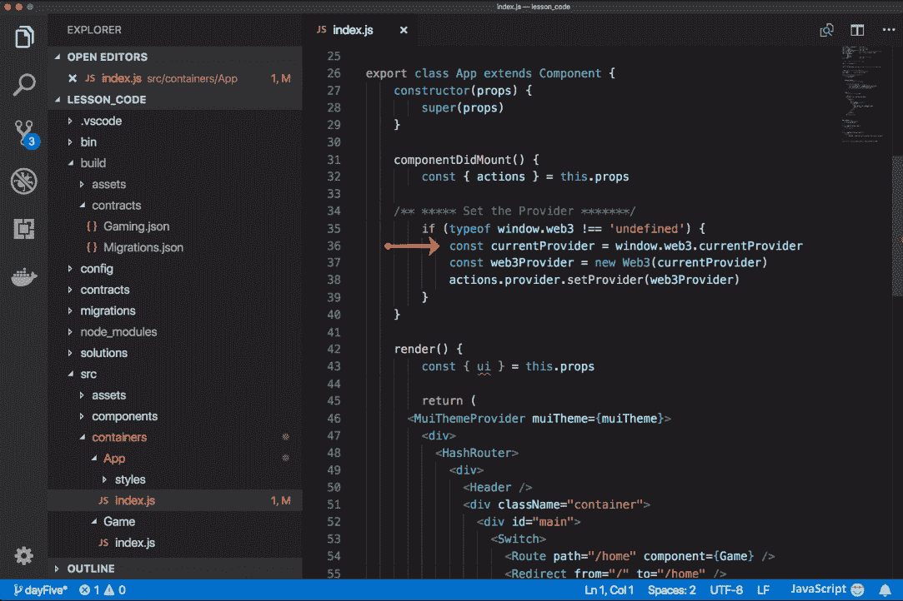

所以，如果我们在这里看一下，`ProviderActionCreator` 函数来自 `core/actions/actions-provider`：

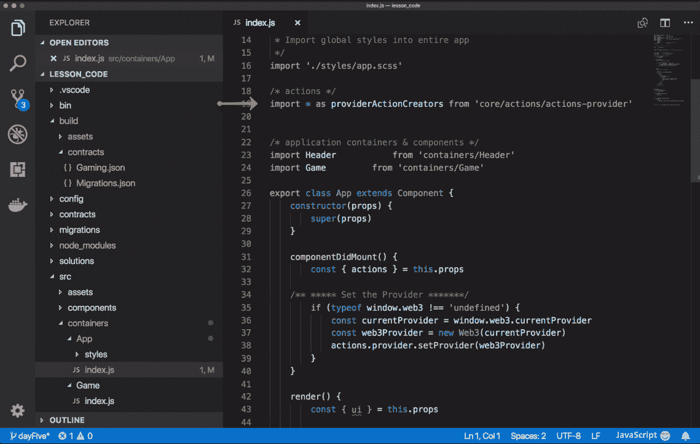

在这里，我们将调用 `setProvider` 函数：

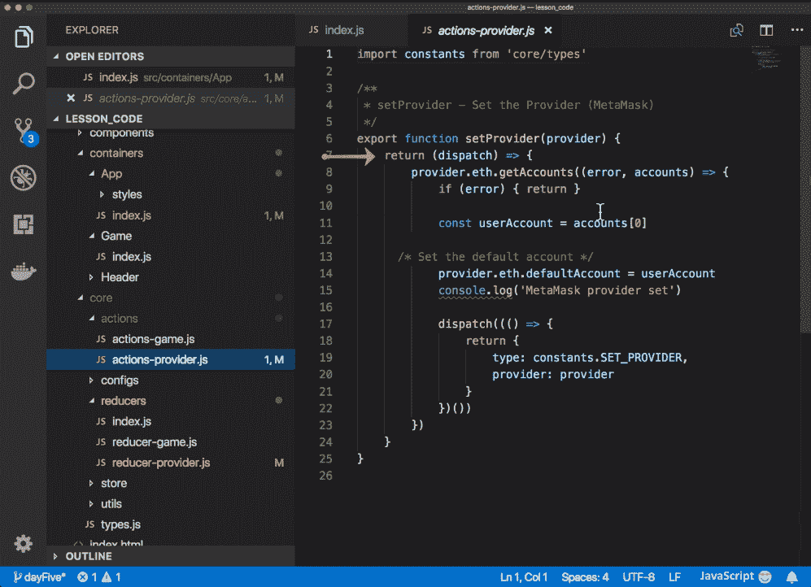

在这里，我们有 `setProvider`，它将返回一个 dispatch，从提供程序调用 `getAccounts` 方法：

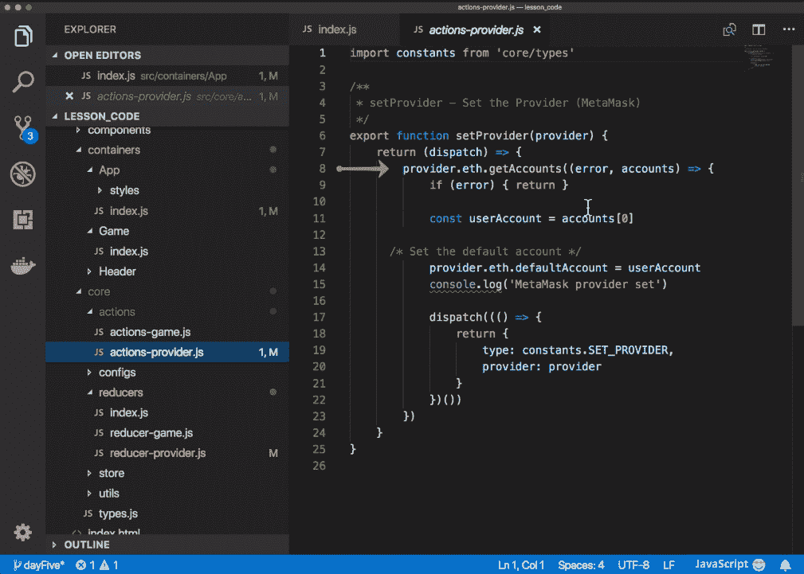

这将分派到 reducer provider。现在，reducer provider 将获取我们从 Web3 中获取的提供程序，并将其保存到 Redux 存储中：

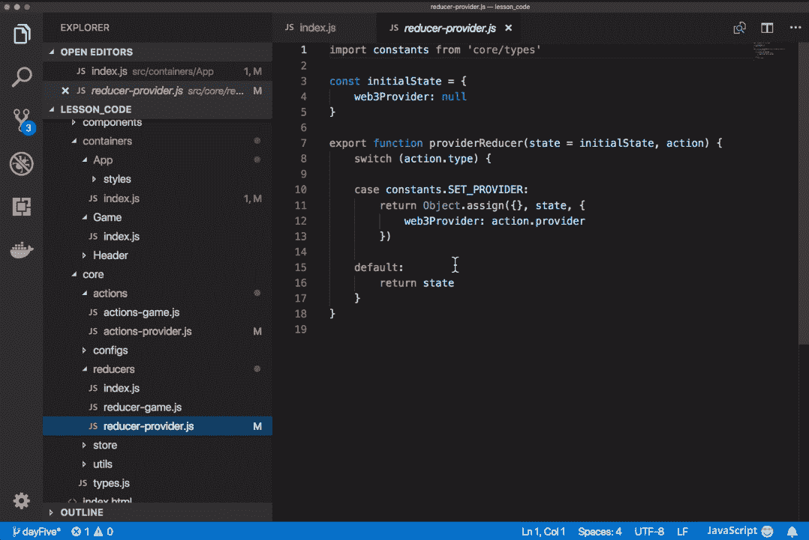

一旦保存到我们的 Redux 存储中，如果我们看看我们的 `actions-game` 提供程序，每当我们调用 `playRound` 时，你会发现我们正在调用 Redux 存储中的 `web3Provider`。然后，我们调用 `setProvider` 方法，该方法从注入的 Web3 实例中获取当前提供程序，然后我们在应用程序的其余部分中使用它来进行以太坊调用我们的合约：

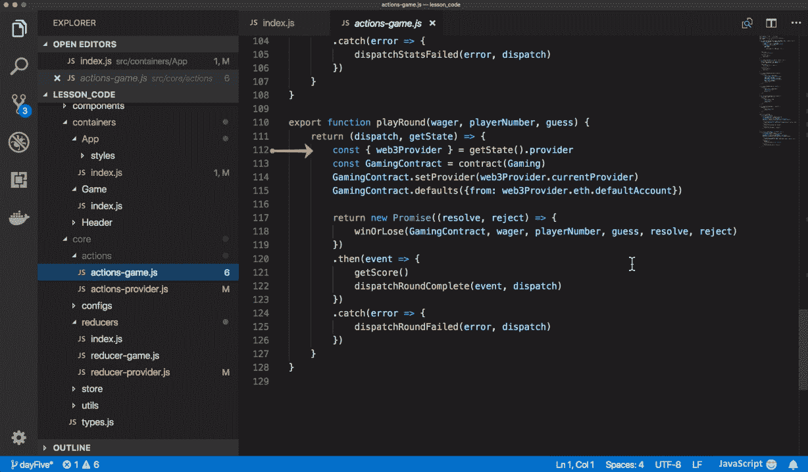

所有这些都发生在应用程序加载并且组件挂载时，我们检查 `web3Provider` 是否已经被注入到浏览器中；如果是，我们调用一个动作来获取该 `web3Provider`，将其分派给减少器，然后减少器将该提供程序保存到 Redux 存储中，这使其在我们的游戏中可用于进行以太坊交易调用：

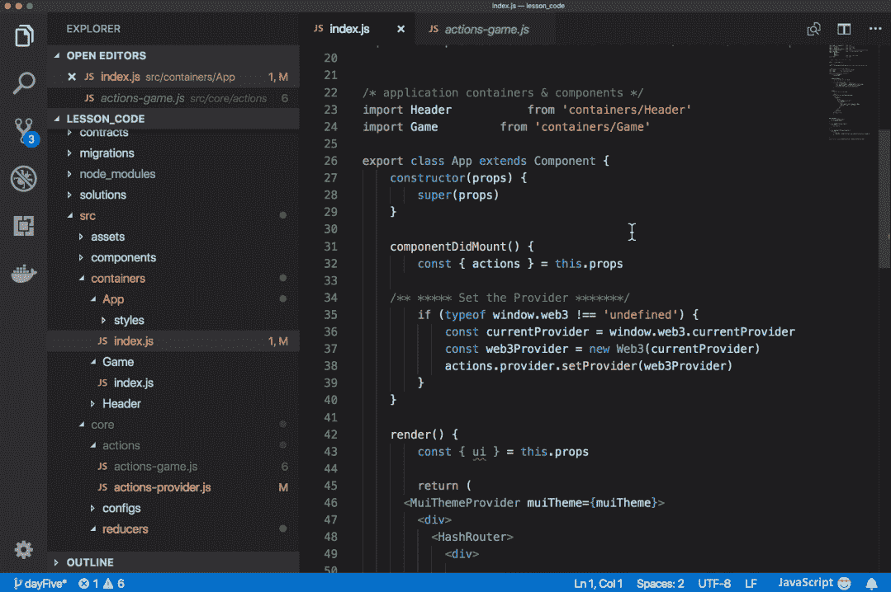

现在，让我们来看一下今天的作业，你将安装和配置 MetaMask 以与我们的 DApp 交互。

# 任务

好了，这一章，我们为你的游戏创建了一个记分牌；现在，是时候玩一场游戏并测试一下了。

对于今天的任务，以下是你需要做的事情：

1.  安装 MetaMask。要这样做，您将转到 [MetaMask.io](https://metamask.io/) 并按照说明操作，就像我们在之前的章节中所做的一样。请记住，您需要使用 Chrome、Brave、Firefox 或 Opera 浏览器才能使用 MetaMask。

1.  接下来，启动 Ganache 并复制助记词。

1.  使用助记词在 MetaMask 中设置您的帐户，并且 MetaMask 应该默认连接到主以太坊网络，所以您需要将其配置为使用 Ganache。

1.  一旦正确完成了这些步骤，您将会看到来自 Ganache 和 MetaMask 的帐户余额，然后您需要部署您的合约。

当您这样做时，很可能会看到这个错误，让我们看看它的意思：

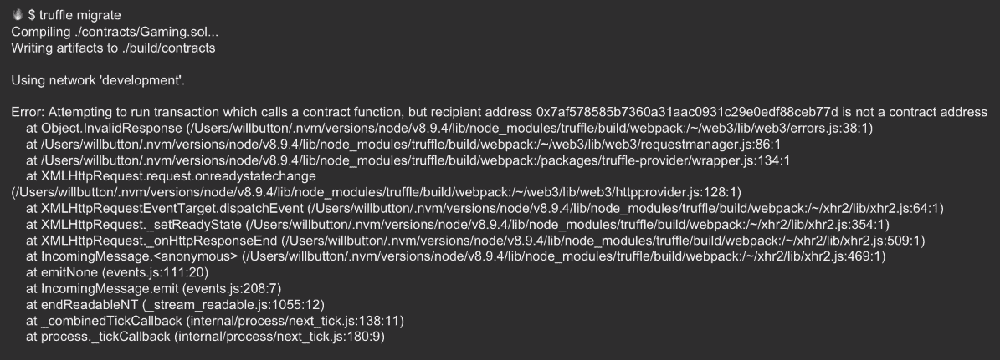

关键行在于，试图运行交易，但接收地址（...）不是合约地址。这告诉我们的是，您以前使用这个配置部署了此合约，但部署的地址在此网络上不存在。这个错误是为了防止您无意中在同一个网络上部署多个实例的合约，这不是一件好事吗？如果那样做了，您怎么知道网络上哪个合约是正确的呢？

在这种特殊情况下，忽略这个错误是可以的；我们看到这个错误是因为我们重新启动了 Ganache，这会创建一个全新的网络，因此上次运行 Ganache 时部署的合约确实不存在。

所以，要解决这个错误，运行以下命令：

```
truffle migrate -- reset 
```

现在，您可以玩几轮游戏了。

检查昨天构建的记分板是否根据正确的变量更新，并检查当您赢得或输掉几轮时，MetaMask 中的帐户余额是否正确更新。我们的应用程序现在已经完成并且正常运行；但是，它只在您的本地工作站上运行，对吧？

# 总结

在本章中，我们学习了关于钱包的所有知识，它们的类型以及所涉及的安全性。然后，我们了解了 MetaMask，这是我们将在应用程序中使用的钱包。接下来，我们研究了以太坊的燃气工作原理以及如何使用它。之后，我们探讨了不同类型的在线和离线钱包。最后，我们学习了如何为我们的应用程序向以太坊注入 Web3 提供程序。

在下一章中，我们将看看如何将我们的合约部署到公共以太坊网络，并使用 AWS 将我们的用户界面部署到公共服务器上。
