# 第七章：第七天 - 部署到网络

好了，这是第七天，也是我们书的最后一天。我们有一个可用的 DApp，今天，我们将通过将合同部署到 Ropsten 测试网络，并使用**亚马逊网络服务**或**AWS**公开我们的 UI，来将其推向最终阶段。

本章涵盖以下主题：

+   理解 UI 和智能合约的作用

+   将智能合约部署到以太坊网络

+   在测试网络中获得以太币

+   将 UI 部署到 AWS

# 理解 UI 和智能合约的作用

测试网络就像其听起来的那样——它是一个供您使用的公共以太坊网络，但在这些网络上使用的以太币并不真实，有点像纸币。因此，主要有三个以太坊测试网络，它们分别是：

+   Kovan

+   Rinkeby

+   Ropsten

这些测试网络的运行方式各有不同，所以让我们重点介绍一下它们各自的功能。这将帮助您决定在未来的项目中要使用哪个网络。

Rinkeby 使用**权威证明**（**POA**）共识协议，这意味着不是每个人都可以在该网络上进行挖矿，只有经过批准的矿工才能够。这使其能够抵抗垃圾邮件攻击，结果是更稳定的测试网络。它还支持 Geth 以太坊客户端，但不支持 Parity。到目前为止，我们一直在使用 Ganache，因为它既提供了我们的本地区块链网络，又提供了我们的客户端，这使我们更容易专注于开发。

Ganache 不能作为公共以太坊网络的客户端，这就是 Geth 和 Parity 的作用。我将在本章的后面向您展示如何安装和配置 Geth。

Kovan 也是一个 POA 网络，这意味着您不能在那里启动自己的挖矿服务器并进行以太币挖矿。此外，Kovan 不支持 Geth，而是支持 Parity 客户端。

最后，我们有 Ropsten，它使用**工作量证明**（**POW**）作为共识算法，任何人都可以在该网络上启动一个挖矿服务器。因此，它容易受到垃圾邮件攻击，因此网络性能有时可能会有些不稳定。但值得使用，因为它与主要以太坊网络完全相同——因此当您在这里进行测试时，您就在一个与您在生产中将要使用的环境完全相同的环境中进行测试。它还同时支持 Geth 和 Parity。

我们可以通过以下表格总结这三个网络的优缺点：

| **网络** | **共识协议** | **Geth** | **Parity** |
| --- | --- | --- | --- |
| Rinkeby | POA | Yes | No |
| Kovan | POA | No | Yes |
| Ropsten | POW | Yes | Yes |

我们将使用 Ropsten 网络来部署和测试我们的合同，因此让我们高层次地了解一下我们在谈论部署时在讨论什么。  

到目前为止，我们所做的一切都是在您的本地工作站上完成的。UI 是在本地使用 Node.js 运行的，Ganache 在本地提供以太坊网络，它们在您的工作站上进行交互：

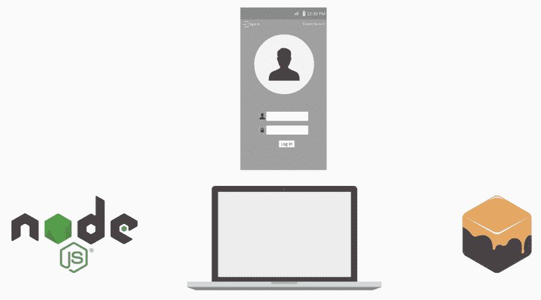

当我们谈论部署时，我们谈论的是将你的 Solidity 合约编译并迁移到公共测试网络，并将你的 UI 代码推送到公共服务器。因此，当您在测试网络上测试您的 DApp 时，您使用本地计算机上的浏览器查看部署到 AWS 的 UI，而 AWS 知道如何使用 Geth 客户端与以太坊测试网络上的您的合约进行通信。以下图表显示了这是如何工作的：

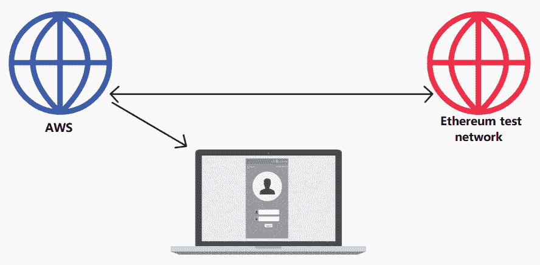

将代码从本地工作站推送到公共服务器和网络的过程有时被称为**部署流水线**。现在，让我们看看如何将我们编写的合约部署到公共以太坊网络。

# 将智能合约部署到以太坊网络

在前面的部分中，我们了解了三个可用的以太坊测试网络，以及我们的游戏在本地操作与部署时的差异。现在，让我们将我们的合约部署到 Ropsten 测试网络。在我们的代码存储库中，我们有一个名为`truffle.js`的文件，它当前看起来类似于以下代码片段：

```
module.exports = {
  migrations_directory: "./migrations",
  solc: {
    optimizer: {
      enabled: true,
      runs: 2000
    }
  },
  networks: {
    development: {
      host: "127.0.0.1",
      port: 7545,
      network_id: "*" // Match any network id
    }
  }
};
```

`network`部分是我们的应用程序知道要与哪个网络通信的方式。我们定义了一个开发网络，如果您不告诉 Truffle 其他情况，它将使用此开发网络。主机设置为我们的 localhost，端口设置为我们本地 Ganache 安装运行的端口。最后，我们有一个网络 ID，当您在本地运行 Ganache 时，我们可以将其设置为使用任何网络 ID。

当我们部署到公共网络时，我们需要将 ID 设置为我们要部署到的网络相匹配的 ID。主要的公共网络是编号 1；这是你在将应用程序部署到生产环境时将使用的 ID。要部署到 Ropsten 网络，我们使用网络 ID 3；对于 Rinkeby，我们可以使用网络 ID 4；对于 Kovan，我们可以使用网络 ID 42。

所以，我们将回到我们的`truffle.js`配置文件中，然后，在网络部分中，我们将添加一个新的条目用于 Ropsten，如下面的代码片段所示：

```
    ropsten: {
      host: "127.0.0.1",
      port: 8545,
      network_id: 3,
    }
```

我们为它指定了我们将要使用的网络的 ID。主机将是本地主机的`8545`端口，我们刚刚了解到 Ropsten 网络的 ID 是 3，所以我们将它输入为`network_id`。

所以，如果您看一下代码，我们只是将其设置为本地主机上的`8545`端口，但我们没有任何东西在那里运行——怎么回事？

到目前为止，我们一直在使用 Ganache 作为我们的以太坊网络，并且它为我们处理了一切，但现在我们需要一种方法来与不是我们的以太坊网络进行通信。我们需要一个以太坊客户端，我们将使用 Geth。

# Geth

Geth 是用 Go 编写的以太坊客户端，您可以从[`github.com/ethereum/go-ethereum/wiki/Building-Ethereum`](https://github.com/ethereum/go-ethereum/wiki/Building-Ethereum)下载它。对于 OS X、Linux 和 Windows，都有可用的安装程序，以及 Docker 镜像。

有了 Geth 安装好了，我们可以从终端启动客户端。这是您将使用的命令：

```
$ geth --testnet --syncmode "light" --rpc --rpcapi db,eth,net,web3,personal,admin --cache=1024 --rpcport 8545
```

让我们解析一下这个命令以理解它。首先，我们有`--testnet`，它告诉 Geth 我们要使用 Ropsten 测试网络。接下来，我们用参数`light`指定同步模式。这告诉 Geth 我们只是想获取当前状态，我们不会处理交易或验证元素。如果需要验证任何内容，我们将联系网络上的一个完整节点。我们之所以这样做，是因为这是在您的工作站上运行客户端的最轻量级的方式，而不会消耗您可能需要用于其他应用程序的大量 CPU 和内存。我们使用`--rpc`标志在客户端中启用 RPC 模式，后跟`--rpcapi`标志和要启用的 API 列表，如下所示：

+   `db`：`db` API 允许我们读写本地数据库。

+   `eth`：`eth`参数提供对以太账户及相关功能（如账户、余额和交易）的 API 访问。

+   `net`：`net`参数提供与网络相关的 API 调用。

+   `web3`：此参数提供了我们的`web3`库。

+   `personal`：此参数提供 API 访问以管理密钥库中的私钥。

+   `admin`：此参数启用对 Geth 实例的细粒度访问。

我们的选择列表最后一个选项是一个缓存，大小为 1GB，并且我们将客户端设置为监听 TCP 端口 8545，这与 Ganache 不同，Ganache 使用的是 RPC 端口 7545。

然后我们按下*Enter*，这将启动客户端，并开始通过从测试网络下载当前块头来同步。您可以在输出截图中看到这个过程：

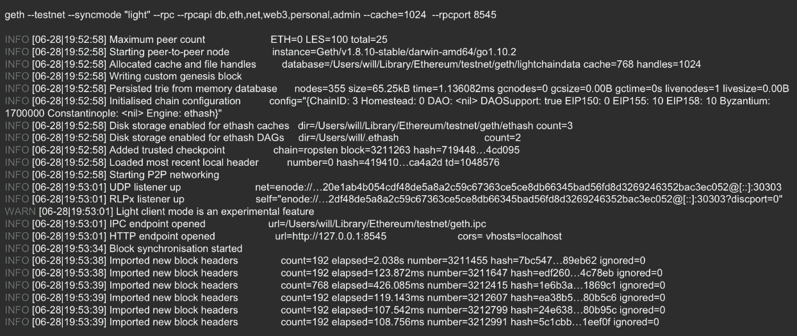

这需要一点时间才能完成。我们可以通过打开另一个终端会话来跟踪其进度，在那个窗口中，我们将输入以下命令：

```
$ geth attach http://127.0.0.1:8545
```

运行此命令将我们置于 JavaScript 控制台中，在那里我们可以与此客户端进行交互，如下截图所示：

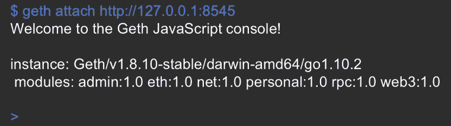

然后我们将执行以下命令：

```
web3.eth.syncing
```

我们将会得到类似以下截图的内容：

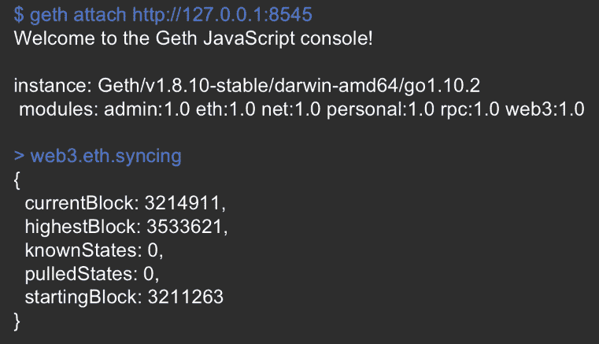

在这里，我们可以看到正在下载的当前区块是 3,214,911，而网络上的最高区块是 3,533,621。这意味着我还有大约 300,000 个区块需要下载，这将需要几分钟时间。

因此，目前我们已将 Truffle 配置为能够部署到 Ropsten 网络。我们已安装并启动了 Geth 作为 Ropsten 网络上的客户端，并且让其同步。现在，我们想将我们的 Solidity 合约部署到 Ropsten 网络，但这会创建一个交易，并且交易需要 gas，而目前我们没有花费的钱。这是因为我们的以太币在我们的本地 Ganache 网络上，现在我们使用的是 Ropsten 网络。这两个网络完全不同，因此您在其中一个网络中拥有的以太币与您在另一个网络上拥有的以太币不同。不过我们可以解决这个问题，而且其中的操作简单是我选择部署到 Ropsten 网络的原因之一。因此，让我们进入下一部分，我们将看看如何获取在 Ropsten 网络上使用的以太币。

# 在测试网络获取以太币

现在我们准备好将我们的合约部署到 Ropsten 网络，但我们没有任何以太币，所以让我们解决这个问题。

让我们回到浏览器，在 MetaMask 中，您可能连接到您的私人网络，因此请单击下拉菜单，并切换到 Ropsten 网络，如下所示：

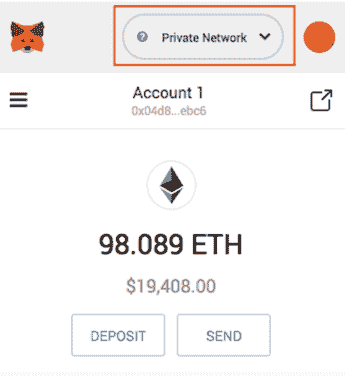

然后，在浏览器标签中，转到[faucet.ropsten.be](http://faucet.ropsten.be)。这称为水龙头，就像廉价旅馆内漏水的浴室水龙头一样，这个水龙头也会漏水。

不过，与每隔几秒泄漏水一样，这个水龙头泄漏的是以太币。水龙头会自动将您的以太坊地址从 MetaMask 填入文本框中，并单击“向我发送测试以太币”按钮，将向水龙头提交您的地址，然后水龙头会向您发送 1 个以太币。以下截图显示了水龙头窗口：

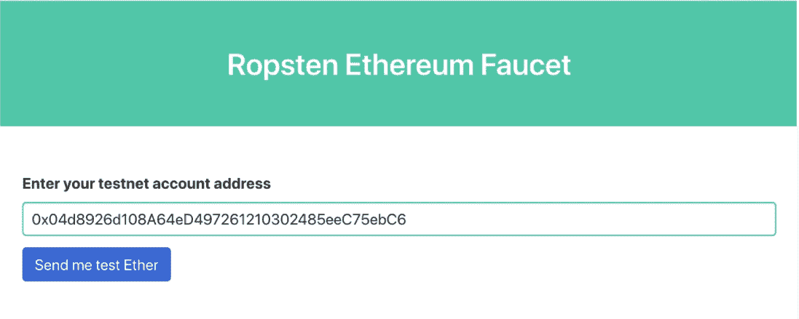

在这里需要知道的一件事是，水龙头每 30 秒只会滴下 1 个以太币，因此如果有排在您前面的请求，可能需要几分钟时间以才能在您的账户中显示以太币。您应该不断检查，因为它会显示出来，当它出现时，您现在有了一些零花钱，可以支付交易以将您的合约部署到 Ropsten 网络。

因此，我们现在有了一些以太币，我们想使用 Truffle 来部署我们的合约。并且，我们已经将 Geth 运行为我们的以太坊客户端，因此 Geth 需要访问我们在 Ropsten 网络上的账户，以便支付该交易。

为此，我们将单击 MetaMask 上的“详细信息”按钮，并导出我们的私钥：

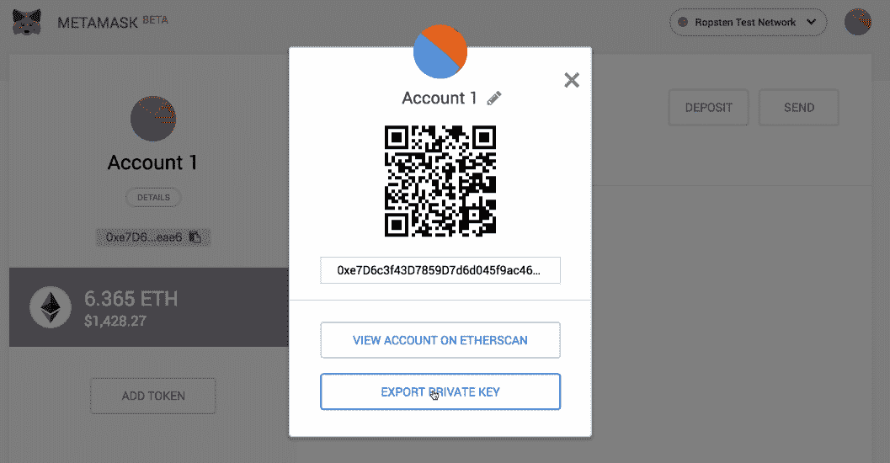

这里，我们将点击“导出私钥”按钮，这会提示您输入密码，这样会显示私钥。您应该将私钥复制到一个易于访问的文件中。

现在我们将运行以下命令：

```
web3.eth.accounts
```

这会产生以下输出：

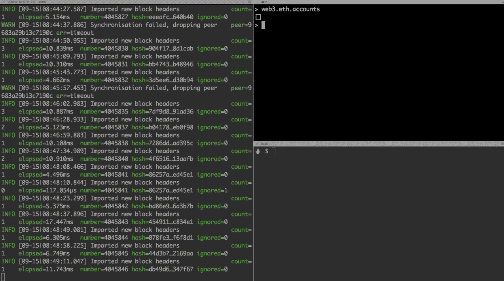

您可以看到当前在 Geth 中没有列出任何账户。所以，在一个新的终端窗口中，我们将导航到包含包含私钥的文本文件的代码目录，并在那里运行以下命令：

```
$ geth account import private.txt --keystore `/Library/Ethereum/testnet/keystore/
```

这将产生以下输出：

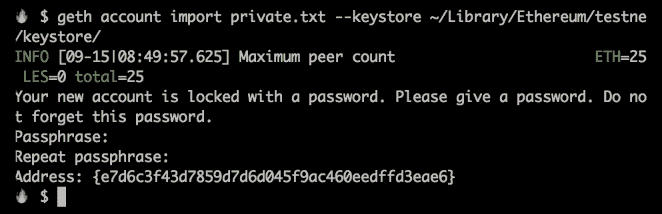

注意：上述命令适用于 OSX，如果你使用的是 Windows 或 Linux，请使用以下命令：

对于 Windows：`geth account import private.txt --keystore %APPDATA%\Ethereum\testnet\keystore`，以及

对于 Linux：`geth account import private.txt --keystore `/.ethereum/testnet/keystore`。

如果我们看一下那个地址的最后几位，`3eae6`，我们会发现它与我们在 MetaMask 中列出的账户的最后几位相匹配。

所以，现在我们将回到我们的 JavaScript Geth 控制台并再次运行账户命令。这次，我们会在这里看到我们的账户列出来：

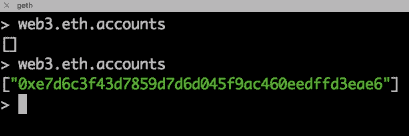

这是一个受密码保护的账户，所以我们需要为 Geth 解锁它。为此，请运行以下命令：

```
personal.unlockAccount(eth.accounts[0])
```

这将产生以下输出：

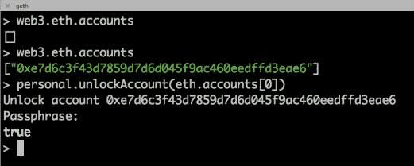

由于口令返回`true`，我们知道账户已成功解锁。这里的一个重要步骤是删除该私有文件，因为它包含私钥，你不想让它留在任何地方。

打开 `truffle.js` 文件，在 Ropsten 配置中，我们将添加一行新的内容，即 `from`，然后指定我们刚刚导入到 Geth 中的账户的地址。这将告诉 Truffle 在部署合约时使用哪个账户。

切换回终端，我们将运行以下命令：

```
$ truffle compile
$ truffle migrate --network ropsten
```

这将产生以下输出：

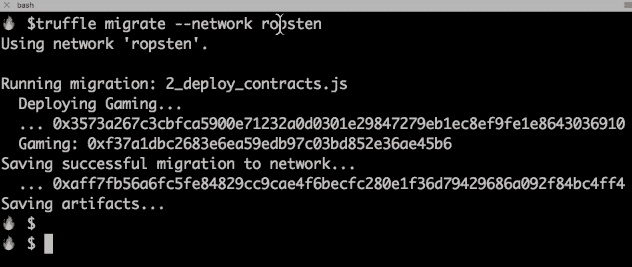

它看起来就像在 Ganache 上一样，它已成功迁移到网络上。

如果你想要测试一下，此时可以键入以下命令：

```
npm start
```

这将启动我们的 web 服务器，并将使用刚部署的合约，这样我们就可以对我们的神秘数字下注。以下截图显示了网页：

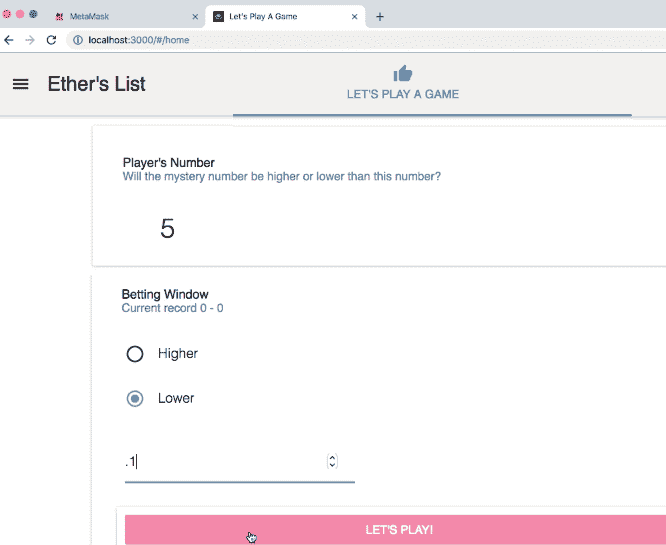

当我们下注时，我们会收到一个弹出通知：

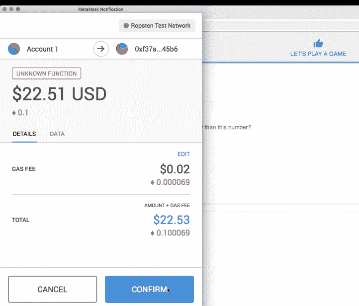

此窗口显示我们已连接到 Ropsten 测试网络，因此我们可以确认，并且如前面的截图所示，我们输掉了那笔赌注，所以，我的账户被扣除了我下注的 0.1 以太币。因此，我们成功地将我们的合约部署到了 Ropsten 网络，并且我们能够从我们的本地 UI 与之交互。本章的最后一个任务是将 UI 部署到 AWS。

# 将 UI 部署到 AWS

要将我们的游戏发布到世界上，我们需要将 UI 提供给互联网。我们将使用 Docker 和 AWS 来做到这一点。

如果您对 Docker 不熟悉，那么它是一个在操作系统级别执行虚拟化的工具，这被称为**容器化**。这意味着它将您的代码及其运行所需的一切打包到一个单独的容器中，该容器可以在 Docker 主机上执行。我们将使用 AWS **弹性容器服务**（**ECS**）作为我们的 Docker 主机。这使我们能够运行我们的容器，而无需构建或管理底层基础结构。

要构建 Docker 镜像，您需要安装 Docker 版本 18 或更高版本。如果您没有安装，可以从 [`docker.com`](http://docker.com) 下载，并确保您下载的是社区版，因为那是免费版本，但它包含我们所需的所有内容。

要创建我们的 Docker 镜像，我们将使用 Docker 文件。这是一组指令，指定如何构建容器。我们将逐步分解我们在此 Docker 文件中添加的内容。

我们首先定义我们的基础镜像。使用 Docker，您可以使用另一个 Docker 镜像作为您的镜像的基础，从而使您能够在其他人已经完成的工作基础上构建。在我们的情况下，我们需要 Node.js，所以我们将使用官方的 Node.js Docker 镜像。在 Linux 服务器上安装和运行 Node.js 的所有步骤都已经为我们准备好了。以下代码片段显示了我们在这里所做的事情：

```
FROM node:8.11.3-stretch
```

然后，我们使用`COPY`命令将当前目录中的所有内容复制到容器中名为`app`的文件夹中，并切换到该目录。之后，我们将设置一个名为`NODE_ENV development`的环境变量。当 Node 启动时，Node.js 将使用它。对于生产构建，您将其设置为`production`而不是`development`。以下代码片段显示了此操作：

```
COPY ./app
WORKDIR /app

ENV NODE_ENV development
```

接下来，我们将运行`apt-get install`，这是 Debian 命令来更新基础镜像并安装`git-core`，它允许从 GitHub 存储库安装一些我们的节点依赖项。然后，我们运行`npm install`命令来安装我们的 Node 应用程序的所有依赖项，如下代码片段所示：

```
RUN apt-get update && apt-get install -y git-core
RUN npm install
```

随后，`EXPOSE`命令在我们的 Docker 容器上打开 TCP 端口 3000，这允许我们在端口 3000 上连接到我们的网站。最后，我们有一个在容器启动时执行的命令，如下所示：

```
EXPOSE 3000

CMD ["npm", "start"]
```

所以，这相对来说很简单，因为我们基本上只是输入了设置应用程序的相同命令的 Docker 版本。所有这些都会被执行并保存到我们的 Docker 镜像中，当我们启动镜像时，将执行`npm start`命令。

现在，我们可以使用以下命令构建我们的 Docker 镜像：

```
docker build -t gaming:latest
```

我们提供`-t`标志以使用`gaming:latest`标签标记我们的镜像，末尾的点告诉 Docker 在当前目录中查找我们的 Docker 文件。这将执行我们放入 Docker 文件中的所有命令，并将输出存储为 Docker 镜像。

另一种构建镜像的方法是，如果你使用的是 Visual Code，你可以右键单击 Docker 文件，然后选择“构建镜像”。它会提示你输入镜像名称，即`gaming:latest`，然后按*Enter*，这将运行先前提到的相同命令。完成后，我们将登录 AWS，选择 ECS。这将带领您进入以下页面：

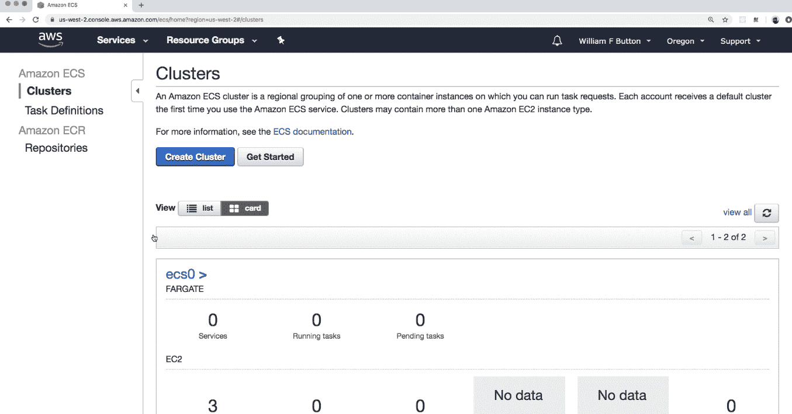

这里有几个不同的部分，我们将逐个讨论。让我们首先从存储库开始；把存储库看作只是一个容纳你构建的 Docker 镜像的桶。我们将它们放在亚马逊或 AWS 上，这样在部署此服务时，亚马逊就有了获取这个镜像的方式：

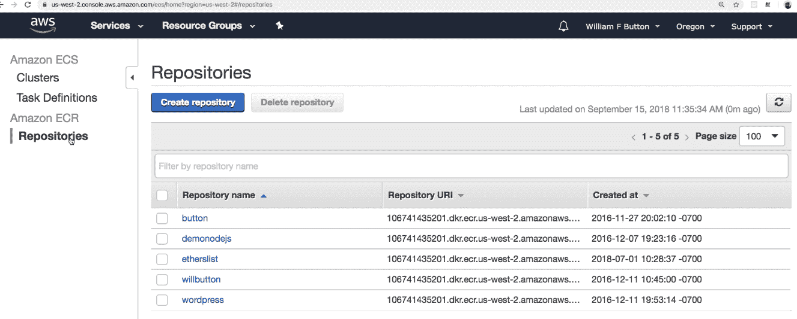

我们将创建一个新的存储库，并将其命名为我们的应用程序`gaming`。创建完成后，它将为我们提供 URL 以及我们将需要的命令：

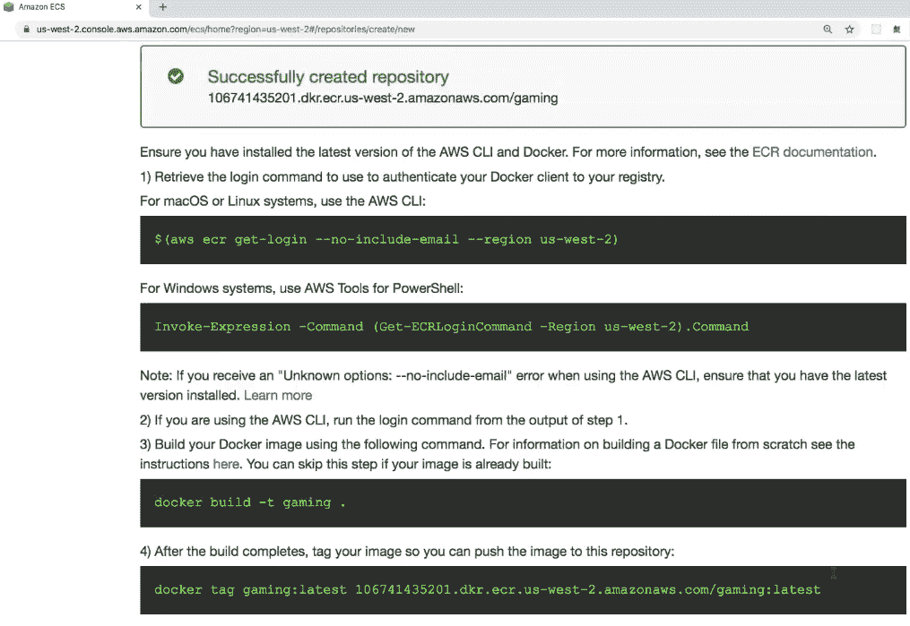

所以，我们要复制第一个命令，然后粘贴到终端中。这将执行 ECS 控制台的登录功能，或者 ECS 存储库的登录，因为除非你经过身份验证，否则无法推送到存储库。这样可以防止外部人员将他们的 Docker 镜像推送到您的存储库。

你可以看到，为了方便起见，它为我们列出了 Docker 构建命令，但我们已经完成了。所以，我们将转到下一个命令，给镜像打标签以供存储库使用。我们将运行这个命令，然后我们将获取最后一个命令，将我们的 Docker 镜像推送到存储库中。

上传完该镜像后，我们可以单击“完成”按钮，然后我们会在存储库中看到我们的镜像已列出：

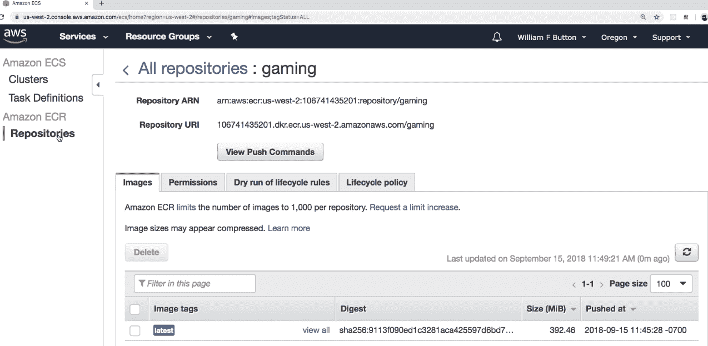

现在，我们将创建一个任务定义；任务定义是定义我们想要作为服务的一部分运行的所有不同容器的方法。我们将通过进入 AWS 的任务定义选项卡来完成这个步骤：

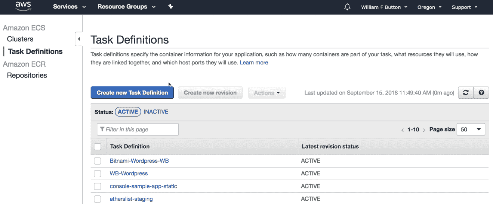

点击“创建新任务定义”，然后我们给我们的任务定义命名为`gaming-staging`，然后需要选择一个任务角色。我已经在这里构建了一个，但如果你没有构建，一个基本的 ECS 任务执行规则也可以。以下屏幕截图显示了这是什么样子的：

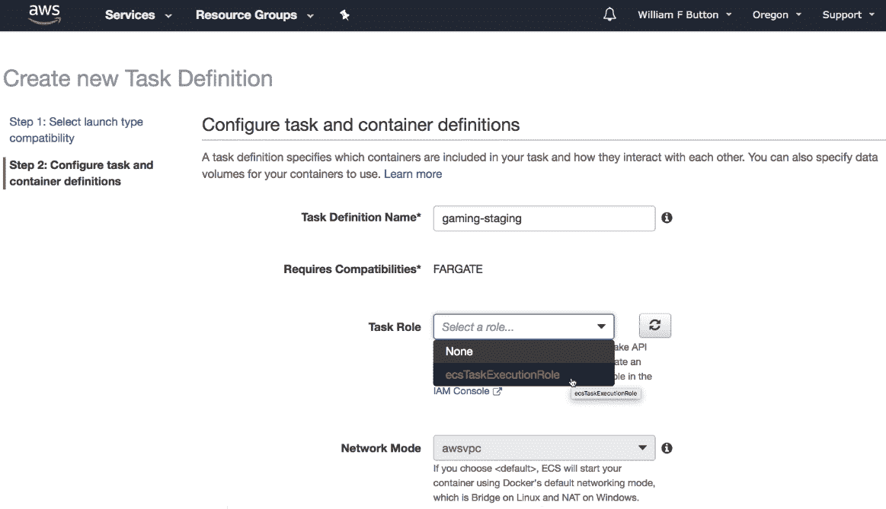

我们的 ECS 功能内部不需要任何特殊权限。我将给它分配 8GB 内存和 4 个 CPU，因为这足以为 React UI 应用程序和 Geth 客户端节点提供动力。现在，我们需要添加我们的容器：

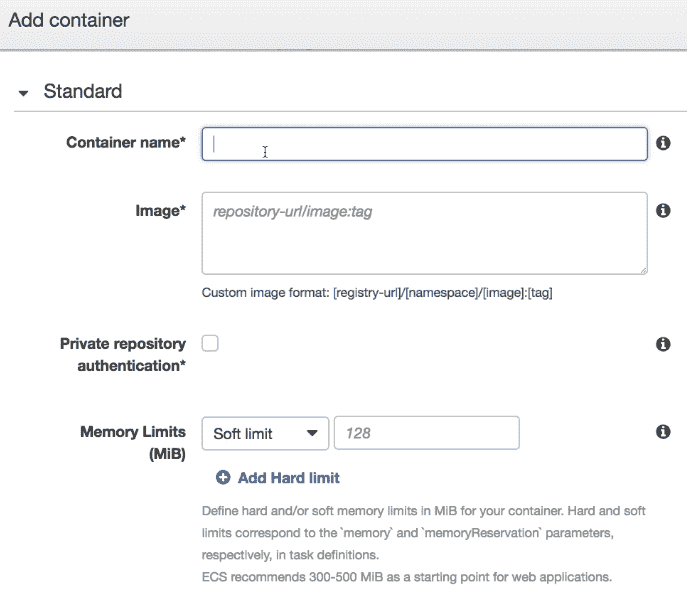

我们的第一个容器将是我们的`gaming-ui`，这是我们构建的 React 应用程序，图像来自我们推送到的 ECS 存储库。如果我们查看我们的存储库，那里存在的存储库 URI 就是我们需要的 URL，我们将把它粘贴到图像框中。我们需要公开端口 3000，因为那是我们的应用程序运行的端口。然后，我们需要指定一个健康检查。我们将在健康检查窗口中使用以下命令：

```
curl http://127.0.0.1:3000 || exit 1
```

这将使用`curl`命令检查本地主机，这将确定端口 3000 是否响应。如果没有响应，命令将以值 1 退出，这样 ECS 就知道容器没有健康，并将其拆除并替换。

我们希望每 60 秒检查一次，超时为 15 秒，并在启动前给自己 60 秒进行第一次测试。我们将允许其在失败之前有两次通过的机会：

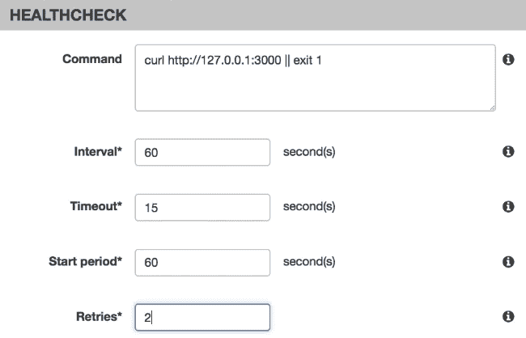

我们不需要在该容器上设置其他任何东西，因此我们可以点击“添加”。

然后，我们将添加第二个容器。这个将是我们的`geth-client`容器。它将来自以太坊仓库，使用以太坊提供的`client-go`映像。对于我们的端口映射，我们正在公开端口 8545，对于我们的健康检查命令，我们将`echo "true"`，这将始终使其通过。我们将像以前一样做：60 秒的间隔时间，15 秒的超时时间，60 秒的启动时间和 2 次重试尝试。

对于命令，我们需要做的唯一事情就是设置`--rpc`和`--testnet`标志。其他一切都在 Docker 映像内设置。我们将点击“添加”，然后创建它。

现在，我们需要转到 EC2，创建一个负载均衡器。负载均衡器将为我们提供一个前端界面，以便每当我们访问此 URL 时，它将在多个 Docker 容器之间平衡，或者如果该 Docker 映像失败，则将使用新映像启动它并将其放入该负载均衡器中，以便我们的 URL 不会更改。

点击负载均衡器，创建一个，并且我们将在这里使用应用负载均衡器：

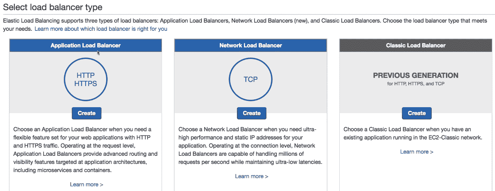

我们将给其设置与任务定义相同的名称，即`gaming-staging`。这将使我们轻松看到各资源与 AWS 中的其他资源相关联时哪些资源相关。它将具有互联网面向的属性，并在端口 80 上使用 HTTP。我们需要设置 VPC 并在两个区域之间平衡，以便在 AWS 中实现一定的容错和冗余：

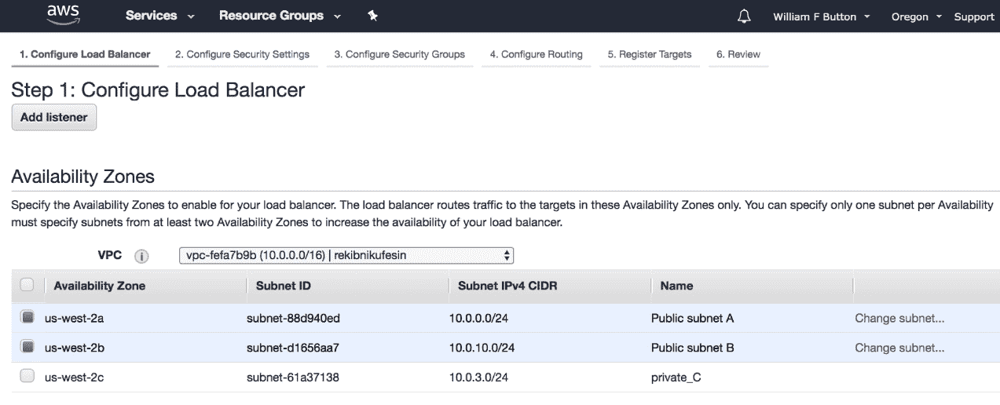

接下来，我们将将其放在一个安全组中，公开用于 www 服务器的端口，基本上公开端口 80 和端口 443：

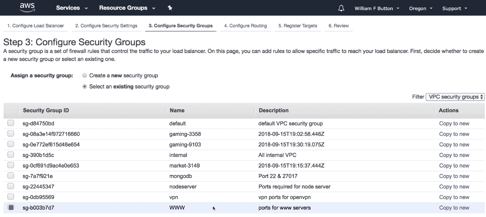

然后我们将在 80 端口上创建一个目标组，目标类型为 IP 端口；这是 ECS 将要放入负载均衡器的容器或资源池：

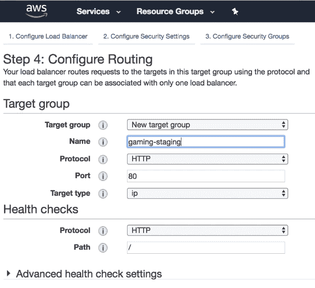

我们还没有任何要注册的目标，所以我们继续点击创建：

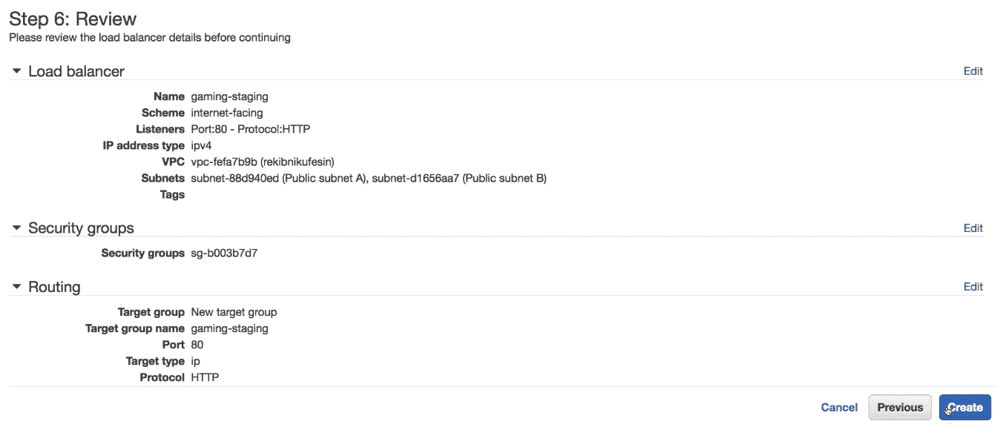

是时候回到 ECS，创建实际运行应用程序的服务了。现在，我们选择创建集群，并且创建一个 Fargate 集群的过程非常简单：

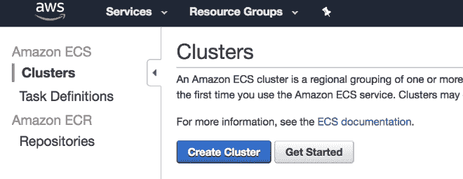

完成后，我们应该会看到类似以下截图：

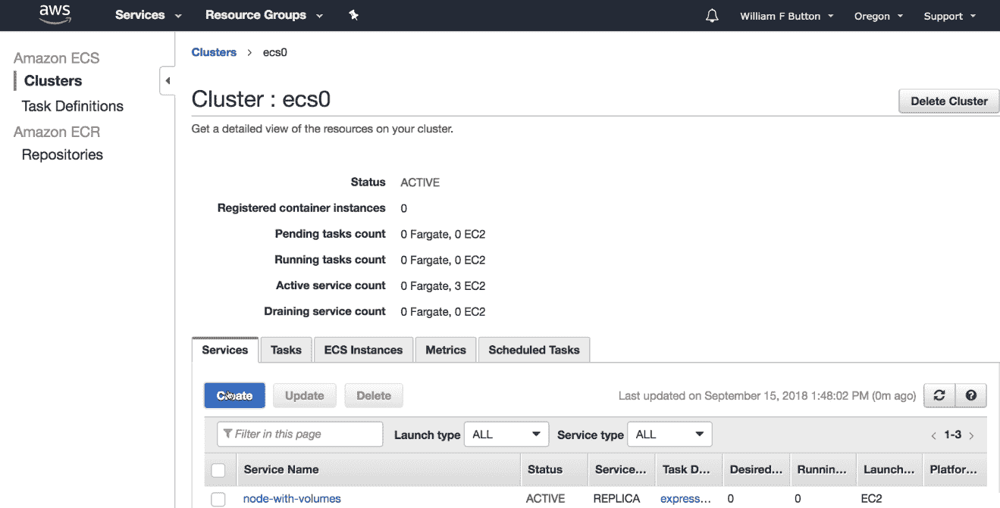

在集群中，我们将点击创建以创建一个新服务，指定 Fargate 为启动类型，然后选择我们刚刚创建的任务定义`gaming-staging`。我将为服务名称指定与所有这些资源一样的名称，然后指定我想要 1 个任务。如果你将要期望更多的流量，或者如果你想要确保如果其中一个容器失败了，还有另一个可以接管流量，你可以指定更多的任务：

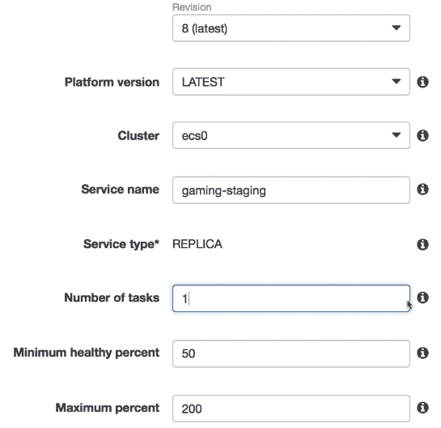

我将指定与我放置负载均衡器的 VPC 相同的 VPC，然后，对于负载均衡器，我将选择我们刚刚构建的负载均衡器：

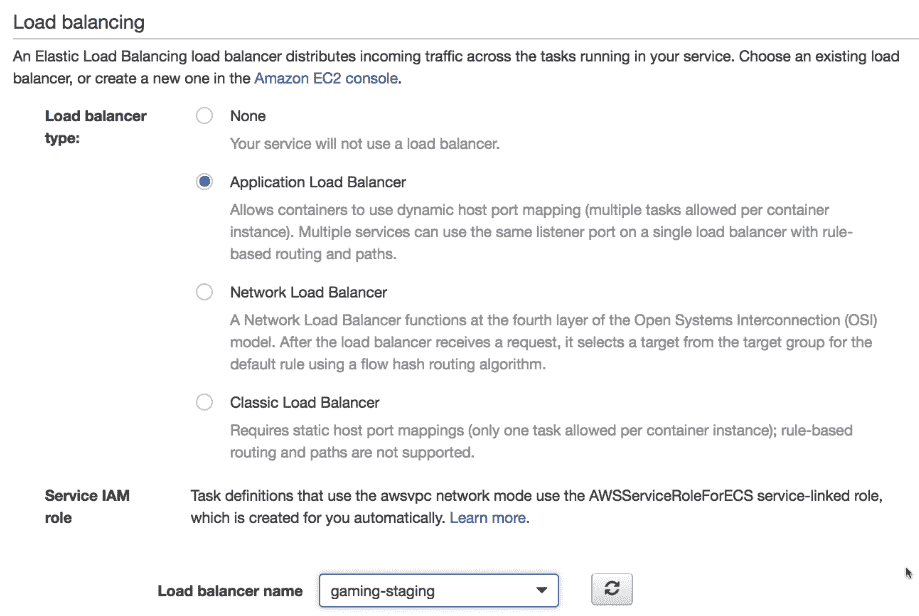

我们可以查看所有我们的设置，然后点击创建服务：

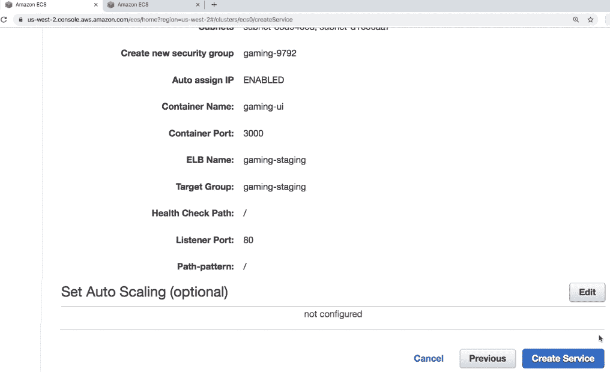

几分钟后，我们的服务应该已经开始运行起来了。一旦它开始运行，我们就可以切换回到 EC2，进入到我们的负载均衡器，选择我们创建的负载均衡器，并复制那里的 DNS 名称：

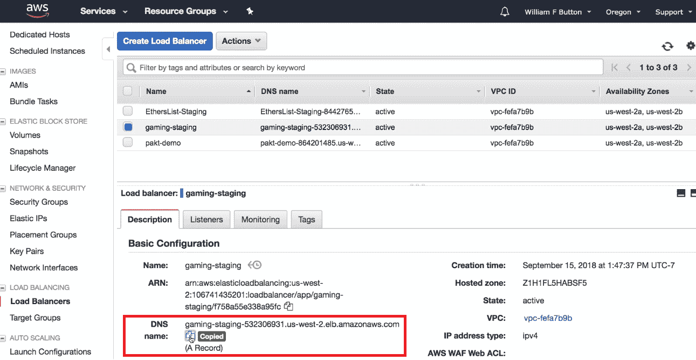

我们将把它粘贴到我们的浏览器中，就这样，我们的应用程序就在 AWS 上加载运行了，使用以太坊网络的 Ropsten 网络。

还有一件事情我们需要检查，这也是你最关心的事情之一。我们将返回 ECS 并告诉你如何关闭它，这样你就不会继续为它付费了。进入服务，并选择我们创建的服务，然后点击更新并将任务数设置为 0，然后更新服务。这将关闭运行的容器，以便你不再为其付费：

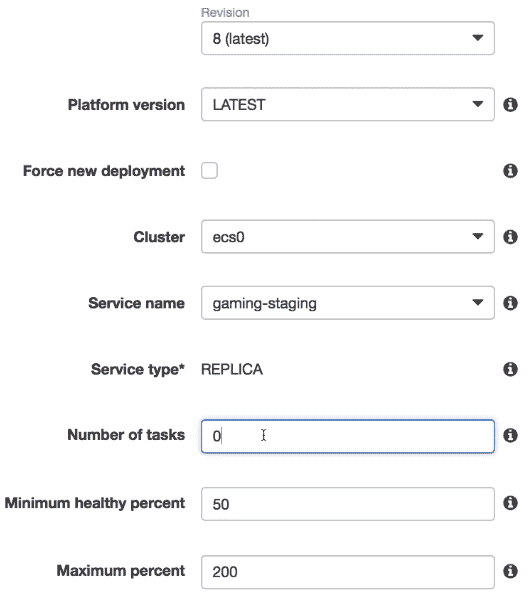

使用本章学到的步骤，你也可以将你的应用程序发布到以太坊主网络，使你的游戏玩家可以使用真正的以太币。

说了这么多，让我们来进行今天的最后一个部分，也是这本书的最后一个部分，也就是今天的作业。

# 作业

在本书的最后一项作业任务中，你将使用本章学到的所有步骤在 AWS 上启动你的应用：

1.  今天你的第一个任务是将你的合约部署到 Ropsten 网络上。记住，你首先需要在 Ropsten 上创建一个账户，并从水龙头获取一些以太币，以支付部署合约的燃气费用。

1.  一旦你部署了你的合约，你将会构建 Docker 镜像来包含你的用户界面，然后登录 AWS 并创建一个存储库来保存你的镜像，并将你的镜像推送到该存储库。

1.  我希望你创建一个任务定义，定义你的应用程序如何运行。你需要为你的 UI 应用程序和 Geth 客户端定义一个任务。通过将它们都放在同一个任务定义中，你可以确保你的 UI 应用程序始终在本地运行一个 Geth 客户端，以便与 Robsten 网络通信。

1.  启动一个新的 ECS 服务来使你的应用上线。一旦它启动，就给你的应用试驾一下。

1.  确保你在线分享 URL，让其他人也可以尝试。如果你想要成为一个区块链开发者，没有比在线展示你的技能更好的了，让潜在雇主可以看到。

# 总结

本章标志着学习区块链及如何使用它创建和实现游戏应用的结束。在本章中，我们学习了以太坊网络的工作原理，以及如何创建与之交互的智能合约。我们学会了如何在测试网络中获取以太币。最后，我们学会了如何将我们的应用部署到 AWS，并让全世界的用户都来试试它！

在过去的七天里，我们涵盖了很多内容，还有很多东西要学，但现在你有了开始自己探索更高级主题的技能。我希望你和我一样在区块链上工作时玩得开心，我很想看看你用所学技能建造的东西！
