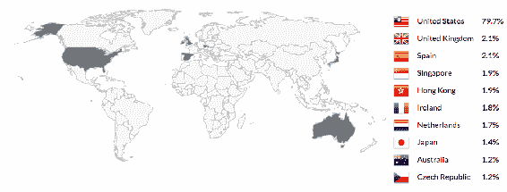
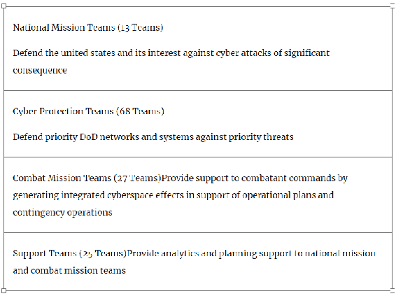

# 第一章：网络威胁格局与安全挑战

信息一直是竞争优势和可持续成功的关键。当一系列大容量和无可争辩的数据用于回答一个简单问题时，通常会产生信息。情报通过收集信息来形成可以用于决策过程的预测。情报收集是预测未来最强大和有效的实践。从古代情报到今天的人工智能，从世界大战到今天的网络战争，目标总是超越我们的对手。

让我们来看看现实世界。赛里斯政府及其军队**赛里斯人民解放军**（**PLA**）经常被指控从美国的私人机构窃取技术和商业机密。你可能会认为赛里斯想要摧毁美国，但事实并非如此。赛里斯只是希望成为超级大国并成为技术领袖。最终，它希望每个美国人，甚至全世界其他国家的人，都依赖赛里斯市场的技术。这导致赛里斯间谍行动持续试图窃取跨国公司和政府机构的商业机密。现在我们切换话题。政治党派通过对本国公民进行高级分析来收集信息以预测即将到来的选举结果。很明显世界正在随着互联网的变化而变化。

快速转向云计算、物联网、认知计算和移动性已经管理着大部分组织的关键资产；然而，日益增长的互联应用和技术数量也导致可利用漏洞的增加。组织正在部署多种安全措施来定位和修复这些安全漏洞；但这对安全力量来说是永无止境的工作。然而，通过对潜在威胁进行分类排序，可以优先处理顶级漏洞，但这需要高度的威胁情报实践。

网络安全是一个有二十年历史的现象，但在过去五年，保护者难以应对新兴威胁，比如零日漏洞利用、加密勒索软件、以太字节的 DDoS 攻击、多向恶意软件和高级社交工程。

这本书准备采用一种对安全感知的范式转变。尽管增加了另一层安全性，但这是一种试图从根本上改变安全心态的尝试。以互联网命名的最流行的技术之一是**区块链**；然而，使区块链真正革命性的是其在加密货币之外的应用潜力。如今，有许多初创公司正在使用区块链技术颠覆现有的商业模式和行业垂直领域，例如云主机托管、金融服务、供应链、医疗保健、网络安全等。本书对安全专家、安全产品工程师甚至区块链爱好者都将很有帮助。本书侧重于带领读者了解当前的安全威胁景观，并提供了一种克服区块链技术中一些最关键安全挑战的实践方法。

本章中，读者将了解以下主题：

+   当前的威胁景观

+   各国政府机构和企业等防御者如何准备自己保护资产免受对手的攻击

+   实时攻击模拟，从远程机器执行数据外泄

# 当前的威胁景观

在网络空间的新时代，技术转型已成为持续安全创新和运营的核心因素。在互联车辆、物联网、移动性和云的世界中，这为网络犯罪、定向攻击和工业间谍活动打开了一个焦点。一旦攻击者发现了漏洞并确定了如何访问应用程序，他们就拥有了构建应用程序的利用所需的一切，因此开发强大的漏洞管理至关重要。请记住，漏洞管理的有效性取决于组织跟上新兴安全威胁和模型的能力。

如果员工被诱使点击他们通过电子邮件收到的恶意链接，那么安全系统将无法产生影响。社会工程已被证明是进入目标网络的一种有效方式，安全力量面临着无休止的挑战，以识别恶意入侵。在 Facebook 和 LinkedIn 之前的旧时代，如果你需要找到有关组织的信息，你在互联网上不太可能获得很多信息，因此社交网络网站的使用使得社会工程攻击变得更容易进行。

# 勒索软件

勒索软件是一种恶意软件，它会对受害者计算机上的信息进行加密，并要求付款才能授予他们访问权限。勒索软件是最流行和回报最高的犯罪软件之一。在过去的两年中，它引起了大量媒体关注，主要是因为 WannaCry、NotPetya 和 Locky。WannaCry 勒索软件在 2017 年 5 月迅速传播到全球多个系统。它针对了几个知名组织，包括英国国家医疗服务体系、西班牙电话巨头 Telefonica、法国汽车领导者雷诺、美国领先的物流公司联邦快递、日本公司日立等等。

勒索软件作者在暗网上托管服务，允许任何买家创建和修改恶意软件。

暗网是互联网的一部分，无法通过搜索引擎获取，但需要一种特殊类型的匿名浏览器，称为**Tor**。换句话说，暗网携带的是搜索引擎无法获取的未编入索引的数据。Tor 浏览器基本上通过一系列代理服务器路由用户信息，使用户身份不可识别和不可追踪。暗网站看起来与普通网站类似，但在命名结构上有一些不同。暗网站没有顶级域（**TLD**）如`.com`、`.net`或`.co`；而是只使用以`.onion`结尾的网站。

# 黑客行为的货币化

根据网络安全业务报告，预计到 2019 年，勒索软件造成的损失将达到 115 亿美元。全球勒索软件业务增长的几个驱动因素。为了更快地赚钱，网络罪犯已经停止制作恶意软件，开始利用**勒索软件即服务**（**RaaS**），这在暗网市场上是可用的。

这些市场不仅减少了专业罪犯的工作量，还允许非技术犯罪分子或脚本小子进行勒索软件操作。

攻击者制作了一个预先配置了定时器的勒索软件程序，确保在截止日期之前不支付赎金就销毁数据。攻击者还分享了一个支付流程，主要通过比特币钱包（因为数字加密货币钱包提供了匿名性）。

# WannaCry

WannaCry 攻击是 2017 年 5 月 12 日发生的最大规模勒索软件攻击。WannaCry 利用了 Windows 操作系统的一个漏洞，最初由美国国家安全局（NSA）识别，然后通过**影子经纪人**（Shadow Brokers）公开了这一漏洞。它被设计成利用 Windows SMBv1 和 SMBv2 的漏洞，以便在网络内部进行横向移动。直到 2017 年 5 月 24 日，超过 150 个国家的 20 万多台计算机系统被感染。

# NotPetya

NotPetya 是另一种勒索软件攻击，于 2017 年 6 月发布。NotPetya 勒索软件显然与 Petya 病毒有很多相似之处—它加密文件并显示一个要求比特币以恢复文件的屏幕。最初的感染方法是植入 M.E.Doc（乌克兰领先的会计公司软件）的后门。在通过 M.E.Doc 软件侵害系统后，NotPetya 使用 EternalBlue 和 EternalRomance 等工具在网络中传播。它还利用了一个叫做 Mimi Katz 的工具，在受感染的计算机中查找管理凭据。

# SimpleLocker

SimpleLocker 是第一次勒索软件攻击，它并未影响任何计算机系统，而是影响了一些手机。黑客偏好的操作系统是 Android，这种勒索软件的来源被追踪到东欧。这个特洛伊木马攻击目标是插入平板电脑和手机的 SD 卡，自动爬取整个集合以获取特定文件，然后要求现金才能解密数据。该病毒通过 Google Play 商店进入设备。一旦安装，病毒将扫描受影响设备的各种文件类型，并使用**高级加密标准**（**AES**）对这些文件进行加密，将文件扩展名更改为`.enc`。它还用于从各自设备收集各种其他信息，例如 IMEI 号码、设备型号和制造商，并将其发送到 C2 服务器。借助这种病毒的最新版本，黑客甚至可以访问设备摄像头，并显示受害者的照片，以恐吓他们支付赎金。这种威胁仍然潜在。

# TeslaCrypt

在 CryptoLocker 之后的一年内，出现了一种新的威胁，即**TeslaCrypt**。一开始，许多人认为它是 CryptoLocker 的一个维度，但后来，它被赋予了一个新的名称—TeslaCrypt。这种勒索软件针对不同的人群—*狂热的游戏玩家*。TeslaCrypt 针对并影响与视频游戏相关的附属文件。这些文件包括已保存的游戏文件、地图、任何游戏相关的可下载内容等。这种勒索软件的独特之处在于，它的创建者不断改进了特洛伊木马的影响力，并填补了攻击过程中存在的漏洞。

# CryptoLocker

CryptoLocker 是一种大规模的勒索软件，据信它首次出现在 2013 年 9 月 5 日的互联网上，通过电子邮件附件和 GameOver Zeus 僵尸网络培育而成。它对运行 Microsoft Windows 系统的系统施加影响，并通过恶意电子邮件附件传播，并使用 RSA 加密对用户本地和网络驱动器上存储的某些类型的文件进行加密。CryptoLocker 于 2014 年 5 月底通过**Tovar**行动被清除，该行动关闭了 GameOver Zeus 僵尸网络。据报道，CryptoLocker 成功向受害者勒索了 300 多万美元。

# PC Cyborg

1989 年，发现了一个名为 PC Cyborg 的特洛伊木马，它具有隐藏文件夹然后加密 C 盘中文件名的功能。受害者随后不得不向注册在巴拿马邮局的 PC Cyborg 公司支付 189 美元。

# 分布式拒绝服务 (DDoS) 攻击

DDoS 攻击是一种恶意尝试，通过淹没服务器的正常用户流量来干扰其运行，其特点是以大量随机流量进行攻击。DDoS 与 DoS 不同之处在于其分布式的特性，从多个独立网络的被攻陷系统攻击目标。这些被攻陷的计算机系统被称为**僵尸**，僵尸网络指的是由同一恶意行为者控制的这样的一组僵尸。

DDoS 攻击已经成为一种频繁的危险，因为它们常被用于报复、敲诈勒索、活动主义，甚至用于网络战。2016 年 10 月，领先的 ISP Dyn 的 DNS 遭受了来自数百万僵尸的 DNS 查询波浪式攻击。这次攻击是由 Mirai 僵尸网络执行的，共有超过 100,000 台物联网设备被攻陷。

# 从脚本小子到地缘政治

关于 2016 年 10 月 26 日对 Dyn 的 DNS 基础设施发动的攻击，存在许多理论。其中一种最敏感和影响深远的 DDoS 攻击是针对 Dyn 的一次——一个总部位于美国的 DNS 服务提供商，导致包括 Twitter、Reddit、GitHub、亚马逊、Netflix、PayPal 等在内的一些主要网站在大部分时间无法访问。有许多关于这次攻击的理论和说法，关于谁可能是幕后黑手。安全研究人员指责*脚本小子*，然而，还有一位黑客 **Jester** 声称俄罗斯政府是幕后黑手。黑客组织 Jester 对俄罗斯外交部进行了污名化，反对一次 **民主党全国委员会** (**DNC**) 的黑客攻击。

事情并没有就此结束；最近也发生了一些备受关注的损害。卡塔尔的政治危机导致了对半岛电视台网站的 DDoS 攻击。法国的总统选举也因对费加罗和世界报网站的攻击而受到了干扰。

# 启动 DDoS 的便捷性

您可以支付每小时 10 美元、200 美元或 600 至 1200 美元的费用来发动 DDoS 攻击，持续一整周。暗网上的多名攻击者提供 DDoS 服务，使发动 DDoS 攻击变得容易。

想要用大量流量轰炸目标的人要按每秒钟的僵尸使用时间计费，而不是按小时计费。

# 被攻击最多的国家

攻击者可以攻陷一台计算机并制作自己的僵尸。这些僵尸用于进行侦察、网页爬行，甚至 DDoS 攻击。重要的是要理解，拥有大量被攻陷系统的国家应该意识到其全球风险指数。以下是一个由领先的 DDoS 保护提供商 Incapsula 绘制的 2017 年第二季度全球 DDoS 威胁格局图示：

2017 年全球有 33%的企业受到 DDoS 攻击的影响。与 2016 年相比，受 DDoS 攻击影响的企业数量翻了一番。

# 内部威胁

任何形式的威胁都可能来自组织内部，并不仅限于具有恶意意图的员工；也可能是承包商、前员工、董事会成员或股东或第三方实体。

# 定义内部威胁的更多方式

CERT 的《一般常识指南：减轻内部威胁》将内部人员定义为符合以下标准的现任或前任员工，承包商或商业伙伴：

+   具有或曾经拥有对组织的网络、系统或数据的授权访问权限

+   故意超出或故意使用该访问权限，以一种对组织信息或信息系统的机密性、完整性或可用性产生负面影响的方式

# 内部威胁概况

在描述此内容之前，重要的是了解其需求，这一需求在 2000 年由美国国防部（DoD）表示，并且自那时起，CERT 部门进行了研究。要了解内部威胁概况及其对应的行为，请访问以下链接：[`ccdcoe.org/sites/default/files/multimedia/pdf/Insider_Threat_Study_CCDCOE.pdf`](https://ccdcoe.org/sites/default/files/multimedia/pdf/Insider_Threat_Study_CCDCOE.pdf)。

一种恶意威胁，来自组织内部，例如来自员工、前员工、合作伙伴、关联人等，无需来自外部即可影响组织系统。这种攻击比其他恶意软件更具威胁性，因为这些人可以访问主要系统，并且他们了解允许他们以合法方式绕过安全措施的知识。内部威胁无处不在。如果有人说他们不容易受到内部威胁，那么他们可能实际上不知道内部威胁是什么，以及它对组织有多严重。所谓的内部人员可能会尝试访问机密文件以谋取个人利益。这种利益可以是任何事情，从向竞争对手出售信息到为内部人员自己的个人使用窃取信息。

任何组织的流失率都在一个可观的水平上。每年或两年人们离开和加入公司。这使员工保留某些信息成为动力，因为员工认为他们有权利保留这些信息，只是因为他们已经在这方面工作了相当长的时间。谈论内部威胁，甚至美国政府也无法摆脱内部威胁。2012 年发布的一份报告表明，大多数内部威胁实际上发生在员工的工作时间内。由于技术已经使得很容易确定侵入或攻击的起源，但没有证据，并且在所有情况下都没有确定罪犯的数量。

# 数据侵犯

在 2017 年，Ponemon 研究所进行的《网络犯罪成本研究》表明，全球数据侵犯的平均成本目前为 362 万美元，实际上比 2016 年下降了 10％。

数据侵犯可能涉及敏感企业文件、技术蓝图、知识产权、商业秘密甚至电子邮件的泄露。这一直是数量庞大并对企业有更大影响。复杂的攻击者能够为目标武装高度定制的恶意软件，并且还能悄无声息地传送恶意软件。

根据 Mandiant 的 M-Trend 2017 年报告，大多数受害组织被其他人通知其遭受侵犯，而非自身员工。超过 53％的侵入是由外部来源发现的。组织应该制定主动的侵入管理计划，以在被外部人员通知之前检测到侵犯。越早发现，组织就能节省更多资金。Ponemon 研究所还建议组织应该在 100 天内确定侵入。在此时间内检测到破坏的平均成本为 590 万美元，但对于那些没有工具检测到这一点的组织来说，平均成本上升至 870 万美元。数据侵犯发生的方式有多种，并且以下是一些最常见的原因：

+   **恶意攻击**：对手可以启动恶意软件或无恶意软件攻击，利用应用程序漏洞来窃取敏感信息。

+   **不安全的安全系统**：攻击者已变得更加先进和持久。攻击者可以使用窃取的凭据看起来像网络中的合法用户，因此绕过现有的安全系统，如防火墙，**入侵防御系统**（**IPS**）和终端安全。

+   **人为失误**：根据 2017 年 Verizon 数据侵犯调查报告，88％的数据侵犯涉及人为失误。人为失误是所有组织必须应对的问题。

# 最近显著的数据侵犯

一些最显著的最近的数据侵犯如下：

+   **2017 年 9 月的 Equifax**：Equifax 是美国三大信用机构之一，遭受了影响了 1.43 亿消费者的泄露。一个未知的威胁组织成功地通过利用 Apache Struts CVE-2017-5638 漏洞来入侵 Equifax 在线服务。由于被盗数据的敏感性，包括**社会安全号码**（**SSN**）和驾照号码，这是有史以来最严重的泄露之一。

+   **2017 年 7 月的 Verizon**：约有 1400 万 Verizon 的订户可能受到了数据泄露的影响。受影响的服务器由以色列的 NICE 系统管理。

+   **2017 年 5 月 31 日的 Edmodo**：教育平台 Edmodo 上超过 7800 万用户的信息被泄露。这是在黑暗网络上发现一名黑客（被称为 **nclay**）出售 7700 万 Edmodo 帐户时公开通知的。

+   **2017 年 3 月 7 日的 Verifone**：美国领先的 POS 信用卡终端制造商 Verifone 在其内部网络中发现了一起大规模数据泄露。消息来源表明，有证据表明俄罗斯的黑客组织参与了此次泄露。

# 数据泄露的影响

企业遭遇客户或合作伙伴的数据丢失或任何其他机密数据的后果严重且不断增长。独立的安全研究公司 Ponemon 研究所已经对数据泄露受害组织进行了一项调查，以了解数据泄露的影响：

+   **财务损失**：约有 113 家经历数据泄露的上市公司的股价平均下跌了 5％，导致了客户基础的流失

+   **品牌声誉损失**：61％ 的首席营销官认为数据泄露的最大成本是品牌价值的损失

+   **客户信任流失**：消费者信任金融机构、医疗保健提供者，甚至政府机构，以保护他们的个人信息和隐私

要了解每种影响的见解，请查看 2017 年 Ponemon 研究所的以下报告：[`www.centrify.com/media/4772757/ponemon_data_breach_impact_study_uk.pdf`](https://www.centrify.com/media/4772757/ponemon_data_breach_impact_study_uk.pdf)。 

# 高级持久性威胁（APT）

APT 使用多个阶段来攻击网络，避免被检测，并长期收集有价值的信息：

+   **高级**：它是一种高级攻击，因为它由攻击者可以利用的广泛的感染向量和恶意软件技术组成，这些技术被混合在一起以成功地入侵系统。

+   **持续性**：它是持续性的，因为被入侵的威胁始终存在。

+   **威胁**：这不是典型的、平凡的系统妥协。这种攻击对目标构成了真正的威胁，不仅因为它得到了高度组织、资金充裕和积极进取的犯罪分子的支持，而且因为如果攻击成功，它对目标的后果可能远远超出了正常的系统清理范围。

随着技术的进步，新的方式已经出现，对企业实体和任何业务进行监视。这是以 APT 的形式进行的。APT 可以被描述为对一个组织的网络进行攻击，允许未经授权的人长时间地在网络中存在而不被察觉或未被发现。

# 什么使 APT 如此不同？

与普通网络犯罪分子不同，APT 基于目标的选择、目标和人为因素：

+   **目标**：它们是基于财政、政治、地缘政治、监视和安全情报利益来选择的，以获得高价值信息。

+   **目标**：APT 的目标不是简单地进入然后退出，而是获得对网络资源的长期访问权，并使自己在安全管理员的监测下保持未被察觉。

+   **人为因素**：这是整个 APT 操作的一个关键因素，因为该操作可以通过钓鱼攻击甚至是内部威胁来进行。

欲了解更多关于数据外泄的信息，请访问 [`about-threats.trendmicro.com/cloud-content/us/ent-primers/pdf/how_do_threat_actors_steal_your_data.pdf`](http://about-threats.trendmicro.com/cloud-content/us/ent-primers/pdf/how_do_threat_actors_steal_your_data.pdf)。

# 防御者的观点

在了解新兴威胁形势和一些最有效的网络攻击之后，重要的是着手加强我们自己的防御工作。这些威胁团体已经得到了他们需要的一切，以发现一个组织的资产，然后找到漏洞，据此构建他们的武器。这对于那些一直没有适应性的组织来说是一个巨大的关注点，甚至有些组织已经存在几十年了，但让我们接受这样一个事实，有很多机构在实现网络卫生和更好的网络防御生态方面取得了辉煌的成就。让我们专注于其中一些机构，包括政府和企业。

# 政府

多个外国安全机构已针对政府电子系统进行了定向攻击，以收集情报。随着互联技术的日益普及，政府系统在扩大攻击面方面也面临着挑战。政府当局提高保护其关键资产的能力至关重要。

# 美国（US）

美国总统唐纳德·特朗普于 2017 年 5 月 11 日签署了一项行政命令，涉及加强联邦网络的网络安全，强调问责制，改进关键基础设施的框架，并现代化现有的网络安全系统。美国国防部也提出了加强网络防御和网络威慑姿态的战略，其中包括三个主要的网络任务，如下截图所示：

网络任务部队计划在 2018 年前组建 133 支队伍

要了解更多关于美国国防部加强网络防御和网络威慑姿态战略，请访问以下链接：[`www.defense.gov/News/Special-Reports/0415_Cyber-Strategy/`](https://www.defense.gov/News/Special-Reports/0415_Cyber-Strategy/) 

# 英国（英国）

通过 2016-2021 年的**国家网络安全战略**（**NCSS**），英国政府计划使该国安全和具有弹性。这一愿景概括为以下三个目标：

+   **捍卫网络空间**：这是为了确保英国的网络、数据和系统受到保护和弹性支持。从而，英国公民、企业和公共机构应该具备足够的专业知识和能力来自我防御。

+   **威慑对手**：用于发现、了解、调查和打击针对英国的网络威胁。

+   **发展其能力**：借助自持续的人才储备，它为英国在公共和私营部门的国民提供必要的技能。

要深入了解英国 NCSS 项目，请访问以下链接：[`www.gov.uk/government/publications/national-cyber-security-strategy-2016-to-2021`](https://www.gov.uk/government/publications/national-cyber-security-strategy-2016-to-2021) 

# 欧洲

**欧盟网络和信息安全局**（**ENISA**）是欧盟国家和欧盟机构相关网络和信息安全的专业和卓越中心。有一些重大的值得注意的举措，如**年度隐私论坛**（**APF**）、**ENISA 威胁格局**（**ETL**）和 Cyber Europe——一个旨在保护欧盟免受协同网络攻击的泛欧洲演习。

在 2018 年，**通用数据保护条例**（**GDPR**）将取代数据保护指令 95/46/EC，并带来以下变化：增加的领土范围、处罚、同意、泄露通知、访问权、被遗忘权、数据可携性、隐私设计和数据保护官员。要了解 GDPR 的每个垂直领域，请访问以下链接：[`www.eugdpr.org/key-changes.html`](https://www.eugdpr.org/key-changes.html)。

# 印度

在 2017 年 2 月，印度政府的**计算机应急响应小组**（**CERT-In**）推出了*网络卫生中心*，这是一个清除僵尸网络和恶意软件分析中心，旨在通过检测和清除用户终端中的僵尸程序来创建一个安全的印度网络空间。要了解更多关于印度在清除僵尸网络计划上的倡议，以及其他组织如何帮助政府实现这一目标的信息，请访问链接：[`www.cyberswachhtakendra.gov.in/`](http://www.cyberswachhtakendra.gov.in/)。 

# 企业

随着移动性、云和物联网的快速适应，企业更多地面临潜在威胁。事实上，一些最流行的技术，如**自带设备**（**BYOD**），使内部威胁的概率和分数变得更高。即使在预防安全方面投入了数百万美元，仍然无法完全保证安全，这促使组织探索各种新兴安全防御技术，以便检测和打击成功绕过现有安全系统的高级威胁。在许多跨国组织中，**首席信息安全官**（**CISO**）需要同时兼顾多重任务。在 2018 年，每个 CISO 都将就其组织的安全做出一些关键决定。

以下提及了一些新兴安全防御。

# 终端检测和响应（EDR）

EDR 是一种旨在从网络中检测和清除恶意活动的解决方案。EDR 解决方案通常包括以下四项能力：

+   通过持续监控终端来检测威胁

+   收集和调查日志，并将其与历史事件相对比和关联，从而检测每个终端活动

+   响应对资源的危险尝试，并将其从网络中移除

+   结束未经授权的进程，使终端回到正常状态

# 欺骗技术

欺骗技术曾被用于世界大战中的古代军事，现在，则是在网络空间的世界中。简而言之，这是一种技术，允许攻击者渗透到一个假目标系统中。通过欺骗，企业可以探测到攻击者，并了解他们的行为和相关信息，从而帮助改进自己的防御。这可以通过多层堆栈来扩展，包括网络设备、终端和应用程序。

# 网络威胁情报（CTI）

CTI 是分析对手能力的一种方式。在网络空间中，它通常以**威胁指标**（**IOC**）的形式传递，包括恶意 IP 地址、域名、哈希等。对于组织来说，了解他们的资产、人员和每个连接的第三方是至关重要的，以便他们可以准备自己的威胁情报，并计划加强自己的防御。

# 新兴安全挑战

每个组织都必须参与这场与网络攻击者的永无休止的竞赛。如果你无法在对手之前保持领先，你很可能会成为攻击的受害者。在未来几年，防御者必须为一些最新的安全挑战和威胁做好准备。这些包括以下内容：

+   **安全适应速度缓慢**：与网络和云转型不同，网络安全解决方案的发展速度不如人意。传统的网络分段已被简化和扁平的架构所取代，消除了大量的网络复杂性。然而，安全解决方案仍然使用传统的基于区域的方法来缓解威胁。

+   **人为错误**：根据 IBM 安全服务报告，超过 95%的调查的网络事件是由于人为错误引起的，比如系统配置错误和不足的补丁管理。

+   **第三方供应商安全风险**：在互联的商业世界中，组织不得不让其他组织存储和使用其信息以改善业务运营，然而这也可能带来更大的风险。如果第三方受到损害，组织将面临业务数据丢失的风险。大多数供应链攻击使用了能够绕过现有安全系统的复杂攻击向量。

# 摘要

在了解当前的威胁格局、防御者视角、实时攻击模拟和安全失败的根本原因之后，很明显地可以看出，对于数据泄露和其他高级定向攻击，并没有万能的解决方法。攻击者根据技术和业务流程的变化来改变其武器和战术，而防御者则积极探索各种安全工具。同时也很明显，攻击者不需要复杂的技巧就能实施复杂的数据泄露；他们只需要抓住机会。借助开源工具和免费的在线侦察平台，威胁行为者能够发现资产及其对应的漏洞。

在下一章中，您将学习一些部署网络安全系统的有效方法。

# 问题

在网络空间中，总会留下一些关于企业和组织面临的真实风险、实现更好的防御策略以及安全出错的问题。以下是一些被广泛提出的问题：

1.  如何让组织了解网络空间中对手的能力？

1.  如何准备有效的网络威胁情报？

1.  如何适应新兴的网络安全技术？

# 进一步阅读

请考虑以下链接以进一步阅读：

+   了解更多关于威胁概况和能力的信息，请访问[`ccdcoe.org/sites/default/files/multimedia/pdf/Insider_Threat_Study_CCDCOE.pdf.`](https://ccdcoe.org/sites/default/files/multimedia/pdf/Insider_Threat_Study_CCDCOE.pdf)

+   2018 年欧盟《通用数据保护条例》位于[`www.eugdpr.org/key-changes.html.`](https://www.eugdpr.org/key-changes.html)

+   美国国防部网络任务部队计划位于[`www.defense.gov/News/Special-Reports/0415_Cyber-Strategy/.`](https://www.defense.gov/News/Special-Reports/0415_Cyber-Strategy/)
