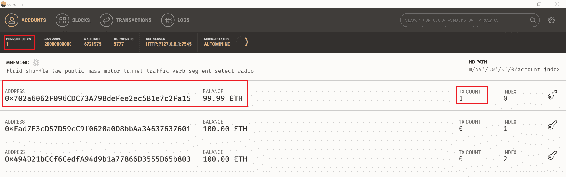

# 介绍区块链和以太坊

几年一次，我们会见证到具有颠覆性能力的革命性技术的诞生，它们有能力颠覆广泛的商业模式。本章将介绍区块链技术及其商业应用案例。区块链是一个概念，起源于一篇名为《比特币：一种点对点的电子现金系统》的白皮书，作者是*Satoshi Nakamoto*，目的是避免第三方介入任何金融交易。我们还将讨论基于区块链的业务需求、密码学和共识，以减少欺诈风险。

本章节内容包括以下主题：

+   什么是区块链？

+   互联网与区块链

+   它是如何工作的？

+   区块链的构建模块

+   以太坊区块链

+   私有与公有区块链

+   业务适应

# 什么是区块链？

就像每天的其他日子一样，你正在享受早晨的咖啡和新闻。与此同时，某处，一个财务动机的黑客正在寻找所有可能的方法来攻击一个广泛使用的社交网站上数百万用户的帐户。黑客成功地访问了数据库并窃取了大量的凭据。

大约180天后，这一大规模的凭证盗窃事件被公开揭露，你发现自己也是被攻击目标之一。和你一样，数百万其他用户也有充分的理由担心他们的信任和隐私。例子包括最新的2017年信用档案公司数据泄露案（1.43亿凭证被泄露）、2016年Adult Friend Finder案（4.13亿账户被盗）、2015年Anthem案（7.8千万帐户被黑客攻击），等等。没有一个预防性解决方案可以百分之百安全，但是在正确的时间找出问题可能会拯救这些账户的滥用。如果有一种技术可以做到以下几点：

+   检测谁查看了一个人的账户并更改它？

+   确保与个人相关的数据不被滥用？

这听起来像是一个明智的选择，但实施起来并不难。这就是区块链的作用。简而言之，它只是一个智能、安全且不断增长的数据库。区块链是一个按时间顺序记录任何价值或资产交易的分类账。区块链网络提供了使用点对点网络在独立方之间传输任何类型价值或资产的能力。区块链技术最初的目标是在两个独立方之间建立值得信赖的金融交易，而无需任何第三方，比如银行；然而，后来，几个行业采用了区块链来简化其供应链流程、KYC系统、数据管理等。随着在线服务的增加和在线交易数量的增加，用户必须信任并依赖于诸如银行和支付网关提供商等第三方。这导致了区块链的诞生。

# 简史

2009年，*比特币：一种点对点电子现金系统*的白皮书由*Satoshi Nakamoto*发布，旨在解决现有金融市场面临的挑战。这份白皮书着眼于开发一个平台，允许一方向另一方进行在线支付，而无需经过金融机构。其中一个主要解决的问题是双重支付方法，该方法用于避免比特币的双重花费（数字货币的一个独特问题是在花费后复制相同金额的风险）。由于比特币是数字货币，复制数字数据并宣布它并不困难，因此发生了双重支付，并提出了一个解决方案来防止这种情况发生——这就是区块链。然而，Nakamoto的原始论文并没有提到区块链一词；它首次出现在比特币源代码的注释中，被称为*block chain*。

# 区块链的基础知识

区块链是一个分散式数据库，以追加方式安全记录所有交易。由于其分散式数据库的特性，区块链迅速在许多行业中流行起来。对于一个不能承受单点故障的组织来说，区块链数据库使得敏感信息几乎不可能被网络犯罪分子攻击。此外，区块链不仅仅由受信任的管理员或开发人员管理；它是由任何可以被信任的人或来自已知或未知方的人管理的。下图是区块链网络的图形表示：


每台连接到互联网的计算机都需要具有区块链节点软件，并运行特定于区块链生态系统的应用程序。根据使用情况，这些计算机的参与可以受到限制。例如，基于区块链的生态系统银行链只允许银行运行银行链节点客户端应用程序。

# 谁在使用区块链以及如何使用？

在当前技术时代，除了任何热门技术外，区块链有能力以颠覆者的身份进入任何行业。这可能是为了降低运营支出，克服与网络安全相关的问题，提供身份和访问管理解决方案，促进私人和公共机构的合作，实现更好的数据管理系统，增强和简化物流和供应链管理，实现无缝的保险销售和管理系统，或者部署更好的健康记录数据库系统以保护人们免受任何数据窃取或间谍企图的威胁。

# 互联网与区块链

互联网是一个拥有30多年历史的技术，其目的是通过TCP/IP和**开放系统互联**（**OSI**）模型栈共享信息。从互联网诞生开始，每一项新技术都颠覆了现有的技术，无论是电子邮件、网络还是电子商务。互联网是最强大的技术之一，足以将思想传播到影响和创造现实的幻觉。

TCP/IP是第一个用于标准化类似网络之间通信的互联网协议套件；然而，OSI模型是由**国际标准化组织**（**ISO**）开发的，旨在提供一个框架来标准化系统之间的通信，无论供应商、模型和技术如何。组织偏好这两种模型用于客户端/服务器通信，因为客户端/服务器网络往往在性质上更可靠和稳定。重要的是要对客户使用的数据以及他们如何使用数据有更好的控制。在客户端/服务器模型中，客户端管理其自己的本地资源，例如工作站或任何设备的硬件和软件组件，而服务器是一个管理共享资源的高度强大的系统，例如硬件、网络通信渠道和数据库。在对等网络中，没有中央机构来监视、控制和强制执行。尽管小型企业过去偏爱此类网络用于其内部需求，但由于失去对业务操作和管理的控制的风险，大型组织一直远离对等网络。

然而，在连接世界的这段旅程中，有一些时刻重新定义了创新并为每个企业的需求提供了媒介。这就是区块链，一个由独立节点组成的对等网络，可共享任何类型的价值，无需任何第三方参与。计算的演变首先是从大型机计算开始的，十年后互联网诞生。云计算通常是由*Ramnath Chellappa*教授在1997年定义的，亚马逊于2006年推出了其**弹性计算云**（**EC2**）服务。我们现在处于一种新型计算的时代，它改变了数据安全存储的方式。请看下图：


# IP数据包与块

我们在互联网上进行的所有操作都通过TCP/IP模型上的IP数据包进行。IP数据包是可以通过互联网发送的最小数据单位。一个IP数据包有两个组成部分——**IP头部**和**有效载荷**。

为了发送这些信息，它需要源和目的地IP地址。一个块是这个过程的重要元素；它被链接在一起形成一个区块链。块也有两个组成部分——**块头部**和**块体**。为了发送任何类型的值或交易，它添加自己的数字签名作为源标识符和公钥，这类似于点对点网络中目的地的身份。

# 网页应用程序与 dApp

网页应用程序（web app）简单来说就是一个基于Web的应用程序，广泛用于客户-服务器模型以为用户提供服务。然而，**去中心化应用程序**（**dApp**）是一种运行在点对点计算机网络上的应用程序。

传统的Web应用程序使用CSS、HTML和JavaScript来渲染前端页面。它通过API调用从数据库中获取数据。dApp的前端使用完全相同的技术来渲染页面，但是不同于调用API，dApp使用一个智能合约连接到区块链。

# 它是如何工作的？

让我们以最简单的形式了解区块链账本的工作原理。为了以通用形式理解系统，重要的是使用几种区块链的状态并进一步探索：

1.  **交易准备：** 在这个阶段，甲方创建了一个交易，其中包括接收者的公共地址、源数字签名和交易消息等信息。现在这个交易对所有区块链中的节点都是可用的。

1.  **交易验证：** 区块链节点在一个无需信任的模型中工作，其中每个节点（运行区块链客户端软件的机器）接收到这个交易，并使用甲方的公钥验证数字签名。验证成功后，这个经过身份验证的交易被停放在账本队列中，等待所有节点成功验证相同的交易。

1.  **块生成：** 排队的交易被排列在一起，一个节点在网络中创建了一个块。在比特币区块链中，当比特币节点，也称为**矿工**，通过解决一些数学上复杂的问题创建一个块时，会获得比特币奖励。

1.  **区块验证：** 在成功生成区块后，网络中的节点将进行迭代验证过程，其中大多数节点必须达成共识。有四种流行的实现共识的方式，例如**工作量证明**（**PoW**），**权益证明**（**PoS**），**委托权益证明**（**DPoS**）和**实用拜占庭容错**（**PBFT**）。比特币使用PoW来实现共识；然而，以太坊使用PoS进行共识。这种机制影响了金融方面，并确保了整个交易操作的安全性。

1.  **区块链技术**：在成功的共识机制之后，区块将经过验证并添加到区块链中。

区块链的几种状态如下图所示：


# 区块链的构建模块

区块链技术是建立在一组现有技术之上的，这些技术已被广泛应用于整个行业。让我们逐个查看构成整个系统分布式、不可变和可靠性质的区块链的每个组件。

# 区块

分布式分类帐存储在数据库中，并由区块链网络中的每个参与者更新。分类帐以一系列单位块表示。为了理解区块，让我们从传统数据模型开始，然后跳到区块链网络，了解如何将区块链接在一起。

首先让我们了解互联网上常规的信息交换方式。在TCP/IP协议栈的世界中，信息是通过客户端/服务器模型进行传输的，其中客户端可以在集中式服务器上存储和修改数据。然而，数据库的控制仍然由指定的管理员管理。如果管理员的安全性受到威胁，整个数据库可以被更改或删除。理论上，服务器与用户机器没有什么区别；然而，在实际中，服务器的目的是同时为多个终端用户提供服务。请看以下图示：


区块链网络由名为**节点**的多台独立机器组成。与将整个信息存储在集中式数据库服务器上的传统数据库不同，区块链节点保留了整个数据库的副本，并具有管理角色。即使一个节点宕机，信息仍将对其他节点可用，如下图所示：


当一个节点加入区块链网络时，它会下载更新后的区块链分类帐。每个节点负责管理和更新其带有验证区块的分类帐。该节点维护分类帐并以块的形式组织它，连接到哈希算法，如下图所示：


多个交易被捆绑在一起形成一个区块，以最简单的方式，它是一种数据结构。每种加密货币都有自己的区块链和自定义属性。例如，在比特币区块链中，每10分钟生成一个区块，每个区块的大小为1 MB，而在以太坊区块链中，每12-14秒生成一个区块，每个区块的大小为2 KB。看一下以下图表：


让我们更深入了解区块。一个区块由区块头和区块主体组成：

+   **区块头**：区块头帮助我们识别区块链中的特定区块。它包含一组元数据：


区块的各个组成部分解释如下：

+   +   **版本**：这是一个4字节的字段，用于跟踪软件或协议版本。

    +   **时间戳**：这是一个4字节的字段，表示区块创建时间（秒）。

    +   **上一个区块的哈希**：这是一个32字节的字段，表示链中上一个区块的哈希。

    +   **Nonce**：这是一个4字节的字段，用于跟踪PoW算法计数器。

    +   **Merkle根哈希**：这是一个32字节的字段，是该区块交易Merkle树根的哈希值。

    +   **区块主体**：区块的这部分包含一系列交易。在比特币世界中，一个区块平均包含500多笔交易。每个交易都必须经过数字签名；否则，将被视为无效。为此，使用哈希函数对实际交易和私钥/密钥进行算法运算。

# 加密学 – 数字签名和哈希算法

密码哈希是一种根据任何给定长度的输入字符串生成固定长度输出的方法。输出被称为哈希值或消息摘要，旨在保护任何类型的数据的完整性，例如文件、媒体或文本。只分配一个消息摘要来保护特定输入或敏感信息。对输入数据进行轻微更改会导致结果的巨大差异，使得几乎不可能预测数据的传输或静止。有各种方法来生成哈希值或消息摘要。在加密货币世界中，比特币等热门货币使用SHA-256算法对每个区块生成一个固定长度的256位哈希值或消息摘要。

让我们了解SHA-256算法的工作原理。有几个免费的网络工具可用来生成SHA-256哈希值。我们在[https://passwordsgenerator.net/sha256-hash-generator/](https://passwordsgenerator.net/sha256-hash-generator/)上演示。

让我们开始生成一个哈希：

+   第一个输入消息如下：

```
"Hi" 
Hash =3639efcd08abb273b1619e82e78c29a7df02c1051b1820e99fc395dcaa3326b8
 

```

+   第二个输入消息如下：

```
"Welcome to the world of Blockchain"


Hash = d6d937bbd71b1184e588dffb50709e0fc4d8e7323df3acd98f2826a3601793ef

```

+   第三，在加密货币的背景下，输入消息如下：

```
"Mike is paying John $200 at Jan 23, 2017"


Hash = 5afef671f79cab507aba379a84477d637aac6ad72456ef3c35a39476e886b9d0

```

为了确保传输的文件没有损坏，接收者可以始终将计算得出的哈希与给定的哈希进行比较，以了解文件或其任何内容的作者。在区块链世界中，哈希是其不可变性特性的支柱。哈希过程确保了分类账中的任何区块都没有被修改或篡改。区块链和节点不必记住每笔交易的详细信息，例如`Mike在2017年7月20日支付$20给John`，`Kevin在2017年9月21日收到了法律文件`和`Tom在2017年11月22日完成了从休斯顿到达拉斯的行程`，而只需记住并跟踪其相应的哈希。

让我们了解一下区块链如何利用哈希算法。在区块链中，一个节点将整个分类账以按时间顺序连接的区块形式排列。为了确保分类账保持不可篡改，每个区块都依赖于前一个区块。换句话说，新区块无法在没有前一个区块的哈希的情况下产生。在将新区块添加到分类账之前，这必须得到区块链中每个节点的批准和验证。这使得任何人都无法篡改或修改分类账，除非是黑客，他有能力同时感染和妥协区块链中的数百万个节点。只有第一个区块称为*创世区块*是自己生成的并指向自己。下图显示了简化的比特币区块链：


每个区块都指向上一个哈希区块的哈希，这成为区块链不可变系统的支柱。现在，即使中间的一个区块被改变或受到任何方式的干扰，黑客也永远无法获得相同的区块链，因为区块的微小变化可能导致结果哈希的重大变化。在每个区块中有成千上万的交易，要找到一个不耗时且处理敏感的交易变得极其困难。为了避免这种复杂的工作，开发了一种名为默克尔树的综合哈希树。下图显示了默克尔树：


哈希排列的目的是简化在数千个中定位单个交易哈希的过程。

数字签名已经在许多组织的安全控制核心中起着作用，确保传输数据的真实性并防止伪造。数字签名确保交易发生在两个经过验证和认证的当事人之间。在现实世界中，每个人都是通过其独特和永久的国民身份号码进行身份验证，例如美国的**社会安全号码**（SSN），新加坡的**国民登记身份证**（NRIC），英国的**国民保险号码**（NINO），印度的**印度独特身份机构**（UIDAI）等。政府机构根据其唯一身份号码进行财务交易、财产交易和公民与政府之间的法律交易的跟踪，其中包含有关其个人详细信息甚至生物特征信息的信息，在完成交易时将进行验证。在数字世界中，数字签名对于确保两个经过验证的当事人之间的交易至关重要。现在让我们了解为什么区块链需要数字签名。

在区块链技术中，每个节点都保持着一个具有行政角色的区块链总账。任何人都可以使用自己的数字身份将其交易添加到总账中。与区块链技术相关的好消息和坏消息如下所示：

+   **坏消息**：数字身份全部由1和0组成，这增加了伪造的可能性。任何一方都可以通过简单地复制受害节点的数字身份来尝试在总账中进行欺诈性记录。

+   **好消息**：区块链网络利用私钥和公钥对。每个节点都有自己的私钥和公钥对。数字签名和哈希与区块链共同工作，以了解这两种基本技术如何携手保持区块链具有高级别的安全性。

假设甲方想要向乙方发送交易信息。为了保持我们对区块链的关注，已经移除了比特币挖掘，尽管进行财务交易仍然需要成功的挖掘过程。甲方有一笔交易，准备宣布。消息是`Party A sends $200 to Party B on July 23, 2017 at 03:00 EST`。

为了避免任何伪造，甲方必须使用非对称密钥对，也称为私钥/公钥对。信息由私钥签名，并且这仍然是甲方的私人信息。假设甲方有一个私钥或秘钥`Blockchain#123`，消息是`Party A sends $200 to Party B on July 23, 2017 at 03:00 EST`。使用SHA256消息摘要算法签名消息将如下所示：


读者也可以在[https://www.freeformatter.com/hmac-generator.html](https://www.freeformatter.com/hmac-generator.html)链接中提到的工具执行相同的操作。以下是计算得到的**基于哈希的消息认证代码**（**HMAC**）：


现在，每个交易由三个重要元素组成—类似于源地址的数字签名，指示目的地的公钥，以及最后的交易信息。

这个交易到达*B*方以及其他通过公钥验证了这个交易的参与者。在成功验证后，交易被确认。

# 共识 – 区块链的核心

共识是区块链系统的一个组成部分，负责在分布式环境中达成一致。区块链的开放和无信任性质是区块链的核心；然而，同样也需要注意额外的注意和严格的流程。由于任何人都可以参与并提交信息，评估每个参与者的议程是至关重要的，并且让每个人同意一项理想政策有助于避免任何欺诈企图。这催生了类似信令过程的共识机制，以确保在实际通信开始之前已经考虑到所有事项。以下是用于实现区块链共识的四种主要方法：

+   **PoW**：在区块链中实现共识的最流行方法之一是由比特币创始人中本聪发明的。在这种共识类型中，基于信任特定节点可以避免欺诈企图，该节点旨在执行最大的计算工作。区块所有者，也被称为加密货币世界中的**矿工**，知道拥有强大的计算资源可以实现更好的哈希率，并且获得比特币奖励的几率增加。新交易广播到网络中的所有节点，并且每个节点都在监听这些交易。想要通过比特币获取激励的节点被称为矿工，但他们不仅仅是监听，他们收集交易。矿工必须用PoW算法解决一些复杂的数学问题。首先解决的人将获得比特币奖励。最终，验证的区块被添加到每个矿工的区块链中。

这个数学问题就是通过对一组交易和一个随机数（一个32位随机数）应用哈希来实现一个期望哈希的过程。如果输出得到一个比目标哈希更小的哈希，矿工就赢得了该区块并实现了共识。当一个矿工赢得一个区块时，每个区块都携带一定数量的**比特币**（**BTC**），然后他们收到:

+   +   `2009年1月至2012年11月`：每个区块是50 BTC

    +   `2012年11月至2016年7月`：每个区块是25 BTC

    +   `2016年7月至2020年2月`：每个区块是12.5 BTC

    +   `Feb 2020-Sep 2023`: 每个区块将会有 6.25 BTC

+   **PoS**：这是区块链中另一种节点之间达成共识和验证交易的方法。与 PoW 不同，使用 PoS，区块生成器不会根据其当前的财富来选择。在这种机制下，区块不会被奖励，PoS 中的矿工被称为**铸造者**。以太坊使用 PoS，选择这种方法的目的是避免因大量耗电而产生的环境压力。根据 Digiconomist 2017 年的报告，整个比特币网络消耗的电力估计超过了爱尔兰共和国。比特币使用 PoW 机制，完全依赖于拥有强大资源的矿工，这导致了更多的电力消耗。使用 PoS 机制，节点必须加入验证者池才能被选为铸造者。**Casper**，一种以太坊共识 PoS 协议，作为一个混合版本与现有的 PoW 机制一起运行。PoS 适用于具有静态币量的平台，并且许多人使用它来分发代币进行投资。

+   **DPoS**：这是另一种共识协议，被认为是更快、更高效的模型。DPoS 使用民主方式解决共识问题。在网络中选举区块生成器并确认交易大约需要一秒钟。这样，你不仅解决了共识问题，还消除了不受欢迎的监管干预。

+   **PBFT**：拜占庭容错是一种既失败又在故障检测系统中起作用，并且对不同检测器显示不同模式的状态。如果一些节点成员向其他人发送关于交易的不一致信息，可能会给整个网络带来巨大的困境。PBFT 是一种解决方案，可保护网络免受拜占庭错误的侵害。

# 以太坊

以太坊是最古老的区块链之一，它为平台提供了一种自定义系统的方式。比特币旨在通过自己的共识机制颠覆当前的支付系统和在线银行业，而以太坊正处于去中心化现有计算机系统的中间状态，因为它在客户端-服务器模型上大量运作。

# 历史

2013年，22岁的程序员维塔利克·布特林首次在白皮书中描述了以太坊，他曾参与比特币的开发。2014年初，一家名为以太坊瑞士有限责任公司的瑞士公司开发了第一个以太坊软件。2016年6月，一个匿名团体攻击了**DAO**（去中心化自治组织），引发了加密社区的重大争论，并导致网络分裂成两个派别——**以太坊**（**ETH**）和**以太经典**（**ETC**）。

# 以太坊是什么？

以太坊是一个分散网络，具有在分布式环境中运行应用程序的能力。其简单的理念是避免完全依赖单一实体来存储和管理用户的个人和业务数据。在当前的数据库系统中，一旦数据存储在线，客户端就无法获取有关数据的存储方式、采取了哪些安全防范措施、谁能读取数据等信息。以太坊提供了一个平台，可以构建分布式应用程序，将每个利益相关方或参与方直接连接起来，以实现更好的透明度和零依赖性。尽管比特币和以太坊之间存在基本的相似之处，但它们在目的和能力上显著不同。通过以太坊，任何集中式服务都可以通过其独特的编程能力转变为分散式服务。以太坊基本上有三个层面——以太坊虚拟机（**EVM**）、加密货币以太币和 gas。

# 智能合约

智能合约，在其最简单的形式中，是由其创建者编写的用于执行特定任务的程序。尽管合约可以编码在任何区块链中，但以太坊是最受欢迎的选择，因为它提供了可扩展的处理能力。

以太坊允许开发人员编写他们自己的智能合约。智能合约可以用于：

+   通过在发生特定事件时自动触发索赔，简化索赔解决流程

+   管理用户之间的协议

+   存储有关应用程序的信息，例如健康记录和 KYC 信息

在以太坊中，每个合约都被赋予一个地址，以便可以唯一识别。该地址是通过对创建者地址和已执行的交易数进行哈希计算得到的。

当我们将智能合约部署到公共区块链环境中时，我们会为我们的智能合约获得一个地址。我们现在可以编写代码与智能合约中的特定实例进行交互。合约有标准，如 ERC20 标准，重要的是实现所需的方法。

让我们尝试构建我们的第一个智能合约。我们将使用 Solidity 编写智能合约。Solidity 编程语言类似于 JavaScript。要开始该过程，我们首先必须使用 Ganache 软件包设置环境，该软件包将用于创建私有区块链。其次，我们需要访问在线的 MyEtherWallet，该网址为 [https://github.com/kvhnuke/etherwallet/releases](https://github.com/kvhnuke/etherwallet/releases)。

安装完成后，我们可以通过以下链接进入以太坊 IDE 开始。以下截图显示了以太坊 IDE：


**Remix** 是用于 Solidity 的在线编译器，用于编写我们的智能合约代码。此代码是为我们的计数器所写。正如我们在以下截图中所看到的，它有一个变量和两个函数。变量 `c` 是一个整数且是私有的，这意味着它不能被合约之外的任何人访问。第一个函数 `plusbyone()` 通过增加其值来改变 `c` 的值，第二个函数 `getC()` 访问 `c` 并将其值返回给调用该函数的人或物。

当计数器代码被粘贴到 Remix 中，它将看起来像以下截图：


现在让我们打开 Ganache，我们将会看到类似于这样的内容。在屏幕顶部，我们可以看到它写着 RPC SERVER:


现在让我们尝试在浏览器中访问 MyEtherWallet，以查看结果。在右上角，您将看到一个下拉菜单，显示 MyEtherWallet 正连接到以太坊。默认情况下，它连接到以太坊的主网络。我们必须通过单击下拉菜单来更改此选项。如以下截图所示，单击“添加自定义网络 / 节点”选项：


现在我们可以输入 Ganache 准备好使用的 RPC 服务器信息。我们可以将节点命名为以下内容：


MyEtherWallet 现在通过 Ganache 连接到了我们自己托管的区块链。让我们使用 MyEtherWallet 来上传我们的计数器智能合约。为此，我们将点击位于 MyEtherWallet 导航栏顶部的“合约”选项卡，然后选择“部署合约”选项：


正如我们所看到的，MyEtherWallet 正要求我们提供合约的字节码：


要定位此信息，我们将返回到我们的 Remix IDE 并点击“详细信息”按钮：


我们现在将看到一个包含有关我们计数器智能合约信息的对话框。要复制字节码，我们将点击 BYTECODE 部分旁边的复制图标：


现在我们将回到 MyEtherWallet 并将字节码粘贴到字节码文本区域里：


现在我们可以滚动下去并导入一个账户地址来上传合约。默认情况下，Ganache 提供了五个地址，我们可以用它们来与我们的私有区块链交互。我们将返回到 Ganache 并点击钥匙图标，以便我们可以访问任何地址：


现在我们将看到私钥与账户绑定：


现在我们必须复制这个私钥并将其粘贴到 MyEtherWallet 中：


现在我们可以点击解锁按钮，MyEtherWallet会问我们是否要签署此交易并部署我们的合同：


最后，我们将会看到一个成功的提示，如下截图所示：


成功的交易后，Ganache将增加其当前区块值，并且我们用来部署合同的帐户的交易计数也会增加：



我们的智能合约现在已经上传到我们的区块链上。要通过增加和减少计数来与它交互，我们现在必须返回到MyEtherWallet并选择与合同互动选项：


MyEtherWallet现在要求我们输入我们新部署的智能合约所在的地址，以及合同的**应用二进制接口**（**ABI**）。我们可以按照以下方式查看我们的交易日志：


正如您所看到的，Ganache告诉我们我们用来部署合同的地址。让我们点击该交易，复制创建的合同地址，并粘贴到MyEtherWallet中：


下面的截图显示了MyEtherWallet如何与我们的合同进行交互。我们将回到Remix并点击接口ABI旁边的剪贴板图标进行复制： 


现在我们需要返回MyEtherWallet，将ABI粘贴到文本框中，并点击访问按钮。我们可以通过点击选择函数下拉菜单与我们的合同进行交互：


在我们的代码中，我们将计数`c`的初始值设置为`0`。为了确认智能合约工作正常，我们需要调用`getC（）`函数：


我们可以看到合同已经返回，但我们还创建了其他函数`plusbyone（）`。让我们调用`plusbyone（）`来测试它。我们可以通过再次选择函数下拉菜单，选择`plusbyone`，并创建一个新的交易来实现这个目的：


这刚刚增加了`c`的值。现在，我们可以再次调用`getcount（）`来确认值是否改变：


最后，我们可以看到`c`变量现在等于`1`。所以，这澄清了我们的`plusbyone（）`函数是有效的：


# EVM

EVM是一个用于构建和管理智能合约的去中心化运行时环境。在以太坊中，每个程序都会被数千台计算机网络处理。

智能合约被编译成字节码，具有一个称为 EVM 的特性可以读取和执行。所有节点都使用他们的 EVMs 执行此合约。从根本定义上，网络中的每个节点都持有交易的副本以及智能合约在网络中的历史记录。EVM 负责执行开发人员预先编程的合同规则。EVM通过基于堆栈的字节码计算这些数据，而开发者则使用高级语言（如 Solidity 或 Serpent）编写智能合约。

# Gas

智能合约在以太坊网络中被每个节点执行时会消耗大量能量。因为能源消耗越多，造成的费用也就越高，这也取决于智能合约编程的水平。换句话说，EVM 中的每个低级操作码执行其期望输出都需要消耗特定数量的*gas*。

Gas 只是指执行计算的成本，并帮助开发人员了解其智能合约代码的能源消耗。与比特币市场类似，gas 的价值是由市场决定的。如果支付了更高的 gas 价格，节点将优先处理交易以获取利润。

# dApp

dApp 利用加密代币和内置共识机制等激励措施。一个分布式应用程序并不需要存储其所有状态；然而，基于以太坊的分布式应用程序确实存储了可信状态，这为最终用户提供了经济解决方案。

dApp 客户端需要为前端编程，但除此之外，客户端还与以太坊区块链进行交互。客户端经常用 JavaScript 编写，因为它们可以在网页浏览器中运行，这是我们大多数人都拥有的。

dApp 浏览器利用通常用 JavaScript 编写的 dApp 客户端与一个与智能合约通信的以太坊节点进行交互。dApp 确保与以太坊节点的连接并提供了轻松更改连接的过程。它还为用户提供了一个账户界面，让他们可以轻松与这些 dApps 进行交互。

通过这些，我们已经涵盖了以太坊的一些核心组件，并研究了智能合约的实际运作。在接下来的章节中，我们将开始在以太坊区块链上构建一个分布式应用程序。

# 私有与公共区块链

多种区块链技术已经在过去几年中发展，并进行了多次迭代以实现商业价值。有超过一千家初创企业正在推出他们的产品，其中包括分布式区块链应用。在商业领域，了解最适合的解决方案很重要。

从诞生开始，区块链就是无需许可的，向公众开放的。你可以下载节点软件并查看整个区块链的历史，发起交易并存储信息。这让最终用户的生活变得更加轻松；然而，有意部署区块链的企业可能会将此视为一个巨大的挑战。

当涉及到商业时，公共区块链确实存在一些关键的劣势。企业通常更感兴趣的是私有区块链，以创建具有更好隐私和安全性的区块链解决方案。

# 公共区块链

使用公共区块链，将一个区块链接到的过程始终与节点相关，这些节点可以是独立的、不受信任的，甚至是未知的，并且可以参与共识过程来验证一个区块。在公共区块链中，任何人都可以在其系统中简单地下载区块链节点客户端并与任何人进行交易，任何人都可以通过区块浏览器读取交易。比特币和以太坊是公共区块链的一些重要示例。

比特币是第一个安全地传输资金的去中心化平台。然而，以太坊的创新目的不同——它的目的是为任何人提供一个平台来开发他们自己的去中心化应用程序，而不仅仅局限于货币的转移，而是任何类型的价值。以太坊使用智能合约来实现一组在满足特定条件时执行的自动运行程序。

# 私有区块链

设置私有区块链的组织将其配置为工作为权限网络。它被设计为提供更好的交易隐私，并适用于银行和其他金融机构。与公共区块链不同，仅仅连接到互联网并使用区块链节点客户端不足以发起交易；然而，联盟区块链只允许特定和经过预验证的人员访问并在网络上转移任何类型的价值。

在这个系统中，共识机制由预先选择的节点组控制和管理。这样，即使区块链在公共网络中运行，它仍然受限制，只能由特定的节点组或甚至是单个节点控制和维护。基于其限制和控制水平，私有区块链也可以被称为**联盟区块链**。

这种实现中最受欢迎的是Hyperledger Fabric，这是一个由Linux基金会托管的权限区块链框架。

# 商业适应

行业领导者正在花费数百万美元进行**研究与开发**（**R&D**）以评估新兴的区块链平台。在任何行业中，中介机构的成本是不可避免的，并且随着交易数量的增加而增加，可能会基于订阅计划。

让我们探讨区块链的用例：

+   **金融科技**：金融机构始终需要适应新兴技术来解决关键安全挑战并提升用户体验。由于技术更新涉及到停机（服务中断）的风险，组织更倾向于等待从其行业主要参与者那里获得反馈和用例。超过50家最大的银行机构已经认识到并赞赏区块链在提高基础层安全性方面的作用。每笔成功交易都按照时间顺序保存在分布式账本中，以散列算法的形式以区块形式保存。这意味着记录不能被篡改，从而减少了金融欺诈尝试的风险。

+   **保险科技**：一般来说，填写保险单需要第三方，如经纪人、保险公司销售人员或可能是律师。通过区块链，公民可以直接填写自己的文件，而无需第三方参与。许多与保险相关的任务和子任务可以如下覆盖：

    +   理赔管理

    +   管理国内外客户的政策

    +   电子身份认证

    +   跟踪政策状态

    +   管理多个投资组合

+   **医疗保健**：医疗保健运营不仅仅是标准的业务运营。随着医疗行业数据泄露和勒索软件事件的增加，关键是他们要提出一种从基础层面促进安全的技术。一些最有效的用例如下：

    +   健康记录数据管理，如图像、实验室报告和基因组学

    +   存储每个病人的完整索引历史记录，并附有适当的时间戳

    +   病人在分享或修改时会收到通知

    +   药品库存管理

+   **网络安全**：网络罪犯变得越来越复杂，组织正在与他们竞争，保卫关键资产，如商业机密、知识产权和客户信息。每个组织都使用某种形式的网络安全解决方案，然而每年仍然会损失数十亿美元。区块链设计为分散、不可变和可追溯，它解决了大多数核心安全挑战。一些其用例如下：

    +   身份和访问管理

    +   DDoS防护

    +   分散式存储

    +   防范**中间人攻击（MITM）**攻击

# 总结

在本章中，您了解到了区块链如何从基础层解决许多业务挑战。通过以太坊区块链，组织现在可以轻松利用分布式应用程序的好处，类似于启动传统Web应用程序所需的工作。我们还了解了智能合约的系统化编程，并将其与以太坊区块链集成。

在下一章中，我们将了解由Linux基金会主持的**Hyperledger**项目。我们还将了解Hyperledger如何解决几个业务需求。

# 问题

在探索了区块链技术及其组成部分和不可变的链接过程后，我们仍然需要更多地了解区块链的不同类型：

1.  比特币区块链能否在不久的将来用于商业应用？

1.  以太坊的未来如何？

# 进一步阅读

要更深入了解区块链的架构和共识模型，请参考链接：[https://www.researchgate.net/publication/318131748_An_Overview_of_Blockchain_Technology_Architecture_Consensus_and_Future_Trends](https://www.researchgate.net/publication/318131748_An_Overview_of_Blockchain_Technology_Architecture_Consensus_and_Future_Trends)。
