# Hyperledger – 企业级区块链

在了解了区块链技术的架构、核心组件和流程之后，探索满足业务需求的可能性至关重要。区块链负责在没有第三方监管机构的情况下运行分布式网络。现在，它正在成为必须考虑的重要组成部分，并将塑造下一代金融技术和治理模式。然而，用于加密货币的区块链非常专注于奖励并为参与者提供激励，例如比特币和以太坊。为了克服这一挑战，Linux Foundation 和行业领导者合作成立了一个基于分布式账本的项目，名为 Hyperledger 项目。在本章中，您将了解 Hyperledger 项目与现有区块链技术的不同之处，其核心组件、交易流程以及如何使用 Hyperledger 技术启动应用程序。

您将在本章中学习以下主题：

+   Hyperledger 概述

+   区块链即服务

+   架构和核心组件

+   Hyperledger Fabric 模型

+   比特币对以太坊对 Hyperledger

+   Hyperledger Fabric 的功能

+   使用 Tuna 应用程序的实验室

# 技术要求

本章包括一个实验室，演示了将 Hyperledger 应用于解决供应链管理中的真实挑战。需要你从以下链接获取源代码：[`github.com/hyperledger/education.git`](https://github.com/hyperledger/education.git)。

# Hyperledger 概述

Hyperledger 是一个专注于满足核心行业需求的分布式账本技术的开源倡议。这是一个由 Linux Foundation 主办的团体计划，与信息技术、银行业、物流、交通运输、金融、制造业和物联网等几家行业巨头合作。

尽管加密货币仍在努力赢得几个政府和企业机构的信任，但区块链正在被采用作为保障业务运营和管理技术的关键。由于比特币的刚性和静态性质，它不能用于业务应用目的。尽管以太坊具有使用智能合约启动业务应用程序的能力，但由于其无许可使用案例，金融机构和其他关键业务操作已经犹豫尝试以太坊区块链。

Hyperledger 是唯一一个专为需要许可区块链以实现对整个系统更好控制的企业而构建的分布式账本技术框架。Hyperledger 不支持任何加密货币平台或相关系统，因为它更多关注解决关键业务问题。

成立于 2015 年 12 月，Hyperledger 被许多行业领导者所赞赏和采用，例如埃森哲、空中客车、美国运通、思科、富士通、日立、IBM、英特尔、SAP、NEC、西班牙经济银行、Bitmark、博世、CA 科技、卡普吉米尼、安永、Factom、H3C、印度国家证券交易所、甲骨文、普华永道、红帽、三星、瑞波、泰利斯、威睿普罗和云安全联盟等等。

Hyperledger 项目还计划通过一个单一和全面的标准，促进区块链爱好者、区块链社区、企业和非营利组织之间的合作，用于构建分布式账本应用程序。就像 WordPress 革新了网站的制作方法和上线时间一样，Hyperledger 正在努力降低构建分布式账本应用程序的成本和总体时间。

# 区块链即服务（BaaS）

自从云计算问世以来，一个改变产品或服务交付或部署方式的热门术语是 *X（任何东西）即服务*，其中 *X* 是任何形式的软件或应用。在世界认识到区块链的沉浸式力量后，行业领导者开始探索使用区块链与其现有云基础架构模型（例如供应链管理、身份和访问控制、数据库管理等）结合的各种可能性。Hyperledger 类似于分布式账本技术，但区块链技术在该生态系统中受到了特别关注。

通过 Azure 区块链服务，微软成为 2015 年首家推出 BaaS 的软件供应商。微软与 ConsenSys 密切合作，宣布将在 Microsoft Azure 平台上开发基于以太坊的 BaaS。SAP 推出了自己的 BaaS 平台，并命名为 *Leonardo*，这是一个基于 Hyperledger 的云服务。

德勤是最大的咨询公司，提出了一种基于区块链的业务解决方案，并将其命名为 Rubix Core。这是一个为他们的客户构建私有和定制网络的架构。

# 编程目标

Hyperledger 项目因其为平台协作开发跨行业框架而付出的努力而受到广泛赞赏。金融行业一直是与 Hyperledger 平台合作实现无缝转移的最活跃行业。让我们了解 Hyperledger 项目的目标，以了解其路线图：

+   **社区驱动的基础设施**：由于 Hyperledger 项目得到了几家私营和政府机构的支持，它呈现出一个高效、开放的社区驱动环境。

+   **企业级框架**：与加密货币区块链不同，Hyperledger 的开发目的是支持企业在分布式账本网络上执行安全可靠的交易。

+   **建立技术社区**：该项目还旨在建立一个更有效、更大的技术社区，以创新和开发区块链智能合约和其他相关代码。

+   **意识**：这是向企业和其他机构传播有关区块链技术及其商业用例的重要途径。

# 架构和核心构件

Hyperledger 是一个开源框架，允许企业基于分布式分类账技术构建企业级解决方案。该框架由以下构件组成：

+   **共享账本**：这是一个只追加账本，按照时间顺序存储区块。

+   **共识算法**：这是一种实现分布式分类账变更的共识方法。

+   **隐私**：构建 Hyperledger 的主要目的是在关键业务环境中实现安全可靠的受许可网络进行交易。

+   **智能合约**：这是一种粒度细的方法，用于规划和处理交易请求。

让我们了解 Hyperledger 架构：

+   **共识层**：这主要负责根据预定义的一组规则就每个订单达成一致，并验证交易。

+   **智能合约层**：这负责处理交易请求并应用业务逻辑。

+   **通信层**：这提供了一个允许节点通过点对点传输进行通信的平台。

+   **数据存储抽象**：这允许其他模块使用各种数据源。

+   **加密抽象化**：这允许使用不同的加密算法而不影响其他模块。

+   **身份服务**：这在区块链设置期间启用信任根，并提供额外的身份验证和授权保障。

+   **策略服务**：这负责管理多个策略，如共识策略、背书策略和群组管理策略。

+   **APIs**：这使得客户端和应用可以与区块链模块进行交流。

+   **互操作性**：这在不同的区块链实例之间提供互操作性。

让我们了解各种 Hyperledger 框架，具体如下所述：

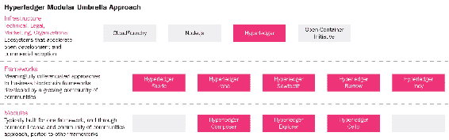

+   **Iroha**：Hyperledger Iroha 是由 Soramitsu、日立、NTT DATA 和 Colu 贡献的区块链框架。旨在供 Android 和 iOS 包下的移动应用程序开发人员使用。采用 C++编程包和 YAC 共识算法进行简单设计。

+   **Sawtooth**：它由英特尔投入，并根据网络规模使用多种共识算法构建。默认情况下，Hyperledger Sawtooth 使用**时间过证明**（**PoET**）来实现节点之间的共识。旨在灵活支持受权限和无许可实施。

+   **Indy**：Hyperledger Indy 是一个分布式分类账，用于实现分散身份的企业解决方案，并提供对多种支持的**分布式分类账技术**（**DLT**）的互操作性。旨在在节点和整个交易过程中实现隐私。

+   **Burrow**：Hyperledger Burrow 是一个可许可的智能合约，提供了带有 Ethereum 虚拟机（EVM）的可许可的智能合约解释器的模块化区块链客户端。 

# Hyperledger Fabric 模型

Hyperledger Fabric 项目由 IBM 区块链平台提供支持，并由 Linux 基金会托管，其主要亮点是机密交易的权限网络、可编程的商业逻辑和无需加密货币计算方法。

我们正在看到了很好的结果，并积极准备过渡到 1.1.0 版本。我们的最新产品，IBM 区块链平台入门计划，将是市场上首批推出这一新版本的产品之一——IBM 区块链技术副总裁 Jerry Cuomo。

在了解 Hyperledger Fabric 和 Hyperledger 项目的其他项目之后，现在是时候了解这项技术的实际情况，以及在部署步骤中遇到的一些挑战。

# Hyperledger Fabric 核心组件

在理解交易流程之后，重要的是了解网络中多个节点之间的通信是如何建立和维护的：

+   **节点：**在 Hyperledger 网络中存在以下三种角色：

    +   **客户端**：客户端在网络上提出交易请求。它必须连接到对等方才能参与区块链。客户端有权将所需的对等方连接到网络。

    +   **对等方**：对等方监听账本更新并保存其副本。根据其性质，可能存在两种进一步的类型：

        +   **认可对等方**：认可者模拟和认可交易

        +   **提交对等方**：在网络中提交交易之前，提交者验证交易

    +   **排序服务**：排序服务接受认可的交易，将其排列并排序为一个区块，最终交付给提交对等方。排序服务还为客户端和对等方提供了一个共享和安全的通信渠道。它作为广播交易的媒介，帮助我们将其交付给对等方。

+   **分类账**：就像比特币和以太坊一样，Hyperledger 分类账提供了系统运行期间所有有效和无效交易的经过验证的列表。它由一个排序服务创建，并保存在网络中的所有对等方那里。

+   **通道**：Hyperledger Fabric 通道是节点之间进行机密交易的受限通信媒介。通道对于成员、共享账本、链码应用程序和排序服务节点是特定的。加入通道的每个对等方都必须从**成员服务提供商**（MSP）那里获得许可，MSP 验证每个对等方与其各自的通道对等方和服务。

+   **世界状态：**这反映了网络中所有资产的当前数据状态。数据以以下格式安全地存储：

    +   **LevelDB**：这是 Hyperledger Fabric 的默认数据库，简单地存储键/值对。

    +   **CouchDB**：这非常适合 Web 和本机应用程序，它以原生 JSON 进行通信。它支持所有数据存储需求的二进制。

+   **链码：**链码管理网络中成员同意并创建的业务逻辑。它是用 GO—Node.js 编写的程序：

    +   **LevelDB**：这是在受保护的 Docker 容器上运行的默认编程语言，管理账本状态。

    +   **CouchDB**：这是另一种存储 JSON 对象的数据库编程语言。它还支持键范围、复合和完整的数据丰富查询。

+   **共识：**共识是就要添加到账本的一组交易达成一致的过程。在 Hyperledger Fabric 中，共识是通过以下三个步骤实现的：

    +   交易背书

    +   订购

    +   验证和承诺

现在，让我们了解这些共识组件以及它们如何与 Hyperledger 和其交易处理方法配合工作。

# Hyperledger 和交易处理的工作

Hyperledger 和交易处理的工作可以解释如下：

1.  **交易提案**：在 Hyperledger Fabric 中，该过程始于客户端应用程序发送交易提案：

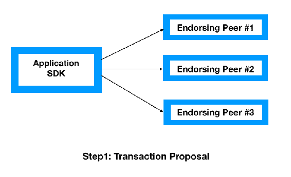

每个客户端应用程序向背书对等方提出交易以进行模拟和背书过程。

1.  **背书人将 RW 集发送给客户端**：每个背书对等方都模拟提议的交易，并存储一组被命名为**RW 集**的读取和写入数据。这些集合由背书对等方签名，并返回给客户端应用程序：

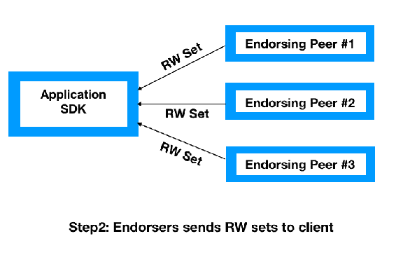

**交易背书**：这是模拟交易的签名响应。可以通过策略链码定义几种方式的交易背书，它类似于智能合约。一个交易背书策略类似于一个已定义的链码。

1.  **客户端应用程序服务**：一旦客户端应用程序接收到 RW 集和背书交易，就必须将这些提交给订购服务。无论其他客户端应用程序提交的交易背书和 RW 集如何，该方法都会继续运行：

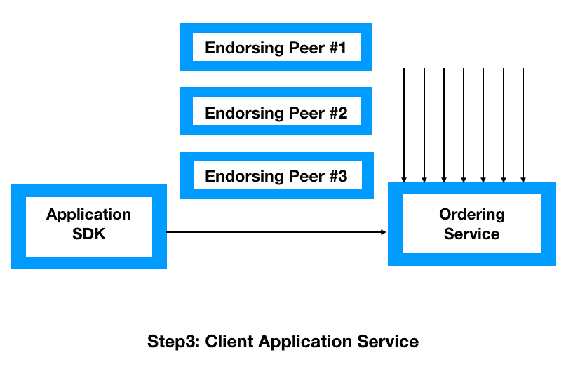

1.  **订购者将交易以块的形式发送给提交对等方**：订购服务接受 RW 集和背书交易，并将它们排列成块，然后将它们转发给提交对等方：

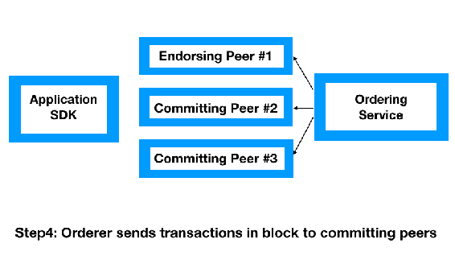

订购服务负责组织所有交易，然后将它们提交到分类账中。默认情况下，Hyperledger Fabric 的订购服务是 Kafka，这是一个由**Apache Software Foundation**（**ASF**）开发的开源流处理平台。

现在，让我们更详细地了解订购服务的工作原理。将这分为核心部分是很重要的：

+   **订购服务的第一部分**：一旦在指定的时间段内准备好了一定数量的交易，就会创建一个区块，并且这些交易会按照时间顺序提交。与比特币区块链不同，Hyperledger Fabric 提供了最适合的订购机制，这有助于组织设计一个粒度细致、灵活、可扩展的去中心化网络。

+   **订购服务的第二部分**：Hyperledger Fabric 支持三种订购服务机制——SOLO、Kafka 和**简化拜占庭容错**（**SBFT**）：

    +   **SOLO**：这对于软件开发人员进行研究和测试目的最合适，并且只有一个订购节点。

    +   **Kafka**：这是另一种 Hyperledger Fabric 订购机制，已经准备就绪。它由 ASF 开发，并提供了一个统一的、高效的、低延迟的软件平台来处理实时数据流。在 Hyperledger Fabric 中，Kafka 处理读写集和背书交易。

    +   **SBFT**：这类似于比特币区块链的 PoW 共识机制。此解决方案旨在克服拜占庭故障，即使网络中存在恶意节点或一组恶意节点，系统也可以正常工作。

1.  **提交的对等方验证区块中的每个交易**：提交的对等方验证交易，以确保读写集与当前世界状态匹配。一旦提交对等方验证了交易，交易就会被更新到总账上，并且世界状态会自动使用读写集中的写入数据进行更新：

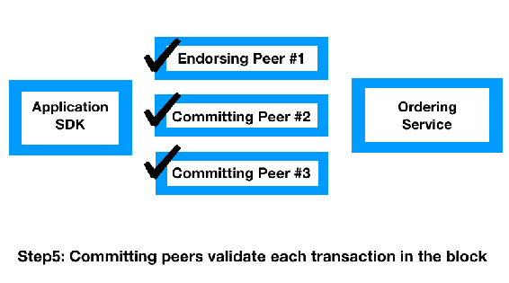

最后，提交的对等方必须通知客户端应用程序交易成功或失败。

1.  **身份验证**：在交易流程的每个步骤中，从背书到版本检查，身份验证始终是一个持续进行的过程。

# 比特币与以太坊与 Hyperledger

区块链是最激动人心的创新，仍然在加密货币领域中广受欢迎。在过去的几年里，该行业也认识到了区块链对其商业模式运营和管理的影响。尽管区块链技术在其原生形式下运行得很顺畅，但大多数业务需求从未适合一站式解决方案。因此，我们有了几个版本的区块链网络。让我们首先了解一下其特性，以便我们能够详细了解一些流行区块链模型之间的比较：

+   **权限限制**：这定义了事务处理器的资格，以创建或阻止现有账本。在这个背景下，存在以下两种模型：

    +   **权限区块链**：在此模型中，只有预选用户可以进行交易处理。Hyperledger Fabric 就是这样一个例子。

    +   **无需许可的区块链**：该模型不限制交易处理器创建或添加新区块。以太坊和比特币是其中最受欢迎的例子之一。

+   **对数据的受限访问**：这指明了区块链网络上的读取权限。以下是两种模型：

    +   **公共区块链**：在读取正在进行的交易时没有限制。任何人都可以使用区块链节点客户端下载更新的区块链账本。

    +   **私有区块链**：在此模型中，只有预选用户可以访问区块链账本。

+   **共识机制**：在分布式网络中，实现无需信任的网络和确定所有交易的共识至关重要。这确保只有有效和合法的交易被添加到区块链中。PoW、PoS 和 PBFT 是一些共识算法的例子。

+   **可扩展性**：可扩展性取决于两个因素——**节点**和**性能**。节点可扩展性是指可以添加到网络中而不影响整体性能的节点数量，而可扩展性取决于每秒交易数。

+   **匿名性**：这指的是区块链中用户的身份是公开还是隐藏的。

+   **治理**：这是分布在区块链社区中的决策权的级别。区块链平台必须由核心开发团队或其他利益相关者维护。

+   **原生货币**：这指的是区块链内有效的货币，例如比特币与比特币区块链。

+   **脚本化**：这指的是**去中心化应用程序**（**dApp**）支持的编程水平：

| **特征** | **比特币** | **以太坊** | **Hyperledger** |
| --- | --- | --- | --- |
| 权限限制 | 无需许可 | 无需许可 | 许可 |
| 对数据的受限公开访问 | 公开 | 公开或私有 | 私有 |
| 共识 | PoW | PoW | PBFT |
| 可伸缩性 | 高节点可伸缩性，低性能可伸缩性 | 高节点可伸缩性，低性能可伸缩性 | 低节点可伸缩性，高性能可伸缩性 |
| 中央化监管（治理） | 低，由社区/矿工去中心化决策 | 中等，核心开发者团队，但 EIP 流程 | 低，基于 Linux 模型的开放治理模式 |
| 匿名性 | 假名性，不加密交易数据 | 假名性，不加密交易数据 | 假名性，加密交易数据 |
| 原生货币 | 是，比特币 | 是，以太坊 | 否 |
| 脚本化 | 有限的基于堆栈的脚本化可能性 | 高可能性，调整完备的虚拟机，高级语言支持—Solidity | 高可能性，调整完备的链码脚本化，高级 Go 语言 |

# Hyperledger Fabric 的能力

Hyperledger 提供了一套全套的企业级业务解决方案，以提供带有增加的安全性、保密性和性能的安全且可伸缩的价值。Hyperledger Fabric 提供以下功能和核心能力：

+   **身份管理**：为了成为一个有权限的网络，Hyperledger Fabric 提供了一个维护用户 ID 并在网络中对每个用户进行身份验证的会员身份服务。一个用户 ID 可以被允许调用一个链码应用程序，但可以被阻止启动一个新的链码。

+   **高效处理**：Hyperledger 根据交易排序和承诺为每个节点分配角色。随着并发执行的增加以及提高交付每个订单的时间，整体性能得到提高。

+   **隐私和保密性**：私人频道限制消息传递路径，为特定网络成员提供交易隐私和保密性。整个数据，包括成员信息、交易和频道细节，对其他网络成员来说都是不可见且无法访问的。

+   **链码功能**：这涉及链码应用程序，是 Hyperledger Fabric 的业务逻辑。链码确保所有转移所有权的交易受其规则和要求约束。通道的操作参数通常由系统链码定义，而验证系统链码定义了背书和验证交易的要求。

# 实验室

在了解 Hyperledger Fabric 的架构、组件、交易流程和链码的洞见后，现在是时候整合这些部分进行实验室了。为了保持实验室的可访问性，我们将从 GitHub 托管的实验室环境中运行实验室，网址为：[`fabric-sdk-node.github.io/`](https://fabric-sdk-node.github.io/)。

# Tuna 应用

Tuna 应用是关于在供应链中不同方之间转移金枪鱼货物。整个应用程序都是用 Node.js 编写的，使用 gRPC 与链码进行交互：

+   **目标**：使用 Fabric Node SDK，与 Hyperledger 区块链建立连接。对等节点将被配置为与其特定应用程序的链码容器通信。在这个练习结束后，我们将熟悉如何使用 Node.js SDK 与网络进行通信。我们还将了解应用程序链码网络和账本如何相互交互。

+   **基本安装**：如果你还没有为这门课程下载`education`仓库，可以在终端窗口中按照以下说明操作：

```
$ git clone https://github.com/hyperledger/education.git 

$ cd education/LFS171x/fabric-material/tuna-app 

```

在运行下一个命令之前，请确保您的计算机上正在运行 Docker。我们需要确保我们已经完成了本章中的 Hyperledger Fabric 部分的安装，然后再继续进行本应用程序部分，因为我们可能会遇到错误。首先，删除任何现有的容器，因为它们可能与本教程中的命令冲突：

```
$ docker rm -f $(docker ps -aq) 
```

现在，让我们使用以下命令启动 Hyperledger Fabric 网络：

```
 $./startFabric.sh 
```

+   **故障排除**：如果在运行前一个命令后，您收到类似以下错误：

```
ERROR: failed to register layer: rename /var/lib/docker/image/overlay2/layerdb/tmp/write-set-091347846 /var/lib/docker/image/overlay2/layerdb/sha256/9d3227c1793b7494e598caafd0a5013900e17dcdf1d7bdd31d39c82be04fcf28: file exists 
```

然后尝试运行以下命令：

```
$ rm -rf 
~/Library/Containers/com.docker.docker/Data/*
```

从`package.json`文件安装所需的库，注册我们网络的管理员和用户组件，并使用以下命令启动客户端应用程序：

```
$ npm install 
$ node registerAdmin.js 
$ node registerUser.js 
$ node server.js 
```

在任选的浏览器窗口中简单地打开`localhost:8000`即可加载客户端，你将在此 URL 看到我们简单应用的用户界面，如下截图所示：

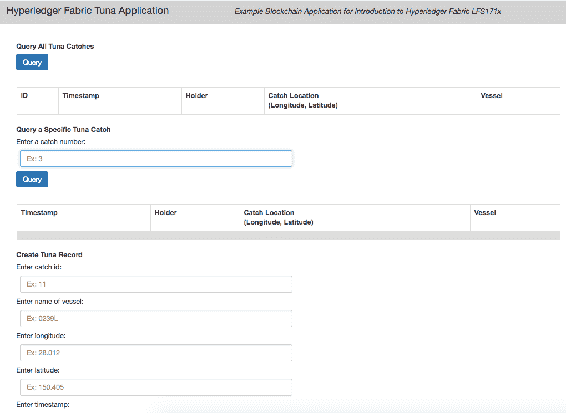

+   **故障排除**：如果客户端无法连接金枪鱼服务器，则需要执行以下命令：

```
Error: [client-utils.js]: sendPeersProposal - Promise is rejected: Error: Connect Failed error from query =  { Error: Connect Failed at /Desktop/prj/education/LFS171x/fabric-material/tuna-app/node_modules/grpc/src/node/src/client.js:554:15 code: 14, metadata: Metadata { _internal_repr: {} } }  
```

尝试运行以下命令：

```
 $ cd ~ 
$ rm -rf .hfc-key-store/. 
```

然后，从上一条命令开始运行之前的命令：

```
$ node registerAdmin.js 
// File Structure tuna-app/tuna-chaincode.go
```

这是包含我们样本金枪鱼应用程序所有业务逻辑的链码文件：

+   +   `tuna-app/app.js`：这是一个 JavaScript 客户端代码，位于`app.js`中，用于操作用户界面的 HTML 元素

    +   `tuna-app/index.html`：这是一个 HTML 文件，包含客户端应用程序的 UI

    +   `src`：这是一个包含使用**软件开发工具包**（**SDK**）连接客户端请求到网络和链码函数的代码的文件夹

    +   `tuna-app/src/controller.js`：其中包含执行操作和查询数据的函数

    +   `tuna-app/src/server.js`：`server.js`用于在`localhost:8000`上查看 UI

+   **验证**：现在，让我们查询我们的数据库，在那里应该有一些样本条目，因为我们的链码智能合约使用 10 个先前捕获的函数初始化了分类帐，该函数不带任何参数。正如我们在第 6 行所见，它接受一个空数组。

```
// queryAllTuna - requires no arguments  
const request = {  
chaincodeId:'tuna-app',  
txId: tx_id,  
fcn: 'queryAllTuna',  
args: ['']  
};  
return channel.queryByChaincode(request);
```

该代码来自`..src/queryAllTuna.js`。

现在，让我们查询我们的数据库，在那里应该已经有一些样本条目，因为我们的链码智能合约使用了十个先前的捕获来初始化分类帐。该函数不带任何参数，正如我们在前面的代码中的第 6 行所看到的。相反，它接受一个空数组。可以在用户界面中看到的查询响应是十个预填充的条目，每个条目都有其捕获的属性：

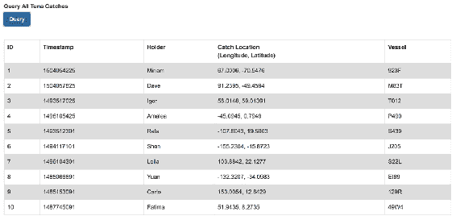

以下代码是用于查询记录的特定金枪鱼：

```
// queryTuna - requires 1 argument  
const request = {  
chaincodeId:'tuna-app',  
txId: tx_id,  
fcn: 'queryTuna',  
args: ['1']  
};  
return channel.queryByChaincode(request);
```

该代码来自`..src/queryTuna.js`。

现在，让我们查询特定的金枪鱼捕获情况。此函数需要一个参数，正如您在代码的第 6 行中所看到的。例如 `['1']`。在此示例中，我们正在使用密钥查询捕获情况。您应该会看到以下查询响应，详细说明了记录在一个特定捕获中的属性：

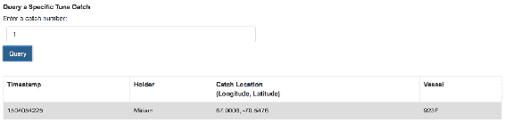

以下代码是用于更改金枪鱼持有者的：

```
// changeTunaHolder - requires 2 argument  
var request = {  
chaincodeId:'tuna-app',  
fcn: 'changeTunaHolder',  
args: ['1', 'Alex'],  
chainId: 'mychannel',  
txId: tx_id  
};  
return channel.sendTransactionProposal(request);  
```

代码来自 `..src/changeHolder.js`。

现在，让我们更改持有给定金枪鱼的人的名称。此函数需要两个参数-特定捕获的键和新持有者，正如我们在前述代码的第 5 行中所看到的。例如，`args: ['1', 'Alex']`。您可能会在您的终端窗口中看到类似的成功响应：

```
The transaction has been committed on peer localhost:7053 event promise all complete and testing complete Successfully sent transaction to the orderer. Successfully sent Proposal and received ProposalResponse: Status - 200, message - "OK", metadata - "", endorsement signature: 0D 9  
```

这表明我们已通过 SDK 从我们的应用程序发送了提案，并且对等方已被认可和提交，账本已被更新：

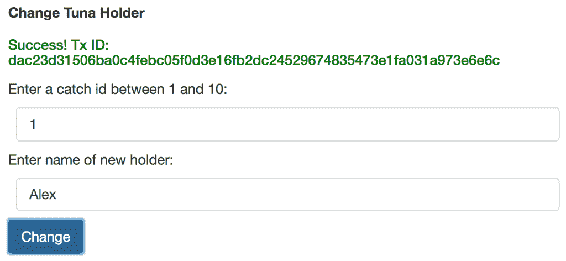

您应该看到通过再次查询键 `1` 确实已更改持有者。现在，持有者属性已从 `Miriam` 更改为 `Alex`：

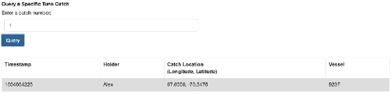

+   **结束**: 使用以下命令在 `tuna-app` 文件夹中移除我们在本教程中创建的所有 Docker 容器和镜像：

```
$ docker rm -f  
$(docker ps -aq)  
$ docker rmi -f $(docker images -a -q)  
```

# 摘要

我们探索了一种新的区块链 Hyperledger 项目类型，旨在解决业务挑战和克服分布式账本技术。 Hyperledger 是由 Linux Foundation 领导和托管的唯一的团队项目，该项目持续进行路线图，以分布式账本即服务模型改革业务。该项目帮助行业避免部署区块链的困难，就像 WordPress 解决了建立网站的困难一样，Apache 解决了建立数据库的问题一样。

在下一章中，我们将了解区块链技术如何影响现有和传统的安全模型，即**机密性、完整性和可用性**（**CIA**）三元模型。

# 问题

通过金枪鱼应用程序，我们已经成功地理解了 Hyperledger Fabric 的工作原理和测试。然而，要解决网络安全挑战，重要的是我们探索现有解决方案以及它们如何能够通过分布式账本技术或通用区块链甚至是 Hyperledger 项目得到改进。因此，重要的是涵盖以下几点：

1.  Hyperledger Fabric 是否可以用于公共区块链？

1.  Hyperledger 能与传统数据库连接吗？
