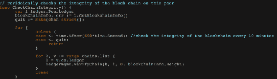

# 第五章：区块链在 CIA 安全三元之上

在前一章中，我们涵盖了 Hyperledger 模型，其核心组件，其流程和链代码编程。在本章中，我们将涵盖一种将本地区块链和 Hyperledger 的组件以**保密性，完整性和可用性**（**CIA**）安全三元模型的形式进行排列的基本方法。这个三元模型是与区块链结构联系最紧密的最古老和最流行的安全框架之一。CIA 三元模型是一个帮助组织构建其安全姿态的模型。我们将了解这三个核心元素如何影响区块链技术，以及如何使用这个安全模型来组织区块链的最佳使用。

在本章中，我们将涵盖以下主题：

+   什么是 CIA 安全三元？

+   区块链在机密性上

+   区块链在完整性上

+   区块链在可用性上

# 什么是 CIA 安全三元？

CIA 是一个用于安排信息安全团队使用的**信息安全**（**infosec**）团队的一系列安全控制和系统的框架/模型。有时也被称为**可用性、完整性和机密性**（**AIC**）安全三元。这个三元模型的目的是提供一个标准框架来评估和部署信息安全政策，而不考虑底层技术、网络或系统。

# 机密性

机密性是一种将信息隐藏在未经授权的人们之外的方式。当必须保密的信息保持保密时，就实现了机密性。在当前数字连接的时代，每个人都非常渴望知道被保密的信息。安全机构就是违反机密性的一个主要示例，这样他们就可以进行取证和使用监视录像。出于经济动机的网络犯罪分子会尽最大努力侵入安全系统，并获取有利于他们业务对手的机密文件。

永无止境的竞争一直存在于对手和防御者之间。组织每年都在花费数百万美元来通过加密和访问控制系统实现全栈机密性。每天都在测试几种方法来保护静态数据和动态数据。

# 完整性

完整性是一种保护未经授权篡改信息的方式。这是每一个信息安全机构的强制合规要求。这也是一种在整个数据生命周期中维护数据的一致性、准确性和可信度的方法。数据必须完全安全，并且任何未经授权的访问都应该被禁止。有助于上述事项的某些措施包括文件权限和用户访问控制。

# 可用性

可用性是指及时可靠地访问数据。从数据到信息，再到价值的路径意味着如果信息在正确的时间不可用，则价值将是非法的。**分布式拒绝服务**（**DDoS**）和勒索软件攻击是一些恶意行为者手中最强大的武器，他们使用这些攻击使得具有授权和合法访问权限的人无法获取信息。组织机构做出了多次尝试来对抗这些攻击，包括网络应用防火墙、DDoS 保护、**内容分发网络**（**CDN**）甚至灾难恢复。

# 了解区块链的保密性

每一种数字连接技术都伴随着安全挑战的成本，这些挑战可能涉及隐私暴露、保密性泄露、身份盗窃等等。区块链技术是一种运行在数字生态系统上的计算技术，因此重视其基本安全挑战变得至关重要。每一个全球连接的企业都会为网络安全拨出年度预算，以便他们能够保持信息和关键资产的保密性。让我们了解当前区块链模型的机密程度及其未来的路线图。

# 现有模型中的保密性

正如我们已经知道的那样，区块链技术是随着比特币而引入的。然而，它从未被设计为具有限制性质，因为任何具有客户端软件的人都可以参与区块生成过程，或者在比特币的情况下进行挖矿。关于区块链的保密性，简单来说就是要将交易信息隐藏在网络中不需要的参与者。然而，由于比特币等公共区块链的开放和无权限性质，要实现更好的保密等级可能极为困难。

# 企业、区块链和保密性

在谈论业务时，保密性成为网络安全领域中实现与客户和其他利益相关者之间更好信任的关键支柱。许可区块链因其仅允许预先选择的参与者访问分布式分类账网络中的数据而受到极大赞赏。当一个企业与另一个企业互动时，不仅仅是关于分享多少信息，还涉及谁应该在什么条件下访问哪些信息。在考虑超级账本（Hyperledger Fabric）时，IBM 建议记住以下几点：

+   在每一笔交易中，重要的是要知道参与者是否可以看到完整信息、部分信息或根本没有信息。这必须在智能合约中说明。

+   如果监管机构已被指定，则他们必须确认监管机构访问的数据范围。

+   了解您的网络性质——静态还是灵活——非常重要，因为保密性参数可能会根据新的参与者角色和需求在将来发生变化。

# 使用 Hyperledger Fabric 实现保密性

Hyperledger Fabric 提供了一组库文件，可轻松实现保密性特性：

+   **基于属性的访问控制**（**ABAC**）：用户访问交易的决定取决于其身份。这可以通过 ABAC 实现。ABAC 可以支持链码和整个区块链。在部署交易期间使用的属性必须在用户进行 Tcert 创建时传递。确定用户是否可以执行任何特定的链码是一个重要步骤。**属性证书颁发机构**（**ACA**）在验证属性并返回**属性证书**（**ACert**）方面起着重要作用。ACA 维护数据库，以便公司可以为用户及其从属关系存储属性。

+   **Hyperledger Fabric 加密文学**：智能合约可以配置为加密交易中的信息或信息子集。这些信息将使用密钥加密存储在账本上，只有应该查看和访问它的节点才能使用密钥解密。如果背书策略需要来自不同组织的节点，则必须在将其包含在交易提案中之前对信息进行加密。

# 区块链上的完整性

尽管在网络安全方面花费了更多的资金，但仍然有几家组织不愿意使用公共云解决方案。将数据加密发送到云端是一种常见做法，但加密只能提供对内部攻击的可靠保密性；它无法保护数据免受配置错误、软件错误或间谍行为造成的破坏。虽然区块链技术在使用哈希算法和默克尔树模型实现不可篡改性方面有自己的可靠方法，但我们必须尝试理解它如何在现实世界的应用和 Hyperledger Fabric 中实际运作。

# 当前区块链网络中的完整性

完整性是避免任何数据篡改的一种方式。区块链使用密码哈希来确保账本的不可篡改性。这种哈希函数的关键特性之一是它总是单向的，这意味着从哈希结果或消息摘要中逻辑上不可能恢复数据。分析消息摘要的模式并预测原始数据也很困难，因为实际消息的轻微变化可能导致很大的差异。无论是哪种区块链，它们都广泛使用哈希技术，具体包括：

+   以太坊账户标识符是通过将公钥与 Keccak-256 哈希算法进行哈希而创建的

+   比特币地址是通过使用 SHA-256 算法对公钥进行哈希计算得出的

# 区块排列和不可变性

正如我们已经知道的那样，每个节点都以连接的区块形式存储账本，并且创建新区块取决于前一个区块的哈希值。这阻止了对账本中的任何区块进行恶意尝试干扰、修改或删除的可能性。这帮助组织实现了新的网络安全完整性水平，并提供了一个平台，您可以在此平台上开发防篡改的业务应用程序。

# 通过 Hyperledger 实现完整性

虽然 Hyperledger Fabric 是分布式账本技术的又一种变体，但有几个关键属性使其与其他技术区别开来。在将新区块添加到账本之前，提交节点总是会验证新区块。节点被入侵的情况意味着该区块可能会被篡改。为了避免这种情况，有一些方法可以纠正区块被添加到账本的方式。

# 验证链的完整性

在此方法中，每个节点定期验证其区块链，并要求节点重新检查是否检测到破损区块。必须调用一个名为`CheckChainIntegrity()`的函数来保持完整性检查运行：

# 理解区块链的可用性

业务应用程序可以通过网络（公共或私有）访问，这些应用程序是一组代码，只有在需要时才具有价值。区块链是在云上运行的软件应用程序，并且在没有被破坏或干扰时保持其价值。对于用户来说，区块链的面貌只是一个**分散式应用程序（dApp）**，为了始终保持其可用性，系统的前端和后端都应该无缝运行。

# 在当前区块链网络中的可用性

及时和可靠的信息访问类似于可用性。DDoS 等网络攻击会对互联网服务造成巨大的破坏，并导致网站不可访问，这会给企业造成巨大损失。区块链的分散化性质使得更难以干扰这些应用程序。

# 无单一故障点

即使区块链中的一个节点出现故障，信息仍然可以被网络中的其他节点访问和使用。由于所有节点都保留账本的完全副本，因此账本始终是最新的。网络中的所有节点在逻辑上都是分散的，并且系统故障的可能性为零。

# 商业与可用性

当涉及到区块链时，其可用性取决于有效和成功的交易。对于每个企业来说，记录所有交易是核心功能，而这些交易可能是业务活动、资产条目、供应链管理记录等的条目。

# 摘要

在本章中，我们研究了 CIA 安全三元组对区块链技术的影响。虽然比特币区块链足够强大，可以证明符合 CIA 安全框架，作为一个区块链，它受到了多个组织的赞赏和采纳，并且市场上出现了多种区块链来满足特定的商业模式。我们已经看到 Hyperledger Fabric 如何适用于 CIA 安全三元组，以及何以使 Hyperledger Fabric 系统成为商业友好的解决方案。

# 问题

在了解原生区块链和 Hyperledger Fabric 的 CIA 安全三元组系统如何运作之后，重要的是要解决一些问题，例如：

1.  Hyperledger 和其他项目如何适用于 CIA 安全三元组？

1.  有哪些广泛使用的方法来增强 dApp 的可用性？

# 进一步阅读

要更详细地探讨区块链背景下 CIA 安全三元组，读者可以使用以下链接：

+   *区块链中的机密性* 在 [`ethereum.stackexchange.com/questions/25270/confidentiality-in-blockchain`](https://ethereum.stackexchange.com/questions/25270/confidentiality-in-blockchain)[.](https://ethereum.stackexchange.com/questions/25270/confidentiality-in-blockchain)

+   *私有区块链中的数据机密性* 在 [`gdr-securite.irisa.fr/redocs/download/redocs17-gemalto.pdf`](https://gdr-securite.irisa.fr/redocs/download/redocs17-gemalto.pdf)[.](https://gdr-securite.irisa.fr/redocs/download/redocs17-gemalto.pdf)
