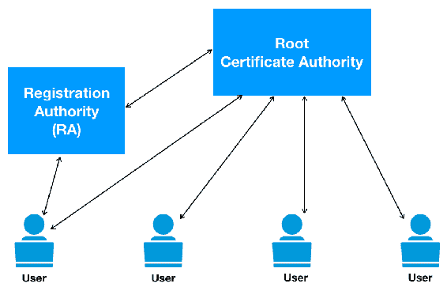

# 使用区块链部署基于 PKI 的身份

组织有多个应用程序需要管理，这些应用程序托管在不同的系统和服务器上。 组织已经部署了多种身份验证用户的方式，例如多因素身份验证系统，每个系统/应用程序一个，**单点登录**（**SSO**），以及目录服务器；然而，在互联网上对用户进行身份验证是一种相对困难的机制。 在交换信息之前在互联网上建立信任是非常重要的，因为互联网对受信任和不受信任的各方都是开放的。 为了在公共网络上建立信任，需要一个独立的可信方。 **公钥基础设施**（**PKI**）是一个开放的框架，旨在解决互联网连接用户之间的信任因素。

本章中，我们将学习以下主题：

+   公钥基础设施

+   现有 PKI 模型的挑战

+   区块链技术如何帮助？

+   实验室和测试结果

# PKI

组织有数百个基于云的应用程序需要管理和维护。 管理单个访问控制和身份验证是一项困难的日常任务。 当涉及到互联网用户和庞大的 Web 应用程序时，很难信任单个网站，并且用户往往会通过它们失去他们的隐私和机密信息。 PKI 提供了一种安全的方式来验证个人的身份。

企业可以通过采用 PKI 来简化应用程序部署和管理问题。 随着企业越来越多地转向基于云的应用程序，保护安全敏感的应用程序免受新兴威胁的影响至关重要。 在线通信时存在几种安全威胁，例如身份盗窃，**中间人**（**MITM**）攻击和数据泄露。

# PKI 简介

互联网允许任何人连接到任何其他人，与现实世界不同，不存在地理/物理障碍。 这使得在互联网上识别一个人并建立进一步通信的信任变得困难。 在下图中，Alice 想要通过互联网与 Bob 交流； 但是，Bob 拒绝了，因为他没有任何手段验证 Alice 的身份：


PKI 通过在 Bob 和 Alice 之间添加一个**受信任的第三方**（**TTP**）来解决这个问题。 因此，在他们开始相互了解之前，他们必须建立信任，而 TTP 有助于实现这一点。 在下图中，Alice 与 Bob 共享数字证书，Bob 使用来自受信任证书颁发机构的公钥来解密此签名并验证 Alice。


在前面的图表中，TTP 是**证书颁发机构**（**CA**）。 这个 CA 生成了一个证书，帮助互联网用户在互联网上展示他/她的身份：

+   **PKI：**PKI 提供了一个层次化的标准，用于管理实体的数字资产以建立安全的通信渠道。它不仅仅局限于用户；它也被多个不同的系统使用，如电子邮件、Web 应用程序、智能卡等，稍后将进行解释。

+   **网络设备：**PKI 用于通过 802.1X 认证控制对路由器和交换机的访问。

+   **应用程序：**应用程序需要从 CA 获取签名证书才能在操作系统中运行。

+   **IPsec 隧道：**路由器和防火墙使用证书来认证互联网上的其他端点。

+   **半径服务器：**一个 **轻量级目录访问协议**（**LDAP**）查询受到 PKI 证书的保护。

以下图表显示了 PKI 安全架构：


# PKI 的演变

X.509 设计详细说明了通过 CA 数字签名的证书存储和分发公钥的数据格式和流程。然而，X.509 不包括一个规范来指定支持证书的许多子字段和扩展，如下所示：


标准化工作准备了 X.509 第 3 版以及第 2 版证书吊销列表的 PKI 概述。在 RFC 2459 出现之前，有大约 11 个草案来增强 X.509 标准。

RFC 2510 是为了指定在 PKI 中使用的消息协议而制定的。在此之后，出现了两个并行发展，一个是需要一个注册协议，另一个是倾向于使用 PKCS#10 消息格式。以下图表解释了 PKI 标头的演变。在第 2 版中，标头添加了发行者唯一 ID 和主题唯一 ID。在第 3 版中，引入了一个扩展字段来标识策略和其他相关信息，如下所示：


此外，证书请求语法是在 S/MIME WG 中使用 PKCS#10 开发的。通过 RFC 2510，定义了一个简单的注册协议，但它没有使用 PKCS#10 作为证书请求格式。

# 组件

PKI 是一个由各种组件、应用程序、策略和实践组成的集合，用于结合并实现三个安全原则，即完整性、身份验证和不可否认性。数字证书是 PKI 中的主要组件，因为它们在互联网上充当数字身份。PKI 的五个核心组件将在以下小节中解释。

# 非对称密钥加密

在密码学中，加密是将信息编码以使只有预期的一方能够看到的过程。有两种方法可以实现这种密码学加密，分别定义如下：

+   **对称加密：**在对称加密中，相同的密钥用于加密和解密数据。需要确保双方使用相同的密钥来加密和解密数据，如下所示：


+   **非对称加密：**在非对称加密中，使用不同的密钥集来加密和解密数据。该密钥对是公钥和私钥的组合。公钥用于加密数据，而私钥用于解密数据。公钥随数据一起通过互联网传输，但私钥保留给使用它的个人，如下所示：


公钥和私钥对包括两个唯一相关的加密密钥。以下是公钥的示例：

```
3048 0241 00C9 18FA CF8D EB2D EFD5 FD37 89B9 E069 EA97 FC20 5E35 F577 EE31 C4FB C6E4 4811 7D86 BC8F BAFA 362F 922B F01B 2F40 C744 2654 C0DD 2881 D673 CA2B 4003 C266 E2CD CB02 0301 0001
```

公钥通过互联网向所有人提供，并存储在可访问的仓库或目录中。另一方面，私钥必须保持对其所有者的私密；因此，它也被称为**秘密密钥**。

公钥和私钥之间在数学上是相关的；因此，使用公钥加密的数据只能由相应的私钥解密。

# 证书

证书是代表用户或设备的身份有兴趣通过网络进行通信的电子 ID。证书基本上确保只有合法用户才能连接到网络。证书是通过由受信任的第三方（即 CA）对公钥进行签名来生成的。

以下是三种主要类型的证书：

+   **安全套接字层（SSL）证书**：SSL 服务器证书安装在托管服务的服务器上，例如 Web 应用程序、邮件服务器、目录或 LDAP 服务器。此证书包含有关拥有应用程序的组织的标识信息。SSL 证书还包含一个系统公钥。证书的主题与服务器的主机名匹配。此证书必须由受信任的证书颁发机构签名。主机名在证书的主题字段中列为通用名称。

+   **客户端证书**：客户端证书用于识别互联网用户、设备、网关或任何其他类型的设备。它是一种数字凭证，用于验证拥有该证书的客户端的身份。如今，许多应用程序允许使用证书来验证用户对特定资源的身份，而不是使用用户名和密码。通过电子邮件进行通信的两个用户还将使用客户端证书来验证各自的身份。

+   **代码签名证书**：代码签名证书用于对在系统上运行的软件进行签名。由于用户机器下载了数百万个应用程序，因此验证代码非常重要；因此，代码签名证书在其中发挥着重要作用。

+   **电子邮件证书**：发件人需要使用 S/MIME 协议确定向特定收件人使用哪个公钥。发件人从电子邮件证书中获取这些信息。通常，当组织内部和与其自己的 CA 进行邮件通信时，会使用 S/MIME 协议。

# 证书颁发机构（CA）

CA 是一个可信任的第三方，用来证明用户、服务器、数据库和管理员的身份。CA 检查用户的凭据并授予证书，并用密钥对其进行签名。CA 可以是本地解决方案，也可以是提供证书服务的托管解决方案，如下图所示：


CA 的功能如下：

+   颁发和交付证书

+   将证书和**证书吊销列表**（CRL）发布到存储库

+   处理证书所有者的吊销请求

在下面的屏幕截图中，我们可以看到客户端系统中的数字签名列表。有来自多个证书颁发机构的证书列表，以及它们的到期日期：


CA 的不同类型如下：

+   **公共数字证书颁发机构**：有几家管理商业和个人用途证书的公共证书提供者。只有支付了特定费用后才发放凭证。

+   **私人数字证书颁发机构**：组织管理员可以向域内部系统和用户颁发证书。Windows 服务器可以创建和存储密钥对，但这些私人证书对外部通信无效。

# 注册机构（RA）

RA 负责对需要证书颁发机构证书的新实体进行身份验证。它还维护本地注册数据信息，并发起对旧证书的更新和撤销流程。

RA 的功能如下，并在后续图表中进行了说明：

+   负责对需要从 CA 获得证书的新用户或系统进行身份验证

+   它还执行了 CA 的一些功能

+   它作为 CA 的代理

+   维护来自冗余证书的更新和吊销的本地注册数据：



# 证书库（CR）

CR 是一个可以被 PKI 环境中所有节点访问的证书数据库。它还保存了与证书吊销相关的信息和管理策略信息。证书吊销列表被用于从该存储库中获取更新后的证书列表。

证书库的功能如下：

+   允许以非验证方式检索信息

+   它作为一个数据库，保存公钥证书、吊销列表和策略等信息

# 架构

整个 PKI 架构都是基于名为*信任链*的模型。这个模型存在于每个身份之间的信任关系中。具体来说，两级层次结构和三级层次结构之间的区别在于第二层被放置在根 CA 和颁发 CA 之间。使用第二级 CA 的主要原因是要有一个负责向颁发 CA 签发证书的策略 CA，然而，三级层次结构提供了更好的安全性。这个策略 CA 也可以用作管理边界。如果管理员需要因为密钥泄露而撤销一些 CA，这个设计也很有用；撤销可以在第二级别执行，同时根的其他分支仍然可用，如下图所示：


在签名过程中，根 CA 用其秘钥对中间证书进行数字签名。这个过程确保中间证书经过根 CA 信任。每个 CA 都可以接收客户端的证书请求并签发。通常情况下，根 CA 是无法被客户端访问的，但是客户端有资格拥有根 CA 证书。客户端将证书请求发送给一些下级 CA 并进行安装，如下图所示：


在下图中，我们可以看到数字证书及其解密的流程。为了验证一方，数字证书通过使用公钥进行解密：


在了解了数字证书的层次结构，包括身份证书、中间证书和根证书，现在我们将了解客户端和 SSL 网站之间的通信是如何建立和处理的。客户端请求访问 HTTPS 网站。客户端的浏览器预装了一些根 CA 证书。具体步骤如下：

1.  客户端连接到 SSL 网站。

1.  网站以其身份和中间证书回应客户端。

1.  然后客户端使用中间公钥解密数字签名来确认中间证书的身份。

1.  然后客户端确认所请求的网址是否与身份证书中的显著名称匹配。如果不匹配，会显示警告。

1.  交通流量随后由客户端使用公钥进行加密/解密，服务器使用秘钥进行加密/解密。

# 证书生命周期

根据**国家标准与技术研究院**（**NIST**）的说法，加密密钥生命周期是密钥管理的预操作、操作、后操作和删除阶段的组合。考虑到密钥的有效性总是有限的，因此重要的是考虑在账户中花费的时间。因此，加密周期用于记录特定密钥被授权使用的时间。加密周期是通过结合加密将适用的估计时间以及它将被解密以供使用的时间来确定的，如下所示：


以下图示显示了具有多个密钥的加密周期流程图：


现在，我们可以检查密钥使用和处理的几个阶段：

+   **密钥生成**：加密密钥由密钥管理服务器生成并存储。密钥管理器通过使用安全的随机比特生成器进行加密过程生成加密密钥对。一旦密钥对被创建，它就会连同所有属性一起存储在密钥存储数据库中。这些属性通常包括名称、大小、实例、激活日期、滚动、镜像、密钥访问以及其他相关属性。密钥激活时间可以预定，也可以在创建时立即激活。加密密钥管理器跟踪加密密钥的当前和过去实例。

+   **密钥使用和滚动**：密钥管理器负责允许授权用户或系统检索信息，并允许它们进行加密或解密处理。它还负责在整个生命周期和每个实例中管理加密密钥的状态。如果一个组织有一项政策规定每年使用一组新密钥，那么密钥管理器应保留密钥的先前版本并只分发当前版本。但是，仍然可以检索以前的版本以执行解密过程。

+   **密钥吊销**：管理员连接到密钥管理器以吊销密钥，以便不再用于进一步的加密和解密过程。如果需要，管理员甚至可以重新激活密钥并用于进一步的步骤。在一些情况下，管理员还可以使用以前加密的解密数据，例如旧备份。加密生命周期如下图所示：


+   **备份（托管）**：NIST 建议为所有停用的密钥建立档案。这个档案必须受到任何未经授权的修改、删除和更改的保护。建议在其加密周期结束后具有可恢复密钥机制。

+   **密钥删除（销毁）**：如果密钥已经受到损害或长时间未被使用，管理员应选择从加密密钥管理器的密钥存储数据库中删除密钥。密钥管理器会删除密钥及其所有关联的实例，或者可以专门删除某些实例。当数据在其加密状态下受到损害时，此选项起到了重要作用。如果删除密钥，受损数据将完全安全且无法恢复，因为不可能重新创建加密密钥。

# 密钥管理

**密钥管理互操作性协议**（**KMIP**）用于客户端和服务器之间的通信，执行由密钥管理系统维护的存储对象的管理操作。这是一种标准化的管理加密密钥的方法，贯穿整个生命周期，并且已经发展成为促进对称和非对称加密密钥、数字证书和其他相关模板进行对象创建和管理的方法，具体如下所示：


在**结构化信息标准促进组织**（**OASIS**）的指导下，这是一个非营利性质的联盟，提供人们在互联网上和组织内交换信息的标准，客户端可以向密钥管理服务器请求的特定对象列表有：

+   **创建密钥或密钥对**：用于生成新的对称密钥或新的公钥/私钥对并注册新的托管加密对象。

+   **注册**：主要用于使用密钥、密码或一些其他加密材料注册托管对象。

+   **重新生成密钥**：为现有对称密钥或密钥对生成替代密钥，也称为密钥更改，用于现有的公钥/私钥对。

+   **派生密钥**：为了派生对称密钥或密钥对象，使用派生密钥来获取密钥管理系统已知的数据对象。

+   **定位**：为了找到一个或多个托管对象，使用定位请求来获取请求中指定的属性。

+   **检查**：用于检查请求中指定值的托管对象的使用情况。

+   **获取或获取属性**：用于返回由其唯一标识符指定的托管对象或与托管对象关联的一个以上属性。

+   **添加、修改或删除属性**：用于添加、删除或修改与托管对象关联的属性实例。

+   **激活**：用于激活托管的加密对象。

+   **Revoke**：用于撤销托管的加密对象。

+   **销毁**：当需要销毁特定托管对象的密钥材料时使用。

+   **存档**：用于指定托管对象。

+   **恢复**：用于访问数据恢复过程。

# 现有 PKI 模型的挑战

现有 PKI 模型的挑战如下：

+   **问题 1** – **需要额外安全性**：根据 Ponemon 研究所 2016 年的报告，62% 的企业在使用 PKI 部署基于云的应用程序，2015 年增长了 50%。如果中央证书存储库遭到破坏，将导致大规模的数据泄漏和账户被盗。组织倾向于使用额外的安全层，如**硬件安全模块**（**HSMs**）来保护其 PKI。HSMs 被部署来保护最关键的根和发行 CA 私钥的 PKI。组织正在选择多因素身份验证以及 HSM 的使用。

+   **问题 2** – **中央权威**：在当前互联网状态下，中央权威（根权威）负责管理 DNS 请求和响应（根权威）、X.509 证书等。因此，所有连接到互联网的设备和系统都必须信任第三方来管理公钥和标识符。以域名为例；即使它已被其所有者购买，实际上也属于第三方，如**互联网名称与数字地址分配机构**（**ICANN**）、域名注册商和证书颁发机构。

此外，这些受信任的第三方完全有能力拦截和破坏全球用户的完整性和安全性。有过几起案例表明，这些受信任的第三方已经向安全机构和其他机构分享了其客户的信息。他们可能出于金钱利益或准备客户行为分析而这样做。

# 区块链如何帮助？

由于其集中式管理系统，PKI 具有主要的漏洞。然而，区块链基本上是分散的，允许多个参与方之间进行通信，而不需要任何第三方参与。采用去中心化的方法可能是 PKI 的一次范式转移；然而，需要一个系统化的方法来部署它。

# 分散式基础架构

区块链是关于实现多个参与方的分散网络，无需第三方参与。**分散式公钥基础设施**（**DPKI**）是一个创新的概念，它在公共系统上实现了身份验证系统，而不依赖于可能损害系统完整性和安全性的单一第三方。正如我们已经知道的，区块链是建立在无信任的方法上的，允许信任和不信任的参与方相互通信。然而，通常通过几种共识模型来在地理和政治上分散的参与方之间建立信任，并形成账本状态。根据定义，区块链允许您在网络中的多个节点上存储任何类型的值。通过 DPKI，这个值将是一种秘密属性。

主体可以通过在区块链中注册标识符来直接控制全局可读的标识符，如网站域名。使用键值数据库，主体将标识符用作查找键。区块链可以允许分配保密资产，例如公钥和其他属性，并允许以一种安全的方式全局读取这些值，这是 PKIX 中可能受到中间人攻击的。通过允许最正确的公钥与标识符值关联，并通过对最新的公钥进行标识符查找来执行身份验证，可以实现这一点。

在这种设计的 DPKI 中，系统保持去中心化，标识符的控制权仍在主体手中，并消除了标识符数据存储被损害的风险。

# 部署方法

以太坊，除其他平台外，是最灵活可靠的区块链之一。它是一个可编程的区块链，并适用于粒度细的基于策略的 PKI。PKI 作为以太坊区块链中智能合约的一个函数来实现。每个实体可以有多个属性以进行身份验证。这些实体可以是公钥或以太坊地址。每个交易都使用公钥标识，并由相应的实体 ID 和 PKI 表示。智能合约用于对 PKI 中的各种操作进行事件和函数编程。智能合约还可以配置为调用特定的 PKI 操作，如创建、派生、移除、销毁等。这些功能和流程将以 Solidity 编写，并在 EVM 中部署，这将为 PKI 操作的用户管理带来便利。通过编程智能合约，提供以下一系列的 PKI 操作：

+   **实体注册**：用户或系统通过调用智能合约的注册事件将其添加到 PKI 系统中。实体可以简单到只是一个以太坊地址、公钥、属性 ID、数据和数据哈希。智能合约上配置的事件收集实体并将其作为交易发送到以太坊。排队的交易被挖矿，创建一个后来将加入到区块链中的区块。

+   **属性签名**：实体可以使用注册事件来表征。实体的每个属性都可以通过智能合约由 PKI 系统签名，并发出一笔交易。这个签名的实体之后将被提供给其他实体或用户使用。

+   **属性检索**：可以通过在智能合约上配置的事件的相应 ID 在区块链上应用过滤器来定位实体的属性。

+   **撤销签名**：这是任何 PKI 解决方案所需的最关键功能之一，用于撤销属性或实体上的数字签名。当用户丢失密钥或密钥被 compromis 时，撤销变得极为重要。智能合约可以配置为调用撤销事件并撤销特定实体上的签名。

# 要求

在 DPKI 部署中，注册员仍然在基础架构中发挥作用，但受到以下限制，以确保实体的身份在网络中得到代表：

+   必须确保软件始终在主体及其相应密钥的控制下。

+   私钥必须以分散的方式生成，以确保它们始终在主体的控制下。代表主体生成密钥对必须严格禁止。

+   不能有任何单个实体可以在未经主体同意的情况下更改其他实体。

+   通过以太坊智能合约在区块链内创建命名空间后，无法销毁它。

+   标识符的注册和续订必须是透明的。

+   默认情况下，管理标识符的软件必须确保所有活动（如创建、更新、续订或删除标识符）都通过分散的机制转发。

# 实验

我们将首先启动 Node.js 和 Ganache-CLI 框架来开始实验。必须小心执行 `ganache-cli` 的安装，因为它在我们的本地系统中创建整个以太坊环境。按照以下步骤进行：

1.  使用网站上显示的命令安装 Node.js，网址为 [`nodejs.org/uk/download/package-manager/#arch-linux`](https://nodejs.org/uk/download/package-manager/#arch-linux)。

1.  在终端中运行以下命令：

```
npm install -g ganache-cli
```

现在，我们通过终端中显示的命令启动测试网络：


1.  我们现在必须启用开发者模式以详细查看浏览器内容。我们还必须启用加载未打包的扩展，如下面的截图所示：


# 测试

CA 可以发行**反应策略**（**RP**），如果为域发行了未经授权的证书，则其生效。在测试过程中，我们需要注册**域证书策略**（**DCP**）并创建 RP。可以在本地系统上执行以下步骤进行测试：

1.  我们首先需要添加一个检测器并将其注册。以下脚本用于通过定义其检测器 ID 添加检测器：


1.  我们现在将注册一个 CA，由域所有者用于发行证书。需要定义 CA ID、CA 拥有者地址和名称，如下所示：


1.  注册 DCP 到 CA，如下所示：


1.  在智能合约下创建关联的 RP，如下所示：


1.  当检测器接收到有关野外恶意证书的报告时，撤销证书，如下所示：


1.  当一个恶意 CA 频繁地表现出异常行为时，检测器现在可以将其加入黑名单，如下所示：


通过这种方式，我们成功地部署了具有以太坊区块链的 PKI。借助这个基础设施，我们描述了完整的流程，从注册 CA 到索赔反应支付。我们成功地开发了一个描述反应支付的模型，并开发了一种强制对行为不端的 CA 负责的方法。

# 总结

在这一章中，你了解了 PKI 的重要性以及它如何解决互联网用户之间的信任问题。我们还了解了 PKI 中的几个组成部分，这些部分负责使 PKI 成为一个更可靠的模型，以保持对公共网络的信任。

# 问题

在 PKI 提案下已经发布了几个修订版本，并且已经集成了不同的技术。以下是可能仍然重要的一些问题：

1.  还有哪些其他用于管理密钥的方法？

1.  一些基于区块链的 PKI 身份验证方面有哪些进展？

# 进一步阅读

读者可以参考以下链接进一步探索 PKI 框架和相关技术：

+   *PKI 技术标准*位于 [`www.oasis-pki.org/resources/techstandards/`](http://www.oasis-pki.org/resources/techstandards/)。

+   *IKP：使用区块链改变 PKI*位于 [`eprint.iacr.org/2016/1018.pdf`](https://eprint.iacr.org/2016/1018.pdf)。

+   *PKI - 公钥基础设施*位于 [`www.ssh.com/pki/`](https://www.ssh.com/pki/)。
