# 区块链的双因素认证

每个组织都拥有数百个应用程序和数据库，员工每天都使用自己的凭据（即他们的用户名和密码）访问它们。拥有这些有效凭据的攻击者可以绕过现有的安全解决方案，因为它们看起来像合法用户。根据2016年Verizon数据泄露报告，超过63%的成功入侵事件涉及受损的凭据。**双因素认证**(**2FA**)提供了额外的层次来保护现有的基于凭据的系统，作为解决这一急剧增长问题的解决方案。

在本章中，我们将涵盖以下主题：

+   什么是2FA？

+   区块链用于2FA

+   实验室

# 什么是2FA？

随着几起数据泄露事件，我们目睹了社交和专业网站账户遭到大规模黑客攻击的大幅增加。有时，甚至简单的人为错误都可能在全球造成巨大麻烦。有时，根据用户的日常活动、行为甚至姓名，预测用户的密码可能很容易。用户仍然倾向于使用明文密码来保护他们的账户，最糟糕的包括`password`、`123456`和`abcde`。

2FA是用于确保只有合法所有者可以访问其账户的额外安全层。在这种方法中，用户首先输入用户名和密码的组合，而不是直接进入他们的账户，用户将需要提供其他信息。这其他信息可能以以下形式之一出现：

+   **用户所知道的信息**：这可能是密码、秘密问题的答案，或者像**个人识别号码**(**PIN**)这样的信息。

+   **用户所拥有的东西**：这种方法包括基于卡片详细信息、通过智能手机、其他硬件或软件令牌的第二级身份验证。

+   **用户所拥有的东西**：这是验证用户第二步的最有效方式之一，通过生物特征数据（如按键动态和鼠标行为）来实现。

# 用户认证的演变

几个组织不断努力寻找更有效和可靠的身份验证系统。从互联网的诞生到公共和混合云的扩展，身份验证因素一直在并驾齐驱。选择支持强大身份验证解决方案的解决方案非常重要。组织确保系统具备未来性，并具有互操作性。以下图表解释了身份验证系统如何从**单因素身份验证**（SFA）演变为**多因素身份验证**（MFA）系统：

+   **SFA**：它基于用户的预共享PIN或密码的信息，或者最可能是一个安全问题。然而，有时会受到干扰，因为用户可能会忘记这些预共享信息，如果用户不经常访问应用程序。

+   **2FA**：这是为了克服用户忘记基于所知道的预先共享信息的倾向。它有智能手机、钥匙卡或**一次性密码**（OTP）验证等方法。在这一因素中，第二步身份验证是动态的，用户不必与应用程序的所有者分享任何信息。这也避免了因被盗凭据而导致帐户被入侵的风险。

+   **多重因素身份验证**（MFA）：这有几种方法来对第二级用户进行身份验证，例如语音生物识别、面部识别、手部几何形状、眼部方法、指纹扫描、地理位置、热图像识别等。但是，本章仅限于探索2FA。

以下图表显示了身份验证的演变：

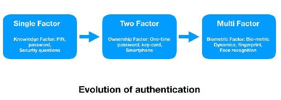

# 为什么要使用2FA？

2FA有助于终端用户和业务安全，并且使用它有几个好处，如下所示：

+   **更好的安全性**：通过集成第二层身份验证，基于短信的一次性密码（OTP）减少了攻击者冒充合法用户的风险。这降低了账户被盗和数据泄露的风险。即使黑客从暗网获取了用户的凭据，他们也不会有完全验证所需的第二个信息。

+   **提高生产力**：移动2FA帮助全球企业无缝地使用第二级身份验证。员工可以安全地从任何设备或位置访问企业应用程序、文档和第三方系统，而无需共享任何机密信息。

+   **减少欺诈，增加信任**：大多数欺诈受害者避免去某些零售商，即使该商家不负责数据泄露。2FA为用户建立了更高的信任层，并且还减少了商家网站上的欺诈尝试。

# 它是如何工作的？

2FA可以以两种方式部署——**基于云的解决方案**和**本地解决方案**。我们将了解这两种解决方案，并了解哪种更适合哪种部署：

+   **基于云的解决方案**：这在电子商务、在线银行和其他在线服务相关的网络应用中被广泛使用。看一下下面的图表：

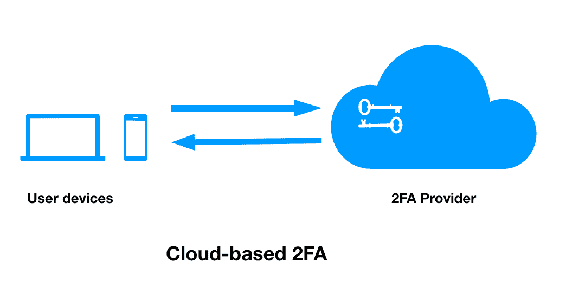

+   **本地解决方案**：组织在允许基于云的安全解决方案时存在犹豫，并倾向于更喜欢本地解决方案，其中员工访问网络应用程序时输入用户名和密码的组合。现在这些信息发送到内部VPN集成器，该集成器处理凭据并在组织与第三方2FA提供商之间交换密钥。第三方2FA提供商将生成OTP并通过短信或移动应用程序与员工共享此信息。这种模型有助于组织实现隐私，因为它不必与第三方2FA提供商共享凭据。看一下下面的图表：

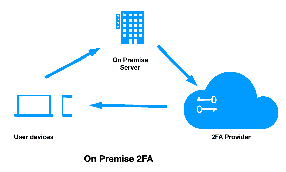

# 挑战

在 2FA 中，第一层身份验证是用户名和密码的组合，但对于第二层身份验证，这部分信息由中央存储库提供。该中央存储库负责存储所有必要的信息以验证用户身份。尽管 2FA 通过第二层身份验证增加了安全性，但它仍然存在存储用户秘密信息的中央数据库的缺点。中央数据库可能会被定向威胁篡改或损坏，这可能导致大规模的数据泄露。

# 基于区块链的 2FA

区块链被誉为最具革命性和颠覆性的技术之一。区块链一直在扰乱基于网络安全解决方案的 CIA 安全三要素。多年来，2FA 在安全措施中一直是关键；然而，有时攻击者能够成功入侵这些系统。我们将了解区块链如何转变 2FA 系统，以实现改进的安全方法。

# 区块链如何转变 2FA？

从设计上看，区块链是一种去中心化技术，允许多个参与者之间进行任何类型的价值交易，而无需第三方的参与。通过利用区块链，我们可以确保这些敏感信息永远不会留在一个数据库中；相反，它可以存储在具有不可变性且无法修改或删除的区块链节点中。下图展示了基于区块链的 2FA。

在此情况下，用户设备将通过区块链网络由第三方 2FA 提供商进行身份验证。区块链网络中的每个参与方都将安全地保存端点信息，并激活 2FA 系统以生成第二级密码。

这可以部署在公共领域，甚至是通过第三方 API 调用的私有网络中：

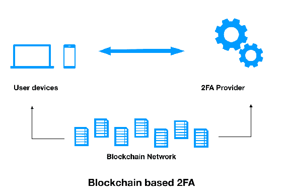

# 解决方案架构

作为最新的技术，区块链仍在多个组织的测试阶段。在本章中，我们将使用以太坊区块链来启用 2FA 系统。以太坊允许通过智能合约编程应用程序。下图展示了用户、Web 应用程序和基于以太坊的存储库之间的基本流程：

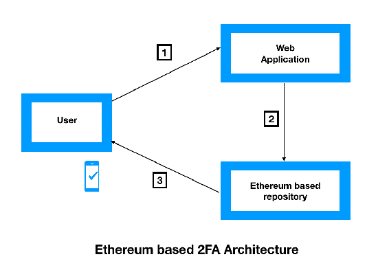

用户访问 Web 门户并输入第一层凭据。Web 应用程序将与基于以太坊的存储库通信，生成 OTP 并与用户共享。最后，用户输入相同的 OTP 并获得 Web 应用程序的访问权限。让我们通过下图进一步了解以太坊区块链：

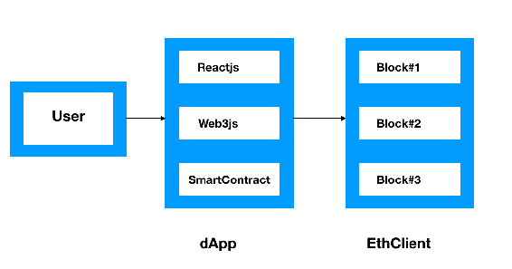

# 实验

为了启动整个项目，我们将不得不部署该项目的子组件。源代码已从 GitHub 获取，可以在以下链接找到：[https://github.com/hoxxep/Ethereum-2FA.](https://github.com/hoxxep/Ethereum-2FA)

它包含以下文件：

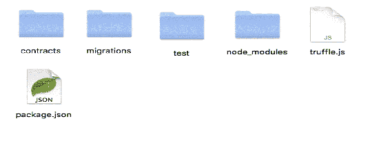

前面截图中的文件解释如下：

+   `contracts`：该文件夹包括我们的智能合约，`TwoFactorAuth.sol`。

+   `migrations`：该文件夹包含用于将合约部署到区块链的迁移文件。

+   `test`：该文件夹包含`server.js`，负责验证我们合约中的事件。

+   `node_modules`：该文件夹包括所有库。

+   `truffle.js`：此配置文件包含一组配置，用于连接到区块链。

+   `package.json`：这是我们项目的配置，如名称和脚本。

# 组件

以下是该项目的三个核心组件，如下图所示：

+   一个区块链网络（我们将通过 Ganache CLI 开发）

+   智能合约

+   一个与区块链通信的服务器

查看以下图表：

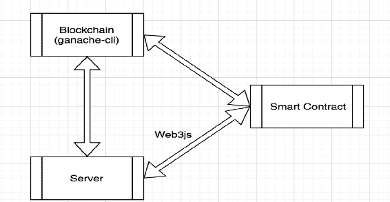

# 准备工作

在开始配置任何其他参数之前，开发区块链网络至关重要。首先，让我们在本地以太坊上开发我们的**去中心化应用程序**（**dApps**）叫做`testrpc`。在我们的情况下，我们使用 Ganache CLI，它使用 EthereumJS 模拟完整的客户端行为，使以太坊开发更加简单和安全。它还包括所有知名的 RPC 函数和特性。

# 安装 Node.js

我们将首先在本地系统上安装 Node.js 包。代码可以从以下链接下载：[https://nodejs.org/uk/download/package-manager/#arch-linux](https://nodejs.org/uk/download/package-manager/#arch-linux).

# 启动以太坊

启动以太坊的步骤如下：

1.  首先，我们需要在系统上安装`ganache-cli`：

```
>  npm install -g ganache-cli
```

1.  接下来，使用以下命令运行整个套件：

```
> ganache-cli
```

在前面提到的命令执行后，我们将获得 10 个默认账户和 10 个默认私钥。现在我们将有一个本地以太坊`testrpc`，运行在`http://localhost:8545`上，如您在以下截图中所见：

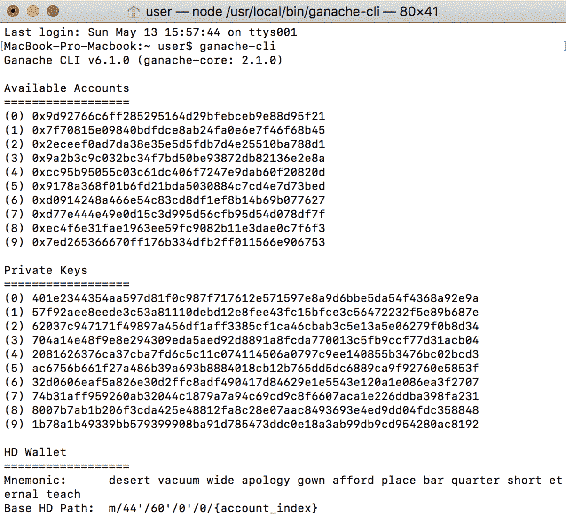

# 启动智能合约

现在我们将使用以下命令运行`server.js`：

```
Macbook-Air: Ethereum-2FA_user$ truffle_test ./test/server.js
```

在执行前面的命令后，我们将看到以下屏幕，该屏幕还显示了 2FA 的网址：

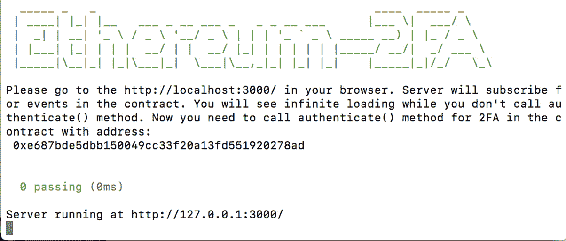

现在让我们打开 Google Chrome 并访问端口`3000`上的本地主机，如前面的截图所述。查看以下截图：

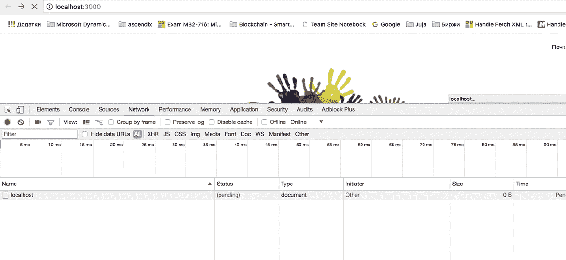

# 测试和验证

测试和验证按以下步骤进行：

1.  **调用身份验证功能**：我们需要在以太坊 IDE 上运行智能合约代码，该 IDE 可以通过 [https://remix.ethereum.org](https://remix.ethereum.org) 访问。以下过程在 remix 中添加了 Solidity 代码：

+   1.  单击左上角的 + 号，添加一个名为 `TwoFactorAuth.sol` 的新文件

    1.  复制并粘贴代码到我们的 remix 实例文件

    1.  现在，选择 TwoFactorAuth 并单击 Compile 选项

    1.  接下来，转到 Run 选项卡

我们需要调用 `authenticate()` 函数来验证合约，如下截图所示：

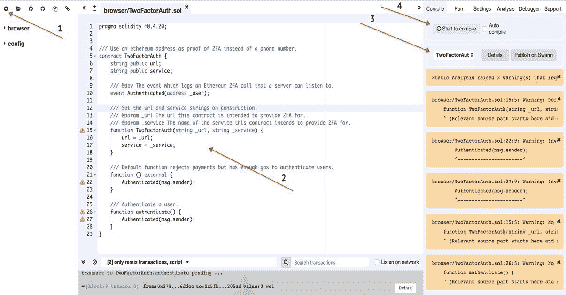

1.  **验证身份验证**：在这一步中，我们需要验证身份验证是否成功。为了实现这一点，请按照以下步骤操作：

+   +   我们需要将环境字段设置为 Web3 Provider 选项。

    +   现在选择 TwoFactorAuth 选项，在占位符中提供合约地址并使用 Load contract，然后单击 At Address 按钮，如下截图所示：

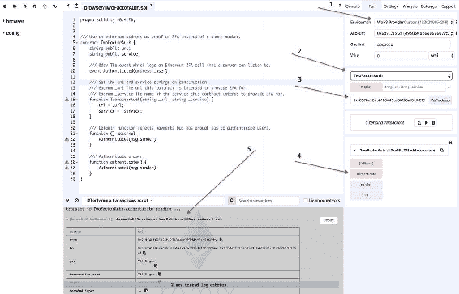

1.  **成功的身份验证**：我们的服务器订阅了合约，当我们调用 `authenticate()` 方法时，服务器从区块链中读取并返回成功的身份验证：

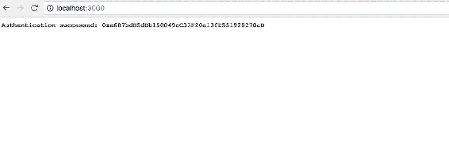

# 概要

在本章中，您了解了 2FA 如何是最关键的安全措施之一。然而，中央存储库可能会面临复杂的网络攻击风险。我们研究了区块链如何帮助在多个节点之间分散数据库，并减少成为数据泄露的受害者的几率。以太坊智能合约是实现 2FA 系统的真正强大组件，它提供了对整个系统进行编程的灵活性。

# 问题

我们有关于理解 2FA、认证类型和方法以及演示以太坊如何用于创建 2FA 基础设施的主题。有一些值得探索的重要问题，比如：

1.  我们还可以通过以太坊实现 MFA 吗？如果可以，如何实现？

1.  我们如何将基于短信的 2FA 与以太坊智能合约集成？

# 进一步阅读

要了解更多关于 NIST 多因素认证（MFA）准则的信息，请查看以下链接：[https://www.nist.gov/itl/tig/back-basics-multi-factor-authentication](https://www.nist.gov/itl/tig/back-basics-multi-factor-authentication)。
