# 基于区块链的 DNS 安全平台

**域名系统**（**DNS**）主要设计用于将主机名查询解析为 IP 地址。互联网用户需要域名，例如[www.packtpub.com](http://www.packtpub.com)，但互联网需要 IP 地址才能将请求路由到所需目的地。这样，DNS 就成为互联网的电话簿，并允许每个人在全球范围内使用它；然而，这也会导致其被滥用的可能性很高。在本章中，我们将了解 DNS 基础架构、核心组件、现有系统存在的挑战以及区块链如何改变其当前功能。

在本章中，我们将涵盖以下主题：

+   DNS

+   DNS 结构和层次结构

+   大型企业的 DNS 拓扑结构

+   当前 DNS 解决方案面临的挑战

+   基于区块链的 DNS 解决方案

+   实验室

# DNS

DNS 是互联网的核心。如果 DNS 不可用，我们每个人都会在互联网上找资源时遇到困难。作为互联网的大型电话簿，我们的整个在线系统都严重依赖 DNS。由于 DNS 命名空间，我们中没有人需要记住一长串 IP 地址；相反，我们只需要记住网页的名称。

对于 IT 和安全专业人员来说，了解其基本结构、功能和操作是很重要的。DNS 是一个具有委托权限的分层数据库。根据本章的范围，我们将考虑企业 DNS 部署及其功能。组织可以通过允许他们的**互联网服务提供商**（**ISP**）管理或内部管理来管理其 DNS 基础架构。ISP 网络中的任何配置错误或故障都可能导致组织的互联网基础设施中断。

随着互联网用户数量的增长，DNS 成为了互联网上组织的支柱，因此它给组织提供了控制自己 DNS 的强有力理由。通过有效的 DNS 部署，组织甚至可以实现更好的电子邮件垃圾邮件过滤系统和优化的网络拓扑结构。以下是 DNS 在组织中发挥关键作用的一些方式：

+   **反垃圾邮件**：一些 DNS 机制，包括**发件人策略框架**（**SPF**）和**域键识别邮件**（**DKIM**），确保只有预定义的域应被允许代表特定组织发送电子邮件。如果组织中的 DNS 正常工作，则这些机制是有效的。

+   **负载均衡**：DNS 服务可以通过将高利用率服务器的流量与其他低利用率服务器进行负载均衡来优化服务器基础设施。

+   **隐私**：DNS 服务通过使用不同的名称掩盖地址，具体取决于是否从网络内部或外部访问，以确保组织命名空间信息的隐私，有助于实现更强大的网络安全。

# 理解 DNS 组件

DNS不仅仅是一个协议，它由几个独立的实体共同工作，以提供可扩展和可靠的域名数据库。在最简单的形式中，DNS有三个核心组件—**命名空间**、**服务器**和**解析器**。

# 命名空间

命名空间是DNS数据库的结构。它以倒置树的形式表示，其根节点位于顶部。树中的每个节点都有一个标签，根节点具有null标签。请看下面的图示：

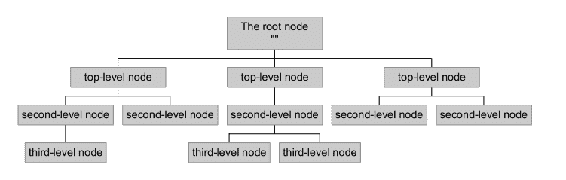

域名是从一个节点到根之间以点分隔的标签序列。命名空间最大深度为127级，域名长度不超过255个字符：

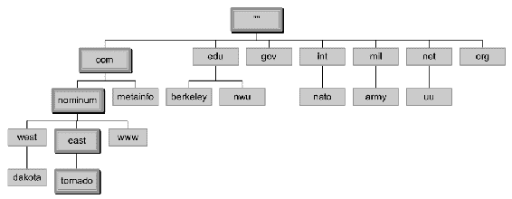

# 名称服务器

名称服务器负责以区域的形式存储有关命名空间的信息。可以有多个名称服务器，对于一个区域，有一个加载完整区域的服务器被称为*权威*。通常，单个区域有多个名称服务器被用作权威服务器，以确保更好的冗余性和负载共享：

有两种主要类型的名称服务器—**权威服务器**和**缓存服务器**：

+   **权威名称服务器**：它提供DNS查询的响应。它负责为每个DNS查询提供原始和最终答案。权威名称服务器分为两种类型：

    +   **主服务器（主名称服务器）**：它存储所有区域记录的原始副本。管理员只能对主服务器区域数据库进行更改。

    +   **从属服务器（辅助名称服务器）**：从属服务器保留主服务器文件的副本。它用于分享DNS服务器负载和提高DNS区域的可用性。

+   **缓存名称服务器**：它将名称服务带给用户更近，并提升整体名称查找性能。它还通过允许用户从本地缓存中获取所有的名称映射，为本地用户提供私有命名空间的完善机制。

# 解析器

名称解析器帮助名称服务器在命名空间中查找数据。名称解析器用于查找根区域的名称和IP地址。根名称服务器存储关于顶级区域的信息，并指示要联系哪些服务器以获取所有**顶级域**（**TLD**）的数据。解析器基本上从右到左地将名称分成其标签。首个组件，TLD，使用根服务器进行查询，以获取指定的权威服务器。

# DNS结构和层次结构

类似于互联网的DNS基础架构，组织也部署其内部DNS基础架构。要部署内部DNS基础架构，组织可以选择任何域层次结构；然而，一旦连接到互联网，它们必须遵循通用的DNS框架。让我们了解名称服务器层次结构。

# 根名称服务器

在互联网上保持一致的命名空间中，根名称服务器直接响应对根区域中记录的请求，并通过返回适当 TLD 的权威名称服务器列表来回答其他请求。

为了修改根区域，必须首先在互联网上发布区域文件。根区域文件在互联网上由 *A* 到 *M* 的 13 台服务器上发布。

根区域包含以下信息：

+   通用顶级域名，如`.com`、`.net` 和 `.org`

+   全球认可的 TLDs

+   国家代码 TLDs，每个国家的两字母代码，如`.in` 代表印度，`.no` 代表挪威

+   全球认可的 TLDs，通常类似于国家代码 TLD 名称

根区域包含服务 TLD 内容的名称服务器的数值地址，当 TLD 询问时，根服务器会用这些地址回答。

当组织获得新的域名时，注册商可能代表他们配置 DNS 记录并为他们提供一个**名称服务器**（**NS**）。组织需要一个名称服务器告诉互联网的 DNS 目录其网页服务器和相应服务的 IP 地址。

# 当前 TLD 结构

TLD 是 DNS 层次结构中最高级别的域之一。TLDs 安装在命名空间的根区域中。系统中最后部分的域必须用完全合格的域名识别。**互联网名称与数字分配机构**（**ICANN**）确保 TLDs 由委托组织管理。**互联网分配数字机构**（**IANA**）由 ICANN 运营，负责管理 DNS 根区域。

IANA 负责管理以下顶级域名（TLDs）：

+   **ccTLD**—国家代码顶级域名

+   **gTLD**—通用顶级域名

+   **.arpa**—基础设施 TLDs

此分层图解释了现有的 TLD 结构：

<q class="calibre60 pcalibre5 pcalibre4">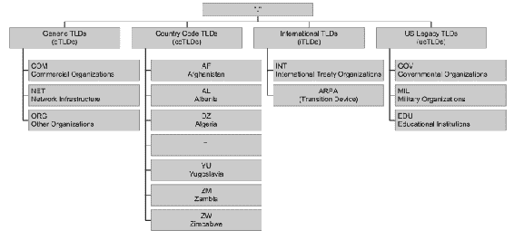</q>

# 注册表、注册商和注册人

DNS 存储着大量的域名数据库。为了进行注册，有三个实体共同合作——**注册表**、**注册商** 和 **注册人**：

+   **注册表**：负责维护命名空间数据库的组织，具有对该数据库的编辑权限。注册表运行命名空间的权威 NS 并管理 TLD 名称。他们的角色是创建域名扩展名、制定域名规则，并与注册商合作向公众提供域名。例如，**Verisign** 管理着`.com` 域名及其 DNS 的注册。

+   **注册商**：保留域名并被授权向公众出售域名的组织。此注册商必须由**通用顶级域名**（**gTLD**）注册表或**国家代码顶级域名**（**ccTLD**）注册表授权。注册商按照域名注册表提供的指南操作。

只有指定的注册商才能修改或删除中央注册数据库中有关域名的信息。最终用户直接从注册商购买域名，最终用户完全有权切换注册商，调用注册商之间的域名转移流程。一些最受欢迎的注册商包括GoDaddy、HostGator、BigRock等。

+   **注册人：**这只是持有域名权利的最终用户。作为域名注册人，每个人都有一定的权利和责任，包括从用户的注册商那里获取有关注册、管理、转移、续订和恢复域名注册的流程的信息。

这是一个显示所有三个实体一起工作的图示：

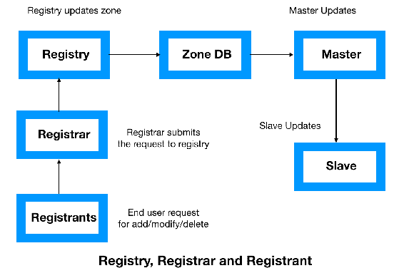

# DNS记录

DNS记录是与DNS服务器相关联的映射文件，处理发送到每个域的请求。各种字母字符串被用作模拟DNS服务器操作的组件，这些命令字符串称为DNS语法。这些语法包括A、AAAA、**规范名称**（**CNAME**）、**邮件交换器**（**MX**）、**指针**（**PTR**）、**名称服务器**（**NS**）、**权威起始**（**SOA**）、**服务**（**SRV**）**记录**、**文本**（**TXT**）和**名称授权指针**（**NAPTR**）。让我们详细了解其中一些DNS记录。

+   **SOA**：SOA记录标记了区域文件的开始。它由区域的名称、技术联系点、其NS、序列号和超时值组成：

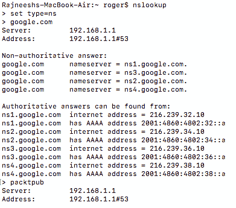

+   **NS**：NS记录标识区域的授权名称服务器。NS还在区域文件上将子域委托给其他组织。在前面的例子中，我们可以清楚地看到[www.google.com](http://www.google.com)的NS列表。

+   **记录**：地址记录建立了名称到地址的前向绑定。在这个例子中，我们将IP地址与域名[www.google.com](http://www.google.com)映射起来：

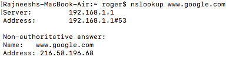

+   **MX记录**：这些记录标识可以交换电子邮件的服务器。每个记录都与优先级相关联，因此用户可以选择主要和备份邮件服务器。

+   **TXT记录**：这些记录提供了通过DNS扩展提供的信息的方法。这个文本记录存储了有关SPF的信息，可以确定授权服务器代表您的组织发送电子邮件。

+   **CNAME**：CNAME实质上是将流量绑定到域和子域的文本别名。它们表示**安全文件传输协议**（**SFTP**）服务器与邮件服务器位于同一系统上。CNAME在服务器不受组织控制时发挥重要作用，比如托管或管理的网络服务器。

+   **PTR 记录**：这些记录提供从地址到名称的反向绑定。PTR 记录应与前向映射完全匹配。

# 大型企业的 DNS 拓扑

对于 IT 专业人员来说，了解 DNS 查询和名称服务器类型是组织 DNS 最佳实践的重要内容：

+   **网络拓扑**：冗余在域基础设施中起着关键作用。即使一个服务器失败，另一个也会接管，保持服务正常运行。**BIND**（广泛使用的 DNS 软件）通过主从关系支持高冗余性。主 NS 通过区域传输机制将映射更改更新到一个或多个从服务器。

+   **配置文件**：BIND 的配置存储在一个名为 `named.conf` 的文件中。此 `named.conf` 文件帮助服务器识别权威和/或缓存服务器以及其是否为任何特定区域的主或从服务器。该文件指向包含真实映射数据库的区域文件。它包含定义特定域的名称到地址和地址到名称映射的行或记录。

# 架构

随着技术和网络转型的变化，DNS 必须随着时间的推移进行升级。存在着像**DNS 运营、分析和研究中心**（**DNS-OARC**）和**互联网系统联盟**（**ISC**）等机构。在以下图表中，我们可以看到一个优化 DNS 基础设施的标准 DNS 架构：

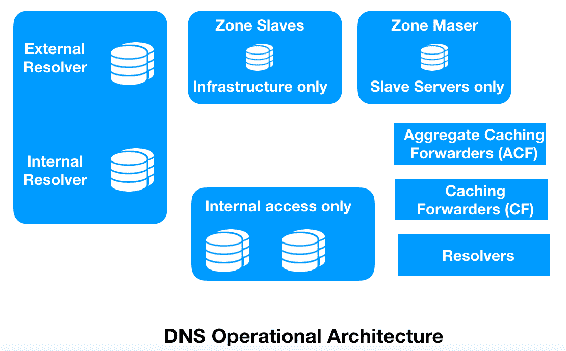

先前的标准 DNS 架构可以描述如下：

+   **主 DNS 区域：**主区域包含区域数据的读/写副本。网络中只允许一个主区域。所有 DNS 记录必须手动或自动写入主区域。然后，此数据存储在标准文本文件中。

+   **从属 DNS 区域**：从属区域是区域数据的只读副本。通常，它是主区域的复制版本。如果尝试在辅助区域上更改 DNS 记录，则可以将其重定向到具有读/写访问权限的另一个区域。从属 DNS 区域的作用是备份 DNS 区域文件。

+   **聚合缓存转发器（ACF）**：它基本上转发请求而不处理它们。当服务器发送响应时，它将其传递回自己的客户端。在某些情况下，解析器也可以是转发器或缓存转发器。它可能会或可能不会缓存数据；但是，对于希望向没有预定义 DNS 服务器地址的 DHCP 客户端提供 DNS 数据的系统（如**小型办公室家庭办公室**（**SOHO**）网关）非常有用。

# 当前 DNS 的挑战

如今，DNS 已成为互联网和组织网络的支柱。DNS 是一项使组织无法正常运行的关键基础设施。然而，尽管在网络和信息安全方面投入了越来越多的投资，攻击者仍然成功入侵网络，DNS 仍然是网络基础设施中的一个容易受攻击的组件，经常被用作攻击向量。防火墙保持 `53` 端口开放，从不查看每个查询的内部。让我们来看一下最广泛使用的基于 DNS 的攻击之一：

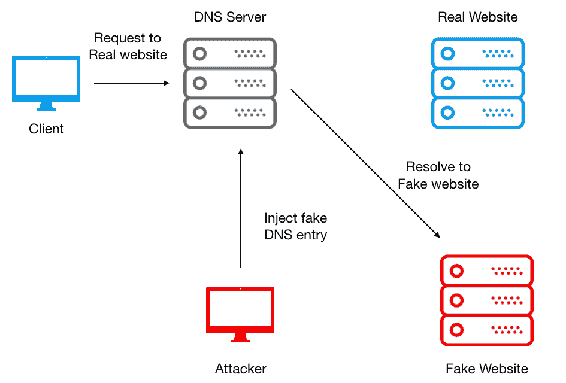

# DNS 欺骗

当 DNS 服务器的记录被更改以将流量重定向到攻击者的服务器时，DNS 将被劫持。这种流量重定向允许攻击者在网络中传播恶意软件。DNS 欺骗可以通过以下三种方式之一进行：

+   **DNS 缓存投毒**：攻击者可以利用缓存的 DNS 记录，然后通过向 DNS 服务器注入伪造的 DNS 条目来执行欺骗。结果，所有用户现在将使用该伪造的 DNS 条目，直到 DNS 缓存过期。

+   **攻击 DNS 服务器**：DNS 服务器是整个 DNS 基础设施的核心。攻击者可以利用多种攻击向量来 compromis... 即可提供恶意网络服务器的 IP 地址。

+   **中间人（MITM）攻击**：在这种类型的攻击中，威胁行为者不断监听客户端和 DNS 服务器之间的对话。在收集信息和序列参数之后，它开始欺骗客户端，假装是实际的 DNS 服务器，并提供恶意网站的 IP 地址。

# 基于区块链的 DNS 解决方案

区块链技术具有改变多个行业的能力，在本章中，我们将使用它来管理名字服务器，以克服一些最关键的 DNS 挑战。**DNSChain** 是转换 DNS 框架并保护免受欺骗挑战的最活跃的项目之一。

DNSChain 是一个基于区块链的 DNS 软件套件，取代了 X.509 **公钥基础设施**（**PKI**）并提供了 MITM 身份验证证明。它允许互联网用户设置公共 DNSChain 服务器以进行 DNS 查询，并使用以 `.bit` 结尾的域名访问该服务器。

# X.509 PKI 替代方案

X.509 是一个标准框架，定义了 PKI 的格式，用于在互联网上标识用户和实体。它帮助互联网用户知道与特定网站的连接是否安全。DNSChain 具有提供可扩展和去中心化替代方案的能力，不依赖于第三方。

# MITM 证明的 DNS 基础设施

这使用了公钥固定技术来解决中间人攻击问题。 公钥固定指定了两个 **pin-sha256** 值；也就是说，它固定了两个公钥（一个是当前证书链中任何公钥的 pin，另一个是当前证书链中没有的任何公钥的 pin）：

+   它与现有的 DNS 服务器并行运行

+   网站和个人将其公钥存储在区块链中

+   密钥通过 DNSChain 软件框架共享

# 基于以太坊的安全 DNS 基础设施实验室

DNS 基础设施一直是组织中最受攻击的资产。传统 DNS 易受多种复杂威胁的影响。当前的 DNS 系统是分层的，系统根服务器成为高价值的攻击向量。由于整个基础设施是集中化的，即使是轻微的故障也可能导致整个系统的失败。一群工程师——Greg Siepak 和 Andrea Devers 已经开发了一个基于以太坊的 DNS 平台，以在客户端和名称服务器之间建立连接而不涉及任何第三方。该项目名为 **DNSChain**，托管在 GitHub 上，链接为[https://github.com/okTurtles/dnschain](https://github.com/okTurtles/dnschain)。

# 实验室准备

在 Ubuntu 中配置 DNSChain 服务器。 它将运行 PowerDNS Recursor，发出`.com`和`.net`域的 DNS 查询，正如您所期望的那样，但是要查阅本地 Namecoin 区块链以解析`.bit`域。

我们将从一份新的 Ubuntu LTS 开始。在我们的实验室中，我们将在亚马逊的 AWS 云上部署这个 Ubuntu 系统。

这里的一些示例可能使用已过期的域名，因此最好在你个人注册的 Namecoin 区块链域名上测试域名解析。从一个新的 Ubuntu 16.04 LTS 开始。我在亚马逊云上使用的是 Ubuntu 16.04 LTS。

我们将使用以下命令准备基础设施：

```
sudo sh -c "echo 'deb 
http://download.opensuse.org/repositories/home:/p_conrad:/coins/xUbuntu_16.04/ /' >> /etc/apt/sources.list.d/namecoin.list" 
wget http://download.opensuse.org/repositories/home:p_conrad:coins/xUbuntu_16.04/Release.key 
sudo apt-key add - < Release.key 
sudo apt-get update
```

# Namecoin 区块链安装

在本节中，我们将从安装 Namecoin 区块链开始。

+   **安装：** 我们需要在本地系统中安装`namecoin`区块链：

```
sudo apt-get install namecoin
```

要配置`namecoin`，请按照快速入门指南。 本教程将使用当前用户，而不是创建多个用户。

+   **配置：** 完成 Namecoin 安装后，我们需要使用以下命令配置区块链：

```
mkdir -p ~/.namecoin \
&& echo "rpcuser=`whoami`" >> ~/.namecoin/namecoin.conf \
&& echo "rpcpassword=`openssl rand -hex 30/`" >> ~/.namecoin/namecoin.conf \
&& echo "rpcport=8336" >> ~/.namecoin/namecoin.conf \
&& echo "daemon=1" >> ~/.namecoin/namecoin.conf
```

我们将继续运行`namecoind`来启动事务。让我们使用`namecoind getinfo`检查区块链下载的进度。

对于 Ubuntu，我们使用`upstart`而不是`systemd`。 我们需要将此文件写入`/etc/init/namecoind.conf`，记得替换你的用户名； 在我的情况下，它是`ubuntu`：

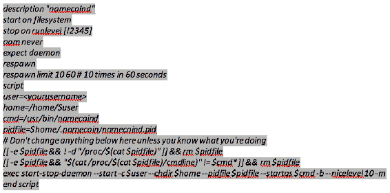

现在我们必须使用`namecoind stop`来停止进程。之后，我们需要发出`sudo initctl reload-configuration`命令，然后使用`sudo shutdown -r`立即重新启动。最后，`namecoin`会自动重新启动。

+   **验证：** 如前所述，`namecoind`将开始下载区块链。 在它取得一些进展之前，我们将无法从区块链上查找域名。 稍后，当我们重新访问Namecoin时，我们可以尝试以下命令：

```
namecoind getinfo 
```

在输出中，我们可以清楚地看到有关Namecoin的详细信息以及有关难度级别、连接、时间偏移、创建的块、余额甚至任何错误的详细信息：

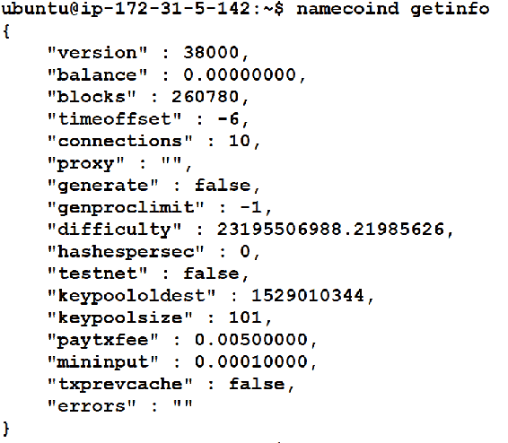

此外，我们将使用以下命令获取有关Namecoin交易ID和地址的详细信息：

```
namecoind name_show d/okturtles
```

以下截图显示了运行上述命令的输出：

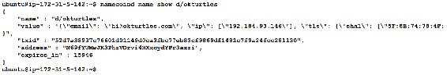

此外，我们还可以检查RPC接口（使用`namecoin.conf`中的`rpcuser`和`rpcpassword`）：

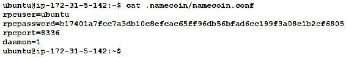

现在，我们将使用`curl`命令获取托管在`http://127.0.0.1:8336`上的内容的Web信息：

```
curl --user ubuntu:b17401a7fcc7a3db10c8efcac65ff96db56bfad6cc199f3a08e1b2cf6805 --data-bina'  -H 'content-type: text/plain;' http://127.0.0.1:8336
```

我们可以看到针对本地系统托管内容的`curl`命令的以下输出：

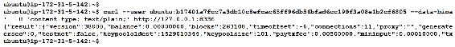

此外，我们可以使用`curl`命令提取HTTP站点发送给我们的标头。 以下命令存储HTTP站点发送给我们的标头。 此命令将接收到的协议标头写入指定的文件：

```
curl -v -D - --user ubuntu:b17401a7fcc7a3db10c8efcac65ff96db56bfad6cc199f3a08e1b2cf6805 --darams":["d/okturtles"]}' -H 'content-type: text/plain;' http://127.0.0.1:8336
```

运行上述命令的输出如下所示：

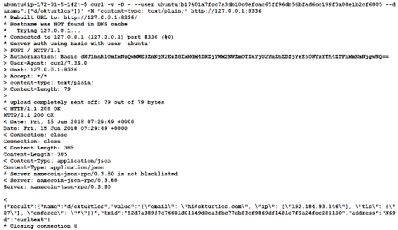

# 安装PowerDNS

**PowerDNS**是开源DNS软件、服务和支持的首要供应商。 PowerDNS是一个用C++编写的DNS服务器，并在GNU **通用公共许可证**（**GPL**）下许可。 它运行在大多数Unix派生系统上。 它具有许多不同的后端，从简单的BIND到关系数据库。 我们将使用以下命令在系统上安装PowerDNS：

```
sudo apt-get install pdns-recursor
```

运行上述命令的输出如下：

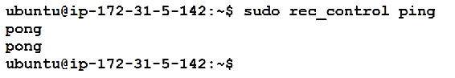

+   **配置**：我们需要在本地环境中配置PowerDNS。 我们将命令PowerDNS将对`.bit`、`.eth`和`.p2p`域名的请求发送到端口`5333`。

此配置在`/etc/powerdns/recursor.conf`文件中指定：

```
forward-zones=bit.=127.0.0.1:5333,dns.=127.0.0.1:5333,eth.=127.0.0.1:5333,p2p.=127.0.0.1:5333
export-etc-hosts=off
allow-from=0.0.0.0/0
local-address=0.0.0.0
local-port=53
```

在以下截图中，我们可以看到查询的前向区域文件的提取：

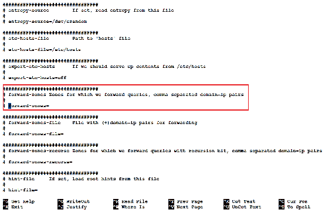

在以下截图中，我们可以找到托管在`127.0.0.1:5333`上的前向区域信息：

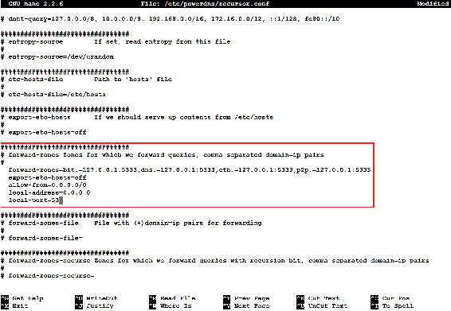

特别注意我们的前向区域声明。 在此时确保使用`sudo service pdns-recursor restart`重新启动PowerDNS。 然后，在我们继续之前，确认PowerDNS能够正确解析传统域名：

+   **验证：** 为了验证前向区域PowerDNS的安装，我们需要运行以下命令：

```
dig @127.0.0.1 packtpub.com
```

我们将找到以下输出，其中包含`packtpub.com`的IP地址：

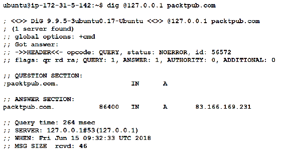

# 安装DNSChain

首先，我们将更新`apt-get`并安装一些前提条件。请注意，尽管我们安装`npm`（需要Node.js安装），但需要安装`nodejs-legacy`。

+   **安装依赖项：** 在此步骤中，我们将安装所有可靠的脚本和命令：

```
sudo apt-get update
sudo apt-get install git npm
sudo apt-get install nodejs-legacy 
sudo npm install -g coffee-script
```

+   **安装DNSChain：** 现在可以通过以下命令执行DNSChain的安装：

```
sudo npm install -g dnschain
```

在下面的输出中，我们可以发现结果包括`coffee-script-1.12.7.tgz`注册表文件的提取：

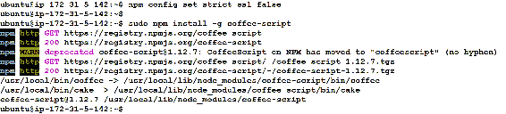

+   **配置：** 我们需要配置DNSChain将其绑定到端口`5333`，但只要与PowerDNS交付请求的端口号匹配即可使用任何高端口号。这在`/etc/powerdns/recursor.conf`中早已指定。 DNSChain的另一个很棒的特性是我们可以通过HTTP公开查找结果。我们将为此指定端口`8000`，但您可以使用任何打开的高端口号。例如，DNSChain可以设置为通过端口`8000`通过Web服务器访问。以此为例，写入`/home/ubuntu/.dnschain/dnschain.conf`：

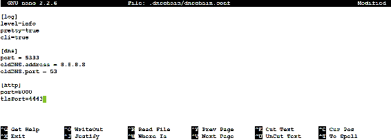

我们需要为DNSChain制作另一个`upstart`文件，并将此文件写入`/etc/init/dnschain.conf`：

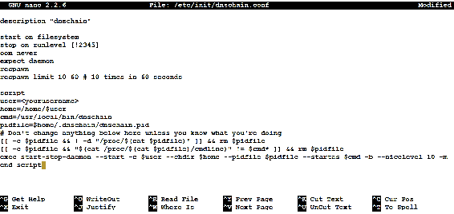

我们现在将运行`sudo initctl reload-configuration`，然后重新启动机器。最后，我们通过尝试解析`.bit`域名来进行测试。

你可能需要等待大量区块链加载完毕才能正常运行。

+   **验证：** 最后，我们可以通过查找`hello.bit`地址来验证DNSChain。在输出结果中，我们可以找到所需服务器IP地址为`51.101.1.6`的结果：

```
dig @127.0.0.1 okturtles.bit
```

以下屏幕截图显示了运行上述命令的输出：

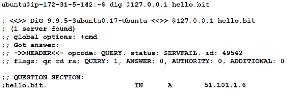

# 总结

在本章中，我们了解了DNS框架及其核心组件。我们了解到，任何受损的DNS服务器都可能对基础架构造成巨大破坏，以及区块链如何利用其基本优势来解决其中一些关键挑战。

# 问题

DNS是互联网的支柱，也是最复杂的协议框架之一。随着每一种新的攻击向量，DNS都在准备更强大和更全面。读者可以查阅以下问题：

1.  什么是DNS隧道攻击？

1.  区块链可以用于部署整个DNS基础架构吗？如果可以，怎么使用？

# 更多阅读

阅读以下文章，以了解更多关于DNS-OARC和ISC的信息：

+   *DNS-OARC介绍*在[https://www.dns-oarc.net/](https://www.dns-oarc.net/)。

+   [ISC](http://www.isc.org)在[http://www.isc.org](http://www.isc.org)。
