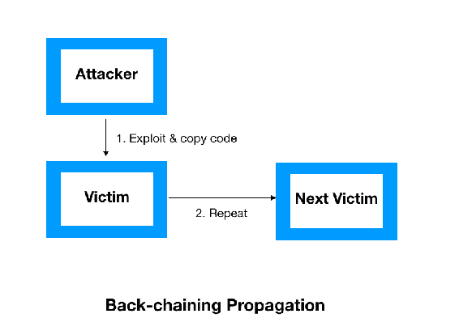

# 部署基于区块链的DDoS保护

互联网的用户数量和应用程序以及它们的带宽正在急剧增长。在过去的几年里，一种新的互联网用户进入了互联网的世界，通常被称为**智能设备**。它可以是冰箱、空调或微波炉，也可以是无人机或自动驾驶车辆。这些智能设备也被称为**物联网**（**IoT**）设备，监控着连接的公用事业的功能和操作。尽管有足够的用例，攻击者正在利用它们发动所谓的**分布式拒绝服务**（**DDoS**）攻击。在本章中，您将学习有关DDoS攻击以及区块链如何更有效地保护组织免受此类大规模攻击行动的信息。

在本章中，我们将涵盖以下主题：

+   DDoS攻击

+   DDoS攻击类型

+   当前DDoS保护解决方案的挑战

+   区块链如何改变现有的DDoS保护平台

+   实验室

# DDoS攻击

DDoS攻击是通过让来自地理分布系统的大量请求淹没目标服务器，以恶意尝试干扰合法流量的一种攻击方式。现在，让我们首先了解**拒绝服务**（**DoS**）攻击是如何工作的。在DoS攻击期间，攻击者向目标机器发起大量请求，导致服务器资源耗尽，并因此无法满足合法用户的请求。在DoS攻击中，威胁参与者使用单台机器来耗尽目标服务器；然而，DDoS攻击更为强大，因为可以使用数百万台机器来耗尽目标服务器。

# 什么是DDoS攻击？

越来越多的组织正在转向具有重大基础设施的云端，以满足其沉浸式客户需求。组织要么建立自己的重型服务器基础设施，要么转向云提供商托管他们的服务器。今天，攻击者更喜欢使用DDoS攻击方法来破坏目标服务，因为他们可以生成大量的随机数据，以淹没目标。此外，目标安全团队很难识别和阻止每个攻击机器，因为它们的数量达到了数百万。

此外，攻击者从未合法地控制他们的攻击机器，而是通过特制的恶意软件在全球数百万台计算机上感染病毒，然后获得完全访问权限来发动大规模的DDoS攻击。这个由数百万台感染的计算机组成的集合被称为**僵尸网络**，而单个被感染的计算机则被称为**僵尸**。

DDoS的第一个实例有点难以确切回忆起来，但第一个明显和重大的攻击发生在1999年，目标是明尼苏达大学。它影响了220多个系统，并使整个基础设施瘫痪了好几天。

2016 年 10 月 21 日星期五，整个世界目睹了对 Dyn（一家托管 DNS 提供商）进行的最复杂和精密的 DDoS 攻击之一。Dyn 确认 Mirai 僵尸网络是恶意攻击流量的主要来源。这次攻击引起了对互联网安全和威胁的重要关注。

# 它是如何工作的？

要发动 DDoS 攻击，威胁行为者可以构建整个僵尸网络，也可以从暗网市场租用。一旦攻击者准备好他们的武器，他们需要发现脆弱的站点或主机，或者可能整个网络。

洛克希德·马丁公司的计算机科学家创造了一个称为**网络杀链**的术语，它阐述了网络攻击的阶段，从侦察到最终攻击目标。这些阶段包括：

+   **侦察**：攻击者确定其目标设备并开始搜索其中的漏洞。

+   **武器化**：攻击者使用远程工具包和恶意软件，如病毒或蠕虫，来利用漏洞。

+   **交付**：威胁行为者通过诸如钓鱼邮件、随意下载、USB 驱动器、内部人员等多种方法将网络战争引入受害网络

+   **利用**：恶意软件代码用于触发攻击，在目标网络上采取行动以利用漏洞

+   **安装**：恶意软件现在已安装在受害机器上

+   **命令和控制**：这种恶意软件允许远程威胁行为者访问受害者机器

为了从 DDoS 的角度理解每个阶段，了解僵尸网络基础设施及其建立方式至关重要。

# 建立僵尸网络

如前所述，DDoS 攻击的分布式性质需要全球数以百万计受感染的机器。今天，攻击者利用暗网市场，要么租用现成的僵尸网络，要么购买它们。有一些工具，如 Jumper、Dirt 和 Pandore，可以消除创建这些僵尸网络的技术障碍。

以下图表概述了僵尸网络的生命周期：


# 侦察

目标系统可以大到数据中心，小到计算机。在这两种情况下，建立僵尸网络都涉及识别存在漏洞的主机，可以利用一些恶意软件家族进行利用。攻击者寻找与他们的目标直接或间接相关的信息，以未经授权地获取他们受保护的资产。威胁行为者尝试各种可能的方法来绕过存在的安全系统，如防火墙、**入侵防护系统**（**IPS**）、网络应用防火墙和端点保护。

# 武器化

各种开源软件的广泛使用已消除了创造恶意代码的技术障碍。如果程序员有恶意意图并开发了代码，就可以开发出一种新型的恶意软件，对安全系统检测来说会比较困难。

以下是一些用于开发 DDoS 的流行工具列表：

+   **低轨道离子炮 (LOIC)：**这是一种由流行的黑客活动分子团体 *anonymous* 使用的最受欢迎的工具之一。它是一个简单的洪水工具，可以生成大量的 TCP、UDP 或 HTTP 流量以过载目标服务器。它最初是用来测试服务器性能的吞吐量；然而，匿名团体使用这个开源工具发起了复杂的 DDoS 攻击。该工具后来通过 IRC 功能进行了增强，允许用户通过 IRC 控制连接的机器。

+   **高轨道离子炮 (HOIC)：**在成功使用 LOIC 几年后，匿名团体放弃了它，并使用 HOIC 工具首先瞄准了美国**司法部** (**DOJ**)，以回应其关闭网站 `megaupload.com` 的决定。HOIC 再次是一个简单的应用程序，用于支持跨平台的基本脚本，用于发送 HTTP POST 和 GET 请求，并带有简单和简化的 GUI。它后来被配备了 *booster* 脚本，这些脚本是包含额外基本代码的文本文件，称为 **booster 脚本**。这个 booster 脚本还允许攻击者指定要攻击的目标 URL 列表。HOIC 仍然被匿名团体用来全球发起 DDoS 攻击。

+   **hping：**就像匿名团体一样，还有几个不同的黑客活动分子团体积极地瞄准企业和政府机构。一种叫做 *hping* 的工具被开发出来以克服 Ion Cannon 工具的匿名挑战。它再次被用来在目标处生成大量的 TCP 流量，并且通过欺骗源 IP 地址来保持匿名。它是几个黑客活动分子团体中最强大和最全面的工具之一。

+   **Slowloris：**Slowloris 是最先进的工具之一，用于使攻击者难以检测和追踪。这个工具是由一位被称为**RSnake**的灰帽黑客开发的，它能够通过创建非常慢的 HTTP 请求来为服务器发起 DDoS 攻击。它生成大量微小的 HTTP 头，以瞄准服务器并使其等待其余的头到达。

# 交付

一旦恶意代码被开发或从暗网市场购买，这个软件可以通过针对性钓鱼邮件交付，也可以通过垃圾邮件活动发送。选择其中一种取决于目标，还取决于操作的复杂性。

我们可以将传播恶意代码的过程分类为以下三组方法：

+   **中央源传播**：在这种方法中，攻击者计划将易受攻击的系统变成一个或多个僵尸机器人的系统将被给予一个中央系统，以便攻击系统的副本从中央托管的基础架构转移到新受损系统。整个工具包移动后，脚本会自动启动一个新的攻击周期。这整个机制使用 HTTP、FTP 和 **远程过程调用**（**RPC**）协议。在这种方法中，威胁行为者利用受害者机器，受损系统连接到攻击者的中央仓库，最后，中央源推送代码。请看以下图表：


+   **反向链接传播**：在这种方法中，攻击者的工具包被重新定位到新受损的主机上。攻击者的工具包是专门设计用于接受来自受损系统的文件请求的。反向通道文件复制可以通过使用 **简单文件传输协议**（**TFTP**）的端口监听器来完成。与中央源传播方法不同，攻击者将利用和代码一起传输到受害机器中：



+   **自动传播**：在这种机制中，一旦攻击者侵入系统，他们的工具包就会转移到受损主机上。这种机制在传输方式上有所不同，因为攻击工具包首先由攻击者种植到受损主机上。在这种方法中，攻击者先传输利用，然后再从自身传输代码，而不是从任何中央仓库传输。请看以下图表：


# 利用

一旦恶意软件传递到网络中，它将启动利用未打补丁的软件漏洞、薄弱的软件编码实践和用户注意力缺失的过程。通常，网络中存在许多漏洞；然而，漏洞的利用性使漏洞的性质变得更加关键。

# 安装

在安装阶段，恶意软件被安装在目标系统中，并允许远程攻击者访问它。在安装过程中，恶意软件可能被安装在系统的用户空间或内核空间。安装在用户空间的恶意软件被检测到的可能性很高；然而，安装在内核空间的恶意软件被安全系统，如终端保护、终端检测和响应平台，检测到的可能性较低。

# 命令与控制（C2）

武器成功安装后，目标现在完全受到一个名为系统的远程中央系统的控制。被攻击的设备网络被称为僵尸网络，完全在威胁行为者的控制之下；然而，这个僵尸网络保持沉默，直到被攻击者激活。甚至还有几种加密的僵尸对僵尸的通信存在于公共对等网络上。

# 行动目标

一旦 C2 通道建立，攻击者就可以对目标发动 DDoS 攻击。在这个阶段，攻击者运行脚本来激活整个僵尸网络中的所有僵尸。攻击者还会配置僵尸网络以确定需要生成什么类型的流量。

# DDoS 攻击类型

DDoS 攻击有多种方式进行。然而，攻击者会根据不同因素选择其中一种，如目标难度、财务能力、匿名性、优先级和其他因素。运行 DDoS 攻击程序并发动它并不需要太多技术专长。主要有三种类型的攻击，分类如下：

+   目标网络资源的攻击

+   目标服务器资源的攻击

+   目标应用程序资源的攻击

# 目标网络资源的攻击

这些是计划消耗目标系统网络资源的攻击活动。在这种攻击中，网络带宽被洪泛攻击完全消耗。以下是几种洪泛攻击类型。

# 用户数据报协议 (UDP) 洪泛

UDP 是嵌入在 IP 数据包中的用于两个设备之间的套接字级通信的协议。UDP 洪泛攻击不会利用目标系统的任何特定漏洞，而是通过以大量洪泛来淹没目标系统的正常流量来干扰它。它指向目标服务器上的随机端口，并消耗目标系统的所有流量带宽。这种 UDP 洪泛甚至不允许系统发送**互联网控制消息协议** (**ICMP**) 目的地不可达的数据包。通常，这种类型的攻击被认为是小型到中型洪泛攻击的一种，并以 Mbps 和 PPS 衡量，如下图所示：


# ICMP flood

ICMP 是另一种用于 IP 层可达性和管理操作的无连接协议。同样，它不依赖于任何漏洞来工作。可以使用任何类型的 ICMP 消息执行 ICMP 洪泛，例如回显请求和回显回复。作为最古老的洪泛技术之一，组织已经采取了在网络设备上部署控制平面策略的做法，以限制设备的控制平面可以处理的 ICMP 数据包的数量。

# 互联网组管理协议 (IGMP) 洪泛

IGMP 是一种多播协议，性质上是无连接的。它是基于非漏洞的，涉及向网络或路由器发送大量的 IGMP 消息报告。

# 放大攻击

放大攻击利用通信渠道中请求和响应之间的差异。攻击者可以 compromise 一个路由器，强制路由器向多播地址发送广播消息，伪造源地址。甚至可以与 DNS 放大一起使用，攻击者可以 compromise 递归 DNS 名称服务器以缓存大型文件。请看下图：


# 针对服务器资源的攻击

针对受害者服务器资源并最终耗尽整个服务器处理和内存的攻击最终会对合法流量造成破坏。在这个类别中，攻击者识别目标服务器的漏洞，并武装恶意软件以利用这些漏洞。您将了解到一些用于执行这些攻击的最常见技术。

# TCP SYN Flood

这种攻击利用了 TCP 的三次握手机制，并通过 TCP 同步消息消耗大部分服务器资源。在 TCP 的三次握手中，客户端首先发送设置了同步标志的 TCP 包，请求服务器分配资源并建立通信渠道。在 TCP SYN 攻击中，攻击系统发送一系列设置了 SYN 标志的 TCP 请求。为了管理每一个请求，服务器必须打开并分配一定的 CPU 资源，并且缓冲以准备进一步的通信。现在，服务器发送一个设置了 SYN-ACK 标志的 TCP 消息，并期望客户端用带有 ACK 标志的 TCP 消息来确认。攻击系统接收到了，但从未做出响应，结果是，服务器保持套接字打开并为同一客户端机器分配资源。服务器资源是有限的，但攻击者可以不断向服务器发送请求，最终耗尽服务器资源，使其对合法用户流量不可用。TCP 对请求和响应过程有特定的超时时间，但攻击者利用了同样的时间段发送大量的 TCP 请求。请看下图：


# TCP RST 攻击

在 TCP/IP 栈中，TCP 中的**复位**（**RST**）标志用于通知服务器重置其正在进行的 TCP 连接。在 TCP RST 攻击中，攻击者拦截客户端和服务器之间的活动 TCP 连接，尝试随机序列号。成功识别序列号后，攻击者伪造 TCP RST 消息发送给客户端的源 IP 地址。对于人类来说，执行这样的活动将非常困难。因此，会使用机器人来拦截和识别活动序列号。

# 基于安全套接字层（SSL）的攻击

SSL是建立Web服务器和浏览器之间加密通道的标准安全协议。这确保了Web服务器和浏览器之间传输的所有数据都是加密的，从而为互联网用户提供了更好的隐私和完整性解决方案。SSL在TCP/IP上运行，并且仅在完成TCP三次握手后发送SSL *hello*。基于SSL的DDoS攻击可以通过各种方式进行，例如针对SSL握手机制、向SSL服务器发送随机和垃圾数据，或者利用某些与SSL加密密钥机制相关的功能。

# 加密的HTTP攻击

随着SSL/TLS加密的Web应用程序的使用增加，攻击者也转向加密的基于HTTP的攻击。大多数组织没有能够检查SSL流量的安全解决方案，因此无法保护免受恶意流量的侵害。攻击者利用这一弱点，并采用越来越多的能力通过加密的HTTP来破坏网络。

# 针对应用程序资源的攻击

DDoS攻击不断增加；威胁行为者正在从传统方法转向更先进和复杂的基于应用程序的攻击。这些不仅仅局限于基于HTTP的攻击，甚至还适应了HTTPS、DNS、FTP、SMTP和VOIP。应用程序由多个独立组件构建，因此易受攻击。因此，基于应用程序的攻击对威胁行为者变得更具吸引力。我们将介绍一些最常用的攻击。

# DNS洪泛攻击

DNS无处不在，并且每个组织网络都必须打开DNS端口以进行名称解析。发动基于DNS的洪泛攻击很容易，而安全系统难以检测到它。DNS使用UDP协议以获得更快的请求和响应时间，而不建立新的连接（就像在TCP握手中）。在这种类型的攻击中，DNS服务器可能会被大量DNS请求压垮，使受害者服务器无法处理合法请求。这种技术曾在最近对Dyn网络的Mirai攻击中使用，导致用户无法访问YouTube、Twitter、Netflix和其他几个应用程序。

# 正则表达式DoS攻击

使用*低速攻击*方法来攻击受害者服务器。攻击者利用服务器部署的库文件中的漏洞。每当客户端发送带有正则表达式的请求时，服务器都必须花费大量资源来处理正则表达式。攻击者利用这一点来利用服务器，并定期发送安全系统无法检测到的正则表达式。

# 散列碰撞DoS攻击

使用这种攻击方式，攻击者需要花费数天到数月的时间来识别Web应用程序框架中的漏洞。大多数应用程序服务器使用哈希表来索引POST会话。当返回相似的哈希值时，服务器必须管理哈希冲突。冲突解决消耗大量的处理资源，因为攻击者不断发送带有大量参数的POST消息。攻击者设计参数的方式导致服务器端发生哈希冲突，结果使服务器忙于处理它们。

# 当前DDoS解决方案面临的挑战

在过去的几年中，DDoS攻击呈上升趋势。根据Radware最近的报告，43%的组织经历了爆发性攻击，但其余的组织不知道自己是否受到了攻击。攻击者正在采用几种新兴技术和复杂的策略来 compromis 目标网络。

在2018年2月28日，代码托管网站GitHub遭受了有史以来最大的DDoS攻击，记录在1.35 Tbps。由于DDoS攻击属于无法部署任何安全预防机制的网络威胁类别，因为系统漏洞受到组织控制，但威胁无法控制。Web应用程序的前端对于所有用户保持集中，因此为组织留下了单点故障的局面。

# 区块链如何改变DDoS保护？

根据定义，区块链是一个去中心化网络，允许独立的各方进行通信，而无需任何第三方的参与。为了保护网络免受DDoS攻击，组织可以分布在多个服务器节点之间，提供高弹性并消除单点故障。使用区块链有两个主要优势，如下所示：

+   区块链技术可用于部署一个分散式分类的IP地址存储黑名单

+   区块链技术消除了单点故障的风险

# 实验室

为了部署基于区块链的DDoS保护平台，我们必须准备带有Node.js和Truffle的测试环境，以太坊区块链。我们将使用现有的区块链项目来保护网络免受DDoS攻击。项目链接可以在链接[https://github.com/gladiusio/gladius-contracts](https://github.com/gladiusio/gladius-contracts)中找到。

此外，我们需要按照步骤准备Gladius项目的基础架构：

1.  首先，我们将在环境中安装Node.js，网址为[https://nodejs.org/uk/download/package-manager/#arch-linux](https://nodejs.org/uk/download/package-manager/#arch-linux)。

1.  我们需要安装`truffle`来测试环境：

```
npm install -g truffle
```

1.  在终端中运行以下命令：

```
npm install -g ganache-cli
```

1.  现在，我们可以通过以下命令在终端中启动测试网络：

```
ganache-cli
```

以下屏幕截图显示了运行上述命令的输出：


1.  在这个终端窗口中，我们可以看到测试区块链网络中的所有交易。现在，我们必须打开一个新的终端窗口并跳转到工作目录。

要设置项目，请按照以下说明操作：

1.  转到[https://github.com/gladiusio/gladius-contracts](https://github.com/gladiusio/gladius-contracts)并下载`.zip`文件。然后，将此文件解压缩到您想要的文件夹中。

1.  用以下代码替换`truffle.js`文件中的代码：

```
let HDWalletProvider = require('truffle-hdwallet-provider')

module.exports = {
    networks: {
        development: {
            host: "localhost",
            port: 8545,
            network_id: "*" // Match any network id
        },
        truffle: {
          host: "localhost",
          port: 9545,
          network_id: "*", // Match any network id
        },
        travisci: {
            host: "localhost",
            port: 8545,
            network_id: "*"
        },
        rinkeby: {
            host: "localhost", // Connect to geth on the specified
            port: 8545,
            from: "0x0085f8e72391Ce4BB5ce47541C846d059399fA6c", // default address to use for any transaction Truffle makes during migrations
            network_id: 4,
            gas: 4612388 // Gas limit used for deploys
        }
    }
};
```

1.  我们将通过终端转到名为`gladius-contracts-master`的文件夹，并使用以下命令编译合约：

```
truffle compile
```

下面的截图显示了运行上述命令的输出：


1.  现在，我们将使用以下命令将我们的合约部署到`ganache-cli`本地区块链：

```
truffle migrate --reset
```

下面的截图显示了运行上述命令的输出：


1.  现在，我们必须使用`truffle test`命令启动单元测试以确保智能合约可用：


1.  转到[https://github.com/gladiusio/gladius-control-daemon](https://github.com/gladiusio/gladius-control-daemon)，下载`.zip`文件，并将其解压到与`gladius-contracts`相同的文件夹中。

1.  接下来，我们在终端中找到`gladius-control-daemon-master`文件夹，并链接合约**应用程序二进制接口**（**ABI**）。ABI 是两个程序模块之间的接口，其中一个模块位于机器代码级别：

```
ln -s ../gladius-contracts-master/build build
```

下面的截图显示了运行上述命令的输出：


1.  接下来，我们将使用`npm install`命令安装依赖项：


1.  接下来，我们将使用`node index.js`命令启动脚本：


1.  让我们打开一个新的终端窗口并运行`gladius-networkd`命令：


1.  接下来，我们需要打开一个新的终端窗口并运行`gladius-controld`命令：


1.  要启动您的节点，您需要在新的终端窗口中运行以下命令：

```
gladius node start
```

下一个截图显示了运行上述命令的输出：


1.  我们可以将数据提交给特定的池，使其接受或拒绝您成为池的一部分：


1.  创建节点完成后，我们可以使用我们的管理器应用程序检查其状态。这将从区块链中显示您的节点信息：


您只需将 Gladius 客户端下载到您的计算机并访问系统即可。

一旦 Gladius 被激活，所有节点都会处理连续的请求流以验证网站连接并阻止恶意活动。Gladius 正在积极努力解决系统中的若干挑战，并实现系统的稳定。

# 摘要

在本章中，您了解了 DDoS 攻击及其运作方式。我们了解了当前 DDoS 解决方案所面临的挑战，也了解了如何利用区块链来帮助我们更有效地保护网络免受恶意流量的侵害。

# 问题

读者应该理解这只是防御 DDoS 攻击的多种方式之一。读者应该查阅以下一些问题：

1.  为什么 DDoS 攻击变得越来越频繁？

1.  我们可以使用区块链准备关于即将发生的 DDoS 攻击的威胁情报吗？

# 进一步阅读

为了进一步探索区块链技术用于 DDoS 保护，以下链接可能会有帮助：

+   *基于智能合约的协作 DDoS 缓解的区块链架构* 可在 [https://www.springer.com/cda/content/document/cda_downloaddocument/9783319607733-c2.pdf?SGWID=0-0-45-1609389-p180909480](https://www.springer.com/cda/content/document/cda_downloaddocument/9783319607733-c2.pdf?SGWID=0-0-45-1609389-p180909480) 找到。

+   *基于区块链的协作 DDoS 缓解* 可在 [https://files.ifi.uzh.ch/CSG/staff/Rafati/Jonathan%20Burger-BA.pdf](https://files.ifi.uzh.ch/CSG/staff/Rafati/Jonathan%20Burger-BA.pdf) 找到。
