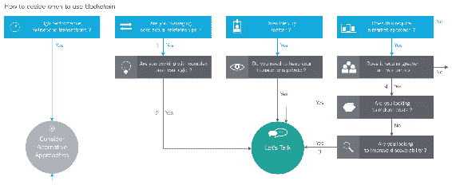
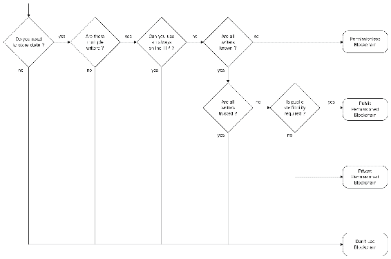
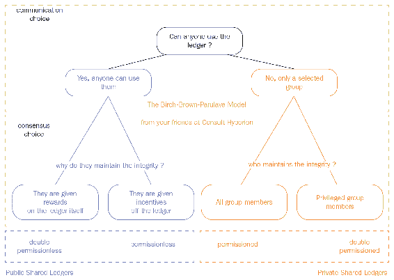

# 第十章：区块链与网络安全的事实

区块链技术具有创新性，并使用一种独特的方法，结合了计算算法和数据结构来解决各个领域长期存在的问题。区块链技术仍在不断发展，并且对各个组织来说都是新的。然而，真正的问题不仅仅是了解这项技术；更重要的是知道是否值得用区块链技术解决现有问题。

让我们看看区块链有意义的不同情况。

在本章中，我们将涵盖以下主题：

+   区块链的决策路径

+   领导者的清单

+   区块链的挑战

+   利用区块链的网络安全未来

# 区块链的决策路径

就像每一次新技术更新一样，领导者和管理机构在批准技术升级提案之前必须遵循特定的预定义程序。决策路径是一组必须在得出结论之前遵循的行动流程。让我们了解一些区块链技术的热门决策路径：

+   **IBM 模型**：这是帮助决策者知道何时使用区块链的内容。它还将带领您通过区块链的市场推广。这是一个简化的布局，说明了在什么条件下区块链集成可以成为您组织的良好选择。IBM Hyperledger Fabric 旨在为行业提供私有区块链解决方案，如下图所示：

+   **Karl Wust 和 Arthur Gervais 模型**：此模型更多地是关于决定哪种区块链类型最适合您的业务需求。这是于 2017 年 5 月开发的，并旨在构建一种方法论，以确定解决业务问题的解决方案，如供应链管理、银行间和国际支付网关，以及去中心化自治组织。请见下图：

作家基本上指的是对区块链分类账有写入权限的各方，并且他们也参与共识机制来创建一个区块并将其添加到分类账中。

+   **Birch-Brown-Parulava 模型**：再次，这是一个很棒的模型，专门开发出来以制定适当的区块链选择方法。流程的上下文更多的是关于识别各方完整性的需求。如果需要由选定的一组维护完整性，那么私有区块链是更好的选择。然而，如果涉及激励或奖励，那么公共区块链是更好的选择。见下图：

# 何时使用区块链？

区块链可以应用于以下情景：

+   **冲突情况**：区块链网络不仅连接了可信任的各方，还连接了不可信任的各方。因此，需要特别注意冲突情况并无缝解决。区块链利用共识算法来确认交易并准备区块。不同的区块链使用不同的共识模型，例如**工作证明**（**PoW**）、**股权证明**（**PoS**）等，但目的是相同的，即避免冲突并执行成功的交易。

+   **共享通用数据库**：如果组织在员工（管理员或非 IT 人员）、承包商或第三方之间共享一个通用数据库，那么**权限区块链**确实可以满足要求。当一个集中式数据库在不同方之间共享时，会增加访问控制利用的风险，这可能导致特权升级。当使用权限区块链时，可以确保只有提交对等方有权对数据库进行更改，而事务认可可以由预选参与者中的任何一个完成。

+   **需要业务交易规则**：如果业务模型要求您有一个简单或复杂的逻辑策略来执行任何交易，区块链可以通过其智能合约（如以太坊的智能合约）或超级账本的链代码等逻辑策略来提供极大的保证。业务策略总是被定义在节点软件中，强制节点根据定义的规则工作。

+   **需要系统透明性**：如果一个组织的商业模式要求其必须对其客户或供应商在整个供应链中有透明度，分布式账本技术可以更好地提供对供应链运营和管理系统的端到端可见性。在无权限区块链网络中，每个节点都被允许读取和写入区块链账本，因此也变得透明。然而，企业对在只有预选节点参与区块链计算过程和账本管理的有权限环境中总是更倾向。

+   **需要数据不可变性**：如果一个组织需要开发一个高度安全的仅追加数据库，加密哈希和数字签名都可以帮助我们构建一个高度安全的账本。在准备每个区块时，它会取前一个区块的哈希值，因此在创建后就无法修改或重新排列数据库。

# 何时不应该使用区块链？

尽管区块链是业界见过的最强大技术，但它并不总是适合所有工作的正确工具。这使得评估阶段在各个方面都非常关键。在了解它最适用的地方后，让我们来看看一些区块链不适合的情况：

+   **存储相当大的数据**：由于其分布式和去中心化的特性，在区块链网络中的每个节点都存储了整个数据库（在许可分类账的情况下，只有预先选择的参与者可以被允许读取和存储数据，结果，复制数据库需要很长时间并可能导致速度变慢）。已经有一些解决方案可以完成这一目的；让我们快速浏览一下每个解决方案。

+   **如果交易规则经常变更**：一旦设置和启动了智能合约政策，它将不会改变执行路径。频繁更改业务流程和操作的组织不推荐使用基于区块链的应用。区块链网络内的每个子系统和子流程都必须是确定性的。

+   **如果区块链需要从外部来源获取数据**：区块链智能合约并不是用来从外部来源获取信息的。即使配置了区块链与可信数据库之间的通信，它也将被操作为常规数据库操作。此外，在这种情况下，区块链智能合约不会从外部数据库中取出条目；相反，可信数据库必须将数据推送到区块链上。

# 领导者的清单

区块链正在创造一些很棒的技术和商业机会，它正在促进组织之间的合作。组织领导者目前正处于感知和识别区块链技术对其业务运营的用例的情况，以便跟上不断变化的市场需求。让我们关注您的区块链计划中的重要问题：

+   谁是我行业中在区块链技术方面最值得信赖的领导者？

+   我的竞争对手对区块链有什么看法？

+   哪些业务部门可能会受到最大的干扰？

+   谁将受到我们的区块链部署影响最大，他们可能的反应是什么？

+   区块链的可能业务案例是什么，我们如何实现更好和可持续的商业模式？

+   部署涉及的整体成本因素是什么？

+   当前的规则和法规对区块链应用的影响会是什么？

+   我们如何与监管机构实现双赢的局面，将区块链应用推向市场？

+   我们如何将安全控制应用到我们的区块链应用中？

在将区块链应用推向市场之前，预计要进行一系列的头脑风暴，但建议准备项目范围并对齐适当的利益相关者。

# 区块链的挑战

尽管区块链对资产交换产生了巨大影响，并为金融机构降低了运营成本，但通常情况下，炒作会产生模糊的结构，从而分散对潜在业务解决方案和用例的关注。现在重要的是了解一些需要特别关注的挑战，以便我们能够实现基于区块链的应用的可持续商业模式。这些挑战包括：

+   **技术专长**：根据 2017 年全球数字智商调查，大约 86%的金融高管表示他们的组织尚未开发所需的区块链技能。全球市场上对区块链专业知识的缺乏导致了对其潜在商业用例和多种实施方法的关注较少。尽管区块链从根本上是一种变革性技术，但完善区块链后端系统的途径仍然是通过编程语言，比如 Node.js、JavaScript，以及一些新开发的语言，比如 Go 和 Solidity。然而，仅有程序员是不够的。拥有了解业务流程和核心要素的区块链顾问是至关重要的。

+   **合规性**：自 2018 年 5 月 25 日起生效的欧盟**通用数据保护条例**（**GDPR**）正在改变不仅在欧洲运营的企业的战略，也改变了全球企业（那些在欧洲地区有客户基础的企业）的战略。 GDPR 已推出这个概念，与区块链的基本原则恰恰相反。根据 GDPR，组织必须对其所有数据库进行**创建、读取、更新、删除**（**CRUD**）操作；然而，区块链数据库不允许用户或管理员对数据库中的任何条目进行更新或删除。其次，GDPR 规定个人信息不应离开欧盟，而公共区块链的一个主要问题是分布式模型不允许限制数据存储到特定节点或一组节点。

+   **互操作性**：技术适应的转变应该是渐进且无缝的，为了达到这一点，区块链应该能够与传统平台进行交互。最初，区块链可能无法处理现有系统的所有功能；因此，必须对现有系统进行相当大的修改，以便实现渐进式过渡。

+   **存储**：根据属性，区块链是一个仅追加的数据库，不断增长。区块链通常存储文件或媒体的文本或元数据，即使我们尝试存储所有实际数据，区块链的一个属性也将成为障碍，那就是分布式网络。确保所有节点具有相同数据库的可用性的默认性质可能成为处理大型数据的障碍。有几家初创公司正在解决这个问题，以克服区块链的基本挑战。

+   **能源消耗**：根据 Digiconomist 的数据，比特币目前的能源消耗约为 61.4 TWh，相当于美国电力消耗的 1.5%。以 PoS 共识模型的以太坊正在克服能源消耗问题并实现绿色经济。

# 区块链与网络安全的未来

网络安全是一种最多才多艺的行业，在这个行业中，企业几乎每隔一天就会遇到新的威胁。尽管网络安全的未来对全球领导者来说始终是一个不可预测的任务，但对可能的威胁和潜在的安全创新进行评估以保持一致的客户和利益相关者信任至关重要。

区块构建算法和哈希的结合使得区块链在处理任何价值类型的交易时都成为网络安全组合中的一个重要解决方案，提高了数据安全性。区块链以多种方式改变了网络安全解决方案。在云计算和其他数字化进步之后，组织应该使用数百个应用程序（内部和基于云的）来满足多种业务需求已成为显而易见的事实。这也导致了终端用户和组织数据泄露的水平上升。

根据 2017 年的**数据泄露指数**（**BLI**），超过 25 亿条数据记录已经遭到泄露。因此，在即将到来的数字时代，舒适性和灵活性将被隐私和安全所取代是可以预见的。正如已经清楚地展示的，区块链致力于为机密信息提供数据安全和隐私保护，因此，区块链很可能成为几个商业应用的重要吸引力，以提供更好的安全性和隐私保护。

# 摘要

在本章中，我们介绍了一些关于区块链和网络安全的关键事实。我们了解到在选择区块链技术之前，充分关注决策过程的重要性。网络安全将始终是攻击者和防御者之间永无止境的竞赛。对于防御者来说，不断测试和部署创新武器至关重要，因为攻击者永远不会停止。

# 问题

在成功介绍了一些关于区块链和网络安全的关键事实后，读者可能会有以下问题：

1.  有哪些流行的区块链决策路径？

1.  如何克服所提及的区块链挑战以及它们可以多快解决的困难是什么？

# 进一步阅读

要了解更多关于卡尔·沃斯特（Karl Wust）和亚瑟·杰尔维斯（Arthur Gervais）决策路径模型的信息，请访问链接：[`eprint.iacr.org/2017/375.pdf`](https://eprint.iacr.org/2017/375.pdf)。
