# 第一章：了解物联网并在 IBM Watson IoT 平台上开发设备

在当今世界，计算机能够处理难以想象的数据量，任何人都可以创建和销售自己的设备。因此，**物联网**（**IoT**）已成为当前商业环境中的热门话题，人们比以往任何时候都更加联系紧密。

在本章中，您将了解到 IoT 如何改变游戏规则，并发现哪些行业可以利用这项技术做些什么。我们将看看如何开始进入物联网世界，了解 IBM IoT 平台提供的功能，并学习如何在创建我们自己的 IoT 解决方案时利用这些功能。

本章将涵盖以下主题：

+   IoT 作为业务和技术

+   实施 IoT 解决方案的行业

+   IoT 解决方案的技术要素

+   IBM Watson IoT 平台提供的功能和能力

+   创建集成到 IBM Watson IoT 平台的简单网关、应用程序和设备

# 什么是物联网？

有关 IoT 是什么的定义有很多，但在网上最常见的文章都认为它是通过互联网互相连接的一组计算机化的事物。事物可以理解为人、物体、计算机、手机、建筑物、动物以及任何可以连接到互联网的东西。

自从嵌入式系统能够连接到互联网并成为网络参与者以来，这个术语一直在使用。从计算机到手机，智能手表到恒温器和冰箱，整个生产线现在都可以连接到互联网。

这种演变也受到了 DIY 社区的丰富。在世界各地，您将找到价格更低的原型系统，例如 Arduino、Raspberry Pi 和其他**系统芯片**（**SOC**）；易于使用的编程语言；甚至图形化编程。 

那么，举个例子，连接的冰箱如何使您受益呢？嗯，这种技术将使制造商能够监视您的行为，并且看到您每天从早上 9 点到下午 6 点都不在家，因为在一个月内在此时间段内冰箱门没有被打开。如果可以重新编程冰箱在此期间减少使用，因为没有人会打开门会怎样呢？如果同一制造商查看了从所有拥有该冰箱的所有者那里收集的数据呢？了解每天与冰箱互动的不同群体是什么以及他们如何与之互动的洞察力可能会使其有可能根据该信息创建一个新模型。这种解决方案将更加生态、可定制和便宜。它还可以更新冰箱软件，使其更智能，而无需购买新的。

苹果推出了诸如**HomeKit**和**HealthKit**之类的物联网框架。它们具有不同的目标，但仍然是连接到互联网的东西。

人们可以将门/窗传感器、摄像头、恒温器、灯泡和门锁连接到互联网，然后利用 iPhone 上的家庭应用程序从世界任何地方来控制它们。这可以在你回家的路上自动更改恒温器，或者当你在外面时通知诸如开门之类的事情。甚至可以利用连接的体重秤通知你每天的体重。谷歌、亚马逊和其他公司也推出了类似的解决方案。

IBM Watson 物联网平台并不打算提供产品。相反，它着重于提供一个安全、可扩展和可靠的平台，作为设备和应用程序之间连接的中心枢纽。

# 物联网的常见商业用例

冰箱是在家中使用物联网的一个简单而强大的例子，但它并不是如何使用物联网的唯一例子。在本章中，我们将讨论一些不同的情况、行业和人们，他们可能从连接设备中受益。

# 连接的汽车

让我们以自动驾驶汽车为例。有了它，汽车制造商可以监控驾驶员的一般行为，改善驾驶体验的各个方面，以及安全性。他们还可以更早地检测到组件故障，从而更早地进行召回，从而提高客户满意度，同时降低问题组件的生产成本。从汽车所有者的角度来看，这可能非常有益，因为他们可以监控汽车零部件的磨损，并在维护成本上花费更少的资金。

# 连接的人员

如果你是一名运动从业者，你可能已经使用智能手表来监测你的健康状况。如果所有这些信息都得到了妥善存储和分析，那么医学研究可以获取更多的数据，可以预测疾病，甚至可能改善整体生活质量。

此外，连接健康设备（如称重器、心率监测仪和血糖仪）并使用区块链共享数据可以为每个人创建统一的医疗报告。医生可以通过改善诊断和医疗决策。这也将使疾病的特征化和预测成为可能。

物联网在 2016 年在里约热内卢举办的奥运会中发挥了重要作用。许多连接的物品被用来收集信息并处理影响运动员身体状况的因素。这也有助于创建新的设备，如自行车，以及新的剧烈比赛的再生策略。

这些简单的例子展示了物联网将如何改变我们整个生活方式，让我们对其如此关注有多个理由。

# 物联网中的技术要素

物联网不仅仅依赖于设备和应用程序。它需要一组能力，在物联网解决方案中使用时，可以为个人和公司提供更多的价值。在本节中，我们将讨论一些这些能力，例如设备、硬件和软件，这些对于设计和实施有效的物联网解决方案至关重要。

# 设备

设备位于物联网解决方案的边缘。事实上，这些设备在物联网的背景下被称为*物品*。它们通常能够发送和接收数据事件。

例如，具有嵌入式土壤湿度探头的设备可以检测到监测的土壤含水量为 43％。然后，它可以向其连接的平台报告这一信息事件。平台随后可以向设备发送动作事件，触发水阀打开并恢复土壤湿度。这种交互取决于与设备相关的其他方面，这些方面将在接下来的章节中介绍。现在，让我们专注于设备。

为了处理这些类型的交互，您可以将设备看作是具有模拟或数字（或两者兼有）处理能力的计算单元。这意味着它能够读取和写入模拟和数字信号到它们的探针和执行器。

模拟信号是可以在一系列值中变化的信号。例如，让我们以 Arduino Uno 板为例。Arduino Uno 具有 10 位分辨率的**模数转换器**（**ADC**），这意味着它可以读取从 0V 到 5V 的电压并将其映射为 0 到 1,023（2¹⁰ = 1,024）之间的整数值。模拟信号通常用于从模拟传感器读取数据。

数字信号是二进制信号，这意味着它只有两个可能的值：0 或 1，高或低。这种信号主要用于识别或改变开关状态，例如，打开或关闭 LED 灯泡。

# 边缘计算

设备还能够自行处理一些操作。这可能是一个简单的决定：例如，如果土壤的湿度低于 50％，则打开水阀一分钟，并在五分钟后再次检查湿度水平。

或者，这可能是一个复杂的任务：例如，确定自动驾驶汽车摄像头检测到的物体是等待过马路的人还是一棵树。

必须处理这些类型的分析的设备不能总是依赖于网络或应用程序获取信息或帮助。如果其中一个设备失效会怎么样？这可能会导致事故发生。

因此，这些设备提供了一种称为边缘计算的不同类型的能力，即在解决方案的最边缘——设备本身进行分析处理的能力。基本上，边缘计算允许设备在没有与网络的主动连接时“离线”执行一些操作和计算。

在选择将成为物联网解决方案一部分的设备时，最好的方法是确保设备具备所有的功能。

由于物联网网络中的设备数量非常庞大，超出能力范围可能导致与成本、电源供应、连接协议、用户体验甚至解决方案复杂性相关的不同问题。

# 网络

任何物联网解决方案的另一个重要元素是网络。如今有几种连接设备的方式，因此在选择设备时必须考虑到这一重要方面。如今最常用的网络标准是有线网络或 Wi-Fi、蜂窝/移动、**LPWAN**和**LoRa**。所有这些都有优缺点，所以让我们更仔细地看一下它们的用途。

# 无线（Wi-Fi）或有线网络

Wi-Fi 是互联网上最常见的标准通信模型。它假定被连接的设备或对象能够连接到 IEEE 802.x 网络，因此能够处理基于 IP 的网络。

市场上有许多可连接 Wi-Fi 的设备。一些 Wi-Fi 模块的示例包括**ExpressIf ESP-8266**和**ESP-32**模块、**Texas Instruments CC3200**、**Microchip ATSAMW25**、**Intel Edison**和**Galileo**。这并非设备的完整列表，还有许多其他组合，结合了 Wi-Fi 可能的控制器和 MCU。

Wi-Fi 模块相对便宜，通常是使用现有网络并支持高负载传输的良好选择，因为它们可靠且连接速度快（高达 6.7 Gbps）。

基于 Wi-Fi 的物联网解决方案看起来几乎是以下图表所示：

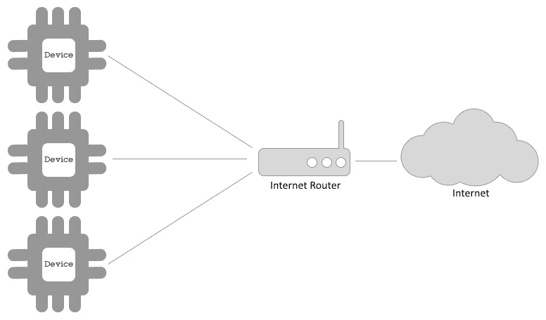

多个设备可以连接到一个节点，例如路由器，路由器连接到互联网，允许连接的设备访问互联网。

# 蜂窝/移动网络

蜂窝网络是任何移动电话使用的相同连接。这种网络的基本思想是将一个区域划分为若干个小区，每个小区都有一个由基站和若干个收发器提供无线网络连接的基站。该网络提供一系列服务，如语音、文本和数据。

移动网络是在解决方案中的设备类型不在 Wi-Fi 网络范围内时的一个选择，例如在汽车中。可能需要移动网络设备的另一个应用是当解决方案不能依赖用户的网络时，例如，如果您使用的是设备的订阅，且设备的活动取决于网络连接。当使用订阅网络时，即使用户禁用了他们自己的网络连接，设备也将继续执行其工作。

下图显示了标准蜂窝网络的工作原理：

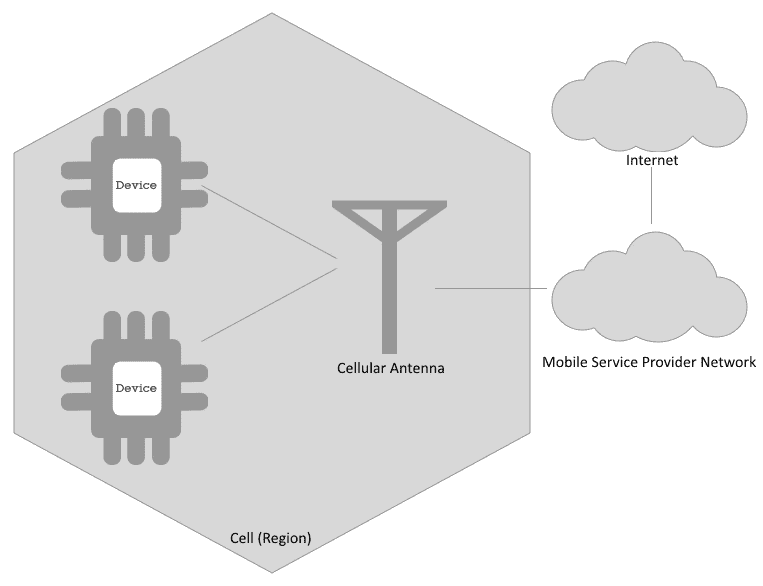

我们可以看到，蜂窝天线向有限区域提供信号。范围内的设备可以通过无线网络连接到天线，并使用移动服务提供商提供的服务，包括可用的互联网连接。

# 低功耗广域网络（LPWAN）

LPWAN 是一种设计用于在广泛区域内以非常低比特率工作的无线网络类型，这意味着在这种类型的网络中，交换量确实很小。

LPWAN 使用低功耗、低比特率和低频设备，当用于连接物品时非常强大。这是因为它使得可以使用持久电池和更小的设备。但仍然存在许多限制，如小数据负载或每天限定的消息数量。

由于频率较低，LPWAN 可以非常可靠且不易受干扰，即使在传播非常大范围的消息时也是如此。LPWAN 提供商通常对网络中发送的消息数量有限制。LPWAN 有许多提供商，其中最著名的可能是 Sigfox。

LPWAN 并没有设备或网关到互联网的直接连接。相反，它们通常具有预配置的网络，在网络的一端，您将拥有设备，在另一端，您将有许多 web 钩子和功能，允许您连接到您的应用程序或平台：

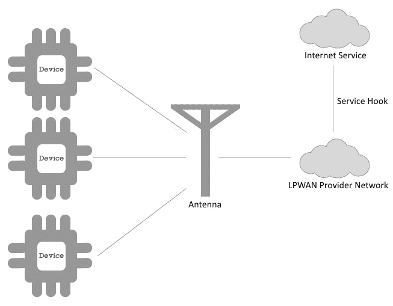

与蜂窝网络不同，LPWAN 网络不向设备提供互联网连接，而是提供了一种从设备到网络的事件触发的方法。例如，您可以在 LPWAN 提供商网络边缘创建一个应用程序和触发器，以使设备接收到数据事件时，它调用互联网上的一个可用服务，并使用设备发布的给定数据。

# LoRa 或 LoRaWAN

LoRa 网络图与 LPWAN 网络类似，只是不使用服务提供商基础设施，LoRa 网络可以有一个网关，允许设备连接到互联网。负责 LoRa 网络基础设施的人是网络的所有者，这意味着您不依赖网络服务提供商。您创建自己的网络：

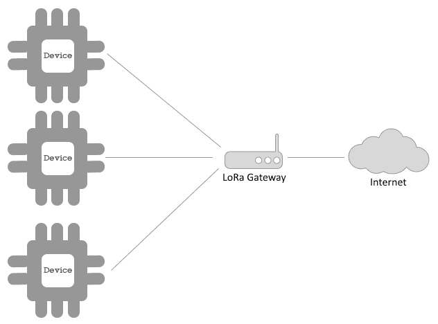

有一些与 LoRA 相同模型的技术，使用不同的协议，如 ZigBee。飞利浦 Hue 使用与 ZigBee 相同的方法连接灯泡、LED 灯带和其他 Hue 设备到一个网关，然后网关连接到 Hue 云。

# 网络摘要

总之，在选择网络连接时，您可以使用此表作为参考：

| **类型** | **速度** | **负载** | **范围** | **连接初始化** | **成本** | **基础设施** |
| --- | --- | --- | --- | --- | --- | --- |
| Wi-Fi | 高 | 高 | 低 | 双向 | 低 | 私人/公共 |
| 移动网络 | 高 | 高 | 高 | 双向 | 高 | 提供商 |
| LPWAN | 低 | 低 | 高 | 设备 | 低 | 提供商 |
| LoRa | 低 | 低 | 高 | 双向 | 低 | 私有 |

# 应用程序协议

在决定最适合您的物联网解决方案的设备之后，定义与设备通信的协议非常重要。物联网解决方案倾向于使用轻量级协议，例如 MQTT。这不是物联网中唯一可用的协议，但由于 IBM Watson IoT 平台依赖 MQTT 和 REST——而 REST 非常流行——让我们稍微专注于 MQTT。

# MQTT

MQTT 代表**消息队列遥测传输**。它是一种基于发布和订阅模式的极轻量级消息协议。与任何消息队列模型一样，它是一种异步协议。

如下图所示，发布和订阅（pub/sub）模型依赖于三个参与者：


三个参与者的解释如下：

+   **发布者**是生产任何内容并将其发布到给定主题（称为主题）的参与者。

+   **订阅者**是事件消费者。订阅者订阅其感兴趣的主题（topics），并在**发布者**创建发布到其订阅之一时获得事件发布。

+   **代理**负责接收发布并通知感兴趣的订阅者有关特定主题的信息。

现在让我们转到下一个重要的技术要素。

# 分析与人工智能

在物联网解决方案中拥有分析或人工智能软件组件并不是必需的，但将其用于处理从设备收集的数据以提取模式和见解非常有趣，这可能导致预测性维护、更好地理解用户行为等。

例如，让我们看一些通过洗衣机捕获的数据。有人可能购买了该家电，因为它据说可以节省能源。然而，经过收集的数据处理后，发现该家电消耗的能源比预想的多。根本原因是润滑剂，因为它不适合在非热带国家的电机中使用。

稍后，假设您将该信息与销售数据进行比较，并意识到大约八个月前在欧洲销售了 100 万台洗衣机。洗衣机制造商可以享受提前发货费率，以交换必须更换的备件。制造商还可以为其供应商获得可预测的新润滑剂数量，这可能导致新的家电设计。

# IBM Watson IoT 平台功能

IBM Watson IoT 平台是连接物联网解决方案中的设备、网关和应用程序的中心。它支持 REST 和 MQTT 协议，用于应用程序、设备、网关、事件处理和管理任务。IBM Watson IoT 平台可在基于 Cloud Foundry 和 Kubernetes 的 IBM 云平台（以前称为 IBM Bluemix）上使用。

让我们回顾一下此平台的相关特性。

# 特点

在本节中，我们将讨论 IBM Watson IoT 平台的以下主要特性：

+   仪表板

+   设备、网关和应用程序，

+   安全性

让我们开始吧！

# 仪表板

这是您访问 IBM Watson IoT 平台时将看到的第一件事。此仪表板可以是许多看板和卡片的组合，为您的 IoT 解决方案提供了多种可视化选项：

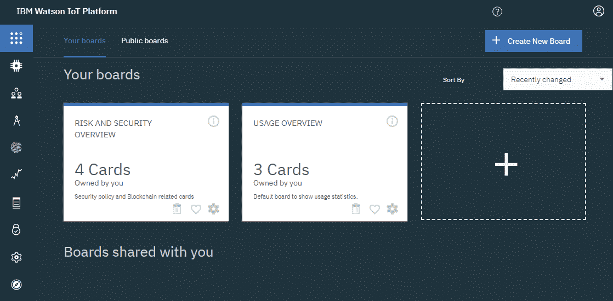

浏览此屏幕中可用的看板和卡片，以熟悉界面。

# 设备、网关和应用程序

平台中另一个可用的功能是设备管理控制。该功能可以创建和删除设备、网关、应用程序和设备类型。还可以检查并触发对设备的操作，例如固件升级请求或重置：

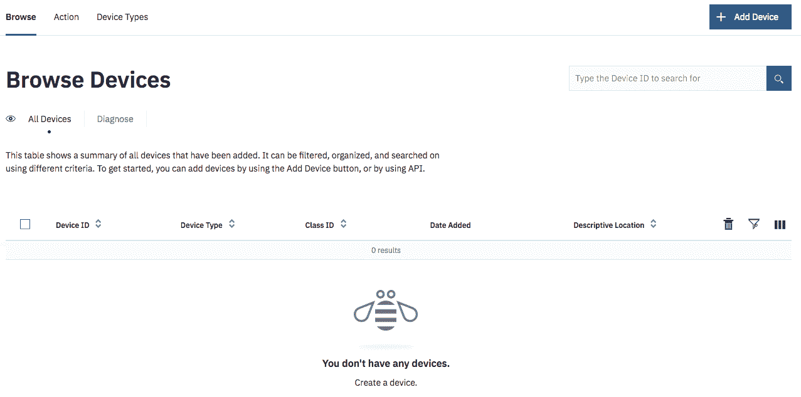

您还可以创建 API 密钥，以便您的应用程序可以连接到 IoT 组织并与解决方案的其他组件进行交互。

# 安全性

您还可以使用 IoT 平台管理解决方案的安全性方面。这可能包括为设备连接创建策略、设备 IP 地址的白名单和黑名单，或查看国家规则。您还可以管理被允许或被阻止管理 IoT 组织的用户，以及解决方案。

# 创建您的第一个 IoT 解决方案

在本章的早期部分，有许多设备和应用程序没有深入解释。要了解它们在 IoT 解决方案中的角色，重要的是创建每个示例。

这里创建的场景将是一个**设备**连接到**IBM Watson IoT 平台**，发送时间戳作为数据，以及一个使用 Node.js 将其打印到**stdout**的**应用程序**：

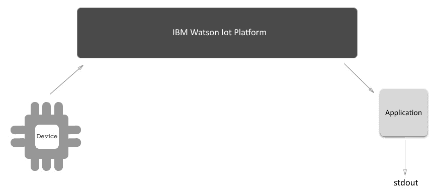

然后，我们将通过向解决方案添加网关来改进此功能，该网关与以下图表类似：

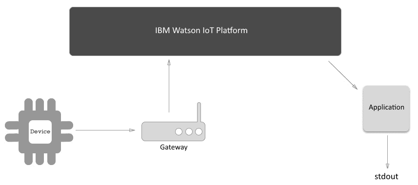

最后，拥有网关连接和设备连接的区别在于，您可以根据任何使决策变得更容易、更便宜或其他任何原因来创建设备连接到 IoT 平台的抽象或专业化。

# 创建网关

工作的第一个任务是创建一个 IoT 组织。如果您没有 IBM ID 和 IBM Cloud 帐户，注册过程非常直观，只需几分钟即可完成。如果您已经拥有 IBM Cloud 帐户和 IBM ID，请访问 [`bluemix.net`](http://bluemix.net) IBM Cloud 平台。首先，登录并为本书的练习创建一个空间。

登录 IBM 云平台并访问指定空间后，选择“创建资源”选项以访问服务目录：

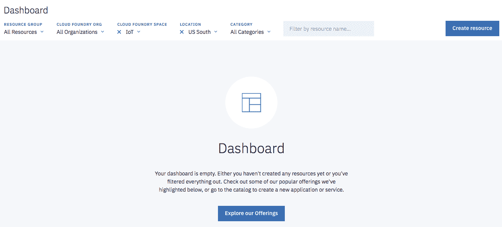

在菜单中选择物联网，创建一个名为物联网平台的服务。然后选择创建选项：**：

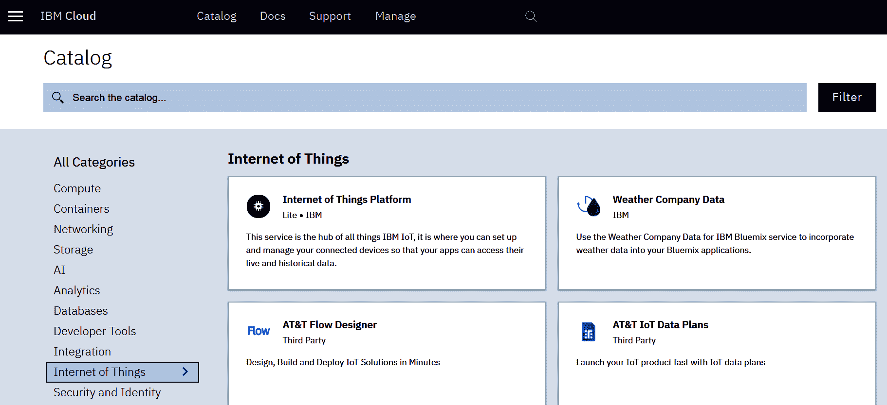

创建服务后，您可以选择“启动”选项并访问 IoT 平台：

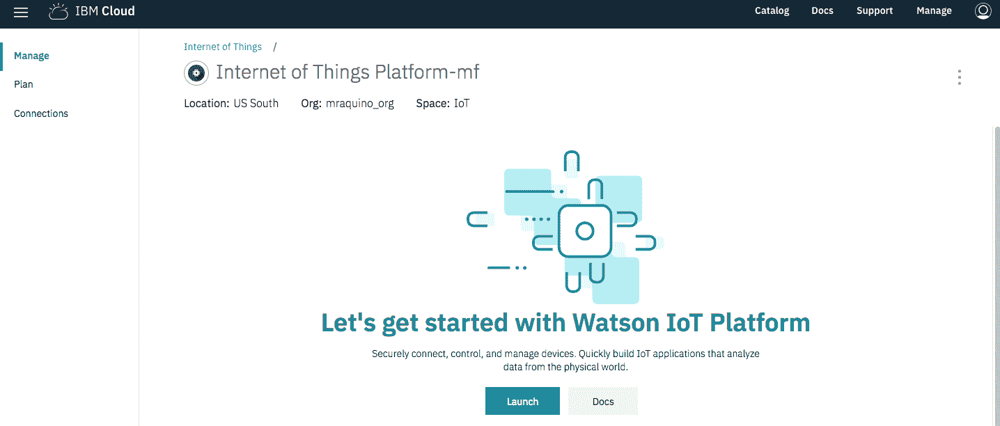

当您访问 IoT 平台时，请注意地址为`https://xxxxxx.internetofthings.ibmcloud.com/`。

这里，`xxxxxx`是您的组织 ID；请注意下，因为在整个过程中会用到它。

# 创建一个应用

创建应用意味着，您允许实际的应用程序或服务连接到特定的 Watson IoT 平台组织：

1.  为了做到这一点，通过 IBM Cloud 仪表板访问 IoT 组织，从侧边菜单中选择应用程序，然后选择*生成 API 密钥*，填写*描述*字段为`Hands-On IoT Solutions with Blockchain - Chapter 1 App`*。最后，点击“下一步”：

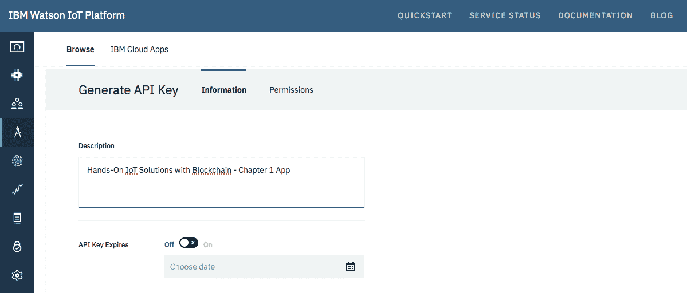

1.  选择标准应用角色，然后点击*生成密钥*。您将得到一个`API 密钥`和`认证令牌`。请记下这些内容，以表格形式记录，因为您将需要它们连接到您的应用程序：

| API 密钥 | 认证令牌 |
| --- | --- |
|  |  |

1.  接下来，打开您喜欢的 IDE，创建一个新的 Node.js 项目，并安装`ibmiotf`依赖包：

```
npm install ibmiotf --save
```

1.  确保您的`package.json`文件看起来与下面的内容类似：

```
{
  "name": "sample-application",
  "version": "1.0.0",
  "description": "Hands-On IoT Solutions with Blockchain - Chapter 1 App",
  "main": "index.js",
  "scripts": {
    "start": "node .",
    "test": "echo \"Error: no test specified\" && exit 1"
  },
  "author": "Maximiliano Santos",
  "license": "ISC",
  "dependencies": {
    "ibmiotf": "⁰.2.41"
  }
}
```

1.  现在，创建一个名为`application.json`的文件，内容如下：

```
{
  "org": "<your iot org id>",
  "id": "<any application name>",
  "auth-key": "<application authentication key>",
  "auth-token": "<application authentication token>"
}
```

1.  创建一个名为`index.js`的文件，并添加以下内容：

```
var Client = require("ibmiotf");
var appClientConfig = require("./application.json");

var appClient = new Client.IotfApplication(appClientConfig);

appClient.connect();

appClient.on("connect", function () {
  console.log("connected");
});
```

1.  可以通过运行`npm start`命令来测试应用程序：

```
$ npm start
> sample-application@1.0.0 start /sample-application
> node .
connected
```

恭喜，您刚刚创建了连接到 IBM Watson IoT 平台的第一个应用程序！

1.  现在，更新`index.js`的内容如下：

```
var Client = require("ibmiotf");
var appClientConfig = require("./application.json");

var appClient = new Client.IotfApplication(appClientConfig);

appClient.connect();

appClient.on("connect", function () {
  appClient.subscribeToDeviceEvents();
});

appClient.on("deviceEvent", function (deviceType, deviceId, payload, topic) {
  console.log("Device events from : " + deviceType + " : " + deviceId + " with payload : " + payload);
});
```

现在，每当设备发布事件时，您将在`stdout`中得到事件的打印。在下一节中，我们将创建一个设备来发布事件。

# 创建一个设备

在本节中，您将运行类似步骤，创建一个模拟设备，连接到 IBM Watson IoT 平台，并发布事件。

1.  在设置步骤中创建的 IoT 平台服务中，在菜单中选择设备，然后选择添加设备。创建一个名为 DeviceSimulator 的设备类型，并在设备 ID 字段中填写`DeviceSimulator01`：

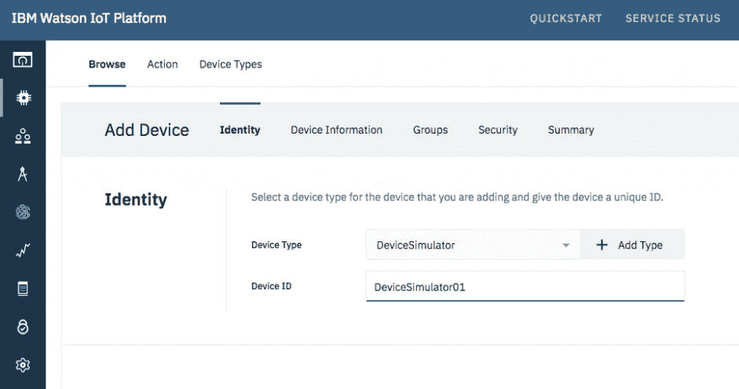

1.  由于这只是一个模拟器，只需点击“下一步”，直到达到向导的末尾即可：

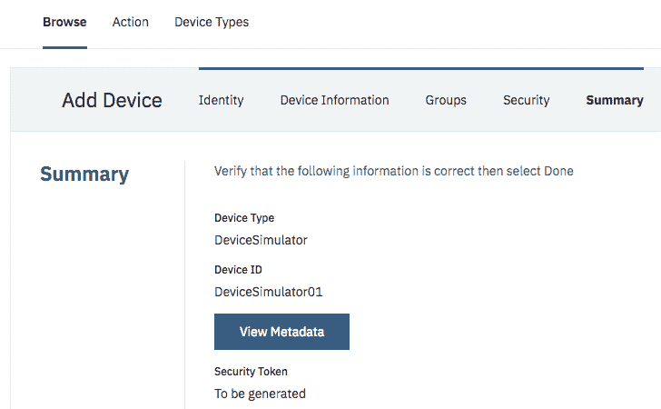

1.  注意生成的设备凭据，格式如下：

| 设备类型 | 设备 ID | 认证方法 | 认证令牌 |
| --- | --- | --- | --- |
|  |  |  |  |

1.  回到您喜欢的 IDE，并创建具有与之前应用相同特性的项目：

```
npm install ibmiotf --save
```

1.  确保您的`package.json`文件看起来像下面这样：

```
{
  "name": "sample-device",
  "version": "1.0.0",
  "description": "Hands-On IoT Solutions with Blockchain - Chapter 1 Device",
  "main": "index.js",
  "scripts": {
    "start": "node .",
    "test": "echo \"Error: no test specified\" && exit 1"
  },
  "author": "Maximiliano Santos",
  "license": "ISC",
  "dependencies": {
    "ibmiotf": "⁰.2.41"
  }
}
```

1.  接下来，创建一个名为`device.json`的文件，内容如下：

```
{
  "org": "<your iot org id>",
  "type": "DeviceSimulator",
  "id": "DeviceSimulator01",
  "auth-method" : "token",
  "auth-token" : "<device authentication token>"
}
```

1.  创建一个名为`index.js`的文件，并添加以下内容：

```
var iotf = require("ibmiotf");
var config = require("./device.json");

var deviceClient = new iotf.IotfDevice(config);

deviceClient.log.setLevel('debug');

deviceClient.connect();

deviceClient.on('connect', function(){
  console.log("connected");
});
```

1.  可以通过运行`npm start`命令来测试设备模拟器：

```
$ npm start
> sample-device@1.0.0 start /sample-device
> node .
[BaseClient:connect] Connecting to IoTF with host : ssl://3nr17i.messaging.internetofthings.ibmcloud.co
m:8883 and with client id : d:3nr17i:DeviceSimulator:DeviceSimulator01
[DeviceClient:connect] DeviceClient Connected
connected
```

1.  现在，更新代码，将当前时间戳发送到 IoT 平台服务：

```
var iotf = require("ibmiotf");
var config = require("./device.json");

var deviceClient = new iotf.IotfDevice(config);

deviceClient.log.setLevel('debug');

deviceClient.connect();

deviceClient.on('connect', function() {
  console.log("connected");
  setInterval(function function_name () {
    deviceClient.publish('myevt', 'json', '{"value":' + new Date() +'}', 2);
  },2000);
});
```

1.  再次运行`npm start`，设备将每两秒向 Watson IoT 平台发送一个事件。你可以检查应用程序的日志，查看它是否接收到了事件，如下所示：

```
Device Event from :: DeviceSimulator : DeviceSimulator01 of event myevt with payload : {"value":Sun May 20 2018 21:55:19 GMT-0300 (-03)}
Device Event from :: DeviceSimulator : DeviceSimulator01 of event myevt with payload : {"value":Sun May 20 2018 21:55:21 GMT-0300 (-03)}
Device Event from :: DeviceSimulator : DeviceSimulator01 of event myevt with payload : {"value":Sun May 20 2018 21:55:23 GMT-0300 (-03)}
Device Event from :: DeviceSimulator : DeviceSimulator01 of event myevt with payload : {"value":Sun May 20 2018 21:55:25 GMT-0300 (-03)}
```

恭喜！你的设备模拟器现在正在发布事件，你的应用程序正在接收它们！

# 摘要

在本章中，我们概述了物联网环境。我们了解了一些在成功实施物联网解决方案中起作用的重要技术要素。

我们还研究了不同类型的网络选项、选择设备类型时的重要考虑因素，以及如何创建一个连接到 IBM Watson IoT 平台的设备和应用程序。

在下一章中，你将通过创建一个简单的连接花园来提高你的开发技能。

# 进一步阅读

在 IBM Watson IoT 平台文档中可以找到其他语言的示例，例如 Python、Java、C++ 和 C#，链接如下：[`console.bluemix.net/docs/services/IoT/getting-started.html#getting-started-with-iotp`](https://console.bluemix.net/docs/services/IoT/getting-started.html#getting-started-with-iotp)。
