# 第二章：创建您的第一个物联网解决方案

在上一章中，我们探讨了**物联网**（**IoT**）以及 IBM Watson IoT 平台。我们还创建了我们的第一个简单解决方案。在本章中，我们将通过创建一个简单的端到端解决方案来实践这一点，从选择设备到创建设备固件和一个用于控制简单花园浇水系统的应用程序。

本章将涵盖以下主题：

+   了解如何设置解决方案

+   创建连接设备

+   创建连接到平台的简单应用程序

+   发布和处理设备事件

+   将动作发布到设备

+   在遇到问题时如何获取帮助

# 技术要求

完整的解决方案代码可在 `ch2` 文件夹中找到，位于 [`github.com/PacktPublishing/Hands-On-IoT-Solutions-with-Blockchain.git`](https://github.com/PacktPublishing/Hands-On-IoT-Solutions-with-Blockchain.git) 存储库中。

确保您还安装了 Cloud Foundry CLI 和 Bluemix CLI；这些命令行界面的安装过程在 [`console.bluemix.net/docs/cli/index.html#overview`](https://console.bluemix.net/docs/cli/index.html#overview) 中有描述。

# 第一个物联网解决方案 - 花园解决方案

在 DIY 社区中，浇水系统是使用物联网的常见第一个项目。我们也将使用它作为一个示例项目，开始使用 IBM Watson IoT 平台。

# 需求概述

好的解决方案是基于真正对人们重要的问题。所以让我们从介绍实际问题开始我们的解决方案：

约翰独自一人住在城市的公寓里。他是一个商人，每周必须出差 3-4 天。在不出差或工作时，约翰喜欢照顾他的植物。然而，由于他一周有一半时间不在家，约翰正在努力保持他的花园健康和美丽。

约翰曾经在自动浇水系统中遇到过几次挑战性的经历：要么系统没有足够地给植物浇水（例如在炎热或干燥的日子），要么在天气好的时候给它们浇水太多。

约翰正在寻找一个解决方案，只有当植物达到一定的土壤湿度条件时，或者他觉得有必要时才给花园浇水。

# 解决方案概述

下图显示了将开发的解决约翰问题的解决方案组件的概述：

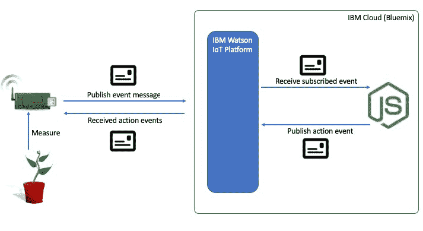

一个连接的设备将连接到约翰的植物上，并定期从植物和环境（土壤湿度和温度）中检索测量值，并将事件发布到 IBM Watson IoT 平台。该设备还将订阅触发命令（动作）。

部署到 IBM 云（Bluemix）的应用将订阅约翰的事件，并在达到配置的最低土壤湿度或高温阈值时，应用将发送动作命令以进行一定时间的浇水。

# 选择设备

鉴于前一节描述的要求，需要创建的设备必须具备以下功能：

+   能够测量土壤湿度水平（模拟探针非常适合这种解决方案）

+   具有双向通信能力（以便用户在觉得有必要时为花园浇水）

+   能够配置土壤湿度的限制（可配置规则）

关于解决方案，还有以下假设是成立的：

+   用户将提

+   +   供 Wi-Fi 互联网连接

    +   用户将为系统提供能源供应

    +   该系统将用于公寓，因此不需要远距离连接

    +   负载大小是不确定的

+   当提供了 Wi-Fi 连接时，相关性变得更高

由于我们在创建实际设备之前进行原型设计，有许多原型设计平台可以使布线和测试解决方案更加容易快速。为此，我们将使用其中一种最强大和模块化的平台：英特尔 Edison 和 Grove。

我们将寻找具有 Wi-Fi 连接和模拟传感器连接的设备（或组合）。我们还需要一个土壤湿度模拟传感器探针、一个温湿度传感器和一个水电磁阀。

因此，解决方案将需要一个零件列表，其形式将类似于以下内容：

| **数量** | **组件** |
| --- | --- |
| 1 | 英特尔 Edison 模块 |
| 1 | 英特尔 Edison Arduino 扩展板 |
| 1 | Grove 基座 v2 |
| 1 | Grove 土壤湿度传感器 |
| 1 | Groove 温度传感器 v1.2 |
| 1 | Grove 继电器模块 |
| 1 | Grove 按钮模块 |
| 4 | Grove 通用 4 脚电缆 |
| 1 | 12V 水电磁阀 |
| 1 | 12V 2A 电源适配器 |
| 2 | 杜邦线（公对公） |

下图提供了部件列表表中指定的部件的概览。请注意，设备的形状和颜色仅用于说明目的，可能会因供应商、版本或其他特性而有所不同：

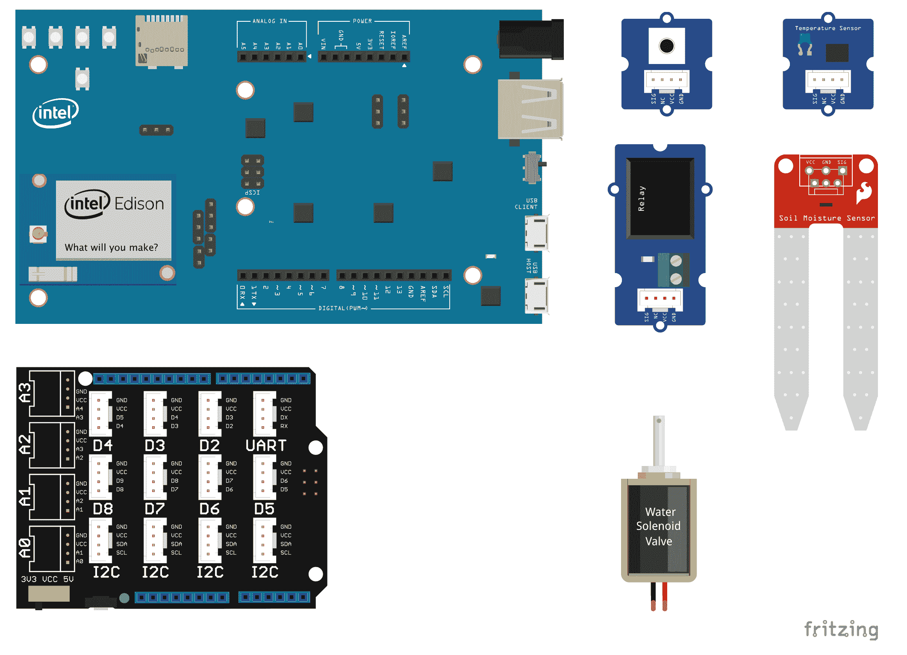

该图像是用 Fritzing 创建的，并在 CC BY-SA 3.0 下获得许可；请参阅 https://creativecommons.org/licenses/by-sa/3.0/

让我们快速查看一下此列表中的零件。

# 英特尔 Edison

Edison 是一款**片上系统**（**SoC**），基于英特尔 x86 架构，内置蓝牙 4.0 和 Wi-Fi，专为物联网应用设计。Edison 运行名为 Yocto 的 Linux 发行版；支持许多平台，如 Python、Node.js、C 和 C++；并具有用于使用 Arduino IDE、Eclipse 和英特尔 XDK 开发解决方案的插件。

# Arduino 扩展板

Intel 还推出了用于 Edison 的 Arduino 扩展板，它提供了与 Arduino 模块相同的标准引脚接口，并与 Arduino Shield 兼容。由于可以使用标准的 Arduino IDE、兼容的库、连接器和 Shield，因此 Intel Edison Arduino 扩展板是原型设计和运行 Arduino 程序的一个不错的接口。

# Grove 系统

Grove 是由 Seeed 创建的一套组件和 Shield，用于创建一个标准化的模块化平台，供原型设计解决方案使用。有许多可用的原型设计，包括 Grove 平台的工作代码，尤其是在**DIY**社区网站上可以找到。

Grove 系统针对市场上广泛采用的平台（如 Arduino、Raspberry Pi 和 BeagleBone）提供了相应的 Shield。在互联网上可以找到包含计算模块、基础 Shield、Grove 模块和备件的捆绑销售套装。

请注意，并非每种传感器都兼容每种平台，因为一些平台缺乏某些功能。例如，Raspberry Pi 不提供模拟接口，因此通过模拟接口连接的传感器将与其不兼容。

让我们来看看作为这个物联网解决方案一部分的所有 Grove 组件。

# 用于 Arduino 的 Grove 基础 Shield

在本项目中，我们将使用 Arduino 的 Grove 基础 Shield，它提供了一个接口，用于将 Grove 标准连接器连接到 Arduino 引脚接口。它提供了四个模拟接口，四个 I2C 接口，七个数字接口和一个 UART 接口。

# Grove 传感器

在本项目中，我们将使用两种不同类型的传感器：土壤湿度传感器和温度传感器。

土壤湿度传感器是一种模拟探针，可以提供土壤电阻测量数据，这一点我们将在本章后面进行解释。该传感器的温度是基于热敏电阻的，并且其规格和计算方法也在*测量环境温度*部分有详细介绍。

两种传感器都使用标准的 Grove 连接线，为探测器提供`VCC`、`GND`和数据连接功能。

# Grove 按钮

这个按钮与传感器一样连接到计算模块，但根据按钮是否按下，它可以提供开路或闭路状态。

它可能有不同的解释：按钮按下时中断连接，这意味着除非按下按钮，否则它会持续做某事；或者按钮按下时激活连接，这意味着只有在按下按钮后才会执行某些操作。

# Grove 继电器

作为预期的一样，继电器模块连接到标准的 Grove 接口，但由于它不提供读数，所以被归类为执行器。

其他执行器模块，如 LED、显示器、电机驱动器和蜂鸣器，用于执行动作而不是读取状态。继电器模块也有两种状态，断路或闭路，这意味着继电器的输入连接没有连接到输出。

这结束了我们对零件的审查。让我们继续进行解决方案开发过程中的下一步。

# 接线装置

要组装硬件，我们需要正确连接传感器探针到处理单元——在本例中，是英特尔 Edison 模块。

Grove 模块使连接变得非常简单，如下面的步骤所示：

1.  使用 Grove 通用电缆：

    +   将 Grove 湿度传感器连接到基础盾牌的`A0`连接插孔

    +   将 Grove 温度传感器连接到基础盾牌的`A3`连接插孔

    +   将 Grove 继电器模块连接到基础盾牌的`D2`连接插孔

    +   将 Grove 按钮模块连接到基础盾牌的`D3`连接插孔

1.  使用跳线：

    +   将电磁阀的`V+`端连接到外部 12V 电源

    +   将外部`GND`引脚连接到基础盾牌的一个`GND`引脚

    +   将继电器连接到一个`GND`引脚

    +   将电磁阀`GND`端连接到另一个继电器模块连接处

以下图表显示了正确的连接方式：

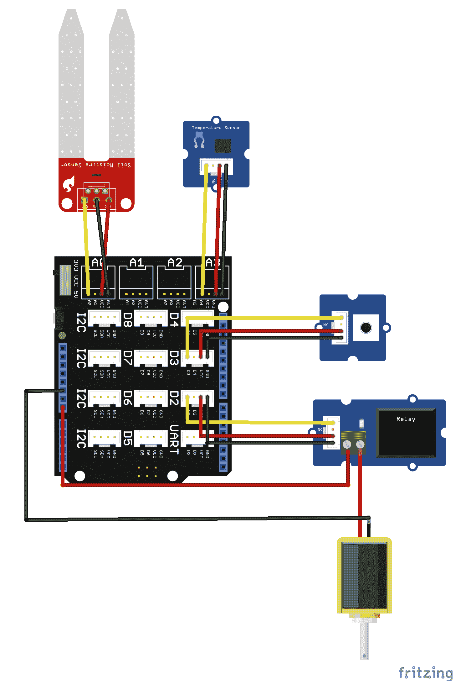

图像是使用 Fritzing 创建的，并且受 CC BY-SA 3.0 许可证的保护 https://creativecommons.org/licenses/by-sa/3.0/

# 编写设备固件

接下来，我们将创建一个设备应用程序（固件），该应用程序读取传感器数据并将其发送到后备应用程序。在上一章中，我们使用 Node.js 从设备模拟器发布事件，现在我们将使用此方法来利用前一章的代码。请记住，此解决方案的目标是在温度过高或土壤湿度过低时浇水。

下一节显示了创建读取所有传感器数据并将事件发布到 IBM Watson IoT 平台的固件所需的代码。

# 测量土壤湿度

此项目中使用的传感器探针是一个电阻性传感器，它测量通过传感器探针的电流。它有两个物理分离的探针；一个探针连接到正极，另一个连接到`GND`端。当两个探针通过一个共同的表面连接时，它将测量通过该表面传递的电流并给我们一个读数。

在我们的情况下，当探针接触土壤时，它将测量通过的电流。当土壤变湿时，它变得更加导电，这意味着更多的电流将通过探针。

位于 Arduino 扩展板上的英特尔 Edison ADC（模拟到数字）转换器具有 12 位分辨率，但通过软件限制为 10 位分辨率。如果我们将此作为测量的基础，我们将获得以下读数的理解：

2¹⁰ = 1024

这意味着我们的读数将是从 0 到 1,023 的值，其中 0 表示没有水，1,023 表示水的 100%。这将因土壤中存在的其他杂质而变化，例如矿物质。然而，在这种情况下，我们将假设土壤被完美地测量。当它完全干燥时，它会给我们一个 0% 的测量值，如果是一杯没有任何土壤的水，它会给我们一个 100% 的读数。

以下代码将每两秒读取一次土壤湿度传感器：

```
var mraa = require('mraa');
var pin0 = new mraa.Aio(0);
var getSoilMoisture = function() {
  var sensorReading = pin0.read();
  return sensorReading;
};
setInterval(function() {
  console.log("Current Moisture " + getSoilMoisture());
},2000);
```

要运行代码，请在 Edison 的 SSH 控制台中键入 `npm start`。

为了测试目的，让我们查看打印到控制台的传感器测量读数并对这些值有所了解：

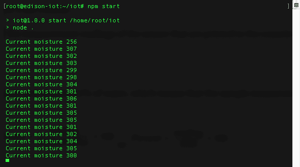

我们已经知道，0 表示 0% 的水分，1,023 表示 100%，这意味着程序中的样本测量读数如下：

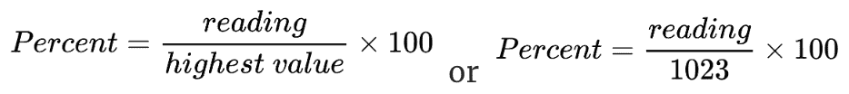

将读数值应用于前面的公式将使它们转换为百分比值，如下所示：

| **读数数值** | **湿度百分比** |
| --- | --- |
| 256 | 25.02% |
| 307 | 30.00% |
| 302 | 29.52% |
| 303 | 29.61% |
| 299 | 29.22% |
| 298 | 29.13% |

# 测量环境温度

与上一个代码块类似（但稍微更加数学上复杂），温度传感器返回传感器的模拟读数。

如果我们查看制造商的说明 ([`wiki.seeedstudio.com/Grove-Temperature_Sensor_V1.2/`](http://wiki.seeedstudio.com/Grove-Temperature_Sensor_V1.2/)) 关于如何读取传感器，我们将发现传感器的 v1.2 配有一个热敏电阻，其值为 4,250，以及一个 100k 电阻。

因此，使用该传感器计算温度值的公式如下：

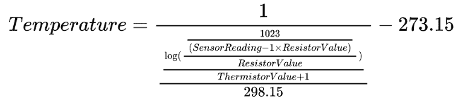

以下代码将基于传感器读数每两秒给出一次温度：

```
var mraa = require('mraa');
var pin3 = new mraa.Aio(3);
var RESISTOR = 100000;
var THERMISTOR = 4250;
var getTemperature = function() {
  var sensorReading = pin3.read();
  var R = 1023 / sensorReading - 1;
  R = RESISTOR * R;
  var temperature = 1 / (Math.log(R/RESISTOR)/THERMISTOR+1/298.15)-273.15;
  return temperature;
};
setInterval(function() {
  console.log("Current Temperature " + getTemperature());
},2000);
```

此代码的输出将类似于以下内容：

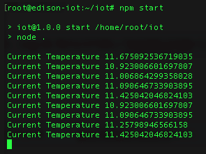

使用 SSH 控制台，这些读数将被记录。

# 打开继电器

最后但同样重要的是，因为我们想要打开一个继电器，让水流出然后关闭，所以打开水的代码在一秒后关闭两秒后如下所示：

```
var mraa = require('mraa');
var pinD2 = new mraa.Gpio(2);
pinD2.dir(mraa.DIR_OUT);
setTimeout(function() {
  pinD2.write(1);
  setTimeout(function() {
    pinD2.write(0);
  },2000);
},1000);
```

延迟一秒后，你将看到 `D3` 继电器模块的 LED 灯亮起，并且会听到一声点击。这意味着继电器连接已关闭，两秒后它将关闭并打开连接。

# 发布事件

在本章的这一点上，我们已经探讨了能够读取土壤湿度和温度的 Node.js 脚本，并且我们还查看了能够打开和关闭让水流到植物的继电器的代码。

现在的目标是将这两个值发布到 IBM Watson IoT 平台。

如前一章所示，需要创建一个设备并记录凭据，以便我们可以使用它们将设备连接到平台。下面的代码执行事件的定期发布：

```
var iotf = require("ibmiotf");
var mraa = require('mraa');
var config = require("./device.json");
var deviceClient = new iotf.IotfDevice(config);
var temperatureSensor = new mraa.Aio(3);
var moistureSensor = new mraa.Aio(0);
var RESISTOR = 100000;
var THERMISTOR = 4250;
var getTemperature = function() {
 var sensorReading = temperatureSensor.read();
 var R = 1023 / sensorReading - 1;
 R = RESISTOR * R;
 var temperature = 1 / (Math.log(R/RESISTOR)/THERMISTOR+1/298.15)-273.15;
 return temperature;
};
var getSoilMoisture = function() {
 var sensorReading = moistureSensor.read();
 return sensorReading;
};
deviceClient.connect();
deviceClient.on('connect', function(){
console.log("connected");
setInterval(function function_name () {
deviceClient.publish('status', 'json', '{ "temperature": ' + getTemperature() +', "soilMoisture": ' + getSoilMoisture() + '}', 2);
},300000);
});
```

当脚本启动时，它们将从 `device.json` 文件加载配置，连接到 IBM Watson IoT 平台，然后每五分钟发布一次当前土壤湿度和温度的事件。

# 监测事件

查看设备发布的数据最简单的方法是使用看板和卡片。如果在创建卡片时保持设备脚本运行，它将从设备发布的数据结构中获取值。

1.  要创建卡片，请访问 IBM Watson IoT 平台控制台，并在左侧菜单中选择看板：

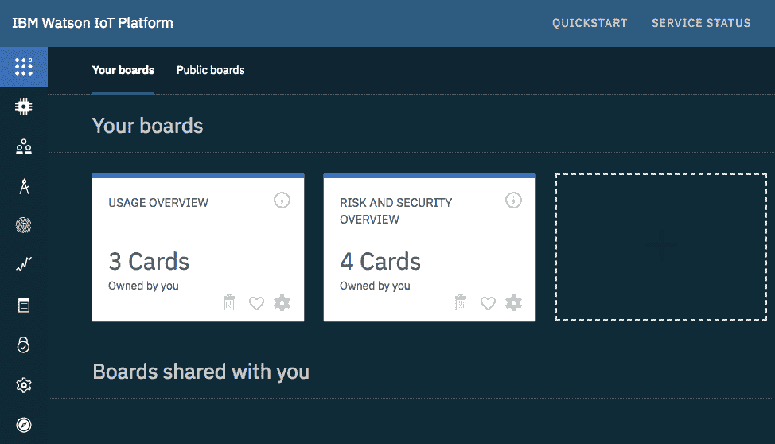

1.  在页面右上角，选择+ 创建新看板，填写所需信息，并创建看板。大多数必须提供的信息都是杂项，但确保对目标用户有意义。这里创建的看板应该显示所监测到的植物读数：

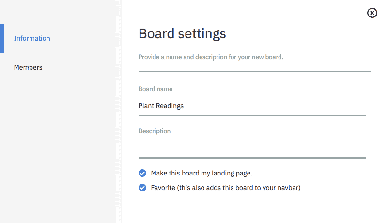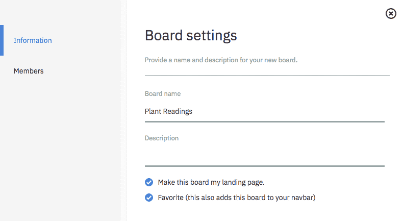

看板是一组相关的卡片，卡片是设备发布到平台的相关值的集合。

1.  选择已创建的看板，并通过选择+ 添加新卡片创建卡片。

1.  选择 折线图 设备可视化和已创建的设备：

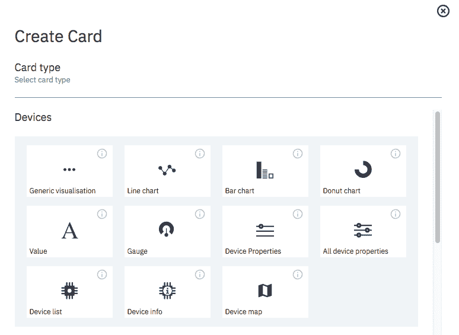

1.  选择折线图卡后，需要选择事件的数据源。将已创建的设备作为此卡的数据源。数据源，顾名思义，是将用于从设备收集的度量值填充图表的信息源：

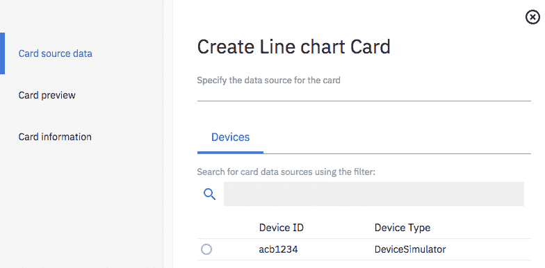

1.  选择数据源后，需要选择将在图表上绘制的度量。如果设备已经向 IBM Watson IoT 平台发布了一些事件，那么度量名称将可供选择。另一方面，如果设备代码以前从未运行过，则需要提供度量名称。建议（但不是必须）在创建图表之前至少测试设备代码，以避免错误。

1.  在正在开发的解决方案中，我们希望卡片在折线图中具有两个度量值，并进行跟踪。使用相应的单位和最小和最大可能值添加每个度量值。对于土壤湿度，我们使用百分比，因此单位应为`%`，最小和最大值分别为`0`和`100`：

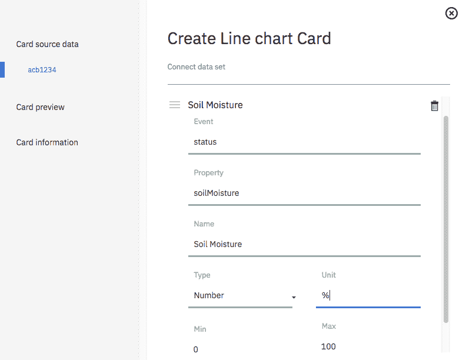

1.  对于以摄氏度（°C）测量的温度，最小和最大可能值分别为`0`和`100`：

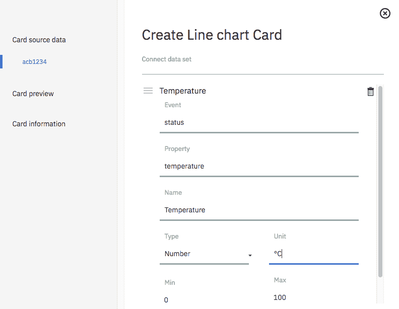

1.  选择您喜欢显示的卡片大小，命名卡片，并创建它。您现在可以可视化发布的数据了：

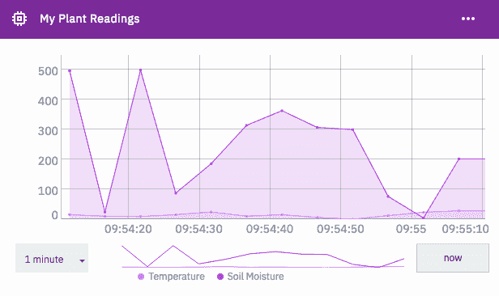

可以验证植物设备发送的测量值，在时间线上绘制出来。还可以更改图表的时间范围。

# 订阅操作

在为设备发布事件之后，现在是定义需要由设备处理的操作的时候了。在我们的情况下，解决方案的用户 John 希望能够在检测到定义的土壤湿度阈值时给植物浇水，当温度达到可配置值时，或者当他触发浇水植物的事件时。

水流由电磁阀控制，该阀由继电器模块打开和关闭。以下代码是先前代码的更新，包括订阅浇水植物动作，该动作将打开阀门一分钟。

1.  起点是导入所有包依赖项，使用预定义值定义`RESISTOR`和`THERMISTOR`常量，并从`device.json`中加载配置：

```
var iotf = require("ibmiotf");
var mraa = require('mraa');
var config = require("./device.json");
var deviceClient = new iotf.IotfDevice(config);
var temperatureSensor = new mraa.Aio(3);
var moistureSensor = new mraa.Aio(0);
var relayControl = new mraa.Gpio(2);
var RESISTOR = 100000;
var THERMISTOR = 4250;
```

1.  然后，创建辅助函数将传感器读数转换为可用值。以下函数负责从实际设备检索传感器值并将其转换为人类可理解的值：

```
var getTemperature = function() {
  var sensorReading = temperatureSensor.read();
  var R = 1023 / sensorReading - 1;
  R = RESISTOR * R;
  var temperature = 1 / (Math.log(R/RESISTOR)/THERMISTOR+1/298.15)-273.15;
  return temperature;
};
var getSoilMoisture = function() {
  var sensorReading = moistureSensor.read();
  return sensorReading;
};
```

1.  下一步是创建一个辅助函数来激活电磁阀，等待请求的时间量（`secondsToWater`变量的值），然后停止激活阀门以停止浇水：

```
var waterPlant = function(secondsToWater) {
  relayControl.write(1);
  setTimeout(function() {
    pinD2.write(0);
  },secondsToWater * 1000);
```

1.  连接到 IBM Watson IoT 平台并创建一个发布函数，该函数将每五分钟向平台发布事件：

```
deviceClient.connect();
deviceClient.on('connect', function(){
  console.log("connected");
  setInterval(function function_name () {
    deviceClient.publish('status', 'json', '{ "temperature": ' + getTemperature() +', "soilMoisture": ' + getSoilMoisture() + '}', 2);
  },300000);
});
```

1.  创建一个订阅`water`事件的函数，触发`waterPlant`函数：

```
deviceClient.on("command", function (commandName,format,payload,topic) {
  if(commandName === "water") {
    var commandPayload = JSON.parse(payload.toString());
    console.log("Watering the plant for " + commandPayload.duration + " seconds.");
    waterPlant(commandPayload.duration);
  } else {
    console.log("Command not supported.. " + commandName);
  }
});
```

这完成了我们的设备固件的编码，以便它可以执行我们的用户 John 所期望的操作。

# 创建后端应用程序

设备固件设置完成后，现在是专注于开发将处理设备事件并发送命令以便在 John 不在家时给他的植物浇水的应用程序的时候了。

应用程序的代码将在 IBM Cloud 平台（Bluemix）上运行。由于这只是一个示例应用程序，我们将使用环境变量来存储参数（温度和土壤湿度阈值）。

# 在 IBM Cloud 平台上创建一个 Cloud Foundry 应用程序

1.  要在 IBM Cloud 中创建一个应用程序，请访问[`console.bluemix.net`](https://console.bluemix.net)，选择创建资源选项，并在左侧菜单中选择 Cloud Foundry Apps，然后选择 SDK for Node.js。做完这些之后，给应用程序命名并创建运行时：

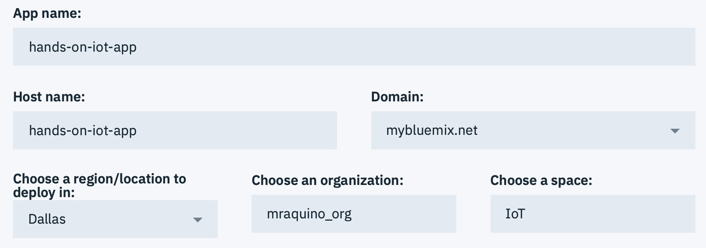

1.  当应用程序创建完成后，在左侧菜单中选择 Connections，并创建到 IoT 服务的连接：

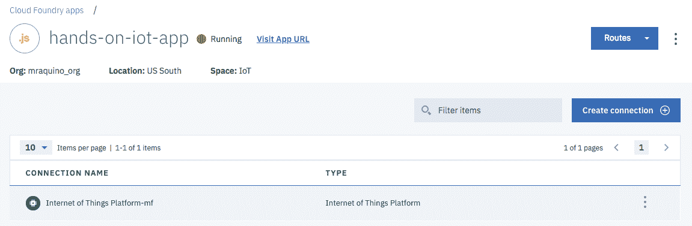

1.  在创建到 IBM Watson IoT Platform 组织的连接之后，选择左侧菜单中的 Runtime 选项，然后选择 Environment Variables。在屏幕底部，添加两个用户定义变量，`MINIMUM_MOISTURE` 的值为 `300`，`MAXIMUM_TEMPERATURE` 的值为 `50`：

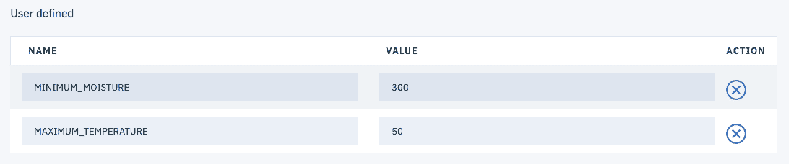

与之前章节中使用 JSON 文件存储配置不同，现在唯一需要的配置是在 `VCAP_SERVICES` 和环境变量中。可以使用默认库包从代码中访问这些变量，并且在 Node.js 中有用于访问 Cloud Foundry 环境相关设施的加速器，比如在下一节中介绍的代码中使用的 `cfenv` 模块。

# 上传代码

由于我们正在将应用程序部署到 Cloud Foundry 环境中，重要的是要知道 Cloud Foundry 容器期望容器发布一个 HTTP 端口，所以即使我们不使用容器来公开 HTTP 资源，我们仍然会启动 Express JS 服务器。

以下代码处理从设备接收到的事件，并在满足任何条件时发布动作。

1.  再次，代码的入口是加载模块依赖项并从 Cloud Foundry 环境变量中收集所需配置：

```
var express = require("express");
var cfenv = require("cfenv");
var Client = require("ibmiotf");
var minimumMoisture = parseInt(process.env.MINIMUM_MOISTURE);
var maximumTemperature = parseInt(process.env.MAXIMUM_TEMPERATURE);
```

1.  然后，从 Cloud Foundry 环境加载配置数据并生成连接配置数据：

```
var app = express();
var appEnv = cfenv.getAppEnv();
var iotConfig = appEnv.getService("Internet of Things Platform-mf");
var appClientConfig = {
  "org": iotConfig.credentials.org,
  "id": "hands-on-iot-app",
  "auth-key": iotConfig.credentials.apiKey,
  "auth-token": iotConfig.credentials.apiToken
}
```

1.  下一步是连接到 IBM Watson IoT Platform 并订阅目标设备事件：

```
var appClient = new Client.IotfApplication(appClientConfig);
appClient.connect();
appClient.on("connect", function () {
  appClient.subscribeToDeviceEvents();
});
appClient.on("deviceEvent", function (deviceType, deviceId, eventType, format, payload) {
  var deviceData = JSON.parse(payload);
```

1.  每当从订阅接收到事件时，应用程序都会检查设备报告的温度是否更高或土壤湿度是否低于定义的阈值。如果是，则发布带有指定持续时间（以秒为单位）的浇水事件到设备，以激活浇水阀：

```
  if(deviceData.temperature > maximumTemperature ||
deviceData.soilMoisture < minimumMoisture ) {
    console.log("Device, please water the plant for 60 seconds");
    var actionData= { duration : 60 };
    actionData = JSON.stringify(actionData);
    appClient.publishDeviceCommand(deviceType, deviceId, "water", "json", actionData);
  }
});
```

1.  最后，启动 Express 服务器，以便 IBM Cloud SDK for Node.js 容器在 Cloud Foundry 环境中启动并受监控：

```
var port = process.env.PORT;
app.listen(port, function() {
 console.log("App listening!");
});
```

要部署应用程序，请打开 `manifest.yml` 文件并更改应用程序的 `name` 属性。然后，打开命令行终端，切换到应用程序基目录（即 `manifest.yml` 所在的位置），并使用 `bluemix` CLI 部署应用程序：

```
bluemix login

bluemix target -o <your_cloud_foundry_organization_name> -s <space_where_your_app_will_be_deployed>

bluemix cf push
```

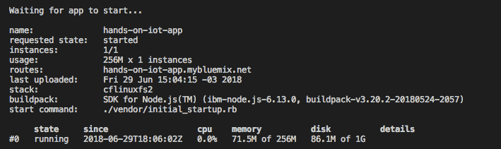

获取成功部署消息后，使用 `bluemix` CLI 检查应用程序日志：

```
bluemix cf logs <your_application_name> 
```

该命令将从 Cloud Foundry 应用程序检索并显示日志文件，如下所示。为确保您能检索这些日志，请确保所有应用程序跟踪都发送到 `stdout` 和 `stderr`：

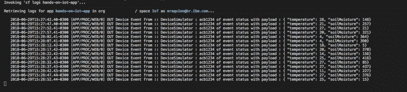

从 Cloud Foundry 应用程序的日志文件

查看设备日志，可以看到每当满足条件时，它们都会收到浇水的操作请求：

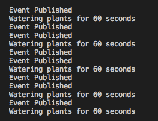

此时，您已经在 IBM Cloud 环境中拥有一个 IoT 应用程序和设备，并且已连接并正常工作。

# 摘要

在本章中，我们开发了在支持 Node.js 的真实设备上运行的解决方案。我们还使用了低级别的 mraa 库，该库与设备的 GPIO（通用输入/输出）进行交互，读取模拟传感器（温度和土壤湿度传感器），并使用数字引脚开关继电器的开关。这看起来非常简单，但大多数设备都具有传感器和执行器，这可能会改变它们的使用方式。但是，它们基本上遵循相同的概念。

我们在 IBM Watson IoT 平台中创建了一个仪表板，有助于查看设备发布的实时数据。我们还在 IBM Cloud 平台（Bluemix）中创建了一个应用程序，并将后台服务（IBM Watson IoT 平台组织）附加到了应用程序上，以利用配置数据连接到服务，并使用 Bluemix 命令行界面部署应用程序。

接下来的章节将介绍区块链作为互连业务平台，并解释其价值以及它增加业务链价值的常见用例。

# 进一步阅读

完成使用 IBM Watson IoT 平台的解决方案所需的大多数资源都可以在官方文档中找到，链接如下：[`console.bluemix.net/docs/services/IoT/index.html#gettingstartedtemplate`](https://console.bluemix.net/docs/services/IoT/index.html#gettingstartedtemplate)。社区还发布了许多使用 IBM Watson IoT 的配方，并可在 developerWorks 配方网站上找到，链接如下：[`developer.ibm.com/recipes/tutorials/category/internet-of-things-iot/`](https://developer.ibm.com/recipes/tutorials/category/internet-of-things-iot/)。

了解如何将项目上传到 GitHub 存储库以及如何创建交付流水线以在推送新更改到存储库时自动构建、测试和部署应用程序也非常有帮助。尽管这不在本书的范围之内，但这仍然是一个非常好的实践。

关于 Grove 系统平台、模块、套件和组件规格的更多信息可以在制造商的网站上找到：[`wiki.seeedstudio.com/Grove/`](http://wiki.seeedstudio.com/Grove/)。
