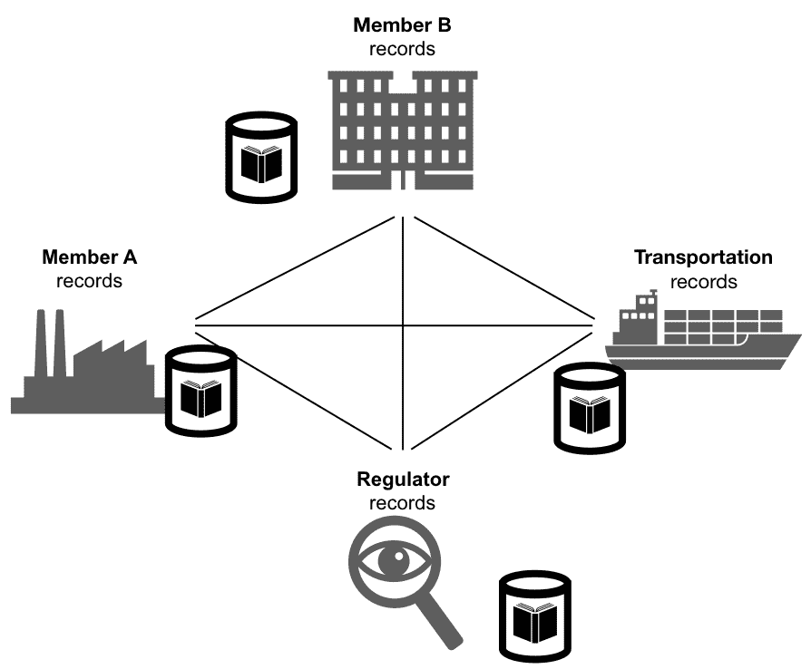
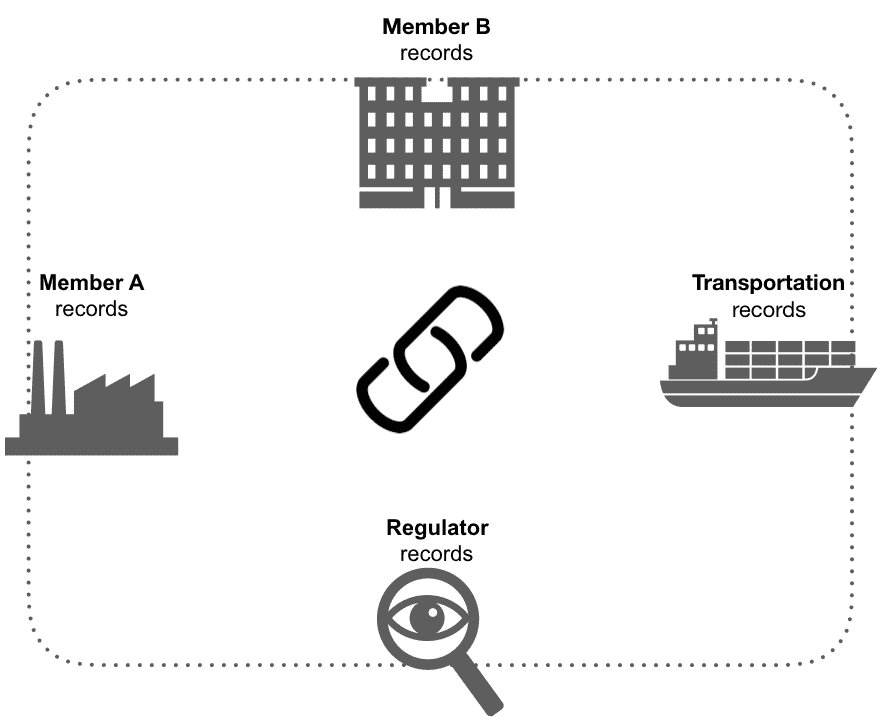
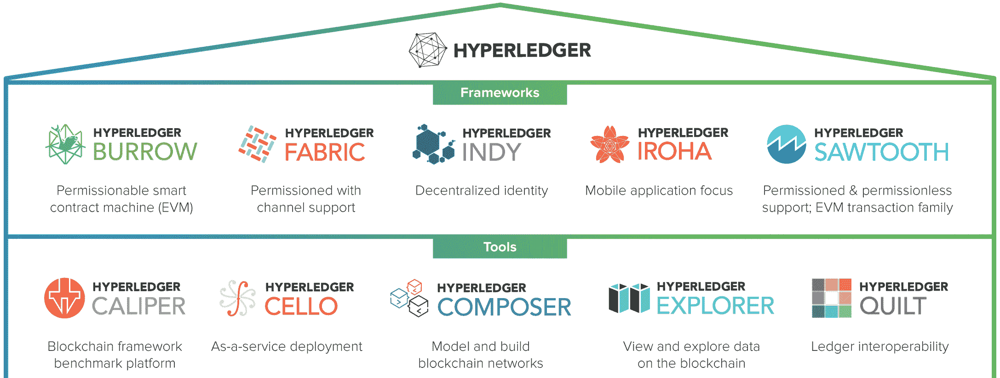
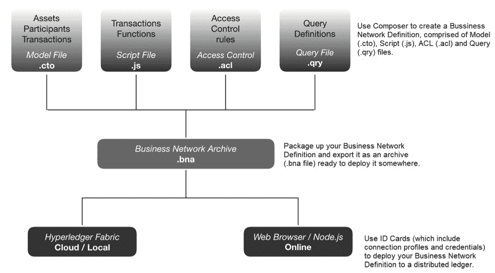
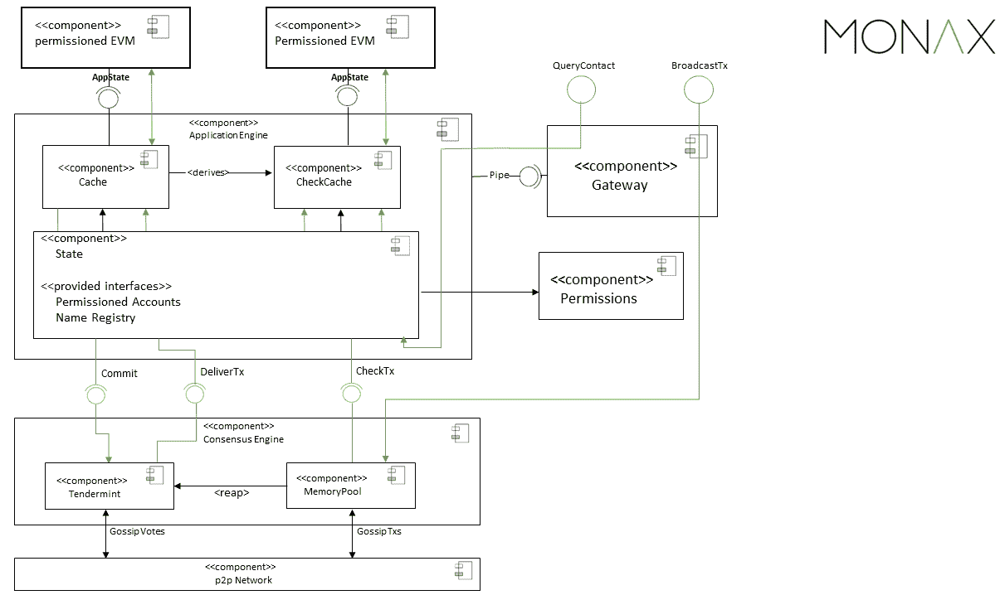
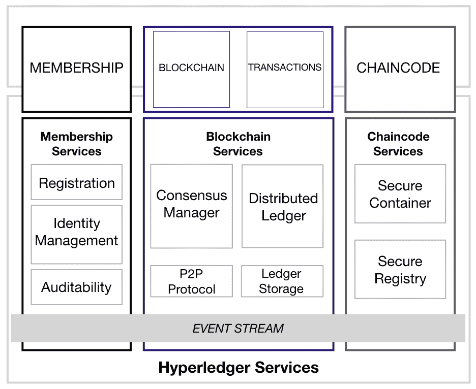
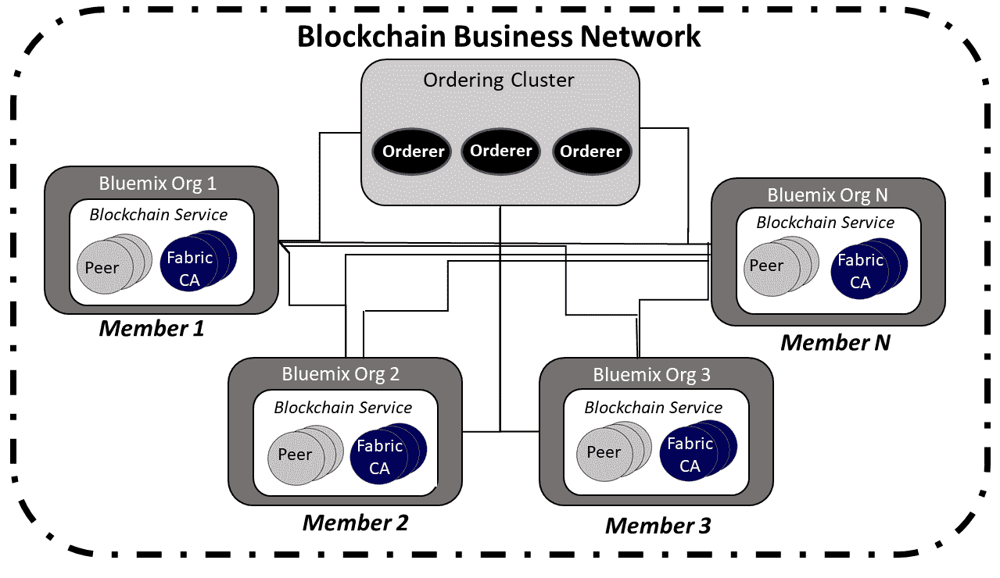
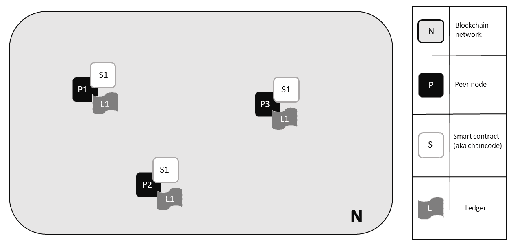
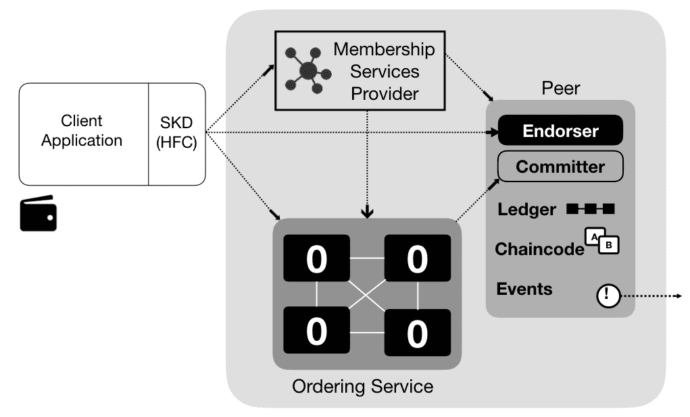

# 解释区块链技术并使用超级账本进行工作

区块链是数字世界中的一股变革力量，人们比以往任何时候都更加联系。简单来说，这个称为区块链的共享分布式账本能够使记录交易和跟踪资产的过程更加安全、简单，并且对所有成员透明。

现在人们经常使用诸如互联网银行、电子商务和应用程序之类的服务进行购买，如酒店预订、出租车服务和其他在线服务。这导致了大量的交易和数据。除此之外，物联网也为这个数字世界带来了新的可能性。随着产品与物联网集成，交易量呈指数级增长；因此，跨地理边界连接到供应商、银行和监管机构的必要性也在增加。

区块链技术为许多行业的运营业务提供了巨大的转型机会，如金融服务、保险、通信和政府。此外，它促进了公司之间的交易，因为它们可以通过数字方式进行处理。

# 什么是区块链？

让我们更深入地了解一下区块链到底是什么。资产包括任何能够被拥有或控制以产生价值的东西。资产是这个网络的主角，并且可以包括有形资产，如汽车、房屋或货币。它们还可以包括无形资产，如版权和专利。如果资产是主角，那么账本就是*关键*。账本是企业的记录系统。企业将在参与的多个业务网络中拥有多个账本。

以下图表代表了业务网络的现状。每个参与者保留自己的账本，随着业务交易的发生，它们会更新以表示业务交易：

使用区块链技术，业务网络的成员共享账本，每次通过点对点复制发生交易时都会更新，如下图所示：

区块链允许多个竞争方与相同的全球性真相安全互动。它具有用于记录交易历史的共享不可变账本，为具有已知身份的权限网络提供服务。

区块链的四个重要概念如下：

+   **共识**：要使交易有效，所有参与者必须就其有效性达成一致。

+   **溯源**：参与者知道资产来自何处以及其所有权如何随时间变化。

+   **不可变性**：在交易记录到账本之后，没有参与者可以篡改交易。如果交易出错，必须使用新的交易来撤销错误，然后两笔交易都会可见。

+   **最终性：** 一个共享的单一账本提供了确定资产所有权或交易完成的唯一途径。

当我们谈论区块链时，主要关注的是基于区块链的企业网络、面向企业的区块链，其中交易和成员是经过许可、私有和优先的；我们正在处理资产、身份和选择性认可。

你可能熟悉区块链是比特币技术的概念。事实上，我们甚至可以说比特币是区块链的第一个用例。比特币是一种没有中央银行、没有单一管理员和没有纸币的数字货币。所使用的软件能够在点对点网络中解决数学难题。交易没有中间人；它们直接在用户之间进行，并具有透明性。

# 区块链与 Hyperledger

周围有许多区块链框架或技术：R3（corda）、以太坊、Neo 和 Nem，每个都具有特定的设计和架构。在本书中，我们将专注于 Hyperledger 区块链技术（[https://www.hyperledger.org/](https://www.hyperledger.org/)）。

Hyperledger 是 Linux Foundation 的一部分，于 2016 年启动，具有技术和组织治理结构以及 30 家创始企业会员。现在有超过 230 家成员参与了这一倡议。这包括了思科、日立、IBM、ABN AMRO、澳新银行、红帽、VMware 和摩根大通等公司。如今，Hyperledger 在同一伞下与许多项目合作，并专注于区块链用例的差异，以及涵盖框架和工具。你可以在[https://www.hyperledger.org](https://www.hyperledger.org)找到对 Hyperledger 项目的良好描述。在这里，指出了 Hyperledger 孵化和推广一系列企业区块链技术，包括分布式账本框架、智能合约引擎、客户端库、图形界面、实用库和示例应用程序。Hyperledger 伞策略鼓励重复使用共同的构建模块，并实现 DLT（分布式账本技术）组件的快速创新：

# Hyperledger 项目

探索 Hyperledger 项目，我们找到了五个框架和五个工具。框架包括 Sawtooth、Iroha、Burrow、Indy 和 Fabric。工具包括 Caliper、Composer、Cello、Explorer 和 Quilt。

让我们讨论这些框架和工具。

# Hyperledger Sawtooth 框架

Hyperledger Sawtooth 遵循与其他 Hyperledger 框架相同的架构和特性；它是用于构建分布式账本应用程序和网络的企业区块链平台。

在我看来，Sawtooth 最引人注目的特点是使用 API 的便利性，以及许多语言，如 Python、C++、Go、Java、JavaScript 和 Rust。这有助于开发在 Sawtooth 平台上运行的应用程序。此外，您还可以为 Seth 事务族编写 Solidity 智能合约。

另一个好的特性是并行交易执行。大多数区块链需要串行交易执行，以确保网络上每个节点的一致排序。以太坊合约兼容性也可以与 Seth 一起使用；Sawtooth-Ethereum 整合项目扩展了 Sawtooth 平台与以太坊的互操作性。

# Hyperledger Iroha 框架

Hyperledger Iroha 是一个设计用于构建分布式账本的区块链平台；它基于诸如了解您的客户之类的用例，并具有移动应用程序开发和称为 Sumeragi 的新链基拜占庭容错共识算法。Soramitsu、Hitachi、NTT Data 和 Colu 最初为 Hyperledger Iroha 做出了贡献。

# Hyperledger Composer 工具

如果您想测试一个想法，创建一个**概念验证**（**POC**）或最小价值产品（MVP），甚至开始一个项目，那么 Hyperledger Composer 可以帮助您快速轻松地做到这一点。您可以使用名为 Composer Playground 的 web 应用程序测试您的业务网络。通过一些点击和一个好的用例，您也可以创建一个集成到您系统中的业务网络。另一个选项是创建一个前端应用程序来使用您的智能合约。

下图代表了 Hyperledger Composer 工具站点中的官方架构概述。

# Hyperledger Burrow 框架

Hyperledger Burrow 文档的第一段含有对这个框架的良好描述。描述如下：

*"Hyperledger Burrow 是一个权限 Ethereum 智能合约区块链节点。它在权限虚拟机上执行 Ethereum EVM 智能合约代码（通常以 Solidity 编写）。Burrow 在基于权益证明的 Tendermint 共识引擎上提供交易终局和高交易吞吐量。"*

实际上，想要与以太坊智能合约一起工作。应用于 Hyperledger Burrow 的高级架构可以在以下图表中看到：

# Hyperledger Fabric

要探索 Hyperledger 的总项目，我们将使用 Hyperledger Fabric。这是 Hyperledger 框架的第一个项目或初始概念，Digital Asset 和 IBM 是最初的贡献者之一。Hyperledger Fabric 的特点如下：

+   允许诸如共识和成员服务之类的组件即插即用

+   利用容器技术托管称为链代码的智能合约，这些智能合约包括系统的应用逻辑

但在我们继续之前，让我们回顾一些区块链的概念，并详细探索Hyperledger Fabric：

在前面的图中，你可以看到一个高层次的区块链架构。让我们探索（分析）这个架构的重要组件：

+   **链码：** 这是我们的业务网络合同，就像任何合同一样，它规定了网络成员之间可能的交易，并保证每个成员都有对账本的预先确定的定义访问。

+   **账本：** 将其视为整个交易历史的数字存储，就像数据库一样，您可以拥有查询功能来探索数据。

+   **隐私：**频道：在大多数情况下，所有网络都有一个唯一的频道，但Hyperledger Fabric允许多边交易，保证隐私和机密性，因此如果网络中的两个成员由于任何原因需要在它们之间进行特定交易，它们可以有一个与其他人分离的频道。

+   **安全和成员服务**：每个成员在网络中都有特定的权限，因此每笔交易都将被记录并可以被授权的监管者或审计者追踪。

为了更好地解释我们所说的，让我们看一下Hyperledger Fabric在业务网络中的组件：

前面图中显示的组件可以解释如下：

+   多个成员是区块链网络的一部分。在这种情况下，我们有**成员 1**，**成员 2**，**成员 3**和**成员 N**。

+   每个成员都有自己的对等节点。

+   每个对等节点都有一个**证书管理机构**。

+   队列或者交易将由**排序集群**排序。

# 成员或对等节点

对等节点是网络中托管账本和智能合约的成员或公司。智能合约和账本用于封装网络中的共享流程和共享信息：

# 证书管理机构（CA）

业务网络的每个成员都可以访问由系统信任的权威颁发的数字身份。在最常见的情况下，数字身份（或简单身份）采用符合X.509标准的加密验证数字证书的形式，并由CA颁发。

# 排序集群

队列或者交易将由提供给客户端和对等节点共享通信频道的排序服务排序，为包含交易的消息提供广播服务。在排序和分发交易的过程中，Hyperledger Fabric与**排序服务（OS）**和Kafka集群一起工作，这是保证负载平衡和共识的代理。当我们建立环境时，我们将更详细地探讨这一点。

# SDK/ API

应用程序或当前系统可以通过一个 SDK/API 连接到区块链网络，这通常使用 Node.js 开发，是使用智能合约的重要步骤：

Hyperledger Fabric 1.3 有一些重要的改进。自 1.1 版本和 Node.js 链码支持以来，开发人员现在能够使用最流行的框架和最新的编程语言来开发链码了。如果你使用的是 1.1 版本之前的版本，你需要使用 Go 来开发链码。让我们来探索一下 Hyperledger Fabric 1.3 的新功能。

本书用来创建编码的例子将遵循 Hyperledger Fabric 1.4，其具有重要的新功能，如：

+   **开发应用的新方法**

这些新功能促进了分散式代码的编写。它们使开发人员能够直观而合乎逻辑地使用 Node.js SDK Node.js 链码来编写分散式应用程序

+   **操作的新功能和更易维护**

随着更多 Hyperledger Fabric 网络的部署和测试，可维护性和运行方面变得更加重要。Fabric v1.4 在记录改进、健康检查和运行指标方面有新功能。Fabric 1.4 是建议用于启动生产操作的版本，因为其功能侧重于稳定性和一些重要的修复。如果你去 Hyperledger Fabric 网站，你可以找到关于未来修复将在 v1.4.x 流中交付的信息，而新功能正在 v2.0 流中开发中。

# 选择一个好的使用案例

在开始任何区块链项目之前，一个重要的步骤是选择一个好的使用案例。我们经常看到可以通过分布式数据库甚至具有良好权限访问的 Web 应用程序解决的情况。这里有一个难题要解决：

+   业务网络是否包括在内？

+   是否有一个需要验证或共识的交易？

+   审计追踪重要吗，或者原产地控制？

+   不可变性（数据）

+   最终性（减少争议）

一定要绘制一个地图，并标明不同的组织，或是一个商业网络以及它们之间的关联——这是非常重要的一步。此外，检查使用案例是否涉及到第二至第五点之间列出的一个或多个属性。如果你没有第二至第五点之间列出的多个属性，那么它可能并不适合区块链解决方案。

在选择使用案例时，进行头脑风暴或设计思维会议是个好主意。

这个表格演示了不同行业的一个良好使用案例：

| **金融机构** | **保险** | **跨行业和其他** |
| --- | --- | --- |

|

+   信用证

+   借贷或债券

+   联盟共享账本

|

+   第一方医疗索赔处理

+   计划好的个人财产索赔处理

|

+   忠诚积分

+   资本资产管理

+   身份管理

|

# 区块链—食品追踪使用案例

现在，让我们专注于食品追踪的用例。如今，消费者要求了解更多关于产品生产的信息和透明度。欧盟对企业供应链要求更多信息，并对不遵守规定的公司和国家进行严厉处罚。自2016年以来，中国消费者一直在追踪他们的食物是在哪生产的，以及在抵达他们餐桌之前在不同批发商和经纪人手中转手了多少次。所以，区块链似乎是一个很好的适用场景，对吧？

让我们思考区块链的五个要素：

1.  商业联网

生产商、制造商、运输公司、零售店。

1.  是否存在需要验证或共识的交易？

记录谁拥有什么，何时，以及资产在供应链的哪里。

1.  审计路径重要吗？

消费者要求，像欧盟和中国这样的国家都需要进行跟踪审计。

1.  不可变性和5\. 最终性

参与复杂流程的不同公司和资产。

好了，现在我们知道区块链适合我们的用例，让我们来看看使用区块链技术的好处：

+   它是可验证的，防止任何一方篡改或质疑正在交换的信息的合法性。

+   在复杂的全球供应链中，通过增加透明度可以获得更高的效率。

+   监管机构、政府机关和商业网络公司可以快速而轻松地从整个供应链请求可靠的信息。

在接下来的章节中，我们将更详细地探讨食品链以及区块链与物联网如何改变它。

# 摘要

区块链具有共享和分布式分类帐功能，可以使业务网络中的交易记录和资产跟踪过程更加简单和动态。这与比特币不同，比特币是一个无权限公共分类帐的例子，并定义了一个不受监管的有大量资源的影子货币。区块链通常是受许可的、私有的，并优先考虑背书，使用基于加密货币的资产。

项目称为Hyperledger，是一个协作项目，采用开源代码，旨在推广区块链技术。

2017年5月，有五个活跃的框架和五个活跃的工具：

+   **框架：** Hyperledger Burrow、Hyperledger Fabric、Hyperledger Iroha、Hyperledger Sawtooth和Hyperledger Indy

+   **工具：** Hyperledger Cello、Hyperledger Composer、Hyperledger Explorer、Hyperledger Quilt和Hyperledger Caliper

在接下来的章节中，我们将更详细地探讨区块链平台如何解决食品链中的一些重要挑战，我们将发现Hyperledger Fabric 1.4是一个强大的区块链平台。

# 问题

Q. 为什么使用区块链？

A. 区块链为解决束缚供应链的食品链挑战提供了信任和透明度；通过使用区块链，你可以获得该平台的好处，比如：

+   信任和透明度

+   选择谁行动和接收信息，因为你只需要一个共享账本来进行交易

+   由于账本不可更改，不再存在信任缺失的问题，参与者可以确保交易的起源和真实性

+   快速轻松地获取详细的端到端供应链数据

+   通过生态系统数据，基于商品和产品更好的配置，最小化浪费

区块链赋予参与者共享账本的能力，每次交易发生时，通过点对点复制进行更新。隐私服务用于确保参与者只能看到与他们相关的账本部分，并且交易是安全的、经过认证的和可验证的。区块链还允许资产转移合同嵌入在交易中执行。网络参与者达成一致，通过所谓的共识过程验证交易。政府监督、遵从和审计可以成为同一个网络的一部分。

# 进一步阅读

要查找更多关于该主题的信息，请访问以下链接:

+   可在以下链接找到 Hyperledger Sawtooth 文档: [https://sawtooth.hyperledger.org/docs/core/releases/latest/introduction.html#distinctive-features-of-sawtooth](https://sawtooth.hyperledger.org/docs/core/releases/latest/introduction.html#distinctive-features-of-sawtooth)

+   可在以下链接找到 Hyperledger Iroha 文档: [https://www.hyperledger.org/projects/iroha/resources](https://www.hyperledger.org/projects/iroha/resources)

+   可在以下链接找到 Hyperledger Indy 文档: [https://github.com/hyperledger/indy-node/blob/stable/getting-started.md](https://github.com/hyperledger/indy-node/blob/stable/getting-started.md)

+   可在以下链接找到 Hyperledger Composer 文档: [https://hyperledger.github.io/composer/latest/introduction/introduction.html](https://hyperledger.github.io/composer/latest/introduction/introduction.html)

+   可在以下链接找到 Hyperledger Framework 1.4 文档: [https://hyperledger-fabric.readthedocs.io/en/release-1.4/](https://hyperledger-fabric.readthedocs.io/en/release-1.4/)

+   GitHub Hyperledger Framework 链接: [https://github.com/hyperledger/fabric](https://github.com/hyperledger/fabric)
