# 创建您自己的区块链网络

在本章中，我们将使用Hyperledger Composer创建一个区块链网络。我们将探索一个简单的用例，在其中资产可以在网络参与者之间转移。我们将学习如何快速安装Hyperledger Fabric版本 1.1。此外，我们将确定并实现一本运行您自己业务网络的逐步指南。

我们将通过探索以下主题来学习所有这些内容：

+   创建区块链网络的先决条件

+   对Hyperledger Composer的简要概述

+   探索Composer Playground以创建区块链网络

+   设置本地Hyperledger Fabric/Composer开发环境

# 先决条件

为了完成本章的练习，请确保您的计算机已安装以下内容：

+   curl

+   Node.js 8.9.x

+   Python 2.7

+   Git 2.9.x或更高版本

+   Go

+   Windows 10/Ubuntu Linux 14.04/macOS 10.12

对于Windows 10，您将需要安装Windows子系统以运行Ubuntu。

# 使用Hyperledger Composer创建自己的区块链网络

在[第三章](fe11e1f3-8540-4126-ace5-2c877b06d6bf.xhtml)，*解释区块链技术和使用Hyperledger* 中，我们看了一些属于Hyperledger分布分类帐伞下的各个框架。我们随后分析了其中之一，即Hyperledger Composer，一个开发区块链网络的强大工具。

在区块链方面，使用Hyperledger Composer的最大优势之一是该框架提供的出色文档，不仅限于网站本身，还包括开发者网站和其他提供代码和常规示例的网站。

在这里，我们将看到一个比在Hyperledger Composer的教程网站上发现的稍微不太常见的用例的逐步指南，这将演示创建区块链网络是多么简单。我们将使用被称为Playground的Hyperledger Composer平台。

# 访问Hyperledger Composer

在线Hyperledger Composer Playground使我们能够在没有任何安装的情况下探索Hyperledger组件。以下步骤将指导您游览在线Composer Playground：

1.  让我们访问以下链接的网站：[http://composer-playground.mybluemix.net/login](http://composer-playground.mybluemix.net/login)。正如我们在以下截图中看到的，主页会显示一个闪屏页面：

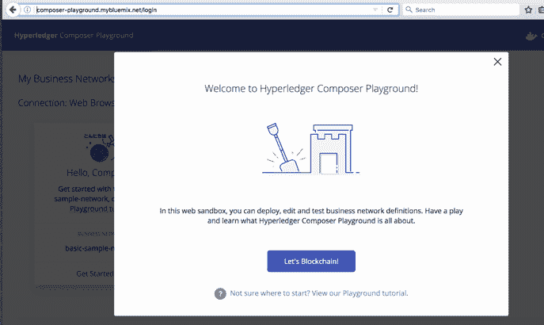

1.  点击 Let's Blockchain! 按钮后，将进入下一个页面，其作为仪表板使用:

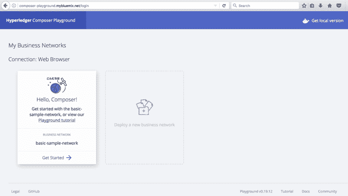

在这个页面上，您可以选择使用教程，该教程将带领您完成非常详细的逐步流程。这对于探索Hyperledger Composer非常有帮助。现在，让我们继续。

1.  点击Get Started链接。加载几个屏幕后，您将进入编辑器，在那里您将能够创建您自己的区块链网络：

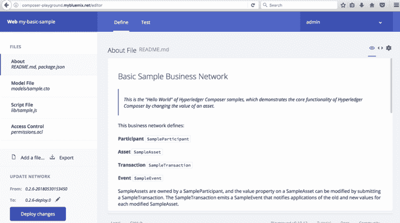

在我们的情况下，我们将有两个参与者和一个资产，这可以是一个具有价值的令牌。这个想法是在网络的参与者之间移动这个资产和价值。

# 探索样本区块链网络的结构

1.  让我们从`name.cto`模型文件开始。模型文件定义了我们业务网络中的资产、参与者、交易和事件。请记住，每一步之后，您需要部署这些更改。接下来，我们将看到一些截图来说明这个过程：

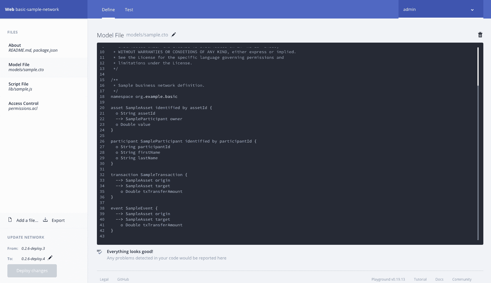

1.  让我们使用以下代码来创建参与者、交易和事件：

```
// **
  * Sample business network definition.
  */
 namespace org.example.basic

 asset SampleAsset identified by assetId {
   o String assetId
   --> SampleParticipant owner
   o Double value
 }

participant SampleParticipant identified by participantId {
   o String participantId
   o String firstName
   o String lastName
 }

 transaction SampleTransaction {
   --> SampleAsset origin
   --> SampleAsset target
     o Double txTransferAmount
 }

 event SampleEvent {
   --> SampleAsset origin
   --> SampleAsset target
     o Double txTransferAmount
 }
```

1.  让我们创建一个函数来在参与者之间转移资产。我们将使用`name.js`脚本文件：

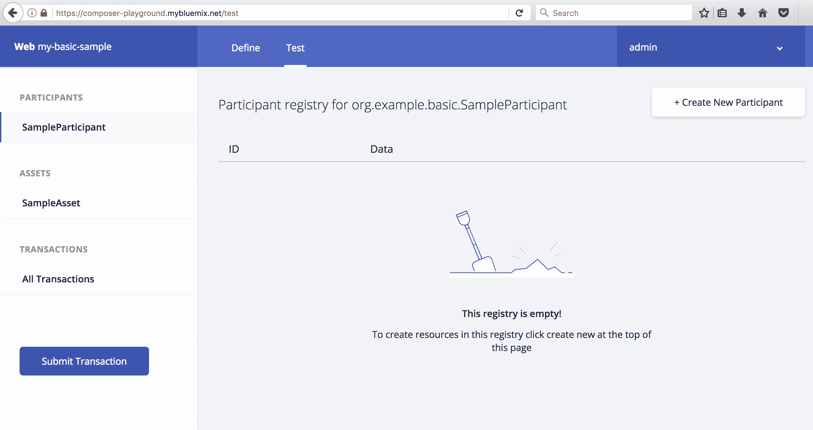

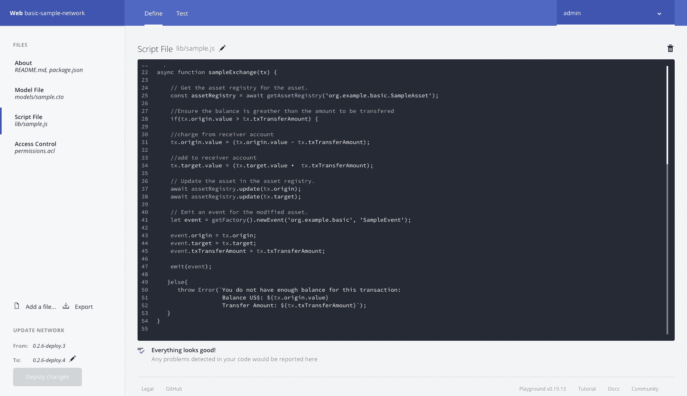

1.  让我们看一下这里使用的算法/逻辑的代码：

```
 * Sample transaction processor function.
  * @param {org.example.basic.SampleTransaction} tx The sample transaction instance.
  * @transaction
  */
 async function sampleExchange(tx) { 
     // Get the asset registry for the asset.
     const assetRegistry = await getAssetRegistry('org.example.basic.SampleAsset');

       //Ensure the balance is greather than the amount to be transfered
       if(tx.origin.value > tx.txTransferAmount) {

     //charge from receiver account
     tx.origin.value = (tx.origin.value - tx.txTransferAmount);

     //add to receiver account
     tx.target.value = (tx.target.value +  tx.txTransferAmount);

     // Update the asset in the asset registry.
     await assetRegistry.update(tx.origin);
     await assetRegistry.update(tx.target);

     // Emit an event for the modified asset.
     let event = getFactory().newEvent('org.example.basic', 'SampleEvent');

     event.origin = tx.origin;
 event.target = tx.target;
 event.txTransferAmount = tx.txTransferAmount;

 emit(event);

 } else {
   throw Error(`You do not have enough balance for this transaction: Balance US$: ${tx.origin.value} Transfer Amount: ${tx.txTransferAmount}`);
 }
 }
```

1.  **访问控制列表**（**ACL**）是确保Hyperledger Composer区块链网络对参与者在资产上可以执行的操作进行隔离访问的功能。现在我们将创建一个业务规则，允许区块链网络的成员有正确的访问控制。基本文件赋予当前参与者，即网络管理员，对业务网络和系统级操作的完全访问权。

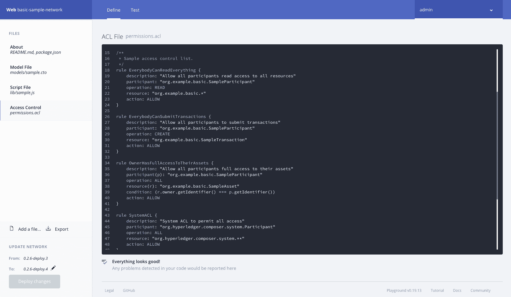

这里有一些代码，向我们展示如何创建访问控制：

```
/**
  * Sample access control list. rule Everybody Can Read Everything and send a transaction for example
  */
 rule EverybodyCanReadEverything {
     description: "Allow all participants read access to all resources"
     participant: "org.example.basic.SampleParticipant"
     operation: READ
     resource: "org.example.basic.*"
     action: ALLOW
 }
 rule EverybodyCanSubmitTransactions {
     description: "Allow all participants to submit transactions"
     participant: "org.example.basic.SampleParticipant"
     operation: CREATE
     resource: "org.example.basic.SampleTransaction"
     action: ALLOW
 }
```

1.  如下所示，为访问控制的资产定义访问权限：

```
rule OwnerHasFullAccessToTheirAssets {
 description: "Allow all participants full access to their assets"
 participant(p): "org.example.basic.SampleParticipant"
 operation: ALL
 resource(r): "org.example.basic.SampleAsset"
 condition: (r.owner.getIdentifier() === p.getIdentifier())
 action: ALLOW }

```

1.  为`SystemACL`定义一个规则，无论是网络管理员还是用户，如下所示：

```

 rule SystemACL {
 description: "System ACL to permit all access"
 participant: "org.hyperledger.composer.system.Participant"
 operation: ALL
 resource: "org.hyperledger.composer.system.**"
 action: ALLOW }
 rule NetworkAdminUser {
 description: "Grant business network administrators full access to user resources"
 participant: "org.hyperledger.composer.system.NetworkAdmin"
 operation: ALL
 resource: "**"
 action: ALLOW
 }
 rule NetworkAdminSystem { description: "Grant business network administrators full access to system resources"
 participant: "org.hyperledger.composer.system.NetworkAdmin"
 operation: ALL
 resource: "org.hyperledger.composer.system.**"
 action: ALLOW
 }
```

1.  我们现在准备测试我们的区块链网络。在屏幕顶部点击“测试”选项卡：


1.  现在为您的区块链网络创建两个参与者。第一个参与者在这里显示：

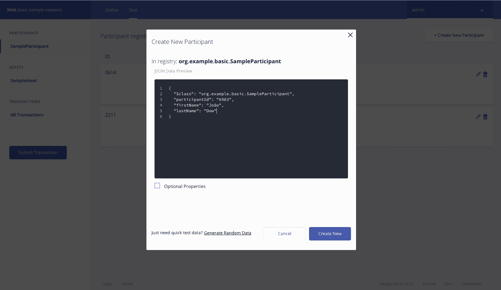

使用以下代码来创建第一个参与者：

```
{
   "$class": "org.example.basic.SampleParticipant",
   "participantId": "1",
   "firstName": "Joao",
   "lastName": "Dow"
 }
```

第二个参与者在这里显示：

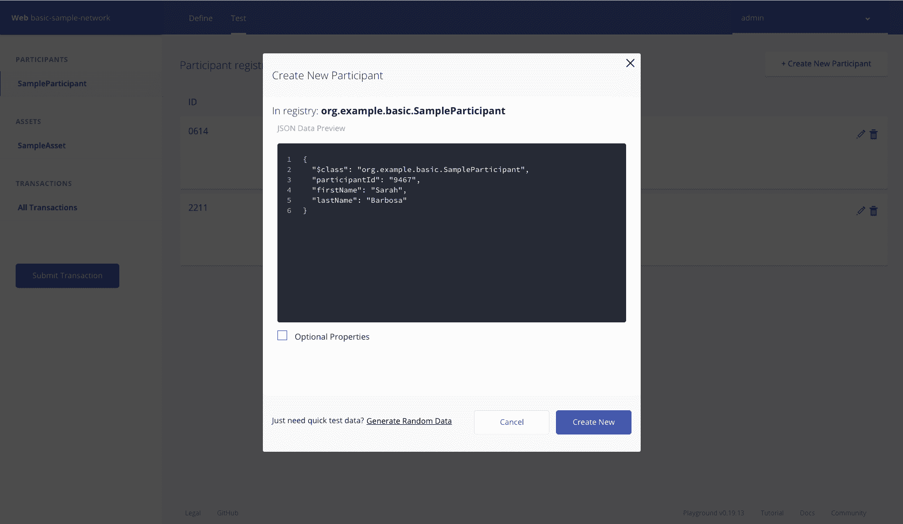

使用以下代码创建第二个参与者：

```
{
   "$class": "org.example.basic.SampleParticipant",
   "participantId": "2",
   "firstName": "Sarah",
   "lastName": "Barbosa"
 }
```

1.  现在让我们为参与者1创建一个资产。记得添加`participantId`、`assetId`和`value`：

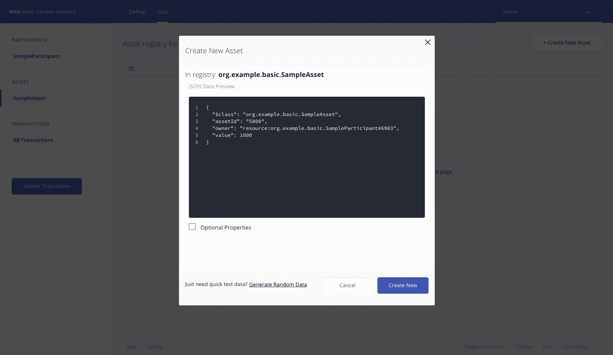

1.  使用以下代码为参与者1创建一个资产：

```
{
   "$class": "org.example.basic.SampleAsset",
   "assetId": "0744",
   "owner": "resource:org.example.basic.SampleParticipant#1",
   "value": 1000
 }
```

1.  重复用于参与者1的方法，用于参与者2：

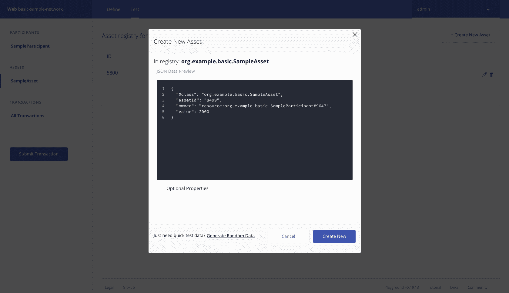

1.  使用以下代码为参与者2创建一个资产：

```
{
   "$class": "org.example.basic.SampleAsset",
   "assetId": "4010",
   "owner": "resource:org.example.basic.SampleParticipant#2",
   "value": 1000
 }
```

1.  我们现在准备在参与者之间提交一笔交易。点击“提交”按钮并从参与者2发送一笔金额给参与者1。在以下示例中，交易的价值为300：

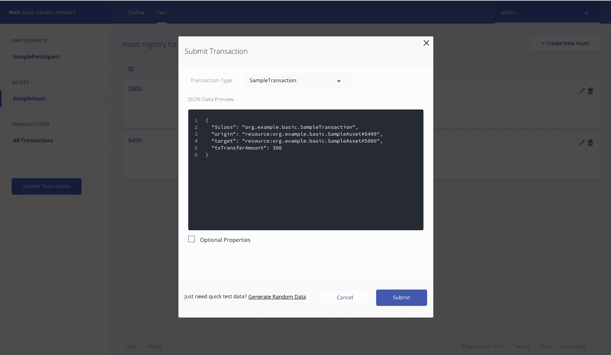

1.  使用以下代码在参与者之间转移一笔金额：

```
{
   "$class": "org.example.basic.SampleTransaction",
   "origin": "resource:org.example.basic.SampleAsset#0744",
   "target": "resource:org.example.basic.SampleAsset#4010",
   "txTransferAmount": 300
 }
```

做得好！通过点击以下两个截图中的记录，您可以看到所有交易的详细信息。第一个显示了所有创建的资产的列表：

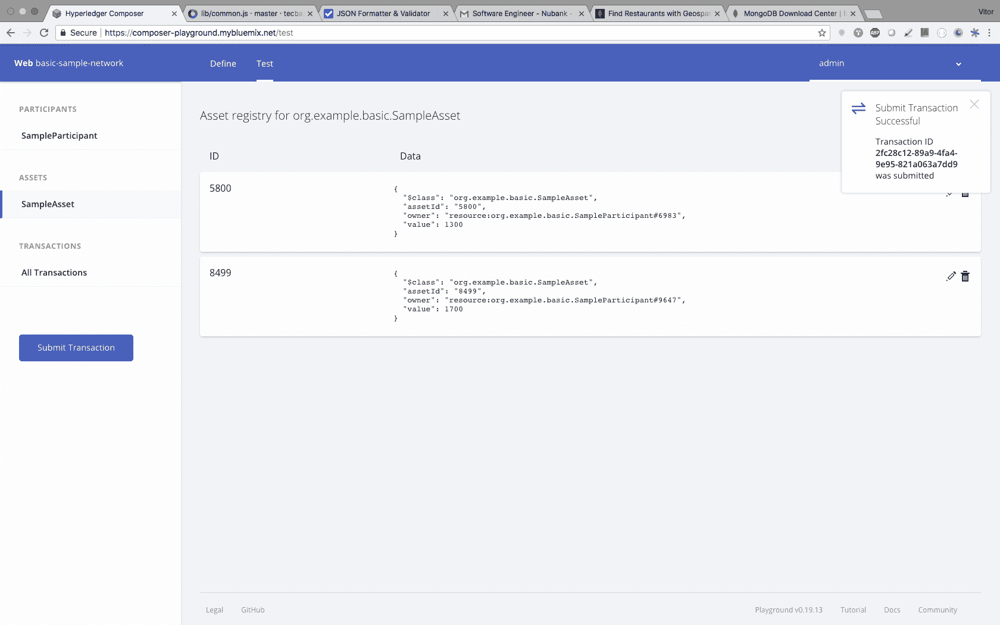

第二张截图显示了在区块链网络上运行的交易历史记录：

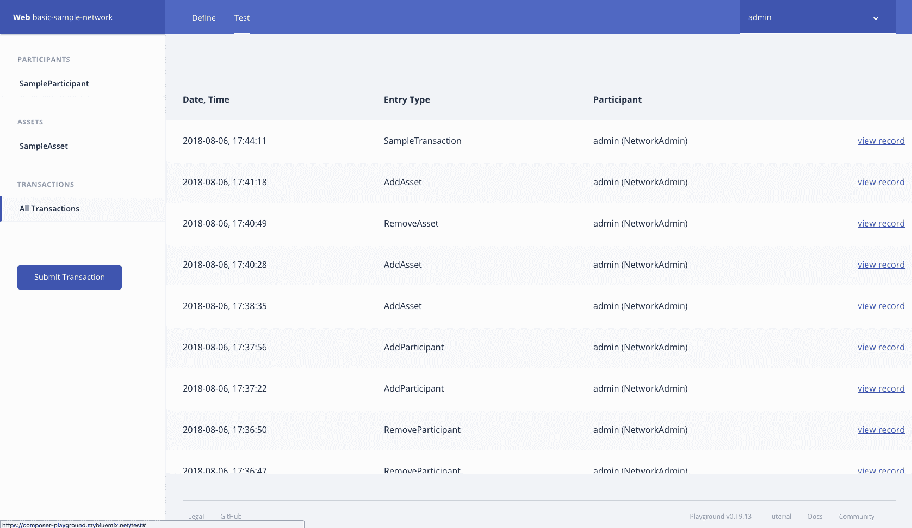

现在您已经验证了一个用例，您可以开始制作一个新的概念验证，并向业务网络中的成员展示Hyperledger区块链的全部潜力。

# 使用Hyperledger Fabric和Composer安装您自己的区块链网络

在上一节中，我们看到了使用Playground与Hyperledger Composer一起工作是多么容易。现在我们将在您自己的（本地）机器上安装Composer。

我们将从安装区块链网络的三个最重要阶段开始：

1.  安装先决条件

1.  安装Hyperledger Composer（开发环境）

1.  更新环境

我们可以通过许多方式使用Hyperledger Fabric安装区块链网络，包括本地服务器、Kubernetes、IBM Cloud和Docker。首先，我们将探索Docker和Kubernetes。

# 设置Docker

Docker可以使用[https://www.docker.com/get-started](https://www.docker.com/get-started)上提供的信息进行安装。

Hyperledger Composer与两个版本的Docker一起工作：

+   Docker Composer版本1.8或更高版本

+   Docker引擎版本17.03或更高版本

如果您已经安装了Docker但不确定版本，您可以在终端或命令提示符中使用以下命令查看版本：

```
docker –version
```

注意：许多基于Linux的操作系统，例如Ubuntu，都附带了最新版本的Python（Python 3.5.1）。在这种情况下，重要的是要获取Python 2.7版本。您可以在此处获取它：[https://www.python.org/download/releases/2.7/](https://www.python.org/download/releases/2.7/)。

# 安装Hyperledger Composer

现在我们将设置Hyperledger Composer并获得其开发工具的访问权限，这些工具主要用于创建业务网络。我们还将设置Hyperledger Fabric，该工具可用于在本地运行或部署业务网络。这些业务网络也可以在其他地方的Hyperledger Fabric运行时中运行，例如在云平台上。

确保您之前没有安装过这些工具并使用过。如果您安装过，您将会使用本指南。

# 组件

要成功安装Hyperledger Composer，您需要准备好以下组件：

+   CLI工具

+   Playground

+   Hyperledger Fabric

+   一个IDE

安装完这些后，您可以开始执行这里给出的步骤。

# 步骤1 – 设置CLI工具

CLI工具，`composer-cli`，是一个具有最重要操作的库，例如管理、操作和开发任务。我们还将在此步骤中安装以下工具：

+   **Yeoman**：用于生成应用程序的前端工具

+   **库生成器**：用于生成应用程序资产

+   **REST服务器**：用于运行REST服务器（本地）

让我们开始设置CLI工具：

1.  安装CLI工具：

```
npm install -g composer-cli@0.20
```

1.  安装库生成器：

```
npm install -g generator-hyperledger-composer@0.20
```

1.  安装REST服务器：

```
npm install -g composer-rest-server@0.20
```

这将允许与本地 REST 服务器集成，将你的业务网络暴露为 RESTful API。

1.  安装 Yeoman：

```
npm install -g yo
```

不要使用`su`或`sudo`命令来使用`npm`，以确保当前用户有足够的权限来自己运行环境。

# 第二步 – 设置 Playground

如果你在本地机器上使用浏览器运行 Playground，Playground 可以为你提供一个 UI。这将允许你显示你的业务网络，浏览应用程序以进行测试编辑，并测试你的业务网络。

使用以下命令安装 Playground：

```
npm install -g composer-playground@0.20
```

现在我们可以运行 Hyperledger Fabric 了。

# 第三步 – Hyperledger Fabric

这一步将允许你在本地运行 Hyperledger Fabric 运行时并部署你的业务网络：

1.  选择一个目录，比如`~/fabric-dev-servers`。

1.  现在获取包含安装 Hyperledger Fabric 工具的`.tar.gz`文件：

```
mkdir ~/fabric-dev-servers && cd ~/fabric-dev-servers

curl -O https://raw.githubusercontent.com/hyperledger/composer-tools/master/packages/fabric-dev-servers/fabric-dev-servers.tar.gz
tar -xvf fabric-dev-servers.tar.gz
```

你已经下载了一些脚本，这些脚本将允许安装本地 Hyperledger Fabric v1.2 运行时。

1.  要下载实际的环境 Docker 镜像，在你的用户`home`目录中运行以下命令：

```
cd ~/fabric-dev-servers
export FABRIC_VERSION=hlfv12
./downloadFabric.sh
```

干得好！现在你拥有了一个典型的开发者环境所需的一切。

# 第四步 – IDE

Hyperledger Composer 允许你使用许多 IDE。其中两个知名的是 Atom 和 VS Code，它们都有很好的扩展可以用于与 Hyperledger Composer 的工作。

Atom可以让你使用`composer-atom`插件([https://github.com/hyperledger/composer-atom-plugin](https://github.com/hyperledger/composer-atom-plugin))对 Hyperledger Composer 建模语言进行语法高亮。你可以在以下链接下载这个 IDE：[https://atom.io/.](https://atom.io/)同时，你也可以在以下链接下载 VS Code：[https://code.visualstudio.com/download](https://code.visualstudio.com/download)。

# 使用 Docker 安装 Hyperledger Fabric 1.3

有许多下载 Hyperledger Fabric 平台的方法；Docker 是最常用的方法。你可以使用官方仓库。如果你使用的是 Windows，你将需要使用 Docker Quickstart 终端来运行接下来的终端命令。

如果你在 Windows 上使用 Docker，请按照以下说明操作：

1.  请参阅 Docker 文档以了解共享驱动器，文档地址为[https://docs.docker.com/docker-for-windows/#shared-drives](https://docs.docker.com/docker-for-windows/#shared-drives)，并在其中一个共享驱动器下使用一个位置。

1.  创建一个目录，从 Hyperledger GitHub 仓库克隆示例文件，并运行以下命令：

```
$ git clone -b master https://github.com/hyperledger/fabric-samples.git
```

1.  要在本地机器上下载并安装 Hyperledger Fabric，你必须通过运行以下命令下载平台特定的二进制文件：

```
$ curl -sSl https://goo.gl/6wtTN5 | bash -s 1.1.0
```

完整的安装指南可以在 Hyperledger 网站找到：[https://hyperledger-fabric.readthedocs.io/en/release-1.3/install.html](https://hyperledger-fabric.readthedocs.io/en/release-1.3/install.html)。

# 将 Hyperledger Fabric 1.3 部署到 Kubernetes 环境

这一步骤建议给那些具有 Kubernetes、云环境和网络工作经验和技能，并且希望深入探索 Hyperledger Fabric 1.3 的人士。

Kubernetes 是一个容器编排平台，可在主要云服务提供商（如亚马逊网络服务、谷歌云平台、IBM 和 Azure）上使用。IBM 的杰出云架构师之一 Marcelo Feitoza Parisi 在 GitHub 上创建并发布了一份关于如何在 Kubernetes 上设置 Hyperledger Fabric 生产环境的指南。

该指南可在 [https://github.com/feitnomore/hyperledger-fabric-kubernetes](https://github.com/feitnomore/hyperledger-fabric-kubernetes) 上找到。

特别感谢 Marcelo！

# 摘要

在这一章中，我们通过 Composer Playground 探索了 Hyperledger Composer 的在线云部署。通过使用在线网络编辑器，我们看到了如何创建网络定义、运行网络测试，并访问历史记录，我们能够可视化所有在区块链网络上运行的交易。

我们还运行了本地开发环境的安装，并为您提供了一个资源，用于在 Kubernetes 上运行的生产级 Hyperledger 设置。

在下一章中，我们将探讨现代食品链中的主要参与者及其当前的挑战。然后我们将讨论物联网和区块链技术如何帮助解决这些挑战。

# 进一步阅读

+   欲了解有关 Composer 的更多信息，请访问 [https://hyperledger.github.io/composer/latest/tutorials/tutorials](https://hyperledger.github.io/composer/latest/tutorials/tutorials)。

+   如果您想安装完整的 Hyperledger Fabric 栈，请按照此链接的建议进行：[https://github.com/feitnomore/hyperledger-fabric-kubernetes](https://github.com/feitnomore/hyperledger-fabric-kubernetes)。

+   所有关于 Hyperledger 的安装过程和架构都可以在此处找到：[https://github.com/feitnomore/hyperledger-fabric-kubernetes](https://github.com/feitnomore/hyperledger-fabric-kubernetes)。

+   关于安装 Hyperledger Composer 的逐步指南可以在此处找到：[https://medium.com/kago/tutorial-to-install-hyperledger-composer-on-windows-88d973094b5c](https://medium.com/kago/tutorial-to-install-hyperledger-composer-on-windows-88d973094b5c)。
