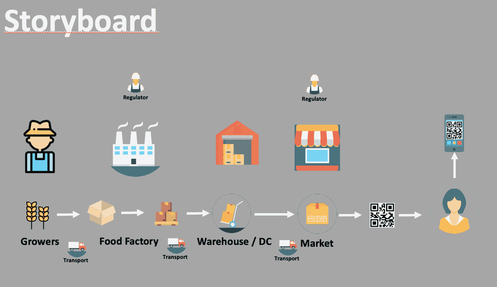
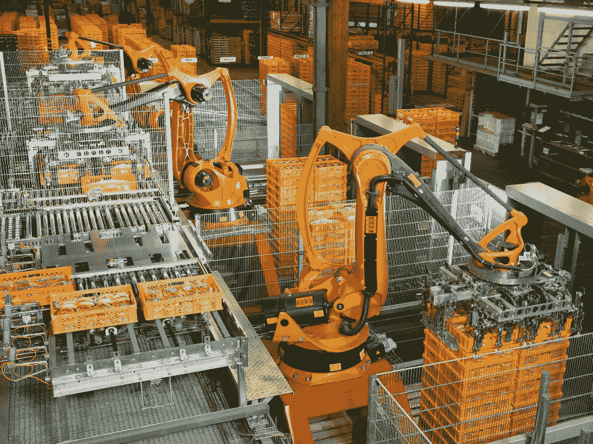

# 第五章：解决食品安全 - 基于区块链的解决方案

在本章中，我们将探讨食品链的主要挑战，并通过查看以下内容了解涉及的各方：

+   当前流程和问题

+   产品追踪的重要性

+   政府和监管机构的问题和关切

我们还将看到物联网和区块链如何成为解决这些问题的关键技术，以及审查正在制定的认证和法规，以确保整个食品链符合食品安全政策的要求。

# 现代食品链中的法规、挑战和关切

你能想象在几小时内从银行获得信用证书，并在几分钟内与供应商共享吗？你能想象在没有繁文缛节和完全安全的情况下，接收海关部门有关货物状态的更新吗？

是的，这一切都是可能的，事实证明，使用物联网和区块链技术收集的信息（产品状态更新、信用批准书等）非常重要。然而，区块链技术带来的好处远远不止我们刚提到的这些。

在探讨这些额外好处之前，让我们看看这个行业面临的一些挑战以及旨在尝试实施食品安全的法规。

# 关于食品安全的挑战

疾病控制与预防中心（CDC）估计，每年有 4800 万人患上食源性疾病，有 128,000 人住院治疗，还有 3000 人死亡。

在美国的 2006 年，发现了菠菜中的大肠杆菌。结果，整个国家所有商店都停止销售菠菜。追踪到源头花了两周的时间：来自一个供应商的 1 批次的 1 天货物。与此同时，至少有 199 人生病，3 人死亡。

更近些年，在 2017 年 3 月，巴西爆发了一起涉及该国最大肉类加工企业的重大丑闻。在巴西联邦警察开展的名为“Carne Fraca”的行动中，这些企业被指控篡改肉类并将其销售到本地和国外。由于难以获取必要数据以提供答案，这些公司花了几周时间才回应这些指控。

# 食品安全法规 - ISO 22000

由于全球化的结果，许多种类的食品来自不同国家并流通。不安全食品可能带来许多严重后果。这使得有必要制定国际标准，以确保食品安全并确保食品链有序。

ISO 拥有一项食品安全管理认证，可以帮助防止这种后果。 ISO 22000 的目的是制定确保所有食品获得认证的要求，并保证产品安全。它规划了组织所需的内容，并确保食品符合要求并对消费者安全。它可以被任何类型的组织使用，无论其在食品链中的位置或其规模如何。

改善整个食品链有多种原因。尽管已采取了多项行动以获得更高标准的产品，更好的储存和更高的生产，但近年来几乎没有真正解决这些问题并符合 ISO 22000 等法规的行动。

在实现这一复杂链条的有效性方面面临着巨大挑战，但我们相信物联网和区块链技术的结合将减轻许多这些挑战，并有效地解决这一复杂食品链的问题。

# 区块链和物联网如何在食品链中发挥作用

要实现生态系统的透明度，我们需要连接其中的所有实体。这不仅适用于零售商或制造商，而且适用于系统内的每个人; 每个组成它的成员，从农场到餐桌，包括这条链的最后一个成员，消费者。

如今，有许多公司正在采用物联网和区块链技术。他们已经意识到食品链中存在各种问题，但每个参与方都专注于他们的业务结果，而不是整个链条困扰的问题。

任何可以部分解决此问题的解决方案都将为整个食品链提供价值。但是，它仍然不能解决所有涉​​及方的每个问题。

要实施有效的解决方案，让我们根据市场细分来审查一组需求。需求可以根据许多方面而变化，例如公司规模，地理位置等等。我们的目标是确保每个人都看到采用物联网和区块链技术的价值，从而对参与此类链及其利益感兴趣。这将帮助我们获得完整的数据集，以提供食品生态系统的端到端透明度。

# 食品生态系统

在本节中，我们将探讨食品链中涉及的参与者，并查看他们的活动以及应用于流程的每个部分的法规。我们将更详细地研究以下参与者：

+   农民

+   食品制造商

+   仓储和配送中心

+   运输公司（运输公司）

+   食品零售商和超市

+   消费者

+   监管机构

+   认证和合规性

以下图表展示了这一复杂食品链中的所有参与者。本章节的主要目的是确定如何利用物联网和区块链共同增加对所分享信息真实性的信心，减少人为错误，并使用不可变数据确保来源：

高级食品链工艺

从技术角度来看，物联网是解决方案的锦上添花。如今，有很多资产跟踪传感器可以通过蓝牙、**超宽带**（UWB）、Wi-Fi、LPWA、LTE、NB-IoT、5G、卫星、红外线、超声波、NFC 和 RFID 连接和传输数据。这种多重连接的组合允许提供即时资产跟踪信息。

现在你可以通过物联网访问数据，考虑将这些信息存储在区块链网络中。让我们重新审视一下区块链的概念。首先，我们可以说区块链为我们提供了之前没有的可靠流程所需的信任。但现在，有了区块链技术，我们能够在许多生态系统中分享多种类型的信息。

它还提供足够的信任，使我们能够真正解决之前提到的问题，从而更好地为客户服务。除此之外，通过创建这种重要的信任，区块链允许我们使用我们已经投资的资产。这些资产由我们数十年来积累的数据和新类型的分析代表：认知、机器学习、预测、大数据等诸多类似的分析。此外，我们可以说区块链代表了将这一切整合在一起的遗失的拼图。

我们的区块链解决方案需要实现一些重要的事情，包括：

+   提供食品行业需求的透明度

+   创建可靠的连接，这样食品生态系统中的每个人都可以参与

+   提高互操作性，使行业能够推动可用性和访问性

+   牲畜和谷物监测

+   辨别牲畜的位置

+   温室监测（温度和灌溉）

本章后面，我们将了解如何实现所有这些。

# 食品生态系统中的机遇和挑战

让我们探索这个生态系统的每个组成部分，并确定随之而来的机遇和挑战。

# 农民

技术和农业相互配合，并可能具有颠覆性。农民擅长采用新技术，特别是当新技术有助于提高生产效率和提供更高的农业运营效率时。这些改进是采用新技术的动机，原因非常简单：**粮食和农业组织**（FAO）预测到 2050 年地球上将有 96 亿人口，食品生产将必须增加 70%。

农业企业是农业生产的商业。它专注于用于农业的产品的加工、仓储、分销、营销和零售。农业企业推广了物联网解决方案，并将这项技术推上了一个不同的层次。

如今，这个领域有很多大公司，如陶氏农业科学公司、杜邦、孟山都和先正达；AB 农业（英联食品旗下的一部分）；ADM；约翰迪尔；洋蔓; 和普瑞那农场。在当今全球化的世界中，要获得市场份额并达成好交易越来越困难。

农民面临的压力比以往任何时候都更大。因此，他们需要关注以下主题：

+   跟踪生产批次

+   制定生产仓储战略

+   获取商品市场信息

+   更快地识别特定的害虫

+   保证一个良好的环境、例行程序和屠宰场，以确保所有动物得到良好的照顾和准备

这些是农民面临的主要挑战。他们依赖传感器；用于测量温度、时间和收获面积的数据收集器；更快的收割机器；GPS；支持决策的预测模型；以及区块链，以保证信息以精确透明的方式存储。

# 食品制造商

食品制造商在这个链条中扮演着重要的角色；他们是这个过程的核心。因为他们参与了从流程的开始（从动物的早期到动物被屠宰）到结束（动物被宰杀）的整个过程，他们也参与了肉类准备和消费者食品产品的包装过程。这里是这样一个工厂操作的一瞥：

我们经常听说与食品制造商相关的常见问题，特别是与鸡、奶牛和猪等动物有关的问题。这些问题往往与动物屠宰作业有关，这是食品制造业事故最多的领域。此外，食品链及其中进行的各项流程需要通过多个安全关卡，如温度分析、目测批准、包装机器、存储和运输。

在这个复杂的市场中，没有生产商愿意其产品与可能影响客户印象的事故相关联.这个链条中有许多参与者，他们可以直接影响客户的感知。食品制造商面临的挑战如下：

+   进一步自动化食品处理，减少或完全消除人工接触，并确保过程中高卫生标准

+   赢得供应商忠诚度，并保证高质量水平

+   有效地控制库存和货物的发货

+   有关存储位置和执行操作的数据

+   如何注册箱子、托盘等

该行业已意识到，物联网与区块链技术可以成为保证透明度、可追溯性、问题快速解决以及达成共识的强大盟友，不仅在内部部门，还与外部合作伙伴和关联方。

# 监管者

对于监管部门的食品制造业来说，物联网和区块链可以提供更多数据透明度，对数据分析的快速响应以及其他改进，例如食品起源认证：

2018 年 7 月，英格兰、威尔士和北爱尔兰跨境工作的独立政府部门食品标准局（FSA）成功完成了一项区块链试点。

FSA 信息管理负责人 Sian Thomas 如下所述：

*“这是一个非常令人兴奋的进展。我们认为区块链技术可能为食品行业的某个部分（如需要大量检查和整理结果的屠宰场）增加真正的价值。 **我们的方法是与行业一起制定数据标准，使理论变为现实，我很高兴我们能够证明区块链确实在食品行业的这一部分起作用。我认为现在行业和政府有很大的机会共同合作，扩大和发展这种方法。”*

政府的角色是监管。很明显，与政府一起在这一领域活动的其他组织现在也面临着清理检查的困难。尽管有多种控制机制，如视觉分析和需要由生产者获取的实验室数据，但检查仍然容易受到腐败影响，对起源控制没有完整信息。

然而，显而易见，链条很长，快速和客观地找到任何偏差的实际负责方并不是一件容易的事情。此外，这种活动中始终存在的腐败也影响整个链条。

根据这些信息，我们可以得出以下结论，该链接中需要解决以下挑战：

+   确保产品配方遵循为该产品规定的规则

+   确保信息可靠且可审计

让我们继续下一个链接：运输公司。

# 运输公司

当我们谈论食品运输时，我们应首先谈论易腐产品。它们的处理需要对温度和交货时间等因素进行特别控制。运输易腐货物还需要特别许可证。货物在目的地和出发地的特别产品检查以及打包和拆包都需要控制和追踪。

如今，运输公司拥有一系列技术，可帮助解决产品的控制和追踪问题。配送中心和仓库可以通过扫描仪、条形码甚至使用机器人来控制托盘的到达和发货。

另外一些重要的促进因素是分析解决方案和自动化发票，用于追踪商品的订购地点、供货地点、发货地点、送达地点以及到货日期。例如，图像识别可以帮助注册具有相似部分的物品。

毫无疑问，物联网传感器是这些新技术的强大框架。这些传感器可以跟踪温度、湿度和易腐货物及其他商品的容器被篡改情况。一旦违反任何给定条件，设备立即向供应链经理发出自动警报，以便立即采取行动解决食品安全问题。

正是在这一点上，区块链技术可以在跟踪和注册产品方面提供极大的帮助，并通过单一可追踪的共享分类账为所有各方之间带来信任和共识。

# 商店和超市

当产品出现问题时，这些链条中的行为主体是第一个收到反馈的。他们（商店和超市）也经常因商品问题受到责备，因为他们有时负责存储、运输和产品处理。这些问题可能发生在商店内部或在向其他商店分销过程中。

超市和商店的运营与食品工厂的运营一样复杂。它们都有强大的处理操作和储存责任。食品腐坏的问题并不罕见，所以问题是：“这个产品已经腐烂了还是在这里腐烂了？”

通常，每个产品所有者都有自己的质量控制流程，这使事情变得更加困难。当事故发生时，各方提供证据证明他们免责，但这些证据通常与他们的内部流程有关。将产品转交给另一方时的过程未得到解决。

此外，我们还有产品分发给更大的商店，这里也会出现相同的处理问题。但是，这类问题也可能发生在商店内部。

这给超市带来了当前面临的挑战：

+   管理和控制产品的收发

+   有效地控制库存和商店之间货物的发货

+   收集产品的物理位置和存储数据

+   将产品解包并运送到货架上

+   控制和注意产品的到期日期

大多数大中型超市已经拥有自己的电子商务网络。这导致技术和软件在他们的日常工作中进一步被采用。作为这些公司使用的技术示例，我们可以提到库存控制，大规模使用物联网来控制箱子和托盘，使用 QR 码，集成数据系统来处理库存和销售，预测模型，跟踪客户忠诚度等。这向我们展示了在这一领域技术的日益增长的使用。

# 客户

在竞争激烈的市场中，客户是主角。他们将决定市场上最好的产品是什么。除了看产品本身外，他们还会决定购买产品的最佳地点和最佳制造商。

今天，除了提供出色的包装外，商店还必须有完美的布局，并提供易于阅读的产品和商品描述。产品的来源信息，是否符合所需标准以及是否具有必要的认证也对客户至关重要。在选择产品时，一些区别因素包括能够轻松获取所有这些信息，阅读 QR 码以及能够使用增强现实解决方案听取产品详情。

一对未来学家在七月美国商会活动上表示，在购买产品之前，消费者更加挑剔，有更多机会与产品互动，并更了解食物对身体的影响。您可以在此处了解更多信息：[`www.fooddive.com/news/what-will-grocery-shopping-look-like-in-the-future/447503/`](https://www.fooddive.com/news/what-will-grocery-shopping-look-like-in-the-future/447503/)[.](https://www.fooddive.com/news/what-will-grocery-shopping-look-like-in-the-future/447503/)

这一链条内的挑战并不容易克服。问题可能带来的影响远不止财务损失；它们可能导致客户健康问题，甚至死亡。

技术可以是解决这些问题的伟大盟友。可以肯定的是，当我们谈论物联网和区块链时，这种组合可以通过在共享流程链中的成员之间带来透明度，使其能够更有效地控制数据，增加安全性，使流程自动化和动态化，消除中间商，并使链条更少复杂地革命化这个领域。

我们还可以看到，整个链条中的所有成员都面临着巨大的挑战，而物联网和区块链技术的使用可以带来积极的结果。对于客户来说，更好的产品定位或品牌资产可能会导致他们在选择上更具权力，并意识到他们正在消费什么。

# 食品链是物联网和区块链技术的一个好的使用案例吗？

让我们回顾一下在第三章中提到的重要内容，*解释区块链技术并使用 Hyperledger 进行工作*。以下是一些可用于确定区块链良好使用案例的几个问题：

1.  是否存在业务网络？

是的——生产商、制造商、运输公司和零售店。

1.  是否需要验证或共识的交易？

是的——记录谁拥有什么，以及资产在供应链中的何时何地。

1.  审计跟踪重要吗（显示出处）？

是的——客户请求，监管机构要求。

1.  是否需要跟踪数据更改（数据不可变性和最终性）？

是的——它涉及不同的公司，资产从一方传递给另一方，并且具有不同级别的控制。

因此，我们的食品链示例符合成为区块链合适使用案例的所有相关要求。但是 IoT 在这种情况下如何发挥作用呢？

以多种方式。例如，基于 IoT 的智能农业将使种植者和农民能够减少不必要的浪费，并提高生产力，从利用的化肥量到农用车辆进行收获的次数。通过在问题发生之前检测潜在问题，可以预防食品污染及其后果。

IoT 允许进行实时监控；它不仅检查历史数据，而且由于传感器允许维护工程师几乎实时地注意到设备的变化，还提供成本节约。

# 摘要

我们已经看到了食品链的复杂性。许多参与者之间存在高度的相互依赖性。我们还观察到，食品行业的链条中存在许多挑战，这会在食品制造过程的任何部分发现问题时给客户带来风险。

此外，我们正在超越工人需要亲自监视我们的食物经过的每一件设备的时代。通过使用互联网设备，维护工程师可以更好地了解设备、库存和人员的情况。

区块链技术可以为所有生态系统参与者提供共享价值的可信连接，包括最终客户。在这个解决方案的核心是食品行业中的 IoT 使用，其中包括传感器、条形码阅读器和 QR 码等技术，而 IoT 与区块链集成不仅可以缓解许多问题，而且可以改变整个行业。

安装在设备上的互联网传感器提供了对维护和食品安全问题的关键见解，包括实时系统生成的警报和通知。维护工程师能够通过智能手机或平板电脑从任何地方访问这些实时数据。用于食品安全的物联网系统的功能包括实时了解食品加工设备的状态，一旦出现任何问题就发送自动警报，并提供解决问题的建议下一步操作。

在下一章中，我们将把食品链的挑战与可以缓解这些挑战的技术联系起来。

# 进一步阅读

+   疾控中心（CDC）是美国卫生与公众服务部的主要运营组成部分之一：[`www.cdc.gov/`](https://www.cdc.gov/)

+   圣保罗的丑闻：[`www.brasildefato.com.br/2018/05/10/as-gestoes-tucanas-e-o-roubo-da-merenda-escolar/`](https://www.brasildefato.com.br/2018/05/10/as-gestoes-tucanas-e-o-roubo-da-merenda-escolar/) 和 [`www.gazetadopovo.com.br/politica/republica/desvio-na-merenda-escolar-pf-desvenda-escandalo-de-r-16-bilhao-4zr4w5xhhy18ja0skldd83cmf`](https://www.gazetadopovo.com.br/politica/republica/desvio-na-merenda-escolar-pf-desvenda-escandalo-de-r-16-bilhao-4zr4w5xhhy18ja0skldd83cmf)
