# 第六章：设计解决方案架构

在本章中，我们将审查我们基于物联网和区块链的食品物流网络解决方案的架构，探讨以下主题：

+   **商业方面**：我们将审查商业组件和商业方面的主要参与者，以及生产和消费者之间发生的过程。

+   **技术**：我们将呈现我们将要设计的技术解决方案的图表。

+   **软件**：我们将呈现一个详细描述软件层次和集成的解决方案图表。

我们还将更详细地审查一些涉及到我们基于物联网和区块链的解决方案的概念和架构。

# 食品业务

现代食品链非常庞大且复杂。有许多参与者参与影响产品的制造和交付，无论是直接还是间接的。

我们将研究这种现代食品生产过程，了解现代链条的挑战，并基于区块链和物联网提出一个新的链条：

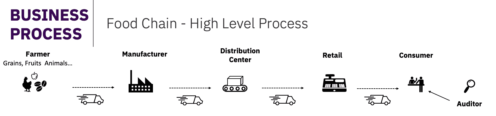

在上图中显示的业务流程是现代食品链的简化版本。该链可能比此处所代表的要复杂得多。例如，许多超市都有自己的配送中心。然而，由于我们的主要目标是简化，我们没有代表其他因素，例如港口和海关。

对于我们的用例，我们将试图从制造商交付的时间开始考虑产品。这个产品可以是任何物品，但我们将用鸡腿作为例子。

我们链条中要管理的资产将是一箱装满鸡腿的箱子，我们的另一个资产将是一托盘装满装有鸡腿的箱子。在食品链中，我们将研究以下参与者的流程：制造商、配送中心和零售商。

如前所述，现代食品链中有很多参与者。请记住，我们遵循的是更简化的流程，不一定是实际生活中遵循的流程。我们的目标是理解物联网和区块链如何帮助食品链内的各方和流程。

# 过程的挑战

我们选择关注的食品链的一部分面临着许多挑战。我们在这里简要列出了它们：

+   **从农民的角度来看的挑战**：确保关于原材料的关键信息的文件化，例如产品描述、检验日期、屠宰日期和库存信息

+   **制造商的挑战**：确保产品来源和产品的安全交付和接收，将产品与电子产品包装在一起，为监管机构和消费者使用条形码/二维码信息标签，以及将产品聚合成包装

+   **零售商的挑战：**检查包装完整性，并通过日期、仓库验证和质量控制，保持产品包装在整个运输线上的可见性

+   **消费者的挑战：**对产品的来源以及包装中的信息有信心，快速识别商品，并在必要时从货架上移除可疑产品以及消费

# 食品工厂的过程

让我们从我们的目标过程开始。在我们的用例中，产品以大块形式到达工厂，在那里将被切割、包装，并放入销售用箱子中。这些产品被储存，并在交付之前装到托盘上。

托盘是用于移动货物的木质、金属或塑料平台，如下图所示：

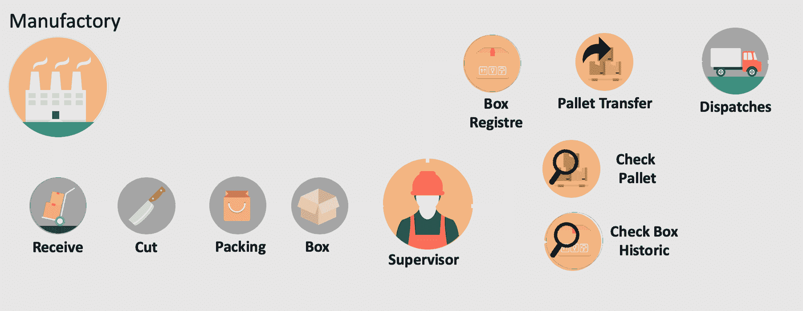

接下来，我们将看到产品在转到下一阶段之前必须注册的重要数据。当产品到达时，捕获并记录以下数据：

+   **库存管理单位（SKU）**

+   动物来源

+   制造商名称

+   动物信息

+   质量控制

+   淘汰日期

+   冷冻

+   技术监督员详细信息

+   发货日期

+   温度和运输细节

在注册箱子或托盘时捕获以下细节：

+   SKU

+   日期

+   工厂地址

+   冷冻温度

+   质量记录

+   托盘代码

现在让我们检查链条中下一环节的过程。

# 配送中心的过程

产品在被切割、包装和运送后，到达配送中心，被接收并检查以供存储。根据过程的不同，产品可能会放在更适合运输的更大托盘上，可以通过火车或卡车运输：

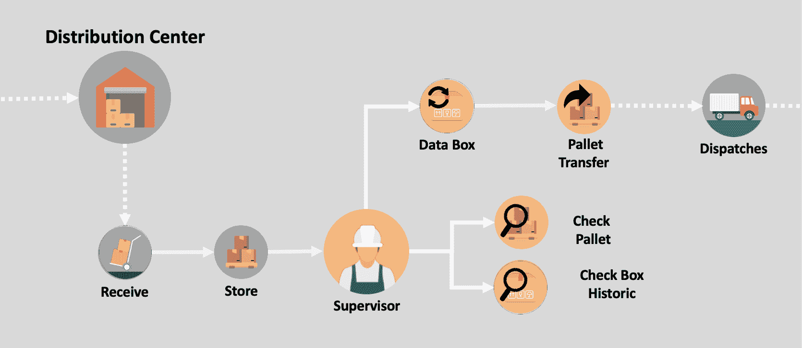

为了避免产品出现任何问题，配送中心会审核工厂发送的数据。如果有任何额外的移动，如托盘转移，需要将新的信息添加到包装中：

+   对于产品，如下：

    +   收货日期

    +   托盘编号

    +   收到的温度

    +   存储温度

    +   运输公司

    +   质量封条

+   对于托盘，如下：

    +   目的地代码

    +   托盘代码

    +   日期

    +   发货温度

    +   运输公司

检查后，产品被发送给零售商。

# 超市和商店的过程

商店将会接收产品并检查商品是否符合要求。如果符合，托盘被拆卸并箱子被打开。这结束了我们对资产的监控：

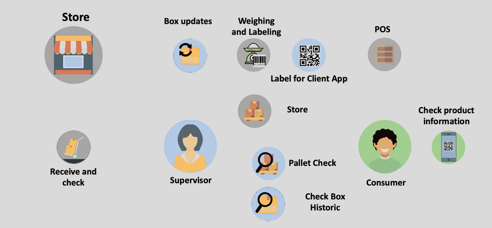

必须在这个阶段注册以下重要数据，产品才能到达消费者：

+   收货日期

+   托盘编号

+   收到的温度

+   存储温度

+   运输公司

+   质量封条

现在轮到商店负责给产品贴标签了，之后可能会直接放到货架上，也可能不会。

# 技术方法

现在我们对我们的流程和潜在问题有了更好的理解，让我们看看技术如何对我们有用。以下是标准区块链 Hyperledger Fabric 架构的表示：

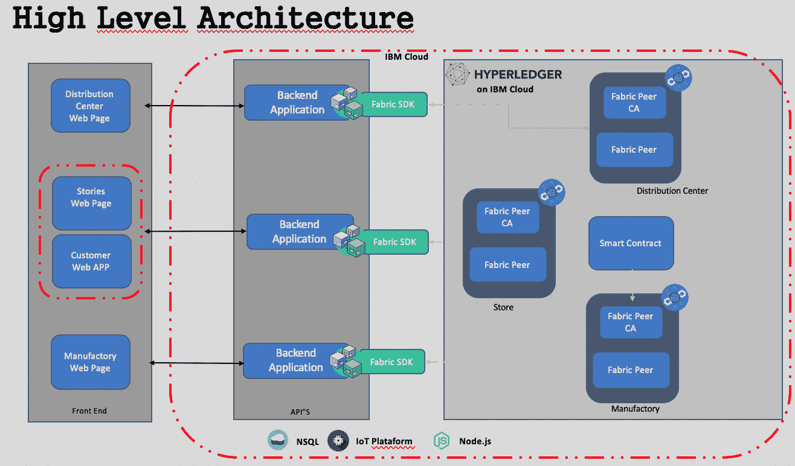

前述图表向我们展示了三个重要层次：前端应用程序（左侧）、API/SDK（中心）、以及 Hyperledger Fabric 和物联网平台（右侧）。

让我们更详细地审查每一层。

# 前端应用程序

此层负责数据输入，可以是来自 SAP、Salesforce 或 Siebel 的数据包，也可以是自定义应用程序。它还可以与物联网设备交互，收集数据并在区块链分类帐中注册。开发前端应用程序的现代架构包括以下层次：

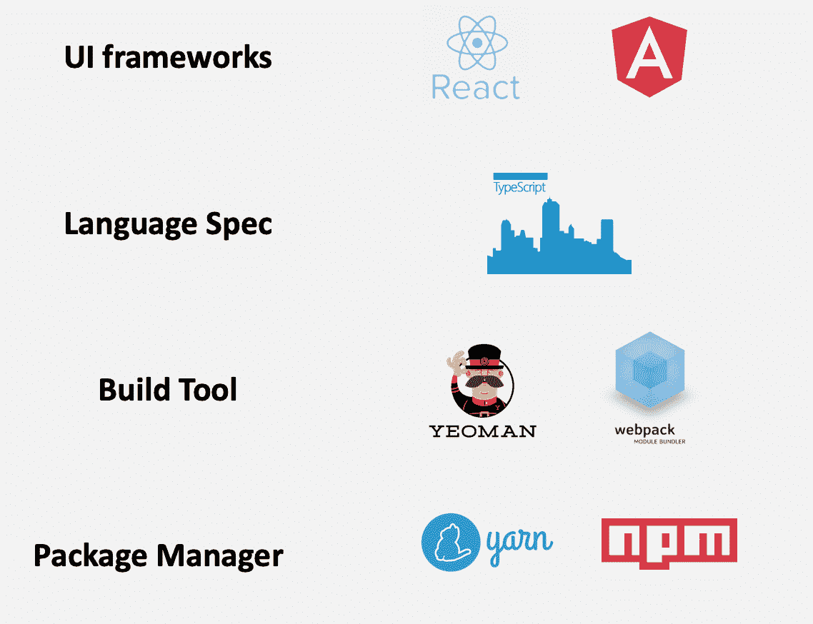

好的，我知道每一层都有很多其他工具，而不仅仅是这里介绍的，但我只是用我更熟悉的那些。

这种前端架构允许我们将服务从单一界面中分离出来。通过这样做，我们可以将**用户体验**（**UX**）扩展到多个平台，而无需重建整个应用程序。

# 基于物联网的资产追踪

物联网在食品链中发挥着重要作用。物联网设备可以跟踪资产，有大量可用的模型可以做到这一点。有用于测量温度的传感器，位置可以使用 GPS、信标、SigFox、Wi-Fi、4G 和 Sub1Ghz 来确定。这些设备和网络可以被农场、工厂、运输公司、分销中心和零售店使用，覆盖食品链中的所有参与者。

食品链中的主要挑战是运输。许多食品需要特殊关照，温度是最重要的关注点之一。由于许多食品易腐，温度控制对于防止污染和损坏至关重要。

让我们看看如何利用物联网设备来缓解这一挑战。 [粒子电子资产追踪器](https://example.org/particle_electron_asset_tracker)（如下图所示）可用于收集温度和环境数据，并识别 GPS 位置和蜂窝三角测量等信息：

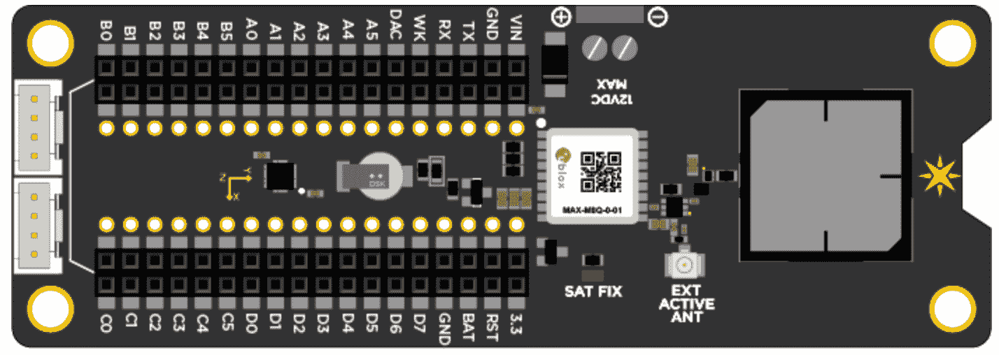

此追踪器允许我们连接到 u-blox M8 GNSS GPS 接收器和 Adafruit LIS3DH 三轴加速度计。我们也可以连接 Grove 传感器。

让我们看看这种物联网解决方案的高层架构：

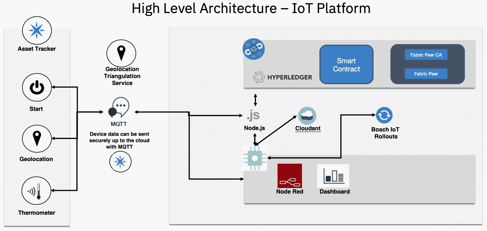

此图表向我们展示了解决方案的一些重要组件。让我们看看它们是什么：

+   **消息队列遥测传输（MQTT）**：这是一种基于发布-订阅的消息传输协议，通过 TCP 工作。它专为需要小代码占用空间或网络带宽有限的远程连接设计。发布-订阅消息传输模式需要一个消息代理。

+   **Node-RED**：Node-RED 是一种用于在易于使用的流程编辑器中简单地连接硬件设备、API 和在线服务的编程工具。

+   **IBM Cloud**：这是一套面向企业的云计算服务。

+   **Bosch IoT Rollouts**: 这是 Bosch IoT Suite 中的一个云服务，可以让用户管理边缘设备、控制器和网关的软件更新的推出。

那么，这些组件如何组合在一起以帮助食品供应链中的各种流程？以下是：

+   Node-RED 控制面板仪表板使我们能够选择资产跟踪器，并检查位置、数据、设备状态和其他信息

+   资产跟踪设备可以通过蜂窝网络进行激活或更新

+   地理位置数据可以定期传输，并且可以在 Node-RED 中的仪表板上进行跟踪

+   资产跟踪设备查询温度数据，然后可能查询位置或速度数据

+   Node-RED 可以将温度、位置和速度数据写入 Hyperledger Fabric

+   Node-RED 仪表板查询 Hyperledger Fabric 以获取各种任务和信息，例如交易历史记录、日期和时间数据和地理传感器数据

# API/SDK

SDK 或 API 是一个负责在区块链网络中建立连接的集成层。通常使用 Node.js 开发，并在调用智能合约中起着重要作用。今天，我们可以找到覆盖 Go 和 Java 的 API/SDK 文档，并且 Python 的文档正在制定中。

您可以参考此链接以获取有关如何使用 API/SDK 将您的应用程序与区块链网络集成的更多信息：[`hyperledger-fabric.readthedocs.io/en/release-1.3/fabric-sdks.html`](https://hyperledger-fabric.readthedocs.io/en/release-1.3/fabric-sdks.html)。

以下图示显示了一个与通过 API/SDK 与 Hyperledger Fabric 交互的应用程序集成：

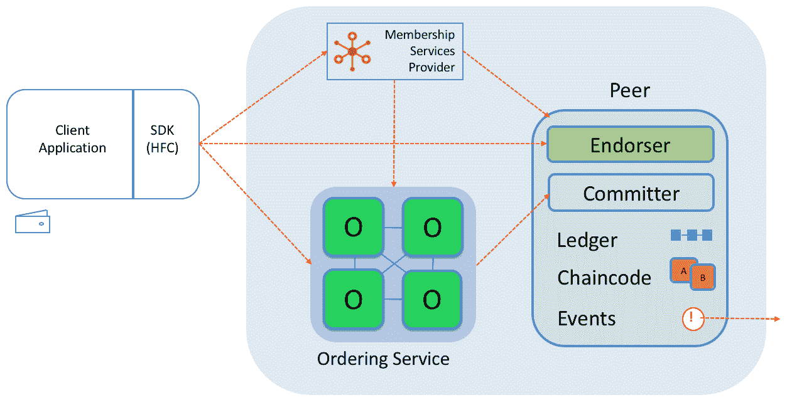

Composer JavaScript SDK 源自 Node.js，允许开发人员将您的应用程序与他们的业务网络集成。

有两个 npm 模块：

+   `composer-client`：这个模块通常作为应用程序的本地依赖项安装。它提供了业务应用程序用来连接业务网络以访问资产和参与者并提交交易的 API。在生产中，这是需要作为应用程序的直接依赖项添加的唯一模块。

+   `composer-admin`：此模块通常作为管理应用程序的本地依赖项安装。此 API 允许创建和部署业务网络定义。

现在让我们继续到我们解决方案的最后一层。

# Hyperledger Composer – 高级概览

Hyperledger Composer 是创建您的区块链网络的简单方法，与 Hyperledger Composer 架构站点提供的全栈工作解决方案集成在一起。

从高层次来看，Hyperledger Composer 由以下组件组成：

+   执行运行时

+   JavaScript SDK

+   **命令行界面**（**CLI**）

+   REST 服务器

+   LoopBack 连接器

+   游乐场 Web 用户界面

+   Yeoman 代码生成器

+   VS Code 和 Atom 编辑器插件

在本书范围之外详细审查这些内容将超出范围。您可以访问此链接简要探索这些组件：[`hyperledger.github.io/composer/latest/introduction/solution-architecture`](https://hyperledger.github.io/composer/latest/introduction/solution-architecture)。

# 软件组件

现在我们将从架构师的角度查看我们解决方案的软件组件。这是一个熟悉所有组件并更好地了解它们如何集成的好方法。

首先，让我们探索一下最重要的组件之一：身份验证过程。

我们如何确保区块链的每个成员在我们的前端应用程序中具有正确的访问权限？在回答这个问题之后，我们将深入研究 Hyperledger Composer 的最重要的组件：建模语言和事务处理器函数。

# Composer REST 服务器

要验证客户端，我们将需要设置一个 REST 服务器。在这个选项可用之后，客户端在被允许调用 REST API 之前应该被验证。

REST 服务器使用一个名为 PASSPORT 的开源软件，这是一个用于 Node.js 的身份验证中间件。它灵活且模块化，支持通过用户名和密码、Facebook、Twitter、Google 和**轻量级目录访问协议**（**LDAP**）等方式进行身份验证。在第七章中，*创建您的区块链和物联网解决方案*，我们将有关于此的更多细节。现在，让我们回顾一下这些组件将如何工作。

在下图中，我们可以看到使用 Composer REST 服务器的高级认证架构：

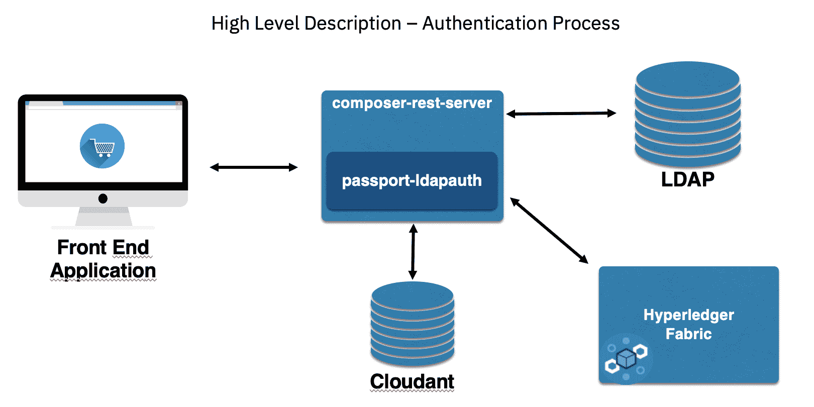

下图描述了以下组件：一个前端应用程序、一个 Composer REST 服务器、LDAP 和 Cloudant，一个 NoSQL 数据库。

如果您正在进行测试或需要快速创建概念验证，我强烈建议使用 Facebook、Google 或 Twitter 进行身份验证。这比其他方法更容易更快。

要使用先前的方法将 Composer REST 服务器用作自定义实现，我们需要进行一些自定义。执行以下步骤：

1.  在`composer-rest-server`安装中有一行需要在该行之前执行的：

```
apk del make gcc g++ python git
```

在使用此方法之前，请确保您有一个干净的环境，清理所有先前的安装。

1.  要自定义我们的 composer REST 服务器 Dockerfile，在 RUN 语句中添加以下命令：

```
su -c "npm install -g passport-ldapauth" - composer && \
```

1.  创建以下环境变量：

```
export COMPOSER_CARD=admin@interbancario
export COMPOSER_NAMESPACES=require
export COMPOSER_AUTHENTICATION=true
export COMPOSER_MULTIUSER=true
```

1.  如果你检查 API 调用并收到 `404`，意味着你未登录：

```
export COMPOSER_PROVIDERS='{
    "ldap": {
    "provider": "ldap",
    "authScheme": "ldap",
    "module": "passport-ldapauth",
    "authPath": "/auth/ldap",
    "successRedirect": “<redirection URL. will be overwritten by the property 'json: true'>”,
 "failureRedirect": "/?success=false",
 "session": true,
    "json": true,
    "LdapAttributeForLogin": “< CHANGE TO LOGIN ATTRIBUTE >",
    "LdapAttributeForUsername": "<CHANGE TO USERNAME ATTRIBUTE>",
      "server": {
      "url": “<URL DO LDAP>",
      "bindDN": “<DISTINGUISHED USER NAME FOR A SEARCH>",
      "bindCredentials": “<USER PASSWORD FOR A SEARCH>", 
      "searchBase": “<PATH WITH USERS LIST WILL BE STORED>",
      "searchFilter": "(uid={{username}})"
    }
  }
}'
```

1.  检查我们的钱包中是否有 API：

```
TestValideteLastProcess:A Transaction named TestValideteLastProcess
UpdateOpportunityStatus: A Transaction named UpdateOpportunityStatus
Wallet:Business network cards for the authenticated user
```

为了更好地理解过程认证，让我们探索这个执行流程：

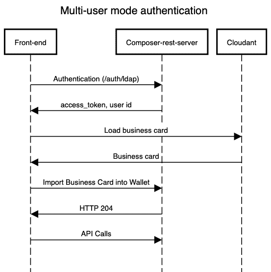

每个`composer-rest-server`的 API 调用必须包含`access_token`，这是由身份验证带回的。有关更多信息，请参阅[`hyperledger.github.io/composer/v0.16/integrating/enabling-rest-authentication`](https://hyperledger.github.io/composer/v0.16/integrating/enabling-rest-authentication)。

使用 `curl` 的一些例子包括：

```
curl -v http://localhost:3000/api/system/ping?access_token=xxxxx
```

这是另一个例子：

```
curl -v -H 'X-Access-Token: xxxxx' http://localhost:3000/api/system/ping
```

1.  这是设置你的`composer-rest-server`的最后一步：使用 Cloudant 创建一个名片。

创建具有以下属性的成员卡：

+   **ID**：`wallet-data/admin@system name`

+   **密钥**：`wallet-data/admin@system name`

+   **值**：`{"rev" : "5-1af3gs53gwh...."}`

根据以下截图上传附件：

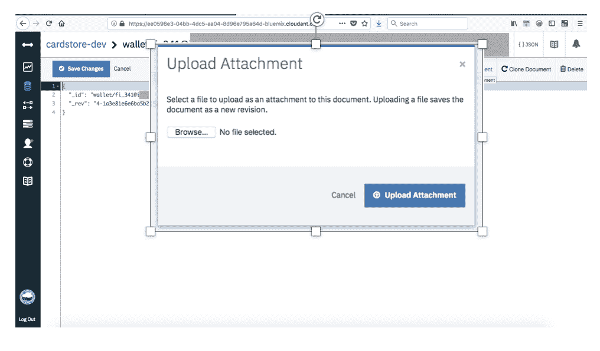

在第七章，*创建您的区块链和物联网解决方案*中，我们将部署此实现。

# Hyperledger Composer 模型

有许多方法来识别区块链用例。让我们记住第三章中描述的一些重要指标，*解释区块链技术并使用 Hyperledger 工作*：

+   是否涉及业务网络？

+   如果有，是否有需要验证和审计的交易？

+   透明度和数据不可变性是否重要？

确定了这些问题的答案后，头脑风暴也是详细解决方案和确定最佳解决方案平台（如 IBM 食品安全）的良好方式，或者开始为用例创建自定义开发。

使用 Hyperledger Composer 建模语言可以很容易地定义将作为交易进行处理并存储在分类账上的资源的结构。

CTO 文件创建了具有三个主要元素的业务网络定义的域模型：

+   包含文件中所有资源声明的单个命名空间

+   包含资产、交易、参与者和事件的一组资源定义

+   可选的导入声明，导入来自其他命名空间的资源

在第七章，*创建您的区块链和物联网解决方案*中，我们创建了一个业务网络。让我们更详细地探讨我们在代码中使用的代码：

命名空间是资产、事件、参与者和交易的基本定义，如下所示：

```
// **
  * Sample business network definition.
  */
 namespace org.example.basic
```

资源和枚举类型的声明如下所示：

```

 asset SampleAsset identified by assetId {
   o String assetId
   --> SampleParticipant owner
   o Double value
 }

 participant SampleParticipant identified by participantId {
   o String participantId
   o String firstName
   o String lastName
 }
```

事务处理函数是通过使用业务网络连接 API 提交事务时由运行时自动调用的：

```
transaction SampleTransaction {
   --> SampleAsset origin
   --> SampleAsset target
     o Double txTransferAmount
 }

 event SampleEvent {
   --> SampleAsset origin
   --> SampleAsset target
     o Double txTransferAmount
 }
```

有关 Hyperledger Composer 建模语言的更多信息，请访问以下链接：

+   [`hyperledger.github.io/composer/v0.16/reference/cto_language.html`](https://hyperledger.github.io/composer/v0.16/reference/cto_language.html)

+   [`hyperledger.github.io/composer/v0.16/reference/js_scripts.html`](https://hyperledger.github.io/composer/v0.16/reference/js_scripts.html)

# Hyperledger Composer 访问控制语言

Hyperledger Composer 有一个访问控制文件（`.acl`），您可以使用它来编程业务访问控制和网络访问控制。业务访问控制适用于业务网络内的资源，而网络访问控制则是指对管理网络更改的控制。

这是一个授予网络访问控制的例子：

```
rule networkControlPermission {
  description:  "networkControl can access network commands"
  participant: "org.acme.foodchain.auction.networkControl"
  operation: READ, CREATE, UPDATE
  resource: "org.hyperledger.composer.system.Network"
  action: ALLOW  
}
```

下面是另一个例子：

```
rule SampleConditionalRuleWithTransaction {
    description: "Description of the ACL rule"
    participant(m): "org.foodchain..SampleParticipant"
    operation: ALL
    resource(v): "org.example.SampleAsset"
    transaction(tx): "org.example.SampleTransaction"
    condition: (v.owner.getIdentifier() == m.getIdentifier())
    action: ALLOW
}
```

您可以通过访问以下链接了解有关 Hyperledger Composer 访问控制语言的更多信息：[`hyperledger.github.io/composer/v0.16/reference/acl_language.html`](https://hyperledger.github.io/composer/v0.16/reference/acl_language.html)。

# Hyperledger Composer 事务处理函数

Hyperledger Composer 业务网络定义由一组模型文件和一组脚本组成。脚本可以包含实现业务网络定义模型文件中定义的事务的事务处理函数。

下面是一个带有事务的脚本文件的示例：

```
Sample transaction processor function.
  * @param {org.example.basic.SampleTransaction} tx The sample transaction instance.
  * @transaction
  */
 async function sampleExchange(tx) {
 // Get the asset registry for the asset.
     const assetRegistry = await getAssetRegistry('org.example.basic.SampleAsset');

       //Ensure the balance is greather than the amount to be transfered
       if(tx.origin.value > tx.txTransferAmount) {

     //charge from receiver account
     tx.origin.value = (tx.origin.value - tx.txTransferAmount);

     //add to receiver account
     tx.target.value = (tx.target.value +  tx.txTransferAmount);

     // Update the asset in the asset registry.
     await assetRegistry.update(tx.origin);
     await assetRegistry.update(tx.target);

     // Emit an event for the modified asset.
     let event = getFactory().newEvent('org.example.basic', 'SampleEvent');

     event.origin = tx.origin;
 event.target = tx.target;
 event.txTransferAmount = tx.txTransferAmount;

 emit(event);

 }else{
 throw Error(`You do not have enough balance for this transaction:
 Balance US$: ${tx.origin.value} 
 Transfer Amount: ${tx.txTransferAmount}`);
 }
 }
```

正如我们所看到的，当使用 `BusinessNetworkConnection` API 提交事务时，事务处理函数会由运行时自动调用。文档注释内的装饰器用于为函数提供运行时处理所需的元数据，并且每种事务类型都有一个关联的注册表用于存储事务。

# 摘要

本章描述的架构涉及许多组件，实现可能看起来有点复杂。到目前为止，我们已经确定了物联网和区块链的组合可以缓解多个问题并转变现代食品链的运作方式。例如，这样的实现可以在成员之间带来透明度，使他们更有效地控制数据；增加他们的安全性；使流程自动化和动态化；移除中间人；并且整体上使链条变得不那么复杂。

我们还看到物联网作为设备和传感器的计算和网络功能的延伸工作，使它们能够以最少或没有人类输入的方式进行机器对机器的交互。这些技术组件带来了诸如前所未有的自动化、为供应提供成本削减、节能、增值服务和高效管理等优势。

区块链与物联网的整合会使传感器、条形码和二维码扫描事件以及基于射频识别（RFID）的资产等边缘设备之间的数据交换成为可能。连接传感器的资产将能够记录敏感信息，例如特定仓库的位置和温度，并且这些信息可以自动记录或更新在区块链上。

通过更好地理解架构以及构成其技术组件的要素，我们将能够充分实施用于现代食品链的物联网和区块链解决方案。

在下一章中，我们将看到如何使用物联网创建自己的区块链。

# 问题

Q. 物联网安全不足如何威胁区块链网络中的数据？

A. 有时，公司在使用物联网时并不关注安全性。也许因为这是一项新技术，他们并不认为会带来立即的风险。事实是，企业正在将不安全的设备引入其网络，然后未能及时更新软件。不应用安全补丁并非新现象，但是带有互联网连接的不安全物联网设备是一场灾难等待发生；想想黑客和分布式拒绝服务（DDoS）攻击。应为物联网设备制定强有力的安全计划，类似于互联网服务的安全计划。强大的设备识别和更新可以帮助减轻大多数问题。

Q. 区块链技术对于这种应用已经足够成熟了吗？

A. 如今，市面上有许多区块链平台供应商。家乐福、沃尔玛等已经是这些平台的成员。因此，这表明大公司已经在区块链平台上经营业务，而这样的平台适用于这类应用。

Q. 使用物联网和区块链实施解决方案有多复杂？

A. 本章描述的大多数技术都是开源的并被许多公司使用。这表明我们讨论的不是什么复杂的东西，而是大多数开发人员可以使用的东西。

Q. 有多复杂的方案能够覆盖整个食物链？

A. 是的，这并不是一项容易的任务。您可以通过验证用例来开始；一个好的用例是至关重要的。此外，检查是否涉及业务网络；记住，物联网也在追踪资产方面发挥着重要作用，并且您应该为资产追踪制定安全计划。

Q. 使用 Hyperledger Fabric 或 Composer 等开源工具是否需要担心？

A. 超级账本是 Linux 基金会的一部分，拥有 250 多家公司作为成员，包括金融、银行、供应链、制造和技术领域的领导者。例如，IBM、思科、美国运通、富士通、英特尔和摩根大通都在使用 Linux 基金会的技术。换句话说，只要在设备上采用标准的安全措施，这些工具就是安全的。

# 进一步阅读

+   有关 Hyperledger Composer 的更好描述可以在 Composer 网站上找到：[`hyperledger.github.io/composer/v0.19/introduction/solution-architecture`](https://hyperledger.github.io/composer/v0.19/introduction/solution-architecture)。

+   本章的主要焦点是 Hyperledger Composer。如果你想探索 Hyperledger Fabric 的架构，可以在这里找到更多信息：[`hyperledger-fabric.readthedocs.io/en/release-1.3/arch-deep-dive.html`](https://hyperledger-fabric.readthedocs.io/en/release-1.3/arch-deep-dive.html)。

+   Yeoman 是创建您的前端结构的开源框架。有关更多信息，请访问[`yeoman.io/`](https://yeoman.io/)。

+   Passport 是用于 Node.js 的身份验证中间件。有关更多信息，请访问[http://www.passportjs.org/] (http://www.passportjs.org/)。

+   您可以通过访问以下链接了解有关 Hyperledger Composer 访问控制语言的更多信息：[`hyperledger.github.io/composer/v0.16/reference/acl_language.html`](https://hyperledger.github.io/composer/v0.16/reference/acl_language.html)。

+   您可以通过以下链接获取有关 Hyperledger Composer 建模语言的更多信息：

    +   [`hyperledger.github.io/composer/v0.16/reference/cto_language.html`](https://hyperledger.github.io/composer/v0.16/reference/cto_language.html)

    +   [`hyperledger.github.io/composer/v0.16/reference/js_scripts.html`](https://hyperledger.github.io/composer/v0.16/reference/js_scripts.html)

+   有关 composer-rest-server 的信息可以在此找到：[`hyperledger.github.io/composer/v0.16/integrating/enabling-rest-authentication`](https://hyperledger.github.io/composer/v0.16/integrating/enabling-rest-authentication)。
