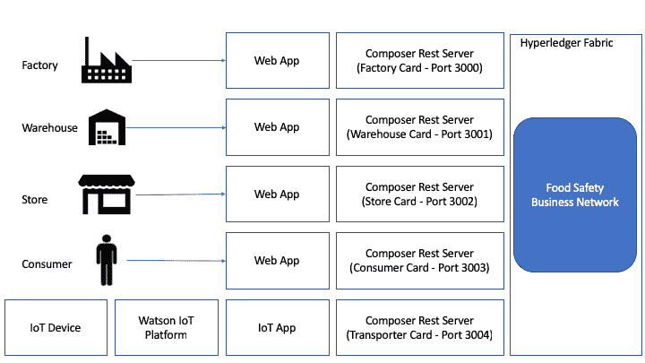
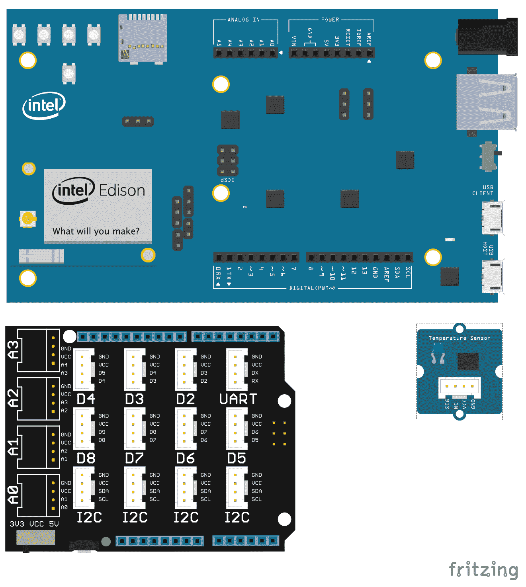
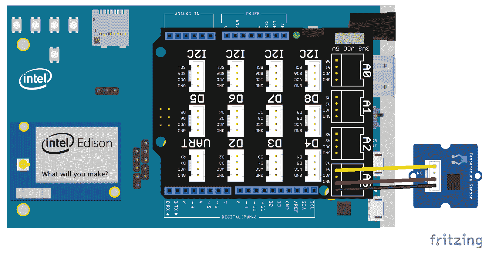
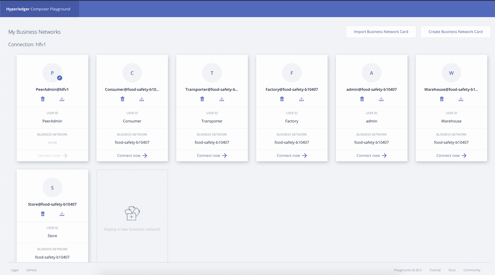
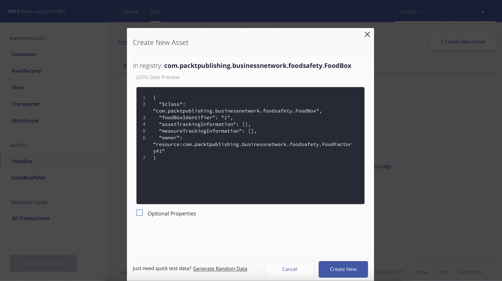
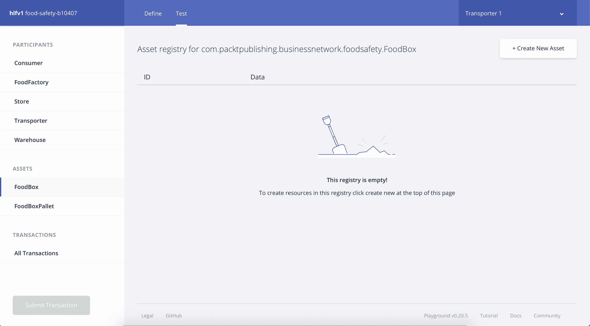
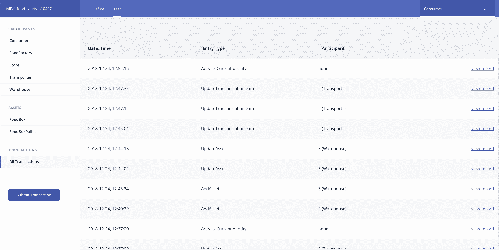
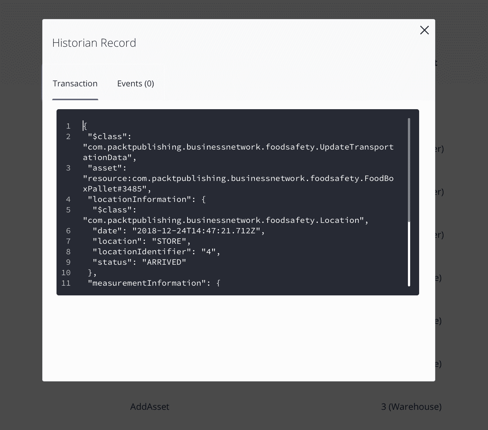

# 创建您的区块链和IoT解决方案

在正确理解了上一章节中提出的项目目标后，现在是让解决方案开始运行的时候了。在本章中，我将引导你创建一个使用Hyperledger Composer的区块链网络。

在本章中，我们将涵盖以下主题：

+   创建区块链网络

+   使用Hyperledger Composer定义资产、参与者、交易和访问控制清单

+   将网络发布到Hyperledger环境

我们还将从[第二章](77c0cd3d-c8ef-4bce-965c-cf1a7f7035f0.xhtml)借用代码，即*创建您的第一个IoT解决方案*，以创建一个将监视货物运输并与区块链网络交互的设备。

# 技术要求

要访问完整的代码，您需要在您的计算机上安装Hyperledger Fabric/Composer环境，包括先决条件，以及能够开发Node.js应用程序的IDE（推荐使用Visual Studio Code）。

本章列出的代码可在[https://github.com/PacktPublishing/Hands-On-IoT-Solutions-with-Blockchain/tree/master/ch7/hands-on-iot-blockchain.](https://github.com/PacktPublishing/Hands-On-IoT-Solutions-with-Blockchain/tree/master/ch7/hands-on-iot-blockchain)找到

# 解决方案概述

在这里，我们将处理食品工厂到杂货店的产品移动中最重要的部分之一。

下图显示了应针对每个给定阶段实施的解决方案：



让我们详细看看前述的图表。我们将从四个参与者开始：

+   **工厂**: 这是食品安全解决方案的起点。它负责从农场收集原材料，并创建一个发送到仓库的货箱。此参与者被允许的操作是添加新的货箱和将货箱转移至运输者。

+   **运输者**: 这是负责在受控温度下从工厂到仓库，以及从仓库到杂货店进行运输的公司。运输者定义的操作包括向其控制的资产添加温度测量数据，以及将资产转移到仓库或杂货店。

+   **杂货店**: 这是一家向消费者出售食品盒的公司。杂货店是这一链条的终点，消费者可以从食品盒中获取信息。杂货店可以检查货物托盘和货箱数据。

+   **消费者**: 他们是食品盒的目标受众。消费者对跟踪货箱链条很感兴趣，因此有一个查看货箱信息的映射操作。

我们将使用每个参与者的名片创建一个**Composer REST服务器**的实例，因此总共将拥有四个**Composer REST服务器**实例。还有盒子和托盘。这些资产的定义如下：

+   **食品盒**：代表在工厂生产并在整个链条中处理的产品

+   **托盘**：代表一批箱子，这些箱子被组合在一起从仓库送到杂货店

让我们开始我们的区块链网络解决方案。

# 创建区块链网络

要开发区块链网络，首先需要使用Yeoman命令行创建一个业务网络项目，然后命名业务网络：

```
$ yo hyperledger-composer
Welcome to the Hyperledger Composer project generator
? Please select the type of project: Business Network
You can run this generator using: 'yo hyperledger-composer:businessnetwork'
Welcome to the business network generator
? Business network name: food-safety-b10407
? Description: Hands-on IoT solutions with Blockchain
? Author name: Maximiliano and Enio
? Author email: max.santos@gmail.com
? License: Apache-2.0
? Namespace: com.packtpublishing.businessnetwork.foodsafety
? Do you want to generate an empty template network? Yes: generate an empty template network
   create package.json
   create README.md
   create models/com.packtpublishing.businessnetwork.cto
   create permissions.acl
   create .eslintrc.yml
```

Yeoman生成器生成一个基本空结构的Hyperledger Composer业务网络的文件夹。

`.cto`文件包含业务网络的定义：资产、参与者、交易和查询，而`.acl`文件包含了资产和交易的访问控制列表。

在后续的部分中，我们将编写业务网络定义，所以打开Visual Studio Code并打开Yeoman创建的文件夹。

要开始开发区块链解决方案，请打开`models/com.packtpublishing.businessnetwork.cto`文件并开始编码。

# 概念和枚举

创建常见数据类型的组合，这些类型在资产、参与者和交易中是常见的，可以通过在Hyperledger Composer中创建更可读的结构来实现。这些结构是**概念**和**枚举**。

我们将在解决方案中使用以下结构：

```
// Tracking information when an asset arrives or leaves a location
enum LocationStatus {
 o ARRIVED
 o IN_TRANSIT
 o LEFT
}

// Location Types
enum LocationType {
 o FACTORY
 o WAREHOUSE
 o TRANSPORTER
 o STORE
}

// A measurement sent by the transporter sensor
concept Measurement {
 o DateTime date
 o Double value
}

// Check if it's in the factory, warehouse
concept Location {
 o DateTime date
 o LocationType location
 o String locationIdentifier
 o LocationStatus status
}
```

接下来，我们将看看如何定义业务网络中的资产。

# 资产定义

在定义了区块链网络的一般结构后，让我们定义将在其中使用的资产。在我们的解决方案中，将有`FoodBox`和`FoodBoxPallet`资产。

以下代码定义了它们：

```
// Definition of a food box
asset FoodBox identified by foodBoxIdentifier {
 o String foodBoxIdentifier
 o Location[] assetTrackingInformation
 o Measurement[] measureTrackingInformation
 --> FoodSafetyParticipant  owner
}

// Definition of a pallet that groups food boxes
asset FoodBoxPallet identified by foodBoxPalletIdentifier {
 o String foodBoxPalletIdentifier
 --> FoodBox foodBoxInPallet
 o Location[] assetTrackingInformation 
 o Measurement[] measureTrackingInformation
 --> FoodSafetyParticipant  owner
}
```

# 参与者

参与者是与区块链网络交互的行为者。每个参与者定义都是业务网络中不同角色的权限在访问控制列表中的定义，如下所示：

```
abstract participant FoodSafetyParticipant identified by identifier {
 o String identifier
 o String name
}

participant FoodFactory extends FoodSafetyParticipant {
}

participant Warehouse extends FoodSafetyParticipant {
}

participant Transporter extends FoodSafetyParticipant {
}

participant Store extends FoodSafetyParticipant {
}

participant Consumer extends FoodSafetyParticipant {
}
```

# 部署和测试用于Hyperledger的业务网络

为了测试目的，我们将授予所有参与者对区块链网络的所有资源完全访问权限：

1.  为了实现这一点，我们将在`permissions.acl`文件中添加以下行（不删除任何现有规则）：

```
rule Default {
    description: "Allow all participants access to all resources"
    participant: "ANY"
    operation: ALL
    resource: "com.packtpublishing.businessnetwork.foodsafety.**"
    action: ALLOW
}
```

定义了这条规则后，我们将能够部署和测试账本，而无需任何其他额外的权限。

1.  在定义了网络后，我们将生成一个**业务网络归档**（`.bna`文件）并部署到Hyperledger环境中。在此之前，请确保您的环境已经正常运行。要创建`.bna`文件，请转到项目的根目录并运行以下命令：

```
$ composer archive create -t dir -n .
Creating Business Network Archive
Looking for package.json of Business Network Definition
    Input directory: /hands-on-iot-solutions-with-blockchain/ch7/food-safety-b10407
Found:
     Description: Hands-on IoT solutions with Blockchain
     Name: food-safety-b10407
     Identifier: food-safety-b10407@0.0.1
Written Business Network Definition Archive file to 
     Output file: food-safety-b10407@0.0.1.bna
Command succeeded
```

1.  如果你尚未生成`PeerAdminCard`，现在是时候这样做，并将其与在我们下载了`fabric-dev servers`的目录中使用`createPeerAdminCard.sh`脚本导入：

```
$ ~/fabric-dev-servers/createPeerAdminCard.sh 
Development only script for Hyperledger Fabric control
Running 'createPeerAdminCard.sh'
FABRIC_VERSION is unset, assuming hlfv12
FABRIC_START_TIMEOUT is unset, assuming 15 (seconds)
Using composer-cli at v0.20.4
Successfully created business network card file to 
    Output file: /tmp/PeerAdmin@hlfv1.card
Command succeeded
Successfully imported business network card
    Card file: /tmp/PeerAdmin@hlfv1.card
    Card name: PeerAdmin@hlfv1
Command succeeded
The following Business Network Cards are available:
Connection Profile: hlfv1
┌─────────────────┬───────────┬──────────────────┐
│ Card Name       │ UserId    │ Business Network │
├─────────────────┼───────────┼──────────────────┤
│ PeerAdmin@hlfv1 │ PeerAdmin │                  │
└─────────────────┴───────────┴──────────────────┘

Issue composer card list --card <Card Name> to get details a specific card
Command succeeded
Hyperledger Composer PeerAdmin card has been imported, host of fabric specified as 'localhost'
```

1.  当你设置好一切后，将`.bna`文件安装到环境中，并通过运行以下命令启动网络：

```
$ composer network install --card PeerAdmin@hlfv1 --archiveFile food-safety-b10407\@0.0.1.bna 
√ Installing business network. This may take a minute...
Successfully installed business network food-safety-b10407, version 0.0.1

Command succeeded
$ composer network start --networkName food-safety-b10407 --networkVersion 0.0.1 --networkAdmin admin --networkAdminEnrollSecret adminpw --card PeerAdmin@hlfv1 --file networkadmin.card
Starting business network food-safety-b10407 at version 0.0.1

Processing these Network Admins: 
userName: admin
√ Starting business network definition. This may take a minute...
Successfully created business network card:
Filename: networkadmin.card

Command succeeded
```

1.  最后，导入启动过程生成的网络管理员卡，并ping网络以确保它在环境中运行：

```
$ composer card import --file networkadmin.card
Successfully imported business network card
    Card file: networkadmin.card
    Card name: admin@food-safety-b10407

Command succeeded

$ composer network ping --card admin@food-safety-b10407
The connection to the network was successfully tested: food-safety-b10407
    Business network version: 0.0.1
    Composer runtime version: 0.20.4
    participant: org.hyperledger.composer.system.NetworkAdmin#admin
    identity: org.hyperledger.composer.system.Identity#f48a787ac40102cc7753336f8b15dd20fa3765e7b9049b2aeda4dcc3816d30c1

Command succeeded
```

在这一点上，我们已经创建了我们网络的第一个版本；生成了用于部署的包（`.bna`文件）；创建了`PeerAdminCard`；将网络安装到Hyperledger Fabric环境；生成了负责管理区块链网络的`NetworkAdminCard`；并启动了网络。

使用管理员卡，我们将发送`ping`命令以确保网络已经启动并正常运行。现在，让我们改进我们的网络。

# 通过区块链中交易操作资产

交易是在Hyperledger Composer定义的业务网络中执行的原子操作，运行在Hyperledger Fabric环境和定义的业务网络的范围内。

在这里演示的用例中，我们创建的交易将会使用IoT设备提供的信息来更新托盘和嵌套的食品箱。

它由两个结构组成。第一个是交易的定义，并在业务网络定义模型（`.cto`文件）中创建：

```
transaction updateTransportationData {
  --> FoodBoxPallet pallet
  o Location locationInformation
  o Measurement measurementInformation
}
```

下一个结构是实现之前定义的交易的函数，并在JavaScript ES5兼容的脚本中创建（一个`.js`文件）：

```
/**
 * Update pallets and boxes with measurements function.
 * @param {com.packtpublishing.businessnetwork.foodsafety.UpdateTransportationData} tx Update pallets and boxes with measurements.
 * @transaction
 */
async function updateTransportationData(tx) {

 // Get transaction parametes
 let newValue = tx.asset;
 let location = tx.locationInformation;
 let measurement = tx.measurementInformation;

 // Update Pallet data with measurements
 if( !newValue.assetTrackingInformation || newValue.assetTrackingInformation == undefined)
 newValue.assetTrackingInformation = [];
 if ( !newValue.measureTrackingInformation || newValue.measureTrackingInformation == undefined)
 newValue.measureTrackingInformation = [];

 newValue.assetTrackingInformation.push(location);
 newValue.measureTrackingInformation.push(measurement);

 // Update Boxes data with measurements
 let foodBox = newValue.foodBoxInPallet;
 if( !foodBox.assetTrackingInformation || foodBox.assetTrackingInformation == undefined)
 foodBox.assetTrackingInformation = [];

 if ( ! foodBox.measureTrackingInformation || foodBox.measureTrackingInformation == undefined)
 foodBox.measureTrackingInformation = [];

 foodBox.assetTrackingInformation.push(location); 
 foodBox.measureTrackingInformation.push(measurement);

// Get the asset registry for both assets.
 let assetRegistryFoodBoxPallet = await getAssetRegistry('com.packtpublishing.businessnetwork.foodsafety.FoodBoxPallet');
 let assetRegistryFoodBox = await getAssetRegistry('com.packtpublishing.businessnetwork.foodsafety.FoodBox');

 // Update the assets in the asset registry.
 await assetRegistryFoodBoxPallet.update(newValue);
 await assetRegistryFoodBox.update(foodBox);
}
```

# 生成并导出参与者名片

为了正确使用网络，我们将为每一个类（`工厂`，`仓库`，`运输商`，`商店`，和`消费者`）创建一个参与者，生成他们各自的名片，并将它们导入Composer CLI钱包：

1.  首先，我们将创建参与者：

```
$ composer participant add -c admin@food-safety-b10407 -d '{"$class":"com.packtpublishing.businessnetwork.foodsafety.Consumer","identifier":"5","name":"Consumer"}'
Participant was added to participant registry.

Command succeeded

$ composer participant add -c admin@food-safety-b10407 -d '{"$class":"com.packtpublishing.businessnetwork.foodsafety.Store","identifier":"4","name":"Store"}'
Participant was added to participant registry.

Command succeeded

$ composer participant add -c admin@food-safety-b10407 -d '{"$class":"com.packtpublishing.businessnetwork.foodsafety.Transporter","identifier":"2","name":"Transporter"}'
Participant was added to participant registry.

Command succeeded

$ composer participant add -c admin@food-safety-b10407 -d '{"$class":"com.packtpublishing.businessnetwork.foodsafety.Warehouse","identifier":"3","name":"Warehouse"}'
Participant was added to participant registry.

Command succeeded

$ composer participant add -c admin@food-safety-b10407 -d '{"$class":"com.packtpublishing.businessnetwork.foodsafety.FoodFactory","identifier":"1","name":"Factory"}'
Participant was added to participant registry.
Command succeeded
```

1.  然后，我们将发行一个身份并使用以下命令导入它们各自的名片：

```
composer identity issue -c admin@food-safety-b10407 -f <name of the output file for the card> -u <participant name> -a <participant class# Participant id>
```

1.  对每个参与者重复执行此命令：`Transporter 1`、`Store 1`、`Warehouse 1`和`Factory 1`。

```
$ composer identity issue -c admin@food-safety-b10407 -f consumer.card -u "Consumer" -a "resource:com.packtpublishing.businessnetwork.foodsafety.Consumer#1"
Issue identity and create Network Card for: Consumer

√ Issuing identity. This may take a few seconds...

Successfully created business network card file to 
    Output file: consumer.card Command succeeded

```

1.  为每个参与者/生成的名片将每张名片导入Composer CLI钱包，并检查所有名片是否已成功导入：

```
$ composer card import -f consumer.card 
Successfully imported business network card
    Card file: consumer.card
    Card name: Consumer 1@food-safety-b10407

Command succeeded

$ composer card list
The following Business Network Cards are available:
Connection Profile: hlfv1
┌──────────────────────────────────┬───────────────┬────────────────────┐
│ Card Name                        │ UserId        │ Business Network   │
├──────────────────────────────────┼───────────────┼────────────────────┤
│ Factory 1@food-safety-b10407     │ Factory       │ food-safety-b10407 │
├──────────────────────────────────┼───────────────┼────────────────────┤
│ Warehouse 1@food-safety-b10407   │ Warehouse     │ food-safety-b10407 │
├──────────────────────────────────┼───────────────┼────────────────────┤
│ Store 1@food-safety-b10407       │ Store         │ food-safety-b10407 │
├──────────────────────────────────┼───────────────┼────────────────────┤
│ Consumer 1@food-safety-b10407    │ Consumer      │ food-safety-b10407 │
├──────────────────────────────────┼───────────────┼────────────────────┤
│ Transporter 1@food-safety-b10407 │ Transporter   │ food-safety-b10407 │
├──────────────────────────────────┼───────────────┼────────────────────┤
│ admin@food-safety-b10407         │ admin         │ food-safety-b10407 │
├──────────────────────────────────┼───────────────┼────────────────────┤
│ PeerAdmin@hlfv1                  │ PeerAdmin     │                    │
└──────────────────────────────────┴───────────────┴────────────────────┘

Issue composer card list --card <Card Name> to get details a specific card

Command succeeded
```

# 定义访问控制列表（ACLs）

为了强制执行网络上的权限，我们将为参与者对资产定义一些访问控制规则，具体规则如下：

1.  只有工厂可以创建`FoodBoxes`：

```
rule FoodBoxFactoryCreation {
 description: "Factories can create FoodBoxes"
 participant: "com.packtpublishing.businessnetwork.foodsafety.FoodFactory"
 operation: CREATE
 resource: "com.packtpublishing.businessnetwork.foodsafety.FoodBox"
 action: ALLOW
}
```

1.  由于食品工厂也能够看到他们的`FoodBoxes`并将它们转移到运输商，我们可以使用条件规则来定义这些限制：

```
rule FoodBoxFactoryUpdateAndRead {
 description: "Factories can update and read owned FoodBoxes"
 participant(p): "com.packtpublishing.businessnetwork.foodsafety.FoodFactory"
 operation: UPDATE, READ
 resource(b): "com.packtpublishing.businessnetwork.foodsafety.FoodBox"
 condition: (p == b.owner)
 action: ALLOW
}
```

1.  下一个规则涉及`运输商`。他们可以读取和更新他们自己的`FoodBoxes`。我们将对`FoodBoxPallets`做同样的操作：

```
rule FoodBoxTransportersUpdateAndRead {
 description: "Transporters can update and read owned FoodBoxes"
 participant(p): "com.packtpublishing.businessnetwork.foodsafety.Transporter"
 operation: UPDATE, READ
 resource(b): "com.packtpublishing.businessnetwork.foodsafety.FoodBox"
 condition: (p  == b.owner )
 action: ALLOW
}

rule FoodBoxPalletTransportersUpdateAndRead {
 description: "ransporters can update and read owned FoodBoxes"
 participant(p): "com.packtpublishing.businessnetwork.foodsafety.Transporter"
 operation: UPDATE, READ
 resource(b): "com.packtpublishing.businessnetwork.foodsafety.FoodBoxPallet"
 condition: (p  == b.owner )
 action: ALLOW
}
```

1.  仓库也可以读取和更新他们的`FoodBoxes`，以及创建，更新和读取`FoodBoxPallets`：

```
rule FoodBoxPalletWarehouseCreate {
 description: "Warehouses can create FoodBoxPallets"
 participant: "com.packtpublishing.businessnetwork.foodsafety.Warehouse"
 operation: CREATE
 resource: "com.packtpublishing.businessnetwork.foodsafety.FoodBoxPallet"
 action: ALLOW
}

rule FoodBoxWarehouseUpdateAndRead {
 description: "Warehouses can update and read owned FoodBoxes"
 participant(p): "com.packtpublishing.businessnetwork.foodsafety.Warehouse"
 operation: UPDATE, READ
 resource(b): "com.packtpublishing.businessnetwork.foodsafety.FoodBox"
 condition: (p == b.owner )
 action: ALLOW
}

rule FoodBoxPalletWarehouseUpdateAndRead {
 description: "Warehouses can update and read owned FoodBoxes"
 participant(p): "com.packtpublishing.businessnetwork.foodsafety.Warehouse"
 operation: UPDATE, READ
 resource(b): "com.packtpublishing.businessnetwork.foodsafety.FoodBoxPallet"
 condition: (p  == b.owner)
 action: ALLOW
}

```

1.  最后，商店可以读取他们拥有的`FoodBoxes`，而消费者可以读取所有的`FoodBoxes`：

```
// Store Rules
rule StoreCanReadFoodBoxes {
 description: "Stores can update and read owned FoodBoxes"
 participant(p): "com.packtpublishing.businessnetwork.foodsafety.Store"
 operation: READ
 resource(b): "com.packtpublishing.businessnetwork.foodsafety.FoodBoxPallet"
 condition: (p  == b.owner )
 action: ALLOW
}

// Consumer Rules
rule ConsumersCanReadFoodBoxes {
 description: "Factories can update and read owned FoodBoxes"
 participant: "com.packtpublishing.businessnetwork.foodsafety.Consumer"
 operation: READ
 resource: "com.packtpublishing.businessnetwork.foodsafety.FoodBox"
 action: ALLOW
}

```

应用了这些规则后，网络可以被测试了。

# 将业务网络升级为新版本

升级部署的业务网络只需要四个步骤：

1.  打开`package.json`文件并更新应用程序的版本号。在我们的情况下，它将更新为`0.0.2`，看起来像这样：

```
{
 "engines": {
 "composer": "^0.20.4"
 },
 "name": "food-safety-b10407",
 "version": "0.0.2",
...
```

1.  通过运行`composer archive create -t dir -n .`命令创建一个新的BNA文件：

```
$ composer archive create -t dir -n .
Creating Business Network Archive

Looking for package.json of Business Network Definition
 Input directory: /projects/hands-on-iot-solutions-with-blockchain/ch7/food-safety-b10407
Found:
 Description: Hands-on IoT solutions with Blockchain
 Name: food-safety-b10407
 Identifier: food-safety-b10407@0.0.2
Written Business Network Definition Archive file to
 Output file: food-safety-b10407@0.0.2.bna

Command succeeded
```

1.  在Hyperledger环境中安装新的归档文件：

```
$ composer network install --card PeerAdmin@hlfv1 --archiveFile food-safety-b10407\@0.0.2.bna
√ Installing business network. This may take a minute...
Successfully installed business network food-safety-b10407, version 0.0.2

Command succeeded
```

1.  最后，将网络版本`upgrade`到新版本：

```
$ composer network upgrade --card PeerAdmin@hlfv1 --networkName food-safety-b10407 --networkVersion 0.0.2
Upgrading business network food-safety-b10407 to version 0.0.2

√ Upgrading business network definition. This may take a minute...

Command succeeded
```

如果所有命令都成功运行，那么业务网络现在将在新版本上运行，包括在前面的章节中创建的交易和ACLs。

# 为每个参与者设置Composer REST服务器

作为安装Hyperledger Composer开发环境的先决条件的一部分，您还将安装了Composer REST服务器。

这个组件是基于Loopback框架（[http://loopback.io](http://loopback.io)）的API服务器，包括一个`loopback-connector-composer`用于连接到Hyperledger Composer环境，以及一个动态收集资产、参与者和交易模型的脚本。

启动Composer REST服务器的最简单方法是运行`cli`命令并正确填写启动问卷。为了我们的方便，我们将使用以下命令运行它：

```
composer-rest-server -c "<business card name>" -n never -u true -w true -p <port defined for the participant server> 
```

为每个参与者打开一个终端窗口，以启动专用的Composer REST服务器：

```
composer-rest-server -c "Factory@food-safety-b10407" -n never -u true -w true -p 3000

composer-rest-server -c "Warehouse@food-safety-b10407" -n never -u true -w true -p 3001

composer-rest-server -c "Store@food-safety-b10407" -n never -u true -w true -p 3002

composer-rest-server -c "Consumer@food-safety-b10407" -n never -u true -w true -p 3003

composer-rest-server -c "Transporter@food-safety-b10407" -n never -u true -w true -p 3004
```

每个运行实例都与单个用户相关联，这意味着通过监听端口`3003`的Composer REST服务器调用的所有操作都与具有标识符5**的`Consumer`相关。例如，如果创建了一个新的`Consumer`参与者（假设ID为6），那么必须向参与者发放新的名片，并使用新的名片启动另一个Composer REST服务器实例。

在大多数情况下，一个商业名片就足以满足整个组织的需求。其他发放名片的规则可以由治理定义，例如每个分支/子公司一个名片，或者每个用户必须有自己的名片。

此时，您的计算机上应该有五个Composer REST服务器实例正在运行，每个服务器都可以通过浏览器访问以下地址：`http://localhost:<port>`。

# 创建解决方案的物联网部分

在定义了整个区块链网络并使一切正常运行之后，我们现在将设置和开发将用于更新盒子和托盘测量值的设备。

为了完成这一点，我们将使用与[第二章](77c0cd3d-c8ef-4bce-965c-cf1a7f7035f0.xhtml)相同的方法创建一个新的设备，*创建您的第一个物联网解决方案*，并创建一个应用程序，该应用程序接收测量事件并使用Composer REST服务器提供的API更新区块链账本。

# 硬件设置

为了组装这个监控设备，我们将应用一些可能与生产环境相关的假设：

+   运输车辆有可用的Wi-Fi连接，使设备可以连接到互联网

+   监测设备时间与应用程序时间同步，包括时区

+   所有的箱子都是同时运输，使用相同的车辆，因此对于托盘上的所有箱子都适用相同的条件和测量标准。

在生产级应用中，必须使用诸如缓存未发布的事件和使用不同的网络提供商（Sigfox，LoRAWan，移动连接等）等技术来处理这些限制/假设，并且实际时间必须与设备位置同步。

此项目中使用的零件如下所示：



此图像是使用Fritzing创建的，并在CC BY-SA 3.0下许可；请参阅https://creativecommons.org/licenses/by-sa/3.0/

组件的描述如下表所示。鉴于它们是[第2章](77c0cd3d-c8ef-4bce-965c-cf1a7f7035f0.xhtml)*创建您的第一个物联网解决方案*中所使用的子集，您应该对它们很熟悉。

| **数量** | **组件** |
| --- | --- |
| 1 | 英特尔 Edison 模块 |
| 1 | 英特尔 Edison Arduino扩展板 |
| 1 | Grove基本盾牌v2 |
| 1 | Grove温度传感器v1.2 |
| 1 | Grove通用4针线缆 |

在这些假设的前提下，用于此应用程序的设备如下图所示连接。在这里，我们已经将Grove温度传感器连接到基本盾牌上的`A3`连接插孔。



此图像是使用Fritzing创建的，并在CC BY-SA 3.0下许可；请参阅https://creativecommons.org/licenses/by-sa/3.0/

这样就完成了监测食品箱运输的设备。

# 固件开发

下面的代码是从[第2章](77c0cd3d-c8ef-4bce-965c-cf1a7f7035f0.xhtml)*创建您的第一个物联网解决方案*中借用的，因为它具有相同的硬件特性和相同的目标。

唯一的修改是在已发布的JSON中：在从工厂运输到仓库时，我们必须移除`soilMoisture`属性，并在从仓库运输到商店时添加箱子ID，并在添加托盘ID时进行运输。

它获取Grove传感器的温度并将其发布到Watson IoT平台：

```
var iotf = require("ibmiotf");
var mraa = require('mraa');
var config = require("./device.json");
var deviceClient = new iotf.IotfDevice(config);
var temperatureSensor = new mraa.Aio(3);

var RESISTOR = 100000;
var THERMISTOR = 4250;

var getTemperature = function() {
    var sensorReading = temperatureSensor.read();
    var R = 1023 / sensorReading - 1;
    R = RESISTOR * R;
    var temperature = 1 / (Math.log(R/RESISTOR)/THERMISTOR+1/298.15)-273.15;
    return temperature;
};

deviceClient.connect();
deviceClient.on('connect', function(){
    console.log("connected");
    setInterval(function function_name () {
// When transporting from Factory to Warehouse
    deviceClient.publish('status','json','{ "foodBoxId":"1", "temperature":+         getTemperature()}',         2);

// When transporting from Warehouse to Store
// deviceClient.publish('status','json','{ "palletId":"1", "temperature":+ 
// getTemperature()}', 2);

 },300000);
});
```

# 应用程序开发

由于我们在本地运行Hyperledger环境，因此在此开发的应用程序必须在与Hyperledger相同的网络上运行。鉴于我们不是在IBM Cloud/Bluemix上运行它，配置将存储在JSON文件中，在与应用程序的主`.js`文件相同的目录中运行。

配置JSON文件的内容结构列在这里，并且必须更新为在[第2章](77c0cd3d-c8ef-4bce-965c-cf1a7f7035f0.xhtml)*创建您的第一个物联网解决方案*中定义的详细信息。

```
{
    "org": "<your IoT organization id>",
    "id": "sample-app",
    "auth-key": "<application authentication key>",
    "auth-token": "<application authentication token>"
}
```

应用程序代码接收设备发布的所有事件，并使用收集的温度更新托盘中的`FoodBoxes`：

```
// Composer Rest Server definitions
var request = require('request');
var UPDATE_BOX_URL = "http://<composer rest server url>:3004/api/UpdateFoodBoxTransportationData"
var UPDATE_PALLET_URL = "http://<composer rest server url>:3004/api/UpdateTransportationData"

// Watson IoT definitions
var Client = require("ibmiotf");
var appClientConfig = require("./application.json");
var appClient = new Client.IotfApplication(appClientConfig);

appClient.connect();]

appClient.on("connect", function () {
 appClient.subscribeToDeviceEvents();
});

appClient.on("deviceEvent", function (deviceType, deviceId, eventType, format, payload) {
 // update food box
 // updateFoodBox(payload.temperature);
 // update pallet
 // updatePallet(payload.temperature);
 });
```

以下代码通过Composer REST服务器调用区块链网络中定义的交易：

```
var updateFoodBox = function (temperature) {
   var options = {
      uri: UPDATE_BOX_URL,
      method: 'POST',
      json: {
  "$class": "com.packtpublishing.businessnetwork.foodsafety.UpdateFoodBoxTransportationData",
  "asset": "resource:com.packtpublishing.businessnetwork.foodsafety.FoodBox#<YOUR FOODBOX ID>",
  "locationInformation": {
    "$class": "com.packtpublishing.businessnetwork.foodsafety.Location",
    "date": "2018-12-24T15:08:27.912Z",
    "location": "<LOCATION TYPE>",
    "locationIdentifier": "<LOCATION ID>",
    "status": "<LOCATION STATUS>"
  },
  "measurementInformation": {
    "$class": "com.packtpublishing.businessnetwork.foodsafety.Measurement",
    "date": "2018-12-24T15:08:27.912Z",
    "value": 0
  }
}
    };
}

var updatePallet = function (temperature) {
    var options = {
      uri: UPDATE_BOX_URL,
      method: 'POST',
      json: {
  "$class": "com.packtpublishing.businessnetwork.foodsafety.UpdateTransportationData",
  "asset": "resource:com.packtpublishing.businessnetwork.foodsafety.FoodBoxPallet#<YOUR PALLET ID>",
  "locationInformation": {
    "$class": "com.packtpublishing.businessnetwork.foodsafety.Location",
    "date": "2018-12-24T15:09:02.944Z",
    "location": "<LOCATION TYPE>",
    "locationIdentifier": "<LOCATION ID>",
    "status": "<STATUS>"
  },
  "measurementInformation": {
    "$class": "com.packtpublishing.businessnetwork.foodsafety.Measurement",
    "date": "2018-12-24T15:09:02.944Z",
    "value": 0
  }
}
    };
}
```

# 端到端测试

为了测试目的，我们将使用 Hyperledger Composer Playground 进行大部分操作，除了运输者更新。所以，在这一点上，您可以停止之前启动的所有Composer REST服务器，除了在传输者参与者上启动的服务器（监听端口3004）。

如果您在开发环境设置期间安装了 Hyperledger Composer Playground，则您只需运行`composer-playground`命令，或者使用`npm`进行安装(`npm install -g composer-playground`)。

您的默认浏览器将打开Composer-Playground Web应用程序，如下截图所示：



Composer playground 登陆页面

你可以看到之前创建的相同参与者。

# 创建一个食品箱

根据我们授予的权限，工厂可以创建`FoodBoxes`。让我们来看看如何：

1.  找到Factory 1 @food-safety-b10407名片，选择 Connect now 选项。然后，点击屏幕左上角的测试。

1.  在左侧面板中，选择资产 -> 食品箱，并在右上角点击 + 创建新资产：



1.  用以下内容填写JSON并使用“创建新建”按钮创建资产：

```
{
  "$class": "com.packtpublishing.businessnetwork.foodsafety.FoodBox",
  "foodBoxIdentifier": "2015",
  "assetTrackingInformation": [],
  "measureTrackingInformation": [],
  "owner": "resource:com.packtpublishing.businessnetwork.foodsafety.FoodFactory#1"
}
```

# 将资产转移给运输者

使用 Hyperledger Composer Playground 转移食品安全网络的资产，请按照以下步骤进行：

1.  在应用程序的右上角，选择“我的业务网络”选项，并作为运输者连接。

1.  如果您选择测试，资产 → 食品箱，您将看到没有可用的资产：



1.  返回到“工厂”身份，选择资产数据右侧的编辑按钮，并使用以下数据更新JSON文件：

```
{
 "$class": "com.packtpublishing.businessnetwork.foodsafety.FoodBox",
 "foodBoxIdentifier": "1",
 "assetTrackingInformation": [],
 "measureTrackingInformation": [],
 "owner": "resource:com.packtpublishing.businessnetwork.foodsafety.Transporter#2"
}
```

1.  保存资产；它将从工厂视图中消失。当您返回到运输者视图时，您会发现运输者现在可以看到该资产。

# 在运输过程中测量温度

在这一点上，我们将模拟运输过程中的温度测量。

我们在IoT应用程序代码中创建了以下注释代码，因为我们在不同时间处理传输收集的数据。

首先是当一个`FoodBox`从`工厂`运到`仓库`时，这是由`updateFoodBox`函数实现的，而`updatePallet`函数旨在处理从`仓库`到商店的运输：

```
appClient.on("deviceEvent", function (deviceType, deviceId, eventType, format, payload) {
 // update food box
 // updateFoodBox(payload.temperature);
 // update pallet
 // updatePallet(payload.temperature);
 });
```

此时，我们正在处理从 `工厂` 到 `仓库` 的运输，因此取消注释代码的第 19 行—`updateFoodBox(payload.temperature);`— 然后更新第 30、34、35 和 36 行，提供正确的数据值。

确保运输车的 Composer REST 服务器正在运行，并且设备代码的第 2 和第 3 行中定义的 URL 指向正确的 Composer REST 服务器主机。

启动设备应用程序。

# 将资产转移到仓库

当资产转移到运输车时，情况也是如此。转到运输车的资产视图，编辑 JSON 文件，并使用相应的值更改所有者：

```
"owner": "resource:com.packtpublishing.businessnetwork.foodsafety.Warehouse#3"
```

# 创建一个托盘并将箱子添加到其中

要创建托盘，我们需要按照与 FoodBox 相同的过程进行操作：

1.  在左侧面板中，选择 Assets → FoodBoxPallet，然后在右上角点击 + 创建新资产。

1.  然后，使用以下数据填充 JSON。确保您在 `foodBoxInPallet` 字段中使用相同的 FoodBox ID，而在 `owner` 字段中使用 Warehouse ID (3)：

```
{
 "$class": "org.hyperledger.composer.system.AddAsset",
 "resources": [
 {
 "$class": "com.packtpublishing.businessnetwork.foodsafety.FoodBoxPallet",
 "foodBoxPalletIdentifier": "3485",
 "foodBoxInPallet": "resource:com.packtpublishing.businessnetwork.foodsafety.FoodBox#2473",
 "assetTrackingInformation": [],
 "measureTrackingInformation": [],
 "owner": "resource:com.packtpublishing.businessnetwork.foodsafety.Warehouse#3"
 }
 ],
 "targetRegistry": "resource:org.hyperledger.composer.system.AssetRegistry#com.packtpublishing.businessnetwork.foodsafety.FoodBoxPallet",
 "transactionId": "0dfe3b672a78dd1d6728acd763d125f813ed0ca74450a2596b9cf79f47f054ad",
 "timestamp": "2018-12-24T14:43:34.217Z"
}
```

1.  创建托盘后，像以前一样将托盘和箱子转移到运输车上。 JSON 的所有者值应如下所示：

```
 "owner": "resource:com.packtpublishing.businessnetwork.foodsafety.Transporter#2"
```

# 在运输托盘时测量温度

这与 FoodBox 运输的测量规则相同，但您必须注释设备代码的第 19 行并取消注释第 20 行，以及更新第 53、57、58 和 59 行的正确值以适用于您的托盘。

在运输结束时，通过使用托盘的 `owner` 和以下行将资产转移到仓库中的箱子：

```
 "owner": "resource:com.packtpublishing.businessnetwork.foodsafety.Store#4"
```

# 跟踪食品盒

要跟踪食品盒作为消费者，我们将通过 `composer-playground` 使用 Hyperledger Composer Historian。

要访问已应用于资产的操作历史记录，请使用 Consumer business card 连接到 Hyperledger 环境，并从游乐场的左侧面板中选择 All Transactions 选项。

我们将能够查看对资产执行的所有交易，从其创建到托盘及其内部箱子到达仓库为止：



Composer 游乐场 - 历史学家

我们还可以通过单击查看记录链接来查看交易详细信息，如下所示：



# 摘要

在本章中，我们学习了如何使用 Hyperledger Composer 和 Watson IoT 平台创建业务网络。

在开发解决方案的过程中，我们能够使用 Yeoman 创建 Hyperledger Composer 项目；定义共享数据结构；创建资产、参与者交易和访问控制列表；以及创建网络的第一个版本并将其升级为新版本。

我们还能够创建一个设备，负责从工厂到仓库的食品箱的假设运输中读取温度，并且后来，从仓库到商店，将该信息添加到区块链网络的共享账本中的食品箱资产中。

食品箱的消费者还能够追踪与该箱相关的信息，从生产链的最初开始。

尽管Hyperledger Composer和Watson IoT开发相当简单，但我们所创建的解决方案解决了食品链安全方面的重大问题。

以下章节将向您介绍作者对实际项目中所学到的教训、实践和模式的观点，以及在当前工业4.0情景下，物联网和区块链如何成为创造业务模型和解决新挑战的必要工具。
