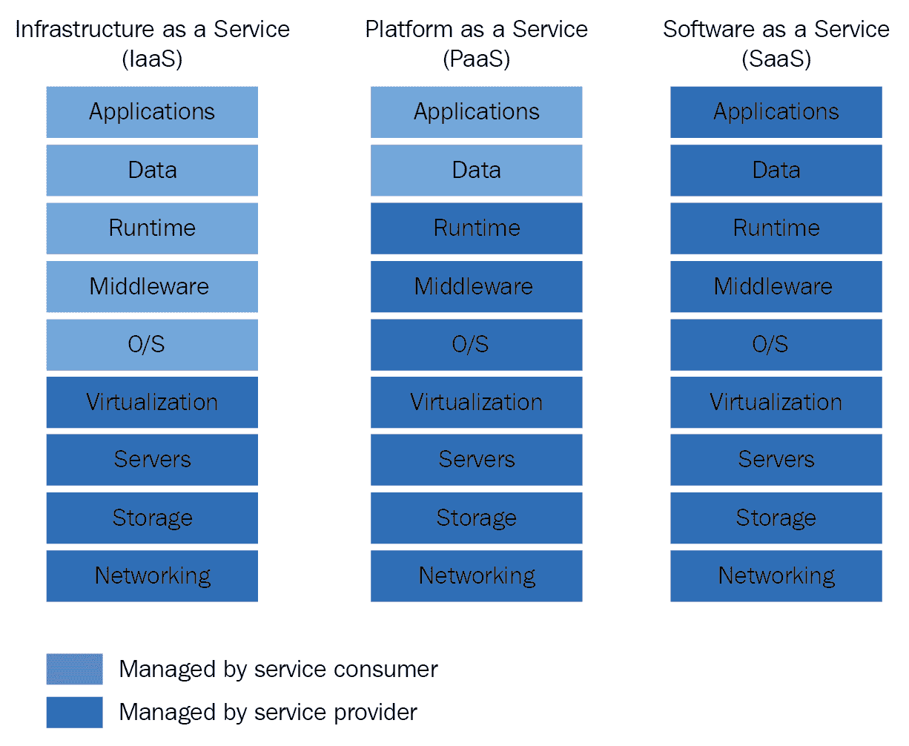
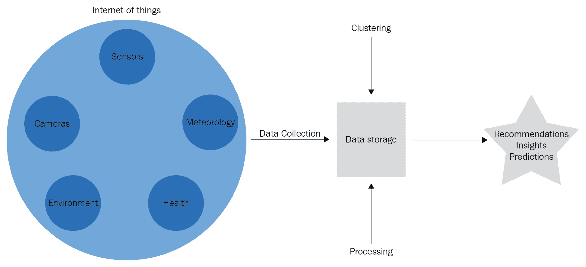
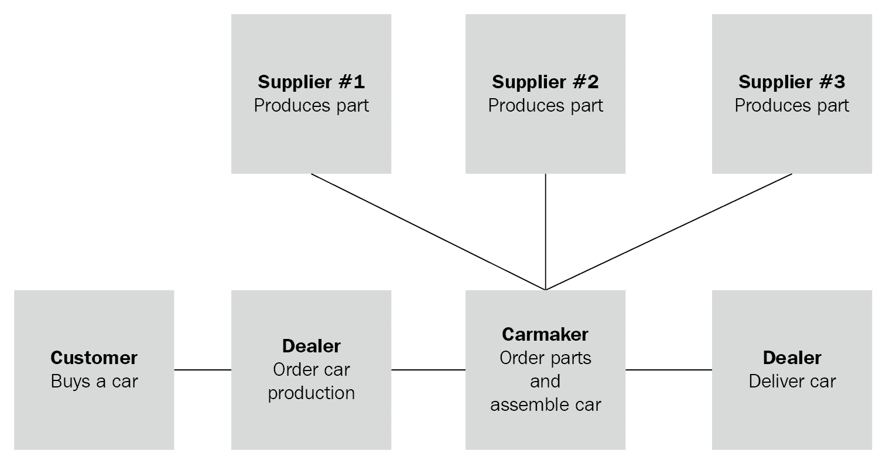
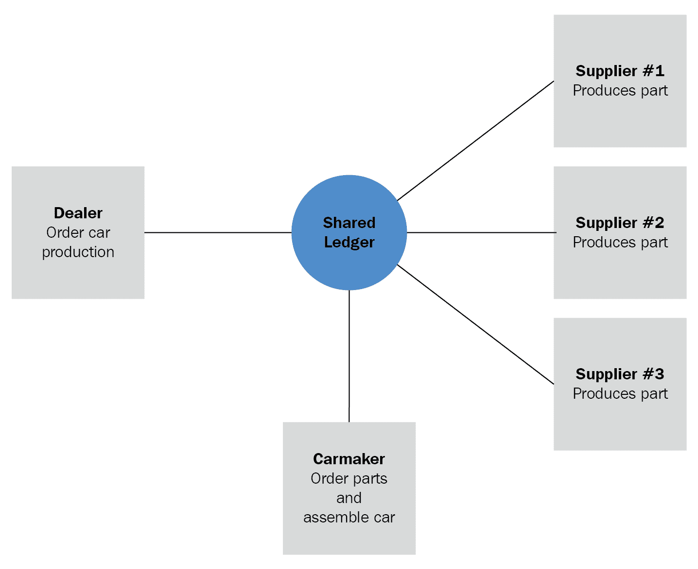

# 物联网、区块链和工业 4.0

物联网和区块链并不是推动新经济和制造革命演进的唯一技术集合。**工业 4.0** 是一个概念，发生在一个新方法、新技术和空前的计算能力的时代，任何拥有互联网接入的人都可以使用。

在本章中，我们将探讨物联网（IoT）、区块链和云计算等关键技术的作用，重点关注这些因素如何推动工业 4.0 的演进。

本章将涵盖以下主题：

+   云计算在新经济模型中的作用

+   物联网如何帮助创新产业

+   区块链作为工业 4.0 的业务平台

# 工业 4.0

工业 4.0，又称为**经济 4.0**，是一个新的制造模式的名称，其中连接性、数据收集和处理广泛应用于整个制造链中。

智能工厂与自动化工厂的区别在于，智能工厂不仅仅是自动化的；它们是连接的、可监控的、协作的。

重要的是要知道，工业 4.0 不仅与制造业有关；它可以被理解为设计新的制造模式，旨在创造更个性化和引人入胜的体验。 新模式强调拥有数据是成功的关键因素，并且在当前业务模型的交叉点上正在创建新的商业模型。 云计算、物联网、认知计算和区块链是推动这一新模式的一些技术。

# 云计算作为创新平台

云计算为创建新业务模型提供了机会，同时提供了重新设计现有业务模型的工具。 云计算为高度技术化和创新化的服务生态系统提供了简单、自助、灵活和低成本的基础设施。 与其说是处理能力，不如说云计算的作用是成为一个创新平台。 让我们深入了解云计算的世界，以了解其与工业 4.0 发展的关系和重要性。

# 云计算模型

云计算是共享计算资源的概念，包括内存、计算、网络和存储能力，用于运行应用程序。 将计算模型定义为云模型的特征包括自助式资源分配、软件定义的资源和按需付费的货币化。 这些通常以商业化的三种模型呈现：**基础设施即服务**（**IaaS**）、**平台即服务**（**PaaS**）和**软件即服务**（**SaaS**）。 此外，它们可以以公共和私有的部署模式交付：

查看前面图表中的交付模型，可以了解服务消费者应关注的能力有哪些：

+   在 **IaaS** 模型中，正如其名称所示，云服务提供商负责维护网络、存储、服务器和虚拟机组件。包括其许可证、备份、更新和升级在内的每一层都是服务承包方的责任。

+   **PaaS** 提供了另外三个层次：操作系统、中间件和运行时能力，为服务使用者提供更多的基础设施和软件许可证管理抽象；他们只需处理应用程序代码和二进制文件以及其使用的数据。

+   **SaaS** 将计算提升到更高的抽象级别：服务使用者只需使用订阅的解决方案。

IBM Cloud Public（也称为 Bluemix）提供了此处描述的所有功能。通过其控制台提供 IaaS、PaaS 和 SaaS 解决方案。你可以实例化物理或虚拟机器和应用程序运行时，并订阅服务目录中提供的任何服务，包括 IBM Watson IoT 和 IBM Blockchain 平台。

当这些模型部署在公共网络（如互联网）的多租户环境中时，称为公共云，即一个人和一家公司共享相同的资源的地方。当公司或个人在私有或公共网络的单租户环境中使用其中任何模型时，称为私有云。

# 云计算对工业 4.0 的重要性

在云计算模型出现之前，IT 部门需要经历漫长、昂贵和困难的过程才能使解决方案对其客户可用。他们必须购买服务器；等待交付；在数据中心中为其提供空间；准备网络和虚拟化；安装操作系统、中间件、数据库和运行时；然后开发应用程序并将其部署到生产环境中。

当云计算在上述场景中发生时，提供相同的计算能力并开始开发应用程序只需几分钟。你只需要支付所使用资源的费用。

在开发创新解决方案时，最小可行产品（MVP）可能不会产生预期结果，导致基础设施、平台软件和附加服务不断变化。如果创建的 MVP 不符合目标用户的需求呢？在第一种情况下，你已经支付了所需的所有资源，因此即使关闭解决方案，你已经花费了资本支出。然而，在第二种情况下（云），你只支付了服务费用，所以只是运营支出。如果解决方案非常合适，人们使用得很多呢？在第一种情况下，你必须遵循更简单（但仍然困难）的路径来提供更多资源，而在云计算中，你可以在需要时随时扩展解决方案资源，而不是一直都需要。

云计算还提供了使用物联网、认知计算、区块链和其他在互联网上创建和提供的最佳服务和技术来测试新服务和创建新应用程序的能力。这些服务是创建新解决方案和商业模式的强大工具，为客户提供不同的体验，无论使用同一服务的人数是 1、10、100 还是 100 万人。

# 物联网

正如之前所述，数据是工业 4.0 成功的关键因素。收集和分析的数据越多，预测和建议就越有说服力。

物联网不仅是一种自动化框架技术，还是从连接的设备中收集大量数据的绝佳方式。通过结合不同的数据源（机器和机器人传感器、安全摄像头、心率监测器、环境和气象数据），可以定义和分析领域，了解业务背景的当前实际情况，并对其进行更加理性的分析。还可以洞察如何变得更加高效、更加可预测和更加灵活，因为可以实时处理数据的收集，如下图所示：

处理结果也可以成为改变机器和机器人当前运行的动作的触发器，甚至可以在继续处理之前修复正在创建的产品中的缺陷，以执行自我修复任务。

# 区块链——简化业务链

随着商业模式的发展，它们往往会采用更精益的方法。在这种情况下，精益产业意味着只专注于对产品的目标客户有价值的事物。任何不为产品提供价值的程序、产品的一部分或创建产品的过程都被视为无用的，必须予以删除或更改，以便为端到端解决方案增加更多的价值。以同样的方式，智能商业模式往往只包含为业务模型增加价值和知识的步骤，这意味着在这个领域外包仍然是一件大事。如果不知道如何将端到端服务链整合到业务中，要想变得精益并不容易和廉价。

当外包或分散业务任务对模型至关重要时，区块链会发挥作用，通过提供分散任务的机会来实现。让我们看一下下面的传统汽车销售流程图：

每当客户购买一辆汽车时，经销商的账簿中都会为该汽车创建一个新条目，并向汽车制造商下订单，后者会在其账簿中创建另一个条目，并向其供应商订购零件，这也会在他们的账簿中创建订单条目。区块链通过为过程的所有利益相关者使用共享账簿来简化该过程：

该过程本身现在具有审计性并且最终产品可以被端到端地追踪，使新车主对产品的来源有所了解。

区块链实现了一个既精简又可审计的以产品为驱动的业务流程。

# 摘要

在这一章中，您了解到了在工业 4.0 背景下关键技术如云计算、物联网和区块链的重要性。

云计算是一种提供低成本、可扩展和自助技术采用的计算模型，创建了一个适合创建创新业务模式的环境。

物联网不仅是一个自动化工具包，还可以被视为数据收集和创建数字化上下文的框架，类似于真实世界的上下文；它创造了一个数字化的现实环境，模拟了与真实世界相同的条件。

区块链通过简化去中心化流程实现了精益生产线，并帮助公司集中精力发挥自身优势，而不必在不为最终产品产生聚合价值的任务上花费时间和金钱。

在下一章中，我们将研究以往项目中获得的最佳实践和经验教训，解决了我们所面临的一些问题以及如何解决这些问题。
