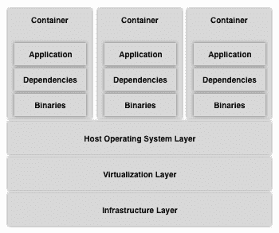
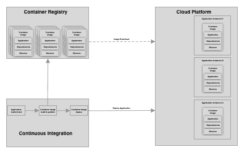
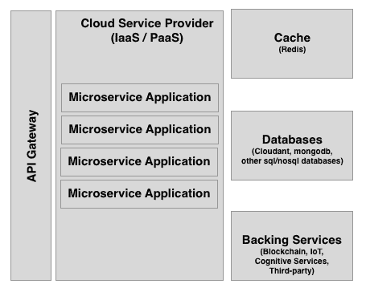

# 第九章：开发区块链和物联网解决方案的最佳实践

正如对每种新兴技术都是如此，成为早期采用者充满了挑战和需要学习的教训。本章的重点是提出一些解决方案，我们可以将其应用于现实项目中，以避免陷入麻烦。

本章将涵盖以下主题：

+   云应用的参考架构

+   如何使用 12 因素应用程序开发模型创建云原生应用程序

+   无服务器计算

+   使用 Hyperledger Composer 作为应用程序开发的加速器

# 开发云应用程序

与云应用程序相关的潜在问题很多，从资源的简单误用到无法解决的问题都有。应用简洁的架构并使用 12 因素应用程序开发模式可确保在应用程序扩展或缩减时不会陷入麻烦。

容器是将应用程序与其所有依赖项（包括其代码、运行时、中间件、库和操作系统）打包的标准化方式。Docker 和 Garden 是可以在 IBM 云平台上运行的容器，但也有其他容器类型可供使用，如 Rockt。使用容器增加了应用程序的可移植性，因此宿主操作系统是哪个特定的 Linux 发行版，以及您的应用程序是在不同的发行版上构建的都无关紧要，因为操作系统是容器化应用程序的一层，两个发行版一起交付。

以下图示了容器化应用程序的结构：

云平台使用容器化应用程序并将其部署到一组服务器中。我们可以将这些应用程序移到灵活的计算环境中，以更好地利用现有基础设施，并跟踪服务发现组件中部署的容器。

每个平台都有自己使用容器化应用程序部署模型的方式，如下图所示：

一个容器是基于容器镜像部署的，容器镜像是基本镜像、依赖项和应用程序的只读定义。每个相同应用的容器都是基于该镜像部署的，而在运行时对容器所做的任何更改仅在该容器处于活动状态时存在，并且仅适用于该容器的实例。

# 参考架构

云计算为部署应用程序创建了一个抽象的环境；我们使用虚拟运行时。这意味着我们没有位置意识，也不能保证我们的应用程序会留在同一个数据中心或虚拟机中。我们甚至不能确信应用程序的 IP 地址在 10 分钟后仍然相同。以下图表显示了使用 IBM Cloud Public（Bluemix）成功应用的云应用程序的参考架构：

云原生应用程序应该水平扩展，这意味着每当工作负载需求增加时，应用程序应该增加该应用程序的实例数量以处理新请求。同样，如果工作负载减少，应该减少应用程序实例的数量。

# 使用 12 因素应用程序模型进行开发

12 因素应用模型是一组应该遵循的实践，以使云应用程序具有可伸缩性。它为敌对的云环境变化提供支持。

该模型的 12 个原则如下：

+   **代码库：**我们的代码库在修订控制中被跟踪，并且被部署多次。

+   **依赖关系：**我们应该明确声明和隔离依赖关系。

+   **配置：**我们应该将应用程序配置参数存储在环境中。

+   **后端服务：**我们应该将后端服务视为附加资源。

+   **构建、发布、运行：**我们应该严格区分构建和运行阶段。

+   **进程：**我们应该将应用程序作为一个或多个无状态进程执行。

+   **端口绑定：**我们应该通过端口绑定导出服务。

+   **并发性：**我们应该通过进程模型进行横向扩展。

+   **可处置性：**我们应该通过快速启动和优雅关闭来最大程度地提高鲁棒性。

+   **开发/生产对等性：**我们应该尽可能地使开发、演示和生产保持相似。

+   **日志：**我们应该将日志视为事件流。

+   **管理进程：**我们应该将管理和管理任务作为一次性进程运行。

这些原则减少了与云计算相关的简单错误的数量。

您不必将所有这些概念都应用于您开发的所有云原生应用程序。例如，如果您不需要脚本来预加载数据库，则不需要应用管理进程原则。然而，如果您正在使用一个需要保持状态或与不同应用程序共享状态（如会话）的应用程序，那么使用后端服务是必不可少的，因为您永远不知道响应用户请求的容器所在的物理或虚拟计算机主机是什么。

# 无服务器计算

无服务器计算是部署模型，其中应用程序部署在环境中，但不一定始终运行。它的容器在首次执行时启动，并在请求需要执行它时保持活动。在空闲一段时间后，该应用程序的容器被停止。重要的是要注意，停止的容器需要一段时间才能启动，因此实时响应并不是无服务器应用程序的优势。

无服务器应用程序（或者像许多云服务提供商所称的云函数）是部署并附加到触发器的微服务，该触发器负责启动包含该功能的容器并运行它。触发器可以是数据库更改，传递给代理的消息，HTTP 请求或其他类型的请求。

云提供商通常根据云函数的执行持续时间和资源分配（通常是内存）收费。例如，一个云函数可能需要 500 毫秒，并使用 256MB 的内存。

一个成功的云函数不需要大量计算和大量请求（定期过程）。为了方便构建和部署无服务器应用程序过程，无服务器框架是一个不错的选择，因为它支持谷歌云、AWS、IBM 云和微软 Azure 对无服务器计算的实现。

# 使用 Hyperledger Composer 进行区块链开发

Hyperledger Composer 是 Linux Foundation 在 Hyperledger 品牌下托管的一个项目。该项目旨在创建一个框架和工具集，加速使用 Hyperledger Fabric 开发区块链应用程序，并简化与其他应用程序的集成。需要牢记的是，任何框架都意图通过抽象部分复杂性来简化解决方案的某个方面，但也会限制对所应用抽象的控制。

# Hyperledger Composer 工具包

Hyperledger Composer 并不是解决 Hyperledger Fabric 提出的所有复杂性的通用解决方案。它剥夺了一些可以自定义的任务灵活性。然而，它所做的是提供一个工具包，用于创建链码项目，构建区块链应用程序包（`.bna`文件）并将它们部署到 Hyperledger Fabric。

使用 Hyperledger Composer 开发业务网络的重点是使用项目结构和通用语言创建资产、参与者、交易、查询和访问控制列表。在创建业务网络定义之后，Composer 有工具可以将应用程序打包并部署到 Hyperledger Fabric 平台。

# Hyperledger Composer REST 服务器

为了简化与其他应用程序的集成，Hyperledger Composer 提供了 Composer REST 服务器，这是建立在 LoopBack 框架之上的 API 服务器，连接到定义的业务网络。它检索资产、交易和参与者的信息，并提供了一个 REST API 服务器和一个服务合同，以 swagger 格式描述，以便与业务网络进行交互。

Composer REST 服务器提供了许多有用的功能。最值得一看的是身份验证、多用户模式和数据源配置。

# 身份验证和多用户模式

当您创建业务应用程序时，请求进行身份验证并不少见。Composer REST 服务器提供了连接到许多身份验证和授权提供程序的手段，使用 Passport 中间件。虽然该项目声称 Passport 有超过 300 种身份验证和授权策略，但我们的经验表明，并非所有这些都能即插即用；有时，您必须创建自定义代码才能使它们正常工作。然而，我们已成功地实现了 Google、GitHub、Auth0 和 LDAP 的身份验证策略。

多用户模式允许多个参与者使用单个 Composer REST 服务器，而不是为每个参与者部署独立的 Composer REST 服务器。在这种模式下，使用主名片检索 API，但与业务网络的交互是使用其自己的名片。此模式需要启用用户身份验证。

# 数据源配置

Composer REST 服务器使用数据源存储用户会话数据。这并不意味着必须配置显式数据源；如果没有配置数据源，Composer REST 服务器将使用即插即用的内存连接器。

当使用多个 Composer REST 服务器实例以实现高可用性或负载平衡时，这些实例不共享内存，因此需要数据源。可以使用任何具有 loopback 连接器的数据源。在我们的经验中，MongoDB、Cloudant 和 Redis 可以即插即用；只需按照 Hyperledger 提供的步骤安装连接器并配置环境变量即可。

# 摘要

在本章中，我们已经了解了在云环境中开发和部署应用程序的影响。我们考虑了容器的工作原理，以及如何将容器化的应用程序部署到云平台，以及另一种模型：无服务器计算。我们还介绍了云原生应用程序开发的 12 因素模型原则。

然后，我们将 Hyperledger Composer 视为开发区块链解决方案的加速器。我们探讨了各种功能，包括使用身份验证、多用户模式和数据源配置。

这本书提供了有关使用 IBM Watson IoT 平台和 Hyperledger Compose 创建简单应用程序的信息。这些远非是唯一支持物联网和区块链解决方案的平台和工具，但概念是相同的，可以应用。如果您对使用所解释的工具进行扩展功能感兴趣，无论是 Watson IoT 还是 Hyperledger Fabric / Composer，都提供了详尽的文档以及大量社区提供的文章，但是，我们的观点是实践是了解它们是否适合特定解决方案的最佳方式，因此，即使您想学习如何使用工具包，也只需尝试一下，简单的用例是良好的教师。

# 进一步阅读

本章介绍的主题是一个概述，如果您需要更深入地了解任何主题，我们建议阅读以下参考资料：

+   12 因素应用程序方法论：[`12factor.net/`](https://12factor.net/)

+   无服务器框架：[`serverless.com/`](https://serverless.com/)

+   Hyperledger Composer：[`hyperledger.github.io/composer`](https://hyperledger.github.io/composer)
