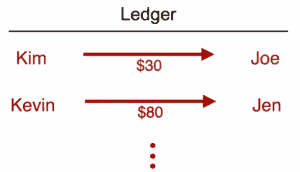
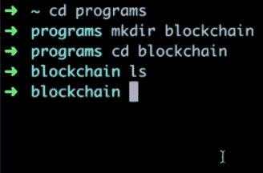
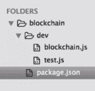

# 第一章：设置项目

欢迎来到*使用 JavaScript 学习区块链编程*。正如其名称所示，在本书中，您将学习如何使用 JavaScript 编程语言从头开始构建一个完全功能的区块链。您构建的区块链将具有类似于比特币或以太坊等生产级区块链中找到的功能。

在本书中，您将通过学习如何构建自己的区块链和理解分散网络来了解区块链技术的实际工作原理。在本书结束时，您将拥有一个托管在分散网络上的完整的区块链原型，并且您将对区块链在幕后实际工作的知识和理解有了很大的收获。

我们将在本书中创建的区块链将能够执行以下功能：

+   执行工作证明以保护区块链

+   通过挖矿过程创建新的区块

+   创建新的不可变交易

+   验证整个区块链以及每个区块内的所有数据

+   检索地址/交易/区块数据

除此之外，区块链还将具有许多其他重要功能。随着您阅读本书的更多章节，您将有机会探索这些功能。

要跟随本书，您只需要一台计算机和一些关于 JavaScript 编程语言的基本知识。

首先，在本书的介绍章节中，让我们试着了解区块链实际上是什么。这将帮助您熟悉区块链的概念，因为这是本书的先决条件。然后我们将继续学习如何设置项目来创建我们自己的区块链。

所以，让我们开始吧！

# 什么是区块链？

在本节中，让我们简要解释一下什么是区块链。简而言之，**区块链**是一个不可变的、分布式分类帐。现在，这些词可能看起来很复杂，但当我们试图解释它们时，就会很容易理解。让我们从探索分类帐的实际含义开始。分类帐只是一组财务账户或交易（或者换句话说，人们进行的交易记录）。

让我们看下面的示例，以更好地理解分类帐。在这个例子中，Kim 支付给 Joe 30 美元，Kevin 支付给 Jen 80 美元。分类帐只是用来跟踪这些交易的文件。您可以在以下截图中看到这一点：



那么，区块链不可变意味着什么？这意味着它永远不能被改变。因此，一旦交易被记录，就无法撤销。其他无法更改的因素包括发送的金额或参与交易的人。一旦交易完成，该交易的任何方面都无法更改，因为它是不可变的。

今天，我们看到许多应用程序、平台和网络都是集中化的。以 Facebook 为例。使用 Facebook 的每个人都必须相信这家公司正在保护他们的数据并且不滥用它。与此相比，区块链是不同的。区块链技术不像 Facebook、Google 或大多数其他实体那样集中化。相反，它是一个分布式网络，这意味着任何给定的区块链网络都不受单一实体控制，而是由普通人运行。比特币等区块链由全球数千人支持和托管。因此，我们的所有数据，或者在这种情况下的分类帐，不受单一公司或实体的支配。这证明了区块链技术的巨大好处，因为通过分布式，我们不必信任单一公司来保护我们的数据。相反，我们的数据由成千上万个不同的人组成的整个网络持久保存。

每个为区块链网络做出贡献的个人都被称为节点，每个节点都有相同的分类账副本。因此，分类账数据在整个网络中进行托管和同步。

因此，区块链是一个不可变的分布式分类账。这意味着这是一个分类账，其中的交易永远不会被更改，区块链本身分布在网络中，并由成千上万的独立个人、团体或节点运行。

区块链是一种非常强大的技术，尽管它仍处于起步阶段，但它的未来非常令人兴奋。区块链技术可以应用于今天的世界，使某些行业更安全、高效和可信。一些可能通过区块链技术转变的行业包括金融服务、医疗保健、信用、政府、能源行业等。几乎每个行业都可以从更安全、分布式的数据管理形式中受益。您可以看到，区块链技术目前正处于一个非常令人兴奋的阶段，许多人对它的未来充满期待。

现在我们知道了什么是区块链，让我们开始设置项目环境来构建我们的区块链。

# 你将学到什么...

本书将通过从头开始构建自己的区块链来帮助您更深入地了解区块链技术。区块链是一种相当新的技术，虽然一开始学习起来可能会有些困难和有些压倒性，但我们将采取一步一步的方法，以便了解它在底层是如何工作的。当您完成本书时，您将对区块链技术的工作原理有很扎实的理解，并且您还将构建自己的整个区块链。

在本书中，我们将首先构建区块链本身。在这一点上，我们将构建一个具有以下能力的区块链数据结构：

+   验证工作

+   挖掘新区块

+   创建交易

+   验证链

+   检索地址数据和其他功能

此后，我们将创建一个 API 或服务器，允许我们通过互联网与我们的区块链进行交互。通过我们的 API，我们将能够使用我们构建到区块链数据结构中的所有功能。

此外，您将学习创建一个去中心化网络。这意味着我们将有多个运行的服务器，作为独立的节点。我们还将确保所有节点之间正确地相互交互，并以正确的格式共享数据。此外，您将学习如何通过确保任何新创建的节点或交易都在整个网络中广播来同步整个网络。

接下来，我们将开始创建共识算法。该算法将用于确保我们整个区块链保持同步，并且该算法将用于确保我们网络中的每个节点都具有正确的区块链数据。

最后，我们将创建一个区块浏览器。这将是一个用户界面，允许我们以用户友好的方式探索我们的区块链，还将允许我们查询特定的区块交易和地址。

然而，首先，我们需要设置我们的开发环境。

# 环境设置

让我们开始构建我们的区块链项目。我们要做的第一件事是打开我们的终端，并通过在终端中输入命令来创建我们的区块链目录，如下面的屏幕截图所示：



让我们首先创建一个名为`programs`的文件夹。在这个文件夹里，让我们创建一个名为`blockchain`的目录。这个目录目前是空的。在这个`blockchain`目录里，我们将进行所有的编程。我们将在这个`blockchain`目录中构建我们的整个区块链。

现在我们的`blockchain`目录已经准备好了，我们需要做的第一件事是向其中添加一些文件夹和文件。我们想要放入目录的第一个文件夹将被称为`dev`，因此我们要确保我们在`blockchain`目录中，然后让我们在终端中输入以下命令：

```js
mkdir dev
```

在这个`dev`目录中，我们将进行大部分编码工作。这是我们将构建区块链数据结构并创建与区块链交互的 API、测试它以及完成其他类似任务的地方。接下来，在这个`dev`文件夹中，让我们创建两个文件：`blockchain.js`和`test.js`。为此，请在终端中输入以下命令：

```js
cd dev
touch blockchain.js test.js
```

在上述命令行中的`touch`命令将帮助我们创建提到的文件。`blockchain.js`文件是我们将输入代码以创建区块链的地方，`test.js`文件是我们将编写代码来测试我们的区块链的地方。

接下来，让我们通过在终端中输入以下命令返回到我们的`blockchain`目录：

```js
cd .. 
```

在`blockchain`目录中，让我们运行以下命令来创建 npm 项目：

```js
npm init 
```

运行上述命令后，您将在终端上获得一些选项。要设置项目，您只需通过这些选项按*Enter*即可。

因此，这基本上是我们需要做的一切，以便设置我们的项目文件夹结构。现在，如果您转到我们的`blockchain`目录并使用 Sublime 或 Atom（或您喜欢的任何其他文本编辑器）打开它，您将看到文件结构，如下截图所示：



`blockchain`目录包括我们刚刚创建的`dev`文件夹。在`dev`文件夹中，我们可以看到我们的`blockchain.js`和`test.js`文件。此外，当我们运行`npm init`命令时，它会为我们创建`package.json`文件。这个`.json`文件将跟踪我们的项目和我们需要的任何依赖项，使我们能够运行脚本。在后续章节中，我们将在`package.json`文件中进行更多工作，因此随着我们在本书中的进展，您将更加熟悉它。

# 项目源代码

在我们开始编写区块链之前，值得注意的是，本书的整个源代码可以在 GitHub 上找到，链接如下：[`github.com/PacktPublishing/Learn-Blockchain-Programming-with-JavaScript`](https://github.com/PacktPublishing/Learn-Blockchain-Programming-with-JavaScript)。在这个存储库中，您将找到整个项目的完成代码，并且您还将能够探索我们将在后续章节中构建的所有文件。因此，这可能是您在阅读本书时使用的一个很好的资源。

# 摘要

总结一下这个介绍性的章节，我们首先探讨了区块链的实际含义以及它的运作方式。然后我们开始设置项目以创建我们自己的区块链。我们还快速概述了本书中您将学习的所有主题。

在下一章中，我们将通过学习构造函数、原型对象、区块方法、交易方法以及许多其他重要概念来构建我们的区块链。
