# 第二章：构建区块链

在上一章中，我们了解了区块链是什么以及它的功能。此外，我们还学习了如何设置项目来构建我们的区块链。在本章中，您将开始构建区块链及其所有功能。首先，让我们使用构造函数创建区块链数据结构，然后通过向其原型添加不同类型的功能来为我们的区块链添加许多不同类型的功能。

然后，我们将赋予区块链某些功能，例如创建新的区块和交易，以及对数据和区块进行哈希的能力。我们还将赋予它进行工作证明和许多其他区块链应该具备的功能。然后，我们将通过测试添加的功能来确保区块链是完全功能的。

通过逐步构建区块链的每个部分，您将更好地了解区块链在幕后实际上是如何工作的。您还可能意识到，一旦您深入其中，创建区块链并不像听起来那么复杂。

在本章中，我们将涵盖以下主题：

+   学习如何创建区块链构造函数

+   构建和测试各种方法，如`createNewBlock`、`createNewTransaction`和`hashBlock`，以为区块链添加功能

+   了解工作证明是什么，并学习如何为我们的区块链实现它

+   创建和测试创世区块

所以，让我们开始吧！

# 在我们开始之前...

在构建区块链之前，有两个关键概念我们需要熟悉。这些重要概念如下：

+   JavaScript 构造函数

+   原型对象

# JavaScript 构造函数的解释

熟悉构造函数很重要，因为我们将使用它来构建我们的区块链数据结构。到目前为止，您一定想知道构造函数是什么，它实际上是做什么。

构造函数只是一个创建对象类并允许您轻松创建该特定类的多个实例的函数。这实际上意味着构造函数允许您非常快速地创建大量对象。由于它们都是同一类的一部分，所以创建的所有这些对象都将具有相同的属性和功能。现在，当您第一次听到这些时，所有这些可能看起来有点令人困惑，但不要担心——我们将尝试通过一个示例来理解构造函数是什么。

以 Facebook 为例。Facebook 拥有超过 15 亿用户，它们都是同一类的对象，并具有类似的属性，如姓名、电子邮件、密码、生日等。对于我们的示例，假设我们正在构建 Facebook 网站，并希望为其创建一堆不同的用户。我们可以通过创建一个`User`构造函数来实现这一点。

要学习和探索构造函数，让我们使用 Google Chrome 控制台。我们可以通过打开 Google Chrome 并简单地按下*command* + *option* + *J*（Mac 用户）或*Ctrl* + *Shift* + *I*（Windows 用户）来访问控制台。或者，我们可以简单地转到菜单选项，转到“更多工具”，然后选择“开发者工具”选项，如下截图所示：


按照上述步骤将为您打开控制台，如下截图所示：


在本示例中，我们将编写的构造函数将允许我们创建多个用户或多个用户对象，这些对象将具有相同的属性和功能。创建此`User`构造函数的代码如下所示：

```js
function User() { 

}
```

在括号`()`内，让我们传递我们希望每个`User`对象具有的属性。我们将传递诸如`firstName`、`lastName`、`age`和`gender`等属性，因为我们希望所有的用户对象都具有这些组件。

然后，我们使用`this`关键字将这些参数分配给我们的`User`对象，如下面的代码块所示：

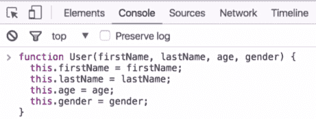

这就是我们在 JavaScript 中定义构造函数的方法。现在，通过阅读上面的代码块，你可能会想知道我们做了什么，`this`关键字是什么意思。

我们将使用这个构造函数来创建很多用户对象。`this`关键字只是简单地指向我们将要创建的每一个用户对象。现在可能看起来有点令人不知所措，但让我们通过一些例子来更清楚地理解它。

让我们开始使用我们的`User`构造函数。要创建一些`User`对象，也称为`User`实例，请按照以下步骤进行：

1.  我们要创建的第一个用户 - 让我们称之为`user1` - 将被定义如下：

```js
var user1 = new User('John','Smith',26,'male');
```

在上面的代码中，你可能已经注意到我们使用了`new`关键字来调用我们的构造函数并创建一个用户对象，这就是我们让构造函数工作的方法。

1.  然后按下*Enter*，`user1`就出现在系统中。现在，如果我们在控制台中输入`user1`，我们将能够看到我们在上一步中创建的内容：

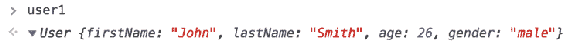

在上面的输出截图中，我们可以看到`user1`是`User`类的一个对象。我们还可以看到`user1`的`firstName`是`John`，`lastName`是`Smith`，`age`是`26`，`gender`是`male`，因为这些是我们传入构造函数的参数。

1.  为了更清晰，尝试添加一个用户。这一次，我们将创建另一个名为`user200`的用户，并将其传递到`new User()`函数中，传入用户的属性，例如名字为`Jill`，姓氏为`Robinson`，年龄为`25`，性别为`female`。

```js
var user200 = new User('Jill', 'Robinson', 25, 'female');
```

1.  按下*Enter*，我们的新`user200`将出现在系统中。现在，如果我们在控制台中输入`user200`并按下*Enter*，我们将看到以下输出：

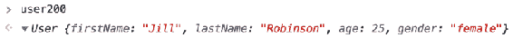

在上面的输出中，我们可以看到`user200`是`User`类的一个对象，就像`user1`一样，她的名字是`Jill`，姓氏是`Robinson`，年龄是`25`，性别是`female`，因为这些是我们传入构造函数的参数。

现在，你可能想知道我们提到的所有这些属性是如何被正确分配的。这都是由我们之前提到的`this`关键字所致。当我们创建我们的构造函数时，我们使用`this`关键字来分配属性。当涉及到构造函数时，`this`关键字不是指代它所在的函数 - 在我们的例子中是`User`函数。相反，`this`指的是将由构造函数创建的对象。

这意味着，如果我们使用构造函数来创建一个对象，我们必须确保属性和它们的对象是名字、姓氏、年龄和性别，或者无论何时你创建你的构造函数，都要将`firstName`属性设置为等于传入的`firstName`参数，并对其余属性做同样的操作。

这就是构造函数的工作原理，以及`this`关键字在构造函数中扮演的重要角色。

# 原型对象的解释

在编写区块链数据结构之前，我们需要讨论的另一个重要概念是原型对象。**原型对象**只是一个多个其他对象可以引用以获取它们需要的任何信息或功能的对象。对于我们在上一节中讨论的示例，我们的每个构造函数都将有一个原型，它们的所有实例都可以引用。让我们通过探索一些例子来尝试理解原型对象的含义。

例如，如果我们拿出我们在上一节中创建的`User`构造函数，我们可以将这些属性放在它的原型上。然后，我们所有的用户实例，如`user1`和`user200`，都将可以访问并使用该原型。让我们在`User`原型上添加一个属性并看看会发生什么。要在用户原型上添加一个属性，我们将输入以下代码：

```js
User.prototype. 
```

然后让我们在上面的代码中添加属性的名称。例如，假设我们想要一个属性电子邮件域：

```js
User.prototype.emailDomain 
```

对于我们的示例，假设 Facebook 希望每个用户都有一个`@facebook.com`的电子邮件地址，因此我们将设置电子邮件域属性如下：

```js
User.prototype.emailDomain = '@facebook.com';
```

现在让我们再次检查我们的`user1`对象：

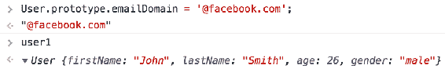

在上面的截图中，我们可以看到`user1`没有我们刚刚添加的电子邮件域属性。但是，我们可以展开`user1`对象以及它的 dunder proto，如下面的截图所示：

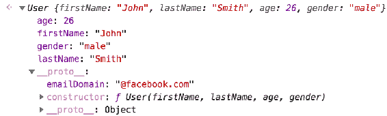

当我们这样做时，我们可以观察到我们刚刚添加的`emailDomain`属性，它被设置为`@facebook.com`。

只是为了澄清，dunder proto 和我们实际放置`emailDomain`属性的原型对象实际上并不完全相同，但非常相似。基本上，我们放在构造函数原型上的任何东西都可以访问我们使用构造函数创建的任何对象的 dunder proto。

因此，如果我们在构造函数原型上放置`emailDomain`，我们将可以在`user1` dunder proto、`user200` dunder proto 以及我们创建的任何其他用户实例的 dunder proto 上访问它。

现在让我们回到`emailDomain`属性。我们将`emailDomain`属性放在用户原型上。我们可以看到我们在实际的`user200`对象上没有该属性，但是我们在`user200`的 dunder proto 下有该属性。因此，如果我们输入以下命令，我们仍然可以访问该属性：

```js
user200.emailDomain
```

然后我们应该看到以下输出：

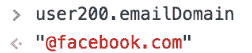

因此，这就是原型对象的工作原理。如果我们在构造函数的原型上放置一个属性，那么构造函数的所有实例都将可以访问该属性。

对于我们可能希望所有实例都具有的任何方法或函数，都适用相同的情况。让我们看另一个例子，假设我们希望所有用户实例都有一个`getEmailAddress`方法。我们可以将其放在构造函数的原型上，如下所示：

```js
User.prototype.getEmailAddress = function () { 
}    
```

现在让我们让这个`getEmailAddress`方法返回一些特定的属性，如下所示（高亮显示）：

```js
User.prototype.getEmailAddress = function () { 
 return this.firstName + this.lastName + this.emailDomain;
} 
```

现在`user1`和`user200`都应该在它们的 dunder proto 下有这个方法，所以让我们来检查一下。在我们的用户下输入，并在它们的 dunder proto 下你将看到前面的函数，如下面的截图所示：

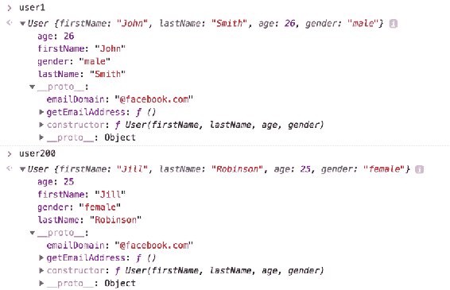

在上面的截图中，我们可以观察到`user1`和`user200`都在它们的 dunder proto 下有`getEmailAddress`方法。

现在，如果我们输入`user200.getEmailAddress`然后调用它，该方法将为我们创建 user200 的 Facebook 电子邮件地址，如下面的截图所示：


如果我们为`user1`调用该方法，类似的事情也会发生：

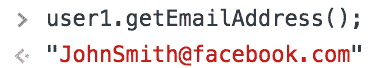

这就是我们如何使用原型对象与构造函数。如果我们希望我们的构造函数实例都具有相同的属性，或者都具有相同的方法，我们将把它放在原型上，而不是构造函数本身。这将有助于保持实例更加精简和清晰。

这是我们需要了解的所有背景信息，以便开始编写我们的区块链数据结构。在接下来的部分中，我们将通过使用构造函数和原型对象来开始构建我们的区块链。

# 区块链构造函数

让我们开始构建我们的区块链数据结构。我们将首先通过使用 Sublime 编辑器打开我们区块链目录中的所有文件。如果你习惯使用其他编辑器，也可以使用。在你喜欢的任何编辑器中打开我们整个区块链目录。

我们将在我们在第一章中创建的`dev/blockchain.js`文件中构建整个区块链数据结构，*设置项目*。让我们通过使用我们在上一节中学到的构造函数来构建这个区块链数据结构。所以，让我们开始：

对于构造函数，请键入以下内容：

```js
function Blockchain () {
}
```

目前，`Blockchain()`函数不会接受任何参数。

接下来，在我们的构造函数内部，我们将添加以下术语：

```js
function Blockchain () {
    this.chain = [];
    this.newTransactions = [];
}
```

在上面的代码块中，`[]`定义了一个数组，而`this.chain = [];`是我们的区块链的核心所在。我们挖掘的所有区块都将存储在这个特定的数组中作为一个链，而`this.newTransactions = [];`是我们将在放入区块之前创建的所有新交易的存储位置。

现在，所有这些可能看起来有点混乱和令人不知所措，但不用担心。让我们在未来的部分深入了解这一点。

在定义上述函数时，我们已经开始了创建区块链数据结构的过程。现在，你可能会想为什么我们要使用构造函数来构建我们的区块链数据结构，而不是类；答案是这只是一种偏好。在 JavaScript 中，我们更喜欢使用构造函数而不是类，因为在 JavaScript 中实际上并没有类。JavaScript 中的类只是构造函数和对象原型的一种糖衣。所以，我们更喜欢坚持使用构造函数。

但是，如果你想使用类来创建区块链，你可以像下面的代码块一样做：

```js
class Blockchain {
    constructor() {
        this.chain = [];
        this.newTransactions = [];
    }

    // Here you can build out all of the methods 
    // that we are going to write inside of this
    // Blockchain class. 

}
```

所以，无论你喜欢使用构造函数还是类，都可以正常工作。

就是这样 - 通过定义我们的函数，我们已经开始了构建我们的区块链数据结构的过程。在后续部分中，我们将继续构建。

# 构建`createNewBlock`方法

让我们继续构建我们的区块链数据结构。在上一节中定义了我们的构造函数之后，我们想要做的下一件事是在我们的`Blockchain`函数中放置一个方法。我们将要创建的这个方法将被称为`createNewBlock`。顾名思义，这个方法将为我们创建一个新的区块。让我们按照下面提到的步骤来构建这个方法：

1.  `createNewBlock`方法将定义如下：

```js
Blockchain.prototype.createNewBlock = function () { 

}
```

1.  现在我们在我们的区块链`prototype`对象上有了这个`createNewBlock`方法。这个方法将使用下面代码行中突出显示的三个参数：

```js
Blockchain.prototype.createNewBlock = function (nonce, previousBlockHash, hash) { 

}
```

我们将在后面的部分深入学习这三个参数，所以如果你对它们不熟悉，不用担心。

1.  现在，我们在`createNewBlock`方法内想要做的下一件事是创建一个`newBlock`对象。让我们定义如下：

```js
Blockchain.prototype.createNewBlock = function (nonce, previousBlockHash, hash) { 
    const newBlock = { 

 }; 

}
```

这个`newBlock`对象将成为我们`BlockChain`中的一个新区块，因此所有数据都将存储在这个区块中。这个`newBlock`对象是我们区块链的一个非常重要的部分。

1.  接下来，在`newBlock`对象上，我们将有一个`index`属性。这个`index`值基本上就是区块编号。它将描述`newBlock`在我们的链中的区块编号（例如，它可能是第一个区块）：

```js
Blockchain.prototype.createNewBlock = function (nonce, previousBlockHash, hash) { 
    const newBlock = { 
        index: this.chain.length + 1,     
    };   

}
```

1.  我们接下来的属性将是一个`timestamp`，因为我们想知道区块是什么时候创建的：

```js
Blockchain.prototype.createNewBlock = function (nonce, previousBlockHash, hash) { 
    const newBlock = { 
        index: this.chain.length + 1,
        timestamp: Date.now(),       
    };   

}
```

1.  接下来，我们要添加的属性是`transactions`。当我们创建一个新区块时，我们将希望将所有新的交易或者刚刚创建的待处理交易放入新区块中，以便它们在我们的区块链中，并且永远不会被更改：

```js
Blockchain.prototype.createNewBlock = function (nonce, previousBlockHash, hash) { 
    const newBlock = { 
        index: this.chain.length + 1,
        timestamp: Date.now(),
        transactions: this.newTransactions,          
    };   

}
```

前面突出显示的代码行表示区块中的所有交易应该是等待放入区块中的新交易。

1.  我们区块的下一个属性将是一个`nonce`，它将等于我们之前传递到函数中的`nonce`参数：

```js
Blockchain.prototype.createNewBlock = function (nonce, previousBlockHash, hash) { 
    const newBlock = { 
        index: this.chain.length + 1,
        timestamp: Date.now(),
        transactions: this.newTransactions, 
        nonce: nonce,         
    };   

}
```

现在，你可能想知道`nonce`是什么。基本上，nonce 来自于工作证明。在我们的情况下，这只是一个数字；它无关紧要。这个 nonce 基本上证明了我们通过使用`proofOfWork`方法以合法的方式创建了这个新区块。

现在所有这些可能看起来有点混乱，但不要担心——一旦我们在区块链数据结构上建立更多内容，就会更容易理解所有东西是如何一起工作的，从而创建一个功能性的区块链。所以，如果你现在不理解 nonce 是什么，不要担心。我们将在后续章节中处理这个属性，随着我们的进展，它会变得更清晰。

1.  接下来的属性将是一个`hash`：

```js
Blockchain.prototype.createNewBlock = function (nonce, previousBlockHash, hash) { 
    const newBlock = { 
        index: this.chain.length + 1,
        timestamp: Date.now(),
        transactions: this.newTransactions, 
        nonce: nonce,
        hash: hash,         
    };   

}
```

基本上，这个`hash`将是我们`newBlock`的数据。发生的情况是我们将我们的交易或者`newTransactions`传递到一个哈希函数中。这意味着我们所有的交易将被压缩成一个代码字符串，这将是我们的`hash`。

1.  最后，我们`newBlock`上的最后一个属性将是我们的`previousBlockHash`：

```js
Blockchain.prototype.createNewBlock = function (nonce, previousBlockHash, hash) { 
    const newBlock = { 
        index: this.chain.length + 1,
        timestamp: Date.now(),
        transactions: this.newTransactions, 
        nonce: nonce,
        hash: hash,
        previousBlockHash: previousBlockHash,          
    };   

}
```

这个`previousBlockHash`属性与我们的`hash`属性非常相似，只是我们的`hash`属性处理的是我们当前区块的数据哈希成一个字符串，而`previousBlockHash`属性处理的是我们上一个区块或者当前区块的上一个区块的数据哈希成一个字符串。

因此，`hash`和`previousBlockHash`都是哈希。唯一的区别是`hash`属性处理的是当前区块的数据，而`previousBlockHash`属性处理的是上一个区块的数据的哈希。这就是如何创建一个新区块，这就是我们区块链中每个区块的样子。

1.  继续我们的`createNewBlock`方法，我们接下来要做的是将`this.newTransaction`设置为空数组，如下所示：

```js
Blockchain.prototype.createNewBlock = function (nonce, previousBlockHash, hash) { 
    const newBlock = { 
        index: this.chain.length + 1,
        timestamp: Date.now(),
        transactions: this.newTransactions, 
        nonce: nonce,
        hash: hash,
        previousBlockHash: previousBlockHash,          
    };

    this.newTransaction = [];  

}
```

我们这样做是因为，一旦我们创建了新的区块，我们就将所有新的交易放入`newBlock`中。因此，我们希望清空整个新交易数组，以便我们可以为下一个区块重新开始。

1.  接下来，我们要做的就是将我们创建的新区块推入我们的链中，然后我们将返回`newBlock`：

```js
Blockchain.prototype.createNewBlock = function (nonce, previousBlockHash, hash) { 
    const newBlock = { 
        index: this.chain.length + 1,
        timestamp: Date.now(),
        transactions: this.newTransaction, 
        nonce: nonce,
        hash: hash,
        previousBlockHash: previousBlockHash,          
    };

    this.newTransaction = [];
    this.chain.push(newBlock);    

    return newBlock; 
}
```

通过添加这最后两行代码，我们的`createNewBlock`方法已经准备好了。基本上，这个方法在高层次上所做的就是创建一个新区块。在这个区块内，我们有我们的交易和自上一个区块被挖掘以来创建的新交易。创建了新区块后，让我们清空新交易，将新区块推入我们的链中，然后简单地返回我们的新区块。

# 测试`createNewBlock`方法

现在让我们测试我们在前面部分创建的`createNewBlock`方法：

1.  我们需要做的第一件事是导出我们的`Blockchain`构造函数，因为我们将在我们的`test.js`文件中使用这个函数。因此，为了导出构造函数，我们将转到`blockchain.js`文件的底部，输入以下代码行，然后保存文件：

```js
module.exports = Blockchain;
```

1.  接下来，转到`dev/test.js`文件，因为这是我们将测试`createNewBlock`方法的地方。现在，在`dev/test.js`文件中，我们要做的第一件事是导入我们的`Blockchain`构造函数，因此输入以下内容：

```js
const Blockchain = require('./blockchain');
```

上述代码行只是需要或调用`blockchain.js`文件。

# 测试 Blockchain 构造函数

让我们按照以下方式测试 Blockchain 构造函数：

1.  让我们创建一个`Blockchain`构造函数的实例，因此我们将添加以下代码行：

```js
const bitcoin = new Blockchain();
```

1.  上一行代码中的`bitcoin`变量只是用作示例。然后我们添加以下代码行：

```js
console.log(bitcoin); 
```

通过上述代码行，`bitcoin`应该是我们的区块链。目前这里没有数据或区块，但它应该作为一个区块链记录出来。让我们保存`test.js`文件并运行测试，观察终端窗口上的输出。

1.  现在转到我们的终端窗口。在这里，我们目前在`blockchain`目录中，我们的`test.js`文件在我们的`dev`文件夹中，因此在终端中输入以下命令：

```js
node dev/test.js
```

上述代码行将允许我们运行我们编写的测试来测试我们的`Blockchain`构造函数。

1.  现在按下*Enter*，我们将在终端窗口上观察`Blockchain`，如下截图所示：

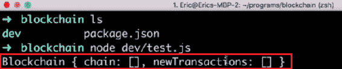

从上述截图的输出中，我们可以观察到`Blockchain`有一个空的链和一个空的交易数组。这正是我们预期的输出。

# 测试 createNewBlock 方法

让我们按照以下步骤测试 createNewBlock 方法：

1.  首先，在我们创建`bitcoin`变量的地方下面，输入以下突出显示的代码行：

```js
const Blockchain = require('./blockchain');

const bitcoin = new Blockchain();

bitcoin.createNewBlock();

console.log(bitcoin); 
```

1.  这个`createNewBlock()`方法需要三个参数，比如`nonce`、`previousBlockHash`和`hash`。为了测试目的，我们现在可以随便传入一些值。这里，nonce 只是一个数字。然后我们将为我们的`previousBlockHash`创建一个虚拟哈希，然后为我们的`hash`参数创建另一个哈希，如下所示：

```js
bitcoin.createNewBlock(2389,'OIUOEREDHKHKD','78s97d4x6dsf');
```

现在，我们正在创建我们的`bitcoin`区块链，然后在我们的比特币区块链中创建一个新区块。当我们退出比特币区块链时，我们应该有一个区块。

1.  保存此文件并在终端中再次运行我们的`test.js`文件。然后您将观察到以下输出：

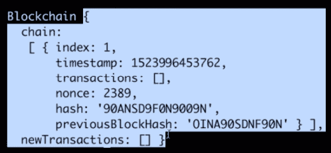

在上述截图中，您可以观察到`chain`数组中的整个区块链数据结构。它里面有一个区块，或者说一个对象。这个区块还有我们传递的`hash`、`nonce`和`previousBlockHash`参数。它还有`timestamp`和`index`为`1`。它没有交易，因为我们还没有创建任何交易。因此，我们可以得出结论，`createNewBlock`方法运行正常。

1.  现在让我们通过在我们的链中创建更多的区块来进一步测试我们的方法。让我们多次复制以下代码行，然后尝试更改其中的值：

```js
bitcoin.createNewBlock(2389,'OIUOEREDHKHKD','78s97d4x6dsf');
```

1.  复制代码并更改值后保存文件。现在，当我们运行`test.js`文件时，我们应该在我们的链中有三个区块，如下截图所示：

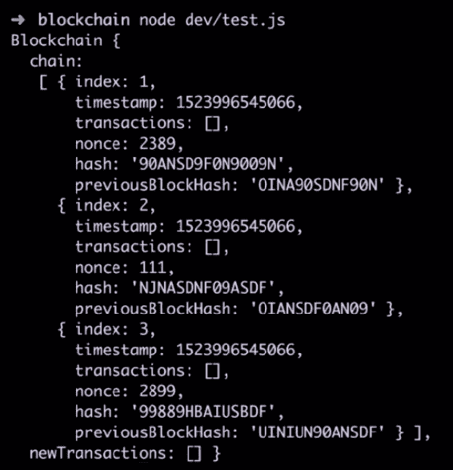

在上述截图中，您可能已经观察到`chain`数组中的三个区块。这些都是我们用`createNewBlock`方法创建的所有区块。

# 构建 getLastBlock 方法

现在，我们要添加到我们的`Blockchain`构造函数中的下一个方法将是`getLastBlock`。这个方法将简单地返回我们区块链中的最后一个块。按照下面提到的步骤来构建这个方法：

1.  转到我们的`dev/blockchain.js`文件，在我们的`createNewBlock`方法之后添加以下内容：

```js
Blockchain.prototype.getLastBlock = function () { 

}
```

1.  在`getLastBlock`方法中，我们将输入以下突出显示的代码行：

```js
Blockchain.prototype.getLastBlock = function () { 
    return this.chain[this.chain.length - 1];

}
```

在上述代码中的`[this.chain.length - 1];`定义了链中块的位置，在我们的情况下是前一个块，因此通过`1`进行否定。这个方法简单明了，我们将在后面的章节中使用它。

# 创建`createNewTransaction`方法

我们要添加到我们的区块链构造函数中的下一个方法是`createNewTransaction`。这个方法将为我们创建一个新的交易。让我们按照下面提到的步骤来创建这个方法：

1.  通过在我们的`getLastBlock`方法之后添加以下代码来开始构建这个方法：

```js
Blockchain.prototype.createNewTransaction = function () {

}
```

1.  `function ()`将接收三个参数，如下所示：

```js
Blockchain.prototype.createNewTransaction = function (amount, sender, recipient) {

}
```

这三个参数的作用如下：

+   `amount`：此参数将接收交易金额或此交易发送的金额。

+   `sender`：这将接收发件人的地址。

+   `recipient`：这将接收收件人的地址。

1.  我们在`createNewTransaction`方法中要做的下一件事是创建一个交易对象。因此，将以下代码添加到我们的方法中：

```js
const newTransaction = {

}
```

1.  这个对象将有三个属性。它将有一个`amount`，一个`sender`和一个`recipient`。这些都是我们传递给`function()`的相同三个参数。因此，输入以下内容：

```js
Blockchain.prototype.createNewTransaction = function (amount, sender, recipient) {
    const newTransaction = {
        amount: amount,
 sender: sender,
 recipient: recipient,
    };

}
```

这就是我们的交易对象将会是什么样子。我们在`Blockchain`上记录的所有交易都将看起来像这样。它们都将有一个金额，一个发件人和一个收件人，这非常简单明了。

1.  我们现在要做的下一件事是将这个`newTransaction`数据推送到我们的`newTransactions`数组中。让我们在`newTransaction`对象之后添加以下代码来实现这一点：

```js
this.newTransactions.push(newTransaction);
```

因此，我们刚刚创建的新交易现在将被推送到我们的`newTransactions`数组中。

现在，让我们试着理解一下这个`newTransactions`数组实际上是什么。基本上，这个`newTransactions`数组在我们的区块链上会有很多人进行很多不同的交易。他们将会把钱从一个人发送到另一个人，这将会重复发生。每当创建一个新交易时，它都会被推送到我们的`newTransactions`数组中。

然而，这个数组中的所有交易实际上并没有被确定下来。它们实际上还没有被记录在我们的区块链上。当挖掘新块时，也就是创建新块时，所有这些新交易基本上只是待处理交易，并且尚未被验证。当我们使用`createNewBlock`方法创建新块时，它们将被验证，确定下来，并记录在我们的区块链上。

在我们的`createNewBlock`方法中，您可以观察到在`transactions: this.newTransactions`中，我们将新块上的交易设置为`newTransactions`或我们区块链中的待处理交易。您可以将我们区块链上的`newTransactions`属性视为待处理交易属性。

为了方便参考，让我们实际上将代码中的所有`newTransactions`属性更改为`pendingTransactions`属性。总的来说，当创建新交易时，它被推送到我们的`pendingTransactions`数组中。然后，当挖掘新块或创建新块时，我们的所有待处理交易都会记录在我们的区块链上，然后它们就被确定下来，永远不能被更改。

所有这一切的重点是，在我们的方法结束之前，我们希望返回我们将能够找到新交易的区块，因为当新交易被挖掘时，我们的新交易将在下一个区块中。因此，我们只需输入以下代码：

```js
this.newTransactions.push(newTransaction);
return.this.getlastBlock()['index'] + 1;
```

在上述代码中，`this.getlastBlock()`为我们返回一个区块对象。我们想要获取这个区块的 index 属性 - 添加`['index']`将为我们提供链中最后一个区块的索引，添加`+ 1`将为我们提供我们的交易被推送到的区块的编号。

让我们快速回顾一下，`createNewTransaction`方法只是创建一个`newTransaction`对象，然后我们将`newTransaction`推送到我们的`pendingTransactions`数组中。最后，我们返回`newTransaction`将被添加到的区块的编号。

# 测试 createNewTransaction 方法

让我们测试在上一节中创建的`createNewTransaction`方法。提醒一下：这一节将会非常有趣，因为在这里你将真正开始理解区块链有多强大，以及区块和交易是如何相互作用的。您还将学习交易如何记录在区块链中。所以让我们开始吧：

1.  我们将在我们的`test.js`文件中测试我们的`createNewTransaction`方法。在这个文件中，我们已经需要了我们的`blockchain.js`文件，并创建了一个名为`bitcoin`的`Blockchain`的新实例，我们在文件末尾记录了它。快速查看以下截图：

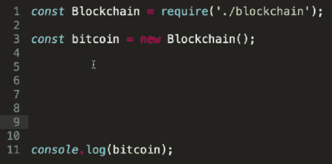

1.  现在，在我们的`test.js`文件中，我们要做的第一件事是使用我们的`createNewBlock`方法创建一个新的区块，类似于我们在*测试 createNewBlock 方法*部分所做的。在您的`test.js`文件中输入以下内容：

```js
bitcoin.createNewBlock(789457,'OIUOEDJETH8754DHKD','78SHNEG45DER56');
```

1.  接下来，我们要做的是创建一些新的交易来测试我们的`createNewTransaction`方法。这个`createNewTransaction`方法接受三个参数，比如`amount`，`sender`和`recipient`。让我们将这个交易数据添加到我们的测试用例中：

```js
bitcoin.createNewTransaction(100,'ALEXHT845SJ5TKCJ2','JENN5BG5DF6HT8NG9');
```

在上述代码行中，我们将交易金额设置为`100`，发送方和接收方的地址设置为一些随机哈希数。

您可能已经注意到地址中的`ALEX`和`JEN`的名称。我们添加这些只是为了简化发送方和接收方的识别。实际上，您很可能不会在地址开头看到这种名称。我们这样做是为了更容易地引用这些地址。

现在，让我们快速总结一下我们在测试用例中到目前为止所做的事情。看一下以下代码块：

```js
const Blockchain = require('./blockchain');

const bitcoin = new Blockchain();

bitcoin.createNewBlock(789457,'OIUOEDJETH8754DHKD','78SHNEG45DER56');

bitcoin.createNewTransaction(100,'ALEXHT845SJ5TKCJ2','JENN5BG5DF6HT8NG9');

console.log(bitcoin); 
```

在上述代码中，我们首先需要了比特币区块链，然后创建了一个新的区块。之后，我们创建了一个新的交易，然后记录了比特币区块链。

当我们运行这个`test.js`文件时，我们应该期望看到我们的比特币区块链，它应该有一个链中的区块以及`pendingTransactions`数组中的一个交易，因为我们在创建交易后还没有挖掘或创建新的区块。让我们保存这个文件并运行它看看我们得到什么。

1.  现在转到您的终端窗口，输入以下命令，然后按*Enter*：

```js
node dev/test.js 
```

我们可以在终端窗口上观察比特币区块链，如下截图所示：

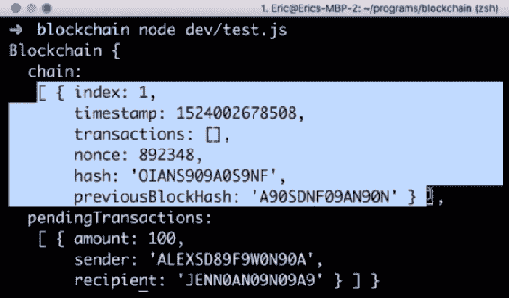

在您的窗口输出和上述截图中，您可以观察到我们的链，其中有我们创建的一个区块。在我们的`pendingTransactions`数组中，我们有一个待处理的交易，这是我们在测试用例中创建的交易。从测试的输出来看，我们可以得出结论，到目前为止，我们的`createNewTransaction`方法运行正常。

# 向我们的区块链添加待处理交易

现在让我们试着理解如何将`pendingTransaction`放入我们实际的`chain`中。我们这样做的方式是通过挖掘一个新的区块或创建一个新的区块。现在就让我们这样做：

1.  在创建`newTransaction`之后，让我们使用`createNewBlock`方法创建一个新的区块，如下面的代码所示：

```js
const Blockchain = require('./blockchain');

const bitcoin = new Blockchain();

bitcoin.createNewBlock(789457,'OIUOEDJETH8754DHKD','78SHNEG45DER56');

bitcoin.createNewTransaction(100,'ALEXHT845SJ5TKCJ2','JENN5BG5DF6HT8NG9');

bitcoin.createNewBlock(548764,'AKMC875E6S1RS9','WPLS214R7T6SJ3G2');

console.log(bitcoin);
```

我们所做的是创建一个区块，创建一个交易，然后挖掘一个新的区块。现在我们创建的交易应该出现在我们的第二个区块中，因为我们在创建交易后挖掘了一个区块。

1.  现在保存文件并再次运行测试。让我们看看从中得到了什么。去你的终端，再次输入`node dev/test.js`命令并按*Enter*。你将看到以下截图中显示的输出：

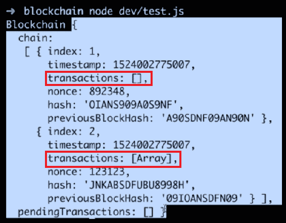

在这里，我们再次拥有了我们的整个区块链，其中有两个区块，因为我们挖掘了两个区块。这个链有我们的第一个区块（索引：1），其中没有交易，还有我们的第二个区块（索引：2），在其中，如果你看我们的交易，它说有一个包含项目的数组，而第一个区块的交易数组中没有项目。

1.  现在仔细看看第二个区块的交易数组。我们应该期望看到我们之前创建的交易。让我们对我们的测试案例进行以下突出显示的修改：

```js
const Blockchain = require('./blockchain');

const bitcoin = new Blockchain();

bitcoin.createNewBlock(789457,'OIUOEDJETH8754DHKD','78SHNEG45DER56');

bitcoin.createNewTransaction(100,'ALEXHT845SJ5TKCJ2','JENN5BG5DF6HT8NG9');

bitcoin.createNewBlock(548764,'AKMC875E6S1RS9','WPLS214R7T6SJ3G2');

console.log(bitcoin.chain[1]);
```

1.  在这个修改中，我们只是登出了我们链中的第二个区块。代码中的`[1]`定义了第二个区块的位置。保存这个文件并运行它。在输出中，你可以观察到我们只是登出了我们链中的第二个区块，并且你可以看到，对于交易，它有一个包含一个对象的数组。查看以下截图：

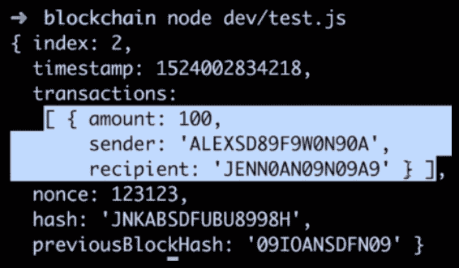

这个对象是我们在测试中创建的交易。我们在这里所做的就是创建一个交易，然后通过创建一个新的区块或挖掘一个新的区块来挖掘它，现在我们的交易就在其中了。

现在，让我们进行几个更多的示例，以帮助澄清这里发生了什么。让我们在`createNewBlock`方法之后再次复制并粘贴`createNewTransaction`方法三次。根据需要修改金额。

这里发生的情况是，从顶部开始，我们首先创建一个区块，然后创建一个交易。然后我们创建或挖掘一个新的区块，所以我们应该有一个没有交易的区块和另一个有一个交易的区块。在创建第二个区块后，我们创建了另外三个新的交易。此时，这三个新的交易应该都在我们的`pendingTransactions`数组中，因为我们在创建这三个交易后没有创建新的区块。最后，我们再次登出我们的比特币区块链。你的测试现在应该类似于以下内容：

```js
const Blockchain = require('./blockchain');

const bitcoin = new Blockchain();

bitcoin.createNewBlock(789457,'OIUOEDJETH8754DHKD','78SHNEG45DER56');

bitcoin.createNewTransaction(100,'ALEXHT845SJ5TKCJ2','JENN5BG5DF6HT8NG9');

bitcoin.createNewBlock(548764,'AKMC875E6S1RS9','WPLS214R7T6SJ3G2');

bitcoin.createNewTransaction(50,'ALEXHT845SJ5TKCJ2','JENN5BG5DF6HT8NG9');
bitcoin.createNewTransaction(200,'ALEXHT845SJ5TKCJ2','JENN5BG5DF6HT8NG9');
bitcoin.createNewTransaction(300,'ALEXHT845SJ5TKCJ2','JENN5BG5DF6HT8NG9');

console.log(bitcoin);
```

现在，如果我们保存文件并运行它，我们应该在我们的链中有两个区块，并且在`pendingTransactions`数组中也应该有三个交易。让我们看看我们在这里得到了什么。你将在屏幕上看到以下输出：

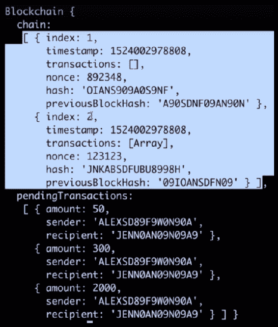

在上面的截图中，你可以看到我们的区块链。在这个链中，我们有两个区块，就像我们期望的那样，并且在我们的`pendingTransactions`数组中，我们有三个交易，这就是我们在测试文件中创建的三个交易。

接下来我们要做的是将这些待处理的交易放入我们的链中。为此，让我们挖掘另一个区块。只需在我们创建的三个交易后复制并粘贴`creatNewBlock`方法，并根据需要修改其参数。当我们现在运行测试时，这三个待处理的交易应该出现在我们的新区块中。保存文件并运行测试。你将看到以下输出：

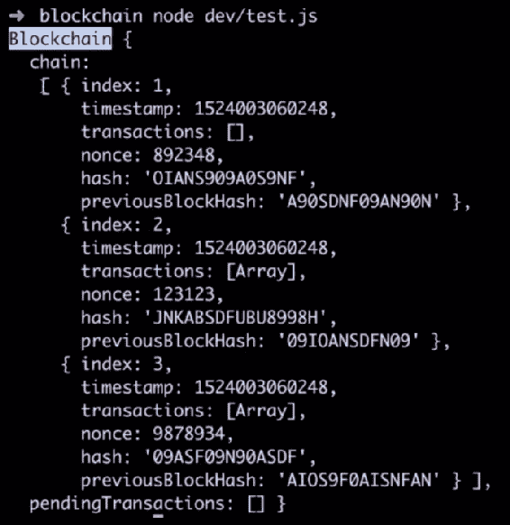

所以，我们有我们的区块链，其中有三个区块。我们的`pendingTransactions`数组目前是空的，但是那三笔交易去哪了呢？事实证明，它们应该在我们创建的最后一个区块中，也就是索引：3 区块。在这第三个区块中，我们有我们的交易，应该是我们刚刚创建的三笔交易。让我们通过对我们测试代码的最后一行进行微小修改来更深入地了解一下，即`console.log(bitcoin.chain[2]);`。这里的值`2`指定了链中的第三个区块。让我们保存这个修改并再次运行测试。你将看到链中的第三个区块：

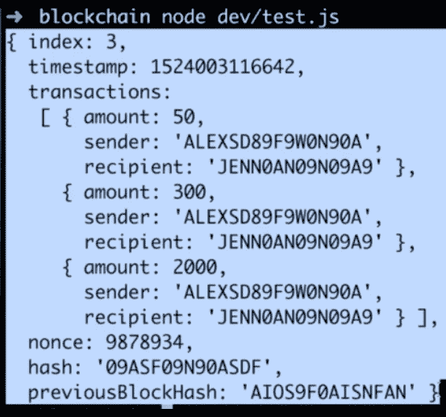

在交易数组中，你可以看到我们有我们创建的所有三个交易。这就是我们的`createNewTransaction`和`createNewBlock`方法是如何一起工作的。

如果你对这两种方法如何工作或它们如何一起工作有困难，我们鼓励你在`test.js`文件中进行一些实验，创建一些新的区块，创建一些新的交易，记录一些不同的信息，并对这些事情如何工作有一个很好的理解。

# 对数据进行哈希处理

我们将要看的下一个方法并添加到我们的区块链数据结构中的是`hashBlock`。这个`hashBlock`方法将接收我们的区块并将其数据哈希成一个固定长度的字符串。这个哈希数据将会是随机的。

实质上，我们将把一些数据块传递到这个哈希方法中，作为返回我们将得到一个固定长度的字符串，这个字符串将简单地是从我们传入的数据或我们传入的区块生成的哈希数据。

要将`hashBlock`方法添加到我们的区块链数据结构中，请在我们的`createNewTransaction`方法之后输入以下代码行：

```js
Blockchain.prototype.hashBlock = function(blockdata) {

}
```

在我们的`hashBlock`方法中，`blockdata`将是我们要生成哈希的区块数据的输入数据。

那么，我们如何将一个或多个数据块转换为哈希字符串呢？为了生成哈希数据，我们将使用一个名为**SHA256**的哈希函数。

# 理解 SHA256 哈希函数

**SHA256**哈希函数接收任何文本字符串，对该文本进行哈希处理，并返回一个固定长度的哈希字符串。

要更好地了解哈希数据的样子，请访问[`passwordsgenerator.net/sha256-hash-generator/`](https://passwordsgenerator.net/sha256-hash-generator/)。这是一个哈希生成器。如果你在文本框中输入任何文本，你将得到哈希数据作为输出。

例如，如果我们将`CodingJavaScript`放入文本框中，返回给我们的哈希看起来像以下截图中突出显示的那样：

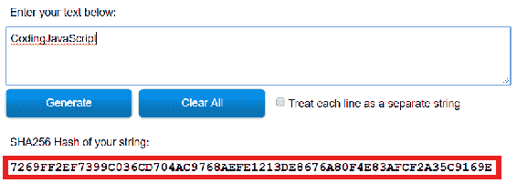

在前面的截图中我们可以观察到的输出哈希看起来是随意的，因此有助于保持数据的安全。这就是为什么 SHA256 哈希如此安全的原因之一。

现在，如果我们在输入字符串中添加另一个字符，或者以任何方式改变我们的输入字符串，整个输出哈希将完全改变。例如，如果我们在输入字符串的末尾添加一个感叹号，输出哈希将完全改变。你可以在以下截图中观察到这一点：

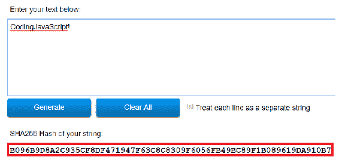

你可以尝试通过在输入字符串的末尾添加新字符来进行实验。你会观察到随着我们添加或删除字符，整个输出哈希每次都会发生巨大的变化，从而生成新的随机模式。

你可能想观察与 SHA256 哈希相关的另一件事是，对于任何给定的输入，输出将始终相同。例如，对于我们的输入字符串`codingJavaScript!`，你将始终得到与之前截图中显示的相同的哈希输出。这是 SHA256 哈希的另一个非常重要的特性。对于任何给定的输入，从该输入返回的输出或哈希将始终相同。

因此，这就是 SHA256 哈希的工作原理。在下一节中，我们将在我们的`hashBlock`方法中实现 SHA256 哈希函数。

# hashBlock 方法

让我们构建我们的`hashBlock`方法。在这个方法中，我们要使用 SHA256 哈希来哈希我们的区块数据。按照下面提到的步骤进行：

1.  使用 SHA256 哈希函数，将其作为 npm 库导入。要做到这一点，去谷歌搜索栏中输入 SHA256，或访问[`www.npmjs.com/package/sha256`](https://www.npmjs.com/package/sha256)。在这个网站上，你将看到我们需要在终端中输入的命令。我们需要在终端中输入以下命令：

```js
npm i sha 256--save
```

1.  完成后，按*Enter*。在以下命令中的`--save`将保存此库作为我们的依赖项。现在，在我们的区块链文件结构中，你可能会看到`node_modules`文件夹已经出现。在这个文件夹中，我们下载了 SHA256 库和所有其他依赖项。

1.  要使用这个 SHA256 库，我们需要将库导入到我们的代码中，这样我们才能使用它。在我们的代码开头，输入以下行：

```js
const sha256 = require('sha256');  
```

上述代码行指定了我们在`blockchain.js`文件中存储的 SHA256 哈希函数，存储为变量 SHA256。通过导入它，我们可以在我们的`hashBlock`方法中使用它。

1.  现在，在我们的`hashBlock`方法中要做的第一件事是更改它所接受的参数。我们将用`previousBlockHash`、`currentBlockData`和`nonce`替换`blockData`参数：

```js
Blockchain.prototype.hashBlock = function(previousBlockHash, currentBlockData, nonce) {

}
```

这三个参数将是我们在`hashBlock`方法中要进行哈希的数据。所有这些数据将来自我们链中的一个单一区块，我们将对这些数据进行哈希，本质上是对一个区块进行哈希。然后我们将得到一个哈希字符串作为返回。

1.  我们要做的第一件事是将所有这些数据转换为单个字符串，因此在我们的`hashBlock`方法中添加以下代码行：

```js
const dataAsString = previousBlockHash + nonce.tostring()+ JSON.stringify( currentBlockData);
```

在上述代码中，`previousBlockHash`已经是一个字符串。我们的 nonce 是一个数字，所以我们将使用`toString`将其更改为字符串。此外，我们的`currentBlockData`将是一个对象，一个包含我们的交易或某种 JSON 数据的数组。它将是一个数组或一个对象，`JSON.stringify`将简单地将该数据（以及任何对象或数组）转换为字符串。一旦运行了整行代码，我们将简单地将所有传递的数据连接成一个单一的字符串。

1.  现在，我们要做的下一件事是创建我们的哈希，如下所示：

```js
const hash = sha256(dataAsString);
```

这是我们从区块或我们传递给函数的所有区块数据中创建哈希的方法。

1.  我们要做的最后一件事就是简单地返回哈希，因此在完成这个方法之前，添加以下内容：

```js
return hash;
```

这是我们的`hashBlock`方法将如何工作。在接下来的部分中，我们将测试这个方法，看看它是否完美地工作。

# 测试 hashBlock 方法

让我们在`test.js`文件中测试我们的`hashBlock`方法。与我们在之前的部分中所做的类似，在我们的`test.js`文件中，我们应该导入我们的区块链数据结构，创建一个新的区块链实例，并将其命名为`bitcoin`。现在，让我们测试我们的`hashBlock`方法：

1.  为此，在我们的`test.js`文件中输入以下突出显示的代码行：

```js
const Blockchain = require ('./blockchain'); 
const bitcoin = new Blockchain (); 

bitcoin.hashBlock();
```

1.  我们的`hashBlock`方法需要三个参数：`previousBlockHash`、`currentBlockData`和`nonce`。让我们在调用`hashBlock`方法的部分之前定义这些变量。我们将从定义`previousBlockHash`开始：

```js
const previousBlockHash = '87765DA6CCF0668238C1D27C35692E11';
```

目前，这个随机字符串/哈希数据将作为我们的`previousBlockHash`的输入。

1.  接下来，我们创建`currentBlockData`变量。这个`currentBlockData`将简单地是一个包含在这个区块中的所有交易的数组。我们将简单地使用这个区块中的交易作为我们的`currentBlockData`，所以在这个数组中，我们将不得不创建一些交易对象，如下所示：

```js
const currentBlockData = [
    {
        amount: 10,
        sender: 'B4CEE9C0E5CD571',
        recipient: '3A3F6E462D48E9',  
    }  
]
```

1.  接下来，至少复制这个交易对象三次，以在数组中创建更多的交易对象，然后根据需要对数据进行修改，目的是改变金额和寄件人和收件人的地址。这将使我们的`currentBlockData`成为一个包含三个交易的数组。

1.  最后，我们必须在我们的`hashBlock`方法中分配`nonce`值：

```js
const nonce = 100;
```

1.  在定义了这些变量之后，我们调用`hashBlock`方法，并传递`previousBlockHash`和`currentBlockData`参数，以及`nonce`：

```js
bitcoin.hashBlock(previousBlockHash, currentBlockData, nonce );
```

1.  此外，让我们尝试将结果推送到终端窗口，以便我们可以观察它。为了做到这一点，我们将不得不对我们之前的代码进行一些微小的修改：

```js
console.log(bitcoin.hashBlock(previousBlockHash, currentBlockData, nonce));
```

在这个测试案例中，我们使用所有正确的参数调用我们的`hashBlock`方法。当我们运行这个文件时，我们应该能够在终端窗口观察到哈希值。

1.  现在保存这个`test.js`文件并运行它，检查我们是否得到了我们期望的输出。

1.  打开你的终端窗口，输入`node dev/test.js`命令，让我们观察一下结果。你将能够观察到与我们的`hashBlock`方法输出相似的结果哈希值。

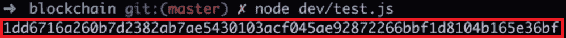

看起来我们的`hashBlock`方法工作得相当好。

1.  尝试更仔细地探索一下`hashBlock`方法。正如前一节所解释的，如果我们改变传递给`hashBlock`方法的一些数据，将会完全改变我们返回的哈希值。

1.  现在尝试通过更改寄件人或收件人地址中的一个字母来测试数据哈希的这个特性。然后保存文件，并再次使用`node dev/test.js`运行它。你将观察到一个完全不同的哈希数据作为输出，如下所示：

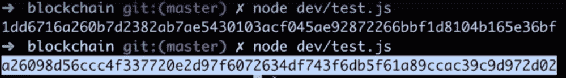

在上面的截图中，你可以观察到哈希数据和它们之间的差异。

现在，如果我们撤销了对寄件人或收件人地址所做的更改，并再次运行我们的哈希方法，我们将能够观察到与我们最初得到的相同的哈希值。这是因为我们传递的数据与第一次相同。你可以尝试尝试改变数据并观察输出，以进一步探索`hashBlock`方法。

经过这个测试，我们可以得出结论，我们的`hashBlock`方法完美地工作。

# 什么是工作证明？

接下来，我们要添加到我们的区块链数据结构中的方法是`proofOfWork`方法。这个方法对于区块链技术非常重要和必要。正是因为这个方法，比特币和许多其他区块链才如此安全。

现在，你一定对**工作量证明**（PoW）是什么感到好奇。如果我们看一下我们的区块链，每个区块链基本上都是一个区块列表。每个区块都必须被创建并添加到链中。然而，我们不希望随便创建并添加任何区块到链中。我们希望确保每个添加到链中的区块都是合法的，具有正确的交易和正确的数据。这是因为如果它没有正确的交易或正确的数据，那么人们可能会伪造自己拥有多少比特币，并从其他人那里窃取钱财。因此，每次创建新的区块时，我们首先必须通过 PoW 来确保它是一个合法的区块。

`proofOfWork`方法将接收`currentBlockData`和`previousBlockHash`。从我们提供的数据中，`proofOfWork`方法将尝试生成一个特定的哈希。在我们的示例中，这个特定的哈希将以四个零开头。因此，通过给定的`currentBlockData`和`previousBlockHash`，该方法将以某种方式生成一个以四个零开头的结果哈希。

现在让我们试着理解我们如何做到这一点。正如我们在前面的部分中学到的，从 SHA256 生成的哈希基本上是随机的。因此，如果得到的哈希基本上是随机的，那么我们如何从我们当前的区块生成一个以四个零开头的哈希呢？唯一的方法是通过反复试错或猜测和检查。因此，我们将不得不多次运行我们的`hashBlock`方法，直到最终有一次幸运地生成一个以四个零开头的哈希。

现在，你可能会想到我们的`hashBlock`方法的输入是`previousBlockHash`、`currentBlockData`和`nonce`参数。当实际上，我们总是传递完全相同的数据时，这三个参数可能会生成多个不同的哈希，这个问题会让你感到困惑。此外，正如我们从上一节中所知，每当我们传入特定的数据时，我们总是会得到从该数据生成的相同的结果哈希。

那么，我们如何改变这些数据，而不改变我们的`currentBlockData`或`previousBlockHash`，但我们仍然可以得到一个以四个零开头的结果哈希呢？这个问题的答案是，我们将不断改变 nonce 值。

现在这一切可能看起来有点混乱，所以让我们试着通过对`proofOfWork`中实际发生的事情进行一些分解来澄清一下。

基本上，我们的`proofOfWork`中正在发生的事情是，我们将反复对我们的区块进行哈希，直到找到正确的哈希，这个哈希可以是以四个零开头的任何哈希。我们将通过不断增加 nonce 值来改变我们的`hashBlock`方法的输入。第一次运行我们的`hashBlock`方法时，我们将从 0 开始 nonce 值。然后，如果得到的结果哈希不以四个零开头，我们将再次运行我们的`hashBlock`方法，只是这一次我们将 nonce 值增加 1。如果我们再次没有得到正确的哈希值，我们将增加 nonce 值并再次尝试。如果这样不起作用，我们将再次增加 nonce 值并再次尝试。然后我们将不断运行这个`hashBlock`方法，直到找到一个以四个零开头的哈希。这就是我们的`proofOfWork`方法的功能。

你可能会想知道这个`proofOfWork`方法是如何确保区块链安全的。原因是为了生成正确的哈希，我们将不得不多次运行我们的`hashBlock`方法，这将消耗大量的能量和计算能力。

因此，如果有人想要回到区块链并尝试更改一个区块或该区块中的数据 - 也许是为了获得更多的比特币 - 他们将不得不进行大量的计算并使用大量的能量来创建正确的哈希。在大多数情况下，回头尝试重新创建已经存在的区块或尝试用自己的虚假数据重新挖掘已经存在的区块是不可行的。除此之外，我们的`hashBlock`方法不仅接受`currentBlockData`，还接受前一个`BlockHash`。这意味着区块链中的所有区块都通过它们的数据链接在一起。

如果有人试图回去重新挖掘或重新创建已经存在的区块，他们还必须重新挖掘和重新创建每一个在他们重新创建的第一个区块之后的每一个区块。这将需要大量的计算和能量，对于一个成熟的区块链来说是不可行的。一个人必须进去，通过工作证明重新创建一个区块，然后通过为每个区块进行新的工作证明来重新创建每个区块。这对于任何一个成熟的区块链来说都是不可行的，这就是为什么区块链技术如此安全的原因。

总结一下，我们的`proofOfWork`方法基本上会重复哈希我们的`previousBlockHash`，`currentBlockData`和一个 nonce，直到我们得到一个以四个零开头的可接受的生成的哈希。

这一切可能看起来很压抑，现在可能有点混乱，但不用担心 - 我们将在接下来的部分构建`proofOfWork`方法，然后我们将用许多不同类型的数据进行测试。这将帮助您更加熟悉`proofOfWork`方法的功能以及它如何保护区块链。

# 创建`proofOfWork`方法

让我们构建我们在前一节中讨论过的`proofOfWork`方法：

1.  在`hashBlock`方法之后，定义`proofOfWork`方法如下：

```js
Blockchain.prototype.proofOfWork = function() {

}
```

1.  这个方法接受两个参数：`previousBlockHash`和`currentBlockData`：

```js
Blockchain.prototype.proofOfWork = function( previousBlockHash, currentBlockData) { 

}
```

1.  在我们的方法内部，我们要做的第一件事是定义一个 nonce：

```js
Blockchain.prototype.proofOfWork = function( previousBlockHash, currentBlockData) { 
    let nonce = 0;

}
```

1.  接下来，我们要对我们的所有数据进行第一次哈希，所以输入以下突出显示的代码行：

```js
Blockchain.prototype.proofOfWork = function( previousBlockHash, currentBlockData) { 
    let nonce = 0;
    let hash = this.hashBlock(previousBlockHash, currentBlockData,
     nonce); 
}
```

在前面的代码中，您可能会注意到我们使用了`let`这个术语，因为我们的 nonce 和 hash 都会随着我们在方法中的移动而改变。

1.  我们接下来要做的是不断运行`hashBlock`方法，直到我们得到以四个零开头的哈希。我们将通过`while`循环来重复执行这个操作：

```js
Blockchain.prototype.proofOfWork = function( previousBlockHash, currentBlockData) { 
    let nonce = 0;
    let hash = this.hashBlock(previousBlockHash, currentBlockData,
     nonce); 
    while (hash.substring(0, 4) !== '0000' {

 }  
}
```

1.  如果我们创建的哈希值不以四个零开头，我们将希望再次运行我们的哈希，只不过这次使用不同的 nonce 值。因此，在`while`循环内，添加以下突出显示的代码行：

```js
Blockchain.prototype.proofOfWork = function( previousBlockHash, currentBlockData) { 
    let nonce = 0;
    let hash = this.hashBlock(previousBlockHash, currentBlockData,
    nonce); 
    while (hash.substring(0, 4) !== '0000' {
        nonce++;
 hash = this.hashBlock(previousBlockHash, currentBlockData,
        nonce);
    }  
}
```

在`while`循环内，我们再次运行我们的`hashBlock`方法，使用完全相同的数据，只是这次我们的 nonce 增加并且等于 1 而不是 0。这将是我们的 while 循环的第一次迭代。现在，在第一次迭代之后，生成的新哈希不具有前四个字符等于 0000 的特性。在这种情况下，我们将希望生成一个新的哈希。因此，我们的 while 循环将再次运行，nonce 值将再次增加到 2，并且将生成一个新的哈希。如果该哈希也不以四个零开头，那么`while`循环将再次运行，nonce 值将再次增加，并且将再次生成哈希。

我们的循环将继续这样做，直到得到以四个零开头的哈希。这可能需要很多次迭代。这可能发生 10 次，10,000 次或 100,000 次。

这个循环是所有计算将发生的地方，这就是为什么`proofOfWork`方法会消耗如此多的能量——有很多计算在进行。我们将继续通过`while`循环，直到生成一个以四个零开头的合适的哈希。当我们最终得到正确的哈希时，我们的`while`循环将停止运行，在`proofOfWork`结束时，它将简单地返回给我们提供有效哈希的 nonce 值：

```js
Blockchain.prototype.proofOfWork = function( previousBlockHash, currentBlockData) { 
    let nonce = 0;
    let hash = this.hashBlock(previousBlockHash, currentBlockData, nonce); 
    while (hash.substring(0, 4) !== '0000' {
        nonce++;
        hash = this.hashBlock(previousBlockHash, currentBlockData, nonce);
    }  
    return nonce;
}
```

所以，这就是我们的`proofOfWork`方法是如何工作和验证哈希的。

在接下来的部分，我们将测试我们的`proofOfWork`方法，确保它能正常工作。我们还将研究为什么我们返回一个 nonce 值而不是返回哈希。

# 测试`proofOfWork`方法

让我们测试一下我们的`proofOfWork`方法，确保它能正常工作。我们将在`test.js`文件中测试这个方法。所以，让我们开始吧：

1.  打开`test.js`文件。你可能会观察到数据与前一节文件中的以下截图类似，*测试 hashBlock 方法*：

*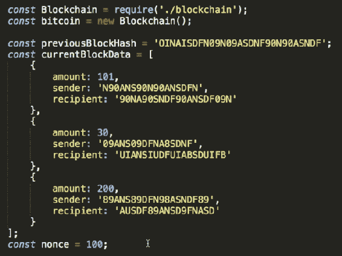*

1.  如果你的`test.js`文件中没有任何数据，就像在上面的截图中显示的那样添加到你的`test.js`文件中，然后你就可以开始测试数据了。

1.  为了测试我们的`proofOfWork`方法，我们需要`previousBlockHash`和`currentBlockData`。所以，在我们的测试用例中，去掉 nonce 值，并在我们的文件中添加以下代码行：

```js
console.log(bitcoin.proofOfWork(previousBlockHash, currentBlockData));
```

现在，我们从`proofOfWork`方法中应该得到的结果是一个 nonce 值。我们的`proofOfWork`方法本质上是测试看看什么是与我们的块数据和`previousBlockHash`一起哈希的正确 nonce 值，以生成一个以四个零开头的结果块哈希。在这里，`proofOfWork`为我们找到了正确的 nonce。

1.  保存这个文件，并在终端窗口中输入`node dev/test.js`命令来运行我们的测试。测试运行后，你会看到一个数字作为输出出现在屏幕上：

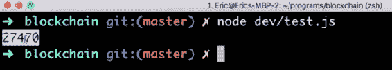

这个数字表示的是，我们的`proofOfWork`方法花了 27,470 次迭代来找到一个以四个零开头的哈希。

1.  现在，为了深入了解整个过程，我们可以在`while`循环中记录我们尝试的每个哈希值。我们将不得不对我们的`while`循环进行一些微小的修改，就像下面的代码块中突出显示的那样：

```js
while (hash.substring(0, 4) !== '0000' {
    nonce++;
    hash = this.hashBlock(previousBlockHash, currentBlockData,
    nonce);
    console.log(hash);
}
```

当我们现在运行我们的测试文件时，会发生的是我们应该能够在终端中看到 27,000 个不同的哈希值被记录出来。除了最后一个之外，这些哈希值都不会以四个零开头。只有最后一个被记录出来的哈希值应该以四个零开头，因为在我们的方法之后，这将终止并返回获得有效哈希值的 nonce 值。

现在再次保存我们的`test.js`文件。你现在可以在屏幕上观察到有大量不同的哈希值被记录到终端中：

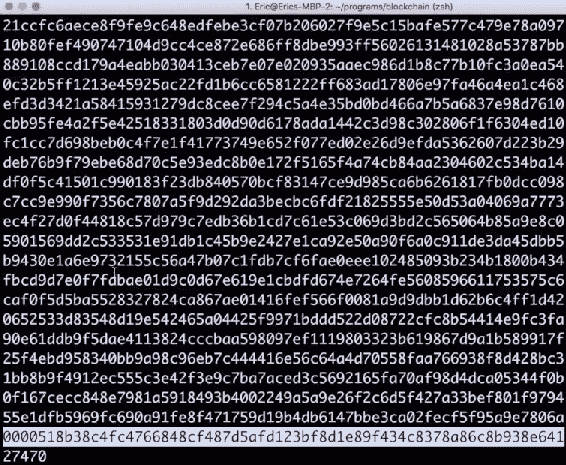

你还可以观察到，每个被记录出来的哈希值的开头都不会连续出现四个零，直到我们得到最终值。

基本上，这里发生的是我们从`currentBlockData`、`previousBlockHash`和值为 0 的`nonce`生成哈希。然后，对于下一个哈希，我们将`nonce`递增 1。所以，输入数据都是一样的，但是`nonce`值会递增，直到获得有效的哈希。最终，在 27,470 次迭代中，通过 nonce 值获得了有效的哈希。

现在让我们尝试使用我们的`hashBlock`方法。在我们的`dev/test.js`文件中，删除`proofOfWork`方法，并添加以下代码行：

```js
console.log(bitcoin.hashBlock(previousBlockHash, currentBlockData, nonce));
```

在上述代码中，对于 nonce，让我们输入值 27,470。这个值是我们从`proofOfWork`方法中获得的。

我们观察到的输出是使用正确的 nonce 值运行单个哈希，我们通过运行`proofOfWork`方法获得。通过这样做，我们应该在第一次尝试时生成一个以四个零开头的哈希。让我们保存并运行它。一旦测试运行，您将看到以四个零开头的单个哈希，如下面的截图所示：

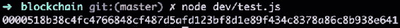

`proofOfWork`是区块链技术的一个非常重要的部分。从测试结果中可以看出，计算它非常困难 - 我们花了超过 27,000 次迭代才生成正确的哈希。因此，`proofOfWork`需要大量的能量和许多计算，非常难以计算。

一旦我们有了正确的证明或生成所需哈希的 nonce 值，我们应该很容易验证我们是否有了正确的 nonce 值。我们可以通过简单地将其传递到我们的`hashBlock`方法中来验证这一点 - 我们将获得以四个零开头的哈希。

生成工作证明需要大量工作，但验证其正确性非常容易。因此，如果我们想要回到我们的区块链并检查一个块是否有效，我们只需对该块的数据与前一个块的哈希和从`proofOfWork`挖掘该块时生成的 nonce 进行哈希。如果这给我们返回一个以四个零开头的有效哈希，那么我们已经知道该块是有效的。

因此，从我们的测试中，我们可以得出结论，`proofOfWork`方法的工作符合预期。

# 创建创世区块

我们的区块链数据结构中还需要添加的一件事是创世块。但是什么是创世块？嗯，创世块只是任何区块链中的第一个块。

为了创建我们的创世区块，我们将在`Blockchain()`构造函数内部使用`createNewBlock`方法。转到`dev/blockchain.js`文件，并在区块链构造函数内部输入以下突出显示的代码行：

```js
function Blockchain () {
    this.chain = [];
    this.pendingTransactions =[];
    this.createNewBlock();         
}
```

正如我们在前一节中观察到的，`createNewBlock`方法接受 nonce 的值，`previousBlockHash`和哈希作为参数。由于我们在这里使用`createNewBlock`方法创建创世区块，我们将不会有这些提到的参数。相反，我们只会传入一些任意的参数，如以下代码块中所示：

```js
function Blockchain () {
    this.chain = [];
    this.pendingTransactions =[];
    this.createNewBlock(100, '0', '0');         
}
```

在上面的代码中，我们将 nonce 值传递为`100`，`previousBlockHash`为`0`，哈希值为`0`。这些都只是任意值；您可以添加任何您希望添加的值。

请注意，在创建我们的创世区块时传入这种任意参数是可以的，但是当我们使用`createNewBlock`方法创建新的区块时，我们将不得不传递参数的合法值。

现在保存文件，让我们在`test.js`文件中测试创世区块。

# 测试创世区块

在`dev/test.js`文件中，我们将首先导入我们的区块链数据结构或区块链构造函数，然后将我们的区块链实例化为`bitcoin`。然后我们将以以下方式退出比特币区块链：

```js
const Blockchain = require ('./blockchain');
const bitcoin = new Blockchain ();

console.log(bitcoin);
```

保存此文件，并在终端中键入`node dev/test.js`来运行测试。

运行测试后，我们可以观察到创世区块，如下面的截图所示：

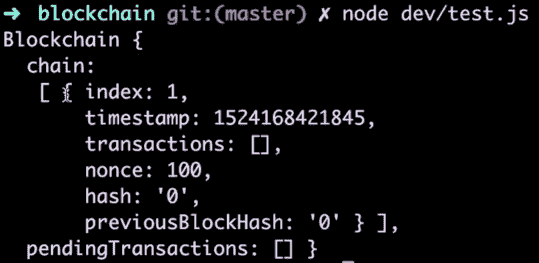

在上面的截图中，对于链数组，您可以看到我们的链中有一个块。这个块是我们的创世块，它的 nonce 为 100，哈希为 0，`previousBlockHash`为`0`。因此，我们所有的区块链都将有一个创世块。

# 摘要

在本章中，我们首先构建了构造函数，然后继续创建了一些令人惊奇的方法，比如`createNewBlock`、`creatNewTransaction`、`getLastBlock`等。然后我们学习了哈希方法，SHA256 哈希，并创建了一个为我们的区块数据生成哈希的方法。我们还学习了什么是工作量证明以及它是如何工作的。在本章中，您还学会了如何测试我们创建的各种方法，并检查它们是否按预期工作。在以后的章节中，我们将更多地与区块链进行交互，本章学到的方法将对我们非常有用。

如果您想更加熟悉区块链数据结构，建议您打开`test.js`文件，测试所有方法，尝试玩弄它们，观察它们如何一起工作，并且享受其中的乐趣。

在下一章中，我们将构建一个 API 来与我们的区块链进行交互和使用。那将是真正有趣的开始。
