# 第三章：通过 API 访问区块链

构建区块链在上一章中，我们构建了我们的区块链数据结构的开端。在本章中，我们将构建一个 API，允许我们与我们的区块链进行交互。为了构建 API，我们将使用 Express.js 库创建一个服务器，然后我们将构建三个不同的端点，这些端点将允许我们与我们的区块链进行交互。

让我们开始从头构建我们的 API。在本章中，我们将涵盖以下主题：

+   设置 Express.js

+   构建 API 基础

+   安装 Postman 和 body-parser

+   构建`/blockchain`端点

+   构建`/transaction`端点

+   构建`/mine`端点

+   测试端点

# 设置 Express.js

让我们开始构建我们的 API 或我们的服务器来与我们的区块链数据结构进行交互。我们将在一个新文件中构建我们的 API，并将其放入我们的`dev`文件夹中。让我们创建一个新文件并将其命名为`api.js`；这就是我们将构建整个 API 的地方：

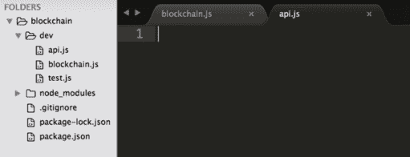

# 安装 Express.js

现在，我们将使用一个名为`Express.js`的库来构建一个服务器或 API。让我们按照下面提到的步骤来安装它：

1.  因此，前往 Google，搜索`Express.js npm`，并点击第一个链接（[`www.npmjs.com/package/express`](https://www.npmjs.com/package/express)）。这将带您到以下页面：

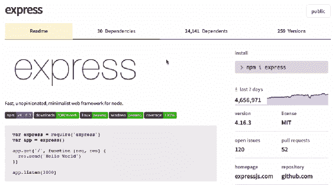

1.  我们必须将其安装为依赖项，因此我们必须在终端中运行以下命令：

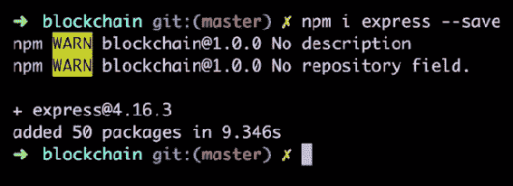

现在我们在项目中有 Express 库作为依赖项。

# 使用 Express.js

使用 Express 非常简单：让我们看看如何使用它：

1.  只需复制文档中的示例代码，并将其粘贴到我们的`api.js`文件中：

```js
var express = require('express')
var app = express()

app.get('/', function (req, res) {
 res.send('Hello World')
})

app.listen(3000)
```

正如您所看到的，在我们的文件顶部，我们正在要求`express`，这是我们刚刚下载的库，然后我们正在创建一个`app`。这个`app`将帮助我们处理不同的端点或不同的路由。

例如，我们有一个`get`端点，它只是`/`。通过这个端点，我们发送`Hello World`的响应。整个服务器都在端口`3000`上监听。

1.  要启动此服务器，我们转到终端并运行以下命令：

```js
node dev/api.js
```

1.  现在我们的服务器应该正在运行。我们可以通过在浏览器中点击`get`端点路由来测试这一点，这个路由将简单地是一个端口为`3000`的本地主机。

1.  在浏览器中打开一个新标签，并输入`localhost:3000`。在这里你会看到文本 Hello World：

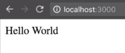

1.  这是从端点发送给我们的响应。我们可以将文本更改为任何我们想要的，所以让我们将`Hello World`更改为`Hello Coding JavaScript!`：

```js
var express = require('express')
var app = express()

app.get('/', function (req, res) {
 res.send('Hello Coding JavaScript!')
})

app.listen(3000)
```

1.  现在保存并重新启动服务器，通过在终端中再次运行以下命令：

```js
node dev/api.js
```

1.  刷新浏览器标签，您将看到以下输出：

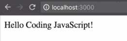

就是这样！使用 Express 非常简单和容易。我们将使用 Express.js 库构建所有端点。

# 构建 API 基础

在本节中，我们将继续构建我们的区块链 API，然后我们将首先构建以下三个端点：

+   第一个端点是`/blockchain`，它允许我们获取整个区块链，以便我们可以查看其中的数据。

+   第二个端点是`/transaction`，它允许我们创建一个新的交易。

+   第三个端点是`/mine`，它将允许我们使用我们在上一章中制作的`proofOfWork`方法来挖掘一个新的区块。这将是一个非常强大的端点，也将很有趣。

这基本上将成为我们的区块链 API 的基础。在`dev/networkNode.js`文件中，让我们定义这些端点如下：

```js
const express = require('express');
const app = express();

app.get('/blockchain', function (req, res) {

});

app.post('/transaction', function(req, res) {

});

app.get('/mine', function(req, res) {

});

app,listen(3000);
```

现在，我们还要做的一件事是对`listen`方法进行一些修改：

```js
app,listen(3000, function(){
    console.log('listening on port 3000...'); 

});
```

我们已经向这个方法添加了另一个参数，即一个函数。在这个函数内部，我们只是打印出`Listening on port 3000`字符串。我们这样做的原因只是为了当我们的端口实际运行时，我们会看到这个文本。让我们去我们的终端，再次运行我们的`api.js`文件：

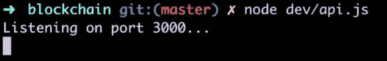

如您所见，上面的截图显示我们正在监听端口`3000`。每当我们看到这个文本时，我们知道我们的服务器正在运行。

# 安装 Postman 和 body-parser

在这一部分，我们将在我们的环境中工作，使我们的开发过程变得更容易一些。我们要做的第一件事是安装一个叫做`nodemon`的新包。在我们的终端中的`blockchain`目录中，我们将写入`npm i nodemon --save`命令：

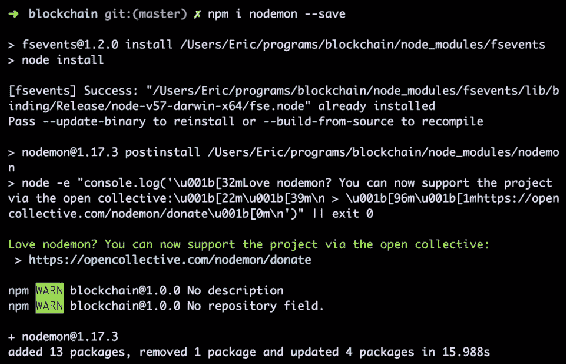

每当我们对文件进行更改并保存时，这个 nodemon 库会自动为我们重新启动服务器，这样我们就不必每次更改都要回到终端和代码之间来重新启动服务器。

要使用 nodemon，我们将打开我们的`package.json`文件。在`"scripts"`处，我们将添加一个新的脚本：

```js
{
 "name": "javaScript-blockchain",
 "version": "1.0.0",
 "description": "",
 "main": "index.js",
 "scripts": {
     "test": "echo \"Error: no test specified\" && exit 1",
     "start": "nodemon --watch dev -e js dev/api.js"
 }
 "author": "",
 "license": "ISC",
 "dependencies": {
     "express": "⁴.16.3",
     "nodemon": "¹.17.3",
     "sha256": "⁰.2.0"
 }
}
```

我们已经添加了`"start": "nodemon --watch dev -e js dev/api.js"`。这意味着当我们运行`start`命令时，我们希望`nodemon`监视我们的`dev`文件夹，并关注我们所有的 JavaScript 文件。每当这些 JS 文件中的一个被更改并保存时，我们希望 nodemon 为我们重新启动`dev/api.js`文件。保存`package.json`文件。现在，每当我们在`dev`文件夹中进行更改并保存时，我们的服务器将自动重启。让我们测试一下。

让我们去我们的终端。我们的服务器现在应该正在使用 nodemon：

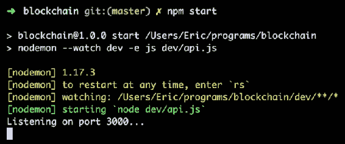

我们使用`npm start`命令启动了服务器。您可以看到它正在监听端口`3000`。每当我们更改我们的 JS 文件并保存时，我们会看到我们的服务器会自动重启：

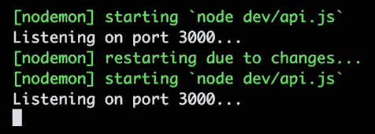

如您所见，服务器再次监听端口`3000`。这只是一个工具，我们用它来让开发对我们来说稍微容易一些。现在，我们想要使用的另一个工具叫做 Postman。

# 安装 Postman

Postman 工具允许我们调用任何我们的 post 端点，并通过我们的请求将数据发送到这些端点。让我们了解如何安装它：

1.  转到[`www.getpostman.com`](https://www.getpostman.com)并下载该应用程序。下载应用程序后，我们可以运行一些小测试，看看如何使用这个 Postman 应用程序来访问我们的`/transaction`端点。

1.  下载 Postman 应用程序后打开它。您将看到类似以下截图的内容：

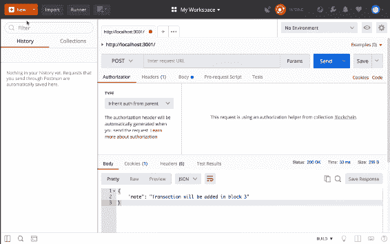

1.  现在，在 Postman 应用程序中，我们将向`http://localhost:3000/transaction`发出 post 请求：

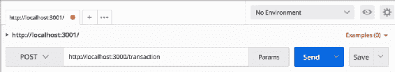

1.  为了测试`/transaction`端点是否工作，让我们在输出中发送一些东西。在我们的`/transaction`端点中，我们添加了以下行：

```js
app.post('/transaction', function(req, res) {
    res.send('It works!!!');
});
```

1.  保存文件，现在当我们访问这个端点时，我们应该得到文本`It works!!!`的返回。点击发送按钮，您将得到输出，如下面的截图所示：

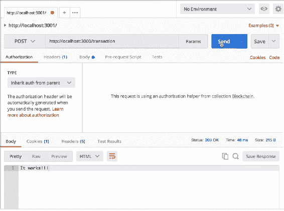

1.  现在，大多数情况下，当我们在 API 中访问`post`端点时，我们都希望向其发送数据。例如，当我们访问`/transaction`端点时，我们希望创建一个新的交易。因此，我们必须向`/transaction`端点发送交易数据，比如交易金额、发送者和接收者。我们可以使用 Postman 来做到这一点，而且实际上非常简单。我们要做的是在我们的 post 请求的正文中发送一些信息。你可以通过点击 Body 选项卡来实现：

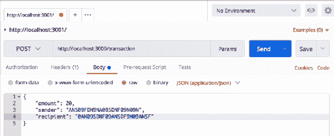

1.  接下来，确保选中了原始选项，并从下拉列表中选择了 JSON（application/json）。你还可以看到我们已经创建了一个 JSON 对象，并放入了一些数据。我们已经将`amount`设置为`20`比特币，发送者的地址和接收者的地址。

请记住，所有内容都必须以 JSON 格式呈现，因此我们需要将所有引号都用双引号括起来，否则术语将无法工作。

1.  为了测试我们是否在端点内收到了所有这些信息，我们将打印整个`req.body`。`req.body`就是我们在 JSON 对象中创建的信息：

```js
app.post('/transaction', function(req, res) {
    console.log(req.body);
    res.send(`The amount of the transaction is ${req.body.amount}
     bitcoin.`);
});
```

正如你所看到的，我们还在响应中发送了一些不同的信息。我们在反引号中添加了一个句子，并且还使用了`${req.body.amount}`进行了一些字符串插值，这将返回`amount`。

1.  现在，为了使`${req.body.amount}`起作用，我们需要安装另一个库以访问这些信息。让我们回到终端；我们将退出当前监听端口`3000`的进程，并安装一个名为`body-parser`的包：

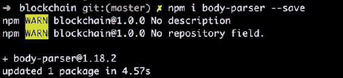

1.  现在让我们再次用`npm start`启动我们的服务器。

1.  当使用`body-parser`时，我们只需在文件顶部导入它：

```js
const express = require('express');
const app = express();
const bodyParser = require('body-parser');

app.use(bodyParser.json());
app.use(bodyParser.urlencoded({ extended: false }));
```

为了使用`body-parser`库，我们添加了下面两行。这两行代码的作用是说明如果请求中带有 JSON 数据或表单数据，我们只需解析这些数据，以便在任何端点中访问。因此，无论我们访问哪个端点，我们的数据都会首先经过`body-parser`，以便我们可以访问数据，然后在接收数据的端点中使用。

1.  现在我们使用了`body-parser`，我们应该能够访问这个金额。让我们保存`api.js`文件，并尝试发送请求，如下所示：

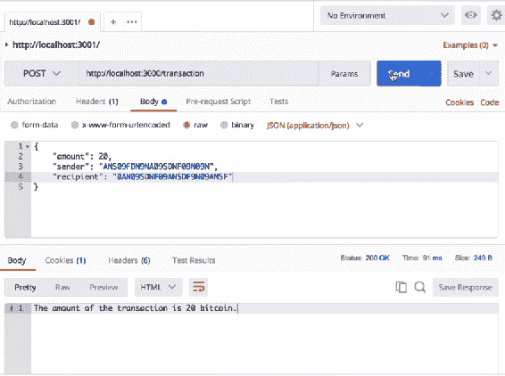

成功了！我们得到了返回的字符串，其中说明交易金额为 20 比特币。

在我们的终端中，由于我们记录了整个`req.body`，我们可以看到关于金额、发送者和接收者的所有信息都被显示出来：

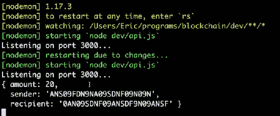

太好了！现在，还有一件重要的事情要注意，那就是在本章的其余部分，你应该始终保持服务器运行，这意味着你应该始终运行`npm start`命令，这样我们才能使用我们的 API，访问不同的端点，并测试它是否有效。

# 构建/blockchain 端点

让我们继续构建我们的区块链 API。在这一部分，我们将与我们的`/blockchain`端点进行交互。这意味着我们将不得不从我们的`blockchain.js`文件中导入我们的区块链：

```js
const Blockchain = require('./blockchain');
```

我们现在已经导入了我们的区块链数据结构或区块链构造函数。接下来，我们要创建一个区块链的实例。我们可以这样做：

```js
const bitcoin = new Blockchain();
```

现在我们有了我们的区块链构造函数的一个实例，并且我们将其称为`bitcoin`。你可以自己决定叫什么，但我会简单地称其为`bitcoin`。

让我们在`/blockchain`端点上继续构建。这个端点将会将整个区块链发送回给调用它的人。为了做到这一点，我们将添加一行代码来发送响应：

```js
app.get('/blockchain', function(req, res) {
    res.send(bitcoin);
});
```

信不信由你，这就是我们为这个端点要做的全部。

# 测试/blockchain 端点

现在我们可以通过在浏览器中使用它来测试这个端点是否工作：

1.  让我们转到我们的浏览器并访问`localhost:3000/blockchain`：

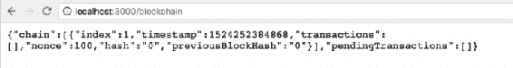

1.  正如你所看到的，我们得到了整个区块链。现在，你可能已经注意到这有点难以阅读，所以为了使其可读，让我们下载一个名为**JSON 格式化程序**的 Chrome 扩展。你可以在谷歌上搜索并将该扩展添加到你的 Chrome 浏览器中。安装完成后，再次刷新页面，你将得到以下输出：

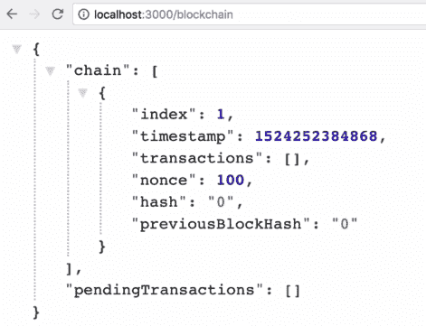

正如你所看到的，我们以更易读的 JSON 格式得到了我们的数据。你可以看到我们有`chain`，其中有一项 - 我们的创世区块 - 以及`pendingTransaction`区块。这很酷，我们可以知道我们的`/blockchain`端点正在工作，因为我们得到了整个区块链。

# 构建/transaction 端点

在这一部分，我们将构建我们的交易端点。让我们按照下面提到的步骤进行：

1.  在开始之前，请确保在处理我们的区块链时，你的服务器正在运行。我们可以通过在终端中运行`npm start`命令来做到这一点。

1.  让我们转到我们的`api.js`文件并构建我们的交易端点。首先，去掉我们之前在`/transaction`端点中添加的示例代码，并在我们的区块链中创建一个新的交易。为此，我们将使用我们在第二章中构建的`blockchain.js`文件中的`createNewTransaction`方法，*构建区块链*。

1.  如你所知，我们的`createNewTransaction`方法接受三个参数：`amount`，`sender`和`recipient`：

```js
Blockchain.prototype.createNewTransaction = function(amount, sender, recipient) {
  const newTransaction = {
    amount: amount,
    sender: sender,
    recipient: recipient
  };

  this.pendingTransactions.push(newTransaction);

  return this.getLastBlock()['index'] + 1;
};
```

1.  这个方法返回我们新交易将被添加到的区块编号或索引。这就是我们创建交易所需的一切，所以在我们的`/transaction`端点中，我们将添加以下行：

```js
app.post('/transaction', function(req, res) {
  const blockIndex = bitcoin.createNewTransaction(req.body.amount,
   req.body.sender, req.body.recipient) 
});
```

1.  在我们的端点中，我们假设所有这些数据都是通过`req.body`从调用这个端点的人那里发送过来的。结果将保存在`blockIndex`中，这就是我们将发送回给调用这个端点的人的内容。我们将把它作为一个`note`发送回去：

```js
app.post('/transaction', function(req, res) {
  const blockIndex = bitcoin.createNewTransaction(req.body.amount,
  req.body.sender, req.body.recipient) 
 res.json({ note:`Transaction will be added in block
    ${blockIndex}.`});
});
```

正如你所看到的，这个注释将告诉我们交易将被添加到哪个区块。我们使用了字符串插值来传递`blockIndex`的值。让我们保存这个文件并使用 Postman 测试这个端点。

# 测试/transaction 端点

现在让我们转到 Postman 并应用与我们之前设置的类似的设置：

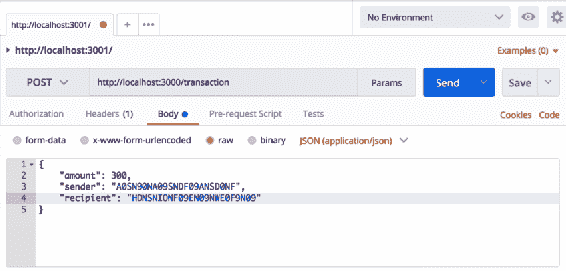

我们已经选择了 POST 请求，并且我们的目标是`/transaction`端点。在 Body 选项卡中，我们已经勾选了 raw，并且文本已经选择为 JSON 格式。我们在 JSON 对象中传入了`amount`，`sender`和`recipient`的值，这将成为我们的`req.body`，并且我们将发送所有的交易数据到这个对象上。借助于我们在`/transaction`端点中提到的`req.body`，我们可以访问金额、发送者的地址和接收者。

现在让我们测试这个端点：

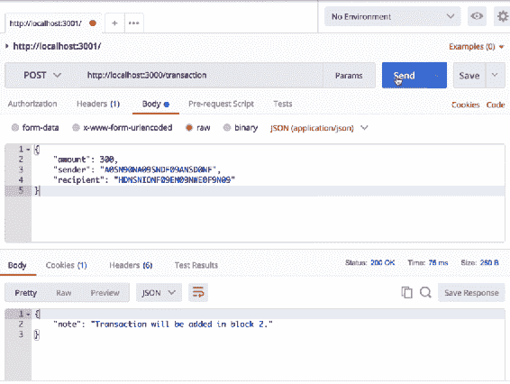

正如你所看到的，当我们在 Postman 上点击发送按钮时，我们得到了交易将被添加到第 2 个区块的输出。我们之所以在这里得到第 2 个区块，是因为在我们初始化区块链时已经创建了一个区块，这就创建了创世区块。因此，这个交易被添加到了第 2 个区块。

我们可以测试确保这个端点工作正确的另一种方法是访问我们的`/blockchain`端点。当我们访问这个端点时，我们应该期望得到我们整个的区块链。在那个区块链中，应该有一个单独的区块 - 我们的创世区块 - 还应该有一个待处理的交易，这就是我们刚刚创建的交易。让我们转到浏览器，访问`localhost:3000/blockchain`：

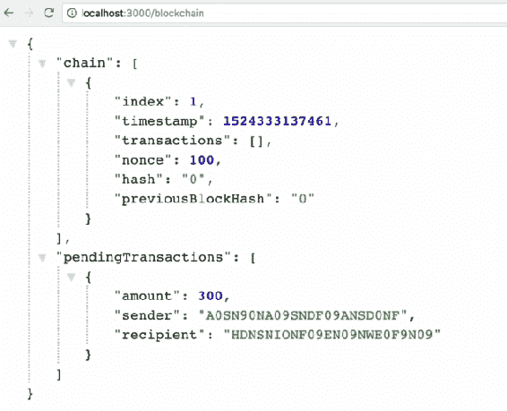

正如你所看到的，整个对象就是我们整个的区块链 - 第一部分是我们的链，其中包含创世区块，第二部分是我们的待处理交易，我们刚刚创建。我们的`/transaction`端点完美地工作。

# 构建/mine 端点

让我们构建我们的区块链 API 的最终端点：挖矿端点，这将挖矿并创建一个新的区块：

1.  为了创建一个新的区块，我们将使用我们在`blockchain.js`文件中已经定义的`createNewBlock`方法。让我们转到我们的`api.js`文件，并在`/mine`端点中创建一个新的区块：

```js
app.get('/mine', function(req, res) {
    const newBlock = bitcoin.createNewBlock();
});
```

1.  这个`createNewBlock`方法接受三个参数：`nonce`，`previousBlockHash`和`hash`：

```js
Blockchain.prototype.createNewBlock = function(nonce, previousBlockHash, hash) {
  const newBlock = {
    index: this.chain.length + 1,
    timestamp: Date.now(),
    transactions: this.pendingTransactions,
    nonce: nonce,
    hash: hash,
    previousBlockHash: previousBlockHash
  };

  this.pendingTransactions = [];
  this.chain.push(newBlock);

  return newBlock;
};
```

1.  现在我们必须进行计算，以获得所有这三个数据，所以让我们开始。让我们从获取上一个区块开始，以便我们可以获取它的 hash：

```js
app.get('/mine', function(req, res) {
  const lastBlock = bitcoin.getLastBlock();
  const previousBlockHash = lastBlock['hash'];
```

正如你所看到的，我们已经创建了`lastBlock`，它是我们链中的最后一个区块 - 或者是我们新区块的上一个区块。为了获取上一个区块的`hash`，我们创建了`previousBlockHash`。有了这个，我们现在可以有我们的`previousBlockHash`，这是我们`createNewBlock`方法下一个需要的参数之一。

1.  接下来，让我们获取我们的`nonce`。为了为我们的区块生成一个`nonce`，我们需要生成一个`proofOfWork`，这是我们在`blockchain.js`文件中创建的：

```js
Blockchain.prototype.proofOfWork = function(previousBlockHash, currentBlockData) {
  let nonce = 0;
  let hash = this.hashBlock(previousBlockHash, currentBlockData,
  nonce);
  while (hash.substring(0, 4) !== '0000') {
    nonce++;
    hash = this.hashBlock(previousBlockHash, currentBlockData,
    nonce);
  }

  return nonce;
};
```

1.  在我们的`/mine`端点，我们将添加以下行：

```js
const nonce = bitcoin.proofOfWork(previousBlockHash, currentBlockData);
```

1.  因此，从我们的`proofOfWork`方法中，我们将得到一个`nonce`返回给我们。让我们将其保存为我们的`nonce`变量。我们的`proofOfWork`方法接受两个参数：`previousBlockHash`，我们已经有了，和`currentBlockData`。让我们定义我们的`currentBlockData`：

```js
const currentBlockData = {
    transactions: bitcoin.pendingTransactions,
    index: lastBlock['index'] + 1
  };
```

我们有我们的`currentBlockData`作为一个对象，其中包含数据。这些数据将简单地包括这个区块中的`transactions`，还有一个`index`，这是我们将要创建的新区块的索引；我们的`lastBlock`的索引加 1。`currentBlockData`对象将简单地是这个新区块中存在的`transactions`和它的`index`。有了这个，我们现在可以计算我们的`nonce`，就像我们用我们的`previousBlockHash`和`currentBlockData`一样。

1.  现在，我们的`createNewBlock`方法必须接受的最后一个参数是这个新区块的`hash`，所以让我们现在计算一下。为了创建这个新区块的`hash`，我们将使用我们的`hashBlock`方法。我们将在我们的`/mine`端点中添加以下行：

```js
const blockHash = bitcoin.hashBlock(previousBlockHash, currentBlockData, nonce);
```

如你所知，我们已经在`blockchain.js`文件中创建了`hashBlock`方法。这个方法接受三个参数：`previousBlockHash`，`currentBlockData`和`nonce`。我们已经有了所有这些参数，所以我们正在调用它，并将结果保存在一个名为`blockHash`的变量中。

1.  我们现在有了我们运行`createNewBlock`方法所需的所有参数，所以让我们分配这些参数：

```js
const newBlock = bitcoin.createNewBlock(nonce, previousBlockHash, blockHash);
```

这里发生的事情非常棒。正如你所看到的，有很多不同的计算涉及到创建这个新区块，我们能够通过使用我们的区块链数据结构来进行所有这些计算。这是一个非常强大的数据结构，我们的区块链现在可以通过使用`proofOfWork`来挖掘新的区块，这与许多其他区块链的功能类似。

1.  在这一点上，我们已经创建了我们的新区块，我们真正需要做的就是将响应发送给挖掘这个区块的人。接下来，我们将在我们的`/mine`端点中添加以下行：

```js
res.json({
  note: "New block mined successfully",
  block: newBlock
});
```

我们只是简单地发送一个说明新块挖掘成功的消息，以及我们刚刚创建的`newBlock`。现在，发送这个`newBlock`不会以任何方式影响我们的区块链。我们发送`newBlock`是为了让创建或挖掘这个新块的人知道它的样子。

1.  现在只剩下一件事情要做：每当有人挖掘一个新块，他们都会得到一个奖励。我们所要做的就是创建一个交易，给挖掘这个新块的人发送一点比特币作为奖励。为此，在`/mine`端点内部，我们将创建一个新的交易：

```js
bitcoin.createNewTransaction(12.5, "00", nodeAddress);
```

目前，在 2018 年，真正的比特币区块链中挖掘新块的奖励是 12.5 比特币。为了保持与真正的比特币一致，我们的奖励也将是`12.5`比特币。作为发送者地址，我们已经放入了值`00`。这样，每当我们在我们的网络上查看交易时，我们知道如果有一个交易是从地址`00`发出的，那就是一个挖矿奖励。

现在我们只需要一个接收者的地址，`nodeAddress`。我们需要把`12.5`比特币发送给挖掘新块的人，但是怎么找到呢？嗯，我们将把这个奖励发送给我们当前所在的节点，也就是我们正在使用的整个 API 文件。我们可以把整个 API 都当作比特币区块链中的一个网络节点。

在未来的章节中，我们将拥有我们 API 的多个实例，并且它们将作为大型干净区块链中的不同网络节点。现在，每当我们访问我们创建的任何端点时，我们总是只与这一个网络节点进行通信。然而，由于我们知道所有的区块链技术都是分散的，并且托管在许多不同的网络节点上，随着我们进一步进行，我们将创建更多的网络节点。但是现在，我们整个的区块链只托管在这一个网络节点上。

现在，每当我们访问`/mine`端点时，我们都希望奖励这个节点挖掘新块。为了给这个节点应得的`12.5`比特币奖励，我们需要一个地址来发送比特币，所以让我们现在为这个节点创建一个地址。

为了为这个节点创建一个地址，我们将使用我们的终端导入一个叫做`uuid`的新库：

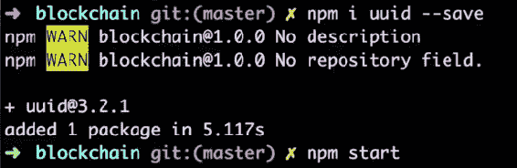

一旦你输入了`npm i uuid --save`命令并按下*Enter*，包就会被添加。你可以使用`npm start`命令重新启动服务器。

现在让我们在`api.js`文件的顶部部分导入我们的新的`uuid`库：

```js
const uuid = require('uuid/v1');
```

正如你所看到的，我们已经导入了`uuid`库的第 1 个版本。这个库为我们创建了一个唯一的随机字符串，我们将使用这个字符串作为这个网络节点的地址。为此，我们将添加以下行：

```js
const nodeAddress = uuid().split('-').join('');
```

关于我们从这个库得到的字符串，我们想要改变的一件事是，它里面有一些破折号——我们不希望地址里有任何破折号。在这里，我们只是简单地将该字符串在所有的破折号上分割，然后用一个空字符串重新连接。我们将得到的`nodeAddress`是一个随机字符串，保证是独一无二的。我们真的希望这个字符串是独一无二的，因为我们不希望有两个节点有相同的地址，否则我们会把比特币发送给错误的人，那就不好了。现在我们只需将这个`nodeAddress`变量传递给我们的`createNewTransaction`方法。

在下一部分，我们将测试我们的`/mine`端点，以及我们的`/transaction`和`/blockchain`端点，以确保它们都能正确地工作和互动。

# 测试端点

在这一部分，我们将测试我们的`/mine`端点，以及我们的`/transaction`和`/blockchain`端点，以确保一切都能很好地协同工作。

在测试之前，最好将`proofOfWork`方法中的`console.log`语句删除。这是因为有它只会让你的程序工作更加艰难，因此计算所需的时间会更长。

# /mine 端点测试

首先，让我们测试我们在上一节中构建的`/mine`端点。让我们转到浏览器，访问`localhost:3000/blockchain`：

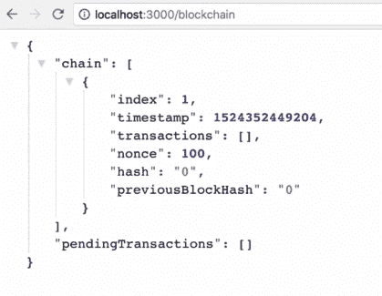

现在，我们有整个区块链，链中有一个区块 - 我们的创世区块 - 也没有待处理交易。

现在让我们打开另一个标签页，点击我们的`/mine`端点。这应该为我们挖矿并创建一个新的区块：

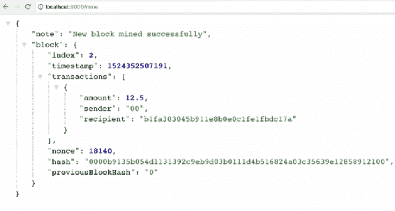

我们收到了一条新的区块成功挖掘的消息。我们还收到了我们的新区块，并且我们可以看到区块上的所有数据。它里面有一个哈希，还有前一个区块的哈希，即创世区块，以及一个交易。也许你会想，我们并没有创建交易，那么这笔交易是从哪里来的呢？实际上，这笔交易是我们放入端点的挖矿奖励，即`12.5`比特币的挖矿奖励交易。看起来我们的挖矿端点运行良好。

# 测试/blockchain 端点

为了测试并确保我们确实创建了这个新区块，我们可以转回到我们的`/blockchain`端点并刷新页面：

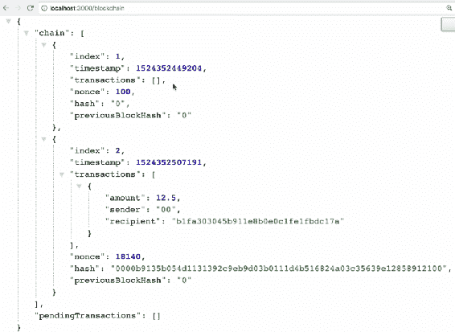

成功了。我们现在的链中有两个区块：一个是创世区块，另一个是我们刚刚创建的区块。第二个区块中也有交易，其中包括奖励。

让我们再挖掘一个区块来再次测试。转到我们的`/mine`端点并刷新页面：

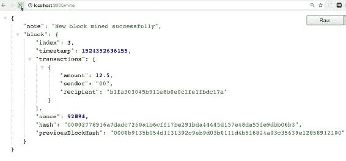

我们刚刚挖掘了另一个区块，这是我们的第三个区块。我们可以看到我们得到了`timestamp`和另一笔交易，即挖矿奖励，还有我们的其他数据。现在让我们转回到我们的`/blockchain`端点并刷新页面：

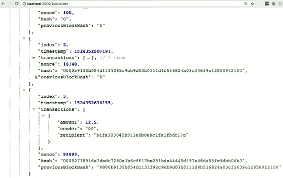

正如你所看到的，我们有三个区块。区块 3 是我们刚刚创建的区块，里面有我们的挖矿奖励交易。还有一件事要注意的是，我们的`previousBlockHash`实际上与我们的区块 2 的`hash`对齐。这有助于保护我们的区块链，这很好。

# 测试/transaction 端点

现在让我们使用我们的`/transaction`端点创建一些交易。为此，请转到 Postman，确保设置与之前相同，并进行以下更改：

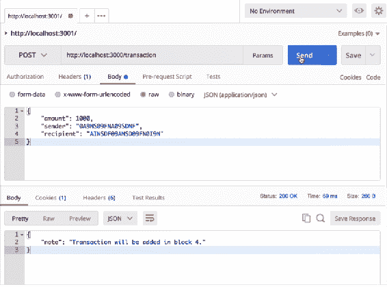

我们将`amount`设置为`1000`比特币。我们将保留发送方和接收方地址不变，但你可以根据需要进行更改。一旦我们提交到`/transaction`端点，我们应该得到文本交易的响应，该交易将被添加到第 4 个区块中，我们确实得到了这个响应。这笔交易被添加到第 4 个区块，因为我们的链中已经有了三个区块。

让我们进行另一个示例交易。在这里，我们将`amount`更改为`50`比特币，并对发送方和接收方的地址进行一些更改。因此，当我们发送此请求时，我们应该得到相同的响应：交易将被添加到第 4 个区块。这是因为我们还没有挖掘新的区块。让我们试一试：

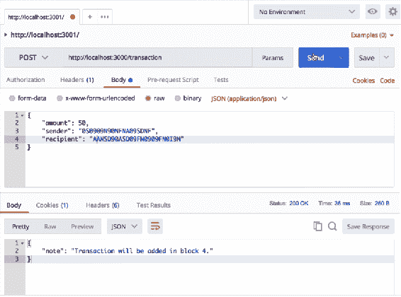

这很有效。现在让我们再次获取整个区块链。这次，我们应该期望得到与我们刚刚创建的相同的区块链和两笔待处理交易。让我们刷新页面并查看输出：

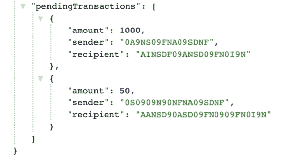

你会注意到这里有三个区块和两笔待处理交易。现在，如果我们转到我们的`/mine`端点并刷新页面，这两笔待处理交易将被添加到第 4 个区块中：

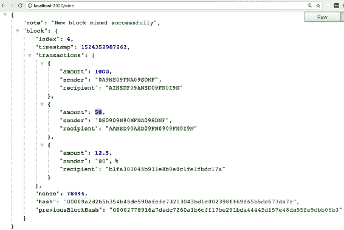

我们已成功挖掘了一个新的区块。它包含我们的数据，也有三笔交易。前两笔交易是我们在 Postman 中创建的，第三笔是我们的挖矿奖励交易。现在，如果我们回到我们的`/blockchain`端点并刷新它，我们会看到两笔待处理的交易已经消失，并且它们已被添加到第 4 个区块中。

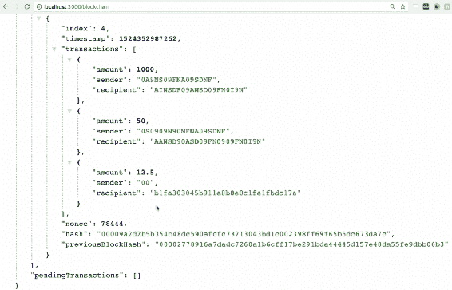

正如您所看到的，第 4 个区块包含了所有三笔交易，我们的`pendingTransactions`现在为空。效果很好。现在，我鼓励您创建更多的交易并挖掘另一个区块，以确保一切都正常工作。

通过构建整个 API 和区块链，并真正理解代码的工作原理，更容易理解区块链技术的实际运作方式，您也会意识到其中很多实际上并不那么复杂。

在测试这些端点的任何时候，如果您对文件进行更改并保存，服务器将重新启动。这将导致区块链的新实例，这意味着到目前为止创建的所有内容都将被清除。

# 摘要

在本章中，我们学习了如何在项目中设置 Express.js，以及如何使用它来构建我们的 API/服务器。然后我们安装了 Postman，并了解了如何使用它来测试我们的端点。之后，我们继续构建了服务器的各种端点，并测试它们以验证它们是否正常工作。

在下一章中，我们将创建一个节点网络或去中心化网络来托管我们的区块链，就像在现实世界中托管的那些一样。
