# 第四章：创建分散的区块链网络

在本章中，让我们专注于构建分散的区块链网络。我们的区块链目前的工作方式是我们有一个单一的区块链，而访问它的唯一方式是通过 API：我们的单一服务器。这个服务器非常集中，这并不好，因为 API 完全控制着区块链和添加到其中的数据。

在现实世界中，所有区块链技术都托管在分散网络中。在本章中，这就是我们要专注于构建的内容。我们将通过创建各种 API 实例来构建一个分散的区块链网络。这些 API 实例中的每一个都将成为我们区块链网络中的一个网络节点。所有这些节点将共同工作来托管我们的区块链。

这样一来，不仅仅是一个单一的网络节点完全控制着我们的区块链。相反，我们的区块链托管在整个分散网络中。这样，如果我们的网络中有一个坏的参与者，或者有人试图欺骗系统，我们可以参考其他网络节点来查看我们的区块链内部应该是什么样的真实数据，以及我们的区块链实际上应该是什么样的。

我们的区块链托管在分散网络中非常强大，因为它极大地增加了我们的区块链的安全性，因此我们不必只信任一个单一实体来处理我们所有的数据。

在本章中，我们将涵盖以下主题：

+   学习如何创建和测试多个节点

+   将`currentNodeUrl`添加到我们的网络

+   为分散网络添加新的端点

+   构建`/register-and-broadcast-node`端点

+   构建和测试`/register-node`端点

+   添加和测试`/register-nodes-bulk`端点

+   测试所有网络端点

让我们开始创建我们的分散网络。

# 创建多个节点

让我们从构建分散网络开始：

1.  要创建我们的分散区块链网络，我们首先需要对我们的`api.js`文件进行一些修改。

1.  在我们的分散网络中，我们将有多个 API 实例，每个实例都将充当网络节点。由于我们将处理多个网络节点，最好将我们的`api.js`文件重命名为`networkNode.js`以便易于引用。

1.  要设置分散网络，我们将不得不多次运行`networkNode.js`文件。每次运行文件时，我们希望它作为不同的网络节点。我们可以通过在每次运行时在不同的端口上运行文件来实现这一点。为了每次都有不同的端口值，我们将把端口作为一个变量。为此，在我们的`dev/networkNode.js`的代码开头添加以下行：

```js
const port = process.argv[2]; 
```

1.  接下来，打开`package.json`文件并对`start`命令进行修改。我们要做的是转到命令的末尾，并传递我们想要网络节点运行的端口号的变量。在我们的示例中，我们希望我们的网络节点在端口号`3001`上运行。因此，在启动命令的末尾传递`3001`作为变量：

```js
"start": "nodemon --watch dev -e js dev/api.js 3001"
```

为了访问这个变量，我们在我们的`networkNode.js`文件中传递了`process.argv`变量。那么，`process.argv`变量是什么？这个变量简单地指的是我们运行启动服务器的`start`命令。

您可以将前面的`start`命令视为元素数组。命令的第一个和第二个元素由“nodemon --watch dev -e js dev/api.js”组成，命令的第三个元素是`3001`变量。

如果您想向命令添加更多变量，只需在其后添加更多变量。

因此，为了在`start`命令中访问端口变量，我们将变量作为`process.argv [2]`传递，因为这个数组从`0`索引开始，我们的端口变量是开始命令中的第三个元素。为了简化这个过程，我们可以通过在位置 2 处声明`process.argv`来访问`3001`变量。因此，我们可以在`dev/networkNode.js`文件中访问我们的`port`变量。

1.  接下来，我们想要使用`port`变量。因此，在`dev/networkNode.js`文件中，转到底部，我们已经提到了以下代码：

```js
app.listen(3000, function() {
    console.log('Listening on port 3000...');
});
```

1.  一旦找到这个，对其进行如下突出显示的修改：

```js
app.listen(port, function() {
    console.log(`Listening on port ${port}...`);
});
```

在前面的代码块中，我们用我们的`port`变量替换了硬编码的`3000`端口号。我们还通过使用字符串插值和传递端口变量，将`Listening on port 3000...`改为`Listening on port ${port}...`。现在，当我们运行`networkNode.js`文件时，它应该在端口`3001`上监听，而不是在端口`3000`上。

1.  在运行`networkNode.js`文件之前，我们需要更改的一个小细节是在`package.json`文件的`start`命令中，我们需要将`api.js`文件的名称更改为`networkNode.js`。

1.  现在我们已经准备好通过传入我们想要的任何端口变量来运行`networkNode.js`文件。

1.  让我们运行`networkNode.js`文件。在终端窗口中，输入`npm start`。通过输入这个命令，服务器应该开始监听端口`3001`，正如我们在下面的截图中所观察到的：

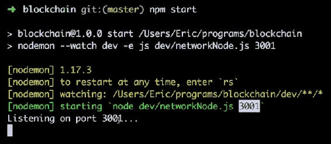

1.  从前面的截图中，我们可以观察到服务器正在监听端口`3001`。我们可以通过在浏览器中输入`localhost:3001/blockchain`来进一步验证这一点。您应该看到类似于下面截图所示的输出：

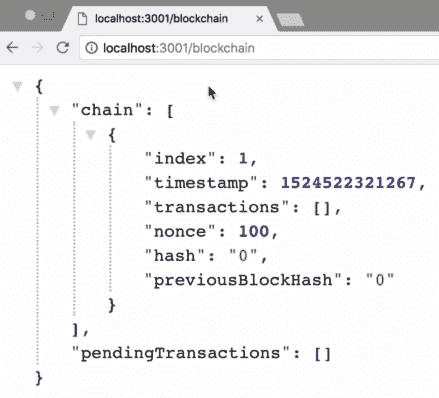

1.  从前面的截图中，我们可以看到我们的区块链现在托管在端口`3001`上，而不是在端口`3000`上。如果我们去端口`3000`，就会像下面的截图所示的那样，什么也没有。

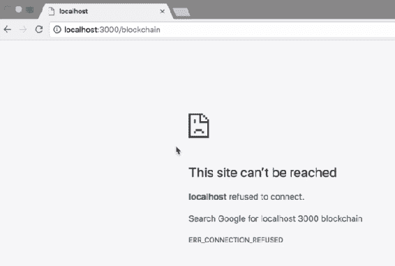

# 运行多个`networkNode.js`实例

接下来我们要做的事情是运行多个`networkNode.js`实例。为此，我们将在`package.json`文件中添加一些命令：

1.  首先，在`package.json`文件中，我们必须将`"start"`命令更改为`"node_1"`。现在，当我们运行此命令时，它将启动我们的第一个节点，即端口`3001`上的节点。让我们试一试。

1.  保存文件，转到终端，并通过输入`^C%`取消之前的进程。在这样做之后，而不是输入`npm start`，输入`npm run node_1`。通过这个命令，运行我们的`node_1`在端口`3001`上：

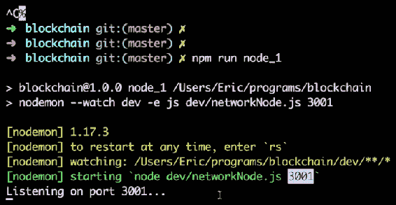

在这个过程中，我们真正做的是将`npm start`命令更改为`npm run node_1`。

1.  对于我们的分散网络，我们希望同时运行几个这样的节点。让我们回到我们的`package.json`文件，并添加类似于`"node_1"`的更多命令。为此，将`"node_1": "nodemon --watch dev -e js dev/networkNode.js 3001",`命令复制四次，然后对这些命令进行修改，如下面的截图所示：

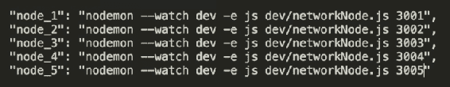

1.  现在，保存这个修改，让我们回到终端并启动其他网络节点。从上一次运行中，我们有第一个节点`node_1`在端口`3001`上运行。对于这次运行，我们将希望在端口`3002`上运行第二个节点`node_2`。因此，只需输入`npm run node_2`然后按*Enter*。我们将在屏幕上观察到以下输出：

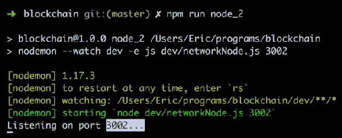

我们现在有一个运行在端口`3001`上的网络节点，另一个运行在端口`3002`上的网络节点。按照类似的过程在剩下的端口上运行剩下的网络节点。

为了更好地可视化和易于理解，建议您尝试在终端窗口的不同标签上运行每个节点。

通过遵循这个过程，我们实际上正在创建我们的`networkNode.js`文件的五个不同实例。因此，基本上，我们有五个不同的网络节点在运行。

在浏览器中，我们可以通过更改`localhost:3001/blockchain`中的端口号来检查这些网络节点中的每一个。通过这样做，我们将在不同的端口上得到不同的区块链。

# 测试多个节点

我们将继续探索上一节中创建的五个独立网络节点。到目前为止，您可能已经运行了所有五个网络节点。如果没有，请回到上一节，了解如何使这些节点中的每一个运行是值得推荐的。我们目前拥有的，即五个独立运行的网络节点，实际上并不是一个网络。我们只有五个独立的节点或我们的 API 的五个独立实例，但它们没有以任何方式连接。为了验证这些网络节点没有连接，我们可以进行一些测试：

1.  所以，让我们转到 Postman，并尝试通过在我们正在运行的不同网络节点上命中`/transaction`端点来进行一些不同的交易。

1.  我们要进行的第一笔交易将是到我们托管在端口`3001`上的网络节点。因此，让我们进入正文，并输入一些随机交易数据，如下面的屏幕截图所示：

！[](img/65cccdf0-f3aa-4357-974d-3a132f5d3b74.png)

1.  我们的交易数据有 30,000 比特币，我们将其发送到端口`3001`上托管的网络节点。单击发送按钮，如果交易成功，您将获得以下响应，如下面的屏幕截图所示：

！[](img/1e7ac10a-deee-434a-b4ad-ffcb10faf3bd.png)

1.  现在让我们向托管在端口`3003`上的网络节点进行 10 比特币的交易。然后单击发送按钮将交易发送到端口`3003`上的网络节点。在这里，您也将看到类似的响应。

1.  现在我们已经将交易数据发送到网络节点，让我们验证一下。转到浏览器，然后转到`localhost:3001/blockchain`，然后按*Enter*。您将看到一个类似的响应，如下面的屏幕截图所示：

！[](img/f09a700f-459c-4b9e-ac96-6eaa7bfdc362.png)

从前面的屏幕截图中，您可以看到我们有一个未决的 30,000 比特币交易。这是我们刚刚添加的交易之一。

1.  现在，在另一个标签中，如果我们转到`localhost:3002/blockchain`，您将看到我们没有未决交易，因为我们没有向这个网络节点发送任何交易：

！[](img/16eb2397-7d30-4ec1-aff6-6549cc2a0d9b.png)

1.  接下来，如果我们转到`localhost:3003/blockchain`，您将看到我们有一个未决的 10 比特币交易：

！[](img/3eaf03d0-47f1-4a5b-a1ca-30942869c4e7.png)

这是我们进行的另一笔交易。

如果我们去`localhost:3004/blockchain`和`localhost:3005/blockchain`，那里应该没有交易，因为我们没有向这些网络节点发送任何交易。

从这次测试中我们可以得出的结论是，尽管我们有五个不同的网络节点并行运行，但它们没有以任何方式连接。因此，本章的主要目的将是将所有网络节点连接到彼此，以建立一个去中心化的网络。

# 添加当前节点 URL

在测试我们的节点之后，我们要做的下一件事是稍微修改`package.json`中的命令。我们要这样做的原因是因为我们希望我们的每个网络节点都知道它们当前所在的 URL。例如，它们可能在`http://localhost:3001`、`localhost:3002`、`localhost:3003`等上。因此，我们希望每个节点都知道它所托管的 URL。

在我们的`package.json`中，作为我们每个命令的第三个参数，我们将添加节点的 URL。因此，我们第一个节点的 URL 将简单地是`http://localhost:3001`。很可能对于我们的第二个节点，它将是`http://localhost:3002`。同样，您可以像下面的截图所示为其余节点添加 URL：

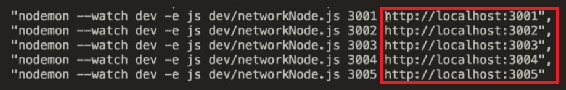

添加 URL 后，保存文件。现在我们已经将每个节点的 URL 作为参数传递给我们用来运行每个节点的命令。因此，我们应该可以在我们的文件内访问这些 URL，就像我们在我们的文件内访问我们的端口变量一样。

现在让我们转到`blockchain.js`文件，并在定义常量的部分，我们将输入以下内容：

```js
const currentNodeUrl = process.argv[3];
```

使用此命令，我们应该可以通过使用`currentNodeUrl`变量访问当前节点的 URL。

现在我们应该将`currentNodeUrl`分配给我们的`Blockchain`数据结构。我们通过在我们的`function Blockchain {}`内输入以下突出显示的代码行来执行此操作：

```js
function Blockchain() {
       this.chain = [];
       this.pendingTransactions = [];

       this.currentNodeUrl = currentNodeUrl;

       this.createNewBlock();
};
```

接下来，我们还希望我们的区块链能意识到我们网络中的所有其他节点。因此，我们将在上述突出显示的代码行下面添加以下代码：

```js
this.networkNodes = [];
```

在接下来的部分，我们将用我们网络中所有其他节点的节点 URL 填充这个数组，以便每个节点都能意识到我们区块链网络中的所有其他节点。

# 新端点概述

在我们的区块链中，我们现在想要创建一个网络，并且有一种方法来注册我们的所有不同节点。因此，让我们创建一些端点，这将使得我们可以向我们的网络注册节点成为可能。

# 定义`/register-and-broadcast-node`端点

我们创建的第一个端点将是`/register-and-broadcast-node`，定义如下：

```js
app.post('/register-and-broadcast-node', function (req, res) {

});
```

上述端点将注册一个节点并将该节点广播到整个网络。它将通过在`req` body 中传递我们要注册的节点的 URL 来执行此操作。因此，在上述端点内输入以下内容：

```js
const newNodeUrl = req.body.newNodeUrl;
```

我们现在不会构建这个端点，但是当我们在后面的部分中使用它时，我们将发送要添加到我们网络中的新节点的 URL。然后我们将进行一些计算并将节点广播到整个网络，以便所有其他节点也可以添加它。

# 创建/register-node 端点

`/register-node`将是我们将添加到我们网络中的下一个端点。定义如下：

```js
app.post('/register-node', function (req, res) {

});
```

这个端点将在网络中注册一个节点。

# `register-and-broadcast-node`和`register-node`端点之间的区别

现在让我们试着理解`/register-and-broadcast-node`和`/register-node`端点的不同之处。基本上，这里将发生的是，每当我们想要向我们的网络注册一个新节点时，我们将会命中`/register-and-broadcast-node`端点。这个端点将在自己的服务器上注册新节点，然后将这个新节点广播到所有其他网络节点。

这些网络节点将在`/register-node`端点内简单地接受新的网络节点，因为所有这些节点所要做的就是简单地注册广播节点。我们只希望它们注册新节点；我们不希望它们广播新节点，因为这已经发生了。

如果网络中的所有其他节点也广播新节点，那将严重影响我们的区块链网络性能，并导致一个无限循环，导致我们的区块链崩溃。因此，当所有其他网络节点接收到新节点的 URL 时，我们只希望它们注册而不广播。

# 定义/register-nodes-bulk 终端

在本节中，我们将构建的最终终端将是`/register-nodes-bulk`终端：

```js
app.post('/register-nodes-bulk', function (req, res) {

});
```

此终端将一次注册多个节点。

# 了解所有终端如何一起工作

在这个阶段了解所有这些终端可能会有点混乱，所以让我们尝试通过图表来理解。在下图中，我们有我们的区块链网络：

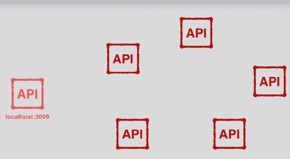

现在假设这五个网络节点已经相互连接，从而形成我们的去中心化网络。另外，假设我们想要将托管在`localhost:3009`上的节点添加到我们的网络中。

我们要做的第一件事是将该节点添加到我们的网络中，即在我们的网络节点中的一个上命中`register-and-broadcast-node`终端：

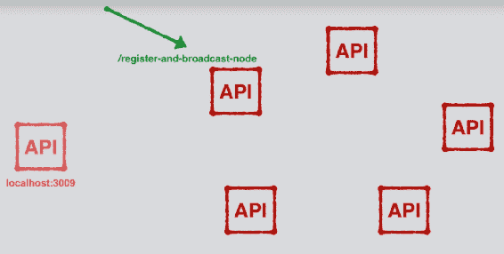

当我们命中`register-and-broadcast-node`终端时，我们需要发送我们想要添加到我们的网络中的新节点的 URL。对于我们的示例，URL 是`localhost:3009`。这是向我们的网络添加新节点的第一步。我们必须使用新节点的 URL 作为数据命中我们的`register-and-broadcast-node`终端。

在上图中，我们命中的网络节点将在其自己的节点上注册这个新的 URL，然后将这个新节点的 URL 广播到网络的其余部分。我们的网络中的所有其他节点将在`register-node`终端接收到这些数据：

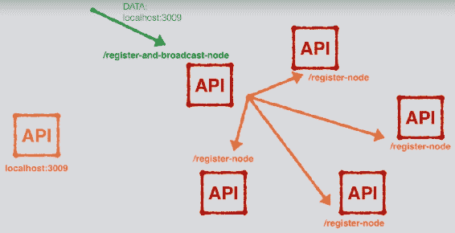

我们将在所有其他网络节点上命中`register-node`终端，因为我们不需要再广播数据，我们只需要注册它。

现在，在所有其他网络节点上注册了新的 URL 后，我们的原始节点将向新节点发出请求，并命中`register-node-bulk`终端：

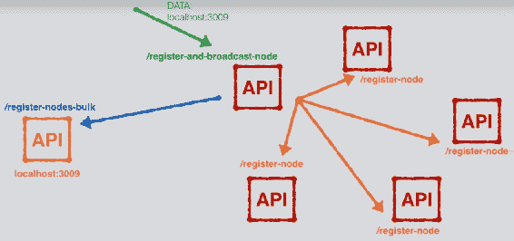

此外，原始节点将传递所有其他节点的 URL。因此，此调用将注册网络中已经存在的所有其他节点与新节点。

此时，该节点现在是网络的一部分，网络中的所有节点也将意识到网络中存在的所有其他节点。

现在让我们再次回顾整个过程。我们要做的第一件事是在我们的网络中的一个节点上命中`/register-and-broadcast-node`终端，以添加一个新节点到我们的网络中。此终端将注册新节点的 URL，然后将该新 URL 广播到网络中的所有其他节点。广播完成后，我们命中的原始网络节点将向新网络节点发送请求，并命中`register-nodes-bulk`终端。通过这样做，它将注册网络中的所有其他节点与我们的新节点。

因此，当整个过程完成时，所有这些节点将成为我们去中心化的区块链网络的一部分，并且它们将相互注册。

这就是这三个终端如何一起工作的。在接下来的部分，我们将构建`register-and-broadcast-node`终端。

# 构建/register-and-broadcast-node 终端

让我们开始构建我们的注册和广播节点终端。这个终端的功能将是向自身注册新节点，然后将新节点广播到网络中已经存在的所有其他节点。所以，让我们开始构建这个终端：

1.  从前面的部分，在`dev/networkNode.js`文件中，我们已经有以下代码：

```js
app.post('/register-and-broadcast-node', function(req, res) {
       const newNodeUrl = req.body.newNodeUrl;
```

在这里，我们定义了一个名为`newNodeUrl`的变量，这个`newNodeUrl`数据将被传递到请求体中，类似于我们将交易数据传递到交易端点的方式。有了`newNodeUrl`的访问权限，我们想要做的第一件事是注册节点到节点的`register-and-broadcast-node`端点。

1.  要注册它，我们所要做的就是将`newNodeUrl`放入我们的`blockchain`数据结构的`networkNodes`数组中。为此，在前面的代码块中添加以下突出显示的代码：

```js
app.post('/register-and-broadcast-node', function(req, res) {
       const newNodeUrl = req.body.newNodeUrl;
      bitcoin.networkNodes.push(newNodeUrl); 
```

1.  通过添加上述代码行，我们将`newNodeUrl`推送到`networkNodes`数组中。只有在数组中`newNodeUrl`尚未存在时才这样做。通过以下`if`语句来检查：

```js
app.post('/register-and-broadcast-node', function(req, res) {
       const newNodeUrl = req.body.newNodeUrl;
      if (bitcoin.networkNodes.indexOf(newNodeUrl) == -1) bitcoin.networkNodes.push(newNodeUrl);
```

`if`语句正在检查`newNodeUrl`是否已经存在于`networkNodes`数组中。如果不存在，则将其添加到数组中。因此，借助上述代码块，`newNodeUrl`将被注册到`register-and-broadcast-node`端点。

1.  现在我们已经注册了`newNodeUrl`，现在我们要做的是将其广播到网络中的所有其他节点。为此，在 if 块之后添加以下代码行：

```js
bitcoin.networkNodes.forEach(networkNodeUrl => {
    //... '/register-node' 

}
```

在上述代码块中，对于已经存在于网络中的每个网络节点，或者对于已经存在于`networkNodes`数组中的每个网络节点，我们都希望通过命中注册节点端点来注册我们的`newNodeUrl`。为此，我们将不得不在这个端点向每个单独的节点发出请求。

1.  我们将通过导入一个新的库来进行此请求。让我们去终端导入这个库。在终端中，我们将取消我们的第一个网络节点，然后输入以下命令：

```js
npm install request-promise --save 
```

1.  安装这个`request-promise`库将允许我们向网络中的所有其他节点发出请求。一旦安装了该库，再次输入`npm run node_1`来重新启动第一个节点。

1.  现在让我们去`dev/networkNode.js`文件，并将我们刚刚下载的库导入到代码中。在开头输入以下代码来导入库：

```js
const rp = require('request-promise');
```

在上述代码行中，`rp`代表请求承诺。

1.  现在让我们在`register-and-broadcast-node`端点中使用这个库。在这里，我们必须将我们的`newNodeUrl`广播到我们网络中的所有其他节点。使用我们刚刚导入的`request-promise`库来完成这个操作。

我们将要添加到代码中的下一些步骤可能看起来有点混乱，但不要担心。步骤完成后，我们将逐步走过代码，确保一切对您来说都是清晰的。现在让我们看看以下步骤：

1.  我们的`request-promise`库的第一件事是定义我们将使用的一些选项，因此输入以下突出显示的代码行：

```js
bitcoin.networkNodes.forEach(networkNodeUrl => {
    const requestOptions = {

 }

}
```

1.  在这个对象中，我们想要定义我们要为每个请求使用的选项。

1.  我们要定义的第一个选项是我们要命中的 URI/URL。我们知道我们要命中所有其他`networkNodeUrl`上的`register-node`端点。因此，我们将在前面的代码块中添加以下突出显示的代码行：

```js
bitcoin.networkNodes.forEach(networkNodeUrl => {
    const requestOptions = {
    uri: networkNodeUrl + '/register-node', 
    }

}
```

1.  接下来，我们想定义我们要使用的方法。要命中`register-node`端点，我们将不得不使用`POST`方法，因此在前面的代码块中添加以下代码：

```js
method: 'POST',
```

1.  然后我们想知道我们将传递哪些数据，所以添加以下内容：

```js
body: { newNodeUrl: newNodeUrl }
```

1.  最后，我们要将`json`选项设置为 true，这样我们就可以将其作为 JSON 数据发送：

```js
json: true
```

1.  这些是我们要用于每个请求的选项。现在让我们看看如何使用这些选项。在`requestOptions`块之后，添加以下代码行：

```js
rp(requestOptions)
```

1.  上述请求将返回一个 promise 给我们，我们希望将所有这些 promise 放在一个数组中。因此，在`forEach`循环之前和之内，执行以下突出显示的更改：

```js
const regNodesPromises = [];
bitcoin.networkNodes.forEach(networkNodeUrl => {
    const requestOptions = {
        uri: networkNodeUrl + '/transaction',
        method: 'POST',
        body: newTransaction,
        json: true
    };
 regNodesPromises.push(rp(requestOptions));
});
```

1.  现在在`forEach`循环之外，我们希望运行我们请求的所有 promise。在循环之后添加以下代码：

```js
Promise.all(regNodesPromises)
.then(data => {
    //use the data...
});
```

# 继续在/register-and-broadcast-node 端点上工作

在这一部分，让我们继续构建我们的`register-and-broadcast-node`端点。到目前为止，我们已经在当前网络节点上注册了新节点，并且已经将新节点广播到我们网络中的所有其他节点。因此，我们正在访问我们网络中所有其他节点上的`register-node`端点。另外，目前我们假设那些其他节点正在注册新节点，虽然我们还没有构建它，但我们假设它正在工作。

在整个广播完成后，我们必须将目前在我们网络中的所有节点注册到我们正在添加到网络中的新节点。为此，我们将使用我们的`request-promise`库。因此，我们需要定义一些选项，如下面的代码中所突出显示的：

```js
Promise.all(regNodesPromises)
.then(data => {
   const bulkRegisterOptions = { 
        uri: newNodeUrl + '/register-nodes-bulk'  
        method: 'POST',
 body: {allNetworkNodes: [...bitcoin.networkNodes,
        bitcoin.currentNodeUrl]} 
 json:true
 }; 
  });
});
```

在上述代码中，我们定义了要使用的选项（如`uri`）以及`POST`方法。在 body 选项中，我们定义了`allNetworkNodes`数组，并且在这个数组内，我们希望包含我们网络中所有节点的所有 URL，以及我们当前所在节点的 URL。此外，您可能已经注意到我们在数组中使用了扩展运算符`...`，因为`bitcoin.networkNodes`是一个数组，我们不希望一个数组嵌套在另一个数组中。相反，我们希望展开这个数组的所有元素并将它们放入我们的外部数组中。最后，我们希望将`json`定义为`true`。

接下来，我们想要发出请求，因此在选项块之后，添加以下内容：

```js
return rp(bulkRegisterOptions);
```

之后，添加以下内容：

```js
.then (data => {

})
```

在上述代码行中的`data`变量实际上将是我们从上述 promise 中收到的数据。我们不打算对这些数据做任何处理，但我们想要使用`.then`，因为我们想在我们的端点内进行下一步操作。但是，我们只能在上述 promise 完成后才能这样做。

在这个端点内我们必须完成的最后一步是向调用它的人发送一个响应。因此，输入以下突出显示的代码行：

```js
.then (data => {
    res.json({ note: 'New Node registered with network successfully' });
});
```

这就是我们的`register-and-broadcast-node`端点。

# `register-and-broadcast-node`端点功能的快速回顾

现在让我们再次运行这个端点，以便快速总结我们在这个端点中所做的工作，以便更好地理解这一点。每当我们想要将新节点注册到我们的网络时，`register-and-broadcast-node`端点是我们想要访问的第一个点。在这个端点内我们要做的第一件事是获取`newNodeUrl`并将其通过将其推入我们的`networkNodes`数组中注册到当前节点。

我们接下来要做的一步是将这个`newNodeUrl`广播到我们网络中的其他节点。我们是在`forEach`循环内做这个操作。在这个循环内发生的一切就是我们向我们网络中的每个其他节点发出请求。我们正在向`register-node`端点发出这个请求。然后我们将所有这些请求推入我们的`register-node`promise 数组中，然后简单地运行所有这些请求。

一旦所有这些请求都完成且没有任何错误，我们可以假设`newNodeUrl`已成功注册到我们的所有其他网络节点。

广播完成后，我们要做的下一件事是将我们网络中已经存在的所有网络节点注册到我们的新节点上。为了做到这一点，我们向新节点发出单个请求，然后命中`register-nodes-bulk`端点。我们传递给这个端点的数据是我们网络中已经存在的所有节点的 URL。

然后我们运行`rp(bulkRegisterOptions);`，尽管我们还没有构建`register-nodes-bulk`端点，但我们假设它正在工作，并且我们的所有网络节点已经成功地注册到我们的新节点上。一旦发生这种情况，我们的所有计算就完成了，我们只需发送一条消息，说明新节点已成功注册到网络中。

在这一点上，这可能看起来很多，但不要担心；建议您继续前进。在接下来的部分，我们将构建我们的`register-node`端点，然后是我们的`register-nodes-bulk`端点。随着我们的操作，一切都会变得更清晰。

# 构建/register-node 端点

现在我们已经构建了`/register-and-broadcast-node`端点，是时候继续进行一些不那么复杂的事情了。在本节中，让我们开始构建`register-node`端点。与我们在上一节中构建的端点相比，这将非常简单。

这个`register-node`端点是网络中的每个节点都将接收到由我们的`register-and-broadcast-node`端点发送的广播。这个`register-node`端点唯一需要做的就是将新节点注册到接收到请求的节点上。

要开始构建`register-node`端点，请按照以下步骤进行：

1.  我们要做的第一件事是定义`newNodeUrl`；因此，添加以下突出显示的代码行：

```js
// register a node with the network
app.post('/register-node', function(req, res) {
       const newNodeUrl = req.body.newNodeUrl;
});
```

上一行代码只是简单地说明要使用发送到`req.body`的`newNodeUrl`的值。这是我们发送到`/register-node`端点的数据，我们将把新的`nodeNodeUrl`保存为`newNodeUrl`变量。

1.  接下来，我们要将`newNodeUrl`变量注册到接收到请求的节点上。为此，请添加以下突出显示的代码行：

```js
// register a node with the network
app.post('/register-node', function(req, res) {
      const newNodeUrl = req.body.newNodeUrl; bitcoin.networkNodes.push(newNodeUrl);
});
```

上面的代码将我们的新节点注册到我们当前所在的节点。我们要做的就是将`newNodeUrl`简单地推送到当前节点的`networkNodes`数组中。

1.  现在，我们要做的最后一件事就是发送一个响应，所以输入以下突出显示的代码行：

```js
// register a node with the network
app.post('/register-node', function(req, res) {
      const newNodeUrl = req.body.newNodeUrl;bitcoin.networkNodes.push(newNodeUrl);
      res.json({ note: 'New node registered successfully.' }); 
});
```

1.  接下来，我们要在这个端点内进行一些错误处理。我们唯一要做的就是，如果`newNodeUrl`在数组中不存在，就将其添加到我们的`networkNodes`数组中。为了做到这一点，我们将在`bitcoin.networkNodes.push(newNodeUrl)`的开头添加一个 if 语句。但在此之前，让我们定义一个变量，如下所示：

```js
// register a node with the network
app.post('/register-node', function(req, res) {
      const newNodeUrl = req.body.newNodeUrl;
 const nodeNotAlreadyPresent = 
         bitcoin.networkNodes.indexOf(newNodeUrl) == -1; bitcoin.networkNodes.push(newNodeUrl);
       res.json({ note: 'New node registered successfully.' }); 
});
```

上面突出显示的行是在说明，如果`newNodeUrl`的索引是-1，或者换句话说，如果`newNodeUrl`在我们的网络节点中不存在，那么`nodeNotAlreadyPresent`变量将为 true。如果`newNodeUrl`已经存在于我们的`networkNodes`数组中，那么这个变量将为 false。

1.  在 if 语句中，我们要说明的是，如果`newNodeUrl`不在我们的`networkNodes`数组中，则通过运行`bitcoin.networkNodes.push(newNodeUrl)`将其添加进去：

```js
if (nodeNotAlreadyPresent ) bitcoin.networkNodes.push(newNodeUrl);
```

1.  接下来，我们还要处理另一种情况，即如果`newNodeUrl`实际上是我们当前所在节点的 URL，我们不希望将`newNodeUrl`推送到我们的`networkNodes`数组中。为了在代码中提到这个条件，我们首先必须定义一个变量：

```js
const notCurrentNode = bitcoin.currentNodeUrl !== newNodeUrl;
```

前面的一行只是评估`bitcoin.currentNodeUrl !== newNodeUrl`表达式，该表达式说明`currentNodeUrl`是否等于`newNodeUrl`。如果不是，则`notCurrentNode`变量将为 true。如果它们相等，则变量将为 false。

1.  接下来，我们只需将`notCurrentNode`变量添加到我们的 if 语句中，如下所示：

```js
if (nodeNotAlreadyPresent && notCurrentNode ) bitcoin.networkNodes.push(newNodeUrl);
```

这个 if 语句中发生的事情是，如果新节点不在我们的`networkNodes`数组中，并且新节点的 URL 与我们当前所在的节点不同，那么我们只想将新节点添加到我们的`networkNodes`数组中。

我们在端点内部进行错误处理。

# 测试/register-node 端点

在本节中，让我们测试`/register-node`端点，以确保它正常工作并更好地了解其工作原理。

# 安装请求库

在测试端点之前，我们需要进行一个小更新。更新涉及安装请求库。在几个部分之前，我们安装了`request-promise`库。现在，为了测试我们刚刚创建的端点，可能需要我们也安装请求库，这取决于我们安装的`request-promise`库的版本。

要安装请求库，只需转到终端，并在`blockchain`目录中运行以下命令：

```js
npm install request --save
```

# 端点测试

在进行测试之前，请检查您的终端中是否有我们的五个网络节点都在运行。如果没有，那么您将需要设置它们。使用 Postman 测试`register-node`端点：

1.  首先，我们将在地址栏中输入`http://localhost:3001/register-node`，如下截图所示：

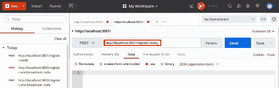

当我们访问这个端点时，我们需要在`req.body`上发送`newNodeUrl`作为数据。我们现在需要设置它。因此，在 Postman 的 Body 选项卡中，我们希望选择原始和 JSON（application/json）作为文本。

1.  然后，在文本框中，创建一个对象并添加以下代码：

```js
{
    "newNodeUrl":""
}
```

1.  现在假设我们要使用端口`3002`上运行的节点注册我们运行在端口`3001`上的节点。将以下内容添加到我们之前的代码中：

```js
{
    "newNodeUrl":"http://localhost:3002"
}
```

到目前为止，我们已经使用运行在`localhost:3002`上的节点注册了我们运行在`localhost:3001`上的节点。因此，当我们访问`http://localhost:3001/register-node`时，我们的`localhost:3002`应该出现在第一个节点（即`localhost:3001`）的`networkNodes`数组中，因为这个`register-node`端点通过将节点放入`networkNodes`数组中来注册节点。

1.  要验证这一点，打开 Postman 并单击发送按钮。您将收到响应“新节点成功注册”。现在转到浏览器，输入`localhost:3001/blockchain`到地址栏，然后按*Enter*。您将看到类似于以下截图所示的输出：

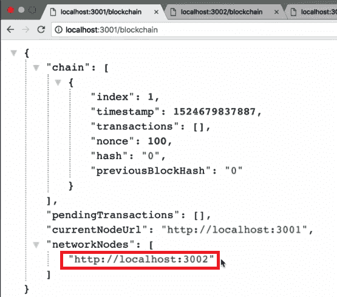

由于我们刚刚使用`localhost:3001`上的当前节点注册了我们的第二个节点，因此我们的第二个节点的 URL 现在在这个数组中。

按照相同的步骤，您也可以尝试注册其他节点。尝试进行实验。这将帮助您更清楚地了解已注册的节点。如果遇到任何问题，请尝试重新阅读整个过程。

我们要注意的一件重要的事情是，如果我们现在转到`localhost:3002/blockchain`，我们会发现`networkNodes`数组中没有注册的网络节点。

理想情况下，我们希望发生的是，当我们注册一个新节点时，我们希望它也进行反向注册。因此，如果我们使用`3001`上的节点注册`localhost:3002`，那么我们`3002`上的节点应该注册`localhost:3001`。这样，这两个节点都将彼此知晓。

实际上，我们已经在`register-and-broadcast-node`端点内构建了这个功能。一旦我们构建了这三个端点，我们提到的功能将正常工作。

# 构建/register-nodes-bulk 端点

我们要构建的下一个端点是我们的`register-nodes-bulk`端点；这是我们需要构建的最终端点。我们一直在处理的这三个端点将共同工作，创建我们的去中心化区块链网络。

在开始构建端点之前，让我们试着理解一下`register-nodes-bulk`端点的作用。每当一个新节点被广播到网络中的所有其他节点时，我们希望获取已经存在于网络中的所有节点，并将这些数据发送回我们的新节点，以便新节点可以注册和识别已经存在于网络中的所有节点。

`register-nodes-bulk`端点将接受包含已经存在于网络中的每个节点的 URL 的数据。然后，我们将简单地注册所有这些网络节点到新节点。

新节点是命中`register-nodes-bulk`端点的节点。这个端点只会在我们的网络中添加新节点时才会命中。

1.  要构建`register-nodes-bulk`端点，我们将假设我们当前网络中的所有节点 URL 都作为数据传递，并且我们可以在`req.body.allNetworkNodes`属性上访问它们。这是因为在`Promise.all(regNodesPromise)`块中调用此端点时，我们正在发送`allNetworkNodes`数据。在这里，我们正在将`allNetworkNodes`发送到`register-nodes-bulk`端点。这将使我们能够在端点内部访问`allNetworkNodes`数据。

1.  让我们在之前创建的`register-nodes-bulk`端点中添加以下代码行：

```js
app.post('/register-nodes-bulk', function (req, res) {
    const allNetworkNodes = req.body.allNetowrkNodes;

});
```

1.  接下来，让我们循环遍历`allNetworkNodes`数组中存在的每个节点 URL，并将其注册到新节点，如下所示：

```js
app.post('/register-nodes-bulk', function (req, res) {
    const allNetworkNodes = req.body.allNetowrkNodes;
    allNetworkNodes.forEach(networkNodeUrl => { 
 //...
 });

});
```

1.  现在，在循环中我们要做的就是将每个网络节点 URL 注册到我们当前所在的节点，也就是正在添加到网络中的新节点：

```js
app.post('/register-nodes-bulk', function (req, res) {
    const allNetworkNodes = req.body.allNetowrkNodes;
    allNetworkNodes.forEach(networkNodeUrl => { 
        bitcoin.networkNodes.push(metworkNodeUrl);
    });

});
```

在上面突出显示的代码行中发生的情况是，当我们通过`forEach`循环遍历所有网络节点时，我们通过将`networkNodeUrl`推送到我们的`networkNodes`数组中来注册每一个节点。

每当我们命中`/register-nodes-bulk`端点时，我们都在添加到网络中的新节点上。所有这些`networkNodeUrls`都将被注册到我们正在添加的新节点上。

1.  现在有几种情况下，我们不希望将`networkNodeUrl`添加到我们的`networkNodes`数组中。为了处理这些情况，我们将使用一个 if 语句。但在此之前，我们需要定义一个条件语句，如下所示：

```js
const nodeNotAlreadyPresent = bitcoin.networkNodes.indexOf(networkNodeUrl) == -1;
```

如果`networkNodeUrl`已经存在于`networkNodes`数组中，我们就不希望将其添加到`networkNodes`数组中；这就是我们在条件语句中提到的。

这个语句所做的就是测试我们当前所在的`networkNodeUrl`是否存在于我们的`networkNodes`数组中。从这里，它将简单地将其评估为真或假。

1.  现在我们可以添加`nodeNotAlreadyPresent`变量和 if 语句，如下面的代码中所突出显示的那样：

```js
app.post('/register-nodes-bulk', function (req, res) {
    const allNetworkNodes = req.body.allNetowrkNodes;
    allNetworkNodes.forEach(networkNodeUrl => {
    const nodeNotAlreadyPresent = 
      bitcoin.networkNodes.indexOf(networkNodeUrl) == -1; 
        if(nodeNotAlreadyPresent)bitcoin.networkNodes.push(networkNodeUrl);
 });

});
```

上面的 if 语句说明，如果节点尚未存在于我们的`networkNodes`数组中，那么我们将注册该节点。

1.  现在，另一种情况是，如果要注册的网络节点具有与我们当前所在的网络节点相同的 URL，我们就不希望注册该网络节点。为了处理这个情况，我们需要另一个变量：

```js
const notCurrentNode = bitcoin.currentNodeUrl !==networkNodeUrl
```

1.  接下来，将这个变量添加到我们的`if`语句中：

```js
app.post('/register-nodes-bulk', function (req, res) {
    const allNetworkNodes = req.body.allNetowrkNodes;
    allNetworkNodes.forEach(networkNodeUrl => {
    const nodeNotAlreadyPresent = 
      bitcoin.networkNodes.indexOf(networkNodeUrl) == -1; 
        if(nodeNotAlreadyPresent && notCurrentNode)
         bitcoin.networkNodes.push(networkNodeUrl);
 });

});
```

基本上，在`if`语句中我们所陈述的是，当我们循环遍历每个要添加的网络节点时，如果该节点尚未存在于我们的网络节点数组中，并且该节点不是我们当前节点的 URL，那么我们就要将`networkNodeUrl`添加到我们的`networkNodes`数组中。

1.  完成`forEach`循环后，我们将注册所有已经存在于我们区块链网络中的网络节点。在这一点上，我们所要做的就是发送回一个响应，如下所示：

```js
app.post('/register-nodes-bulk', function (req, res) {
    const allNetworkNodes = req.body.allNetowrkNodes;
    allNetworkNodes.forEach(networkNodeUrl => {
    const nodeNotAlreadyPresent = 
      bitcoin.networkNodes.indexOf(networkNodeUrl) == -1; 
        if(nodeNotAlreadyPresent && notCurrentNode)
         bitcoin.networkNodes.push(networkNodeUrl);
 });
res.json({note: 'Bulk registration successful.' });

});
```

让我们快速回顾一下我们到目前为止所做的工作。我们构建的端点接受所有网络节点作为数据，然后我们循环遍历已经存在于我们区块链网络中的所有网络节点。对于每个节点，只要它尚未注册到`currentNode`并且不是与`currentNode`相同的 URL，我们就会将该节点添加到我们的`networkNodes`数组中。

# 测试/register-nodes-bulk 端点

在这一部分，我们将测试我们的`register-nodes-bulk`端点，以确保它正常工作。这将使我们清楚地了解它的工作原理：

1.  为了测试这个端点，我们将前往 Postman。在这里，我们将命中`localhost:3001/register-nodes-bulk`端点。当我们测试这个端点时，我们期望收到一些数据，即`allNetworkNodes`数组。

1.  因此，在 Postman 的 body 选项卡中，选择原始选项和 JSON（application/json）格式，将以下代码添加到 body 中：

```js
{
    "allNetworkNodes": []
}
```

1.  在这个数组中，将包含已经存在于我们区块链网络中的所有节点的 URL：

```js
{
    "allNetworkNodes": [
    "http://localhost:3002",
    "http://localhost:3003",
    "http://localhost:3004"
    ]
}
```

1.  当我们现在运行这个请求时，我们应该在运行在`localhost:3001`上的节点上注册这三个 URL。让我们看看是否有效。点击发送按钮，您将收到一个回复，说明批量注册成功。

1.  现在，如果我们转到浏览器，我们可以双重检查它是否有效。在地址栏中，键入`localhost:3001/blockchain`，然后按*Enter*。您将看到`networkNodes`数组中添加的三个 URL，因为它们是批量注册的：

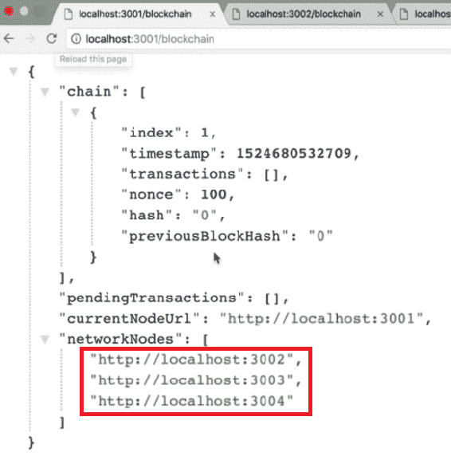

同样，您可以尝试通过将新节点添加到不同 URL 上的其他节点来进行实验。您将观察到这些节点的`networkNodes`数组中的类似响应。

因此，看起来我们的`register-node-bulk`端点正在按照预期工作。

# 测试所有网络端点

根据我们在前面部分学到的知识，我们知道我们的`register-node`路由和`register-nodes-bulk`路由都正常工作。因此，在本节中，让我们把它们全部整合起来，测试我们的`register-and-broadcast-node`路由，该路由同时使用了`register-node`路由和`register-nodes-bulk`路由。

`register-and-broadcast-node`端点将允许我们通过创建网络并向其添加新节点来构建分散的区块链网络。让我们立即进入我们的第一个示例，以更好地理解它。为了理解`register-and-broadcast-node`路由的工作原理，我们将使用 Postman。

在 Postman 应用程序中，我们要发出一个 post 请求，以在`localhost:3001`上注册和广播节点。但在这之前，只需确保所有四个节点都在运行，以便我们可以测试路由。

此时，我们根本没有网络；我们只有五个独立的节点在运行，但它们没有以任何方式连接。因此，我们将要做的第一个调用只是简单地将两个节点连接在一起，以形成我们网络的开端。我们现在将一个节点注册到我们在端口`3001`上托管的节点。当我们命中`register-and-broadcast-node`端点时，我们必须发送一个要注册的`newNodeUrl`。在 Postman 中，添加以下代码：

```js
{
    "newNodeUrl": ""
}
```

对于这个第一次测试，我们想要将我们托管在端口`3002`上的第二个节点注册到我们的第一个节点。为此，我们将添加以下突出显示的代码：

```js
{
    "newNodeUrl": "http://localhost:3002"
}
```

现在，当我们发出这个请求时，它应该将我们托管在`localhost:3002`上的节点注册到我们托管在`localhost:3001`上的节点。让我们通过单击“发送”按钮来验证这一点。您将看到类似于以下屏幕截图中显示的输出：

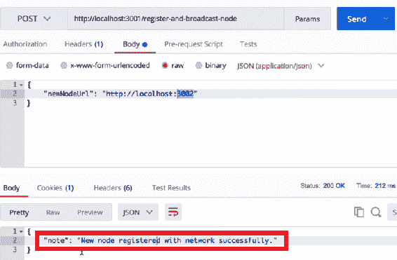

从前面的屏幕截图中，我们可以看到新节点已成功注册到网络。让我们通过转到浏览器来验证这一点。

在浏览器中，您将可以访问所有正在运行的五个节点。我们现在已经将端口`3002`上的节点注册到了托管在`localhost:3001`上的节点。因此，如果我们现在在浏览器上刷新页面，我们将看到`localhost:3002`已经在端口`3001`的`networkNodes`数组中注册了：

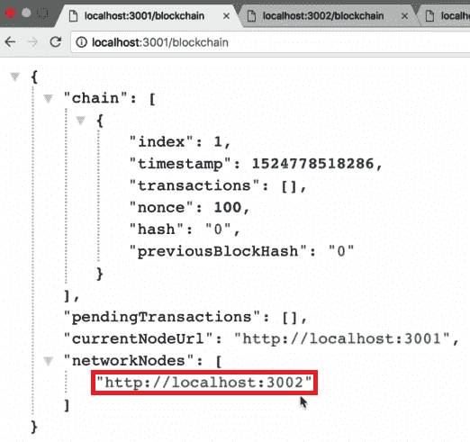

从前面的屏幕截图中，我们可以看到我们已经注册了`localhost:3002`。现在，如果我们转到`localhost:3002`，我们应该在它的`networkNodes`数组中有`localhost:3001`注册。让我们刷新并看看我们在这里得到了什么：

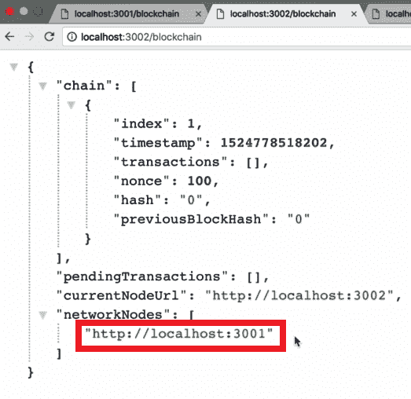

从前面的屏幕截图中，我们可以看到两个节点现在已经形成了一个网络，并将彼此注册为网络节点。

接下来，让我们向这个网络添加另一个节点。让我们回到 Postman，并将`localhost:3002`更改为`localhost:3003`。我们将向在`3001`上的节点发出请求：

```js
{
    "newNodeUrl": "http://localhost:3003"
}
```

这应该是将我们托管在`localhost:3003`上的节点与网络中的所有其他节点注册。因此，`3003`应该注册到`3001`和`3002`。让我们发送这个请求，看看它是否成功注册。如果成功注册，您将看到类似于以下屏幕截图中显示的输出：

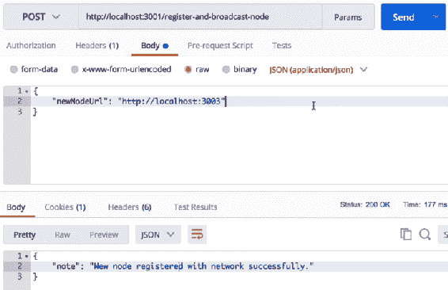

让我们在浏览器中验证这一点。当我们在`localhost:3001`中刷新时，我们应该在`networkNodes`数组中有`localhost:3003`：

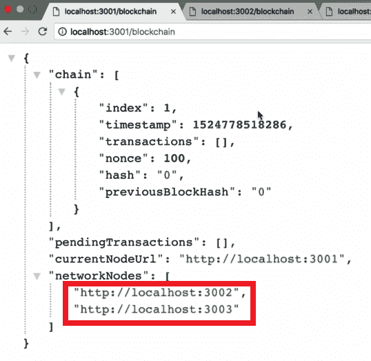

现在，由于`localhost:3002`也是网络的一部分，它的`networkNodes`数组中应该有`localhost:3003`。当我们发出这个请求时，我们是发给`3001`而不是`3002`。`localhost:3002`已经是网络的一部分，广播注册了`3003`与网络中存在的所有网络节点。要验证这一点，请刷新`3002`上的`networkNodes`数组。您将看到类似于以下屏幕截图中显示的输出：

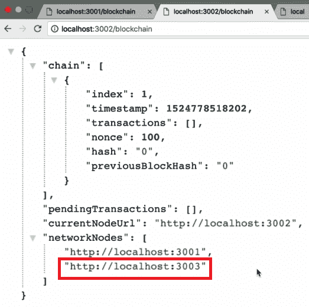

从前面的屏幕截图中，我们可以看到我们的第三个节点现在也在`localhost:3002`的`networkNodes`数组中。此外，如果我们转到`localhost:3003`上的`networkNodes`并刷新页面，我们应该在`networkNodes`数组中有`3001`和`3002`：

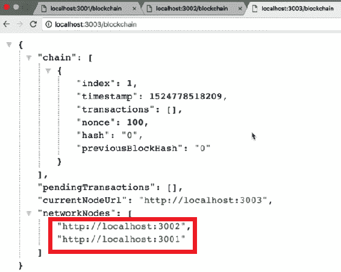

因此，我们现在有一个由`3001`、`3002`和`3003`节点组成的网络。这些节点已经相互注册。

现在，让我们回到 Postman，并按照注册初始节点的相同步骤，将剩下的`localhost:3004`和`localhost:3005`注册到网络中。

在将`3004`和`3005`注册到网络后，如果您转到浏览器，所有这些注册节点应该在它们的`networkNodes`数组中包含`localhost:3004`和`localhost:3005`。刷新`localhost:3001`页面，您将看到类似于以下屏幕截图中显示的输出：

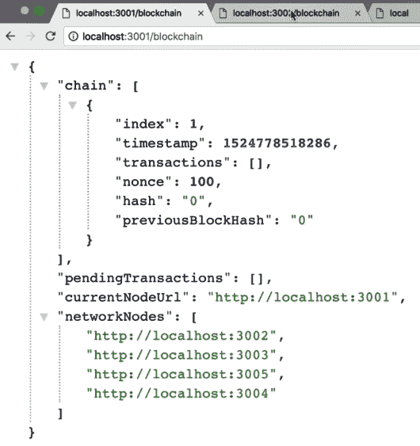

同样地，如果您刷新其他页面，您将能够观察到所有节点，类似于我们在前面的屏幕截图中观察到的。

这就是我们建立了一个由五个不同节点组成的去中心化网络。

现在，您可能想知道所有这些是如何工作的。它之所以能够工作，是因为当我们发出`"newNodeUrl": "http://localhost:3004"`的请求时，我们实际上是在添加一个命令，将`3004`添加到网络中。但是`localhost:3004`如何在一次请求中意识到整个网络呢？

如果您还记得前面的部分，当我们构建`/register-and-broadcast-node`端点时，实际上进行了大量的计算。因此，如果我们看一下`/register-and-broadcast-node`端点的代码，我们可以看到我们的`register-and-broadcast-node`端点内部发生的第一件事是接收`newNodeUrl`，然后通过访问它们的`register-node`端点将其广播到网络中的每个节点。因此，网络中的每个节点都将意识到新添加的节点。

有关完整的代码，请访问[`github.com/PacktPublishing/Learn-Blockchain-Programming-with-JavaScript/blob/master/dev/networkNode.js`](https://github.com/PacktPublishing/Learn-Blockchain-Programming-with-JavaScript/blob/master/dev/networkNode.js)，并参考以此注释开头的代码块：`//registering a node and broadcasting it the network`。

然后，在广播发生后，我们向刚刚添加的新节点发送请求，并使用新节点注册网络中已经存在的所有网络节点。这就是反向注册发生的地方。在这一点上，网络中的所有原始节点都意识到了新节点，而新节点也意识到了网络中的所有其他节点。因此，网络中的所有节点都意识到了彼此，这是我们的区块链正常工作所必须发生的事情。

因此，我们构建的这三个端点（`register-and-broadcast-node`、`register-node`和`register-nodes-bulk`）非常强大，因为它们共同工作以创建一个分散的区块链网络。这就是我们在本章中构建的内容。

在本书的这一部分，建议您花一些时间玩弄这些端点，创建不同的具有不同节点的网络，并进行一些测试，以更熟悉它的工作原理。

如果您对我们所涵盖的任何概念或主题感到困惑，建议您再次阅读本章的所有部分。您会惊讶地发现，在您已经对即将发生的事情和我们将要构建的内容有一些背景之后，第二次阅读时您可以学到多少东西。

# 总结

我们现在已经完成了创建我们的分散网络。在本章中，我们学习了许多新概念。我们开始学习如何创建我们 API 的多个实例以及如何使用它们来设置我们的分散网络。然后，我们定义了各种端点，如`register-and-broadcast-node`、`register-node`和`register-nodes-bulk`。之后，我们构建了这些端点并对其进行了测试。

在下一章中，我们将学习如何同步网络。
