# 第五章：同步网络

在之前的章节中，我们构建了一个由五个节点组成的网络。每个节点都知道网络中的所有其他节点，这创建了一个去中心化的区块链网络。现在我们需要创建一个同步的网络，以便每个节点上的区块链都是相同的，数据在整个网络中是一致的。我们不能容忍在不同节点上运行不同版本的区块链，因为这将完全破坏区块链的目的。应该只有一个版本的区块链在每个节点上是一致的。因此，在本章中，让我们同步在第四章中构建的网络，*创建一个去中心化的区块链网络*。我们将通过在网络中的所有节点之间广播已挖掘的交易和新区块来实现这一点。

在本章中，将涵盖以下主题：

+   理解同步网络的需求

+   构建/transaction/broadcast 端点

+   重构`createTransaction`方法和`/transaction`端点

+   测试交易端点

+   更新挖矿信息

+   构建/receive-new-block 端点

+   测试新的和更新的/mine 端点

让我们开始同步网络。

# 理解同步网络的需求

让我们试着理解为什么网络需要同步。我们目前有一个由五个节点组成的去中心化区块链网络。这些节点之间的数据不一致；每个节点上的数据可能不同，这将导致区块链的目的失败。让我们通过一个例子来理解这种情况。在 Postman 中发送一个示例交易，如下截图所示：

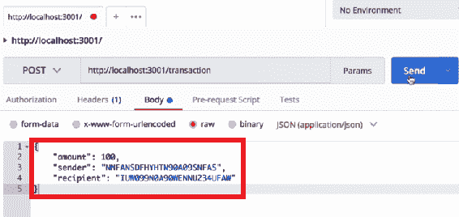

通过单击“发送”按钮将此交易发送到托管在`localhost:3001`上的节点。此交易将出现在`localhost:3001/blockchain`的`pendingTransactions`数组中，您可以在以下截图中观察到：

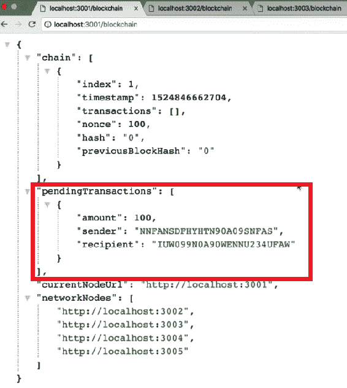

现在，转到任何其他节点并检查发送的交易。我们将无法在这些节点的`pendingTransactions`数组中查看交易。发送的示例交易只会出现在`localhost:3001`节点中。它不会广播到网络中的任何其他节点。

在本章中，您要做的是重构/transaction 端点，以便每当创建交易时，它都会广播到所有节点。这意味着所有节点将具有相同的数据。我们需要做同样的事情来挖掘一个区块。让我们重构/mine 端点，以便每当挖掘出一个新块时，它也会广播到整个网络。这意味着整个网络是同步的，并且具有相同数量的区块。通过网络同步数据是区块链技术的一个重要特性。

# 重构 createNewTransaction 方法和/transaction 端点

在本节中，让我们通过将`createNewTransaction`方法拆分为两个独立的部分来重构。一部分将简单地创建一个新交易，然后返回该交易，另一部分将把新交易推送到`pendingTransactions`数组中。我们还将创建一个名为`/transaction/broadcast`的新交易端点。此端点将允许我们在整个区块链网络中广播交易，以便每个节点具有相同的数据，并且整个网络是同步的。

# 修改 createNewTransaction 方法

在这里，让我们将`createNewTransaction`方法拆分为两个独立的方法，修改如下：

1.  转到`dev/blockchain.js`文件中的`createNewTransaction`方法。我们在第二章中构建了这个方法，*构建区块链*中的*创建 createNewTransaction 方法*部分。参考以下`createNewTransaction`方法：

```js
Blockchain.prototype.createNewTransaction = function (amount, sender, recipient) {
    const newTransaction = {
        amount: amount,
        sender: sender,
        recipient: recipient,
    };
    this.newTransactions.push(newTransaction);
    return.this.getlastBlock() ['index'] + 1;
}
```

1.  让我们对该方法进行以下突出显示的修改：

```js
Blockchain.prototype.createNewTransaction = function (amount, sender, recipient) {
    const newTransaction = {
        amount: amount,
        sender: sender,
        recipient: recipient,
        transactionId: uuid().split('-').join('')
    };
    return newTransaction;
}
```

在这里，为每个交易添加了一个 ID。为了创建这个 ID，使用了一个唯一的字符串，这与我们在第三章中用于创建节点地址的方法非常相似，*通过 API 访问区块链*。

1.  使用`uuid`库创建 ID 的唯一字符串。因此，在`dev/blockchain.js`文件的开头，定义所有常量的地方，您需要添加以下代码行，以便在我们的项目中使用`uuid`库：

```js
const uuid = require('uuid/v1');
```

在修改后的方法中，您可以观察到添加了以下代码行，以为`transactionId`值创建唯一的字符串。这是实现`uuid`库的地方：

```js
transactionId: uuid().split('-').join('')
```

在这里，`.split()`函数将去除添加到唯一字符串的破折号，然后`.join()`函数将重新连接字符串，以输出每个交易的唯一`Id`。

# 构建 addTransactionToPendingTransactions 方法

接下来，我们需要将返回的`newTransaction`推送到区块链的`pendingTransactions`数组中。因此，让我们创建另一个名为`addTransactionToPendingTransactions`的方法：

1.  在`dev/blockchain.js`文件中，`addTransactionToPendingTransactions`方法将定义如下：

```js
Blockchain.prototype.addTransactionToPendingTransactions = function(transactionObj) {
};
```

1.  接下来，获取`transactionObj`并将其推送到区块链的`pendingTransactions`数组中：

```js
Blockchain.prototype.addTransactionToPendingTransaction = function(transactionObj) {
    this.pendingTransactions.push(transactionObj);

};
```

1.  然后，我们只需返回添加了交易的区块的索引：

```js
Blockchain.prototype.addTransactionToPendingTransaction = function(transactionObj) {
    this.pendingTransaction.push(transactionObj);
    return this.getLastBlock()['index'] + 1;
};
```

简而言之，我们修改了`createNewTransaction`方法，该方法创建一个新的交易，并返回该新交易。然后，我们创建了一个名为`addTransactionToPendingTransactions`的新方法。该方法接受一个`transactionObj`并将其添加到区块链上的`pendingTransactions`数组中。之后，我们只需返回添加了新交易的区块的索引。

# 构建/transaction/broadcast 端点

在本节中，让我们构建一个名为`/transaction/broadcast`的新端点。从现在开始，每当我们想要创建一个新的交易时，我们将访问此`/transaction/broadcast`端点。此端点将执行两项操作：

+   它将创建一个新的交易。

+   然后，它将向网络中的所有其他节点广播该新交易。

让我们按以下步骤创建端点：

1.  要添加此端点，请转到`dev/networkNode.js`文件，我们在其中定义了所有端点，并按以下方式添加新端点：

```js
app.post('/transaction/broadcast', function(req, res) )  {

});
```

1.  然后，为了使端点执行上述功能，将以下突出显示的代码添加到端点：

```js
app.post('/transaction/broadcast', function(req, res) )  {
    const newTransaction = bitcoin.createNewTransaction();

});
```

这里的`createNewTransaction()`方法是上一节中修改过的方法。

1.  `createNewTransaction()`方法接受`amount`、`sender`和`recipient`参数。对于我们的端点，让我们假设所有这些数据都被发送到`req.body`上。因此，这些参数将如下所示在以下代码中进行定义：

```js
app.post('/transaction/broadcast', function(req, res) )  {
    const newTransaction = bitcoin.createNewTransaction(req.body.amount, req.body.sender, req.body.recipient);

});
```

1.  接下来，让我们借助`addTransactionToPendingTransactions`方法将`newTransaction`变量添加到节点的`pendingTransactions`数组中。因此，在前面的代码行之后，添加以下行：

```js
bitcoin.addTransactionToPendingTransactions (newTransaction);
```

1.  现在，将新交易广播到网络中的所有其他节点。可以按以下方式完成：

```js
bitcoin.netowrkNodes.forEach(networkNodeUrl => {
    //...
});
```

1.  在这个`forEach`循环中，让我们定义广播交易的代码。为此，向网络中的所有其他节点的`/transaction`端点发出请求。因此，在循环内，添加以下行：

```js
const requestOptions = {

};
```

1.  然后，定义我们所有的选项，如下所示：

```js
const requestOptions = {
    uri: networkNodeUrl + '/transaction',
 method: 'POST',
 body: newTransaction,
 json: true
};
```

1.  接下来，让我们创建一个承诺数组，将所有请求推送到该数组中，以便我们可以同时运行所有请求。让我们在`forEach`循环之前定义数组如下：

```js
const requestPromises = []; 
```

1.  然后，在定义所有选项之后，进行请求如下：

```js
requestPromises.push(rp(requestOptions));
```

在这行代码之前，我们将把所有请求推送到`requestPromises`数组中。`forEach`循环运行后，我们应该在`requestPromises`数组中有所有我们定义的请求。

1.  接下来，让我们运行所有请求。在`forEach`循环之后，添加以下行：

```js
promise.all(requestPromises)
```

1.  最后，在所有请求运行后，我们将添加以下行：

```js
.then(data => {

});
```

1.  我们实际上不会使用所有这些请求返回的数据，但我们会发送一个响应，因为在这一点上，整个广播已经完成。因此，在上述代码块中，添加以下突出显示的代码：

```js
.then(data => {
    res.json({ note: 'Transaction created and broadcast successfully.'})
});
```

通过添加上述代码行，我们已成功完成了构建`/transaction/broadcast`端点。

# 重构/transaction 端点

在本节中，我们将重构`/transaction`端点，以便它可以与新的`/transaction/broadcast`端点完美配合。让我们应用以下步骤修改端点：

1.  首先，转到`dev/networkNode.js`文件，并删除`/transaction`端点中的所有内容。只有在进行广播时，才会访问`/transaction`端点。当访问`/transaction`端点时，`newTransaction`变量将作为数据发送。可以定义如下条件：

```js
app.post('/transaction', function(req, res) {
    const newTransaction = req.body;

};
```

在上面突出显示的行中，`newTransaction`变量通过`req.body`发送到`/transaction`端点。

1.  接下来，将新交易添加到接收调用的任何节点的`pendingTransactions`数组中。为此，将使用新的`addTransactionToPendingTransactions`方法。因此，在上述代码的后面，添加以下行：

```js
bitcoin.addTransactionToPendingTransactions();
```

1.  这个方法简单地接收`newTransaction`变量：

```js
bitcoin.addTransactionToPendingTransactions(newTransaction);
```

1.  现在，从`addTransactionToPendingTransactions`方法中，我们得到交易将被添加到的块的索引。让我们在新的`/transaction`端点中保存这个块索引。在上述代码的开始处，添加变量如下：

```js
const blockIndex = bitcoin.addTransactionToPendingTransactions(newTransaction);
```

1.  最后要做的是发送一个响应。在上述行之后，添加以下内容：

```js
res.json({ note: 'Transaction will be added in block ${blockIndex}.'});
```

我们现在已经完成了对`/transaction`端点的重构。

# 测试交易端点

让我们测试`/transaction/broadcast`和`/transaction`端点，确保它们能够正确配合工作。

对于这个测试，我们需要做的第一件事是将所有节点连接在一起，以构建一个网络。您可能还记得如何做到这一点，因为我们在第四章中学习过，*创建分散的区块链网络*。无论如何，我们将快速浏览一遍这些步骤，以便您记起来。

# 回顾如何创建网络

看一下以下步骤，了解如何连接所有节点：

1.  打开 Postman 并访问`/register-and-broadcast-node`路由。这可以在任何一个节点上完成。在我们的示例中，让我们使用`localhost:3001`。

1.  现在，在正文中，我们要通过传递其 URL 来向我们的网络添加一个新节点。让我们从第二个节点开始。看一下以下的截图：

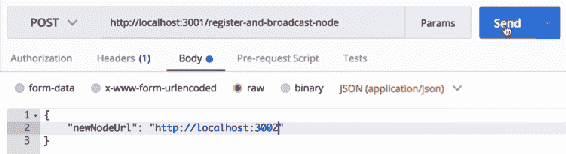

1.  然后，点击发送按钮发送请求。发送请求后，您将收到一个响应，上面写着“新节点已成功注册到网络”。您可以以相同的方式发送所有剩余的节点。

1.  要验证所有节点是否正确连接以形成网络，请转到浏览器，输入`localhost:3001/blockchain`在地址栏中，然后按*Enter*。您将在`networkNodes`数组中看到所有节点。

# 测试交易端点

现在区块链网络已经建立，让我们测试一下我们在之前部分创建的端点。

让我们创建一个交易并将其发送到`/transaction/broadcast`端点。返回到 Postman，命中端口为`3001`的节点的`/transaction/broadcast`端点。在这里，发送一些数据作为交易，如下面的屏幕截图所示：

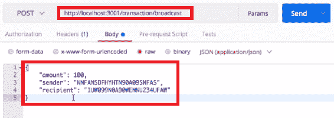

您发送的交易数据可以是任意随机数据。我们只需要金额、发送方和接收方。一旦添加了交易数据，让我们点击发送按钮发送此请求。如果交易成功发送，将收到一个响应，上面写着“交易已成功创建和广播”。

现在，转到浏览器，您应该能够在网络的每个节点上看到我们创建的交易。让我们检查一下这是否有效。在浏览器的地址栏中，输入`localhost:3001/blockchain`，然后按*Enter*。您应该看到`pendingTransactions`数组中的交易数据，如下面的屏幕截图所示：

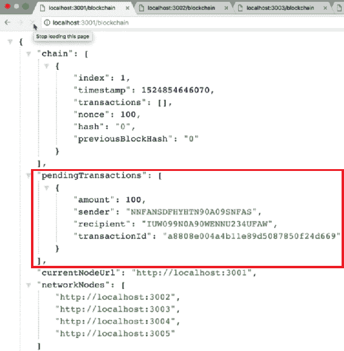

在这里，`pendingTransactions`数组中的交易现在也有一个以随机哈希开头的`transactionId`值。

接下来，打开另一个标签页，输入`localhost:3002/blockchain`在地址栏中，然后按*Enter*。您可以看到相同的交易数据可以在数组中看到：

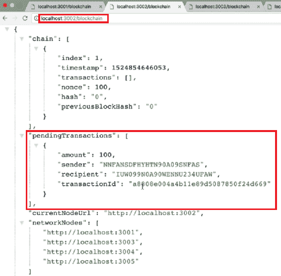

如果您转到网络中的其他节点，您可以对所有剩余节点进行类似的检查。您可以观察到每个节点的`pendingTransactions`数组中的相同交易数据。区块链网络中的每个节点现在都知道已创建新交易。

您也可以尝试使用其他交易数据测试端点。尝试将金额更改为`500`，将发送方和接收方的地址更改为随机哈希字符串，并尝试将此请求发送到托管在`localhost:3004`上的节点。这不会有任何影响，因为广播端点将交易数据发送到网络中的所有节点。因此，这个请求应该像上一个一样工作。在浏览器上检查响应，您应该能够看到两个具有不同交易 ID 的交易。

尝试使用不同的交易数据进行实验，以清楚了解`/transaction`和`/transaction/broadcast`端点的工作原理。

从测试中，我们可以得出结论，`/transaction/broadcast`端点和`/transaction`端点都按我们预期的那样正常工作。

在下一节中，我们将通过重构`/mine`端点来继续同步网络，以便它将新创建的新块广播到整个网络。

# 更新挖矿信息

同步网络所需的下一步是更新`/mine`端点。我们还将添加一个新的端点，称为`/receive-new-block`。有必要更新`/mine`端点，以便每当一个节点创建一个新块时，该新块被广播到网络中的所有其他节点。这意味着网络中的每个节点都知道已创建新块，并且托管区块链的所有节点保持同步。

# 更新后的挖矿流程

每当挖掘出一个新块时，它将在特定节点上被挖掘。为了理解更新后的挖矿流程，让我们假设我们希望一个托管在端口`3001`上的节点为区块链挖掘一个新块：

1.  首先，将在所选节点上命中`/mine`端点。当命中`/mine`端点时，通过工作证明创建一个新块。

1.  新块创建后，它将被广播到网络中的所有其他节点。所有其他节点将在其`/receive-new-block`端点接收到该新块。如下图所示：

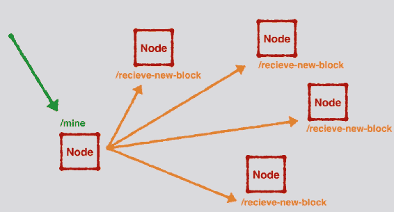

1.  广播完成后，整个网络将同步，并且所有节点将托管相同的区块链。

另一件事需要注意的是，当新区块被广播并且节点接收到它时，该新区块将在链验证该区块合法后被添加到链中。然后，节点清除其`pendingTransactions`数组，因为所有待处理交易现在都在它们刚刚收到的新区块中。

在接下来的几节中，我们将逐步构建整个过程。随着我们构建每个步骤，应该更容易看到所有内容是如何协同工作的。

# 重构`/mine`端点

通过实施以下步骤来重构`/mine`端点：

1.  转到`dev/networkNode.js`文件。在`/mine`端点中，在我们定义了`newBlock`变量的部分下面，让我们添加将新区块广播到网络中所有其他节点的功能。为此，请按照我们在前几节中介绍的相同过程进行，即循环遍历网络中的所有其他节点，向节点发出请求，并将`newBlock`变量作为数据发送：

```js
bitcoin.networkNodes.forEach(networkNodeUrl => {

})
```

前面的一行提到，对于每个`networkNodes`，我们将发出请求并发送`newBlock`。

1.  然后，我们需要发送一些请求选项。这些选项将定义如下：

```js
bitcoin.networkNodes.forEach(networkNodeUrl => {
    const requestOptions = {

 }; 

})
```

1.  该对象中的第一个选项是`uri`。我们要发送请求的`uri`将是`networkNodeUrl`和我们将要创建的新端点，即`/receive-new-block`。我们将在下一节中处理此端点：

```js
bitcoin.networkNodes.forEach(networkNodeUrl => {
    const requestOptions = {
        uri: networkNodeUrl + '/receive-new-block',   
    }; 

})
```

1.  要添加的下一个选项是将使用的方法，即`POST`方法：

```js
bitcoin.networkNodes.forEach(networkNodeUrl => {
    const requestOptions = {
        uri: networkNodeUrl + '/receive-new-block', method: 'POST',   
    }; 

})
```

1.  接下来，让我们发送将在`body`中的数据。我们还想发送一个`newBlock`实例：

```js
bitcoin.networkNodes.forEach(networkNodeUrl => {
    const requestOptions = {
        uri: networkNodeUrl + '/receive-new-block',method: 'POST',        body: { newBlock: newBlock }
    }; 

})
```

1.  最后，在`body`之后，将`json`设置为`true`，如下所示：

```js
bitcoin.networkNodes.forEach(networkNodeUrl => {
    const requestOptions = {
        uri: networkNodeUrl + '/receive-new-block',method: 'POST',       body: { newBlock: newBlock },
        json: true
    }; 

})
```

1.  之后，通过添加以下突出显示的代码，进行请求：

```js
bitcoin.networkNodes.forEach(networkNodeUrl => {
    const requestOptions = {
        uri: networkNodeUrl + '/receive-new-block',method: 'POST',       body: { newBlock: newBlock },
       json: true
    }; 
    rp(requestOptions)
})
```

1.  每次进行这些请求时，它都会返回一个 promise。通过添加以下突出显示的代码，让我们创建所有这些 promises 的数组：

```js
const requestPromises = [];
bitcoin.networkNodes.forEach(networkNodeUrl => {
    const requestOptions = {
        uri: networkNodeUrl + '/receive-new-block',method: 'POST',       body: { newBlock: newBlock },
       json: true
    }; 
    requestPromises.push(rp(requestOptions));
});
```

在我们的`forEach`循环运行后，我们应该有一个充满了 promises 的数组。

1.  接下来，让我们运行所有这些 promises。因此，在`forEach`块之后，添加以下代码：

```js
Promise.all(requestPromises)
.then(data => {
    // ....
})
```

所有请求运行后，我们希望在`.then(data => { })`内执行另一个计算。如果记得，当创建新交易时，挖矿奖励交易代码`bitcoin.createNewTransaction(12.5, "00", nodeAddress);`需要在整个区块链网络中广播。目前，当挖掘出新区块时，我们创建了一个挖矿奖励交易，但它没有广播到整个网络。为了广播它，请求将被发送到`/transaction/broadcast`端点，因为它已经具有广播交易的功能。我们只需使用传递的挖矿奖励交易数据调用此端点。

1.  然而，在传递挖矿奖励交易数据之前，我们需要一些请求选项：

```js
Promise.all(requestPromises)
.then(data => {
    const requestOptions = {
 uri: bitcoin.currentNodeUrl + '/transaction/broadcast',
 method: 'POST',
    };    

})
```

1.  `body`数据将作为对象发送。在`body`中，让我们添加挖矿奖励交易数据：

```js
Promise.all(requestPromises)
.then(data => {
    const requestOptions = {
        uri: bitcoin.currentNodeUrl + '/transaction/broadcast',
        method: 'POST',
        body: {
 amount: 12.5, 
 sender:"00", 
 recipient: nodeAddress
 }
    };    

})
```

1.  最后，在`body`之后，通过添加以下行将`json`设置为`true`：

```js
json: true
```

1.  然后，在`requestOptions`之后，让我们发送以下请求：

```js
return rp(requestOptions);
```

在`/mine`端点内部，正在进行一系列计算以创建新的区块。然后，一旦创建了新的区块，它将被广播到网络中的所有其他节点。广播完成后，在`.then`块内，将发出对`/transaction/broadcast`端点的新请求。此请求将创建一个挖矿奖励交易，然后节点将其广播到整个区块链网络。然后，在请求运行并完成所有计算后，将发送响应：成功挖掘新区块。

您可以在[`github.com/PacktPublishing/Learn-Blockchain-Programming-with-JavaScript/blob/master/dev/networkNode.js`](https://github.com/PacktPublishing/Learn-Blockchain-Programming-with-JavaScript/blob/master/dev/networkNode.js)上查看完整更新的 mine 端点代码。

# 构建/receive-new-block 端点

接下来要做的是构建我们在更新的/mine 端点中使用的/receive-new-block 端点。让我们开始构建这个端点：

1.  在`dev/networkNode.js`文件中，在`/register-and-broadcast-node`端点之前，定义`/receive-new-block`端点如下：

```js
app.post('/receive-new-block', function(req, res) {
};
```

1.  在此端点内，代码期望接收正在广播的新区块。让我们将新区块保存在一个变量中，如下面的代码所示：

```js
app.post('/receive-new-block', function(req, res) {
    const newBlock = req.body.newBlock;

};
```

1.  当所有其他节点接收到这个新区块时，它们需要检查它是否真的是一个真实的区块，并且是否正确地适应了链。为了验证这一点，检查`newBlock`上的`previousBlockHash`，以确保它等于链中最后一个区块上的哈希。为此，需要访问链中的最后一个区块：

```js
app.post('/receive-new-block', function(req, res) {
    const newBlock = req.body.newBlock;
   const lastBlock = bitcoin.getLastBlock(); 
};
```

1.  接下来，让我们测试链中最后一个区块的哈希是否等于`newBlock`实例中的`previousBlockHash`：

```js
  lastBlock.hash === newBlock.previousBlockHash; 
```

1.  这样，我们知道这个`newBlock`确实紧跟在链中的`lastBlock`之后。定义的前面语句将返回`true`或`false`。`true`或`false`值将保存在`correctHash`变量中：

```js
const correctHash = lastBlock.hash === newBlock.previousBlockHash;
```

1.  在进行上述检查之后，我们还希望确保`newBlock`具有正确的索引。这意味着`newBlock`的索引应该比链中的`lastBlock`高一个。添加以下检查：

```js
const correctIndex = lastBlock['index'] + 1 === newBlock['index'];
```

1.  接下来，根据`newBlock`是否合法需要采取两种不同的行动。如果`newBlock`是合法的，应该被接受并添加到链中。如果不合法，应该被拒绝。为了定义这个条件，让我们使用一个`if`-`else`语句：

```js
if (correctHash && correctIndex) {
    bitcoin.chain.push(newBlock);

}
```

1.  现在，由于`newBlock`已经被添加到链中，`pendingTransactions`数组需要被清空，因为待处理的交易现在已经在新区块中。因此，在`if`语句中，需要添加下一个条件如下：

```js
bitcoin.pendingTransaction = [];
```

1.  接下来，需要做的最后一件事是发送一个响应，表示该区块已被接受并添加到链中。在`if`语句中，在前面的行下面，添加以下响应：

```js
res.json({
    note: 'New block received and accepted.',
    newBlock: newBlock
})
```

1.  如果`newBlock`不合法并且未通过先前定义的任何测试，则在`else`语句中发送响应以指示该区块已被拒绝：

```js
else{
  res.json({
      note:'New block rejected.',
      newBlock: newBlock
  });  
}
```

通过添加上述条件，我们已经完成了/receive-new-block 端点的构建。

# 测试新的和更新的/mine 端点

让我们测试更新的/mine 端点和我们刚刚创建的/receive-new-block 端点。基本上，/mine 端点将为我们挖掘新的区块。它还将获取该区块并将其广播到整个区块链网络，以便每个节点都同步，并且所有节点都具有相同的区块和相同的数据。这是我们在测试/mine 端点时期望观察到的结果：

1.  要开始，您应该让所有五个节点都在运行。您还应该将它们连接在一起，以创建一个区块链网络。

1.  接下来，转到浏览器。这里要做的第一件事是选择一个节点来挖掘新的区块。我们有五个节点可供选择，但在我们的情况下，我们将坚持使用第一个节点。因此，在地址栏中键入`localhost:3001/mine`，然后按*Enter*。您将得到以下输出：

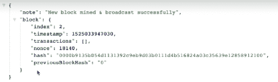

矿端点似乎已经完美地工作了。响应表明新区块已经被成功挖掘和广播。您还可以在前面的屏幕截图中看到新的区块及其索引。

1.  让我们验证新区块是否已添加到网络中。首先，在第一个节点上进行验证。在浏览器中打开另一个标签页，输入`localhost:3001/blockchain`，然后按*Enter*。您可以看到新区块已添加到网络中，如下所示：

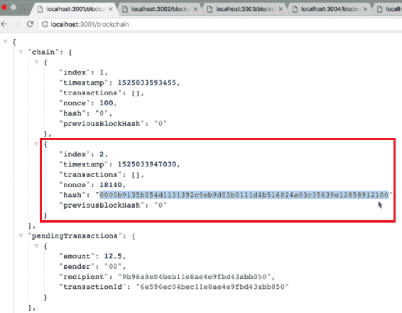

在上述截图中，您可能还注意到`pendingTransactions`数组中存在一些交易。这些待处理交易实际上是我们刚刚挖掘的区块的挖矿奖励。更新的`/mine`端点定义了在创建新区块后应广播挖矿奖励交易。

从现在开始，每当创建新区块时，该区块的挖矿奖励将进入`pendingTransactions`数组，并将添加到下一个区块中。这就是比特币区块链中挖矿奖励的工作原理。在前两章中创建区块链时，我们将挖矿奖励直接放入了我们挖掘的区块中。现在区块链更加先进，我们拥有了一个去中心化的网络，遵循最佳实践并将挖矿奖励放入下一个区块对我们来说非常重要。

让我们回到`/mine`端点并继续测试。让我们检查网络内的其他节点，并验证挖掘的新区块是否已添加到这些节点中。此外，让我们检查生成的挖矿奖励是否也已广播到网络中的其他节点。

在浏览器中打开另一个标签页，输入`localhost:3002/blockchain`，然后按*Enter*。您将看到以下输出：

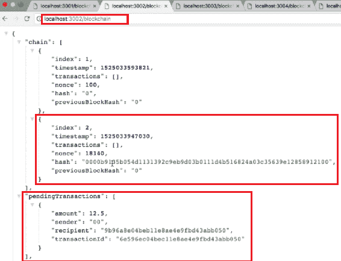

在上述截图中，您可以看到端口为`3002`的节点接收到了新挖掘的区块，以及挖矿奖励交易。您可以验证网络中其余节点的情况。

现在让我们从另一个节点挖掘另一个区块。不要转到`localhost:3001`，而是在浏览器的地址栏中输入`localhost:3004/mine`，然后按*Enter*。将挖掘新的区块；输出将如下所示：

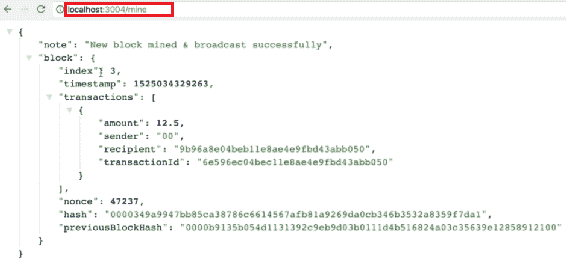

从上述截图中，您可以观察到这是第三个区块。这是正确的，因为我们已经挖掘了两个区块。在区块的`transactions`数组中，您可以看到我们从上一个区块获得的挖矿奖励。这笔交易是端口为`3001`的节点在挖掘上一个区块时生成的挖矿奖励。

让我们转到`localhost:3001/blockchain`，验证我们刚刚挖掘的新区块是否已添加到网络中。您将看到以下响应：

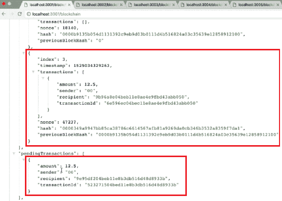

在此截图中，您可以观察到刚刚挖掘的新区块已添加到端口为`3001`的节点中。该区块的交易数组包括来自上一个区块的挖矿奖励。我们现在在`pendingTransactions`数组中也有一个新的挖矿奖励，这是在挖掘第三个区块时生成的。通过之前使用的类似验证过程，您可以检查我们挖掘的第三个区块是否已添加到所有剩余节点中。

从这些测试中，看起来`/mine`端点正在按照预期工作。它正在创建新区块并将其广播到整个网络。这意味着整个网络是同步的，并且具有完全相同的区块链数据，这对于区块链正常工作非常重要。

让我们进一步测试端点。转到 Postman，创建一些交易，然后广播它们。之后，让我们挖掘一个新的区块，以查看新交易是否已正确添加到区块链中：

1.  现在转到您的 Postman 并创建以下交易：

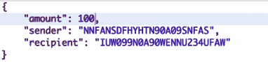

1.  接下来，为了广播交易，请访问`/transaction/broadcast`端点。您可以将此交易数据发送到任何节点，并且应该会广播到整个网络。在我们的示例中，让我们将此交易发送到端口`3002`上的节点：

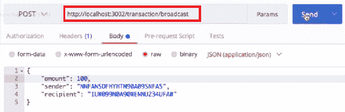

1.  现在，点击发送按钮。然后，您将收到响应，表示交易已成功创建和广播。

您也可以尝试进行其他交易，就像我们之前所做的那样，通过更改金额值和发送方和接收方的地址。另一个测试是将交易数据发送到不同的节点。

1.  现在，让我们返回浏览器，检查节点，以验证它们是否都收到了我们刚刚创建的交易。因为我们之前在浏览器中加载了节点`3001`，让我们刷新它。您应该会得到以下输出：

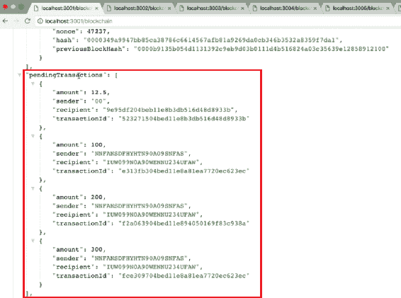

从前面的屏幕截图中，您可以观察到该节点有我们创建的所有三笔交易，以及上一个区块中的挖矿奖励，都在`pendingTransactions`数组中。同样，您可以验证其他节点的`pendingTransaction`数组。因此，我们可以得出结论，我们创建的所有交易都被完美地广播到整个网络。

现在，让我们挖掘一个新的区块，以验证所有待处理的交易是否已添加到新的区块中。在本例中，让我们在`3003`节点上挖掘一个新的区块，方法是在新标签的地址栏中键入`localhost:3003/mine`。响应将指示区块已成功挖掘和广播：

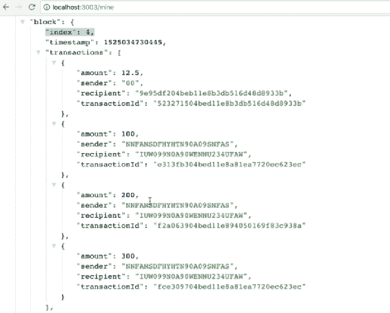

从前面的屏幕截图中，在`transactions`数组中，看起来我们创建的所有交易都存在于新挖掘的区块中。让我们去所有的节点，验证我们创建的交易是否已添加到新的区块中。在`localhost:3001`上，您可以观察到以下输出：

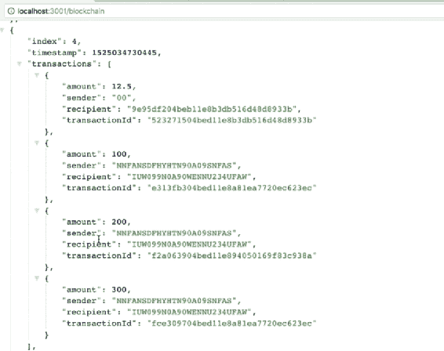

从这个屏幕截图中，我们可以观察到我们现在有了一个包含我们发送的所有交易的第四个区块。然后，如果您检查`pendingTransactions`数组，您会看到交易数据已被清除，并且新的挖矿奖励存在其中：

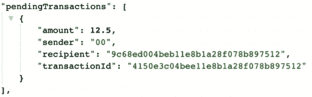

在本节中，我们在不同的节点上创建了一对新的交易。然后，这些交易成功地被广播到整个网络。然后，我们挖掘了一个新的区块，我们创建的所有交易都成功地添加到了新的区块中。除此之外，我们新挖掘的区块被广播到了区块链网络中的所有节点。我们整个网络中的所有节点现在都是同步的，并且都包含相同的区块链数据。

# 摘要

到目前为止，您在本书中取得了很大的成就。您已经创建了一个分散的区块链网络，目前正在五个节点上运行，并且您构建了功能，以同步整个网络，以便所有节点都具有完全相同的数据。这反映了区块链在实际应用中的功能。

在本章中，我们通过重构端点将整个区块链网络成功同步，将数据广播到网络中的所有节点。我们首先将`/createNewTransaction`方法的功能拆分为两个部分：`/createNewTransaction`方法和`addTransactionToPendingTransactions`方法。然后，我们构建了`/transaction/broadcast`端点，将新创建的交易广播到网络中的所有节点。我们还重构了`/transaction`端点，使得`/transaction/broadcast`端点和`/transaction`端点能够一起工作。在本章的后面，我们重构了`/mine`端点，并构建了一个新的端点`/receive-new-block`。借助这些端点，新创建的区块可以广播到网络中的所有节点。

在下一章中，我们将构建共识算法，以确保网络中的所有节点都能就区块链中应持有的正确数据达成一致。
