# 第六章：共识算法

在本章中，我们将为区块链网络构建一个共识算法。共识算法是所有网络内的节点就哪些数据是正确的并应该保留在区块链中达成一致的一种方式。为了构建共识算法，我们首先将构建一个名为`chainIsValid`的新方法。这个方法将通过比较链中所有区块的所有哈希来简单验证区块链。之后，我们将构建一个`/consensus`端点，每当我们想使用共识算法时，我们将访问该端点。

在本章中，我们将学习以下内容：

+   共识算法是什么

+   构建和测试`chainIsValid`方法

+   构建和测试`/consesnsus`端点

所以，让我们开始共识算法。

# 共识算法是什么？

当构建区块链时，它正在数百或数千个节点之间运行，并且每个交易和每个被创建的区块都被广播到整个区块链网络。在这些广播过程中可能会出现问题，或者可能某个节点没有收到发生的某个信息或交易。

甚至在区块链网络中可能存在一个恶意行为者，他在他们的区块链副本上发送虚假信息或创建欺诈性交易，并试图将它们广播到整个网络，以说服每个人它们是合法交易。那么，我们如何解决这个问题，以便区块链网络中只有合法的区块？

这就是共识算法将帮助我们的地方。共识算法将为我们提供一种比较一个节点与网络中所有其他节点的方式，以确认我们在该特定节点上有正确的数据。目前有许多不同的共识算法被用于不同的区块链网络。对于我们的区块链网络，我们将创建一个实现*最长链规则*的共识算法。

基本上，*最长链规则*会查看单个节点和该节点上的区块链副本，将该节点上的链的长度与所有其他节点上的链的长度进行比较。在这种比较中，如果发现有一条链的长度比所选节点上的链长，算法将用网络中最长的链替换所选节点上的链。

使用这个方法的理论是，我们应该能够相信最长的链来保存正确的数据，因为创建该链的工作量最大。最长的链中包含最多的区块，每个区块都是通过工作证明进行挖掘的。因此，我们可以假设整个网络都为最长的链做出了贡献，因为这条链需要付出很多工作。因此，我们将使用实现最长链规则的共识算法。比特币区块链网络实际上在现实生活中实现了这个最长链规则。

# 构建 chainIsValid 方法

让我们开始构建共识算法，创建一个名为`chainIsValid`的新方法。这个方法将验证一条链是否合法。让我们开始构建这个方法：

1.  在`blockchain.js`文件中，在`proofOfWork`方法之后，让我们定义该方法如下：

```js
Blockchain.prototype.chainIsValid = function() {

}
```

1.  现在，这个方法将以`blockchain`作为参数，并且将返回`blockchain`是否有效：

```js
Blockchain.prototype.chainIsValid = function(blockchain) {

}
```

当我们将它们与当前节点上托管的链进行比较时，我们将使用`chainIsValid`方法来验证网络中的其他链。为了验证区块链的合法性，我们只需遍历区块链中的每个区块，并验证所有哈希是否正确对齐。

你可能还记得第二章中提到的，当定义`createNewBlock`方法时，该方法包括`previousBlockHash`和`hash`属性。这个`hash`属性是当前区块的哈希值。为了构建`chainIsValid`方法，让我们遍历区块链中的每个区块，并确保给定区块的`previousBlockHash`属性与上一个区块中的哈希属性完全相同。让我们在方法内部定义这个条件如下：

1.  为了遍历区块链中的每个区块，我们将使用一个`for`循环：

```js
Blockchain.prototype.chainIsValid = function(blockchain) {

       for (var i = 1; i < blockchain.length; i++) {

 }; 

};
```

1.  在这个`for`循环内，让我们比较当前区块和上一个区块：

```js
Blockchain.prototype.chainIsValid = function(blockchain) {

       for (var i = 1; i < blockchain.length; i++) {
                const currentBlock = blockchain[i];
 const prevBlock = blockchain[i - 1];   
       };  

};
```

当我们在每次迭代中遍历整个链时，`currentBlock`将是`i`的值，`prevBlock`将是`i - 1`的值。

1.  接下来，我们只需比较`currentBlock`上的`previousBlockHash`属性与上一个区块上的哈希属性。为了做到这一点，在方法中定义以下条件：

```js
Blockchain.prototype.chainIsValid = function(blockchain) {

       for (var i = 1; i < blockchain.length; i++) {
                const currentBlock = blockchain[i];
                const prevBlock = blockchain[i - 1];
                if (currentBlock['previousBlockHash'] !== prevBlock['hash']) // chain is not valid...

       };  

};
```

当涉及到我们提到的前一个条件时，如果它没有得到满足，那么我们知道链条是无效的，因为哈希值没有正确对齐。

1.  为了满足验证条件，当前区块上的`previousBlockHash`应该等于上一个区块的哈希。我们将在方法内部使用一个标志来表示上述条件，如下所示：

```js
Blockchain.prototype.chainIsValid = function(blockchain) {
       let validChain = true; 
       for (var i = 1; i < blockchain.length; i++) {
                const currentBlock = blockchain[i];
                const prevBlock = blockchain[i - 1];
                if (currentBlock['previousBlockHash'] !== prevBlock['hash']) // chain is not valid...   
       };  

};
```

最初，`validChain`变量的值等于`true`。当我们遍历区块链并看到哈希值没有正确对齐时，我们会将`validChain`变量设置为`false`，以表示链条无效。

1.  现在让我们回到`if`语句。将上述条件添加到其中：

```js
Blockchain.prototype.chainIsValid = function(blockchain) {
       let validChain = true; 
       for (var i = 1; i < blockchain.length; i++) {
                const currentBlock = blockchain[i];
                const prevBlock = blockchain[i - 1];
                if (currentBlock['previousBlockHash'] !== prevBlock['hash']) validChain = false;   
       };  

};
```

1.  在循环结束时，我们可以简单地返回一个`validChain`变量，如果链有效，则返回值为`true`，如果无效则返回`false`：

```js
Blockchain.prototype.chainIsValid = function(blockchain) {
       let validChain = true; 
       for (var i = 1; i < blockchain.length; i++) {
                const currentBlock = blockchain[i];
                const prevBlock = blockchain[i - 1];
                if (currentBlock['previousBlockHash'] !==
                prevBlock['hash']) validChain = false;   
       };  
       return validChain;
};
```

1.  我们还要做的一件事是验证链中的每个区块是否都具有正确的数据。我们可以通过使用`hashBlock`方法重新计算`currentBlock`的哈希值来实现这一点。如果生成的哈希值以四个零开头，就像我们在第二章中看到的那样，那么我们知道所有数据都是有效的。然而，如果不是以四个零开头，那么我们知道区块内的数据肯定是无效的。

我们要做的就是遍历链中的每个区块，重新计算每个区块的哈希值，并确保每个哈希值以四个零开头。因此，在`for`循环内，让我们首先定义一个变量来提到这个条件：

```js
Blockchain.prototype.chainIsValid = function(blockchain) {
       let validChain = true; 
       for (var i = 1; i < blockchain.length; i++) {
                const currentBlock = blockchain[i];
                const prevBlock = blockchain[i - 1];
                const blockHash = this.hashBlock ();
                if (currentBlock['previousBlockHash'] !==
                prevBlock['hash']) validChain = false;   
       };  
     return validChain;
};
```

1.  `hashblock()`方法接受参数，如：`previousBlockhash`，`currentBlockData`和`nonce`。让我们现在传递这些参数：

```js
const blockHash = this.hashBlock (prevBlock['hash']);
```

1.  接下来，我们必须将`currentBlockData`作为参数传递，你可能还记得前一章中提到的，它包括`currentBlock`中的交易和`currentBlock`的索引：

```js
const blockHash = this.hashBlock(prevBlock['hash'], { transactions: currentBlock['transactions'], index: currentBlock['index'] } );
```

1.  最后，我们必须传递的最后一个参数是`nonce`：

```js
const blockHash = this.hashBlock (prevBlock['hash'], { transactions: currentBlock['transactions'], index: currentBlock['index'] } currentBlock['nonce']);
```

1.  定义这些参数后，我们应该将`currentBlock`的哈希存储在`blockHash`变量中。接下来，我们只需验证哈希是否以四个零开头。因此，在`for`循环内，我们将提到以下条件：

```js
if (blockHash.substring(0, 4) !== '0000') validChain = false;
```

现在，我们基本上是在遍历整个区块链，只是简单地检查两件事：

+   我们进行的一个检查是确保所有哈希值正确对齐。如果它们没有正确对齐，我们会指出链条无效。

+   我们正在进行的另一个检查是对每个区块进行哈希，并确保`blockHash`字符串以四个零开头。如果不是以四个零开头，那么我们指出链条无效。

现在`chainIsValid`方法基本上已经完成了。然而，您可能已经注意到的一个重要的事情是，我们还没有检查创世区块是否符合任何方法。在我们在前面的代码块中定义的循环中，我们从位置 1 开始，完全跳过了位置 0，即创世区块。创世区块是一种特殊的区块，因为我们自己制作了它，而没有进行工作证明：

1.  因此，为了验证创世区块，我们只需确保它具有我们最初放入其中的属性。因此，在`for`循环之外，我们将如下表述这个条件：

```js
const genesisBlock = blockchain[0];
```

1.  现在我们只是想检查并验证创世区块上的所有属性是否正确。如果您还记得在第二章中，我们定义了创世区块，我们为其分配了值，例如`nonce`，值为`100`，`previousBlockHash`，值为`0`，以及字符串 0 的`hash`。因此，现在让我们检查这些属性，以确保它们是正确的。在以下代码片段中，我们将上述代码添加到以下变量中：

```js
const genesisBlock = blockchain[0];
const correctNonce = genesisBlock['nonce'] === 100;
const correctPreviousBlockHash = genesisBlock['previousBlockHash'] === '0';
const correctHash = genesisBlock['hash'] === '0';
```

1.  最后，我们要验证创世区块中不应该有任何交易。因此，为了检查这一点，我们将提到以下条件：

```js
const correctTransactions = genesisBlock['transactions'].length === 0;
```

1.  现在，如果我们有一个合法的创世区块，那么我们定义的所有这些变量都应该是 true。如果任何这些变量无效，那么我们希望将`validChain`变量更改为`false`，以便我们知道区块链无效。让我们将这个条件表述如下：

```js
if (!correctNonce || !correctPreviousBlockHash || !correctHash || !correctTransactions) validChain = false;
```

提及这最后一个条件完成了`chainIsValid`方法。

# 测试`chainIsValid`方法

现在让我们通过实施以下步骤来测试`chainIsValid`方法：

1.  在`test.js`文件中，让我们导入区块链数据结构并创建一个名为`bitcoin`的区块链的新实例：

```js
const Blockchain = require('./blockchain');
const bitcoin = new Blockchain();
```

1.  接下来，让我们生成一个用于测试的区块链。我们将通过从其中一个服务器开始来实现这一点。因此，转到终端，输入`npn run node_1`并按*Enter*。然后您将收到响应，监听端口 3001。

1.  在节点`3001`上，现在让我们创建一个区块链并向其中添加一些数据，以便我们可以测试新的区块链。目前，节点`3001`上的区块链只有创世区块。因此，通过命中`/mine`端点，让我们向链中添加几个更多的区块。因此，在浏览器中，转到`localhost:3001/mine`以创建一个新的区块。

1.  现在，如果您转到`localhost:3001/blockchain`，您应该能够观察到新的区块如下：

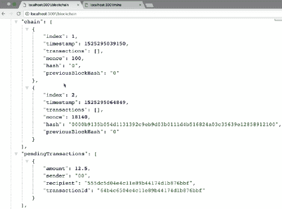

因此，在节点`3001`，我们现在有两个区块和一个待处理的交易，即挖矿奖励交易。

1.  接下来，让我们创建一些要添加到区块链中的交易。要添加交易，请转到 Postman，并在那里添加一些交易，如下截图所示。让我们将这些交易发送到`localhost:3001`，并且还要命中`/transaction/broadcast`端点：

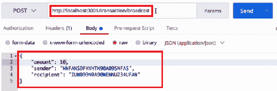

1.  您也可以向节点添加许多其他交易。

1.  一旦交易被添加，让我们通过访问`localhost:3001/mine`来挖掘一个新的区块。一旦新的区块被挖掘出来，访问`localhost:3001/blockchain`以验证该区块是否已被添加到网络中。您应该观察到以下输出：

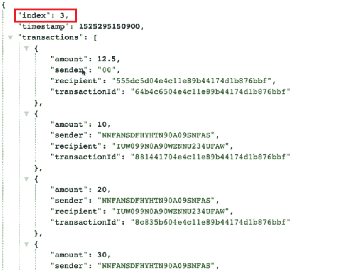

您将看到节点`3001`包含了第三个区块，其中包含我们在区块中传递的所有交易数据。我们还有一个待处理的交易。

1.  接下来，让我们向节点`3001`添加几个更多的交易，然后在该节点上挖掘一个新的区块。您将看到与前面情况类似的输出。我们添加的新交易数据现在存在于我们挖掘的第四个区块中。请查看以下截图：

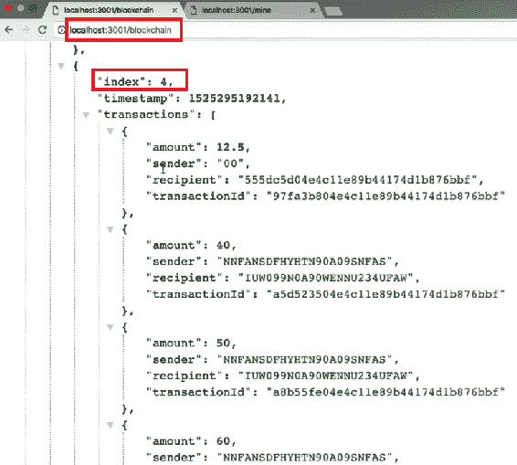

1.  接下来，让我们再挖掘两个没有任何数据的块。现在，我们有一个包含六个块的区块链。在这六个块中，有两个块中没有任何交易数据。

1.  复制`localhost:3001`上的整个区块链并将其粘贴到`test.js`文件中。然后，在`test.js`文件中粘贴数据后，让我们将该粘贴的文本保存为一个变量：

```js
const bc1 { //.... the entier blockchain that we copied and pasted };
```

1.  让我们使用`chainIsValid`方法来验证链的有效性。为了做到这一点，在`test.js`文件中，让我们提到以下内容：

```js
console.log('VALID:' , bitcoin.chainIsValid(bc1.chain));
```

1.  让我们保存`test.js`文件并运行它。

# 验证测试的输出

现在，当我们运行这个文件时，我们应该收到一个有效区块链的验证，因为我们没有篡改它，而是合法地使用了所有正确的方法创建它。让我们验证`chainIsValid`方法是否正常工作：

1.  前往终端并通过在终端中键入`^C`来取消之前正在运行的进程。

1.  一旦进程被取消，然后在终端中，让我们键入`node dev/test.js`并按*Enter*。由于我们没有篡改区块链，我们将得到`Valid: true`的反馈，如下面的截图所示：

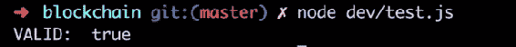

现在，让我们稍微篡改一下区块链，看看是否可以得到一个错误的返回值：

1.  在我们粘贴到`test.js`文件中的区块链数据中，让我们更改任一块中的一个哈希值，看看是否会使区块链无效。

1.  一旦你改变了任何块的哈希值，保存文件并再次运行测试。由于数据现在被篡改，你将得到`false`的反馈：

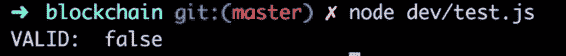

接下来，让我们在一个区块的交易数据中搞一些乱。如果我们更改了一个区块中的任何交易数据，那么链就不应该是有效的，我们应该收到测试的假反馈。

最后，让我们测试创世块，也就是链中的第一个块：

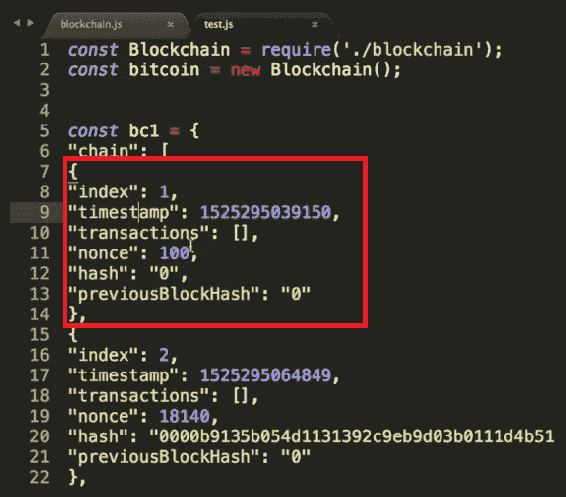

在我们粘贴的区块链数据的`test.js`文件中，让我们将`nonce`值从 100 改为 10。保存文件并在终端中再次运行测试，我们应该得到返回的输出为`false`。由于我们在`test.js`文件中篡改了区块链中的数据，当我们运行测试时，我们得到了`false`的反馈。这表明区块链不再有效或合法，因为其中的数据已经被篡改。因此，从这个测试中我们可以得出结论，`chainIsValid`方法完全符合我们的预期。

# 对结果进行适当的微小修改

现在，我们需要做的一个小事情是帮助我们理解`chainIsValid`方法的工作原理，即记录每个块的`previousBlockHash`和`currentBlock`哈希值，以便我们自己进行比较。因此，在`chainIsValid`方法的`for`循环中，让我们在循环结束之前添加以下代码行：

```js
console.log('previousBlockHash =>', prevBlock [ 'hash']);
console.log('currentBlockHash =>', currentBlock [ 'hash']);
```

让我们保存这个修改并再次运行测试。这一次，当我们运行测试时，我们应该看到所有的哈希值被记录下来，这样我们就可以自己比较它们，看看这个方法内部到底发生了什么。运行测试后，你应该看到`previousBlockHash`和`currentBlockHash`的值，如下面的截图所示：

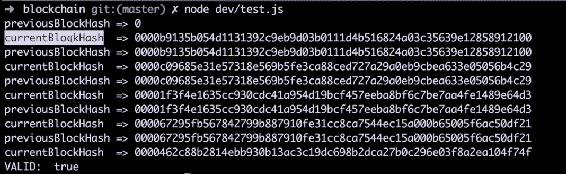

从前面的截图中，你可以观察到，对于每次迭代，`previousBlockHash`的值都与前一个块的`currentBlockHash`的值匹配。如果你看所有的哈希值，你会看到它们成对地被记录下来。从截图中，我们可以观察到我们有许多对相同的哈希值，这就是使区块链有效的原因。

# 构建/共识端点

现在，让我们构建`/consensus`端点，它将使用我们在上一节中构建的`chainIsValid`方法。执行以下步骤来构建端点：

1.  让我们转到`networkNode.js`文件，并在`/register-node-bulk`端点之后，定义`/consensus`端点如下：

```js
app.get('/consensus', function(req, res) { 

});
```

1.  接下来，在`/consensus`端点内，让我们向区块链网络中的每个其他节点发出请求，以获取它们的区块链副本，并将其与当前节点上托管的区块链副本进行比较：

```js
app.get('/consensus', function(req, res) {
        bitcoin.networkNodes.forEach(networkNodeUrl => {

 }); 

});
```

1.  在这个`forEach`循环内，让我们做与在前几章中定义其他端点时做过无数次的相同的事情。因此，我们首先要为请求定义一些选项，如下所示：

```js
app.get('/consensus', function(req, res) {
        bitcoin.networkNodes.forEach(networkNodeUrl => {
                const requestOptions = {
 uri: networkNodeUrl + '/blockchain',
 method: 'GET',
 json: true 
 }        

        });         

});
```

1.  在定义选项之后，我们需要`request-promise` `requestOptions`，并将所有这些请求推入一个承诺数组，因为每个请求都会向我们返回一个承诺：

```js
app.get('/consensus', function(req, res) {
        const requestPromises = [];
        bitcoin.networkNodes.forEach(networkNodeUrl => {
                const requestOptions = {
                        uri: networkNodeUrl + '/blockchain',
                        method: 'GET',
                        json: true 
                }        
                requestPromises.push(rp(requestOptions));
        });         

});
```

1.  一旦`forEach`循环运行后，我们将得到一个填满所有请求的数组。接下来，让我们按以下方式运行这些请求：

```js
app.get('/consensus', function(req, res) {
        const requestPromises = [];
        bitcoin.networkNodes.forEach(networkNodeUrl => {
                const requestOptions = {
                        uri: networkNodeUrl + '/blockchain',
                        method: 'GET',
                        json: true 
                }        
                requestPromises.push(rp(requestOptions));
        });         
        Promise.all(requestPromises) 
```

1.  然后，让我们使用从所有这些承诺中收到的数据。我们收到的这些数据将是来自网络中每个节点的区块链的数组。因此，在上述代码的后面，让我们定义如下的代码：

```js
.then(blockchains => {

});
```

1.  现在让我们遍历来自网络中其他节点的所有这些`blockchains`，并查看是否有一个比当前节点上托管的区块链副本更长的区块链。我们将从响应中获取的所有区块链中开始循环：

```js
.then(blockchains => {
        blockchains.forEach(blockchain => { 
 //....
 });
});
```

1.  基本上，在`forEach`循环内，我们要做的就是确定网络中其他节点的区块链是否比当前节点上托管的区块链更长。为了做到这一点，让我们定义一些变量来跟踪所有数据，如下所示。我们要定义的第一个变量是托管在当前节点上的区块链的长度：

```js
.then(blockchains => {
        const currentChainLength = bitcoin.chain.length;
        blockchains.forEach(blockchain => {                
            //....
        });
});
```

1.  接下来，让我们定义一个变量，如果在`blockchains`数组中遇到更长的区块链，它将发生变化。我们要定义的第一件事是`maxChainLength`变量：

```js
.then(blockchains => {
        const currentChainLength = bitcoin.chain.length;
        let maxChainLength = currentChainLength;
        blockchains.forEach(blockchain => {                
            //....
        });
});
```

1.  接下来，我们要定义一个名为`newLongestChain`的变量。最初，我们将把它设置为`null`：

```js
.then(blockchains => {
        const currentChainLength = bitcoin.chain.length;
        let maxChainLength = currentChainLength;
        let newLongestChain = null;
        blockchains.forEach(blockchain => {                
            //....
        });
});
```

1.  然后，我们要定义的最后一个变量将被称为`newPendingTransactions`。让我们最初将其设置为`null`：

```js
.then(blockchains => {
        const currentChainLength = bitcoin.chain.length;
        let maxChainLength = currentChainLength;
       let newLongestChain = null;
        let newPendingTransactions = null;
        blockchains.forEach(blockchain => {                
            //....
        });
});
```

1.  现在，在`forEach`循环内，我们要查看区块链网络中是否存在比当前节点上更长的链。如果网络中存在更长的链，那么改变上述变量以反映这一点。因此，在`forEach`循环内，定义如下的`this`条件：

```js
.then(blockchains => {
        const currentChainLength = bitcoin.chain.length;
        let maxChainLength = currentChainLength;
       let newLongestChain = null;
        let newPendingTransactions = null;
        blockchains.forEach(blockchain => {                
            if (blockchain.chain.length > maxChainLength) {
 maxChainLength = blockchain.chain.length;
 newLongestChain = blockchain.chain;
 newPendingTransactions =
 blockchain.pendingTransactions;
 };    
        });
});
```

现在，在`forEach`循环运行后，我们将拥有确定是否需要替换托管在当前节点上的链所需的所有数据。接下来，在循环之后，让我们定义以下条件：

```js
if (!newLongestChain || (newLongestChain &&
    !bitcoin.chainIsValid(newLongestChain))) 
{
         res.json({
             note: 'Current chain has not been replaced.',
             chain: bitcoin.chain
         });
}
```

基本上，在这个`if`语句中我们要表达的是，如果没有`newLongestChain`，那么当前链就是最长的。或者，如果有一个新的最长链，但是这个新链无效，那么在这两种情况下，我们都不想替换托管在当前节点上的区块链。因此，我们将发送回一个说明“当前链未被替换”的通知。

否则，如果有一个`newLongestChain`并且该链是有效的，那么现在我们要用网络中最长的链替换托管在当前节点上的区块链。我们将在 else 块中定义所有这些内容，如下所示：

```js
else {
         bitcoin.chain = newLongestChain;
         bitcoin.pendingTransactions = newPendingTransactions;
         res.json({
                       note: 'This chain has been replaced.',
                       chain: bitcoin.chain
         });
}
```

# 构建过程的快速回顾

在这个端点中，我们首先向网络中的所有其他节点发出请求，以便我们可以访问每个节点上托管的区块链。在我们运行了所有这些请求之后，我们就可以访问网络中所有其他节点上托管的所有区块链。然后，我们通过`forEach`循环遍历网络中所有其他区块链。当我们遍历其他区块链时，如果我们找到了更长的链，我们就会更新`maxChainLength`、`newLongestChain`和`newPendingTransactions`变量以反映出这一点。然后，当`forEach`循环完成时，我们就会知道网络中是否存在比当前节点上托管的区块链更长的链。如果在网络中找到了更长的链，我们将能够访问该区块链的`pendingTransactions`。因此，在`forEach`循环运行后，我们将能够访问所有必要的数据，以替换当前节点上托管的错误区块链。

然后，我们说明了是否存在新的更长链，或者是否存在比当前节点上托管的区块链更长的链。如果在网络中存在更长的链，但该链无效，那么在这两种情况下，我们都不希望替换当前节点上托管的区块链，因此我们只需发送一个响应，说明当前链未被替换。

另一方面，如果在网络中存在更长的链，并且该链是有效的，那么我们将希望替换当前节点上托管的区块链。我们只需发送一个响应，说明该链已被替换，并返回新的区块链。

这就是共识算法和/consensus 端点的工作原理。

# 测试/consensus 端点

让我们测试刚刚构建的共识端点。因此，这个/consensus 端点应该做什么？当我们在特定节点上调用/consensus 端点时，它应该为我们确认该特定节点是否具有正确的区块链数据，并且该节点与网络的其余部分是同步的。让我们开始构建测试：

1.  我们的第一步是建立一个由前四个节点组成的网络。因此，让我们去 Postman，并在托管在`3001`上的节点上点击 register-and-broadcast-node 端点。

1.  让我们像下面的屏幕截图中所示，将第二个节点添加到网络中。然后，我们将点击发送按钮，接收到响应，成功注册新节点到网络：

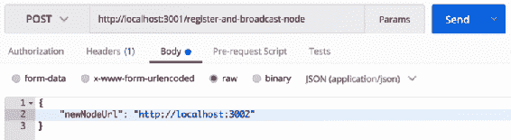

1.  同样地，您可以将剩余的节点`3003`和`3004`注册到网络中。现在，如果您去浏览器并检查所有节点，您将观察到从`3001`到`3004`的所有节点都相互连接，但节点 3005 没有连接。

1.  接下来，我们想要在区块链网络上挖掘一些区块，除了第五个节点。因此在浏览器中，让我们访问`localhost:3001/mine`。这将在节点`3001`上为我们挖掘一个区块。

1.  同样地，让我们在`localhost:3003`上挖掘两个区块，在`localhost:3004`上挖掘一个区块。现在，所有这些节点应该都有五个区块。您可以通过在浏览器中输入`localhost:3001/blockchain`来验证这一点。您将能够观察到我们刚刚添加的所有五个区块。

1.  在这一点上，我们想要将第五个节点连接到区块链网络。因此，让我们去 Postman 并发送 3005 的请求，如下面的屏幕截图所示：

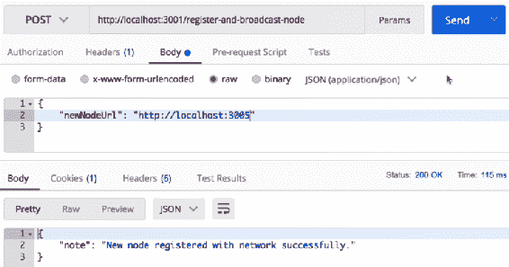

1.  现在，节点`3005`应该已连接到网络。您可以通过浏览器验证这一点：

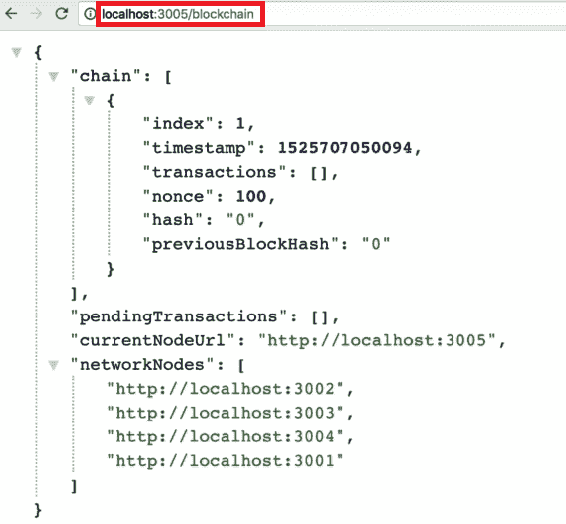

现在`3005`是网络的一部分，问题就出现在这里：节点`3005`在区块链中没有正确的区块数据。它应该拥有其他节点拥有的所有五个区块。这就是`/consensus`端点发挥作用的地方。我们应该能够访问`/consensus`端点并解决这个问题。在这之后，我们应该期望节点`3005`上的区块链与网络中的其他所有节点具有相同的数据。

现在让我们试一试。在浏览器中打开另一个标签，并在地址栏中输入`localhost:3005/consensus`，然后按下*Enter*运行它。您应该观察到类似于以下截图中所见的输出：

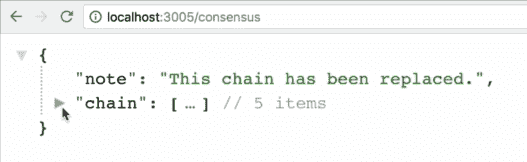

在前面的截图中，我们得到了响应，链已被替换，然后新的区块链数据取代了这个节点上的旧数据。让我们通过在浏览器中打开另一个标签并访问`localhost:3005/blockchain`来验证这个节点。您会看到网络中存在的所有区块都已经添加到节点`3005`中。因此，节点`3005`现在拥有了正确的区块链数据。我们通过访问节点`3005`上的`/consensus`端点来实现了这一点。现在，区块链网络中的所有节点应该具有完全相同的数据。

现在，如果你再次尝试在`3005`节点上访问`/consensus`端点，我们将会得到以下响应：

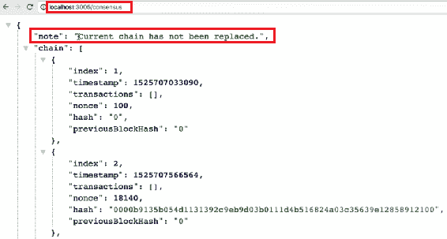

我们收到这样的响应，是因为在之前运行共识端点时，网络中已经存在的所有区块都已经添加到节点`3005`中。

通过这个测试，我们可以得出结论，`/consensus`完美地按预期工作。`/consensus`端点有能力在区块链中纠正节点的错误数据。

建议您尝试使用`/consensus`端点以不同的方式进行测试。向数据添加一些交易，并确保它能够正确解决持有错误数据的节点。通过更多地测试这个端点，您将更加熟悉它在底层是如何工作的。

# 摘要

所有的区块链都有共识算法，在本章中，我们构建了自己的共识算法，实现了最长链规则。我们首先构建了`chainIsValid`方法。在这个方法中，我们简单地遍历了区块链中的每一个区块，并比较了每个区块上的哈希值，以确保它们是正确的。然后我们继续测试这个方法。除此之外，我们利用`chainIsValid`方法构建了`/consensus`端点。

在下一章中，我们将构建一个区块浏览器，我们将能够在浏览器上访问。这个区块浏览器将允许我们通过用户界面与区块链进行交互。
