# 第七章：区块浏览器

在这一章中，让我们构建一个区块浏览器，它将允许我们与区块链进行交互。区块浏览器只是一个用户界面，它将允许我们探索区块链内部的数据。它将允许我们搜索特定的区块、特定的交易或特定的地址，然后以视觉上吸引人的格式显示特定的信息。

构建区块浏览器的第一步是向区块链添加一些新的方法和端点，以便搜索数据。然后，让我们为区块浏览器添加一个前端，以便我们可以在浏览器中使用它。

在本章中，我们将涵盖以下主题：

+   什么是区块浏览器？

+   定义区块浏览器端点

+   构建`getBlock`、`getTransaction`和`getAddressData`方法

+   构建和测试`/block/:blockHash`、`/transaction/:transactionId`和`/address/:address`端点

+   开发我们的区块浏览器界面并对其进行测试。

因此，让我们开始构建我们的区块浏览器。

# 什么是区块浏览器？

区块浏览器是一个在线平台，允许您浏览区块链，搜索包括地址、区块、交易等各种内容。例如，如果您访问[`www.blockchain.com/explorer`](https://www.blockchain.com/explorer)，您可以看到比特币和以太坊区块链的区块浏览器实用程序，如下所示：

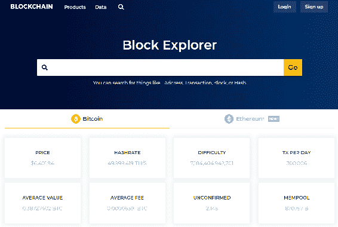

在这个区块浏览器内，您可以搜索整个区块链以获取特定的区块、哈希或交易，或者任何其他所需的数据片段。该实用程序还在易于理解的界面上显示结果。例如，如果我们在区块浏览器中搜索`Block #549897`，您将看到该特定区块的所有细节，如下截图所示：

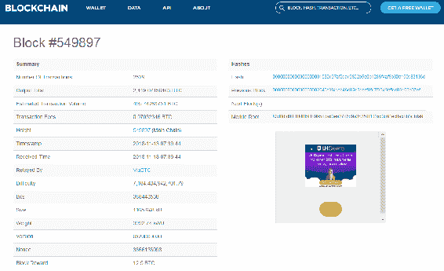

这正是我们将在本章中为我们的区块链构建的内容。

# 定义区块浏览器端点

为了使区块浏览器正常运行，我们需要查询区块链以获取地址、区块哈希和交易 ID，以便我们可以搜索特定的参数并得到相应的数据。因此，我们需要执行的第一步是构建一些新的端点。为此，让我们继续以下步骤：

1.  转到`dev/networkNode.js`文件，在`/consensus`端点之后，让我们定义我们的区块浏览器的第一个端点`/block/:blockHash`，如下所示：

```js
app.get('/block/:blockHash', function(req, res) { 

});
```

通过这个端点发送一个特定的`blockHash`，结果将简单地返回与输入的`blockHash`对应的区块。

1.  我们将构建的下一个端点将是`/transaction/:transactionId`。定义如下：

```js
app.get('/transaction/:transactionId', function(req, res) {

});
```

通过这个端点发送一个`transactionId`，作为回应，我们应该期望得到与该 ID 对应的正确交易。

1.  最后，我们将构建的第三个端点是`/address/:address`，定义如下：

```js
app.get('/address/:address', function(req, res) {

});
```

通过这个端点，我们将发送一个特定的地址，作为回应，您应该期望得到与该地址对应的所有交易——每当这个特定地址发送或接收比特币时——您还将了解到该地址的当前余额，即该地址当前拥有多少比特币。

因此，在本章中，您将构建这三个端点。对于这些端点中的每一个，我们将在区块链数据结构中构建一个特定的方法，该方法将查询区块链以获取正确的数据片段。因此，让我们创建查询区块链特定区块哈希、交易和地址的方法。

# 构建 getBlock 方法

让我们构建一个名为`getBlock`的新方法，该方法将获取给定的`blockHash`并搜索整个区块链，以找到与该特定哈希相关联的区块。为了构建`getBlock`方法，请按照以下步骤进行：

1.  转到`dev/blockchain.js`文件，在`chainIsValid`方法之后，定义如下新方法：

```js
Blockchain.prototype.getBlock = function(blockHash) { 

};
```

1.  在这个方法中，我们要遍历整个区块链，搜索具有特定`blockHash`值的区块。然后，该方法将把该特定区块返回给我们。我们将借助`for`循环来完成所有这些操作：

```js
Blockchain.prototype.getBlock = function(blockHash) { 
    this.chain.forEach(block => {

 });
};
```

在定义`for`循环时，我们遍历区块链中的每个区块。

1.  接下来，在循环内，使用`if`语句来说明条件，如下所示：

```js
Blockchain.prototype.getBlock = function(blockHash) { 
    this.chain.forEach(block => {
            if (block.hash === blockHash) 
    });
};
```

1.  为了表示我们正在寻找的正确区块已找到，我们将使用一个标志。让我们按照以下代码中的突出显示定义此标志变量：

```js
Blockchain.prototype.getBlock = function(blockHash) { 
    let correctBlock = null;
    this.chain.forEach(block => {
            if (block.hash === blockHash) 
    });
};
```

1.  当我们遍历链中的所有区块时，如果找到正确的区块，我们将把它赋给`correctBlock`。让我们按照以下条件来说明：

```js
Blockchain.prototype.getBlock = function(blockHash) { 
  let correctBlock = null;
    this.chain.forEach(block => {
            if (block.hash === blockHash) correctBlock = block;  
    });
};
```

1.  最后，在此方法的末尾，我们要返回`correctBlock`，如下所示：

```js
Blockchain.prototype.getBlock = function(blockHash) { 
  let correctBlock = null;
    this.chain.forEach(block => {
            if (block.hash === blockHash) correctBlock = block;  
    });
    return correctBlock
};
```

# 构建`/block/:blockHash`端点

在`/block/:blockHash`端点内使用`getBlock`方法来通过`blockHash`检索特定区块。让我们按照以下步骤构建端点：

1.  在此端点中，我们要做的第一件事是使用发送到`/block/:blockHash`请求的`blockHash`值。我们可以在`req.params`对象上访问此`blockHash`。转到`dev/networkNode.js`文件，并在先前定义的`/block/:blockHash`端点中添加以下突出显示的代码：

```js
app.get('/block/:blockHash', function(req, res) { 
        const blockHash = req.params.blockHash;
});
```

基本上，当我们访问`/block/:blockHash`端点时，我们正在访问网络中特定节点上存在的区块的哈希值。我们还将使用`req.params`对象来访问哈希值，这将使我们能够访问`/block/:blockHash` URL 中带有冒号的任何值。因此，当用户向此端点发出请求时，他们将在 URL 中发送一个`blockHash`，然后我们可以借助`req.params.blockHash`来获取该`blockHash`。然后，我们将保存该值在`blockHash`变量中。

1.  接下来，在端点内，我们要使用在上一节中创建的`getBlock`方法。我们将在端点中添加该方法，如下面的代码所示：

```js
app.get('/block/:blockHash', function(req, res) { 
        const blockHash = req.params.blockHash; const correctBlock = bitcoin.getBlock(blockHash);
});
```

到了代码的这一点，我们正在寻找的区块应该存在于`correctBlock`变量中。

1.  最后，将`correctBlock`变量作为响应发送回去，因此让我们在端点中添加以下突出显示的代码：

```js
app.get('/block/:blockHash', function(req, res) { 
        const blockHash = req.params.blockHash;const correctBlock = bitcoin.getBlock(blockHash);
        res.json({
 block: correctBlock
 });
});
```

这就是我们使用`getBlock`方法构建`/block/:blockHash`端点的方式。现在，让我们测试此端点并验证其是否正常工作。

# 测试`/block/:blockHash`端点

为了测试`/block/:blockHash`端点，请按照以下步骤进行：

1.  首先检查区块链中有多少个区块。转到浏览器，输入`localhost:3001/blockchain`，然后按*Enter*。您将看到区块链中存在的单个创世区块，如下所示：

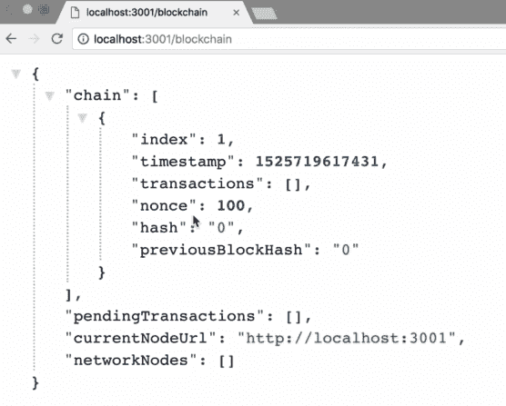

1.  您需要向此链中添加几个区块。要做到这一点，转到浏览器中的另一个标签页，输入`localhost:3001/mine`，然后按*Enter*。使用相同的过程，让我们生成一个更多的区块。现在我们应该在链中有三个区块：一个创世区块和我们刚刚添加的两个区块。

1.  为了测试`/block/:blockHash`端点，让我们简单地取其中一个区块的哈希值并用它来测试端点。让我们复制链中第三个区块的哈希值，如下截图所示：

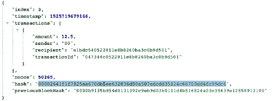

1.  接下来，转到浏览器中的另一个标签页。在地址栏中键入`localhost:3001/block`，然后粘贴我们直接复制的哈希值。查看以下截图以更好地理解：

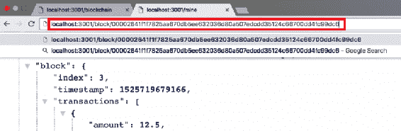

1.  现在，我们知道我们使用的哈希存在于链中的第三个区块中。因此，我们应该期望通过运行`/block/:blockHash`端点来返回第三个区块。现在按*Enter*，正确的区块应该作为输出返回给我们：

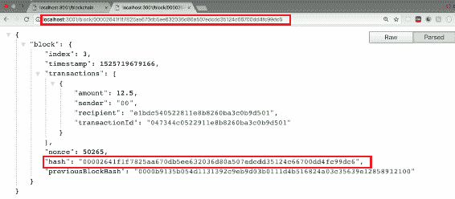

从上面的截图中，我们可以观察到正确的区块已经返回给我们。返回的区块包括我们在`/block/:blockHash`端点中使用的哈希值来搜索区块。

以类似的方式，您现在可以尝试使用端点和特定区块的哈希值来搜索链中的另一个区块。

现在，如果我们发送错误的哈希或在端点中不存在的哈希，我们应该期望得到 null 作为输出，而不是返回区块。让我们尝试通过向`/block/:blockHash`端点发送错误的哈希值来验证这一点。在浏览器的地址栏中，键入`localhost:3001/block`，然后添加一个虚假的哈希值并按*Enter*。应返回以下输出：

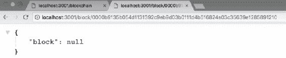

从上面的截图中，您可以观察到`block`等于`null`。这意味着用于搜索区块的哈希值在链中不存在。因此，从测试中，我们可以得出结论，`/block/:blockHash`端点完全按预期工作。

# 定义 getTransaction 方法

让我们在区块链数据结构上添加一个名为`getTransaction`的新方法。这将允许我们通过传递`transactionId`来获取特定交易。我们将在`/transaction/:transactionId`端点内使用这个新方法。所以，让我们开始吧！

1.  转到`dev/blockchain.js`文件，在`getBlock`方法之后，定义`getTransaction`如下：

```js
Blockchain.prototype.getTransaction = function(transactionId) { 

}):
```

这个方法与`getBlock`方法非常相似。在这里，我们将遍历整个链，并将一个标志设置为我们正在寻找的正确交易。

1.  构建此方法的下一步是遍历整个区块链。为此，使用`forEach`循环如下所示：

```js
Blockchain.prototype.getTransaction = function(transactionId) { 
       this.chain.forEach(block => { 

 });

}):
```

1.  由于在这个方法中，我们正在寻找交易，我们需要遍历链中每个区块上的每个交易。因此，我们需要在前面的`for`循环内添加另一个`for`循环：

```js
Blockchain.prototype.getTransaction = function(transactionId) { 
       this.chain.forEach(block => { 
               block.transactions.forEach(transaction => { 

 });
       });

});
```

1.  现在，我们可以访问区块链上的每个交易，我们只需要将每个交易的`transactionId`与我们正在寻找的`transactionId`进行比较。当两者匹配时，我们就知道找到了正确的交易。让我们在循环内定义这个条件如下：

```js
Blockchain.prototype.getTransaction = function(transactionId) { 
       this.chain.forEach(block => { 
               block.transactions.forEach(transaction => { 
                       if (transaction.transactionId === transactionId) {

 }; 
               });
       });

});
```

1.  接下来，就像我们在`getBlock`方法内部所做的那样，我们希望在`getTransaction`方法内部设置一个标志，以指示我们已经找到了正确的交易。因此，在两个循环的顶部，定义标志变量并如下使用它：

```js
Blockchain.prototype.getTransaction = function(transactionId) {
       let correctTransaction = null; 
       this.chain.forEach(block => { 
               block.transactions.forEach(transaction => { 
                       if (transaction.transactionId === transactionId) {
                               correctTransaction = transaction;         

                       }; 
               });
       });

});
```

1.  现在，为了使这个方法更有用一些，我们还将发送回我们找到所需交易的区块。为此，定义另一个标志如下：

```js
let correctBlock = null;
```

1.  如果我们找到了正在寻找的交易，将条件设置如下：

```js
Blockchain.prototype.getTransaction = function(transactionId) {
       let correctTransaction = null;
       let correctBlock = null;  
       this.chain.forEach(block => { 
               block.transactions.forEach(transaction => { 
                       if (transaction.transactionId === transactionId) {
                             correctTransaction = transaction;         
                               correctBlock = block; 
                       }; 
               });
       });

});
```

1.  最后，要做的最后一件事就是将两个变量作为输出返回。让我们在两个循环之外定义这个返回条件如下：

```js
return {
         transaction: correctTransaction,
         block: correctBlock
};
```

# 构建/transaction/:transactionId 端点

让我们使用在上一节中构建的`getTransaction`方法来构建`/transaction/:transactionId`端点。让我们开始吧：

1.  在这个端点内部要做的第一件事是存储作为请求参数发送的交易 ID。让我们将其存储在一个`transactionId`变量中，如下所示：

```js
app.get('/transaction/:transactionId', function(req, res) {
         const transactionId = req.params.transactionId;
});
```

1.  接下来要做的是在端点内部使用`getTransaction`方法。为此，请将以下内容添加到前面的代码中：

```js
app.get('/transaction/:transactionId', function(req, res) {
         const transactionId = req.params.transactionId;
         bitcoin.getTransaction(transactionId);   

});
```

1.  从`getTransaction`方法中，我们得到一个包含我们正在寻找的交易和该交易所在的区块的对象。我们希望将这些数据存储在一个名为`transactionData`的变量中，如下所示：

```js
app.get('/transaction/:transactionId', function(req, res) {
         const transactionId = req.params.transactionId;
         const trasactionData = bitcoin.getTransaction(transactionId);  

});
```

1.  最后，我们希望发送一个简单的响应，其中包含`transactionData`变量：

```js
app.get('/transaction/:transactionId', function(req, res) {
         const transactionId = req.params.transactionId;
         const trasactionData = bitcoin.getTransaction(transactionId);
         res.json({
    transaction: trasactionData.transaction,
    block: trasactionData.block
         });   

});
```

这就是我们构建`/transaction/:transactionId`端点的方式。

# 测试`/transaction/:transactionId`端点

现在，是时候测试`/transaction/:transactionId`端点，以验证它是否按预期工作。但在这之前，我们需要向区块链添加一些交易数据和区块。

# 向区块链添加新的交易和区块

与前一部分类似，首先让我们向区块链添加一些交易和区块：

1.  因此，转到 Postman，点击`localhost:3001/transaction/broadcast`端点，将交易发送到网络中的所有节点。

1.  现在，向网络发送一些示例交易。您可以按照以下截图中所示的方式创建交易：

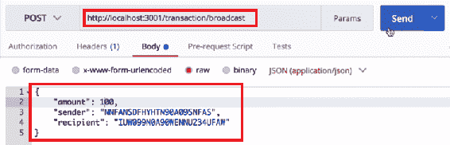

1.  添加交易数据后，单击发送按钮将交易发送到网络。同样，您可以添加另一笔`"amount": 200`的交易并将其发送到网络。

1.  接下来，挖掘一个新的区块，以便将这些交易添加到区块链中。在浏览器中打开一个标签，输入`localhost:3001/mine`到地址栏。然后将创建新的区块：

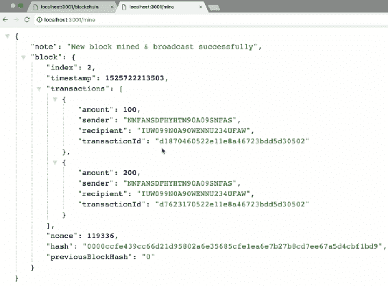

1.  接下来，发送另一个“amount”: 300 的交易，并使用先前提到的过程将其发送到网络。一旦交易发送完毕，让我们再次挖掘一个区块，将交易添加到区块链中：

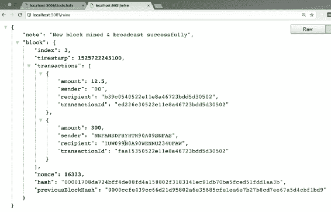

1.  现在，添加另外两笔交易，分别为`"amount": 400`和`500`，并将其发送到网络。最后，再次挖掘一个区块，将我们现在创建的交易添加到区块链中：

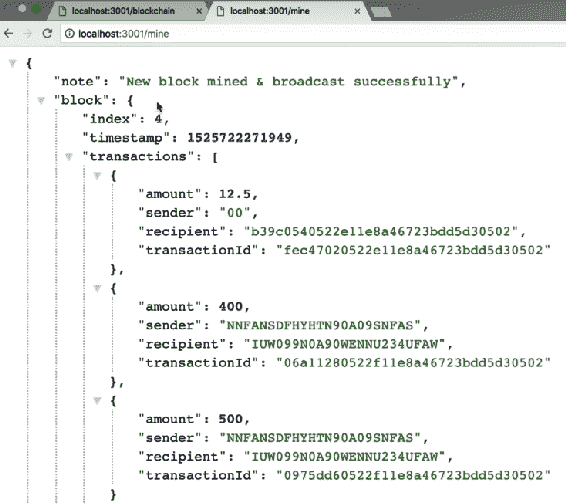

现在，如果您转到`localhost:3001/blockchain`，您将看到我们刚刚添加到区块链中的所有区块和交易。

# 测试端点

在向区块链添加交易和区块后，让我们测试`/transaction/:transactionId`端点：

1.  转到浏览器，打开另一个标签。在地址栏中输入`localhost:3001/transaction/`，然后在 URL 的末尾添加一个来自区块链中任何一个区块的`transactionId`值，然后按 Enter。参考以下截图：

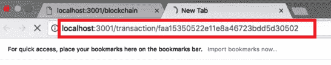

1.  运行此端点后，应返回以下输出：

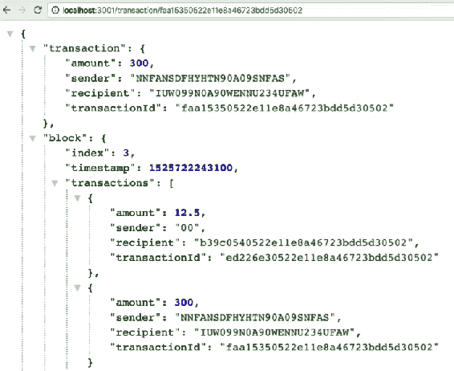

在前面的截图中，您可以看到我们使用端点传递的`transactionId`关联的交易作为输出。我们还返回了包含我们正在寻找的特定`transactionId`的区块。

1.  现在，使用一个在区块链中不存在的`transactionId`进行另一个示例。为此，转到浏览器，输入`localhost:3001/transaction/`到地址栏。在这之后，向端点添加一个随机的哈希值。参考以下截图：

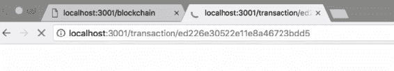

1.  运行此端点时，您将得到值为 null 的输出，如下截图所示：

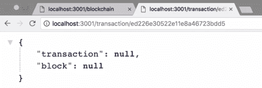

在前面的截图中返回的空值告诉我们，这个`transactionId`在区块链中不存在。

从测试中，我们可以得出结论，`/transaction/:transactionId`端点和`getTransaction`方法都正常工作。

# 构建`getAddressData`方法

我们将在区块链原型上构建一个名为`getAddressData`的新方法，并在`/address/:address`端点内部使用这个方法，以获取我们正在搜索的特定地址的数据：

1.  让我们在`blockchain.js`文件中构建这个新方法。在`getTransaction`方法之后，定义`getAddressData`方法如下：

```js
Blockchain.prototype.getAddressData = function(address) {

});
```

1.  现在，在这个方法内部，我们要做的第一件事是获取与该地址相关的所有交易，并将它们放入一个单一的数组中。让我们现在定义这个数组：

```js
Blockchain.prototype.getAddressData = function(address) {
       const addressTransactions = [];
});
```

1.  然后，我们要循环遍历区块链中的所有交易。如果任何这些区块中的交易的接收者或发送者是我们正在搜索的地址，那么我们要将所有这些交易添加到`addressTransactions`数组中。让我们定义这个条件如下。第一步是循环遍历区块链上的所有区块：

```js
Blockchain.prototype.getAddressData = function(address) {
       const addressTransactions = [];
       this.chain.forEach(block => {

 }); 
});
```

1.  现在，为了访问区块链中的交易，我们需要循环遍历每个区块上存在的所有交易。因此，在`forEach`循环内部，我们将不得不定义另一个`forEach`循环，如下所示：

```js
Blockchain.prototype.getAddressData = function(address) {
       const addressTransactions = [];
       this.chain.forEach(block => {
               block.transactions.forEach(transaction => {

 });
       }); 
});
```

1.  现在，在我们刚刚定义的`forEach`循环内部，我们可以访问区块链上的每一笔交易。我们只是想测试每笔交易，看看发送者或接收者地址是否与我们正在搜索的地址匹配：

```js
Blockchain.prototype.getAddressData = function(address) {
       const addressTransactions = [];
       this.chain.forEach(block => {
              block.transactions.forEach(transaction => {
                       if(transaction.sender === address ||
 transaction.recipient === address) {
 addressTransactions.push(transaction);
 }
               });
       }); 
});
```

在代码的这一点上，我们正在循环遍历我们区块链中的所有交易。如果我们遇到一个发送者地址或接收者地址等于我们正在寻找的地址的交易，那么我们将该交易推送到`addressTransactions`数组中。因此，在两个`forEach`循环都完成后，我们将得到一个包含与我们正在搜索的地址相关的所有交易的数组。

# 了解余额

接下来，我们要做的是循环遍历`addressTransactions`数组，以确定我们正在搜索的地址的余额。为了知道余额：

1.  让我们首先定义一个名为`balance`的变量：

```js
let balance = 0;
```

1.  接下来，我们要循环遍历`addressTransactions`数组中的所有交易。我们将使用`forEach`循环来做到这一点，如下所示：

```js
let balance = 0;
addressTransactions.forEach(transaction => { 

});
```

1.  在循环中，使用`if`和`else-if`语句提到条件，如下所示：

```js
let balance = 0;
addressTransactions.forEach(transaction => { 
       if (transaction.recipient === address) balance += transaction.amount;
        else if (transaction.sender === address) balance -= transaction.amount; 
}); 
```

1.  最后，在`forEach`循环结束时，我们要返回一个具有`addressTransactions`属性的对象，该属性与我们的`addressTransactions`数组匹配，并且`addressBalance`也是如此：

```js
let balance = 0;
addressTransactions.forEach(transaction => { 
       if (transaction.recipient === address) balance += transaction.amount;
        else if (transaction.sender === address) balance -= transaction.amount; 
}); 
return {
 addressTransactions: addressTransactions,
 addressBalance: balance
};
```

有了这个，我们就完成了`getAddressData`方法的构建。

# 开发/address/:address 端点

现在，让我们构建`/address/:address`端点，并在此端点内部使用`getAddressData`方法。`/address/:address`端点将与`/block/:blockHash`和`/transaction/:transactionId`端点非常相似，因此你不应该觉得太具有挑战性：

1.  在端点内部，我们要做的第一件事是将地址存储在一个变量中：

```js
app.get('/address/:address', function(req, res) {
       const address = req.params.address;
});
```

1.  我们要做的下一件事是使用`getAddressData`方法获取给定地址的所有数据。为了做到这一点，我们将在端点中添加以下突出显示的代码：

```js
app.get('/address/:address', function(req, res) {
       const address = req.params.address;
       bitcoin.getAddressData(address);
});
```

1.  通过这个方法，我们得到一个返回给我们的对象，其中包含`addressTransactions`和`addressBalance`。我们要将这些数据存储在一个变量中，如下所示：

```js
app.get('/address/:address', function(req, res) {
       const address = req.params.address;
       const addressData = bitcoin.getAddressData(address);
});
```

1.  最后，我们要返回包含这些数据的响应，如下所示：

```js
app.get('/address/:address', function(req, res) {
       const address = req.params.address;
       const addressData = bitcoin.getAddressData(address);
       res.json({
 addressData: addressData
 }); 

});
```

这就是我们构建`/address/:address`端点的方式。现在，让我们测试这个端点，以确保它能正常工作。

# 测试/address/:address 端点

为了测试端点，我们需要向区块链添加一些交易数据，让我们按照以下步骤来做：

1.  转到浏览器，探索`localhost:3001`上存在的区块链。你会发现这里只有一个区块。所以，让我们向其中添加更多的交易数据和区块。

1.  要做到这一点，转到 Postman，并将交易数据发送到`localhost:3001/transaction/broadcast`。在创建这些交易时，我们要确保跟踪一个特定的地址，以便在测试`/address/:address`端点时进行检查。为了跟踪这个特定的地址，让我们将一个地址的前三个字母改为 JEN。

1.  让我们创建第一笔交易。将`"amount":`值设置为`100`，并在此交易的发送者地址中添加`JEN`：

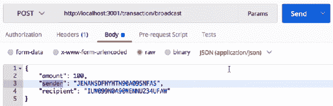

1.  然后，点击发送，将交易发送到节点`3001`。然后，按照类似的步骤，为`amount: 200`进行另一笔交易，这次将`JEN`添加到接收者的地址，并将发送者的地址保持为随机哈希值：

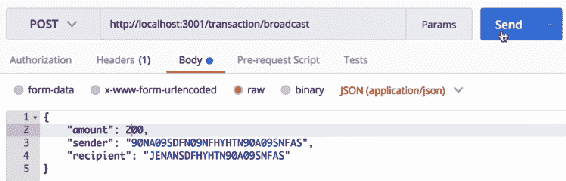

1.  现在，挖掘一个区块，将这些交易添加到区块链中。转到`localhost:3001/mine`，并按照以下方式在链中挖掘一个新的区块：

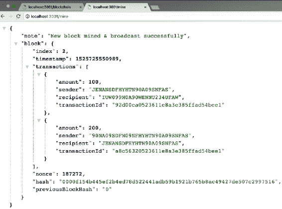

同样地，你可以通过改变金额值和交换发送者和接收者的地址来进行更多的交易，其中地址中包含`JEN`。一旦创建了一些交易，就挖掘一个区块，将这些新交易添加到区块链中。然后，再次创建新的交易，并通过交换发送者和接收者的地址给它们不同的金额。再次挖掘一个新的区块，将交易添加到区块链中。

然后，通过访问`localhost:3001/blockchain`来探索整个区块链，其中包括我们添加的新交易和区块。你将看到一堆区块和区块链内的交易。

现在，为了测试`/address/:address`端点，让我们按照以下步骤进行：

1.  转到浏览器，在新标签页中输入`localhost:3001/address/`端点。

1.  然后，从我们刚刚添加到区块链中的交易中复制一个地址，并将其粘贴到端点中。参考下面的截图：

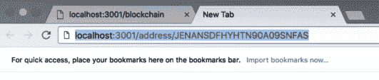

1.  现在，当我们运行这个端点时，我们应该看到与该特定地址相关的所有交易，以及该特定地址的比特币余额。看一下下面的截图：

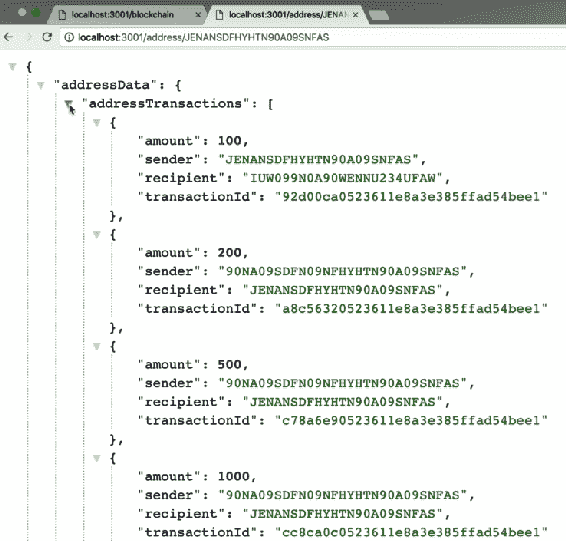

在上面的截图中，我们得到了`addressData`属性的返回，其中包括`addressTransactions`数组和`addressBalance`属性。`addressTransactions`数组包括与我们在端点中提到的地址相关的所有交易。此外，`addressBalance`属性包括我们在端点中提到的地址的比特币余额：

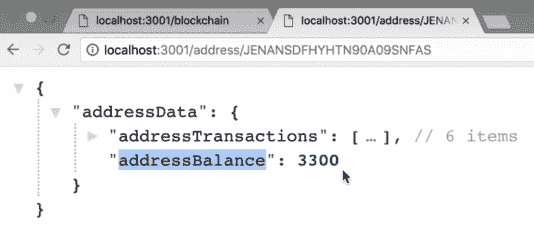

1.  接下来，你可以尝试通过复制挖矿奖励交易的接收者地址，并将其粘贴到`/address/:address`端点中，来检查节点地址的余额，就像我们在上一个例子中所做的那样。

1.  运行这个端点后，你将看到挖矿奖励交易的余额。尝试实现许多其他类似的例子，以更清楚地了解`/address/:address`端点的工作原理。

1.  另一个你可以尝试实现的例子是传递一个在区块链中不存在的地址。你将会得到以下返回的响应：

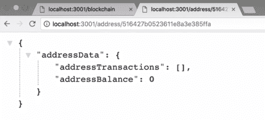

从前面的截图中，我们可以观察到`addressTransactions`数组为空，因为与我们输入的不存在的地址相关联的交易不存在。此外，不存在地址的`addressBalance`值为`0`。因此，我们可以从测试中得出结论，即`/address/:address`端点的工作方式正如它应该。

# 添加区块浏览器文件

让我们了解如何设置区块浏览器前端。区块浏览器将是一个用户界面，我们可以通过浏览器与区块链进行交互。为了构建这个用户界面并使其功能正常，我们需要使用 HTML、CSS 和 JavaScript。

现在，您不必自己构建所有的前端，您可以在以下链接找到一个完整的预构建前端：[`github.com/PacktPublishing/Learn-Blockchain-Programming-with-JavaScript/blob/master/dev/block-explorer/index.html`](https://github.com/PacktPublishing/Learn-Blockchain-Programming-with-JavaScript/blob/master/dev/block-explorer/index.html)。我们在本节中没有构建整个前端，因为这不是本书的重点。

要构建前端，您只需复制提供的链接中的文件并将其添加到项目的文件结构中。现在，转到`dev`文件夹并在其中创建一个名为`block-explorer`的新文件夹。在这个`block-explorer`文件夹内，创建一个名为`index.html`的文件，然后将提供的前端代码粘贴到其中并保存文件。您将在下一节中快速了解这个前端代码包含什么以及代码在哪里起作用。

# 构建`/block-explorer`端点

让我们构建一个端点，用于检索`block-explorer`文件：

1.  转到`dev/networkNode.js`文件，在这里，创建一个新的端点，将向我们发送这个文件。定义端点如下：

```js
app.get('/block-explorer', function(req, res) {

});
```

1.  现在，在这个端点内，我们想做的就是将`index.html`文件发送回给调用这个端点的人：

```js
app.get('/block-explorer', function(req, res) {
    res.sendFile('./block-explorer/index.html', { root: __dirname });
});
```

在前面的部分中，您可能已经注意到我们通常使用`res.json`，这是发送 JSON 数据的一种方式。然而，在这个端点中，我们想要发送整个文件，所以我们将使用`res.sendFile`方法。请注意，在前面的代码中，我们使用了`{ root: __dirname }`。这段代码表示我们应该查看项目存储的目录，并在其中查找具有`/block-explorer/index.html`路径的文件。这就是为什么我们将此选项作为第二个参数添加到端点中的原因，也是我们如何构建一个发送`index.html`文件的端点。

1.  接下来，保存`networkNode.js`文件，并通过在浏览器中访问`localhost:3001/block-explorer`来验证这个端点是否有效。然后，您将看到区块浏览器的前端，如下所示：

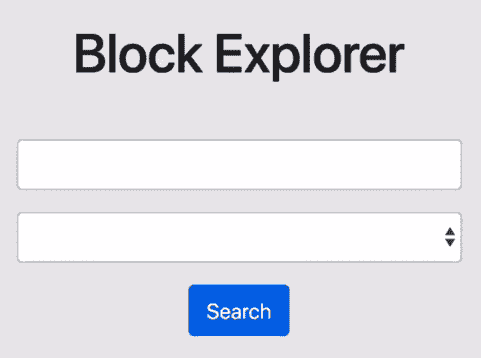

您在这个前端中看到的所有内容都包含在我们刚刚创建的`index.html`文件中。

# 区块浏览器文件说明

在本节中，我们将简单地浏览一下我们在上一节中创建的`index.html`文件。我们将这样做是为了更好地理解发生了什么。所以，让我们开始吧。

在`index.html`文件中，我们有所有的 HTML 和 JavaScript 代码，为区块浏览器提供必要的功能。这段代码还允许我们访问 API，最后，我们只是有一些 CSS 和样式，使一切在浏览器中看起来很好。

代码首先导入了一些库，比如`angular.js`，用于访问 API，还有 jQuery、Bootstrap 和一些 Bootstrap 样式，使一切功能正常且美观：

```js
<head>
  <title>Block Explorer</title>
  <script src="img/angular.min.js"></script>
  <script src="img/jquery-3.3.1.min.js" integrity="sha256-FgpCb/KJQlLNfOu91ta32o/NMZxltwRo8QtmkMRdAu8=" crossorigin="anonymous"></script>
  <script src="img/bootstrap.min.js" integrity="sha384-Tc5IQib027qvyjSMfHjOMaLkfuWVxZxUPnCJA7l2mCWNIpG9mGCD8wGNIcPD7Txa" crossorigin="anonymous"></script>
  <link rel="stylesheet" type="text/css" href="https://maxcdn.bootstrapcdn.com/bootstrap/4.0.0/css/bootstrap.min.css">
</head>
```

接下来，我们有 HTML 模型的主体，其中包括区块浏览器的标题：

```js
<body ng-app="BlockExplorer">
  <div class="container" ng-controller="MainController">
    <div class="row">
      <div class="col-md-8 offset-md-2">
        <h1 id="page-title">Block Explorer</h1>
      </div>
    </div
```

然后，我们有一个文本输入表单：

```js
<div class="row">
      <div class="col-md-6 offset-md-3">
        <form ng-submit="search(searchValue)">
          <div class="form-group">
            <input type="text" class="form-control" ng-model="searchValue">
          </div>
```

接下来，我们有一个`select`输入，其中包含三个选项：`区块哈希`、`交易 ID`和`地址`：

```js
<div class="form-group">
        <select class="form-control" ng-model="searchType">
                <option value="block">Block Hash</option>
                <option value="transaction">Transaction ID</option>
                <option value="address">Address</option>
        </select>
</div>
```

要使用此页面，让我们在文本字段中输入块哈希、交易 ID 或地址，然后从下拉菜单中选择我们要查找的内容，如下截图所示：

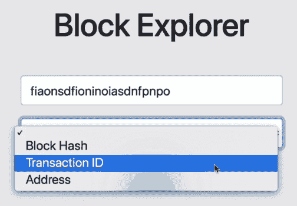

最后，在 HTML 代码中，一旦我们从区块链中获得了一些数据，我们只需有一些表格来显示所有的数据。

此外，我们的`index.html`文件中还有一些 JavaScript 代码。在这个 JavaScript 代码中，我们使用 Angular 来调用我们的 API：

```js
 window.app = angular.module('BlockExplorer', []);
 app.controller('MainController', function($scope, $http) {
          $scope.block = null;
          $scope.transaction = null;
          $scope.addressData = null;
          $scope.initialSearchMade = false;
```

然后我们有一个方法，当我们选择“块哈希”选项时，我们会命中`/block/:blockHash`端点：

```js
$scope.fetchBlock = function(blockHash) {
        $http.get(`/block/${blockHash}`)
        .then(response => {
          $scope.block = response.data.block;
          $scope.transaction = null;
          $scope.addressData = null;
        });
      };
```

同样，我们还有`/transaction/:transactionId`端点的方法：

```js
$scope.fetchTransaction = function(transactionId) {
        $http.get(`/transaction/${transactionId}`)
        .then(response => {
          $scope.transaction = response.data.transaction;
          $scope.block = null;
          $scope.addressData = null;
        }); 
      };
```

我们还有`/address/:address`端点的方法：

```js
$scope.fetchAddressData = function(address) {
        $http.get(`/address/${address}`)
        .then(response => {
          $scope.addressData = response.data.addressData;
          if (!$scope.addressData.addressTransactions.length) $scope
            .addressData = null;
          $scope.block = null;
          $scope.transaction = null;
        }); 
      };
```

在接下来的 JavaScript 代码中，我们只有一点点更多的功能，然后在代码的最后有 CSS 样式。因此，这段代码包含在`index.html`文件中。如果您想深入了解，以获得更清晰的理解，可以随意这样做。您也可以根据自己的喜好进行自定义。

然后点击搜索，如果指定的数据存在于区块链中，将显示一个表格，其中将显示所有这些数据。如果我们的区块链上不存在数据，您将得到未找到数据的结果。这就是区块浏览器前端的工作原理。

到目前为止，我们已经构建了一个完整的区块浏览器前端，并且我们有区块浏览器的后端——我们刚刚创建的三个端点，以便搜索整个区块链。

在下一节中，我们将测试区块浏览器，以确保它完美地工作。

# 测试我们的区块浏览器

在这一部分，我们将测试区块浏览器，以确保其正常工作，并确保我们在上一章中创建的所有端点和方法也能正常工作。如果区块浏览器正常工作，那么我们已经知道整个区块链也在去中心化的区块链网络上正常运行，所以当我们进入本章的最后一部分时，一切都很顺利地结束了。因此，这是我们将要进行的最后一次测试。现在让我们按照以下步骤来测试区块浏览器：

1.  为了测试区块浏览器，我们应该确保我们有五个节点都在运行。

1.  接下来，转到浏览器，通过`localhost:3003/block-explorer`打开区块浏览器。实际上，您可以转到网络中任何一个节点上托管的区块浏览器，因为整个区块链是托管在整个网络上的。

1.  现在，为了测试区块浏览器，我们需要向区块链添加一些数据。要向区块链添加数据，我们只需创建大量交易并创建一些新的区块，类似于我们在前几节中所做的。您可以参考前几章，快速回顾如何向区块链添加交易和区块。

1.  在添加数据之后，我们现在可以测试区块浏览器。让我们首先通过搜索块哈希来获取一个块。让我们选择“块哈希”选项：

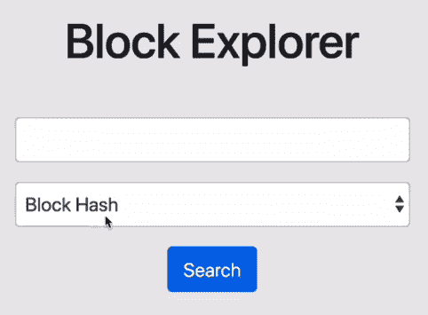

1.  然后，从区块链中复制任何一个块的哈希值，并将其粘贴到区块浏览器中：

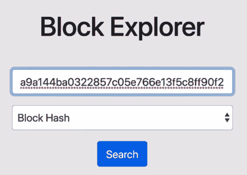

1.  现在，点击搜索按钮。您应该看到与以下截图中类似的输出：

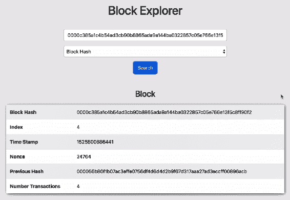

这基本上是区块浏览器的工作原理。我们输入我们正在寻找的哈希或数据片段，作为回报，我们得到该数据片段作为输出。从前面的屏幕截图中，我们可以观察到，我们输入到区块浏览器的哈希值返回了索引为`4`的区块。我们还得到了与该区块相关的所有细节。此外，您可能已经注意到，对于此搜索，我们正在命中`/block/:blockHash`端点。

1.  接下来，通过输入`transactionId`搜索交易。转到区块浏览器并选择交易 ID 选项。然后，转到区块链并从任何区块中复制一个`transactionId`值，并将其输入到区块浏览器：

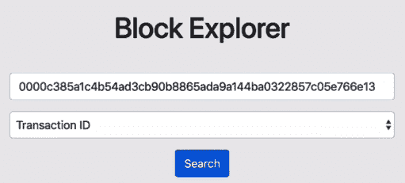

1.  然后点击搜索按钮。您将看到类似以下的输出：

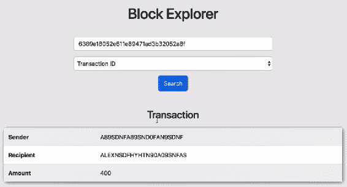

从前面的屏幕截图中，我们可以看到我们得到了与我们输入到区块浏览器的`transactionId`相关的所有交易细节。我们还得以观察到该特定`transactionId`的比特币余额为 400 比特币。

1.  最后，测试地址端点。要做到这一点，从区块浏览器中选择地址选项，然后输入任何一个区块中的发件人或收件人地址。然后点击搜索按钮。您应该在屏幕上看到以下输出：

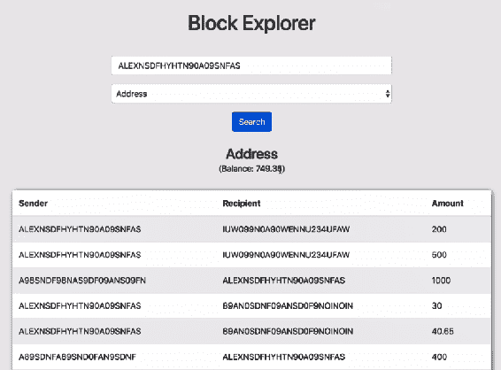

从前面的屏幕截图中，我们可以看到该地址有 749.35 比特币的余额，并且我们可以看到与我们输入的地址相关的所有交易。

现在，对于这些搜索中的任何一个，如果我们输入一个不存在的数据片段，我们将得到以下结果：

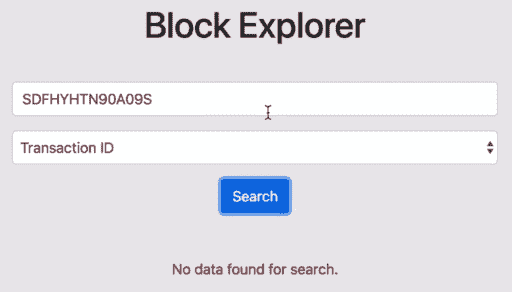

这证明了区块浏览器的工作原理与应有的一样。

# 总结

在本章中，我们构建了一个令人惊叹的用户界面，用于探索本书中构建的区块链。我们首先定义了查询所需数据的必要端点。然后，我们构建了诸如`getBlock`、`getTransaction`和`getAddressData`之类的方法，以帮助端点查询数据。此外，我们开发了`/block/:blockHash`、`/transaction/:transactionId`和`/address/:address`端点。在做完这些之后，我们将区块浏览器的前端代码添加到我们的区块链目录中，然后测试了区块浏览器和我们开发的所有端点。

通过本章，我们已经到达了本书的结尾。到目前为止，我们已经构建了自己的区块链，并为其添加了所有必要的功能。除此之外，我们还建立了我们自己的去中心化网络，并建立了一个用于探索区块链的界面。

下一章将是对本书中所学内容的快速总结。然后，我们将探索我们已开发的区块链还可以做些什么。
