# 第一章：区块链和比特币介绍

在本章中，我们将采用一步一步的方法来了解"比特币"和"区块链"的原则，以及它们的各种特征和特性。与新兴技术相关的热词比特币和区块链已经席卷了世界。随着我们在本章的进展，我们将详细介绍这些独特技术的基本知识。本章还将带您了解密码学的本质，以及加密货币如何将这一创新作为基础。我们还将研究比特币的历史，可用的备选加密货币，以及各种比特币钱包，了解比特币区块头的结构。在涉及区块链方面，我们将了解不同类型的区块链、区块链结构、它的各种运作和特性、所面临的挑战、可用于区块链的各种平台等等。

在本章中，我们将了解以下主题：

+   密码学和加密货币

+   比特币的历史和介绍

+   区块链介绍

+   比较私有、公共和联盟区块链

# 密码学和加密货币介绍

区块链技术是加密货币的支柱，它使用密码学来保持数据安全。在本章的这一部分，我们将讨论密码学、加密货币，以及密码学在加密货币实现中的应用。我们还将研究法定货币密码学的运作、加密货币的能源使用，以及密码学所使用的安全特性。我们将学习关于去中心化数字货币及其基础架构的一切知识。

当我们浏览本节的各个部分时，我们将了解比特币的历史、其替代货币、比特币基础知识以及比特币的技术运作；然后，我们将浏览区块链的技术基础、密码学的基础知识，以及它如何保持数据安全。接下来，我们将继续了解区块链、它的特性，每个比特币之上的基础架构，以及如何实现加密货币。

# 法定货币的运作和安全性

在了解加密货币之前，让我们首先看一些世界各地使用的基本货币。这些货币也被称为法定货币。

它们在下图中显示：

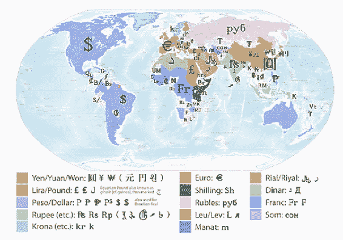

法定货币的一些特征如下：

+   这些由各国政府持有

+   它们通过银行或法定实体进行集中控制

+   它们是通货膨胀的，意味着货币的价值会下降

+   它们包括各种安全属性，以防止伪造和作弊，但伪造它们并非不可能

由于伪造货币并非不可能，执法部门介入阻止并起诉涉及伪造法定货币的人。我们现在将看看在法定货币中实施的各种安全特性，如下图所示：

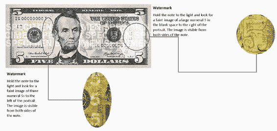

你会发现两个水印。你还会看到微型字和身份标识标记被实施。大部分时间，荧光墨水被用于检测伪造的钞票。

# 理解加密货币及其用途

加密货币是一个非常有趣和引人入胜的话题，已成为全球现象。它不同于世界各地找到的所有货币。从加密货币的工作原理，到谁拥有或控制它，其优点和局限性，其用途等等，都基于新的思想和流程。现在让我们简要概述一下加密货币的各种特征。

加密货币的主要特点如下：

+   它是用作交换媒介的**数字资产**

+   它通过使用**密码学**来保护交易并控制供应。

+   它是**替代货币**的一个子集

+   在`2008`年，第一个**去中心化加密货币**的概念被构想出来

+   加密货币是**数字货币**，而使数字货币或资产在个人之间流动的基础技术称为**区块链**

# 哈希函数

在加密货币中使用的主要密码学技术是哈希函数和数字签名。

让我们简要地看一下每一个。哈希函数是具有以下特性的数学函数：

+   我们提供的任何输入，无论是字符串、数字、浮点数还是其他任何东西，都可以是任何大小

+   它产生固定大小的输出，例如`128`位哈希结果，甚至是`256`位结果。

+   它是抗碰撞的

+   它隐藏其中的数据。

现在让我们看一个哈希函数的例子，如下图所示：

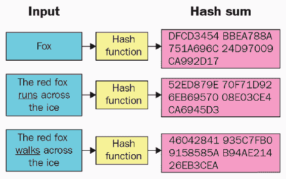

让我们看看这里使用的哈希函数。在前面的图表中，我们给了**Fox**一个字符串作为输入，并将哈希函数应用于它。它给出了一个特定的固定哈希结果，也被称为**摘要哈希值**。假设我们传递另一个语句，说**The red fox runs across the ice**，并对其应用哈希函数。它给出了一个特定的哈希值，也称为**摘要**。然后，我们添加另一个语句，**The red fox walks across the ice**，我们看到它改变了哈希函数，因为输入已经改变。这是哈希函数带来的关键特性。

# 数字签名

这是加密货币的第二个构建模块，数字上类似于我们通常进行的手写签名。

数字签名的特性如下：

+   你可以创建自己的签名，但也可以由另一个人验证

+   签名与特定文档或消息绑定，以便不能将其用于不同的文档和消息。

现在，让我们在下面的图表中看一个数字签名的示例：

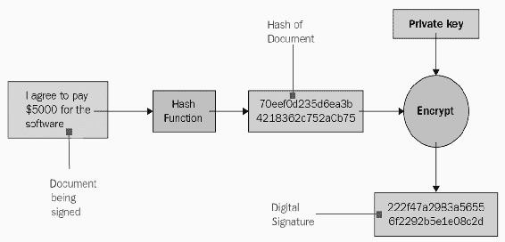

让我们举个例子，假设文档中有一个字符串，其中声明“**我同意支付$5000 购买软件**”。由于这是被签署的文档，我们首先对其应用哈希函数。它给我们提供了文档的哈希或摘要，其大小再次固定。然后，我们应用我们的私钥或特定密钥对其进行加密，得到的结果是数字签名。此数字签名专门针对这个输入进行签名，其声明“我同意支付$5,000 购买软件”。

在这里，我们看到了密码学和加密货币是广泛使用的数字资产。我们还看到了加密货币如何使用密码学及其技术，如哈希函数和数字签名。

# 对比特币的介绍

比特币是第一个去中心化的数字货币，因此它是一项革命性的技术发明。它改变了我们计算事物的方式以及我们操作软件和计算机的方式。比特币和区块链被认为是继互联网之后的下一个重大变革浪潮。

现在，让我们看看比特币的以下属性：

+   它是一个国际支付网络。

+   它使用密码学来控制其创建和管理，而不是依赖于政府、银行、联合领土或中介等中央权威。

+   它不是印刷出来的，而是由使用软件解决数学问题的人产生的。

+   它受到控制，并且供应量有限，这抑制了通货膨胀问题。例如，每当非洲国家缺少货币票据时，它们不得不印刷更多的票据，这导致了通货膨胀，并使货币价值下降。

+   自比特币问世以来，比特币程序的编写方式意味着全球范围内始终只有 2100 万比特币。一旦挖出 2100 万比特币，程序将不再生成任何新的比特币。因此，比特币将供应有限，这将遏制通货膨胀问题。

# 比特币的历史

比特币是由中本聪在 2008 年概念化的。我们不知道中本聪是一个人还是一群人。这个匿名的人或一群人仍然是一个谜。我们所知道的是，中本聪声称自己是一个于 1975 年 4 月 15 日出生在日本的男子。然而，有很多关于中本聪身份的理论和揣测。有些人说，中本聪的身份是基于美国和欧盟的密码学和计算机科学专家，不一定是日本人。在 2017 年 11 月，据信中本聪拥有大约 100 万比特币，这 100 万的价值为 72 亿美元，这是一个未知于世界任何人拥有的巨额财富。

# 比特币的替代加密货币

Altcoins 是比特币的替代加密货币。一旦比特币变得受欢迎，人们意识到比特币带来的价值、稳健性和灵活性，也开始喜欢比特币升值的事实。他们简单地使用 GitHub 存储库中可用的比特币协议源代码，分叉它，根据他们的需求修改它，并创建替代加密货币。随着比特币的日益普及，比特币的使用和价值也飙升。抛开这些不谈，接下来出现的问题是“我们如何安全地在数字形式中存储或拥有这种虚拟货币？”。

# 比特币钱包

有几种类型的钱包可供选择，我们可以安全地保存比特币。每种钱包都有自己的功能和操作方式。

不同类型的钱包如下：

+   **软件钱包**：软件钱包是安装在计算机硬盘上的比特币应用程序，可以完全控制和确保你的比特币安全。Bitcoin Armory 是软件钱包的一个例子，被认为是所有钱包中最稳定和安全的。

+   **网络钱包**：下一种钱包类型是网络钱包。与软件钱包相比，网络钱包更便利，因为可以从任何设备访问并使用你的资金、比特币或资产。因此，你可以在安卓或 iOS 设备、台式电脑甚至互联网上访问你的网络钱包。

+   **冷钱包**：下一种类型的钱包被称为冷钱包。冷钱包只是任何不连接到互联网的比特币钱包。这些可以是纸质形式的，或者你也可以在 USB 驱动器上拥有钱包。

+   **脑钱包**：脑钱包是下一种类型的钱包。脑钱包的地址是通过计算机程序通过对用户输入的口令进行哈希处理来生成的。

+   **硬件钱包**: 下一种钱包类型就是硬件钱包。硬件钱包只能通过持有者与钱包的实际接触来访问。它将用户的私钥存储在安全的硬件驱动器中，只有用户可以访问，通常使用指纹扫描仪或生物识别来访问。

# 区块链简介

在本节中，我们将看看区块链的架构，它是如何工作的，以及使其如此颠覆性的突出特点。区块链是由中本聪创建的比特币基础设施，并且被视为自互联网以来最重大的事物。在高层次上，区块链包括三个主要组件，如下图所示：

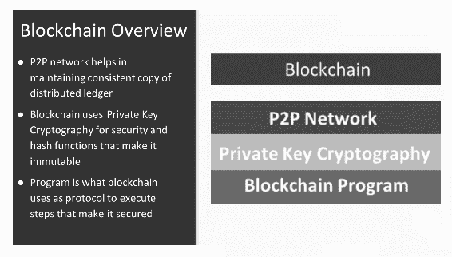

现在，让我们来看看区块链的以下三个主要组成部分：

+   **P2P 网络**: 一个**对等网络**(**P2P**)有助于维护一个分布式账本的一致拷贝。所有以区块链形式捕获的交易都由运行区块和程序的节点网络维护的。

+   **私钥加密**: 这个组件由区块链用于安全性和使其不可变的哈希函数。

+   **区块链程序**: 这个组件由区块链作为协议使用来执行使其安全的步骤。

# 区块链的工作方式

现在，让我们来看看区块链实现是如何运作的，以及完成执行流的所涉及的所有事物。让我们以比特币为例，在下面的区块链工作流程中展示：

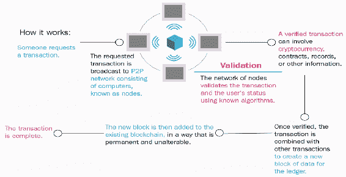

在前面的图中，我们看到区块链的工作方式，并且提到的步骤如下：

1.  假设有人要求在比特币中进行交易；例如，A 想将比特币发送给 B。那个人或实体请求一笔交易，导致从 A 的钱包中扣除一比特币并向 B 的钱包存入一比特币。

1.  现在，这个请求的交易被广播到遍布全球的计算机节点网络，这些计算机节点被称为节点。

1.  现在，一旦交易被传播，交易就会被节点网络接收，它们通过运行区块链程序的节点来验证交易和用户状态，使用在所有节点上通用的已知算法。

1.  在我们的例子中，我们谈到 A 发送一比特币给 B，这也涉及加密货币。验证部分还涉及检查 A 是否真正拥有该比特币。

必须避免重复预订和伪造交易。验证还可能涉及需要验证的合同、记录、协议或文件。 

1.  一旦验证完成，交易就会与其他交易合并，以创建新的数据块用于分类帐。然后，这个新创建的一系列交易块会以永久的方式（不可更改）添加到现有的区块链中。

1.  添加了这个区块到区块链后，交易就完成了。

1.  一旦添加了区块，它将一直保留在区块链的余生中。

# 区块链的特点

现在我们将讨论区块链的以下特性：

+   **安全的**：任何人都无法篡改区块链中的交易或分类帐记录，这使得它更加安全，因此被视为可靠的信息来源。

+   **全球范围**：区块链已在全球范围内得到采用，并得到了来自银行和非银行领域的许多投资者的支持，这使得它成为一种全球接受的技术堆栈。

+   **自动化操作**：操作完全通过软件自动化。不需要私人公司处理操作，因此无需进行任何调解即可进行交易，并且保证了信任，因此人们可以自行进行交易。

+   **开源的**：区块链是一种开源技术。所有的操作都是由开源社区进行的。

+   **分布式的**：区块链以分布式模式工作，其中记录存储在网络中的所有节点中。如果一个节点崩溃了，它不会影响任何其他节点或任何其他记录，因为它们是全球分布在所有节点之间的。

+   **灵活的**：区块链是可编程的，使用基本的编程概念和编程语义，这使得区块链非常灵活。

# 区块链的结构

在这一部分，我们将学习区块链的以下方面：其结构；其构建模块；以及使其具有颠覆性、强大、坚固和防篡改的核心部分。

让我们来看一下区块链的结构。区块链的结构与**链表**或**二叉树**非常相似。链表或二叉树通过指针连接到彼此，这些指针指向链表中节点上的前一个或下一个列表元素。区块链的结构与二叉树的结构并没有真正的不同，但主要的区别在于区块链是防篡改的，而且很容易发现是否发生了任何篡改。

在下图中，我们将看到区块链是如何构建的以及它是如何成为一个链接列表的表示：

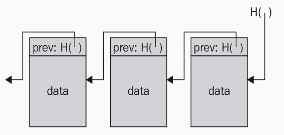

现在让我们讨论一下区块链的结构和要素。

区块链是一个使用哈希指针而不是指针构建的链表。这正是为什么尽管区块链类似于链表，但不同的原因，因为在链表中，我们一直使用指针指向列表中元素的前一个节点，但在区块链的情况下，指针是哈希指针，而不仅仅是简单的指针。

因此，通常，区块链中的任何块由三部分或三脚组成，如**标头**、**Merkle**和**交易 ID 列表**。这是一个新创建的区块。

我们可以在以下图表中看到区块链的结构：

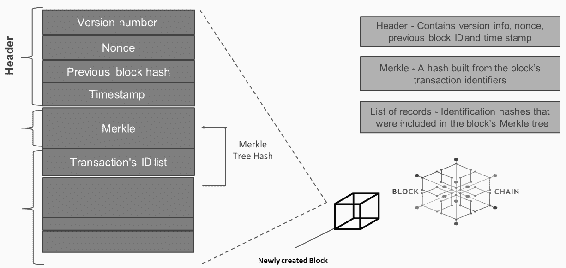

我们现在将查看以下区块及其元素：

+   **标头**：此块包含块的版本信息、随机数、上一个块 ID 和创建块时再次进行哈希处理的时间戳。

+   **Merkle**：此块是由块的交易标识符构建的哈希。

+   **交易 ID 列表**：此块代表交易本身。它是块的 Merkle 树中包含的记录、标识哈希的列表。

然后使用所有前述详细信息创建区块。这个新创建的区块被添加到区块链中。

现在，让我们看一下 Merkle 树是什么，如下所示：

+   在区块链结构中，它也被称为二进制哈希树。它是用于摘要和验证大型数据集完整性的数据结构。

+   它不仅总结了特定块上捕获的数据，还验证了数据的完整性，从而确保块中表示的数据是完整且未被篡改的。它包含用于确保跨块维护完整性的密码哈希。

+   它是一棵颠倒的树，根在顶部，叶子在底部。

现在，让我们看一下以下图表中 Merkle 树的表示：

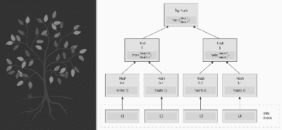

以下是对顶部哈希、数据块和 Merkle 根代表的简要概述：

+   在上述图表中，我们可以看到**顶部哈希**，它是 Merkle 树的根，还有组成整个树的叶节点或叶子。

+   **数据块**是已捕获和哈希的交易。它们被成对哈希多次，这就是你到达 Merkle 树顶部的方式。

+   收集一个或多个新记录的块，然后将这些记录成对进行哈希处理多次，直到仅剩下一个哈希。这个单一的哈希称为该 Merkle 树的**Merkle 根**。

如果交易数据的任何部分发生更改或篡改，我们可以清晰明了地看到这种妥协。因此，Merkle 树在区块链的实施中非常重要，并且是确保区块链数据没有被篡改的主要贡献者。

# 构造比特币区块头

现在，我们将看一下比特币区块头的结构，其中头包含一个区块，每个区块都包含以下三组区块元数据：

+   对先前块哈希的引用

+   头部的难度、时间戳和随机数部分

+   Merkle 根

让我们看看以下图表中表示的各种术语：

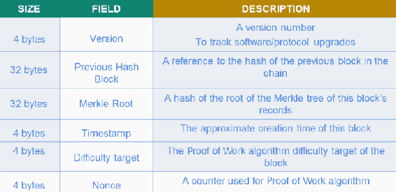

以下是前面图表中提到的术语的详细说明：

+   **版本**：头部的第一部分是版本的**4 字节**。版本号跟踪软件协议的升级。将这些数据作为区块的一部分捕获非常重要，因为如果在程序的后续版本中进行了任何更改，就需要捕获运行每个程序或节点的程序或节点是哪个以便将交易和区块发送到互联网上。

+   **上一个哈希块**：头部的第二部分是**32 字节**的上一个哈希块或上一个哈希块代码。这是对链中上一个区块的哈希的引用。它不仅仅是对上一个区块的链接，而是上一个区块的哈希指针，这确保了新添加的区块维护了区块或链的序列。

+   **Merkle 根**：头部的第三部分是 Merkle 根的**32 字节**。我们刚刚看过 Merkle 根，它是 Merkle 树的根哈希。它是作为区块的一部分捕获的所有交易的最终哈希码。

+   **时间戳**：头部的第四部分是时间戳的**4 字节**。这是创建此区块所花费的大约时间。我们使用“大约”这个术语是因为一旦区块创建完成，它就需要几毫秒的时间才能被添加到实际的区块链，因为交易是由不同的节点验证的。

+   **难度目标**：头部的第五部分是**4 字节**，用于捕获难度目标。这是区块的工作量证明算法。它是为运行比特币区块链程序的特定节点提供的。

+   **随机数**：头部的第六部分是**4 字节**的随机数。这是用于**工作量证明**（**PoW**）算法的计数器。首先计算和解决数学问题的任何节点实际上都产生了问题解决方案的结果，结果包含了这个随机数，用于捕获交易并验证节点进行的 PoW 是否正确。

因此，我们可以看到这是比特币区块头的典型结构，大约 80 字节的信息被捕获在每个区块中。

# 表示区块链结构

现在，我们将看一下以下图表中比特币区块链头的整体结构：

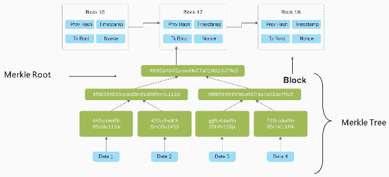

在本例中，**区块 16**代表了上一个区块的哈希，包括创建时间戳，交易根也被称为 Merkle 根，nonce 是必须验证的算法-累加器。所有交易的隐藏信息都被再次哈希化，并且该哈希被捕获在**区块 17**中。它包括上一个区块的哈希、时间戳、Merkle 根和 nonce。

在前面图表的**数据 1**、**数据 2**、**数据 3**和**数据 4**部分中，所有数据都被多次配对和哈希化。因此，数据一直向上移动，直到达到一个最终哈希为止。这些区块不断移动，整个 Merkle 树是由捕获在区块中的交易形成的。这就是它如此强大、强壮、防篡改、集成和不可变的原因。这就是区块链的美妙之处。

# 区块链的挑战

在看完了区块链的构建块、结构和核心部分之后，我们现在要了解可用的各种区块链实现，我们还将了解它们的特点和优势。正如我们已经知道的那样，比特币区块链因其不可变性、安全性、强大性和透明性而受到欢迎。行业需要比特币区块链架构，但也出现了一些挑战。

行业面临的挑战如下：

+   **如何满足企业的特定需求**：我们知道比特币区块链是开源的，对各种解决方案都是开放的。如果 IT 行业或各种企业想要使用这种区块链架构，它们将无法满足自己的需求，因为它们的需求各不相同。

+   **如何使用区块链与其他货币**：愿意使用区块链架构的企业由于其不可变性、安全性和透明性而希望跟踪自己的资产，但这在比特币区块链中是不可能的，因为它使用的是比特币和其他替代币作为货币。

+   **如何允许我们在区块链上定义特定角色和权限**：不同的企业有着自己的角色、特权和权限，这些必须在区块链节点上进行捕捉和执行。就比特币区块链而言，我们知道全球每个节点都扮演着相同的角色。

因此，这些挑战促使了对区块链进行特定改变的需求，以供行业、企业和 IT 公司使用，从而衍生出了不同的区块链版本或变体。

# 区块链类型

让我们来看看以下几种区块链类型：

+   **公共区块链**：公共区块链的账本对所有人都是可见的，任何人都可以验证并添加一个交易块到区块链中。一些例子包括比特币、以太坊、达世币、法图姆和市场上今天可用的数百种替代币。

+   **私有**：第二种区块链类型是私有区块链。所有权限都集中在一个组织中。私有区块链只允许组织中具有特定角色的特定人员验证交易块，但允许互联网上的所有人查看它们。这也取决于组织的决定。一些例子是**MultiChain**和**Blockstack**。

+   **联盟**：第三种也是最流行的区块链类型是联盟。它由一个成员联盟控制。这些成员来自于顶级公司，他们出面为特定目的改变区块链。因此，只有预定义的一组节点可以访问将数据或块写入区块链。一些例子是**Ripple**、**R3**、**Hyperledger 1.0**和**Hyperledger 2.0**。

# 权限和无许可区块链实施

现在，让我们看一下在下图中显示的**权限**和**无许可**区块链实施之间的区别：

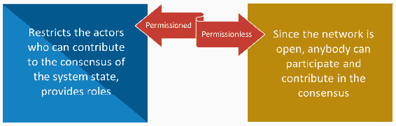

让我们探讨权限区块链和无许可区块链之间的差异如下：

+   **无许可区块链**：由于网络是开放的，因此被称为无许可区块链。任何人都可以参与并为共识做出贡献。现在，参与区块链挖矿的所有节点的共识都有所不同。甚至一个人可以设置挖矿并开始运行区块链实施。这是一个公共网络，每个人都可以扮演特定角色，或者说是通用角色。

+   **权限区块链**：它限制了可以对系统状态达成共识的参与者，并为参与实施的参与者提供基于角色的区块链访问。

以下表格描述了公共和私有区块链之间的区别：

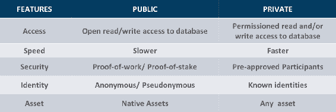

所以，让我们看一下以下实现提供的功能：

+   **访问**：就访问而言，公共区块链对于运行区块链实施的任何节点都是开放的，可以读写数据库。另一方面，私有区块链需要许可才能读取或写入数据库。

+   **速度**：就速度而言，公共区块链较慢。这是因为它是公共的，参与区块链的节点的数量、大小和数量更多，因此需要一些时间来捕获交易。而当涉及到私有区块链时，它们具有由有限节点扮演的特定角色，这有助于加快交易的实施。

+   **安全性**：公共区块链的工作方式是基于 PoW 或 **股权证明**（**PoS**）的前提，而私有区块链中的安全性是由预先批准的参与者提供的，这些参与者只能参与或贡献到区块链中。

+   **Identity**：就公共区块链而言，它为参与区块链的参与者提供匿名或伪名。但是，在私有区块链中，每个参与节点的身份都是已知的。

+   **Assets**：公共提供本地资产，即使在诸如比特币、以太币和所有备选币种之类的加密货币中也是如此。但在私有区块链中，目的是使用任何资产，从而提供跟踪区块链上资产的功能。

以下是一个例子。假设两个组织同意执行一些工作，并在交易执行后转移或交换资产或货币。因此，他们达成的协议可以成为私有区块链上的资产。

# 区块链平台

让我们看看有哪些实现区块链的各种平台：

+   **Hyperledger**：第一个是 Hyperledger，它是由贡献共同构建的。这是一个开源的协作努力，旨在推进跨行业的区块链技术。这是一个非常有名的平台。

+   **Ethereum**：第二个是以太坊或企业以太坊，它有两个变种。第一个是一个开放的区块链平台，任何人都可以在上面构建和使用运行在区块链技术上的去中心化应用程序。与比特币一样，没有人控制或拥有以太坊，而企业以太坊则是与 Hyperledger 类似的联合体。

+   **IBM Bluemix**：这是一个建立在 Hyperledger 项目之上的**平台即服务**（**PaaS**），为企业提供了额外的安全性和基础设施设施，供其使用 Hyperledger 区块链实现用于其自身目的。

+   **MultiChain**：这是一个用于创建和部署私有区块链或许可区块链的平台，可以在组织内或组织间使用。

+   **Corda**：它是一个具有可插拔一致性的分布式账本平台，为企业提供了为其自身目的插入自己的共识或智能合约的灵活性。

+   **Openchain**：这非常适合希望发行和管理数字资产的组织。它采用了与标准比特币方法不同的方法来实现区块链，因为它基于分区一致性系统工作，其中每个 Openchain 实例仅有一个权威来验证交易，这取决于正在交换的资产。

这些只是区块链实现的几个示例；除了这些之外，今天还有许多平台的实现。

# 总结

在本章中，我们从加密货币和加密货币的基础知识开始。我们还了解了其工作原理和技术。然后我们进入了对比特币的介绍，其历史以及除比特币外可用的各种钱包和备选货币。然后我们看了一下区块链是什么，其结构，特征以及各种类型。本章为我们提供了比特币和区块链成为互联网之后的下一个主要创新的更大局面。

在接下来的章节中，我们将重点关注**去中心化**。您将熟悉去中心化，作为区块链创新的核心，并了解去中心化是如何运作的，什么可以被去中心化，以及它对世界的影响。我们还将讨论去中心化的优缺点，为您提供一个全面的概述。请继续关注！
