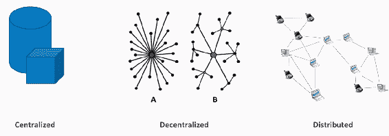
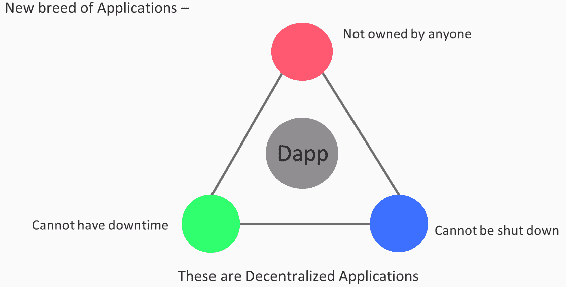
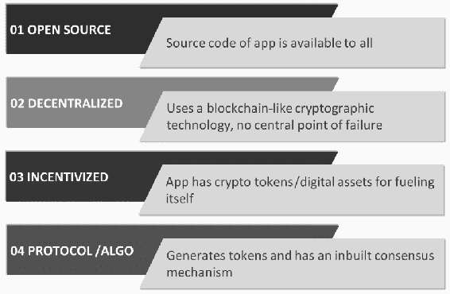
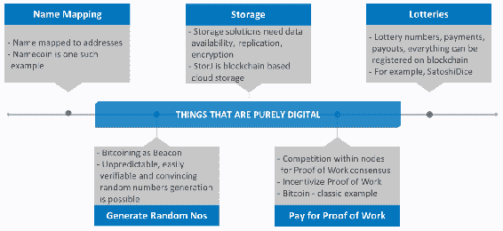
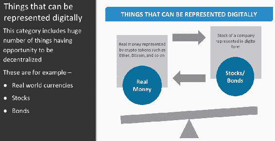
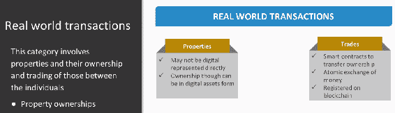
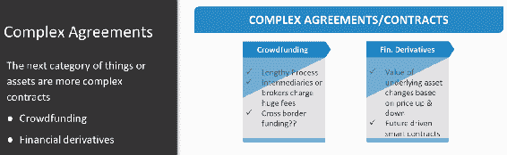
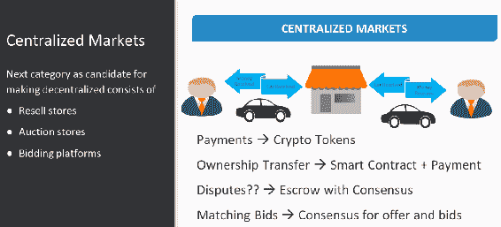
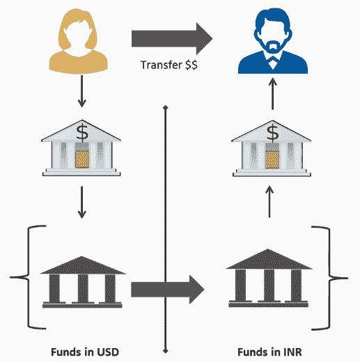
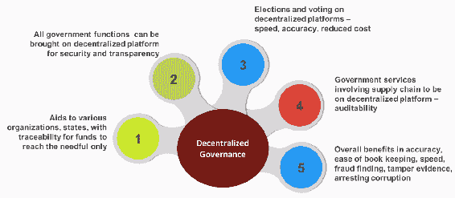

# 去中心化的基础知识

在前一章节中了解了比特币和区块链的基础知识后，现在让我们试着了解一下去中心化的一些基本概念。在本节中，我们将讨论以下主题：

+   去中心化如何运作

+   什么可以去中心化

+   去中心化对当前和未来世界的影响

+   去中心化的利与弊

那么，首先什么是去中心化呢？现在你开始了解区块链技术及其架构，你应该经常听到去中心化这个词。它是加密货币领域经常使用的流行词之一，并且通常被认为是区块链技术的唯一目的。去中心化听起来像是与中心化相对立的东西，但它远不止于此。

# 去中心化、集中化和分布式系统

比特币基于其加密安全分类帐、独特资产模型和 P2P 技术建立了其基础。这导致了一个新的架构时代，有助于构建大规模可扩展且盈利的应用程序，一种被称为**去中心化应用程序（Dapps）**的新型软件。现在让我们来看看三种类型的应用程序及其差异。我们使用的大多数应用程序都是基于集中化或客户端-服务器模型的。有些分布式，但现在越来越多的应用程序变得去中心化。

以下图表展示了这三种软件类型之间的区别：

现在让我们看看前面图表中提到的不同类型的应用程序：

+   **集中化系统：** 集中化软件或系统是广泛存在的。这些是在独立系统中运行的单个实例系统。系统目标的决策是在中央机制中创建的，然后转移到执行组件或人员。它们在单个节点中完成所有工作。所有执行者都依赖于中央机制来采取行动，例如传统公司，其中只有一个 CEO 或 CXO 来管理整个公司或一个国家的中央法规。联邦储备机构和金融机构是集中化系统的其他例子。大多数服务都可以在互联网上找到。

+   **分散系统：** 分散系统在点对点（P2P）计算机网络上运行，而不是一个计算机或单个实例。 这意味着没有一个实体控制所有处理。 分散计算是将资源分配给每台计算机的硬件和软件。 基本上，没有一个节点告诉其他节点该做什么。 分散系统带来决策局部性，这意味着系统组件根据本地信息而不是中央排序影响的结果来执行目标。 从本质上讲，这意味着它分布在各方之间。 关于分散的一个关键点是没有中央控制点。 没有一个实体控制其他实体，这就是为什么我们说没有节点告诉其他节点要做什么，例如用于下载大型视频文件或电影的 BitTorrent。 区块链就是分散系统的一个典型例子。

+   **分布式系统：** 大型互联网应用服务是分布式的，但其中大多数是集中式的，因为运行它们的公司可以完全改变或停止系统，这引出了分布式系统的一个重要方面。 分布式系统由使用分布中间件连接的自治组件组成。 这些组件彼此通信以实现相同的目标。 这些组件位于网络计算机上，它们通过传递消息来通信和协调它们的行动。 分布式意味着交易的所有处理都不是在一个简单的、单一的或相同的地方完成的。 这并不意味着那些分布式处理器不受单一实体的控制。 州级政府是分布式系统的典型例子。 加油站也是如此。 当我们想到一个加油站时，我们知道到处都有壳牌加油站，但并不是所有的加油站都是壳牌的，这让我们想到了另一个重要的方面，即分散系统也是分布式系统，但并不是每个分布式系统都必须是分散系统。

# 分散系统的工作原理

让我们现在向前迈进，看看分散系统是如何工作的：

+   在分散系统中，数据的存储分布在网络上，这消除了集中存储数据或单点故障的风险。

+   为了接收消息，采用了特定消息传递和分布式网络。

+   它利用了公钥密码学。 公钥是一个主要用于身份验证的加密过程。 该密钥对所有人都是可用的，并且密钥的使用取决于应用于要加密的信息的数学过程。

+   网络中的每个节点或矿工都复制了区块链，这非常重要。

+   数据平等通过大规模数据复制来保留，这意味着不存在中央官方副本，但分散节点网络中可用的副本是官方副本。这意味着没有其他用户可信任，因此对特定用户或一组用户没有偏好，而所有用户都受到平等对待。

+   使用软件，交易被广播到网络中。

+   消息在规定的时间范围内实时传递，这意味着会有重新尝试传递消息的尝试。

# 分布式应用程序

让我们看一下以下图表中的 Dapps 的特点：

一种新型的应用正在全球讨论中。这种应用没有所有者，不能被关闭，也没有停机时间。这种新的应用网格被称为 Dapps。

Dapps 的特点如下图所示：

让我们探讨上述图表中提到的 Dapps 的特点：

+   **开源**: 当我们查看应用程序的源代码时，需要知道它对每个人都是可访问的。理想情况下，它的治理应该是自主的，并且所有的变化都应该由共识或者它的大部分用户来解决。它的代码库也应该公开供审查。

+   **去中心化**: 应用程序使用类似区块链的加密技术，没有中心化的失败点。应用程序的操作文档必须存储在公共的分散式区块链上，以避免中心化的缺陷。

+   **激励**: 为了自我推动，该应用程序具有加密代币或数字资产。区块链的有效读者应该通过从密码学中获益来获得激励，这是鼓励障碍编辑者验证区块链上的交易。

+   **协议/算法**: 分散式应用程序创建代币并具有内置的共识机制。为验证价值，应用程序财团必须就一种加密算法达成一致。例如，比特币和以太坊使用 PoW 并计划将来使用混合 PoW 或 PoS。

因此，如果我们考虑前面的特点，事实上，第一个 Dapp 其实是比特币本身。比特币是一种实施的区块链解决方案，它源于围绕分散和审查问题而产生的。我们可以说比特币是一个有效的公共账本，允许在没有中介和中央机构的情况下进行顺畅的交易。因此，以太坊白皮书将 Dapps 分为三种类型，基于以下两种观点：

+   **功能性**: 从功能性的角度来看，有以下三种类型的 Dapps：

+   **第一类型**：这种 Dapp 管理货币或加密代币。用户可能需要使用加密货币或代币，如 Ether 或比特币，作为一种与另一用户结算合同的方式，通过使用网络的分布式计算节点来促进数据的分配。

+   **第二类型**：这种 Dapp 涉及加密代币或货币，但除此之外还需要其他东西。

+   **第三类型**：这种 Dapp 属于“其他”类别，包括解决一般问题的解决方案；例如，投票、治理系统和去中心化自治组织等都属于一种雄心勃勃的 Dapps 类型，也被称为**数据访问对象（DAOs）**。它形成了一个无领导的组织。

+   **技术角度**：从技术角度来看，Dapps 有以下三种类型：

+   **第一类型**：这种应用程序有自己的区块链；例如，比特币或任何山寨币都属于这类。

+   **第二类型**：这种 Dapp 使用第一类型 Dapp 的区块链。这种类型的 Dapp 具有其功能所必需的程序和代币。Omni 协议是这种类型 Dapp 的最佳例子。

+   **第三类型**：这种 Dapp 使用第二类型 Dapp 的协议。例如，**安全人人访问**（**SAFE**）网络使用 Omni 协议发行安全代币，然后用于构建分布式文件存储。

这些是从功能角度以及从技术实现角度而言的 Dapps 类型。

# 分散化各种实体

在谈论了分散化是什么以及我们如何实现分散化之后，现在让我们来看看真正可以分散化的内容。知道在现实世界中有许多东西可以被引入到分散化的区块链平台上是非常令人兴奋的：

现在我们将详细了解可以根据前面的图表进行分散化的内容。

+   **名称映射**：任何纯数字都可以被分散化。此类别中的第一个例子是**名称映射**。**Namecoin**是一个很好的例子，其中人可读的名称与地址进行映射。不同的参与者可以将名称输入为值，更新这些值，而区块链可以用于维护该值的当前状态。

+   **存储**：这个类别是另一个经典的例子，也是使用分散化的商业案例。任何存储解决方案最重要和关键的要求是数据可用性、避免单点故障、数据复制以及自动备份。所有这些都可以很好地由使用安全的区块链解决方案的分散式存储解决方案处理。**存储**或**StorJ**是一个使用区块链进行加密和分布式对象存储的开源云存储平台。

+   **彩票**：通过使用分散式区块链解决方案，支付和支付可以以区块链本身的货币计价。这有助于轻松使用随机数生成彩票。**SatoshiDice** 就是使用分散式区块链解决方案的彩票的一个例子。

+   **生成随机数**：接下来是随机数生成。比特币可以用作信标，提供不可预测且公开可验证但令人信服的随机数，这意味着在信标启动时输出是未知的。然而，每个人都可以在信标终止后验证输出接近均匀。这是一种更可靠的方法，用于生成这样的随机数。

+   **工作证明付费**：接下来，我们要了解的是支付 PoW 的方式。它补充了存储的概念，但主要是为了激励 PoW。它旨在在可验证节点之间创建竞争，以达成共识。参与验证区块链中的交易的各个节点需要证明他们在执行验证过程中投入了大量的计算能力。在比特币的经典示例中，矿工们竞争处理一组交易并将其添加到区块链中。他们通过在计算机上进行足够多的随机猜测，以便在比特币程序建立的参数内得出答案来实现这一点。

# 资产类别

有许多事物或资产本质上是数字化的，可以以数字方式表示。我们可以在以下图表中看到这些类别：

该类别包括许多有机会去中心化的东西，如下所示：

+   现实世界的货币

+   债券

+   股票

+   公债和其他类似资产

让我们看看这些资产以及通过示例如何将它们去中心化。假设一个彩色硬币代表一种特定的货币，另一种彩色硬币代表一家特定公司的股票。现在，所有这些资产都可以在不同的参与者之间转移。假设一个参与者将债券或股票等资产转移到另一个参与者，而另一个参与者则支付相应的货币作为转移给他们的资产的交换。这种资产交易可以完全去中心化。您可以在这些资产交易之间实现原子性，并一起转移资金，以确保资产的转移和资金的转移同时进行，形成一笔完整的交易。

然而，要实现这一切很容易，关键在于解决一个基本挑战，那就是，如何确保有色硬币中的 1 美元实际价值为 1 美元？当一个银行或一组银行同意银行这个价值 1 美元的有色硬币并保持比率时，这是可以实现的。因此，这个实体将必须确保这种一比一的比率在整个过程中得以维持。同样，夺回数字股票的实体必须确保数字股票等同于实物股票。他们需要达成协议以保持这一比率的稳定。

# 现实世界交易

在前一节中，我们看到使用去中心化平台转移股票是多么容易。然而，在房地产领域情况并非如此。

我们可以在下图中看到现实世界交易的特点：

物业可能无法以数字形式表示。然而，它们的所有权完全可以通过代币或资产以数字方式表示。然后，通过使用智能合约和原子交易交换，这些资产的所有权可以在个体之间转移。这种数字执行的交易被记录在去中心化平台上。如今有许多去中心化的区块链平台，帮助买家在个体之间转移物业。买家可以交换金钱以转移物业所有权，并将所有权协议安全存储在去中心化的区块链平台上。类似平台的例子有**Atlant**和**Propy**。物业只是我们研究的一个示例，但是还有许多这样的资产，其所有权转移和交易可以实现去中心化。

# 复杂的协议

下一个类别的事物或资产更加复杂，例如，众筹和金融衍生品，正如下图所示：

因此，让我们来了解一下众筹、金融衍生品和中心化市场涉及的内容：

+   **众筹**：我们知道有一些初创公司从投资者那里筹集资金，但需要经过非常漫长的过程，包括法律活动。最困难和繁琐的部分是，这些初创公司通常需要先接触中介或经纪人，然后再由他们与真正的投资者联系。不用说，这些经纪人收取高昂的费用作为佣金，此外还需要花费时间来完成交易。去中心化可以通过消除中介，将权力和控制权完全交到投资者手中，从而完全民主化投资过程。区块链上的众筹使普通人可以获得他们其他方式无法看到的投资机会。加密货币众筹的令人兴奋的特点是，它允许投资者在可用的交易平台上立即交易投资。借助去中心化区块链平台，初创公司可以创建自己的加密货币、加密币或加密代币，这些代币由他们未来的收入生成计划支持。这些加密币通常由真实货币支持，每枚币都有适当的比例。然后，他们可以使用去中心化平台，将这些币提供给感兴趣的投资者。

这个过程通常被称为**首次代币发行**（**ICO**）。全球范围内有意愿参与此 ICO 投资的人或实体在平台上注册，购买所需数量的加密币，并将其与真实货币交换。这是一个相对容易、较不繁琐的过程，最重要的是，它消除了中介或经纪人。今天有许多基于去中心化区块链技术构建的众筹平台。**Wave**和**OpenLedger**是两个最著名的平台。

+   **金融衍生品**：让我们简要看看金融衍生品。金融衍生品是另一个范围广阔的领域，可以实现去中心化。金融衍生品有一个基础资产，衍生品的价值取决于基础资产价格的涨跌。衍生品的关键方面是，它可以被视为嵌入智能合约中的一个条件语句，该语句取决于基础资产的价格，有时是在未来等等。各种基于替代币的系统可以轻松用于构建去中心化的衍生品平台。

+   **中心化市场**：下一个可以使用去中心化解决方案的候选类别包括市场和期权。我们可以在下面的图表中看到中心化市场的特征：

让我们看一下前面图表中使用的各种平台。我们知道许多在线拍卖店或转售店。让我们举一个例子来详细了解一下。让我们以一个二手车在买卖店中的例子为例。所以，典型情况下，我们将二手车卖给商店以换取货币。这完成了一笔交易。然后，商店执行另一笔交易，他们将这辆车卖给其他人以换取货币。在这个例子中，你真的不用担心任何购买车辆的客户。另一个例子是**eBay**。 eBay 是另一个拍卖平台。它根据参与者的需求进行匹配并处理付款。**PayPal**是另一个平台，是一个支付处理平台。它不会对参与者或拍卖进行任何匹配。它只提供一些支付选项，并且有限的争议变化来自付款。

# 市场的去中心化

现在，让我们看看如何去中心化这些市场。所以，让我们以二手车在买卖店中的例子为例。我们可以将这个市场变成一个很好的平台，从而非常迅速地处理点对点交易。因此，这些市场的前提条件可以通过以太币或比特币等加密代币来管理。所有权转移可以通过智能合约和资产的原子数字转移来完成。争议处理可以通过使用**托管**或**共识**到一定程度，从而帮助调解争议。当涉及到匹配投标时，我们可以使用共识和智能合约来匹配并得到卖方的批准。矿工可以将报价和投标匹配在一起。

# 用于去中心化的中心化市场

让我们现在看一下去中心化的下一个类别。中心化的市场，比如交易所，是另一个经典的需要去中心化的案例。在线交易所带来了信任缺失，因此需要一个建立信任的中间人。去中心化交易所是一种不依赖第三方服务持有客户资金的交易市场。相反，交易直接发生在用户之间，即点对点，通过自动化的过程。这个系统可以通过创建代币代表某种加密货币或资产的代币，代表公司股份或通过去中心化的、多签名的托管系统来实现。在当前正在开发的所有解决方案中，这个系统与当前的中心化模式形成鲜明对比，在该模式中，用户存入资金，交易所发行可以在平台上自由交易的欠条。当用户要求提取资金时，这些资金将被转换回它们代表的加密货币，并发送给它们的所有者。**瑞波**是一个去中心化的货币交易平台的例子，并通过使用传递性信任提供跨境汇款。

中心化交易所和去中心化交易所之间存在以下差异：

+   **中心化交易所**：中心化交易所控制资金。在中心化交易所中，你无法保持匿名。在中心化交易所中，经常发生黑客攻击和服务器停机。

+   **去中心化交易所**：去中心化交易所允许用户控制资金。在去中心化交易所中，你可以保持匿名或使用化名。在去中心化交易所中，几乎不会发生黑客攻击，服务器停机也几乎不可能发生。

因此我们已经了解到任何数字化的东西都可以去中心化，任何可以以数字方式表示的东西也可以去中心化。

# 去中心化的影响

在前面的部分中，我们看了去中心化是如何工作的以及什么可以去中心化。在本节中，我们将讨论以下主题：

+   为什么去中心化和区块链被认为是当今和未来世界中最重要的平台或技术之一？

+   这项技术可能对当今世界和未来的愿景带来什么可能的影响？

区块链技术被誉为一种革命性技术，可以显著影响以下在全球各地的日常活动中发挥关键作用的关键因素：

+   交易或交易的成本

+   执行速度

+   所有交易的透明度

+   中介的参与

+   安全性

这些因素几乎在每个行业都有影响，无论是银行业、股票市场、法律、农业、商业、交易、安全、药品、制造业、供应链、生物信息学、音乐还是各种其他服务领域。

# 受去中心化影响的领域

让我们进一步讨论以下行业以及去中心化对它们的影响：

+   **股票市场**：让我们以股票市场为例，看看去中心化如何影响这个行业。如今的股票市场拥有现代化的计算机和互联网也加快了交易速度。在我们今天拥有的现代股票市场中，股票转让代理人是分散式注册机构，为发行人和股票市场拖拉并共享所有权，而现代转让代理人使用了当今最新的技术。但是同样古老的中央注册模式今天仍然存在。现在让我们来看一下我们今天现代股票市场中遇到的挑战：

+   第一个挑战是它的中心化和昂贵。

+   存储库和转让代理人是中间人，因此是单点故障。

+   各种涉及的流程，如注册、转让、分发、审核和快递费用，会导致更高的费用。随着股票市场的范围越来越广，管理成本也在不断增加。

+   另一个我们看到的挑战是透明度有限。信息不对称很多，导致那些能够获取这些信息的人在市场上具有优势。始终存在着与伪造证券和不对称交易对手风险有关的担忧。

+   最重要的是，大多数司法管辖区的法律所有权仍由转让代理商持有，投资者不持有所有权。

让我们看看分散化如何影响当前的状态。可以消除集中式和分散式中心，并使用基于区块链的分散式实现，这将有助于直接在投资者之间传递共享所有权，使用 P2P 通信和共识机制。除此之外，每分钟更新的分散式账本还可以节省数百万美元的抵押和结算成本。分散化可以削减股份结算功能中的低效率，通过 P2P 通信结算交易可以排除中间人，从而降低记录保留成本。由于 P2P 通信，结算可以实时即时进行。不用说，所有这些都在共享账本上，带来了很多透明度。

+   **银行业：** 现在让我们看看分散化对银行业可能带来的影响。银行每天执行的典型关键流程或程序包括**了解您的客户**（**KYC**）和**支付与资金转移**。我们将深入研究 KYC 流程以及支付和转账。在使用合规平台和 KYC 流程时，我们面临着无数挑战。我们将在以下要点中详细了解这些挑战：

+   KYC 流程是一个集中式流程，由每家银行独立完成。

+   这是一个重复的任务。

+   成本正在日益增加。

+   记录的簿记始终是独立进行的。

+   银行之间不涉及这些文件存储库。

现在我们将讨论分散化在该部分中带来的影响。通过使用分散式区块链技术的合规平台和 KYC 流程，银行可以降低运营成本并提高效率。 KYC 可以执行一次，然后可以作为将来其他交易的参考提供。此外，一旦这些 KYC 细节在区块链上可用，它们可以被其他银行、认证机构或组织使用，而无需一遍又一遍地重新启动相同客户的 KYC。这将节省重复的 KYC 流程成本，节省完成 KYC 所需的时间，并实现记录的更快和更准确的传输。银行和金融机构可以吸引客户，因为他们将提高工作的便利性和速度，客户只需一次提供 KYC 文件即可。

+   **支付或资金转移**：让我们举个例子。典型的银行电汇交易发生在跨境之间，并且需要进行兑换。假设杰西需要或想要从她的美国账户向印度的朋友约翰转账 1000 美元。我们可以在以下图表中看到杰西和约翰的转账交易：

让我们在以下部分看看所面临的挑战：

+   多方参与了这个过程。杰西的银行账户在美国，涉及到美国和印度的第三方外汇，因为约翰的账户在印度。资金在这些账户之间流动需要相当长的时间，通常在 5 到 7 天之间。

+   第二个挑战是转账的时间。即使我们假设从一个账户到另一个账户的转账是当天完成的，我们至少也需要 4 到 5 天的时间。

+   第三个挑战是私人记账。每家银行都会私下保留自己的记账记录。这导致需要更多的时间来验证资金的所有权证明。

+   第四个是应用利率的缺乏清晰度和选择。而且，由于整个过程所花费的时间，客户不能保证获得所需的汇率。此外，为什么应用了特定汇率也没有明确的解释。

+   第五个，也是最主要的挑战是更高的收费和费用。无需说明所有这些中介和银行所收取的费用数量。

因此，让我们看看分散化如何影响该行业的外汇过程：

+   现在，如果整个外汇过程都被引入去中心化的区块链平台，第一个好处是消除了声称为交易建立信任的中介。这至少将时间减少了一半。现在，我们如何在这笔交易中建立信任？

+   嗯，让 P2P 共识带来可传递的信任。真实或法定货币可以以加密令牌或数字资产的形式表示。这些令牌可以通过区块链程序从杰西转移到约翰，几乎在几秒钟内就可以完成转账。交易可以在几分钟内执行，如果不是几秒钟。它带来了透明度的实际应用率，加速了交易，大幅减少了费用或费用，并为未来的合规目的建立了一个安全和透明的记录簿。

+   如今，世界各地的许多银行已经开始在外汇领域相互合作，以减少时间和成本，并增加透明度和安全性。

现在，我们将看看分散式区块链平台如何改变政府或政府组织。例如，今天世界上任何一个政府都面临着问责制挑战、缺乏透明度和效率低下等问题。分散化可以帮助实现公平、透明和负责任的治理，从而增强公民的信任和信心。让我们看看分散化如何帮助实现以下图表中所示的期望目标：

让我们探讨分散化如何帮助：

+   它有助于向各个国家和地区的项目提供援助，并确保资金只到达预定的接收者手中。

+   所有政府运作和系统，例如财产、税收、公共服务、社会福利、医疗福利和公用事业，如果转移到数字分类账上，将带来安全性和透明度。

+   选举和投票可以引入到分散式平台上，这将带来选举过程中的速度、透明度和准确性，也将减少涉及的成本和复杂性。结果将更快且正确。

+   第四个好处是涉及供应链管理的政府服务将更便宜、准确和可审计。

+   最后，最重要的部分是，一旦所有政府运作都转移到分散式平台上，会有更准确的记账，提高速度并简化欺诈发现，调查和打击腐败的程度。

# 分散化的利与弊

在详细了解分散化的过程后，我们现在已经到达了本节的结尾。在本节中，我们将看一些分散化最重要的利与弊。在过去的几十年里，技术的进步和创新已经帮助人类和这个世界取得了良好的进步和增长。然而，与此同时，技术的创新也暴露了互联网的黑暗面，并向我们展示了技术本身的滥用情况。

例如，互联网有其好处，但也有其不足之处。人们滥用互联网进行黑客攻击在线系统和各种其他诈骗活动。这主要不是技术的缺陷，而是技术被带着错误意图使用。硬币有两面，我们这里谈论的是加密货币。与互联网类似，分散化和区块链也有其利与弊。因此，让我们从宏观层面看一些这些方面。

首先，区块链最显著的好处之一是它是一个分布式网络，而不是集中式网络。交易可以由广泛分布的点对点全球网络的节点进行验证。这意味着如果有人想要篡改区块链上的数据，他们将需要同时访问分布式网络中的所有计算机。

进行这种黑客攻击所需的计算性能可与相当于为货币进行哈希计算相比较。在这个例子中，你真的不需要关心任何一个顾客的能量，或一个国家或州的力量，以及所有技术公司在其中，来克服整个网络超过 51％的计算能力，这几乎是不可能的。这消除了单点故障。

但是看到其不利之处，仍然存在黑客攻击和数据操纵的可能性。如果去中心化的区块链平台没有被设计用于防范这些可能性，那么就会有几种可能的黑客攻击。让我们讨论这些黑客攻击：

+   **矿工：** 例如，51％攻击被认为是公共区块链中固有的挫折。那些对网络挖矿哈希率贡献最大的人有能力根据自己的意愿操纵账本。简单来说，如果你是一个矿工，并且正在挖掘超过 51％的区块链上的区块，那么你可能会潜在地改变之后所有写入的区块中的账本内容。

+   **Eclipse：** 另一种称为"日食攻击"的黑客攻击类型涉及禁用一个节点的某种方式，使其无法与所有其他节点进行交互。这样，挖矿哈希率的百分比并不构成限制属性，其余的节点可能可能会占有挖矿的最大份额，控制其余的区块。

+   **赚钱骗局：** 去中心化的公共区块链可用作向公众索取资金的媒介，例如**勒索软件**病毒攻击。

+   **银行的脆弱性：** 即使银行也容易受到欺诈和抢劫的威胁。最近的一个例子是当一群黑客控制了巴西一家大型银行的所有在线和 ATM 操作。他们获得了密码、信用卡以及所有其他个人信息。此攻击为他们提供了金钱和额外的私人信息，这些信息可以被用于未来的攻击。

我们现在将详细讨论去中心化的优点：

+   去中心化主要是通过消除诸如银行之类的中间商来实现的，因此这样的有价值信息不会有一个中央访问点。由于其防篡改结构和不可变性，去中心化区块链技术也可以帮助发现政府组织中的腐败和欺诈。例如，几年前被联邦调查局关闭的丝绸之路在线案例。它是一个暗网市场，由一群非法分子组成，即使是联邦机构也无法追踪到。正是去中心化的区块链账本帮助联邦调查局揭露了真正的罪犯，他们掩盖了证据。实际上是联邦特工是罪犯，并且是调查小组的一部分。这只有因为区块链平台的去中心化、不可变性和无单一所有者账本才能揭露。

+   另一方面，虽然去中心化消除了中介或中间人的需要，但几十年来整个世界一直在由中介机构运营和驱动。这些中介机构年复一年地赚钱。除此之外，由于其潜在的复杂性，区块链和去中心化对人们来说并不容易理解。密码学、区块链、去中心化以及所有的术语对他们来说都很难理解。因此，人们对接受去中心化会有很大的抵抗，特别是在政府组织和社会一些关键机构中。

+   在去中心化区块链上，任何具有价值的东西都可以在实体之间安全、机密地传输和保存。这限制了我们有意更改数据的尝试，因为人们必须为特定个人的交易找到特定数据。去中心化平台上的匿名性既可以保持机密性，也可以帮助那些滥用它进行非法交易和交易的骗子和不法分子保持匿名。

+   去中心化区块链提供的安全性是通过使用密码学和限制对区块链上写入的数据进行更改来实现的。这种不可变性使得数据终身受到保护。然而，由于平台上的交易或数据返回是不可逆转的，任何错误写入并需要更正的数据都需要作为新记录重新编写。只能将更正后的数据作为新交易添加。当然，这需要进行额外的计算、节点验证、网络共享等。

# 总结

本章使我们能够理解并考虑使用去中心化和区块链为社会和个人利益带来的各种可能性。由于这项技术是全新的且正在发生变化，我们希望明天能看到一个更好的世界，其中包括安全性和透明度，同时消除所有的不利因素。这使我们接近了去中心化基础知识的结尾，以及去中心化将如何以更好的方式影响我们的现在和未来世界。

在下一章中，我们将了解一些区块链的高级概念和各种安全特性。我们还将研究硬件钱包以及比特币如何进行物理存储等等。
