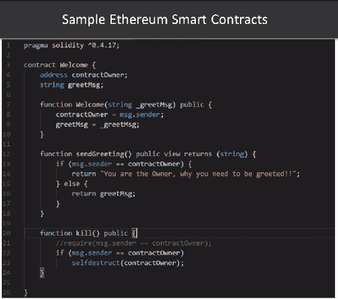

# 第三章：区块链的高级概念

在本章中，我们将讨论区块链的高级概念，以及相关的协议、挑战和解决方案。在前几章中，我们看到共识协议或算法作为区块链最关键组件或构建模块之一。当谈到区块链时，首先想到的是安全性和区块链共识算法。我们将研究这些挑战和解决方案。而后，我们将深入探讨智能合约以及它们在区块链中的运作方式。

在本章中，我们将涵盖区块链的以下高级概念：

+   共识协议，即区块链的运行引擎

+   共识算法类型

+   区块链中保持隐私的关键挑战

+   智能合约

+   分布式应用

# 共识协议介绍

共识算法是在分布式进程或系统中实施的过程，用于就某些特定数据达成一致。区块链共识算法使账本交易在网络中保持同步，以确保只有适当参与者批准交易时才更新账本，而且当账本被更新时，它们所包含的交易以相同的顺序一致更新。这个过程被称为**共识**，而保持其运行的协议程序即为共识算法。这就是为什么共识被认为是区块链的运行引擎或核心。

因此，共识主要为区块链建立了强大的技术基础层，使其成为最关键的部分。它确保每个添加到区块链的下一个区块是唯一真实的版本，并且没有其他代表另一个版本的区块。它还保护整个区块链免受可能破坏它并导致它失去完整性的强大对手。简而言之，对于区块链网络来说，达成共识确保网络中的所有节点对区块链的一致全局状态达成一致意见。

# 共识机制的特性

共识协议具有以下几个关键特性，决定了它的适用性和有效性：

+   **安全性**：根据协议规则，如果所有节点产生相同的输出，并且产生的输出是有效的，共识协议就确定为安全。这也被称为共享立法的一致性。

+   **活性**：如果所有参与共识的故障节点最终产生一个数值，则共识协议的活性是有保障的。

+   **容忍性**：如果共识协议能经常从故障中恢复或参与共识，它提供容错性。

+   **不可否认性**：这提供了验证消息发送者真实发送消息的手段。

+   **分散式共识**：单一中央权威无法提供交易最终性。因此，共识必须具有分散的性质。

+   **法定结构**：节点以预定义的方式交换消息，可能同时包括多个阶段或层次。

+   **认证**：共识过程提供了验证参与者身份的手段。

+   **完整性**：该流程强制执行交易完整性的验证。

尽管上述所有特性都至关重要，但 Fisher、Lynch 和 Peterson 提出的著名成果，即**FLP 不可能性结果**，表明在异步系统中，没有确定性共识协议可以保证安全性、活性和容错性全部同时满足。尽管容错性对于全球分布式网络的运行至关重要，但根据其系统要求和假设，分布式系统往往在安全性和活性之间进行选择。

# 拜占庭将军问题

在分布式系统中，故障分为以下两种类型：

+   **停止故障**：这些是导致节点由于硬件或软件崩溃而停止参与共识协议的良性故障。发生停止故障时，节点将停止响应。

+   **拜占庭故障**：这些故障会导致节点表现异常。莱斯利·兰伯特还将这一类故障鉴定并描述为**拜占庭将军问题**。

拜占庭将军问题的概念基于这样一种情况：一群将军，每个将军都指挥着拜占庭军队的一部分，围困了一座敌方堡垒。要成功进攻并夺取堡垒，所有将军都必须就一项共同的作战计划达成一致。将军们只能通过信使（骑手或跑步者）进行通信。但是，有可能这些信使会被敌人抓住，消息可能永远无法传达给其他将军。此外，达成一致的困难在于，一名或多名将军可能是叛徒，并可能有意破坏整个作战计划。作为叛徒，他们可能发送虚假消息，扭曲消息，或根本不发送任何消息。但所有忠诚的将军将按照计划行事。简言之，少数叛徒不应导致忠诚的将军采纳一个糟糕或错误的计划。通过这个例子，我们可以看到，拜占庭将军问题对于分布式和去中心化系统来说是一个典型的挑战。

# 拜占庭将军问题的解决方案

现在分布式系统采用传统的共识方法，重点是在面对不可靠系统时建立容错机制，主要用于应对故障停止错误。拜占庭将军问题的一些示例是 **Paxos**、**Raft** 和 **Viewstamped** 复制。传统的共识方法用于将交易顺序放入分布式数据库中，以排序客户生成的请求和其他分布式应用程序中发生的各个阶段变化，通过使用复制状态机。在这种网络中，需要 `2 f + 1` 个节点才能容忍 `f` 个故障停止失败。容忍拜占庭错误会通过向系统添加多个额外的消息层增加共识协议的复杂性。所有这些解决方案都带来了开销，并增加了更多复杂性，使它们在实践中几乎不可能。

# 拜占庭容错实用性

允许具有低开销的拜占庭容错应用程序的方法是 **实用拜占庭容错** (**PBFT**)。PBFT 于 1999 年由米格尔·卡斯特罗和芭芭拉·利斯科夫首次提出。PBFT 可以以最小的延迟处理大量直接的 P2P 消息。为了能够容忍系统中的 `f` 个故障，PBFT 需要 `3f + 1` 个副本。因此，PBFT 使用主副本的概念，其中副本自动检查主要副本所做决策的健全性和活性，并且如果发现主要副本受到损害，则可以集体切换到新的主要副本。每个节点都维护着一个内部状态。收到消息后，各节点将消息与内部状态结合起来，运行计算或操作。这指导了节点对接收到的消息该做什么或思考什么。一旦节点就各自的消息做出了决定，它就会将这个决定与系统中的所有其他节点传播。通过传播所有参与节点传播的决定，达成共识决策。与其他方法相比，这种达成共识的机制需要的工作量较少，增加的开销也较少。

# 共识算法类型

下面的三种共识算法或协议被用于大多数区块链平台：

+   PoW

+   PoS

+   PoET

我们还将在后面的章节中对这三种进行快速比较。在我们看这些不同的共识算法之前，让我们先看一下背后的算法种类的原因。以下是其中一些原因：

+   **业务需求**：业务需求决定使用哪种算法。

+   **用例**：使用公共或私有区块链的用例会影响使用哪种算法。

+   **令牌需求**：并非每个业务案例都需要使用令牌或加密货币，可能只想使用底层区块链与共识。

+   **安全和隐私**：安全要求可能有所不同，隐私也是如此。有些人可能希望有一个公共区块链，而其他人可能更喜欢私人区块链。

+   **性能**：公共区块链可能需要更多时间来达成共识，而私人区块链可能更快。

+   **稳健性**：银行业务用例可能要求非常高的加密和共识算法，与其他用例相比。

# 工作量证明

PoW 算法，也被比特币使用，是在区块链上实现共识的最知名的方法。为了在 PoW 中达成共识，与 PBFT 不同，网络中并不需要所有节点提交个别的结论。相反，PoW 使用哈希函数创建条件，允许单个参与者宣布他们关于提交信息的结论，然后由所有其他系统参与者进行验证。哈希函数具有参数，确保虚假信息无法以可接受的方式计算，以防止任何错误的结论。

在比特币系统中，代表网络公开验证信息的参与者会收到新创建的比特币作为奖励。搜索用于验证信息的有效哈希的过程称为**挖矿**。这种参与网络奖励的系统有利于广泛参与，从而建立更健壮的网络和更安全的区块链。这种广泛的参与确保更大的网络稳定性，减少了每个参与者的需求，并允许参与者保持匿名。

# PoW 的挑战

虽然 PoW 有其优点，除了是最知名的方法之外，它也有其固有的挑战。节点需要使用现实世界的资源，比如计算机和电力。运行计算不同潜在解决方案的计算机或计算机集群需要大量电力，从生态角度来看并不理想，对环境也不利。

节点需要大量的计算硬件才能达成共识，而这样的硬件成本昂贵。存在矿工将他们的硬件转移到挖掘不同币种或旧币种的可能性，如果那里的奖励更好的话。在这种情况下，矿工和节点就没有那么忠诚了。 PoW 激励共识过程，这是矿工挖掘区块并获得奖励的动机。然而，在 21,000,000 比特币的最大容量下，随着随着时间的推移释放更多的点，随着硬币变得更难挖掘，矿工的奖励会减少。这可能导致矿工停止继续挖矿的消极情绪，这可能挑战整体共识。

需要大量计算能力，超过普通人能负担或甚至能够使用的平均水平，这意味着挖矿社区正在变得越来越小和更加排他。 这与去中心化的想法相违背，可能潜在地导致 51%的攻击。

# 股权证明

PoS 是用于验证和确认区块上的交易的最常见的 PoW 的替代方案。在这种类型的共识算法中，验证者不再投资于昂贵的计算机设备来竞争挖掘区块，而是投资于系统中的代币。

注意术语“验证者”，因为 PoS 中不进行币的创建或挖矿。相反，所有的代币从第一天起就存在，并且验证者，也称为利益相关者，仅通过交易费用进行配对。

在 PoS 中，用于审批新信息以确认提交到数据库的有效性的个体选择是以更确定性的方式进行的。网络根据每个个体在网络中所拥有的代币比例来进行选择。在 PoS 中，你被选中创建下一个新区块的机会取决于你在系统中拥有的或需要作为抵押物设定的硬币的比例。例如，拥有 500 枚代币的验证者被选择的可能性是拥有 100 枚代币的人的五倍。

转向 PoS 可以帮助鼓励更多的社区参与并促进去中心化。将挖矿从少数掌握大部分挖矿活动的 GPU 矿场的手中拿走，然后均匀地分配到整个网络中，应该会导致一个更加真正的去中心化系统。朴素的 PoS 算法存在一个无所谓风险的问题。它不惩罚验证者验证多个历史记录，这意味着网络很容易对真实历史产生分歧。没有什么可以失去或没有利益关系的参与者没有理由不表现得糟糕。这些实现不为节点投票正确的区块提供激励。因此，节点可以投票支持多个区块，支持多个分叉，以最大化他们获得奖励的机会，因为他们不需要任何支出来这样做。必须解决这个无所谓风险问题，以便正确和有效地实现 PoS。

# **时间证明**

PoET 是一种类似于 PoW 的共识算法，但它消耗的电力要少得多，这是英特尔为自己开发的。该算法使用**受信任的执行环境**（**TEE**），例如**软件保护扩展**（**SGX**），以确保区块以随机抽签的方式产生，而无需进行任何工作，而不是让参与者解决密码难题。这种方法基于 TEE 提供的保证的时间速率。据英特尔称，PoET 算法可扩展到数千个节点，并且将在任何支持 SGX 的英特尔处理器上有效运行。PoET 的一个主要缺点是始终需要信任英特尔，而从对第三方的信任转向对公共区块链的基本原因。该算法可以被看作是另一种替代方法。

# PoW、PoS 和 PoET 的比较

现在，我们将比较我们已经看到的三种共识算法，以便更好地理解，并根据某些参数权衡它们。以下表格显示了各个参数下各个共识算法的状态：

| **参数** | **PoW** | **PoS** | **PoET** |
| --- | --- | --- | --- |
| 区块链类型 | 无许可 | 两者 | 两者 |
| 交易终态 | 概率性 | 概率性 | 概率性 |
| 交易速率 | 低 | 高 | 中等 |
| 需要代币 | 是 | 是 | 否 |
| 参与成本 | 是 | 是 | 否 |
| 对等网络的可扩展性 | 高 | 高 | 高 |
| 信任模型 | 不受信任 | 不受信任 | 不受信任 |

现在，让我们讨论上述表格：

+   **区块链类型**：这表明共识模型可以在其中使用的区块链平台的类型，是许可还是无许可，这主要受共识模型允许的成员类型的限制。虽然 PoW 模型专门为无许可平台设计，参与是开放的，但它们在技术上可以用于许可平台，但在那种情况下不是理想的。而 PoS 和 PoET 则可以根据设计，在两种功能类型中工作。

+   **交易终态**：这指示了一旦交易添加到区块链中的区块中，是否被视为最终。基于 PoW 和 PoET 的共识模型由于其领导关系模型与网络延迟的结合而存在多个区块同时被挖掘的风险。

+   **交易速率**：能够立即确认交易并迅速达成共识的平台具有更高的交易速率。PoW 方法是概率性的，并且需要花费大量时间来解决加密难题。因此，这些模型具有高交易延迟，因此交易速率低。

+   **需要代币**：由于设计基于代币的存在，对于 PoW 和 PoS 模型，本质上需要一个加密代币才能达成共识，而 PoET 模型不需要代币来实现共识。

+   **参与成本**：PoW 和 PoS 参与共识都有固有成本。为了开发安全存款以声明利息并与平台结合，PoW 需要消耗能量，这是共识协议外部的资源，而 PoS 需要节点购买一些初始加密货币。

+   **对等网络的可扩展性**：共识模型的可扩展性是指在对等节点数量不断增加时达成共识的能力。之前总结的所有模型都具有很高的可扩展性。

+   **信任模型**：这决定了参与共识的节点是否必须被认识或信任。在 PoW、PoS 和 PoET 中，节点可以是不受信任的，因为达成共识的机制基于其他手段，例如计算工作或安全存款。只要网络中超过 25%到 50%的节点不是敌对的，共识决策就不会有效。

还有一个未在此处列出的参数，即**对手容忍度**：这是可以被破坏而不影响共识的网络的一部分。每个共识模型都有一定的阈值或真正的对手容忍度。

# 区块链的主要隐私挑战

让我们来看看关于区块链隐私的一些一般性挑战以及克服这些挑战的解决方案。加州大学伯克利分校的网络朋克运动联合创始人、著名数学家埃里克·休斯于 1993 年表示，开放社会的隐私需要匿名交易系统。到目前为止，现金一直是主要的系统。一个匿名系统赋予个人在需要时，仅在需要时，揭示其身份的能力。但是，比特币和公开的区块链是这样的情况吗？有一个流行的错觉认为比特币是匿名且不可追踪的。这是一个可以理解的错误，考虑到比特币的流行用例，即我们在前面章节中介绍的臭名昭著的丝绸之路。

FBI 能够利用比特币区块链中的不可变性追踪和揭露与此案件有关的人员。然而，我们不能忽视的是，他们能够追踪货币流动并单独找出他们所寻找的确切人物。事实是，比特币确实是伪匿名和可追踪的。比特币中的每笔交易都将输入映射到输出，允许任何人以非常琐碎的方式跟踪货币。在他的白皮书中，中本聪将比特币定义为其监护历史。在 2009 年，他说：

*"我们将电子硬币定义为数字签名的链。"*

# 比特币的伪匿名行为

当我们与某个实体建立关系时而不透露该实体的个人身份时，我们就处于化名状态。化名指的是一种唯一的替代标识符，例如一个人的昵称、信用卡号、大学的学生号码和银行账户号码。使用化名，你可以通过组成这些交易的一个群组来标记来自同一实体的各种消息和交易。化名在社交网络和其他虚拟通信渠道中被广泛使用。例如，任何客户服务代表都会用一个化名来介绍自己，而不是透露他们的原始姓名；这就是化名。Twitter 的用户名和 Facebook 账户，例如，就是化名的经典例子。

当使用化名时，我们必须记住一个人虽然不能被识别，但仍然可以被单独指出，这就是区块链隐私面临的挑战。让我们来看看以下挑战：

+   **公开的区块链账本**：由于公开的区块链账本对任何人都是可用的，一些地址可以通过它们的所有权进行分组，利用行为模式和来自区块链外部的公开可用信息。

+   **钱包地址**：钱包地址的重复使用会将您的交易链接成一个单一的档案。

+   **IP 地址重用**：IP 地址重用也暗示着一个单一方，比如你或我，控制着各种地址。

+   **将来自多个交易的输入合并**：这会显示你控制的地址集。

+   **使用轻量级客户端**：如果你使用的是轻量级客户端，而不是严格编写的客户端，这实际上向第三方揭示了你的所有地址集以及其他信息。

比特币地址聚类作为另一个著名的技术堆栈，这给比特币地址用户去匿名化提出了挑战。它通过分析来自区块链的信息来解决由单个用户生成的所有地址问题。可以看到 P2P 网络代表了其他信息源，有助于去匿名化比特币用户。将这两者结合起来可以轻松辅助比特币地址聚类，并有助于识别个人。在某些情况下，它还可以帮助相关联文件用户的所有交易。与此同时，今天世界上有许多公司都正在围绕区块链建立业务。随着网络的增长，这些公司变得非常重要，因为追踪这种资本流动的动机变得更强烈。

# 隐私挑战的解决方案

让我们看看一些可以帮助应对公共区块链所提出的隐私挑战的解决方案。

# CoinJoin

CoinJoin 是由 Gregory Maxwell 提出的比特币交易匿名化方法。这是一种比特币交易压缩方法，旨在通过丢弃不必要的信息来提高隐私性。CoinJoin 交易是多人同意形成一笔交易的一种交易，其中一些输出具有相同的价值。所有参与者通过某个匿名通道相聚在一起，每个人提供一个属于自己的目的地址。其中一方创建一笔交易，将一枚硬币发送到每个目的地址。所有参与者退出，然后分别登录到通道，并每人从将支付资金的帐户中贡献一枚硬币。如果支付了`X`个硬币到该账户，它们将分配给目的地址；否则将退款。一些流行的 CoinJoin 实现示例包括 SharedCoins、Dark Wallets、CoinShuffle 和 Dash。

# 环签名

环签名是一种技术上复杂的技术，但非常有前景，并有助于实现代币匿名化和识别应用程序。基本上，环签名是证明签署者拥有与一组特定的公钥之一对应的私钥的东西，但不会透露具体是哪一个。它由实际签署者组成，然后与非签署者结合形成一个环。在这个环中，实际签署者和非签署者都被视为相等和有效。实际签署者是与从发送者钱包发送的输出相对应的一次性使用密钥事物。这些非签署者是从区块链中提取的过去交易的输出。这些过去的交易输出在环签名交易中充当诱饵，成为交易的输入的一部分。所有的输入看起来都同样可能是从环外花费的输出。

例如，如果丹希望向梅丽莎发送一个环签名值为五的门罗币，那么五个输入中的一个将从丹的钱包中提取，然后添加到环签名交易中。另外四个输入是从区块链中提取的过去交易的输出。这四个输入是诱饵，与来自丹钱包的输入合并后，形成一个包含五个可能签署者的组，构成这五个人的一个环。第三方将无法确定哪个输入实际上由丹的一次性使用密钥签署。然而，通过使用一个密钥图像，网络能够验证向梅丽莎转移的资产或货币以前没有花费过。门罗币是使用环签名机制的最佳例子。

# 零知识证明

另一项具有非常强大属性以解决隐私挑战的技术是**零知识证明**（**ZKP**）。ZKP 允许用户构建一个数学证明，以便当程序在仅用户知道的某个隐藏输入上执行时，它具有特定的公开已知输出，但不会透露任何其他信息。**零知识简明非交互性知识论证**（**Zk-SNARKS**）是 ZKP 协议中更强大的技术。这证明了某些事情是真实的，而不透露使其成为真实的特定内容。Zcash 是第一个保持完全匿名的加密货币。它使用了 Zk-SNARKS 密码学实现。它通过隐藏所有有关交易的知识提供完全匿名性。它为用户提供了对其特定财务信息的私人访问控制。它还使用了一个称为**视图密钥**的概念。用户可以向个人提供此视图密钥以获取交易的详细信息。

# 智能合约和去中心化应用

我们在早期章节讨论了比特币和区块链，以及这整个技术是继互联网之后的下一个大创新。除了区块链的所有独特特性，如不可变性、密码学和安全性，智能合约使区块链成为更具创新性的技术。除了 P2P 网络和私钥密码学，区块链程序是能够以程序化方式控制货币流动的东西。这些程序是区块链核心的一种智能合约。如果你看看两个当事方之间的典型标准合同协议，它基本上规定了关系的条款，这些条款或关系通常是由法律实体强制执行的。另一方面，智能合约通过使用密码技术编写的智能代码来强制执行它们的关系。简单地说，智能合约是由它们的创建者或程序员编写的能够自我执行的程序。

这个概念最初是由尼克·萨保（Nick Szabo），一位著名的计算机科学家和密码学家于 1993 年首次概念化的。他用数字自动售货机做类比，解释了用户如何输入任何东西，如数据或价值，然后得到一个特定的物品，类似于我们从自动售货机中获得的真实零食或软饮料。在区块链的情况下，用户将通过编写程序创建智能合约，并将数据推送到该合约中，以便它执行所需的命令。

# 理解智能合约

智能合约是区块链技术的核心。这些程序是用图灵完备的编程语言编写的，并且能够自我验证和自我执行协议，可以独立或无需任何外部干预而运行。通俗地说，如果我们将比特币视为数字货币，智能合约就是高度可编程的数字货币。智能合约是存储在区块链中的一段代码，它由区块链交易触发，并从该区块链的数据库中读取或写入数据。

节点网络只有在满足一定条件时才会验证交易，但比特币仅限于处理货币使用情况。但是，对于许多非金融用途案例甚至金融用例中，货币并不是中心点而是涉及到触发点的情况怎么样呢？以太坊，区块链的另一个变体，是从比特币分叉并进一步修改而来，用图灵完备的更强大的语言取代了比特币限制的语言，可以编写更广泛的智能合约。

# 智能合约的工作原理

现在，让我们简要地看看以下触发智能合约工作的因素和条件：

+   **协议**：两个或多个方之间的期权合同被编写、编码并部署在区块链平台上。参与的各方可以保持匿名，但合同被写入公共账本并保持不变。

+   **触发或执行点**：任何触发事件，无论是在区块链内还是在区块链外，都会根据编码的条款使合同执行。例如，触发事件可以是合同的到期日或续约日期，在交易所达到特定价格，或者在我们的系统中达到某个截止率。

+   **结果**：智能合同的执行可能产生会改变交易状态或区块链状态的结果，例如现金分类账。它也可能影响其他系统。

+   **透明度**：这是合同的另一个重要方面。这些合同在区块链上是不可变的。监管机构可以利用区块链上的这些合同来了解市场活动，同时保持涉及的个人方的隐私。

现在，让我们看一个编写合同的例子。以下是开始的步骤：

1.  创建一个新文件并命名为`sample.sol`。

1.  接下来，打开文件开始编写代码，如下截图所示：

B11516_3_03

让我们看一下前述代码中涉及的步骤：

1.  首先，让我们声明我们将使用的 Solidity 版本，即`pragma solidity⁰.4.17`。这允许以太坊平台在特定版本中编译合同。

1.  然后，让我们声明一个合同并命名为`Welcome`。

1.  接下来，在这个合同中声明两个实例表变量。一个是`contractOwner`地址。这将捕获部署合同在 Solidity 平台上的合同所有者的地址或帐户。

1.  接下来，我们声明一个`greetMsg`字符串，它是从合同的所有者那里获取的。

1.  现在，我们声明一个`Welcome`函数。每当合同在以太坊平台上部署时，此实例或函数将被公开调用。

1.  接下来，在此函数中传递`_greetMsg`字符串。我们还将此函数设置为公共合同。

1.  接下来，我们为`contractOwner`变量分配其值：`contractOwner = msg.sender`。因此，无论谁调用了此函数实际上都是消息所有者，有权创建此合同。

1.  同样，我们也将`greetMsg`的值设置为`greetMsg = _greetMsg`。所以，我们在这里做的是创建了一个名为`Welcome`的构造函数，在合同在以太坊平台上部署时调用。

1.  然后，我们声明了另一个名为`sendGreeting()`的函数，它将返回一个字符串类型的变量`greetMsg`。

1.  要查看另一个函数，让我们通过添加`public view returns(string)`将`public returns(string)`转换为无效视图函数。

1.  我们可以稍微调整这个函数成为一个条件：`if message.sender == contractOwner`。这将返回`Hello Mr. Owner why you need to be greeted!`给所有者，否则将返回`greetMsg`。

1.  再次，我们将声明一个名为`killContract()`的公共函数。

1.  然后，我们给出一个条件，`if message.sender == contract Owner`，并分配一个任务，`selfdestruct(this)`。因此，除非合同所有者调用此终止合同函数，否则它将扰乱以太坊平台上的合同。

这一点非常重要，因此您可以决定您希望在哪些条件下解决合同从平台中删除。因此，您可以在那里创建一个有时限的合同。

这是一个详细编写智能合约的例子。

# 去中心化应用程序

自诞生以来，区块链的应用已经引起了各行业的很多期待，并且承诺在大多数创新技术中更加普遍。它在不可变性，安全性，密码学，分布式分类账等方面都有很多提供。我们不应忽视区块链可以解决不可变性、透明性、匿名性和安全性方面的特定问题。然而，它也有自身的挑战，例如所需共识的速度，到达共识所需的时间以及在公共账本上的复制时间。

# 挑战和解决方案

我们在上一章已经涵盖了去中心化应用程序。Dapps 不归任何人所有，不能被关闭，也不能有宕机时间。所以，每当我们想要构建一个 Dapp 时，我们需要牢记一些考虑因素，比如 Dapp 必须完全开源并且能够自主运行，没有一个实体负责大部分货币。它必须有协议更改，旨在进行一些整体改进，经所有用户批准。它以加密形式存储所有操作数据在公共区块链上，而且最重要的是它必须有激励机制。你真的需要矿工之间达成共识。同时矿工必须有动机。如果目标只是实现去中心化，那么也有许多其他方法可以实现，比如比特流。

因此，虽然区块链仍在不断发展，并且有许多新事物得出，使其变得越来越成熟，但作为整个社区，我们需要避免滥用这项技术，不要到处使用它。相反，需要对技术、架构和设计基础进行彻底分析，评估何时以及为什么使用区块链作为解决问题的解决方案。我们不能认为它是满足所有问题的一站式解决方案。

# 总结

在本章中，我们学习了区块链中使用的一些高级概念，并涵盖了各种区块链实现中使用的各种共识协议。我们还讨论了区块链隐私面临的一些关键挑战，以及诸如 ZKP 之类的解决方案如何帮助保护隐私。然后，我们进一步讨论了智能合约，这是区块链的核心构建模块之一；它们是如何编写的，是什么，以及它们如何执行。我们还讨论了 Dapps，何时使用它们，以及何时不使用它们。在下一章中，我们将探讨一些通用的做法，用于保护比特币和加密货币。
