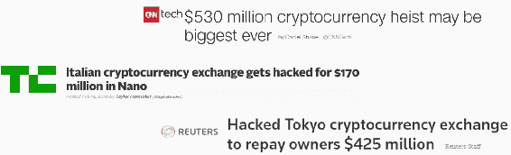
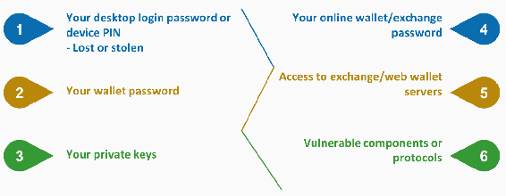
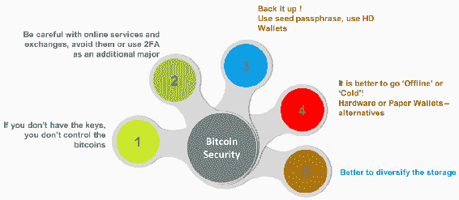
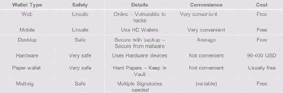

# 比特币和区块链安全

在前述章节中，我们了解了比特币的基础知识，并研究了区块链及其一些高级概念。我们简要介绍了各种系统，比如集中式系统、去中心化系统和分布式系统。我们还研究了去中心化系统的一些积极特性和限制，以及它们如何影响各个方面。在本章中，我们将简要介绍以下一些一般概念：

+   用户安全以及比特币的最佳实践

+   硬件钱包

+   物理比特币存储

+   平衡和分散投资风险

+   加密货币的生存

# 保护比特币和区块链

投资比特币或任何其他山寨币是一种有吸引力的选择，承诺在短时间内高收益，但也伴随着风险。这可能就是为什么我们看到对这些加密货币有着巨大需求，同时也说明了为什么对交易所发起持续攻击和偷窃。一个例子是当新闻上充满了标题，说明顶级加密货币交易所遭到黑客攻击，价值数亿美元的货币被盗。你可以在下面的截图中看到这些标题：

引起的问题如下：

+   我们如何使我们的货币免受所有这些攻击的威胁？

+   是否有任何安全的地方？

+   是否有任何应该遵循的行为准则，来保护我们的货币？

因此，大多数比特币失窃是由于糟糕的钱包或安全管理。在下面的图表中，我们可以看到吸引比特币或加密货币小偷的事物：

前述图表中提到的以下条目引起了比特币小偷的兴趣：

+   **您的桌面登录密码或设备 PIN**：这就好比某人在您不在家时入侵并偷走了几乎所有东西一样。移动设备尤其容易受到攻击，主要是因为它们更容易丢失或被盗，并且通过黑客攻击可能会提供对其上的钱包的访问权限。

+   **您的钱包密码**：您的钱包密码是您持有的资产的入口。

+   **您的私钥**：小偷当然想要你的私钥。

+   **您的在线钱包/交易所密码**：这就好比知道了您的在线银行账户密码一样。

+   **访问交易所/网络钱包服务器**：这包括访问您的网络钱包服务器和交易所。

+   **易受攻击的组件或协议**：在线服务使用的易受攻击的组件或协议。

# 钱包的安全实践

如果你想成为备受尊敬的加密货币投资者，或者是一个想要交易加密货币的人，那么让我们来看看应该遵循哪些最佳实践来保护你的资产。让我们在以下图表中快速了解它们：

让我们探索前述图表中提到的所有实践：

+   **保护你的私钥**：任何典型的比特币交易都需要你的私钥来解锁其比特币输出或其价值。比特币存储在钱包中。这些钱包是公钥和对应私钥的集合，其中公钥由比特币地址表示。如果你的比特币不在你直接控制的比特币地址上，它们就完全不受你的控制。有人说，如果你没有密钥，你就没有控制比特币。基本上，只有当你拥有相应的私钥时，你才拥有比特币。如果第三方获得了存储在你的钱包中的一个或多个私钥，他们可以使用以前由该公私钥对或组合接收的任何硬币。这种交易不一定要使用你的钱包进行。它可以被带入任何设备，从任何地方。这是比特币的一个设计特性，允许在钱包之间导入和导出地址。这和你的信用卡 PIN 一样重要。你肯定不想让一个陌生人知道你的 PIN。

+   **谨防在线服务**：当今有数千个在线交易所专门为加密货币的在线交易服务。如果我们不了解这些交易所的来源，那么信任它们就是不可能的。到目前为止，已有 12 位连接被黑客攻击，并有比特币被盗。这种入侵试图连接到服务的服务器本质，其中存储着账户凭证和钱包。避免由第三方引起的安全漏洞的一个简单方法是**不要在交易所存储加密货币**。如果你的特定交易或投资策略要求你在交易所保留加密货币的余额，你必须**每天检查**访问资金或交易所账户。然而，像 Coinbase 这样的交易所确实提供了一个使用推荐的政策和程序来保护你的代币的**网络钱包服务**。

比特币世界迎来了大量新用户加入生态系统。这总是吸引各种黑客试图攻击新手。最常见的比特币骗局是**比特币加倍器**。这类骗局的操作者声称他们将在短时间内返还你存款的 5％、100％甚至 200％。嗯，比特币相当不受控制，当你的储蓄丢失时也没有人来解救你。这是加密货币投资者的一个重要部分和额外的安全部分。这涉及双因素认证。投资者需要使用强制**双因素认证**（**2FA**）的钱包和交易所。这需要用户确认自己的身份并不仅仅是简单的密码。用户需要使用指纹、个人资料的知识，或者来自辅助设备的验证来使用 2FA，而且所有用户都应该启用这一功能。尽管这可能会延迟登录时间，但它可能会拯救你免受昂贵的黑客危机。请记住，2FA 无法保护你的在线账户的访问，但在进行涉及硬币的任何购买或销售时，它可以作为一个收费站。

+   **备份数据**：由于计算机或手机故障，无法访问你的货币。无法访问的货币将被视为永久丢失。在处理重要数据时，尤其是涉及到你的钱或加密货币的数据时，备份是必不可少的。这是一个应该自然而然就要遵循的事情。一个良好的备份策略是你针对硬件故障或自然灾害丢失比特币钱包的安全网。如果你的硬盘损坏，或者你的电脑丢失或被盗而你没有比特币的备份，它们就会丢失。你可以向你的钱包服务提供商或软件咨询应该备份哪些文件。一个好的策略是**3-2-1 策略**。**3**表示在两种不同的介质设备上备份三次，比如外部硬盘或者 USB 闪存驱动器；**2**是将它们存储在你的纸钱包上；最后，**1**是将它们存储在远程地点或你朋友的家里。这种 3-2-1 策略通常帮助人们避免他们的加密货币被盗。如果一个钱包提供了密码保护，确保你使用它。这个功能会隐藏一个钱包文件，也就是`file.dat`文件，或者与`file.dat`文件相同的文件，其中存储了私钥和任何可能损害你隐私的元数据。即使攻击者试图黑入你的电脑，并且获得了文件的访问权限，也无济于事，因为它是加密的，没有密码就无法使用。需要注意的是：使用一个难以假设或破解的强密码。**分层确定性**（HD）钱包使用 HD 或 VIP 协议，只需进行一次备份，其中包括 12 或 24 个可阅读的单词，你可以写下来保存在安全的地方。不需要每天备份，每当你想要恢复你的钱包时，它会要求你按照完全相同的顺序输入这些单词。

+   **最好离线或冷藏**：如果您长时间不使用您的加密货币，比如几个月或一两年，您需要保护您的货币安全，并防止轻易访问。您可以使用离线钱包，因为这些是最安全的存储，私钥都是离线开发和保留的。这极大地降低了硬币被黑客或恶意软件盗取的危险。找到适合您的冷藏解决方案。如果您计划长期持有少量比特币，比如三个月或更长时间，最好的方法是将它们转移到离线状态并远离您的计算机。纸钱包是一张印有私钥的纸片，通常以 QR 码形式呈现。一些纸钱包可以打印，因此您可以记录您的余额而不需要将私钥导入到其他钱包中。您可以安全地生成一个纸钱包，并将其安全地放置在您的个人保险库中。网站提供的产品和服务无需付费。接下来是硬件钱包——它们是可以连接到您的计算机、手机或 USB 的小型设备或智能卡。这种类型的钱包通常是最安全的，因为私钥是离线存储的，并且根本不离开设备。用户可以从他们的硬件钱包向交易所发送资金并进行交易。同时，它确保了他们大部分投资的安全性。例如，Trezor 是一种硬件钱包，提供了高水平的安全性而不牺牲便利性。另一个好处是，Trezor 可以在连接到在线设备时签署交易。这意味着即使使用了受损的计算机，花费比特币也是安全的。

+   **分散您的存储**：分散风险的一种方式始终是可行的。根据您的交易模式以及您每天、每周和每月交易的硬币数量，您可以将加密货币存储在不同的钱包中。您可以使用许多钱包，例如桌面、移动设备，甚至是离线钱包。通常情况下，您的最大存款可以存储在硬件钱包中，这更安全。您还可以将其存储在纸钱包中，并将此纸张安全放置在您的个人保险库中。一些硬币可以存储在您的桌面或 HD 钱包中，而少量硬币可以在线存储以进行常规交易。这会让生活更轻松。

# 钱包类型

让我们现在比较一些钱包，看看它们提供了哪些功能：

现在我们将看看这些钱包，并比较它们提供的安全性和便利性：

+   **网络钱包**：它们相对不安全。因为它们在线上，容易受到黑客攻击。这些非常方便和易于使用，因为它们在线上，高度可用，并且大多数时候免费使用。

+   **手机钱包**：它们同样不安全。您可以使用 HD 钱包来利用一些安全功能，使用种子词并将其安全保存。这些也非常方便，因为它们可以随时随地使用，并且价格不贵。

+   **桌面钱包**：它们比您的手机钱包安全一些，因为桌面不那么容易公开访问。您可以使用备份来保护桌面钱包，这将使它们远离恶意软件、恶意软件或甚至是特洛伊木马。因此，使用安全备份始终是保护桌面钱包的关键。这些钱包在方便性方面平均，因为您必须前往桌面并访问您的钱包。这些钱包大多是免费提供的。

+   **硬件钱包**：它们被认为是非常安全的，只是你拥有的硬件设备。它们通常不那么方便，因为它们不能为您提供轻松的交易或与在线服务的连接。我们还可以看到有各种各样的硬件钱包可用，价格在 90 到 400 美元之间。

+   **纸钱包****：直到你丢失这张纸，它们都非常安全，因为这导致了你的比特币或加密货币的损失。因此，使用硬纸张，并且我们应该将它们安全地放在个人保险箱或不易被任何其他人访问的不同位置。同样，这些并不方便，因为它们是硬纸质的手工纸钱包。它们通常是免费提供的，而一些网站以小费提供它们。

+   **多重签名钱包**：接下来是多重签名或多重签名钱包。这些被认为是安全的，因为需要多个实体、权威或个人签署交易才能进行。钱包的使用可以从易用到相对复杂的程度不等，因为它依赖于多个人签署交易才能完成。多重签名钱包是免费提供的。

# 硬件钱包

硬件钱包是一种加密钱包，将用户的私钥保存在安全的硬件设备中。它们被认为是最受保护和安全的钱包类型。现在，我们将看一些它们提供的好处：

+   第一个好处是用户的私钥存储在一个安全区域，并且设备上有一个内置的微控制器。因此，这些密钥不能以明文格式从设备转移，这是严格保护和与微控制器结合的。

+   它们不受盗取软件钱包的计算机病毒的影响。这个关键特性保护了密钥免受外界的攻击，因为这个硬件不那么容易被黑客或破解。

+   另一个好处是密钥可以安全地使用，这对用户来说很方便。这是一个相对容易的操作方式，与纸钱包相反，当你想使用它时，必须将其导入到软件钱包中。

+   大多数情况下，软件是开源的，允许用户批准设备的整个过程。这使其可审计和透明。

硬件钱包只能通过与钱包的物理接触来访问，每个用户的私钥都安全地存储在钱包中。

# 硬件钱包的工作原理

为了解释硬件钱包的工作原理，让我们举个例子。

我们以**Ledger Nano S**钱包为例，这是一个著名的硬件钱包。您可以看到带有 USB 扩展的钱包的图表或图片，可以连接到笔记本电脑或计算机上。当账本设备第一次打开时，它使用算法来确定如何使用一组 24 个常规单词来获得种子。它们通常是带有字母的单词，例如四到五个字母，组成一个单词。基本上，有单词会被随机选中，然后生成一个种子。钱包的密钥是从种子生成的。

它还指定了一种将这 24 个单词与附加密码连接起来的方法，该密码计为第 25 个单词。如果没有选择密码短语，则使用空密码。因此，始终需要 24 个单词加一个密码短语，它可以是空的。此外，请记住，密码短语与我们在各种应用程序中使用的密码不同。当任何密码短语与 24 个单词结合时，将生成一个有效的种子。建议用户将这 24 个单词写在一张纸上，通常是与账本一起附带的那张纸，并将该纸安全地放在远离账本本身的地方。例如，假设您已经记下了信用卡或借记卡的四位或五位数字 PIN，并将该纸与借记卡或信用卡放在一起；很有可能有人可以访问您的卡和该纸，然后完全访问您的账户。为了确保不会发生此类违规行为，建议将写有 PIN 的纸与卡本身分开。

现在，这个发展出来的种子号用于生成根密钥，这是一组字母和数字的组合，无法预测。每个加密货币的区块链都有自己的方法从种子生成根密钥。然后使用此密钥开发多个私钥，然后成为用户感兴趣的加密货币区块链的加密货币钱包。此外，账本设备还需要使用 PIN，可以是四到八位数字的组合。这是采取的额外措施来保护设备。但是，如果在您的序列上连续三次错误输入 PIN，账本设备将自动销毁所有数据，使其对任何有权访问的人都无用。

如果账本被销毁、被盗或丢失，用户如何获取密钥、钱包和其中的货币？设备的原始所有者可以使用纸片上的文字来恢复其内容，无论是在备份账本、另一个账本还是任何软件钱包上，从而恢复所有资金和地址。这是可能的，因为我们只需要开发根密钥、24 个单词和密码（如果在生成种子单词时提供）。

# 物理比特币的类型

现在，让我们将物理比特币作为一个概念来看待。物理比特币已经存在多年，但它们并不是主流交易平台的一部分。参与这个尚未经过验证且相对原始的行业的公司非常少。一些公司试图通过质量和使用贵金属（如黄金和银）来吸引消费者。一些公司提供相对低价的良好设计，而一些公司则两者都不具备。物理硬币市场非常有限，这是一个收藏家的天地。与真正实用不同，物理比特币通常被市场宣传为谈资，比如限量系列收藏品。有时，这些也被称为“极客的礼物”。一些知名的物理比特币有 Casascius、Titan Bitcoin、Alitin Mint 和 Cryptomint Coins。还有其他可作为收藏品的物理比特币可供选择。

# 加密货币的生存

在本节中，我们将介绍一些关于平衡完整投资组合和分散底层风险的技巧。我们还将探讨加密货币的生存。

“不要把所有的鸡蛋放在一个篮子里”，这是一个非常著名的说法，当涉及到金钱和投资时非常正确。当涉及到加密货币市场时，这一点尤为关键。没有一个特定的规则规定一个人应该如何分散自己的投资；这完全取决于个人的风险偏好。建议那些有头脑的人在投资加密货币之前进行研究并做出自己的决定。

让我们来看一下投资加密货币时出现的以下因素：

+   **波动性**：与股市相比，加密市场极其波动。在过去几年里，投资加密资产给人们带来了非常高的回报，使一些人成为了百万富翁。与此同时，也造成了一些人因贪图短期利润而蒙受损失。

+   **分割您的术语并征服**：还有一个概念是分割您的术语并征服整个投资组合，这意味着一个人必须将整体投资组合分割为以下三个术语：

+   **长期**：值得长期持有的硬币，比如几个月或几年，实际上是应该考虑长期投资的东西。这些硬币经过时间的考验，经历了所有的困难。一些例子包括比特币、以太坊和莱特币。请记住，这样的长期硬币应该放在冷钱包或保险库中安全保管。

+   **中期**：关于是否会增长的投机对象被称为中期硬币。你可以考虑将这样的硬币视为中期投资价值，投资几周或更长时间。这可能包括比特币现金、Zcash、Zcoin 和 ICO 等另类币，例如，以及许多其他另类币。你还可以考虑对一些 ICO 众筹进行早期投资。ICO 类似于股权市场、股票和交易中使用的**首次公开发行**（**IPO**）这个术语。在这里需要特别注意。在投资某个特定的 ICO 之前，必须进行彻底的研究。访问公司网站，了解他们的产品，了解他们提供了什么，并阅读他们可能发布的白皮书。有时，值得对创始成员本身进行研究，比如他们在行业中带来多少信誉和经验。还要检查他们是否有第三方个人提供的 ICO 评级。最重要的是，必须知道何时退出 ICO。建议的做法是当 ICO 在市场上发布并炒作时买入，并在它们在发行交易所上市时出售，以获得利润。还有一件事要记住，不要将超过整体投资组合的 5%投入到 ICO 中是一个非常好的做法。

+   **短期**：在短期投资中进行套利和快速盈利。这是使用硬币最激动人心的方式。那些风险偏好低的人可以使用短期套利方法，但最好避开 ICO 投资。需要持续跟进，以清楚地了解市场走向，ICO 的表现如何，哪些硬币正在涌现等等。

下一步是了解风险。它与能够承受的损失成正比。能够承受的损失越多，风险偏好越高。因此，如果你的风险承受能力低，你的典型整体加密货币投资可能包括以下内容：

+   **低风险偏好**：50% 套利，40% 比特币，8% 另类币，2% ICO

+   **高风险偏好**：50% ICO，30% 另类币，18% 比特币，2% 到 5% 套利

你是自己投资和风险偏好的裁判。

有必要关注知识来源，比如 [`coinmarket cap.com`](https://coinmarketcap.com/)。这是一个很好的网站，可以帮助你及时了解加密货币世界的动态，并更多地了解你的投资。据说，一个想法或技术的寿命与其年龄成正比。这个概念被称为**林迪效应**。我们来举个例子，比如一本 2017 年出版的畅销书，和圣经进行比较，圣经已经存在了 300 多年了。如果你被问到哪本书更有可能在未来 100 年仍然在印刷中，答案显而易见会是圣经，因为它有更高的生存概率。这与书的内容无关，只是简单的数学问题。一个能够生存了如此长时间的想法，很可能会继续保持同样的趋势。一本新书的内容可能在今天的世界中很相关，但谁真正知道炒作是否会减弱或减少呢？任何想法或技术的真正考验是其随时间的生存能力。如果将同样的标准应用于比特币，我们可以说比特币存活的时间越长，分散式加密货币的想法就越强大。如果你看看自动取款机，它们已经经过几十年的时间测试，现在它们已经成为主流资产。加密货币世界也是一样的。

自 2009 年开始，很少有人看好比特币区块链的生存机会。人们担心可能发生的对比特币区块链的攻击。然而，已经过去了 8 年，没有一个黑客能够攻击区块链本身。尽管交易所和钱包遭到了黑客攻击和利用，这些都是周边技术堆栈或构建模块，但比特币的核心从未被黑客攻击过。比特币协议不仅在所有此类攻击之后幸存下来，而且在每次攻击之后都得到了加强，为下一次这样的攻击做好了准备并变得更加强大。

比特币的成功以及它如何吸引来自全球的投资者为所有替代币的创作者创造了机会。这些艺术家能够存活多久，再次隐藏在未来的时间里。我们不应该给这些替代币任何怀疑的空间，但我们应该给它们时间来证明自己在一段时间内的表现。

# 总结

本章使我们能够了解各种加密钱包提供的功能和安全性。我们还研究了硬件钱包的工作原理，一些类型的实体比特币，比特币和替代币等加密货币的生存机会，最后试图理解如何平衡和分散与投资加密代币相关的风险。
