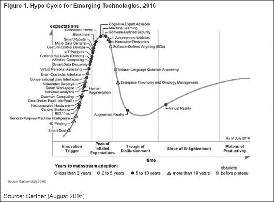
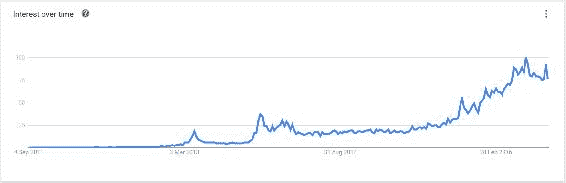
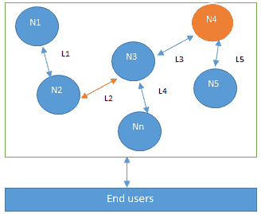
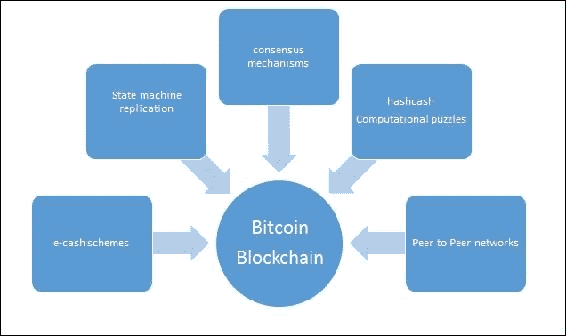
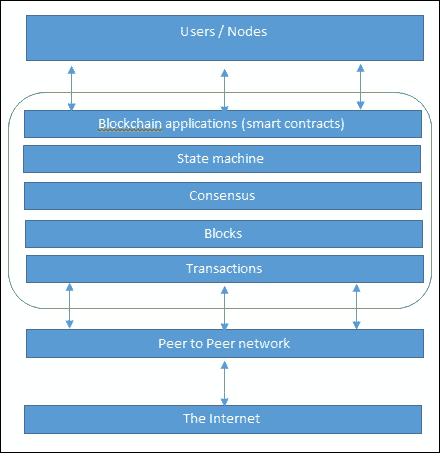
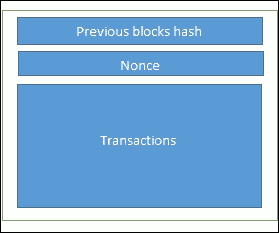
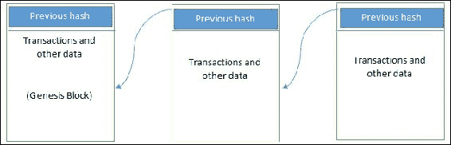

# 第一章：区块链 101

很可能任何阅读本书的人已经听说过区块链，并对其巨大潜力有一些基本了解。

随着比特币的发明（2008 年），世界引入了一个现在可能将彻底改变整个社会的新概念。有人将其描述为一场革命，而另一派人士则认为这将是一场演变，并且在区块链带来任何实际利益之前，还需要很多年的时间。这在某种程度上是正确的，但在我看来，革命已经开始了；世界各地许多大型组织已经开始使用区块链技术撰写概念证明，因为其颠覆性潜力已经被充分认识到。然而，一些组织仍处于初步探索阶段，但随着技术的逐渐成熟，预计它们将更快地取得进展。这项技术还对当前的技术产生影响，并具有在基本水平上改变它们的能力。

根据以下所示的 Gartner 的技术炒作周期图，区块链技术目前处于*过度期望的顶峰*（截至 2016 年 7 月），预计将在 5 到 10 年内准备好进行主流采用：

Gartner 新兴技术的炒作周期

对区块链技术的兴趣在过去几年里急剧上升，一度被一些人忽视为从加密货币的角度来看的极客货币，或者认为这不值得考虑，现在正在世界各地最大的公司和组织进行研究，数百万美元被用于采用和尝试这项技术。在谷歌上进行简单的趋势搜索就能揭示过去几年对区块链技术的兴趣程度：

区块链的 Google 趋势

这种技术的各种好处正在被设想，如去中心化信任、成本节省、透明度和效率。然而，也存在各种挑战，这是一个正在积极研究的领域，如可扩展性和隐私。第十二章，*可扩展性和其他挑战*，致力于讨论区块链技术的局限和挑战。

本章是关于区块链技术的介绍，包括其技术基础、背后的理论以及各种技术的结合，以构建今天所称的区块链。

2008 年，一篇开创性的论文 *比特币：点对点的电子现金系统* 在点对点电子现金主题下，由化名 *中本聪* 撰写，并引入了 *区块链* 这个词。这个词随着时间的推移已经演变成为了现在的区块链。

在本章中，首先描述了分布式系统的理论基础，然后介绍了比特币的前身（通过它引入了区块链技术）如电子现金和哈希现金，最后介绍了区块链技术。这是理解区块链技术的逻辑方式，因为区块链的根源在于分布式系统。

# 分布式系统

理解分布式系统对于理解区块链至关重要，因为基本上区块链在其核心是一个分布式系统。更准确地说，它是一个去中心化的分布式系统。

分布式系统是一种计算范式，其中两个或更多节点以协调的方式相互合作，以实现共同的结果，并且被建模为使最终用户将其视为单一的逻辑平台。

节点可以定义为分布式系统中的个体参与者。所有节点都能够相互发送和接收消息。节点可以是诚实的、有故障的或恶意的，并且拥有自己的内存和处理器。一个能够表现出任意行为的节点也被称为拜占庭节点。这种任意行为可以是故意的恶意行为，对网络的操作有害。通常，网络上节点的任何意外行为都可以归类为拜占庭行为。这个术语任意地包含了任何意外或恶意的行为：

分布式系统的设计；N4 是一个拜占庭节点，L2 是断开或慢速网络链接。

分布式系统设计的主要挑战是节点之间的协调和容错。即使一些节点出现故障或网络链路中断，分布式系统也应该容忍这一点，并且应该继续无缝地工作，以实现所需的结果。这已经是多年来的一个活跃研究领域，已经提出了几种算法和机制来克服这些问题。

分布式系统的设计是如此具有挑战性，以至于已经证明了一个被称为 CAP 定理的定理，并且表明一个分布式系统不能同时具有所有被期望的属性。在下一节中，将提供对 CAP 定理的基本介绍。

## CAP 定理

这也被称为布鲁尔定理，最初由 *埃里克·布鲁尔* 在 1998 年作为一个猜想提出；在 2002 年被 *塞思·吉尔伯特* 和 *南希·林奇* 证明为一个定理。

定理表明，任何分布式系统都不能同时具有一致性、可用性和分区容错性：

+   **一致性** 是一种属性，确保分布式系统中所有节点都具有数据的单一最新副本。

+   **可用性** 意味着系统正常运行，可以使用，并且在需要时接受传入请求并以数据回应而没有任何故障。

+   **分区容错性** 确保即使一组节点失败，分布式系统仍然能够正常运行。

已经证明，分布式系统不能同时具有上述三个属性。这很奇怪，因为某种方式上区块链设法实现了所有这些属性，或者真的吗？这将在后面的章节中解释，其中将讨论区块链背景下的 CAP 定理。

为了实现容错性，使用了复制。这是一种实现容错性的常见和广泛使用的方法。一致性是使用共识算法来确保所有节点具有相同的数据副本。这也被称为**状态机复制**。区块链基本上是一种实现状态机复制的方法。

一般而言，节点可能经历两种类型的故障：一个是故障节点简单地崩溃了，另一个是故障节点可能会以任意方式表现出恶意或不一致的行为。这是难以应对的类型，因为它可能会由于误导性信息而导致混淆。

## 拜占庭将军问题

在讨论分布式系统中的一致性之前，介绍了历史上的事件，这些事件是成功和实用的一致性机制发展的先驱。

在 1962 年 9 月，*保罗·巴兰*在他的论文*《关于分布式通信网络》*中引入了加密签名的概念。这篇论文也是第一次引入了分散网络的概念。然后，在 1982 年，*Lamport 等人*提出了一个思想实验，其中一组领导拜占庭军队不同部分的将军计划攻击或撤退城市。他们之间的唯一通信方式是一个信使，他们需要达成一致，同时攻击才能获胜。问题在于，一个或多个将军可能是叛徒，并且可以传递误导性的消息。因此，需要找到一种可行的机制，即使在存在叛徒将军的情况下，也可以使将军之间达成协议，以便攻击可以同时进行。类比于分布式系统，将军可以被视为节点，叛徒可以被视为拜占庭（恶意）节点，信使可以被视为将军之间的通信渠道。

这个问题在 1999 年由*Castro*和*Liskov*解决了，他们提出了**实用拜占庭容错**（**PBFT**）算法。随后，在 2009 年，第一个实用的实现是通过发明比特币实现的，其中**工作证明**（**PoW**）算法被开发为一种实现共识的机制。

## 一致性

共识是在不信任的节点之间就数据的最终状态达成一致的过程。为了达成共识，可以使用不同的算法。在两个节点之间很容易达成一致（例如在客户端-服务器系统中），但是当多个节点参与分布式系统并且它们需要就单个值达成一致时，达成共识就变得非常困难。在多个节点之间达成共识的概念被称为分布式共识。

### 共识机制

共识机制是所有或大多数节点为了达成对提议状态或值的一致而采取的一组步骤。这个概念已经被计算机科学家在工业界和学术界研究了三十多年。随着比特币和区块链的出现，共识机制最近引起了广泛关注并且受到了很多人的欢迎。

为了提供共识机制中所需的结果，必须满足各种要求。以下是它们的要求及简要描述：

+   **一致性**：所有诚实节点对同一值做出决定。

+   **终止**：所有诚实的节点终止共识过程的执行并最终达成决定。

+   **有效性**：所有诚实节点达成的价值必须与至少一个诚实节点提议的初始值相同。

+   **容错性**：共识算法应能在存在故障或恶意节点（拜占庭节点）的情况下运行。

+   **完整性**：这是一个要求，即没有节点会做出超过一次的决定。节点只在单个共识周期中做出决定一次。

### 共识机制的类型

有各种类型的共识机制；一些常见的类型描述如下：

+   **基于拜占庭容错的**：在没有计算密集型操作（如部分哈希反演）的情况下，此方法依赖于一种简单的节点发布签名消息的方案。最终，当收到一定数量的消息时，就会达成一致意见。

+   **基于领导者的共识机制**：这种类型的机制要求节点竞争*领导者选举彩票*，赢得彩票的节点提出最终值。

已经提出了许多实用的实现，例如**Paxos**，这是由**Leslie Lamport**在 1989 年提出的最著名的协议。在 Paxos 中，节点被分配为不同的角色，如提议者、接受者和学习者。节点或进程被命名为副本，并且在存在故障节点的情况下通过大多数节点的协议达成共识。

另一种替代 Paxos 的方案是 RAFT，它通过将节点分配为三种状态之一来工作，即 Follower、Candidate 或 Leader。在候选节点获得足够的选票之后，将选举出一个 Leader，所有的更改现在都必须经过 Leader，一旦在大多数 Follower 节点上的复制完成，Leader 就会批准提议的更改。

从分布式系统的角度来看，有关共识机制理论的更多细节超出了本章的范围。本章稍后将专门介绍共识协议的概述部分。具体的算法将在本书后面专门讨论比特币和其他区块链的章节中进行讨论。

# 区块链的历史

区块链是在 2008 年比特币的发明以及在 2009 年的实际实现中引入的。对于本章，简要介绍比特币就足够了，因为后面有一整章关于比特币，但也必须提到比特币，因为没有它，区块链的历史是不完整的。

电子现金或数字货币的概念并不新鲜。自 20 世纪 80 年代以来，存在着基于*大卫·朝霞*提出的模型的电子现金协议。

## 电子现金

正如理解分布式系统概念对于理解区块链技术至关重要一样，了解电子现金的概念也是欣赏区块链的第一个和令人惊叹的成功应用：比特币，或广义的加密货币的基础。分布式系统中的理论概念，如共识算法，为比特币中工作量证明算法的实际实现提供了基础；此外，不同电子现金方案的想法也为加密货币，特别是比特币的发明铺平了道路。

在本节中，读者将首先介绍电子现金的概念，然后呈现出在加密货币出现之前存在的各种其他概念，这些概念导致了比特币的发展。

### 电子现金的概念

在电子现金系统中需要解决的基本问题是责任和匿名性。*大卫·朝霞*在他 1984 年的开创性论文中通过引入两种密码操作，即盲签名和秘密共享，解决了这两个问题。这些术语和相关概念将在第三章中详细讨论，*密码学和技术基础*。目前，可以说盲签名允许在不实际看到文档的情况下对其进行签名，而秘密共享是一种允许检测两次使用相同电子现金令牌（双重支付）的概念。

之后出现了其他协议，如**Chaum, Fiat, and Naor**（**CFN**），这些电子现金方案引入了匿名性和双重花费检测。 Brand's e-cash 是另一个改进 CFN 的系统，使其更加高效，并引入了安全约简的概念来证明有关电子现金方案的陈述。安全约简是密码学中用于证明某个算法安全性的一种技术，通过使用另一个问题作为比较来证明。换句话说，通过比较可以推断出密码安全算法与其他难题一样难以破解；因此可以推断出密码安全算法也是安全的。

1997 年，*Adam Back*提出了一种名为**hashcash**的不同但相关的概念，作为一种控制电子邮件垃圾邮件的 PoW 系统。这个想法非常简单：如果合法用户想要发送电子邮件，那么他们需要计算一个哈希作为证明，证明他们在发送电子邮件之前已经花费了相当数量的计算资源。生成 hashcash 是一个计算密集型的过程，但不会阻止合法用户发送电子邮件，因为合法用户通常需要发送的电子邮件数量可能相当低。另一方面，如果垃圾邮件发送者想要发送大量的电子邮件，通常是成千上万封，那么为所有电子邮件计算 hashcash 就变得不可行，从而使垃圾邮件的努力变得昂贵；因此，这种机制可以用来阻止电子邮件垃圾邮件。hashcash 需要大量的计算资源来计算，但验证起来很容易且快速。验证由接收电子邮件的用户执行。hashcash 因其在比特币挖掘过程中的使用而广受欢迎。最初，使用计算难题或定价功能防止电子邮件垃圾邮件的想法是在 1992 年由*Cynthia Dwork*和*Moni Naor*提出的。定价功能是指需要计算的硬函数，以便在授予资源访问权限之前可以进行访问。后来，*Adam Back*于 1997 年独立发明了 hashcash，引入了使用计算哈希函数作为 PoW 的方法。

1998 年，*Wei Dai*提出了**b-money**的概念，并提出了通过解决诸如 hashcash 之类的计算难题来创造货币的想法。它基于一个点对点网络，其中每个节点维护其自己的交易列表。

*Nick Szabo*提出的另一个类似的概念叫做 BitGold 于 2005 年提出，也提出了通过解决计算难题来铸造数字货币的想法。2005 年，*Hal Finney*通过结合 b-money 和 hashcash 难题的想法，提出了加密货币的概念，但仍依赖于中央信任的权威。

前面所述方案存在多个问题。这些问题范围从节点之间的分歧没有明确的解决方案到依赖于中央信任的第三方和可信时间戳。

2009 年，第一个名为比特币的加密货币的实用实现被引入；这是第一次在无需信任的网络中解决了分布式共识问题。它使用公钥密码学与哈希现金作为 PoW，以提供一种安全的、可控的、去中心化的铸造数字货币的方法。关键的创新是一个由交易组成的有序区块列表的概念，并通过 PoW 机制进行密码学安全保障。这将在第四章 *比特币*中详细解释。

通过审视上述技术及其历史，很容易看出从电子现金方案和分布式系统中的思想和概念如何被结合在一起，发明了比特币以及现在所称的区块链。

这也可以通过以下图示来可视化：

帮助发明比特币和区块链的各种想法

# 区块链介绍

对于区块链有各种不同的定义；这取决于你如何看待它。如果你从商业角度看，可以在那个背景下定义它，如果你从技术角度看，可以根据那个视角来定义它。

**区块链**本质上是一个点对点的分布式分类账，具有密码学安全性，仅追加，不可变（极难更改），只能通过同行间的共识或协议进行更新。

区块链可以被视为运行在互联网之上的分布式点对点网络的一层，如下图所示。它类似于运行在 TCP/IP 之上的 SMTP、HTTP 或 FTP。如下图所示：

区块链的网络视图

从商业角度看，区块链可以被定义为一个平台，通过其中的交易，对等方可以交换价值，而无需中央可信的仲裁者。这是一个强大的概念，一旦读者理解它，他们将意识到区块链技术的巨大潜力。这使区块链成为一个去中心化的共识机制，没有单一的管理者负责数据库。

区块仅仅是为了将交易逻辑地组织在一起而捆绑在一起的一组交易。它由交易组成，其大小可变，具体取决于所使用的区块链的类型和设计。对先前区块的引用也包含在区块中，除非它是一个创世区块。创世区块是区块链中的第一个区块，在启动区块链时硬编码。一个区块的结构也取决于区块链的类型和设计，但通常有一些属性对区块的功能至关重要，如区块头、指向先前区块的指针、时间戳、随机数、交易计数器、交易和其他属性。

这在简单的框图中显示如下。这是一个通用区块的示意图；与其区块链技术相关的具体区块结构将在本书后面更深入地讨论技术细节：

区块结构

## 区块链的各种技术定义

+   区块链是一种去中心化的共识机制。在区块链中，所有节点最终就交易状态达成一致。

+   区块链是一个分布式共享账本。区块链可以被看作是交易的共享账本。这些交易被排序并分组到区块中。目前，现实世界的模型是基于每个组织维护的私人数据库，而分布式账本可以作为所有使用区块链的成员组织的真实单一来源。

+   区块链是一种数据结构；它基本上是一个使用哈希指针而不是普通指针的链表。哈希指针用于指向上一个区块。

可以利用下图来形象地描述通用区块链的结构：

区块链的通用结构

## 区块链的通用元素

在本部分，介绍了区块链的通用元素。更精确的元素将在以太坊区块链等后续章节中讨论。

### 地址

地址是用于在区块链上表示发送方和接收方的唯一标识符。地址通常是公钥或由公钥派生而来。虽然地址可以被同一用户重复使用，但地址本身是唯一的。然而，在实践中，单个用户可能不会再次使用同一地址，并为每笔交易生成一个新地址。这个新生成的地址将是唯一的。比特币实际上是一个假名系统。最终用户通常无法直接识别，但一些对比特币用户进行去匿名化研究表明用户可以成功地被识别。作为一个良好的实践建议，建议用户每次交易都生成一个新地址，以避免将交易链接到共同所有者，从而避免识别。

### 交易

交易是区块链的基本单位。一笔交易代表了价值从一个地址到另一个地址的转移。

### 区块

一个区块由多个交易和一些其他元素组成，如前一个区块的哈希（哈希指针）、时间戳和随机数。

### 点对点网络

顾名思义，这是一种网络拓扑结构，其中所有节点都可以彼此通信并发送和接收消息。

### 脚本或编程语言

此元素对交易执行各种操作。交易脚本是节点用于将代币从一个地址转移到另一个地址并执行各种其他功能的预定义命令集。图灵完备的编程语言是区块链的一个理想特征；然而，这些语言的安全性是一个关键问题和一个重要而持续的研究领域。

### 虚拟机

这是交易脚本的延伸。虚拟机允许在区块链上运行图灵完备代码（作为智能合约），而交易脚本的操作可能受到限制。虚拟机并不是所有区块链都可用；然而，各种区块链使用虚拟机来运行程序，例如**以太坊虚拟机**（**EVM**）和**链虚拟机**（**CVM**）。

### 状态机

区块链可以被视为状态转换机制，其中状态从其初始形式修改为下一个形式，最终通过节点的交易执行和验证过程修改为最终形式。

### 节点

区块链网络中的节点根据其扮演的角色执行各种功能。一个节点可以提出和验证交易，并进行挖矿以促进共识并保障区块链的安全。这是通过遵循共识协议完成的。（最常见的是 PoW。）节点还可以执行其他功能，如简单支付验证（轻量级节点）、验证器，以及根据所使用的区块链类型和节点分配的角色而定的许多其他功能。

### 智能合约

这些程序在区块链之上运行，并封装了在满足某些条件时要执行的业务逻辑。智能合约功能并不是所有区块链都具备的，但现在正在成为一种非常理想的特性，因为它为区块链应用程序提供了灵活性和强大性。

## 区块链的特征

区块链执行各种功能。下面详细描述了这些功能。

### 分布式共识

分布式共识是区块链的主要支撑。这使得区块链能够呈现一种由所有参与方一致同意的真实版本，而无需中央机构的要求。

### 交易验证

从区块链上的节点发布的任何交易都根据预先确定的一组规则进行验证，只有有效的交易才会被选择用于包含在一个块中。

### 智能合约平台

区块链是一个平台，用户可以在其上运行执行业务逻辑的程序。正如前面所解释的，不是所有的区块链都有执行智能合约的机制；然而，这现在是一个非常理想的特性。

### 在同行之间转移价值

区块链通过代币在其用户之间转移价值。代币可以被看作是价值的载体。

### 生成加密货币

这是一个根据使用的区块链类型而可选的功能。区块链可以生成加密货币作为奖励，以激励其验证交易并消耗资源以确保区块链安全的矿工。

### 智能资产

这是第一次可以以不可撤销的方式将数字或实物资产与区块链链接起来，以至于任何其他人都无法声称拥有它；您完全控制您的资产，它不能被重复花费或重复拥有。比如，将其与数字音乐文件进行比较，数字音乐文件可以无控制地被复制多次；然而，在区块链上，如果您拥有它，除非您决定将其转让给其他人，否则没有其他人可以声称拥有它。这个特性在数字版权管理和电子现金系统中有着深远的影响，双重花费检测是一个关键需求。比特币首次解决了双重花费问题。

### 提供安全性的服务商

区块链基于经过验证的加密技术，确保数据的完整性和可用性。通常，由于透明度的要求，不提供机密性。这已经成为金融机构和其他需要交易隐私和机密性的行业适应性的主要障碍。因此，该领域的研究非常活跃，已经取得了一些良好的进展。可以认为，在许多情况下，机密性并不真正需要，而透明性更受欢迎。例如，在比特币中，实际上不需要机密性；然而，在某些场景中是值得的。在区块链上提供机密性和隐私方面已经取得了重大进展。一个更近期的例子是 Zcash，在后续章节中将更详细地讨论。区块链还提供其他安全服务，如不可否认性和认证，因为所有操作都是通过使用私钥和数字签名进行安全保护的。

### 不可变性

这是区块链的另一个关键特性：一旦记录添加到区块链上就是不可变的。虽然有可能回滚更改，但这被认为几乎不可能做到，因为这将需要大量的计算资源，是难以承受的。例如，在比特币的理想情况下，如果一个恶意用户想要更改之前的区块，那么他需要为已经添加到区块链的所有这些区块重新计算 PoW。这种难度使得区块链上的记录几乎不可变。

### 独特性

区块链的这一特性确保每笔交易都是独一无二的，并且尚未被花费过。这在加密货币中尤为重要，其中双重花费的检测和避免是一个关键需求。

### 智能合约

区块链提供了一个运行智能合约的平台。这些是自动化的自治程序，驻留在区块链上，并封装了业务逻辑和代码，以便在满足一定条件时执行所需的功能。这确实是区块链的一项革命性特性，因为它允许灵活性、可编程性，以及用户根据其特定业务需求需要执行的操作的可控性。

## 区块链技术的应用

区块链技术在各个领域有着多种应用，包括但不限于金融、政府、媒体、法律和艺术。第九章*Hyperledger* 将对这些方面进行详细讨论，讨论各个行业的实际用例。现在可以说的是，几乎所有行业都已经意识到了区块链的潜力和前景，并已经着手或即将着手利用区块链技术的旅程。

在下一节中，讨论了创建区块的一般方案。这里呈现出来是为了给读者一个大致了解区块是如何生成的，以及交易和区块之间的关系。

### 区块链如何累积区块

1.  一个节点通过使用其私钥对其进行签名来开始交易。

1.  交易通过使用非常理想的 Gossip 协议向对等体传播（泛洪），这些对等体根据预设标准验证交易。通常，需要多个节点来验证交易。

1.  一旦交易被验证，它就会被包含在一个区块中，然后传播到网络上。此时，交易被认为已确认。

1.  新创建的区块现在成为分类帐的一部分，并且下一个区块在密码学上将自己与该区块链接在一起。此链接是哈希指针。在此阶段，交易获得其第二个确认，区块获得其第一个确认。

1.  每次创建新区块时，交易都会被重新确认。通常，在比特币网络中，需要六次确认才能将交易视为最终确认。

步骤 4 和 5 可以被认为是非强制性的，因为交易本身在第 3 步中已经完成；然而，区块确认以及如果需要的话进一步的交易重新确认，将在步骤 4 和 5 中进行。

## 区块链技术的层次

在本节中，讨论了各个层次的区块链技术。可以预见，由于区块链技术的快速发展和进步，许多应用将随着时间的推移而不断演变。一些已经实现，而一些可以根据当前区块链技术的发展速度来构想未来。

首先，下面讨论的三个层次最初由 *Melanie Swan* 在她的书《区块链，新经济的蓝图》中描述，作为基于每个类别应用程序进行分类的区块链的层次。除此之外，稍后会讨论第 X 级或第 X 代。这是作者认为当区块链技术足够先进时将成为现实的情况。

### 区块链 1.0

这是随比特币的发明而推出的，基本上用于加密货币。此外，由于比特币是加密货币的首次实现，因此将区块链技术的第 1 代仅归类为包括加密货币。所有替代币和比特币都属于此类别。这包括核心应用程序，如支付和应用程序。

### 区块链 2.0

第 2 代区块链由金融服务使用，并在此代引入合同。这包括各种金融资产，例如衍生品、期权、掉期和债券。在此级别包括超越货币、金融和市场的应用。

### 区块链 3.0

第 3 代区块链用于实现超越金融服务行业的应用，并且用于更普遍的行业，如政府、健康、媒体、艺术和司法。

### 第 X 代（区块链 X）

这是区块链单一性的愿景，有一天我们将拥有一个公共区块链服务，任何人都可以像使用谷歌搜索引擎一样使用。它将在社会的各个领域提供服务。这是一个公开的开放分布式分类帐，具有通用目的的理性代理人（Machina Economicus）在区块链上运行，做出决策并与其他智能自治代理人代表人类进行交互，并受代码而不是法律或纸质合同的监管。这将在第十三章《当前格局与未来展望》中详细阐述。

# 区块链类型

根据区块链在过去几年的发展方式，可以将其分为多种类型，具有不同但有时部分重叠的属性。

## 公共区块链

顾名思义，这些区块链对公众开放，任何人都可以参与决策过程中的节点。用户可能会或可能不会因参与而获得奖励。这些分类帐不归任何人所有，并且公开供任何人参与。所有无许可分类帐的用户都在本地节点上维护分类帐副本，并使用分布式共识机制来达成对分类帐最终状态的决定。这些区块链也被称为无许可分类帐。

## 私有区块链

私有区块链，顾名思义，是私有的，只对已决定共享分类帐的联合体或个人或组织开放。

## 半私有区块链

这里的一部分区块链是私有的，一部分是公共的。私有部分由一群人控制，而公共部分则对任何人开放参与。

## 侧链

更准确地称为锚定侧链，这是一个概念，代币可以从一个区块链移动到另一个区块链再移回。常见用途包括创建新的另类货币（另类加密货币），其中代币被*销毁*作为足够份额的证据。有两种类型的侧链。上面提到的*销毁*代币的例子适用于单向锚定侧链。第二种类型被称为双向锚定侧链，可以在需要时将代币从主链移动到侧链再移回主链。

## 许可账本

许可账本是一种区块链，其中网络的参与者是已知和已信任的。许可账本不需要使用分布式共识机制，而是可以使用*协议协议*来维护关于区块链记录状态的共享真相。对于许可账本，也不需要是私有的，因为它可以是一个公共区块链，但具有受监管的访问控制。

## 分布式账本

正如名称所示，这个账本分布在参与者中，并传播在多个站点或组织中。这种类型既可以是私有的也可以是公共的。关键点是，与许多其他区块链不同，记录是连续存储而不是分成区块。这个概念用在瑞波中。

## 共享账本

这是一个通用术语，用来描述任何由公众或财团共享的应用程序或数据库。

## 完全私有和专有的区块链

这些区块链也许没有主流应用，因为它们偏离了区块链技术的去中心化核心思想。尽管如此，在组织内的特定私人设置中，可能需要共享数据并提供数据真实性的一定程度保证。在这种情况下，这些区块链可能很有用。例如，用于各个政府部门之间的协作和数据共享。

## 代币化的区块链

这些区块链是通过挖矿或初始分配通过共识过程生成加密货币的标准区块链。

## 无代币的区块链

这些可能不是真实的区块链，因为它们缺乏价值转移的基本单元，但在不需要在节点之间传输价值的情况下，仍然在需要在各个已信任方之间共享一些数据的情况下具有价值。

在下一节中，将从区块链的角度讨论共识的概念。共识是区块链的支柱，并通过称为挖矿的可选过程，为控制权提供了去中心化。共识算法的选择也受到所使用区块链类型的影响。并非所有的共识机制都适用于所有类型的区块链。例如，在公共无许可的区块链中，使用 PoW 而不是基于权威证据的一些基本协议机制可能更合理。因此，为区块链项目恰当地选择共识算法是至关重要的。

## 区块链中的共识

共识基本上是分布式计算概念，它已经在区块链中用来让所有节点同意区块链网络上的真相版本。这个概念在本章早些时候的分布式系统部分已经讨论过。

大致上，共识机制存在以下两个类别：

1.  基于证据的、基于领导者的、或者所谓的*Nakamoto 共识*，其中选举出一个领导者并提出一个最终值。

1.  基于拜占庭容错的，这是一种更传统的基于投票轮次的方法。

现有或正在研究中的共识算法在区块链的上下文中将在稍后给出。这并不是一个穷尽列表，但已尝试呈现所有重要的算法。

### 工作量证明

这种共识机制依赖于证明足够的计算资源已经在网络中花费了，然后才能提出一个值供网络接受。这种方法被用于比特币和其他加密货币中。目前，这是唯一证明在抵御 Sybil 攻击方面取得极大成功的算法。

### 权益证明

这种算法基于一个节点或用户在系统中拥有足够的权益的想法；例如，用户已经在系统中投入了足够的资金，因此任何恶意尝试都会超过对系统进行攻击的利益。这个概念最初是由 Peercoin 引入的，而且将在以太坊区块链中得到应用。在**权益证明**（**PoS**）中另一个重要的概念是币龄，它是从未花费的时间和数量的硬币衍生出的。在这个模型中，提议并签署下一个区块的机会与币龄成正比。

### 委托权益证明

**委托权益证明**（**DPOS**）是一种对标准 PoS 的创新，其中每个在系统中持有权益的节点都可以通过投票来将交易验证的任务委托给其他节点。这在比特股区块链中得到应用。

### 时间证明

由英特尔引入，它利用**受信任执行环境**（**TEE**）通过保证的等待时间在领导者选举过程中提供随机性和安全性。为了提供安全保证并确保安全，它需要英特尔的**SGX**（**软件保护扩展**）处理器。这个概念在 第九章 *超级账本* 的上下文中更详细地讨论了英特尔 Sawtooth Lake 区块链项目。

### 基于存款的共识

希望参与网络的节点必须在他们提出一个区块之前提供一笔安全保证金。

### 重要性证明

这个想法很重要，与股权证明有所不同。重要性证明不仅仅依赖于用户在系统中拥有的股权多少，而且还通过用户对代币的使用和流动来监控建立信任和重要性的级别。这在 Nemcoin 中使用。

### 联邦共识或联邦拜占庭共识

在恒星共识协议中使用，该协议中的节点保持一组公开信任的对等节点，并仅传播由大多数受信任节点验证的交易。

### 基于声誉的机制

正如其名称所示，领导者是根据其在网络上建立的声誉而选出的。这可能是基于其他成员的投票。

### 实用拜占庭容错

**实用拜占庭容错**（**PBFT**）实现了状态机复制，提供了对拜占庭节点的容错。除了 PBFT、PAXOS、RAFT 和**联邦式拜占庭协议**（**FBA**）等其他协议外，还有许多其他协议被用于或被提议用于分布式系统和区块链的许多不同实现。

# CAP 定理与区块链

奇怪的是，在区块链中似乎违反了 CAP 定理，尤其是在最成功的实现中：比特币，但事实并非如此。在区块链中，一致性被牺牲以支持可用性和分区容忍性。在这种情况下，**一致性**（**C**）在区块链上并不同时实现于**分区容忍性**（**P**）和**可用性**（**A**），而是随着时间的推移逐渐实现。这被称为*最终一致性*，其中一致性是随着时间由多个节点的验证而实现的结果。为此，比特币引入了挖矿的概念；这是一个利用称为 PoW 的共识算法来促进达成共识的过程。在更高的层面上，挖矿可以被定义为一个向区块链添加更多区块的过程。

# 区块链的好处和局限性

行业中正在讨论区块链技术的众多好处，并由全球区块链领域的思想领袖提出。以下是前 10 个好处的列表及讨论。

## 去中心化

这是区块链的核心概念和优势。不需要信任的第三方或中介验证交易；相反，使用共识机制来达成对交易有效性的一致意见。

## 透明性和信任

由于区块链是共享的，每个人都可以看到区块链上的内容，这使得系统变得透明，从而建立了信任。在诸如资金或福利的发放情景中，应该限制个人裁量权，这更具相关性。

## 不可更改性

一旦数据被写入区块链，就极其难以改变。虽然它不是真正的不可改变，但由于数据的改变非常困难，几乎不可能，所以这被看作是保持不可改变交易账本的一个好处。

## 高可用性

由于该系统基于对等网络中的成千上万个节点，并且数据在每个节点上都得到复制和更新，因此该系统变得高度可用。即使节点离开网络或不可访问，整个网络仍在运行，因此具有高可用性。

## 高度安全

区块链上的所有交易都经过密码保护，具有完整性。

## 简化当前范式

在许多行业，例如金融或医疗部门，当前的模式相当混乱，各个实体维护自己的数据库，数据共享由于系统的零散性而变得非常困难。但是，由于区块链可以作为各方共享的单一账本，这可以通过减少管理各个实体维护的独立系统的复杂性来简化这种模式。

## 交易更快

在金融行业，特别是在后期交易结算功能中，区块链可以发挥重要作用，因为它不需要冗长的验证、对账和结算流程，只需一种数据的单一版本就可以在金融机构之间共享的账本上快速结算交易。

## 节约成本

在区块链模型中不需要第三方或结算中心，这可以大幅减少支付给结算中心或可信第三方的手续费，从而降低管理成本。

## 区块链技术的挑战和限制

与任何技术一样，需要解决一些挑战，才能使系统更加健壮、有用和可访问。区块链技术也不例外；事实上，学术界和行业正付出很多努力克服区块链技术带来的挑战。以下是其中一些敏感挑战的选择：

+   可扩展性

+   适应性

+   规章制度

+   技术比较不成熟

+   隐私性

所有这些等内容将在第十三章“当前形势和未来展望”中详细讨论，并提出可能的解决方案。

本章为了便于理解，特意保持了一般性和非技术性。一旦密码学在第三章中得到详细讲解，*密码学和技术基础*，特定的区块链解决方案将在适当的技术深度和细节上进行讨论。

# 摘要

本章在高层次向读者介绍了区块链技术。首先讨论了有关分布式系统的一些基本观念，然后介绍了区块链的历史。讨论了电子现金和哈希现金等概念。此外，还介绍了不同观点对区块链的各种定义。还简要讨论了区块链技术的一些应用。接下来在本章中，介绍了不同类型的区块链。最后介绍了这项新技术的益处和局限性。出于特意，一些主题仅仅简单提及，因为它们将在本书后续章节中进行深入讨论。例如，挑战和局限性在本章中仅被提及，但没有提供细节，因为本书后面有一整章专门讨论这个问题。在下一章中，读者将被介绍去中心化的概念，这对于区块链及其众多应用的概念至关重要。
