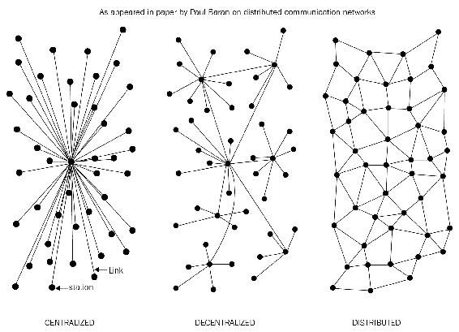
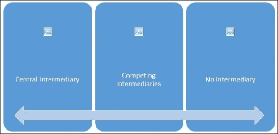
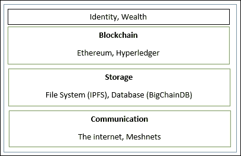

# 第二章：去中心化

去中心化不是一个新概念；它长期以来一直被用于战略、管理和治理。去中心化的基本思想是将控制权和权威分配到边缘，而不是让一个中央权威完全控制组织。这对组织有多种好处，例如提高效率、加快决策速度、提高动机和减轻高层管理的负担。

在本章中，将在区块链的背景下讨论去中心化的概念；两者的目标相似，即没有单一中央权威控制。还将介绍去中心化的方法以及一些示例中的去中心化路径。此外，还将详细讨论区块链生态系统的去中心化、去中心化应用程序以及去中心化平台。许多令人兴奋的应用和想法源自去中心化的区块链技术，并将在本章中介绍。

# 使用区块链的去中心化

去中心化是区块链技术提供的核心优势和服务。按设计，区块链是提供无需任何中介并可以通过共识机制选择许多不同领导者的完美平台。该模型允许任何人竞争成为决策权威。这种竞争受共识机制的约束，而最常用的方法被称为**工作证明**（**PoW**）。

去中心化的应用程度从半去中心化到完全去中心化不等，具体取决于需求和情况。从区块链的角度看，去中心化可以被视为一种机制，提供一种方式来重新塑造现有应用程序和范例或构建新应用程序，以便完全控制用户。

**信息与通信技术**（**ICT**）传统上基于中心化范式，其中数据库或应用服务器受到中央权威（如系统管理员）的控制。随着比特币和区块链技术的出现，这种模式已经改变，现在允许任何人启动一个无需任何单一失败点或单一可信任机构的分散系统的技术可用。它可以自主运行，也可以根据运行在区块链上的去中心化应用程序所使用的类型和模型的治理方式需要一些人为干预。

即将出现的图表显示了当前存在的不同类型的系统，即中心化、分布式和去中心化。这个概念最早是在 1964 年由*保罗·巴兰*在*分布式通信网络*的论文中提出的，当时是在通信网络的背景下。

集中式系统是传统的（客户端--服务器）IT 系统，其中存在一个单一的控制系统的权威，完全负责系统上的所有操作。中心系统的所有用户都依赖于单一的服务来源。在线服务提供商，如 eBay、Google、Amazon、Apple 的 App Store 和其他大多数提供商，使用这种提供服务的常见模型。另一方面，在分布式系统中，数据和计算分布在网络中的多个节点上。有时，这个术语与并行计算混淆。虽然在定义上有重叠，但这两个系统之间的主要区别在于在并行系统中，所有节点同时执行计算以获得结果，而在分布式系统中，计算可能不会并行进行，并且数据仅在用户视为单个一致系统的多个节点上复制。这两种模型都会使用变体以实现故障容忍性和速度。在这个模型中，仍然有一个对所有节点具有控制权并管理处理的中央权威。这意味着系统仍然是中心化的性质。

不同类型的网络/系统

分散系统与分布式系统的关键区别在于，在分布式系统中，仍然存在一个中央权威来管理整个系统，而在分散系统中，没有这样的权威存在。分散系统是一种类型的网络，其中节点不依赖于单一的主节点；相反，控制分布在许多节点之间。例如，这类似于组织中每个部门都有自己负责的数据库服务器的模型，从而夺走了中央服务器的权力，并将其分配给管理自己数据库的子部门。

在启动这一新时代的分散化应用的分散化范式中的一个真正的创新是分散化共识，这是由比特币引入的。这使用户可以通过共识算法就某事达成一致，而无需中央信任的第三方、中间人或服务提供商。

# 分散化的方法

有两种方法可以实现分散化。这些方法在接下来的章节中将详细讨论。

## 去中介化

这可以通过一个例子来解释。想象一下，你想把钱汇给另一个国家的朋友。你去一家银行，它会收取一定的费用将你的钱转给你选择的国家的银行。在这种情况下，银行维护着一个中央数据库，更新着你已经汇款的信息。利用区块链技术，可以直接把这笔钱发送给你的朋友，而无需经过银行。你只需要你朋友在区块链上的地址。这样，中间人就不再需要，通过去中介化实现了去中心化。然而，由于金融部门存在严格的监管和合规要求，去中介化对金融领域的实际可行性存在争议。尽管如此，这种模式不仅可以用于金融领域，还可以用于许多其他不同的行业。

## 通过竞争

在这种方法中，一组服务提供商竞争，以被系统选定为服务提供者。这种范式并不能实现完全的去中心化，但在一定程度上确保了中介或服务提供商不会垄断服务。在区块链技术的背景下，可以构想一个系统，智能合约可以根据声誉、历史评分、评价和服务质量，从众多提供者中选择外部数据提供者。这不会导致完全的去中心化，但它允许智能合约根据前述标准自由选择。这样，就在服务提供商之间培养了一种竞争的环境，他们互相竞争成为首选的数据提供者。

在下图中，展示了不同程度的去中心化。在左侧，是一个传统的方法，一个中央系统控制着；在右侧，实现了完全的去中介化；而在中间，显示了竞争中介或服务提供商。在中间，根据声誉或投票选择中介或服务提供商，从而实现了部分去中心化。

去中心化的规模

尽管去中心化有很多好处——包括但不限于透明度、效率、节约成本、建立可信生态系统，以及在某些情况下隐私和匿名性——但也需要深入研究一些挑战，比如安全需求、软件错误和人为错误。例如，在像比特币或以太坊这样的去中心化系统中，安全通常由私钥提供，那么如何确保与这些私钥关联的智能资产在人为错误导致私钥丢失或者智能合约代码有漏洞导致去中心化应用容易受到攻击时不会变得无用？在我们踏上使用区块链和去中心化应用去实现去中心化的旅程之前，重要的是要明白并不是所有东西都需要（或能够）去中心化。

# 去中心化途径

尽管比特币或区块链之前存在的一些系统在一定程度上可以被分类为去中心化，比如比特彗星或 Gnutella 文件共享，但随着区块链技术的出现，许多举措正在被采取以利用这种新技术来实现去中心化。通常，比特币区块链是许多人的首选，因为它已经被证明是最具韧性和安全性的区块链，市值几乎达到 120 亿美元。另一种方法是使用其他区块链，比如以太坊，它目前是许多开发人员构建去中心化应用的首选工具。

## 如何去中心化

*阿尔温德·纳拉亚南*和其他人提出了一个框架，可以用于评估在区块链技术背景下各种事物的去中心化需求。该框架基本上提出了四个问题，一旦回答，就能清晰地了解一个系统如何能够去中心化。这些问题列举如下：

1.  被去中心化的是什么？

1.  需要什么级别的去中心化？

1.  使用了哪种区块链？

1.  使用了哪种安全机制？

第一个问题简单地询问了要去中心化的系统是什么。这可以是任何系统，例如身份系统或交易系统。下一个问题可以通过确定所需的去中心化级别来回答，可以查看前面讨论的去中心化规模。可以是完全的去中介化或部分的去中介化。第三个问题非常直接，开发人员可以根据特定应用选择哪种区块链合适。可以是比特币区块链、以太坊区块链或任何其他适合特定应用的区块链。最后，需要回答一个关键问题，即如何保证去中心化系统的安全机制。可以是原子性，例如，要么交易完全执行，要么根本不执行。换句话说，要么全有，要么全无。这确保了系统的完整性。其他机制可能包括声誉，它允许在系统中存在不同程度的信任。

### 示例

在本节中，提供了应用上述框架的示例。

在第一个示例中，选择了一个需要去中心化的资金转移系统。在这种情况下，可以回答前面提到的四个问题以评估去中心化的需求。答案如下所示：

1.  **答案 1**：资金转移系统。

1.  **答案 2**：去中介化。

1.  **答案 3**：比特币。

1.  **答案 4**：原子性。

通过回答这四个问题，可以展示支付系统如何实现去中心化。根据前面的答案，可以说通过去除中介，可以将资金转移系统去中心化，并将其实施在比特币区块链上，通过原子性提供安全保障。

类似地，这个框架可以用于需要进行去中心化评估的任何其他系统。通过回答这四个简单的问题，可以很清楚地了解可以采取什么方法来去中心化系统。

# 区块链和完全的生态系统去中心化

为了实现完全去中心化，有必要使区块链周围的环境也去中心化。区块链本身是在传统系统之上运行的分布式分类帐。这些元素包括存储、通信和计算。还有其他因素，如身份和财富，传统上基于中心化范式，有必要也去中心化这些方面，以实现完全去中心化的生态系统。

## 存储

数据可以直接存储在区块链中，通过这种方式实现了去中心化，但这种方法的一个主要缺点是，区块链设计上不适合存储大量数据。它可以存储简单的交易和一些任意数据，但显然不适合存储图像或大量数据块，就像传统数据库系统中的情况一样。一个更好的替代方案是使用**分布式哈希表**（**DHTs**）。DHT 最初用于点对点文件共享软件，如 BitTorrent、Napster、Kazaa 和 Gnutella。DHT 研究由 CAN、Chord、Pastry 和 Tapestry 项目推广。BitTorrent 最终成为最可扩展和快速的网络，但问题在于用户没有动机永久保留文件。用户通常不会永久保留文件，如果节点离开了需要某些数据的网络，除非必需的节点重新加入网络，否则无法检索数据，以便文件再次变为可用。这里的两个主要要求是高可用性和链接稳定性，这意味着数据应在需要时可用，并且网络链接也应始终可访问。由 *Juan Benet* 创立的**星际文件系统**（**IPFS**）具有这两个属性，并且其愿景是通过替换 HTTP 协议来提供一个去中心化的全球网络。IPFS 使用 Kademlia DHT 和 merkle **DAG**（**有向无环图**）分别提供存储和搜索功能。

激励机制基于一个名为 Filecoin 的协议，该协议向使用 BitSwap 机制存储数据的节点支付激励。BitSwap 机制允许节点在一对一的关系下保持字节发送或接收的简单分类帐。此外，IPFS 使用基于 Git 的版本控制机制来提供对数据版本的结构化和控制。

还有其他选择，例如以太坊的 Swarm、storj 和 maidsafe。以太坊有其自己的去中心化和分布式生态系统，使用 Swarm 进行存储，使用 whisper 协议进行通信。Maidsafe 的目标是提供一个去中心化的全球网络。这些项目将在本书中详细讨论。

BigChainDB 是另一个旨在提供可扩展、快速和线性可扩展的去中心化数据库，而不是传统文件系统的存储层去中心化项目。BigChainDB 是去中心化处理平台和文件系统（如以太坊和 IPFS）的补充。

## 通信

通常认为互联网（区块链中的通信层）是去中心化的。这在某种程度上是正确的，因为互联网的最初愿景是开发一个去中心化系统。诸如电子邮件和在线存储等服务现在都是基于服务提供商控制用户信任他们在需要时提供服务的范式。这种模式是基于中央权威（服务提供商）的信任，用户无法控制自己的数据；甚至密码都存储在可信的第三方系统上。有必要以某种方式为个人用户提供数据控制，使他们的数据访问得到保证，不依赖于单一第三方。访问互联网（通信层）是基于充当互联网用户中心的互联网服务提供商（ISP）。如果 ISP 出于政治或其他原因关闭，那么在这种模型中就无法进行通信。一种替代方案是使用 mesh 网络。虽然与互联网相比，它们的功能受到限制，但它们仍然提供了一个去中心化的选择，节点之间可以直接通信，而不需要像 ISP 那样的中心枢纽。

### 注意

Meshnet 的一个例子是 Firechat（[`www.opengarden.com/firechat.html`](http://www.opengarden.com/firechat.html)），它允许 iPhone 用户在没有互联网的情况下以点对点的方式直接进行通信。

现在想象一种网络，允许用户控制他们的通信；没有人能够出于政治或审查原因关闭它。这可能是区块链生态系统中去中心化通信网络的下一个步骤。需要指出的是，这种模式可能只在互联网受到政府审查和控制的司法管辖区才必需。

正如之前所提到的，互联网的最初愿景是构建去中心化的网络；然而，多年来，随着谷歌、亚马逊和 eBay 等大型服务提供商的出现，控制权正在转移向大玩家。例如，电子邮件在本质上是一个去中心化的系统；任何人都可以轻松运行电子邮件服务器，并开始发送和接收电子邮件，但现在已经有了更好的选择，为最终用户提供了托管服务，因此人们自然倾向于选择集中式服务，因为它更方便、免费。然而，免费服务是以个人数据为代价提供的，许多用户并不知晓这一事实。这是一个例子，显示了互联网是如何向中心化发展的。区块链再次向世界展示了这种去中心化的愿景，现在正在做出共同努力来利用这项技术，并获得它所能提供的好处。

## 计算

通过类似以太坊的区块链技术，实现了计算或处理的去中心化，其中嵌入了业务逻辑的智能合约可以在网络上运行。其他区块链技术也提供类似的处理层平台，在这些平台上业务逻辑可以以去中心化的方式运行。

以下图表展示了去中心化生态系统的概述，在底层，互联网或 Meshnets 提供了去中心化的通信层，然后存储层使用 IPFS 和 BigChainDB 等技术来实现去中心化，最后，你可以看到作为去中心化处理层的区块链。区块链在有限的情况下也可以提供存储层，但这严重阻碍了系统的速度和容量；因此，其他解决方案，如 IPFS 和 BigChainDB 更适合以去中心化方式存储大量数据。顶部显示了身份和财富层。互联网上的身份是一个非常重要的话题，诸如 bitAuth 和 OpenID 等系统已经提供了具有不同程度的去中心化和安全性假设的身份验证和识别服务。

区块链有能力为各种问题提供解决方案。一个称为*Zooko's Triangle*的与身份有关的概念要求，网络协议中的命名系统必须安全、去中心化，并对人类有意义。人们猜想一个系统只能同时具有这些属性中的两个，但是随着区块链技术的出现，以 Namecoin 的形式，这个问题得到了解决。然而，这并不是万能药，并伴随着自己的挑战，比如依赖用户安全地存储和维护私钥。这引发了关于去中心化适用性的其他一般性问题。也许去中心化并不是在每种情况下都合适。著名的集中化系统在许多情况下往往效果更好。

目前有许多正在进行的项目正在开发更广泛分布的区块链系统的解决方案。

随着去中心化范式的出现，不同的术语和流行词现在出现在媒体和学术文献中。随着区块链技术的出现，现在可以构建传统实体组织的软件版本。在去中心化的背景下，即将到来的概念值得讨论。

# 智能合约

智能合约可以被看作是一个小型的去中心化程序。智能合约不一定需要区块链来运行；但是，由于区块链技术提供的安全性优势，现在几乎成为了将区块链作为智能合约的去中心化执行平台的标准。智能合约通常包含一些业务逻辑和少量数据。区块链中的参与者或参与者可以使用这些智能合约，或者它们可以代表网络参与者自主运行。

这些小程序存储在区块链上，如果满足某些特定标准就执行业务逻辑。关于智能合约的更多信息将在第六章 中提供，*智能合约*，这是专门讨论智能合约的详细章节。

# 分散化组织

**分散化组织** (**DOs**)是在区块链上运行的软件程序，基于真实人类组织与人员和协议的理念。一旦以智能合约或一组智能合约的形式添加到区块链上，它就变得分散化，各方根据 DO 软件中定义的代码彼此交互。

# 分散自治组织

与 DOs 类似，**分散自治组织** (**DAO**)也是一个在区块链上运行的计算机程序，其中嵌入了治理和业务逻辑规则。DAO 和 DO 基本上是相同的，但主要区别在于 DAO 是自主的，这意味着它们是完全自动化的，并包含人工智能逻辑，而 DO 缺乏这一特征，依赖于人为输入以执行业务逻辑。

以太坊区块链率先引入了 DAO（分散自治组织）的概念。在 DAO 中，代码被视为治理实体，而不是人类或纸质合同。然而，*策展人* 作为维护此代码并作为社区提案评估者的人类实体参与其中。如果从代币持有人（参与者）处获得足够的输入，DAO 有能力聘请外部*承包商*。最著名的 DAO 项目是*The DAO* ([`daohub.org`](https://daohub.org))，因为它在众筹阶段筹集了 1.68 亿美元。DAO 项目旨在成为一家风险投资基金，旨在提供无单一实体所有权的分散化商业模式。不幸的是，由于 DAO 代码中的漏洞，这一项目被黑客攻击，并有价值数百万美元的**以太币** (**ETH**)被转移至黑客创建的子 DAO 中。为了扭转黑客攻击的影响并启动资金恢复，以太坊区块链需要进行硬分叉。这一事件引发了关于智能合约中代码安全性、质量和彻底测试的辩论，以确保完整性和充分控制。目前正在进行一些项目，特别是在学术界，旨在规范化智能合约编码。

目前，尽管 DAO 可能包含一些智能代码来执行一些协议和条件，但这些规则在当前现实世界的法律体系中没有价值。也许有一天，一个由执法机构或监管机构委托和允许，包含规则和法规的*自治* *代理*可以嵌入到 DAO 中，以确保 DAO 的完整性从法律和合规的角度来看。**自治代理**（**AA**）是一种无需人类干预就能运行的代码。DAO 纯粹是分散化的实体，这样便能在任何物理司法管辖区内运行。因此，它们对于当前的法律体系如何应对各种不同司法管辖区和地理位置的混合提出了一个重要问题。

# 去中心化自治公司

**DAOs**、**去中心化自治公司**（**DACs**）是一个类似的概念，但被认为是 DAO 的一个较小的子集。DACs 和 DAOs 的定义有时会重叠，但一个一般的区别是 DAO 通常被认为是非盈利的，而 DACs 可以通过向参与者提供股份以及支付股息而赚钱。这些公司可以根据其中编程的逻辑自动运行业务，无需人类干预。

# 去中心化自治社会

**去中心化自治社会**（**DASs**）是一个概念，整个社会可以在区块链上运行，借助于多个复杂的智能合约和 DAO 和**去中心化应用程序**（**DAPPs**）的组合自主运行。这种模式并不意味着一种非法的做法，也不是基于完全的自由主义意识形态；相反，政府提供的许多服务可以通过区块链来交付，例如政府身份证系统、护照发行以及不动产、婚姻和出生记录。另一种理论是，如果一个政府腐败，中心化的系统无法提供社会所需的令人满意的信任水平，那么社会可以在区块链上启动自己的虚拟社会，由分散式的共识驱动，并且是透明的。这可能被视为自由主义者或密码朋克的梦想，但在区块链上是完全可能的。

# 去中心化应用

前面提到的所有想法都属于更大的去中心化应用的范畴。所有 DAO、DAC 和 DO 基本上都是在点对点网络的区块链上运行的去中心化应用程序。这是关于去中心化的科技的最新进展。去中心化应用程序或 DAPP 是可以在自己的区块链上运行、使用已有的区块链，或者仅仅使用现有的区块链解决方案的协议的软件程序。这些分别称为 Type I、Type II 和 Type III DAPP。

## 去中心化应用的要求

要使应用程序被视为去中心化应用程序，必须满足以下标准。此定义由*大卫·约翰斯顿*和其他人在他们的白皮书*《去中心化应用程序的一般理论，Dapps》*中提供：

1.  DAPP 应该是完全开源和自治的，没有单个实体应该控制大部分其代币。所有对应用程序的更改都必须是基于社区反馈的共识驱动的。

1.  应用程序的数据和操作记录必须经过加密保护，并存储在公共的、去中心化的区块链上，以避免任何中心化故障点。

1.  应用程序必须使用加密令牌，以便为那些为应用程序贡献价值的人提供访问权限和奖励，例如比特币中的矿工。

1.  代币必须由去中心化应用程序根据标准的加密算法生成。这种代币的生成充当了对贡献者（例如矿工）价值的证明。

## DAPP 的操作

DAPP 可以通过工作证明和股权证明等共识算法建立共识。到目前为止，只有 PoW 被发现对 51%攻击具有极强的抵抗力，正如比特币所示。此外，DAPP 可以通过挖矿、筹款和开发来分发代币（硬币）。

### 示例

这里提供了一些去中心化应用程序的示例。

#### KYC-Chain

该应用程序提供了一种基于智能合约，以安全和便捷的方式管理**了解你的客户**（**KYC**）数据的功能。

#### OpenBazaar

这是一个去中心化的点对点网络，允许卖家和买家直接进行商业活动，而不依赖于中心方，与传统提供商如 eBay 和亚马逊相反。值得注意的是，这个系统不是建立在区块链之上的；相反，分布式哈希表在点对点网络中被用来实现直接的通信和数据共享。它利用比特币作为支付网络，然而。

#### Lazooz

这是 Uber 的去中心化等价物。它允许点对点的共享乘车，用户可以通过*运动证明*获得激励，并赚取 Zooz 币。

### 注意

还有许多其他建立在以太坊区块链上的 DAPP，并在[`dapps.ethercasts.com/`](http://dapps.ethercasts.com/)展示。

# 去中心化平台

现在有许多可用的去中心化平台。全球许多公司推出了承诺为用户提供简单、可访问和安全的分布式应用程序开发的平台。这里讨论了一些重要的名字。

## 以太坊

[以太坊](https://example.org/ethereum)排名首位，因为它是第一个引入图灵完备语言和虚拟机概念的区块链。与比特币和许多其他加密货币中有限的脚本语言形成对比。有了名为 Solidity 的这种图灵完备语言的支持，为去中心化应用程序的开发打开了无尽的可能性。这是由*Vitalik Buterin*于 2013 年提出的，并提供了一个用于开发智能合约和去中心化应用程序的公共区块链。以太坊上的货币代币被称为以太币。

## Maidsafe

Maidsafe 提供了一个名为**SAFE**（**Secure Access for Everyone**）的网络，由未使用的计算资源，如存储、处理能力和其用户的数据连接组成。网络上的文件被分成小块数据，这些数据被加密并随机分布在整个网络中。只有相应所有者才能检索这些数据。一个关键的创新是网络上的重复文件会被自动拒绝，这有助于减少管理负载所需的额外计算资源。它使用 Safecoin 作为激励其贡献者的代币。

## Lisk

Lisk 是一个区块链应用程序开发和加密货币平台。它允许开发人员使用 JavaScript 构建去中心化应用程序，并将它们托管在自己的各自的侧链中。Lisk 使用**委托权益证明**（**DPOS**）机制来进行共识，可以选举 101 个节点来保护网络并提出区块。它使用 Node.js 和 JavaScript 后端，而前端允许使用标准技术，如 CSS3、HTML5 和 JavaScript。Lisk 使用 LSK 代币作为区块链上的货币。Lisk 的另一个衍生品是 Rise，它是一个基于 Lisk 的去中心化应用程序和数字货币平台。它更注重系统的安全性。

对这些平台和其他平台的更实用的介绍将在后续章节中提供。

# 总结

本章介绍了去中心化的概念，这是区块链技术提供的核心服务。虽然去中心化的概念并非新鲜事物，但在区块链世界中重新获得了重要意义。因此，最近推出了基于去中心化架构的各种应用程序。本章首先介绍了去中心化的概念。接下来，从区块链角度讨论了去中心化。此外，还介绍了区块链生态系统中不同层面的去中心化相关的思想。随着区块链技术和区块链角度的去中心化的出现，出现了一些新概念和术语，比如 DAOs、DAPPs 和其它一些。本章还介绍了这些术语的概念。最后，讨论了一些去中心化应用程序，并给出了一些例子。在下一章中，将介绍理解区块链生态系统的基本概念。主要介绍了密码学，这为区块链技术提供了关键的基础。
