# 第四章 比特币

比特币是区块链技术的第一个应用。在本章中，读者将详细介绍比特币技术。

比特币随着第一个完全去中心化数字货币的推出而开启了一场革命，并且已被证明是非常安全稳定的。这也引发了学术和工业研究的极大兴趣，并引入了许多新的研究领域。自2008年推出以来，比特币受到了很大的欢迎，并且目前是世界上最成功的数字货币，投资额达数十亿美元。它建立在密码学、数字现金和分布式计算领域数十年的研究基础上。在接下来的部分中，将介绍一个简要的历史，以便提供理解比特币发明背后基础所需的背景。

数字货币一直是多个十年的研究活跃领域。早期提出创建数字现金的建议可以追溯到上世纪80年代初。1982年，*大卫·乔姆*提出了一种利用盲签名构建不可追踪数字货币的方案。在这个方案中，银行将通过签署用户提供的盲目且随机的序列号来发行数字货币。用户随后可以使用银行签署的数字令牌作为货币。这个方案的局限性在于银行必须跟踪所有已使用的序列号。这是一个中心化系统，需要用户信任。随后在1990年，*大卫·乔姆*提出了一个名为e-cash的改进版本，不仅使用了盲签名，还使用了一些私有识别数据来制作一个然后发送给银行的消息。这个方案允许检测双重支付，但不能防止它。如果同一令牌在两个不同的位置使用，则会显露双重支付者的身份。e-cash只能表示固定金额的货币。*亚当·巴克*于1997年提出的hashcash最初是为了防止电子邮件垃圾邮件。hashcash背后的思想是解决一个易于验证但相对难以计算的计算难题。

这个想法是，对于单个用户和单个电子邮件，额外的计算工作是不可感知的，但是发送大量垃圾邮件的人会因为运行垃圾邮件活动所需的时间和资源大大增加而感到沮丧。

B-money是*魏·戴*在1998年提出的，引入了使用工作量证明来创造货币的概念。系统的一个主要弱点是，具有更高计算能力的对手可以生成未经邀请的货币，而不允许网络调整到适当的困难级别。该系统缺乏有关节点之间共识机制的细节，也没有解决诸如Sybil攻击等一些安全问题。与此同时，*尼克·萨博*介绍了BitGold的概念，它也基于工作量证明机制，但与b-money一样存在相同的问题，唯一的区别是网络难度水平是可调整的。*托马斯·桑德*和*阿蒙·塔沙马*在1999年介绍了一个电子现金方案，该方案首次使用Merkle树表示硬币，并使用零知识证明证明了对硬币的拥有权。在这个方案中，需要一个中央银行，它记录了所有已使用的序列号。尽管存在计算成本，但这个方案允许用户完全匿名。**RPOW**（**可重复使用工作量证明**）是由*哈尔·芬尼*在2004年推出的，使用*亚当·贝克*的hashcash方案作为消耗资源来创建货币的证明。这也是一个保留中央数据库以跟踪所有已使用POW令牌的中央系统。这是一个使用**可信计算平台**（**TPM硬件**）实现的基于远程证实的在线系统。

所有先前提到的方案都设计得很巧妙，但从某个方面来看都存在弱点。特别是，所有这些方案都依赖于一个需要用户信任的中央服务器。

# 比特币

2008年，*中本聪*撰写了一篇关于比特币的论文*比特币：一种点对点的电子现金系统*。文中首次提出的关键思想是，纯粹的点对点电子现金不需要中介银行来在对等方之间转移支付。

比特币是建立在几十年的密码学研究基础上的，诸如Merkle树、哈希函数、公钥密码学和数字签名等研究。此外，BitGold、b-money、hashcash和密码时间戳等概念为比特币的发明奠定了基础。所有这些技术在比特币中被巧妙地结合起来，创造了世界上第一个去中心化货币。比特币所解决的关键问题是对拜占庭将军问题的优雅解决方案，以及双花问题的实际解决方案。

自2011年以来，比特币的价值显著增长，如下图所示：

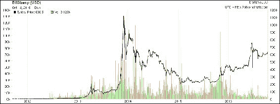

2012年以来比特币价格和交易量（对数刻度）

对比特币的监管是一个有争议的话题，尽管它是自由主义者的梦想，执法机构和政府正在提出各种规定来控制它，比如纽约州金融服务部门颁发的BitLicense。这是针对进行虚拟货币相关活动的企业颁发的许可证。

比特币的增长也是因为所谓的*网络效应*。也称为需求端的规模经济，这个概念基本上意味着更多使用网络的用户，它就变得更有价值。随着时间的推移，比特币网络增长呈指数增长。尽管比特币的价格相当波动，但在过去几年里它有了显著的增长。目前（在编写时），比特币的价格是815英镑。

## 比特币定义

比特币可以以各种方式定义；它是一个协议，一个数字货币，也是一个平台。它是一个由点对点网络、协议和软件组成的组合，用于方便创建和使用名为比特币的数字货币。请注意，大写字母*B*的比特币用于指代比特币协议，而小写字母*b*的比特币用于指代比特币这个货币。这个点对点网络中的节点使用比特币协议进行通信。

通过比特币的发明，货币的去中心化首次成为可能。此外，比特币还以一种巧妙而聪明的方式解决了双花问题。双花问题是指当一个用户同时向两个不同的用户发送硬币时，并且这些硬币独立验证为有效交易时产生的问题。

### 密钥和地址

椭圆曲线加密被用于在比特币网络中生成公钥和私钥对。比特币地址是通过取私钥的对应公钥并对其进行两次哈希来创建的，首先用SHA256算法，然后再用RIPEMD160。然后将结果的160位哈希值前缀加上版本号，最后使用Base58Check编码方案进行编码。比特币地址通常是26-35个字符长，并以数字1或3开始。一个典型的比特币地址看起来像是以下显示的字符串：

**1ANAguGG8bikEv2fYsTBnRUmx7QUcK58wt**

这通常也被编码成QR码以便分享。前述地址的QR码如下图所示：


比特币地址1ANAguGG8bikEv2fYsTBnRUmx7QUcK58wt的QR码

目前，有两种类型的地址，常用的是 P2PKH 和另一种 P2SH 类型，分别以 1 和 3 开头。在早期，比特币使用直接的 Pay-to-Pubkey，现在已被 P2PKH 取代。但是，直接的 Pay-to-Pubkey 在比特币中仍然用于 coinbase 地址。地址不应重复使用；否则，可能会出现隐私和安全问题。避免地址重用可在一定程度上规避匿名问题，比特币还存在其他安全问题，例如交易篡改，需要采用不同的方法来解决。


从 bitaddress.org 中的纸钱包中的私钥和比特币地址

### 比特币中的公钥

在公钥密码学中，公钥是从私钥生成的。比特币使用基于 SECP256K1 标准的 ECC。私钥是随机选择的，长度为 256 位。公钥可以以未压缩或压缩格式呈现。公钥基本上是椭圆曲线上的 *x* 和 *y* 坐标，在未压缩格式下以十六进制格式带有前缀 04 呈现。*X* 和 *Y* 坐标都是 32 位长。总的来说，压缩公钥的长度为 33 字节，而未压缩格式为 65 字节。压缩版的公钥基本上只包括 *X* 部分，因为 *Y* 部分可以由它导出。压缩版的公钥之所以有效是因为比特币客户端最初使用未压缩密钥，但从比特币核心客户端 0.6 开始，压缩密钥被用作标准。

密钥由各种前缀标识，描述如下：

+   未压缩的公钥以 0x04 作为前缀

+   如果公钥的 y 32 位部分为奇数，则压缩公钥以 0x03 开头

+   如果公钥的 y 32 位部分为偶数，则压缩公钥以 0x02 开头

更详细的数学描述及其工作原理在此描述。如果可视化 ECC 图表，将显示 *y* 坐标可以位于 *x* 轴下方或上方，由于曲线对称，因此只需存储在素数域中的位置。

### 比特币中的私钥

私钥基本上是根据 SECP256K1 ECDSA 推荐规范指定的范围中选择的 256 位数字。从 0x1 到 0xFFFF FFFF FFFF FFFF FFFF FFFF FFFF FFFE BAAE DCE6 AF48 A03B BFD2 5E8C D036 4140 中随机选择的任意 256 位数字都是有效的私钥。

私钥通常使用**钱包导入格式**（**WIF**）进行编码，以便更容易地复制和使用。WIF 可以转换为私钥，反之亦然。具体步骤请参见此处。

此外，**迷你私钥格式**有时用于在不到 30 个字符的情况下对密钥进行编码，以允许在空间有限的情况下存储，例如，在实体硬币上刻写或耐损 QR 码上。比特币核心客户端还允许加密包含私钥的钱包。

### 比特币货币单位

比特币货币单位描述如下。最小的比特币单位是 Satoshi。

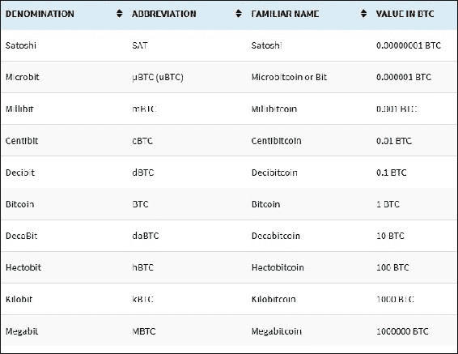

### Base58Check 编码

此编码用于限制不同字体中相似字符（例如 0OIl）之间的混淆。该编码基本上将二进制字节数组转换为人类可读字符串。这个字符串是通过使用一组 58 个字母数字符号来构成的。有关更多解释和逻辑，请参阅比特币源代码中的 `base58.h` 源文件。

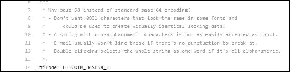

来自比特币源代码的解释

比特币地址使用 Base58check 编码进行编码。

### 虚荣地址

由于比特币地址基于 base 58 编码，因此可以生成包含人类可读消息的地址。以下是一个示例：


QR 中编码的公共地址

虚荣地址是使用纯粹的暴力方法生成的。以下截图显示了一个示例：

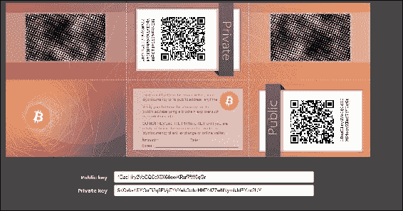

从 https://bitcoinvanitygen.com/ 生成的虚荣地址

# 交易

交易是比特币生态系统的核心。交易可以简单到只是将一些比特币发送到比特币地址，也可以根据需求变得非常复杂。每个交易至少由一个输入和输出组成。输入可以被视为在先前交易中创建的被花费的硬币，而输出则被视为被创建的硬币。如果交易正在铸造新的硬币，则没有输入，因此不需要签名。如果交易是将硬币发送给其他用户（比特币地址），则需要由发送者使用其私钥签名，并且还需要参考先前交易以显示硬币的来源。事实上，硬币是以 Satoshi 表示的未花费交易输出。

交易未加密，可以在区块链中公开查看。区块由交易组成，这些交易可以使用任何在线区块链浏览器查看。

## 交易生命周期

1.  用户/发送者使用钱包软件或其他界面发送交易。

1.  钱包软件使用发送者的私钥对交易进行签名。

1.  交易使用洪泛算法广播到比特币网络。

1.  挖掘节点将此交易包含在下一个要挖掘的块中。

1.  一旦解决工作量证明问题的矿工向网络广播新挖掘的区块，挖矿就开始了。工作量证明将在本章后面详细解释。

1.  节点验证块并传播块，确认开始生成。

1.  最后，确认开始出现在接收方的钱包中，大约六次确认后，交易被视为最终确定。然而，六只是一个建议的数字；即使在第一次确认后，交易也可以被视为最终确定。等待六次确认背后的关键思想是，六次确认后几乎消除了双重支付的可能性。

## 交易结构

高层次上，每个交易都包含元数据、输入和输出。交易被组合创建一个块。交易结构如下表所示：

| **字段** | **大小** | **描述** |
| --- | --- | --- |
| 版本号 | 4字节 | 用于指定矿工和节点用于交易处理的规则。 |
| 输入计数器 | 1字节至9字节 | 交易中包含的输入数量。 |
| 输入列表 | 可变 | 每个输入由多个字段组成，包括前一笔交易哈希、前一笔交易输出-索引、Txin脚本长度、Txin脚本和可选的序号。块中的第一个交易也称为coinbase交易。它指定一个或多个交易输入。 |
| 输出计数器 | 1字节至9字节 | 代表输出数量的正整数。 |
| 输出列表 | 可变 | 包含在交易中的输出。 |
| 锁定时间 | 4字节 | 定义交易有效的最早时间。可以是Unix时间戳或区块号。 |

+   **元数据：** 交易的这部分包含一些值，如交易大小、输入和输出数量、交易的哈希和一个`lock_time`字段。每个交易都有一个指定版本号的前缀。

+   **输入：** 通常，每个输入都花费之前的输出。每个输出都被视为未被花费的交易输出（UTXO）直到有输入消耗它。

+   **输出：** 输出只有两个字段，并包含比特币发送的指令。第一个字段包含Satoshis的金额，而第二个字段是一个锁定脚本，其中包含必须满足的条件，以便花费输出。稍后在本节中将讨论使用锁定和解锁脚本以及产生输出进行交易支出的更多信息。

+   **验证：** 使用比特币的脚本语言进行验证。

一个示例交易如下所示：

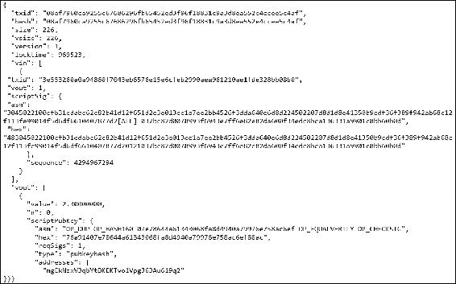

显示了各个早期描述的字段的样例解码交易

### 脚本语言

比特币使用一种简单的基于堆栈的语言称为*脚本*来描述比特币如何被花费和转移。它不是图灵完备的，并且没有循环，以避免长时间运行/挂起脚本对比特币网络产生任何不良影响。这种脚本语言基于类似于Forth的语法，并使用逆波兰表示法，其中每个操作数都跟随其操作符。它从左到右使用**后进先出**（**LIFO**）堆栈进行评估。

脚本使用各种操作码或指令来定义其操作。操作码也称为字、命令或函数。比特币节点的早期版本有一些操作码，由于在设计中发现了错误而不再使用。

脚本操作码的各种类别包括常量、流程控制、堆栈、位逻辑、拼接、算术、密码学和锁定时间。

通过组合`ScriptSig`和`ScriptPubKey`来评估交易脚本。`ScriptSig`是解锁脚本，而`ScriptPubKey`是锁定脚本。这就是如何评估交易是否已经花费；首先解锁，然后花费。`ScriptSig`由希望解锁交易的用户提供。`ScriptPubkey`是交易输出的一部分，并指定了必须满足的条件才能花费输出。换句话说，输出由包含条件的`ScriptPubKey`（锁定脚本）锁定，当满足条件时将解锁输出，然后可以兑现硬币。

### 常用操作码

所有操作码都在比特币参考客户端源代码中的script.h文件中声明。这可以通过以下链接访问：[https://github.com/bitcoin/bitcoin/blob/master/src/script/script.h](https://github.com/bitcoin/bitcoin/blob/master/src/script/script.h)，在以下注释下：

**/** 脚本操作码 */**

下面列出了最常用的操作码的描述。这个表格摘自比特币开发者指南：

| **操作码** | **描述** |
| --- | --- |
| `OP_CHECKSIG` | 这获取一个公钥和签名，并验证交易哈希的签名。如果匹配，则将TRUE推送到堆栈上；否则将FALSE推送。 |
| `OP_EQUAL` | 如果输入完全相等，则返回1；否则返回0。 |
| `OP_DUP` | 这会复制堆栈中的顶部项。 |
| `OP_HASH160` | 输入被两次哈希，首先使用SHA-256，然后使用RIPEMD-160。 |
| `OP_VERIFY` | 如果顶部堆栈值不为真，则将交易标记为无效。 |
| `OP_EQUALVERIFY` | 这与`OP_EQUAL`相同，但之后运行`OP_VERIFY`。 |
| `OP_CHECKMULTISIG` | 这获取第一个签名并将其与每个公钥进行比较，直到找到匹配项，并重复此过程直到检查所有签名。如果所有签名都有效，则返回1作为结果；否则返回0。 |

## 交易类型

比特币中有各种脚本可用于处理从源到目的地的价值转移。这些脚本的复杂程度因交易需求的不同而异，从非常简单到相当复杂。在此讨论标准交易类型。标准交易是通过`IsStandard()`和`IsStandardTx()`测试进行评估的，通常只有通过测试的标准交易才被允许在比特币网络上进行挖掘或广播。然而，非标准交易是有效的，也允许在网络上进行。

+   **支付到公钥哈希**（**P2PKH**）：P2PKH 是最常用的交易类型，用于将交易发送到比特币地址。交易的格式如下所示：

    `ScriptPubKey`: `OP_DUP OP_HASH160` <pubKeyHash> `OP_EQUALVERIFY OP_CHECKSIG`

    `ScriptSig`: <sig> <pubKey>

    `ScriptPubKey` 和 `ScriptSig` 参数连接在一起并执行。在本节中很快将会有一个示例，更详细地解释这一点。

+   **支付到脚本哈希**（**P2SH**）：P2SH 用于将交易发送到脚本哈希（即以 3 开头的地址），并在 BIP16 中标准化。除了通过脚本，还必须评估赎回脚本并确保其有效。模板如下所示：

    `ScriptPubKey`: `OP_HASH160` <redeemScriptHash> `OP_EQUAL`

    `ScriptSig`: [<sig>...<sign>] <redeemScript>

+   **多重签名（支付到多重签名）**：M of n 多重签名交易脚本是一种复杂类型的脚本，可以构建一个需要多重签名才能有效赎回交易的脚本。使用此脚本可以构建各种复杂的交易，如担保和存款。模板如下所示：

    `ScriptPubKey`: <m> <pubKey> [<pubKey> . . . ] <n> `OP_CHECKMULTISIG`

    `ScriptSig`: 0 [<sig > . . . <sign>]

    原始多重签名已过时，多重签名通常是 P2SH 赎回脚本的一部分，如前述条目中所述。

+   **支付到公钥**：此脚本是一种非常简单的脚本，通常用于 coinbase 交易。它现在已经过时，并且在比特币的旧版本中使用。在这种情况下，公钥存储在脚本中，解锁脚本需要用私钥签署交易。

    模板如下所示：

    <PubKey> `OP_CHECKSIG`

+   **空数据/OP_RETURN**：此脚本用于以一定费用将任意数据存储在区块链上。消息的限制为 40 字节。此脚本的输出无法赎回，因为`OP_RETURN`在任何情况下都会验证失败。在这种情况下不需要`ScriptSig`。

    模板非常简单，如下所示：

    `OP_RETURN` <data>

P2PKH 脚本执行如下所示：

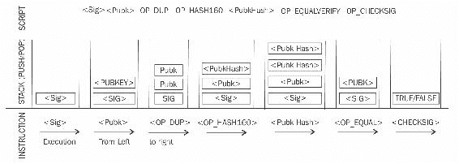

P2PKH 脚本执行

所有交易最终都会在传输到比特币网络之前被编码为十六进制。使用以下命令在比特币测试网络上使用bitcoin-cli检索的十六进制中显示了示例交易：

```
drequinox@drequinox-OP7010:~$ bitcoin-cli --testnet getrawtransaction "08af7960ca9255c67686296fb65452ed3f96f18831c9a3d8ea552e4ccee5c4af"
0100000001b008bb28e3fde10a2161a9ae9029ebcfe6156e57b63e04f76048a9a06032553e010000006b483045022100cfb31edabc62c82b41d12f651d2e3e013ee1a7ee2bb4526f3dda640e6d8d224502207d8d1d8e41350b9cdf36f389f942ab68c12f113fe99014f5d6df6610407877d20121037bc82d0078993f6943e7ff6e82e82da600f34edc8bca136331a9901c8bb60b0dfeffffff028085b50d000000001976a91407e78644a61343068fa8d4940a79976e758ac6ef88ac95bddc1c000000001976a914dad770cccb1026ebf87acacfe35f2d6f2d336faa88ac33cb0e00

```

### Coinbase交易

Coinbase交易或生成交易总是由矿工创建的，并且是区块中的第一笔交易。它用于创建新的硬币。它包括一个特殊字段，也称为*coinbase*，它充当coinbase交易的输入。该交易还允许最多100字节的任意数据，该数据可用于存储任意数据。在创世区块中，这包括从《泰晤士报》中选取的最著名的评论：

> *"泰晤士报 2009年1月3日 央行行长准备为银行进行第二次纾困"*

这条消息证明了创世区块不会早于2009年1月3日被挖掘出来。

### 什么是UTXO？

**未花费交易输出**（**UTXO**）是可以作为新交易的输入花费的未花费交易输出。比特币中与交易相关的其他概念如下所述。

#### 交易费

交易费用由矿工收取。收取的费用取决于交易的大小。交易费用通过减去输入总和和输出总和来计算。这些费用被用作激励，鼓励矿工将用户交易包含在他们正在创建的区块中。所有交易最终都会进入内存池，矿工会根据它们的优先级挑选交易，以便将它们包含在提议的区块中。关于优先级的计算将在本章后面介绍；然而，从交易费用的角度来看，交易费较高的交易将被矿工更早地挑选出来。根据不同的规则计算各种操作的费用，例如发送交易、包含在区块中以及节点中继。比特币协议中没有固定的费用，也不是强制性的；即使没有费用的交易也会在适当的时候处理，但可能需要很长时间。

#### 合约

根据比特币核心开发者指南的定义，合约基本上是使用比特币系统执行财务协议的交易。这是一个简单的定义，但其影响深远，因为它允许用户设计可以用于许多现实场景的复杂合约。合约允许开发完全去中心化、独立且降低风险的平台。可以使用比特币脚本语言构建各种合约，例如第三方担保、仲裁和微支付通道。脚本的当前实现非常有限，但仍然可以开发各种类型的合约。例如，仅在多方签署交易后才释放资金，或者仅在经过一定时间后才释放资金。这两种情况都可以使用`multiSig`和交易锁定时间选项来实现。

#### 交易可塑性

比特币中的交易可塑性是由于比特币实现中的错误而引入的。由于这个错误，对手有可能改变交易的交易ID，从而导致某个交易似乎没有被执行的情况。这可能导致双重存款或取款的情况发生。换句话说，在比特币交易被确认之前，这个错误允许改变比特币交易的唯一ID。

如果在确认之前ID被更改，那么该交易似乎根本没有发生，这样可以允许双重存款或取款攻击。

#### 交易池

也称为*内存池*，这些池基本上是由节点在本地内存中创建的，以维护尚未在区块中确认的交易的临时列表。交易在通过验证后，并根据它们的优先级被包含在一个块中。

#### 交易验证

这个验证过程是由比特币节点执行的。在比特币开发者指南中描述了以下内容：

1.  检查语法并确保交易的语法正确。

1.  验证输入和输出不为空。

1.  检查字节大小是否小于当前的最大块大小，即1 MB。

1.  输出值必须在允许的货币范围内（0至2100万比特币）。

1.  所有输入必须有指定的前一输出，除了coinbase交易，不应进行中继。

1.  验证`nLockTime`必须不超过31位。为了使交易有效，它的大小不应小于100字节。此外，标准签名中的签名操作数的数量应少于或不超过2。

1.  拒绝*非标准*交易；例如，`ScriptSig`只允许在堆栈上推送数字。`ScriptPubkey`不通过`isStandard()`检查。

1.  如果池中已经存在匹配的交易或者在主分支的一个块中存在匹配的交易，则拒绝该交易。

1.  如果每个输入的引用输出存在于池中的任何其他交易中，则将拒绝该交易。

1.  对于每个输入，必须存在一个引用的输出交易。这是在主分支和交易池中搜索的，以查找是否有任何输入缺失输出交易，如果匹配的交易尚未在池中，则将其视为孤立交易，将其添加到孤立交易池中。

1.  对于每个输入，如果引用的输出交易是coinbase，则必须至少有100次确认；否则，将拒绝该交易。

1.  对于每个输入，如果引用的输出不存在或已经花费，则将拒绝该交易。

1.  使用引用的输出交易获取输入值，验证每个输入值以及总和是否在0-2100万比特币的允许范围内。

1.  如果输入值的总和小于输出值的总和，则拒绝该交易。

1.  如果交易费用过低而无法进入空区块，则拒绝交易。

# 区块链

区块链是比特币网络上所有交易的时间戳、有序和不可变列表的公共分类帐。每个区块在链中由哈希标识，并通过引用前一个区块的哈希链接到其前一个区块。

在以下区块结构中，描述了一个区块头，随后是一个详细的图表，提供了对区块链结构的洞察。

## 区块的结构

| **字节** | **名称** | **描述** |
| --- | --- | --- |
| 80 | 区块头 | 这包括了下一节中描述的区块头的字段。 |
| *可变* | 交易计数器 | 该字段包含区块中的所有交易总数，包括 coinbase 交易。 |
| *可变* | 交易 | 区块中的所有交易。 |

## 区块头的结构

| **字节** | **名称** | **描述** |
| --- | --- | --- |
| 4 | 版本 | 指定要遵循的区块验证规则的区块版本号。 |
| 32 | 上一个区块头哈希 | 这是上一个区块头的双重 SHA256 哈希。 |
| 32 | 默克尔根哈希 | 这是包含在区块中的所有交易的默克尔树的双重 SHA256 哈希。 |
| 4 | 时间戳 | 此字段以 Unix 纪元时间格式包含了区块的大致创建时间。更确切地说，这是矿工开始对头部进行哈希计算的时间（从矿工的角度看）。 |
| 4 | 难度目标 | 这是区块的难度目标。 |
| 4 | 随机数 | 这是矿工反复更改的任意数字，以产生一个满足难度目标阈值的哈希。 |

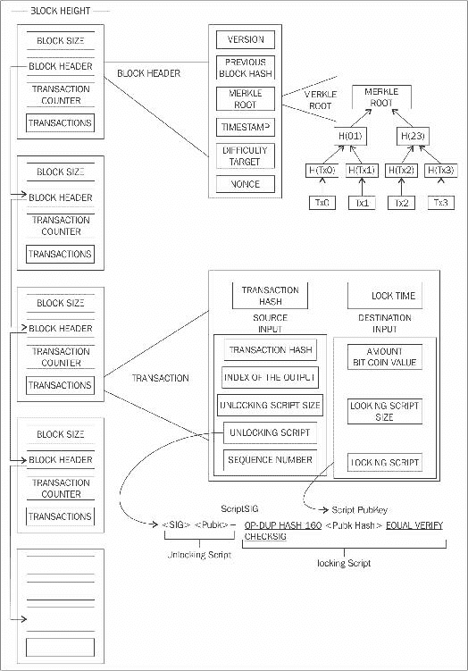

区块链、区块、区块头、交易和脚本的可视化

正如前图所示，区块链是一个区块链，其中每个区块通过引用前一个区块头的哈希链接到其前一个区块。这种链接确保除非记录它的区块及其后续所有区块也被修改，否则不会修改任何交易。第一个区块未链接到任何前一个区块，并且被称为创世区块。

## 创世区块

这是比特币区块链中的第一个区块。创世区块已经在比特币核心软件中硬编码。它位于 `chainparams.cpp` 文件中。

[https://github.com/bitcoin/bitcoin/blob/master/src/chainparams.cpp](https://github.com/bitcoin/bitcoin/blob/master/src/chainparams.cpp)

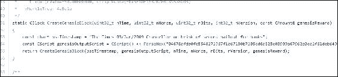

比特币通过强制对交易进行严格规则验证和通过挖矿来防止双重支付。在严格规则检查和成功的工作量证明解决方案后，区块才会添加到区块链中。区块高度是指在特定区块之前的区块数量。目前（在撰写本文时）区块链的高度为434755个区块。工作量证明用于保护区块链。每个区块包含一个或多个交易，其中第一个交易是coinbase交易。对于coinbase交易，有一个特殊条件，即要防止它们在至少100个区块之前被使用，以避免出现后来可能被宣布为过时的情况。

当一个区块被解决并且其它仍在努力解决哈希难题的矿工都在工作，这时就会产生过时区块。挖矿和哈希难题将在本章后面详细讨论。因为区块不再需要进行工作，所以被认为是过时的区块。

孤立区块也被称为分离区块，曾经被网络一度接受为有效区块，但在创建一个不包括这个最初接受的区块的被证明更长的链后被拒绝。它们不是主链的一部分，有时会出现在两个矿工同时产生区块的情况下。

最新的区块版本是版本4，它是由BIP65提出的，并自比特币核心客户端0.11.2以来一直在使用，因为在`nVersion`字段中实施了BIP9位来指示软叉变更。

由于比特币的分布式性质，网络分叉可能会自然发生。在两个节点同时宣布一个有效的区块的情况下，会出现两个具有不同交易的区块链的情况。这是一个不希望发生的情况，但仅通过接受最长链的比特币网络才能解决。在这种情况下，较小的链将被视为孤立的。如果对手设法获得对网络算力（计算能力）51%的控制权，那么他们就可以强加自己的交易历史版本。

区块链中的分叉可能是由于比特币协议的变化引起的。在*软分叉*的情况下，只有以前的有效区块不再被接受，从而使软分叉向后兼容。在软分叉的情况下，只需要矿工升级到新的客户端软件以利用新的协议规则。计划升级不一定会造成分叉，因为所有用户都应该已经更新了。另一方面，硬分叉会使先前有效的区块无效，并要求所有用户进行升级。有时会添加新的交易类型作为软分叉，而任何变化，如区块结构变化或主要协议变化都会导致硬分叉。

截至2017年2月4日，比特币区块链的当前大小约为101 GB。下图显示了区块链大小随时间变化的情况：

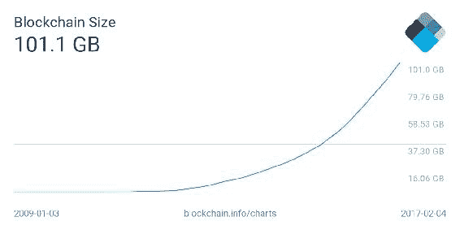

截至2017年6月2日，区块链的当前大小为。

新的区块大约每10分钟添加到区块链中，并且网络难度在每2016个区块动态调整，以保持对网络的稳定增加新区块。

网络难度使用以下方程计算：

*目标=上一个目标*时间/2016*10分钟*

难度和目标是可以互换的，表示同一件事。上一个目标表示旧的目标值，时间是生成前2016个区块所花费的时间。网络难度基本上意味着对矿工来说找到新区块有多困难，也就是说，现在哈希难题有多难。

在本节中，讨论了挖矿，将解释哈希难题是如何被解决的。

### 挖矿

挖矿是一个资源密集型过程，通过该过程新的区块被添加到区块链中。区块包含通过挖矿过程由挖矿节点验证的交易，并添加到区块链中。为了确保区块被接受，这个过程是资源密集型的。矿工通过花费必要的计算资源铸造新的硬币。这也确保了系统抵御欺诈和双重支付攻击，同时为比特币生态系统增加了更多的虚拟货币。

大约每10分钟产生（挖掘）一个新区块。如果矿工创建新区块，并在其中包含交易，他们将获得新的硬币，并作为交易费用。新区块以大约固定的速度创建。此外，每210,000个区块，大约每四年，新比特币的产生速度会减半。当比特币初始推出时，区块奖励是50个比特币；然后在2012年，这被减少到25个比特币。到2016年7月，这进一步减少到12.5个硬币（12个硬币），预计下一次减少将在2020年7月4日。这将进一步将硬币奖励减少到大约六个硬币。

每天大约产生144个区块，即1728个比特币。实际硬币数量每天可能有所变化，但是每天的区块数量保持在144个。比特币供应也是有限的，在2140年，大约将终于创造出2100万个比特币，之后将不会再创造新的比特币。然而，比特币矿工仍然能够通过收取交易费从生态系统中获利。

### 矿工的任务

一旦一个节点连接到比特币网络，比特币矿工执行几个任务。

### 与网络同步

一旦一个新节点加入比特币网络，它通过向其他节点请求历史区块下载区块链。这里提到比特币矿工，但这不一定是一个仅供矿工完成的任务。

+   **交易验证**：全节点通过验证和验证签名和输出来验证网络广播的交易。

+   **区块验证**：矿工和全节点可以通过对其收到的区块根据某些规则进行评估来开始验证这些区块。这包括验证区块中每笔交易以及验证随机数值的正确性。

+   **创建新区块**：矿工通过验证后结合网络广播的交易提出一个新区块。

+   **执行工作量证明**：这一任务是挖矿过程的核心，矿工通过解决一个计算难题找到一个有效的区块。区块头包含一个32位随机数字段，矿工需要反复改变随机数，直到结果哈希小于预定目标。

+   **获取奖励**：一旦一个节点解决了哈希难题，它立即广播结果，其他节点验证并接受该区块。由于与大致同时发现的另一个区块冲突的可能性微弱，新铸造的区块有可能不被其他矿工接受，但一旦接受，矿工将获得12.5个比特币（截至2016年）以及任何相关的交易费用。

### 工作量证明

这是一个证明足够的计算资源已经被消耗以构建一个有效区块证明。**工作量证明**（**PoW**）基于这样一个思想：每次选择一个随机节点来创建一个新区块。在这个模型中，节点根据其计算能力的比例彼此竞争以被选中。以下等式总结了比特币中工作量证明的要求：

*H ( N || P_hash || Tx || Tx || . . . Tx) < 目标*

其中N是一个随机数，*P_hash*是上一个区块的哈希，*Tx*代表区块中的交易，*目标*是目标网络难度值。这意味着上述连接字段的哈希应小于目标哈希值。找到这个随机数的唯一方法是穷举法。一旦某个矿工满足一定数量的零的某种模式，该区块将立即被广播并被其他矿工接受。

### 挖掘算法

挖掘算法包括以下步骤。

+   从比特币网络中检索上一个哈希区块。

+   将网络广播的一组潜在交易组合成一个区块。

+   使用SHA256算法计算区块头部与一个随机数和上一个哈希的双哈希。

+   如果结果哈希低于当前难度水平（目标），则停止该过程。

+   如果结果哈希大于当前难度级别（目标），则通过增加 nonce 来重复该过程。随着比特币网络的哈希率增加，32 位 nonce 的总量耗尽得太快。为了解决这个问题，*额外 nonce* 解决方案被实施，即使用 coinbase 交易作为额外 nonce 的来源，以提供更大范围的 nonce 供矿工搜索。

+   随着时间的推移，挖矿难度不断增加，现在需要专用的挖矿中心来解决哈希难题，曾经能够通过单个 CPU 笔记本电脑挖掘的比特币现在已经需要专用的挖矿中心来解决哈希难题。可以使用比特币命令行界面查询当前难度级别，命令如下：

```
 $ bitcoin-cli getdifficulty 
 258522748404.5154

```

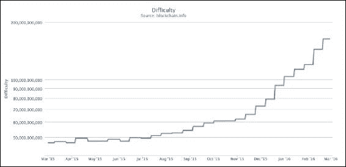

随时间变化的挖矿难度

`getdifficulty` 命令返回的值。

### 哈希率

哈希率基本上表示每秒计算哈希的速率。在比特币早期，由于使用 CPU，哈希率非常低，但是现在，随着专用挖矿池和 ASIC 的出现，过去几年里呈指数增长。这导致了难度的增加。下面的哈希率图显示了随时间的变化而增加的哈希率，并且目前以 Exa 哈希来测量。这意味着在 1 秒钟内，比特币网络矿工正在计算超过 1 000 000 000 000 000 000 个哈希。

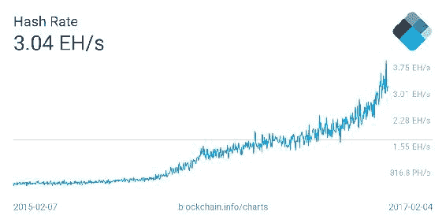

2017 年 6 月 2 日的哈希率，展示了两年的时间段

### 挖矿系统

随着时间的推移，比特币矿工们使用了各种方法来挖掘比特币。由于挖掘背后的核心原理是基于双 SHA256 算法，随着时间的推移，矿工们开发出了更快速计算哈希的复杂系统。以下是对比特币中使用的不同挖矿方法及其随时间演变的回顾。

### CPU

CPU 挖矿是最初在原始比特币客户端中可用的一种挖矿类型。用户甚至可以使用笔记本或台式电脑来挖掘比特币。CPU 挖矿已不再盈利，现在更先进的挖矿方法，如基于 ASIC 的挖矿正在使用。

### GPU

随着比特币网络的难度增加和寻找更快挖掘方法的一般趋势，矿工开始使用 PC 上可用的 GPU 或图形卡来进行挖掘。GPU 支持更快速和并行计算，通常使用 OpenCL 语言进行编程。这被证明是一个比 CPU 更快的选项。用户还使用了超频等技术来充分利用 GPU 的性能。此外，使用多个图形卡的可能性增加了图形卡用于比特币挖矿的流行度。然而，GPU 挖矿也有一些局限性，如过热和需要专用主板和额外硬件来容纳多个图形卡。

### FPGA

即使GPU挖矿也没有持续多久，很快矿工们找到了另一种使用FPGAs进行挖矿的方法。**Field Programmable Gate Array**（**FPGA**）基本上是一个可以编程执行特定操作的集成电路。FPGAs通常使用**硬件描述语言**（**HDLs**）进行编程，如Verilog和VHDL。双SHA256很快成为FPGA程序员的吸引人的编程任务，并出现了几个开源项目。与GPU相比，FPGA提供了更好的性能；然而，可访问性、编程难度以及需要专门的知识来编程和配置FPGA等问题导致了比特币挖矿FPGA时代的短期。此外，ASIC的出现迅速取代了基于FPGA的挖矿系统。在FPGA挖矿盈利期间开发了如X6500矿工、Ztex和Icarus等挖矿硬件。各种FPGA制造商，如赛灵思和阿尔特拉，都生产可以用于编程挖矿算法的FPGA硬件和开发板。

### ASICs

**Application Specific Integrated Circuit**（**ASIC**），是设计用来执行SHA-256操作的。这些特殊的芯片由各种制造商出售，提供了非常高的散列率。这在一段时间内是有效的，但由于挖矿难度迅速增加，单个ASIC不再盈利。

目前，挖矿已经超出了个人的能力范围，现在专业的矿业中心利用数千个ASIC单元并行提供矿业合同给用户，代表用户进行挖矿。这里没有技术限制，这就是为什么单个用户无法并行运行数千个ASIC，但将需要专用数据中心和硬件，单个个人的成本可能会变得不可行。

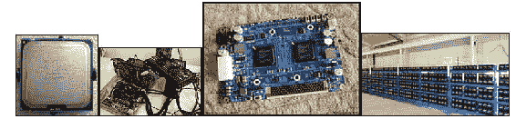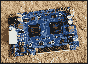

四种类型的挖矿（CPU、GPU、FPGA和ASIC）

### 挖矿矿池

矿池在一群矿工共同工作以挖掘一个区块时形成。如果成功挖掘了区块，*矿池管理者*将接收coinbase交易，然后负责向投入资源以挖掘该区块的矿工群体分配奖励。与单独挖矿相比，这是有利可图的，因为在矿池中，无论他们（更具体地说，他们的个体节点）是否解决了谜题，奖励都会支付给矿池的每个成员。

挖矿池管理者可以采用各种模式向矿工支付报酬，如按份计费模式和比例模式。在按份计费模式中，挖矿池管理者向所有参与挖矿的矿工支付固定费用，而在比例模式中，份额是根据用于解决哈希谜题的计算资源量来计算的。

现在存在许多商业矿池，并通过云端和易于使用的网络界面提供挖矿服务合同。最常用的是**安特池**（AntPool）、**F2Pool**和**BW.COM**。以下图片显示了所有主要矿池的哈希功率的比较：

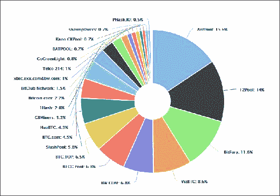

截至2017年6月2日，挖矿池及其哈希功率（哈希率）情况，取自 https://blockchain.info/pools

挖矿集中化是一个重要问题，如果一个矿池成功控制了比特币网络超过51%的网络，即生成了超过51%的哈希率，这可能会发生。正如前文所述，在介绍部分中，51%攻击可能导致双重支付攻击，这可能会影响共识，并实际上在比特币网络上强加另一个版本的交易历史。

比特币历史上曾经发生过这样的情况，即一个大型矿池GHash.IO成功获得了超过51%的网络容量。学术界已经提出了理论解决方案，比如双重工作证明，以防止大型矿池的出现。该方案引入了第二个密码谜题，导致挖矿池透露其私钥或提供其挖矿池的相当部分哈希率，从而降低了挖矿池的总哈希率。

不同类型的硬件目前都可以在商业市场上用于挖矿。目前最赚钱的是ASIC挖矿，许多供应商提供专用硬件。除非花费大量资金和能源来建造自己的挖矿设备甚至中心，否则独立挖矿现在不太赚钱。根据当前的难度因子（2016年10月），如果用户设法产生12 TH/s的哈希率，他们可以希望每天赚取0.01366887 BTC（约8美元），这与购买可以产生12 TH/s哈希率的设备所需的投资相比非常低。考虑到电费等运营成本，这并不是非常有利可图。

## 比特币网络

比特币网络是一个 P2P 网络，节点之间交换交易和区块。网络上有不同类型的节点。主要有两种类型的节点，完整节点和 SPV 节点。完整节点如其名所示，是比特币核心客户端的实现，执行钱包、矿工、完整的区块链存储和网络路由功能。然而，并不需要执行所有这些功能。SPV 节点或轻量级客户端仅执行钱包和网络路由功能。比特币协议的最新版本是 70014，是通过比特币核心客户端 0.13.0 引入的。

一些节点只愿意成为完整的区块链节点，包含完整的区块链并执行网络路由功能，但不进行挖矿或存储私钥（钱包功能）。另一种类型是独立挖矿节点，它可以进行挖矿、存储完整的区块链，并充当比特币网络路由节点。

有一些非标准但被广泛使用的节点被称为池协议服务器。这些节点使用替代协议，如 Stratum 协议。一些节点仅执行挖矿功能，称为挖矿节点。只计算哈希的节点使用 Stratum 协议将其解决方案提交给矿池。可以在没有区块链的情况下运行 SPV 客户端，它运行钱包和网络路由功能。

互联网上的大多数协议都是基于行的，这意味着每一行都由回车和换行符 *\r \n* 分隔。Stratum 也是一种基于行的协议，它利用普通的 TCP 套接字和易读的 JSON-RPC 在节点之间进行操作和通信。

比特币网络通过其不同的魔法值进行识别。以下是一个列表：

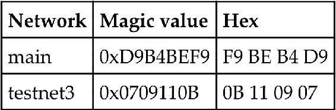

比特币网络魔法值

魔法值用于指示消息的来源网络。

完整节点执行四个功能：钱包、矿工、区块链和网络路由节点。

当比特币核心节点启动时，首先会初始化发现所有对等节点。这是通过查询硬编码到比特币核心客户端中并由比特币社区成员维护的 DNS 种子来实现的。此查找返回多个 DNS A 记录。比特币协议默认在 TCP 端口 8333 上运行于主网络，TCP 18333 上运行于测试网络。

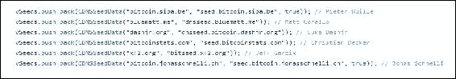

chainparams.cpp 中的 DNSSeeds

首先，客户端发送一个包含各种字段的协议消息 *Version*，如版本、服务、时间戳、网络地址、随机数和一些其他字段。远程节点响应其自己的版本消息，然后两个节点之间进行 verack 消息交换，表示连接已建立。

然后，**G** ***etaddr*** 和 ***addr*** 消息交换以查找客户端不知道的对等节点。同时，任一节点都可以发送一个 ping 消息来查看连接是否仍然活动。

现在可以开始区块下载。如果节点已经完全同步了所有区块，那么它会使用 *Inv* 协议消息监听新区块；否则，它首先检查是否对 *inv* 消息有响应并且已经有了存货。如果有，那么它使用 ***Getdata*** 协议消息请求区块；如果没有，那么它使用 *GetBlocks* 消息请求存货。这种方法一直被使用直到版本0.9.3。

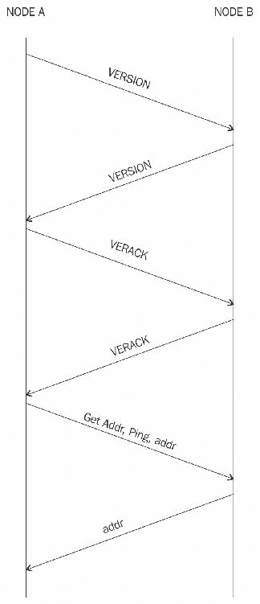

协议可视化节点发现

初始区块下载可以使用区块优先或标题优先的方法来同步区块，具体取决于比特币核心客户端的版本。区块优先方法非常慢，在版本0.10.0之后被停止使用。

自版本0.10.0以来，引入了名为标题优先的初始区块下载方法。这导致了主要的性能改进，原本需要数天才能完成的区块链同步现在只需要几个小时。其核心思想是，新节点首先向对等方请求区块头并验证它们。一旦完成，就可以从所有可用的对等方并行请求区块，因为完整链的蓝图已经以区块头链的形式下载。

在此方法中，当客户端启动时，它会检查区块链是否已完全同步，如果标题链已经同步，则会从其他对等方请求标题，如果没有，则会请求其他对等方的头部链。区块链已经完全同步，则通过 *Inv* 消息监听新区块，如果已经完全同步了头部链，则使用 *Getdata* 协议消息请求区块。节点还会检查标题链是否比区块多，然后通过发出 *Getdata* 协议消息请求区块。

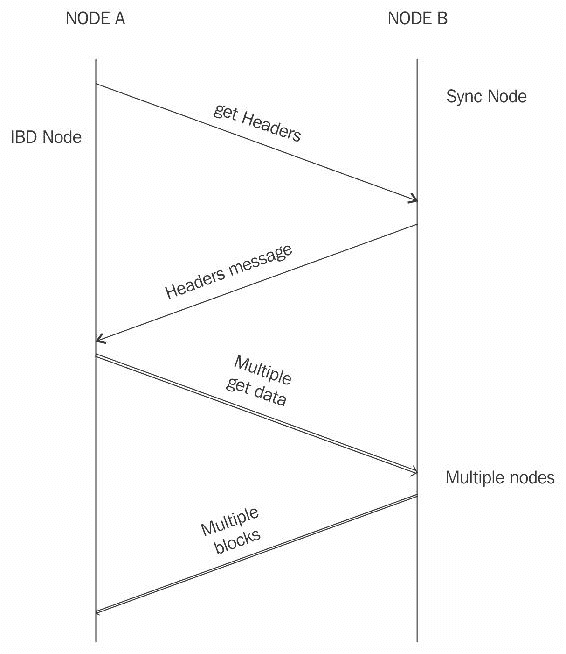

比特币核心客户端 >= 0.10.0 标题和区块同步，IBD = 初始区块下载和同步节点指的是从该节点请求区块的节点

`Getblockchaininfo` 和 `getpeerinfo` RPCs 更新了新功能以适应这一变化。一个名为 *getchaintips* 的 RPC 用于列出区块链的所有已知分支。这也包括仅包含标题的区块。`Getblockchaininfo` 用于提供有关当前区块链状态的信息。`Getpeerinfo` 用于列出对等方之间共有的区块数和标题数。

Wireshark 也可以用于可视化对等方之间的消息交换，并且可以作为学习比特币协议的宝贵工具。这里展示了一个示例。这是一个基本示例，显示了版本、verack、getaddr、ping、addr 和 inv 消息。

在详细信息中，可以看到诸如数据包类型、命令名称和协议消息结果等有价值的信息。

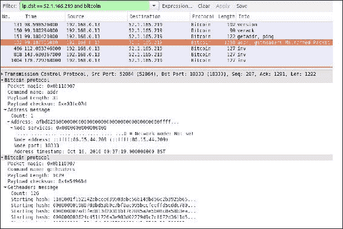

Wireshark中的样本块消息

此处显示了两个对等方之间数据流动的协议图。 这可以帮助您了解节点何时启动以及使用了什么类型的消息。

在以下示例中，比特币解析器被用来分析流量并识别比特币协议命令。

在以下示例中，可以看到消息的交换，如**version**，**getaddr**和**getdata**，以及描述消息名称的适当注释。 这个练习对于学习比特币可能非常有用，建议在比特币测试网络上进行实验，可以在该网络上发送各种消息和交易，然后通过Wireshark进行分析。

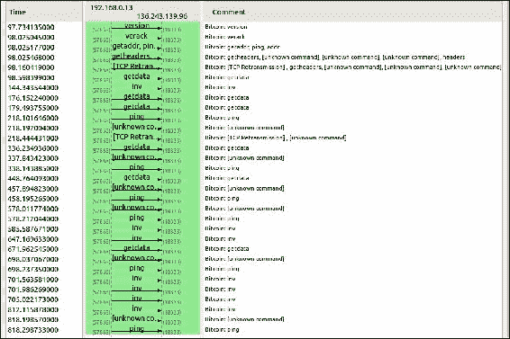

总共有27种协议消息，但随着协议的增长，它们很可能会增加。 最常用的协议消息及其解释如下：

+   **Version：** 这是节点向网络发送的第一个消息，宣传其版本和块计数。 然后，远程节点以相同的信息回复，连接随后建立。

+   **Verack：** 这是版本消息的响应，接受连接请求。

+   **Inv：** 节点使用此消息广告其对块和交易的了解。

+   **Getdata：** 这是对inv的响应，请求由其哈希标识的单个块或交易。

+   **Getblocks：** 这返回一个包含自上一个已知哈希或500个块之后的所有块列表的*inv*数据包。

+   **Getheaders：** 这用于请求指定范围内的块头。

+   **Tx：** 这用于作为对getdata协议消息的响应发送交易。

+   **Block：** 这是对*getdata*协议消息的响应，发送一个块。

+   **Headers：** 此数据包作为对getheaders请求的回复返回高达2000个块头。

+   **Getaddr：** 这作为获取已知对等方信息的请求发送。

+   **Addr：** 这提供有关网络上节点的信息。 它包含地址数量和地址列表，格式为IP地址和端口号。

+   **完整客户端和SPV客户端：** 完整客户端是下载整个区块链的厚客户端或完整节点； 这是作为客户端验证区块链最安全的方法。 比特币网络节点可以以两种基本模式运行：完整客户端或轻量级SPV客户端。 SPV客户端用于验证支付而无需下载完整的区块链。 SPV节点仅保留当前有效最长区块链的块头副本。 验证是通过查看将交易链接到交易被接受的原始块的默克尔分支来执行的。 这不太实用，需要更实用的方法，该方法已使用BIP37实施，其中使用了布隆过滤器仅过滤出相关交易。

+   **布隆过滤器**：布隆过滤器基本上是一种数据结构（带有索引的位向量），用于以概率方式测试元素的成员资格。它基本上提供了具有误报但没有误报的概率查询。元素被添加到布隆过滤器后，通过对它们进行多次哈希，然后将相应的位设置为1来设置位向量中的相应索引。为了检查元素在布隆过滤器中的存在，应用相同的哈希函数并将其与位向量中的位进行比较，以查看是否将相同的位设置为1。并非每个哈希函数（例如 SHA1）都适用于布隆过滤器，因为它们需要快速、独立和均匀分布。布隆过滤器最常用的哈希函数是 fnv、mumur 和 Jenkins。

这些过滤器主要由简单支付验证（SPV）客户端使用，以请求交易和他们感兴趣的默克尔块。默克尔块是区块的轻量级版本，其中包括区块头、一些哈希、1位标志位列表和交易计数。然后可以使用这些信息构建默克尔树。这通过创建一个仅匹配SPV客户端请求的交易和块的过滤器来实现。一旦版本消息被交换并且节点之间建立了连接，节点就可以根据自己的需求设置过滤器。这些概率过滤器根据设置的精确程度或宽松程度提供不同程度的隐私或精度。严格的布隆过滤器只会过滤节点请求的交易，但会以泄露用户地址的可能性为代价，对手可能会将交易与他们的IP地址相关联，从而损害隐私。另一方面，宽松设置的过滤器可能导致检索更多不相关的交易，但会提供更多的隐私。此外，对于SPV客户端，布隆过滤器允许它们使用低带宽，而不是下载所有交易进行验证。

+   **BIP 37** 提出了比特币布隆过滤器的实现，并向比特币协议引入了三个新消息。

+   **Filterload:** 这用于在连接上设置布隆过滤器。

+   **Filteradd:** 这将新的数据元素添加到当前过滤器中。

+   **FilterClear:** 这会删除当前加载的过滤器。

更多细节可以在 BIP37 规范中找到。

## 钱包

钱包软件用于存储私钥或公钥和比特币地址。它执行各种功能，例如接收和发送比特币。现在，软件通常提供两种功能：比特币客户端和钱包。在磁盘上，比特币核心客户端钱包存储为伯克利数据库文件：

```
:~/.bitcoin$ file wallet.dat

```

`wallet.dat`: 伯克利数据库（B树，版本9，本机字节顺序）

私钥可以以不同的方式生成，并由不同类型的钱包使用。钱包不存储任何硬币，也没有钱包为用户存储余额或硬币的概念。事实上，在比特币网络中，*硬币*并不存在；相反，只有交易信息存储在区块链上（更确切地说，是UTXO，未花费的输出），然后用于计算比特币的数量。

### 钱包类型

在比特币中，有不同类型的钱包可以用来存储私钥。作为软件程序，它们还为用户提供一些功能，以在比特币网络上管理和执行交易。

#### 非确定性钱包

这些钱包包含随机生成的私钥，也称为*一堆键钱包*。比特币核心客户端在首次启动时生成一些密钥，并在需要时生成密钥。管理大量密钥非常困难，一个错误的过程可能导致偷窃和硬币丢失。此外，有必要定期备份密钥并适当保护它们，以防止偷窃或丢失。

#### 确定性钱包

在这种类型的钱包中，密钥通过哈希函数从种子值派生而来。这个种子号码是随机生成的，并且通常用人类可读的*助记码*词来表示。助记码词在BIP39中定义。这个短语可以用来恢复所有密钥，并使私钥管理相对容易。

#### 分层确定性钱包

在BIP32和BIP44中定义，HD钱包将密钥存储在从种子派生的树结构中。种子生成父密钥（主密钥），用于生成子密钥，随后生成孙密钥。HD钱包中的密钥生成不直接生成密钥；相反，它产生一些信息（私钥生成信息），可以用来生成一系列私钥。如果已知主私钥，HD钱包中的私钥完整层次结构很容易恢复。正是因为这个属性，HD钱包非常容易维护，并且非常便携。

#### 大脑钱包

主私钥也可以从被记忆的密码的哈希派生出来。关键的想法是这个密码用于派生私钥，如果在HD钱包中使用，这可以导致从单个记忆的密码派生出的完整HD钱包。这被称为大脑钱包。这种方法容易受到密码猜测和暴力破解攻击，但是可以使用*密钥延展*等技术来减慢攻击者的进展。

#### 纸质钱包

顾名思义，这是一个纸质钱包，上面打印了所需的密钥材料。它需要物理安全来存储。纸质钱包可以从各种服务提供商在线生成，例如[https://bitcoinpaperwallet.com/](https://bitcoinpaperwallet.com/)或[https://www.bitaddress.org/](https://www.bitaddress.org/)。

#### 硬件钱包

另一种方法是使用防篡改设备来存储密钥。这种防篡改设备可以是定制的，或者随着NFC手机的出现，它也可以是NFC手机中的**安全元素**（**SE**）。Trezor和Ledger钱包（各种类型）是最常用的比特币硬件钱包。

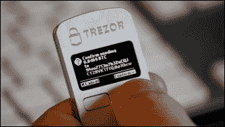

Trezor钱包

#### 线上钱包

正如名称所示，线上钱包完全存储于网络上，并通常通过云服务提供。它们为用户提供一个网页界面，用以管理钱包并执行诸如支付和接收款项等多种功能。它们使用方便，但前提是用户需要信任线上钱包服务提供商。

#### 移动钱包

如名称所示，移动钱包安装在移动设备上。它们可以提供各种支付方法，最显著的是能够使用智能手机相机快速扫描二维码并进行支付。移动钱包适用于Android平台和iOS，例如breadwallet、copay和Jaxx。

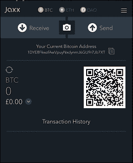

Jaxx移动钱包

# 比特币支付

使用各种技术可以接受比特币作为支付。虽然比特币在许多司法管辖区内并未被认可为合法货币，但它越来越多地被许多在线商家和电子商务网站接受为支付方式。有许多方法可以让买家向接受比特币的商家支付。例如，在线商店中可以使用比特币商家解决方案，而在传统的实体商店中，可以使用销售点终端和其他专用硬件。顾客可以简单地扫描含有卖家支付URI的二维码，并通过移动设备进行支付。比特币URI允许用户通过点击链接或扫描二维码来进行支付。**URI**（**统一资源标识符**）基本上是代表交易信息的字符串。它在BIP21中定义。二维码可以显示在销售终端附近。几乎所有的比特币钱包都支持这一功能。

商家可以使用以下截图来宣传他们可以接受比特币作为支付方式。


比特币接受此处标志

各种支付解决方案，如xbtterminal和34字节比特币POS终端，均可商业购买。


34字节POS解决方案。

比特币支付处理器，由许多在线服务提供商提供，支持与电子商务网站集成。简单的互联网搜索可以揭示许多选项。

已经提出并最终确定了各种BIP，以引入和规范化比特币支付。最值得注意的是，BIP70（安全支付协议）描述了商户和客户之间进行安全通信的协议。该协议使用X.509证书进行身份验证，并在HTTP和HTTPS上运行。该协议中有三条消息：PaymentRequest、Payment和PaymentACK。这一提议的关键特点是防范中间人攻击和安全的支付证明。中间人攻击可能导致这样一种情况：攻击者位于商户和买家之间，买家看起来似乎在与商户交谈，但实际上，“中间人”正在与买家而不是商户交互。这可能导致篡改商户的比特币地址以欺诈买家。

还有其他几个BIP，比如BIP71和BIP72，也已经被提出，以规范支付消息封装和URI方案，以支持BIP70。

比特币闪电网络，是一个可扩展的链下即时支付解决方案，于2016年初推出，允许链下支付。该网络利用在区块链之外运行的支付通道。这使得比特币的速度和可扩展性更大。此论文可在[https://lightning.network/](https://lightning.network/)获取，鼓励感兴趣的读者阅读论文，以了解这一发明背后的理论和基础。

## 比特币投资和买卖比特币

有许多在线交易所，用户可以在那里买卖比特币。这现在是互联网上的一个大生意，它提供比特币交易、差价合约、点差投注、保证金交易以及各种其他选择。交易员可以通过开设多头或空头头寸来购买比特币或交易，从而在比特币价格上涨或下跌时获利。还有其他一些功能，比如将比特币兑换成其他虚拟货币，也是可能的，许多在线比特币交易所提供了这个功能。还提供了高级市场数据、交易策略、图表和相关数据，以支持交易员。这里展示了**CEX.IO**的一个示例。其他交易所提供类似类型的服务。

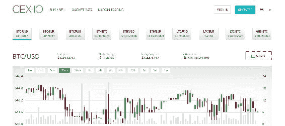

比特币交易所 cex.io 的示例

下面的截图显示了交易所的订单簿，其中列出了所有的买单和卖单：

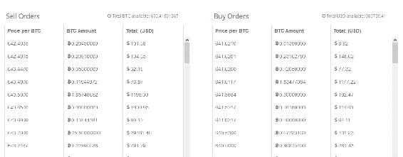

比特币交易所 cex.io 的订单簿示例

## 比特币安装

比特币核心客户端可从[https://bitcoin.org/en/download](https://bitcoin.org/en/download)下载安装。该软件适用于不同的架构和平台，从x86 Windows到ARM Linux，如下图所示：

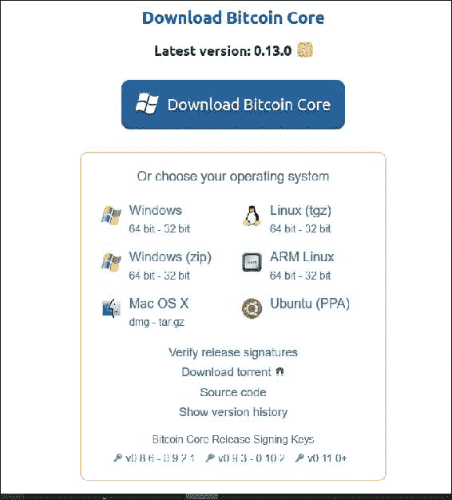

### 设置比特币节点

在此处显示了在Ubuntu上运行比特币核心安装的示例；对于其他平台，可以从[www.bitcoin.org](http://www.bitcoin.org/)获取详细信息。

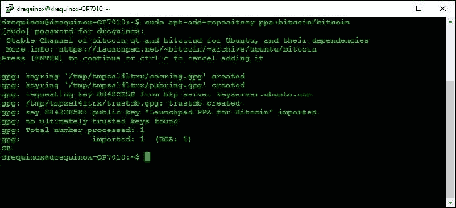

步骤2：

```
drequinox@drequinox-OP7010:~$ sudo apt-get update

```

根据需要的客户端，用户可以使用以下命令之一，或者同时发出两个命令：

```
sudo apt-get install bitcoind
sudo apt-get install bitcoin-qt
drequinox@drequinox-OP7010:~$ sudo apt-get install bitcoin-qt bitcoind
Reading package lists... Done
Building dependency tree
Reading state information... Done
.......

```

### 设置源代码

如果用户希望参与比特币代码或学习目的，可以下载并编译比特币源代码。可以使用Git下载比特币源代码：

```
$ sudo apt-get install git 
$ mkdir bcsource 
$ cd bcsource 
drequinox@drequinox-OP7010:~/bcsource $ git clone https://github.com/bitcoin/bitcoin.git 
Cloning into 'bitcoin'... 
remote: Counting objects: 78960, done. 
remote: Compressing objects: 100% (3/3), done. 
remote: Total 78960 (delta 0), reused 0 (delta 0), pack-reused 78957 
Receiving objects: 100% (78960/78960), 72.53 MiB | 1.85 MiB/s, done. 
Resolving deltas: 100% (57908/57908), done. 
Checking connectivity... done. 
drequinox@drequinox-OP7010:~/bcsource$

```

将目录更改为比特币：

```
drequinox@drequinox-OP7010:~/bcsource$ cd bitcoin

```

当前步骤完成后，代码可以编译：

```
drequinox@drequinox-OP7010:~/bcsource/bitcoin$ ./autogen.sh 
drequinox@drequinox-OP7010:~/bcsource/bitcoin$ ./configure.sh 
drequinox@drequinox-OP7010:~/bcsource/bitcoin$ make 
drequinox@drequinox-OP7010:~/bcsource/bitcoin$ sudo make install

```

### 设置bitcoin.conf

`bitcoin.conf`文件是一个配置文件，被比特币核心客户端用来保存配置设置。所有bitcoind客户端的命令行选项（除了`-conf`开关）都可以在配置文件中设置，在bitcoin-qt或bitcoind启动时，将从该文件中获取配置信息。

在Linux系统中，通常可以在`$HOME/.bitcoin/`中找到，或者也可以在命令行中使用`-conf=<file>`开关指定给bitcoind核心客户端软件。

### 在测试网络中启动节点

如果您想要测试比特币网络并进行实验，可以以测试网络模式启动比特币节点。与现场网络相比，这是一个更快的网络，并且对于挖矿和交易有更宽松的规定。

可用于比特币测试网络的各种水龙头服务。一个例子是Bitcoin TestNet sandbox，用户可以请求比特币支付到他们的测试网比特币地址。可以通过[https://testnet.manu.backend.hamburg/](https://testnet.manu.backend.hamburg/)访问。这对于在测试网络上进行交易实验非常有用。

启动测试网络的命令行如下：

```
bitcoind --testnet -daemon 
bitcoin-cli --testnet <command> 
bitcoin-qt --testnet

```

### 在regtest中启动节点

可以使用regtest模式（回归测试模式）创建用于测试的本地区块链。

可以使用以下命令启动regtest模式中的节点：

```
bitcoind -regtest -daemon 
Bitcoin server starting

```

可以使用以下命令生成区块：

```
bitcoin-cli -regtest generate 200

```

在Linux系统中，可以在`.bitcoin/regtest`目录下的`debug.log`中查看相关日志消息。

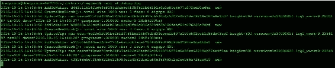

在生成区块后，可以通过以下方式查看余额：

```
drequinox@drequinox-OP7010:~/.bitcoin/regtest$ bitcoin-cli -regtest getbalance 
8750.00000000

```

可以使用以下命令停止节点：

```
drequinox@drequinox-OP7010:~/.bitcoin$ bitcoin-cli -regtest stop 
Bitcoin server stopping

```

### 在主网中启动节点

***Bitcoind***是可以作为守护程序运行的核心客户端软件，并提供JSON RPC接口。*Bitcoin-cli*是用于与守护程序交互的功能丰富的命令行工具；然后守护程序与区块链交互并执行各种功能。 Bitcoin-cli仅调用JSON-RPC函数，不会在区块链上执行任何操作。

*Bitcoin-qt*是比特币核心客户端的图形用户界面。当钱包软件首次启动时，它会验证磁盘上的区块，然后启动并显示以下图形用户界面：

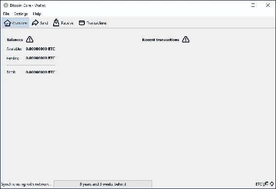

Bitcoin Core QT客户端在安装后显示区块链未同步

验证过程不仅适用于比特币-qt客户端；也可以由*bitcoind*客户端执行。

### 使用bitcoin-cli进行实验

Bitcoin-cli是比特币核心客户端提供的命令行接口，并且可以使用比特币核心客户端提供的RPC接口执行各种功能。

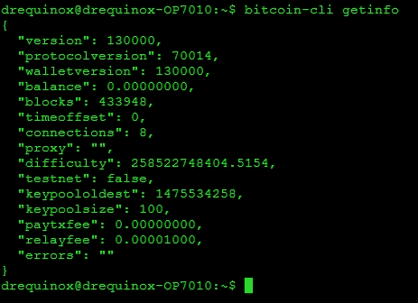

运行bitcoin-cli getinfo的示例；相同格式可用于调用其他命令

可以通过以下命令显示所有命令的列表：

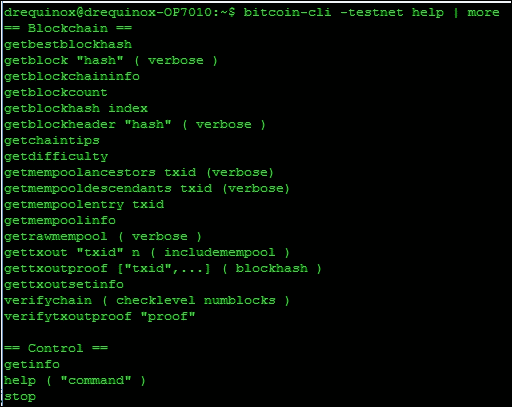

Testnet bitcoin-cli，这只是输出的前几行，实际的输出有很多命令。

+   **HTTP REST**：从比特币核心客户端0.10.0开始，也提供了HTTP REST接口。默认情况下，它在与JSON-RPC相同的TCP端口8332上运行。

## 比特币编程和命令行界面

比特币编程现在非常丰富。比特币核心客户端提供了各种JSON RPC命令，可以用于构建原始交易，并通过自定义脚本或程序执行其他功能。此外，还提供了命令行工具Bitcoin-cli，该工具利用JSON-RPC接口，并提供了丰富的工具集来处理比特币。

这些API也可以通过许多在线服务提供商以比特币API的形式获得，并提供简单的HTTP REST接口。比特币API，比如`blockchain.info`和bitpay、block.io等，提供了大量选项以开发基于比特币的解决方案。

有许多用于比特币编程的库可用。下面显示了一个列表，如果您有兴趣，可以进一步探索这些库。

**Libbitcoin**：可在[https://libbitcoin.dyne.org/](https://libbitcoin.dyne.org/)找到，并提供功能强大的命令行实用工具和客户端。**Pycoin**：可在[https://github.com/richardkiss/pycoin](https://github.com/richardkiss/pycoin)找到，是Python的库。

**Bitcoinj**：此库可在[https://bitcoinj.github.io/](https://bitcoinj.github.io/)上找到，并使用Java实现。

有许多在线比特币API可用；以下列出了最常用的API：

[https://bitcore.io/](https://bitcore.io/)

[https://bitcoinjs.org/](https://bitcoinjs.org/)

[https://blockchain.info/api](https://blockchain.info/api) 所有API提供的功能几乎相同，很难选择哪个API最好。

## 比特币改进提案（BIPs）

这些文档用于建议或通知比特币社区提出的改进、设计问题，或者比特币生态系统某些方面的信息。有三种比特币改进提案，简称为BIPs：

+   **标准 BIP**：用于描述对比特币系统产生重大影响的主要更改，例如区块大小更改、网络协议更改或交易验证更改。

+   **流程 BIP**：标准 BIP 和流程 BIP 的主要区别在于，标准 BIP 涵盖协议更改，而流程 BIP 通常涉及提议改变核心比特币协议之外的流程。这些只有在比特币用户之间达成共识后才会实施。

+   **信息性 BIP**：通常用于仅建议或记录有关比特币生态系统的一些信息，例如设计问题。

# 摘要

本章介绍了比特币及相关概念。从一些与比特币相关的历史和基本定义开始。介绍了诸如密钥和地址以及公钥和私钥等概念。还讨论了比特币网络中的交易工作原理（以及脚本、操作码和交易类型等相关概念）。此外，还介绍了作为比特币网络基础的区块链。还介绍了与此相关的概念，如挖矿、工作证明、挖矿系统和钱包。最后，还提供了有关设置比特币客户端、使用 bitcoin-cli 以及介绍不同比特币网络的一些实用信息。在下一章中，将介绍替代货币及相关概念。
