# 第五章. 替代币

自比特币最初成功以来，许多替代货币项目已经启动。比特币于2009年发布，第一个替代币项目（名为Namecoin）于2011年推出。在2013年和2014年，替代币市场呈指数级增长，并启动了许多不同类型的替代币项目。其中一些取得了成功，而许多则不受欢迎且未能成功。少数是一些短期出现的*炒作和倾销*骗局，但很快就消失了。对比特币的替代方法可以广泛分为两类，根据其开发的主要目的。如果主要目的是构建去中心化的区块链平台，则称为替代链；如果替代项目的唯一目的是引入新的虚拟货币，则称为替代币。替代区块链将在本书的后续章节中详细讨论。

本章主要专注于替代币（altcoins），其主要目的是引入一种新的虚拟货币（币），尽管部分内容也会介绍构建在比特币之上的替代协议，以提供各种服务。其中包括诸如Namecoin等概念，其主要目的是提供去中心化的命名和身份服务，而不是货币。

目前，截至2016年末，市场上有数百种替代币，并且它们具有一定的货币价值。许多这些替代项目直接是比特币源代码的分叉，尽管其中一些是从头开始编写的。一些替代币旨在解决比特币的局限，例如隐私问题。还有一些提供不同类型的挖矿、更改区块时间和分发方案。

按定义，另类币是在硬分叉的情况下生成的。如果比特币经历了一次硬分叉，那么另一个更老的链实际上被视为另一种币。然而，关于哪条链成为另类币并没有已经建立的规则。最近就发生了这样的情况，以太坊就出现了这种情况，一次硬分叉导致了一种新的货币**ETC**（**以太经典**）的产生，除了现有的**以太币**（**ETH**）。以太经典是旧链，以太是分叉后的新链。因为一次引发争议的硬分叉无法在许多方面令人满意。首先，它违背了去中心化的真正精神，因为以太坊基金会，一个中心实体，决定继续进行硬分叉，即使并非每个人都同意这一提议；其次，由于对硬分叉的分歧，它也分裂了用户社区。尽管从理论上讲，硬分叉会产生一种另类币，但由于即使改变引发了硬分叉，基础币的基本参数通常没有发生剧烈变化，它在所能提供的方面存在限制。通常它们保持不变。因此，最好要么从零开始编写一种新币，要么分叉比特币（或其他币种的源代码）以创建一个具有所需参数和功能的新货币。

另类币必须能够吸引新用户、交易和矿工，否则该货币将毫无价值。货币在虚拟货币领域获得其价值，主要是因为网络效应和社区接受能力。如果一种币无法吸引足够的用户，那么很快它就会被遗忘。可以通过提供初始数量的币来吸引用户，并且可以通过使用各种方法来实现。提供初始数量的另类币的方法如下所述：

+   **创建新区块链**：另类币可以创建一个新的区块链并将币分配给初始矿工，但由于许多欺诈计划或*炒作和倒腾*计划，这种方法现在不受欢迎，初始矿工通过推出新币获利然后消失。

+   **销毁证明**：为新另类币分配初始资金的另一种方法是*销毁证明*，也称为单向锚定或价格上限。通过这种方法，用户可以永久销毁与要认领的另类币数量成比例的一定数量的比特币。例如，如果销毁了10个比特币，那么另类币的价值就不会超过所销毁的比特币数量。这基本上意味着通过销毁比特币来将其*转换*为另类币。

+   **拥有权的证明**：与永久销毁比特币不同，一种替代方法是证明用户拥有一定数量的比特币。这种拥有权的证明可以用于通过将另类币区块系到比特币区块来认领另类币。例如，这可以通过合并挖矿来实现，这样一来比特币矿工就可以在挖掘比特币的同时挖掘另类币区块，而不需要额外工作。

+   **挂钩侧链**：侧链，顾名思义，是与比特币网络分开的区块链，但比特币可以转移到它们上面。替代币也可以转回比特币网络。这个概念被称为双向挂钩。

投资和交易这些替代币也是一项大生意，虽然规模不及比特币，但足以吸引新投资者和交易者，并为市场提供流动性。从 [http://coinmarketcap.com](http://coinmarketcap.com) 生成的图表显示了综合替代币市值如下：

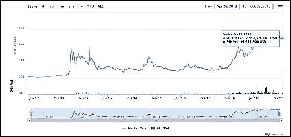

这表明，在撰写本文时，综合替代币市值超过了20亿美元。

当前前十大币种的市值（截至2016年10月）如下所示：

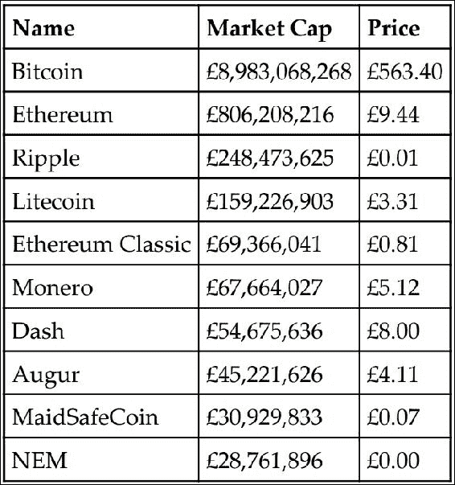

数据来源于 https://coinmarketcap.com/

替代币引入了各种因素和新概念。许多概念甚至在比特币之前就已经发明，但是随着比特币的出现，不仅首次引入了新概念，比如拜占庭将军问题的解决方案，而且以巧妙的方式使用了之前的概念，比如哈希现金和工作证明，并且备受瞩目。从那时起，随着替代币项目的推出，各种新技术和概念得以开发和推出。为了了解替代加密货币的当前格局，首先必须理解一些理论概念。在以下部分，向读者介绍了一些随替代币项目引入的新概念。

# 理论基础

在本节中，向读者介绍了过去几年引入不同替代币时开发的各种理论概念。

## 工作证明的替代方案

**工作证明**（**PoW**）方案在加密货币背景下首次用于比特币，并作为一种机制，提供了保证矿工已经完成了所需数量的工作以找到一个区块。这反过来为区块链提供了去中心化、安全性和稳定性。此外，这也是比特币中提供去中心化分布式共识的主要手段。PoW方案需要具有一个被称为*进度自由*的非常理想的属性，这基本上意味着消耗计算资源的奖励应该是随机的，并且与矿工所做的贡献成比例。在这种情况下，即使是那些计算能力相对较低的矿工也有一定机会赢得区块奖励。术语*进度自由*是由*阿尔温德·纳拉扬*等人在书籍*比特币和加密货币技术*中引入的。挖掘计算难题的其他要求包括可调整的难度和快速验证。可调整的难度确保了区块链上的挖矿难度目标能够根据增加的哈希功率和用户数量进行调节。快速验证是一种属性，意味着挖掘计算难题应该易于验证且快速。 PoW方案的另一个方面，特别是比特币中使用的方案（双SHA-256），是自ASIC推出以来，算力正在向那些能够负担得起大规模ASIC矿场运营的矿工或矿池倾斜，这挑战了比特币去中心化的核心理念。

有一些替代方案被提出，例如抗ASIC谜题，设计得这样一种谜题，使得构建ASIC来解决这个谜题变得不可行，且不会比通用硬件带来重大的性能提升。用于此目的的一种常见技术是应用一类称为*内存硬*计算难题的计算难题。这种方法的核心思想是，由于解决谜题需要大量内存，因此在基于ASIC的系统上实现它是不可行的。这种技术最初在Litecoin和Tenebrix中使用，其中Scrypt哈希函数被用作ASIC抗性PoW方案。尽管最初将此方案宣传为抗ASIC，但最近Scrypt ASIC现已推出，否定了Litecoin的原始声明。

抵抗 ASIC 的另一种方法是需要计算多个哈希函数以提供 PoW。这也称为链式哈希方案。这个想法背后的理念是，在 ASIC 上设计多个哈希函数是不太可行的。最常见的例子是 Dash 实现的 X11 内存硬函数。X11 由 11 个 SHA3 参与者组成，其中一个算法将计算的哈希输出到下一个算法，直到所有 11 个算法都按顺序使用。这些算法包括 blake、bmw、groestl、jh、keccak、skein、luffa、cubehash、shavite、simd 和 echo。

初始时，这种方法确实对 ASIC 的发展提供了一些抵抗，但现在 ASIC 矿工机已经商业化，并支持 X11 和类似方案的挖矿。最近的一个例子是 ASIC Baikal Miner，它支持 X11、X13、X14 和 X15 挖矿。其他例子包括矿工，如 iBeLink DM384M X11 矿工和 Pinidea X11 ASIC 矿工。

或许另一种方法可能是设计*自变异难题*，它可以智能地或随机地改变 PoW 方案或其要求，作为时间函数。这将使其几乎不可能在 ASIC 中实现，因为每个功能都需要设计多个 ASIC，并且随机变化的方案几乎不可能在 ASIC 中处理。目前尚不清楚如何在实践中实现这一点。

PoW 有各种缺点，其中最大的缺点是能源消耗。据估计，到 2020 年，比特币矿工所消耗的总电力将相当于丹麦的电力消耗。这是巨大的，而且所有的能源在某种程度上都被浪费了；事实上，除了挖矿之外，没有提供任何有用的用途。环保主义者对这种情况提出了真正的担忧。

有人提出 PoW（工作量证明）难题可以设计成具有两个目的。首先，它们的主要目的是在共识机制中，其次是执行一些有用的科学计算。这样一来，这些方案不仅可以用于挖矿，而且还可以帮助潜在地解决其他科学问题。这种有用工作的证明最近由 Primecoin 实践，其中的要求是找到特殊的素数链，称为 Cunningham 链和双生链。由于素数分布的研究在物理等科学学科中具有特殊意义，通过挖掘 Primecoin，矿工不仅可以获得区块奖励，还可以帮助找到特殊的素数。

### 存储证明

又称为不可检索性证明，这是另一种需要存储大量数据的有用工作证明类型。由微软研究引入，此方案提供了分布式存储归档数据的有用好处。矿工需要存储大数据的伪随机选择子集以执行挖矿。

### 权益证明

这个证明也被称为虚拟挖矿。这是另一种挖矿难题，被提出作为传统PoW方案的替代方案。它首次在2012年8月的PeerCoin中提出。在这个方案中，用户需要证明拥有一定数量的货币（硬币），从而证明他们对硬币有一份利益。权益证明的最简单形式是，对于那些可以明确拥有更多数字货币的用户，挖矿相对容易。这种方案的好处是双重的；首先，相对于购买高端ASIC设备，获取大量数字货币相对困难，其次，它可以节省计算资源。已经提出了各种形式的权益证明，并且以下简要讨论。

#### 硬币年龄证明

硬币的年龄是硬币上次被使用或持有的时间。这与通常的权益证明形式不同，后者会使拥有最高权益的用户挖矿变得更容易。在基于硬币年龄的方法中，每次挖掘一个区块时，硬币的年龄（硬币年龄）都会被重置。矿工会因为持有而不花费硬币而获得奖励一段时间。这个机制已经以一种创造性的方式与PoW结合在Peercoin中实现。挖矿难题（PoW）的难度与硬币年龄成反比，这意味着如果矿工使用*硬币权益*交易消耗了一些硬币年龄，那么PoW要求会减轻。

#### 存款证明

这个方案的核心思想是，由矿工新铸造的区块在一定时间内无法使用。更确切地说，硬币在挖矿过程中被锁定一定数量的区块。该方案通过允许矿工以冻结一定数量的硬币一段时间的代价来执行挖矿。这是一种权益证明的类型。

#### 燃烧证明

作为与计算能力的替代支出，实际上是销毁一定数量的比特币以获得等值的替代币的燃烧证明。在启动新的币项目时，这通常被用作提供公平的初始分配手段。这可以被认为是一种替代的挖矿方案，新币的价值来自于之前销毁了一定数量的币。

#### 活动证明

这个方案是PoW和权益证明的混合体。在这个方案中，区块最初是通过PoW产生的，但然后每个区块会随机分配三个需要对其进行数字签名的利益相关者。后续区块的有效性取决于成功签署之前随机选择的区块。

不过，有一个可能存在的问题，即*漠视问题*，在这个问题中创建区块链分叉是微不足道的。这是可能的，因为在PoW中，挖矿需要适当的计算资源，而在PoS中则没有这样的要求；结果是，攻击者可以尝试在多条链上使用相同的代币进行挖矿。

### 非外包谜题

这个谜题背后的关键动机是为了对抗矿池的发展。正如之前所讨论的那样，矿池按照它们消耗的计算能力比例奖励所有参与者。然而，在这个模型中，矿池操作员是所有奖励都归属的中央权威，并且可以强制执行某些规则。而且，在这个模型中，所有矿工之间只相互信任，因为他们共同为了矿池经理获得奖励的共同目标而努力。非外包谜题是一种允许矿工为自己主张奖励的方案；因此，由于匿名矿工之间的固有不信任，矿池形成变得不太可能。

## 难度调整和重新定位算法

随着比特币和替代币的出现，另一个概念是调整难度的算法。在比特币中，难度目标简单地通过以下方程计算；但是，其他硬币要么开发了自己的算法，要么实现了修改版的比特币难度算法:

*T = (上一个时间 * 当前时间) / (2016 * 10 min)*

比特币中难度调节的思想是，挖掘2016个区块大约需要2周时间（区块之间的时间应该大约为10分钟）。如果挖掘2016个区块花费的时间超过2周，则难度会减少；如果挖掘2016个区块的时间少于两周，则难度会增加。当ASIC矿机的速率因高区块生成速度而增长时，难度会呈指数增加，这是PoW算法的一个缺点，不具备ASIC抗性。这导致了挖矿算力的集中。这也带来了另一个问题；如果一个新币现在以与比特币的SHA256算法相同的工作量证明开始，那么一个恶意用户可以轻而易举地使用ASIC矿机并控制整个网络。如果对新替代币没有足够的兴趣且有人决定通过使用充足的计算资源来接管网络，这种攻击可能会变得更加可行。如果其他具有类似计算能力的矿工也加入到替代币网络中，这可能就不再是一个可行的攻击，因为矿工们会互相竞争。此外，多重矿池带来更大的威胁，因为一组矿工可以自动切换到变得有利可图的货币。这种现象被称为**矿池跳跃**，可以对区块链产生不利影响，从而影响替代币的增长。矿池跳跃对网络造成不利影响，因为矿池跳跃者只会在难度较低并且可以快速获得奖励时加入网络；一旦难度上升（或重新调整），他们就会*跳出*，然后在难度重新调整后再次加入。例如，如果一个多重矿池迅速耗尽资源挖掘一种新币，难度会迅速增加；当多重矿池离开货币网络时，它几乎无法使用，因为现在难度已经增加到一个水平，对于独立矿工来说不再有利可图，也无法维持。这个问题的唯一解决方法是发起一个硬分叉，但这通常对社区是不可取的。

有一些算法已经出现来解决这个问题，并在后面进行了讨论。所有这些算法都是基于根据哈希率变化重新调整各种参数的想法；这些参数包括先前区块的数量、先前区块的难度、调整比例以及可以重新调整难度的数量。在接下来的部分，读者将介绍一些正在使用和提出给各种替代币的难度算法。

### 木本重力井

此算法用于各种替代币中以调节难度。这最初是在Megacoin中首次引入的，并用于每个区块自适应地调整网络的难度。该算法的逻辑如下所示：

*KGW = 1 + (0.7084 * pow((double(PastBlocksMass)/double(144)), -1.228))*

基本上，该算法在一个循环中运行，遍历一组预定的块（`PastBlockMass`）并计算一个新的重新调整值。该算法背后的核心思想是开发一种自适应难度调节机制，以响应哈希率的急剧波动。**Kimoto Gravity Well** (**KGW**) 确保区块之间的时间保持大致相同。在比特币中，难度每2016个块调整一次，但在KGW中，难度每个区块都会调整。

这种算法容易受到时间扭曲攻击的影响，这允许攻击者暂时享受较低的难度来创建新的区块。这种攻击会在一个时间窗口内使难度降低，攻击者可以轻松地以快速的速度生成许多硬币。

### 暗重力波

**暗重力波** (**DGW**) 是一种新的算法，旨在解决KGW算法中的某些缺陷，如时间扭曲攻击。这最初是在之前被称为Darkcoin的Dash中引入的。它利用多个指数移动平均和简单移动平均来实现更平滑的重新调整机制。该公式如下所示：

*2222222/ (((难度+2600)/9)^2)*

这个公式是在 Dash 币和其他各种替代币中实现的一种调整难度的机制。

DGW 3.0 版是该算法的最新实现，与 KGW 相比，它允许改进的难度重新调整。

### 数字盾

这是另一种最近在 Zcash 中使用的调整难度算法，经过了适当的实验，并且有些微的变化。该算法通过遍历固定数量的先前区块来计算它们生成所需的时间，然后通过将实际时间跨度除以目标时间的平均值来重新调整难度到上一个区块的难度。在这个方案中，重新调整速度要快得多，而且对于哈希率的突然增加或减少的恢复也很快。这种算法可以防止多池，它可以导致哈希率的快速增加。网络难度根据实现的方式每个区块或每分钟重新调整一次。关键的创新是比 KGW 更快的重新调整时间。

### MIDAS

**多间隔难度调整系统** (**MIDAS**) 是一个相对于先前讨论的算法更为复杂的算法。这种方法对哈希率的突然变化反应更快。该算法还提供了对时间扭曲攻击的保护。

许多货币的出现是为了解决比特币的各种限制。以下简要讨论了比特币的限制。

# 比特币的限制

比特币的各种限制也引发了对替代币的兴趣，这些替代币专门开发来解决比特币的限制。最突出和广泛讨论的限制是比特币的匿名性缺乏。以下详细讨论了这个限制。

## 隐私和匿名性

由于区块链是所有交易的公开账本，并且是公开可用的，因此分析它变得非常容易。结合交易分析，可以将交易追溯到其源 IP 地址，从而可能揭示交易的发起者。这是从隐私的角度来看一个很大的问题。尽管在比特币中，为每笔交易生成一个新地址是一种推荐和常见的做法，从而允许一定程度的不可链接性，但这还不够，已经开发并成功使用各种技术来追踪整个网络中的交易流动，并将其追溯到其发起者。研究人员已经使用各种分析区块链的方法，如交易图、地址图和实体图，将用户与交易联系起来，从而引起了隐私问题。上述分析技术可以通过使用关于交易的公开可用信息并将其与实际用户联系起来进一步丰富。有开源区块解析器可用，可以从区块链数据库中提取交易信息、余额和脚本。一个可在 [https://github.com/mikispag/rusty-blockparser](https://github.com/mikispag/rusty-blockparser) 上找到的解析器是用 Rust 编写的，提供了先进的区块链分析功能。这项工作的早期版本称为 BitIodine，但已不再积极开发。

已经提出了各种提议来解决比特币的隐私问题。这些提议分为三类：混合协议、第三方混合网络和固有匿名性。对每个类别的简要讨论如下。

### 混合协议

这些方案用于为比特币交易提供匿名性。在这个模型中，使用混合服务提供商（中间人或共享钱包）。用户将硬币存入这个共享钱包作为押金，然后共享钱包可以将其他一些硬币（由其他用户存入的相同价值的硬币）发送到目的地。用户还可以通过这个中间人接收其他人发送的硬币。这样，输出和输入之间的链接就不复存在，交易图分析将无法揭示发送者和接收者之间的真实关系。

CoinJoin 是混合协议的一个例子，其中两个交易被合并成一个单一的交易，同时保持输入和输出不变。CoinJoin 背后的核心思想是构建一个由所有参与者签名的共享交易。这种技术提高了所有参与交易的参与者的隐私：

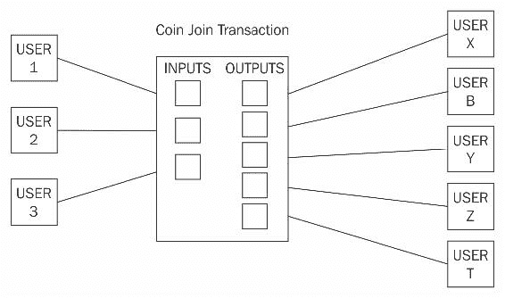

CoinJoin 交易，三个用户将他们的交易合并成一个更大的 CoinJoin 交易

### 第三方混合协议

有各种第三方混合服务可用，但如果服务是集中的，那么它存在跟踪发送者和接收者之间映射的风险，因为混合服务了解所有输入和输出。除此之外，完全集中化的矿工甚至会造成服务管理员窃取比特币的风险。

有各种各样复杂程度的服务可用，比如CoinShuffle、Coinmux以及Dash（coin）中的dark send，它们都是基于CoinJoin（混合）交易的想法。 CoinShuffle是传统混合服务的分散替代品，因为它不需要信任的第三方。

基于CoinJoin的方案，然而，存在一些弱点，其中最突出的是可能出现的拒绝服务攻击，因为最初承诺签署交易的用户现在没有提供他们的签名，从而延迟或停止联合交易。

### 内在的匿名性

该类别包括天生支持隐私并内置在货币设计中的货币。最流行的是Zcash，这在本章后面将详细讨论。其他示例包括Monero，它利用环签名提供匿名服务。

下一节将介绍已实施或拟议的各种增强措施，以扩展比特币协议。

## 比特币上的扩展协议

已经提出并实施了几个协议，以增强并扩展比特币协议，并用于各种其他用途，而不仅仅是作为一种虚拟货币。

### 彩色比特币

彩色比特币是一组已开发出来的方法，用于在比特币区块链上表示数字资产。彩色比特币口语上指更新带有表示数字资产（智能财产）的一些元数据的比特币。该比特币仍然像比特币一样运作，但另外携带了一些表示某些资产的元数据。这种机制允许发行和追踪特定的比特币。如有必要，可以使用比特币的`OP_RETURN`操作码记录元数据，或者选择在多重签名地址中。如果需要，这些元数据也可以加密以解决任何隐私问题。彩色比特币可以用来代表各种资产，包括但不限于商品、证书、股票、债券和投票。还应该注意，为了使用彩色比特币，需要一个解释彩色比特币的钱包，普通的比特币钱包将无法正常工作。可以使用[https://www.coinprism.com/](https://www.coinprism.com/)提供的服务在线设置彩色比特币钱包。使用这项服务，可以创建和发行各种类型的数字资产通过彩色比特币。

彩色币的理念非常诱人，因为它不需要对现有的比特币协议进行任何修改，可以利用已经存在的安全比特币网络。除了传统的数字资产表示形式外，还有创建*智能资产*的可能性，它们可以根据其定义的参数和条件进行行为。这些参数包括时间验证、转让限制和费用。这开启了创建智能合约的可能性。

一个主要的用例可能是在区块链上发行金融工具。这将确保低交易费用，有效且数学上安全的所有权证明，无需中介即可进行快速转让，并且立即向投资者支付股息。

彩色币提供了丰富的API，网址为[http://coloredcoins.org/](http://coloredcoins.org/)。

### Counterparty

这是另一个可以用来创建充当加密货币的自定义代币的服务，可用于各种用途，例如在比特币区块链上发行数字资产。这是一个非常强大的平台，它在比特币区块链的基础上运行，但发展了自己的客户端和其他组件以支持发行数字资产。体系结构包括Counterparty服务器、Counterblock、Counterwallet和Armory_utxsvr。Counterparty基于彩色币的相同理念，通过向常规比特币交易嵌入数据来支持数字资产的处理，但提供了更丰富的库和强大的工具集来支持数字资产的处理。这种嵌入也被称为嵌入式共识，因为Counterparty交易嵌入到比特币交易中。嵌入数据的方法是使用比特币中的`OP_RETURN`操作码。

由Counterparty产生和使用的货币被称为XCP，并且作为运行合约的费用。在撰写本文时，其价格为2.78美元。通过使用先前讨论的燃烧证明方法创建了XCP。

Counterparty允许使用Solidity语言在以太坊上开发智能合约，并与比特币区块链进行交互。为了实现这一点，使用BTC Relay作为在以太坊和比特币之间提供互操作性的手段。这是一个聪明的概念，以太坊合约可以通过BTC Relay与比特币区块链和交易进行通信。Relayer（运行BTC Relay的节点）获取比特币块头并将它们中继到以太坊网络上的智能合约，该合约验证PoW。此过程验证了在比特币网络上发生了一笔交易。网址为[http://btcrelay.org/](http://btcrelay.org/)。

从技术角度来看，这基本上是一个以太坊合约，能够像比特币简单支付验证轻量级客户端一样存储和验证比特币区块头，它们使用布隆过滤器。SPV客户端在上一章进行了详细讨论。这个概念可以通过下图进行可视化：

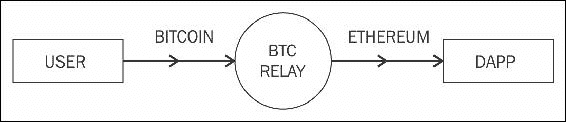

BTC中继概念

### 注意

Counterparty 可以在 [http://counterparty.io/](http://counterparty.io/) 找到。

## 山寨币的发展

从编程角度来看，简单地通过分叉比特币或其他币种的源代码可以非常轻松地启动山寨币项目，但这可能还不够。当启动一个新的币种项目时，有若干事项需要考虑，以确保成功启动和币种的长期发展。通常，代码库是用C++编写的，就像比特币一样，但几乎任何语言都可以用于开发币种项目，例如Golang或Rust。

编写代码或对现有币种的代码进行分叉是相对简单的部分，具有挑战性的问题是如何启动一种新货币，以便吸引新的投资者和用户。通常，为了启动一个新的币种项目，会采取以下步骤。

从技术角度来看，如果是分叉其他币种的代码，例如比特币，可以更改各种参数以有效地创建一种新币。这些参数需要进行*调整*或引入以创建新币。这些参数可以包括但不限于以下内容。

### 共识算法

可以选择共识算法：**工作量证明**（**PoW**），如比特币所用，或者**权益证明**（**PoS**），如Peercoin所用。

### 哈希算法

这可能是SHA256、Scrypt、X11、X13、X15，或者任何其他足够适合作为共识算法的哈希算法。

### 难度调整算法

在这个类别中有多种选项可以提供难度重定向机制。最显著的例子是KGW、DGW、Nite's Gravity Wave和DigiShield。此外，这些算法都可以根据需求进行调整以产生不同的结果；因此，可能会有许多变体。

### 区块间时间

这是生成每个区块之间的时间。在比特币中，区块每10分钟生成一次，在莱特币中则是每2.5分钟。可以使用任何值，但适当的值通常在几分钟之间；如果生成时间过快，可能会使区块链不稳定，如果过慢，则可能无法吸引太多用户。

### 区块奖励

区块奖励是给解决挖矿难题的矿工的，并允许他们拥有包含奖励的Coinbase交易。最初在比特币中这个奖励是50个币，现在许多山寨币将这一参数设定得非常高；例如，在狗狗币中，目前是10,000个。

### 奖励减半率

这是另一个重要因素；在比特币中，每4年减半一次，现在设置为12.5比特币。这是一个可变的数字，可以根据需求设置为任何时间段，或者根本不设置。

### 区块大小和交易大小

这是另一个重要因素，它决定了网络上的交易率可以有多高或有多低。比特币的区块大小限制为1 MB，但在另类币中，它可以根据需求变化。

### 利率

此属性仅适用于 PoS 系统，在该系统中，持有者可以根据网络定义的利率，以持有在网络上作为 PoS 来保护网络的硬币数量获得利息。

### 币龄

此参数定义了硬币必须保持未使用多长时间，以使其有资格被视为可以进行投票的。

### 货币的总供应量

这个数字设定了可以生成的货币的总限制。例如，比特币的限制是2100万，而 Dogecoin 的限制是无限的。这个限制是由上面讨论的区块奖励和减半时间表确定的。

创建自己的虚拟货币有两种选择：分叉现有的已建立的加密货币源代码或从头开始编写一个新的。后者不太流行，但第一种选择更容易，并且在过去几年已经允许创建了许多虚拟货币。基本上，这个想法是首先分叉加密货币源代码，然后在源代码的不同战略位置进行适当的更改，从而有效地创建一个新的货币。

在下一节中，读者将介绍一些另类币项目。在本章节中不可能涵盖所有替代货币，但下面讨论了一些精选的货币。选择是基于其长期性、市值和创新。每个货币都从不同的角度进行讨论，如理论基础、交易和挖矿。

# Namecoin

Namecoin 是比特币源代码的第一个分叉。Namecoin 背后的关键思想不是生产一种替代币，而是提供改进的去中心化、抗审查、隐私、安全性和更快的去中心化命名。去中心化命名服务旨在提供对互联网传统**域名系统**（**DNS**）协议的固有限制的响应，例如传统的DNS协议在互联网上的使用的缓慢和集中控制。Namecoin 也是对之前章节中简要讨论的 Zooko 三角形的第一个解决方案。

Namecoin 主要用于提供注册键/值对的服务。Namecoin 的一个主要用途是，它可以提供一种由区块链驱动的去中心化**传输层安全性**（**TLS**）证书验证机制，通过基于区块链的分布式和去中心化共识。

它基于与比特币引入的相同技术，但具有自己的区块链和钱包软件。Namecoin核心的源代码可在[https://github.com/namecoin/namecoin-core](https://github.com/namecoin/namecoin-core)找到。

总之，Namecoin提供以下三项服务：

+   名称（密钥）的安全存储和转让

+   通过将最多520字节的数据附加到名称上，赋予名称一些价值

+   数字货币（Namecoin）的发行

Namecoin还首次引入了合并挖矿，这使得矿工可以同时在多条链上进行挖矿。这个想法很简单但非常有效：矿工创建一个Namecoin区块并生成该区块的哈希。然后，该哈希被添加到比特币区块中，矿工解决该区块的难度等于或大于Namecoin区块的难度，以证明已经为解决Namecoin区块做出了足够的工作。

更准确地说，Coinbase交易被用来包含来自Namecoin（或任何其他代币）的交易哈希。挖矿任务是解决包含对Namecoin（或任何其他代币）区块的哈希指针的比特币区块。这在下面的图表中显示。如果矿工成功解决比特币区块难度级别的哈希，比特币块就建成并成为比特币网络的一部分。在这种情况下，比特币区块链将忽略Namecoin哈希。另一方面，如果矿工在Namecoin区块链难度级别解决了一个区块，会在Namecoin区块链中创建一个新区块。这种方案的核心好处在于，矿工消耗的所有计算能力都有助于保护Namecoin和比特币：

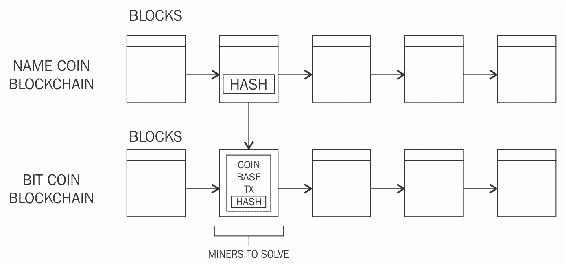

合并挖矿图表

## 交易Namecoins

根据[https://coinmarketcap.com/](https://coinmarketcap.com/)，Namecoin的当前市值为£2,736,537，可以在各种交易所（如[https://cryptonit.net/](https://cryptonit.net/)）购买和出售。通过简单的在线搜索可以找到其他各种交易所。

## 获取Namecoins

尽管Namecoins可以独立挖矿，但通常作为比特币挖矿的一部分进行挖矿，利用上述合并挖矿技术。这样，Namecoin可以作为比特币挖矿的副产品而被挖掘。独立挖矿已不再盈利，从下面的难度图表可以明显看出；因此建议进行合并挖矿，使用矿池，或甚至使用加密货币交易所购买Namecoin。

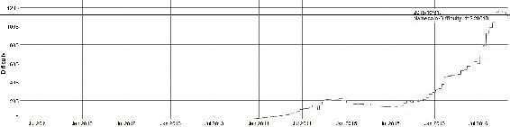

Namecoin难度显示在：https://bitinfocharts.com/comparison/difficulty-nmc.html

一些矿池（如[https://slushpool.com](https://slushpool.com/)）也提供合并挖矿的选项。这使得矿工可以主要挖掘比特币，同时也因此获得Namecoin。

另一种快速获取一些 Namecoin 的方法是用现有的货币与 Namecoin 进行交换，例如，如果您已经拥有一些比特币或其他可用于与 Namecoin 交换的加密货币。有一个名为 [https://shapeshift.io/](https://shapeshift.io/) 的在线服务可提供此服务。该服务允许使用简单易用的界面从一种加密货币转换为另一种加密货币。

例如，支付 BTC 以接收 NMC 如下所示：

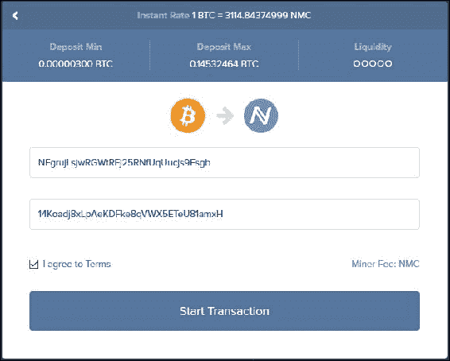

点击 **开始交易** 后，交易开始并指示用户将比特币发送到特定的比特币地址。用户发送所需金额后，转换过程如下所示：

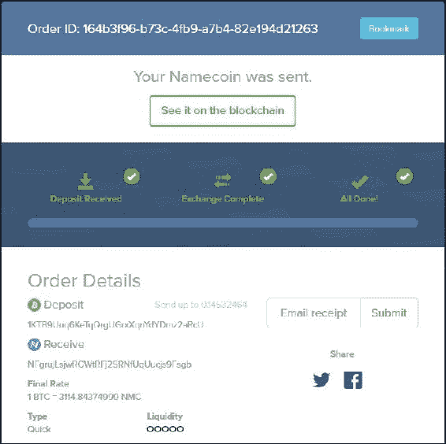

当进程完成时，可以在 Namecoin 钱包中查看交易记录：

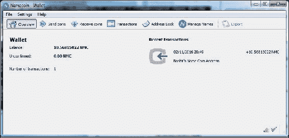

确认交易可能需要一些时间；在此期间，不可能使用 Namecoins 管理名称。一旦 Namecoins 在钱包中可用，可以使用 **管理名称** 选项来生成 Namecoin 记录。

## 生成 Namecoin 记录

Namecoin 记录以键值对的形式存在。名称是一个形如 `d/examplename` 的小写字符串，而值是一个区分大小写的、UTF-8 编码的 JSON 对象，最大长度为 520 字节。名称应符合 RFC1035 ([https://tools.ietf.org/html/rfc1035](https://tools.ietf.org/html/rfc1035)) 标准。通用的 Namecoin 名称可以是一个任意的二进制字符串，最长为 255 字节，附带 1024 位的相关识别信息。Namecoin 链上的记录仅在大约 200 天或 36,000 个区块后有效，之后需要更新。Namecoin 还引入了可以使用 Namecoin 注册并可以使用专用的 Namecoin 启用解析器浏览的 `.bit` 顶级域。如下截图所示的 Namecoin 钱包软件可用于注册 `.bit` 域名。

输入名称，并在按下 **提交** 按钮后，将要求配置信息，如 DNS、IP 或身份：

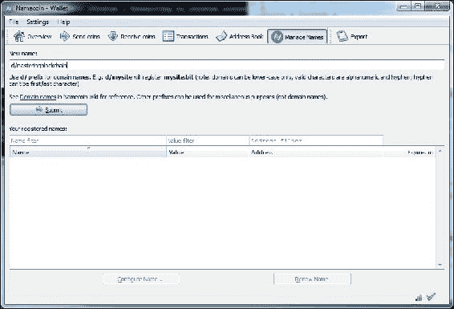

如下截图所示，**掌握区块链**将在 Namecoin 区块链上注册为 `masteringblockchain.bit`：

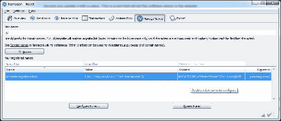

# Litecoin

Litecoin 是基于比特币源代码的一个分支，于 2011 年发布。它使用 Scrypt 作为 PoW，最初在 Tenebrix 币中引入。由于其更快的出块时间为 2.5 分钟，Litecoin 比比特币允许更快的交易。此外，由于更快的出块时间，大约每 3.5 天就会进行一次难度调整。总共发行 8400 万个硬币。

Scrypt 是一个顺序内存硬函数，是第一个替代 SHA-256 基础 PoW 算法的函数。它最初被提议作为基于密码的密钥派生函数 `PBKDF`。其关键思想是，如果函数需要大量内存来运行，那么定制硬件（如 ASIC）将需要更多的 VLSI 区域，这是不可行的。Scrypt 算法需要在内存中保存大量伪随机位，并以伪随机方式从中派生密钥。该算法基于一种称为 **时间-内存折衷**（**TMTO**）的现象。如果内存需求放松，那么会导致增加计算成本。换句话说，如果给予更多内存，则 TMTO 会缩短程序的运行时间。这种折衷使得攻击者无法获得更多内存，因为这是昂贵且难以在定制硬件上实现的，或者如果攻击者选择不增加内存，则由于高处理要求而导致算法运行缓慢。

Scrypt 使用以下参数生成派生密钥（Kd）：

+   `口令`：这是一串要进行哈希的字符。

+   `盐`：这是提供给 Scrypt 函数（通常是所有哈希函数）的随机字符串，以抵御使用彩虹表的暴力字典攻击。

+   `N`：这是一个内存/CPU 成本参数，必须是大于 1 的 2 的幂。

+   `P`：并行化参数

+   `R`：块大小参数

+   `dkLen`：派生密钥的预期长度（以字节为单位）

形式上，此函数可写为：

*Kd = scrypt (P, S, N, P, R, dkLen)*

在应用核心 Scrypt 函数之前，算法以 `P` 和 `S` 作为输入，并应用 **PBKDF2** 和基于 SHA-256 的 HMAC。然后，输出馈送到称为 **ROMix** 的算法，该算法内部使用 Blockmix 算法利用 Salsa20/8 核心流密码来填充需要大内存才能操作的内存，从而强制实施顺序内存硬性质。

从算法的这一步骤得到的输出最终再次馈送到 `PBKDF2` 函数中，以生成派生密钥。该过程如下图所示：

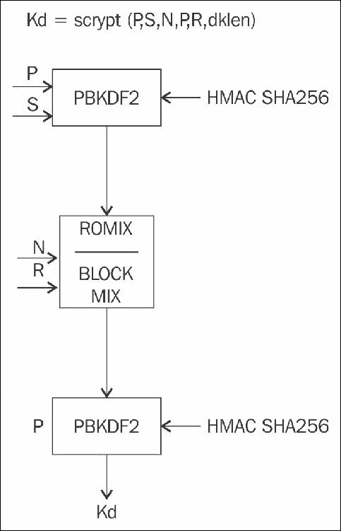

Scrypt 算法

Scrypt 在 litecoin 挖矿中使用特定参数，其中 N= 1024，R = 1，P=1，而 S= 随机 80 字节产生一个 256 位的输出。

由于选择了这些参数，为莱特币挖矿开发ASIC并不是很困难。在用于莱特币挖矿的ASIC中，可以开发一个顺序逻辑，将数据和随机数作为输入，并应用**PBKDF2**算法与**HMAC-SHA256**；然后，生成的比特流被提供给`SALSA20/8`函数，该函数生成一个哈希值，再次输入到`PBKDF2`和`HMAC-256`函数中生成256位哈希输出。与比特币PoW相同，在Scrypt中，如果输出哈希值小于目标哈希值（在开始时作为输入传递，存储在内存中，并在每次迭代中检查），则该函数终止；否则，随机数递增，进程再次重复，直到找到一个小于难度目标的哈希值：

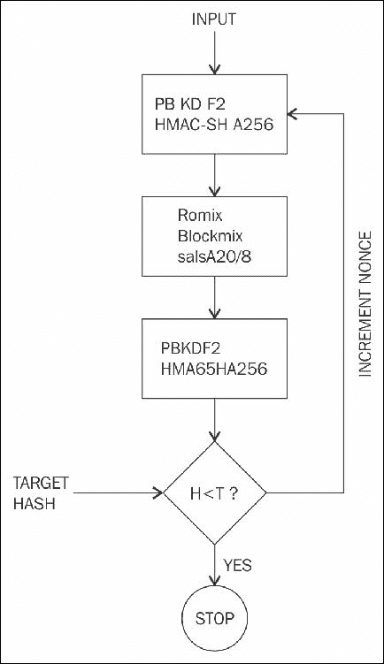

Scrypt ASIC设计简化流程图

+   **莱特币交易**: 与其他数字货币一样，莱特币的交易很容易在各种在线交易所进行。莱特币当前的市值为£161,239,005。当前莱特币价格为£3.25/LTC。

+   **挖矿**: 莱特币的挖矿可以独自进行，也可以在矿池中进行。目前，用于Scrypt算法的ASIC已经问世，通常用于挖掘莱特币。

与许多其他数字货币一样，莱特币在CPU上的挖矿已不再盈利。有在线云挖矿服务提供商和可用的ASIC矿机可用于挖掘莱特币。莱特币的挖矿从CPU开始，通过GPU挖矿设备的发展，最终现在已经达到了需要使用专业ASIC矿机才能挖矿的程度，例如来自EhsMiner的Asic Scrypt Miner Wolf。一般来说，即使使用ASIC，也最好在矿池中挖矿，而不是独自挖矿，因为矿池采用的比例奖励方案使得矿池挖矿比独自挖矿更有利可图。这些矿工可以在Scrypt算法上产生2 Gh/s的哈希率。

+   **软件源代码和钱包**: 莱特币的源代码可以在[https://github.com/litecoin-project/litecoin](https://github.com/litecoin-project/litecoin)获取。莱特币钱包可以从[https://litecoin.org/](https://litecoin.org/)下载，并且可以像比特币核心客户端软件一样使用。

# 质数币

Primecoin是市场上第一个引入有用PoW（与比特币的基于SHA256的PoW相对）的数字货币。 Primecoin使用搜索素数作为PoW。 并非所有类型的素数都满足被选为PoW的要求。 三种类型的素数（称为第一类康宁汉链，第二类康宁汉链和双生链）符合PoW算法的要求，可用于加密货币中。 通过Primecoin区块链中的连续难度评估方案动态调整难度。基于素数的PoW的高效验证也非常重要，因为如果验证很慢，则PoW就不适合。 因此，选择素数链作为PoW，因为随着链长度的增加，查找素数链变得困难，而验证仍然足够快，可以用作高效的PoW算法。 重要的是，一旦PoW在一个区块上被验证，就不能在另一个区块上被重复使用。 通过将*工作证明证书*与父块的标题进行哈希组合，在Primecoin中完成了这一点。 PoW证书是通过将素数链链接到区块头哈希而生成的。 还要求区块头的原点可被区块头哈希整除。 如果可以，就进行除法，然后商用作PoW证书。 PoW算法的可调节难度的另一个特性是每个区块都进行难度调整，而不是像比特币那样每2,016个区块进行一次。 这是一种与比特币相比*更顺畅*的方法，并且在哈希功率突然增加的情况下允许重新调整。 此外，生成的硬币总数由社区驱动，并且Primecoin能够生成的硬币数量没有具体限制。

## 交易Primecoin

Primecoin可以在主要虚拟货币交易所交易。 撰写时，Primecoin的市值为£828,002。 它并非很大，但由于Primecoin基于一个新颖的想法，并且有一个专注的社区支持，因此仍继续保持一定的市场份额。

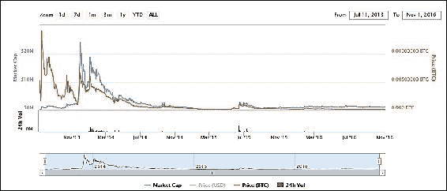

## 挖矿指南

第一步是下载一个钱包。 Primecoin支持钱包内的本地挖矿，就像原始比特币客户端一样，也可以通过各种在线挖矿服务提供商在云中挖矿。

以下是一个简短的Windows指南：

1.  第一步是从以下地址下载Primecoin钱包：[http://primecoin.io/index.php](http://primecoin.io/index.php).

1.  安装钱包并与网络同步后，可以通过以下步骤开始挖矿。 在Primecoin钱包中，可以通过单击**帮助**菜单并选择**调试**窗口菜单项来打开调试窗口。 通过在控制台窗口中键入`help`，还可以获得其他帮助：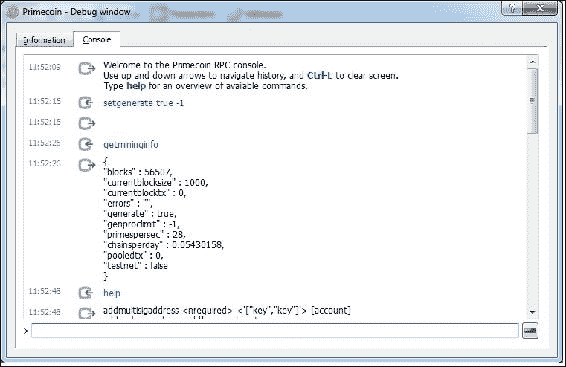

    调试窗口用于启用 Primecoin 挖矿功能

1.  一旦前述命令成功执行，挖矿将以独立模式开始。这可能并不十分有利，但挖矿者可以使用在线挖矿池：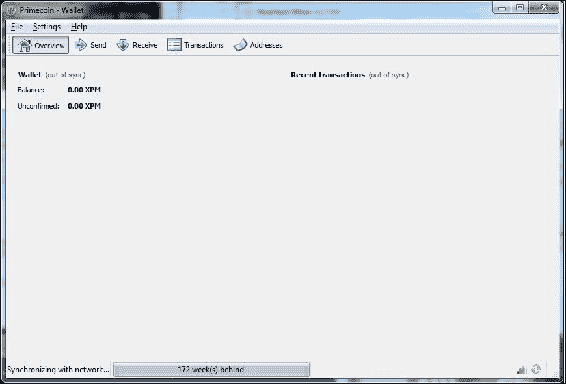

    Primecoin 钱包软件，与网络同步

Primecoin 源代码可在 [https://github.com/primecoin/primecoin](https://github.com/primecoin/primecoin) 上获取。尽管 Primecoin 引入的 PoW 具有科学意义，但看起来没有活跃的开发正在进行以进一步开发 Primecoin。读者可以通过阅读 *Sunny King*（化名）的 Primecoin 白皮书进一步探索 Primecoin：[http://primecoin.io/bin/primecoin-paper.pdf](http://primecoin.io/bin/primecoin-paper.pdf)。

# Zcash

Zcash 在2016年10月28日推出。这是第一种使用特定类型的零知识证明（称为**零知识简洁非交互式知识参数**（**zk-SNARKs**））为用户提供完全隐私的货币。这些证明非常短并且易于验证；然而，设置初始的公共参数是一个复杂的过程。后者包括两个密钥：证明密钥和验证密钥。该过程需要随机选择一些随机数以构建公共参数。问题在于这些随机数，也称为*有毒废物*，必须在参数生成后被销毁以防止 Zcash 的伪造。为此，Zcash 团队提出了一种多方计算协议，以从独立位置协作生成所需的公共参数，以确保*有毒废物*不会产生。由于所需的公共参数必须由 Zcash 团队创建，这意味着仪式的参与者是受信任的。这就是为什么仪式非常公开并采用多方计算机制进行的原因。该机制具有一个特性，那就是为了破坏最终参数，所有仪式参与者都必须被破坏。仪式完成后，所有参与者都会销毁用于私钥生成的设备。这一举动消除了设备上参与者私钥的任何痕迹。

zk-SNARKs 必须满足完整性、声音性、简洁性和非互动性的属性。*完整性*意味着存在一个明确的策略，使证明者能够使验证者相信一个断言是真实的。另一方面，*声音性*意味着没有证明者可以说服验证者一个假的陈述是真实的。*简洁性*意味着证明者和验证者之间传递的消息非常小。最后，非互动属性意味着可以在没有任何互动或非常少的互动的情况下验证断言的正确性。此外，作为零知识证明，还需要满足*零知识*的属性（在 [第 3 章](ch03.html "第 3 章。密码学和技术基础")，*密码学和技术基础*中讨论）。

Zcash 开发人员引入了一个称为**去中心化匿名支付方案**（**DAP 方案**）的概念，该方案用于 Zcash 网络以实现直接和私密支付。交易不会透露有关支付的来源、目的地和金额的任何信息。Zcash 中有两种类型的地址，z-addr 和 t-addr。Z 地址基于零知识证明并提供隐私保护，而 T 地址类似于比特币的地址。

Zcash 使用一种称为**非对称 PoW**（**Equihash**）的高效 PoW 方案，它基于广义生日问题。它允许非常有效的验证。这是一个内存硬和 ASIC 抗性的函数。Zcash 引入了一个新颖的想法（初始缓慢挖矿），这意味着区块奖励会逐渐增加，直到达到第 20,000 个区块。这允许网络的初始扩展和早期矿工的实验，如果需要，Zcash 开发人员可以进行调整。初始缓慢启动对价格产生了影响，因为由于稀缺性，ZEC 在首日上涨到大约 25,000 美元。Zcash 实施了稍微修改过的 Digishield 难度调整算法。公式如下所示：

*(下一个难度) = (上一个难度) x SQRT [ (150 秒) / (上一个求解时间) ]*

Zcash 的各种属性快照（初始缓慢启动后）如下所示：

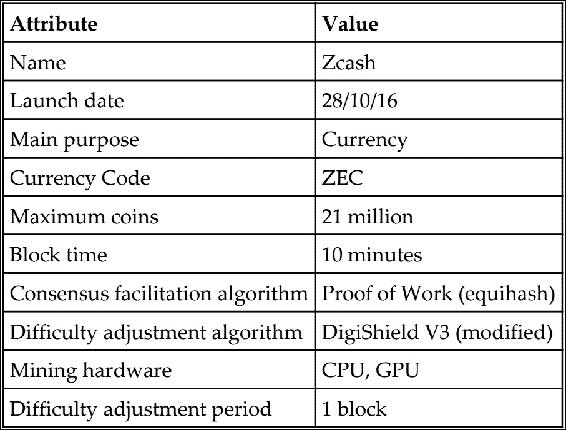

## 交易 Zcash

Zcash 可以在主要数字货币交易所购买。在撰写时，Zcash 的价格非常高。如下图所示，价格一度飙升至每个 Zcash 约 10 比特币。一些交易所的订单甚至高达 2,500 BTC 每个 ZEC：

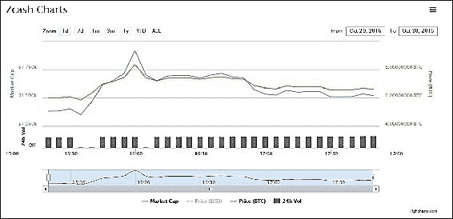

## 挖掘指南

挖掘 Zcash 有多种方法。目前，可以进行 CPU 和 GPU 挖掘。各种商业云挖矿池也提供挖掘 Zcash 的合约。要使用 CPU 进行独立挖矿，可以按照以下步骤进行：

1.  第一步是使用以下命令安装先决条件：

    ```
    sudo apt-get install \
    build-essential pkg-config libc6-dev m4 g++-multilib \
    autoconf libtool ncurses-dev unzip git python \
    zlib1g-dev wget bsdmainutils automake

    ```

    如果先决条件已安装，将显示消息指示组件已经是最新版本。如果尚未安装或版本旧于最新软件包，则安装将继续，将下载所需软件包，并完成安装。

1.  接下来，运行命令从`git`克隆 Zcash，如下屏幕截图所示：

    ```
    $ git clone https://github.com/zcash/zcash.git

    ```

    此命令将在本地克隆 Zcash git 存储库。输出如下屏幕截图所示：

    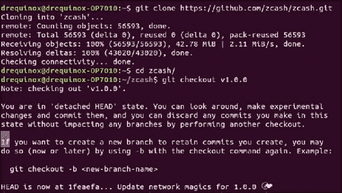

1.  下一步是通过使用以下命令从屏幕截图中下载证明和验证密钥：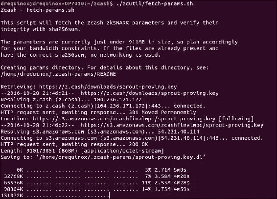

1.  运行此命令后，将在`~/.zcash-params/`目录中下载约 911 MB 的密钥。该目录包含用于证明和验证密钥的文件：

    ```
    drequinox@drequinox-OP7010:~/.zcash-params$ pwd
    /home/drequinox/.zcash-params
    drequinox@drequinox-OP7010:~/.zcash-params$ ls -ltr
    -rw-rw-r-- 1 drequinox drequinox      1449 Oct 24 16:46 sprout-     
            verifying.key
    -rw-rw-r-- 1 drequinox drequinox 910173851 Oct 24 16:46 sprout-   
            proving.key

    ```

1.  一旦上述命令成功完成，可以使用以下命令构建源代码：

    ```
    ./zcutil/build.sh -j$(nproc)

    ```

这将产生非常长的输出；如果一切顺利，它将生成一个`zcashd`二进制文件。请注意，此命令将`nproc`作为参数，`nproc`基本上是一个查找系统中核心或处理器数量并显示该数字的命令。如果您没有该命令，则用您系统中的处理器数量替换`nproc`。

构建完成后，下一步是配置 Zcash。这可以通过在`~/.zcash/`目录中创建名为`zcash.conf`的配置文件来实现。

示例配置文件如下所示：

```
addnode=mainnet.z.cash 
rpcuser=drequinox 
rpcpassword=xxxxxxoJNo4o5c+F6E+J4P2C1D5izlzIKPZJhTzdW5A= 
gen=1 
genproclimit=8 
equihashsolver=tromp 

```

前述配置启用了各种功能。第一行添加了主网节点并启用了主网连接。`rpcuser`和`rpcpassword`是 RPC 接口的用户名和密码。`gen = 1`用于启用挖矿。`genproclimit`是可用于挖矿的处理器数量。最后一行启用了更快的挖矿解算器；如果要使用标准 CPU 挖矿，则不需要此功能。

现在可以使用以下命令启动 Zcash：

```
./zcashd --daemon

```

一旦启动，这将允许通过 Zcash-cli 命令行界面与 RPC 接口交互。这几乎与比特币命令行界面相同。一旦 Zcash 守护进程运行起来，可以运行各种命令来查询 Zcash 的不同属性。可以通过 CLI 或区块链浏览器在本地查看交易。Zcash 的区块链浏览器位于：[https://explorer.zcha.in/](https://explorer.zcha.in/)。

### 地址生成

可以使用以下命令生成新的 Z 地址：

```
$:~/zcash/src$ ./zcash-cli z_getnewaddress
zcPDBKuuwHJ4gqT5Q59zAMXDHhFoihyTC1aLE5Kz4GwgUXfCBWG6SDr45SFLUsZhpcdvHt7nFmC3iQcn37rKBcVRa93DYrA

```

使用`getinfo`参数运行 Zcash-cli 命令会产生以下屏幕截图中显示的输出。它显示有关区块、难度和余额等有价值的信息：

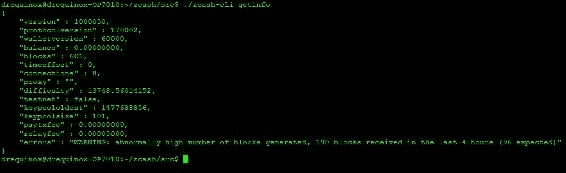

显示`getinfo`输出的屏幕截图

可以使用以下命令生成新的 T 地址：

```
drequinox@drequinox-OP7010:~/zcash/src$ ./zcash-cli getnewaddress
t1XRCGMAw36yPVCcxDUrxv2csAAuGdS8Nny

```

### GPU 挖矿

除了CPU挖矿之外，还可以选择GPU挖矿。目前还没有官方的GPU矿工，但开源开发者已经制作出了各种概念证明和可工作的矿工。Zcash公司举办了一场公开竞赛，鼓励开发者构建并提交CPU和GPU矿工。截至撰写时还没有宣布获胜者。读者可以访问[https://zcashminers.org/](https://zcashminers.org/)参考更多信息。

还有另一种挖矿方式：使用各种在线云挖矿提供商提供的云挖矿合约。云挖矿服务商代表客户进行挖矿。除了云挖矿合约，矿工还可以使用自己的设备通过矿池使用stratum或其他协议进行挖矿。一个关键的示例是nicehash的Zcash矿池。通过这个矿池，矿工可以出售他们的算力。以下是在Zcash挖矿矿池上构建和使用CPU矿工的示例。

#### 下载和编译nheqminer

可以使用以下步骤在Ubuntu Linux系统上下载和编译`nheqminer`：

```
sudo apt-get install cmake build-essential libboost-all-dev
git clone https://github.com/nicehash/nheqminer.git
cd nheqminer/nheqminer
mkdir build
cd build
cmake ..
make

```

当所有步骤都成功完成后，可以使用以下命令运行nhequminer：

```
./nhequminer -l eu -u <btc address> -t <number of threads>

```

Windows版本的Nhequminer可以在以下网址找到：[https://github.com/nicehash/nheqminer/releases](https://github.com/nicehash/nheqminer/releases)。

Nheqminer需要几个参数，如位置(`-l`)，用户名(`-u`)，以及用于挖矿的线程数(`-t`)。

以下是Windows版本Zcash矿工的运行示例：

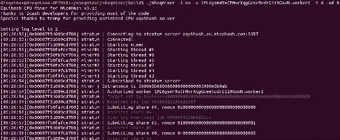

使用比特币地址接收出售算力的支付

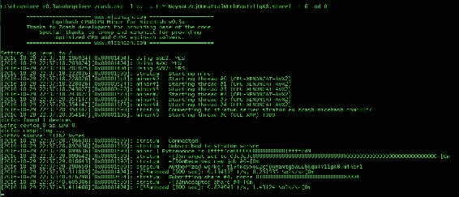

使用Zcash T地址接收出售算力的支付

这完成了对Zcash的介绍；读者可以在网上了解更多关于Zcash的信息，因为现在它的波动性很大，事情可能会发生很快。有一件事是肯定的；Zcash的零知识证明是一个重大的创新，并为未来需要固有隐私的应用程序铺平了道路，如银行业、医学或法律业。

# 摘要

本章介绍了整个加密货币领域的概况。详细讨论了一些替代币，特别是Zcash和Namecoin。加密货币是一个非常活跃的研究领域，特别是在可扩展性、隐私和安全方面。也进行了一些研究，以发明新的难度重新调整算法，以阻止加密货币中央化的威胁。在隐私和特别是可扩展性领域可以进行进一步的研究。读者现在应该能够欣赏到替代币的概念及其背后的各种动机。还讨论了一些实际方面，如挖矿和启动新的货币项目，希望这些讨论将为读者打下坚实的基础，并使他们能够进一步探索这些领域。替代币是一个迷人的研究领域，为去中心化的未来打开了许多可能性。
