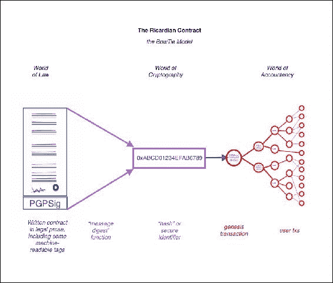
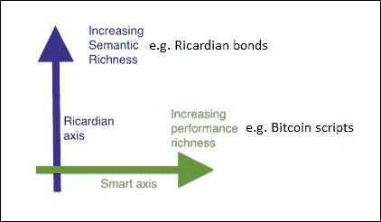
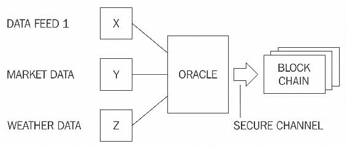

# 第六章. 智能合约

本章介绍了智能合约的概念。这并不是一个新概念，但随着区块链的发展，对这个概念的兴趣得到了重新激发，这现在是区块链领域中的一个活跃研究领域。由于智能合约可以通过减少交易成本和简化复杂合同给金融服务行业带来的节约成本而带来的益处，各种金融和学术机构正在进行严格的研究，以便尽快系统化并使智能合约的实施容易和实际。

# 历史

智能合约最初是由*尼克·萨博*在上世纪 90 年代末提出的，但真正意识到它们的潜力和好处还要等上 20 年。*萨博*描述智能合约如下：

> *“智能合约是一种计算机化的交易协议，执行合同条款。一般目标是满足常见的合同条件（如付款条款、留置权、机密性，甚至执行），最小化恶意和意外情况，并尽量减少对信任第三方的需求。相关的经济目标包括降低欺诈损失、仲裁和执行成本，以及其他交易成本。”*

这种智能合约的理念在 2009 年以有限的方式应用于比特币中，比特币交易可用于在用户之间传输价值，在对等网络上用户不一定信任对方，也无需信任第三方。

# 定义

对于智能合约的标准定义并没有达成共识。定义智能合约的重要性是不言而喻的，以下是作者试图提供的智能合约的广义定义。

### 注意

智能合约是一种安全且不可阻挡的计算机程序，代表着一份自动可执行和可强制执行的协议。

进一步解析这个定义会发现，智能合约实际上是一种用计算机或目标机器可以理解的语言编写的计算机程序。此外，它包括以商业逻辑形式达成的各方协议。另一个关键观点是，在满足某些条件时，智能合约会自动执行。它们是可执行的，这意味着所有合同条款都按照定义和预期执行，即使存在对手方也是如此。执行是一个更广泛的术语，它包括以法律形式的传统执行，以及实施某些措施和控制，使得能够在不需要任何调解的情况下执行合同条款。应当注意，真正的智能合约不应依赖传统的执行方法。相反，它们应该遵循*代码即法律*的原则，这意味着没有必要由仲裁员或第三方控制或影响智能合约的执行。智能合约是自我执行的，而不是法律可执行的。这可能被视为自由主义者的梦想，但这是完全可能的，并且符合智能合约的真正精神。

此外，它们是安全的和不可阻挡的，这意味着这些计算机程序需要被设计成容错的，并在合理的时间内可执行。这些程序应该能够执行和维护健康的内部状态，即使外部因素不利也应如此。例如，想象一下一个正常的计算机程序，它编码了一些逻辑并根据其中编码的指令执行，但如果它运行的环境或者依赖的外部因素偏离了正常或预期的状态，该程序可能会以任意的方式作出反应或者简单地中止。重要的是智能合约对这种问题是免疫的。

安全和不可阻挡可能被认为是要求或理想特性，但从长远来看，如果安全性和不可阻挡性被纳入智能合约的定义，将会带来更大的好处。这将使研究人员能够从一开始就专注于这些方面，并有助于建立坚实的基础，以便进一步研究。一些研究人员还建议，智能合约不必自动执行；相反，它们可以是所谓的*可自动化*，因为在某些情况下需要手动人工输入。虽然在某些情况下人工输入和控制是可取的，但并非绝对必要；并且，在作者看来，要想合约真正*智能*，它必须是完全自动化的。某些需要人们提供的输入也可以和应该通过使用 Oracles 来自动化。后面将在本章中更详细地讨论 Oracles。

智能合约通常通过使用状态机模型来管理其内部状态进行操作。这使得可以开发一个有效的智能合约编程框架，在其中，合约的状态根据一些预定义的标准和条件进一步推进。

目前也正在围绕代码是否能在法庭上作为合同被接受进行讨论。这与传统法律文体的表现完全不同，尽管它们代表和执行了所有合同条款，但法庭并不理解代码。这引发了一些关于智能合约如何具有法律约束力的问题：是否可以开发一种方式，使其在法庭上能够被快速接受和理解？代码内又如何实施争议解决？此外，监管和合规要求是另一个需要在智能合约能够有效地像传统法律文书一样使用之前解决的主题。

上述问题打开了各种可能性，比如使智能合约代码不仅可以被机器理解，还可以被人理解。如果人类和机器都能理解智能合约中编写的代码，它可能在法律情况下更容易被接受，而不仅仅是程序员能理解的代码。这一理想的性质是一个需要研究的领域，已经在这一领域花费了大量的研究努力来回答关于合同的语义、意义和解释的问题。

智能合约固有地要求具有确定性。这一性质使得智能合约可以在网络上的任何节点上运行并获得相同的结果。如果不同节点之间的结果即使有微小差异，就无法达成共识，整个区块链上的分布式共识模式就会失败。此外，合约语言本身也应该是确定性的，以确保智能合约的完整性和稳定性。也就是说，确定性指的是，在语言中没使用可以在不同节点上产生不同结果的非确定性函数。例如，各种编程语言中由各种函数进行的浮点运算在不同的运行环境中可能会产生不同的结果。另一个例子是 JavaScript 中的一些数学函数，在不同浏览器上对于相同输入可能产生不同的结果，这可能导致各种错误。在智能合约中，这是极不可取的，因为如果节点之间的结果不一致，就永远无法达成共识。确定性特性可以确保智能合约总是对特定输入产生相同的输出。换句话说，一旦编译完成，程序就会产生一个与高级代码中编程的要求完全一致的坚实和准确的业务逻辑。

总之，智能合同具有以下四个属性：

+   自动执行

+   可强制执行

+   语义上合理

+   安全且不可阻止。

前两个属性至少是必需的，而后两个可能在某些情况下不需要或无法实现，并且可以放宽。例如，衍生品合同可能不需要语义上合理且不可阻止，但至少应该能够在基本水平上自动执行和可强制执行。另一方面，产权证书需要在语义上合理和完整，因此，为了将其实施为智能合同，语言必须被计算机和人理解。这个解释问题由*伊恩·格里格*在他发明**里卡第安合同**时解决了，我们将在下一节中更详细地讨论这个问题。

# 里卡第安合同

里卡第安合同最初是在 20 世纪 90 年代末由*伊恩·格里格*在《金融密码学七层》一文中提出的。这些合同最初在名为**里卡多**的债券交易和支付系统中使用。其关键思想是编写一个法院和计算机软件都能理解和接受的文档。里卡第安合同解决了通过互联网发行价值的挑战。它确定了发行人，并在文档中捕获了合同的所有条款和条款，以使其作为法律约束合同被接受。根据*伊恩·格里格*在[`iang.org/papers/ricardian_contract.html`](http://iang.org/papers/ricardian_contract.html)中的原始定义，里卡第安合同是具有以下几个属性的文件：

+   由发行人提供给持有人的合同

+   由持有人持有的有价权利，并由发行人管理

+   易于人们阅读（如纸质合同）

+   可由程序阅读（可解析，如数据库）

+   数字签名

+   携带密钥和服务器信息

+   与独特且安全的标识符相匹配

在实践中，合同是通过生成一份包含合同条款的法律文本和所需的机器可读标签的单一文档来实现的。该文档由发行人使用其私钥进行数字签名。然后，使用消息摘要函数对该文档进行散列，以产生一个可以识别文档的哈希。然后，此哈希在合同执行期间由各方进一步使用和签署，以链接每笔交易，因此标识哈希作为意图的证据。这在下面的图表中描述，通常称为*蝴蝶结*模型。

下图显示了左侧的**法律世界**，文档的来源就在这里。然后对其进行哈希处理，使用所得的消息摘要作为*会计世界*中的标识符。*会计世界*基本上可以代表业务中使用的任何或多个会计、交易和信息系统，用于执行各种业务操作。这个流程背后的思想是，通过对文档进行哈希处理生成的消息摘要首先在所谓的*创世交易*或第一笔交易中使用，然后在合同的运行执行过程中的每笔交易中都使用。

这样，原始书面合同与*会计世界*中的每笔交易之间就建立了安全链接。

李嘉图合同，蝴蝶结图

李嘉图合同与智能合同有所不同，智能合同不包括任何合同文件，纯粹专注于合同的执行。另一方面，李嘉图合同更关注合同的语义丰富性和生成包含合同法律条文的文件。合同的语义可以分为两种类型：操作语义和指称语义。第一种类型定义了合同的实际执行、正确性和安全性，而后者关注合同整体的现实意义。一些研究人员区分了智能合同代码和智能法律合同，智能合同仅关注合同的执行，第二种类型涵盖了法律协议的指称和操作语义。或许基于语义差异对智能合同进行分类是有道理的，但更好的方式是将智能合同视为一个独立的实体，能够在其中编码法律条文和代码（业务逻辑）。

在比特币中，可以观察到一个非常简单的智能合同实现，完全专注于合同的执行，而李嘉图合同更倾向于生成一个人类可理解的文件，其中有一些部分是计算机程序可以理解的。这可以被视为法律语义与操作性能（语义与性能）的区别，如下图所示。这最初是由*伊恩·格里格*在他的论文*关于李嘉图与智能合同的交汇*中提出的。

说明性能与语义是伊恩·格里格描述的正交问题；稍作修改以显示两个轴上不同类型合同的示例。

智能合同由这两个元素（执行和语义）组成，这样就完成了智能合同的理想模型。

Ricardian 合约可以表示为三个对象的元组，即 *Prose*、*参数* 和 *代码*。 Prose 表示常规语言中的法律合同；代码表示程序，是对法律文言的计算机可理解表示；参数将法律合同的适当部分与相应的代码连接起来。

[Ricardian contracts](https://wiki.example.org/ricardian_contracts) 已经在许多系统中实现，例如 CommonAccord、OpenBazaar、OpenAssets 和 Askemos。

## 智能合约模板

智能合约可以为任何需要的行业实现，但目前大多数用例与金融行业有关。智能合约领域最近的工作专注于金融行业，提出了智能合约模板的概念。这一想法是构建标准模板，为金融工具的法律协议提供支持框架。这是由 *Clack 等* 在他们的论文中提出的，论文名为 *智能合约模板：基础、设计概况和研究方向*。该论文还提出应该构建领域特定语言来支持智能合约模板的设计和实现。一种名为 *CLACK* 的语言，即用于增强合同知识的通用语言已经被提出，并且已经开始研发这种语言。这种语言旨在非常丰富，并提供各种功能，从支持法律文言到能够在多个平台上执行和进行密码功能。

金融业中的合同并不是一个新概念，各种领域特定语言 DSLs 已经在金融业中使用，为特定领域提供特定语言。例如，有可用的 DSL 支持保险产品的开发，代表能源衍生品，或用于构建交易策略。清单还在继续，可以在 [`www.dslfin.org/resources.html`](http://www.dslfin.org/resources.html) 找到金融领域特定语言的综合清单。

重要的是要理解**领域特定语言**的概念。这些语言是为特定应用程序或兴趣领域开发的，具有有限的表达能力。**领域特定语言**（**DSLs**）与**通用编程语言**（**GPLs**）不同：DSLs 具有一小组特性，足以满足并针对其用途进行了优化，并且与 GPLs 不同，通常不用于构建通用的大型应用程序。基于 DSL 的设计哲学，可以设想开发这样的语言，以编写智能合约。一些工作已经做过了，Solidity 就是一种这样的语言，它已经被引入到以太坊区块链中用于编写智能合约。Serpent 是另一种语言，尽管没有 Solidity 那么常用，但也已经被引入到以太坊中。

智能合约编程的领域特定语言的这一理念可以进一步扩展到图形领域特定语言，即智能合约建模平台，其中领域专家（而不是程序员）可以使用图形用户界面和画布来定义和绘制金融合约的语义和性能。一旦流程被绘制和完成，就可以首先模拟测试，然后从同一系统部署到目标平台，该平台可以是区块链。这也不是一个新概念，类似的方法在 Tibco streambase 产品中使用，该产品是用于构建事件驱动高频交易系统的基于 Java 的系统。

建议在开发高级 DSL 的领域进行研究，这些 DSL 可以用于在用户友好的图形用户界面中编写智能合约，从而允许非程序员设计智能合约。

## Oracles

Oracles 是智能合约生态系统的重要组成部分。智能合约的局限性在于它们无法访问可能需要的外部数据来控制业务逻辑的执行；例如，合约需要股票价格来释放股息支付。Oracles 可以用于向智能合约提供外部数据。Oracle 是从外部来源向智能合约传递数据的接口。根据行业和要求，Oracles 可以提供不同类型的数据，范围从天气报告、现实世界新闻和企业行动到来自物联网设备的数据。Oracles 是受信任的实体，它们使用安全通道将数据传输到智能合约。

Oracles 还能够数字签名数据，证明数据来源是真实的。智能合约可以订阅 Oracles，智能合约可以拉取数据，或者 Oracles 可以将数据推送到智能合约。Oracles 不应该能够操纵他们提供的数据，必须能够提供真实的数据。尽管 Oracles 是受信任的，但在某些情况下，数据由于操纵可能仍然是不正确的。因此，Oracles 无法更改数据是必要的。可以使用后面在本章中讨论的各种公证方案来提供此验证。在这种方法中，可能已经可以看到一个问题，这在某些情况下可能是不可取的，那就是信任问题。如何信任第三方提供的数据的质量和真实性？在金融世界尤其如此，市场数据必须准确可靠。对于智能合约设计者接受由大型值得信赖的可信第三方提供的 Oracle 数据可能是可以接受的，但中心化的问题仍然存在。这些类型的 Oracles 可以称为标准或简单的 Oracles。

另一种类型的 Oracle，基本上是由于去中心化的要求而出现的，可以称为*去中心化*的 Oracle。这些类型的 Oracle 可以基于某些分布式机制构建。也可以设想，Oracle 可以从另一个由分布式共识驱动的区块链中获取数据，从而确保数据的真实性。例如，一个运行自己私有区块链的机构可以通过 Oracle 发布其数据源，然后被其他区块链所使用。

研究人员还引入了另一种硬件 Oracle 的概念，其中需要来自物理设备的实时数据。例如，这可以用于遥测和物联网。然而，这种方法需要一个硬件设备不能被篡改的机制。这可以通过使用防篡改设备来实现。

现在有平台可以使用 Oracle 让智能合约获取外部数据。根据所使用的区块链类型，Oracle 使用不同的方法将数据写入区块链。例如，在比特币区块链中，Oracle 可以通过`OP_RETURN` Opcode 将数据写入特定交易，智能合约可以监视该交易并读取数据。提供 Oracle 服务的各种在线服务，如[`www.oraclize.it/`](http://www.oraclize.it/) 和 [`www.realitykeys.com/`](https://www.realitykeys.com/)，以及提供外部数据和使用智能合约进行支付功能的另一个服务[`smartcontract.com/`](https://smartcontract.com/) 都是可用的。所有这些服务的目标都是使智能合约能够获取其执行和做出决策所需的数据。为了证明 Oracle 从外部源检索的数据的真实性，可以使用诸如 TLSnotary 的机制，它产生数据源和 Oracle 之间通信的证明。这确保了反馈给智能合约的数据绝对是从源头检索的。关于 TLSnotary 的更多细节可以在这里找到 [`tlsnotary.org/`](https://tlsnotary.org/)。

以下图示展示了 Oracle 和智能合约生态系统的通用模型：

与区块链上智能合约交互的 Oracle 的简化模型

## 智能 Oracle

在 *Codius* 中还提出并实现了智能 Oracle 的概念。智能 Oracle 基本上与 Oracle 一样，但具有合约代码执行的额外功能。Codius 提出的智能 Oracle 使用 Google Native Client 运行。这是一个用于运行不受信任的 x86 本地代码的沙箱环境。Codius 可以在 [`www.codius.org/`](https://www.codius.org/) 找到。

## 在区块链上部署智能合约

智能合约可能部署在区块链上，也可能不部署在区块链上，但由于区块链提供的分布式共识机制，将它们部署在区块链上是有意义的。以太坊是原生支持智能合约开发和部署的区块链的一个例子。以太坊区块链上的智能合约通常是**去中心化自治组织**（**DAOs**）的一部分。

作为比较，在比特币区块链中，比特币交易中的`lock_time`字段可以被视为基本版本的智能合约的一种实现。`lock_time`字段使交易在指定的时间或一定数量的区块之后被锁定，从而强制执行某种基本的合约，即只有在满足某些条件（经过的时间或区块数量）时才能解锁某笔交易。然而，这在性质上非常有限，应该只被视为基本智能合约的一个例子。除了上述例子之外，比特币脚本语言，尽管有限，也可以用于构建基本的智能合约。一个可能性是为一个可以由任何能够展示哈希冲突攻击的人花费比特币地址提供资金。这个想法是在 Bitcointalk 论坛上提出的，更多信息可以在[`bitcointalk.org/index.php?topic=293382.0`](https://bitcointalk.org/index.php?topic=293382.0)找到。这也可以被认为是基本形式的智能合约。

## DAO

DAO 是最高众筹项目之一，于 2016 年 4 月开始。基本上，这是一组智能合约，旨在提供一个投资平台。由于代码中的错误，这在 2016 年 6 月被黑客攻击，相当于 5000 万美元被转移到 DAO 之外的另一个账户。这导致以太坊进行了硬分叉以从这次攻击中恢复。需要注意的是，*代码即法律*或无法阻止的智能合约的概念应该以一定的怀疑态度看待，因为这些概念的实施还不够成熟，无法获得完全可信的信任。最近的事件表明以太坊基金会能够通过引入硬分叉来停止和改变*The DAO*的执行。尽管这次硬分叉是出于真正的原因，但它违背了去中心化的真正精神和*代码即法律*的概念。另一方面，对这次硬分叉的抵制以及一些矿工决定继续在原始链上进行挖矿导致了以太坊经典的创建。这是原始的、未经分叉的以太坊区块链，其中*代码仍然是法律*。

这次攻击突显了智能合约的危险性，并绝对需要开发一个正式的智能合约语言。这次攻击还凸显了彻底测试的重要性。最近在以太坊智能合约开发语言周围发现了各种漏洞。因此，开发一个标准框架来解决所有这些问题至关重要。正如之前讨论的那样，一些工作已经开始，但这个领域有待更多研究，以解决智能合约语言的局限性。

# 总结

本章首先介绍了智能合约的历史，接着详细讨论了智能合约的定义。由于对智能合约的标准定义尚无一致意见，我们尝试介绍一个涵盖智能合约要点的定义。还提供了对里卡迪安合约的介绍，并解释了里卡迪安合约与智能合约的区别，突出了里卡迪安合约关注合约的定义，而智能合约则关注合约的实际执行。讨论了智能合约模板的概念，就此主题，学术界和行业目前正在进行高质量的活跃研究。还讨论了创建高级领域特定语言以创建智能合约或智能合约模板的可能性。在章节的后续部分，介绍了 Oracles 的概念，随后简要讨论了 DAO 以及 DAO 和智能合约中的安全问题。
