# 第七章：以太坊 101

本章旨在介绍以太坊区块链。您将介绍以太坊背后的基本和高级理论概念。将详细讨论与以太坊区块链相关的各种组件、协议和算法，以便您理解这一区块链范式背后的理论。此外，本章还将介绍有关钱包软件、挖矿和设置以太坊节点的实际深入介绍。还将介绍以太坊所面临的安全性和可扩展性等各种挑战的一些材料。此外，还将讨论交易和市场动态。

# 介绍

以太坊是由*Vitalik Buterin*于 2013 年 11 月构想的。他提出的关键想法是开发一种图灵完备的语言，允许为区块链和去中心化应用程序开发任意程序（智能合约）。这与比特币形成鲜明对比，比特币的脚本语言非常有限，只允许基本和必要的操作。

## 以太坊客户端和版本发布

使用不同语言开发了各种以太坊客户端，目前最流行的是 go-Ethereum 和 parity。go-Ethereum 是使用 Golang 开发的，而 parity 是使用 Rust 构建的。也有其他可用的客户端，但通常来说，go-Ethereum 客户端被称为*geth*对所有目的都是足够的。Mist 是一个用户友好的**图形用户界面**（**GUI**）钱包，后台运行 geth 与网络同步。稍后的章节中将提供更多关于这一点的细节，在安装和挖矿部分。

以太坊的第一个版本被称为*Frontier*，当前版本称为*Homestead*。下一个版本被命名为*Metropolis*，它专注于协议简化和性能改进。最终版本被命名为*serenity*，预计将实施权益证明算法（Casper）。serenity 的其他研究领域包括可扩展性、隐私和**以太坊虚拟机**（**EVM**）升级。由于这是持续的开发工作，以太坊生态系统将不断改进和发展，因此 serenity 不应被视为一个*最终*版本，而是一个长期持续改进之旅的重要里程碑。进一步的版本尚未命名。*Web 3.0*的愿景已经提出，并在社区中进行讨论。Web 3.0 是一个基于现有 Web 2.0 技术演变而来的语义和智能 Web 的概念。这是一个人们、应用程序、数据和网络都能智能互连并相互交互的生态系统愿景。随着区块链技术的出现，去中心化网络的想法也出现了，这实际上是互联网的最初愿景。核心思想是在 web 3.0 中所有主要服务，如 DNS、搜索引擎和互联网身份都将被去中心化。以太坊被设想为一个可以帮助实现这一愿景的平台。 

## 以太坊堆栈

以太坊堆栈由各种组件组成。在核心位置，有以太坊区块链运行在点对点以太坊网络上。其次，有一个以太坊客户端（通常是 geth），在节点上运行并连接到点对点以太坊网络，从中下载和本地存储区块链。它提供各种功能，如挖矿和账户管理。区块链的本地副本定期与网络同步。另一个组件是`web3.js`库，允许通过**远程过程调用**（**RPC**）接口与 geth 进行交互。

这可以在下图中可视化：

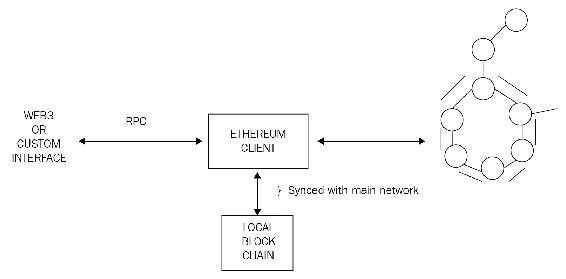

以太坊堆栈显示了各种组件

# 以太坊区块链

以太坊，就像任何其他区块链一样，可以被视为基于交易的状态机。这在由*Dr. Gavin Wood*撰写的以太坊黄皮书中提到。其思想是通过逐步执行交易，将初始状态转化为最终状态。最终转换随后被接受为状态的绝对不可争议的版本。在下图中，展示了以太坊状态转换函数，其中事务执行导致状态转换。

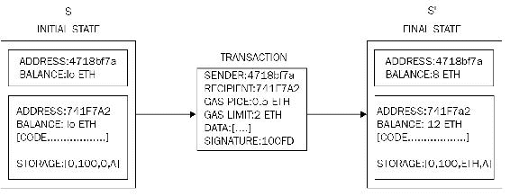

以太坊状态转换函数

在前面的例子中，发起了从**地址 4718bf7a**到**地址 741f7a2**的 2 以太币的转账。初始状态表示交易执行之前的状态，最终状态表示变化后的状态。这将在本章后面更详细地讨论，但本例的目的是介绍以太坊中状态转换的核心思想。

## 货币（ETH 和 ETC）

作为对矿工的激励，以太坊还奖励其本地货币称为以太币，缩写为 ETH。在 DAO 黑客事件之后，提出了一个硬分叉以减轻问题；因此，现在有两个以太坊区块链：一个称为 Ethereum Classic，其货币用 ETC 表示，而硬分叉版本是 ETH，它仍在增长并且正在进行积极的开发。然而，ETC 有自己的追随者，拥有一个致力于进一步发展 ETC 的专门社区，这是以太坊的未分叉原始版本。本章主要关注 ETH，这是目前最活跃和官方的以太坊区块链。

## 分叉

由于主要协议升级，homestead 的最新版本导致了硬分叉。协议在区块号 1,150,000 上升级，从以太坊的第一个版本 Frontier 迁移到了被称为 homestead 的第二个版本的以太坊。

最近发生的一个意外分叉发生在 2016 年 11 月 24 日，UTC 时间 14:12:07，这是由于 geth 客户端的日志机制中的一个错误导致的。网络分叉发生在区块号 2,686,351。这个错误导致 geth 在空账户删除的情况下无法回滚空的 gas 异常。这在 parity（另一个流行的以太坊客户端）中不是问题。这意味着从区块号 2686351 开始，以太坊区块链分成两个部分，一个使用 parity 客户端，另一个使用 geth。这个问题在 geth 版本 1.5.3 发布后得到解决。

## Gas

以太坊中的另一个关键概念是 gas。以太坊区块链上的所有交易都需要支付它们执行的计算成本。这个成本由称为 gas 或加密燃料的东西来支付，这是以太坊引入的一个新概念。这个 gas 作为执行费用是由交易发起者提前支付的。每个操作都会消耗燃料。每个操作都有一个预定义的与之关联的 gas 量。每个交易都指定了它愿意为其执行消耗的 gas 量。如果在执行完成之前 gas 用尽，则任何由交易执行的操作都会被回滚。如果交易成功执行，则剩余的 gas 将退还给交易发起者。

本概念不应与挖矿费混淆，挖矿费是一种用于向矿工支付*燃气*作为费用的不同概念。有关燃气和操作相关概念和计算的更多信息将在本章后面提供。

## 共识机制

以太坊中的共识机制基于 GHOST 协议，最初由*Zohar*和*Sompolinsky*于 2013 年 12 月提出。有兴趣的人可以在[`eprint.iacr.org/2013/881.pdf`](http://eprint.iacr.org/2013/881.pdf)上探索详细的原始论文。

以太坊使用了协议的简化版本，其中花费最多计算工作量来构建链的链被识别为确定版本。另一种看待它的方式是寻找最长的链，因为最长的链必须是通过消耗足够的挖矿工作量建立的。 **贪婪最重子树**（**GHOST**）最初被引入作为一种缓解由快速区块生成时间导致的陈旧或孤立区块问题的机制。在 GHOST 中，陈旧的区块被加入计算中以找出最长和最重的链。在以太坊中，陈旧的区块被称为 Uncles 或 Ommers。

下图显示了最长和最重链之间的快速比较：

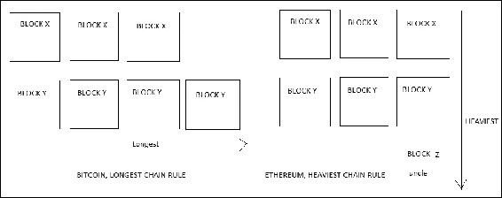

最长与最重链

## 世界状态

以太坊中的世界状态代表了以太坊区块链的全局状态。它基本上是以太坊地址和账户状态之间的映射关系。这些地址是 20 个字节长。这种映射关系是一个使用**递归长度前缀**（**RLP**）序列化的数据结构。RLP 是一种特别开发的编码方案，用于在以太坊中对二进制数据进行存储或通过网络进行传输，也用于在 Patricia 树中保存状态。RLP 函数将一个项目作为输入，该项目可以是一个字符串或一组项目，并生成适合存储和通过网络传输的原始字节。RLP 不对数据进行编码；它的主要目的是对结构进行编码。

### 账户状态

账户状态由四个字段组成：nonce、balance、storageroot 和 codehash，并在此详细描述。

#### 随机数

这是一个每次从地址发送交易时就会递增的值。在合同账户情况下，它表示由该账户创建的合同数量。合同账户是以太坊中存在的两种账户类型之一；它们稍后会在本章中更详细地解释。

#### 余额

这个值表示以太坊中地址持有的货币（以太币）的最小单位——Wei 的数量。

#### 存储根

此字段代表默克尔帕特里夏树的根节点，该树编码了账户的存储内容。

#### 代码哈希

这是一个不可变字段，包含与账户关联的智能合约代码的哈希。在普通账户的情况下，此字段包含空字符串的 Keccak 256 位哈希。此代码通过消息调用调用。

世界状态及其与账户 trie、账户和区块头的关系可以在下图中可视化。它显示了图表中间的账户数据结构，其中包含从左侧显示的账户存储 trie 的根节点导出的存储根哈希。然后，在世界状态 trie 中使用账户数据结构，它是地址与账户状态之间的映射。最后，使用 Keccak 256 位算法哈希世界状态 trie 的根节点，并将其作为状态根哈希的一部分添加到右侧显示的区块头数据结构中。

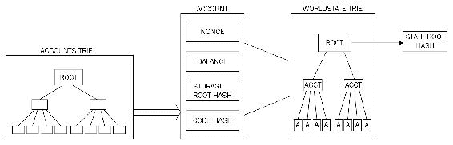

账户 trie（账户存储内容）、账户元组、世界状态 trie 和状态根哈希及它们之间的关系

账户 trie 基本上是用于编码账户存储内容的 Merkle Patricia 树。内容存储为从 256 位整数键的 Keccak 256 位哈希到 RLP 编码的 256 位整数值的映射。

## 交易

以太坊中的交易是使用私钥签名的数字化数据包，其中包含指令，完成后要么产生消息调用，要么创建合约。交易可以根据它们产生的输出分为两种类型：

+   **消息调用交易**：此交易简单地产生一个消息调用，用于在账户之间传递消息。

+   **合约创建交易**：顾名思义，这些交易会导致创建新合约。这意味着当此交易成功执行时，它会创建一个带有关联代码的账户。

这两种交易都由一些常见字段组成，这些字段在这里描述。

### Nonce

Nonce 是一个数字，每次发送交易时都会增加一次。它必须等于发送的交易数，用作交易的唯一标识符。一个 Nonce 值只能使用一次。

### gasPrice

`gasPrice` 字段表示执行交易所需的 Wei 量。

### gasLimit

`gasLimit` 字段包含一个值，表示执行交易所需的最大 gas 量。有关 gas 和 gas 限制的概念将在本章后面更详细地讨论。目前，可以说这是用户（例如，交易发送者）愿意支付用于计算的以太的费用量。

### 至

如其名，`to` 字段是表示交易接收者地址的值。

### 值

`Value` 表示要转移到接收者的 Wei 总数；在合约账户的情况下，这代表合约将持有的余额。

### 签名

签名由三个字段组成，即 *v*、*r* 和 *s*。这些值代表数字签名（*R*，*S*）和一些信息，可用于恢复公钥（*V*）。还有发送方的交易，也可以确定发送方的交易。签名基于 ECDSA 方案，并利用了 SECP256k1 曲线。椭圆曲线密码学理论在 第三章 中讨论，*Cryptography and technical foundations*。在本节中，ECDSA 将在以太坊中的使用环境中进行介绍。

*V* 是一个单字节值，表示椭圆曲线点的大小和符号，可以是 27 或 28。*V* 在 ECDSA 恢复合约中用作恢复 ID。该值用于从私钥派生公钥。在 secp256k1 中，恢复 ID 预期为 0 或 1。在以太坊中，这个偏移量为 27。有关 ECDSARECOVER 函数的更多详细信息将在本章后面提供。

*R* 是从曲线上的一个计算点派生出来的。首先，选择一个随机数，将其与曲线的生成器相乘以计算曲线上的一个点。该点的 *x* 坐标部分为 *R*。*R* 被编码为一个 32 字节序列。*R* 必须大于 0 并且小于 secp256k1n 限制（115792089237316195423570985008687907852837564279074904382605163141518161494337）。

*S* 是通过将 *R* 与私钥相乘并将其添加到待签名消息的哈希中来计算的，最后通过所选的随机数除以它。*S* 也是一个 32 字节序列。*R* 和 *S* 一起表示签名。

为了对交易进行签名，使用 `ECDSASIGN` 函数，该函数将待签名的消息和私钥作为输入，并产生 *V*，一个单字节值；*R*，一个 32 字节值，和 *S*，另一个 32 字节值。方程如下：

*ECDSASIGN (Message, Private Key) = (V, R, S)*

### 初始化

`Init` 字段仅用于旨在创建合约的交易中。这表示一个无限长度的字节数组，指定要在账户初始化过程中使用的 EVM 代码。该字段中包含的代码仅在创建账户时执行一次，并在此后立即销毁。

`Init` 也返回另一个称为 *body* 的代码部分，该部分持久存在并在合约账户可能接收到的消息调用响应中运行。这些消息调用可能通过交易或内部代码执行发送。

### 数据

如果交易是一个消息调用，那么使用 `init` 字段而不是 `init`，它代表消息调用的输入数据。它的大小也是不受限制的，组织为一个字节数组。

这可以在下图中可视化，其中一个交易是上面提到的字段的元组，然后包含在一个交易 trie（修改过的默克尔-帕特里夏树）中，由要包含的交易组成。最后，交易 trie 的根节点使用 Keccak 256 位算法进行哈希，并包含在区块头中，同时还包括区块中的交易列表。

交易可以在交易池或区块中找到。当一个挖矿节点开始验证区块的操作时，它会从交易池中选择报酬最高的交易开始执行，逐一执行这些交易。当燃气限制达到或者交易池中没有更多交易需要处理时，挖矿就开始了。在这个过程中，区块将被反复哈希，直到找到一个有效的只需和区块一起哈希就能得到一个比难度目标小的值的 nonce。一旦区块成功挖矿，它将立即广播到网络上，宣告成功，并且将被网络验证和接受。这个过程类似于前一章讨论的比特币挖矿过程。唯一的区别是以太坊的工作证明算法是 ASIC 抗性的，称为 *Ethash*，在这个算法中寻找 nonce 需要大量的内存。

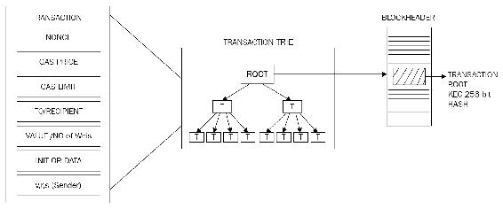

交易、交易 trie 和区块头之间的关系

## 合约创建交易

创建账户时需要一些重要的参数。这些参数列举如下：

+   发送者

+   原始转账者

+   可用燃气

+   燃气价格

+   资金，即最初分配的以太量

+   一个任意长度的字节数组

+   初始化 EVM 代码

+   消息调用/合约创建堆栈的当前深度（当前深度意味着堆栈中已经存在的项的数量）

由合约创建交易生成的地址长度为 160 位。准确地说，根据黄皮书的定义，它们是仅包含发送者和 nonce 的结构的 RLP 编码的 Keccak 哈希的右 160 位。初始时，账户中的 nonce 设置为零。账户的余额设置为传递给合约的值。存储也设置为空。代码哈希是空字符串的 Keccak 256 位哈希。

当 EVM 代码（初始化 EVM 代码）执行时，帐户被初始化。在代码执行过程中出现任何异常情况，比如没有足够的 gas，状态不会发生改变。如果执行成功，那么在支付适当的 gas 成本后，帐户将被创建。以太坊的当前版本（家宅）规定，合约交易的结果要么是带有余额的新合约，要么是没有价值转移的不创建新合约。这与之前的版本不同，之前的合约无论合约代码部署是否成功，都可以创建合约，因为存在 gas 用尽异常。

## 消息调用事务

消息调用需要执行多个参数，列举如下：

+   发送方

+   事务发起者

+   收件人

+   需要执行其代码的帐户

+   可用的 gas

+   值

+   gas 价格

+   任意长度的字节数组

+   调用的输入数据

+   消息调用/合约创建栈的当前深度

消息调用会导致状态转换。消息调用也会产生输出数据，如果事务被执行则不会使用该数据。在 VM 代码触发消息调用的情况下，将使用事务执行产生的输出。

在下图中，显示了两种类型事务之间的隔禅：

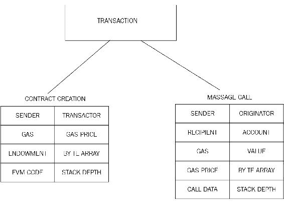

事务类型，执行所需的参数

# 以太坊区块链的元素

在下一节中，你将了解以太坊网络和区块链的各个组成部分。首先，下一节将介绍 EVM 的基本概念。

## 以太坊虚拟机（EVM）

EVM 是一个简单的基于堆栈的执行机器，可以运行字节码指令，以便将系统状态从一种状态转换为另一种状态。虚拟机的字大小设置为 256 位。堆栈大小限制为 1024 个元素，并基于**LIFO**（后进先出）队列。EVM 是图灵完备的机器，但由于运行任何指令所需的 gas 量有限制，所以无法出现可能导致拒绝服务攻击的无限循环。EVM 还支持异常处理，以处理诸如没有足够的 gas 或无效指令等异常情况，这种情况下，机器会立即停止并将错误返回给执行代理。

EVM 是一个完全隔离和沙箱化的运行时环境。在 EVM 上运行的代码无法访问任何外部资源，比如网络或文件系统。

正如之前讨论的，EVM 是一种基于堆栈的架构。EVM 采用大端设计，并使用 256 位宽字。这个字大小允许 Keccak 256 位哈希和椭圆曲线密码算法的计算。

合约和 EVM 可用的存储有两种类型。第一种称为内存，它是一个字节数组。当合约完成代码执行时，内存会被清除。它类似于 RAM 的概念。另一种类型称为存储，永久存储在区块链上。它是一个键值存储。

内存是无限的，但受到燃料费用要求的约束。虚拟机相关的存储是一个可以寻址的字数组，是非易失性的，并且作为系统状态的一部分而维护。键和值的大小为 32 字节。程序代码存储在一个**虚拟只读存储器**（**虚拟 ROM**）中，可以使用 CODECOPY 指令进行访问。CODECOPY 指令用于将程序代码复制到主内存中。初始时，EVM 中的所有存储和内存都设置为零。

下图显示了 EVM 的设计，其中虚拟 ROM 存储程序代码，该代码使用 CODECOPY 复制到主内存中。然后 EVM 通过引用程序计数器读取主内存，并逐步执行指令。每执行一条指令，程序计数器和 EVM 栈都会相应更新。

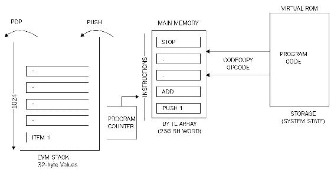

EVM 操作

EVM 优化是一个活跃的研究领域，最近的研究表明，EVM 可以被优化和微调到非常细微的程度，以实现高性能。已经在研究使用**Web 汇编**（**WASM**）的可能性。WASM 由 Google、Mozilla 和 Microsoft 开发，现在正在由 W3C 社区组设计为一个开放标准。WASM 的目标是能够在浏览器中运行机器码，以实现原生速度的执行。同样，EVM 2.0 的目标是能够在 CPU 上原生运行 EVM 指令集（操作码），从而使其更快速和高效。

### 执行环境

为了执行代码，执行环境需要一些关键元素。关键参数由执行代理（例如交易）提供。这些如下所列：

1.  拥有执行代码的账户的地址。

1.  交易的发送者地址和执行的原始地址。

1.  发起执行的交易中的燃料价格。

1.  输入数据或取决于执行代理类型的交易数据。这是一个字节数组；在消息调用的情况下，如果执行代理是一个交易，则将交易数据包含为输入数据。

1.  发起代码执行或交易发送者的账户地址。这是在代码执行由交易发起的情况下的发送者地址；否则，它是账户的地址。

1.  值或交易价值。这是以 Wei 为单位的金额。如果执行代理是一个交易，那么它就是交易的价值。

1.  每个执行周期中迭代器函数选取的以字节数组形式呈现的待执行代码。

1.  当前块的块头

1.  当前正在执行的消息调用或合约创建事务的数量。换句话说，这是当前正在执行的 CALLs 或 CREATEs 的数量。

执行环境可以被视为包含九个元素的元组，如下所示：

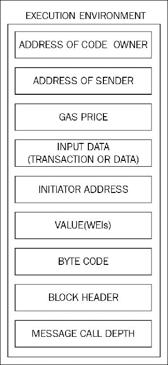

执行环境元组

除了之前提到的九个字段之外，系统状态和剩余燃气也提供给了执行环境。执行的结果产生了结果状态，执行后剩余的燃气，自毁或自杀设置（稍后描述），日志系列（稍后描述）以及任何燃气退款。

#### 机器状态

机器状态也由 EVM 在内部维护。机器状态在每次 EVM 执行周期后更新。虚拟机中运行的迭代器函数（在下一节中详细介绍）输出状态机的单个周期的结果。机器状态是一个包含以下元素的元组：

+   可用的燃气

+   程序计数器，一个最多达到 256 的正整数

+   内存内容

+   内存中活动的字数

+   堆栈的内容

EVM 设计用于处理异常，并且在发生以下任何异常情况时将停止执行：

+   没有足够的燃气用于执行

+   无效的指令

+   堆栈项不足

+   跳转操作码的无效目标

+   无效的堆栈大小（大于 1024）

#### 迭代器函数

早期提到的迭代器函数执行各种重要函数，用于设置机器的下一个状态和最终世界状态。这些功能包括以下内容：

+   它从存储在执行环境中的机器码的字节数组中提取下一条指令。

+   它相应地向堆栈添加/移除（PUSH/POP）项目。

+   燃气根据指令/操作码的燃气成本进行减少。

+   它递增**程序计数器**（**PC**）。

机器状态可以看作是下图所示的元组：

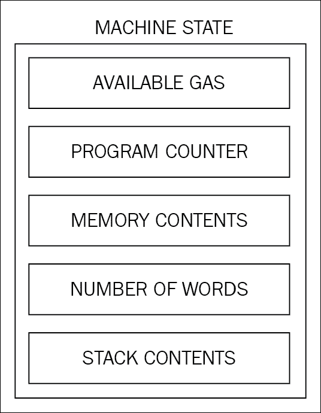

机器状态元组

如果在执行周期中遇到 STOP 或 SUICIDE 或 RETURN 操作码，虚拟机也能够在正常情况下停止执行。

使用 serpent、LLL 或 Solidity 等高级语言编写的代码被转换为 EVM 可理解的字节码，以便通过 EVM 执行。Solidity 是为以太坊开发的高级语言，具有类似 JavaScript 的语法，用于编写智能合约代码。一旦代码编写完成，它就会被编译成可被 EVM 理解的字节码，使用名为 solc 的 Solidity 编译器。

**LLL**（类似 Lisp 的低级语言）是另一种用于编写智能合约代码的语言。Serpent 是一种类似 Python 的高级语言，可用于为以太坊编写智能合约。

例如，一个简单的 Solidity 程序如下所示：

```
pragma solidity ⁰.4.0; 
contract Test1
 { 
    uint x=2; 
    function addition1(uint x) returns (uint y) { 
    y=x+2; 
 } 
}  

```

该程序转换为字节码，如下所示。如何编译 Solidity 代码并附有示例将在下一章中给出。

#### 运行时字节码

```
606060405260e060020a6000350463989e17318114601c575b6000565b346000576029600435603b565b60408051918252519081900360200190f35b600281015b91905056 
Opcodes PUSH1 0x60 PUSH1 0x40 MSTORE PUSH1 0x2 PUSH1 0x0 SSTORE CALLVALUE PUSH1 0x0 JUMPI JUMPDEST PUSH1 0x45 DUP1 PUSH1 0x1A PUSH1 0x0 CODECOPY PUSH1 0x0 RETURN PUSH1 0x60 PUSH1 0x40 MSTORE PUSH1 0xE0 PUSH1 0x2 EXP PUSH1 0x0 CALLDATALOAD DIV PUSH4 0x989E1731 DUP2 EQ PUSH1 0x1C JUMPI JUMPDEST PUSH1 0x0 JUMP JUMPDEST CALLVALUE PUSH1 0x0 JUMPI PUSH1 0x29 PUSH1 0x4 CALLDATALOAD PUSH1 0x3B JUMP JUMPDEST PUSH1 0x40 DUP1 MLOAD SWAP2 DUP3 MSTORE MLOAD SWAP1 DUP2 SWAP1 SUB PUSH1 0x20 ADD SWAP1 RETURN JUMPDEST PUSH1 0x2 DUP2 ADD JUMPDEST SWAP2 SWAP1 POP JUMP 

```

### 操作码及其含义

在 EVM 中引入了不同的操作码。操作码根据其执行的操作进行多个类别的划分。这里呈现了操作码及其含义和用法的列表。

#### 算术操作

在 EVM 中，所有算术运算都是模 2²⁵⁶ 运算。这组操作码用于执行基本算术运算。这些操作的值从 0x00 开始，最高为 0x0b。

| **助记符** | **值** | **弹出** | **推入** | **Gas** | **描述** |
| --- | --- | --- | --- | --- | --- |
| STOP | 0x00 | 0 | 0 | 0 | 终止执行 |
| ADD | 0x01 | 2 | 1 | 3 | 两个值相加 |
| MUL | 0x02 | 2 | 1 | 5 | 两个值相乘 |
| SUB | 0x03 | 2 | 1 | 3 | 减法操作 |
| DIV | 0x04 | 2 | 1 | 5 | 整数除法操作 |
| SDIV | 0x05 | 2 | 1 | 5 | 有符号整数除法操作 |
| MOD | 0x06 | 2 | 1 | 5 | 模余操作 |
| SMOD | 0x07 | 2 | 1 | 5 | 有符号模余操作 |
| ADDMOD | 0x08 | 3 | 1 | 8 | 模加操作 |
| MULMOD | 0x09 | 3 | 1 | 8 | 模乘操作 |
| EXP | 0x0a | 2 | 1 | 10 | 指数操作（底数的重复乘法） |
| SIGNEXTEND | 0x0b | 2 | 1 | 5 | 扩展 2 的补码有符号整数长度 |

请注意，STOP 不是算术操作，但由于其值范围为 0，因此被归类为这个算术操作（arithmetic operations）列表中。

#### 逻辑操作

逻辑操作包括用于执行比较和布尔逻辑操作的操作。这些操作的值范围为 0x10 到 0x1a。

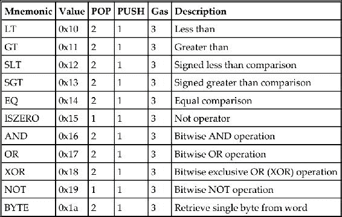

#### 加密操作

在这个类别中只有一个操作被命名为 SHA3。值得注意的是，这不是 NIST 标准化的标准 SHA3，而是原始的 Keccak 实现。

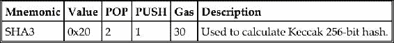

#### 环境信息

在这个类别中总共有 13 条指令。这些操作码用于提供与地址、运行时环境和数据复制操作相关的信息。

| **助记符** | **值** | **弹出** | **推入** | **Gas** | **描述** |
| --- | --- | --- | --- | --- | --- |
| ADDRESS | 0x30 | 0 | 1 | 2 | 用于获取当前执行账户的地址 |
| BALANCE | 0x31 | 1 | 1 | 20 | 用于获取给定账户的余额 |
| ORIGIN | 0x32 | 0 | 1 | 2 | 用于获取原始交易发送者的地址 |
| CALLER | 0x33 | 0 | 1 | 2 | 用于获取发起执行的账户地址 |
| CALLVALUE | 0x34 | 0 | 1 | 2 | 检索由指令或交易存入的价值 |
| CALLDATALOAD | 0x35 | 1 | 1 | 3 | 检索通过消息调用传递的参数输入数据 |
| CALLDATASIZE | 0x36 | 0 | 1 | 2 | 用于检索与消息调用传递的输入数据的大小 |
| CALLDATACOPY | 0x37 | 3 | 0 | 3 | 用于将消息调用传递的输入数据从当前环境复制到内存中。 |
| CODESIZE | 0x38 | 0 | 1 | 2 | 检索当前环境中正在运行的代码的大小 |
| CODECOPY | 0x39 | 3 | 0 | 3 | 将当前环境中的运行代码复制到内存中 |
| GASPRICE | 0x3a | 0 | 1 | 2 | 检索发起交易指定的燃气价格。 |
| EXTCODESIZE | 0x3b | 1 | 1 | 20 | 获取指定账户代码的大小 |
| EXTCODECOPY | 0x3c | 4 | 0 | 20 | 用于将账户代码复制到内存中。 |

#### 区块信息

这组指令与检索与区块相关的各种属性相关：

| **助记符** | **值** | **POP** | **PUSH** | **燃气** | **描述** |
| --- | --- | --- | --- | --- | --- |
| BLOCKHASH | 0x40 | 1 | 1 | 20 | 获取最近完成的 256 个区块中的一个的哈希 |
| COINBASE | 0x41 | 0 | 1 | 2 | 检索区块中设置的受益人地址 |
| TIMESTAMP | 0x42 | 0 | 1 | 2 | 检索区块中设置的时间戳 |
| NUMBER | 0x43 | 0 | 1 | 2 | 获取区块的编号 |
| DIFFICULTY | 0x44 | 0 | 1 | 2 | 获取区块的难度 |
| GASLIMIT | 0x45 | 0 | 1 | 2 | 获取区块的燃气限制值 |

#### 栈、内存、存储和流操作

| **助记符** | **值** | **POP** | **PUSH** | **燃气** | **描述** |
| --- | --- | --- | --- | --- | --- |
| POP | 0x50 | 1 | 0 | 2 | 从栈中移除项目 |
| MLOAD | 0x51 | 1 | 1 | 3 | 用于从内存中加载一个字。 |
| MSTORE | 0x52 | 2 | 0 | 3 | 用于将一个字存储到内存中。 |
| MSTORE8 | 0x53 | 2 | 0 | 3 | 用于将一个字节保存到内存中 |
| SLOAD | 0x54 | 1 | 1 | 50 | 用于从存储中加载一个字。 |
| SSTORE | 0x55 | 2 | 0 | 0 | 将一个字保存到存储中 |
| JUMP | 0x56 | 1 | 0 | 8 | 改变程序计数器 |
| JUMPI | 0x57 | 2 | 0 | 10 | 根据条件改变程序计数器 |
| PC | 0x58 | 0 | 1 | 2 | 用于在增量前检索程序计数器中的值。 |
| MSIZE | 0x59 | 0 | 1 | 2 | 检索活动内存的大小（以字节为单位）。 |
| GAS | 0x5a | 0 | 1 | 2 | 检索可用燃气量 |
| JUMPDEST | 0x5b | 0 | 0 | 1 | 用于标记在执行期间对机器状态没有影响的跳转的有效目的地。 |

#### Push 操作

这些操作包括 PUSH 操作，用于将项目放入栈中。这些指令的范围是从 0x60 到 0x7f。EVM 中总共有 32 个 PUSH 操作。PUSH 操作，它从程序代码的字节数组中读取。

| **助记符** | **值** | **POP** | **PUSH** | **燃气** | **描述** |
| --- | --- | --- | --- | --- | --- |
| PUSH1 . . . PUSH 32 | 0x60 ... 0x7f | 0 | 1 | 3 | 用于在堆栈上放置*N*个右对齐的大端字节项。 *N*是一个值，根据使用的助记符，范围从 1 字节到 32 字节（完整字）不等。 |

#### 复制操作

如其名称所示，复制操作用于复制堆栈项。 值的范围从 0x80 到 0x8f。 在 EVM 中有 16 个 DUP 指令可用。 放置在堆栈上或从堆栈上移除的项目随着使用的助记符而改变； 例如，DUP1 从堆栈中删除一个项目并将两个项目放在堆栈上，而 DUP16 从堆栈中删除 16 个项目并放置 17 个项目。

| **助记符** | **数值** | **POP** | **PUSH** | **Gas** | **描述** |
| --- | --- | --- | --- | --- | --- |
| DUP1 . . . DUP16 | 0x80 ... 0x8f | X | Y | 3 | 用于复制第*n*个堆栈项，其中*n*是对应于所使用的 DUP 指令的数字。 *X*和*Y*分别是从堆栈中移除和放置的项目。 |

#### 交换操作

SWAP 操作提供了交换堆栈项的能力。 有 16 个 SWAP 指令可用，并且随着每个指令的使用，堆栈项被递增地移除和放置，最多到 17 个项目，具体取决于使用的操作码类型。

| **助记符** | **数值** | **POP** | **PUSH** | **Gas** | **描述** |
| --- | --- | --- | --- | --- | --- |
| SWAP1 . . . SWAP16 | 0x90 ... 0x9f | X | Y | 3 | 用于交换第*n*个堆栈项，其中*n*是对应于使用的 SWAP 指令的数字。 *X* 和 *Y* 分别是从堆栈中移除和放置的项目。 |

#### 记录操作

记录操作提供了用于在子状态元组的日志序列字段上附加日志条目的操作码。 总共有四个日志操作可用，范围从值 0x0a 到 0xa4。

| **助记符** | **数值** | **POP** | **PUSH** | **Gas** | **描述** |
| --- | --- | --- | --- | --- | --- |
| LOG0 . . . LOG4 | 0x0a ... 0xa4 | X | Y (0) | 375,750,1125,1500,1875 | 用于附加具有*N*个主题的日志记录，其中*N*是与所使用的 LOG 操作码对应的数字。 例如，LOG0 表示没有主题的日志记录，LOG4 表示具有四个主题的日志记录。 *X* 和 *Y* 分别代表从堆栈上移除和放置的项目。 根据使用的 LOG 操作，*X*和*Y*会逐渐增加，从 2,0 到 6,0。 |

#### 系统操作

系统操作用于执行各种与系统相关的操作，例如账户创建，消息调用和执行控制。 在该类别中总共有六个操作码可用。

| **助记符** | **数值** | **POP** | **PUSH** | **Gas** | **描述** |
| --- | --- | --- | --- | --- | --- |
| CREATE | 0xf0 | 3 | 1 | 32000 | 用于创建具有相关代码的新账户。 |
| CALL | 0xf1 | 7 | 1 | 40 | 用于启动对账户的消息调用。 |
| CALLCODE | 0xf2 | 7 | 1 | 40 | 用于使用替代账户的代码启动对此账户的消息调用。 |
| RETURN | 0xf3 | 2 | 0 | 0 | 终止执行并返回输出数据。 |
| DELEGATECALL | 0xf4 | 6 | 1 | 40 | 与 CALLCODE 相同，但不改变发送方和值的当前值。 |
| SUICIDE | 0xff | 1 | 0 | 0 | 停止（中止）执行，并且账户被注册以便稍后删除 |

在本节中，已经讨论了所有的 EVM 操作码。在以太坊的 Homestead 发布中，总共有 129 个可用的 EVM 操作码。

# 预编译合约

以太坊有四个预编译合约。以下是这些合约及其详细信息的列表。

## 椭圆曲线公钥恢复函数

**ECDSARECOVER**（椭圆曲线 DSA 恢复函数）位于地址 1。它表示为 ECREC，并且执行时需要 3000 gas。如果签名无效，则此函数不返回任何输出。公钥恢复是一种标准机制，可以从椭圆曲线密码学中的私钥推导出公钥。

ECDSA 恢复函数如下所示：

*ECDSARECOVER(H, V, R, S) = Public Key*

它接受四个输入：H，它是要签名的消息的 32 字节哈希，以及 *V*、*R* 和 *S*，它们代表带有恢复 ID 的 ECDSA 签名，并产生一个 64 字节的公钥。*V*、*R* 和 *S* 在本章中之前已经详细讨论过。

## SHA-256 位哈希函数

SHA-256 位哈希函数是一个预编译合约，位于地址 2，并产生输入的 SHA256 哈希。它几乎就像是一个传递函数。SHA-256（SHA256）的燃气需求取决于输入数据的大小。输出是一个 32 字节值。

## RIPEMD-160 位哈希函数

RIPEMD-160 位哈希函数用于提供 RIPEMD 160 位哈希，并且位于地址 3。此函数的输出是一个 20 字节的值。与 SHA-256 类似，燃气需求取决于输入数据的量。

## 身份函数

身份函数位于地址 4 并且由 ID 表示。它简单地将输出定义为输入；换句话说，无论输入是什么，ID 函数都会输出相同的值。燃气需求通过一个简单的公式计算：*15 + 3 [I[d]/32]*，其中 *I[d]* 是输入数据。这意味着在高层次上，燃气需求取决于输入数据的大小，尽管进行了一些计算，如前面的方程所示。

所有先前提到的预编译合约都可以成为本机扩展，并且将来可以包含在 EVM 操作码中。

# 账户

账户是以太坊区块链的主要构建块之一。状态是由账户之间和账户上的交互导致的。在账户之间和账户上执行的操作代表状态转换。状态转换是通过所谓的以太坊状态转换函数实现的，其工作方式如下：

1.  通过检查语法、签名有效性和 nonce 来确认交易的有效性。

1.  计算交易费用，并使用签名解析发送地址。此外，检查并相应减少发送方的账户余额，并递增 nonce。如果账户余额不足，则返回错误。

1.  提供足够的以太（gas 价格）以支付交易成本。根据交易的大小，逐字节收费增加。

1.  在此步骤中，实际的价值转移发生。流程是从发送方账户到接收方账户。如果交易中指定的目标账户尚不存在，则会自动创建该账户。此外，如果目标账户是一个合约账户，则会执行合约代码。这也取决于可用的 gas 数量。如果有足够的 gas，则合约代码将被完全执行；否则，它将运行到用尽 gas 的地方。

1.  在由于账户余额不足或 gas 而导致交易失败的情况下，除了支付给矿工的手续费之外，所有状态更改都会被回滚。

1.  最后，将剩余的手续费（如果有）作为找零发送回发送方，并相应地支付手续费给矿工。在这一点上，函数返回结果状态。

## 账户类型

以太坊有两种类型的账户：

+   外部拥有账户

+   合约账户

首先是**外部拥有账户**（**EOAs**），另一个是合约账户。EOAs 类似于比特币中由私钥控制的账户。合约账户是与私钥一起关联有代码的账户。EOA 具有以太坊余额，能够发送交易，并且没有关联的代码，而**合约账户**（**CA**）具有以太坊余额，关联代码，并且能够在收到交易或消息时被触发并执行代码。值得注意的是，由于以太坊区块链的图灵完备性质，合约账户内的代码可以具有任何复杂程度。该代码由以太坊网络上的每个挖矿节点的 EVM 执行。此外，合约账户能够维护自己的永久状态并调用其他合约。预计在 serenity 版本中，可能会消除外部拥有账户和合约账户之间的区别。

# 区块

如前所述，区块是区块链的主要构建块。以太坊区块包含各种组件，描述如下：

+   区块头

+   交易列表

+   Ommers 或叔叔的头列表

交易列表简单来说就是包含在区块中的所有交易的列表。此外，叔叔的头列表也包含在区块中。最重要且最复杂的部分是区块头，在此讨论。

## 区块头

区块头是以太坊区块的最关键和详细的组件。头包含有价值的信息，以下将详细描述。 

### 父哈希

这是父（上一个）区块头的 Keccak 256 位哈希。

### 祖先哈希

这是包含在区块中的 Ommers（叔块）区块列表的 Keccak 256 位哈希。

### 受益人

受益人字段包含接收采矿奖励的 160 位地址，一旦区块成功挖掘完成，受益人将获得奖励。

### 状态根

状态根字段包含状态 trie 的根节点的 Keccak 256 位哈希。它是在所有交易被处理和结束后计算的。

### 交易根

交易根是交易 trie 的根节点的 Keccak 256 位哈希。交易 trie 表示包括在区块中的交易列表。 

### 收据根

收据根是交易收据 trie 的根节点的 keccak 256 位哈希。这个 trie 由包含在区块中的所有交易的收据组成。交易收据在每笔交易处理后生成，包含有用的交易后信息。更多关于交易收据的详细信息将在下一节中提供。

### 日志布隆

日志布隆是一个由每个区块中包含的交易清单的每个交易收据的日志器地址和日志主题组成的布隆过滤器。日志将在下一节中详细解释。

### 难度

当前区块的难度级别。

### 数字

所有先前区块的总数；起源区块是区块零。

### 燃气限制

该字段包含代表每个区块燃气消耗上限的值。

### 使用的燃气

该字段包含区块中包括的交易消耗的总燃气。

### 时间戳

时间戳是区块初始化时间的纪元 Unix 时间。

### 额外数据

额外数据字段可用于存储与区块相关的任意数据。

### Mixhash

Mixhash 字段包含一个 256 位哈希，一旦与随机数结合使用，可以证明已经花费了足够的计算工作来创建这个区块。

### 随机数

随机数是一个 64 位哈希（一个数字），用来证明，结合 Mixhash 字段，已经花费了足够的计算工作来创建这个区块。

以下图显示了区块和区块头的详细结构：

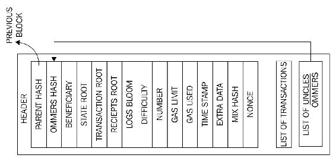

带有区块头的区块结构详细图

## 起源区块

起源区块在其所包含的数据和从普通区块创建方式上略有不同。它包含了 15 项描述如下。

从 Etherscan.io，实际版本如下所示：

| **元素** | **描述** |
| --- | --- |
| 时间戳 | （2015 年 7 月 30 日下午 03:26:13 +协调世界时） |
| 交易 | 该区块中包含 8893 笔交易和 0 笔合约内部交易 |
| 哈希 | 0xd4e56740f876aef8c010b86a40d5f56745a118d0906a34e69aec8c0db1cb8fa3 |
| 父哈希 | 0x0000000000000000000000000000000000000000000000000000000000000000 |
| Sha3 叔眷 | 0x1dcc4de8dec75d7aab85b567b6ccd41ad312451b948a7413f0a142fd40d49347 |
| 由谁挖掘 | 0x0000000000000000000000000000000000000000 在 15 秒内 |
| 难度 | 17,179,869,184 |
| 总难度 | 17,179,869,184 |
| 大小 | 540 字节 |
| Gas 限制 | 5,000 |
| Gas 使用 | 0 |
| Nonce | 0x0000000000000042 |
| 区块奖励 | 5 以太币 |
| 叔眷奖励 | 0 |
| 额外数据 | »èÛN4{NŒ"&#124;ƒpäµí3­³ÛiËÛz8áå ‚ú（十六进制：0x11bbe8db4e347b4e8c937c1c8370e4b5ed33adb3db69cbdb7a38e1e50b1b82fa） |

## 交易收据

交易收据被用作存储交易执行后的状态的机制。换句话说，这些结构被用于记录交易执行的结果。在每次交易执行完成后产生。所有收据都存储在索引键字典树中。这个字典树的根哈希（Keccak 256 位）被放置在区块头部作为收据根。它由在这里描述的四个元素组成。

### 交易后状态

该项是在交易执行后保存状态的字典树结构。它被编码为一个字节数组。

### 已使用的 Gas

这一项代表在包含交易收据的区块中所使用的总 Gas 数量。该值在交易执行完成后立即被取得。总 Gas 使用量预计应为非负整数。

### 日志集合

此字段显示作为交易执行结果创建的日志条目集合。日志条目包含记录者地址、一系列日志主题和日志数据。

### 布隆过滤器

从之前讨论的日志条目中所包含的信息创建了一个布隆过滤器。日志条目被简化为一个哈希值为 256 字节，然后作为日志布隆嵌入到区块头部。日志条目是由记录者地址、日志主题和日志数据组成的。日志主题被编码为一系列 32 字节的数据结构。日志数据由一些字节数据组成。

这个过程可以在以下图表中可视化：

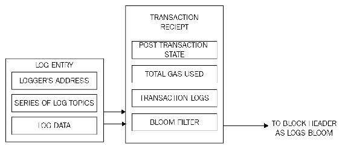

交易收据和日志布隆

## 交易验证和执行

交易在验证有效性后执行。初始测试如下所列：

+   一个交易必须是形式良好的，并且是没有额外的尾随字节的 RLP 编码的

+   用于签署交易的数字签名是有效的

+   交易 nonce 必须等于发送方账户的当前 nonce

+   Gas 限制不能小于交易使用的 Gas

+   发送方账户包含足够的余额来支付执行成本

### 交易子状态

在执行交易后立即被处理时产生了一个交易子状态。这个交易子状态是由三个项目组成的元组。

#### 自杀集合

此元素包含在执行事务后被处置的帐户列表。

#### 日志系列

这是一系列索引检查点，允许监视和通知与以太坊环境外部实体的合同调用，例如应用前端。它的工作方式类似于触发机制，每次调用特定函数或发生特定事件时执行。日志是响应智能合约中发生的事件而创建的。它还可以用作更便宜的存储形式。事件将在第八章 *以太坊开发*中通过实际示例进行讨论。

#### 退款余额

这是发起执行的交易中的气体总价格。退款不会立即执行；相反，它们被用来部分抵消总执行成本。

以下图描述了事务子状态元组：

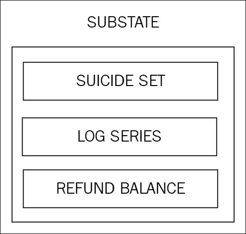

子状态元组

## 块验证机制

如果 Ethereum 块通过以下检查，则视为有效：

+   与 Uncles 和交易一致。这意味着所有 Ommers（Uncles）满足它们确实是 Uncles 的属性，并且 Uncles 的工作证明是否有效。

+   如果先前的块（父块）存在且有效。

+   如果块的时间戳有效。这基本上意味着当前块的时间戳必须高于父块的时间戳。此外，它应该在未来 15 分钟之内。所有块时间都以纪元时间（Unix 时间）计算。

如果这些检查中的任何一个失败，该块将被拒绝。

### 块最终化

块最终化是由矿工运行的过程，目的是验证块的内容并应用奖励。它导致执行四个步骤。这些步骤在此详细描述。

#### Ommers 验证

验证 Ommers（也称为已过时的块 Uncles）。在挖矿的情况下，确定 Ommers。过时块头的验证过程检查头是否有效以及 Uncle 与当前块的关系是否满足最大深度为六个块。一个块最多可以包含两个 Uncles。

#### 交易验证

验证交易。在挖矿的情况下，确定交易。该过程涉及检查块中使用的总气体是否等于最终交易后的最终气体消耗。

#### 奖励申请

应用奖励，这意味着更新受益者帐户的奖励余额。在以太坊中，矿工还为过时的块提供奖励，这是块奖励的 1/32。包含在块中的 Uncles 还将获得总块奖励的 7/8。当前块奖励为 5 个以太。一个块最多可以有两个 Uncles。

#### 状态和随机数验证

验证状态和随机数。在挖矿的情况下，计算一个有效的状态和随机数。

### 块难度

如果两个区块之间的时间缩短，则区块难度会增加，而如果两个区块之间的时间增加，难度也会增加。这是为了保持大致一致的区块生成时间。以太坊家园版发布的难度调整算法如下所示：

```
block_diff = parent_diff + parent_diff // 2048 *  
max(1 - (block_timestamp - parent_timestamp) // 10, -99) +  
int(2**((block.number // 100000) - 2))  

```

前述算法意味着，如果父区块和当前区块生成之间的时间差小于 10 秒，则难度增加。如果时间差在 10 到 19 秒之间，则难度级别保持不变。最后，如果时间差为 20 秒或更多，则难度级别降低。这种降低与时间差成比例。

除了基于时间戳差异的难度调整外，在前述算法的最后一行还有另一部分，即在每挖出 100,000 个区块后难度会呈指数增长。这就是以太坊网络引入的所谓*难度时间炸弹*或*冰河时代*，它将在未来某个时间点使在以太坊区块链上的挖矿变得非常困难。这将鼓励用户转向权益证明，因为在工作量证明链上的挖矿最终将变得极其困难。根据最新的更新和基于算法的估计，区块生成时间将在 2017 年下半年显著增加，在 2021 年将变得如此之高，以至于在工作量证明链上挖矿几乎不可能。这样一来，矿工们将别无选择，只能转向以太坊提出的叫做卡斯珀的权益证明方案。

# 以太币

以太币是由矿工挖矿产生的作为奖励的货币，用于支付他们在验证和验证交易和区块的过程中所花费的计算工作。以太币在以太坊区块链内用于支付在 EVM 上执行合约的费用。以太币用于购买作为加密燃料的 Gas，这是在以太坊区块链上执行计算所需的。

分数表如下所示：

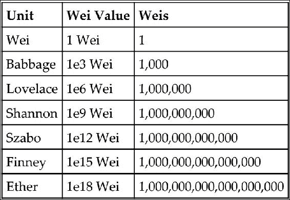

每次 EVM 在区块链上执行计算都会收取费用。详细的费用表将在接下来的部分中展示。

## Gas

每次在以太坊区块链上执行操作时都需要支付 gas。这是一种机制，它确保了由于 EVM 的图灵完备性质，无限循环不能导致整个区块链因而停滞。交易费用以一定数量的以太币收取，并从交易发起者的帐户余额中扣除。交易费用是为了让矿工将交易包含在挖掘中而收取的。如果此费用过低，则可能永远不会被挑选出来；费用越高，被矿工挑选出来并包含在区块中的机会就越大。相反，如果矿工将费用适当支付的交易包含在区块中，但要执行的操作过于复杂，则如果 gas 成本不足，可能会导致 gas 耗尽异常。在这种情况下，交易将失败，但仍将被包含在区块中，并且交易发起者将不会获得任何退款。

交易成本可以使用以下公式估算：

*总成本 = gasUsed * gasPrice*

在这里，*gasUsed* 是交易在执行过程中应该使用的总 gas，*gasPrice* 是由交易发起者指定的奖励给矿工的激励，以便将交易包含在下一个区块中。这以以太币指定。每个 EVM 操作码都分配了一个费用。这只是一个估计，因为实际使用的 gas 可能会比交易发起者最初指定的值多或少。例如，如果计算时间过长或者智能合约的行为随其他因素的变化而改变，那么交易执行可能会执行比最初预期的更多或更少的操作，从而导致消耗更多或更少的 gas。如果执行耗尽了 gas，一切都会立即回滚；否则，如果执行成功且还有一些剩余的 gas，则会将其返回给交易发起者。

每个操作都会消耗一些 gas；以下是一些操作的高级费用计划示例：

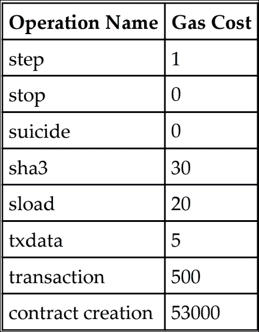

根据前面的费用计划和前面讨论的公式，可以计算 SHA3 操作的示例计算如下：

+   SHA3 消耗 30 gas

+   当前 gas 价格为 25 GWei，相当于 0.000000025 以太币

+   将两者相乘：*0.000000025 * 30 = 0.00000075* 以太币

总共，0.00000075 以太币是将被收取的总 gas。

## 费用计划

作为执行操作的先决条件，gas 在三种情况下被收取：

+   操作的计算

+   用于合约创建或消息调用

+   内存使用增加

在本章节之前提供了一系列指令和具有 gas 值的各种操作。

# 消息

消息，如黄皮书所定义，是在两个账户之间传递的数据和价值。消息是在两个账户之间传递的数据包。这个数据包包含数据和价值（以太币数量）。它可以通过智能合约（自治对象）发送，也可以通过数字签名的方式由外部参与者（外部用户账户）发出的交易方式发送。

合同可以向其他合同发送消息。消息只存在于执行环境中，永远不会被存储。消息类似于交易；然而，主要区别在于它们是由合同产生的，而交易是由以太坊环境外部实体（外部用户账户）产生的。

一条消息由这里提到的组件组成：

1.  消息的发送者

1.  消息的接收者

1.  欲转移的 Wei 数量和消息到合同地址

1.  可选的数据字段（合同的输入数据）

1.  可以消耗的最大燃气数量

当合同执行`CALL`或`DELEGATECALL` 操作码时生成消息。

## 调用

调用不会向区块链广播任何内容；相反，它是对合同函数的本地调用，并在节点上本地运行。它几乎像是本地函数调用。由于它是一个只读操作，因此它不会消耗任何燃气。这类似于试运行。调用在节点上本地执行，通常不会导致任何状态变化。在黄皮书中定义，这是将消息从一个账户传递到另一个账户的行为。如果目标帐户有关联的 EVM 代码，那么虚拟机将在接收消息后启动以执行所需的操作。如果消息发送者是一个自治对象，那么调用将传递虚拟机操作返回的任何数据。

状态通过交易改变。这些交易由外部因素创建，签名然后广播到以太坊网络。

# 挖矿

挖矿是向区块链添加新货币的过程。这是矿工验证和验证由交易组成的区块的激励。挖矿过程通过验证计算来帮助确保网络安全。

在理论层面上，矿工执行以下功能：

1.  监听在以太坊网络上广播的交易，并确定要处理的交易。

1.  确定过时的块，称为 Uncles 或 Ommers，并将它们包含在块中。

1.  更新账户余额，获得成功挖矿的奖励。

1.  最后，计算出一个有效状态并完成块，这定义了所有状态转换的结果。

当一个块被认为是有效时，它不仅必须满足一般的一致性要求，还必须包含给定难度的工作证明。

随着 serenity 发布，工作量证明算法将被权益证明算法取代。已经进行了大量的研究工作，以构建适用于以太坊网络的权益证明算法。

已经开发了一种名为 Casper 的算法，它将替换以太坊中现有的工作量证明算法。这是一个基于经济协议的安全押金，节点需要在它们能够产生区块之前放置一个安全押金。在 Casper 中，节点被称为有抵押验证器，而放置押金的行为被称为绑定。

## Ethash

**Ethash** 是以太坊使用的工作量证明算法的名称。最初，这被提出为“Dagger-Hashimoto”算法，但自第一次实施以来发生了许多变化，而 PoW 算法现在已经演变为现在所知的 Ethash。与比特币类似，挖矿背后的核心思想是找到一个一旦哈希的随机数在预定的难度级别下结果。最初，以太坊刚刚推出时的难度很低，即使是 CPU 和单个 GPU 挖矿也是有利可图的，但现在情况已经不再如此。现在，要么是挖矿合集有利可图，要么是大型 GPU 挖矿农场被用于挖矿目的。

Ethash 是一种内存硬算法，这使得在专用硬件上实施它变得困难。与比特币一样，ASIC 已经被开发出来，这多年来导致了挖矿的集中化，但内存硬工作量证明算法是阻止这种威胁的一种方式，以太坊实现了 Ethash 来阻止 ASIC 发展用于挖矿。该算法需要根据随机数和区块头部选择一个称为**DAG**（**有向无环图**）的固定资源的子集。DAG 大约有 2 GB 大小，并且每 30000 个区块改变一次。只有当 DAG 第一次完全生成时，挖矿才能开始。每 30000 个区块之间的时间大约为 5.2 天，称为纪元。这个 DAG 被称为 Proof of Work 算法 Ethash 的种子。根据当前的规格，纪元时间被定义为 30000 个区块。

当成功找到有效随机数时，当前的奖励方案是 5 以太。除了获得 5 以太外，成功的矿工还会获得区块内消耗的 gas 的费用以及将陈旧区块（叔块）包含在区块中的额外奖励。每个区块最多允许两个叔块，并且以正常区块奖励的 7/8 进行奖励。为了实现 12 秒的区块时间，每个区块都会调整难度。奖励与矿工的哈希速率成正比，这基本上意味着矿工可以有多快地进行哈希计算。

挖矿可以通过简单地加入以太坊网络并运行适当的客户端来进行。关键要求是节点在挖矿开始之前应完全与主网络同步。

在即将到来的章节中，将提到各种挖矿方法。

## CPU 挖矿

即使在主网上不盈利，CPU 挖矿仍然在测试网络或甚至私有网络上进行挖掘和合约部署实验中非常有价值。私有和测试网络将在下一章节中通过实际示例进行讨论。此处展示了如何启动 CPU 挖矿的 geth 示例。可以通过 mine 开关启动 geth 以开始挖矿：

```
geth --mine --minerthreads <n>

```

使用 web 3 geth 控制台也可以启动 CPU 挖矿。通过发出以下命令可以启动 geth 控制台：

```
geth attach 

```

然后，可以通过发出以下命令启动挖矿程序，如果成功将返回 true，否则返回 false。看看下面的命令：

```
Miner.start(4)
True

```

上述命令将启动带有四个线程的挖矿程序。看看下面的命令：

```
Miner.stop
True

```

上述命令将停止挖矿程序。如果成功，该命令将返回 true。

## GPU 挖矿

在基本水平上，通过运行两个命令可以轻松进行 GPU 挖矿：

```
geth --rpc

```

一旦 geth 运行起来并且区块链完全下载完成，就可以运行 Ethminer 以开始挖矿。Ethminer 是一个独立的挖矿程序，也可以在农场模式下用于贡献到挖矿池。可以从[`github.com/Genoil/cpp-ethereum/tree/master/releases`](https://github.com/Genoil/cpp-ethereum/tree/master/releases)下载：

```
ethminer -G

```

使用`G`开关运行假设已安装并正确配置适当的显卡。如果找不到适当的显卡，ethminer 会返回错误，如下图所示：

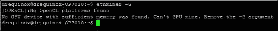

如果找不到适当的 GPU 则出现错误

GPU 挖矿需要一块 AMD 或 Nvidia 显卡和适用的 OpenCL SDK。对于 Nvidia 芯片组，可以从[`developer.nvidia.com/cuda-downloads`](https://developer.nvidia.com/cuda-downloads)下载。对于 AMD 芯片组，可在[`developer.amd.com/tools-and-sdks/opencl-zone/amd-accelerated-parallel-processing-app-sdk`](http://developer.amd.com/tools-and-sdks/opencl-zone/amd-accelerated-parallel-processing-app-sdk)下载。

一旦显卡安装并正确配置，可以通过发出`ethminer -G`命令启动该进程。

Ethminer 也可以用于运行基准测试，如下图所示。可以调用两种模式进行基准测试。可以是 CPU 或 GPU。命令如下所示。

### CPU 基准测试

```
$ ethminer -M -C

```

### GPU 基准测试

```
$ ethminer -M -G

```

下图示例展示了 CPU 挖矿基准测试：

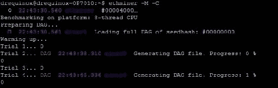

CPU 基准测试

也可以在命令行中指定要使用的 GPU 设备：

```
$ ethminer -M -G --opencl-device 1

```

由于 GPU 挖矿是使用 OpenCL AMD 实现的，基于芯片组的 GPU 比 NVidia GPU 工作得更快。由于高内存需求（DAG 创建），FPGAs 和 ASICs 不会比 GPU 提供任何主要优势。这是有意为之，以阻止为挖矿开发专用硬件。

## 挖矿机

随着挖掘以太坊的难度随时间增加，矿工开始建造带有多个 GPU 的挖矿设备。一个挖矿设备通常包含约五块 GPU 卡，它们都并行工作进行挖矿，从而提高了挖掘有效 nonce 的几率。

挖矿设备可以通过一些努力来构建，也可以从各种供应商处商业购买。典型的挖矿设备配置包括后续章节讨论的组件。

### 主板

需要一个具有多个 PCI-E x1 或 x16 插槽的专用主板，例如 BIOSTAR Hi-Fi 或 ASRock H81。

### SSD 硬盘

需要一个 SSD 硬盘。推荐使用 SSD 硬盘，因为它比模拟等效硬盘性能更快。这将主要用于存储区块链。

### GPU

GPU 是挖矿设备中最重要的组件，因为它是主要的工作马，将用于挖矿。例如，它可以是一块 Sapphire AMD Radeon R9 380，配备 4 GB RAM。

Linux Ubuntu 的最新版本通常被选择作为挖矿设备的操作系统。还有另一种 Linux 变体可用，称为 EthOS（可在[`ethosdistro.com/`](http://ethosdistro.com/)找到），专门用于以太坊挖矿，并支持本地挖矿操作。

最后，安装了 Ethminer 和 geth 等挖矿软件。此外，还安装了一些远程监控和管理软件，以便需要时可以远程监视和管理挖矿设备。同样重要的是要安装适当的空调或冷却机制，因为运行多个 GPU 可能会产生大量热量。这也需要使用适当的监控软件，以便在硬件出现任何问题时提醒用户，例如 GPU 过热。

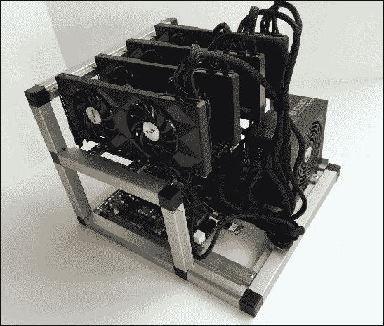

在 eBay 上出售的以太坊挖矿设备

## 挖矿池

有许多在线挖矿池提供以太坊挖矿服务。可以使用 Ethminer 通过以下命令连接到挖矿池。每个挖矿池都会发布自己的指南，但通常连接到池的过程相似。这里以 [ethereumpool.co](http://ethereumpool.co) 为例：

```
ethminer -C -F http://ethereumpool.co/?miner=0.1@0x024a20cc5feba7f3dc3776075b3e60c20eb1459c@DrEquinox

```

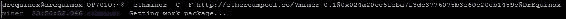

ethminer 的屏幕截图

# 客户端和钱包

由于以太坊正处于快速发展和演变之中，过去几年中已开发和推出了许多组件、客户端和工具。以下是可用于以太坊的所有主要组件、客户端软件和工具的列表。提供此列表是为了减少许多可用于以太坊的工具和客户端的歧义性。此处提供的列表还解释了各种组件的用途和重要性。

## Geth

这是以太坊客户端的 Go 语言实现。

## 以太坊

这是以太坊客户端的 C++实现。

## Pyethapp

这是以太坊客户端的 Python 实现。

## Parity

此实现是使用 Rust 构建的，并由 EthCore 开发。 EthCore 是一家致力于开发 parity 客户端的公司。 Parity 可以从[`ethcore.io/parity.html`](https://ethcore.io/parity.html)下载。

## 轻量级客户端

SPV 客户端仅下载区块链的一个小子集。这允许低资源设备，如手机、嵌入式设备或平板电脑，能够验证交易。在这种情况下，不需要完整的以太坊区块链和节点，SPV 客户端仍然可以验证交易的执行。SPV 客户端也称为轻量级客户端。这个想法类似于比特币 SPV 客户端。在 iOS 和 Android 上可以安装的 Jaxx 提供了一个钱包，它提供了**SPV**（**简单支付验证**）功能，网址是[`jaxx.io/`](https://jaxx.io/)。

## 安装

下面的安装过程描述了在 Ubuntu 系统上安装各种以太坊客户端的过程。其他操作系统的说明可以在以太坊维基上找到。由于后面的示例将使用 Ubuntu 系统，因此这里仅描述了在 Ubuntu 上的安装。

**Geth 客户端**可以通过在 Ubuntu 系统上使用以下命令安装：

```
> sudo apt-get install -y software-properties-common
> sudo add-apt-repository -y ppa:ethereum/ethereum
> sudo apt-get update
> sudo apt-get install -y ethereum

```

完成安装后。只需在命令提示符处发出`geth`命令，即可启动 Geth，因为它预先配置了连接到现场以太网的所有必需参数：

```
> geth

```

### Eth 安装

Eth 是以太坊客户端的 C ++实现，可以使用以下命令在 Ubuntu 上安装：

```
> sudo apt-get install cpp-ethereum 

```

### Mist 浏览器

Mist 浏览器是一个用户友好的界面，用于最终用户，具有功能丰富的图形用户界面，用于浏览 DAPPS 以及账户和合同管理。 Mist 的安装在下一章中介绍。

第一次启动 Mist 时，它将在后台初始化 geth 并与网络同步。根据网络的速度和类型，完全与网络同步可能需要几个小时到几天不等的时间。如果使用 TestNet，则同步相对较快，因为 TestNet（Ropsten）的大小不如 MainNet 大。有关如何连接到 TestNet 的更多信息将在下一章中提供。

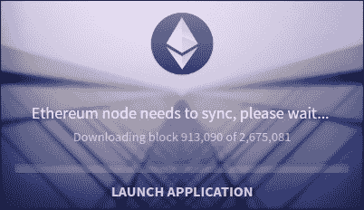

Mist 浏览器启动并与主网络同步

Mist 浏览器不是一个钱包; 实际上，它是一个 DAPPS 浏览器，并为创建和管理合同、账户和浏览去中心化应用程序提供了用户友好的用户界面。以太坊钱包是随 Mist 一起发布的 DAPP。

钱包是一个通用程序，可以存储私钥和关联账户，并且根据其中存储的地址，可以通过查询区块链计算与这些地址相关联的以太的现有余额。

其他钱包包括但不限于 MyEtherWallet，这是一个用 JavaScript 开发的开源以太坊钱包。MyEtherWallet 在客户端浏览器中运行。该网址为 [`www.myetherwallet.com`](https://www.myetherwallet.com)。

Icebox 由 Consensys 开发。这是一个冷存储浏览器，提供以太币的安全存储。这取决于运行 Icebox 的计算机是否连接到互联网。

以太坊有多种钱包可供桌面、移动和 Web 平台使用。一个名为 Jaxx 的流行 Ethereum iOS 钱包如下图所示：

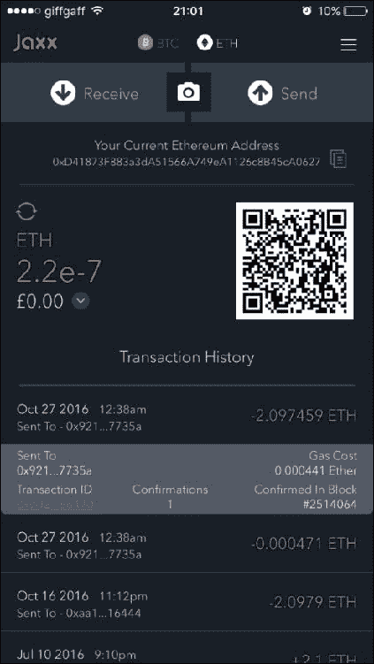

Jaxx 以太坊 iOS 钱包显示交易和当前余额

区块链同步完成后，Mist 将启动并显示以下界面。在本示例中，显示了四个账户，但没有余额：

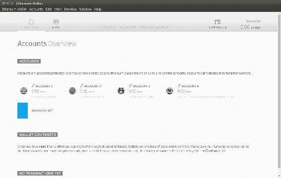

Mist 浏览器

新账户可以通过多种方式创建。在 Mist 浏览器中，可以通过单击**账户**菜单并选择**新建账户**，或者在 Mist 账户概览屏幕上单击**添加账户**选项来创建。

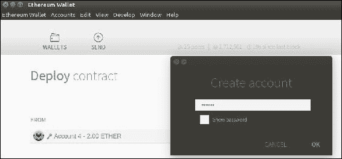

添加新账户

账户需要设置密码，如上图所示；一旦账户设置完成，它将显示在 Mist 浏览器的账户概览部分。

也可以通过命令行使用 geth 或 parity 命令行界面添加账户。此过程在下一节中显示。

### Geth

```
$ geth account new 
Your new account is locked with a password. Please give a password. Do not forget this password. 
Passphrase: 
Repeat passphrase: 
Address: {21c2b52e18353a2cc8223322b33559c1d900c85d} 
drequinox@drequinox-OP7010:~$

```

可以使用以下命令使用 geth 显示账户列表：

```
$ geth account list 

Account #0: {11bcc1d0b56c57aefc3b52d37e7d6c2c90b8ec35} /home/drequinox/.ethereum/keystore/UTC--2016-05-07T13-04-15.175558799Z--11bcc1d0b56c57aefc3b52d37e7d6c2c90b8ec35 

Account #1: {e49668b7ffbf031bbbdab7a222bdb38e7e3e1b63} /home/drequinox/.ethereum/keystore/UTC--2016-05-10T19-16-11.952722205Z--e49668b7ffbf031bbbdab7a222bdb38e7e3e1b63 

Account #2: {21c2b52e18353a2cc8223322b33559c1d900c85d} /home/drequinox/.ethereum/keystore/UTC--2016-11-29T22-48-09.825971090Z--21c2b52e18353a2cc8223322b33559c1d900c85d

```

### geth 控制台

可以使用 geth JavaScript 控制台执行各种功能。例如，可以通过附加 geth 创建账户。

可以将 Geth 附加到运行的守护程序中，如下图所示：

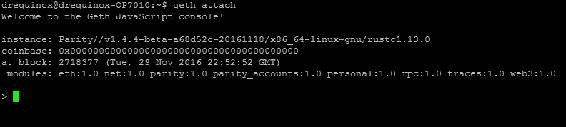

一旦成功将 geth 附加到以太坊客户端的运行实例（在本例中为 parity），它将显示命令提示符'*>*'，该提示符提供了一个交互式命令行界面，以使用 JavaScript 符号与以太坊客户端进行交互。

例如，可以使用以下命令在 geth 控制台中添加新账户：

```
> personal.newAccount() 
Passphrase: 
Repeat passphrase: 
"0xc64a728a67ba67048b9c160ec39bacc5626761ce" 
>

```

可以类似地显示账户列表：

```
> eth.accounts 
["0x024a20cc5feba7f3dc3776075b3e60c20eb1459c", "0x11bcc1d0b56c57aefc3b52d37e7d6c2c90b8ec35", "0xdf482f11e3fbb7716e2868786b3afede1c1fb37f", "0xe49668b7ffbf031bbbdab7a222bdb38e7e3e1b63", "0xf9834defb35d24c5a61a5fe745149e9470282495"]

```

### 使用比特币为账户充值

这个选项在 Mist 浏览器中可用，通过单击账户然后选择资助账户选项。此操作使用的后端引擎是 shapeshift.io，可以用来从比特币或其他货币（包括法定货币选项）资助账户。

交易完成后，转移的以太币将出现在账户中。

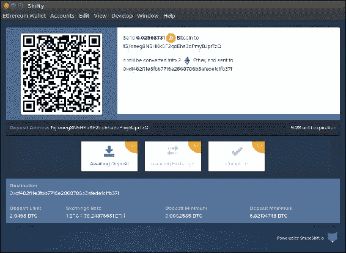

## Parity 安装

Parity 是以太坊客户端的另一个实现。它是使用 Rust 编程语言编写的。parity 开发的主要目标是高性能、小占地面积和可靠性。在 Ubuntu 或 Mac 系统上可以使用以下命令安装 parity：

```
bash <(curl https://get.parity.io -Lk)

```

这将启动 parity 客户端的下载和安装。安装 parity 完成后，安装程序还将提供安装 netstats 客户端的选项。netstat 客户端是在后台运行的守护程序，会收集重要统计信息并在 [stats.ethdev.com](http://stats.ethdev.com) 上显示。

示例中展示了 parity 的一个示例安装情况，如下截图所示：

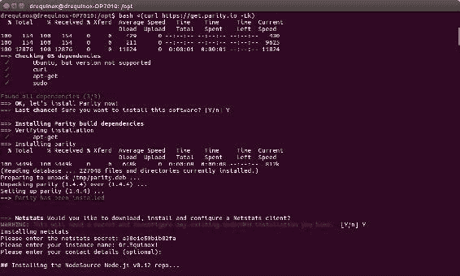

安装成功后，将显示以下消息。然后可以使用 `parity -j` 启动以太坊 parity 节点。如果需要与 geth 兼容以便在 parity 中使用以太坊钱包（Mist 浏览器），则应使用 `parity -geth` 命令运行 parity。这将以 geth 客户端的兼容模式运行 parity，并允许 Mist 在 parity 之上运行。

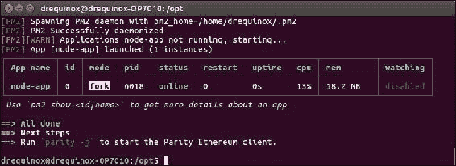

parity 安装

客户端还可以选择在 [`ethstats.net/`](https://ethstats.net/) 上列出。示例如下所示：


所有连接的客户端都会显示在 ethstats.net 上，如下截图所示。这些客户端会列出相关属性，例如节点名称、节点类型、延迟、挖矿状态、对等节点数量、待处理交易数量、上一个区块、难度、区块交易量和叔块数量。


客户端在 [`ethstats.net/`](https://ethstats.net/) 上列出。

Parity 还提供了一个用户友好的 web 界面，可以在该界面上管理各种任务，如账户管理、地址簿管理、DAPP 管理、合约管理以及状态和签名者操作。

可以通过发出以下命令访问此内容：

```
$ parity ui

```

这将弹出以下界面：

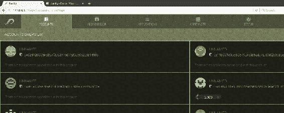

parity 用户界面。

如果 parity 正在以 geth 兼容模式运行，则会禁用 parity UI。为了同时启用 UI 和 geth 兼容性，可以使用以下命令：

```
$ parity --geth --force-ui

```

上述命令将以 geth 兼容模式启动 parity，并启用 web 用户界面。

### 使用 parity 命令行创建账户

可以使用以下命令使用 parity 创建新账户：

```
$ parity account new
Please note that password is NOT RECOVERABLE.
Type password:
Repeat password:
2016-11-30 02:18:55 UTC c8c92a910cfbce2e655c88d37a89b6657d1498fb

```

# 交易与投资

以太币可在各个交易所进行买卖。撰写本文时，以太坊的当前市值为£680,277,967，一枚以太币的价值为£7.89。最近，由于最近以太坊遭受攻击以及随后在以太坊网络上进行的分叉，价格非常波动且显著下降。

下图显示了历史市值的详细信息：

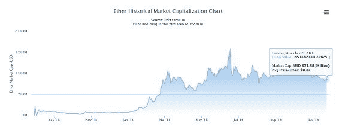

以太历史市值（来源 Etherscan.io）

以太可以在各种交易所购买，也可以进行挖掘。有一些在线服务，如[shapeshift.io](http://shapeshift.io)，可以实现货币间的转换。

各种在线交易所，如 kraken、coinbase 等，提供以太以便用信用卡或其他虚拟货币，如比特币购买。

# 黄皮书

以太坊黄皮书由*加文·伍德博士*撰写，作为以太坊协议的正式定义。任何人都可以按照该论文中定义的协议规范来实现以太坊客户端。这篇论文对于那些没有代数或数学背景，不熟悉数学符号的读者来说可能有些难以理解。

论文中提供了所有符号及其意义的列表，以便更容易阅读论文。一旦了解了符号的含义，就会很容易理解和欣赏黄皮书中描述的概念和规范。

## 有用的符号

| **符号** | **意义** | **符号** | **意义** |
| --- | --- | --- | --- |
| ≡ | 定义为 | ≤ | 小于或等于 |
| = | 等于 |  | Sigma，世界状态 |
| ≠ | 不等于 |  | Mu，机器状态 |
| ║...║ | 长度为 |  | Upsilon，以太坊状态转换函数 |
|  | 是元素 |  | 区块级状态转换函数 |
|  | 不是元素 | . | 序列连接 |
|  | 对于所有 |  | 存在 |
|  | 并集 | ᴧ | 合约创建函数 |
|  | 逻辑与 |  | 递增 |
| : | 这样的 |  |  |
| {} | 集合 |  |  |
| () | 元组函数 |  |  |
| [] | 数组索引 |  |  |
|  | 逻辑或 |  |  |
| > | 大于 |  |  |
| + | 加法 |  |  |
| - | 减法 |  |  |
| ∑ | 求和 |  |  |
| { | 描述 if，otherwise 的各种情况 |  |  |
|  | 下取整，最低元素 |  |  |
|  | 上取整，最高元素 |  |  |
|  | 字节数 |  |  |
|  | 异或 |  |  |
| (a,b) | 实数 >= a 且 < b |  |  |
|  | 空集，空值 |  |  |

# 以太坊网络

以太坊网络是一个点对点网络，节点参与其中以维护区块链并促进共识机制。根据需求和使用情况，网络可以分为三种类型。

## MainNet

MainNet 是以太坊当前的实时网络。MainNet 的当前版本是 Homestead。

## TestNet

TestNet 也称为 Ropsten，是以太坊区块链的测试网络。该区块链用于测试智能合约和 DApp，然后再部署到生产实时区块链。此外，作为测试网络，它允许实验和研究。

## 私有网络

顾名思义，这是可以通过生成新的创世块来创建的私有网络。这通常是分布式账本网络中的情况，在该网络中，一组私有实体启动自己的区块链并将其用作权限控制的区块链。

关于如何连接测试网络和如何设置私有网络的更多讨论将在下一章中进行。

## 支持的协议

有各种各样的支持协议正在开发中，以支持完全去中心化的生态系统。这包括 whisper 和 Swarm 协议。除了合同层（即核心区块链层）之外，还有其他需要去中心化的层，以实现完全去中心化的生态系统。这包括去中心化存储和去中心化消息传递。Whisper 正在为以太坊开发，是一种去中心化的消息传递协议，而 Swarm 是一种去中心化的存储协议。这两种技术目前正在开发中，并被设想为提供完全去中心化网络的基础。在接下来的部分中，将详细讨论这两种技术。

### Whisper

Whisper 为以太坊网络提供了去中心化的点对点消息传递能力。实质上，whisper 是一种通信协议，节点使用它来相互通信。消息的数据和路由在 whisper 通信中是加密的。此外，它被设计用于较小的数据传输和不需要实时通信的场景。Whisper 还被设计为提供一个通信层，不能被追踪，并为各方提供“暗通信”。区块链可以用于通信，但这很昂贵，而且节点之间交换的消息并不真正需要共识。因此，whisper 可以用作允许

Whisper 已经与 geth 一起提供，并可以在运行 geth 以太坊客户端时使用`--shh`选项启用。

### Swarm

Swarm 正在作为一个分布式文件存储平台进行开发。它是一个去中心化、分布式和点对点的存储网络。在该网络中，文件通过其内容的哈希进行寻址。这与传统的集中式服务形成对比，其中存储仅在中央位置可用。这是作为以太坊 Web 3.0 栈的本地基础层服务开发的。Swarm 与 Ethereum 的多协议网络层 DevP2P 集成。Swarm 设想为以太坊 Web 3.0 提供一个**DDOS**（分布式拒绝服务）-抵抗和容错的分布式存储层。尽管 Swarm 的概念验证和 alpha 代码已发布，但尚无稳定的生产版本可用。

下图概述了 Swarm 和 Whisper 如何结合并与区块链配合工作的高层次概述：

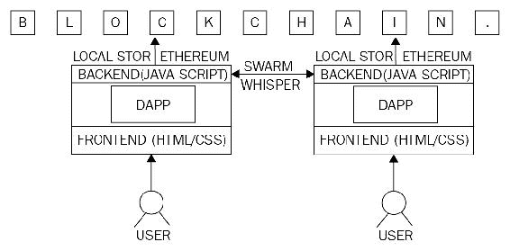

图表展示了区块链、Whisper 和 Swarm。

# 在以太坊上开发的应用程序。

在以太坊上有各种 DAO 和智能合约的实现，其中最显著的是*DAO*，它最近被黑客攻击，需要进行硬分叉才能恢复资金。DAO 被创建为一个分散的平台，用于收集和分发投资。

Augur 是另一个在以太坊上实施的 DAPP，它是一个去中心化的预测市场。各种其他去中心化应用程序列在 [`dapps.ethercasts.com/`](http://dapps.ethercasts.com/) 上。

# 可扩展性和安全性问题。

区块链中的可扩展性是一个基本问题。安全性也至关重要。隐私和机密性等问题已经导致了一些适应性问题，特别是在金融行业。然而，这些领域正在进行大量的研究。关于所有与区块链相关的问题的更详细讨论将在第十二章 中进行，*可扩展性和其他挑战*。

# 总结

本章开始讨论了以太坊的历史，以太坊开发背后的动机以及以太坊客户端。然后，您被介绍了以太坊区块链的核心概念，如状态机模型、世界和机器状态、账户以及账户类型。此外，还详细介绍了**以太坊虚拟机**（**EVM**）的核心组件。其他概念，如区块、区块结构、Gas 和消息也被详细介绍和讨论。本章的后续部分介绍了以太坊客户端的实际安装和管理。其中讨论了两个最流行的客户端，geth 和 parity。对这些客户端的进一步开发特定讨论将在下一章进行，该章将讨论使用以太坊进行开发。最后，还介绍了与以太坊面临的挑战相关的支持协议和主题。以太坊正在不断发展，并且由一群专注的开发者社区定期进行改进。以太坊改进提案，可在 [`github.com/ethereum/EIPs`](https://github.com/ethereum/EIPs) 获取，也是社区对这项技术研究和浓厚兴趣的体现。此外，最近推出的**企业以太坊联盟**（**EAA**）旨在开发符合企业级业务需求的企业级以太坊平台。随着对可扩展性、优化、吞吐量、容量和安全性等主题的研究，预计以太坊将会随着时间的推移演变为更健壮、更用户友好和更稳定的区块链生态系统。
