# 第 8 章。以太坊开发

本章介绍与以太坊开发相关的概念、技术和工具。本章将介绍几个示例，以补充前几章提供的理论概念。本章将主要涵盖开发环境的设置以及如何使用以太坊区块链创建智能合约。将提供详细的实例步骤，帮助您了解如何利用以太坊和其他支持工具来开发和部署区块链上的智能合约。

# 设置开发环境

第一个任务是设置开发环境。即将介绍的部分将介绍测试网络和私有网络的以太坊设置。测试网络称为 Ropsten，由开发人员或用户用作测试智能合约和其他与区块链相关的提案的测试平台。以太坊中的私有网络选项允许创建独立的私有网络，可用作参与实体之间的分布式分类帐以及智能合约的开发和测试。虽然以太坊还有其他客户端可用，例如在上一章中讨论的 Parity，但 geth 是以太坊的领先客户端和常见的选择工具，因此本章将在示例中使用 `geth`。

## 测试网络（Ropsten）

以太坊 Go 客户端 `geth` 可以使用以下命令连接到测试网络：

```
$ geth --TestNet

```

以下屏幕截图显示了示例输出。屏幕截图显示了选择的网络类型以及有关区块链下载的各种其他信息。

测试网络的区块链浏览器位于 [https://testnet.etherscan.io/](https://testnet.etherscan.io/)，可用于跟踪以太坊测试网络上的交易和区块。

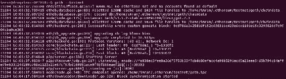

运行连接到以太坊测试网络的 geth 命令的输出

## 设置私有网络

私有网络允许创建全新的区块链。这与测试网络或主网络不同，因为它使用自己的创世区块和网络 ID。为了创建私有网络，需要三个组件：

1.  网络 ID。

1.  创世文件。

1.  用于存储区块链数据的数据目录。尽管数据目录不严格要求被提及，但如果系统上已经有一个以上的区块链活跃，那么应该指定数据目录，以便为新的区块链使用单独的目录。

私有网络允许创建全新的区块链。这与测试网络或主网络不同，因为它使用自己独特的创世区块和网络 ID。在主网络上，geth 默认知道同行并自动连接，但在私有网络上，geth 需要通过指定适当的标志和配置来配置，以便能够被其他同行发现或发现其他同行。

除了前面提到的三个组件外，最好禁用**节点发现**，以便互联网上的其他节点无法发现您的私有网络，并且确实是私有的。如果其他网络恰好具有相同的创世文件和网络 ID，则它们可能连接到您的私有网络。具有相同网络 ID 和创世块的机会非常低，但是，无论如何，禁用节点发现是一个良好的做法，并且被推荐。

在接下来的章节中，将详细讨论所有这些参数，并附有一个实际示例。

### 网络 ID

网络 ID 可以是除了以太坊主网络和测试网络（Ropsten）已经使用的 1 和 3 之外的任何正数。示例私有网络稍后在本节中讨论时选择了网络 ID 786。

### 创世文件

创世文件包含创建自定义创世块所需的必要字段。这是网络中的第一个区块，不指向任何上一个区块。以太坊协议进行严格的检查，以确保除非它们具有相同的创世块，否则互联网上的其他节点不能参与共识机制。

在示例中稍后使用的自定义创世文件如下所示：

```
{ 
  "nonce": "0x0000000000000042", 
    "timestamp": "0x0",    "parentHash":"0x0000000000000000000000000000000000000000000000000000000000000000", 
    "extraData": "0x0", 
    "gasLimit": "0x4c4b40", 
    "difficulty": "0x400", 
    "mixhash":"0x0000000000000000000000000000000000000000000000000000000000000000", 
    "coinbase": "0x0000000000000000000000000000000000000000", 
    "alloc": { } 
} 

```

此文件可以保存在带有 JSON 扩展名的文本文件中；例如，`privategenesis.json`。可选地，可以通过在 `alloc` 中指定受益人地址和 Wei 金额来预先分配以太币，但通常是不必要的，因为在私有网络上，以太币可以很快被挖出。

### 数据目录

这是保存私有以太坊网络的区块链数据的目录。例如，在以下示例中，它是 `~/.ethereum/privatenet`。

在 geth 客户端中，为了启动、进一步微调配置并启动私有网络，需要指定一些参数。这些标志在这里列出。

#### 标志及其含义

+   `--nodiscover`: 此标志确保节点不会自动被发现，如果恰好具有相同的创世文件和网络 ID。

+   `--maxpeers`: 此标志用于指定允许连接到私有网络的对等方数量。如果设置为 0，则没有人能够连接，这在一些场景中可能是可取的，比如私有测试。

+   `--rpc`: 这用于在 geth 中启用 RPC 接口。

+   `--rpcapi`: 此标志以允许的 API 列表作为参数。例如，`eth,web3` 将在 RPC 上启用 web3 和 eth 接口。

+   `--rpcport`: 这设置 TCP RPC 端口；例如：9999。

+   `--rpccorsdomain`: 此标志指定允许连接到私有 geth 节点并执行 RPC 操作的 URL。

+   `--port`: 这指定将用于监听来自其他对等方的传入连接的 TCP 端口。

+   `--identity`: 此标志是一个字符串，指定私有节点的名称。

### 静态节点

如果有需要连接到特定一组对等节点，则这些节点可以添加到一个文件中，该文件保存了`chaindata`和`keystore`文件，例如在`~/.ethereum/privatenet`目录下。文件名应该是`static-nodes.json`。在私有网络中，这样做是有价值的。下面是一个json文件的示例：

```
[ 
"enode:// 44352ede5b9e792e437c1c0431c1578ce3676a87e1f588434aff1299d30325c233c8d426fc57a25380481c8a36fb3be2787375e932fb4885885f6452f6efa77f@xxx.xxx.xxx.xxx:TCP_PORT" 
] 

```

这里，`xxx`是公共IP地址，`TCP_PORT`可以是系统上的任何有效和可用的TCP端口。长十六进制字符串是节点ID。

## 启动私有网络

启动私有网络的初始命令如下所示：

```
$ geth --datadir ~/.ethereum/privatenet init ./privether/privategenesis.json

```

这将产生类似于以下截图所显示的输出：

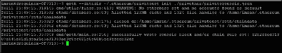

私有网络初始化

此输出表明已成功创建了创世区块。为了启动`geth`，可以输入以下命令：

```
$ geth --datadir .ethereum/privatenet/ --networkid 786

```

这将产生以下输出：

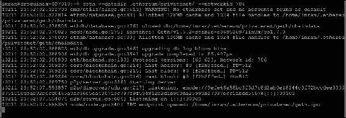

启动私有网络的geth

现在`geth`可以通过IPC连接到私有网络上运行的geth客户端，使用以下命令。这将允许您与私有网络上运行的`geth`会话进行交互：

```
$ geth attach ipc:.ethereum/privatenet/geth.ipc

```

如图所示，这将打开运行私有网络会话的交互式JavaScript控制台：

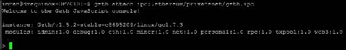

启动`geth`以连接到私有网络786

你可能已经注意到，当`geth`启动时会出现警告消息。

### 注意

警告：没有设置以太坊基址，并且没有找到任何默认账户。

此消息出现是因为新的测试网络中当前没有可用的账户，也没有设定任何账户作为以太坊基址来接收挖矿奖励。这个问题可以通过创建一个新账户并将其设置为以太坊基址来解决。在进行测试网络的挖矿时也需要这样做。以下命令显示了这一点。注意，这些命令是在geth JavaScript控制台中输入的，如前面的图所示。

下面的命令创建一个新的账户。在这个上下文中，账户将在私有网络ID 786上创建：

```
> personal.newAccount("Password123")
"0x76f11b383dbc3becf8c5d9309219878caae265c3"

```

账户创建完成后，下一步是将其设置为以太坊基址/coinbase账户，以便挖矿奖励进入该账户。可以使用以下命令来实现这一点：

```
> miner.setEtherbase(personal.listAccounts[0])
true

```

目前，以太坊基址账户没有余额，可以使用以下命令查看：

```
> eth.getBalance(eth.coinbase).toNumber();
0

```

最后，可以通过简单地发出以下命令启动挖矿。这个命令接受一个参数，即线程数。在下面的示例中，通过指定2作为start函数的参数，两个线程将被分配给挖矿进程：

```
> miner.start(2)
true

```

挖矿开始后，首个DAG生成被执行，产生类似以下输出：

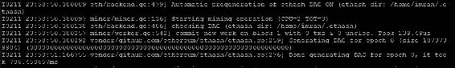

DAG生成

一旦DAG生成完成并开始挖矿，`geth`将产生类似于下面截图所示的输出。可以清楚地看到，块正在成功挖掘，显示`已挖掘5个区块...`的消息。

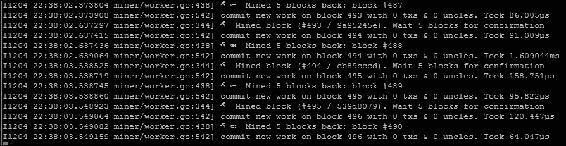

挖掘输出

可以使用以下命令停止挖矿：

```
> miner.stop
true

```

在JavaScript控制台中，可以查询总以太币的当前余额，如下所示。挖矿之后，可以看到相当大的数量，如下例所示。由于是私有网络，并且在初始文件中，网络难度也已经设置得相当低，因此挖矿非常快：

```
> eth.getBalance(eth.coinbase).toNumber();
2.72484375e+21

```

如果连续按两次空格和两次tab键，则会显示所有可用对象的完整列表。如下截图所示：

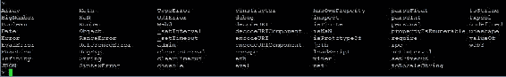

可用对象

此外，当输入命令时，可以按两次tab键来自动完成命令。如果按两次tab键，则还会显示可用方法的列表。如下截图所示：

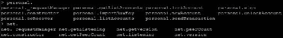

可用方法

除了之前提到的命令之外，为了获得可用方法列表，在输入任何命令后，输入`;`（分号）。下一个截图中显示了一个示例，显示了所有可用于`net`的方法列表：

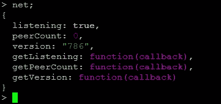

方法列表

可以使用一些其他命令来查询私有网络。下面是一些示例：

+   获取当前的燃气价格：

```
> eth.gasPrice
20000000000

```

+   获取最新的区块编号：

```
> eth.blockNumber
587

```

调试在调试问题时可能会派上用场。下面显示了一个样例命令；但是，有许多可用方法。下面的方法将返回块`0`的RLP：

+   **使用RLP进行编码**：

```
> debug.getBlockRlp(0)
 "f901f7f901f2a0000000000000000000000000000000000000000000000000
        0000000000000000a01dcc4de8dec75d7aab85b567b6ccd41ad312451b948a
        7413f0a142fd40d49347940000000000000000000000000000000000000000
        a056e81f171bcc55a6ff8345e692c0f86e5b48e01b996cadc001622fb5e363
        b421a056e81f171bcc55a6ff8345e692c0f86e5b48e01b996cadc001622fb5
        e363b421a056e81f171bcc55a6ff8345e692c0f86e5b48e01b996cadc00162
        2fb5e363b421b9010000000000000000000000000000000000000000000000
        00000000000000000000000000000000000000000000000000000000000000  
        00000000000000000000000000000000000000000000000000000000000000
        00000000000000000000000000000000000000000000000000000000000000
        00000000000000000000000000000000000000000000000000000000000000
        00000000000000000000000000000000000000000000000000000000000000
        00000000000000000000000000000000000000000000000000000000000000
        00000000000000000000000000000000000000000000000000000000000000
        000000000000000000000000000000000082020080834c4b40808000a00000
        00000000000000000000000000000000000000000000000000000000000088
        0000000000000042c0c0"

```

+   **在发送交易之前解锁账户**：

```
> personal.unlockAccount
        ("0x76f11b383dbc3becf8c5d9309219878caae265c3")
Unlock account 0x76f11b383dbc3becf8c5d9309219878caae265c3
Passphrase:

```

+   **发送交易**:

```
> eth.sendTransaction({from:   
        "0x76f11b383dbc3becf8c5d9309219878caae265c3", to:  
        "0xcce6450413ac80f9ee8bd97ca02b92c065d77abc", value: 1000})

```

另一种方法是使用`listAccounts[]`方法，如下所示：

```
> eth.sendTransaction({from: personal.listAccounts[0], to:   
        personal.listAccounts[1], value: 1000})

```

+   获取编译器列表。请注意，如果没有显示任何输出，则表示未安装sol的编译器；sol编译器的安装细节将在本章的后面提供：

```
> web3.eth.getCompilers()
["Solidity"]

```

### 在私有网络上运行Mist

可以通过发出以下命令在私有网络上运行Mist。在安装`/opt/Ethereum`后，此二进制文件通常在`home`文件夹中可用：

```
$ ./Ethereum\ Wallet --rpc ~/.ethereum/privatenet/geth.ipc

```

这将允许连接到运行中的私有网络`geth`会话，并通过Mist在私有网络上提供钱包、账户管理和合同部署等所有功能。

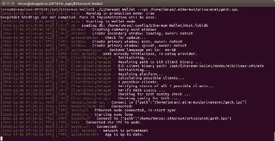

运行以太坊钱包连接到私有网络

一旦以太坊启动，它将显示此处显示的界面，清楚地表明它正在**私有网络**模式下运行。

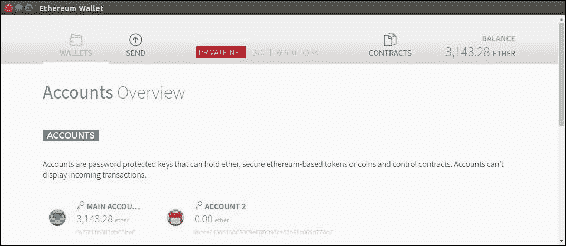

私有网络上的Mist

Mist也可以通过RPC在网络上运行。如果`geth`在不同节点上运行而Mist在另一个节点上运行，这将非常有用。这可以通过在这里显示的标志运行Mist来实现：

```
--rpc http://127.0.0.1:8545

```

### 使用Mist部署合同

使用Mist非常容易部署新的合同。Mist提供了一个界面，可以在其中用solidity编写合同，然后在网络上部署。

在这个练习中，将使用一个简单的合同对输入参数执行各种简单的算术计算。这里将展示如何使用Mist部署此合同。因为solidity尚未介绍，所以这里的目的是让用户体验合同部署和交互过程。本章后面将提供更多关于编码和solidity的信息，之后就会很容易理解所示的代码。那些熟悉JavaScript或任何其他类似语言的人会发现代码几乎是不言自明的。

示例合同源代码如下所示：

```
pragma solidity ^0.4.0; 
contract SimpleContract2
{ 
  uint x; 
  uint z; 
  function addition(uint x) returns (uint y)
{ 
  z=x+5; 
  y=z; 
} 
function difference(uint x) returns (uint y)
{ 
  z=x-5; 
  y=z; 
}  
function division(uint x) returns (uint y) 
{ 
 z=x/5; 
 y=z; 
} 

function currValue() constant returns (uint) 
{ 
 return z; 
} 
} 

```

此代码可以简单地复制到Mist的合同部分，如下所示。在左侧，可以复制源代码；一旦验证并且没有检测到语法错误，将出现在右侧下拉菜单中的**选择要部署的合同**选项。只需选择合同并按下屏幕底部的**部署**按钮。

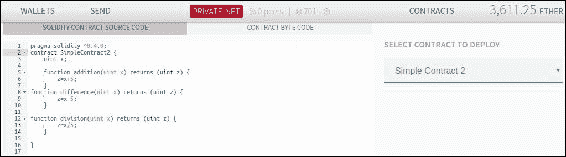

Mist浏览器合同部署

Mist将要求输入帐户密码，并显示类似于下面截屏的窗口：

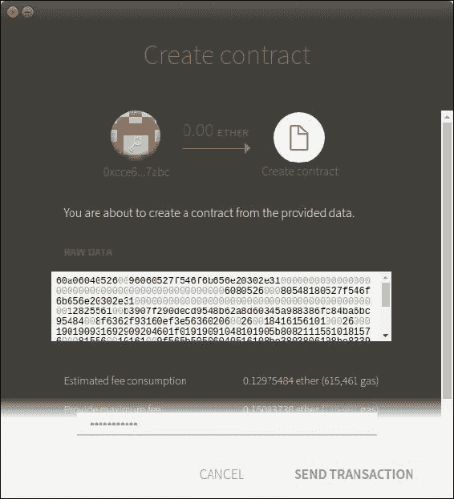

使用Mist创建合同

输入密码，然后点击**发送交易**以部署合同。

成功部署和挖矿后，它将出现在Mist的交易列表中，如下所示：

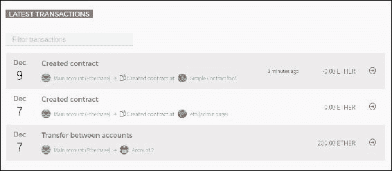

在Mist中创建合同后的交易列表

一旦合同可用，可以使用Mist执行交易并通过它调用可用函数与之交互。

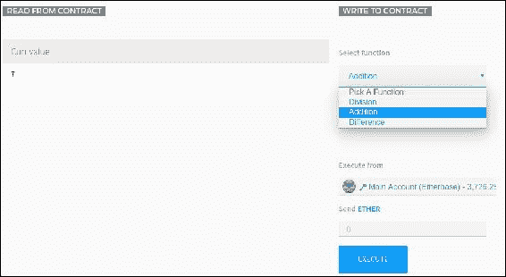

在Mist中使用读取和写入选项与合同交互

在前面的截图中，**从合同读取**和**写入合同**选项可用。此外，可以在右侧看到合同公开的函数。选择所需函数后，为函数输入适当的值并选择帐户（从which执行）；按下执行以执行交易，这将导致调用合同的选定函数。

此过程如下截屏所示：

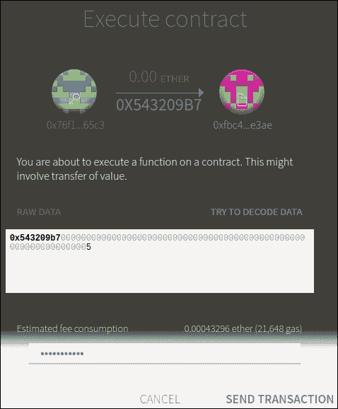

Mist中的合同执行

如截图所示，输入账户的适当密码，然后按下 **发送交易** 将交易发送到合同。

# 开发工具和客户端

有许多可用于以太坊开发的工具。 下图显示了各种开发工具、客户端、IDE 和开发框架的分类法：

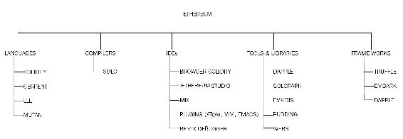

以太坊生态系统组件的分类法

在本章中，主要关注 `geth`、浏览器 solidity、solidity、solc 和 truffle。 其余元素将简要讨论。

## 语言

合同可以用多种语言编程。 有四种语言可以用于编写合同：

+   **Mutan**：这是一种类似 Go 的语言，早在 2015 年初就已被弃用，现在已不再使用。

+   **LLL**：这是一种类似 Lisp 的语言，因此命名为 LLL。 这也不再使用。

+   **Serpent**：这是一种简单干净的类 Python 语言。 它被积极用于合同开发。

+   **Solidity**：这种语言现在几乎已成为以太坊合同编写的标准。 本章的重点是该语言，将在后面的章节中详细讨论。

## 编译器

编译器用于将高级合同源代码转换为以太坊执行环境所理解的格式。 Solidity 编译器是最常用的，这里进行了讨论。

### Solc

Solidity 编译器将高级 solidity 语言转换为 **以太坊虚拟机**（**EVM**）字节码，以便通过 EVM 在区块链上执行。

在 Linux Ubuntu 操作系统上安装 solidity 编译器的命令如下：

```
$ sudo apt-get install solc

```

如果尚未安装 PPAs，则可以通过运行以下命令来安装它们：

```
sudo add-apt-repository ppa:ethereum/ethereum
sudo apt-get update

```

为了验证现有版本的 solidity 编译器并验证其已安装，可以使用以下命令：

```
$ solc --version
solc, the solidity compiler commandline interface
Version: 0.4.6+commit.2dabbdf0.Linux.g++

```

Solc 支持各种功能。 一些示例如下所示：

+   以二进制格式显示合同。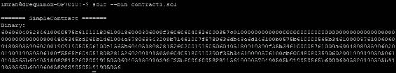

    Solidity 编译器的二进制输出

+   估算 gas：

```
imran@drequinox-OP7010:~$ solc --gas contract1.sol
======= SimpleContract =======
Gas estimation:
construction:
 97 + 54600 = 54697
external:
 division(uint256):   230
 addition(uint256):   231
 difference(uint256): 253
internal:

```

注意 `contrat1.sol` 仅作为示例显示； 文件可以包含任何智能合同 solidity 代码。 该文件的代码未在此处显示。

Solc 在 `geth` 控制台内部由 web3 使用以编译合同。 语法如下所示，其中 `contractsourcecode` 是 solidity 源代码：

```
web3.eth.compile.solidity(contractsourcecode)

```

等你开始介绍合同开发时，这将在本章后面详细讨论。

### 集成开发环境（IDE）

有许多可用于 solidity 开发的 IDE。 大多数 IDE 可在线获取，并通过 Web 界面呈现。 浏览器 solidity 最常用于较小的合同，并在此处进行讨论。

#### 浏览器 solidity

浏览器 solidity 是使用 solidity 进行合约开发和测试的基于 web 的环境。它不在实时区块链上运行；事实上，它是一个模拟环境，可以在其中部署、测试和调试合约。它位于 [https://ethereum.github.io/browser-solidity](https://ethereum.github.io/browser-solidity)。示例界面如下所示：

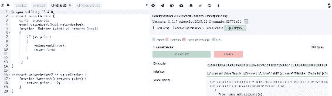

浏览器 solidity

在左侧是带有语法高亮和代码格式化的代码编辑器，右侧是一些可用的工具，可以用来部署、调试、测试和与合约交互。可用的各种功能，例如交易交互、连接到 JavaScript VM 的选项、执行环境配置、调试器、形式验证和静态分析等都可以用。它们可以配置为连接到执行环境，例如 JavaScript VM、注入的 Web3（Mist 或类似环境提供了执行环境）或 Web3 提供程序，它允许通过 IPC 或 RPC over HTTP（web3 提供程序端点）连接到本地运行的以太坊客户端（例如，`geth`）。

#### Remix

在 2016 年 8 月 Mix IDE 停止使用后，启动了 Remix 项目。Remix 是一个基于浏览器的 IDE，目前正在积极开发中，目前仅提供了其中的调试器部分。这个调试器非常强大，可以用来执行对 EVM 字节码的详细级别跟踪和分析。在下一节中，将介绍 Remix 的安装和使用示例。

#### 安装

Remix 可在 [https://github.com/ethereum/remix](https://github.com/ethereum/remix) 上获得。第一步是克隆 GitHub 存储库：

```
$ git clone https://github.com/ethereum/remix
Cloning into 'remix'...
remote: Counting objects: 2185, done.
remote: Compressing objects: 100% (213/213), done.
remote: Total 2185 (delta 124), reused 0 (delta 0), pack-reused 1971
Receiving objects: 100% (2185/2185), 1.12 MiB | 443.00 KiB/s, done.
Resolving deltas: 100% (1438/1438), done.
Checking connectivity... done.

```

在前述步骤成功完成后，执行以下命令：

```
cd remix
npm install
npm run build

```

在这一点上，可以运行`npm run start_node`，或者可以使用适当的标志启动`geth`。一旦`geth`运行起来，就可以运行一个简单的网络服务器来提供 remix 网页服务。现在可以使用以下命令启动`geth`：  

```
$ geth --datadir .ethereum/privatenet/ --networkid 786 --rpc --rpcapi 'web3,eth,debug' --rpcport 8001 --rpccorsdomain 'http://localhost:7777'

```

注意`--rpcapi`标志；它是必需的，以便允许通过 RPC 进行`web3`、`eth`、`debug`。

如果运行`npm run start_node`，可能会出现以下消息：

```
$ npm run start_node
> ethereum-remix@0.0.2-alpha.0.0.9 start_node /home/imran/remix
> ./runNode.sh
both eth and geth has been found in your system
restart the command with the desired client:
npm run start_eth
or
npm run start_geth

```

假设需要`geth`，请使用以下命令：

```
$ npm run start_geth

```

如果选择运行`geth`，那么需要一个简单的网络服务器才能浏览到 remix 网页。可以通过发出 Python 命令来简单实现这一点，如下所示。这应该是从`remix`目录运行的。


Python 快速网络服务器

一旦命令成功并且网络服务器正在运行，就可以使用`http://localhost:7777` URL 浏览 remix，如下截图所示：

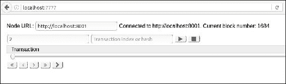

使用 TCP 7777 运行 remix 并通过 web 浏览器显示

Remix 也作为浏览器 solidity 的一部分可用（浏览器 solidity 已在前面单独讨论过）。 它可以通过提供 web3 提供程序端点连接到本地私有网络。 如下所示：

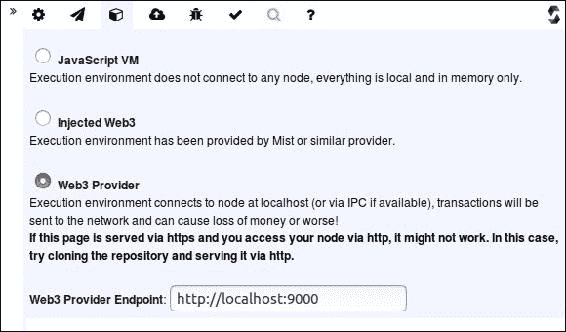

浏览器 solidity 中连接到本地`geth`节点的**Web3 提供程序**选项如下：

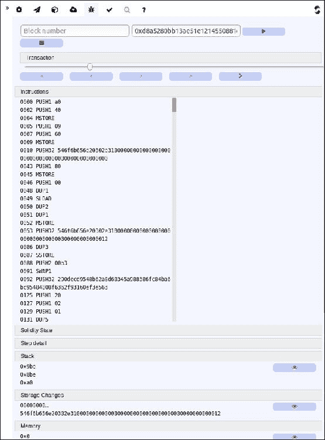

浏览器 solidity 中的 Remix 调试器

### 工具和库

以太坊有各种工具和库可用。 最常见的是在此讨论的。

#### Node.js 版本 7

由于大多数工具和库都需要 Node.js，因此可以使用以下命令安装它：

```
curl -sL https://deb.nodesource.com/setup_7.x | sudo -E bash -
sudo apt-get install -y nodejs

```

#### 本地以太坊区块浏览器

本地以太坊区块浏览器是一个有用的工具，可用于探索本地区块链。 可按照以下步骤安装：

在 Linux Ubuntu 机器上，为了安装本地以太坊区块浏览器，请运行以下命令：

```
$ git clone https://github.com/etherparty/explorer

```

这将显示类似于以下内容的输出：

```
Cloning into 'explorer'...
remote: Counting objects: 253, done.
remote: Total 253 (delta 0), reused 0 (delta 0), pack-reused 253
Receiving objects: 100% (253/253), 51.20 KiB | 0 bytes/s, done.
Resolving deltas: 100% (130/130), done.
Checking connectivity... done.

```

下一步是更改目录到浏览器并运行以下命令：

```
imran@drequinox-OP7010:~$ cd explorer/
imran@drequinox-OP7010:~/explorer$ npm start
> EthereumExplorer@0.1.0 prestart /home/imran/explorer
> npm install

```

安装完成后，将显示类似于以下内容的输出，其中以太坊区块浏览器的 HTTP 服务器启动：

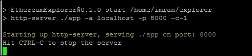

以太坊区块浏览器 HTTP 服务器

Web 服务器启动后，应使用以下命令启动`geth`：

```
geth --datadir .ethereum/privatenet/ --networkid 786 --rpc --rpccorsdomain 'http://localhost:8000'

```

成功启动`geth`后，请导航到 TCP `port 8000` 上的 localhost，如此处所示，以访问本地以太坊区块浏览器。

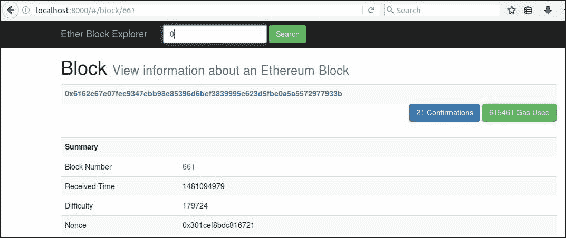

区块浏览器

或者，可以使用 Python 或任何其他适当的提供程序启动 Web 服务器。 在 Python 中，可以启动一个快速的 Web 服务器，如以下代码所示：

```
imran@drequinox-OP7010:~/explorer/app$ python -m SimpleHTTPServer 9900
Serving HTTP on 0.0.0.0 port 9900 ...

```

`geth`客户端将需要使用适当的参数启动。 如果不这样做，则可能会出现如下所示的错误：

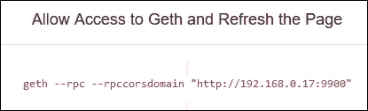

以太坊本地区块浏览器错误消息

重新启动`geth`以允许`rpccorsdomain`：

```
geth --datadir .ethereum/PrivateNet/ --networkid 786 --rpc --rpccorsdomain 'http://192.168.0.17:9900'

```

### EthereumJS

有时，无法在测试网络上进行测试，而主网络显然不适合测试合同。 在某些情况下，建立私有网络可能会耗费时间。 当需要快速测试且没有适当的测试网络可用时，EthereumJS testrpc 是个好选择。 它使用 EthereumJS 模拟以太坊`geth`客户端的行为，并允许更快的开发测试。 Testrpc 可通过 npm 作为节点软件包获得。

在安装 testrpc 之前，应已安装 Node.js，并且 npm 软件包管理器也应可用。

testrpc 可以使用此命令安装：

```
npm install -g ethereumjs-testrpc

```

要启动 testrpc，只需执行此命令，并将其保持在后台运行，并打开另一个终端以处理合同。

```
$testrpc

```

## 合同开发和部署

开发和部署合同需要采取各种步骤。广义上讲，这些可以分为四个步骤：编写、测试、验证和部署。部署后，下一步是创建用户界面并通过 Web 服务器向最终用户呈现。

写作步骤涉及在 solidity 中编写合同源代码。这可以在任何文本编辑器中完成。在 Linux 的 Vim、Atom 和其他编辑器中有各种插件和附加组件可用，提供 solidity 源代码的语法突出显示和格式化。

测试通常是通过自动化手段来执行的。在本章后面，您将被介绍到 truffle，它使用 Mocha 框架来测试合同。然而，也可以进行手动测试。一旦合同在模拟环境（例如 EthereumJS testrpc）或私有网络上经过验证、工作正常并经过测试，它就可以部署到 Ropsten 测试网，最后再到实际的区块链（Homestead）上。

在下一节中，您将被介绍到 solidity 语言。这是 solidity 的一个简要介绍，应该提供编写合同所需的基础知识。其语法非常类似于 C 和 JavaScript，编程起来相当容易。

# 介绍 solidity

Solidity 是以太坊中编写合同的首选领域特定语言。然而，还有其他语言，如 serpent、Mutan 和 LLL，但在撰写本文时，solidity 是最受欢迎的。其语法更接近 JavaScript 和 C。Solidity 在过去几年里已经发展成为一种成熟的语言，使用起来相当容易，但在成为像其他成熟语言一样先进和功能丰富之前还有很长的路要走。尽管如此，这是当前最广泛使用的编写合同的语言。

它是一种静态类型语言，这意味着在 solidity 中，变量类型检查是在编译时进行的。每个变量，无论是状态变量还是局部变量，都必须在编译时指定类型。这在某种程度上是有益的，因为任何验证和检查都在编译时完成，某些类型的错误，例如数据类型的解释错误，可以在开发周期的早期而不是运行时捕获，这可能是昂贵的，特别是在区块链/智能合约范式的情况下。语言的其他特性包括继承、库和定义复合数据类型的能力。

Solidity 也被称为合同导向语言。在 solidity 中，合同相当于其他面向对象编程语言中的类的概念。

## 类型

Solidity 有两类数据类型：值类型和引用类型。

### 值类型

这些在这里被详细解释。

#### 布尔型

此数据类型有两个可能的值，即 true 或 false，例如：

```
bool v = true; 

```

此语句将值`true`赋给`v`。

#### 整数

此数据类型表示整数。这里显示了一个表，显示了用于声明整数数据类型的各种关键字。

| 关键词 | 类型 | 详情 |
| --- | --- | --- |
| `int` | 有符号整数 | int8到int256，这意味着关键字从int8到int256以8的增量可用，例如，int8，int16，int24。 |
| `uint` | 无符号整数 | uint8到uint256 |

例如，在此代码中，请注意`uint`是`uint256`的别名：

```
uint256 x; 
uint y; 
int256 z; 

```

这些类型也可以用`constant`关键字声明，这意味着编译器不会为这些变量保留存储槽。在这种情况下，每次出现都将替换为实际值：

```
uint constant z=10+10; 

```

状态变量在函数体外声明，并且根据分配给它们的可访问性保留在合同中，并且只要合同存在，它们就会保持可用状态。

#### 地址

此数据类型保存一个160位长（20字节）的值。此类型有几个成员，可用于与合同进行交互和查询。这些成员在此处描述：

**余额**

余额成员返回以太币地址的余额。

**发送**

此成员用于向地址（以太坊的160位地址）发送以太币数量，并根据交易结果返回true或false，例如，如下所示：

```
address to = 0x6414cc08d148dce9ebf5a2d0b7c220ed2d3203da; 
address from = this; 
if (to.balance < 10 && from.balance > 50) to.send(20); 

```

**调用函数**

`call`，`callcode`和`delegatecall`用于与没有**应用程序二进制接口**（**ABI**）的函数进行交互。由于对合同的类型安全性和安全性的影响，应谨慎使用这些功能。

#### 数组值类型（固定大小和动态大小的字节数组）

Solidity具有固定大小和动态大小的字节数组。固定大小关键字范围从`bytes1`到`bytes32`，而动态大小关键字包括bytes和strings。`bytes`用于原始字节数据，string用于以UTF-8编码的字符串。由于这些数组是按值返回的，调用它们将产生gas成本。`length`是数组值类型的成员，返回字节数组的长度。

静态（固定大小）数组的示例如下：

```
bytes32[10] bankAccounts;  

```

动态大小数组的示例如下：

```
bytes32[] trades;  

```

获取交易的`length`：

```
trades.length; 

```

### 字面量

这些用于表示固定值。

#### 整数字面量

整数字面量是0-9范围内的十进制数字序列。例如，如下所示：

```
uint8 x = 2; 

```

#### 字符串字面量

字符串字面量指定用双引号或单引号写的一组字符。例如，如下所示：

```
'packt' 
"packt" 

```

#### 十六进制字面量

十六进制字面量以关键字`hex`为前缀，并在双引号或单引号中指定。例如，如下所示：

```
(hex'AABBCC'); 

```

### 枚举类型

这允许创建用户定义的类型。例如，如下所示：

```
enum Order{Filled, Placed, Expired }; 
Order private ord; 
ord=Order.Filled; 

```

枚举类型允许与所有整数类型之间的显式转换。

### 函数类型

有两种函数类型：内部函数和外部函数。

#### 内部函数

这些只能在当前合约的上下文中使用。

#### 外部函数

外部函数可以通过外部函数调用来调用。

在Solidity中，函数可以标记为常量。常量函数无法更改合约中的任何内容；它们仅在被调用时返回值，且不消耗任何燃气。这是前一章讨论的*call*概念的实际实现。

声明函数的语法如下所示：

```
function <nameofthefunction> (<parameter types> <name of the variable>) {internal|external} [constant] [payable] [returns (<return types> <name of the variable>)] 

```

### 引用类型

正如其名称所示，这些类型是通过引用传递的，并在以下部分讨论。

#### 数组

数组表示在内存位置处排列的相同大小和类型的连续元素集合。这个概念与任何其他编程语言相同。数组有两个成员分别命名为`length`和`push`：

```
uint[] OrderIds; 

```

#### 结构体

这些结构可以用来将一组不同的数据类型分组到一个逻辑组中。这些可以用于定义新类型，如下例所示：

```
Struct Trade 
{ 
uint tradeid; 
uint quantity; 
uint price; 
string trader; 
} 

```

#### 数据位置

数据位置指定了一个特定复杂数据类型将被存储的位置。根据默认或指定的注释，位置可以是存储或内存。这适用于数组和结构体，并可以使用**storage**或**memory**关键字指定。由于在内存和存储之间复制可能非常昂贵，指定位置有助于在某些时候控制燃气支出。**Calldata**是另一个用于存储函数参数的内存位置。外部函数的参数默认存储在**calldata**中。默认情况下，函数的参数存储在**memory**中，而所有其他局部变量都使用**storage**。另一方面，状态变量需要使用**storage**。

### 映射

映射用于键到值的映射。这是一种将值与键关联起来的方法。此映射中的所有值已经用所有零初始化，例如，以下内容：

```
mapping (address => uint) offers; 

```

此示例显示`offers`被声明为映射。另一个示例使其更加清晰：

```
mapping (string => uint) bids; 
bids["packt"] = 10; 

```

这基本上是一个字典或哈希表，其中字符串值被映射到整数值。名为`bids`的映射将`packt`字符串值映射到值`10`。

### 全局变量

Solidity提供了许多全局变量，这些变量始终可用于全局命名空间。这些变量提供有关区块和交易的信息。此外，加密函数和与地址相关的变量也是可用的。

可用函数和变量的子集如下所示：

```
keccak256(...) returns (bytes32) 

```

此函数用于计算提供给函数的参数的`keccak256`哈希值：

```
ecrecover(bytes32 hash, uint8 v, bytes32 r, bytes32 s) returns (address) 

```

此函数返回椭圆曲线签名的公钥的相关地址：

```
block.number 

```

这将返回当前区块号。

### 控制结构

Solidity中可用的控制结构为`if - else`，`do`，`while`，`for`，`break`，`continue`，`return`。它们的工作方式类似于它们在C语言或JavaScript中的工作方式。

#### 事件

Solidity中的事件可以用于记录EVM日志中的特定事件。当需要通知外部接口合同中的任何更改或事件时，这些事件非常有用。这些日志存储在区块链上的事务日志中。日志无法从合约中访问，但它们被用作通知合同中状态变化或事件发生（满足条件）的机制。

在这里的简单示例中，如果传给`function Matcher`的参数`x`等于或大于`10`，则`valueEvent`事件将返回true：

```
contract valueChecker { 
    uint8 price=10; 
    event valueEvent(bool returnValue); 
    function Matcher(uint8 x) returns (bool) 
    { 
        if (x>=price) 
        { 
            valueEvent(true); 
            return true; 

        } 
     } 
} 

```

#### 继承

Solidity支持继承。`is`关键字用于从另一个合约派生合约。在下面的示例中，`valueChecker2`是从`valueChecker`合约派生出来的。派生合约可以访问父合约的所有非私有成员：

```
contract valueChecker 
{ 
 uint8 price=10; 
 event valueEvent(bool returnValue); 
 function Matcher(uint8 x) returns (bool) 
 { 
  if (x>=price) 
  { 
   valueEvent(true); 
   return true;    
  } 
 } 
} 
contract valueChecker2 is valueChecker
{ 
 function Matcher2() returns (uint) 
 { 
  return price + 10; 
 } 
} 

```

在前面的示例中，如果将`uint8 price = 10`更改为`uint8 private price = 10`，那么它将无法被`valuechecker2`合约访问。这是因为现在该成员被声明为私有，不允许其他合约访问它。

#### 库

库仅在特定地址部署一次，其代码通过EVM的CALLCODE/DELEGATECALL操作码进行调用。库背后的关键思想是代码的重用性。它们类似于合约，并且充当调用合约的基础合约。库的声明如下示例所示：

```
library Addition 
{ 
 function Add(uint x,uint y) returns (uint z) 
  { 
    return x + y; 
  } 
} 

```

然后可以在合约中调用此库，如下所示。首先，它需要被导入，然后可以在代码中的任何位置使用。以下是一个简单示例：

```
Import "Addition.sol" 
function Addtwovalues() returns(uint) 
{ 
 return Addition.Add(100,100); 
} 

```

库有一些限制；例如，它们不能拥有状态变量，也不能继承或被继承。此外，它们也不能接收以太币；这与可以接收以太币的合约形成鲜明对比。

#### 函数

Solidity中的函数是与合约关联的代码模块。函数使用名称、可选参数、访问修饰符、可选的constant关键字和可选的返回类型进行声明。如下示例所示：

```
function orderMatcher(uint x) private constant returns(bool returnvalue) 

```

在前面的示例中，`function`是用于声明函数的关键字。`orderMatcher`是函数名，`uint x`是一个可选参数，`private`是控制外部合约对函数访问的**访问修饰符/指示符**，`constant`是一个可选关键字，用于指定该函数不会改变合约中的任何内容，而是仅用于从合约中检索值，并且`returns (bool returnvalue)`是函数的可选返回类型。

+   **如何定义函数**：定义函数的语法如下所示：

    ```
            function <name of the function>(<parameters>) <visibility     
            specifier> returns (<return data type> <name of the variable>) 
            { 
             <function body> 
            } 

    ```

+   **函数签名**：在 solidity 中，函数通过其签名来标识，这是其完整签名字符串的keccak-256哈希的前四个字节。这也可在浏览器 solidity 中看到，如下截图所示。**D99c89cb**是名为**Matcher**的函数的32字节keccak-256哈希的前四个字节。

    在浏览器 solidity 中显示的函数 hash

在这个例子函数中，**Matcher**的签名哈希是**d99c89cb**。这对于构建接口是有用的。

+   **函数的输入参数**：函数的输入参数以<data type> <parameter name>的形式声明。这个例子阐明了`uint x`和`uint y`是`checkValues`函数的输入参数的概念：

    ```
            contract myContract  
            { 
             function checkValues(uint x, uint y)  
             { 
             } 
            } 

    ```

+   **函数的输出参数**：函数的输出参数以<data type> <parameter name>的形式声明。这个例子展示了一个返回`uint`值的简单函数：

    ```
            contract myContract  
            { 
             Function getValue() returns (uint z) 
             { 
              z=x+y; 
             } 
            } 

    ```

    一个函数可以返回多个值。在前面的例子函数中，`getValue`只返回一个值，但一个函数可以返回多达14个不同数据类型的值。未使用的返回参数的名称可以选择省略。

+   **内部函数调用**：在当前合同的上下文中，可以直接调用合同内部的函数。这些调用是为了调用同一合同中存在的函数。这些调用在以太虚拟机字节码级别上会产生简单的JUMP调用。

+   **外部函数调用**：外部函数调用是通过从一个合同向另一个合同发送消息调用而进行的。在这种情况下，所有函数参数都被复制到内存中。如果使用`this`关键字调用内部函数，也被视为外部调用。`this`变量是一个指针，指向当前合同。它可以显式转换为地址，并且所有合同成员都继承自地址。

+   **回退函数**：这是合同中没有参数和返回数据的未命名函数。每当收到以太币时，这个函数都会执行。如果合约打算接收以太币，则必须在合同中实现这个函数；否则，将引发异常并退还以太币。如果合同预期接收以太币，则回退函数应该用`payable`**修饰符**声明。`payable`是必需的；否则，这个函数将无法接收任何以太币。这个函数可以使用`address.call()`方法调用，例如：

    ```
           function ()  
           { 
            throw;  
           } 

    ```

    在这种情况下，如果根据前面描述的条件调用`fallback`函数，则会调用throw，它将状态回滚到调用之前的状态。它也可以是除了throw之外的其他构造方式；例如，它可以记录一个事件，该事件可以用作将调用结果反馈给调用应用程序的警报。

+   **修饰器函数**：这些函数用于更改函数的行为，并且可以在其他函数之前调用。通常，它们用于在执行函数之前检查某些条件或验证。在修饰器函数中使用`_`（下划线），当调用修饰器时将其替换为函数的实际体。基本上，它象征着需要*受保护*的函数。这个概念类似于其他语言中的守护函数。

+   **构造函数**：这是一个可选函数，与合约同名，一旦合约被创建就会执行。构造函数不能被用户后续调用，并且一个合约只允许一个构造函数。这意味着没有重载功能可用。

+   **函数可见性规范器（访问修饰符）**：函数可以用四个访问修饰符来定义，如下所示：

    +   **External**: 这些功能可从其他合约和交易中访问。除非使用`this`关键字，否则不能在内部调用它们。

    +   **公共**: 默认情况下，函数是公共的。它们可以被内部调用，也可以使用消息调用。

    +   **Internal**: 内部函数对从父合约派生的其他合约可见。

    +   **私有**: 私有函数只对声明它们的合约可见。

+   **其他重要关键字/函数throw**：`throw`用于停止执行。结果是所有状态更改都被撤销。在这种情况下，不会将任何燃气返回给交易发起者，因为所有剩余的燃气都被消耗掉了。

#### Solidity源代码文件的布局

**版本声明**

为了解决未来版本Solidity编译器版本可能出现的兼容性问题，可以使用pragma来指定兼容编译器的版本，例如：

```
pragma solidity ^0.5.0 

```

这将确保源文件不会在小于`0.5.0`的版本和从0.6.0开始的版本中编译。

**导入**

在Solidity中导入允许从现有的Solidity文件中导入符号到当前的全局范围。这类似于JavaScript中可用的import语句，例如：

```
Import "module-name"; 

```

**注释**

在Solidity源代码文件中可以添加注释，方式与C语言类似。多行注释用`/*`和`*/`括起来，而单行注释以`//`开头。

一个示例的Solidity程序如下，展示了对pragma、import和注释的使用：

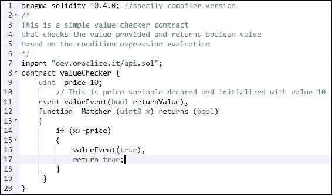

在浏览器Solidity中显示的示例Solidity程序

这完成了对solidity语言的简要介绍。该语言非常丰富，不断改进。详细的文档和编码指南可以在网上找到。

# 介绍Web3

Web3是一个JavaScript库，可以通过RPC通信与以太坊节点通信。Web3通过公开在RPC上启用的方法来工作。这允许开发使用web3库与部署在区块链上的合同进行交互的用户界面。

为了通过`geth`公开方法，可以使用以下命令：

```
$ geth --datadir .ethereum/privatenet/ --networkid 786 --rpc --rpcapi 'web3,eth,debug' --rpcport 8001 --rpccorsdomain 'http://localhost:7777'

```

注意`--rpcapi`标志允许使用`web3, eth`和`debug`方法。

这是一个强大的库，可以通过连接`geth`实例进一步探索。稍后在本节中，您将介绍通过JavaScript/HTML前端使用web3的概念和技术。

可以使用以下命令连接`geth`实例：

```
$ geth attach ipc:.ethereum/privatenet/geth.ipc

```

一旦`geth` JavaScript控制台运行，可以查询web3，例如：

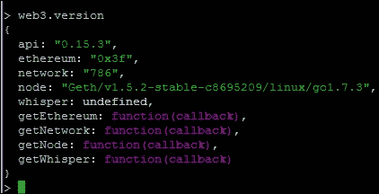

通过`geth`进行web3调用

可以使用`geth`部署一个简单合同，并通过web3与其交互，`geth`提供了命令行界面（控制台或附加）来实现这一点。以下是实现该目标的步骤。例如，将使用以下源代码：

```
pragma solidity ^0.4.0; 
contract valueChecker { 
    uint  price=10; 
    event valueEvent(bool returnValue); 
    function  Matcher (uint8 x) returns (bool) 
    { 
        if (x>=price) 
        { 
            valueEvent(true); 
            return true; 
        } 
     } 
} 

```

现在打开之前打开的`geth`控制台，并按照以下步骤操作：

1.  声明一个名为`simplecontractsource`的变量，并将程序代码分配给它：

    ```
    > var simplecontractsource = "pragma solidity ^0.4.0; contract  
        valueChecker { uint price=10;event valueEvent(bool returnValue);    
        function Matcher (uint8 x) returns (bool) { if (x>=price) 
        {valueEvent(true); return true; } } }"

    ```

    这将显示以下输出：

    ```
     undefined

    ```

    请注意，源代码必须在单行中，也就是说不能换行。在Linux中可以使用以下命令实现：

    ```
    $ tr --delete '\n' < valuechecker.sol > valuecheckersingleline.sol

    ```

    在上面的例子中，`valuechecker.sol`是具有新行`\n`字符的文件，`valuecheckersingleline.sol`是删除文件中的新行字符后产生的输出文件。然后，可以将代码从文件复制并粘贴到`geth` JavaScript控制台中。

1.  现在验证solidity编译器是否可用，如果不可用，则请参考章节中解释了solidity安装的部分：

    ```
    > eth.getCompilers()
    ["Solidity"]

    ```

1.  创建一个变量并使用solidity进行赋值和编译代码：

    ```
    > var  
        simplecontractcompiled=eth.compile.solidity(simplecontractsource)
    undefined

    ```

1.  输入`simplecontractcompiled`；它将显示类似于以下内容的输出。作为`simplecontractcompiled`已经分配了前面第3步的数据。

    simplecontractcompiled输出

1.  创建一个与合同进行交互的变量：

    ```
    >var simplecontractinteractor=eth.contract
        (simplecontractcompiled.valueChecker.info.abiDefinition);
    undefined

    ```

1.  检查**ABI**（应用二进制接口）：

    ```
    > simplecontractinteractor.abi
    [{
     constant: false,
     inputs: [{
     name: "x",
     type: "uint8"
     }],
     name: "Matcher",
     outputs: [{
     name: "",
     type: "bool"
     }],
     payable: false,
     type: "function"
    }, {
     anonymous: false,
     inputs: [{
     indexed: false,
     name: "returnValue",
     type: "bool"
     }],
     name: "valueEvent",
     type: "event"
    }]

    ```

1.  检查十六进制格式的`valueChecker`代码：

    ```
    > simplecontractcompiled.valueChecker.code

    ```

    这将返回以下输出。对于您来说可能稍有不同：

    ```
     "0x6060604052600a60005534610000575b60878061001c6000396000f36060604
        05260e060020a6000350463f9d55e218114601c575b6000565b3460005760296004
        35603d565b604080519115158252519081900360200190f35b6000805460ff83161
        0608157604080516001815290517f3eb1a229ff7995457774a4bd31ef7b13b6f449
        1ad1ebb8961af120b8b4b6239c9181900360200190a15060015b5b91905056"

    ```

1.  现在输入以下代码片段；请注意数据字段包含`simplecontractcompiled`的代码：

    ```
    >var simplecontractTransaction = simplecontractinteractor.new({
     from: eth.coinbase,
     data: simplecontractcompiled.valueChecker.code,
     gas: 2000000
     },
     function(err, contract) {
     if (err) {
     console.error(err);
     } else {
     console.log(contract);
     console.log(contract.address);
     }
    });

    ```

    假设它返回错误消息：

    ```
     Error: account is locked
     Undefined

    ```

    如果可用，则使用以下命令解锁账户。

    首先，使用以下命令列出账户以获取账户ID：

    ```
     > personal.listAccounts
     ["0x76f11b383dbc3becf8c5d9309219878caae265c3", 
        "0xcce6450413ac80f9ee8bd97ca02b92c065d77abc"]

    ```

    输入以下命令以解锁账户，如下所示：

    ```
     > personal.unlockAccount
        ("0x76f11b383dbc3becf8c5d9309219878caae265c3")
     Unlock account 0x76f11b383dbc3becf8c5d9309219878caae265c3

    ```

    输入账户的密码：

    ```
     Passphrase:
     true

    ```

    解锁账户后，再次输入上述代码；比如，出现错误消息：

    ```
     > Error: The contract code couldn't be stored, please check your      
        gas amount.

    ```

    在这种情况下，尝试增加 gas。如果输入的 gas 值过大，则会出现错误消息，如下所示：

    ```
     Error: Exceeds block gas limit
     undefined

    ```

1.  账户成功解锁后，启动矿工以便挖掘合约（启动挖矿不是必须的。解锁账户是为了挖掘合约并将其创建在区块链上）：

    ```
    > miner.start()
    true

    ```

    当合约正确创建时，将显示类似于以下输出：

    ```
     [object Object]
    undefined
    undefined
    > [object Object]
    0x94a1107f2585f0ab931c71f2f8f02e9f5ab888c0

    ```

    在合约被挖掘后，此处显示新创建合约的地址。

1.  为了更容易地与合约进行交互，可以将账户的地址赋给一个变量：

    ```
    > var simplecontractaddress=
        "0x94a1107f2585f0ab931c71f2f8f02e9f5ab888c0"
    Undefined

    ```

1.  现在公开了许多方法，现在可以进一步查询合约，例如：

    ```
    > var deployedaddress=eth.getCode(simplecontractaddress);
    undefined
    > deployedaddress
    "0x606060405260e060020a6000350463f9d55e218114601c575b6000565b346000
        576029600435603d565b604080519115158252519081900360200190f35b6000805
        460ff831610608157604080516001815290517f3eb1a229ff7995457774a4bd31ef
        7b13b6f4491ad1ebb8961af120b8b4b6239c9181900360200190a15060015b5b919
        05056"
    > eth.getBalance(simplecontractaddress)
    0

    ```

1.  在此之后，可以创建一个名为`simplecontractinstance`的对象，该对象将用于调用方法：

    ```
    simplecontractinstance = web3.eth.contract(simplecontractcompiled
        .valueChecker.info.abiDefinition).at(simplecontractaddress);

    ```

1.  现在已经公开了各种方法，可以查看列表如下：

    ```
    > simplecontractinstance.Matcher.
    simplecontractinstance.Matcher.apply               
        simplecontractinstance.Matcher.constructor          
        simplecontractinstance.Matcher.request 
    simplecontractinstance.Matcher.arguments           
        simplecontractinstance.Matcher.estimateGas          
        simplecontractinstance.Matcher.sendTransaction 
    simplecontractinstance.Matcher.bind            
        simplecontractinstance.Matcher.getData         
        simplecontractinstance.Matcher.toString 
    simplecontractinstance.Matcher.call            
        simplecontractinstance.Matcher.length              
        simplecontractinstance.Matcher.uint8 
    simplecontractinstance.Matcher.caller          
        simplecontractinstance.Matcher.prototype

    ```

1.  可以像这样进一步查询合约。在以下示例中，使用参数调用`Matcher`函数。请记住，在代码中有一个条件检查，如果值等于或大于 10，则函数返回`true`；否则，返回`false`。这可以如下所示：

    ```
    > simplecontractinstance.Matcher.call(12)
    true
    > simplecontractinstance.Matcher.call(9)
    false
    > simplecontractinstance.Matcher.call(0)
    false
    > simplecontractinstance.Matcher.call(12)
    true

    ```

## POST 请求

可以通过 jsonrpc 通过 HTTP 与 `geth` 进行交互。为此，可以使用 curl。以下是一些示例，以便让您熟悉 POST 请求并展示如何使用 curl 进行 post 请求。Curl 可在 [https://curl.haxx.se/](https://curl.haxx.se/) 获得。

在使用 JsonRPC 接口通过 HTTP 之前，应该使用适当的开关启动`geth`，如下所示：

```
--rpcapi web3

```

此开关将在 HTTP 上启用 `web3` 接口。

Linux 命令 curl 可用于通过 HTTP 进行通信，如下面几个示例所示。

+   **检索账户列表**：例如，为了使用`personal_listAccounts`方法检索账户列表，可以使用以下命令：

    ```
    $ curl --request POST --data    
        '{"jsonrpc":"2.0","method":"personal_listAccounts","params":    
        [],"id":4}' localhost:8001

    ```

    这将返回输出，一个带有账户列表的 JSON 对象：

    ```
    {"jsonrpc":"2.0","id":4,"result":    
        ["0x76f11b383dbc3becf8c5d9309219878caae265c3","0xcce6450413ac80f9
        ee8bd97ca02b92c065d77abc"]}

    ```

在上述`curl`命令中，`--request`用于指定请求命令，POST 是请求，`--data`用于指定参数和值，最后，`localhost:8001`是`geth`的 HTTP 端点所在的地方。

## HTML 和 JavaScript 前端

通过 Web 页面以用户友好的方式与合同进行交互是可取的。可以使用基于 HTML/JS/CSS 的 Web 页面与合同进行交互，而 web3.js 可以通过本地 **RPC** 连接到运行中的以太坊客户端（`geth`）并提供区块链上合同的接口。这个架构可以在下面的图表中可视化：

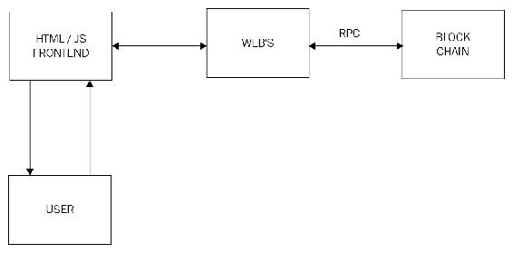

web3.js、前端和区块链交互架构

如果尚未安装 web3.js，请按照以下步骤进行安装；否则，请继续下一步。

### 安装 web3.js

可以通过 `npm` 简单地执行以下命令安装 Web3：

```
$ npm install web3

```

也可以直接从 [https://github.com/ethereum/web3.js](https://github.com/ethereum/web3.js) 下载。

可以在 HTML 文件中引用通过 `npm` 下载的 `web3.min.js`。例如，可以在 node_modules 中找到它，例如，`/home/drequinox/netstats/node_modules/web3/dist/web3.min.js`。该文件可选择地复制到主应用程序所在的目录中，并且可以从那里使用。一旦文件在 HTML 或 JS 中成功引用，就需要通过提供 HTTP 提供程序来初始化 web3。这通常是运行的 `geth` 客户端暴露的本地主机 HTTP 终端的链接。可以使用以下代码实现：

```
web3.setProvider(new web3.providers.HttpProvider('http://localhost:8001')); 

```

一旦提供程序设置完成，可以使用 `web3` 对象及其可用的方法与合同和区块链进行进一步的交互。

可以使用以下代码创建 `web3` 对象：

```
if (typeof web3 !== 'undefined')
{ 
  web3 = new Web3(web3.currentProvider); 
} 
else 
{ 
  web3 = new Web3(new     
  Web3.providers.HttpProvider("http://localhost:8001")); 
} 

```

#### 示例

在下一节中，将演示一个示例，该示例将使用 web3.js 允许通过简单的 HTTP Web 服务器提供的 Web 页面与合同进行交互。可以通过以下步骤实现：

1.  首先，在主目录中创建一个名为 `/simplecontract/app` 的目录。

1.  然后，创建一个名为 `simplecontractcompiled.js` 的文件，如下所示：

    ```
        simplecontractcompiled={ 
        valueChecker: { 
        code:         
        "0x6060604052600a60005534610000575b60878061001c6000396000f360606040
        5260e060020a6000350463f9d55e218114601c575b6000565b34600057602960043
        5603d565b604080519115158252519081900360200190f35b6000805460ff83161
        0608157604080516001815290517f3eb1a229ff7995457774a4bd31ef7b13b6f449
        1ad1ebb8961af120b8b4b6239c9181900360200190a15060015b5b91905056", 
        info: 
        { 
        abiDefinition: 
        [{ 
        constant: false, 
        inputs: 
        [{ 
        name: "x", 
        type: "uint8" 
        }], 
        name: "Matcher", 
        outputs: 
        [{ 
        name: "", 
        type: "bool" 
        }], 
        payable: false, 
        type: "function" 
        },
        { 
        anonymous: false, 
        inputs: 
        [{ 
        indexed: false, 
        name: "returnValue", 
        type: "bool" 
        }], 
        name: "valueEvent", 
        type: "event" 
        }], 
        compilerOptions: "--combined-json bin,abi,userdoc,devdoc --add-       
        std --optimize",compilerVersion: "0.4.6",   
        developerDoc: 
        { 
        methods: {} 
        }, 
        language: "Solidity", 
        languageVersion: "0.4.6", 
        source: "pragma solidity ^0.4.0; contract valueChecker { uint         
        price=10; event valueEvent(bool returnValue);                                                                      
        function Matcher (uint8 x) returns (bool) { if (x>=price) {       
        valueEvent(true); return true; } } }", 
        userDoc: { 
        methods: {} 
        } 
        } 
        } 
        } 

    ```

    此文件包含各种元素。最重要的是 **ABI（应用程序二进制接口）**，可以使用 `geth` 查询，就像在合同部署过程中的第6步中所示的那样。

1.  创建一个名为 `simplecontract.js` 的文件，如下所示：

    ```
        if (typeof web3 !== 'undefined')
        { 
        web3 = new Web3(web3.currentProvider); 
        } 
        else 
        { 
         web3 = new Web3(new    
         Web3.providers.HttpProvider("http://localhost:8001"));          
        } 
        console.log("Coinbase: " + web3.eth.coinbase); 
        var simplecontractaddress = "0x94a1107f2585f0ab931c71f2f8f02e9
                                     f5ab888c0"; 
         simplecontractinstance =      
         web3.eth.contract(simplecontractcompiled.valueChecker
         .info.abiDefinition).at(simplecontractaddress); 
         var code = web3.eth.getCode(simplecontractaddress); 
         console.log("Contract balance: " +                            
         web3.eth.getBalance(simplecontractaddress)); 
         console.log("simple contract code" + code); 
         function callMatchertrue()
         { 
            var txn = simplecontractinstance.Matcher.call(12);{ 
         }; 
         console.log("return value: " + txn); 
         } 
         function callMatcherfalse() 
         { 
         var txn = simplecontractinstance.Matcher.call(1);{ 
         }; 
         console.log("return value: " + txn); 
         } 

    ```

    这个文件是包含创建 `web3` 对象的代码的主 JavaScript 文件。它还提供了用于与区块链上的合同进行交互的方法。代码的解释如下所示。

**创建 web3 对象**

```
if (typeof web3 !== 'undefined')  
{ 
  web3 = new Web3(web3.currentProvider); 
} 
 else  
{ 
  web3 = new Web3(new Web3.providers.HttpProvider("http://localhost:
         8001"));                                                 
} 

```

此代码首先检查是否已经有可用的提供程序；如果有，则将提供程序设置为当前提供程序。否则，它将 web3 提供程序设置为 `localhost:8001`；这是本地运行 `geth` 的位置。

**通过调用任何 web3 方法检查可用性**

```
console.log("Coinbase: " + web3.eth.coinbase); 

```

这行代码简单地使用`console.log`通过调用`web3.eth.coinbase`方法打印 coinbase。一旦此调用成功，意味着`web3`对象已正确创建，并且`HttpProvider`可用。任何其他调用都可以用来验证可用性，但作为一个简单的例子，前面的例子中使用了`web3.eth.coinbase`。

**将合约地址分配给变量**

```
var simplecontractaddress = "0x94a1107f2585f0ab931c71f2f8f02e9f5ab888c0     
                             ";

```

此语句将分配部署在区块链上的合约地址的值。在语句变量成功执行后，`simplecontractaddress`将包含合约的地址。这是在前面的示例中当合约被部署时，在步骤9中创建合约的地址。只需在此处的代码中使用该地址。

**创建主合约对象**

```
simplecontractinstance = web3.eth.contract(simplecontractcompiled
                                 .valueChecker.info.abiDefinition)
                                 .at(simplecontractaddress); 

```

这段代码将创建一个对象，稍后将在代码中用于与区块链上的合约进行交互。`simplecontractinstance`将暴露合约的函数。`web3.eth.contract`将 ABI 数组作为参数。这可以通过`simplecontractcompiled.valueChecker.info.abiDefinition`传递。最后，`.at`接受合约地址作为参数。

**获取合约地址的代码（可选）**

这只是一个示例，并且完全是可选的：

```
var code = web3.eth.getCode(simplecontractaddress); 
console.log("simple contract code" + code); 

```

前面的语句用于查询合约的代码。这是一个简单的`web3.eth.getCode`调用，它将区块链上的合约地址作为参数。最后，使用`console.log`通过打印代码变量来打印合约的代码。

**合约余额**

`console.log("Contract balance:" +web3.eth.getBalance(simplecontractaddress));`前面的代码将调用`web3.eth.getBalance`并将合约地址作为参数，并将打印合约的余额，目前为 0。

**合约函数**

一旦`web3`对象正确创建并且`simplecontractinstance`被创建，就可以轻松地调用合约函数，如下例所示：

```
function callMatchertrue() 
{ 
 var txn = simplecontractinstance.Matcher.call(12);{ 
}; 
console.log("return value: " + txn); 
} 

function callMatcherfalse()
{ 
var txn = simplecontractinstance.Matcher.call(1);{ 
}; 
console.log("return value: " + txn); 
} 

```

可以使用`simplecontractinstance.Matcher.call`进行调用，然后通过传递参数的值。回忆一下 solidity 代码中的函数 matcher：

```
function  Matcher (uint8 x) returns (bool) 

```

它接受一个`uint8`类型的参数`x`，并返回一个布尔值，要么是 true，要么是 false。

因此，调用合约，如下所示：

```
var txn = simplecontractinstance.Matcher.call(12); 

```

在前面的示例中，`console.log`用于打印函数调用返回的值。一旦调用的结果在`txn`变量中可用，就可以在程序的任何地方使用它，例如作为另一个 JavaScript 函数的参数。

最后，HTML 文件命名为`index.html`，并使用以下代码创建：

```
<html> 
<head> 
    <title>SimpleContract Interactor</title> 
    <script src="img/web3.min.js"></script> 
    <script src="img/simplecontractcompiled.js"></script> 
    <script src="img/simplecontract.js"></script> 
</head> 
<body> 
    <button onclick="callMatchertrue()">callTrue</button> 
    <button onclick="callMatcherfalse()">callFalse</button> 
</body> 
</html> 

```

推荐运行适当的 Web 服务器以提供 HTML 内容（以`index.html`为例）。或者，文件可以从文件系统中浏览，但这可能会在较大的项目中引起一些问题；作为良好的实践，始终使用 Web 服务器。可以使用以下命令快速启动 Python 中的 Web 服务器。此服务器将从运行所在的相同目录中提供 HTML 内容。Python 不是必需的；它甚至可以是 Apache 服务器或任何其他 Web 容器。

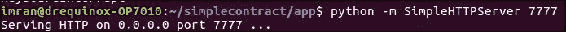

Python 中的简单 Web 服务器

现在任何浏览器都可以用于查看通过 TCP `端口 7777` 提供的网页。如以下示例所示。应该注意，这里显示的输出位于浏览器的控制台窗口中。必须启用浏览器的控制台才能看到输出。

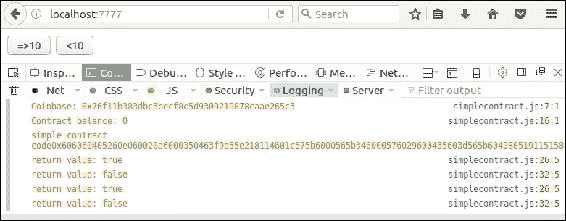

与合同的交互

由于简单起见，代码中的值是硬编码的，因此在`index.html`中创建了两个按钮。这两个按钮都调用具有硬编码值的函数。这只是为了演示通过 web3 将参数传递给合同，并相应地返回值。

在前面的按钮之后调用了两个函数。`callMatchertrue()` 方法具有硬编码值`12`，该值通过以下方式发送到合同：

```
simplecontractinstance.Matcher.call(12) 

```

返回值是使用以下代码在控制台中打印出来的，该代码首先调用`Matcher`函数，然后将值分配给`txn`变量以便稍后在控制台中打印出来：

```
simplecontractinstance.Matcher.call(1) 
function callMatchertrue() 
{ 
 var txn = simplecontractinstance.Matcher.call(12);{ 
}; 
console.log("return value: " + txn); 
} 

```

类似地，`callMatcherfalse()` 函数通过以下方式将硬编码值`1`传递给合同：

```
simplecontractinstance.Matcher.call(1) 

```

返回值相应地打印出来：

```
console.log("return value: " + txn); 
function callMatcherfalse() 
{ 
 var txn = simplecontractinstance.Matcher.call(1);{ 
}; 
console.log("return value: " + txn); 
} 

```

此示例演示了如何使用 web3 库与区块链上的合同进行交互。

## 开发框架

现在有各种用于以太坊的开发框架可用。正如前面讨论的示例中所看到的，通过通常的手动方式部署合同可能会非常耗时。这就是 truffle 和类似的框架（如 embark）可以用来简化和加快该过程的地方。最广泛使用的框架称为 truffle。在下一节中，您将介绍 truffle 框架。

### Truffle

Truffle 是一个开发环境，可以更轻松、更简单地测试和部署以太坊合同。Truffle 提供合同编译和链接以及使用 Mocha 和 Chai 的自动化测试框架。它还可以更容易地将合同部署到任何 PrivateNet、公共或测试网络以太坊区块链上。此外，提供了资产管道，使所有 JavaScript 文件都可以被处理，使它们准备好供浏览器使用。

#### 安装

在安装之前，假设节点是可用的，可以按照此处所示的方式查询。如果节点不可用，则首先需要安装节点以安装 truffle：

```
drequinox@drequinox-OP7010:~/testdapp$ nodejs --version
v7.2.1
drequinox@drequinox-OP7010:~/testdapp$ node --version
v7.2.1

```

truffle 的安装非常简单，可以通过以下命令使用 `npm` 完成：

```
$ sudo npm install -g truffle

```

这需要一些时间；一旦安装完成，`truffle` 可以用来显示帮助并确保安装正确。

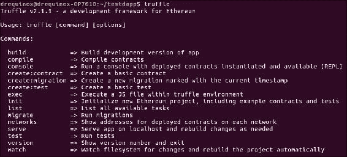

Truffle 帮助

或者，该存储库可在 [https://github.com/ConsenSys/truffle](https://github.com/ConsenSys/truffle) 获得，可以在本地克隆以安装 truffle。可以使用 Git 使用以下命令来克隆存储库：

```
https://github.com/ConsenSys/truffle.git

```

**初始化 truffle**

可以通过运行以下命令来初始化 truffle。首先，为项目创建一个目录，例如：

```
mkdir testdapp

```

然后，切换到`testdapp`目录，并运行以下命令：

```
~/testdapp$ truffle init

```

一旦命令成功，将创建如下所示的目录结构。这可以通过 Linux 中的 `tree` 命令查看：

```
drequinox@drequinox-OP7010:~/testdapp$ tree
.
├── app
│   ├── images
│   ├── index.html
│   ├── javascripts
│   │   └── app.js
│   └── stylesheets
│       └── app.css
├── contracts
│   ├── ConvertLib.sol
│   ├── MetaCoin.sol
│   └── Migrations.sol
├── migrations
│   ├── 1_initial_migration.js
│   └── 2_deploy_contracts.js
├── test
│   └── metacoin.js
└── truffle.js
7 directories, 10 files

```

此命令会创建四个主目录，名称分别为`app`、`contracts`、`migrations`和`test`。如前面的示例所示，共创建了 7 个目录和 10 个文件。在下一部分中，将介绍所有这些文件和目录的解释。

+   `应用`：该目录包含所有应用文件，包括 HTML 文件，图像，样式表和 JavaScript 文件。该文件夹包含进一步的子目录，`images`、`javascripts` 和 `stylesheets`，其中包含相关的应用文件。

+   `合约`：该目录包含 solidity 合约源代码文件。这是 truffle 在迁移过程中寻找 solidity 合约文件的位置。

+   `迁移`：该目录包含所有部署脚本。

+   `测试`：顾名思义，该目录包含应用程序和合同的相关测试文件。

最后，truffle 配置存储在根文件夹中创建的`truffle.js`文件中。当运行`truffle init`时，它将创建一个名为 MetaCoin 的示例项目。例如，您将首先介绍如何在 truffle 中使用各种命令来测试和部署 MetaCoin。稍后，将展示如何在自定义项目中使用 truffle 的更多示例。

**使用 truffle 进行编译**

使用 truffle 可以编译库和合约。预期合同文件名与文件中的合同名称相同。例如，从之前创建的示例 MetaCoin 项目中，`contracts` 目录下的名为 `MetaCoin.sol` 的文件与文件中的 MetaCoin 合同同名。这也适用于库文件，且区分大小写。

+   文件名：

```
MetaCoin.sol 

```

+   文件中的合同名称：

```
contract MetaCoin { 
        mapping (address => uint) balances; 

```

可以如下所示运行编译：

```
~/testdapp$ truffle compile
Compiling ConvertLib.sol...
Compiling MetaCoin.sol...
Compiling Migrations.sol...
Writing artifacts to ./build/contracts
~/testdapp$

```

一旦编译成功完成，所有对象将被写入`build`目录。输出目录看起来像这样：

```
~/testdapp$ tree build/
build/
└── contracts
 ├── ConvertLib.sol.js
 ├── MetaCoin.sol.js
 └── Migrations.sol.js
1 directory, 3 files

```

如前面的示例所示，`build` 目录会自动创建，其中包含 `contracts` 子目录，其中包含三个 JavaScript 文件。

**迁移**

这是truffle将合同部署到区块链的过程。该过程依赖于`migrations`目录下的可用文件。

过程如下所示：

```
~/testdapp$ cd migrations/
~/testdapp/migrations$ ls -ltr
-rw-rw-r-- 1 drequinox drequinox 124 Dec 12 12:57 2_deploy_contracts.js
-rw-rw-r-- 1 drequinox drequinox  72 Dec 12 12:57 1_initial_migration.js
~/testdapp/migrations$ cat 2_deploy_contracts.js
module.exports = function(deployer) 
{
 deployer.deploy(ConvertLib);
 deployer.autolink();
 deployer.deploy(MetaCoin);
};
drequinox@drequinox-OP7010:~/testdapp/migrations$ cat 1_initial_migration.js
module.exports = function(deployer) 
{
 deployer.deploy(Migrations);
};

```

如前面的输出所示，有两个文件包含了指定需要部署的合同的代码。

文件名遵循一个约定，其中它们需要以数字作为前缀。这个前缀是为了记录所有迁移。文件名中的后缀可以是任何描述性的名称。首先，需要更改`truffle.js`文件以指向适当的网络。`truffle.js`文件包含有关应用程序的构建和rpc的宝贵信息。在这种情况下，`geth`已经运行，可以简单地指向使用可用客户端：

```
module.exports = { 
  build: { 
    "index.html": "index.html", 
    "app.js": [ 
      "javascripts/app.js" 
    ], 
    "app.css": [ 
      "stylesheets/app.css" 
    ], 
    "images/": "images/" 
  }, 
  rpc: { 
    host: "localhost", 
    port: 8001 
  } 
}; 

```

在前面的文件中，`rpc`需要更改为指向适当的网络。一旦更改了`rpc`（在示例中，`geth`正在8001端口上运行，而不是通常的8545），truffle迁移可以使用以下命令运行。同样重要的是，必须在指向`rpc`的以太坊节点上运行挖掘；否则，合同将无法被挖掘。

可以使用下面显示的命令部署合同：

```
~/testdapp$ truffle migrate

```

它可能会显示错误消息，如下所示。如果出现这种情况，则意味着truffle用于将合同部署到区块链的账户已被锁定，需要解锁：

```
Running migration: 1_initial_migration.js
 Deploying Migrations...
Error encountered, bailing. Network state unknown. Review successful transactions manually.
Error: **account is locked** 
 at Object.InvalidResponse (/usr/lib/node_modules/truffle/node_modules/ether-pudding/node_modules/web3/lib/web3/errors.js:35:16)
 at /usr/lib/node_modules/truffle/node_modules/ether-pudding/node_modules/web3/lib/web3/requestmanager.js:86:36
 at exports.XMLHttpRequest.request.onreadystatechange (/usr/lib/node_modules/truffle/node_modules/web3/lib/web3/httpprovider.js:114:13)
 at exports.XMLHttpRequest.dispatchEvent (/usr/lib/node_modules/truffle/node_modules/xmlhttprequest/lib/XMLHttpRequest.js:591:25)
 at setState (/usr/lib/node_modules/truffle/node_modules/xmlhttprequest/lib/XMLHttpRequest.js:610:14)
 at IncomingMessage.<anonymous> (/usr/lib/node_modules/truffle/node_modules/xmlhttprequest/lib/XMLHttpRequest.js:447:13)
 at emitNone (events.js:91:20)
 at IncomingMessage.emit (events.js:185:7)
 at endReadableNT (_stream_readable.js:974:12)
 at _combinedTickCallback (internal/process/next_tick.js:74:11)
 at process._tickDomainCallback (internal/process/next_tick.js:122:9)

```

可以通过在`geth` JavaScript控制台中使用以下命令来解锁账户。

首先，列出账户以查看所有账户，然后选择需要解锁的账户。Truffle默认假设coinbase账户。选择适当的账户如下：

```
> personal.listAccounts
["0x76f11b383dbc3becf8c5d9309219878caae265c3", "0xcce6450413ac80f9ee8bd97ca02b92c065d77abc"]

```

可以使用以下命令解锁账户：

```
> personal.unlockAccount("0x76f11b383dbc3becf8c5d9309219878caae265c3")
Unlock account 0x76f11b383dbc3becf8c5d9309219878caae265c3
Passphrase:
true

```

一旦账户被解锁，可以使用以下命令再次运行迁移：

```
~/testdapp$ truffle migrate

```

它将显示类似于此处所示的输出。需要注意的是，必须开始挖掘以完成迁移。迁移将通过查找`migrations`目录中的可用文件执行各种步骤。如示例所示，`1_initial_migration.js`和`2_deploy_contracts.js`已被用来提供truffle的迁移步骤和要求：

```
Running migration: 1_initial_migration.js
 Deploying Migrations...
 Migrations: 0xf444cce0cee00cab4d04bcfc0005626b8b02add8
Saving successful migration to network...
Saving artifacts...
Running migration: 2_deploy_contracts.js
 Deploying ConvertLib...
 ConvertLib: 0x2ba8a4a75a6b845bf482923cff29ecc98cd68d90
 Linking ConvertLib to MetaCoin
 Deploying MetaCoin...
 MetaCoin: 0x0be9c5de978fa927b93a5c4faab31312cea5704a
Saving successful migration to network...
Saving artifacts...
~/testdapp$

```

一旦命令成功完成，将返回一个命令提示符，显示消息`saving artefacts`。

可以使用下面显示的几个命令通过`geth` JavaScript控制台来验证部署：

```
> eth.getBalance("0x0be9c5de978fa927b93a5c4faab31312cea5704a")
0
> eth.getCode("0x0be9c5de978fa927b93a5c4faab31312cea5704a")
"0x606060405260e060020a60003504637bd703e8811461003457806390b98a1114610056578063f8b2cb4f1461007d575b610000565b346100005761004460043561009f565b60408051918252519081900360200190f35b3461000057610069600435602435610119565b604080519115158252519081900360200190f35b34610000576100446004356101b1565b60408051918252519081900360200190f35b6000732ba8a4a75a6b845bf482923cff29ecc98cd68d906396e4ee3d6100c4846101b1565b60026000604051602001526040518360e060020a028152600401808381526020018281526020019250505060206040518083038186803b156100005760325a03f415610000575050604051519150505b919050565b600160a060020a03331660009081526020819052604081205482901015610142575060006101ab565b600160a060020a0333811660008181526020818152604080832080548890039055938716808352918490208054870190558351868152935191937fddf252ad1be2c89b69c2b068fc378daa952ba7f163c4a11628f55a4df523b3ef929081900390910190a35060015b92915050565b600160a060020a0381166000908152602081905260409020545b91905056"

```

请注意，新部署的合同地址已经从前面显示的truffle迁移命令输出中获取。（MetaCoin: 0x0be9c5de978fa927b93a5c4faab31312cea5704a）

+   **与合约交互**：Truffle 还提供了一个控制台（命令行界面），允许与合约交互。所有部署的合约都已经实例化并准备在控制台中使用。这是一个基于 REPL 的接口，即读取、评估和打印循环。类似地，在 geth 客户端中（通过 attach 或 console），REPL 是通过暴露 **JSRE**（**JavaScript 运行时环境**）来使用的。可以通过发出以下命令来访问控制台：

    ```
    ~/testdapp$ truffle console

    ```

    这将打开一个命令行界面，如下所示：

    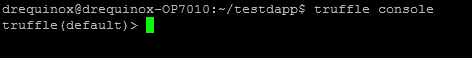

    Truffle 控制台

    一旦控制台可用，就可以运行各种方法来查询合约。可以通过输入以下命令并使用 tab 键补全来显示方法列表：

    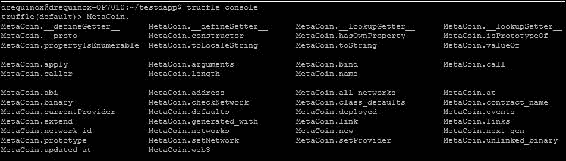

    暴露的方法

    还可以调用其他方法以与合约交互；例如，为了检索合约的地址，可以在 truffle 控制台中调用以下方法：

    ```
    truffle(default)> MetaCoin.deployed().address
    '0x0be9c5de978fa927b93a5c4faab31312cea5704a'
    truffle(default)>

    ```

+   **查询合约余额**：

    ```
    truffle(default)>      
            MetaCoin.deployed().getBalance.call(web3.eth.accounts[0])
    { [String: '8750'] s: 1, e: 3, c: [ 8750 ] }

    ```

    输出返回一个值为`8750`的字符串。

+   **转移余额**：

    ```
    truffle(default)>         
            MetaCoin.deployed().sendCoin("0xcce6450413ac80f9ee8bd97ca02b92c
            065d77abc",50, {from:"0x76f11b383dbc3becf8c5d9309219878caae265c 
            3"})
     '0xb8969149fcfb54ec9beac31af1fc86c386f9aa42cb13d2eb9bf946993198
           6e0f'

    ```

    这将返回交易的哈希，并且在成功时，它将使目标的余额增加50。目标账户是传递给`sendCoin`函数的参数。

+   **目标账户的余额**：可以使用以下命令检索：  

    ```
    truffle(default)>      
            MetaCoin.deployed().getBalance.call(web3.eth.accounts[1])
    { [String: '1250'] s: 1, e: 3, c: [ 1250 ] }
    truffle(default)>

    ```

为了退出 truffle 控制台，使用`.exit`命令。  

#### 使用 truffle 进行测试

测试是 Truffle 的一个强大功能，可以通过运行以下命令来调用：

```
~/testdapp$ truffle test

```

这将从`test`目录中读取测试并相应地执行测试。Truffle 使用的测试框架称为 Mocha，它使用了一个名为 Chai 的断言框架。

一个示例测试运行如下。这个测试仅运行了两个测试。在原始文件中，有三个测试，但为简单起见，这里只使用了两个。另外，该测试可能在大多数系统上失败；因此，它已从文件中删除以简化。稍后将讨论一个失败的测试案例。另外，应该注意，为了运行测试，挖矿应该正在运行。

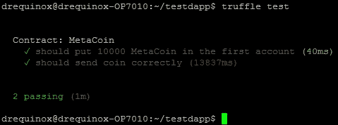

Truffle 测试输出显示了两个成功的测试

这两个测试基于由 truffle init 生成的文件。在以下文件中，仅显示了一个测试以简化，当 truffle 为默认 MetaCoin 项目创建了三个测试时。可以通过在文本编辑器中编辑`metacoin.js`文件来从文件中删除测试：

```
contract('MetaCoin', function(accounts) 
{ 
 it("should put 10000 MetaCoin in the first account", 
 function() 
 { 
  var meta = MetaCoin.deployed();  
  return meta.getBalance.call(accounts[0]).then(function(balance)
  { 
   assert.equal(balance.valueOf(), 10000, "10000 wasn't in the first     
   account"); 
  }); 
 }); 
}); 

```

所有测试文件都必须存在于`project`目录下的`tests`目录中。测试在`it`块中指定。

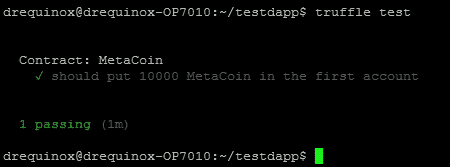  

基于之前显示的文件进行测试，仅有一个测试。

在前述测试案例中，当合约被部署时，它应该有 10000 的余额。该测试基本上测试了部署合约后是否可用 10000 的余额。为了解释概念，可以模拟错误，例如，通过更改断言的 `metacoin.js` 文件：

```
assert.equal(balance.valueOf(), 10000, "10000 wasn't in the first account"); 

```

到

```
assert.equal(balance.valueOf(), 1000, "10000 wasn't in the first account"); 

```

这将导致人为断言失败，因为在断言中，预期金额为 1000，而当合约部署时，其余额为 10,000。运行测试时，会显示以下输出，表明测试失败了。此更改仅用于演示目的，以便让您看到测试可能失败，并且如果失败，会产生什么类型的输出。

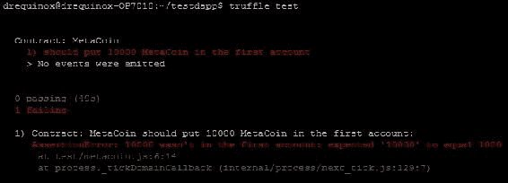

Truffle 测试失败的输出

`truffle test` 命令接受几个可选参数，特别是 `--verbose-rpc`，在理解以太坊客户端和 truffle 之间的 RPC 通信时非常有帮助。

在测试执行过程中，有时会出现类似于此处显示的错误消息：

```
Error: timeout of 120000ms exceeded. Ensure the done() callback is being called in this test.

```

当以太坊节点未进行挖矿或部署合约时间超过 2 分钟时会出现此错误。这就是超时发生的原因；因此，如果在 PrivateNet 上运行测试，则通过挖矿节点运行测试非常重要。另外，在 Ropsten 上，有时可能需要超过 2 分钟。或者可以使用 `ethereumjs-testrpc`，它通常与 truffle 一起使用，并提供快速模拟的以太坊 RPC 客户端。

#### 构建

truffle 中的构建用于为浏览器引导前端。它通过导入编译后的合约和相关部署的合约和以太坊客户端配置来工作。构建后，所有对象都保存在 `./build` 目录中。所有构建配置都在 `truffle.js` 文件中，该文件指导 truffle 构建什么。默认情况下，此文件仅带有 `build:` 和 `rpc:` 配置。

可以通过发出以下命令来启动构建：

```
~/testdapp$ truffle build

```

构建完成后，如果尚不存在，则将创建 `build` 目录，并创建类似于此处显示的树形结构。这是根据 `truffle.js` 文件创建的：

```
build/
├── app.css
├── app.js
├── contracts
│   ├── ConvertLib.sol.js
│   ├── MetaCoin.sol.js
│   └── Migrations.sol.js
├── images
└── index.html

```

构建成功完成后，所有前端文件都将准备就绪。然后可以使用 truffle 的 `serve` 命令在浏览器中查看。`serve` 命令创建一个 Web 服务器以呈现 HTML 内容。可以像下面显示的那样运行该命令。

请注意，该命令是使用 `-p` 标志运行的，以指定 TCP 7777 端口。这是因为在之前提供的示例中，`geth` 是使用 `--rpccorsdomain 'http://localhost:7777'` 选项运行的。这意味着只允许通过 TCP 7777 提供的内容。默认情况下，`serve` 在端口 8080 上运行，由于 TCP 8080 是非常常用的 Web 应用程序端口，因此可能被系统中的其他进程使用。

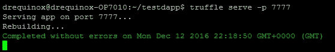

Truffle 服务

使用 truffle migrate 迁移到以太坊测试网络。这将在网络上部署合同。请注意，此时需要再次更新`truffle.js`，将端口 8001 指向私有网络：

为了与合同进行交互，可以使用以下方法。由于 Addition 合同已经被实例化并在 truffle 控制台中可用，因此使用各种方法与合同进行交互变得非常容易。

示例 MetaCoin 前端

#### 另一个例子

下面是一个示例，在其中使用 solidity 创建了一个简单的具有迁移和测试的合同。合同非常简单，只执行加法：

1.  创建一个名为`simpleTest`的目录：

    ```
    $ mkdir simpleTest

    ```

1.  初始化 truffle：

    ```
    $ truffle init

    ```

1.  从目录中删除文件。这是为了删除 truffle 创建的默认 MetaCoin 项目文件。

    ```
    rm -r test/* contracts/* migrations/*

    ```

1.  一旦 truffle 服务器在适当的端口上运行起来，可以使用浏览器查看内容，并指向 URL `http://localhost:7777`。

    (原文结束)

    ```
       pragma solidity ^0.4.2; 
       contract Addition
       { 
        uint8 x; 
        function addx(uint8 y, uint8 z ) 
        { 
         x = y + z; 
        } 
    function retrievex() constant returns (uint8)
    { 
     return x; 
    } 
    } 
    Migrations.sol: 
    pragma solidity ^0.4.2; 
    contract Migrations 
    { 
      address public owner; 
      uint public last_completed_migration; 
      modifier restricted()
     { 
        if (msg.sender == owner) _; 
     } 
     function Migrations() 
     { 
      owner = msg.sender; 
     } 
      function setCompleted(uint completed) restricted 
      { 
        last_completed_migration = completed; 
      } 
      function upgrade(address new_address) restricted 
      { 
       Migrations upgraded = Migrations(new_address); 
       upgraded.setCompleted(last_completed_migration); 
      } 
      } 

    ```

1.  显示成功的 truffle 测试的样本输出

    ```
            contract('Addition', function(accounts) 
            { 
            it(" 100 + 100 = 200 ", function()
            { 
            var AddContract = Addition.deployed(); 
            AddContract.addx(100, 100,{from:accounts[0],gas:1000000})                                      
            .then(function(a) 
            { 
            return AddContract.retrievex.call().then(function(Result)
            { 
            assert.equal(Result, 200, "100 + 100 = 200 is expected"); 
            }); 
            }); 
            });  
            }); 

    ```

1.  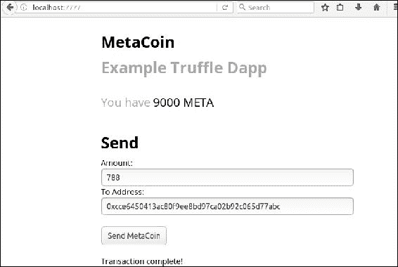

    `        1_initial_migration.js`:

    ```
            module.exports = function(deployer) 
            { 
             deployer.deploy(Migrations); 
            }; 

    ```

    `        2_deploy_contracts.js`:

    ```
            module.exports = function(deployer)
            { 
             deployer.deploy(Addition); 
             deployer.autolink(); 
            }; 

    ```

1.  一旦所有文件就位，使用 truffle compile 编译所有合同。可选地，使用`--compile-all`标志重新编译合同，即使它们已经编译过。只有在需要重新编译合同时才需要这样做：

    ```
    ~/simpleTest$ truffle compile
    Compiling Addition.sol...
    Compiling Migrations.sol...
    Writing artifacts to ./build/contracts

    ```

1.  在`migrations`文件夹中，放置两个文件：

    ```
    ~/simpleTest$ truffle migrate
    Running migration: 2_deploy_contracts.js
     Deploying Addition...
     Addition: 0x73934227a1ce7fc44152b7451626759a00b0275c
    Saving successful migration to network...
    Saving artifacts...

    ```

    最后，可以使用以下命令执行测试。这些测试是基于前面显示的`Addition.js`文件的：

    ```
    ~/simpleTest$ truffle test

    ```

    该命令将首先在以太网（本例中为 PrivateNet）上部署合同。

    将两个文件`Addition.sol`和`Migrations.sol`放入合同目录中：

    `Addition.sol`:

1.  将`Addition.js`文件放入`test`目录中：

例如，为了检索部署的合同的地址，可以调用以下方法：

```
truffle(default)> Addition.address
'0x73934227a1ce7fc44152b7451626759a00b0275c'

```

要从合同内部调用函数，需要使用已部署方法与合同函数。下面是一个示例，展示了如何调用`addx`函数并传递两个参数：

```
truffle(default)> Addition.deployed().addx(100,100)
'0xae6f51782c1bcf04ec34dd54ee31da626dc138993ea813bc6c3c1fe0790b130e'
truffle(default)> '0xb9f8633fbd626466ee2c2f24952a5fca3134f4e7d08f39a4d26ac2689e22b653'

```

从合同中调用`retrievex`函数：

```
truffle(default)> Addition.deployed().retrievex()
{ [String: '200'] s: 1, e: 2, c: [ 200 ] }

```

#### 示例项目：Proof of Idea

该程序的理念是为文档提供公证服务。然后可以用作在过去的某个时间点，申请人可以访问某一段信息的证据。对于专利文件，这非常有用。例如，如果有人想出了一个创意，那么他/她可以对该文件进行哈希处理并保存在区块链上。由于区块链的不可变性，它可以作为某个想法（文件）在某个时间点存在的永久证据。有很多方法可以实现这一点，但关键理念是相同的，它是基于哈希函数提供文本或文件的摘要并且是唯一的。

这可以通过几种方式实现；关键点是创建文档或文本字符串的散列并将其保存在区块链上。一旦文本被散列并保存，通过比较文档的散列与已存储的散列，可以阻止进一步请求保存相同的文本。

对于此示例，将使用浏览器可靠性、Truffle和测试网（已经运行的网络ID 786，之前创建的）。首先，将编写合同的代码。可以使用任何合适的文本编辑器或集成开发环境来完成。浏览器可靠性也可以使用，因为它也为测试提供了一个模拟环境。此示例将为您提供一个学习如何将合同项目从想法开发成为 solidity 合同源代码并最终部署的机会。

让我们逐行分析一下代码：

```
pragma solidity ^0.4.0; 

```

此语句确保最低编译器版本为0.4.0，最高版本不得大于0.4.9。这确保了程序之间的兼容性：

```
contract PatentIdea { 

```

此语句是与名称为`PatentIdea`的合同的起始：

```
mapping (bytes32 => bool) private hashes; 

```

接下来，定义了一个映射，将byte32映射到布尔值，这基本上是一个`hashmap`（字典），将bytes32映射到布尔值：

```
bool alreadyStored; 

```

这是一个名为`alreadyStored`的声明变量，它是布尔类型，可以有一个true或false的值。此变量用于保存`SaveIdeaHash`函数的返回值：

```
event ideahashed(bool); 

```

同样还声明了一个事件，它将用于捕获散列函数(`SaveIdeaHash`)的失败或成功。当事件被触发时，它将返回一个布尔值true或false。

声明了一个名为`saveHash`的函数，它将以类型为bytes32的散列变量作为参数，并将其保存在散列表中。这将导致合同状态的改变。请注意，函数的可访问性已更改为私有，因为它只在合同内部需要使用，不需要在公开场合暴露：

```
 function saveHash(bytes32 hash) private 
{ 
 hashes[hash] = true; 
} 

```

另一个函数，`saveIdeaHash`，被声明，它接受类型为字符串的变量idea，并根据函数的结果返回一个布尔值（true或false）：

```
function SaveIdeaHash(string idea) returns (bool)
{ 
 var hashedIdea = HashtheIdea(idea); 
 if (alreadyHashed(HashtheIdea(idea)))  
 { 
  alreadyStored=true; 
  ideahashed(false); 
  return alreadyStored; 
 } 
 saveHash(hashedIdea); 
 ideahashed(true); 
} 

```

此函数有一个名为`hashedIdea`的声明变量，它在稍后调用`HashtheIdea`函数后赋值。请注意，这个函数也可以返回一个值表示已保存，但出于简化，此处没有显示。

下一个函数是`alreadyHashed`函数，它被声明为接受名为hash的类型为bytes32的变量，并在散列表中检查散列后返回一个布尔值（true或false）。这再次被声明为一个常量，可通过私有方式访问：

```
function alreadyHashed(bytes32 hash) constant private returns(bool) 
{ 
 return hashes[hash]; 
} 
} 

```

下一个函数是 `isAlreadyHashed`，它检查理念是否已经被哈希。这需要类型为 string 的输入参数 idea，也声明为 constant，这意味着它不能更改合同的状态，并根据函数 `alreadyHashed` 的执行结果返回 true 或 false。然后，此函数调用前面描述的 `alreadyHashed` 函数，以从哈希映射中检查哈希是否已经存储在那里。这意味着相同的字符串（`idea`）已被哈希并存储（专利）：

```
function isAlreadyHashed(string idea) constant  returns (bool) 
{ 
 var hashedIdea = HashtheIdea(idea); 
 return alreadyHashed(hashedIdea); 
} 

```

最后，这里显示了 `HashtheIdea` 函数，它接受 string 类型的 `idea` 变量，并且是 `constant` 类型，这意味着它不能更改合同的状态。并且声明为 `private`，因为没有必要公开此函数，因为它只在合同内部使用。此函数返回 bytes32 类型的值:

```
  function HashtheIdea(string idea) constant private returns (bytes32) { 
 return sha3(idea); 
} 

```

此函数调用 solidity 的内置函数 `sha3` 并将一个字符串传递给它作为 idea 变量。此函数返回该字符串的 sha3 哈希。`sha3` 函数是 solidity 中 `keccak256()` 函数的别名，它计算传递给它的字符串的 Keccak-256 哈希。请注意，这不是 NIST 标准的 SHA-3；相反，这是 Keccak-256，原始提议用于 SHA-3 标准竞赛的 NIST。稍后经过轻微修改，并被NIST标准化为SHA-3标准。实际的 SHA-3 标准哈希函数将返回与 Keccak-256（以太坊的 `sha3` 函数）不同的哈希。

完整的合同源代码如下所示：

```
pragma solidity ^0.4.0; 
contract PatentIdea 
{ 
  mapping (bytes32 => bool) private hashes; 
  bool alreadyStored; 
  event ideahashed(bool); 

  function saveHash(bytes32 hash) private 
  { 
    hashes[hash] = true; 
  } 

  function SaveIdeaHash(string idea) returns (bool)
  { 
    var hashedIdea = HashtheIdea(idea); 
   if (alreadyHashed(HashtheIdea(idea)))  
   { 
       alreadyStored=true; 
       ideahashed(false); 
       return alreadyStored; 
    } 
       saveHash(hashedIdea); 
       ideahashed(true); 
    } 

  function alreadyHashed(bytes32 hash) constant private returns(bool) 
  { 
    return hashes[hash]; 
  } 

  function isAlreadyHashed(string idea) constant  returns (bool) 
  { 
    var hashedIdea = HashtheIdea(idea); 
    return alreadyHashed(hashedIdea); 
  } 

   function HashtheIdea(string idea) constant private returns (bytes32)    
   { 
    return sha3(idea); 
   } 
  } 

```

此源代码可以在浏览器 solidity 中模拟，以验证其是否正确运行。这里显示一些示例。

一旦输入合同源代码并完成语法验证，在右侧面板上，将显示类似于以下屏幕的屏幕。

这段代码可以通过多种方式进行改进。例如，日期也可以与文档哈希一起存储在映射中，并在查询时返回。可以通过添加结构和与专利相关的更多信息来扩展，但此示例旨在简单易懂；因此，过度复杂性被避免。对此代码的进一步增强留给你作为一项练习。

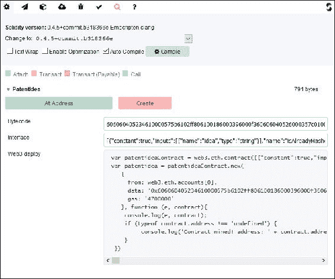

使用浏览器 solidity 创建合同

点击**创建**后，将暴露合同的两个函数，如下屏幕截图所示：

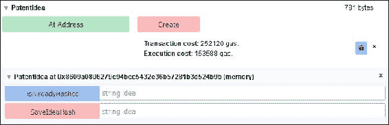

相关成本和暴露两种方法

现在可以按照以下示例调用函数：

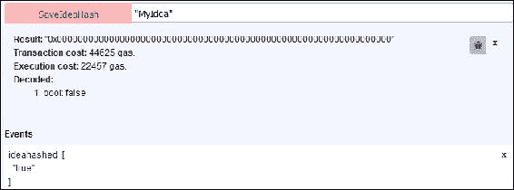

调用 SaveIdeaHash 函数

类似地，`isAlreadyHashed` 可以被调用。

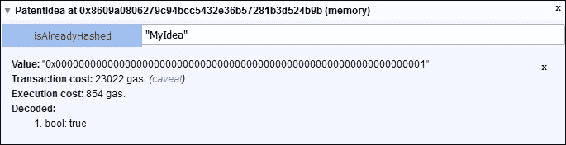

执行函数 isAlreadyHashed

如果再次将相同的字符串传递给函数，它将不会被保存，如下面的截图所示：

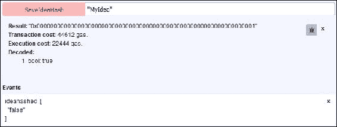

执行 SaveIdeaHash 函数

还要注意事件返回了 false，表示无法保存哈希，并且函数返回了 true，进一步表示相同的哈希已经保存。

一旦合约在浏览器 solidity 中编写和模拟，下一步是使用 truffle 初始化一个新项目，并在 PrivateNet（ID 786），在前面的部分已创建，上部署和测试它。

第一步是为项目创建一个单独的目录：

```
~$ mkdir ideapatent
~$ cd ideapatent/

```

下一步是初始化 truffle 并创建一个新项目：

```
~/ideapatent$ truffle init

```

一旦创建了示例项目，移除示例合约：

```
~/ideapatent/contracts$ rm MetaCoin.sol ConvertLib.sol

```

在 `contracts` 文件夹下，创建一个名为 `PatentIdea.sol` 的文件，并将之前显示的源代码放入文件中。

编辑 `truffle.js`，指向本地主机 HTTP 终端点：

```
rpc: 
  { 
    host: "localhost", 
    port: 8001 
  } 

```

在 `~/ideapatent/migrations` 文件夹下，编辑 `2_deploy_contracts.js` 文件，使其看起来像下面这样：

```
module.exports = function(deployer) 
{ 
  deployer.deploy(PatentIdea); 
  deployer.autolink(); 
}; 

```

更改此文件以指定要部署的合约名称。注意 `deployer.deploy(PatentIdea);`。

接下来，使用 truffle 运行编译，如下所示：

```
~/ideapatent$ truffle compile
Compiling Migrations.sol...
Compiling PatentIdea.sol...
Writing artifacts to ./build/contracts

```

确保后台正在运行挖矿并部署到网络，如下所示：

```
~/ideapatent$ truffle migrate
Running migration: 1_initial_migration.js
 Deploying Migrations...
 Migrations: 0x34d63de23de9c9b48251cec94fff427b94976109
Saving successful migration to network...
Saving artifacts...
Running migration: 2_deploy_contracts.js
 Deploying PatentIdea...
 PatentIdea: 0x515fd6a5dbc1eb609dc1700f73be040d9db50d4b
Saving successful migration to network...
Saving artifacts...

```

一旦合约部署，就可以使用 truffle 控制台与之交互。

通过发出此命令启动 truffle 控制台：

```
~/ideapatent$ truffle console

```

一旦控制台运行起来，就可以调用已部署合约中的函数，如下所示。

例如，注册一个新想法：

```
truffle(default)> PatentIdea.deployed().SaveIdeaHash("MyIdea")
'0x8644dc66f1173a9103034e17b761f8871ab10ef2a7d19bec9c7eb7164272b8a3'

```

检查 `MyIdea` 是否被哈希：

```
truffle(default)> PatentIdea.deployed().isAlreadyHashed("MyIdea")
true

```

检查另一个想法是否被哈希：

```
truffle(default)> PatentIdea.deployed().isAlreadyHashed("MyOtherIdea")
false
truffle(default)>

```

此示例演示了如何从头开始创建、模拟和部署合约到私有网络。为了在测试网（Ropsten）或实际区块链上部署，可以执行类似的操作。只需指向适当的 RPC 并使用 truffle migrate 即可在所选的区块链上部署。

在下一节中，将讨论各种高级概念。

**预言机**

正如在[第六章](ch05.html "第五章。替代币")中所讨论的，*智能合约*，预言机是智能合约中的实时数据源。有各种服务可用来为智能合约提供预言机。其中一个相当突出的是 Oraclize，它可在 [http://www.oraclize.it/](http://www.oraclize.it/) 上找到。如果智能合约需要，例如，来自第三方源的实时价格或任何其他现实生活数据，比如特定城市的天气状况，这将特别有用。预言机能够为智能合约提供受信任的数据源，使其能够根据现实生活事件做出决策。Oraclize 使智能合约更容易地访问互联网以获取所需的数据。

为了在以太坊上使用Oraclize，需要向Oraclize合约发送一个交易，同时附带适当的付款和查询。结果，Oraclize将根据请求交易中提供的查询检索结果并将其发送回合约地址。一旦交易发送回合约，将调用回调方法或回退函数。

在实际的solidity中，首先需要导入Oraclize库，然后可以使用从它继承的所有方法。目前，Oraclize仅可用于PrivateNet（Ropsten）和Live Main Net Ethereum区块链上。

可以将Oraclize处理可视化，如下图所示：

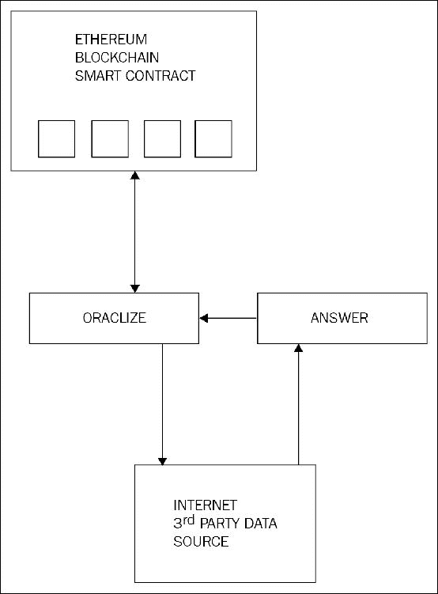

Oraclize数据流

使用oraclize的solidity合约的骨架结构如下所示。请注意，导入仅在oraclize在Web上提供的开发环境中起作用；通常，此文件需要手动导入：

```
import "dev.oraclize.it/api.sol"; 
contract MyOracleContract is usingOraclize 
{ 
 function MyOracleContract(){ 
} 

```

一个样本请求看起来像下面的例子所示：

```
oraclize_query("URL", "api.somewebsite.net/price?stock=XYZ"); 

```

Oraclize还可以利用TLS签名，以确保提供的信息是安全的和可证明的。

**使用IPFS在去中心化存储上部署**

如[第1章](ch01.html "Chapter 1. Blockchain 101")中所讨论的，*区块链101*，为了充分利用去中心化平台，最好将存储和通信层去中心化。传统上，Web内容是通过集中式服务器提供的，但也可以使用分布式文件系统去中心化该部分。

在早期示例中显示的HTML内容可以存储在分布式和去中心化的IPFS网络中，以实现增强的去中心化。

IPFS位于[https://ipfs.io/](https://ipfs.io/)。

**安装IPFS**

IPFS可以通过以下过程安装：

1.  使用以下命令下载IPFS包：

    ```
    $ curl https://dist.ipfs.io/go-ipfs/v0.4.4/go-     
            ipfs_v0.4.4_linux-amd64.tar.gz -O

    ```

1.  解压缩`gz`文件：

    ```
    $ tar xvfz go-ipfs_v0.4.4_linux-amd64.tar.gz

    ```

1.  将`ipfs`文件移动到适当的文件夹中，以使其在路径中可用：

    ```
    $ mv go-ipfs/ipfs /usr/local/bin/ipfs

    ```

1.  初始化IPFS节点：

    ```
    imran@drequinox-OP7010:~$ ipfs init
    initializing ipfs node at /home/imran/.ipfs
    generating 2048-bit RSA keypair...done
    peer identity: Qmbc726pLS9nUQjUbeJUxcCfXAGaXPD41jAszXniChJz62
    to get started, enter:
     ipfs cat        
            /ipfs/QmYwAPJzv5CZsnA625s3Xf2nemtYgPpHdWEz79ojWnPbdG/readme

    ```

1.  输入以下命令以确保**IPFS**已成功安装：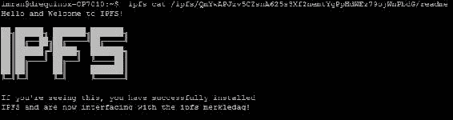

    成功安装IPFS

1.  启动IPFS守护程序：

    ```
    imran@drequinox-OP7010:~$ ipfs daemon
    Initializing daemon...
    Swarm listening on /ip4/127.0.0.1/tcp/4001
    Swarm listening on /ip4/192.168.0.17/tcp/4001
    Swarm listening on /ip4/86.15.44.209/tcp/4001
    Swarm listening on /ip4/86.15.44.209/tcp/41608
    Swarm listening on /ip6/::1/tcp/4001
    API server listening on /ip4/127.0.0.1/tcp/5001
    Gateway (readonly) server listening on /ip4/127.0.0.1/tcp/8080
    Daemon is ready

    ```

1.  使用以下命令将文件复制到IPFS上：

    ```
    ~/sampleproject/build$ ipfs add --recursive --progress .
    added QmVdYdY1uycf32e8NhMVEWSufMyvcj17w3DkUt6BgeAtx7      
            build/app.css
    added QmSypieNFeiUx6Sq7moAVCsgQhSY3Bh9ziwXJAxqSG5Pcp      
            build/app.js
    added QmaJWMjD767GvuwuaLpt5tck9dTVCZPJa9sDcr8vdcJ8pY      
            build/contracts/ConvertLib.sol.js
    added QmQdz9eG2Qd5kwaU86kWebDGPqXBWj1Dmv9MN4BRzt2srf     
            build/contracts/MetaCoin.sol.js
    added QmWpvBjXTP4HutEsYUh3JLDi8VYp73SKNJi4aX1T6jwcmG      
            build/contracts/Migrations.sol.js
    added QmQs7j6NpA1NMueTXKyswLaHKq3XDUCRay3VrC392Q4JDK     
            build/index.html
    added QmPvWzyTEfLQnozDTfgdAAF4W9BUb2cDq5KUUrpHrukseA     
            build/contracts
    added QmUNLLsPACCz1vLxQVkXqqLX5R1X345qqfHbsf67hvA3Nn      
            build/images
    added QmSxpucr6J9rX3XQ3MBG8cVzLCrQFFKmMkTmpcNpjbtf3j build

    ```

1.  现在可以在浏览器中访问它，如下所示：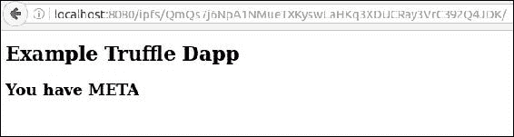

    浏览器通过IPFS访问网页

    ### 注意

    请注意，URL指向IPFS文件系统。

1.  最后，为了使更改永久生效，可以使用以下命令：

    ```
    /build$ ipfs pin add QmSxpucr6J9rX3XQ3MBG8cVzLCrQFFKmMkTmpcNpjbtf3j
    pinned QmSxpucr6J9rX3XQ3MBG8cVzLCrQFFKmMkTmpcNpjbtf3j recursively

    ```

前面的例子演示了如何使用IPFS为智能合约的Web部分（用户界面）提供去中心化存储。

IPFS也可以以另一种方式与区块链一起使用。由于存储是区块链的一个重大问题，因此希望您能够将大量数据保存在其他地方，并将该数据的链接放置在区块链交易中。这样，就不需要在区块链上存储大量数据，从而导致其膨胀。IPFS可以通过将数据放置在IPFS上，然后将IPFS链接存储在区块链交易中来实现这一点，以引用存储的数据。

以太坊自身的swarm协议也在积极开发中，并且遵循类似的原理。然而，Swarm目前仍在开发中，相比之下IPFS更为成熟，目前似乎是更好的选择。IPFS运行良好，很可能会成为分布式部署的首选平台。Swarm允许用户通过在其中存储所有区块链数据来运行轻客户端。这在当前版本的`geth`中可用，并且提供了详细的指南，网址为[https://swarm-guide.readthedocs.io/en/latest/introduction.html](https://swarm-guide.readthedocs.io/en/latest/introduction.html)。由于该技术正在积极开发中，因此仅对该技术进行了简要介绍，因为它很可能会迅速发展。

对于以太坊中的去中心化通信，Whisper协议提供了去中心化通信层。这将作为以太坊的基于身份的消息传递层。Swarm和Whisper都被设想为Web 3.0的启用技术。

#### 许可的分布式账本

许可的分布式账本概念与公共区块链根本不同。分布式账本背后的关键思想是它们是有许可的，而不是开放的公共区块链。DLT不进行任何挖矿，因为所有参与者已经经过审查并为网络所知，而且不需要挖矿来保护网络。在私有许可的分布式账本上也不存在数字货币的概念，因为许可的区块链的目标与公共区块链不同。在公共区块链上，所有人都可以访问，并且需要某种激励和网络效应才能增长；相反，在许可的DLT上，没有这样的要求。可以在私有联盟设置中使用以太坊构建许可的DLT，特别是在现有金融系统内部运作。分布式账本系统的关键优势在于它们更快速、可管理，并且可能与现有金融系统实现互操作性。

# 总结

本章提供了关于如何搭建以太坊开发环境和创建智能合约的详细而深入的实例。这一章以介绍各种可以用于创建私有以太坊网络进行测试和开发的方法开始。之后，介绍了Solidity语言，以便让你了解语言的基本原理和语法。详细讨论了使用`geth`和web3等技术和工具的实际部署技术。此外，还提出了智能合约开发和部署的详细逐步示例。此外，还讨论了开发框架，并提供了实际示例，以便您体验以太坊区块链的智能合约开发生命周期。这是一章内容较长，通过密切跟随练习，你将深入了解在以太坊上进行合约开发、测试和部署。最后，讨论了与去中心化存储、去中心化通信和预言机相关的各种概念和工具。由于以太坊及相关技术和框架一直在不断快速发展，预计随着时间的推移会出现更先进的工具和技术；然而，本章讨论的基本原理可能会保持不变。此外，本章不可能讨论以太坊可用的每一个工具和框架，但所有讨论的工具和技术都是主流使用，并应该为您转向更高级水平提供坚实基础。本章有一些有意不讨论的话题，比如智能合约安全性、智能合约的形式验证、云区块链服务以及各行业智能合约的特定用例。这些概念将在以后的章节中讨论。希望你喜欢阅读这一章，就像我写作时一样。
