# 第九章 Hyperledger

Hyperledger 不是一种区块链，而是 Linux 基金会于 2015 年 12 月发起的一个项目，旨在推进区块链技术。该项目是其成员的协作努力，旨在构建一个可以用于开发和实施跨行业区块链应用和系统的开源分布式分类帐框架。其关键重点是构建和运行支持全球业务交易的平台。该项目还专注于改善区块链系统的可靠性和性能。

Hyperledger 旗下的项目经历各种开发阶段，从**提案**到**孵化**再到**活跃**状态。项目也可能被**废弃**或处于**终止生命周期**状态，不再进行活跃开发。要使项目能够进入孵化阶段，必须拥有完全可用的代码库以及一支活跃的开发者社区。

# 项目

目前，Hyperledger 旗下有六个项目：Fabric、Iroha、Sawtooth lake、blockchain explorer、Fabric chaintool 和 Fabric SDK Py。最近加入的项目是 Corda，预计将被纳入 Hyperledger 项目。Hyperledger 项目目前有 100 名成员，活跃度很高，有超过 120 名贡献者，全球范围内经常组织 meet-up 和讲座。

以下简要介绍这些项目，之后我们将提供有关 Fabric 和 Sawtooth lake 的设计、架构和实现的更多细节。

## Fabric

Fabric 是由 IBM 和 **数字资产控股（Digital Asset Holdings）** 提出的区块链项目。其意图是为区块链解决方案的开发提供基础，其基础架构采用可插拔架构，可以根据需要将各种组件（如共识算法）插入系统中。项目地址为 [`github.com/hyperledger/fabric`](https://github.com/hyperledger/fabric)。

## Sawtooth lake

Sawtooth Lake 是由英特尔于 2016 年 4 月提出的一个区块链项目，具有一些关键创新，重点是将分类帐与交易**解耦**，通过*交易家族*在多个业务领域灵活使用，并且具有**可插拔共识**。 解耦可以通过使用称为*交易家族*的新概念来更精确地解释，这使得*交易*不再与*共识层*紧密耦合。与交易单独与分类帐耦合不同，使用交易家族，这允许更灵活，更丰富的语义和业务逻辑的不受限制的设计。交易遵循交易家族中定义的模式和结构。英特尔还引入了一种新颖的共识算法，简称为 PoET，即经过时间证明，它利用**英特尔软件保护扩展**（**Intel's SGX**）架构的**可信执行环境**（**TEE**）来提供安全和随机的领导者选举过程。它还支持有许可和无许可的设置。该项目位于 [`github.com/hyperledger/sawtooth-core`](https://github.com/hyperledger/sawtooth-core)。

## Iroha

Iroha 于 2016 年 9 月由 Soramitsu、日立、NTT 数据和 Colu 提出。Iroha 的目标是构建一个可重复使用的组件库，用户可以选择在其基于 Hyperledger 的分布式分类帐上运行。Iroha 的主要目标是通过提供用 C++ 编写的可重复使用的组件来补充其他 Hyperledger 项目，重点是移动开发。该项目还提出了一种新颖的共识算法，称为 Sumeragi，这是一种基于链的拜占庭容错共识算法。Iroha 位于 [`github.com/hyperledger/iroha`](https://github.com/hyperledger/iroha)。Iroha 已经提出并正在开发的各种库，包括但不限于数字签名库（ed25519）、SHA-3 哈希库、交易序列化库、P2P 库、API 服务器库、iOS 库、Android 库和 JavaScript 库。

## 区块链浏览器

该项目旨在为 Hyperledger 构建一个区块链浏览器，可用于查看和查询区块链上的交易、块和相关数据。它还提供网络信息和与链代码交互的能力。

目前还有两个正在孵化的项目：Fabric 链工具和 Fabric SDK Py。这些项目旨在支持 Hyperledger Fabric。

## Fabric 链工具

Hyperledger 链代码编译器正在开发中，以支持 Fabric 链代码开发。其目标是构建一个工具，可以读取高级 Google 协议缓冲结构并生成链代码。此外，它会对链代码进行打包，以便可以直接部署。预计此工具将帮助开发人员在不同的开发阶段，如编译、测试、打包和部署。它可在 [`github.com/hyperledger/fabric-chaintool`](https://github.com/hyperledger/fabric-chaintool) 找到。

## Fabric SDK Py

该项目的目标是构建一个基于 Python 的 SDK 库，可用于与区块链（Fabric）进行交互。它可在 [`github.com/hyperledger/fabric-sdk-py`](https://github.com/hyperledger/fabric-sdk-py) 找到。

## Corda

Corda 是 R3 向 Hyperledger 项目贡献的最新项目。它于 2016 年 11 月 30 日开源发布。Corda 在很大程度上面向金融服务行业，并与金融行业的主要银行和组织合作开发。在撰写本文时，它尚未在 Hyperledger 项目的孵化下。技术上，Corda 并不是一个区块链，但具有类似区块链的关键特性，例如共识、有效性、唯一性、不可变性和认证。

在本章的后续部分，将更详细地讨论 Fabric（IBM）、Sawtooth Lake（Intel）和 Corda（R3）。

# 作为协议的 Hyperledger

Hyperledger 的目标是构建一个由行业使用案例驱动的新区块链平台。由于社区对 Hyperledger 项目做出了许多贡献，Hyperledger 区块链平台正在演变成一个用于商业交易的协议。与先前仅解决特定类型行业或需求的区块链解决方案相比，Hyperledger 也正在演变成可用作构建区块链平台参考的规范。在接下来的部分中，Hyperledger 项目发布了一个参考架构。由于这项工作正在不断且严格地开发中，这其中可能会有一些变化，但核心服务预计将保持不变。

## 参考架构

Hyperledger 发布了一份白皮书，其中包含参考架构，可作为构建许可分布式分类帐的指南。参考架构包括两个主要组件：Hyperledger 服务和 Hyperledger API、SDK 和 CLI。Hyperledger 服务提供各种服务，例如身份服务、策略服务、区块链服务和智能合约服务。另一方面，Hyperledger API、SDK 和 CLI 通过适当的应用程序编程接口、软件开发工具包或命令行界面提供与区块链服务的接口。此外，一个事件流，基本上是一个 gRPC 通道，运行在所有服务之间。它可以接收和发送事件。事件可以是预定义的或自定义的。验证对等体或链代码可以发出事件，外部应用程序可以响应或监听这些事件。

在撰写本文时，Hyperledger 白皮书中发布的参考架构如下图所示。Hyperledger 是一个快速变化和发展的项目，因此这里显示的架构预计会有所变化。

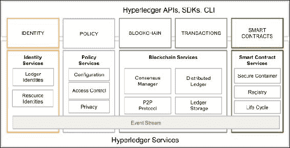

Hyperledger 架构，如 Hyperledger 白皮书的最新草案 V2.0.0 中所提议的。（来源：Hyperledger 白皮书）

## 要求

区块链服务有一定的要求。参考架构是由 Hyperledger 项目的参与者提出的需求和要求驱动的，并在研究行业使用案例后制定的。从对工业使用案例的研究中推导出了几类要求，并在以下章节中进行了讨论。

### 模块化方法

Hyperledger 的主要要求是具有模块化结构。预计，作为跨行业的 fabric（区块链），它将在许多业务场景中使用。因此，与存储、策略、链码、访问控制、共识和许多其他区块链服务相关的功能应该是可插拔的。这些模块应该是即插即用的，用户应该能够轻松地移除和添加满足业务需求的不同模块。

例如，如果一个企业区块链只需要在已经信任的各方之间运行，并执行非常基本的业务操作，那么也许就不需要为保密性和隐私性提供先进的加密支持，因此用户应该能够移除该功能（模块）或将其替换为更适合其需求的模块。同样，如果用户需要运行跨行业区块链，则保密性和隐私性可能至关重要。在这种情况下，用户应该能够将高级加密和访问控制机制（模块）插入到区块链（fabric）中。

### 隐私和保密性

交易和合同的隐私和保密性在商业区块链中至关重要。因此，Hyperledger 的愿景是提供各种加密协议和算法，并且预计用户将能够根据其业务需求选择适当的模块。该框架应能处理复杂的加密算法，而不会影响性能。

### 身份

为了提供隐私和机密性服务，还需要一个灵活的 PKI 模型，用于处理访问控制功能。密码机制的强度和类型也预计根据用户的需求和要求而有所不同。在某些场景中，可能需要用户隐藏其身份，因此预计 Hyperledger 将提供此功能。

### 可审计性

可审计性是 Hyperledger Fabric 的另一个要求。预计会保留所有身份、相关操作和任何更改的不可变审计追踪。

### 互操作性

目前有许多可用的区块链解决方案，但它们之间无法互相通信，这可能会限制区块链全球商业生态系统的增长。人们希望许多区块链网络将针对特定需求在商业世界中运作，但重要的是它们能够彼此通信。所有区块链都应遵循一套共同的标准，以便实现不同账本之间的通信。预计将开发一种协议，允许在许多模块之间交换信息。

### 可移植性

可移植性要求关注的是在多个平台和环境中运行而无需在代码级别进行任何更改的能力。预计 Hyperledger 将具有可移植性，不仅在基础设施级别，还包括代码、库和 API 级别，以便支持在各种 Hyperledger 实现中的统一开发。

# 模块

为了理解 Hyperledger 项目孵化中的各种项目，首先要了解 Hyperledger 的基础。在读者接触更深入的材料之前，有些特定于 Hyperledger 的术语需要一些澄清。首先是 Fabric 的概念。

Fabric 可以被定义为提供基础层的一组组件，用于构建区块链网络。Fabric 网络有各种类型和能力，但所有 Fabric 共享共同属性，如不可变性和共识驱动。一些 Fabric 可以提供模块化方法来构建区块链网络。在这种情况下，区块链网络可以具有多个可插拔模块，在网络上执行各种功能。例如，共识算法可以是区块链网络中的可插拔模块，根据网络的要求，可以选择并*插入*适当的共识算法到网络中。这些模块可以基于 Fabric 的某些特定规范，并包括 API、访问控制和各种其他组件。Fabric 也可以设计为私有或公开，并允许创建多个业务网络。例如，比特币是在其 Fabric（区块链网络）上运行的应用程序。如前所述，区块链可以是许可的或无许可的，对于 Hyperledger 术语中的 Fabric 也是`true`。

Fabric 也是 IBM 提交给 Hyperledger 基金会的代码贡献的名称，正式称为 Hyperledger Fabric。IBM 还通过其 Bluemix 云服务提供区块链即服务（IBM Blockchain）。

# Hyperledger Fabric

Fabric 最初是 IBM 对 Hyperledger 项目的贡献。这一贡献的目标是实现一种模块化、开放和灵活的构建区块链网络的方法。Fabric 中的各种功能是可插拔的，它还允许使用任何语言开发智能合约。这是可能的，因为它基于容器技术，可以托管任何语言。链代码（智能合约）被沙盒化到一个安全容器中，其中包括安全操作系统、链代码语言、运行时环境和用于 Go、Java 和 Node.js 的 SDK。如果需要，也可以支持其他语言。智能合约在 Fabric 中被称为链代码。与以太坊中的领域特定语言或比特币中非常有限的脚本语言相比，这是一个非常强大的功能。它是一个许可网络，旨在解决可扩展性、隐私和机密性等问题。其背后的关键思想是模块化技术，这将允许在设计和实现上灵活性。这可能会导致实现可扩展性、隐私和其他所需属性。Fabric 中的交易对于普通用户是私有的、机密的和匿名的，但它们仍然可以被授权的审计员追踪和与用户关联。作为一个许可网络，所有参与者都必须在成员服务中注册，以便访问区块链网络。这个分类帐还提供了审计功能，以满足监管和合规性需求。

## Fabric 架构

Fabric 在逻辑上分为基于提供的服务类型的三个主要类别。这包括会员服务、区块链服务和链码服务。在下一节中，将详细讨论所有这些类别和相关的组件。Hyperledger Fabric 的当前稳定版本为 v0.6，但最新版本 v1.0 可用，但尚未稳定。在 1.0 版本中，进行了许多架构更改，在本章后面的部分中也将讨论 1.0 版本中所做的一些更改。

### 会员服务

这些服务用于为织物网络的用户提供访问控制功能。接下来的列表显示了会员服务执行的功能:

1.  用户身份验证。

1.  用户注册。

1.  根据其角色为用户分配适当的权限。

会员服务利用**公钥基础设施**（PKI）以支持身份管理和授权操作。会员服务由各种组件组成:

+   **注册机构**（RA）：用于认证用户并评估织物参与者的身份以发放证书的服务。

+   **注册证书颁发机构**：**注册证书**（Ecerts）是由 ECA 颁发给注册参与者的长期证书，旨在为参与网络的实体提供身份识别。

+   **交易证书颁发机构**：为了在网络上发送交易，参与者需要持有交易证书。TCA 负责向注册证书持有者颁发交易证书，并从 Ecerts 派生。

+   **TLS 证书颁发机构**：为了确保在 Fabric 节点间的网络级通信安全，使用 TLS 证书。TLS 证书颁发机构颁发 TLS 证书，以确保在区块链网络上传递的消息的安全性。

### 区块链服务

区块链服务是 Hyperledger Fabric 的核心。此类别中的组件如下。

#### 共识管理器

共识管理器负责提供共识算法的接口。这充当一个适配器，接收来自其他 Hyperledger 实体的交易，并根据选择的算法类型执行它们。共识是可插拔的，当前在 Fabric 中有三种共识算法，分别是批处理 PBFT 协议、筛子算法和 NOOPS。

#### 分布式账本

区块链和世界状态是分布式账本的两个主要元素。区块链只是一个区块链表（如前几章介绍的）和世界账户是一个键值数据库。这个数据库被智能合约用来通过交易在执行期存储相关状态。区块链由包含交易的区块组成。这些交易包含链码，运行可以更新世界状态的交易。每个节点将世界状态保存在 RocksDB 中的磁盘上。以下图表显示了超级账本 Fabric 中一个典型区块及相关字段：

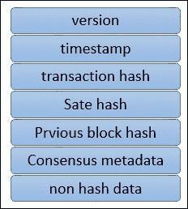

区块结构

上图中显示的字段如下：

+   **版本：** 用于跟踪协议更改的内容。

+   **时间戳：** UTC 时戳时间戳，由区块提议者更新。

+   **交易哈希：** 此字段包含区块中交易的默克尔根哈希。

+   **状态哈希：** 这是世界状态的 Merkle 根哈希。

+   **上一个哈希：** 这是之前区块的哈希，在序列化区块消息后计算，并应用 SHA3 SHAKE256 算法创建消息摘要。

+   **共识元数据：** 这是一个可选字段，用于共识协议提供有关共识的相关信息。

+   **非哈希数据：** 这是一些存储在区块中但未哈希的元数据。这个功能使得不同节点可以拥有不同的数据。它还提供了在不影响区块链的情况下丢弃数据的能力。

#### 点对点协议

超级账本 Fabric 中的 P2P 协议是使用**Google RPC**（**gRPC**）构建的。它使用协议缓冲区来定义消息的结构。

节点之间传递消息以执行各种功能。在超级账本 Fabric 中有四种主要类型的消息：发现、交易、同步和共识。当启动时，发现消息在节点之间交换，以发现网络上的其他对等方。

交易消息可分为两种类型：部署交易和调用交易。前者用于将新链码部署到账本上，后者用于调用智能合约中的函数。交易可以是公开的、机密的和机密链码交易。公开交易对所有参与者开放和可用。机密交易只允许交易所有者和参与者查询。机密链码交易具有加密链码，只有验证节点才能解密。验证节点运行共识、验证交易并维护区块链。非验证节点则提供交易验证、流媒体服务器和 REST 服务。它们还充当交易者和验证节点之间的代理。同步消息由节点用于保持区块链与其他节点同步更新。共识消息用于共识管理和向验证节点广播有效负载。这些消息由共识框架内部生成。

#### 账本存储

为了保存账本状态，使用 RocksDB，并且存储在每个对等节点上。 RocksDB 是一种高性能数据库，可在[`rocksdb.org/`](http://rocksdb.org/)获得。

### 链码服务

这些服务允许创建用于执行链码的安全容器。这个类别中的组件如下：

+   **安全容器：** 链码部署在为智能合约执行提供经过锁定的隔离环境的 Docker 容器中。目前支持 Golang 作为主要智能合约语言，但如果需要，可以添加和启用任何其他主流语言。

+   **安全注册表：** 这提供包含智能合约的所有映像的记录。

### 事件

区块链上的事件可以由验证节点和智能合约触发。外部应用程序可以通过事件适配器监听这些事件，并在需要时做出反应。它们类似于在上一章节中引入的 Solidity 的事件概念。

### API 和 CLI

应用程序编程接口通过暴露各种 REST API 提供对区块链的接口。此外，还提供了提供 REST API 子集并允许快速测试和有限与区块链交互的命令行接口。

## Fabric 的组件

区块链可以包括各种组件。 这些组件包括但不限于账本、链码、共识机制、访问控制、事件、系统监控和管理、钱包和系统集成组件。

### 对等节点

在 fabric 网络上可以运行两种主要类型的对等节点：验证的和非验证的。简单来说，验证节点运行共识，创建和验证交易，并有助于更新账本和维护链码。

非验证节点不执行交易，只构建交易，然后将其转发给验证节点。

两个节点都管理并维护了由成员服务发行的用户证书。

### 区块链上的应用

Fabric 上的典型应用通常由用户界面组成，通常是用 JavaScript/HTML 编写的，通过 API 层与存储在分类账上的后端链码（智能合同）交互。

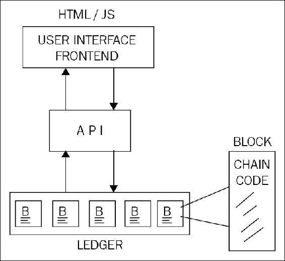

典型的区块链应用

Hyperledger 提供各种 API 和命令行界面以实现与分类账的互动。这些 API 包括身份、交易、链码、分类账、网络、存储和事件的接口。

#### 链码实现

链码通常是用 Golang 或 Java 编写的。链码可以是公共的、机密的或受控制的。这些代码充当用户可以通过 API 与之交互的智能合同。用户可以调用链码中的函数，导致状态改变，并因此更新分类账。还有一些函数仅用于查询分类账，不会导致任何状态改变。

首先通过在代码中创建链码 shim 接口来执行链码实现。它可以是 Java 或 Golang 代码。为了实现链码，需要以下四个函数：

+   `Init()`: 当链码部署到分类账上时，会调用此函数。这将初始化链码并导致状态改变，从而相应地更新分类账。

+   `Invoke()`: 当合同执行时，使用此函数。它以函数名和参数数组作为参数。此函数会导致状态改变并写入分类账。

+   `Query()`: 用于查询已部署链码的当前状态。此函数不会对分类账进行任何更改。

+   `Main()`: 当节点部署自己的链码副本时，将执行此函数。使用此函数向节点注册链码。

以下图表说明了 Hyperledger Fabric 的一般概要：

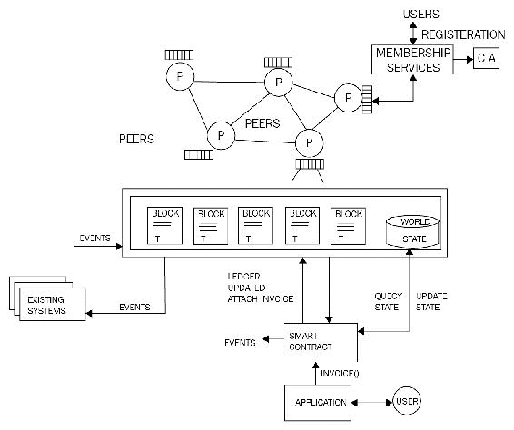

Hyperledger Fabric 的高层概览

#### 应用模型

对于 Hyperledger Fabric 的任何区块链应用程序都遵循 MVC-B 架构。这是基于流行的 MVC 设计模式。该模型中的组件包括模型、视图、控制和区块链：

+   **视图逻辑**：这与用户界面有关。它可以是桌面、Web 应用程序或移动前端。

+   **控制逻辑**：这是用户界面、数据模型和 API 之间的协调者。

+   **数据模型**：此模型用于管理链下数据。

+   **区块链逻辑**：这是通过控制器管理区块链和通过交易管理数据模型。

由于 Hyperledger 当前版本 v0.6 正在进行大规模重构以构建 V1.0，因此本节中没有引入实际的练习。

有望在本书出版时，有关 Hyperledger fabric 实际设置的信息可能已经过时。 因此，鼓励读者关注来自[`hyperledgerfabric.readthedocs.io/en/latest/`](https://hyperledgerfabric.readthedocs.io/en/latest/) 的更新。

此外，IBM Bluemix 服务提供了区块链示例应用，属于其区块链即服务。 它可以在[`console.ng.bluemix.net/docs/services/blockchain/ibmblockchain_tutorials.html`](https://console.ng.bluemix.net/docs/services/blockchain/ibmblockchain_tutorials.html) 上找到。 该服务允许用户在易于使用的环境中创建自己的区块链网络。

# 锯齿湖

锯齿湖可以在许可和非许可模式下运行。 它是一个分布式分类账，提出了两个新概念：第一个是介绍了一种名为**经过时间证明**（**PoET**）的共识算法；第二个是交易系列的概念。 对这些新提议的简要描述在下一节中给出。

## PoET

PoET 是一种新颖的共识算法，允许根据节点在提出区块之前等待的时间来随机选择节点。 这与其他基于领导选举和彩票的工作量证明算法形成对比，在这些算法中，为了被选为区块提议者，例如在比特币的情况下，需要使用大量电力和计算资源。 PoET 是一种工作量证明算法，但是，它不需要消耗计算资源，而是使用可信计算模型提供一种满足工作量证明要求的机制。 PoET 利用英特尔的 SGX 架构提供受信任的执行环境，以确保过程的随机性和密码安全性。 值得注意的是，锯齿湖目前的实现不需要真实的硬件 SGX 基于 TEE，因为它仅用于实验目的进行模拟，因此不应在生产环境中使用。

## 交易系列

传统的智能合约范式提供了一个基于所有领域的通用指令集的解决方案。 例如，在以太坊的情况下，已经开发了一组用于以太坊虚拟机（EVM）的操作码，可以用来构建解决任何行业需求的智能合约。 尽管这种模式有其优点，但明显可见这种方法并不是非常安全的，因为它为总账提供了一个强大且表达力强的单一接口，这可能为恶意代码提供了更大的攻击面。 这种复杂性和通用虚拟机范式最近已导致一些漏洞被黑客发现和利用。 最近的一个例子是 DAO 被黑客攻击，以及利用一些 EVM 操作码的限制进行**拒绝服务**（DoS）攻击。 下图描述了传统智能合约模型，其中使用通用虚拟机为所有领域提供了区块链的接口：

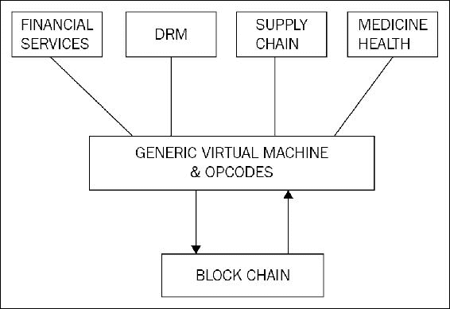

传统的智能合约范式

为了解决这个问题， Sawtooth lake 提出了交易族的概念。 交易族是通过将逻辑层分解成一组规则和特定领域的组合层来创建的。 其核心理念是将业务逻辑组合在交易族内，这提供了一种更安全、更强大的构建智能合约的方式。 交易族包含特定领域的规则以及另一个允许为该领域创建交易的层。 另一种看待它的方式是，交易族是数据模型和实现特定领域逻辑层的交易语言的组合。 数据模型代表了区块链（总账本）的当前状态，而交易语言修改总账本的状态。 预期用户将根据其业务需求构建自己的交易族。

下图代表了这一模型，其中每个特定领域，如金融服务、数字版权管理（DRM）、供应链和健康行业，都有其自己的逻辑层，包括特定于该领域的操作和服务。 这使得逻辑层既限制又强大。 交易族可以确保仅包含与所需领域相关的操作，从而消除执行不需要的、任意的和潜在有害操作的可能性。

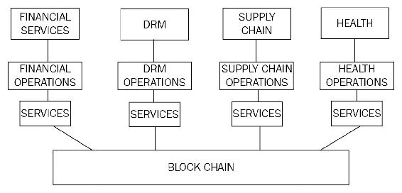

Sawtooth（交易族）智能合约范式

英特尔已经为 Sawtooth 提供了三个交易族：端点注册、Integerkey 和市场。

1.  **端点注册** 用于注册账本服务。

1.  **Integerkey** 用于测试已部署的账本。

1.  **MarketPlace** 用于销售、购买和交易操作和服务。

`Sawtooth_bond` 已开发为证明概念，以演示债券交易平台。它可在 [`github.com/hyperledger/sawtooth-core/tree/master/extensions/bond`](https://github.com/hyperledger/sawtooth-core/tree/master/extensions/bond) 上获得。

## Sawtooth 中的共识

Sawtooth 根据网络选择具有两种类型的共识机制。如前所述，PoET 是基于信任执行环境的抽奖功能，根据节点等待区块提议的时间随机选择领导者。还有另一种称为 quorum 投票的共识类型，这是由 Ripple 和 Stellar 构建的共识协议的一种适应。这种共识算法允许即时交易最终性，这在权限网络中通常是可取的。

## 开发环境

本节介绍了如何为 Sawtooth lake 设置开发环境的快速介绍。为了设置开发环境，需要一些先决条件。本节中的示例假定正在运行 Ubuntu 系统并具有以下内容：

1.  `vagrant`，至少版本 1.9.0，在 [`www.vagrantup.com/downloads.html`](https://www.vagrantup.com/downloads.html) 上可用。

1.  Virtual box，至少 5.0.10 r104061，在 [`www.virtualbox.org/wiki/Downloads`](https://www.virtualbox.org/wiki/Downloads) 上可用。

一旦上述两个先决条件成功下载并安装，下一步是克隆存储库。

```
$ git clone https://github.com/IntelLedger/sawtooth-core.git

```

这将产生类似以下截图的输出：

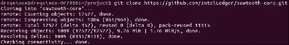

GitHub Sawtooth 克隆

一旦 Sawtooth 正确克隆，下一步是启动环境。首先，运行以下命令将目录更改到正确位置，然后启动`vagrant`箱：

```
$ cd sawtooth-core/tools
$ vagrant up

```

这将产生类似以下截图的输出：

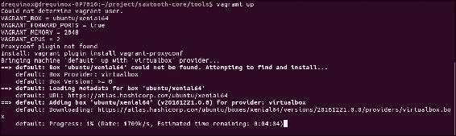

Vagrant up 命令

如果在任何时候需要停止 Vagrant，则可以使用以下命令：

```
$ vagrant halt

```

或者

```
$ vagrant destroy

```

停止`vagrant`机器的 halt，而 destroy 将停止并删除`vagrant`机器。

最后，可以使用以下命令启动交易验证器。首先`ssh`进入`vagrant` Sawtooth 箱。

```
$ vagrant ssh

```

当`vagrant`提示可用时，运行以下命令。

首先使用以下命令构建`Sawtooth`湖核心：

```
$ /project/sawtooth-core/bin/build_all

```

构建成功后，为了运行交易验证器，发出以下命令：

```
$ /project/sawtooth-core/docs/source/tutorial/genesis.sh

```

这将创建创世区块并清除任何现有的数据文件和密钥。这应该显示类似以下截图的输出：

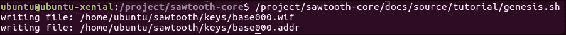

创建创世区块和生成密钥

下一步是运行交易验证器，并按照以下所示更改目录：

```
$ cd /project/saw-toothcore

```

运行交易验证器：

```
$ ./bin/txnvalidator -v -F ledger.transaction.integer_key --config /home/ubuntu/sawtooth/v0.json

```

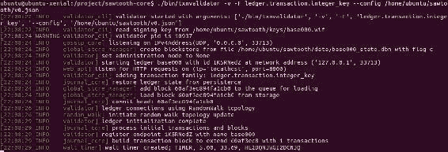

运行交易验证器

通过按下*Ctrl* + *C*组合键停止验证器节点。一旦验证器正常运行，就可以在另一个终端窗口中启动各种客户端来与交易验证器进行通信并提交交易。

例如，在下面的屏幕截图中，市场客户端已启动，准备与交易验证器进行通信。请注意，通过以下命令创建`/keys/mkt.wif`下的密钥：

```
./bin/sawtooth keygen --key-dir validator/keys mkt

```

此演示只是从 Sawtooth Lake 文档衍生的基本示例。但是，使用 Sawtooth Lake 进行开发是一个非常复杂的过程，完整的章节都可以专门讨论这个问题。

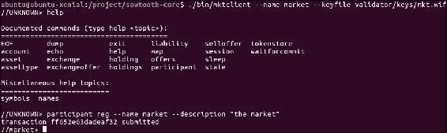

用于市场交易家族的市场客户端

Sawtooth Lake 也在持续发展，因此建议读者留意[`intelledger.github.io/`](http://intelledger.github.io/)上的文档，以便了解最新的发展动态。

# Corda

Corda 不是一个区块链。传统的区块链解决方案，正如前面讨论的，有将交易捆绑在一起形成一个区块的概念，每个区块都与其父区块进行密码学连接，这样就提供了不可变的交易记录。但 Corda 并非如此：Corda 完全从零开始设计，提供了一种全新的模型来提供所有区块链的好处，但没有传统的区块链。它纯粹是为金融行业开发的，旨在解决由于每个组织都管理自己的总账而产生的*真相*的不同视图，导致了矛盾和运营风险。此外，数据也会在每个组织中复制，这导致了管理各自基础设施和复杂性成本的增加。这些都是 Corda 旨在通过搭建一个分布式数据库平台来解决的金融行业内的问题。

Corda 源代码可以在[`github.com/corda/corda`](https://github.com/corda/corda)找到。它是用一种叫做 Kotlin 的语言编写的，这是一种针对**Java 虚拟机**（**JVM**）的静态类型语言。

## 架构

Corda 平台的主要组件包括状态对象、合同代码、法律文书、交易、共识和流程。

### 状态对象

状态对象代表表示金融协议的最小数据单位。它们是作为交易执行的结果创建或删除的。它们引用**合同代码**和**法律文书**。法律文书是可选的，并为合同提供法律约束。但是，合同代码是强制性的，以便管理对象的状态。它是根据合同代码中定义的业务逻辑为节点提供状态转换机制所必需的。状态对象包含表示对象当前状态的数据结构。例如，在下图中，状态对象表示对象的当前状态。在这种情况下，它是**甲方 A**和**乙方 B**之间的简单模拟协议，其中**甲方 ABC**已支付**乙方 XYZ****1,000 GBP**。这代表了对象的当前状态；但是所引用的合同代码可以通过交易改变状态。状态对象可以被视为状态机，它们被交易消耗以创建更新的状态对象。

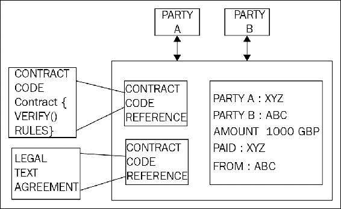

一个状态对象示例

### 交易

交易用于在不同状态之间执行转换。例如，前图所示的状态对象是作为交易的结果创建的。Corda 使用类比特币的 UTXO 模型进行交易处理。交易通过交易进行状态转换的概念与比特币相同。与比特币类似，交易可以有零、单个或多个输入，以及单个或多个输出。所有交易都是数字签名的。此外，Corda 没有挖矿的概念，因为它不使用区块来安排区块链上的交易。相反，记账服务用于提供交易的时间顺序。在 Corda 中，可以使用 JVM 字节码开发新的交易类型，这使其非常灵活和强大。

### 共识

Corda 中的共识模型相当简单，基于稍后讨论的记账服务。其一般思路是通过记账服务评估交易的唯一性，如果它们是唯一的，就会被签署为有效的。Corda 网络上可以运行单个或多个集群记账服务。记账服务可以使用各种共识算法如 PBFT 或 Raft 达成共识。

Corda 共识有两个主要概念：关于状态有效性的共识，以及关于状态唯一性的共识。第一个概念涉及交易的验证，确保所有必需的签名都可用且状态适当。第二个概念是检测双花攻击的手段，并确保交易尚未被花费且唯一。

### 流程

Corda 中的流程是一种新颖的概念，它允许开发分散式工作流程。Corda 网络上的所有通信都由这些流程处理。这些是可以使用代码定义任何复杂的金融流程的交易构建协议。流程作为异步状态机运行，并且与其他节点和用户进行交互。在执行过程中，它们可以根据需要暂停或恢复。

## 组成部分

Corda 网络有多个组件。所有这些组件在下一节中有描述。

### 节点

Corda 网络中的节点以无信任模型运行，并由不同的组织运行。节点作为经过身份验证的点对点网络的一部分运行。节点使用经过认可的国际标准（ISO/IEC 19464）**高级消息队列协议**（**AMQP**）直接与彼此通信，确保跨不同节点的消息安全地和安全地传输。AMQP 在 Corda 中通过 **传输层安全**（**TLS**）工作，从而确保了节点之间通信的隐私和数据的完整性。

节点还使用本地关系数据库进行存储。网络上的消息以紧凑的二进制格式进行编码。它们通过 **Apache Artemis message broker** （**Active MQ**）进行传递和管理。节点可以作为网络地图服务、公证机、Oracle 或常规节点。下图显示了两个节点相互通信的高级视图：

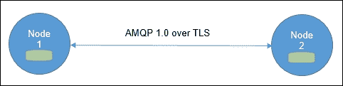

在 Corda 网络中通信的两个节点

在上面的图表中，**Node 1**通过 AMQP 协议在 TLS 通信信道上和**Node 2**进行通信，节点有一个本地关系数据库用于存储。

### 权限服务

权限服务用于提供安全的 TLS 证书。为了参与网络，参与者需要由根证书颁发机构签发的签名身份。网络上的身份需要是唯一的，权限服务用于签署这些身份。用于识别参与者的命名约定基于 X.500 标准。这确保了名称的唯一性。

#### 网络地图服务

此服务用于提供网络地图，形式为网络上所有节点的文件。此服务发布 IP 地址、身份证书和节点提供的服务列表。当节点首次启动时，所有节点通过注册到此服务来宣布其存在，在节点接收到连接请求时，首先在网络地图中检查请求节点的存在。换句话说，此服务解析参与者的身份至物理节点。

#### 公证服务

在传统的区块链中，挖矿用于确定包含交易的块的顺序。在 Corda 中，公证服务用于提供交易排序和时间戳服务。网络中可以有多个公证人，并通过组合公钥进行标识。公证服务可以根据应用程序的要求使用不同的共识算法，如 BFT 或 Raft。公证服务签署交易以指示交易的有效性和最终性，然后将其持久化到数据库中。

为了将负载分布在节点之间以提高性能，公证人可以以负载平衡的配置方式运行；为了减少延迟，建议节点在物理上靠近交易参与者。

#### Oracle 服务

Oracle 服务要么对包含事实的交易进行签名（如果事实为真），要么可以自己提供事实数据。它们允许真实世界的信息进入分布式账本。

#### 交易

Corda 网络中的交易永远不会全球传输，而是在半私密网络中进行。它们仅在与交易相关的参与者子集之间共享。这与传统的像以太坊和比特币这样的区块链解决方案形成对比，其中所有交易都会全球广播到整个网络。交易被数字签名，要么消耗状态，要么创建新状态。

Corda 网络上的交易由以下元素组成：

+   **输入引用**：这是指交易将要消耗和使用的状态的引用。

+   **输出状态**：这些是交易创建的新状态。

+   **附件**：这是附加的 zip 文件哈希列表。Zip 文件可以包含与交易相关的代码和其他相关文档。文件本身不作为交易的一部分，而是单独传输和存储。

+   **命令**：命令表示交易的预期操作的信息，作为合同的参数。每个命令都有一个公钥列表，表示需要签署交易的所有参与方。

+   **签名**：这表示交易所需的签名。所需签名的总数与命令的公钥数量成正比。

+   **类型**：交易有两种类型，即正常或更改公证。更改公证的交易用于重新分配状态的公证。

+   **时间戳**：此字段表示交易发生的时间段。这些时间戳由公证服务验证和执行。此外，如果需要严格的时间限制，这在许多金融服务场景中是可取的，公证应与原子钟同步。

+   **摘要**：这是描述交易操作的文本描述。

#### 保险库

保险库在一个节点上运行，类似于比特币中的钱包概念。由于交易不是全球广播的，因此每个节点只会在它们的保险库中存储对他们而言被认为是相关的数据部分。保险库将它们的数据存储在标准的关系数据库中，因此可以使用标准的 SQL 进行查询。保险库可以包含在账本上和离账本上的数据，这意味着它也可以有一些不在账本上的数据部分。

#### CorDapp

Corda 的核心模型包括状态对象、交易和交易协议，当结合合约代码、API、钱包插件和用户界面组件时，形成一个 **Corda 分布式应用程序**（**CorDapp**）。

Corda 中的智能合约使用 Kotlin 或 Java 编写。代码针对 JVM。 JVM 已经略微修改，以实现 JVM 字节码执行的确定性结果。 Corda 智能合约有三个主要组件，如下所示：

1.  可执行代码定义了验证逻辑，用于验证对状态对象的更改。

1.  状态对象表示合约的当前状态，并且可以被交易消耗或由交易产生（创建）。

1.  命令用于描述操作和验证数据，以定义如何验证交易。

## 开发环境

Corda 的开发环境可以通过以下步骤轻松设置。

必需软件包括以下内容：

1.  JDK 8，可在 [`www.oracle.com/technetwork/java/javase/downloads/index.html`](http://www.oracle.com/technetwork/java/javase/downloads/index.html) 下载。

1.  免费的 IntelliJ IDEA 社区版可在 [`www.jetbrains.com/idea/download`](https://www.jetbrains.com/idea/download) 下载。

1.  H2 数据库是一个平台无关的 zip 包，可从 [`www.h2database.com/html/download.html`](http://www.h2database.com/html/download.html) 下载。

1.  Git，可从 [`git-scm.com/downloads`](https://git-scm.com/downloads) 下载。

1.  Kotlin 语言，可用于 IntelliJ，更多信息可在 [`kotlinlang.org/`](https://kotlinlang.org/) 找到。

1.  Gradle 是另一个用于构建 Corda 的组件。

安装了所有这些工具后，可以开始智能合约开发。可以利用 [`github.com/corda/cordapp-template`](https://github.com/corda/cordapp-template) 上提供的示例模板来开发 CorDapps。有关如何开发合约代码的详细文档，请参阅 [`docs.corda.net/`](https://docs.corda.net/)。

可使用以下命令从 GitHub 克隆 Corda：

```
$ git clone https://github.com/corda/corda.git

```

当克隆成功时，您应该看到类似以下的输出：

```
Cloning into 'corda'...
remote: Counting objects: 74695, done.
remote: Compressing objects: 100% (67/67), done.
remote: Total 74695 (delta 17), reused 0 (delta 0), pack-reused 74591
Receiving objects: 100% (74695/74695), 51.27 MiB | 1.72 MiB/s, done.
Resolving deltas: 100% (42863/42863), done.
Checking connectivity... done.

```

一旦仓库被克隆，就可以在 IntelliJ 中打开进行进一步开发。仓库中有多个示例，如 Corda 的银行、利率互换、演示和交易者演示。读者可以在 `corda` 的 `/samples` 目录下找到它们，并可以使用 IntelliJ IDEA IDE 进行探索。

# 摘要

在本章中，我们介绍了 Hyperledger 项目。首先，讨论了 Hyperledger 项目背后的核心思想，并简要介绍了 Hyperledger 孵化中的所有项目。详细讨论了三个主要的 Hyperledger 项目，分别是 Hyperledger Fabric、Sawtooth Lake 和 Corda。所有这些项目目前都在积极开发中，预计下一版本会有所变化。因此，本章未提供深入的实践练习。然而，上述所有项目的核心概念预计将保持不变，或仅进行非常小的更改。鼓励读者访问本章提供的相关链接，以获取最新更新。显然，这个领域正在发生很多事情，像来自 Linux 基金会的 Hyperledger 这样的项目在推动区块链技术的发展中起着关键作用。本章讨论的每个项目都对解决各行业面临的问题有新颖的方法，并且正在解决区块链技术中的当前限制，如可扩展性和隐私性。预计将很快向 Hyperledger 项目提出更多项目，并预计通过这种协作和开放的努力，区块链技术将得到极大推进，并将使整个社区受益。
